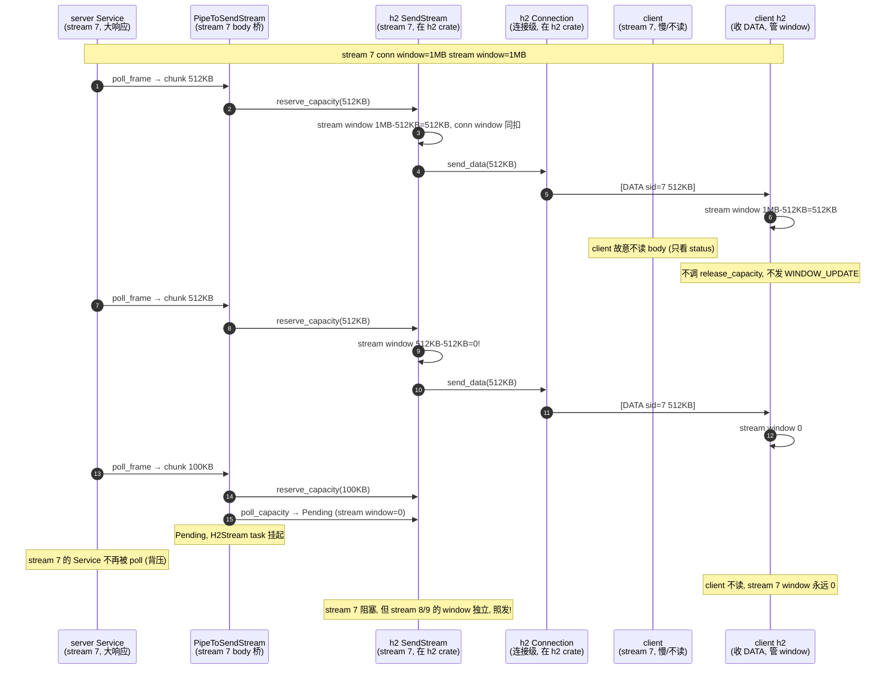
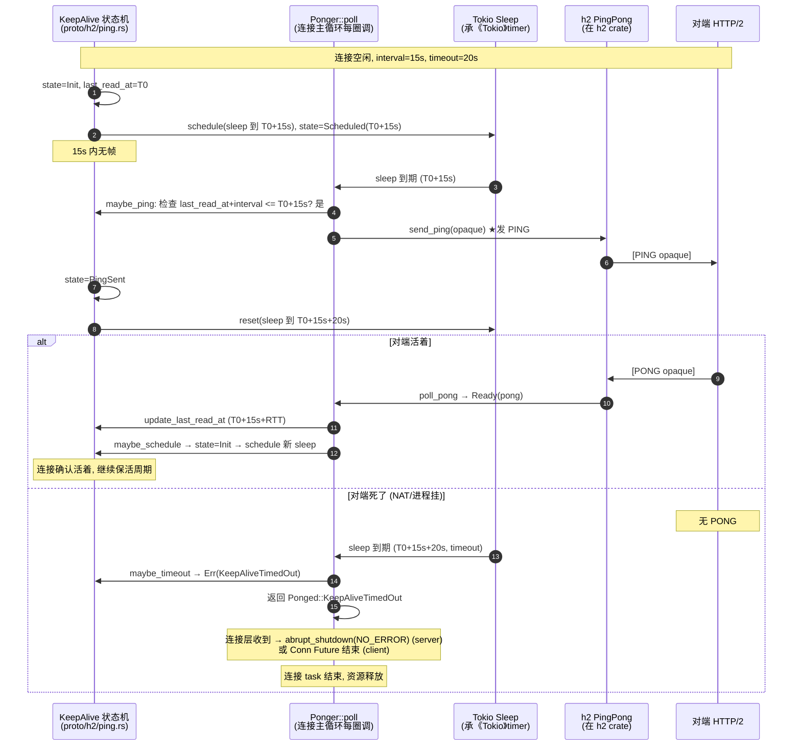

# 第 3 篇 · 第 11 章 · HTTP/2 ping 与流控

> **核心问题**:第 10 章把请求映射成 stream、把 body 桥到 h2 的 `SendStream`/`RecvStream` 都拆透了——可一条连接上几百个 stream 并发,新的问题冒出来:① 一个慢消费者(stream 的 body 半天不读)怎么不让它把整条连接的内存撑爆?反过来,一个慢生产者怎么不让对端的发送方饿死?② 这条 HTTP/2 连接明明没收到任何字节,你怎么知道对端是"暂时没话说"还是"已经死了"(比如 NAT 超时把连接静默掐了,或者对端的进程挂了但 TCP 没发 RST)?HTTP/2 协议给了两件武器:**流控(window,防淹没)** 和 **PING 帧(探活,测 RTT)**。但流控的算法、PING 的策略,在 hyper 里到底归谁管——是 h2 crate 还是 hyper 自己?hyper 在 h2 的流控和 ping 之上,又加了什么自己的策略?为什么 hyper 要在应用层自己做 keep-alive(明明 TCP 也有 keepalive)?自适应 window(adaptive_window)凭什么不误判?这一章回答这些问题,把第 3 篇的 HTTP/2 三章收尾闭环。

> **读完本章你会明白**:
> 1. 为什么 HTTP/2 的流控分**连接级 window 和 stream 级 window 两层**,以及它们各自防什么——连接级 window 防"整条连接被一个快对端淹死",stream 级 window 防"一条慢 stream 把别的 stream 挤死";hyper 在这上面做了什么(`set_target_window_size`/`set_initial_window_size` 调连接级初始 window,`release_capacity`/`reserve_capacity`/`poll_capacity` 透传给 h2 管 stream 级 window)。
> 2. hyper 为什么在**应用层**自己做 keep-alive PING,而不是依赖 TCP keepalive——因为 HTTP/2 经常跑在 TLS、HTTP CONNECT 代理、L7 负载均衡器之后,TCP 层的 keepalive 看到的"对端"是代理不是真实 server,TCP keepalive 通了不代表 server 还活着;hyper 周期发应用层 PING,PONG 超时就把连接关死,防连接泄漏。
> 3. **自适应 window(adaptive_window)的 BDP 算法**怎么用 PING 的 RTT 估算带宽延迟积(BDP),动态把连接级 window 调到"刚好填满管道",对照 gRPC 的 BDP 估计算法(承《gRPC》第 2 篇一句带过),以及 hyper 的实现为什么 sound(带 BDP_LIMIT 上限、stable_count 滞回、ping_delay 退避防 ping 风暴)。
> 4. hyper 在 h2 之上做的策略层是什么、h2 做的协议层是什么——**h2 做协议层的 window 扣减/WINDOW_UPDATE 发送/PING 帧收发;hyper 做 keep-alive 周期与超时策略、BDP 估算与 window 调整策略**,诚实讲清这条边界,不把 h2 的东西误当 hyper 的。
> 5. 为什么 HTTP/2 的流控比 HTTP/1 的 `in_flight` 单槽背压精细得多——HTTP/1 靠"同时只允许一个 in_flight 请求"做粗粒度背压,HTTP/2 靠 per-stream + connection 两层 window 精细到字节,能"慢 stream 背压、快 stream 照跑"。

> **如果一读觉得太难**:先抓三件事——① 流控分两层(stream window + connection window),都在 h2 crate 实现,hyper 只调 h2 的 API(`reserve_capacity`/`poll_capacity`/`release_capacity`)透传,流控机制承《gRPC》第 2 篇一句带过;② hyper 在 `proto/h2/ping.rs` 自己写了 keep-alive(周期发 PING,超时关连接)和 adaptive_window(用 PING 的 RTT 估 BDP,动态调 connection window)两套策略;③ keep-alive 在应用层做是因为 HTTP/2 经常穿代理/TLS,TCP keepalive 不可靠。这三条钉住,第 3 篇就闭环了。

---

## 〇、一句话点破

> **HTTP/2 给了两件武器——流控(window)防淹,PING 帧探活。两件的协议机制(WINDOW_UPDATE 扣减恢复、PING 帧格式、两层 window)全在 h2 crate 实现(承《gRPC》第 2 篇拆透,本章一句带过指路)。hyper 在 `proto/h2/ping.rs` 自己写的,是两套"策略":keep-alive 策略(周期发 PING,等不到 PONG 就关连接,防代理后的静默死连)和 adaptive_window 策略(用 PING 的 RTT 估 BDP,动态把 connection window 调到刚好填满管道)。一行字:协议机在 h2,机制承 gRPC,策略在 hyper,定时器承 Tokio,hyper 在中间做的是"把 h2 的 ping-pong 原语 + Tokio 的 timer,缝成两套应用层策略"。**

这是结论。本章倒过来拆:先把"为什么 HTTP/2 一条连接几百个 stream 会带来淹没/死连接两个新问题"讲清(承 P3-10),再看流控协议机制怎么解淹没(机制承《gRPC》第 2 篇一句带过,hyper 怎么调 h2 的 API 透传是重点);然后回答"为什么 TCP keepalive 不够、hyper 要在应用层自己做 PING 保活"这个核心动机;接着钻进 `proto/h2/ping.rs` 看 keep-alive 状态机和 BDP 估算算法的真实实现;再讲 hyper 怎么把 Ponger 挂进 server/client 两条连接路径(挂法还不同——server 在 `Serving` 里直接 poll,client 把 Ponger 包进独立的 `Conn` Future task);最后讲为什么这套设计 sound(PING 超时能关死连接防泄漏、流控防淹又不饿死、BDP 不误判)。

> **承接《gRPC》(本章最重的承接)**:HTTP/2 的流控协议(WINDOW_UPDATE 帧格式、连接级和 stream 级两层 sliding window、初始 window、流控死锁)、HPACK、PING 帧的字节结构、SETTINGS 的 initial window size 协商——这些协议级机制在《gRPC》第 2 篇(尤其 P2-09 流控章,用 chttp2 的 C 代码拆到字节)已经拆透,本章**一句带过 + 指路**,不重讲 WINDOW_UPDATE 怎么扣怎么补的字节细节。本章只回答"hyper 在 h2 的流控之上做了什么策略、为什么 sound"。读到"为什么 window 分两层""WINDOW_UPDATE 什么时候发"这种问题悬着,翻《gRPC》P2-09 补。

> **承接《Tokio》**:本章所有的定时(`KeepAlive` 里的 `sleep`、`timer.reset`、`Bdp` 的 `ping_delay`)全用 Tokio 的 `tokio::time`(Sleep/Instant/Interval),承《Tokio》拆透的 timer 时间轮——一句带过。hyper 的贡献是"把 Tokio 的 timer + h2 的 ping-pong 缝成策略",不重讲 timer。

---

## 一、两条 HTTP/2 连接的隐疾:淹没与静默死

第 10 章把请求映射成 stream、body 桥到 h2 都讲透了。可一旦一条连接上跑起几百个并发 stream,两个 HTTP/1 没有的新问题就冒出来。这两个问题是本章一切设计的动机,先讲清。

### 1.1 淹没:一个慢消费者怎么不撑爆连接内存

设想 server 端:一条 HTTP/2 连接上并发跑 200 个 stream,每个 stream 是一个 axum handler。其中一个 handler(`stream 7`)要往 client 推一个 1GB 的大响应体——但 client 的网络很慢(手机 4G,只有 100KB/s),或者干脆 client 故意只 `reqwest` 读响应头、不读 body(比如 client 先看 status code 决定要不要 body)。

如果没有任何流控,会发生什么?server 的 `H2Stream`(`server.rs:367`)的 `PipeToSendStream`(`mod.rs:95`)会从 Service body 里 `poll_frame` 把 1GB 的 chunk 一股脑 push 进 h2 的 `SendStream`,`SendStream` 把它编成 DATA 帧写到 socket——可 socket 写不出去(client 慢),TCP 自己的发送 buffer 满了,`poll_write` 返回 `Pending`,task 挂起。但 h2 在 `SendStream` 和 socket 之间还有一层 buffer(DATA 帧编好了还没发出去的队列),这个 buffer 会越堆越大——1GB body 全在内存里,server OOM。

反过来也一样:client 上传大 body 到 server,server 的 handler 故意不读 body(读完就丢),那 server 端的 `RecvStream` buffer 会堆满 client 发来的 DATA 帧,server 内存爆。

> **不这样会怎样**:没有流控,HTTP/2 的多路复用就是个"内存炸弹"——一个慢连接/慢消费者就能把 server 内存吃光。HTTP/1 没这个问题,是因为 HTTP/1 一条连接同时一个请求,慢了就慢了,顶多卡住一条连接,不会一条连接的 200 个 stream 同时被一个慢 stream 拖垮。

这个"快生产者淹死慢消费者"的问题,就是**流控(flow control)** 要解决的。HTTP/2 协议设计了**两层 sliding window** 机制防它——连接级 window 和 stream 级 window。机制承《gRPC》P2-09,这里只点出"两层各防什么":

- **连接级 window**:整条 TCP 连接共享一个 window(初始 65535,hyper 配 1MB / 5MB)。每发一个 DATA 帧的 N 字节,发送方的 connection window 减 N;接收方处理完 N 字节,发 WINDOW_UPDATE 帧告诉发送方"我处理完了,window 补 N"。window 减到 0,整条连接的所有 stream 都发不出 DATA。
- **stream 级 window**:每条 stream 独立一个 window(同理初始 65535,hyper 配 1MB / 2MB)。stream 7 的 window 减到 0,只有 stream 7 发不出 DATA,stream 8/9/... 照常发。

> **钉死这件事**:两层 window 的分工是——**stream window 防"一条慢 stream 淹没连接"**(慢 stream 的 window 自己减到 0,别的 stream 不受影响),**connection window 防"对端整体不读撑爆发送方"**(对端整体不读,connection window 减到 0,发送方所有 stream 都 Pending,等对端读)。这两层一组合,既防了"单 stream 慢",又防了"整体不读"。这套机制的扣减/恢复/WINDOW_UPDATE 发送,**全在 h2 crate 实现**,hyper 一行没写——hyper 只调 h2 的 API 透传(下面 1.3 拆)。

### 1.2 静默死:连接断了你怎么知道

第二个问题更隐蔽。HTTP/2 连接经常是长连接(keep-alive,一条连接跑几分钟到几小时,复用握手)。可互联网上"连接断了"这件事,经常是**静默**的——TCP 层根本不会通知你:

- **NAT 超时**:家宽路由器/运营商的 NAT 表项,如果一条连接长时间没数据流过(典型 30 秒到 5 分钟),NAT 会把这条表项删了。client 和 server 的 TCP socket 都还开着(没收到 RST/FIN),但中间的 NAT 已经不转发了——client 发的 PING 帧(应用层)到不了 server,server 发的也到不了 client,双方都以为连接还在,实际已经死了。
- **L4/L7 代理静默掐**:AWS ALB、nginx、Envoy 这些负载均衡器,对空闲连接有 idle timeout(默认 60 秒到 10 分钟不等),超了会**静默关 TCP**(不发 FIN 给后端,或者 FIN 在网络里丢了)。后端的 hyper server 还以为连接活着,task 占着内存等数据。
- **进程崩了但 TCP 没发 RST**:对端的进程被 `kill -9` 或者 panic 了,某些情况下 OS 不会发 RST(比如机器直接断电、内核 panic),TCP 层看不到任何东西。
- **半开连接**:网络中间设备重启、wifi 切换,client 重连了但 server 这边的旧 socket 还挂着。

这些场景的共同点:**TCP socket 看起来是开的,但实际已经不通了**。如果 hyper 什么都不做,这些"静默死"的连接会在 server 端堆成山——每条占一个 Tokio task(几 KB)、占 h2 的连接状态(几 KB)、占 fd。10 万条静默死连接就是几百 MB 内存 + fd 耗尽,server 早晚挂。

> **不这样会怎样**:没有应用层探活,长连接 server 会被静默死连接慢慢拖垮。这和 HTTP/1 的 keep-alive 连接泄漏是一个问题(承 P2-05 的 `KBucket` 连接淘汰),但 HTTP/2 更严重——一条 HTTP/2 连接上挂着几百个 stream,泄漏一条等于泄漏几百个"潜在请求槽"。

这个"怎么知道连接还活着"的问题,就是 **PING 帧探活** 要解决的。HTTP/2 协议给了一个连接级 PING 帧——A 发一个 PING(带 8 字节 opaque payload),B 收到必须立刻回一个 PONG(payload 一样)。这是一个轻量的、应用层的、不依赖 TCP 的探活原语。hyper 在 `proto/h2/ping.rs` 写的 keep-alive 策略,就是周期发 PING,等不到 PONG 就判定连接死了,关掉。

### 1.3 流控协议在 h2,hyper 调 API 透传

钉死了"流控防淹、PING 探活"两个动机,接下来要分清:**协议机制在 h2,策略在 hyper**。这条边界不划清,读源码会一团乱。

**协议层(h2 crate,本章不深入)**:
- WINDOW_UPDATE 帧的格式、发送时机(承《gRPC》P2-09)。
- connection window 和 stream window 的扣减、恢复(每发/收 N 字节 DATA,window ±N)。
- PING 帧的收发、PONG 帧的回(承《gRPC》第 2 篇)。
- SETTINGS 协商 initial window size(承《gRPC》第 2 篇)。

**hyper 怎么调 h2 的 API 透传流控**(在 hyper 源码里能看到):

接收端(server 收请求 body / client 收响应 body),hyper 把 h2 的 `RecvStream` 包成 `Incoming` body(`body/incoming.rs:154`),它的 `poll_frame`(`incoming.rs:236`)每读一帧 body 就调 h2 的 `release_capacity`:

```rust
// hyper/src/body/incoming.rs:235-261 (摘录, 简化, 承 P3-10)
Kind::H2 { recv: ref mut h2, .. } => {
    match ready!(h2.poll_data(cx)) {                    // ★ h2 的 API, 拿一帧 body
        Some(Ok(bytes)) => {
            let _ = h2.flow_control().release_capacity(bytes.len());  // ★ 流控: 告诉 h2 "我读过了"
            // ...
            return Poll::Ready(Some(Ok(Frame::data(bytes))));
        }
        // ...
    }
}
```

`release_capacity(N)` 是 h2 的 API(在 h2 crate)——它告诉 h2"这 N 字节我已经处理完了,可以发 WINDOW_UPDATE 给对端补 window"。如果上层 Service 故意不读 body(比如 `body.collect()` 都不调,直接 return response),`poll_data` 根本不会被调,`release_capacity` 也不会发,body 的 window 一直减不补——这就是"慢消费者不读,window 耗尽,生产方 Pending"的背压链。这条链**完全是 h2 的流控 + hyper 的"读时才 release"自然形成的**,hyper 没写一行流控算法。

发送端(server 发响应 body / client 发请求 body),hyper 用 `PipeToSendStream`(`mod.rs:95`,承 P3-10)把 body 流到 h2 的 `SendStream`。它调 h2 的 `reserve_capacity`/`poll_capacity`/`send_data`:

```rust
// hyper/src/proto/h2/mod.rs:189-228 (摘录, 简化, 承 P3-09 技巧二)
match ready!(me.stream.as_mut().poll_frame(cx)) {     // 先 poll body chunk
    Some(Ok(frame)) if frame.is_data() => {
        let chunk = frame.into_data().unwrap();
        let len = chunk.remaining();
        me.body_tx.reserve_capacity(len);              // ★ poll chunk 后才 reserve 恰好大小
        *me.buffered_data = Some(Peeked { data: chunk, .. });
    }
    // ...
}
// 下一圈循环: 等 capacity 到位再 send_data
```

`reserve_capacity(N)`/`poll_capacity`/`send_data` 全是 h2 的 API。hyper 的贡献是"用对的顺序调它们"(poll chunk 后才 reserve,防死锁,承 P3-09 技巧二),不是实现流控算法。

> **钉死这件事**:流控协议(window 扣减/WINDOW_UPDATE/PING 帧格式)在 h2,hyper 一行没写。hyper 做的是**策略层**——keep-alive(周期发 PING 探活,超时关连接)、adaptive_window(用 PING 的 RTT 估 BDP,动态调 connection window)。下面几节拆这两套策略,它们才是 hyper 在 `proto/h2/ping.rs` 真正自己写的东西。流控的协议机制,翻《gRPC》P2-09。

---

## 二、为什么 TCP keepalive 不够,hyper 要在应用层做 PING

这一节回答一个核心动机问题:**为什么 hyper 不直接用 TCP keepalive 探活,非要在应用层发 PING 帧?** 这个问题不答清,读者会觉得 hyper 自己写一套 keep-alive 是多此一举。

### 2.1 TCP keepalive 是什么样

先复习 TCP keepalive(这是传输层机制,不是 hyper 的事,只是对照)。Linux 默认 TCP keepalive 三个参数:

- `tcp_keepalive_time`:连接空闲多久后开始发 keepalive 探测包,默认 **7200 秒(2 小时)**。
- `tcp_keepalive_intvl`:探测包没回应,隔多久再发,默认 **75 秒**。
- `tcp_keepalive_probes`:连续几个探测包没回应就判定连接死,默认 **9 次**。

也就是说,Linux 默认一条 TCP 连接静默 2 小时才开始探活,9 次探测失败(再 11 分钟)才判定死——加起来 **2 小时 11 分钟**才把一条死连接清掉。这个默认值对 HTTP 长连接来说**太慢了**(生产环境早被静默死连接堆爆了)。

当然可以调(`setsockopt(SO_KEEPALIVE)` + `TCP_KEEPIDLE/INTVL/CNT`),把 2 小时调成几十秒。但调了 TCP keepalive,hyper 还是不敢依赖它,原因是 2.2 的几个场景。

### 2.2 TCP keepalive 不可靠的三个场景

**场景一:HTTP/2 经常穿 TLS**。生产环境的 HTTP/2 几乎都跑在 TLS 上(ALPN 协商 h2,承 P3-09 第五节)。TLS 层有自己的 record 协议,TCP keepalive 探测包是 TCP 层的空 ACK,它能探到"TCP 对端(可能是 TLS 终端)还活着",但探不到"TLS 之后的 HTTP/2 对端还活着"。如果 TLS 终端(比如 CDN 边缘节点)活着但后面的 origin server 挂了,TCP keepalive 通,HTTP/2 连接实际是死的。

**场景二:HTTP/2 经常穿 L7 代理**。client 到 server 之间可能隔着 nginx/Envoy/ALB/cloudflare。client 看到的"TCP 对端"是代理,代理活着 TCP keepalive 就通,但代理后面的真实 server 可能挂了。更麻烦的是,代理自己会对 idle 连接做 timeout(nginx 默认 60 秒,ALB 默认 60 秒,cloudflare 100 秒),超了会**静默关 TCP**——client 的 TCP keepalive 可能根本来不及发(60 秒 < 7200 秒),连接已经被代理掐了。

**场景三:NAT 超时是单向的**。NAT 表项超时,client 发的包到不了 server,但 client 的 TCP 栈收不到任何错误(没有 RST/timeout),TCP keepalive 探测包也一样到不了——但 TCP keepalive 默认 75 秒才发下一个,9 次失败才判定死,**仍然太慢**(对生产 server,75 秒 × 9 = 11 分钟还是太长)。

> **不这样会怎样**:依赖 TCP keepalive,hyper 无法在"代理/TLS/NAT 后的静默死连接"上及时反应——要么 keepalive 根本探不到真实对端(TLS/代理后),要么探测太慢(默认 2 小时,NAT 60 秒就掐了)。结果是静默死连接在 server 端堆积,内存和 fd 慢慢耗尽。这是为什么所有严肃的 HTTP/2 实现(hyper、gRPC、nghttp2、Envoy)都在应用层自己做 PING 探活。

### 2.3 HTTP/2 PING 帧:应用层的探活原语

HTTP/2 协议给了一个**应用层**的 PING 帧(承《gRPC》第 2 篇拆字节):

- PING 帧是**连接级**的(stream id = 0),不属于任何 stream。
- 一个 PING 帧 8 字节 payload(opaque data),接收方**必须**立刻回一个 PONG 帧(payload 一模一样)。
- PING 帧可以带 ACK flag(对端回 PONG 时带),也可以用来测 RTT(A 发 PING 记时间,B 回 PONG,A 算时间差)。

PING 帧的好处:**它走 HTTP/2 协议层,穿过 TLS/代理/NAT 的整条路径**——只要对端的 HTTP/2 实现还活着,就一定会回 PONG。如果对端死了(进程挂、NAT 掐),PONG 永远不回,hyper 等一段时间(timeout)就判定连接死,关掉。

> **钉死这件事**:hyper 自己做 keep-alive 不是多此一举,是因为 **TCP keepalive 探不到 TLS/代理/NAT 后的真实对端,而 HTTP/2 PING 帧能穿整条路径**。这是一个"在应用层补传输层不可靠"的典型设计——传输层(TCP)的 keepalive 在复杂的网络拓扑(L7 代理/TLS/CDN)下不够用,应用层必须自己有探活手段。对照:gRPC 也一样在 chttp2 里自己发 PING(承《gRPC》第 2 篇),nghttp2、Envoy HCM 都有应用层 keep-alive。这是 HTTP/2 长连接服务的标配。

### 2.4 hyper 的 keep-alive 配置

hyper 把 keep-alive 做成**可选**的(默认关,要用户显式开),通过 `http2::Builder` 暴露三个旋钮(`proto/h2/server.rs:53`、`client.rs:71`):

```rust
// hyper/src/proto/h2/server.rs:38-57 (摘录) / client.rs:42-74 类似
pub(crate) struct Config {
    // ...
    pub(crate) keep_alive_interval: Option<Duration>,    // 周期: 多久没收到帧就发 PING
    pub(crate) keep_alive_timeout: Duration,             // 超时: PING 发出后多久没 PONG 就关连接
    pub(crate) keep_alive_while_idle: bool,              // 是否在连接完全空闲(无 stream)时也发
    // ...
}
```

server 默认值(`server.rs:73-74`):`keep_alive_interval: None`(默认关),`keep_alive_timeout: 20 秒`。client 默认值(`client.rs:92-94`):同样 `interval: None`、`timeout: 20 秒`,但 `keep_alive_while_idle: false`(server 是 `true`)。

注意一个**对照差异**:server 默认 `while_idle: true`(连接没 stream 也发 PING),client 默认 `while_idle: false`(没 stream 不发)。为什么?server 是被动方,client 不来请求 server 就闲着,但 server 想知道 client 还在不在(防 client 静默死后 server 端连接泄漏),所以即使 idle 也发。client 是主动方,自己没请求就不该发 PING(发也是浪费,且有些 server 会把"无 stream 时的 PING"当攻击),所以 idle 时不发。这是 hyper 在默认值上的一个**角色感知**取舍。

> **钉死这件事**:hyper 的 keep-alive 默认是关的(`interval: None`),要用户在 Builder 上显式 `.keep_alive_interval(Duration::from_secs(15))` 之类才开。为什么默认关?因为 keep-alive PING 不是免费的——它耗带宽(虽然小)、耗 CPU(发帧收帧)、可能被某些 server 当噪声。用户应该按自己的部署(代理 idle timeout 多长、NAT 多激进)决定要不要开、开多频繁。hyper 给旋钮不替用户决定,是 1.0"可组合性优先"的体现(承 P6-19)。

---

## 三、ping.rs 全景:Recorder、Ponger、Shared 三件套

动机讲清了,钻进 `proto/h2/ping.rs` 看实现。这个文件不大(516 行),但设计精巧,值得逐块拆。先看它的全景:三个核心结构 `Recorder`、`Ponger`、`Shared`,通过 `Arc<Mutex<Shared>>` 共享状态。

### 3.1 三个结构的分工

`ping.rs` 文件顶部注释(`ping.rs:1-9`)开宗明义:

```rust
// hyper/src/proto/h2/ping.rs:1-9
//! HTTP2 Ping usage.
//!
//! hyper uses HTTP2 pings for two purposes:
//!
//! 1. Adaptive flow control using BDP
//! 2. Connection keep-alive
//!
//! Both cases are optional.
```

hyper 用 HTTP/2 PING 做两件事:① 自适应流控(用 PING 估 BDP,动态调 window);② 连接保活。两件都可选。这两个策略共用同一套 PING 帧资源(h2 的 `PingPong`),所以 hyper 把它们封装在一个模块里。

三个核心结构(看 `ping.rs:96-138`):

```rust
// hyper/src/proto/h2/ping.rs:108-138 (摘录)
#[derive(Clone)]
pub(crate) struct Recorder {
    shared: Option<Arc<Mutex<Shared>>>,
}

pub(super) struct Ponger {
    bdp: Option<Bdp>,
    keep_alive: Option<KeepAlive>,
    shared: Arc<Mutex<Shared>>,
}

struct Shared {
    ping_pong: PingPong,           // h2 crate 的 ping-pong 通道 (协议层原语)
    ping_sent_at: Option<Instant>, // 上次发 PING 的时间 (测 RTT 用)
    // bdp
    bytes: Option<usize>,          // 当前采样周期收到的字节数
    next_bdp_at: Option<Instant>,  // 下次允许发 BDP ping 的时间 (退避)
    // keep-alive
    last_read_at: Option<Instant>, // 上次收到任何帧的时间
    is_keep_alive_timed_out: bool, // keep-alive 是否超时
    timer: Time,                   // Tokio timer (承《Tokio》)
}
```

分工是这样:

- **`Recorder`**:给"数据生产方"用——server 收请求 body 时记字节(`record_data`)、收非数据帧时记时间(`record_non_data`)。它是 `Clone` 的(`shared: Option<Arc<...>>`),可以 clone 给每条 stream 的 body 用(承 P3-10,`Incoming::h2` 持有一个 `Recorder`)。`Recorder` 干两件事:① 记 `last_read_at`(给 keep-alive 用,"最近还收到数据,连接活着");② 累加 `bytes`(给 BDP 用,"这个采样周期收到多少字节")。
- **`Ponger`**:给"连接驱动方"用——server 的 `Serving`(`server.rs:114`)、client 的 `Conn`(`client.rs:209`)持有它,在连接主循环里 `poll` 它。`Ponger` 干两件事:① 驱动 keep-alive 状态机(到点发 PING,超时关连接);② 驱动 BDP 估算(收 PONG 算 RTT,算 BDP,返回要不要调 window)。
- **`Shared`**:两者共享的状态,放 h2 的 `PingPong`(协议原语)、计时字段。用 `Arc<Mutex>` 因为 `Recorder` 会被多个 stream 的 body 同时调(stream 并发读 body,承 P3-09),`Ponger` 在连接 task 里调,两者要共享 `last_read_at`/`bytes`/`ping_pong`。

> **钉死这件事**:`Recorder`/`Ponger`/`Shared` 三件套,是 hyper 把"h2 的 PING 原语 + Tokio 的 timer"缝成"keep-alive + BDP 两套策略"的骨架。`Recorder` 在数据路径上(每读 body 调一次),`Ponger` 在连接循环里(每圈 poll 一次),`Shared` 把它们粘起来。这个"读写两侧分离 + 共享状态"的设计,是因为 HTTP/2 一条连接的 PING 是连接级的(只有一条 PING 通道,承 h2 的 `PingPong`),但记字节是 per-stream 的(每条 stream 读 body 都要记),所以 Recorder 要 clone 给每条 stream,Ponger 单例在连接级。

### 3.2 channel:怎么把 h2 的 PingPong 包成 Recorder/Ponger

构造函数 `channel`(`ping.rs:41`)把 h2 的 `PingPong` + hyper 的 `Config` + Tokio timer,包成一对 `(Recorder, Ponger)`:

```rust
// hyper/src/proto/h2/ping.rs:41-94 (摘录, 简化)
pub(super) fn channel(ping_pong: PingPong, config: Config, timer: Time) -> (Recorder, Ponger) {
    debug_assert!(config.is_enabled(), "ping channel requires bdp or keep-alive config");

    let bdp = config.bdp_initial_window.map(|wnd| Bdp {
        bdp: wnd,                          // 初始 BDP = initial_stream_window_size
        max_bandwidth: 0.0,
        rtt: 0.0,
        ping_delay: Duration::from_millis(100),  // 初始 ping 间隔 100ms
        stable_count: 0,
    });

    let now = timer.now();
    let (bytes, next_bdp_at) = if bdp.is_some() {
        (Some(0), Some(now))               // BDP 开: 记字节, 立刻可发第一个 BDP ping
    } else {
        (None, None)
    };

    let keep_alive = config.keep_alive_interval.map(|interval| KeepAlive {
        interval,
        timeout: config.keep_alive_timeout,
        while_idle: config.keep_alive_while_idle,
        sleep: timer.sleep(interval),      // ★ Tokio timer (承《Tokio》)
        state: KeepAliveState::Init,
        timer: timer.clone(),
    });

    let last_read_at = keep_alive.as_ref().map(|_| now);  // keep-alive 开才记 last_read_at

    let shared = Arc::new(Mutex::new(Shared {
        bytes, last_read_at, is_keep_alive_timed_out: false,
        ping_pong, ping_sent_at: None, next_bdp_at, timer,
    }));

    (
        Recorder { shared: Some(shared.clone()) },
        Ponger { bdp, keep_alive, shared },
    )
}
```

几个点:

- `bdp_initial_window` 有值才建 `Bdp` 结构,`keep_alive_interval` 有值才建 `KeepAlive` 结构。两个策略独立开关。
- `bytes`/`next_bdp_at`/`last_read_at` 都是 `Option`——只有对应策略开了才有值。这避免"开了 keep-alive 没开 BDP"时还浪费字段记字节。
- `KeepAlive` 持有一个 `sleep: Pin<Box<dyn Sleep>>`——这是 Tokio 的 `Sleep` future(`tokio::time::Sleep`),承《Tokio》的 timer 时间轮。hyper 通过 `rt::Sleep` trait 抽象(不焊死 tokio),但实践上 99% 是 tokio。
- `last_read_at` 只有 keep-alive 开才记——因为 BDP 不需要"上次读到字节的时间",只有 keep-alive 需要(判断"多久没收到帧了")。这是字段的**按需启用**,省一点开销。

> **承接《Tokio》**:这里的 `timer.sleep(interval)`、`timer.now()`、`timer.reset(&mut sleep, at)` 全是 Tokio 的 `tokio::time` API(经 hyper 的 `Time`/`Sleep` trait 抽象)。Tokio 的 timer 时间轮(在 runtime/time/wheel,《Tokio》拆透)一句带过。hyper 的贡献是"用 timer 的 sleep 实现 keep-alive 的周期触发和超时检测",不重讲 timer。

### 3.3 disabled:策略关时的零成本占位

如果 keep-alive 和 BDP 都没开(`config.is_enabled() == false`),hyper 不建 `channel`,用 `disabled()`(`ping.rs:37`)返回一个"空 Recorder":

```rust
// hyper/src/proto/h2/ping.rs:37-39
pub(super) fn disabled() -> Recorder {
    Recorder { shared: None }
}
```

`Recorder { shared: None }` 的 `record_data`/`record_non_data`(`ping.rs:193`/`227`)第一行就 `return`,什么都不做。这样上层(server 收 body、`Incoming::h2`)总是持有一个 `Recorder`,不用区分"开了 ping 还没开"——没开就调空函数,零成本(一次 `Option::is_none` 判断 + return)。这是"可选策略"的零成本抽象。

> **钉死这件事**:`disabled()` 这个小函数是"可选功能零成本"的范例。上层代码(`Incoming::h2` 总是持 `Recorder`,`poll_server` 总是调 `record_non_data`)不用 if-else 区分"开没开 ping",代码路径统一。开了走 `channel`,没开走 `disabled`,开销差一次 `Option` 判断。这是 Rust 零成本抽象在工程上的落地。

---

## 四、keep-alive 策略:状态机与超时关连接

有了骨架,钻进 keep-alive 策略。这是 `ping.rs` 里 `KeepAlive` 结构(`ping.rs:155`)和它的状态机。

### 4.1 三态状态机

`KeepAlive` 内部一个三态状态机(`ping.rs:168`):

```rust
// hyper/src/proto/h2/ping.rs:168-172
enum KeepAliveState {
    Init,                // 初始/刚收到过帧, 等到点触发
    Scheduled(Instant),  // 已设了 sleep, 等到 Scheduled(Instant) 时触发
    PingSent,            // 已发 PING, 等 PONG 或超时
}
```

状态迁移(看 `KeepAlive::maybe_schedule`/`maybe_ping`/`maybe_timeout`,`ping.rs:432`/`457`/`483`):

```
         收到帧 (record_*)               interval 到
  Init ──────────────► Init ──────────────► 发 PING ──► PingSent
   ▲                      │ schedule()                    │
   │                      │                               │ 收到 PONG (update_last_read_at)
   │                      ▼                               ▼
   └──────────────── Scheduled(Instant) ◄─────────────────
                            │ interval 到但期间收到过帧
                            ▼
                          Init (wake_by_ref 重排)
```

- **`Init`**:刚建好,或者最近还收到过帧。`maybe_schedule` 看到 `Init` 且(非 idle 或 `while_idle=true`),调 `schedule` 设一个 `sleep`(到 `last_read_at + interval`),转 `Scheduled`。
- **`Scheduled(at)`**:`maybe_ping` 看 `sleep` 到没到。到了,检查"在 scheduled 期间又收到帧了吗"(`last_read_at + interval > at` 说明期间收到过帧),收到过就回 `Init` 重新排(没收到帧才需要发 PING);没收到过帧,且(非 idle 或 while_idle),发 PING(`shared.send_ping()`)转 `PingSent`,再设一个 `sleep` 到 `now + timeout`。
- **`PingSent`**:`maybe_timeout` 看 `sleep` 到没到。到了还没收到 PONG → 返回 `Err(KeepAliveTimedOut)`。收到 PONG(`Ponger::poll` 里 `poll_pong` Ready)→ `update_last_read_at`,`maybe_schedule` 重新排(因为 `PingSent` 在 `maybe_schedule` 里会调 `schedule` 转回 `Scheduled`)。

> **钉死这件事**:keep-alive 是个三态状态机——Init(还活着)/Scheduled(等到点)/PingSent(发了 PING 等 PONG)。每个状态对应一个 Tokio `Sleep`,状态迁移靠 `Ponger::poll` 每圈驱动(下面 4.2)。这个状态机把"周期触发 + 超时检测 + 收到帧重置"三件事用一个 enum + 一个 sleep 表达得干干净净,是 hyper 在 h2 之上的策略层精华。

### 4.2 Ponger::poll:驱动 keep-alive 和 BDP

`Ponger::poll`(`ping.rs:266`)是连接主循环每圈调一次的"心跳函数",它同时驱动 keep-alive 和 BDP:

```rust
// hyper/src/proto/h2/ping.rs:266-324 (摘录, 简化)
pub(super) fn poll(&mut self, cx: &mut task::Context<'_>) -> Poll<Ponged> {
    let mut locked = self.shared.lock().panic_if_poisoned();
    let now = locked.timer.now();
    let is_idle = self.is_idle();

    // 1. 驱动 keep-alive 状态机 (maybe_schedule + maybe_ping)
    if let Some(ref mut ka) = self.keep_alive {
        ka.maybe_schedule(is_idle, &locked);
        ka.maybe_ping(cx, is_idle, &mut locked);    // 可能在这里发 PING, 转 PingSent
    }

    // 2. 没发过 PING 就 Pending (等下次 poll 或 Waker)
    if !locked.is_ping_sent() {
        return Poll::Pending;
    }

    // 3. poll h2 的 ping_pong, 看 PONG 回了没
    match locked.ping_pong.poll_pong(cx) {
        Poll::Ready(Ok(_pong)) => {
            // PONG 回了! 算 RTT
            let start = locked.ping_sent_at.expect("pong received implies ping_sent_at");
            locked.ping_sent_at = None;
            let rtt = now - start;

            // keep-alive: PONG 回来 = 连接活着, 更新 last_read_at, 重排
            if let Some(ref mut ka) = self.keep_alive {
                locked.update_last_read_at();
                ka.maybe_schedule(is_idle, &locked);
                ka.maybe_ping(cx, is_idle, &mut locked);
            }

            // BDP: 用 RTT 算带宽, 看要不要调 window
            if let Some(ref mut bdp) = self.bdp {
                let bytes = locked.bytes.expect("bdp enabled implies bytes");
                locked.bytes = Some(0);   // 重置字节计数
                let update = bdp.calculate(bytes, rtt);
                locked.next_bdp_at = Some(now + bdp.ping_delay);
                if let Some(update) = update {
                    return Poll::Ready(Ponged::SizeUpdate(update));  // 通知连接层调 window
                }
            }
        }
        Poll::Pending => {
            // PONG 还没回, 检查 keep-alive 超时
            if let Some(ref mut ka) = self.keep_alive {
                if let Err(KeepAliveTimedOut) = ka.maybe_timeout(cx) {
                    self.keep_alive = None;                          // 不再 keep-alive
                    locked.is_keep_alive_timed_out = true;
                    return Poll::Ready(Ponged::KeepAliveTimedOut);   // 通知连接层关连接
                }
            }
        }
    }
    Poll::Pending
}
```

这一段是 `ping.rs` 的核心。几件事:

- **`is_idle`**(`ping.rs:326`):`Arc::strong_count(&self.shared) <= 2`——只有 `Ponger` 自己和 `Shared` 持有 `Arc`(没有 stream clone 了 `Recorder`),说明连接上没有活跃 stream。这是用 `Arc` 引用计数判断"idle"的巧妙做法——每条 stream 的 body 持一个 `Recorder`(clone 了 `Arc`),stream 结束 drop 掉 `Recorder`,`Arc` 计数减 1。`strong_count <= 2` 就是"没有 stream 的 Recorder 还活着"。
- **`poll_pong` 是 h2 的 API**(`h2::PingPong::poll_pong`,在 h2 crate)——hyper 调它拿 PONG,不实现它。PONG 回来 hyper 算 RTT(`now - start`)。
- **PONG 回来同时服务两个策略**:keep-alive 用它判定"连接活着"(更新 `last_read_at`),BDP 用它的 RTT 算带宽。**一个 PING 帧同时给两个策略用**,省了 ping 流量。
- **`Ponged` 枚举**(`ping.rs:174`):`SizeUpdate(WindowSize)`(BDP 要调 window)或 `KeepAliveTimedOut`(keep-alive 超时要关连接)。`Ponger::poll` 把这两个事件告诉连接层,连接层据此动作(server 的 `poll_ping` 调 `set_target_window_size`/`abrupt_shutdown`,client 的 `Conn::poll` 类似)。

> **钉死这件事**:`Ponger::poll` 是 keep-alive 和 BDP 的**共同驱动入口**。它每圈被连接主循环调一次,干三件事:① 推进 keep-alive 状态机(到点发 PING);② 等 h2 的 PONG(PONG 回来同时给 keep-alive 判活 + BDP 算 RTT);③ 检查 keep-alive 超时(超时返回 `KeepAliveTimedOut`)。一个 PING 帧,两个策略复用——这是 hyper 在"两套策略都基于 PING"这个事实上做的优雅设计,省了一半 ping 流量。

### 4.3 keep-alive 超时怎么关连接

`KeepAliveTimedOut` 这个事件,连接层收到后怎么关连接?server 和 client 略有不同。

**server 侧**(`server.rs:348` 的 `poll_ping`):

```rust
// hyper/src/proto/h2/server.rs:348-362 (摘录)
fn poll_ping(&mut self, cx: &mut Context<'_>) {
    if let Some((_, ref mut estimator)) = self.ping {
        match estimator.poll(cx) {
            Poll::Ready(ping::Ponged::SizeUpdate(wnd)) => {
                self.conn.set_target_window_size(wnd);
                let _ = self.conn.set_initial_window_size(wnd);
            }
            Poll::Ready(ping::Ponged::KeepAliveTimedOut) => {
                debug!("keep-alive timed out, closing connection");
                self.conn.abrupt_shutdown(h2::Reason::NO_ERROR);  // ★ h2 的 abrupt_shutdown
            }
            Poll::Pending => {}
        }
    }
}
```

server 收到 `KeepAliveTimedOut`,调 h2 的 `conn.abrupt_shutdown(h2::Reason::NO_ERROR)`——这是 h2 的 API(在 h2 crate),它让 h2 发一个 GOAWAY 帧给对端(如果还能发),然后关掉这条连接的所有 stream。`NO_ERROR` 表示"不是出错,是主动关"。

注意 `poll_ping` 在 `poll_server`(`server.rs:264`)的 accept 循环**每圈开头**调一次(`self.poll_ping(cx)` 在 `server.rs:264`)。所以 keep-alive 超时会在下一次 accept 循环时被检测到,触发 `abrupt_shutdown`。`abrupt_shutdown` 之后,`conn.poll_accept` 会很快返回 `None`(连接在关),`poll_server` 走 closing 路径,`Server` Future 结束,Tokio task 结束,连接资源全部释放。

还有一道保险——`Recorder::ensure_not_timed_out`(`ping.rs:250`):

```rust
// hyper/src/proto/h2/ping.rs:250-260
pub(super) fn ensure_not_timed_out(&self) -> crate::Result<()> {
    if let Some(ref shared) = self.shared {
        let locked = shared.lock().panic_if_poisoned();
        if locked.is_keep_alive_timed_out {
            return Err(KeepAliveTimedOut.crate_error());
        }
    }
    Ok(())
}
```

这个函数在 `poll_server` 的 `None` 分支(`server.rs:327`)和 client 的响应路径(`client.rs:659`/`683`)调。它检查 `Shared::is_keep_alive_timed_out` 标志——如果 keep-alive 已经超时(但 `poll_ping` 还没被调到),就返回错误。这是个"双保险"——即使 `poll_ping` 因为某种原因没及时触发 `abrupt_shutdown`,后续路径也会因为 `ensure_not_timed_out` 报错而终止。

**client 侧**(`client.rs:230` 的 `Conn::poll`):

```rust
// hyper/src/proto/h2/client.rs:237-252 (摘录)
fn poll(self: Pin<&mut Self>, cx: &mut Context<'_>) -> Poll<Self::Output> {
    let mut this = self.project();
    match this.ponger.poll(cx) {
        Poll::Ready(ping::Ponged::SizeUpdate(wnd)) => {
            this.conn.set_target_window_size(wnd);
            this.conn.set_initial_window_size(wnd)?;
        }
        Poll::Ready(ping::Ponged::KeepAliveTimedOut) => {
            debug!("connection keep-alive timed out");
            return Poll::Ready(Ok(()));   // ★ 让 Conn Future 自然结束
        }
        Poll::Pending => {}
    }
    Pin::new(&mut this.conn).poll(cx)
}
```

client 收到 `KeepAliveTimedOut`,直接让 `Conn` Future 返回 `Ok(())`——`Conn` Future 结束,`ConnTask` 结束,连接 task 结束。注意 client 这里**不调 abrupt_shutdown**(因为 client 是主动方,直接 drop 连接即可),让 `Conn` 自然结束,h2 的 drop 会处理清理。

> **钉死这件事**:keep-alive 超时关连接的路径是——`Ponger::poll` 返回 `KeepAliveTimedOut` → 连接层(server `poll_ping` / client `Conn::poll`)收到 → server 调 h2 的 `abrupt_shutdown(NO_ERROR)` 发 GOAWAY + 关 stream,client 直接让 `Conn` Future 结束 → 连接 task 结束,资源释放。还有 `ensure_not_timed_out` 做双保险。这条路径**保证 PING 超时一定能关死连接**,防泄漏——这是 keep-alive 策略 sound 的核心。

---

## 五、adaptive_window 策略:用 PING 的 RTT 估 BDP

keep-alive 讲完了,第二个策略是 **adaptive_window**(自适应 window)。它用 PING 的 RTT 估算带宽延迟积(BDP),动态调 connection window。

### 5.1 为什么需要自适应 window:填满管道

HTTP/2 的流控 window 默认是固定值(hyper server 1MB conn / 1MB stream,client 5MB / 2MB)。固定 window 的问题是**不知道链路的真实容量**:

- **window 太小**:高带宽高延迟链路(比如跨洲光纤,RTT 200ms,带宽 1Gbps),BDP = 1Gbps × 200ms = 25MB。如果 connection window 只有 1MB,发送方发 1MB 就得等 WINDOW_UPDATE(一个 RTT 200ms),实际吞吐只有 1MB / 200ms = 40Mbps——**只用了链路的 4%**。这叫"window 没填满管道"。
- **window 太大**:低带宽链路开 25MB window,浪费内存(h2 要为每个 window 预留 buffer 空间),而且一旦对端不读,25MB 全堆在发送方内存里。

理想情况是 **window 刚好等于 BDP**——发送方发的数据刚好填满一个 RTT 的管道,接收方处理完发 WINDOW_UPDATE,发送方继续发,管道始终满,吞吐最大化,内存不浪费。但 BDP 是动态的(链路质量变化、对端处理速度变化),固定 window 没法适应。

adaptive_window 的思路:**周期发 PING,用 PING 的 RTT 估链路延迟,用采样周期内收到的字节数估带宽,算 BDP = 带宽 × 延迟,动态调 connection window**。

> **对照《gRPC》P2-09**:gRPC 的 chttp2 自己实现了完整的 BDP 估算 + 动态 window 算法(《gRPC》第 2 篇 P2-09 拆到 C 代码,包括它的"BDP 探测 + window 调整 + 滞回"全套)。hyper 这一套算法在 `proto/h2/ping.rs`,思路和 gRPC 一脉相承(都是 BDP = bandwidth × RTT,都有滞回防抖动),但实现是 hyper 自己的(因为 hyper 委托 h2,h2 只给 PING 原语,不给 BDP 算法)。承《gRPC》P2-09 一句带过 BDP 算法的理论,这里只看 hyper 怎么实现。

### 5.2 BDP 算法的四个步骤

`ping.rs` 文件顶部注释(`ping.rs:10-20`)把 BDP 算法列得清清楚楚:

```rust
// hyper/src/proto/h2/ping.rs:10-20
//! # BDP Algorithm
//!
//! 1. When receiving a DATA frame, if a BDP ping isn't outstanding:
//!    1a. Record current time.
//!    1b. Send a BDP ping.
//! 2. Increment the number of received bytes.
//! 3. When the BDP ping ack is received:
//!    3a. Record duration from sent time.
//!    3b. Merge RTT with a running average.
//!    3c. Calculate bdp as bytes/rtt.
//!    3d. If bdp is over 2/3 max, set new max to bdp and update windows.
```

翻译成步骤:

1. **收到 DATA 帧时,如果没有未完成的 BDP ping,发一个 BDP ping(记时间)**。这一步在 `Recorder::record_data`(`ping.rs:193`)里——server/client 收 body 字节时,累加 `bytes`,如果当前没有 ping 在飞(`!locked.is_ping_sent()`),发一个 ping(`locked.send_ping()`)。
2. **累加收到的字节数**(`locked.bytes += len`,`ping.rs:215`)。
3. **BDP ping 的 ack(PONG)回来时**(`Ponger::poll` 里 `poll_pong` Ready,`ping.rs:282`):
   - 3a. 算 RTT = `now - ping_sent_at`。
   - 3b. RTT 做移动平均(`self.rtt += (rtt - self.rtt) * 0.125`,权重 1/8,`ping.rs:381`)。
   - 3c. 算带宽 `bw = bytes / (rtt * 1.5)`(`ping.rs:385`,1.5 是经验系数),`bdp` 概念上是 `bw × rtt`,但实际 hyper 直接用 `bytes`(采样周期内的字节)作为 bdp 候选。
   - 3d. 如果新算的 bdp 超过当前 bdp 的 2/3,把 bdp 翻倍(`self.bdp = bytes * 2`,`ping.rs:399`),返回 `SizeUpdate(新 bdp)` 让连接层调 window。

这个算法的精髓是:**用"两个 PING 之间收到的字节数"作为带宽样本,用 PING 的 RTT 作为延迟样本,两者相乘(概念上)得 BDP,动态调 window**。PING 帧既是探活原语(keep-alive 用),又是测距原语(BDP 测 RTT),一帧两用。

### 5.3 Bdp::calculate:带滞回和上限的 window 调整

真正的算法在 `Bdp::calculate`(`ping.rs:367`):

```rust
// hyper/src/proto/h2/ping.rs:364-409 (摘录, 简化)
const BDP_LIMIT: usize = 1024 * 1024 * 16;   // ★ BDP 上限 16MB

impl Bdp {
    fn calculate(&mut self, bytes: usize, rtt: Duration) -> Option<WindowSize> {
        // 0. 到上限了不再涨, 稳定退避
        if self.bdp as usize == BDP_LIMIT {
            self.stabilize_delay();
            return None;
        }

        // 1. RTT 移动平均 (权重 1/8)
        let rtt = seconds(rtt);
        if self.rtt == 0.0 {
            self.rtt = rtt;                    // 第一个样本直接用
        } else {
            self.rtt += (rtt - self.rtt) * 0.125;   // EWMA
        }

        // 2. 算当前带宽 (1.5 是经验系数, 留余量)
        let bw = (bytes as f64) / (self.rtt * 1.5);

        // 3. 带宽没破纪录, 不调, 退避
        if bw < self.max_bandwidth {
            self.stabilize_delay();
            return None;
        } else {
            self.max_bandwidth = bw;
        }

        // 4. 当前采样字节 >= 当前 bdp 的 2/3, 才翻倍 bdp
        if bytes >= self.bdp as usize * 2 / 3 {
            self.bdp = (bytes * 2).min(BDP_LIMIT) as WindowSize;   // 翻倍, 但不超 16MB
            self.stable_count = 0;
            self.ping_delay /= 2;             // ping 间隔减半 (更积极探测)
            Some(self.bdp)                     // 返回新 window
        } else {
            self.stabilize_delay();
            None
        }
    }

    fn stabilize_delay(&mut self) {
        if self.ping_delay < Duration::from_secs(10) {
            self.stable_count += 1;
            if self.stable_count >= 2 {        // 连续 2 次没涨
                self.ping_delay *= 4;          // ping 间隔 ×4 (退避, 少发 ping)
                self.stable_count = 0;
            }
        }
    }
}
```

这里有四个**防止误调/抖动**的机制,是 BDP 算法 sound 的关键:

- **`BDP_LIMIT = 16MB`**(`ping.rs:364`):bdp 永远不超过 16MB。这防了"恶意对端虚报带宽把 window 撑爆"或"算法跑飞把 window 调到几个 GB"。16MB 是经验上限——再高基本就是 TCP 自己的流控在管了(注释 `ping.rs:363` 明说"Any higher than this likely will be hitting the TCP flow control")。
- **RTT 移动平均(EWMA,权重 1/8)**(`ping.rs:381`):RTT 不是用单次样本,而是 `self.rtt += (rtt - self.rtt) * 0.125`,新样本只占 1/8 权重。这平滑了 RTT 的瞬时抖动(比如某次 PING 因为网络抖动慢了 10 倍,EWMA 只会被拉高一点点,不会立刻把 window 调飞)。
- **带宽没破纪录不调**(`ping.rs:388`):`if bw < self.max_bandwidth { stabilize; return None }`——只有带宽**破纪录**(比历史最大还大)才考虑调大 window。带宽没破纪录,说明链路没变好,不用调。这防了"带宽抖动一下就调"。
- **`bytes >= bdp * 2/3` 才翻倍**(`ping.rs:398`):即使带宽破纪录,还要"采样字节数达到当前 bdp 的 2/3"才翻倍 bdp。这是滞回——防止 bdp 在小范围内来回抖动。翻倍(`bytes * 2`)而不是"设成 bytes",是激进上调(一旦确认管道能吃,就大胆扩)。

> **钉死这件事**:hyper 的 BDP 算法有四道防误调的闸——16MB 上限、RTT 的 EWMA 平滑、只信破纪录带宽、2/3 滞回才翻倍。这四道闸保证 adaptive_window 不会因为网络抖动或恶意对端把 window 调飞。这是 hyper 在 h2 流控之上的策略层 sound 的核心——h2 给原语(window/ping-pong),hyper 给策略(怎么调 window),策略必须自己保证不误判。

### 5.4 ping_delay 退避:防 ping 风暴

BDP 算法要周期发 PING 测 RTT,但发太勤会浪费带宽(每个 PING 16 字节 + PONG 16 字节,加帧头)、可能被对端当噪声。hyper 用 `ping_delay` 做**自适应退避**(`ping.rs:403`/`411`):

- 初始 `ping_delay = 100ms`(`ping.rs:51`)。
- BDP 还在涨(带宽破纪录 + 字节够):`ping_delay /= 2`(减半,更积极探测,因为链路在变化)。
- BDP 稳定(没破纪录或字节不够):`stabilize_delay`,连续 2 次稳定,`ping_delay *= 4`(×4 退避)。
- `ping_delay` 上限 10 秒(`ping.rs:412` 的 `if self.ping_delay < Duration::from_secs(10)`)。

效果:链路在变化时(刚启动、链路质量改善)ping 发得勤(100ms 一次),快速收敛到真实 BDP;链路稳定后 ping 越来越稀(10 秒一次),省带宽。这是 **指数退避** 的典型应用(承《Tokio》timer 一句带过,这里用 Duration 字段手动管,不直接用 tokio 的 backoff)。

> **钉死这件事**:`ping_delay` 的自适应退避是 hyper 在"探测精度 vs ping 开销"之间的折中。链路变化时勤探(快速适应),稳定时稀探(省开销)。这个设计保证 adaptive_window 既能跟上链路变化,又不会发 ping 风暴。读 `Bdp::calculate` 看到 `ping_delay /= 2` 和 `stabilize_delay` 的 `*= 4`,要知道这是退避机制,不是随便写的。

### 5.5 连接层怎么应用 BDP 的 window 调整

`Bdp::calculate` 返回 `Some(new_bdp)` 时,`Ponger::poll` 返回 `Ponged::SizeUpdate(new_bdp)`(`ping.rs:304`)。连接层收到后,调 h2 的 API 调 window:

**server**(`server.rs:351`):

```rust
Poll::Ready(ping::Ponged::SizeUpdate(wnd)) => {
    self.conn.set_target_window_size(wnd);       // ★ h2 API: 调 connection 目标 window
    let _ = self.conn.set_initial_window_size(wnd);  // ★ h2 API: 调所有 stream 的初始 window
}
```

**client**(`client.rs:240`,在 `Conn::poll` 里):

```rust
Poll::Ready(ping::Ponged::SizeUpdate(wnd)) => {
    this.conn.set_target_window_size(wnd);
    this.conn.set_initial_window_size(wnd)?;
}
```

两个 h2 API(在 h2 crate):

- `set_target_window_size(wnd)`:告诉 h2"我希望 connection window 维持在 `wnd`"。h2 会据此在必要时发 WINDOW_UPDATE 帧给对端,把 connection window 补到 `wnd`。
- `set_initial_window_size(wnd)`:告诉 h2"以后新开的 stream,初始 stream window 用 `wnd`"。这会触发 h2 发一个 SETTINGS 帧给对端协商新的 initial window size(承《gRPC》第 2 篇 SETTINGS 协商)。

注意 server 用 `let _ =`(忽略错误),client 用 `?`(传播错误)。这是因为 `set_initial_window_size` 在 h2 里返回 `Result`(可能因为连接状态不对失败),server 侧"调 window 失败就算了,不致命",client 侧"调 window 失败要报出来"。这是 hyper 在错误处理上的角色差异。

> **钉死这件事**:BDP 算出新的 window 后,连接层调 h2 的 `set_target_window_size` + `set_initial_window_size` 应用。**真正发 WINDOW_UPDATE/SETTINGS 帧、维护 window 状态的还是 h2**,hyper 只告诉 h2"我希望 window 是多少",h2 去执行。这又一次印证"协议层在 h2,策略层在 hyper"——BDP 算法(算 window 该多大)是 hyper 的,window 的协议级维护(WINDOW_UPDATE/SETTINGS)是 h2 的。

---

## 六、ping 怎么挂进 server/client 两条连接路径

讲完了 keep-alive 和 BDP 两套策略,还有一个工程问题:**Ponger 怎么挂进连接主循环,被周期 poll?** 这个挂法在 server 和 client 上**不一样**,值得单独拆。

### 6.1 server:Ponger 在 Serving 里,每圈 poll_ping

server 侧,Ponger 在 `Serving` 结构里(`server.rs:114`):

```rust
// hyper/src/proto/h2/server.rs:110-118 (摘录, 承 P3-09)
struct Serving<T, B> where B: Body {
    ping: Option<(ping::Recorder, ping::Ponger)>,   // ★ Ponger 在这
    conn: Connection<Compat<T>, SendBuf<B::Data>>,
    closing: Option<crate::Error>,
    date_header: bool,
}
```

`ping` 是 `Option<(Recorder, Ponger)>`——Recorder 给每条 stream 的 body clone 出去(`server.rs:270-274`),Ponger 留在连接级被 poll。Ponger 怎么被 poll?在 `poll_server`(`server.rs:264`)的 accept 循环**每圈开头**调 `poll_ping`:

```rust
// hyper/src/proto/h2/server.rs:262-264 (摘录)
fn poll_server<S, E>(&mut self, cx, service: &mut S, exec: &mut E) -> Poll<...> {
    if self.closing.is_none() {
        loop {
            self.poll_ping(cx);    // ★ 每圈开头 poll 一次 Ponger
            match ready!(self.conn.poll_accept(cx)) { /* 接受 stream */ }
        }
    }
    // ...
}
```

`poll_ping`(`server.rs:348`,4.3 拆过)调 `estimator.poll(cx)` 驱动 Ponger,根据返回的 `Ponged` 调 `set_target_window_size`/`abrupt_shutdown`。

> **钉死这件事**:server 的 Ponger 挂在 `Serving` 里,由 `poll_server` 的 accept 循环每圈开头 poll 一次。这意味着 **Ponger 的 poll 频率 = accept 循环的频率**——只要还有 stream 来(或者 h2 的连接还在 poll),Ponger 就一直被驱动。如果连接完全 idle(没有 stream),`poll_accept` 会 Pending,整个 `Server` task 挂起——这时 Ponger 怎么被驱动?答案是 Ponger 内部的 `sleep`(Tokio timer)到期时会通过 Waker 唤醒整个 `Server` task,`poll_server` 再被调,`poll_ping` 再驱动 Ponger。这是 Tokio 的 Waker 机制(承《Tokio》)在 hyper ping 策略上的落地。

### 6.2 client:Ponger 包进独立的 Conn Future task

client 侧的挂法**完全不同**。client 不是在 `ClientTask` 里 poll Ponger,而是把 Ponger 包进一个**独立的 `Conn` Future**,这个 Future 和 h2 的 `Connection` 一起,被 spawn 成一个独立的 task(`ConnTask`)跑。

看 `client.rs:178`(handshake 函数里):

```rust
// hyper/src/proto/h2/client.rs:176-194 (摘录, 简化)
let ping_config = new_ping_config(config);
let (conn, ping) = if ping_config.is_enabled() {
    let pp = conn.ping_pong().expect("conn.ping_pong");
    let (recorder, ponger) = ping::channel(pp, ping_config, timer);
    let conn: Conn<_, B> = Conn::new(ponger, conn);   // ★ Ponger 包进 Conn
    (Either::left(conn), recorder)
} else {
    (Either::right(conn), ping::disabled())
};
// ...
exec.execute_h2_future(H2ClientFuture::Task {   // ★ spawn ConnTask 成独立 task
    task: ConnTask::new(conn, conn_drop_rx, cancel_tx),
});
```

`Conn`(`client.rs:209`)是个 Future,内部 project 出 `ponger` 和 `conn`(h2 的 Connection),`Conn::poll`(`client.rs:237`,5.5 拆过)先 poll Ponger,再 poll h2 Connection。这个 `Conn` 被包进 `ConnMapErr` 再包进 `ConnTask`,`ConnTask` 被 `exec.execute_h2_future` spawn 成独立 task。

> **钉死这件事**:client 的 Ponger **不在 `ClientTask` 里**,在独立的 `Conn`(包 h2 Connection + Ponger)→ `ConnTask` task 里。这是一个**关键对照差异**——server 的连接驱动(`poll_server`)和 ping 策略(Ponger)在**同一个 Future**(`Server`)里;client 的连接驱动(`ClientTask::poll` 管 send_request/channel)和 ping 策略(Ponger)在**两个不同的 Future/Task**(`ClientTask` 和 `ConnTask`)里。为什么不一样?因为 client 的 `ClientTask` 主要管"从 channel 收请求 → send_request → spawn pipe/response future"(承 P3-09 第六节),它不直接驱动 h2 的 `Connection`(h2 Connection 的驱动在 `ConnTask` 里)。Ponger 依赖 h2 的 `PingPong`(`poll_pong`),自然要和 h2 Connection 在同一个 Future 里——所以 client 把 Ponger 放 `Conn`/`ConnTask`。

### 6.3 Recorder 怎么到每条 stream 的 body

Ponger 在连接级,Recorder 要 clone 给每条 stream 的 body(因为记字节是 per-stream 的)。这个 clone 在哪里?

**server**(`server.rs:270-285`):

```rust
// hyper/src/proto/h2/server.rs:270-285 (摘录)
match ready!(self.conn.poll_accept(cx)) {
    Some(Ok((req, mut respond))) => {
        // ...
        let ping = self.ping.as_ref().map(|p| p.0.clone()).unwrap_or_else(ping::disabled);
        ping.record_non_data();   // HEADERS 帧不算 data, 但更新 last_read_at
        // ...
        let req = Request::from_parts(parts, IncomingBody::h2(stream, content_length.into(), ping));
        // ★ ping (Recorder) 被塞进 IncomingBody, body 读时 record_data
    }
}
```

每接受一条 stream,clone 一个 Recorder(`self.ping.0.clone()`,因为 Recorder 是 `Clone` 的,clone Arc),塞进 `IncomingBody::h2`。这条 stream 的 body 被读时(`poll_frame` 调 `record_data`),字节被记进 Shared 的 `bytes`,时间被更新进 `last_read_at`。

**client**:Recorder 存在 `ClientTask::ping`(`client.rs:430`),每条响应的 body 处理时,clone 出去(`client.rs:527`/`546`/`570`,塞进 `ResponseFut`/`Pipe`)。client 侧还有一个细节——`for_stream`(`ping.rs:242`):

```rust
// hyper/src/proto/h2/ping.rs:241-248
#[cfg(feature = "client")]
pub(super) fn for_stream(self, stream: &h2::RecvStream) -> Self {
    if stream.is_end_stream() {
        disabled()    // 已经 EOS 的 stream, body 没数据, 用 disabled recorder
    } else {
        self
    }
}
```

client 收响应时,如果响应 body 已经 EOS(HEADERS 帧就带了 END_STREAM,比如 304 Not Modified),直接用 `disabled()` recorder——因为没 body 可记字节,不需要记。这是个小优化,省一次 Arc clone。

> **钉死这件事**:Recorder 通过 `Clone`(clone Arc)分发给每条 stream 的 body。server 在 `poll_server` 接受 stream 时 clone,client 在响应处理路径 clone。每条 stream 的 body 读时调 `record_data` 记字节(给 BDP),收任何帧时(包括 HEADERS)调 `record_non_data` 更新时间(给 keep-alive)。这个"Recorder 跟着 body 走"的设计,让 ping 策略能感知到**每条 stream**的数据流动,而不是只看连接级。

---

## 七、两层流控的对照:stream window vs connection window

讲完了 ping 策略,回到流控本身。这一节用 ASCII 图把"两层 window"摆清楚,并和 HTTP/1 的 `in_flight` 单槽对照。

### 7.1 双层流控的内存布局

HTTP/2 的流控分连接级和 stream 级两层,hyper 配的初始值:

```
                    ┌─────────────────────────────────────────────┐
                    │         hyper HTTP/2 流控初始值              │
                    ├─────────────────────────────────────────────┤
                    │                                             │
                    │  server (proto/h2/server.rs:36-37):         │
                    │    DEFAULT_CONN_WINDOW   = 1 MB             │
                    │    DEFAULT_STREAM_WINDOW = 1 MB             │
                    │    (keep_alive_while_idle = true)           │
                    │                                             │
                    │  client (proto/h2/client.rs:48-49):         │
                    │    DEFAULT_CONN_WINDOW   = 5 MB             │
                    │    DEFAULT_STREAM_WINDOW = 2 MB             │
                    │    (keep_alive_while_idle = false)          │
                    │                                             │
                    │  BDP_LIMIT (ping.rs:364) = 16 MB            │
                    └─────────────────────────────────────────────┘
```

为什么 server 和 client 默认不一样?client 默认 conn window 5MB / stream 2MB(比 server 大),是因为 client 主动发请求,经常要并发拉多个大响应(比如 reqwest 并发下载),大 window 让吞吐高。server 默认 1MB / 1MB,是因为 server 被动接请求,通常单个请求 body 不会太大(上传场景除外),1MB 够大多数 Web 请求,且省内存(每条连接预留的 window buffer 小)。

两层 window 的运作(承《gRPC》P2-09 一句带过机制):

```
   发送方 (hyper server)                        接收方 (client)
   ┌───────────────────────┐                  ┌───────────────────────┐
   │ conn window = 1MB     │                  │ 收 DATA, 扣 stream +   │
   │ stream 1 window = 1MB │  ──DATA N字节──► │ conn window            │
   │ stream 3 window = 1MB │                  │ 处理完, 发 WINDOW_     │
   │ stream 5 window = 1MB │  ◄─WINDOW_UPDATE │ UPDATE 补 window       │
   └───────────────────────┘                  └───────────────────────┘
        │                                          │
        │  发 N 字节 DATA:                          │
        │    conn window -= N                      │
        │    stream X window -= N                  │
        │  收 WINDOW_UPDATE(stream, N):            │
        │    stream X window += N                  │
        │  收 WINDOW_UPDATE(conn, N):              │
        │    conn window += N                      │
        │                                          │
        │  conn window == 0: 整条连接发不出 DATA   │
        │  stream X window == 0: 只 stream X 发不出│
        └──────────────────────────────────────────┘
```

两个 window 各自独立扣减/恢复。发送方发 DATA,两个 window 都扣;收 WINDOW_UPDATE,对应的 window 补。一个 window 减到 0,对应的发送被阻塞——conn window 减到 0,整条连接所有 stream 阻塞;stream window 减到 0,只那一条 stream 阻塞。

### 7.2 慢消费者背压:stream window 怎么防淹

用一张时序图把"慢消费者不读 → stream window 耗尽 → 生产方 Pending"的背压链画出来:



这张图的核心:**stream 7 的 window 耗尽,只阻塞 stream 7,stream 8/9 不受影响**。这就是 stream window 的价值——精细到 per-stream 的背压。如果是 HTTP/1 的 `in_flight` 单槽,一个慢请求会把整条连接堵死(承 P2-05)。

> **钉死这张图**:这是 HTTP/2 流控背压的招牌。stream window 让"慢消费者背压"精确到字节、精确到单条 stream,不波及别的 stream。这是 HTTP/2 多路复用能"并发又不淹"的根本——多路复用给并发,流控给安全。两者缺一不可。

### 7.3 connection window 耗尽:整体背压

如果 client 整体不读(不只是 stream 7,是所有 stream 都不读),那 connection window 会被所有 stream 共同耗尽。这时**整条连接**的所有 stream 都发不出 DATA——这是"整体背压",防 server 内存爆。

```
   server                                          client (整体不读)
   ┌───────────────────────────┐                  ┌─────────────────────┐
   │ conn window = 1MB         │                  │ 收了 1MB DATA        │
   │ stream 1 window = 1MB     │  ──累计发 1MB──► │ 但一个字节没处理     │
   │ stream 3 window = 1MB     │                  │ (不调 release)       │
   │ stream 5 window = 1MB     │                  │                      │
   │                           │                  │ conn window (接收侧)│
   │ conn window -= 1MB → 0    │ ◄──不发 WINDOW_  │ 满, 不补             │
   │                           │    UPDATE        │                      │
   │ 整条连接所有 stream        │                  │                      │
   │ poll_capacity → Pending   │                  │                      │
   └───────────────────────────┘                  └─────────────────────┘
```

这种情况下,server 所有 stream 的 `PipeToSendStream` 都 Pending,所有 `H2Stream` task 挂起,server 不再从 Service body 读数据——内存不爆。等 client 恢复读取,发 WINDOW_UPDATE,server 的 window 补回来,继续发。

> **钉死这件事**:connection window 是"整体背压"——防对端整体不读撑爆发送方。stream window 是"局部背压"——防一个慢 stream 影响别的 stream。两层组合,既防单点慢,又防整体淹。这是 HTTP/2 流控的设计精髓(承《gRPC》P2-09 一句带过协议,这里只看两层各防什么)。

### 7.4 对照 HTTP/1 的 in_flight 单槽

最后,把 HTTP/2 的两层流控和 HTTP/1 的 `in_flight` 单槽对照(承 P2-05/P3-09):

| 维度 | HTTP/1 (`in_flight` 单槽) | HTTP/2 (两层 window) |
|------|--------------------------|---------------------|
| 粒度 | 连接级,一个请求 | 字节级,per-stream + 连接级 |
| 机制 | Service 没 Ready 不读下一个请求 | window 扣减/恢复 + WINDOW_UPDATE |
| 谁实现 | hyper 自己(`dispatch.rs:626`) | h2 crate(hyper 调 API 透传) |
| 背压范围 | 整条连接(一个慢请求堵全连接) | 精细(慢 stream 只背压自己) |
| 适应性 | 固定(同时只能一个 in_flight) | 动态(adaptive_window 可调) |
| 复杂度 | 简单(一个 Option) | 复杂(两层 window + BDP + 协议帧) |

HTTP/1 的 `in_flight` 单槽是**粗粒度但简单**——一个 `Option<Future>`,空了才读下一个,协议串行逼出来的。HTTP/2 的两层 window 是**精细但复杂**——字节级扣减,per-stream 隔离,还能动态调。这个对照体现了协议演进的方向:**用更精细的机制换更高的并发效率**,代价是协议复杂度(所以 hyper 委托 h2)。

> **钉死这件事**:HTTP/1 的背压是"同时一个请求"的粗粒度(协议串行逼的),HTTP/2 的背压是"字节级 + 两层"的精细度(协议设计的)。这个差异是 HTTP/2 多路复用能"并发又不淹"的根本——流控给了多路复用的安全护栏。没有流控的多路复用就是内存炸弹,有了流控才能放心并发几百个 stream。

---

## 八、PING 保活时序图

把 keep-alive 策略的完整时序画出来,这是本章的招牌图之一:



这张图的核心:**keep-alive 是一个"周期触发 + 超时检测"的双定时器状态机**。周期到发 PING,等 PONG;PONG 来了重置周期;PONG 没来超时关连接。两个定时器(周期 sleep + 超时 sleep)复用同一个 `KeepAlive::sleep` 字段,通过 `timer.reset` 重设。

> **钉死这张图**:keep-alive 的全部精髓在这张图。它解决"静默死连接"——周期探活,超时关死,防泄漏。注意它和 TCP keepalive 的区别:TCP keepalive 在传输层,看不到 TLS/代理后的真实对端;hyper 的 PING 在应用层,穿整条路径。这是 hyper 必须自己做 keep-alive 的根本原因(本章第二节拆的动机)。

---

## 九、技巧精解:两个最硬核的技巧

本章正文后,挑两个最硬核的技巧单独拆透。

### 技巧一:用 PING 的 RTT 同时服务 keep-alive 判活和 BDP 测距——一帧两用

**动机**:keep-alive 要周期发 PING 探活,BDP 要周期发 PING 测 RTT。如果两套策略各发各的 PING,ping 流量翻倍,且 h2 的 `PingPong` 通道**一次只能有一个 PING 在飞**(HTTP/2 协议规定 PING 必须按序确认,承《gRPC》第 2 篇),两套策略抢同一个通道会互相阻塞。

**朴素(错误)的做法**:开两个 PING 通道,keep-alive 一个、BDP 一个。但 h2 的 `PingPong` 是连接级的单例(`conn.ping_pong()` 返回一个),一个连接只有一条 PING 通道,开不了两个。

**hyper 怎么实现**:hyper 让**两套策略共用同一个 PING**。看 `Ponger::poll`(`ping.rs:266`):

- keep-alive 到点发 PING(`maybe_ping` 调 `shared.send_ping()`,`ping.rs:474`),记 `ping_sent_at`。
- BDP 收 DATA 帧时也检查"有没有 ping 在飞",没有就发一个(`record_data` 调 `send_ping`,`ping.rs:222`)。
- PONG 回来时(`poll_pong` Ready,`ping.rs:282`),**同时**给两个策略用:keep-alive 用它判定"连接活着"(`update_last_read_at`,`ping.rs:291`),BDP 用它的 RTT 算带宽(`bdp.calculate(bytes, rtt)`,`ping.rs:301`)。

一个 PING 帧,两个策略复用——keep-alive 得到"连接活着"的信号,BDP 得到 RTT 样本。`Shared::ping_sent_at`(`ping.rs:121`)和 `is_ping_sent()`(`ping.rs:346`)是共享的——无论是 keep-alive 发的还是 BDP 发的,都记同一个 `ping_sent_at`,PONG 回来都算同一个 RTT。

**反面对比:不这样会怎样**:

- **两套策略各发各的 PING**:ping 流量翻倍,且 h2 的 `PingPong` 单通道会被抢占(一个策略发的 PING 的 PONG 被另一个策略误读,或者两个策略都想发但只能一个在飞,互相阻塞)。
- **keep-alive 和 BDP 分两个模块,各自管 PING**:状态分散,容易出"两个策略同时发 PING"的 bug,且 h2 PingPong 单例难分配。

hyper 把两套策略放在同一个 `ping.rs` 模块、共用 `Shared`/`PingPong`/`ping_sent_at`,一个 PING 同时给两个策略用——这是**资源复用**的精妙设计。

> **钉死这件事**:hyper 让 keep-alive 和 BDP 共用同一个 PING 帧,是基于"两套策略都依赖 PING"和"h2 PingPong 单通道"这两个事实的优雅设计。一个 PONG 同时更新 keep-alive 的 `last_read_at` 和 BDP 的 RTT 估算,省了一半 ping 流量,且避免了通道抢占。读 `Ponger::poll` 看到 PONG 回来后**连续**更新 keep-alive 和 BDP,要知道这是"一帧两用"的关键,不是冗余代码。

### 技巧二:is_idle 用 Arc::strong_count 判断连接空闲——零开销的空闲检测

**动机**:keep-alive 的 `while_idle` 开关要判断"连接是不是完全空闲(没有活跃 stream)"。如果 `while_idle=false`,idle 时不发 PING(省流量)。怎么判断 idle?

**朴素(错误)的做法**:维护一个 `AtomicUsize` 计数器,每接受一条 stream +1,stream 结束 -1,==0 就是 idle。这要多一个字段,每次 accept/stream 结束都要原子操作(虽然 cheap,但有开销)。

**hyper 怎么实现**:用 `Arc::strong_count`(`ping.rs:326`):

```rust
// hyper/src/proto/h2/ping.rs:326-328
fn is_idle(&self) -> bool {
    Arc::strong_count(&self.shared) <= 2
}
```

原理:`Shared` 被谁持有?① `Ponger.shared`(`ping.rs:116`,一个 Arc);② `Shared` 自己被 `Arc` 包着(Arc 内部,算一个 strong ref);③ 每条活跃 stream 的 `Recorder.shared`(`ping.rs:110`,clone 出去的 Arc)。所以 `strong_count == 2` 就是"只有 Ponger 和 Arc 自己,没有 stream 的 Recorder"——即 idle。`strong_count > 2` 说明有至少一条 stream 还持有 Recorder——非 idle。

这是一个**零额外开销**的空闲检测——不需要维护计数器,直接复用 `Arc` 的引用计数(Rust 标准库内部本来就在维护)。每条 stream 的 body 持有 Recorder(一个 Arc clone),stream 结束 drop Recorder,Arc 计数自动减——这个机制本来就有(为了 per-stream 记字节),is_idle 只是"顺便"读一下计数。

**反面对比:不这样会怎样**:

- **维护单独的 stream 计数器**:多一个 `AtomicUsize`,每次 accept/结束都要 fetch_add/fetch_sub,有(微小的)同步开销,且容易忘记在某些路径(stream 出错提前结束)减计数,导致计数器漂移、idle 判断错误。
- **遍历所有 stream 检查是否活跃**:O(N) 开销,且 h2 的 stream 列表不直接暴露给 hyper。

用 `Arc::strong_count` 是 O(1)、零额外字段、自动准确(stream 结束 drop Recorder,Arc 自动减)——这是 Rust 所有权模型在工程上的红利。

> **钉死这件事**:`is_idle` 用 `Arc::strong_count` 是"复用已有机制"的范例。Recorder 本来就要 clone 给每条 stream(为了记字节),Arc 引用计数本来就在维护,strong_count <= 2 自然就是"idle"。这是 Rust 所有权 + 引用计数给 hyper 的免费午餐——别的语言(没有 Arc 这种标准引用计数)得自己维护计数器,容易错;Rust 直接问标准库"这个 Arc 有几个引用",零成本、零出错。读 `is_idle` 这一行要知道它依赖"Recorder 跟着 stream 走"这个设计(本章 6.3 拆的),不是孤立的 trick。

---

## 十、为什么 sound:三个保证

本章反复强调"hyper 的 ping + 流控策略 sound",最后把"sound"的三个保证钉死。

### 10.1 PING 超时能关死连接,防泄漏

keep-alive 的 sound 在于:**PING 超时一定能把连接关死,不会泄漏**。路径是:

- `KeepAlive::maybe_timeout` 返回 `Err(KeepAliveTimedOut)`(`ping.rs:490`)。
- `Ponger::poll` 返回 `Ponged::KeepAliveTimedOut`(`ping.rs:316`),同时设 `is_keep_alive_timed_out = true`(`ping.rs:315`)。
- 连接层(server `poll_ping` / client `Conn::poll`)收到,server 调 `conn.abrupt_shutdown(NO_ERROR)`,client 让 `Conn` Future 返回。
- 双保险:`Recorder::ensure_not_timed_out`(`ping.rs:250`)在多个路径(`server.rs:327` 的 accept None 分支、`client.rs:659`/`683` 的响应路径)检查 `is_keep_alive_timed_out`,即使 `poll_ping` 没及时触发,后续路径也会因这个标志报错。

这条路径保证:**只要 PING 超时,连接一定会被关死,task 结束,资源释放**。不会出现"PING 超时了但连接还挂着"的泄漏。这是 keep-alive 防"静默死连接堆积"的 sound 保证。

### 10.2 流控防淹又不饿死

流控的 sound 在于:**慢消费者背压(防淹)+ window 足够大不饿死(防饿)**。

- **防淹**:stream window 耗尽 → `PipeToSendStream::poll_capacity` Pending → `H2Stream` task 挂起 → Service 不再被 poll → 不读 body → 内存不爆。这条链是 h2 流控 + hyper "读时才 release" 自然形成的(本章 1.3/7.2 拆)。
- **防饿**:window 不能太小(否则发送方发一点就得等 WINDOW_UPDATE,吞吐低)。hyper 默认 1MB(server)/5MB(client),够大多数场景;高 BDP 链路开 adaptive_window 动态调到 BDP,防饿。
- **不死锁**:`PipeToSendStream` "poll chunk 后才 reserve 恰好大小"(承 P3-09 技巧二),防"speculative reserve 卡死别的 stream"的流控死锁。

三层保证:防淹(window 耗尽背压)+ 防饿(window 够大/adaptive)+ 不死锁(reserve 顺序)。这是流控 sound 的全貌。

### 10.3 BDP 不误判

adaptive_window 的 sound 在于:**不会因为网络抖动或恶意对端把 window 调飞**。四道闸(本章 5.3 拆):

- `BDP_LIMIT = 16MB` 上限。
- RTT 的 EWMA(权重 1/8)平滑瞬时抖动。
- 只信"破纪录"的带宽(没破纪录不调)。
- `bytes >= bdp * 2/3` 滞回才翻倍。

四道闸组合,保证 BDP 估算稳定收敛,不会因为一次网络抖动(比如某次 RTT 异常高)把 window 调到离谱的值。这是 adaptive_window sound 的核心。

> **钉死这件事**:hyper 的 ping + 流控策略有三个 sound 保证——PING 超时关死连接防泄漏、流控防淹又不饿死、BDP 不误判。这三个保证是 hyper 在"h2 给原语 + Tokio 给 timer"之上,自己写的策略层的价值。h2 提供机制(window/ping-pong),Tokio 提供运行时(timer/task),hyper 提供 sound 的策略——三者拼合,才有了一个生产可用的 HTTP/2 长连接实现。

---

## 十一、诚实标注:h2 流控的边界

本章反复说"流控协议在 h2,hyper 只做策略",最后把这条边界**诚实**地再钉一次,避免读者把 h2 的东西误当 hyper 的:

**在 h2 crate(本章不深入,引用其用法/对照 gRPC chttp2)**:
- WINDOW_UPDATE 帧的格式、发送时机、接收处理。
- connection window 和 stream window 的扣减、恢复(每发/收 N 字节 DATA,window ±N)。
- PING/PONG 帧的收发、字节结构。
- `PingPong` 结构(`conn.ping_pong()`)、`Ping::opaque()`、`send_ping`/`poll_pong`。
- `SendStream::reserve_capacity`/`poll_capacity`/`send_data`。
- `RecvStream::poll_data`/`flow_control().release_capacity`。
- `Connection::set_target_window_size`/`set_initial_window_size`。
- `Connection::abrupt_shutdown`/`graceful_shutdown`。
- SETTINGS 帧协商 initial window size。
- stream 状态机(idle/open/closed)。

**hyper 自己做的(在 `proto/h2/ping.rs`)**:
- `Recorder`/`Ponger`/`Shared` 三件套——把 h2 的 PingPong 包成策略层。
- `KeepAlive` 三态状态机(Init/Scheduled/PingSent)——keep-alive 周期发 PING + 超时关连接的策略。
- `Bdp` 结构 + `calculate` 算法——BDP 估算 + window 调整策略(EWMA、滞回、上限、ping_delay 退避)。
- `Config`——keep-alive 和 adaptive_window 的配置旋钮。
- `channel`/`disabled`——策略开关的零成本构造。
- 挂接点——server `poll_ping`、client `Conn::poll`,把 Ponger 接进连接主循环。

**hyper 在 h2 流控 API 之上的透传**(在 `body/incoming.rs`、`proto/h2/mod.rs`):
- `release_capacity`(读 body 时调,承 P3-10)。
- `reserve_capacity`/`poll_capacity`/`send_data`(发 body 时调,顺序保证不死锁,承 P3-09 技巧二)。

> **钉死这件事**:本章所有 h2 API(`PingPong`/`send_ping`/`poll_pong`/`reserve_capacity`/`set_target_window_size` 等)都是**在 h2 crate**,hyper 调它们不实现它们。hyper 自己写的在 `proto/h2/ping.rs`(Recorder/Ponger/KeepAlive/Bdp/Config/channel)。读源码时看到 `h2::PingPong`、`conn.set_target_window_size`,要知道这是 h2 的;看到 `ping::Recorder`、`Bdp::calculate`,这才是 hyper 的。这条边界划清,才不会把 h2 的功劳算到 hyper 头上(或反过来)。

---

## 十二、章末小结

### 回扣主线

本章是第 3 篇(HTTP/2)的收尾章,把"ping 保活 + 流控"讲透,闭环 HTTP/2 三章。回到全书的二分法:

- **协议侧**:HTTP/2 的流控协议(WINDOW_UPDATE/两层 window/PING 帧格式)全在 h2 crate(承《gRPC》第 2 篇 P2-09 拆透,本章一句带过)。hyper 在 `proto/h2/ping.rs` 做的是**策略层**——keep-alive(周期发 PING 探活,超时关连接)和 adaptive_window(用 PING 的 RTT 估 BDP,动态调 connection window)。协议机在 h2,策略在 hyper。
- **框架侧的接合**:ping 策略挂进连接路径——server 在 `Serving` 里每圈 `poll_ping`,client 把 Ponger 包进独立 `Conn`/`ConnTask` task。Recorder clone 给每条 stream 的 body,记字节(给 BDP)+ 更新时间(给 keep-alive)。
- **承接 Tokio**:所有的定时(`KeepAlive::sleep`、`Bdp::ping_delay`、`timer.reset`)全用 Tokio 的 `tokio::time`(承《Tokio》时间轮一句带过)。hyper 的贡献是"把 Tokio timer + h2 ping-pong 缝成策略"。
- **承接 gRPC**:HTTP/2 流控协议(window/WINDOW_UPDATE/PING 帧格式/两层 window 机制)全承《gRPC》第 2 篇 P2-09(chttp2 拆到字节)。hyper 的 BDP 算法和 gRPC 的 BDP 估计算法思路一脉相承(承《gRPC》P2-09 一句带过),但实现是 hyper 自己的。

本章闭环了 HTTP/2 三章:P3-09(为什么委托 h2、连接级壳、多 stream 并发)、P3-10(请求映射成 stream、body 桥)、P3-11(本章,ping 保活 + 流控)。第 3 篇至此完结,hyper 怎么把 HTTP/2 跑在 Tokio 之上,骨架、适配、策略三层都拆透了。

### 五个为什么

1. **为什么 hyper 要在应用层自己做 keep-alive,不依赖 TCP keepalive?**——HTTP/2 经常穿 TLS/L7 代理/NAT,TCP keepalive 探不到真实对端(TLS/代理后),且默认 2 小时太慢;HTTP/2 PING 帧穿整条路径,能及时探到真实对端生死。这是应用层补传输层不可靠的标配设计。
2. **为什么 HTTP/2 流控分连接级和 stream 级两层?**——stream window 防"一条慢 stream 淹连接"(慢 stream 自己 window 耗尽,别的 stream 不受影响),connection window 防"对端整体不读撑爆发送方"(整体 window 耗尽,整条连接背压)。两层组合,既防单点慢,又防整体淹。机制承《gRPC》P2-09。
3. **为什么 adaptive_window 用 PING 的 RTT 估 BDP,还要四道防误调闸?**——网络抖动会让单次 RTT/带宽样本失真,不加闸会把 window 调飞。16MB 上限 + RTT 的 EWMA + 只信破纪录带宽 + 2/3 滞回,四道闸保证 BDP 稳定收敛不误判。
4. **为什么 hyper 的 keep-alive 和 BDP 共用同一个 PING?**——h2 的 PingPong 是连接级单通道,一次只能一个 PING 在飞;两套策略各发各的会抢占通道、翻倍流量。共用一个 PING,PONG 回来同时更新 keep-alive 的判活和 BDP 的 RTT,一帧两用。
5. **为什么流控协议在 h2 而 keep-alive/BDP 策略在 hyper?**——h2 专精 HTTP/2 协议(帧/window/HPACK),hyper 专精"把协议组织成可用的 client/server"(策略/Service/连接池)。流控的协议机制(扣 window/发 WINDOW_UPDATE)是 h2 的职责,什么时候发 PING、怎么调 window 是应用策略,该 hyper 管。这是 hyper 委托 h2 的边界——h2 给原语,hyper 给策略。

### 想继续深入往哪钻

- **想看 HTTP/2 流控协议字节级(WINDOW_UPDATE/初始 window/两层 window 的协议细节)**:翻《gRPC》第 2 篇 P2-09,chttp2 的 C 代码拆到字节。本章只是"hyper 怎么用 h2 跑这套"。
- **想看 gRPC 的 BDP 估计算法对照**:翻《gRPC》第 2 篇 P2-09,gRPC 的 BDP 算法和 hyper 思路一脉相承但有差异(gRPC 在 chttp2 里自实现,hyper 委托 h2 只做策略)。
- **想看 h2 crate 内部怎么实现 PingPong/window/WINDOW_UPDATE**:h2 是外部 crate,源码在 hyperium/h2(另一个仓)。本书不深入 h2 内部,引用其 API 用法。
- **想看 hyper 1.0 为什么 keep-alive 默认关、做成可选**:P6-19,1.0 重构的"可组合性优先"哲学。
- **想看流控死锁的规避细节(`PipeToSendStream` 的 reserve 顺序)**:承 P3-09 技巧二,本章 1.3/7.2 复用。
- **想自己感受**:用 hyper 写一个 HTTP/2 server,开 `.keep_alive_interval(Duration::from_secs(15)).keep_alive_timeout(Duration::from_secs(5))`,然后用 `tc netem` 给连接加延迟/丢包,`tcpdump` 看 PING/PONG 帧;再 kill client 进程(不发 FIN),观察 server 在 20 秒后(15+5)是否关连接。

### 引出下一章

第 3 篇(HTTP/2)至此闭环——P3-09 立骨架(委托 h2、连接级壳、多 stream 并发)、P3-10 拆适配(请求映射成 stream、body 桥)、P3-11 讲策略(ping 保活 + 流控)。协议侧的 HTTP/1(第 2 篇)和 HTTP/2(第 3 篇)都拆透了。

接下来的第 4 篇,我们回到**框架侧**——hyper 的 client 怎么发请求、怎么复用连接。第 2/3 篇拆的是"协议怎么解析编码",第 4 篇拆的是"怎么把协议机组织成能用的 client"。第一章 P4-12 · **client 连接池与分发**:多个请求怎么复用一批到同一 host 的 keep-alive 连接?连接池按 host:key 怎么复用?dispatch 怎么挑一条可用连接?HTTP/1 的"一连接一请求"和 HTTP/2 的"一连接多 stream"在连接池里怎么分别处理?这是框架侧的招牌章,我们离开协议机,钻进 hyper 怎么组织连接。

> **下一章**:[P4-12 · client 连接池与分发](P4-12-client连接池与分发.md)
