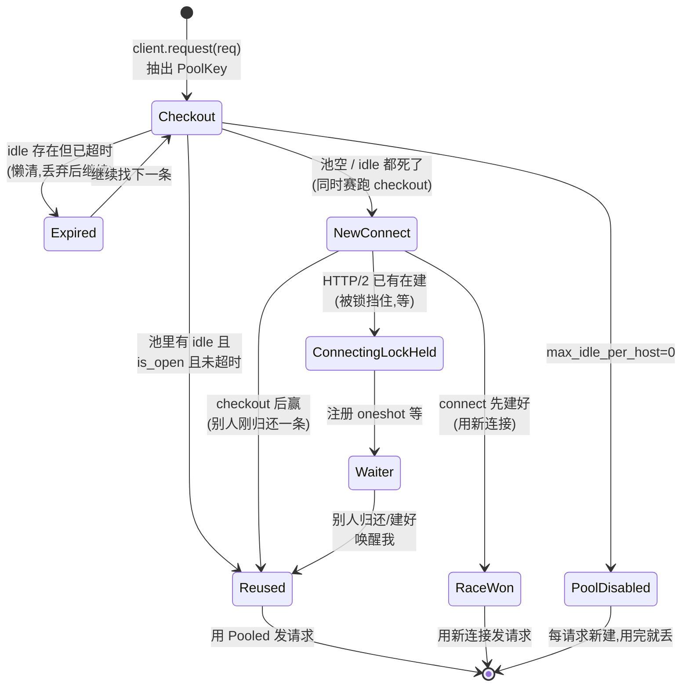
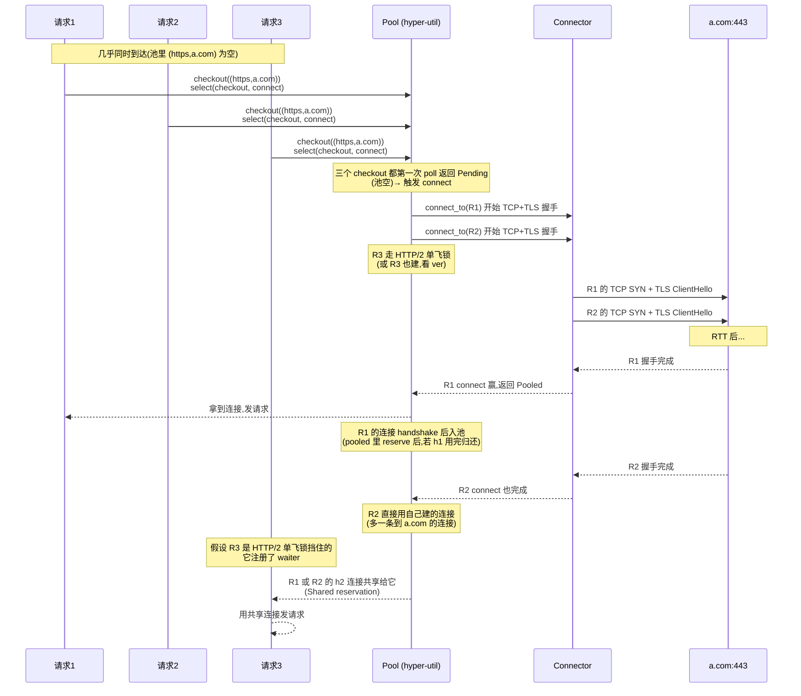
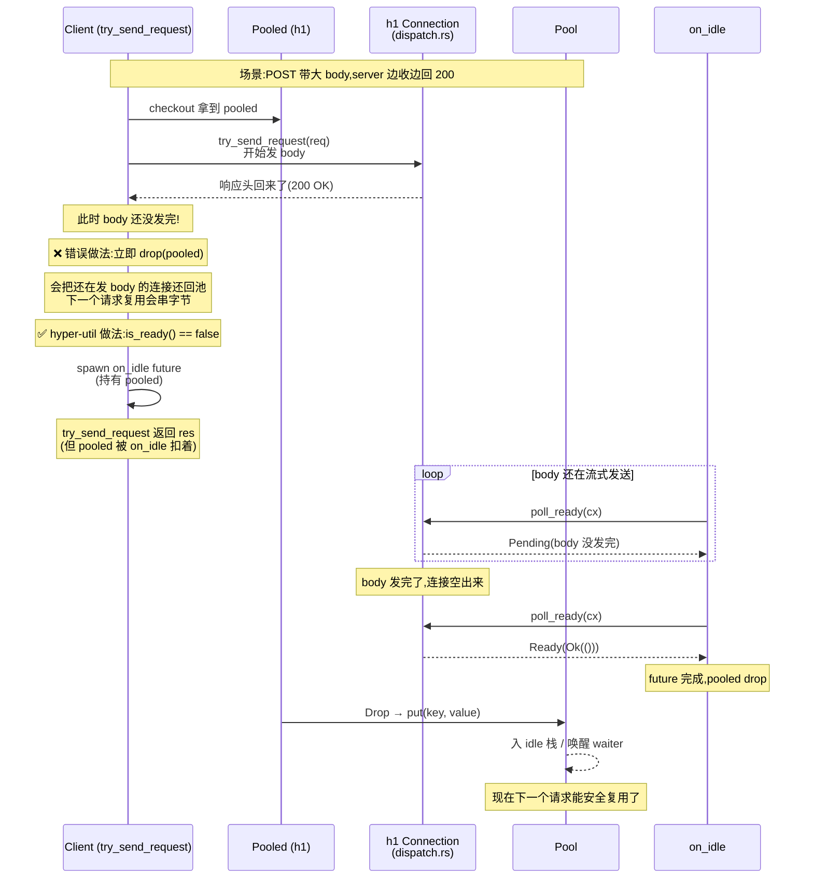

# 第 4 篇 · 第 12 章 · client 连接池与分发

> **核心问题**:你用 `reqwest::get("https://hyper.rs")` 调一个接口,它背后是 hyper。如果同一个进程里,你要并发调 hyper.rs 这个 host 一百次,难道每次都新建一条 TCP 连接、做完 TLS 握手、发完请求就关掉?那光是握手就要烧掉一百个 RTT,延迟和 CPU 全浪费在建立连接上。正确的做法是——**建一小批连接,做完一个请求不关,留着给下一个请求复用**(HTTP 的 keep-alive)。那么:这些"留着待命"的连接由谁管?按什么 key 分组(同一个 host 才能复用)?池子里有空闲连接就拿,没有就建新的,建到什么程度该让后续请求排队而不是无限建?一条 HTTP/2 连接能并发跑几百个请求,这种连接还需要开好几条吗?分发(dispatch)时怎么挑出一条确实能用的连接,而不是发到一个对端已经悄悄关掉的"死连接"上?这一连串问题,就是 hyper client 连接池要回答的。一个讲不清"client 连接池"的人,等于没讲 hyper 框架侧——这是 hyper 作为 HTTP client 的招牌能力。

> **读完本章你会明白**:
> 1. **连接池到底在哪**:hyper 1.0 把"带连接池的 Client"拆到了外部 **hyper-util** crate,hyper 主仓的 `src/client/` 只剩"单连接发请求收响应"的 `client/conn/`——这是 hyper 1.0 三分重构(hyper / hyper-util / http-body)最关键的一个拆分,讲不清它就讲不清 hyper 1.x 的模块边界。
> 2. 连接池**按什么 key 复用**:`(Scheme, Authority)`——也就是 scheme + host + port,而不是整条 URL;`https://a.com/x` 和 `https://a.com/y` 复用同一条连接,但 `https://a.com` 和 `http://a.com` 不能复用。
> 3. 池的**状态机**:idle 复用 / 池空新建 / 排队 / 失效淘汰四态,以及 hyper 用 `future::select` 把"checkout 一条空闲连接"和"connect 一条新连接"**同时赛跑**而不是顺序决定——这是连接池最反直觉也最精妙的设计。
> 4. HTTP/2 的"一条连接多 stream"怎么**从根上改变池的设计**:`Poolable::reserve()` 对 HTTP/1 返回 `Unique`(独占)、对 HTTP/2 返回 `Shared(a, b)`(克隆两份),让一条 h2 连接同时被多个请求持有;`connecting` 锁保证同一 host 同时只建一条 h2 连接,而不是开一堆。
> 5. 为什么这套设计是 **sound** 的:不泄漏(idle 超时双路淘汰:取时懒清 + 后台 IdleTask 主动扫)、不饿死(池满会让后续请求建新连接或公平排队、HTTP/2 共享让并发不被一条连接卡死)、不发死连接(`is_open()` 发前探活、发后失败把请求原样还回来重试)。

> **如果一读觉得太难**:先只记四件事——① **hyper 1.0 把带连接池的 Client 拆到了 hyper-util crate**,主仓只给单连接的 `client/conn/`;② 池按 `(scheme, host)` 分组,一个组里存一批空闲连接;③ 来请求时,池**同时**尝试"拿空闲"和"建新的",谁先好算谁;④ HTTP/2 一条连接能并发跑多 stream,池对它用"共享"而不是"独占"。其余细节(`Reservation` 枚举、`Connecting` 锁、`Pooled` 的 Drop 回收)都是这四件事的工程展开。

---

## 〇、一句话点破

> **hyper 的 client 连接池,不是"一个数据结构",而是"一套围绕 `Poolable::reserve()` 这个枚举分叉设计的状态机"——同一个池,对 HTTP/1 走"独占复用"(一条连接一个 in-flight,用完归还),对 HTTP/2 走"共享复用"(一条连接同时被多个请求持有,谁也不归还);池按 `(scheme, host)` 分组空闲连接,来请求时用 `future::select` 把"拿空闲"和"建新的"赛跑,让"复用"和"建连"哪个快走哪个,失败的那条不浪费而是回填进池。这套机制不在 hyper 主仓,而在 hyper-util crate——这是 hyper 1.0 三分重构最关键的一处,讲不清它就讲不清 hyper 1.x 的模块边界。**

这是结论,不是理由。本章倒过来拆:先讲清"连接池到底在哪个 crate"(这是 hyper 1.0 给很多人挖的第一个坑),再看池按什么 key 复用、池里存什么;然后拆池的状态机(idle / 新建 / 排队 / 失效)和 checkout-vs-connect 的赛跑;接着钻进 `Poolable::reserve()` 看 HTTP/1 和 HTTP/2 怎么在池里走两条完全不同的路;再讲 dispatch 怎么把请求发到一条确实活着的连接、发到一半连接死了怎么办;最后钉死"为什么 sound"——不泄漏、不饿死、不发死连接这三件事各自靠什么机制兜底。

> **承接《Tokio》**:连接池里"建一条新 TCP"用 `tokio::net::TcpStream::connect`,这是一句带过的 Tokio 异步 IO(承《Tokio》第 3 篇 reactor/mio)；池里所有"等"都是 Future(`Checkout` 是 Future、`oneshot::Receiver` 是 Future),Pending/Waker 全承《Tokio》;后台清扫的 `IdleTask` 是 `tokio::spawn` 出来的 task。本章不重讲这些,篇幅留"hyper-util 怎么把它们组织成连接池"。

> **承接《gRPC》**:gRPC 的连接复用概念(SubChannel/一个逻辑 channel 底下复用 TCP)在《gRPC》已拆透,本章**一句带过 + 指路**,重点在 hyper-util 的 `Pool` 怎么实现这个概念、和 gRPC 的 SubChannel 抽象有什么不同。HTTP/2 的多 stream、`max_concurrent_streams` 在《gRPC》第 2 篇(chttp2)和本书 P3-09 已拆透,本章只讲"这个协议事实怎么反过来改变池的设计"。

> **承接本书 P3-09 / P3-10**:P3-09 已讲透"HTTP/2 一条连接多 stream、per-stream spawn Future、`ClientTask` 的 `h2_tx.poll_ready`/`req_rx.poll_recv` 循环",并明确留了一句"这个 channel(`req_rx`)是 client 连接池和这条连接之间的桥梁,承 P4-12"。本章就是从那句话接过来——连接池怎么往那个 channel 里塞请求、怎么决定往哪条连接的 channel 塞。本章不重讲 `ClientTask` 内部,只讲"池怎么挑连接、挑中后怎么交付给那条连接的 `SendRequest`"。

---

## 一、连接池到底在哪:hyper 1.0 三分重构的第一处坑

在拆任何池的机制之前,必须先讲清一件事——**很多人翻 hyper 源码找连接池,翻半天找不到,是因为找错 crate 了**。这是 hyper 1.0 给读者挖的第一个、也是最大的一个坑。

### 1.1 你在 hyper 主仓找不到连接池

翻开 hyper 主仓(`hyperium/hyper`,版本 1.10.1,commit `aecf5abf`)的 `src/client/` 目录,你会看到:

```
hyper/src/client/
├── conn/
│   ├── http1.rs     # 单连接:HTTP/1 client 的 SendRequest + Connection
│   ├── http2.rs     # 单连接:HTTP/2 client 的 SendRequest + Connection
│   └── mod.rs       # conn 模块的入口和文档
├── dispatch.rs      # 单连接内的请求分发(channel + want 背压)
├── mod.rs           # client 模块入口
└── tests.rs         # 单元测试
```

你会本能地期待这里有一个 `pool.rs`、或者 `mod.rs` 里有 `pub struct Client`——就像 0.x 版本的 hyper 那样。但你翻遍 `mod.rs`,它只有这么几行(`hyper/src/client/mod.rs`):

```rust
//! HTTP Client.
//!
//! hyper provides HTTP over a single connection. See the [`conn`] module.
//! ...
#[cfg(test)]
mod tests;

cfg_feature! {
    #![any(feature = "http1", feature = "http2")]

    pub mod conn;
    pub(super) mod dispatch;
}
```

文档第一行就明明白白写着:**"hyper provides HTTP over a single connection."**(hyper 只提供"在单条连接上跑 HTTP"的能力。)没有 `Client`、没有 `Pool`、没有连接池。

再翻 `conn/mod.rs`(`hyper/src/client/conn/mod.rs`)的文档,它写得更直白:

```rust
//! Lower-level client connection API.
//!
//! The types in this module are to provide a lower-level API based around a
//! single connection. Connecting to a host, pooling connections, and the like
//! are not handled at this level. This module provides the building blocks to
//! customize those things externally.
//!
//! If you are looking for a convenient HTTP client, then you may wish to
//! consider [reqwest] for a high level client or [`hyper-util`'s client]
//! if you want to keep it more low level / basic.
```

**"Connecting to a host, pooling connections, and the like are not handled at this level."**(连接主机、池化连接这些事,不在这个层级处理。)它还直接把读者往外指——要方便的 client,去用 reqwest,或者 **hyper-util 的 client**。

> **钉死这件事**:hyper 1.0 主仓的 `src/client/` 里**没有连接池、没有带连接池的 `Client`**。主仓只给"一条已经建好的连接上怎么跑 HTTP"(`client/conn/http1.rs` 的 `SendRequest`/`Connection`、`client/conn/http2.rs` 的同名类型)。**连接池在 hyper-util crate**。这是 hyper 1.0 三分重构(hyper / hyper-util / http-body)的结果,任何讲 hyper 1.x 连接池却只翻主仓的人,都会扑空。

### 1.2 为什么这么拆:hyper 1.0 的三分重构

hyper 0.x 时代,这些是揉在一起的——0.14 的 `hyper::Client` 自带连接池,直接在主仓里。但 1.0 做了一次大手术,把整个 hyper 项目拆成了**三个 crate**:

| crate | 干什么 | 谁用 |
|---|---|---|
| **hyper**(主仓) | HTTP 协议机 + 单连接 API(`client/conn`、`server/conn`、`Service`、`Body`/`Frame`)| 框架作者(axum、reqwest、tonic 自己写连接管理时直接用 `client/conn`)|
| **hyper-util** | 方便的、带连接池的 `Client`、TCP/HTTP connector、server 工具 | 应用作者(直接用,或被 reqwest/axum 包一层)|
| **http-body** | `Body`/`Frame`/`SizeHint` trait(从 hyper 主仓 re-export 给所有人体)| 任何实现 body 的库 |

为什么要这么拆?核心动机是**让协议核心和"方便但策略性强"的部分解耦**。

> **不这样会怎样**:如果把带连接池的 `Client` 留在 hyper 主仓,那么主仓就必须依赖一个具体的 connector(比如 `tokio::net::TcpStream`)——可 hyper 主仓想保持运行时中性(虽然实践上紧贴 Tokio,但 trait 层不想把 Tokio 焊死),也想让 axum 这种框架用自己的连接管理策略。把"策略性强、和具体 connector/运行时绑死"的连接池挪到 hyper-util,主仓就能保持"纯协议 + 单连接抽象"的干净边界。

所以 hyper 主仓的 `client/conn/` 给的是**积木**(一条连接的 `SendRequest`/`Connection`),hyper-util 给的是**搭好的房子**(用积木组装出"带连接池、自动建连、自动复用"的 `Client`)。reqwest 又在 hyper-util 之上盖了一层(加 cookie、重定向、JSON 解码等)。

> **对照《gRPC》**:这种"协议核心 / 方便封装"分层,gRPC 也有——gRPC 的 core(C++)只给"一条 channel 上发 RPC"的核心,各语言的 wrapper(grpc-python、grpc-java)再加连接管理、负载均衡、拦截器。hyper 的拆法更激进,把"方便 client"整个挪到了另一个 crate。这种分层让协议核心可以被任何上层策略复用。

### 1.3 本章讲哪个 crate

诚实说清边界,本章的源码拆解分两块:

- **hyper 主仓的 `src/client/dispatch.rs` + `src/client/conn/`**:这是"单连接怎么收发请求"的积木。`dispatch.rs` 里那个 `want::Giver`/`want::Taker` 实现的"连接级背压"(一连接一 in-flight),是池能用这些连接的前提——池必须知道"这条连接现在能不能再接活",而 `dispatch.rs` 的 `poll_ready`/`is_ready` 就是这个信号。这一块在 P4-13(单连接发请求收响应)会深入,本章只取它"暴露给池的接口"这一面。

- **hyper-util crate 的 `src/client/legacy/pool.rs` + `client.rs` + `connect/`**:这是**连接池本体**——`Pool` 结构、`Poolable` trait、`Reservation` 枚举、`checkout`/`connecting`/`put` 流程、`IdleTask` 清扫、`PoolClient`/`PoolTx`/`Poolable` 实现、`Connect` trait。**本章 80% 的篇幅在这里**。引用时一律标"在 hyper-util crate"。

> **钉死这件事(修正一个常见误解)**:很多老资料、老博客(包括本书《全书规划-总纲》的草稿)把连接池源码写成"`src/client/dispatch.rs`、`client/conn/`(hyper 主仓)"——这是 0.x 时代的口径,在 1.x 已经**过时**。1.x 的连接池在 **hyper-util crate 的 `src/client/legacy/`**。本书在此修正这个口径:讲 hyper 1.x 的 client 连接池,主仓看 `dispatch.rs` 的连接级背压接口(这是池能用连接的前提),池本体看 hyper-util。读老资料时遇到"`hyper::Client` 的连接池",要立刻反应过来——它说的是 hyper-util 的 `Client`,或者是 0.x 的旧 API。

### 1.4 一个签名问题:hyper-util 的 Client 是不是 tower::Service

是。`hyper-util` 的 `Client<C, B>` 实现了 `tower_service::Service<Request<B>>`(在 hyper-util crate 的 `client.rs`):

```rust
// 在 hyper-util crate,src/client/legacy/client.rs(行号见下文)
impl<C, B> tower_service::Service<Request<B>> for Client<C, B>
where /* 省略 bounds */,
{
    type Response = Response<hyper::body::Incoming>;
    type Error = Error;
    type Future = ResponseFuture;

    fn poll_ready(&mut self, _: &mut task::Context<'_>) -> Poll<Result<(), Self::Error>> {
        Poll::Ready(Ok(()))
    }

    fn call(&mut self, req: Request<B>) -> Self::Future {
        self.request(req)
    }
}
```

注意它的 `poll_ready` **永远返回 `Ready(Ok(()))`**——client 这一层不施加背压。背压藏在池里(checkout 排队)和 connector 里(建连并发受 OS/connector 限制)。这和本书 P1-02 讲的"hyper 主仓的 `Service` trait 没有 `poll_ready`"不冲突——hyper-util 的 `Client` 是 `Service` 的一个**实现**,它自己加了个永远 ready 的 `poll_ready`,这是 tower 的 trait 要求,不是 hyper 的设计。

> **钉死这件事**:hyper 主仓的 `Service` trait(P1-02)没有 `poll_ready`,但 hyper-util 的 `Client` 实现的 tower `Service`(tower 强制有 `poll_ready`),它的 `poll_ready` 永远 ready。背压不在 Service 边界,在池里。这是"框架侧 Service"和"应用侧 Service 实现"的差别——P1-02 讲的是协议层抽象,这里讲的是应用层实例。

---

## 二、池按什么 key 复用:host + scheme

讲清池在哪,接下来拆池的第一个设计决策——**按什么 key 把连接分组**。

### 2.1 问题:不是所有连接都能复用

keep-alive 复用的本质是:**同一条 TCP(+TLS)连接,前一个请求-响应做完后不关,留给下一个请求继续用**。但这里有个硬约束——能复用,必须满足:

1. **同一个 host**:你建到 `hyper.rs:443` 的连接,显然不能拿去发请求给 `example.com`——TCP 连接的端点都不同。
2. **同一个 scheme**:`https://a.com` 的连接是 TLS 加密的,`http://a.com` 的连接是明文的,这两条连接的字节流语义完全不同,不能互换。
3. **同一个端口**(隐含在 host 里):`a.com:443` 和 `a.com:8080` 是不同的端点。

所以"按什么 key 复用"的答案几乎是显然的——按 **scheme + host + port**。hyper-util 用的是 HTTP 的 `Scheme` + `Authority`(Authority 就是 `host:port`):

```rust
// 在 hyper-util crate,src/client/legacy/client.rs:92
// We might change this... :shrug:
type PoolKey = (http::uri::Scheme, http::uri::Authority);
```

> **钉死这件事**:池的 key 是 `(Scheme, Authority)`。`https://a.com/x` 和 `https://a.com/y` 共享同一个 key(都是 `(https, a.com)`),所以复用同一条连接;`https://a.com` 和 `http://a.com` 的 key 不同(`(https, a.com)` vs `(http, a.com)`),不复用;`a.com:443` 和 `a.com:8080` 的 Authority 不同,也不复用。**path 不进 key**——这是关键,否则连接就根本没法复用(每个 URL path 一条连接,等于没池)。

这个 key 是怎么从请求里抽出来的?在 `Client::request`(hyper-util 的 `client.rs`)里:

```rust
// 在 hyper-util crate,src/client/legacy/client.rs(request 方法节选)
pub fn request(&self, mut req: Request<B>) -> ResponseFuture {
    let is_http_connect = req.method() == Method::CONNECT;
    // ... 版本校验省略 ...

    let pool_key = match extract_domain(req.uri_mut(), is_http_connect) {
        Ok(s) => s,
        Err(err) => {
            return ResponseFuture::new(future::err(err));
        }
    };

    ResponseFuture::new(self.clone().send_request(req, pool_key))
}
```

`extract_domain` 从 URI 里抽出 `(Scheme, Authority)` 作为 `PoolKey`。抽不出来(比如 URI 没有 host)就立刻返回错误——没有 host 就没法建连接,更别说池化。

### 2.2 host→池→连接 的映射结构

把这个 key 关系画出来,池的内部结构长这样(ASCII 框图,后面会逐字段拆):

```
                    hyper-util 的 Pool<PoolClient<B>, PoolKey>
                    ┌─────────────────────────────────────────────────────────┐
                    │  inner: Option<Arc<Mutex<PoolInner>>>                   │
                    │  (max_idle_per_host == 0 时 inner = None,池"不存在")│
                    │                                                         │
                    │  PoolInner {                                            │
                    │    idle: HashMap<PoolKey, Vec<Idle<PoolClient>>>        │
                    │    ┌──────────────────────────────────────────┐        │
                    │    │ (https, a.com)  → [idle₁, idle₂, idle₃]  │ ← LIFO │
                    │    │ (https, b.com)  → [idle₄]                │   栈   │
                    │    │ (http,  c.com)  → [idle₅, idle₆]         │        │
                    │    │ (https, d.com)  → [](用完会被 remove)│        │
                    │    └──────────────────────────────────────────┘        │
                    │    connecting: HashSet<PoolKey>  ← HTTP/2 单飞锁        │
                    │    waiters: HashMap<PoolKey, VecDeque<oneshot::Tx>>     │
                    │    max_idle_per_host: usize       ← 每个 host 的上限   │
                    │    timeout: Option<Duration>      ← idle 超时(默认90s)│
                    │    exec / timer / idle_interval_ref                    │
                    │  }                                                      │
                    └─────────────────────────────────────────────────────────┘
```

几个一眼能看出的设计选择,先记个轮廓,后面逐个拆:

- **`inner: Option<...>`**——整个池包在 `Option` 里。`max_idle_per_host == 0`(用户显式禁用池)时,`inner` 直接是 `None`,所有池操作变成空操作(no-op pass-through),每个请求都新建连接用完就关。**池不是"空",是"结构上不存在"**。
- **`idle: HashMap<PoolKey, Vec<Idle<T>>>`**——每个 key 一条 LIFO 栈(`Vec`,从尾部 push/pop)。同一个 host 的多条空闲连接排成一条栈,取的时候拿栈顶(最近归还的)。这是有意选 LIFO 而不是 FIFO——最近用过的连接,对端更可能还 keep-alive 着、TCP 窗口还热,复用它成功率更高;而且 LIFO 让"用不上的旧连接"自然沉到栈底,先被超时淘汰。
- **`connecting: HashSet<PoolKey>`**——HTTP/2 的"单飞锁",同一 host 同时只准建一条 h2 连接(后面专拆)。
- **`waiters: HashMap<PoolKey, VecDeque<oneshot::Sender>>`**——池空且正在建连时,后续请求在这里排队(FIFO),等有连接归还时被唤醒。
- **`max_idle_per_host`**——注意是**每 host**的上限,不是全局上限。hyper-util 的 legacy client **没有全局连接数上限**,并发只受 connector 和 OS 限制。这是个有意的设计选择(也是局限,后面讲)。

### 2.3 `Idle` 长什么样:值 + 归还时刻

```rust
// 在 hyper-util crate,src/client/legacy/pool.rs:588
struct Idle<T> {
    idle_at: Instant,
    value: T,
}
```

就两个字段——连接本身(`value: T`,泛型 `T = PoolClient<B>`)和它进入 idle 的时刻(`idle_at`)。`idle_at` 用来算超时(默认 90s 超过就淘汰)。

> **对照《gRPC》的 SubChannel**:gRPC 的 SubChannel 是"一个逻辑地址(host:port)底下的连接抽象,负责实际建连、断线重连、把 RPC 分发到当前可用的连接"。hyper-util 的 `Pool` + `PoolKey` ≈ SubChannel 的"按地址分组 + 复用"职能,但更轻——hyper-util 不做 gRPC 那种复杂的负载均衡(一个 SubChannel 可能对应多个后端的多个连接,做 round-robin),hyper 的 `Pool` 一个 key 就是一组到**同一个** host 的连接,没有"多个后端"的概念。负载均衡在 hyper 之上(比如 envoy、或者用户自己用多个 connector)。这是一句带过的对照,详细看《gRPC》负载均衡篇。

---

## 三、池的状态机:idle 复用 / 池空新建 / 排队 / 失效

讲清 key 和存储结构,接下来拆最核心的——**来一个请求,池怎么决定"复用、新建、还是排队"**。这是连接池的"状态机",也是本章最值得钉死的部分。

### 3.1 五态:不是"有就拿、没有就建"那么简单

直觉上,池的逻辑好像是"有空闲就拿、没空闲就建"——太简化了。真实的池有五个状态,来一个请求时,它会走下面这张状态机:



逐个拆这五态:

1. **Reused(复用)**:池里这个 key 有空闲连接、`is_open()` 返回 true(连接还活着)、没超时——直接拿出来用,这是最理想的路径,省了 TCP/TLS 握手。
2. **Expired(已超时,懒清)**:池里有这个 key 的连接,但它 idle 时间超过 `idle_timeout`(默认 90s)——丢弃它,继续找下一条。这是"懒清理"——不是后台定时扫(虽然也有,见第 6 节),而是取的时候顺手清。
3. **NewConnect(新建)**:池空(这个 key 完全没空闲连接,或者全死了)——建一条新连接。但 hyper-util 不是"先 checkout 失败再 connect",而是**同时**赛跑(见 3.2)。
4. **ConnectingLockHeld(HTTP/2 单飞锁挡住)**:HTTP/2 模式下,这个 key 已经有一条连接在建——直接注册一个 waiter 等它建好(不重复建)。
5. **Waiter(排队)**:checkout 没拿到、connect 还没建好,注册一个 `oneshot::Receiver` 进 `waiters[key]` 队列,等有人归还连接或建好新连接时被唤醒。
6. **PoolDisabled(池禁用)**:`max_idle_per_host == 0`,池根本不存在(`inner = None`)——每请求新建,用完就丢,等价于没有池。

### 3.2 头号技巧:checkout 和 connect 用 `future::select` 赛跑

最反直觉、也最精妙的设计在这里——**hyper-util 不是顺序地"先试 checkout、不行再 connect",而是把两者赛跑**。

来看 hyper-util 的 `one_connection_for`(这是 `Client::connection_for` 的内部循环体,在 hyper-util 的 `client.rs`):

```rust
// 在 hyper-util crate,src/client/legacy/client.rs(one_connection_for 节选)
async fn one_connection_for(
    &self,
    pool_key: PoolKey,
) -> Result<pool::Pooled<PoolClient<B>, PoolKey>, ClientConnectError> {
    // 池禁用就直接建,不赛跑
    if !self.pool.is_enabled() {
        return self.connect_to(pool_key).await.map_err(ClientConnectError::Normal);
    }

    // This actually races 2 different futures to try to get a ready
    // connection the fastest, and to reduce connection churn.
    //
    // - If the pool has an idle connection waiting, that's used immediately.
    // - Otherwise, the Connector is asked to start connecting to the destination Uri.
    // - Meanwhile, the pool Checkout is watching to see if any other
    //   request finishes and tries to insert an idle connection.
    // - If a new connection is started, but the Checkout wins after
    //   (an idle connection became available first), the started
    //   connection future is spawned into the runtime to complete,
    //   and then be inserted into the pool as an idle connection.
    let checkout = self.pool.checkout(pool_key.clone());
    let connect = self.connect_to(pool_key);
    let is_ver_h2 = self.config.ver == Ver::Http2;

    // The order of the `select` is depended on below...
    match future::select(checkout, connect).await {
        // Checkout won, connect future may have been started or not.
        //
        // If it has, let it finish and insert back into the pool,
        // so as to not waste the socket...
        Either::Left((Ok(checked_out), connecting)) => {
            // 如果 connect 已经开始建了(TCP 握手进行中),
            // 别浪费它——spawn 到后台让它建完,建完会自动入池
            if connecting.started() {
                let bg = connecting
                    .map_err(|err| { trace!("background connect error: {}", err); })
                    .map(|_pooled| {
                        // dropping here should just place it in the Pool for us...
                    });
                self.exec.execute(bg);
            }
            Ok(checked_out)
        }
        // Connect won, checkout can just be dropped.
        Either::Right((Ok(connected), _checkout)) => Ok(connected),
        // ... 取消 / 错误的分支省略 ...
    }
}
```

这段注释把意图讲得很清楚,我们逐句拆:

- **`let checkout = self.pool.checkout(pool_key.clone());`**——造一个 `Checkout` future。注意这是个 lazy future,造出来不会立刻干活,要 poll 才会。
- **`let connect = self.connect_to(pool_key);`**——造一个"建新连接"的 future,同样是 lazy 的(`connect_to` 返回 `impl Lazy<...>`,见 hyper-util 的 `client.rs`)。造出来不会立刻发 TCP。
- **`future::select(checkout, connect)`**——同时 poll 两者,谁先 Ready 谁赢。

为什么这么做?为了**减少连接抖动(connection churn)**和**降低延迟**:

> **不这样会怎样(顺序决策的三个毛病)**:如果改成"先 `checkout.await`,失败了再 `connect.await`",有三个问题:
>
> 1. **延迟浪费**:checkout 如果没拿到(池空),得等它明确失败(池里这个 key 没连接了),才开始建连。这一段"等 checkout 失败"的时间,本可以拿来并行建连。
> 2. **连接抖动**:假设同一瞬间来了 10 个请求到同一个新 host。顺序逻辑下,前几个请求都发现池空,各自开始建连——结果建了 10 条连接。但其实只要建一两条,后续的可以复用。赛跑逻辑下,前几个请求**同时**赛跑 checkout 和 connect,当第一个 connect 完成入池后,后续请求的 checkout 会立刻赢,不再建新连接。
> 3. **浪费 socket**:如果 checkout 和 connect 几乎同时完成(checkout 略晚一点点),顺序逻辑只能选一个、另一个白干了;赛跑逻辑下,输的那一方(这里 connect 输了但 TCP 已经开始建)会被 spawn 到后台让它建完入池,**不浪费这个 socket**,留给后续请求复用。

> **钉死这件事**:`select` 的**参数顺序很重要**。源码注释明写"The order of the `select` is depended on below..."。`future::select` 的语义是:如果两个 future 在**同一个 poll** 内都 Ready,**第一个参数优先**。这里把 `checkout` 放第一个——意味着如果 checkout 立刻能拿到空闲连接,`connect` 这个 future **根本不会被 poll**(select 短路),也就不会发起任何 TCP。只有 checkout 在第一次 poll 返回 Pending,select 才会去 poll connect,此时 connect 才"开始建"。这个细节保证了"有空闲就完全不建新连接"。

> **承接《Tokio》**:`future::select` 是 futures crate 的组合子,底层就是"两个 Future,谁 Ready 就返回谁,带另一个未完成的 Future 出来"。它和《Tokio》讲的 `tokio::select!` 宏同源(都是 poll 两个 Future,看谁先 Ready)。本章不重讲 select 的 poll 机制,只讲 hyper-util 怎么用它做这个"赛跑"决策。`self.exec.execute(bg)` 就是 `tokio::spawn(bg)`,把输掉的 connect future 丢到后台跑完——这又是《Tokio》讲透的 spawn。

### 3.3 时序图:三个请求同时打到一个新 host

把这套赛跑放到一个具体场景里看。假设同一个进程里,几乎同时来了三个请求都打到 `https://a.com`(一个全新的 host,池里没缓存):



这个时序图揭示了三件事:

1. **请求 1 和请求 2 都建了新连接**——因为它们 checkout 时池真空,select 同时把它们的 connect 也 poll 了,各自开始建。结果到 `a.com` 开了两条连接。这是 race 的代价——极端并发下会多建。但这两条连接做完请求后都会进 idle 池,后续请求复用,长期看不亏。
2. **请求 3(HTTP/2 单飞锁)**——如果 `ver = Http2`,R3 的 `connect_to` 会发现 `connecting` 锁里已经有 `(https, a.com)`(R1 或 R2 占的),直接返回 `Canceled`,R3 只能等 checkout 或 waiter。等 R1 的 h2 连接建好(reserve 返回 Shared),R3 被唤醒,共享这条连接。这是 HTTP/2 不开多条连接的关键。
3. **第一条连接建立后入池**——R1 用完连接(h1 的话响应收完),`Pooled::drop` 把它 `put` 回池;后续请求的 checkout 就能赢。这是池"自热"的过程——冷启动多建几条,稳态后全靠复用。

> **钉死这件事**:hyper-util 的连接池在**冷启动 + 高并发**场景下会多建几条连接(这是 race 的固有代价)。这不是 bug,是"宁可多建一条换低延迟"的取舍。稳态后(池里有了 idle 连接),绝大多数请求走"checkout 赢"路径,完全不建新连接。这是连接池用"短期多建"换"长期复用"的经典工程权衡。

---

## 四、HTTP/2 怎么从根上改变池的设计:`Poolable::reserve()` 的双值枚举

到这里,前面讲的池机制对 HTTP/1 和 HTTP/2 都成立——key、idle 存储、checkout 赛跑。但 HTTP/2 有一个根本性的不同——**一条 h2 连接可以同时并发跑几百个 stream(请求)**,这从根上改变了"一条连接同时能被几个请求持有"的语义。hyper-util 用一个极其精巧的枚举 `Reservation` 把这件事表达出来。

### 4.1 问题:HTTP/1 一条连接一个 in-flight,HTTP/2 一条连接多 stream

回看本书 P2-05(HTTP/1 keep-alive)和 P3-09(HTTP/2 多 stream):

- **HTTP/1**:一条连接在任一时刻**最多有一个 in-flight 请求**——发了请求必须等响应回来(或 body 发完),才能发下一个。这是协议的死规定(没有 stream id 区分请求,只能串行)。所以池里一条 h1 连接,同一时刻只能被一个请求"持有"——独占。
- **HTTP/2**:一条连接上**每个请求是一个 stream**,stream id 区分,几百个 stream 可以交织并发。所以一条 h2 连接,同一时刻可以被几百个请求"共享"——它们各开各的 stream,互不干扰。

这个差异对池的影响是致命的:

> **不这样会怎样**:如果池把 h1 和 h2 都当"独占"处理,那么一条 h2 连接同一时刻只服务一个请求,等到这个请求的响应回来才归还——这等于把 HTTP/2 的多路复用**完全废掉**,一条 h2 连接退化成 h1 的串行模式。要扛 100 并发,就得开 100 条 h2 连接——握手/TLS 100 遍,内存 100 份,完全违背 h2 设计初衷。

反过来,如果池把 h1 也当"共享",那两个请求会同时往一条 h1 连接塞,字节流互相穿插,协议解析直接乱套。

所以池**必须**能区分"这条连接是 h1(独占)还是 h2(共享)",并走两条不同的复用路径。hyper-util 用 `Poolable` trait 的 `reserve()` 方法做这个分叉。

### 4.2 `Poolable` trait:`reserve()` 返回的 `Reservation` 是分叉点

```rust
// 在 hyper-util crate,src/client/legacy/pool.rs:35
pub trait Poolable: Unpin + Send + Sized + 'static {
    fn is_open(&self) -> bool;
    /// Reserve this connection.
    ///
    /// Allows for HTTP/2 to return a shared reservation.
    fn reserve(self) -> Reservation<Self>;
    fn can_share(&self) -> bool;
}
```

三个方法:

- **`is_open(&self) -> bool`**——健康检查,checkout 和归还时都要调,确保不发到死连接。
- **`reserve(self) -> Reservation<Self>`**——**消费**这条连接,返回一个"预订"。这是池里 HTTP/1 vs HTTP/2 分叉的核心——h1 返回 `Unique`,h2 返回 `Shared`。
- **`can_share(&self) -> bool`**——快速判断"这条连接能不能共享"(h2 true,h1 false),用于在归还、dedup 时短路。

`Reservation` 是个枚举,带两个变体:

```rust
// 在 hyper-util crate,src/client/legacy/pool.rs:61
#[allow(missing_debug_implementations)]
pub enum Reservation<T> {
    /// This connection could be used multiple times, the first one will be
    /// reinserted into the `idle` pool, and the second will be given to
    /// the `Checkout`.
    #[cfg(feature = "http2")]
    Shared(T, T),
    /// This connection requires unique access. It will be returned after
    /// use is complete.
    Unique(T),
}
```

**`Shared(T, T)` 携带两份连接**——这是整个设计最巧妙的地方。注释说:第一份会重新插回 idle 池(给下一个 checkout 用),第二份交给当前 checkout。也就是说,HTTP/2 共享的语义是——**取出一条连接的同时,立刻往池里再放一份"同样的"**。这样下一个请求来 checkout 时,池里还有这条连接(因为它是共享的,可以同时给多个请求),于是又能 checkout 成功。一条 h2 连接就这样"同时"被多个请求持有。

### 4.3 `PoolClient` 怎么实现 `Poolable`:h2 的 `SendRequest` 是 Clone 的

`Reservation::Shared(T, T)` 要带两份连接,意味着 `T`(这里就是 `PoolClient<B>`)必须能"复制出两份"。对 HTTP/1 这做不到(h1 的 `SendRequest` 不是 Clone,它代表独占一条连接的发送端);对 HTTP/2 可以——因为 **h2 的 `SendRequest` 是 `Clone` 的**(承 P3-09,h2 的 `SendRequest` 只是一个"往这条多路复用连接开 stream 的句柄",克隆它只是多一个句柄,底层共享同一条 TCP)。

来看 `PoolClient` 的定义和它的 `Poolable` 实现(hyper-util 的 `client.rs`):

```rust
// 在 hyper-util crate,src/client/legacy/client.rs:766
#[allow(missing_debug_implementations)]
struct PoolClient<B> {
    conn_info: Connected,
    tx: PoolTx<B>,
}

enum PoolTx<B> {
    #[cfg(feature = "http1")]
    Http1(hyper::client::conn::http1::SendRequest<B>),
    #[cfg(feature = "http2")]
    Http2(hyper::client::conn::http2::SendRequest<B>),
}
```

`PoolClient` 把 h1 和 h2 的 `SendRequest` 包成一个枚举 `PoolTx`,外加连接元信息 `Connected`。然后:

```rust
// 在 hyper-util crate,src/client/legacy/client.rs:850
impl<B> pool::Poolable for PoolClient<B>
where
    B: Send + 'static,
{
    fn is_open(&self) -> bool {
        !self.is_poisoned() && self.is_ready()
    }

    fn reserve(self) -> pool::Reservation<Self> {
        match self.tx {
            #[cfg(feature = "http1")]
            PoolTx::Http1(tx) => pool::Reservation::Unique(PoolClient {
                conn_info: self.conn_info,
                tx: PoolTx::Http1(tx),
            }),
            #[cfg(feature = "http2")]
            PoolTx::Http2(tx) => {
                // h2 的 SendRequest 是 Clone 的——克隆一份
                let b = PoolClient {
                    conn_info: self.conn_info.clone(),
                    tx: PoolTx::Http2(tx.clone()),
                };
                let a = PoolClient {
                    conn_info: self.conn_info,
                    tx: PoolTx::Http2(tx),
                };
                pool::Reservation::Shared(a, b)
            }
        }
    }

    fn can_share(&self) -> bool {
        self.is_http2()
    }
}
```

逐行看 `reserve()`:

- **HTTP/1 分支**:把 `tx`(h1 的 `SendRequest`)原样塞回 `PoolClient`,包成 `Reservation::Unique(...)`。没有克隆——h1 的 SendRequest 不能克隆,这条连接独占。
- **HTTP/2 分支**:`tx.clone()` 克隆 h2 的 `SendRequest`(这一步在 h2 crate 里很便宜,就是多一个 handle),造出两个 `PoolClient`(`a` 和 `b`),包成 `Reservation::Shared(a, b)`。两个 PoolClient 共享同一条底层 h2 连接,但各自能独立开 stream 发请求。

> **钉死这件事**:h1 和 h2 在池里的全部差异,就集中在 `reserve()` 这个方法的两个分支上。h1 走 `Unique`(独占),h2 走 `Shared(a, b)`(克隆两份)。这一个枚举分叉,让同一套池机制同时服务两种语义完全不同的协议。这是 hyper-util 连接池最漂亮的一处设计——**用类型表达协议语义**,而不是在池里到处写 `if is_http2`。

> **承 P3-09**:P3-09 讲过 h2 的 `SendRequest` 是 `Clone` 的(因为它底下是 `dispatch::UnboundedSender`,承本书 `client/conn/http2.rs:28` 的 `impl Clone for SendRequest<B>`)。P3-09 还讲过 `ClientTask` 的 `h2_tx.poll_ready` 只要不关就 Ready(多 stream,永远能开新 stream)——这就是为什么 `PoolClient::poll_ready` 对 h2 分支永远返回 `Poll::Ready(Ok(()))`(见 hyper-util `client.rs:778`),池里 h2 连接的 `is_open()` 因此几乎永远 true(只要没关、没被 poison)。h1 则要真的 poll `dispatch.poll_ready`,靠 `want::Giver` 控制一连接一 in-flight(承本书 `client/dispatch.rs`)。这两个差异,是 `Poolable::reserve()` 能这么分叉的根基。

### 4.4 `Shared` 的连锁效应:取出时回填、归还时 dedup

`Reservation::Shared` 这个设计有一连串连锁效应,贯穿池的多个地方。来看 `IdlePopper::pop`(从 idle 栈里取一条连接):

```rust
// 在 hyper-util crate,src/client/legacy/pool.rs(IdlePopper::pop 节选)
impl<'a, T: Poolable + 'a, K: Debug> IdlePopper<'a, T, K> {
    fn pop(self, expiration: &Expiration, now: Instant) -> Option<Idle<T>> {
        while let Some(entry) = self.list.pop() {
            // 死了就丢,继续找
            if !entry.value.is_open() {
                trace!("removing closed connection for {:?}", self.key);
                continue;
            }
            // 超时了就丢,继续找
            if expiration.expires(entry.idle_at, now) {
                trace!("removing expired connection for {:?}", self.key);
                continue;
            }

            // 关键:取出时调 reserve()
            let value = match entry.value.reserve() {
                #[cfg(feature = "http2")]
                Reservation::Shared(to_reinsert, to_checkout) => {
                    // h2:取一份出来用,另一份立刻塞回 idle 栈!
                    self.list.push(Idle {
                        idle_at: now,
                        value: to_reinsert,
                    });
                    to_checkout
                }
                Reservation::Unique(unique) => unique,
            };

            return Some(Idle {
                idle_at: entry.idle_at,
                value,
            });
        }
        None
    }
}
```

注意 `Shared` 分支——**取出 h2 连接的同时,立刻把另一份 push 回 idle 栈**。这意味着,即使一个 host 只有一条 h2 连接,N 个并发请求来 checkout 时:

- 请求 1 checkout:`pop` 取出这条 h2 连接,`reserve()` 返回 `Shared(a, b)`,把 `a` push 回栈,把 `b` 给请求 1。
- 请求 2 checkout:栈里又有 `a` 了,`pop` 取出 `a`,`reserve()` 又返回 `Shared(a', b')`,把 `a'` push 回栈,把 `b'` 给请求 2。
- 请求 3、4、5……同理。

一条 h2 连接,就这样被"复制"成 N 份,同时给 N 个请求用。每个请求拿到的那份 `PoolClient` 都指向**同一条底层 h2 连接**,各自开各自的 stream。这就是"一条 h2 连接服务多并发"在池里的完整实现。

再看归还路径 `PoolInner::put`(hyper-util `pool.rs`):

```rust
// 在 hyper-util crate,src/client/legacy/pool.rs(put 方法节选)
fn put(&mut self, key: K, value: T, __pool_ref: &Arc<Mutex<PoolInner<T, K>>>) {
    // h2 dedup:如果池里已经有一条 h2 空闲连接了,这份就不必再放进去
    if value.can_share() && self.idle.contains_key(&key) {
        trace!("put; existing idle HTTP/2 connection for {:?}", key);
        return;
    }
    // ... 唤醒 waiter / 入 idle 栈的逻辑省略 ...
}
```

`put` 开头就 dedup——如果归还的是 h2 连接(`can_share() == true`)且池里这个 key 已经有 idle 的 h2 连接,这份就直接丢(return,不重复入栈)。为什么?因为 h2 连接是共享的,池里留一份就够所有并发用了,留两份反而是浪费(多一份 PoolClient 句柄,底层还是同一条 TCP)。这是 `Shared` 设计的对称面——取出时回填(让池里永远有一份)、归还时 dedup(不让池里堆冗余句柄)。

> **钉死这件事**:HTTP/2 在池里的全部特殊行为,可以总结成三句话——① **取出时回填**(`Shared` 让 pop 把一份塞回栈);② **归还时 dedup**(`put` 开头检查 h2 已有就不再入栈);③ **建连时单飞**(`connecting` 锁,下一节拆)。这三件事共同保证:**一个 host 只需要一条 h2 连接,就能扛住所有并发**。这是 HTTP/2 多路复用在连接池层面的落地——协议级的多 stream(承 P3-09)+ 池级的共享,缺一不可。

### 4.5 ASCII 图:h1 池 vs h2 池的对照

把 h1 和 h2 在池里的行为对照画出来:

```
═══════════════════════════════════════════════════════════════════════
  HTTP/1 池(Unique):一个 host 可能有多条连接,每条独占
═══════════════════════════════════════════════════════════════════════

   请求1   请求2   请求3   请求4   请求5        (5 个并发到 a.com)
     │       │       │       │       │
     ▼       ▼       ▼       ▼       ▼
   ┌─────────────────────────────────────┐
   │ idle[(https,a.com)] = [conn₁,conn₂] │   ← 池里有 2 条空闲
   └─────────────────────────────────────┘
        │           │
        ▼           ▼       剩 3 个请求要建新连
     请求1       请求2      → connect 建 conn₃,conn₄,conn₅
   独占 conn₁  独占 conn₂   (race 下可能多建,后续复用)

   关键:每条 h1 连接同时只服务 1 个请求,
        要 5 并发就得 5 条连接(5 次 TCP/TLS 握手)

═══════════════════════════════════════════════════════════════════════
  HTTP/2 池(Shared):一个 host 通常只要一条连接,共享给所有并发
═══════════════════════════════════════════════════════════════════════

   请求1   请求2   请求3   请求4   请求5        (5 个并发到 a.com)
     │       │       │       │       │
     │       │       │       │       │        全部 checkout 同一条连接
     ▼       ▼       ▼       ▼       ▼
   ┌─────────────────────────────────────┐
   │ idle[(https,a.com)] = [conn₁]       │   ← 池里只有 1 条!
   └─────────────────────────────────────┘
        │
        │  每次 pop:reserve() 返回 Shared(a, b)
        │  把 a 塞回栈,b 给请求 → 栈里始终保留一份
        │
        ▼
     5 个请求各拿到一份 b(共享同一条 conn₁)
     各开各的 stream(stream 1/3/5/7/9)并发跑

   关键:1 条 h2 连接扛 5 并发(甚至 100 并发),
        只需 1 次 TCP/TLS 握手,多路复用红利吃满
═══════════════════════════════════════════════════════════════════════
```

这张对照图是本章的"地图"——理解了它,就理解了为什么 HTTP/2 改变了池的设计。下一节拆"建连时单飞"——保证一个 host 不会同时建好几条 h2 连接的机制。

---

## 五、HTTP/2 单飞锁:一个 host 同时只准建一条 h2 连接

上一节讲了"取出时回填"和"归还时 dedup"——这两个机制让池里**稳态**只需要一条 h2 连接。但还有一个问题没解:**冷启动时**,同一瞬间来了 10 个请求到同一个新 host,它们各自调 `connection_for`,都会发现池空,各自走 `connect_to`——如果不管,这 10 个请求会**同时**建 10 条 h2 连接到同一个 host,完全违背"一个 host 一条 h2 就够"的原则。hyper-util 用 `connecting` 锁来堵这个口子。

### 5.1 `Pool::connecting`:HTTP/2 的单飞闸门

```rust
// 在 hyper-util crate,src/client/legacy/pool.rs:175
/// Ensure that there is only ever 1 connecting task for HTTP/2
/// connections. This does nothing for HTTP/1.
pub fn connecting(&self, key: &K, ver: Ver) -> Option<Connecting<T, K>> {
    if ver == Ver::Http2 {
        if let Some(ref enabled) = self.inner {
            let mut inner = enabled.lock().unwrap();
            // HashSet::insert 返回 false 表示已经存在
            return if inner.connecting.insert(key.clone()) {
                // 成功插入 = 我是第一个建 h2 的,拿到锁
                let connecting = Connecting {
                    key: key.clone(),
                    pool: WeakOpt::downgrade(enabled),
                };
                Some(connecting)
            } else {
                // 已经有人在建 h2 到这个 host 了,别再建
                trace!("HTTP/2 connecting already in progress for {:?}", key);
                None
            };
        }
    }

    // HTTP/1 永远返回 Some(不锁)——h1 一连接一请求,建多条是正常的
    Some(Connecting {
        key: key.clone(),
        pool: WeakOpt::none(),
    })
}
```

逻辑很清楚:

- **HTTP/1(`ver != Http2`)**:直接返回 `Some`,不锁。因为 h1 一条连接同时只服务一个请求,要扛 N 并发本就需要 N 条连接,建多条是正常的。
- **HTTP/2(`ver == Http2`)**:尝试往 `connecting: HashSet<K>` 里插这个 key。`HashSet::insert` 返回 `true` 表示这个 key 之前不在集合里——我是第一个建 h2 的,拿到锁(返回 `Some Connecting`)。返回 `false` 表示这个 key 已经在集合里——已经有一条 h2 连接在建,别再建了,返回 `None`。

`Connecting` 是个 RAII guard,它的 `Drop` 会把这个 key 从 `connecting` 集合里移除——建连完成(成功或失败)后,锁释放,下一个想建 h2 的才能拿到。

```rust
// 在 hyper-util crate,src/client/legacy/pool.rs:738
pub struct Connecting<T: Poolable, K: Key> {
    key: K,
    pool: WeakOpt<Mutex<PoolInner<T, K>>>,
}

// Connecting 的 Drop(pool.rs:754 附近)会把 key 从 connecting 移除
// 这样建连完成后,下一个请求能拿到锁建下一条(如果还需要的话)
```

> **钉死这件事**:`connecting` 锁是 HTTP/2 单飞的**唯一闸门**。它的语义是——**同一 host 同时只允许一条 h2 连接在建**。注意是"在建"(connecting),不是"已建"。一旦这条 h2 连接建好入池,后续请求通过 Shared 复用(上一节)就能共享它,根本不需要再建。`Connecting::Drop` 释放锁,是为了"万一这条建失败了,下一条能接力",不是为了"建完立刻建下一条"。

### 5.2 ALPN 升级时也要补锁:`alpn_h2`

有一个微妙的场景:用户用的是 `Ver::Auto`(不强制 h2),连接器通过 ALPN(TLS 应用层协议协商)发现对端支持 h2,这时候这条连接"升级"成了 h2。但 `connecting` 锁当初是按 HTTP/1 拿的(没插进 `connecting` 集合),现在它变 h2 了,得补一个 h2 锁,免得别的请求又建一条 h2。

```rust
// 在 hyper-util crate,src/client/legacy/pool.rs:744
impl<T: Poolable, K: Key> Connecting<T, K> {
    pub fn alpn_h2(self, pool: &Pool<T, K>) -> Option<Self> {
        debug_assert!(
            self.pool.0.is_none(),
            "Connecting::alpn_h2 but already Http2"
        );

        pool.connecting(&self.key, Ver::Http2)
    }
}
```

`alpn_h2` 把一个 h1 的 `Connecting` 升级成 h2 的——内部调 `pool.connecting(key, Ver::Http2)`。如果这时候已经有别的连接抢先升级成 h2 占了锁,这里返回 `None`,当前这条连接的建连 future 直接 `Canceled`(因为它要变 h2,而 h2 已经有了,它没存在的必要了)。

来看 `connect_to` 里的 ALPN 升级(hyper-util `client.rs`):

```rust
// 在 hyper-util crate,src/client/legacy/client.rs(connect_to 节选)
let connecting = if connected.alpn == Alpn::H2 && !is_ver_h2 {
    match connecting.alpn_h2(&pool) {
        Some(lock) => {
            trace!("ALPN negotiated h2, updating pool");
            lock
        }
        None => {
            // 别的连接已经抢先升级 h2 了,我这条不必建
            let canceled = e!(Canceled, "ALPN upgraded to HTTP/2");
            return Either::Right(future::err(canceled));
        }
    }
} else {
    connecting
};
```

> **钉死这件事**:ALPN 升级是这个连接池里**最容易被忽略但最关键**的细节之一。它的语义是——当 `Ver::Auto` 时,可能并发建的好几条连接里,**第一条**完成 TLS 握手且 ALPN 选了 h2 的,会占住 h2 锁;后续完成握手的连接发现自己也要变 h2 但锁已被占,直接 cancel 自己。结果就是:**无论并发多少请求,只要对端支持 h2,最终这个 host 只会留下一条 h2 连接**。这是 hyper-util 在 ALPN 场景下保证"h2 单连接"的工程实现。

### 5.3 一个 host 到底开几条 h2 连接:`max_concurrent_streams` 什么时候逼你开第二条

到这里似乎"一个 host 永远只要一条 h2 连接"——但这是有上限的。HTTP/2 协议规定,一条 h2 连接上同时**活跃的 stream 数不能超过对端在 SETTINGS 里通告的 `SETTINGS_MAX_CONCURRENT_STREAMS`**(承 P3-09、承《gRPC》第 2 篇)。如果对端通告的是 100(典型值),那一条 h2 连接同时最多跑 100 个 in-flight 请求。如果你并发 150 个请求到同一个 host,多出来的 50 个会卡在"等 stream 配额"。

这时候池会怎么处理?**hyper-util 的 legacy client 默认不会自动开第二条 h2 连接**——`connecting` 锁一旦占住,只要那条连接还活着(`is_open`),后续请求都会走 Shared 复用它。多出来的请求挤在那条连接上,等 `h2_tx.ready()`(承 P3-09 `ClientTask` 的 `pending_open` 状态),即等对端发 SETTINGS 给更多 stream 配额,或者等别的 stream 关闭释放配额。

如果应用想"stream 配额不够时自动开第二条 h2",需要:

- 自己监控 `h2_tx.ready()` 的 Pending 情况,或者
- 显式给 `pool_max_idle_per_host` 设个值,让池在某些条件下丢弃 h2 连接迫使重开(这并不是 hyper-util 内建的行为)。

实际上 hyper-util 的 `Builder` 有个 `http2_initial_max_send_streams`(默认 100)——这只是告诉 h2"在收到对端真正的 SETTINGS 之前,先假设对端能给 100 个 stream,别一上来开太多被拒"。它**不是**一个"开第二条连接"的触发器。

> **钉死这件事(修正常见误解)**:很多人以为"hyper-util 会在 `max_concurrent_streams` 不够时自动开第二条 h2 连接"——**不会**。hyper-util 的 legacy client 设计假设是"一个 host 一条 h2 连接,靠 Shared 扛所有并发";如果并发超过对端的 `max_concurrent_streams`,多出来的请求在 h2 层等 stream 配额(Pending),不会触发开新连接。如果应用真的需要多开 h2 连接(比如对端 `max_concurrent_streams` 很小、又想扛高并发),得在上层自己做(比如建多个 `Client` 实例,或用支持这条策略的更新池——hyper-util 的 `pool` 模块注释里就写了 `A better pool will be designed`,暗示这套 legacy 池有局限)。

> **对照《gRPC》**:gRPC 的 SubChannel 在 `max_concurrent_streams` 用满时会**主动**开新连接(gRPC 把这叫"connection pooling under high load"),这是 gRPC 在 channel 层的复杂策略。hyper-util 的 legacy client 不做这个,把决策留给上层。这是"轻量通用 client(hyper-util)"vs"专用 RPC 框架(gRPC)"的取舍——gRPC 知道自己要扛高 QPS,内置复杂连接策略;hyper-util 通用、轻量,把策略留给用户。

---

## 六、dispatch 怎么 sound:不发死连接、不泄漏、不饿死

讲完池的状态机和 HTTP/2 特殊性,这一节钉死**"这套设计为什么 sound"**——三个并列的保证,每一个都有专门的机制兜底。这是连接池的"工程质量"所在,也是面试官最爱追问的地方。

### 6.1 不发死连接:发前探活 + 发后失败可重试

TCP 连接有一个讨厌的特性——**对端关了,你这边不一定立刻知道**。对端发了 FIN(或 RST),如果你这条连接正躺在 idle 池里没人用,操作系统会把 FIN 收下来,但应用层(hyper)要等下次 read/write 才能感知到(read 返回 0、或 write 收到 EPIPE)。这意味着池里可能躺着"看起来活着、其实对端早就关了"的死连接。如果 checkout 拿到一条死连接直接发请求,要么发不出去(write 报错),要么发出去收不回响应(对端已不在)。

hyper-util 的处理分三层:

**第一层:checkout 时 `is_open()` 探活**。看 `IdlePopper::pop`(前面贴过):

```rust
// 在 hyper-util crate,src/client/legacy/pool.rs(IdlePopper::pop 节选)
while let Some(entry) = self.list.pop() {
    if !entry.value.is_open() {
        trace!("removing closed connection for {:?}", self.key);
        continue;   // 死了就丢,继续找下一条
    }
    // ...
}
```

`is_open()` 对 `PoolClient` 是 `!self.is_poisoned() && self.is_ready()`(见 hyper-util `client.rs:854`)。`is_ready()` 最终调到 hyper 主仓 `client/conn/http1.rs` 的 `dispatch.is_ready()`(看 `want::Giver::is_wanting()`)或 h2 的 `dispatch.is_ready()`。如果对端已经关了、底层 dispatch 标记 closed,`is_open` 返回 false,这条连接在 pop 时被丢弃,池继续找下一条。

**第二层:发请求失败时把请求原样还回来(Retryable)**。看 `try_send_request`(hyper-util `client.rs`)的错误处理:

```rust
// 在 hyper-util crate,src/client/legacy/client.rs(try_send_request 节选)
let mut res = match pooled.try_send_request(req).await {
    Ok(res) => res,
    Err(mut err) => {
        // 发失败了——看能不能把请求要回来重试
        return if let Some(req) = err.take_message() {
            Err(TrySendError::Retryable {
                connection_reused: pooled.is_reused(),
                error: e!(Canceled, err.into_error())
                    .with_connect_info(pooled.conn_info.clone()),
                req,    // 请求原样还回来
            })
        } else {
            Err(TrySendError::Nope(
                e!(SendRequest, err.into_error())
                    .with_connect_info(pooled.conn_info.clone()),
            ))
        };
    }
};
```

关键在 `TrySendError::Retryable` 携带了原请求 `req`。这个错误来自 hyper 主仓 `dispatch.rs` 的 `TrySendError`(看本章第 1 节贴过的 `dispatch::TrySendError`,注释写"There is a possibility of an error occurring on a connection in-between the time that a request is queued and when it is actually written to the IO transport. If that happens, it is safe to return the request back to the caller, as it was never fully sent.")。如果请求**还没真正写到 TCP** 就发现连接死了(比如在 channel 里排队时连接断了),hyper 把请求原样还给上层,上层可以重试。

`connection_reused: pooled.is_reused()` 这个字段很重要——它告诉上层"这条失败前是不是复用的旧连接"。如果是新连接(`is_reused == false`)就失败了,大概率是网络问题,不该盲目重试;如果是复用的旧连接(`is_reused == true`)失败,很可能是"死连接"问题,值得重试一次(用一个新连接)。`Client::connection_for` 里的 `retry_canceled_requests`(默认 true)就是用来在这种场景自动重试一次的:

```rust
// 在 hyper-util crate,src/client/legacy/client.rs(connection_for 节选)
async fn connection_for(
    &self,
    pool_key: PoolKey,
) -> Result<pool::Pooled<PoolClient<B>, PoolKey>, Error> {
    loop {
        match self.one_connection_for(pool_key.clone()).await {
            Ok(pooled) => return Ok(pooled),
            Err(ClientConnectError::Normal(err)) => return Err(err),
            Err(ClientConnectError::CheckoutIsClosed(reason)) => {
                if !self.config.retry_canceled_requests {
                    return Err(e!(Connect, reason));
                }
                // 取消了就重试(可能上次 checkout 拿到的是死连接)
                trace!("unstarted request canceled, trying again (reason={:?})", reason);
                continue;
            }
        };
    }
}
```

**第三层:PoisonPill——中间件能主动标记连接坏了**。hyper-util 的 `Connected` 元信息里有个 `poisoned: PoisonPill`(hyper-util `connect/mod.rs`):

```rust
// 在 hyper-util crate,src/client/legacy/connect/mod.rs:100
#[derive(Debug)]
pub struct Connected {
    pub(super) alpn: Alpn,
    pub(super) is_proxied: bool,
    pub(super) extra: Option<Extra>,
    pub(super) poisoned: PoisonPill,
}
```

`PoisonPill` 是个 `Arc<AtomicBool>`,在 `Connected` 克隆时共享。任何中间件(比如一个检测到响应异常的拦截器)可以调 `Connected::poison()`:

```rust
// 在 hyper-util crate,src/client/legacy/connect/mod.rs(poison 方法)
/// Poison this connection
///
/// A poisoned connection will not be reused for subsequent requests by the pool
pub fn poison(&self) {
    self.poisoned.poison();
    tracing::debug!(
        poison_pill = ?self.poisoned,
        "connection was poisoned. this connection will not be reused for subsequent requests"
    );
}
```

下次池调 `is_open()` 时,`!self.is_poisoned()` 返回 false,这条连接被淘汰。这是一个"逃生阀"——上层应用发现某条连接不对劲(比如收到异常状态码、协议错误),可以主动告诉池"这条别再用了",不用等 `is_open` 自然检测到。

> **钉死这件事**:不发死连接靠三层——① checkout 时 `is_open` 探活(懒清死连接);② 发失败时 `TrySendError::Retryable` 把没真正发出去的请求原样还回来重试;③ `PoisonPill` 让中间件能主动标记连接坏。三层叠加,把"发到死连接"的风险降到最低——但不能完全消除(承 hyper 主仓 `dispatch.rs` 注释,"It won't be ready if there is a body to stream"——body 已经开始流式发送时连接死了,请求没法要回来,只能报错给上层)。

### 6.2 不泄漏:idle 超时的双路淘汰

如果池里的 idle 连接永远不淘汰,会怎样?对端早关了的、或者应用长时间不用的连接,会一直躺在 `HashMap` 里,底层 TCP 资源(socket buffer、文件描述符)不释放——连接泄漏。hyper-util 用**两条路**淘汰过期 idle 连接,互为补强。

**第一路:checkout 时懒清(`Expiration` + `IdlePopper`)**。每次 checkout 取连接,顺手检查它 idle 了多久,超时就丢:

```rust
// 在 hyper-util crate,src/client/legacy/pool.rs:765
struct Expiration(Option<Duration>);

impl Expiration {
    fn new(dur: Option<Duration>) -> Expiration {
        Expiration(dur)
    }

    fn expires(&self, instant: Instant, now: Instant) -> bool {
        match self.0 {
            // 用 saturating_duration_since 避免 Instant 减法溢出(rust-lang/rust#86470)
            Some(timeout) => now.saturating_duration_since(instant) > timeout,
            None => false,   // timeout = None 表示永不超时
        }
    }
}
```

注意那个 `saturating_duration_since`——这是个被坑出来的细节。`Instant - Instant` 在某些平台(macOS)可能因为时钟单调性微调而负值,直接 `elapsed()` 会 panic(rust 早期 bug #86470)。hyper-util 用 `saturating_duration_since`(饱和减法,负值变 0)规避这个坑。这种细节是真实生产代码的标志。

**第二路:后台 `IdleTask` 主动扫**。懒清的局限是——如果某个 host 长时间没请求来,它的 idle 连接永远不会被 checkout 触发清理,就一直躺着。所以 hyper-util 还 spawn 一个后台 task,定期扫整个池清过期连接:

```rust
// 在 hyper-util crate,src/client/legacy/pool.rs:781
struct IdleTask<T, K: Key> {
    timer: Timer,
    duration: Duration,
    pool: WeakOpt<Mutex<PoolInner<T, K>>>,
    // 这个 oneshot 永远不会被 send,但 Pool drop 时会收到 Err(Canceled)
    pool_drop_notifier: oneshot::Receiver<Infallible>,
}

impl<T: Poolable + 'static, K: Key> IdleTask<T, K> {
    async fn run(self) {
        use futures_util::future;

        let mut sleep = self.timer.sleep_until(self.timer.now() + self.duration);
        let mut on_pool_drop = self.pool_drop_notifier;
        loop {
            // 两个未来 select:Pool drop 了立刻退,否则定时醒
            match future::select(&mut on_pool_drop, &mut sleep).await {
                future::Either::Left(_) => {
                    // Pool 被 drop 了,我也退
                    break;
                }
                future::Either::Right(((), _)) => {
                    if let Some(inner) = self.pool.upgrade() {
                        if let Ok(mut inner) = inner.lock() {
                            trace!("idle interval checking for expired");
                            inner.clear_expired();
                        }
                    }
                    let deadline = self.timer.now() + self.duration;
                    self.timer.reset(&mut sleep, deadline);
                }
            }
        }
    }
}
```

`IdleTask` 的精妙在两处:

1. **它持有 `WeakOpt`(弱引用)**——所以它不会让 Pool 活着,Pool 该被 drop 时能被 drop。
2. **它 select 了 `pool_drop_notifier`**——这是个 `oneshot::Receiver<Infallible>`(`Infallible` 表示永远不会真的有值传过来),唯一的目的是"Pool drop 时收到 `Err(Canceled)`"。Pool 构造时把对应的 `Sender` 存在 `idle_interval_ref` 字段,Pool drop 时这个 Sender 被 drop,`IdleTask` 这边 `on_pool_drop` 收到 `Canceled`,立刻退出。这是个"用 oneshot 的 Drop 语义做退出信号"的经典技巧——不需要显式发任何消息。

`clear_expired` 内部就是遍历所有 key 的所有 idle,丢掉过期或已关的:

```rust
// 在 hyper-util crate,src/client/legacy/pool.rs:483
fn clear_expired(&mut self) {
    let dur = self.timeout.expect("interval assumes timeout");
    let now = self.now();
    self.idle.retain(|key, values| {
        values.retain(|entry| {
            if !entry.value.is_open() {
                trace!("idle interval evicting closed for {:?}", key);
                return false;
            }
            if now.saturating_duration_since(entry.idle_at) > dur {
                trace!("idle interval evicting expired for {:?}", key);
                return false;
            }
            true
        });
        !values.is_empty()
    });
}
```

注意 `IdleTask` 的 tick间隔——hyper-util 不是每秒扫一次,而是用 `Duration::max(timeout, 90ms)`(90ms 是 `MIN_CHECK` 下限)作为间隔。也就是说,如果 `idle_timeout` 设成 90s,`IdleTask` 每 90s 扫一次;如果设成 50ms(极端),每 90ms 扫一次(不会真的 50ms 一扫,防止空转)。这个间隔权衡了"及时清理"和"扫的开销"。

> **钉死这件事**:不泄漏靠**双路淘汰**——① checkout 时懒清(用 `Expiration` + `saturating_duration_since` 防 Instant 减法溢出),取连接时顺手清;② 后台 `IdleTask` 每 max(timeout, 90ms) 主动扫一次(用 `WeakOpt` 弱引用 + oneshot Drop 做 Pool 退出信号)。两条路互补——懒清负责"高频取连接时即时清理",`IdleTask` 负责"长时间没请求的 host 也定期清理"。任何一条单独都不够,两条叠加才不漏。

### 6.3 不饿死:池满的行为 + waiter 公平排队

"饿死"指的是——某个请求永远拿不到连接,无限等。有几种潜在饿死场景,看 hyper-util 怎么解。

**场景一:池满了(`max_idle_per_host` 到上限),新请求怎么办?** 看 `PoolInner::put`(归还时):

```rust
// 在 hyper-util crate,src/client/legacy/pool.rs(put 方法,入 idle 栈部分)
match value {
    Some(value) => {
        {
            let now = self.now();
            let idle_list = self.idle.entry(key.clone()).or_default();
            if self.max_idle_per_host <= idle_list.len() {
                trace!("max idle per host for {:?}, dropping connection", key);
                return;   // 满了,这条连接直接 drop,不入池
            }
            debug!("pooling idle connection for {:?}", key);
            idle_list.push(Idle { value, idle_at: now });
        }
        self.spawn_idle_interval(__pool_ref);
    }
    None => trace!("put; found waiter for {:?}", key),
}
```

注意——`max_idle_per_host` 上限**只控制 idle 池能存多少条空闲连接**,不控制"总共有多少条连接"。如果池满了(idle 列表达到上限),归还的连接直接被 drop(不入池)——但**正在用的连接不受影响**。也就是说,`max_idle_per_host = 5` 不代表"一个 host 最多 5 条连接",而是"一个 host 最多 5 条**空闲**连接"。如果同时有 100 个并发请求,完全可能建出 100 条连接(每条都在用,没进 idle),只是做完请求后只有 5 条能留下,其余 95 条做完就关。这是 `max_idle_per_host` 的精确语义。

**场景二:池空且正在建连,后续请求怎么办?** 前面(第 3 节)讲过——后续请求会注册一个 `oneshot::Receiver` 进 `waiters[key]` 队列。看归还路径 `put` 怎么唤醒 waiter:

```rust
// 在 hyper-util crate,src/client/legacy/pool.rs(put 方法,唤醒 waiter 部分)
let mut remove_waiters = false;
let mut value = Some(value);
if let Some(waiters) = self.waiters.get_mut(&key) {
    while let Some(tx) = waiters.pop_front() {     // FIFO 从队首取
        if !tx.is_canceled() {
            let reserved = value.take().expect("value already sent");
            let reserved = match reserved.reserve() {
                #[cfg(feature = "http2")]
                Reservation::Shared(to_keep, to_send) => {
                    value = Some(to_keep);   // h2:留一份继续唤醒下一个 waiter
                    to_send
                }
                Reservation::Unique(uniq) => uniq,
            };
            match tx.send(reserved) {
                Ok(()) => {
                    if value.is_none() {
                        break;       // h1:发出去就没了,退出循环
                    } else {
                        continue;    // h2:还有一份,继续唤醒下一个 waiter
                    }
                }
                Err(e) => {
                    value = Some(e); // waiter 那边 drop 了 Receiver,继续找下一个
                }
            }
        }
        trace!("put; removing canceled waiter for {:?}", key);
    }
    remove_waiters = waiters.is_empty();
}
```

这里的关键是**FIFO(`VecDeque::pop_front`)**——waiter 严格按注册顺序被唤醒,不会"插队"。`while` 循环里,h2 用 `Shared` 一份唤醒一个 waiter、留一份继续唤醒下一个,所以一条 h2 连接能唤醒一队 waiter;h1 用 `Unique` 只能唤醒一个,剩下的继续等。这就保证了**公平排队**——先到的请求先拿到连接。

**场景三:checkout 永远拿不到(池持续空、connect 持续失败),waiter 会不会永远挂?** 不会,因为 `connection_for` 的 `select` 会把 checkout 和 connect 同时跑——connect 夅败(比如网络断了)会返回错误,select 不会让 checkout 永远挂。checkout future 本身(`Checkout` 的 `Future` impl)在没有 waiter 路径可走且池 disabled 时,会返回 `Error::PoolDisabled`——也是个明确的错误,不是无限挂。

> **钉死这件事**:不饿死靠三个机制——① `max_idle_per_host` 只管空闲连接数,不管总连接数(正在用的连接不受限,该建就建,建完用完该留就留、该丢就丢),所以"池满"不会阻塞新请求,只是"做完的连接不留 idle";② waiter 用 FIFO `VecDeque`,严格按注册顺序唤醒,先到先得,不会饿死;③ `connection_for` 的 select 保证 connect 失败时立刻报错,不会让 checkout 永远挂。**注意一个局限**:hyper-util legacy client **没有全局连接数上限**——理论上一个进程能开到 OS 文件描述符上限。生产环境要限总连接数,得靠 connector 层(比如自定义 connector 加 semaphore)或上层封装。

### 6.4 小结:sound 三保证的对照表

| 保证 | 主要机制 | 兜底机制 | 局限 |
|---|---|---|---|
| 不发死连接 | checkout 时 `is_open` 探活 | 发失败 `TrySendError::Retryable` 还请求 + `PoisonPill` 中间件标记 | body 已开始流式发送后失败,请求要不回来 |
| 不泄漏 | checkout 时懒清(`Expiration`)| 后台 `IdleTask` 主动扫(`WeakOpt`+oneshot Drop 退出)| 极端场景(Pool 不 drop、IdleTask 没起来)可能漏 |
| 不饿死 | waiter FIFO 公平排队 | connect 失败立刻报错(不无限挂)| 没有全局连接数上限,要靠 connector 层 |

---

## 七、连接怎么"还"回来:`Pooled` 的 Drop 与 on_idle 延迟归还

到这里讲了池怎么"取"连接、怎么 sound。但还有一个问题没拆——**请求做完后,连接怎么"还"回池里**。这一步看似简单,其实藏着一个微妙的设计——HTTP/1 的连接不能"响应一回来就立刻归还",得等到连接真的能接下一个请求了才能还。这一节拆这个归还时机,它是 keep-alive 复用怎么和协议机配合的关键。

### 7.1 "用完就还"听起来对,其实会出 bug

直觉上,请求做完(响应收完)就该立刻把连接还回池——让下一个请求能复用。但 HTTP/1 有个坑——**"响应收完"不等于"连接能接下一个请求"**。

考虑这个场景:client 发一个带 body 的 POST 请求(比如上传文件)。响应可能在 body 还没发完时就回来(server 边收边回 100 Continue / 200 OK)。如果 client 在"收到响应头"的瞬间就把连接还回池,下个请求立刻 checkout 拿到这条连接想发新请求——可这条连接上**前一个请求的 body 还没发完**,前一个请求的 body 字节会和下一个请求的请求行混在一起,协议直接乱套。

所以"还"的时机要精确——**得等到这条连接的发送端真的能接受下一个请求了(`poll_ready` 返回 Ready)**,才能还。hyper-util 用 `Pooled::Drop` + `on_idle` spawn 实现这个精确时机。

### 7.2 `Pooled` 是个"自动归还"的 RAII 句柄

池返回给上层的不是裸连接,而是一个 `Pooled<T, K>` 包装:

```rust
// 在 hyper-util crate,src/client/legacy/pool.rs:522
/// A wrapped poolable value that tries to reinsert to the Pool on Drop.
// Note: The bounds `T: Poolable` is needed for the Drop impl.
pub struct Pooled<T: Poolable, K: Key> {
    value: Option<T>,
    is_reused: bool,
    key: K,
    pool: WeakOpt<Mutex<PoolInner<T, K>>>,
}
```

注意 `pool: WeakOpt<...>`——这是个**弱引用**。`Pooled` 持有池的弱引用,drop 时尝试 upgrade——如果池还活着,就把连接还回去;如果池已经被 drop 了(比如整个 Client 关了),upgrade 失败,连接直接 drop(关闭)。

`Pooled` 的 Drop(hyper-util `pool.rs`)就是"归还"的实现:

```rust
// 在 hyper-util crate,src/client/legacy/pool.rs:560
impl<T: Poolable, K: Key> Drop for Pooled<T, K> {
    fn drop(&mut self) {
        if let Some(value) = self.value.take() {
            // 归还前再检查一次——用过的连接可能死了
            if !value.is_open() {
                // 已经死了就别还了,直接丢
                return;
            }

            if let Some(pool) = self.pool.upgrade() {
                // 池还活着,归还(内部会 put 或唤醒 waiter)
                if let Ok(mut inner) = pool.lock() {
                    inner.put(self.key.clone(), value, &pool);
                }
            } else if !value.can_share() {
                // 池死了,h1 连接直接关;h2 不用管(池里那份会随池一起死)
                trace!("pool dropped, dropping pooled ({:?})", self.key);
            }
            // Ver::Http2 已经在池里(或已死),所以这里不会有 pool 引用
        }
    }
}
```

归还路径有三层检查:

1. **`value.is_open()` 再探活**——用过的连接可能在这期间死了(对端关了、出错等),死了就不还。
2. **`self.pool.upgrade()`**——池还在才还;池死了(Client 关闭)连接直接 drop。注意是 Weak 升级,所以 `Pooled` 不会让池活着——池该死能死。
3. **`can_share()` 分支**——h2 连接不需要"还"(它通过 Shared 机制池里始终有一份),所以 h2 的 `Pooled` 在构造时 `pool` 就是 `WeakOpt::none()`(见第 7.3 节的 `pooled` 方法),Drop 时 upgrade 失败,什么也不做。h1 的 `Pooled` 才真正走 put 路径。

`Pooled` 还实现了 `Deref`/`DerefMut`(hyper-util `pool.rs`)——所以上层用 `Pooled` 就像用 `PoolClient` 一样,直接调 `try_send_request` 等方法:

```rust
// 在 hyper-util crate,src/client/legacy/pool.rs(Pooled 的 Deref,简化示意)
impl<T: Poolable, K: Key> Deref for Pooled<T, K> {
    type Target = T;
    fn deref(&self) -> &T { self.value.as_ref().expect("not dropped") }
}
```

> **钉死这件事**:`Pooled` 是个 RAII 句柄——拿到它就用,用完(drop)自动还。没有显式的 `release()` 方法,"归还"完全靠 Drop。这是 Rust 的"资源即类型"哲学在连接池上的体现——连接的生命周期被编码进 `Pooled` 的生命周期,编译器保证"只要 Pooled 没了,连接就回了池(或被关)"。

### 7.3 HTTP/1 的延迟归还:`on_idle` spawn

现在到关键——HTTP/1 不能"响应一来就还",得等 `poll_ready` Ready 才还。但 `try_send_request` 是个 async 函数,响应收完就 return 了,谁去等那个 `poll_ready`?

看 `try_send_request` 的尾部(hyper-util `client.rs`):

```rust
// 在 hyper-util crate,src/client/legacy/client.rs(try_send_request 尾部节选)
// If pooled is HTTP/2, we can toss this reference immediately.
//
// when pooled is dropped, it will try to insert back into the
// pool. To delay that, spawn a future that completes once the
// sender is ready again.
//
// This *should* only be once the related `Connection` has polled
// for a new request to start.
//
// It won't be ready if there is a body to stream.
if pooled.is_http2() || !pooled.is_pool_enabled() || pooled.is_ready() {
    drop(pooled);   // h2 / 池禁用 / 已经 ready:h1 立刻 drop(立刻还)
} else {
    // h1 还没 ready(body 还在流式发送):
    // spawn 一个 future,持有 pooled,直到 ready 才 drop(才还)
    let on_idle = poll_fn(move |cx| pooled.poll_ready(cx)).map(|_| ());
    self.exec.execute(on_idle);
}

Ok(res)
```

这段是 keep-alive 复用时机的核心。逐行拆:

- **`pooled.is_http2()`**——h2 连接,立刻 drop。为什么?因为 h2 是共享的,池里始终有一份(Shared 机制),这个 `Pooled` 句柄 drop 不 drop 不影响池里的那份,后续请求照样能 checkout。所以 h2 没必要等。
- **`!pooled.is_pool_enabled()`**——池禁用(`max_idle_per_host = 0`),立刻 drop。池都不存在,还什么还,用完就关。
- **`pooled.is_ready()`**——这条 h1 连接**已经 ready**(前一个请求的 body 已经发完,连接能接下一个),立刻 drop(立刻还)。
- **`else` 分支**——h1 且还没 ready(body 还在流式发送):**spawn 一个 `on_idle` future,它持有 `pooled`,一直 poll `poll_ready`,直到 Ready 才让 `pooled` drop(才还)**。

这个 `else` 分支是关键中的关键。注释写得很清楚:

> "This *should* only be once the related `Connection` has polled for a new request to start. It won't be ready if there is a body to stream."
>
> (这(ready)应该只发生在相关的 Connection poll 到一个新请求要开始的时候。如果有 body 在流式发送,它就不会 ready。)

也就是说,`on_idle` future 把 `Pooled`(也即这条 h1 连接)"扣押"住,直到连接真的能接下一个请求(`poll_ready` Ready,意味着 body 发完了、对端确认了),才让 `Pooled` drop,触发归还。这保证——**绝不会把一条还在发 body 的连接还给池**。

> **承接本书 P2-05(HTTP/1 keep-alive)**:P2-05 讲过 h1 的"一连接一 in-flight"靠 `want::Giver`/`want::Taker` 实现(在 hyper 主仓 `client/dispatch.rs`)——`poll_ready` 返回 Pending 时,意思是"上一次的请求-响应循环还没结束,这条连接不能再接活"。这里 `on_idle` future 等的就是这个 `poll_ready` 从 Pending 转 Ready——也就是 P2-05 讲的"上一个请求彻底做完,连接空出来"。所以 keep-alive 复用在 hyper 里的完整闭环是——协议层(`dispatch.rs` 的 want 机制)保证"一连接一 in-flight",池层(`on_idle` spawn)保证"不把没空出来的连接给别人",两层配合才 sound。

> **钉死这件事**:HTTP/1 的连接复用时机,不是"响应一来就还",而是"`poll_ready` Ready 才还"。hyper-util 用 `on_idle` spawn future 把 `Pooled` 扣到 ready 才 drop。这套机制保证——**绝不会把一条还在发 body 的 h1 连接复用给下一个请求**(否则字节流会串)。h2 不需要这套(共享的,池里始终有份),所以 h2 立刻 drop。这是 keep-alive 复用和 HTTP/1 协议机配合的工程落地。

### 7.4 时序图:h1 连接的归还时机

把 h1 归还的时机画出来,对比"立即还"和"延迟还":



这张时序图是 keep-alive 复用"时机 sound"的全部——它保证归还发生在"连接真的空出来"之后,而不是"响应头回来"之后。这是 hyper-util 连接池最容易被忽略、却最关键的一个 sound 保证。

---

## 八、技巧精解:两个最硬核的工程技巧

本章正文讲完了池的状态机、HTTP/2 共享、sound 三保证、归还时机。这一节挑两个最硬核的技巧单独钉死——它们是连接池"工程美感"的集中体现,也是读者最容易看不懂的地方。

### 技巧一:`Reservation<T>` 双值枚举——用一个枚举统一 h1/h2 两种复用语义

第一个技巧,是第 4 节讲过的 `Reservation::Shared(T, T)`。但它的精妙值得再拆一遍——因为它不是"显然的设计",而是被 HTTP/2 逼出来的、极其克制的一个抽象。

**问题**:池要同时支持 HTTP/1(独占)和 HTTP/2(共享)两种复用语义。怎么在一个统一的数据结构里表达?

**朴素方案一(差)**:在池里到处写 `if is_http2 { 共享逻辑 } else { 独占逻辑 }`。后果是——`checkout`、`put`、`pop`、`reuse` 每个方法都要分叉,代码膨胀,而且容易漏(某个分支忘了处理 h2)。

**朴素方案二(也差)**:给 h1 和 h2 各写一个池(`H1Pool`、`H2Pool`)。后果是——两套几乎相同的代码(key、idle 存储、waiter、超时),维护成本翻倍,而且 `Client` 要在两个池之间路由,更复杂。

**hyper-util 的方案(妙)**:把"独占 vs 共享"的差异,封装进**一个枚举 `Reservation<T>`**,让 `Poolable::reserve()` 返回它:

```rust
// 在 hyper-util crate,src/client/legacy/pool.rs:61
pub enum Reservation<T> {
    /// 共享:第一份回填池,第二份给当前 checkout
    #[cfg(feature = "http2")]
    Shared(T, T),
    /// 独占:这份用完才归还
    Unique(T),
}
```

然后池的代码**只在两个地方**处理这个分叉——`pop`(取出时)和 `put`(归还时)。其他地方(key、idle 存储、waiter、超时、checkout 赛跑)对 h1/h2 完全一样,一份代码。`PoolClient` 自己实现 `Poolable`,在 `reserve()` 里决定返回哪个变体:

```rust
// 在 hyper-util crate,src/client/legacy/client.rs:858(reserve 实现节选)
fn reserve(self) -> pool::Reservation<Self> {
    match self.tx {
        PoolTx::Http1(tx) => pool::Reservation::Unique(/* ... */),
        PoolTx::Http2(tx) => {
            let b = /* tx.clone() 造一份 */;
            let a = /* 原份 */;
            pool::Reservation::Shared(a, b)
        }
    }
}
```

> **钉死这个技巧**:`Reservation<T>` 用一个枚举,把"协议语义"(h1 独占 vs h2 共享)封装在数据里,而不是散落在控制流里。这是 Rust "用类型建模"哲学的教科书例子——**把分叉编码进枚举,让编译器保证 exhaustive 处理**(match 必须覆盖所有变体)。结果就是池的核心代码(checkout/put/reuse)对 h1/h2 完全统一,只在 `reserve()` 的两个变体里分叉,且这个分叉被编译器强制覆盖。读 `pool.rs` 时,你会看到几乎看不到 `if is_http2`——因为协议差异已经被 `Reservation` 吸收了。

> **不这样会怎样**:如果用方案一(到处 if),代码会变成"每个方法两个分支",一处漏一个分支就是 bug。用方案二(两个池),代码量翻倍。`Reservation` 这个方案,是"最小化分叉点"的设计——把分叉集中到一处(`reserve()`),让其余代码统一。这是抽象的胜利。

**这个技巧的一个连锁后果**:`Pooled` 句柄对 h1 和 h2 的 Drop 行为不同——h1 的 `Pooled` 持有池的弱引用(drop 时归还),h2 的 `Pooled` 不持有(drop 时什么都不做,因为池里始终有份)。看 `Pool::pooled`(hyper-util `pool.rs`):

```rust
// 在 hyper-util crate,src/client/legacy/pool.rs:223(pooled 方法节选)
pub fn pooled(&self, mut connecting: Connecting<T, K>, value: T) -> Pooled<T, K> {
    let (value, pool_ref) = if let Some(ref enabled) = self.inner {
        match value.reserve() {
            #[cfg(feature = "http2")]
            Reservation::Shared(to_insert, to_return) => {
                let mut inner = enabled.lock().unwrap();
                inner.put(connecting.key.clone(), to_insert, enabled);
                inner.connected(&connecting.key);
                connecting.pool = WeakOpt::none();

                // h2:Pooled 不持有池引用(池里已经有份了)
                (to_return, WeakOpt::none())
            }
            Reservation::Unique(value) => {
                // h1:Pooled 持有池的弱引用(drop 时要归还)
                (value, WeakOpt::downgrade(enabled))
            }
        }
    } else {
        (value, WeakOpt::none())
    };
    Pooled { /* ... */ }
}
```

注意 `Shared` 分支返回 `(to_return, WeakOpt::none())`——h2 的 `Pooled` 拿到的是 `WeakOpt::none()`,意味着 drop 时 upgrade 失败,什么都不做(前面第 7.2 节的 Drop 看到了)。`Unique` 分支返回 `(value, WeakOpt::downgrade(enabled))`——h1 的 `Pooled` 拿到池的弱引用,drop 时会归还。这一个 `pool_ref` 的差异,完全由 `reserve()` 的返回值决定,不需要额外的 `if`。这就是"用枚举统一"的连锁红利。

### 技巧二:`Checkout::checkout` 的"checkout + waiter 注册"原子合一

第二个技巧,藏在第 3 节的 `Checkout::checkout` 里——它把"尝试取空闲连接"和"取不到就注册 waiter"合并成**一次锁**里完成的原子操作。这听起来理所当然,但它的反面(两次锁)是个真实的 bug 源。

看 `Checkout::checkout`(hyper-util `pool.rs`)的核心:

```rust
// 在 hyper-util crate,src/client/legacy/pool.rs:654(Checkout::checkout 节选)
fn checkout(&mut self, cx: &mut task::Context<'_>) -> Option<Pooled<T, K>> {
    let entry = {
        let mut inner = self.pool.inner.as_ref()?.lock().unwrap();   // 一次锁
        let expiration = Expiration::new(inner.timeout);
        let now = inner.now();
        // 尝试从 idle 栈取一条
        let maybe_entry = inner.idle.get_mut(&self.key).and_then(|list| {
            let popper = IdlePopper { key: &self.key, list };
            popper.pop(&expiration, now).map(|e| (e, list.is_empty()))
        });

        let (entry, empty) = if let Some((e, empty)) = maybe_entry {
            (Some(e), empty)
        } else {
            (None, true)   // 没取到,空列表清掉
        };
        if empty {
            inner.idle.remove(&self.key);
        }

        // 关键:取不到就**在同一个锁里**注册 waiter
        if entry.is_none() && self.waiter.is_none() {
            let (tx, mut rx) = oneshot::channel();
            trace!("checkout waiting for idle connection: {:?}", self.key);
            inner
                .waiters
                .entry(self.key.clone())
                .or_insert_with(VecDeque::new)
                .push_back(tx);

            // 注册 waker
            assert!(Pin::new(&mut rx).poll(cx).is_pending());
            self.waiter = Some(rx);
        }

        entry
    };   // 锁释放

    entry.map(|e| self.pool.reuse(&self.key, e.value))
}
```

这个函数在**一次 `inner.lock()`** 里做了三件事:

1. 尝试 pop 一条空闲连接。
2. 没取到 + 还没注册 waiter,就在 `waiters[key]` 里 push 一个 `oneshot::Sender`。
3. 把对应的 `Receiver` 用 `poll(cx)` 注册 waker(这样 `cx` 的 Waker 会被记住,有连接归还时能唤醒)。

**为什么不这样会怎样**:如果分成两次锁——第一次锁取连接,没取到;释放锁;第二次锁注册 waiter——中间有个时间窗:在你释放第一次锁、拿第二次锁之间,**可能有别的线程正好归还一条连接**,这条连接本来应该给你的,但因为你还没注册 waiter,归还时 `put` 看 `waiters[key]` 是空的,就把连接入 idle 栈了;等你第二次锁注册 waiter 时,你又得重新去 checkout 一次(而且可能这次 checkout 又被别人抢走)——这就是经典的"丢失唤醒"(lost wakeup)bug。

把"取"和"注册 waiter"放在一次锁里,就消灭了这个时间窗——要么我取到了,要么我注册了 waiter(且这一刻 idle 栈确定是空的,后续归还一定会通过 waiter 唤醒我)。这是并发编程里"原子化关键段"的标准技巧,但在异步 + Future + Waker 的语境下,要正确处理 `Pin::new(&mut rx).poll(cx).is_pending()` 来注册 waker,稍微绕一点。

> **钉死这个技巧**:`Checkout::checkout` 把"取空闲连接"和"注册 waiter"合并在一次锁里,消灭"丢失唤醒"。这是连接池并发 sound 的根基——没有这个原子性,池会出现"连接明明归还了,waiter 却没被唤醒"的饿死 bug。读 `pool.rs` 时,看到 `checkout` 函数里那个 `assert!(Pin::new(&mut rx).poll(cx).is_pending())`,要知道它不是为了"取数据",而是为了"注册 Waker"——这是 Future 生态里注册 waker 的标准写法(承《Tokio》Future/Poll/Waker)。

> **承接《Tokio》**:这里的 `oneshot::channel`、`Pin::new(&mut rx).poll(cx)`、Waker 注册,全都是《Tokio》讲透的 Future/Poll/Waker 模型。`oneshot::Receiver` 是个 Future,它的 `poll` 第一次返回 Pending 时会把 `cx.waker()` 记下来,Sender 端 send 时唤醒它。hyper-util 用这个机制实现"有连接归还时唤醒等待的 checkout"。本章不重讲 oneshot/Waker,只讲它怎么被用来消除丢失唤醒。

### 两个技巧的共性:用类型和原子性换 sound

这两个技巧有一个共性——**都是用"类型设计"或"原子关键段"换 sound,而不是靠程序员的小心**。

- `Reservation` 用枚举把分叉编码进类型,编译器保证 exhaustive。
- `checkout` 的"取 + 注册 waiter 原子化"用锁的范围保证"要么取到要么注册",消灭时间窗。

这是 Rust 异步系统编程的招牌——**把 sound 从"运行时检查/程序员小心"挪到"类型系统/锁的范围"**,让编译器和并发原语替你保证。hyper-util 的连接池是这种风格的集中展示,也是它能在高并发下 sound 的根。

---

## 九、一个请求的完整旅程:把全章串起来

讲到这里,本章的所有机制都拆完了。最后用"一个请求从 `client.request(req)` 到拿到响应"的完整旅程,把全章串成一条线——这是连接池在真实运行时的全景:

```mermaid
flowchart TD
    A["client.request(req)"] --> B["extract_domain 抽 PoolKey<br/>= (Scheme, Authority)"]
    B --> C["send_request(req, pool_key)<br/>→ try_send_request"]
    C --> D["connection_for(pool_key)"]
    D --> E{"pool.is_enabled()?"}
    E --|No(池禁用)| F["直接 connect_to<br/>用完就关,不入池"]
    E --|Yes| G["one_connection_for:<br/>checkout 和 connect select 赛跑"]

    G --> H{"checkout 赢?"}
    H --|Yes| I["拿到空闲连接<br/>(reuse 路径)"]
    H --|No, connect 赢| J["拿到新连接<br/>(connecting 锁 / ALPN 升级)"]
    H --|都被 HTTP/2 单飞锁挡| K["注册 waiter<br/>等 Shared 唤醒"]

    I --> L["拿到 Pooled&lt;PoolClient&gt;"]
    J --> L
    K --> L

    L --> M{"pooled 是 h1 还是 h2?"}
    M --|h1| N["等 poll_ready Ready<br/>(一连接一 in-flight)"]
    M --|h2| O["永远 Ready<br/>(多 stream)"]

    N --> P["try_send_request(req)<br/>发请求收响应"]
    O --> P

    P --> Q{"发失败?"}
    Q --|Yes,可重试| R["TrySendError::Retryable<br/>把 req 还回来<br/>(retry_canceled_requests 重试)"]
    Q --|No| S["拿到 Response"]

    R --> D
    S --> T{"归还时机"}
    T --|h2 / 池禁用 / 已 ready| U["立即 drop(pooled)<br/>→ put 回池或丢弃"]
    T --|h1 未 ready| V["spawn on_idle<br/>扣住 pooled 直到 ready"]
    V --> U

    U --> W["连接进 idle 栈 / 唤醒 waiter<br/>等下一个请求复用"]
```

这张流程图把本章拆过的每个机制都标注了——PoolKey 抽取(第 2 节)、池禁用短路(第 2 节)、checkout-connect 赛跑(第 3 节)、HTTP/2 单飞锁(第 5 节)、Shared 共享(第 4 节)、h1/h2 ready 差异(第 4 节)、发失败重试(第 6 节)、on_idle 延迟归还(第 7 节)、归还入池/唤醒 waiter(第 6 节)。读完本章,你应该能不查源码,把这张图每个节点讲清楚——那就是真的理解了 hyper-util 的连接池。

---

## 十、章末小结

### 回扣主线:协议侧 vs 框架侧

本章是**框架侧**的招牌章。全书的二分法在这里又一次显形:

- **协议侧(HTTP/1 状态机、HTTP/2 多 stream)**——决定了"一条连接能怎么用":h1 一连接一 in-flight(承 P2-05 的 want 机制),h2 一连接多 stream(承 P3-09 的 ClientTask)。这一侧的事实是**给定的**,连接池只能围绕它设计。
- **框架侧(连接池)**——本章的主角。它做的事情是:**围绕协议事实,组织出一批连接,让它们能被高效复用**。具体讲——按 `(scheme, host)` 分组(第 2 节)、用 select 赛跑 checkout 和 connect(第 3 节)、用 `Reservation` 枚举统一 h1 独占和 h2 共享(第 4 节)、用 connecting 锁保证 h2 单飞(第 5 节)、用三层机制保证 sound(第 6 节)、用 on_idle spawn 保证归还时机 sound(第 7 节)。

一句话:**协议侧决定"一条连接能干什么",框架侧决定"一堆连接怎么管"**。hyper-util 的连接池,就是框架侧在"协议事实 + Tokio 运行时"之上,组织出来的一套 sound 的连接管理。

> **钉死这件事(承接全书的总开关)**:全书一句话主线——"把 HTTP 协议机无缝建在 Tokio 异步运行时之上"。连接池是这条主线在框架侧的集中体现——它建在 Tokio 之上(所有"等"都是 Future,所有后台清扫都是 spawn 的 task,承《Tokio》)、围绕 HTTP 协议事实(h1 独占/h2 共享,承 P2-05/P3-09)、用 Rust 类型系统保证 sound(`Reservation` 枚举、`Pooled` 的 RAII)。连接池不是孤岛,它是 hyper 整个设计哲学(协议机 + 运行时 + 类型 sound)的一个切片。

### 五个为什么

1. **为什么 hyper 1.0 把连接池拆到 hyper-util?**——让协议核心(hyper 主仓,`client/conn`)保持"纯协议 + 单连接抽象"的干净边界,不被具体 connector/运行时绑死;把策略性强(连接管理、TCP connector)的部分挪到 hyper-util。这样 axum/reqwest 等框架可以用主仓的积木搭自己的策略,也可以直接用 hyper-util 的现成 client。
2. **为什么连接池按 `(scheme, authority)` 而不是整条 URL 做 key?**——同一 host + scheme + port 的连接才能复用(TCP 端点相同、TLS 语义相同);path 不同不影响复用(同一个连接上可以发不同 path 的请求)。path 进 key 等于没池。
3. **为什么 checkout 和 connect 要用 `future::select` 赛跑,而不是顺序决策?**——降低延迟(并行建连,不浪费等 checkout 失败的时间)、减少连接抖动(高并发冷启动下,前几个请求建连,后续 checkout 赢不重复建)、不浪费 socket(输的一方 spawn 到后台建完入池,不留浪费)。select 参数顺序保证"有空闲就完全不建新连接"。
4. **为什么 HTTP/2 用 `Reservation::Shared(T, T)` 而不是 `if is_http2`?**——把协议语义(h1 独占/h2 共享)编码进枚举,让池的核心代码对 h1/h2 统一,只在 `reserve()` 两个变体分叉,编译器保证 exhaustive。这是"用类型建模"换 sound,避免散落的 if 分支漏处理。
5. **为什么 HTTP/1 的归还时机要等到 `poll_ready` Ready(用 on_idle spawn)?**——"响应头回来"不等于"连接能接下一个请求"(body 可能还在流式发送)。立即还可能导致下个请求的字节和上个请求的 body 字节串在一起。`on_idle` spawn 把 `Pooled` 扣到 `poll_ready` Ready(body 发完、连接空出来)才 drop,才触发归还,保证不串字节。

### 想继续深入往哪钻

- **想看 hyper-util 连接池的全部源码**:读 `hyper-util` crate 的 `src/client/legacy/pool.rs`(1115 行)、`client.rs`(1712 行)、`connect/mod.rs`(444 行)。本章引用的所有行号都来自这三个文件。
- **想看 hyper 主仓 client 给池提供了什么积木**:读 `hyper/src/client/conn/http1.rs`(646 行)、`http2.rs`(757 行)、`dispatch.rs`(534 行)。这是 P4-13 的主菜。
- **想看 HTTP/2 多 stream 怎么和池的 Shared 配合**:重读 P3-09 的 `ClientTask`/`h2_tx.poll_ready` 部分,对照本章第 4 节的 `PoolClient::reserve`。
- **想看 gRPC 的 SubChannel 怎么做连接复用**:读《gRPC》负载均衡篇,对照本章第 2 节的 key 复用 + 第 5.3 节的 `max_concurrent_streams` 局限讨论。
- **想动手感受**:用 hyper-util 写一个 client,抓包看同一个 host 的多个请求复用一条 TCP(h1)或一条 h2 连接开多 stream(h2)。改 `pool_max_idle_per_host` 和 `pool_idle_timeout`,观察池的行为变化。

### 引出下一章

本章拆了"连接池怎么挑连接、怎么分发、怎么 sound"。但有个东西一直是黑盒——**池挑中一条连接后,把请求交给它的那一刻,这条连接内部到底怎么把请求发出去、把响应收回来**?hyper 主仓的 `client/conn/http1.rs` 的 `SendRequest::send_request` 内部长什么样?`Connection` 这个 Future 怎么跑协议机循环?HTTP/1 的 dispatch.rs 里那个 `want::Giver`/`want::Taker` 到底怎么实现"一连接一 in-flight"的背压?HTTP/2 的 `ClientTask` 又是怎么把请求映射成 stream 发出去的(P3-09 讲了协议侧,这里讲框架侧的桥)?这就是下一章 P4-13 · **client/conn:发请求收响应** 的主菜——钻进单连接的内部,把"一条连接怎么跑协议机"拆透,这是连接池的"地基"。

> **下一章**:[P4-13 · client/conn:发请求收响应](P4-13-client-conn-发请求收响应.md)

