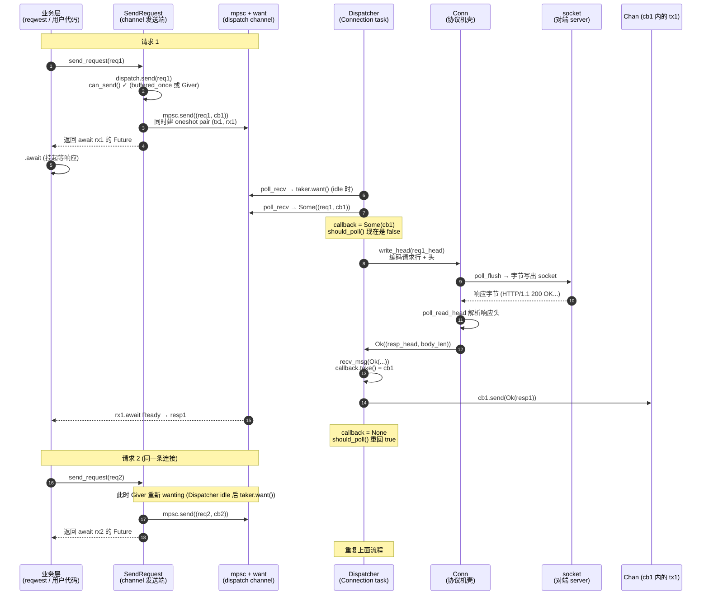
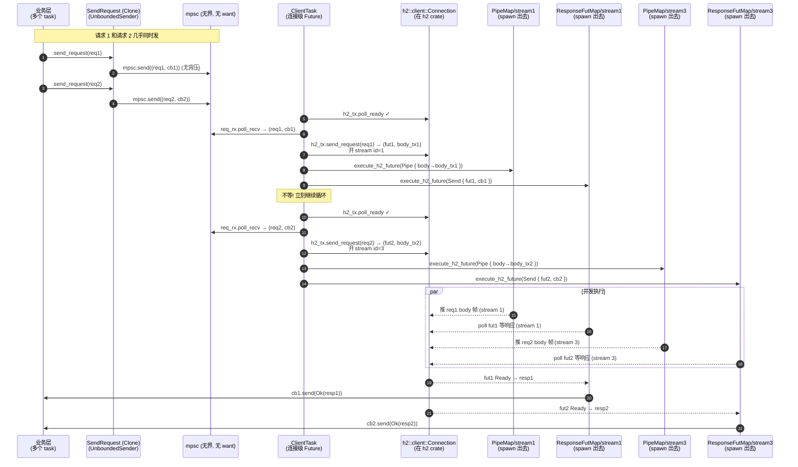

# 第 4 篇 · 第 13 章 · client/conn:发请求收响应

> **核心问题**:第 3 篇拆完了协议侧的另一半——HTTP/2 把一条 TCP 连接变成可并发跑上百个 stream 的多路复用通道,hyper 委托 h2 把它缝进 Tokio 之上的连接循环。可协议机再漂亮,client 侧真正落到代码里,用户面对的还是一个朴素的 API:`handshake(io).await` 拿回一个 `SendRequest` 和一个 `Connection`,然后 `SendRequest::send_request(req).await` 就拿到 `Response`。问题来了:这背后到底发生了什么?用户 `send_request` 一次,为什么就能拿回一个"等响应的 Future"?那条 `Connection` Future 在干什么、它和 server 侧的 `Dispatcher`(P2-05)是什么关系?同一条 HTTP/1 连接上,用户连发两个 `send_request` 会怎样——是排队还是打架?HTTP/2 又凭什么能在一条连接上并发?响应 Future 是怎么和协议机"读到响应头"那一瞬间对齐的——靠什么把响应从连接 task 递回调用方?连接突然断了,在途的 Response Future 会不会泄漏、会不会误把残缺响应当完整?
>
> 这一章钻进 hyper 的 `src/client/conn/`——它是"连接池"(上一章 P4-12)和"协议机"(P2-05/P3-09)之间的那一层桥。把这一层拆透,你就回答了"client 单条连接怎么发请求、怎么收响应",以及那个贯穿本章的关键抽象:`SendRequest` 怎么把"一条连接"伪装成一个 Service。

> **读完本章你会明白**:
> 1. `SendRequest` 到底是什么:它不是协议机、不是 Future,只是一个**握着 channel 发送端**的薄壳——`send_request(req)` 把 `(req, oneshot::Sender)` 投进 mpsc channel,返回一个等 `oneshot::Receiver` 的 Future;真正的协议循环跑在另一边的 `Connection` task 里。
> 2. client 侧的协议机循环长什么样,它和 server(P2-05)共用同一份 `Conn`/`Dispatcher`,差别全浓缩在 `Http1Transaction::should_read_first()`(server 先读请求,client 先写请求)和框架侧的 `Dispatch` impl(server 接 `Service`,client 接 channel)上。
> 3. HTTP/1 client 的"串行"是怎么自动出来的:不是显式排队,而是 `Client` 的 `Dispatch::should_poll` 返回 `callback.is_none()`——一个请求没收到响应(callback 还在),就不去收下一个请求,自然一连接一 in-flight。
> 4. HTTP/2 client 凭什么并发:`SendRequest` 在 HTTP/2 里包的是 `UnboundedSender`(可 Clone),`ClientTask::poll` 收到请求立刻 `h2_tx.send_request()` 开新 stream,再为每个 stream `executor.execute_h2_future(...)` 单独 spawn 一个 Future——多 stream 各跑各的,背压由 h2 流控兜底。
> 5. 连接级背压(`SendRequest::poll_ready`)是 hyper 的**自有方法**(不是 Service trait 的 `poll_ready`,承 P1-02):HTTP/1 用 `want` crate 的 Giver/Taker 做"接收端 ready 才发"的单槽背压;HTTP/2 不需要(并发由 h2 流控管),`poll_ready` 只判 `is_closed()`。
> 6. 为什么 sound:HTTP/1 靠"单 in-flight + `should_poll` 闸门"保证请求-响应严格按序、不乱配对;HTTP/2 靠 stream id 在 h2 内部对号入座;连接断了,channel 的 `Envelope::drop` / `Callback::drop` 给每个在途 Future 一个明确的 `canceled` 错误,绝不静默 EOF。

> **如果一读觉得太难**:先抓四件事——① `SendRequest` 只是个 channel 发送端,`send_request` 把请求投进 channel,真正的协议循环在另一头的 `Connection` task 上;② client 和 server 共用 P2-05 那套 `Conn`/`Dispatcher`/`poll_loop`,差别只在 `should_read_first()`(client 先写请求)和 `Dispatch` impl(client 接 channel);③ HTTP/1 一连接同时只有一个在途请求(`should_poll` 卡住),HTTP/2 一连接并发多 stream(每 stream 独立 spawn);④ `poll_ready` 是 hyper 自己的方法不是 Service trait 的,它做"连接级背压"。这四条钉住,后面看 `send_request`/`ClientTask::poll` 就有了挂靠点。

---

## 〇、一句话点破

> **client 侧的 `SendRequest` 不是协议机,它是一根 channel 的发送端。用户调 `send_request(req)`,hyper 把 `(req, oneshot::Sender)` 投进 mpsc channel,返回一个 `await oneshot::Receiver` 的 Response Future;真正跑协议机的是另一头那个被 spawn 出去的 `Connection` Future——它从 channel 收请求、经 `Conn`/`ClientTask` 编码写出、读回响应、再经 `oneshot` 把响应塞回那个 Future。HTTP/1 在这条 channel 上靠 `want` 单槽卡成"一连接一 in-flight",HTTP/2 靠 h2 stream id 让一条 channel 并发跑上百个 stream。`SendRequest` 的全部魔法,就是用 channel 把"一条连接"伪装成一个可以反复 `call` 的 Service。**

这是结论。本章倒过来拆:先把 `SendRequest` 这个"channel 薄壳"的样子钉死(它包什么、`send_request` 做了什么、为什么 Connection 必须被 spawn);再钻进 HTTP/1 client 的协议机循环,讲它和 server(P2-05)共用一份 `Dispatcher`、差别只在 `should_read_first()` 和 `Client` 的 `Dispatch` impl;然后拆 HTTP/1 的"串行单 in-flight"是怎么从 `should_poll` 自动落出来的、`want` crate 怎么做连接级背压;接着对照 HTTP/2 client——`ClientTask::poll` 的循环长什么样、为什么能并发、`SendRequest` 为什么在 HTTP/2 是 `Clone` 的;再拆"Response Future 怎么和协议机对齐"——oneshot channel 的桥;最后讲 sound:HTTP/1 不乱序、HTTP/2 stream id 配对、连接断了在途 Future 怎么报错不泄漏。

> **承接《Tokio》**:本章里每一条 channel(`tokio::sync::mpsc`、`tokio::sync::oneshot`、`futures_channel::mpsc`)的 `send`/`recv`/`await`/`poll`、每个 Future 的 `Poll::Pending` 让出与 `Waker` 唤醒、每个 `tokio::spawn`/`executor.execute`——这些《Tokio》拆透的机制一句带过,篇幅全留 hyper 独有:**client 侧怎么把 channel + 协议机 + Connection Future 拼成一个能用的 `SendRequest` API,以及它和 server 侧那套(承 P2-05)有什么不同**。

> **承接《gRPC》**:gRPC client 侧的 channel/call(HTTP/2 之上那一层 Call/Channel 抽象)在《gRPC》第 4 篇已拆,本章对照"hyper 用 channel + h2 stream 怎么实现一个等价的 client API"时一句带过,不重讲 gRPC 的 pick_first/round_robin 等 LB 策略(那是上层 client 的活,本书 P4-12/P4-14)。HTTP/2 的帧/stream/流控细节承《gRPC》第 2 篇 + 本书 P3-09。

---

## 一、`SendRequest`:一个 channel 薄壳

先钉死本章的主角——`SendRequest`。它看起来像个能"发请求"的东西,但它**不是协议机**、**不是 Future**、**不直接碰 IO**。它只是一个握着 channel 发送端的薄壳。

### 1.1 SendRequest 的真身

`SendRequest<B>` 的定义在 `src/client/conn/http1.rs:23`,极其简洁:

```rust
// hyper/src/client/conn/http1.rs:23-25
pub struct SendRequest<B> {
    dispatch: dispatch::Sender<Request<B>, Response<IncomingBody>>,
}
```

一个字段。`dispatch::Sender` 是 hyper 内部的 channel 发送端,定义在 `src/client/dispatch.rs:48`:

```rust
// hyper/src/client/dispatch.rs:48-61 (摘录)
pub(crate) struct Sender<T, U> {
    /// One message is always allowed, even if the Receiver hasn't asked
    /// for it yet. This boolean keeps track of whether we've sent one
    /// without notice.
    #[cfg(feature = "http1")]
    buffered_once: bool,
    /// The Giver helps watch that the Receiver side has been polled
    /// when the queue is empty. This helps us know when a request and
    /// response have been fully processed, and a connection is ready
    /// for more.
    giver: want::Giver,
    /// Actually bounded by the Giver, plus `buffered_once`.
    inner: mpsc::UnboundedSender<Envelope<T, U>>,
}
```

三个字段。把这三层剥开:

- `inner: mpsc::UnboundedSender<Envelope<T, U>>`——这是 Tokio 的**无界 mpsc channel** 的发送端(`tokio::sync::mpsc`)。channel 里传的是 `Envelope<T, U>`,对 client 来说 `T = Request<B>`、`U = Response<IncomingBody>`(`Envelope` 是个 `Option<(Request, Callback)>`,下面单拆)。
- `giver: want::Giver`——这是 `want` crate 的"Giver"( giver/taker 一对)。它独立于 mpsc 之外,专门用来做"接收端有没有准备好接收下一条"的**信号通道**。`want` 是 Sean McArthur 写的一个极小的 crate(`Cargo.toml:42`,`want = { version = "0.3", optional = true }`),核心就一对 `Giver`/`Taker`,一个给一个取,用来在两个 task 之间传一个"我准备好了"的单 bit 信号。
- `buffered_once: bool`——一个标志位,记录"接收端还没说要、但我已经悄悄塞过一条了没"。这是 HTTP/1 单 in-flight 的关键(下面单拆)。

> **钉死这件事**:`SendRequest` 不持有 IO、不持有 `Conn`、不持有协议机的任何状态。它持有的只是**一根 channel 的发送端**。这意味着——`SendRequest` 可以被传来传去(它 `Debug` 实现很简单,虽然默认不 `Clone`,但 HTTP/2 那个变体是 `Clone` 的,见第四节),可以离开生成它的函数、可以存在结构体里;真正干活的那一头(Connection Future)可以在另一个 task 上跑。两个 task 之间靠 channel 解耦。这是 `SendRequest` 设计的全部精髓:**用 channel 把"用户发请求"和"协议机跑连接"解耦成两个独立的异步上下文**。

### 1.2 send_request 到底做了什么

`SendRequest::send_request`(`http1.rs:213`)的真身:

```rust
// hyper/src/client/conn/http1.rs:213-233
pub fn send_request(
    &mut self,
    req: Request<B>,
) -> impl Future<Output = crate::Result<Response<IncomingBody>>> {
    let sent = self.dispatch.send(req);

    async move {
        match sent {
            Ok(rx) => match rx.await {
                Ok(Ok(resp)) => Ok(resp),
                Ok(Err(err)) => Err(err),
                // this is definite bug if it happens, but it shouldn't happen!
                Err(_canceled) => panic!("dispatch dropped without returning error"),
            },
            Err(_req) => {
                debug!("connection was not ready");
                Err(crate::Error::new_canceled().with("connection was not ready"))
            }
        }
    }
}
```

注意它**不是 async fn**,它是个**同步函数返回一个 Future**。这是 hyper 刻意的:`send_request` 必须立刻返回(不阻塞),让调用方拿到一个可以 `await` 的 Future。`send_request` 做的事拆成两段:

**第一段(同步部分,立刻完成)**:`self.dispatch.send(req)`。这一步把 `req` 投进 channel。`dispatch::Sender::send`(`dispatch.rs:119`)的实现:

```rust
// hyper/src/client/dispatch.rs:119-128
pub(crate) fn send(&mut self, val: T) -> Result<Promise<U>, T> {
    if !self.can_send() {
        return Err(val);
    }
    let (tx, rx) = oneshot::channel();
    self.inner
        .send(Envelope(Some((val, Callback::NoRetry(Some(tx))))))
        .map(move |_| rx)
        .map_err(|mut e| (e.0).0.take().expect("envelope not dropped").0)
}
```

三步:
1. `can_send()`——问一下 Giver,接收端准没准备好接收下一条?没准备好(`buffered_once` 已经用过)就直接 `Err(val)` 把请求原样退回(返回值会变成 `canceled` 错误)。
2. 准备好了,`oneshot::channel()` 建一对 `tx`/`rx`——`tx` 是**回响应的回调**,`rx` 是等响应的接收端。
3. 把 `(val, Callback::NoRetry(Some(tx)))` 装进 `Envelope`,`self.inner.send(...)` 投进 mpsc。

`send` 返回 `Result<Promise<U>, T>`,`Promise<U>` 就是 `oneshot::Receiver<Result<U, crate::Error>>`(`dispatch.rs:17`)——这就是"等响应的 Future"的真身。

**第二段(异步部分,放进返回的 Future 里)**:`rx.await`。调用方 `await` 这个 Future,就是 `await` 那个 oneshot Receiver。响应不来,这个 `await` 就挂起;响应来了(协议机那一头把 `tx` 填上 Response),`rx.await` Ready,Future 拿到 Response。

> **钉死这件事**:`send_request` 的全部魔法 = ① 建 oneshot pair;② 把 `(req, oneshot::Sender)` 投进 mpsc;③ 返回一个 `await oneshot::Receiver` 的 Future。它**没有碰 IO、没有 poll 协议机、没有 spawn 任何东西**。真正的"发请求"——把 req 编码成字节写出去——发生在另一头:那个跑 `Connection` Future 的 task,从 mpsc 收到 req,经协议机编码、写出 socket。

### 1.3 Envelope 和 Callback:连接 task 怎么把响应回传

channel 里传的 `Envelope`(`dispatch.rs:217`)和 `Callback`(`dispatch.rs:230`):

```rust
// hyper/src/client/dispatch.rs:217-228
struct Envelope<T, U>(Option<(T, Callback<T, U>)>);

impl<T, U> Drop for Envelope<T, U> {
    fn drop(&mut self) {
        if let Some((val, cb)) = self.0.take() {
            cb.send(Err(TrySendError {
                error: crate::Error::new_canceled().with("connection closed"),
                message: Some(val),
            }));
        }
    }
}

// hyper/src/client/dispatch.rs:230-234
pub(crate) enum Callback<T, U> {
    #[allow(unused)]
    Retry(Option<oneshot::Sender<Result<U, TrySendError<T>>>>),
    NoRetry(Option<oneshot::Sender<Result<U, crate::Error>>>),
}
```

`Envelope` 是个 `Option<(Request, Callback)>`。注意它的 `Drop`:如果一个 `Envelope` 还没被处理就被 drop 了(channel 关了、连接 task 崩了、接收端 abort),它的 `Drop` 会**显式给 callback 发一个 canceled 错误**,把 Request 还回去。这就是"连接关了在途 Future 不静默 EOF"的根本——后面 sound 一节专门拆。

`Callback` 有两个变体,`Retry` 和 `NoRetry`,区别只在错误类型:
- `NoRetry`(`oneshot::Sender<Result<U, crate::Error>>`):用在 `send_request` 里,错误就是 hyper 的 `Error`。
- `Retry`(`oneshot::Sender<Result<U, TrySendError<T>>>`):用在 `try_send_request` 里,错误带 `message: Option<T>`,可以把请求原样还回去给调用方重试。`TrySendError`(`dispatch.rs:26`)就是为了"在请求被真正发到 wire 上之前出错时,能把请求还给调用方"。

> **对照《gRPC》**:gRPC C++ core 的 `grpc_call` 也是类似抽象——一个 call 对象对应一个 RPC,内部有 completion queue 把"请求送出/响应到达"事件回调给调用方。hyper 用 Rust 的 `oneshot` channel 替代 completion queue 的回调,语义更线性、可 `await`。gRPC 的 call 是一次性的(一个 RPC 一个 call),hyper 的 `SendRequest` 是**连接级**的(一个 `SendRequest` 服务整条连接上多个请求,每 `send_request` 一次开一对新的 oneshot)——这是 hyper 把"一条连接"伪装成"反复可 call 的 Service"的关键。

### 1.4 Connection 必须被 spawn:channel 的另一头

`send_request` 只投 channel,不干活。干活的在 channel 另一头——`Connection` Future。`handshake`(`http1.rs:140`)返回 `(SendRequest<B>, Connection<T, B>)`,两者一对:

```rust
// hyper/src/client/conn/http1.rs:536-590 (摘录, Builder::handshake)
pub fn handshake<T, B>(
    &self,
    io: T,
) -> impl Future<Output = crate::Result<(SendRequest<B>, Connection<T, B>)>>
where
    T: Read + Write + Unpin,
    B: Body + 'static,
    B::Data: Send,
    B::Error: Into<Box<dyn StdError + Send + Sync>>,
{
    let opts = self.clone();
    async move {
        trace!("client handshake HTTP/1");

        let (tx, rx) = dispatch::channel();
        let mut conn = proto::Conn::new(io);
        // ... 一堆 setter 配置 conn ...
        let cd = proto::h1::dispatch::Client::new(rx);
        let proto = proto::h1::Dispatcher::new(cd, conn);

        Ok((SendRequest { dispatch: tx }, Connection { inner: proto }))
    }
}
```

`handshake` 做四件事:
1. `dispatch::channel()`——建一对 `Sender`/`Receiver`(`dispatch.rs:31`),内部包了一个 `mpsc::unbounded_channel()` + 一对 `want::new()` 的 Giver/Taker。
2. `proto::Conn::new(io)`——把 IO 包成 `Conn<I, B::Data, T>`(协议机壳,P2-05 拆透,这里 `T = ClientTransaction`)。
3. `proto::h1::dispatch::Client::new(rx)`——把 channel 的接收端 `rx` 包进 `Client<B>`(client 侧的 `Dispatch` impl)。
4. `proto::h1::Dispatcher::new(cd, conn)`——把 `Client` 和 `Conn` 组装成 `Dispatcher`(P2-05 的连接循环驱动器)。

返回的 `(SendRequest { dispatch: tx }, Connection { inner: proto })`——`tx` 是 channel 发送端(给用户),`proto` 是 `Dispatcher`(Connection 内部)。

`Connection` 本身是个 Future(`http1.rs:301`):

```rust
// hyper/src/client/conn/http1.rs:301-323
impl<T, B> Future for Connection<T, B>
where
    T: Read + Write + Unpin,
    B: Body + 'static,
    B::Data: Send,
    B::Error: Into<Box<dyn StdError + Send + Sync>>,
{
    type Output = crate::Result<()>;

    fn poll(mut self: Pin<&mut Self>, cx: &mut Context<'_>) -> Poll<Self::Output> {
        match ready!(Pin::new(&mut self.inner).poll(cx))? {
            proto::Dispatched::Shutdown => Poll::Ready(Ok(())),
            proto::Dispatched::Upgrade(pending) => {
                pending.manual();
                Poll::Ready(Ok(()))
            }
        }
    }
}
```

它的 `poll` 转发到 `self.inner.poll`(也就是 `Dispatcher::poll`),`Dispatcher::poll` 承 P2-05 就是那个 `poll_loop` 循环。`Connection` Future 的 doc(`http1.rs:54-59`)写得直白:

```rust
/// A future that processes all HTTP state for the IO object.
///
/// In most cases, this should just be spawned into an executor, so that it
/// can process incoming and outgoing messages, notice hangups, and the like.
```

> **钉死这件事**:用户拿到 `(SendRequest, Connection)` 之后,**必须把 `Connection` spawn 出去**(或者 `await` 它,但通常 spawn)。否则 channel 的接收端 `rx` 永远不会被 poll,`Dispatcher` 的 `poll_loop` 永远不会跑,请求永远堆在 mpsc 里发不出去——`send_request(req).await` 会永远挂起。这是 `handshake` 的"契约":**`SendRequest` 和 `Connection` 是一对**,缺一不可。文档注释直接点出来:"Note, if Connection is not await-ed, SendRequest will do nothing."(`http2.rs:547-549`)。连接池(上层 P4-12)就是那个负责"spawn Connection task + 给业务层发 SendRequest 句柄"的角色。

下面这张图把 `SendRequest` / `Connection` / channel 三者的关系摆出来:

```
┌──────────────────────── 业务层(reqwest / 直接用 hyper) ─────────────────────────┐
│                                                                                    │
│     let mut sr: SendRequest<B> = handshake(io).await?.0;                           │
│                                                                                    │
│     // 用户线程/任务                                                                │
│     sr.send_request(req).await ──┐                                                  │
│                                  │ ① 投 (req, oneshot::Sender) 进 mpsc               │
│                                  │ ② 返回 await oneshot::Receiver 的 Future          │
│                                  ▼                                                  │
└──────────────────────────────────┼──────────────────────────────────────────────────┘
                                   │
            ┌──────────────────────▼───────────────────────────┐
            │       tokio::sync::mpsc::unbounded_channel         │
            │       (夹层: want::Giver ◄──► want::Taker)         │
            │       Envelope<Request<B>, Response<Incoming>>     │
            └──────────────────────┬───────────────────────────┘
                                   │ poll_recv
            ┌──────────────────────▼───────────────────────────┐
            │     Connection task (被 spawn 出去的那个)           │
            │                                                    │
            │     Connection<T, B> {                             │
            │         inner: Dispatcher<                         │
            │             proto::dispatch::Client<B>,  ◄── 接 channel
            │             B,                                      │
            │             T,                                      │
            │             ClientTransaction          ◄── Role: client
            │         >                                           │
            │     }                                               │
            │                                                    │
            │     Dispatcher::poll_loop (承 P2-05):              │
            │       poll_read  → poll_read_head (解析响应头)      │
            │       poll_write → poll_msg 收 req → write_head    │
            │                    (把请求编码写出 socket)          │
            │       poll_flush → 字节推到 socket                  │
            │                                                    │
            │     收到响应头 → Client::recv_msg(head, body)        │
            │                → callback.send(Ok(response))        │
            │                                                  │
            │            │ oneshot::Sender.send(resp)             │
            └────────────┼──────────────────────────────────────┘
                         │
                         ▼  唤醒 oneshot::Receiver
            ┌─────────────────────────────────────────────────┐
            │   业务层:rx.await 拿到 Response<IncomingBody>      │
            └─────────────────────────────────────────────────┘
```

整章的剩余部分,都是在拆这张图里的某个箭头在源码里怎么落地。

---

## 二、HTTP/1 client 的协议机循环:和 server 共用一套

把 `SendRequest` 的"channel 薄壳"钉死后,现在钻进 channel 的另一头——`Connection` task 里跑的那个协议机循环。好消息是:**这一套我们在 P2-05 已经拆透了**。client 和 server 共用同一份 `Dispatcher`、同一个 `poll_loop`、同一个 `Conn`。本节只讲 client 和 server 的**差异**——一句话,差异全浓缩在两个地方:`Http1Transaction::should_read_first()`(协议层)和 `Dispatch` impl(框架层)。

### 2.1 共用:`Dispatcher`/`Conn`/`poll_loop` 一字不改

P2-05 拆过,`Dispatcher`(`proto/h1/dispatch.rs:22`)是泛型 `Dispatcher<D, Bs, I, T>`,其中 `D: Dispatch`(框架侧)、`T: Http1Transaction`(协议层 Role)。client 和 server 用**同一份** `Dispatcher` 源码:

- `poll`(`dispatch.rs:479`)、`poll_catch`(`dispatch.rs:123`)、`poll_inner`(`dispatch.rs:143`)、`poll_loop`(`dispatch.rs:166`)、`poll_read`/`poll_write`/`poll_flush`(`dispatch.rs:216`/`347`/`442`)——这些函数源码里**没有任何 `if server`/`if client` 的硬编码分支**,全靠泛型 `T` 和 trait method 分流。这是 P2-05 第五节"Http1Transaction:为什么 client 和 server 共用一套连接逻辑"已经钉死的事,本章不重讲。
- `Conn<I, B::Data, T>`(`proto/h1/conn.rs:38`)的 `Reading`/`Writing`/`KA` 三套状态机、`try_keep_alive`、`force_io_read`——全是共用的。

所以对 client 来说,`Connection { inner: Dispatcher<Client<B>, B, T, ClientTransaction> }` 的 `poll` 转发到 `Dispatcher::poll`,跑的就是 P2-05 那个 `poll_loop`:

```rust
// hyper/src/proto/h1/dispatch.rs:166-213 (摘录, 承 P2-05)
fn poll_loop(&mut self, cx: &mut Context<'_>) -> Poll<crate::Result<()>> {
    for _ in 0..16 {
        let _ = self.poll_read(cx)?;
        let write_ready = self.poll_write(cx)?.is_ready();
        let flush_ready = self.poll_flush(cx)?.is_ready();
        // ... wants_write_again / wants_read_again 防死锁防饿死 ...
    }
    task::yield_now(cx).map(|never| match never {})
}
```

`for _ in 0..16` + `yield_now` 的连接级协作式让出(P2-05 技巧一)、`poll_read`/`poll_write`/`poll_flush` 三轮独立(P2-05 第 2.3 节)、`OptGuard`/`SenderDropGuard` 两个 RAII guard(P2-05 技巧二)——**全部一字不改地服务于 client**。这是 hyper 复用代码的招牌:一份连接循环驱动 server 和 client 两个角色。

> **钉死这件事**:本章不重复 P2-05。如果你对 `poll_loop`/`Conn`/`Reading`/`Writing`/`KA` 这些还陌生,先读 P2-05。本章只回答:**client 侧这份共用的循环,和 server 比有哪几个地方不一样**,以及那个不一样的根源(`should_read_first()` + `Client` 的 `Dispatch` impl)。

### 2.2 差异一:`should_read_first()`——client 先写,server 先读

第一个差异在协议层。`Http1Transaction`(`proto/h1/mod.rs:30`)的默认方法 `should_read_first()`(`mod.rs:53`):

```rust
// hyper/src/proto/h1/mod.rs:49-55 (摘录)
fn should_error_on_parse_eof() -> bool { Self::is_client() }
fn should_read_first() -> bool { Self::is_server() }
```

`ClientTransaction`(`role.rs:1010` 的 `impl Http1Transaction for Client`)覆盖 `is_client()` 为 `true`(`role.rs:1240`),所以对 client,`should_read_first() = false`。

这一个 bool 的取反,在 `Conn::can_read_head`(`conn.rs:175`,P2-05 第 5.2 节摘过)里被读取:

```rust
// hyper/src/proto/h1/conn.rs:175-185
pub(crate) fn can_read_head(&self) -> bool {
    if !matches!(self.state.reading, Reading::Init) {
        return false;
    }

    if T::should_read_first() {
        true          // server: 直接可以读头
    } else {
        // client: 只有写过(请求)了, 才能读(响应)头
        !matches!(self.state.writing, Writing::Init)
    }
}
```

对 server(`should_read_first() = true`):只要 `reading` 是 Init 就能读头——server accept 一条连接,第一件事是读请求。

对 client(`should_read_first() = false`):`reading` 是 Init 还不够,还得 `writing` 不是 Init——也就是**已经写过请求头了**。client 不会"没发请求就去读响应"。这一行就是 client/server 协议行为差异的全部:client 先写请求,server 先读请求,谁先谁后全靠这一个 trait method。

对应的 `can_write_head`(`conn.rs:573`)对 client 也有一处对称的差别:client 如果 `reading` 已经 `Closed`(server 把读通道关了),就不能再写头了——避免"对端关了我还在发"。

> **不这样会怎样**:如果 client 也用 `should_read_first() = true`,那 client 连接刚建立 `reading` 是 `Init`,`poll_read_head` 就会去试读 socket——可此时 client 根本没发请求,server 不会回数据,读 socket 要么一直 Pending(空转),要么读到 server 主动关连接的 EOF 被当成"协议错"。所以 client 必须用 `should_read_first() = false`,把"先写请求"这个顺序不变量编码进 `can_read_head`。这就是为什么同一个 `poll_loop` 能同时服务两个角色——所有"谁先谁后"的差异,在编译期就被 `T::should_read_first()` 这个静态分发消解了。

### 2.3 差异二:`Client` 的 `Dispatch` impl——接 channel,不接 Service

第二个、也是更重要的差异,在框架侧。`Dispatcher` 持有 `dispatch: D: Dispatch`(`dispatch.rs:22`),这个 `Dispatch` trait(`dispatch.rs:30`)是"协议侧 ↔ 框架侧"的接口(P2-05 第五节拆过):

```rust
// hyper/src/proto/h1/dispatch.rs:30-43
pub(crate) trait Dispatch {
    type PollItem;
    type PollBody;
    type PollError;
    type RecvItem;
    fn poll_msg(self: Pin<&mut Self>, cx) -> Poll<Option<Result<(Self::PollItem, Self::PollBody), Self::PollError>>>;
    fn recv_msg(&mut self, msg: crate::Result<(Self::RecvItem, IncomingBody)>) -> crate::Result<()>;
    fn poll_ready(&mut self, cx) -> Poll<Result<(), ()>>;
    fn should_poll(&self) -> bool;
}
```

四个方法,对应"协议侧问框架侧"的四个交互(P2-05 第 5.3 节):
- `poll_ready`:你准备好接下一个请求了吗?(背压)
- `recv_msg`:我把解析出来的请求/响应给你。
- `should_poll`:你有要写出去的东西吗?
- `poll_msg`:把你那边要写的东西给我。

server 侧的 `Server<S, B>` 实现这个 trait 时(`dispatch.rs:578`),`recv_msg` 把请求交给 `self.service.call(req)`(承 P1-02 Service trait),`poll_msg` poll 那个 `in_flight` Future。**client 侧完全不同**——`Client<B>`(`dispatch.rs:56`)接的不是 Service,而是 channel。看 `Client` 的结构:

```rust
// hyper/src/proto/h1/dispatch.rs:54-65
cfg_client! {
    pin_project_lite::pin_project! {
        pub(crate) struct Client<B> {
            callback: Option<crate::client::dispatch::Callback<Request<B>, http::Response<IncomingBody>>>,
            #[pin]
            rx: ClientRx<B>,
            rx_closed: bool,
        }
    }

    type ClientRx<B> = crate::client::dispatch::Receiver<Request<B>, http::Response<IncomingBody>>;
}
```

三个字段:
- `callback: Option<Callback<Request<B>, Response<IncomingBody>>>`——当前在途请求的回调(那个 `oneshot::Sender`)。有 callback 在,说明"我发了一个请求出去,正在等响应"。
- `rx: ClientRx<B>`——channel 的接收端(就是 `dispatch::Receiver`,内部是 `mpsc::UnboundedReceiver` + `want::Taker`)。
- `rx_closed: bool`——标记发送端(用户的 `SendRequest`)是否已 drop。

现在看 `Client` 怎么实现 `Dispatch` 的四个方法(`dispatch.rs:655-759`):

**(1) `poll_msg`——从 channel 收用户的请求**(`dispatch.rs:664`):

```rust
// hyper/src/proto/h1/dispatch.rs:664-699 (摘录)
fn poll_msg(
    mut self: Pin<&mut Self>,
    cx: &mut Context<'_>,
) -> Poll<Option<Result<(Self::PollItem, Self::PollBody), Infallible>>> {
    let mut this = self.as_mut();
    debug_assert!(!this.rx_closed);
    match this.rx.poll_recv(cx) {
        Poll::Ready(Some((req, mut cb))) => {
            // check that future hasn't been canceled already
            match cb.poll_canceled(cx) {
                Poll::Ready(()) => {
                    trace!("request canceled");
                    Poll::Ready(None)
                }
                Poll::Pending => {
                    let (parts, body) = req.into_parts();
                    let head = RequestHead { /* ... */ };
                    this.callback = Some(cb);     // ← 把 callback 存起来
                    Poll::Ready(Some(Ok((head, body))))
                }
            }
        }
        Poll::Ready(None) => { /* user dropped sender */ this.rx_closed = true; Poll::Ready(None) }
        Poll::Pending => Poll::Pending,
    }
}
```

`Client::poll_msg` 干的事:从 `rx` 收一个 `Request`,把它的 head/body 拆出来交给协议机去编码写出,**同时把那个 `cb`(oneshot::Sender)存到 `self.callback`**。这个 callback 就是要回响应的钥匙——等协议机读到响应头,用 `callback.send(Ok(response))` 把响应送回业务层的 Future。

注意还有一个细节:`poll_recv` 收到请求后,先 `cb.poll_canceled(cx)` 检查这个请求是不是已经被调用方 cancel 了(业务层把 Response Future drop 了,oneshot::Sender 会看到接收端没了)。如果已经 cancel,直接返回 `Poll::Ready(None)`——协议机不会把这个请求写出去。

**(2) `recv_msg`——协议机读到响应了,回传**(`dispatch.rs:701`):

```rust
// hyper/src/proto/h1/dispatch.rs:701-741 (摘录)
fn recv_msg(&mut self, msg: crate::Result<(Self::RecvItem, IncomingBody)>) -> crate::Result<()> {
    match msg {
        Ok((msg, body)) => {
            if let Some(cb) = self.callback.take() {
                let res = msg.into_response(body);
                cb.send(Ok(res));           // ← 响应回传给业务层 Future
                Ok(())
            } else {
                Err(crate::Error::new_unexpected_message())
            }
        }
        Err(err) => {
            if let Some(cb) = self.callback.take() {
                cb.send(Err(TrySendError { error: err, message: None }));
                Ok(())
            } else if !self.rx_closed {
                // 连接错且没在途 callback: 从 channel 收回排队中的下一个请求, 报 cancel
                self.rx.close();
                if let Some((req, cb)) = self.rx.try_recv() {
                    cb.send(Err(TrySendError {
                        error: crate::Error::new_canceled().with(err),
                        message: Some(req),
                    }));
                    Ok(())
                } else {
                    Err(err)
                }
            } else {
                Err(err)
            }
        }
    }
}
```

`recv_msg` 在协议机读到响应(或读到错误)时被调用。它 `self.callback.take()` 拿出那个存着的 callback,把响应(或错误)`send` 出去——oneshot 那头的业务层 Future 立刻 Ready,拿到 Response。

错误路径(`Err(err)`)还有一个值得注意的分支:如果连接报错且**当前没有 callback 在途**(`self.callback` 是 None),但 channel 里还排着下一个请求——`recv_msg` 会 `rx.close()` 关掉 channel,`try_recv` 把排队的那个请求拿出来,用 `canceled` 错误还回去(带 `message: Some(req)`,让调用方能重试)。这处理的是"请求刚投进 channel 还没轮到处理,连接就挂了"的边界。

**(3) `poll_ready`——问"能接下一个请求了吗"**(`dispatch.rs:743`):

```rust
// hyper/src/proto/h1/dispatch.rs:743-754
fn poll_ready(&mut self, cx: &mut Context<'_>) -> Poll<Result<(), ()>> {
    match self.callback {
        Some(ref mut cb) => match cb.poll_canceled(cx) {
            Poll::Ready(()) => {
                trace!("callback receiver has dropped");
                Poll::Ready(Err(()))
            }
            Poll::Pending => Poll::Ready(Ok(())),
        },
        None => Poll::Ready(Err(())),
    }
}
```

client 的 `poll_ready` 语义和 server 截然不同。server 的 `Server::poll_ready`(`dispatch.rs:626`)是"in_flight 为空就 Ready"——server 准备好接下一个请求。client 的 `poll_ready` 是:**有 callback 在途(且没被 cancel)就 Ready,否则 Err(())**。

为什么这么反直觉?因为这个 `poll_ready` 在 `poll_read_head`(`dispatch.rs:294`)里被调用,而 `poll_read_head` 是"读响应头":

```rust
// hyper/src/proto/h1/dispatch.rs:292-299
fn poll_read_head(&mut self, cx: &mut Context<'_>) -> Poll<crate::Result<()>> {
    // can dispatch receive, or does it still care about other incoming message?
    if let Ok(()) = ready!(self.dispatch.poll_ready(cx)) {
    } else {
        trace!("dispatch no longer receiving messages");
        self.close();
        return Poll::Ready(Ok(()));
    }
    // ... 真正读响应头 ...
}
```

对 client 来说,"dispatch ready to receive"的意思是"我有一个 callback 在等响应,我有理由去读响应头"。如果 callback 是 None(client 没有在途请求),`poll_ready` 返回 `Err(())`,`poll_read_head` 走 `else` 分支 `self.close()`——client 不主动读响应(没请求就没响应)。这就是为什么 client 不会"没发请求就去读 socket"。

**(4) `should_poll`——问"该去收下一个请求吗"**(`dispatch.rs:756`):

```rust
// hyper/src/proto/h1/dispatch.rs:756-758
fn should_poll(&self) -> bool {
    self.callback.is_none()
}
```

这是 client HTTP/1 "串行单 in-flight" 的**命脉**。`should_poll` 返回 `callback.is_none()`——意思是:**只有当前没有在途请求(callback 是 None)的时候,才去 channel 收下一个请求**。

这一行配合 `poll_write`(`dispatch.rs:347`)的闸门:

```rust
// hyper/src/proto/h1/dispatch.rs:351-353
} else if self.body_rx.is_none()
    && self.conn.can_write_head()
    && self.dispatch.should_poll()       // ← client: callback.is_none()
{
```

`should_poll()` 为 false(callback 在),`poll_write` 根本不会去 `poll_msg` 收新请求。也就是说,**前一个请求没收到响应(callback 还没被 `recv_msg` 消费掉)之前,client 不会从 channel 拿下一个请求**。这就是 HTTP/1 client 串行的自动落出——下一节专门拆。

> **钉死这件事**:server 和 client 的 `Dispatch` impl 是完全对称的两种语义。server:接 Service(`service.call(req)` 产 in_flight Future),`poll_ready` 问 in_flight 空不空(背压),`poll_msg` poll in_flight 拿响应。client:接 channel(`rx.poll_recv` 拿用户请求),`poll_ready` 问 callback 在不在(有理由读响应),`poll_msg` 从 channel 收请求,**`should_poll` 用 `callback.is_none()` 卡住单 in-flight**。同一个 `Dispatch` trait、同一个 `Dispatcher` 循环,服务两种完全不同的框架侧语义——这是 Rust trait + 泛型在"协议复用"上的又一次教科书应用(P2-05 第五节已钉死,这里换了个角度重申)。

---

## 三、HTTP/1 client 的"串行单 in-flight":怎么自动落出来

上一节末尾说了,`Client::should_poll` 返回 `callback.is_none()`——这就是 HTTP/1 client 一条连接同时只处理一个请求-响应的根源。本节把这个"串行"的机理彻底拆透,再讲 `want` crate 怎么把背压一路传回业务层。

### 3.1 串行不是显式排队,是 `should_poll` 的闸门

很多人想象 HTTP/1 client 的"串行"是这样的:用户连发两个 `send_request`,hyper 把它们排进一个队列,前一个响应回来了,再出队处理下一个。**这是错的**。hyper 根本没有显式的请求队列。串行是这么自动落出来的:

1. **第一个请求**:用户 `sr.send_request(req1).await` 触发 → `dispatch.send(req1)` → `can_send()` 通过(Giver 第一次允许,或者 `buffered_once` 第一次允许)→ `req1` 进 mpsc,callback1 进 oneshot。`Dispatcher` 的 `poll_write` 看到 `should_poll()` 为 true(此时 callback 还是 None)→ `poll_msg` 从 channel 收 req1 → `this.callback = Some(cb1)` → 把 req1 编码写出。
2. **第二个请求紧接着发**:用户 `sr.send_request(req2).await`(假设在另一个 task 里,或者 req1 的 Future 还没 ready)。`dispatch.send(req2)` → `can_send()`——**这里 Giver 大概率不让过**(`buffered_once` 已用,且接收端还没说"我要下一条")。req2 被 `send` 拒绝,`send_request` 返回的 Future 立刻 Ready 成 `Err(canceled)` 错误。
3. **req1 的响应回来了**:`Dispatcher::poll_read` → `poll_read_head` 解析响应头 → `recv_msg` → `cb1.send(Ok(resp1))` → callback1 被 take 走 → `self.callback = None`。**此刻** `should_poll()` 重新变 true,`poll_write` 下一圈会去 channel 收下一个请求——但此时 req2 早就被 `send` 拒绝退回了。
4. **业务层重发 req2**:业务层看到 req2 报了 canceled(或者它先 `poll_ready` 再 send),重新 `send_request(req2)`,这次 `can_send()` 通过(接收端 idle 了)→ req2 进 channel → 协议机处理。

关键在第 2 步:`can_send()` 在 HTTP/1 client 上的语义是"接收端(Dispatcher)idle 且准备好接下一条"。它怎么知道?靠 `want` crate。

### 3.2 `want` crate:连接级背压的信号通道

`want` 是 hyper 用的一对"Giver/Taker",专门用来在两个 task 之间传一个"我准备好了"的单 bit 信号。`dispatch::channel()`(`dispatch.rs:31`)建出来的 channel,内部除了 mpsc 还有一对 `want::new()`:

```rust
// hyper/src/client/dispatch.rs:31-42
pub(crate) fn channel<T, U>() -> (Sender<T, U>, Receiver<T, U>) {
    let (tx, rx) = mpsc::unbounded_channel();
    let (giver, taker) = want::new();
    let tx = Sender {
        #[cfg(feature = "http1")]
        buffered_once: false,
        giver,
        inner: tx,
    };
    let rx = Receiver { inner: rx, taker };
    (tx, rx)
}
```

`Sender`(用户/`SendRequest` 那一头)持有 `giver: want::Giver`,`Receiver`(`Dispatcher` 那一头)持有 `taker: want::Taker`。两边对话:

- **接收端(Dispatcher)说"我要"**:`Receiver::poll_recv`(`dispatch.rs:182`)在 mpsc 空的时候,会 `self.taker.want()`——告诉 giver"我准备好接下一条了":

```rust
// hyper/src/client/dispatch.rs:181-192
impl<T, U> Receiver<T, U> {
    pub(crate) fn poll_recv(&mut self, cx: &mut Context<'_>) -> Poll<Option<(T, Callback<T, U>)>> {
        match self.inner.poll_recv(cx) {
            Poll::Ready(item) => {
                Poll::Ready(item.map(|mut env| env.0.take().expect("envelope not dropped")))
            }
            Poll::Pending => {
                self.taker.want();      // ← 告诉 giver: 我想要下一条
                Poll::Pending
            }
        }
    }
    // ...
}
```

注意只有 mpsc 空的时候才 `taker.want()`——如果还有积压,先消化积压。`taker.want()` 会唤醒 giver 那一头(如果它正挂在 `poll_want` 上)。

- **发送端(用户)问"我能发吗"**:`Sender::poll_ready`(`dispatch.rs:76`)直接转发到 `giver.poll_want(cx)`:

```rust
// hyper/src/client/dispatch.rs:76-80
pub(crate) fn poll_ready(&mut self, cx: &mut Context<'_>) -> Poll<crate::Result<()>> {
    self.giver
        .poll_want(cx)
        .map_err(|_| crate::Error::new_closed())
}
```

`giver.poll_want` 在 taker 还没说"我要"的时候返回 `Pending`(挂起);taker 说了"我要",返回 `Ready(Ok(()))`;taker 那一头 drop 了(连接 task 死了),返回 `Err`(`new_closed()`)。

- **发送端"偷发一条"的容忍**:`can_send`(`dispatch.rs:93`)给了 `buffered_once` 的容忍:

```rust
// hyper/src/client/dispatch.rs:92-104
fn can_send(&mut self) -> bool {
    if self.giver.give() || !self.buffered_once {
        // If the receiver is ready *now*, then of course we can send.
        //
        // If the receiver isn't ready yet, but we don't have anything
        // in the channel yet, then allow one message.
        self.buffered_once = true;
        true
    } else {
        false
    }
}
```

`self.giver.give()`——问一下 taker 现在是不是 wanting,如果是,直接 true。如果 taker 没 wanting,但 `buffered_once` 还是 false(这条 channel 还没发过"未授权"的消息),允许**偷发一条**,置 `buffered_once = true`。第二次再偷发,被拒。

这个"偷发一条"的容忍非常关键,它让业务层**第一次 `send_request` 不需要先 `poll_ready`** 就能直接发——提升了 API 的易用性。但代价是业务层必须在第二次发之前 `poll_ready`(或者用 `ready().await`),否则会被 `canceled`。

> **钉死这件事**:HTTP/1 client 的连接级背压,是 `SendRequest::poll_ready`(`http1.rs:156`)→ `dispatch::Sender::poll_ready`(`dispatch.rs:76`)→ `want::Giver::poll_want` 这一条链。`want` crate 用一对 Giver/Taker 在两个 task 之间传"我准备好了"的单 bit 信号,**完全独立于 mpsc channel 本身**(mpsc 是 unbounded 的,不做背压)。Dispatcher 那一头在 idle(mpsc 空)时 `taker.want()` 置位,业务层 `poll_ready` 才 Ready。这就是"连接级背压"——它的语义不是"队列满了",而是"接收端准备好接下一条了"。

### 3.3 `poll_ready` 是 hyper 自有方法,不是 Service trait 的

到这里必须钉死一个 P1-02 已经确认、但读者可能仍会混淆的点:**`SendRequest::poll_ready` 是 hyper 自己的方法,不是 Tower/hyper Service trait 的 `poll_ready`**。

`SendRequest<B>` **没有实现 `hyper::service::Service` trait**。它的 `poll_ready`(`http1.rs:156`)是个 inherent method:

```rust
// hyper/src/client/conn/http1.rs:152-182 (摘录)
impl<B> SendRequest<B> {
    /// Polls to determine whether this sender can be used yet for a request.
    ///
    /// If the associated connection is closed, this returns an Error.
    pub fn poll_ready(&mut self, cx: &mut Context<'_>) -> Poll<crate::Result<()>> {
        self.dispatch.poll_ready(cx)
    }

    /// Waits until the dispatcher is ready.
    pub async fn ready(&mut self) -> crate::Result<()> {
        crate::common::future::poll_fn(|cx| self.poll_ready(cx)).await
    }

    pub fn is_ready(&self) -> bool { self.dispatch.is_ready() }
    pub fn is_closed(&self) -> bool { self.dispatch.is_closed() }
}
```

为什么不让 `SendRequest` 实现 `Service`?回顾 P1-02:hyper 1.0 的 `Service` trait **没有 `poll_ready`**(被 hyper 1.0 删掉了,背压挪到了别处)。`SendRequest` 偏偏需要 `poll_ready` 这个连接级背压——HTTP/1 一条连接同时只能一个 in-flight,这个不变量必须有个地方卡住。hyper 的选择是:**`SendRequest` 不是 Service,但它有个长得像 Service 的 API(`poll_ready` + `call`-like `send_request`)**,而且 `poll_ready` 是它自己的 inherent method,不是 trait method。

这个设计的好处:
- **`SendRequest` 不被 Service trait 的"无 poll_ready"约束束缚**,可以正大光明地暴露连接级背压。
- **业务层可以手写一个 wrapper 把 `SendRequest` 包成 Service**(给 Tower 用),wrapper 的 `Service::call` 内部先 `self.send_request.poll_ready(cx)?` 再 `self.send_request.send_request(req)`——上层连接池(reqwest/hyper-util)就是这么干的。
- **HTTP/2 的 `SendRequest` 也暴露同名 `poll_ready`**(`http2.rs:97`),但语义不同(只判 `is_closed`)——同一个 API 名字、两种语义,因为 `SendRequest` 不是 trait,可以各自定义。

> **承接 P1-02**:P1-02 拆过 hyper 1.0 的 Service trait 没有 `poll_ready`,背压挪到了"in_flight 单槽"(server)、"SendRequest"(client)。本章就是在兑现那个承诺——client 侧的背压确实落在 `SendRequest::poll_ready` 上,而且它是 inherent method 不是 trait method。把这件事和 P1-02 串起来读,你会看到 hyper 1.0 的设计是一致的:Service trait 保持纯净(只 `call`),所有背压都在"具体连接"那一层各自解决。

下面这张时序图把 HTTP/1 client 一条连接上发请求-收响应的全过程画出来:



注意图里第 11-12 行(注释 `should_poll() 现在是 false` 到 `should_poll() 重回 true`):请求 1 从发出到响应回来这段时间,**Dispatcher 不会去 channel 收请求 2**——这就是 HTTP/1 client 的串行。请求 2 必须等请求 1 完整结束(callback 被 take),才能进入协议机。

---

## 四、HTTP/2 client:凭什么并发

HTTP/1 client 的串行是协议逼出来的(承 P3-09 第一节)。HTTP/2 把这个结剪开了——一条连接可以并发跑多个 stream。这一节拆:hyper 的 HTTP/2 client 在 `src/client/conn/http2.rs` + `src/proto/h2/client.rs` 这两层是怎么落地并发的,它的 `SendRequest` 和 HTTP/1 的有什么不同。

### 4.1 HTTP/2 的 `SendRequest`:`UnboundedSender` 且 `Clone`

先看 HTTP/2 的 `SendRequest`(`http2.rs:24`):

```rust
// hyper/src/client/conn/http2.rs:23-34
/// The sender side of an established connection.
pub struct SendRequest<B> {
    dispatch: dispatch::UnboundedSender<Request<B>, Response<IncomingBody>>,
}

impl<B> Clone for SendRequest<B> {
    fn clone(&self) -> SendRequest<B> {
        SendRequest {
            dispatch: self.dispatch.clone(),
        }
    }
}
```

和 HTTP/1 的 `SendRequest`(`dispatch: Sender<...>`)对比,有两点不同:
1. 包的是 `UnboundedSender`(`dispatch.rs:68`)而不是 `Sender`。`UnboundedSender` 没有 `giver: want::Giver`(只有 `giver: want::SharedGiver`,仅用来判 closed),**不做 Giver/Taker 背压**——它真的就是无界的 mpsc。
2. **`SendRequest` 在 HTTP/2 是 `Clone` 的**。HTTP/1 的 `SendRequest` 不是 Clone(因为内部 `Sender` 持有 `want::Giver`,Giver 不可共享)。

这两个差异的根源是同一个:**HTTP/2 不需要连接级背压来卡单 in-flight**。一条 HTTP/2 连接可以并发跑上百个 stream(默认 `initial_max_send_streams = 100`,`proto/h2/client.rs:61`),让用户随便投请求进 channel、随便 Clone `SendRequest` 分发到多个 task,并发上限由 h2 的流控(`max_concurrent_streams`)在协议层兜底,不需要 hyper 在 channel 这一层卡。

看 `UnboundedSender`(`dispatch.rs:139-164`):

```rust
// hyper/src/client/dispatch.rs:139-164 (摘录)
impl<T, U> UnboundedSender<T, U> {
    pub(crate) fn is_ready(&self) -> bool { !self.giver.is_canceled() }
    pub(crate) fn is_closed(&self) -> bool { self.giver.is_canceled() }

    pub(crate) fn try_send(&mut self, val: T) -> Result<RetryPromise<T, U>, T> {
        let (tx, rx) = oneshot::channel();
        self.inner
            .send(Envelope(Some((val, Callback::Retry(Some(tx))))))
            .map(move |_| rx)
            .map_err(|mut e| (e.0).0.take().expect("envelope not dropped").0)
    }

    pub(crate) fn send(&mut self, val: T) -> Result<Promise<U>, T> {
        let (tx, rx) = oneshot::channel();
        self.inner
            .send(Envelope(Some((val, Callback::NoRetry(Some(tx))))))
            .map(move |_| rx)
            .map_err(|mut e| (e.0).0.take().expect("envelope not dropped").0)
    }
}
```

`UnboundedSender::send` 不调 `can_send`、不查 Giver——直接 `self.inner.send(...)` 投进 mpsc。它几乎永远成功(除非 channel 关了,mpsc::send 才会 Err)。

对应的 `SendRequest::poll_ready`(`http2.rs:97`)也极简:

```rust
// hyper/src/client/conn/http2.rs:93-103
impl<B> SendRequest<B> {
    pub fn poll_ready(&mut self, _cx: &mut Context<'_>) -> Poll<crate::Result<()>> {
        if self.is_closed() {
            Poll::Ready(Err(crate::Error::new_closed()))
        } else {
            Poll::Ready(Ok(()))
        }
    }
    // ...
}
```

HTTP/2 的 `poll_ready` 只判 `is_closed()`——连接没关就 Ready,根本不做并发限制。为什么敢这么松?因为 h2 自己会在 `send_request` 那一层卡(`h2::client::SendRequest::poll_ready` 在 max_concurrent_streams 满了会 Pending,在 h2 crate 内,本书不编行号)。

> **钉死这件事**:HTTP/1 的 `SendRequest` 和 HTTP/2 的 `SendRequest` 同名同 API(`poll_ready`/`send_request`),但内部包的 channel 不同、背压语义不同。HTTP/1:`Sender` + `want::Giver`,做"单 in-flight"的连接级背压。HTTP/2:`UnboundedSender` + 无 Giver,无连接级背压,并发由 h2 流控在协议层兜底。这是同一个抽象(`SendRequest`)在两种协议下的语义差异——读 hyper 看到 `SendRequest`,先问"HTTP/1 还是 HTTP/2 的?",两者的背压行为完全不同。

### 4.2 `ClientTask::poll`:HTTP/2 client 的连接循环

HTTP/2 的 `Connection` Future 内部包的不是 `Dispatcher`(那个是 HTTP/1 的),而是 `ClientTask`(`http2.rs:57`,`Connection { inner: (PhantomData<T>, proto::h2::ClientTask<B, E, T>) }`)。`ClientTask`(`proto/h2/client.rs:425`)是 HTTP/2 client 的连接循环驱动器,它和 HTTP/1 的 `Dispatcher` 平行——但它**不共用源码**,因为 HTTP/2 不走 `Conn`/`poll_loop` 那套(承 P3-09,HTTP/2 委托 h2,h2 自己管帧/stream/流控,hyper 只做适配)。

`ClientTask` 的结构(`client.rs:425`):

```rust
// hyper/src/proto/h2/client.rs:425-438
pub(crate) struct ClientTask<B, E, T>
where
    B: Body,
    E: Unpin,
{
    ping: ping::Recorder,
    conn_drop_ref: ConnDropRef,
    conn_eof: ConnEof,
    executor: E,
    h2_tx: SendRequest<SendBuf<B::Data>>,         // ← h2 的 SendRequest (开 stream 用)
    req_rx: ClientRx<B>,                            // ← hyper 的 channel 接收端
    fut_ctx: Option<FutCtx<B>>,                     // ← pending open 的暂存
    marker: PhantomData<T>,
}
```

关键字段:
- `h2_tx: h2::client::SendRequest<SendBuf<B::Data>>`——h2 crate 给的"开 stream 句柄"。调 `h2_tx.send_request(req, end_stream)` 就开一条新 stream,返回 `(ResponseFuture, SendStream)`(在 h2 crate)。这是 hyper 调 h2 的核心 API。
- `req_rx: ClientRx<B>`——hyper 自己的 channel 接收端,和 HTTP/1 的一样(收业务层投进来的 `Request`)。
- `executor: E`——用来 spawn per-stream Future 的执行器。
- `fut_ctx: Option<FutCtx<B>>`——h2 的"pending open"(stream 还没真正开成,max_concurrent_streams 满了)时,暂存上下文用。

`ClientTask` 实现 `Future`(`client.rs:668`),它的 `poll` 是 HTTP/2 client 连接循环的真身:

```rust
// hyper/src/proto/h2/client.rs:678-775 (摘录, 简化)
fn poll(mut self: Pin<&mut Self>, cx: &mut Context<'_>) -> Poll<Self::Output> {
    loop {
        // 1. 问 h2 的 SendRequest: 能不能开新 stream?
        match ready!(self.h2_tx.poll_ready(cx)) {
            Ok(()) => (),
            Err(err) => {
                // 连接级错误, 判是不是 GOAWAY NO_ERROR, 决定 Shutdown 还是 Err
                // ...
                return Poll::Ready(/* ... */);
            }
        }

        // 2. 有没有 pending open 的请求? 接着处理
        if let Some(f) = self.fut_ctx.take() {
            self.poll_pipe(f, cx);
            continue;
        }

        // 3. 从 hyper channel 收业务层的请求
        match self.req_rx.poll_recv(cx) {
            Poll::Ready(Some((req, cb))) => {
                // 检查 cb 是不是已经被 cancel
                if cb.is_canceled() { continue; }

                // 拆 req, 清理 connection 系列头, 设 content-length
                // ...

                // 4. 调 h2 开新 stream!
                let (fut, body_tx) = match self.h2_tx.send_request(req, !is_connect && eos) {
                    Ok(ok) => ok,
                    Err(err) => {
                        cb.send(Err(TrySendError { error: crate::Error::new_h2(err), message: None }));
                        continue;
                    }
                };

                let f = FutCtx { is_connect, eos, fut, body_tx, body, cb };

                // 5. 再 poll_ready 一次, 看是不是 pending open
                match self.h2_tx.poll_ready(cx) {
                    Poll::Pending => {
                        // h2 暂时不能再开 stream, 把上下文存起来等下次
                        self.fut_ctx = Some(f);
                        return Poll::Pending;
                    }
                    Poll::Ready(Ok(())) => (),
                    Poll::Ready(Err(err)) => { /* ... */ }
                }

                // 6. 给这个请求单独 spawn 一个 Future
                self.poll_pipe(f, cx);
                continue;
            }

            Poll::Ready(None) => {
                // 业务层把 SendRequest drop 了, 连接收尾
                return Poll::Ready(Ok(Dispatched::Shutdown));
            }

            Poll::Pending => {
                // channel 空, 等 conn_eof 或者外部唤醒
                // ...
            }
        }
    }
}
```

这个循环和 HTTP/1 的 `Dispatcher::poll_loop` 有根本不同:

| 维度 | HTTP/1 `Dispatcher::poll_loop` | HTTP/2 `ClientTask::poll` |
|---|---|---|
| 协议机 | `Conn`(自实现 HTTP/1 状态机) | h2 的 `Connection`(在 h2 crate) |
| 收请求的闸门 | `should_poll()` 卡单 in-flight | 无闸门,来一个开一个 stream |
| per-请求处理 | 串行,在同一个 `poll_loop` 里发-收 | **每请求 spawn 一个 Future**(`poll_pipe` → `executor.execute_h2_future`) |
| 背压 | `want` Giver/Taker + 单 in-flight | h2 流控(max_concurrent_streams / window) |
| 循环里做啥 | poll_read / poll_write / poll_flush 三轮 | poll h2_tx.ready → 收 req → send_request 开 stream → spawn |

最关键的是第 4-6 步:**每收到一个请求,`ClientTask::poll` 立刻 `h2_tx.send_request` 开一条新 stream,然后 `poll_pipe` 给这个 stream 单独 spawn 一个 Future**。多个请求就是多个 stream、多个 Future,各自独立跑——这就是并发的根源。

### 4.3 `poll_pipe`:每请求 spawn 的 Future

`poll_pipe`(`client.rs:526`)干的事,是为这条新开的 stream 装配两个独立的 Future,然后 spawn 出去:

```rust
// hyper/src/proto/h2/client.rs:526-578 (摘录)
fn poll_pipe(&mut self, f: FutCtx<B>, cx: &mut Context<'_>) {
    let ping = self.ping.clone();
    let (cancel_tx, cancel_rx) = oneshot::channel::<()>();   // cancel 通道

    let send_stream = if !f.is_connect {
        if !f.eos {
            // 请求有 body: 建 PipeToSendStream, 把 body 流推到 h2 SendStream
            let mut pipe = PipeToSendStream::new(f.body, f.body_tx);
            match Pin::new(&mut pipe).poll(cx) {
                Poll::Ready(_) => (),
                Poll::Pending => {
                    let conn_drop_ref = self.conn_drop_ref.clone();
                    let ping = ping.clone();
                    let pipe = PipeMap {
                        pipe,
                        conn_drop_ref: Some(conn_drop_ref),
                        ping: Some(ping),
                        cancel_rx: Some(cancel_rx),
                    };
                    // ★ spawn "pipe task": 把 body 推到 h2
                    self.executor.execute_h2_future(H2ClientFuture::Pipe { pipe });
                }
            }
        }
        None
    } else {
        Some(f.body_tx)   // CONNECT: body_tx 交给 upgrade 路径
    };

    // ★ spawn "send task": 等 h2 的 ResponseFuture, 把响应回传给 cb
    self.executor.execute_h2_future(H2ClientFuture::Send {
        send_when: SendWhen {
            when: ResponseFutMap {
                fut: f.fut,                              // h2 ResponseFuture
                ping: Some(ping),
                send_stream: Some(send_stream),
                exec: self.executor.clone(),
                cancel_tx: Some(cancel_tx),
            },
            call_back: Some(f.cb),                       // 业务层那个 oneshot::Sender
        },
    });
}
```

每个请求 spawn **两个** Future(通过 `executor.execute_h2_future`):
- **Pipe task**(`H2ClientFuture::Pipe`):跑 `PipeMap` → `PipeToSendStream`,把业务层的 `Body`(一个 Stream)的 data 帧推到 h2 的 `SendStream`(承 P3-09/P3-10)。这是请求 body 的发送。
- **Send task**(`H2ClientFuture::Send`):跑 `SendWhen` → `ResponseFutMap`,`await` h2 的 `ResponseFuture`(等响应头),拿到响应后 `cb.send(Ok(response))` 把响应回传给业务层的 Future。这是等响应 + 响应回传。

两个 Future 独立 spawn,各自跑各自的——一条 HTTP/2 连接上 100 个 stream 就是 200 个 Future 各跑各的,完全并发。`ClientTask::poll` 本身只负责"开 stream + 装配 Future + spawn",不做请求体/响应的具体处理。

> **钉死这件事**:HTTP/2 client 的并发,在 hyper 这一层落到"**每请求 spawn Future**"——`ClientTask::poll` 是连接级循环(开 stream),`PipeMap` 和 `ResponseFutMap` 是 per-stream 级 Future(发 body / 等响应)。连接级 Future 只有一个(`ClientTask`),per-stream Future 一堆(每请求 2 个)。这正是 P3-09 第二节讲的"HTTP/2 不用 in_flight 单槽 + poll_loop 三轮,而是 per-stream 独立 spawn"在 client 侧的兑现。背压不在 hyper 这一层(没有 `want`),而是 h2 内部的 max_concurrent_streams 和流控——`h2_tx.poll_ready` Pending 就是"并发满了"。

下面这张时序图把 HTTP/2 client 一条连接并发两个请求画出来,和 HTTP/1 的串行对照:



对比 HTTP/1 的时序图:HTTP/1 里请求 2 必须等请求 1 完整结束(callback take)才能进入协议机;HTTP/2 里请求 2 立刻开新 stream、独立 spawn Future,和请求 1 并发跑。这就是多路复用在 hyper client 侧的落地(承 P3-09)。

---

## 五、Response Future 怎么和协议机"读到响应"对齐

前面几节反复出现一个动作:`cb.send(Ok(response))`——把响应从协议机那一头回传给业务层的 Future。本节专门拆这个"对齐"是怎么发生的,以及为什么它 sound。

### 5.1 对齐的桥梁:oneshot channel

业务层 `send_request(req).await` 拿到的 Future,真身是 `await` 一个 `oneshot::Receiver`(`http1.rs:219` 的 `rx.await`)。这个 oneshot 的 Sender 端被封装在 `Callback` 里,跟着 `Request` 一起投进了 mpsc channel,被协议机那一头的 `Client`/`ClientTask` 拿到。

"对齐"发生在协议机读到响应头的那一刻:
- **HTTP/1**:`Dispatcher::poll_read` → `poll_read_head`(`dispatch.rs:292`)解析出响应头 → `dispatch.recv_msg(Ok((head, body)))`(`dispatch.rs:322`)→ `Client::recv_msg`(`dispatch.rs:701`)→ `cb.send(Ok(response))`。oneshot 那头业务层的 Future 立刻 Ready。
- **HTTP/2**:`ResponseFutMap::poll`(`client.rs:613`)→ `this.fut.poll(cx)`(h2 的 ResponseFuture)Ready → 拿到 h2 Response → 包成 hyper Response → `cb.send(Ok(res))`(`SendWhen::poll`,`dispatch.rs:361`)。同样,oneshot 那头业务层 Future 立刻 Ready。

两种协议,同一种对齐方式:**oneshot channel 把"协议机读到响应头"这个事件,转成"业务层 Future 从 Pending 变 Ready"**。这是 `oneshot` 的标准用法——一个事件传递通道,事件发生 = Sender.send = Receiver.Ready。

> **承接《Tokio》**:`tokio::sync::oneshot` 是《Tokio》拆透的单次传递通道(Sender send 一次,Receiver await 一次,然后双方都 drop)。它内部就是一个 `AtomicUsize` 状态机 + 一份存储 + 一个 `Waker`。本章不重讲它的实现,只看 hyper 怎么用它做"协议机 ↔ 业务层 Future"的事件桥梁。

### 5.2 响应 body 为什么不是"一次性塞过去"

注意一个细节:上面说的 `cb.send(Ok(response))` 传的 `response` 是 `Response<IncomingBody>`,它的 body 是 `IncomingBody`——一个**流式**的 body(承 P1-04)。也就是说,响应头到达的那一刻,hyper 就把"响应头 + 一个 body 流的句柄"塞给业务层 Future 了,**body 的字节还没读完**。body 的字节是后续业务层 `await response.body_mut().frame()` 时,才通过另一对 channel(`body_tx`/`body_rx`,`IncomingBody::new_channel`,`dispatch.rs:307`)流式过来的。

这就是为什么 `poll_read_head` 拿到响应头时,除了 `recv_msg` 把 head+body句柄 给 callback,还会 `self.body_tx.set(tx)`(`dispatch.rs:309`)——把 body 的发送端存进 Dispatcher,后续 `poll_read` 在 `Reading::Body` 状态下把 body 帧通过这个 `body_tx` 推过去。HTTP/2 同理,`ResponseFutMap` 拿到响应头后用 `IncomingBody::h2(stream, ...)`(`client.rs:653`)把 h2 的 `RecvStream` 包成 hyper 的 body——后续 body 字节通过 h2 stream 流过来。

> **钉死这件事**:响应 Future 的"Ready"和响应 body 的"完整"是两件事。Future 在响应头到达时就 Ready,业务层拿到的是一个"头已知 + body 流式"的 Response。body 的字节按需读,流式过——这是 hyper 把"HTTP 响应"建模成"Response<IncomingBody>"(承 P1-04 Body as Stream)的直接体现。如果你的业务层把整个 body 读完了才 return,那你已经在异步地等一个流;如果你只读响应头就 drop body,hyper 会负责把剩余 body 读掉或者关连接(承 P4-14 keep-alive 复用条件)。

---

## 六、为什么 sound:不乱序、不泄漏、不静默 EOF

hyper 的 client 单连接抽象要在生产里用,必须 sound。本节拆三个 sound 不变量:HTTP/1 不乱序、HTTP/2 stream id 配对、连接断了在途 Future 不泄漏。

### 6.1 HTTP/1 不乱序:单 in-flight + `should_poll` 闸门

HTTP/1 client 一条连接同时只处理一个请求-响应,这个不变量由三层保护:

**第一层:`should_poll()` 卡住"收新请求"**。`Client::should_poll`(`dispatch.rs:756`)返回 `callback.is_none()`。`Dispatcher::poll_write`(`dispatch.rs:351`)在 `should_poll()` 为 false 时根本不去 `poll_msg` 收新请求。前一个请求的 callback 没 take 走(响应没回来),后一个请求进不了协议机。

**第二层:`Client::poll_ready` 卡住"读响应"**。`poll_read_head`(`dispatch.rs:294`)调 `dispatch.poll_ready(cx)`,`Client::poll_ready`(`dispatch.rs:743`)在 callback 是 None 时返回 `Err(())`,`poll_read_head` 直接 `self.close()`——没在途请求就不读响应,避免"读到不属于自己的响应"。

**第三层:`can_send` 卡住"投请求进 channel"**。`Sender::can_send`(`dispatch.rs:93`)在 `buffered_once` 已用、且 Giver 没 wanting 时,拒绝 `send`。即使业务层绕过 `poll_ready` 直接 `send_request`,`send_request` 也会拿到 `Err(canceled)` 立刻返回。

三层叠加,保证一条 HTTP/1 连接上**至多一个**请求-响应在途。再考虑 HTTP/1 协议本身:响应字节流无编号,client 只能靠"响应按请求顺序到达"配对(承 P3-09 第 1.1 节)。单 in-flight 是对协议不变量的忠实守护——根本不可能乱序,因为同时只有一个候选响应对应一个候选请求。

> **钉死这件事**:HTTP/1 client 的串行不是"性能差",是**协议正确性的硬要求**。一旦允许并发,响应字节没法配对,client 会把请求 2 的响应当成请求 1 的。hyper 用三层闸门(`should_poll` / `poll_ready` / `can_send`)把这个不变量焊死,用户无论怎么用都不会触发乱序。这就是"为什么 sound"的第一层。

### 6.2 HTTP/2 并发不乱:stream id 在 h2 内部配对

HTTP/2 一条连接并发跑多个 stream,为什么不乱?因为每个请求-响应都有唯一的 stream id(承 P3-09)。client 开 stream 时,h2 给它分配一个奇数 id(1, 3, 5, ...);server 的响应帧带同一个 stream id;h2 在内部用 stream id 把响应帧路由到对应的 `ResponseFuture`。hyper 在这一层**完全不用操心配对**——`h2_tx.send_request(req)` 返回的 `ResponseFuture` 天然只收这一个 stream 的响应。

hyper 做的只是:① 每个请求开一个 stream(`h2_tx.send_request`),拿到对应的 `(ResponseFuture, SendStream)`;② 把 `ResponseFuture` 包成 `ResponseFutMap`,await 它,响应来了塞进 callback。多个请求 = 多个 `ResponseFuture` = 多个独立的 Future,各自的 stream id 在 h2 内部对号入座——零乱序风险。

> **对照《gRPC》**:gRPC C++ core 的 `grpc_channel` 也是用 stream id(叫 call id)在一条 HTTP/2 连接上配对请求-响应,只是它用 completion queue + 回调,hyper 用 Rust 的 Future + oneshot。两者本质都是"协议层给每请求一个唯一 id,框架层用这个 id 把响应路由回去"。HTTP/2 的多路复用让这条"配对"逻辑可以并发执行(承 P3-09 第 1.3 节)。

### 6.3 连接断了:在途 Future 怎么报错不泄漏

最棘手的 sound 问题是:连接突然断了(对端 RST、网络中断、协议错),正在 await 的 Response Future 怎么办?会不会一直挂起(泄漏)?会不会拿到一个半截响应当成完整的(静默 EOF)?

hyper 的答案是"**三层显式报错,绝不静默**":

**第一层:`Callback::drop`**(`dispatch.rs:236`)。`Callback` 是 `oneshot::Sender` 的封装,它的 `Drop`(`dispatch.rs:237`)在没 send 过的情况下,显式 `tx.send(Err(dispatch_gone()))`:

```rust
// hyper/src/client/dispatch.rs:236-254
impl<T, U> Drop for Callback<T, U> {
    fn drop(&mut self) {
        match self {
            Callback::Retry(tx) => {
                if let Some(tx) = tx.take() {
                    let _ = tx.send(Err(TrySendError {
                        error: dispatch_gone(),
                        message: None,
                    }));
                }
            }
            Callback::NoRetry(tx) => {
                if let Some(tx) = tx.take() {
                    let _ = tx.send(Err(dispatch_gone()));
                }
            }
        }
    }
}

#[cold]
fn dispatch_gone() -> crate::Error {
    crate::Error::new_user_dispatch_gone().with(if std::thread::panicking() {
        "user code panicked"
    } else {
        "runtime dropped the dispatch task"
    })
}
```

`dispatch_gone()` 是个明确的错误类型(`Error::new_user_dispatch_gone`),带信息"runtime dropped the dispatch task"。如果协议机那一头崩了、或者运行时把 Connection task cancel 了,callback 没 send 就 drop,业务层 Future 会拿到这个错误,而不是永远 Pending。

**第二层:`Envelope::drop`**(`dispatch.rs:219`)。`Envelope` 是 mpsc 里的消息封装。如果一条消息还在 channel 里没被处理(channel 关了、接收端 abort),`Envelope::drop` 把请求**原样还回**:

```rust
// hyper/src/client/dispatch.rs:219-228
impl<T, U> Drop for Envelope<T, U> {
    fn drop(&mut self) {
        if let Some((val, cb)) = self.0.take() {
            cb.send(Err(TrySendError {
                error: crate::Error::new_canceled().with("connection closed"),
                message: Some(val),     // ← 请求还给调用方
            }));
        }
    }
}
```

这是"请求还没发到 wire 上就连接断了"的情况——业务层拿到 `canceled` 错误 + 原始 Request,可以选择重试发到别的连接(承 P4-12 连接池)。

**第三层:`SenderDropGuard`**(`dispatch.rs:532`,P2-05 技巧二拆过)。这是 body 发送端的 drop guard。如果 Dispatcher Future 被 cancel(连接 task 死了),`body_tx: SenderDropGuard` drop,显式 `send_error(Error::new_incomplete())`——接收端(IncomingBody)看到错误,知道"body 中断了",不会误把半截 body 当完整。

三层 guard 叠加,保证了:**无论连接怎么死,在途 Future 都拿到一个明确的错误,绝不被静默置成 EOF,绝不泄漏**。这是 hyper 在"异步 + 崩溃安全"上的招牌设计。

> **钉死这件事**:连接断了,在途 Response Future 的命运有三种,每种都有明确的错误路径——① 请求还在 channel 里没处理:`Envelope::drop` → `canceled` + 请求原样还回;② 请求已发但响应没回:`Callback::drop` → `dispatch_gone`;③ 响应头已回但 body 没完:`SenderDropGuard::drop` → body 流报 `incomplete` 错误。三种都不静默、都不泄漏。这就是"为什么 sound"的第三层。读 hyper 看到 `Envelope`/`Callback`/`SenderDropGuard` 这三个 `Drop` impl,要知道它们都是崩溃安全的保命栓,不是装饰。

---

## 七、技巧精解:两个最硬核的技巧

本章正文后,挑两个最硬核的技巧单独拆透。

### 技巧一:`want` crate——一条独立于 mpsc 的单 bit 背压通道

hyper 的 client 连接级背压没有用"有界 mpsc"这种朴素方案,而是用了 `want` crate 的 Giver/Taker——一条**独立于 mpsc 的单 bit 信号通道**。这个设计值得单独拆。

**动机**:HTTP/1 client 一条连接同时只能一个 in-flight。怎么让"业务层 send"知道"协议机那一头 idle 了"?朴素方案有两个,都不好用:
- **朴素方案 A:有界 mpsc(capacity=1)**。让 channel 容量 1,满了 `send` 就 Pending。问题:capacity=1 意味着"channel 里最多堆 1 条未处理消息",可协议机处理完一条消息(callback take)到它真正调 `taker.want()` 之间,有个时间窗——这窗口里业务层 `send` 会成功(因为 channel 没满),但其实协议机还没"宣告 idle"。更糟的是,如果业务层 spawn 出多个 task 抢着 `send`,capacity=1 根本卡不住公平性。
- **朴素方案 B:业务层自己 `poll_ready` + 内部 busy flag**。用一个 `AtomicBool` 表示"idle",业务层轮询。问题:`AtomicBool` 不能挂起——业务层要 busy-wait,浪费 CPU;或者要自己接 `Waker`,代码啰嗦。

**hyper 怎么实现**:`want` crate 的 Giver/Taker 是一对**可以挂起、可以唤醒**的单 bit 通道:
- `Taker::want()`——置位"我想要"。
- `Giver::poll_want(cx)`——如果 Taker 说过 want,返回 `Ready(())`;否则 `Pending`(挂起,注册 cx 的 Waker)。Taker 后续调 `want()` 会唤醒这个 Waker。
- `Giver::give()`——非 async 版,问一下"Taker 现在是不是 wanting",是就 true,并把 wanting 状态清掉。

它**完全独立于 mpsc**:mpsc 传消息(Envelopes),want 传"准备好"的信号。两边各跑各的,want 的语义清晰("接收端准备好接下一条")。

**用在 hyper 的精妙之处**:

```rust
// hyper/src/client/dispatch.rs:181-192
impl<T, U> Receiver<T, U> {
    pub(crate) fn poll_recv(&mut self, cx: &mut Context<'_>) -> Poll<Option<(T, Callback<T, U>)>> {
        match self.inner.poll_recv(cx) {
            Poll::Ready(item) => {
                Poll::Ready(item.map(|mut env| env.0.take().expect("envelope not dropped")))
            }
            Poll::Pending => {
                self.taker.want();      // ← mpsc 空时, 告诉 giver "我要下一条"
                Poll::Pending
            }
        }
    }
    // ...
}
```

`Receiver::poll_recv`(Dispatcher 那一头)在 mpsc 空(没有积压消息)的时候,才 `taker.want()` 置位。这个"mpsc 空才 want"的设计很关键——它保证 want 信号的意思是"我处理完了所有积压,真的 idle 了"。如果 mpsc 还有积压,先消化积压,不急着 want。

对应业务层 `Sender::poll_ready` → `giver.poll_want`:只有 Receiver 那头 `taker.want()` 过了,Giver 才 Ready。业务层 `poll_ready` Pending 挂起,Receiver 那头 `taker.want()` 唤醒它。

**反面对比:不这样会怎样**:
- 用有界 mpsc:背压语义混在消息传递里,`poll_ready` 和 `send` 语义不清;capacity 选择困难(1 太严,多了卡不住 in-flight)。
- 用 `AtomicBool`:不能挂起,业务层要么 busy-waste CPU,要么自己管 Waker。
- `want` 把"背压信号"和"消息传递"解耦成两个独立通道,各司其职,语义清晰,且零开销(单 bit + Waker)。这是 hyper 在 channel 设计上的招牌选择。

`want` 还有一个微妙细节:`SharedGiver`(`dispatch.rs:68`,`UnboundedSender` 用)是 Giver 的"共享版",只能判 canceled,不能 `poll_want`——这就是为什么 HTTP/2 的 `UnboundedSender`(用 SharedGiver)不做背压,只判 closed。同一个 crate 的两种 Giver 变体,服务于两种语义(HTTP/1 背压 / HTTP/2 仅判活),设计上极其紧凑。

> **钉死这件事**:`want` crate 是 hyper client 背压的招牌。它不是"另一个 mpsc",而是"一条单 bit 的准备好信号通道",独立于消息 channel。读 hyper 看到 `want::Giver`/`want::Taker`,要知道这是"接收端 idle 才让发送端过"的语义实现,不是消息队列的一部分。这个抽象让 HTTP/1 的"单 in-flight"背压以零开销、可挂起、语义清晰的方式落地。

### 技巧二:`buffered_once`——允许"偷发一条"的易用性优化

`Sender::can_send`(`dispatch.rs:93`)里那个 `buffered_once` 看起来不起眼,但它是 hyper client API 易用性的关键设计。

**动机**:hyper 想让业务层**第一次 `send_request` 不需要先 `poll_ready`** 就能直接发。为什么?因为典型用法是"建好连接,发第一个请求"——这时候连接刚建立,Dispatcher 还没 poll 过,`taker.want()` 还没调过,Giver 是"不 wanting"的。如果严格遵守"必须先 `poll_ready` 才能 `send`",业务层代码就得这么写:

```rust
// 没有 buffered_once 的世界, 业务层得多写一步
sr.ready().await?;          // ← 烦: 第一次发还要先 ready
let resp = sr.send_request(req).await?;
```

hyper 的 API 设计者认为这太啰嗦。`send_request` 应该"开箱即发"——`handshake` 完直接 `send_request` 就行。但"未授权的发"又不能无限发(那就退化成无界队列了,卡不住单 in-flight)。

**hyper 怎么实现**:`buffered_once: bool`,`channel()` 时初始化为 `false`。`can_send` 允许"在 Giver 没 wanting 的情况下,偷发一条":

```rust
// hyper/src/client/dispatch.rs:92-104
fn can_send(&mut self) -> bool {
    if self.giver.give() || !self.buffered_once {
        // If the receiver is ready *now*, then of course we can send.
        //
        // If the receiver isn't ready yet, but we don't have anything
        // in the channel yet, then allow one message.
        self.buffered_once = true;
        true
    } else {
        false
    }
}
```

逻辑:① Giver 现在 wanting(give() 返回 true)?直接过;② 不 wanting,但 `buffered_once` 还是 false?允许偷发一次,置位 `buffered_once = true`;③ 不 wanting 且 `buffered_once` 已置位?拒绝。

`buffered_once` 一旦置位,**这条 channel 的生命周期内再不可重置**(没有 reset 方法)。也就是说,每条 HTTP/1 client channel 有且仅有一次"偷发"的额度。这个额度的语义是:"第一次发可以不 poll_ready,但第二次发之前必须等 Receiver 真正 idle 并 `taker.want()`"。

为什么这样 sound?因为偷发的那一条,正好对应 HTTP/1 单 in-flight 的"第一个也是唯一一个 in-flight"——Receiver 处理完它(callback take)后,会 `taker.want()`(mpsc 空 + idle),Giver 之后才会 wanting,业务层下一次 `poll_ready` 才会 Ready。也就是说,`buffered_once` 和单 in-flight 是**协同**的:偷发的那一条就是当前唯一的 in-flight,处理完才能发下一条。

**反面对比:不这样会怎样**:
- 去掉 `buffered_once`,严格遵守"Giver 没 wanting 就拒绝":业务层第一次 `send_request` 必须先 `ready().await`,API 啰嗦。而且 `handshake` 完到业务层第一次 poll 之间有个时间窗,这个窗口里发不出去,体验差。
- 把 `buffered_once` 改成"可重置"(callback take 时重置):那就退化成"每条 in-flight 都允许偷发",等于在 Giver 不 wanting 的情况下连发多条——破坏单 in-flight 不变量。
- 现在的方案:每条 channel 一次偷发额度,既让第一次发开箱即用,又不破坏单 in-flight(因为偷发的就是唯一的 in-flight)。这是 hyper 在"严格背压"和"API 易用性"之间的精妙平衡。

> **钉死这件事**:`buffered_once` 是个只有一行注释、但承担"API 易用性"重任的设计。它让 `handshake().0.send_request(req).await` 这种最朴素的使用方式直接 work,不需要业务层理解 `want`/`poll_ready`。但同时它通过"一次性"约束,守住了单 in-flight 的 sound。读 hyper 看到 `buffered_once: bool`,要知道它不是个无意义的标志位,而是"易用性 vs 严格性"的折中点。这种"为 API 易用性服务的小设计",是 hyper 这种被广泛使用的库的招牌。

---

## 八、章末小结

### 回扣主线

本章是第 4 篇(框架侧 client 线)的第二站,把"client 单条连接怎么发请求、怎么收响应"讲到底。回到全书的二分法:

- **框架侧**:本章拆的是 `SendRequest`(`client/conn/http1.rs:23` + `http2.rs:24`)、`Connection` Future(`http1.rs:61` + `http2.rs:50`)、client 侧的 channel 抽象(`client/dispatch.rs`)。这一层是**连接池**(P4-12)和**协议机**(P2-05/P3-09)之间的桥——它把"一条连接"包成一个 Service-like 的 `SendRequest` API,让上层连接池只需要"拿到 SendRequest 句柄、spawn Connection task",不用关心协议细节。
- **协议侧的复用**:HTTP/1 client 的协议机循环和 server(P2-05)**共用一份 `Dispatcher` 源码**,差异只在 `Http1Transaction::should_read_first()` 和 `Client` 的 `Dispatch` impl。HTTP/2 client 走另一条路(`ClientTask`,承 P3-09),不复用 HTTP/1 的 `Dispatcher`,因为 HTTP/2 委托 h2,协议机循环的组织方式根本不同。
- **承接 Tokio**:本章每个 channel(`mpsc`/`oneshot`)、每个 Future 的 `Poll::Pending`/`Waker`、每个 `executor.execute`——全承《Tokio》。hyper 独有的是:① 用 `want` crate 做连接级背压信号通道;② `SendRequest` 把"一条连接"包成 channel 发送端的抽象;③ `Client` 的 `Dispatch` impl 用 `should_poll = callback.is_none()` 自动落出 HTTP/1 串行;④ `ClientTask::poll` 用"每请求 spawn Future"落出 HTTP/2 并发;⑤ 三层 drop guard(`Envelope`/`Callback`/`SenderDropGuard`)保证崩溃安全。

本章没碰连接池怎么管理多条连接(P4-12)、连接什么时候复用什么时候关(P4-14),也没碰 HTTP/1 的字节级解析(P2-06)和 h2 的 stream 映射细节(P3-10)。本章只回答:**单条 client 连接怎么把一个 Request 发出去、把 Response 收回来,SendRequest 抽象、连接级背压、HTTP/1 串行 vs HTTP/2 并发的根源**。

### 五个为什么

1. **为什么 `SendRequest` 不是 Service?**——hyper 1.0 的 Service trait 没 `poll_ready`(承 P1-02),但 client 连接需要连接级背压(HTTP/1 单 in-flight)。`SendRequest` 作为 inherent method 暴露 `poll_ready`/`send_request`,API 长得像 Service 但不受 trait 约束,可以正大光明做背压。上层(连接池/reqwest)可以包一层 wrapper 把它变成 Tower Service。
2. **为什么 HTTP/1 client 一条连接同时只有一个 in-flight?**——HTTP/1 响应字节流无编号,client 只能靠"响应按请求顺序到达"配对(承 P3-09 第 1.1 节)。hyper 用三层闸门(`should_poll = callback.is_none()` / `Client::poll_ready` / `Sender::can_send`)把这个协议不变量焊死,用户无论怎么用都不会触发乱序。
3. **为什么 HTTP/2 client 能并发,HTTP/1 不能?**——HTTP/2 协议给每请求-响应一个唯一 stream id,字节帧按 id 交织(承 P3-09)。hyper 的 HTTP/2 `ClientTask::poll` 每收一个请求就 `h2_tx.send_request` 开新 stream,再 `executor.execute_h2_future` spawn per-stream Future,多 stream 各跑各的;背压由 h2 流控(max_concurrent_streams / window)兜底,不在 hyper channel 这一层。
4. **为什么 `SendRequest::poll_ready` 在 HTTP/1 和 HTTP/2 语义不同?**——同名 API、两种语义:HTTP/1 包 `Sender` + `want::Giver`,`poll_ready` 真的等 Giver wanting(单 in-flight 背压);HTTP/2 包 `UnboundedSender`,`poll_ready` 只判 `is_closed()`(并发由 h2 流控管)。因为 `SendRequest` 不是 trait,可以各自定义语义,适配各自协议。
5. **为什么连接断了在途 Future 不泄漏、不静默 EOF?**——三层 `Drop` guard:`Envelope::drop` 把"未处理的请求"以 `canceled` + 原始 Request 还回;`Callback::drop` 给"已发未回响应"的 Future 发 `dispatch_gone` 错误;`SenderDropGuard::drop` 给"body 没读完"的 IncomingBody 发 `incomplete` 错误。三层都显式报错,绝不静默置 EOF。

### 想继续深入往哪钻

- **想看 HTTP/1 协议机循环的骨架(Dispatcher/Conn/poll_loop)**:回 P2-05,本章只是它的 client 视角重读。
- **想看 HTTP/2 多路复用为什么一条连接能并发**:回 P3-09,本章的 HTTP/2 client 是它的 client 侧落地。
- **想看 `want` crate 的源码**:它在 crates.io 是个几十行的小 crate,核心是 `AtomicUsize` 状态机 + Waker 数组。读它,理解"单 bit 信号通道"怎么实现。
- **想看连接池怎么管理多条 `SendRequest`**:下一章 P4-12 + P4-14,连接池是"挑一条 idle 的 SendRequest 给业务层"的角色,本章的 SendRequest 抽象是它的基础。
- **想自己感受**:用 hyper 直接写一个 HTTP/1 client(`client::conn::http1::handshake`),连发两个请求(不 await 第一个),观察第二个 `send_request` 的返回(`canceled`);再写一个 HTTP/2 client(`client::conn::http2::handshake`),并发发 10 个请求,确认它们真的并发(`std::thread::sleep` 模拟慢响应,看总耗时)。

### 引出下一章

本章把"单条 client 连接怎么发请求收响应"拆透了——`SendRequest` 的 channel 薄壳、HTTP/1 串行的三层闸门、HTTP/2 并发的 per-stream spawn、`want` crate 的背压信号通道、三层 drop guard 的崩溃安全。但有个问题一直被我们当背景:那条 `Connection` Future 什么时候复用、什么时候关?连接池拿到一条 idle 的 `SendRequest`,下次请求来是用它还是开新连接?HTTP/1 的 keep-alive 连接留多久算"太久"?HTTP/2 一条连接跑多少 stream 算"够"?这就是下一章 P4-14 · **连接复用、keep-alive 与重试**的主菜——把"一条连接的生命周期管理"和"多条连接的复用策略"拆开,这是第 4 篇 client 线的收口。

> **下一章**:[P4-14 · 连接复用、keep-alive 与重试](P4-14-连接复用-keepalive与重试.md)
