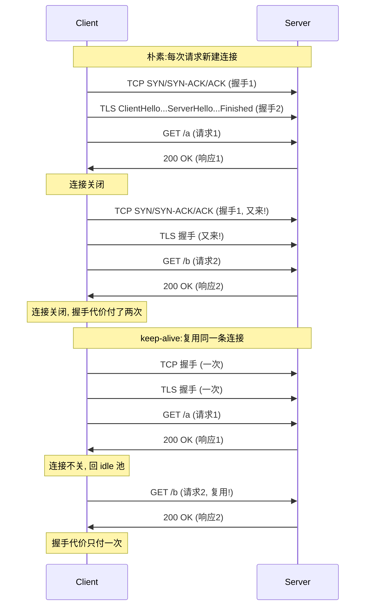
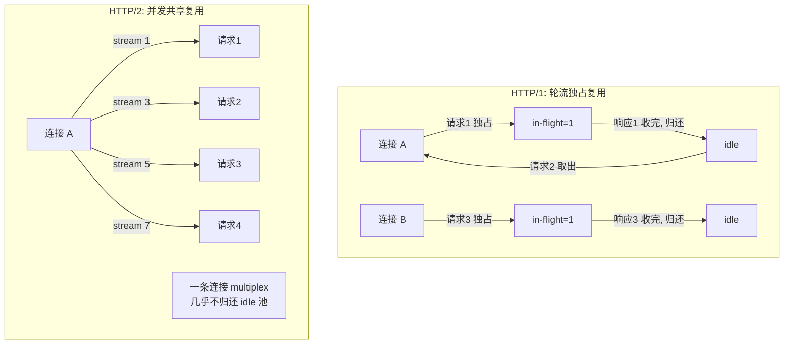
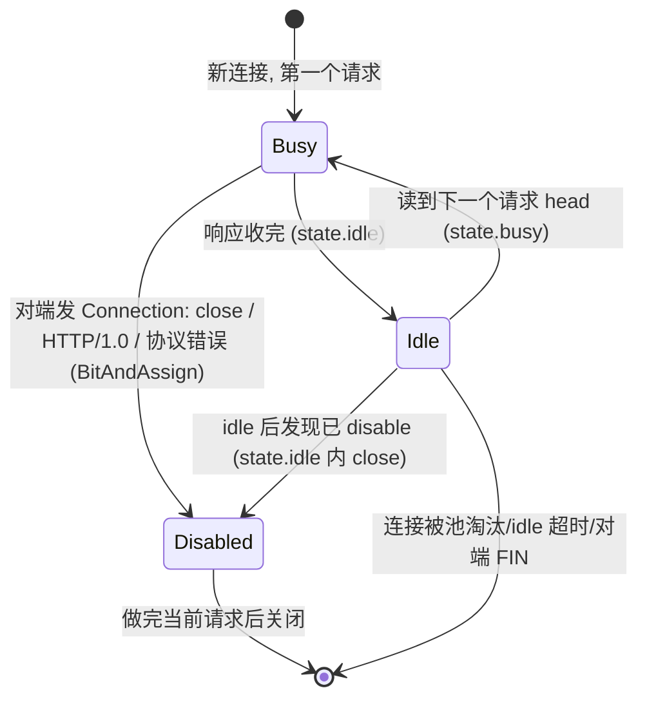
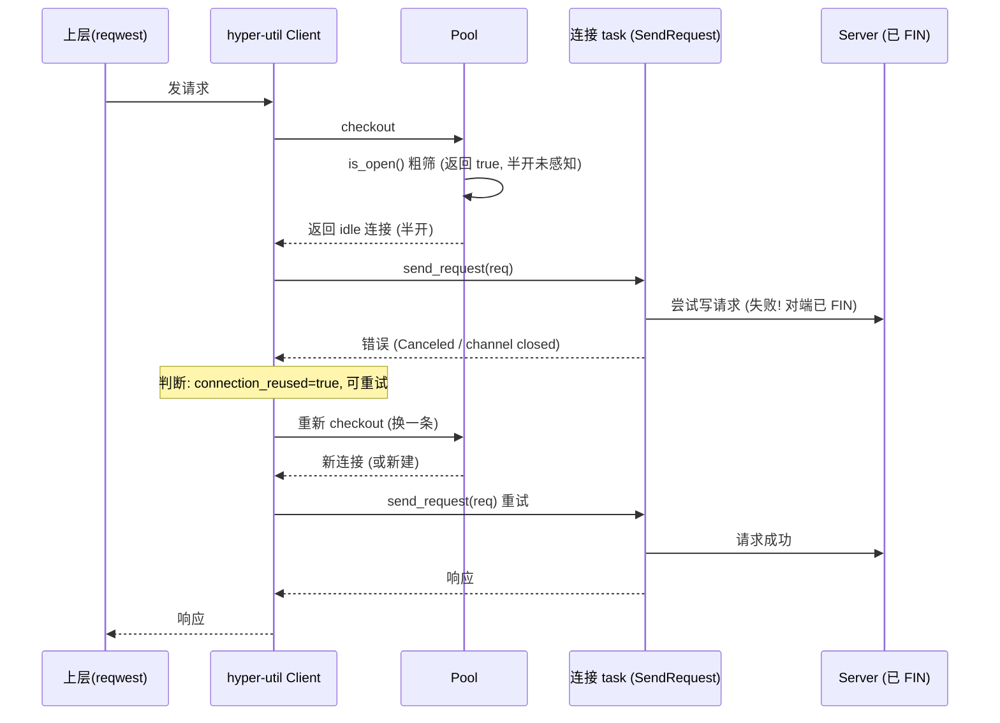
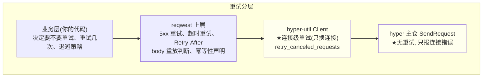
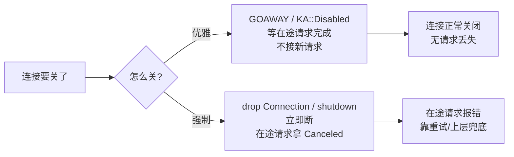

# 第 4 篇 · 第 14 章 · 连接复用、keep-alive 与重试

> **核心问题**:上一章(P4-13)把"一条 client 连接怎么发请求收响应"拆透了——`SendRequest` 是个 channel 薄壳,真正的协议循环在另一头那个 `Connection` task 上。可这条连接用完之后呢?是立刻关掉,还是留着给下一个请求复用?如果留着,留多久、谁来回收、什么时候淘汰?复用当然是为了省握手——HTTP/1 一次请求-响应做完,TCP+TLS 握手的代价已经付了,关掉重连就白白烧掉;HTTP/2 更狠,一条连接本就能 multiplex 几百个 stream,这条连接几乎永远不该被"用完"。但复用会引出一连串新问题:一条留在池里的 idle 连接,可能对端早就悄悄 `FIN` 掉了(应用层没感知),下一个请求发上去就死——你怎么在发请求之前就知道这条连接还活着?如果不幸发到一条死连接上,这个请求谁来重试,重试到什么程度?更根本的:HTTP 的 keep-alive 和 TCP 的 keepalive 是一回事吗,为什么应用层非得自己做一套不可?还有那个很多人凭印象以为的"hyper 会自动重试请求"——它到底做不做?这一连串"连接用完之后的事",就是本章要钉死的。讲不清这一章,等于 client 这一篇没闭环:你只知道了"怎么建一条连接、怎么发一次请求",却不知道"这条连接一辈子怎么过完、什么时候生什么时候死、生死了谁兜底"。

> **读完本章你会明白**:
> 1. **keep-alive 复用的本质**:HTTP/1 是"一次握手,多次请求-响应轮流跑",HTTP/2 是"一次握手,所有请求并发 multiplex"——两者都为了省 TCP/TLS 握手(承《Tokio》`tokio::net::TcpStream::connect` 一句带过),但复用语义根本不同:HTTP/1 的连接是"独占资源"(一条连接同时只能跑一个 in-flight,承 P4-13 的 `want` 单槽),HTTP/2 的连接是"共享资源"(一条连接同时跑 N 个 stream,承 P3-09)。
> 2. **hyper 主仓的单连接 keep-alive 状态机**:一条 HTTP/1 连接内部维护 `KA` 三态(`Idle`/`Busy`/`Disabled`,承 P2-05),靠 `BitAndAssign` 把"对端要不要 `Connection: close`"逐请求累乘进来;HTTP/2 则根本没有"用完归还"的概念,连接一直 multiplex 直到某一方主动 `GOAWAY` 或出错。
> 3. **复用策略在 hyper-util crate 的池里**:连接用完(`Pooled` drop)归还 idle,池按 `(scheme, host)` 分组(承 P4-12),idle 连接带 `idle_at` 时间戳,后台 `IdleTask` 每 `max(timeout, 90ms)` 扫一次,过期的清、已关的清——这是不泄漏的两道闸。
> 4. **连接失效怎么检测**:hyper 在**取出 idle 连接时**调 `Poolable::is_open()`(= `!poisoned && ready`)做探活,不主动 `read` 探 EOF;发请求途中连接死了,靠 channel 的 `Callback::drop` 给在途 Response Future 一个明确的 `Canceled` 错误(承 P4-13)。**TCP keepalive 不够用**——它的探活周期默认两小时,而且探不出"应用层半开"(对端进程活着但连接已废),所以应用层必须自己做 keep-alive 失效检测。
> 5. **★重试边界(本章最反直觉、最易讲错的一点)**:hyper **主仓**(`src/client/`)不做任何请求重试;**hyper-util** 的 `Client` 有**连接级重试**,但范围极窄——只重试"请求是复用 idle 连接发出、且请求字节尚未真正写出去就被 `Canceled`打断"这一种情况(默认 `retry_canceled_requests: true`),换一条连接再试;**请求级重试**(5xx 重试、超时重试、`Retry-After` 处理、body 需要重放判断幂等性)hyper 全栈**都不做**,那是 reqwest/上层业务的事。讲清这条边界,比讲任何机制都重要——很多读者以为 hyper 会自动重试 5xx,这是错觉。
> 6. **为什么 sound**:不泄漏(idle 超时 + `IdleTask` 双路回收)、不发死连接(`is_open()` 取时探活 + 复用失败有 `Retryable` 兜底换连接)、重试边界清晰(只换连接不重放请求、幂等性/body 重放归上层)、连接优雅关闭(等在途 stream)vs 强制关闭(立即断)对在途请求的影响分明。

> **如果一读觉得太难**:先抓五件事——① 复用是为了省握手,HTTP/1 独占复用(HTTP/1 一条连接同时一个 in-flight,用完归还),HTTP/2 共享复用(一条连接 multiplex 所有 stream,几乎不归还);② hyper 主仓的 `KA` 三态(`Idle`/`Busy`/`Disabled`)管一条 HTTP/1 连接内部"现在忙不忙、还能不能 keep-alive";③ hyper-util 的 `IdleTask` 每 90 秒扫一次 idle 池,过期的清;④ 取 idle 连接时调 `is_open()` 探活,不主动 `read`,TCP keepalive 周期两小时根本指望不上;⑤ **hyper 主仓不做请求重试,hyper-util 只做"换一条连接再试"的连接级重试,5xx/body 重放归 reqwest**。这五条钉住,本章机制全有了挂靠点。

---

## 〇、一句话点破

> **一条 HTTP 连接的命,是三层状态机叠出来的——最里层是 hyper 主仓的单连接 keep-alive 状态(`KA::Busy`/`Idle`/`Disabled`):一次请求-响应跑完进 `Idle`,对端发 `Connection: close` 或 HTTP/1.0 进 `Disabled`,这是"协议级"的连接生死;中间层是 hyper-util 池的复用策略(HTTP/1 独占归还、HTTP/2 共享不归还):`Pooled` drop 时按 `(scheme, host)` 把 idle 连接塞回池,带个 `idle_at` 时间戳;最外层是 `IdleTask` 后台清扫 + 取连接时 `is_open()` 探活:这是"框架级"的连接回收与失效兜底。三层各管各的:协议机管"这条连接内部状态",池管"一批连接怎么分配复用",`IdleTask` 管"别让死连接烂在池里"。而重试,hyper 主仓**一行请求重试逻辑都没有**——它只提供"连接级错误信号";hyper-util 的 `Client` 只在"复用 idle 连接、请求字节还没写出去就被打断"这一种极窄情况下换一条连接再试;真正的请求重试(5xx、超时、幂等性判断、body 重放),全是上层 reqwest/业务的事。**

这是结论,不是理由。本章倒过来拆:先把"keep-alive 复用到底在省什么"钉死(1.1 节,这是理解一切复用机制的发动机);然后钻进 hyper 主仓的单连接 `KA` 三态(第二节),讲清一条 HTTP/1 连接内部怎么在 `Busy`/`Idle`/`Disabled` 之间流转、对端 `Connection: close` 怎么让连接进 `Disabled`、HTTP/2 为什么根本不需要这个状态机;接着拆 hyper-util 的 idle 池(第三节):idle 怎么存、`IdleTask` 怎么扫、`idle_at` 怎么算过期、为什么 sweep 周期是 `max(timeout, 90ms)`;再钻"连接失效检测"(第四节):取连接时怎么探活(`is_open()`)、为什么 TCP keepalive 不够用、发请求途中连接死了怎么报错;然后是本章最硬的"重试边界"(第五节):hyper 主仓不做重试、hyper-util 的连接级重试长什么样、为什么请求级重试必须归上层、reqwest 怎么补这块;接着对照 HTTP/1 vs HTTP/2 的复用语义分叉(第六节,ASCII 框图);最后钉死"为什么 sound"(第七节)——不泄漏、不发死连接、重试边界清晰这三件事各自靠什么兜底。

> **承接《Tokio》**:本章里所有"等"(idle 超时、`Checkout` Future、`oneshot::Receiver`)的 `Poll::Pending`/`Waker`/`await`、所有 `tokio::spawn`/`Exec::execute`(包括 `IdleTask` 的 spawn)、`tokio::time::sleep`/时间轮——这些《Tokio》拆透的机制一句带过,篇幅全留 hyper/hyper-util 独有:**keep-alive 状态机、idle 池的回收与探活、连接级 vs 请求级的重试边界**。TCP/TLS 握手 `tokio::net::TcpStream::connect` 也是一句带过(承《Tokio》第 3 篇 reactor/mio)。

> **承接《gRPC》**:gRPC 的连接复用概念(SubChannel 底下复用 TCP)在《gRPC》第 4 篇已拆透,一句带过 + 指路。HTTP/2 的帧/流/HPACK/流控/`GOAWAY` 在《gRPC》第 2 篇(chttp2)和本书 P3-09 已拆透,本章只在"这个协议事实怎么反过来决定池的复用语义"时引用,不重讲帧细节。gRPC 的重试策略(`retry_policy`、hedging)也在《gRPC》讲过,本章对照"hyper 为什么把这块甩给上层"。

> **承接本书 P2-05 / P3-09 / P4-12 / P4-13**:P2-05 讲过单 HTTP/1 连接的 `dispatch` 循环和 `KA` 三态的雏形,本章把 `KA` 三态在 keep-alive 复用语境下讲透(尤其"对端 `Connection: close` 怎么把连接打成 `Disabled`");P3-09 讲透 HTTP/2 多 stream multiplex,本章只讲"这个事实怎么让 HTTP/2 连接几乎不归还 idle 池";P4-12 讲透池的 `checkout`/`connecting`/`Poolable::reserve()` 分叉,本章从那接过来——池取/还之后,idle 连接的"过期/探活/清扫"和"重试"是怎么兜底的;P4-13 讲透 `SendRequest` 是 channel 薄壳、`Callback::drop` 给在途 Future 报错,本章把"发到死连接、Response Future 拿到 `Canceled` 之后谁重试"接到底。本章是第 4 篇收尾,把 client 三章闭环。

---

## 一、keep-alive 复用到底在省什么

在钻任何状态机之前,先把"为什么要复用连接"钉死。这不是新东西,但它是后面一切机制的发动机——讲不清这个,后面的 `KA` 状态机、`IdleTask`、重试边界就都是无源之水。

### 1.1 一次握手,多次请求:省的是 RTT 和 CPU

HTTP 是建立在 TCP(通常还有 TLS)之上的应用层协议。一次完整的"调一个 HTTP 接口",在最朴素的情况下,要做三件事:

1. **建 TCP 连接**:三次握手,1 个 RTT(Round-Trip Time,往返时延)。
2. **(如果 HTTPS)TLS 握手**:TLS 1.2 至少 2 个 RTT,TLS 1.3 至少 1 个 RTT。
3. **发 HTTP 请求,收 HTTP 响应**:1 个 RTT(请求小、响应首字节也算一个往返)。

也就是说,一次 HTTPS 请求,光握手就要烧掉 2~3 个 RTT(取决于 TLS 版本)。如果你的用户在上海,服务器在美西,RTT 大约 200ms,那一次请求光握手就是 400~600ms——还没算你真正传数据的时间。如果你的进程要并发调这个 host 100 次,朴素做法就是建 100 条连接,做 100 次握手,光握手烧掉几十秒。

> **承接《Tokio》**:`tokio::net::TcpStream::connect` 是异步的 TCP 握手(承《Tokio》第 3 篇 reactor/mio,epoll/kqueue edge-triggered),它返回一个 Future,握手完成前 task 挂起让出线程——但"异步"只是不阻塞线程,RTT 的物理延迟省不掉。TLS 握手同理(在 `tokio-rustls`/`tokio-openssl` 里也是 Future)。握手延迟是物理的,异步只是让你在等握手时能干别的,不能让握手变快。

keep-alive(也叫"持久连接",HTTP/1.1 默认开,HTTP/2 强制)的核心思想:**一条 TCP+TLS 连接,做完一次请求-响应之后不关掉,留着给下一次请求用**。这样第二次请求就不需要再付握手代价,直接在这条已经"暖"好的连接上发请求收响应,只要 1 个 RTT(甚至更少,因为 TCP 拥塞窗口已经打开、TLS 会话已经建立)。100 次请求复用一条连接,握手只付一次,省掉的是 99 × (TCP握手 + TLS握手) 的代价。



> **钉死这件事**:keep-alive 复用的本质,是**让一次握手的代价被多次请求摊薄**。这是高性能 HTTP client 的第一性原理——任何"每次请求新建连接"的实现,在并发场景下都会被 keep-alive client 数量级地甩开。hyper 的一切复用机制(`KA` 状态机、idle 池、`IdleTask`、连接级重试),都是围绕"怎么把这条暖连接安全地复用、怎么在它失效时优雅地换掉"展开的。

### 1.2 HTTP/1 vs HTTP/2:复用语义根本不同

虽然"keep-alive 复用"这句话对 HTTP/1 和 HTTP/2 都成立,但两者的复用语义**根本不同**——这一差异是 P4-12 讲 `Poolable::reserve()` 返回 `Unique` 还是 `Shared` 的根,也是本章后面所有"HTTP/2 几乎不归还 idle 池"的根。

**HTTP/1 的复用是"轮流独占"**:一条 HTTP/1 连接,在任何时刻**只能跑一个 in-flight 请求**(请求发出、等响应、响应收完)。这是因为 HTTP/1 是个严格的请求-响应协议,请求和响应对在连接上按序排列,没有 stream id 来配对——你要是在一条 HTTP/1 连接上同时发两个请求,响应回来你根本不知道哪个响应对应哪个请求。所以 P4-13 讲的 `Client` 的 `Dispatch::should_poll` 返回 `callback.is_none()`,就是用 `want` 单槽把一条 HTTP/1 连接卡成"一连接一 in-flight"。

那 HTTP/1 的 keep-alive 怎么复用?是**串行的轮流复用**:请求1发出 → 收响应1 → 这条连接"用完了"(in-flight 清空)→ 归还给池 → 池把它标记为 idle → 请求2 来了从池里把它取出来 → 请求2发出 → 收响应2 → 归还……一条连接,一段时间内被多个请求**轮流独占**,每个请求独占的窗口是"它发出到响应收完"。

**HTTP/2 的复用是"并发共享"**:一条 HTTP/2 连接,可以**同时**跑上百个 in-flight 请求,每个请求占一个 stream,stream id 在 h2 帧头里把请求和响应对上号(承《gRPC》第 2 篇)。所以 HTTP/2 不需要"一个请求独占一条连接"——一条连接是一个共享资源,N 个请求同时挂在上面各跑各的 stream,背压由 h2 流控兜底(承 P3-11)。



这一差异直接决定了池的设计(承 P4-12):HTTP/1 的连接,`reserve()` 返回 `Unique`,意思是"我要独占这条连接,用完才还";HTTP/2 的连接,`reserve()` 返回 `Shared(a, b)`,意思是"这条连接大家共享,我拿一份克隆走,池里还留一份给别人"。

> **所以这样设计**:`Poolable::reserve()` 这个枚举分叉(承 P4-12),根上就是 HTTP/1 vs HTTP/2 的复用语义差异——独占 vs 共享。后面所有的"HTTP/1 归还 idle 池、HTTP/2 几乎不归还",都是从这一刀切出来的。本章要把这刀的后果讲透:HTTP/2 一条连接 multiplex,意味着池里对同一个 host 通常只有一两条 h2 连接;但 `max_concurrent_streams` 用满时,hyper-util **不会自动开第二条 h2 连接**(承 P4-12 已确认),这是 hyper-util client 的一个已知局限。

### 1.3 不复用会怎样:三个量级的差距

把"为什么必须复用"钉死,最有说服力的是反例。想象一个不开 keep-alive 的朴素 HTTP/1 client:

- 每次请求新建 TCP+TLS 连接,握手 2~3 RTT。
- 100 并发请求 = 100 条连接 = 100 次握手 = 200~300 RTT。
- 如果 RTT=200ms,光握手就是 40~60 秒。

而开 keep-alive 的 client:

- 一条连接复用,握手 1 次。
- 100 个请求轮流在这条连接上跑(或者开几条连接并行轮),握手代价付 1~几次。
- 同样 RTT=200ms,握手代价 0.4~1 秒。

差出两个数量级。这就是为什么 hyper 把"keep-alive 复用"当成框架侧招牌能力——P4-12 的池、本章的 `KA` 状态机/`IdleTask`/重试边界,全是围绕它转的。

> **不这样会怎样**:如果 hyper 不做连接复用(每次请求新建连接),那它就是个比 `curl` 还朴素的 client,根本配不上"高性能 HTTP 库"的名号。axum/reqwest/tonic/Pingora 也不会站在它肩膀上——它们要的就是"连接复用省握手"这一刀带来的数量级性能提升。本章后面所有的机制,都是在守护这一刀"复用得对、复用得稳、复用得不发死连接"。

---

## 二、hyper 主仓的单连接 keep-alive 状态机(`KA` 三态)

keep-alive 复用的本质清楚了(省握手),现在钻进 hyper 主仓,看一条**单连接内部**怎么维护 keep-alive 状态。这一节讲的是 hyper 主仓 `src/proto/h1/conn.rs` 里的 `KA` 三态——它管的是"这条 HTTP/1 连接,现在在 keep-alive 的哪个阶段"。注意这一层和 hyper-util 的 idle 池是**不同层**:这里是"协议级"的单连接内部状态,池是"框架级"的一批连接怎么分配。两者各管各的,本章第二节和第三节分别拆。

### 2.1 为什么需要 `KA` 三态

一条 HTTP/1 连接,从生到死,在 keep-alive 的视角下,会经历三种状态:

- **`Busy`(忙)**:这条连接现在正在跑一个请求-响应(请求已发出、响应没收完)。此刻这条连接**不能**再接新请求(承 1.2,HTTP/1 一连接一 in-flight)。
- **`Idle`(闲)**:这个请求-响应跑完了(响应收完),连接可以接下一个请求了。此刻连接在 keep-alive 状态下"待命"。
- **`Disabled`(禁用)**:这条连接不能再 keep-alive 了,做完当前请求就要关。什么时候进 `Disabled`?最常见的是对端发了 `Connection: close`(HTTP/1.1)或者 HTTP/1.0(默认关连接,除非显式 `Connection: keep-alive`),或者协议出错。

这三个状态为什么必须显式建模?因为 HTTP/1 的 keep-alive 是**逐请求协商**的——不是建连时一次性决定"这条连接 keep-alive 还是不 keep-alive",而是每个请求-响应周期都可能改变决定。对端可能在第 3 个响应里突然发个 `Connection: close`,那这条连接做完第 3 个请求就必须关,不能傻乎乎地等第 4 个请求。所以 hyper 必须在每个请求-响应边界上,把"对端还想不想 keep-alive"这个信息累乘进连接状态。

> **钉死这件事**:`KA` 三态建模的是"一条 HTTP/1 连接当前在 keep-alive 的哪个阶段"——`Busy` 是"在跑一个请求",`Idle` 是"跑完了待命",`Disabled` 是"不能再 keep-alive 了"。这个状态机是**逐请求**推进的,每个请求-响应边界都可能改变状态(尤其 `Idle` ↔ `Busy` 的来回,以及对端 `close` → `Disabled`)。它和 hyper-util 的 idle 池是不同层:这里是单连接内部协议状态,池是一批连接的框架分配。

### 2.2 `KA` 枚举的真身

hyper 主仓 `src/proto/h1/conn.rs` 里,`KA` 枚举的定义极其简洁(`conn.rs:1022-1046`):

```rust
// hyper/src/proto/h1/conn.rs:1022-1046
#[derive(Clone, Copy, Debug, Default)]
enum KA {
    Idle,
    #[default]
    Busy,
    Disabled,
}

impl KA {
    fn idle(&mut self)   { *self = KA::Idle; }
    fn busy(&mut self)   { *self = KA::Busy; }
    fn disable(&mut self){ *self = KA::Disabled; }
    fn status(&self) -> KA { *self }
}
```

注意几个细节:

- 三个变体,枚举带 `#[derive(Default)]`,默认是 `Busy`(`#[default]`)。这意味着一条新连接刚建好进入第一个请求时,默认就是 `Busy`——合理,因为新连接的"第一个请求"马上就要发出去了。
- 三个 mutation 方法 `idle()`/`busy()`/`disable()`,各自把状态置过去。这些方法在 `State` 的方法里被调用(见 2.3)。
- 还有一个 `BitAndAssign for KA` 的实现(`conn.rs:1013-1020`),这是把"对端要不要 close"逐请求累乘进来的关键(见 2.4)。

这个 `KA` 字段存在 `State` 结构体里(`conn.rs:920` 的 `state: State`,里面有 `keep_alive: KA` 字段)。`State` 是一条连接的协议状态集合,除了 `keep_alive`,`Reading`(Init/Continue/Body/KeepAlive/Closed,`conn.rs:964-970`)和 `Writing`(Init/Body/KeepAlive/Closed,`conn.rs:972-977`)是两个独立的读写子状态机——它们管的是"现在在读/写到哪一步",和 `KA` 管"keep-alive 还行不行"是不同层面,别混淆。

### 2.3 `Busy` ↔ `Idle`:一个请求-响应周期内的状态流转

一条 keep-alive 的 HTTP/1 连接,正常情况下在 `Busy` 和 `Idle` 之间来回切换,切换点就是请求-响应的边界:

- **进入 `Busy`**:当读到一个新请求的 head(请求行 + 头部)时,`State::busy()`(`conn.rs:1097-1102`)被调用——它先把 `keep_alive` 置 `Busy`(除非已经是 `Disabled`,那就不动)。这一步意味着"这条连接开始跑一个请求了,在响应收完之前不能再接新请求"。
- **回到 `Idle`**:当一个请求-响应完整跑完(响应 body 收完),`State::idle::<T>()`(`conn.rs:1104-1125`)被调用——它先把 `keep_alive.idle()`,然后检查"如果这时候发现连接已经被 disable 了(比如在跑这个请求的过程中对端发了个 `close`,或者读到了 EOF),那就 `self.close()`"。这一步意味着"这个请求做完了,连接待命接下一个"。

来看读 head 时的关键调用点(`conn.rs:293-294`):

```rust
// hyper/src/proto/h1/conn.rs:293-294 (读 head 时的关键两行)
self.state.busy();
self.state.keep_alive &= msg.keep_alive;   // BitAndAssign<bool>
```

这两行是 `KA` 状态机的心脏。第一行 `self.state.busy()` 把连接置 `Busy`——新请求开始了。第二行 `self.state.keep_alive &= msg.keep_alive` 是关键:`msg.keep_alive` 是这一条消息(请求或响应)解析出来后,根据协议判断出的"这条消息发完之后,这条连接还能不能 keep-alive"。它是个 `bool`,通过 `BitAndAssign` 累乘进 `KA` 状态。

### 2.4 `BitAndAssign for KA`:对端 `Connection: close` 怎么打进来

最关键的一招——`BitAndAssign for KA`(`conn.rs:1013-1020`):

```rust
// hyper/src/proto/h1/conn.rs:1013-1020
impl BitAndAssign<bool> for KA {
    fn bitand_assign(&mut self, enabled: bool) {
        if !enabled {
            *self = KA::Disabled;
            trace!("remote disabling keep-alive");
        }
    }
}
```

这个 impl 让 `self.state.keep_alive &= some_bool` 这一行有了一个非常自然的语义:**只要某一条消息说"keep-alive 不行了"(`enabled == false`),就把连接永久打成 `Disabled`**。一旦 `Disabled`,就再也回不到 `Idle`/`Busy`——这是单向的。

那 `msg.keep_alive` 这个 bool 是怎么算出来的?在 role 解析阶段(请求/响应的 head 解析完),hyper 根据协议判断:

- **HTTP/1.0**:默认**关闭**连接(承 P2-05 的 `fix_keep_alive`,`conn.rs:656-678`)。具体在 `conn.rs:666`:`Version::HTTP_10 => self.state.disable_keep_alive()`。除非请求显式带了 `Connection: keep-alive` 头。
- **HTTP/1.1**:默认**开启** keep-alive。但如果响应头里有 `Connection: close`,就关。
- **协议错误**:任何解析错误(比如 malformed 请求行)都会 `disable_keep_alive`。

`Connection` 头的判断在 `src/proto/h1/headers.rs`:辅助函数 `connection_keep_alive`(`headers.rs:13`)和 `connection_close`(`headers.rs:18`),都走 `connection_has`(`headers.rs:23`)做 token 匹配。HTTP 的 `Connection` 头是个 token 列表(如 `Connection: keep-alive, close`),hyper 逐 token 找有没有 `close`(忽略大小写)。



> **钉死这件事**:`BitAndAssign for KA` 这一个 impl,把"对端要不要 close"这个逐请求的协商结果,优雅地累乘进了连接状态——只要任何一条消息说 close,连接就永久 `Disabled`。这是 hyper 单连接 keep-alive 状态机最巧的一招:用一个标准库的运算符重载,表达了"keep-alive 是个单调的、只能从开到关"的语义。一旦 `Disabled`,`State::idle::<T>()`(`conn.rs:1104-1125`)会立即 `close()` 这条连接。

### 2.5 HTTP/2 为什么不需要这个状态机

讲完 HTTP/1 的 `KA` 三态,马上要回答一个问题——HTTP/2 怎么没有这套东西?

答案是:HTTP/2 的复用语义根本不需要"逐请求 keep-alive 协商"。承 1.2,HTTP/2 一条连接 multiplex 所有 stream,连接是**共享**的,不存在"做完一个请求归还、做下一个再取"的轮流独占模型。一条 HTTP/2 连接从建立到关闭,中间一直 multiplex 着一堆 stream,什么时候关闭?

- 某一方主动发 `GOAWAY` 帧(承《gRPC》第 2 篇),宣布"我不再接受新 stream"。
- 连接出错(stream error 升级到 connection error)。
- 应用层主动 drop 连接(`Connection` Future 被 drop)。

所以 HTTP/2 没有 `KA::Busy`/`Idle`/`Disabled` 这种逐请求状态——它的"keep-alive"是协议级常驻的,由 h2 crate 在底层维护(承 P3-09/P3-10)。hyper 在 `proto/h2/server.rs:82`/`proto/h2/client.rs` 的适配层,只管"把一个 hyper 请求映射成一条 stream",不管"这条连接做完请求要不要关"。

> **对照《gRPC》**:gRPC 的 chttp2(C++ 自实现 HTTP/2)也是这套语义——连接常驻 multiplex,`GOAWAY` 控关闭,没有逐请求 keep-alive 状态机。hyper 把 HTTP/2 委托给 h2 crate(承 P3-09),这一层完全由 h2 兜底。本章后面讲 idle 池时,HTTP/2 连接的"复用"语义和 HTTP/1 完全不同——HTTP/2 连接几乎不进 idle 池(它一直在被多个 stream 共享使用)。

### 2.6 单连接 keep-alive 与 idle 池:两层不要混

这一节拆的是 hyper **主仓**的单连接 `KA` 三态。必须强调,它和 hyper-util 的 **idle 池**是两层:

| 层 | 在哪 | 管什么 | 状态 |
|---|---|---|---|
| 协议级单连接 | hyper 主仓 `proto/h1/conn.rs` | 一条 HTTP/1 连接内部 keep-alive 还行不行 | `KA::Busy`/`Idle`/`Disabled` |
| 框架级 idle 池 | hyper-util `client/legacy/pool.rs` | 一批连接怎么分配、复用、回收 | idle/busy/connecting/waiter |

一条连接的 `KA::Idle`(协议级"跑完一个请求待命"),和它在 hyper-util 池里处于"idle 列表"(框架级"这条连接现在没被任何请求持有,在池里待命"),是**两件事**。前者是协议机内部状态,后者是池的归属状态。理想情况下两者对齐:协议级 `Idle` 的连接,被归还到池的 idle 列表;协议级 `Disabled` 的连接,归还时被 `Pooled::drop` 的 `is_open()` 检查丢掉(见第四节)。但它们是独立的两套机制,本章第二节讲前者(主仓),第三节讲后者(hyper-util)。

> **钉死这件事**:`KA` 三态是 hyper **主仓**的协议级单连接状态;idle 池是 hyper-util 的框架级复用策略。两者不要混——很多讲 hyper 的文章把"keep-alive"笼统说成一件事,其实它跨了两层。本章要做的,就是把这个两层拆透:第二节讲主仓的 `KA`(协议侧),第三、四节讲 hyper-util 的池(框架侧)。

---

## 三、hyper-util 的 idle 池:存什么、怎么扫、怎么过期

第二节讲完单连接的 `KA` 三态(协议级),现在钻进 hyper-util 的 idle 池(框架级)。承 P4-12 已经讲透池的 `checkout`/`connecting`/`Poolable::reserve()` 分叉,本节从那接过来,只讲"取/还之后,idle 连接怎么存、怎么过期、怎么被 `IdleTask` 清扫"——这是 P4-12 留给本章的尾巴,也是"不泄漏"的关键。

> **★诚实标注**:本节讲的全在 **hyper-util crate**(`hyper-util/src/client/legacy/pool.rs`),不在 hyper 主仓。hyper 主仓没有连接池(承 P4-12 第一节)。引用源码时一律标"在 hyper-util crate"。

### 3.1 idle 连接存什么:`Idle<T>` 带 `idle_at` 时间戳

hyper-util 的池,空闲连接存在 `PoolInner` 的 `idle: HashMap<K, Vec<Idle<T>>>` 字段(`pool.rs:84`,`K` 是 `(scheme, host)` 这种 key)。每个空闲连接包成一个 `Idle<T>` 结构(`pool.rs:588-591`):

```rust
// 在 hyper-util crate, src/client/legacy/pool.rs:588-591
struct Idle<T> {
    idle_at: Instant,   // 589: 进入 idle 的时刻
    value: T,           // 590: 实际的连接(对 client 来说是 PoolClient<B>)
}
```

两个字段:

- `idle_at: Instant`——这条连接**进入 idle 池的时刻**。注意是"进 idle 的时刻",不是"过期时刻"。过期判断要配合 `PoolInner::timeout: Option<Duration>`(`pool.rs:101`)算:过期 = `now - idle_at > timeout`。
- `value: T`——实际的连接值。对 client 来说,`T = PoolClient<B>`(`client.rs:766-769`),它包着 hyper 主仓的 `SendRequest`(承 P4-13)。

`PoolInner` 的完整字段(`pool.rs:77-102`),把池的全貌贴出来:

```rust
// 在 hyper-util crate, src/client/legacy/pool.rs:77-102
struct PoolInner<T, K: Eq + Hash> {
    connecting: HashSet<K>,                          // 81: 正在建连的 key 集合(HTTP/2 去重用)
    idle: HashMap<K, Vec<Idle<T>>>,                  // 84: 空闲连接, 按 key 分组
    max_idle_per_host: usize,                        // 85: 每 host 最大空闲数
    waiters: HashMap<K, VecDeque<oneshot::Sender<T>>>, // 95: 排队的 checkout 请求
    idle_interval_ref: Option<oneshot::Sender<Infallible>>, // 98: IdleTask 的取消句柄
    exec: Exec,                                      // 99: 执行器(spawn IdleTask 用)
    timer: Option<Timer>,                            // 100: 定时器(spawn IdleTask 需要)
    timeout: Option<Duration>,                       // 101: idle 超时阈值
}
```

这几个字段里,和本章直接相关的有三个:`idle`(存什么)、`timeout`(过期阈值)、`idle_interval_ref` + `exec` + `timer`(后台 `IdleTask` 的 spawn 与取消)。下面分别拆。

### 3.2 `Expiration`:过期判断的算术

过期判断的核心是 `Expiration` 结构(`pool.rs:765-779`):

```rust
// 在 hyper-util crate, src/client/legacy/pool.rs:765-779
struct Expiration(Option<Duration>);

impl Expiration {
    fn new(dur: Option<Duration>) -> Expiration {
        Expiration(dur)
    }

    fn expires(&self, instant: Instant, now: Instant) -> bool {
        match self.0 {
            // Avoid `Instant::elapsed` to avoid issues like rust-lang/rust#86470.
            Some(timeout) => now.saturating_duration_since(instant) > timeout,
            None => false,
        }
    }
}
```

`expires()` 的语义:`(now - idle_at) > timeout` 就过期。注意几点:

- 用 `now.saturating_duration_since(instant)` 而不是 `instant.elapsed()`,注释明确说是为了避开 `rust-lang/rust#86470`(`Instant::elapsed` 在某些平台/时钟回退场景下的 bug)。这是一个 production-grade 的细节——`saturating` 保证不会因为时钟异常而 panic 或 wrap。
- `None` 表示永不超时——`pool_idle_timeout(None)` 时,所有 idle 连接永不过期(只靠 `is_open()` 探活和池满淘汰)。

`Expiration::expires` 有两个调用点:

1. **checkout 时(取连接)**:`IdlePopper::pop`(`pool.rs:299-339`)在 `pool.rs:314` 调 `expiration.expires(entry.idle_at, now)`——取连接时把过期的也丢掉。
2. **后台清扫时**:`clear_expired`(`pool.rs:481-509`)在 `pool.rs:497` 用等价的算术 `now.saturating_duration_since(entry.idle_at) > dur`。

也就是说,**过期的连接,取时丢一次、后台扫一次**——两道闸。这是"不泄漏"的工程冗余。

### 3.3 `IdleTask`:后台清扫的 spawn 与周期

idle 池不能光靠"取时懒清"——如果一段时间没请求来取,过期的死连接就会烂在池里占着 `max_idle_per_host` 的名额。所以 hyper-util 还有一个后台 `IdleTask`,定期主动清扫。

`IdleTask` 的定义(`pool.rs:781-789`):

```rust
// 在 hyper-util crate, src/client/legacy/pool.rs:781-789
struct IdleTask<T, K: Key> {
    timer: Timer,                                // 782: 定时器
    duration: Duration,                          // 783: 清扫周期
    pool: WeakOpt<Mutex<PoolInner<T, K>>>,       // 784: 池的弱引用(池死了 IdleTask 也退)
    pool_drop_notifier: oneshot::Receiver<Infallible>, // 788: 池 drop 时通知 IdleTask 退
}
```

它的 `run()` 是个 async 循环(`pool.rs:791-820`):

```rust
// 在 hyper-util crate, src/client/legacy/pool.rs:791-820 (摘录)
async fn run(self) {
    use futures_util::future;
    let mut sleep = self.timer.sleep_until(self.timer.now() + self.duration);
    let mut on_pool_drop = self.pool_drop_notifier;
    loop {
        match future::select(&mut on_pool_drop, &mut sleep).await {
            future::Either::Left(_) => { break; }              // 799-801: 池 drop, 退出
            future::Either::Right(((), _)) => {                // 803: 定时到了
                if let Some(inner) = self.pool.upgrade() {
                    if let Ok(mut inner) = inner.lock() {
                        trace!("idle interval checking for expired");
                        inner.clear_expired();                 // 807: 清扫
                    }
                }
                let deadline = self.timer.now() + self.duration;
                self.timer.reset(&mut sleep, deadline);        // 812: 重置定时
            }
        }
    }
    trace!("pool closed, canceling idle interval");
    return;
}
```

几个关键点:

- **`future::select(on_pool_drop, sleep)`**:IdleTask 同时等两个 Future——池 drop 的通知(`oneshot::Receiver`)和定时(`sleep`)。谁先 ready 走谁。池 drop 时 `Left` 分支退出(不空转);定时到了 `Right` 分支清扫。这是 `future::select` 的经典用法(承《Tokio》select)。
- **弱引用池**:`pool: WeakOpt<...>` 是池的弱引用——池被 drop 时 `upgrade()` 返回 `None`,IdleTask 不会让池"赖着不死"。这是防"IdleTask 持有池的强引用导致池泄漏"的 sound 设计。
- **清扫后重置定时**:每次扫完,把 `sleep` 重置成 `now + duration`,继续等下一轮。

`clear_expired`(`pool.rs:481-509`)是实际清扫函数,注释明确说"This should *only* be called by the IdleTask"(`pool.rs:482`)——只让 IdleTask 调,别的路径不调:

```rust
// 在 hyper-util crate, src/client/legacy/pool.rs:481-509 (摘录)
fn clear_expired(&mut self) {
    let dur = self.timeout.expect("interval assumes timeout");
    let now = self.now();
    self.idle.retain(|key, values| {
        values.retain(|entry| {
            if !entry.value.is_open() {
                trace!("idle interval evicting closed for {:?}", key);
                return false;       // 491-494: 已关闭的丢
            }
            if now.saturating_duration_since(entry.idle_at) > dur {
                trace!("idle interval evicting expired for {:?}", key);
                return false;       // 497-500: 过期的丢
            }
            true
        });
        !values.is_empty()
    });
}
```

`clear_expired` 一道 `retain` 同时做两件事:丢 `!is_open()` 的(已关闭),丢过期的(`now - idle_at > dur`)。注意它和 checkout 时的 `IdlePopper::pop`(`pool.rs:299-339`)用的是同一套判断逻辑——`is_open()` + 时间过期,只是触发时机不同(一个取时、一个后台扫)。

### 3.4 spawn 时机与 sweep 周期:`max(timeout, 90ms)`

`IdleTask` 什么时候被 spawn?sweep 周期是多少?这两个问题在 `spawn_idle_interval`(`pool.rs:425-461`)里钉死:

```rust
// 在 hyper-util crate, src/client/legacy/pool.rs:425-461 (摘录)
fn spawn_idle_interval(&mut self, pool_ref: &Arc<Mutex<PoolInner<T, K>>>) {
    if self.idle_interval_ref.is_some() { return; }    // 426-428: 已有则不重复 spawn
    let dur = if let Some(dur) = self.timeout { dur }   // 429-433: 取 timeout, 无则不 spawn
    else { return; };
    if dur == Duration::ZERO { return; }                // 434-436: timeout=0 不 spawn

    let timer = if let Some(timer) = self.timer.clone() { timer } // 437-441: 无 timer 不 spawn
    else { return; };

    const MIN_CHECK: Duration = Duration::from_millis(90); // 446: 最小清扫间隔 90ms
    let dur = dur.max(MIN_CHECK);                         // 448: sweep 周期 = max(timeout, 90ms)

    let (tx, rx) = oneshot::channel();
    self.idle_interval_ref = Some(tx);
    let interval = IdleTask {
        timer: timer.clone(),
        duration: dur,
        pool: WeakOpt::downgrade(pool_ref),
        pool_drop_notifier: rx,
    };
    self.exec.execute(interval.run());  // 460: spawn 点
}
```

几个硬结论:

1. **spawn 时机**:每次 `PoolInner::put`(`pool.rs:348`)成功插入一条 idle 后,在 `pool.rs:408` 调 `spawn_idle_interval`。但 `idle_interval_ref.is_some()` 去重(`pool.rs:426-428`)——整个 `Pool` 生命周期只 spawn 一次 `IdleTask`,后续 `put` 不重复 spawn。
2. **不 spawn 的条件**:`timeout == None`(永不超时,没必要扫)、`timeout == Duration::ZERO`(配置成"立即过期",那是别的逻辑)、`timer == None`(没配定时器,没法 sleep)。这三种情况不 spawn IdleTask——此时 idle 连接只靠"取时懒清"和"池满淘汰"。
3. **sweep 周期 = `max(timeout, 90ms)`**:`MIN_CHECK = Duration::from_millis(90)`(`pool.rs:446`),sweep 周期是 `timeout` 和 90ms 取大。**默认 `pool_idle_timeout = 90 秒`**(`client.rs:1044`),所以默认情况下 IdleTask 每 90 秒扫一次——不是每秒扫!注释(`pool.rs:443-445`)写得很清楚:"there's no need to wake up and proactively evict faster than this"(没必要比这更频繁地唤醒清扫)。

为什么是 90 秒扫一次而不是 1 秒?因为 idle 超时本来就是"几分钟级"的粗粒度(默认 90 秒过期),没必要为它每秒唤醒一次 task 浪费 CPU。90 秒扫一次,既保证过期连接最多多活 90 秒就被清,又把 IdleTask 的开销降到几乎为零。这是 hyper-util 在"及时性"和"开销"之间的一个工程权衡。

> **钉死这件事**:`IdleTask` 是 hyper-util 的后台清扫 task,整个池生命周期只 spawn 一次,周期 = `max(timeout, 90ms)`(默认 90 秒扫一次)。它和"取时懒清"是两道并行的过期回收闸——取时丢一次,后台扫一次。`IdleTask` 持池的弱引用(`WeakOpt`),池 drop 时它自动退出,不泄漏。

### 3.5 默认配置:90 秒 idle 超时,无 max 限制

最后把 hyper-util client 的几个默认配置钉死(承 P4-12 的配置面),这些是本章"复用策略"的具体参数:

- **`pool_idle_timeout`** 默认 **90 秒**(`client.rs:1044`,`idle_timeout: Some(Duration::from_secs(90))`)。注释 `client.rs:1055`:"Default is 90 seconds."
- **`pool_max_idle_per_host`** 默认 **`usize::MAX`**(无限制,`client.rs:1045`)。注释 `client.rs:1092`:"Default is usize::MAX (no limit)." 注意是**每 host**的上限,不是全局上限——hyper-util legacy client 没有全局连接数上限,并发只受 connector 和 OS 限制(承 P4-12 已确认)。
- **`retry_canceled_requests`** 默认 **`true`**(`client.rs:1034`)。这是 hyper-util 连接级重试的开关,见第五节。

`pool_timer`(`client.rs:1561-1567`)是另一个相关配置——它配的是定时器实现(`Timer` trait),不配的话 `IdleTask` 不会被 spawn(因为 `spawn_idle_interval` 在 `pool.rs:437-441` 检查 `timer == None` 就 return)。所以**要让 idle 超时生效,必须同时配 `pool_idle_timeout` 和 `pool_timer`**——这是 hyper-util 一个容易踩的坑(只配 timeout 不配 timer,idle 连接不会过期清扫)。

> **所以这样设计**:`pool_idle_timeout`(超时阈值)和 `pool_timer`(定时器实现)分开设,是因为 hyper-util 想保持运行时中性——timer 可以是 `tokio::time`,也可以是用户自定义的 mock timer(测试用)。但代价是:用户只配 timeout 不配 timer,idle 超时就不工作。这是"可组合性"换"易用性"的一个典型权衡,hyper 1.0 三分重构的副产品。

---

## 四、连接失效检测:取时探活、发时报错、TCP keepalive 为什么不够

第三节讲完"idle 连接怎么过期清扫",现在钻一个更尖锐的问题——**一条 idle 连接,可能在它待在池里的任何时刻,被对端悄悄 `FIN` 掉了**。比如服务器有个 `idle_timeout`(注意是**服务器侧**的,不是 client 侧的池超时),它会在"连接闲了一段时间"后主动 `FIN`;或者中间网络设备(NAT、负载均衡)清理了这条连接的状态。这种情况下,池里这条连接的 `idle_at` 可能没过期、`is_open()` 返回 true(因为 client 这边 socket 还"半开"着),但它实际上已经死了——下一个请求发上去就会失败。

这一节拆"连接失效怎么检测"。这是 hyper 复用机制最 tricky 的一块,也是"不发死连接"承诺的核心。

### 4.1 取出连接时:`is_open()` 探活

hyper-util 在**取出 idle 连接**时,做的探活是调 `Poolable::is_open()`。来看 checkout 路径的核心 `IdlePopper::pop`(`pool.rs:299-339`):

```rust
// 在 hyper-util crate, src/client/legacy/pool.rs:299-339 (摘录)
fn pop(self, expiration: &Expiration, now: Instant) -> Option<Idle<T>> {
    while let Some(entry) = self.list.pop() {
        if !entry.value.is_open() {                    // 304: 探活点
            trace!("removing closed connection for {:?}", self.key);
            continue;                                   // 305-307: 已关闭就丢弃, 继续找下一条
        }
        if expiration.expires(entry.idle_at, now) {    // 314: 过期丢弃
            trace!("removing expired connection for {:?}", self.key);
            continue;
        }
        let value = match entry.value.reserve() { ... }; // 319: reserve(HTTP/1 独占/HTTP/2 共享)
        return Some(Idle { idle_at: entry.idle_at, value });
    }
    None
}
```

注意 `pool.rs:304` 的 `if !entry.value.is_open()`——这是探活。`is_open()` 是 `Poolable` trait 的方法(`pool.rs:35-42`):

```rust
// 在 hyper-util crate, src/client/legacy/pool.rs:35-42
pub trait Poolable: Unpin + Send + Sized + 'static {
    fn is_open(&self) -> bool;
    /// Reserve this connection.
    ///
    /// Allows for HTTP/2 to return a shared reservation.
    fn reserve(self) -> Reservation<Self>;
    fn can_share(&self) -> bool;
}
```

三个方法:`is_open`(探活)、`reserve`(独占/共享,承 P4-12)、`can_share`(是不是 HTTP/2 共享型)。对 client 来说,`PoolClient<B>`(`client.rs:766-769`)实现了 `Poolable`,它的 `is_open`(`client.rs:854-856`)是:

```rust
// 在 hyper-util crate, src/client/legacy/client.rs:854-856
fn is_open(&self) -> bool {
    !self.is_poisoned() && self.is_ready()
}
```

`is_open` = "没被标记为 poisoned" **且** "ready"(能接受新请求)。`is_poisoned()`(`client.rs:804-806`)查的是 `self.conn_info.poisoned.poisoned()`——这是个标志位,当连接**已经知道**自己出错时(比如发请求失败、协议错误),会被标记为 poisoned。`is_ready()`(`client.rs:808-815`)对 HTTP/1 调 `tx.is_ready()`,HTTP/2 也调 `tx.is_ready()`——这个 `tx` 是 hyper 主仓的 `SendRequest`(承 P4-13),`is_ready()` 判断的是"channel 发送端还活着、且(HTTP/1 的)`want` 单槽没满"。

> **★关键诚实点**:`is_open()` 的探活是**纯状态查询**——它查 `!poisoned && ready`,**不主动 `read` socket 探 EOF**。也就是说,如果对端悄悄 `FIN` 了但 client 这边还没尝试读/写、还没感知到错误,`is_open()` 会返回 `true`——这条半开连接会被当成活的取出来用。这是 hyper-util 的一个**有意限制**:不在 checkout 路径上做 `read` 探测(那会引入阻塞和复杂度),而是接受"偶尔会取到半开连接,发请求失败后靠连接级重试兜底"(见第五节)。这是个工程权衡——用"偶尔失败 + 重试兜底"换"checkout 路径的简洁与非阻塞"。

### 4.2 为什么不主动 `read` 探 EOF

很多人第一反应是:既然 `is_open()` 不准(查不出半开),为什么不取出连接时先 `read` 一下看有没有 EOF?这样不就能精准探活了吗?

答案有三层:

1. **阻塞风险**:`read` 是个 IO 操作,即使是非阻塞 `poll_read`,也得把它包成一个 Future,checkout 路径就变成"取连接 → poll_read 探活 → ready 才返回"的异步流程。这破坏了 checkout 的简洁性(它本该是个同步的"从 HashMap 里 pop")。
2. **竞争条件**:如果取出来 `read` 探活,但还没真正发请求,这时候对端又 `FIN` 了怎么办?探活窗口和实际使用窗口之间有 gap,探活通过不代表实际能用。探活只能降低概率,不能消除。
3. **冗余**:hyper 已经有了"发请求失败 → 连接级重试"(第五节)的兜底机制。既然失败能兜底,就没必要在 checkout 时过度探活——接受一定概率的"取到半开连接,发请求失败,重试换一条",反而更简单 sound。

所以 hyper 的策略是:**checkout 时用廉价的 `is_open()`(纯状态查询)做粗筛,把精准探活交给"实际发请求"这一步**——发请求时如果连接死了,`SendRequest::send_request` 会立刻返回错误(channel 关了/`want` 取消),然后连接级重试接管。这是"乐观策略 + 失败兜底"的经典模式。

> **对照 TCP keepalive**:有人会问,TCP 层不是有 keepalive 吗(SO_KEEPALIVE 选项),它不就能探活吗?为什么 hyper 不用 TCP keepalive 来探连接死活?答案:TCP keepalive 的**默认探活周期是 2 小时**(`tcp_keepalive_time` Linux 默认 7200 秒),而且它在内核里跑,应用层感知不到。两小时的探活周期,对一个 idle 90 秒就过期的 HTTP 连接池来说,根本指望不上——等你 TCP keepalive 探出连接死了,这条连接早被 idle 超时清掉了。更根本的是,TCP keepalive 探的是"TCP 连接是否还在"(四元组是否有效),探不出"应用层半开"——比如对端进程活着、HTTP 服务还在监听,但这条 TCP 连接的 HTTP 状态已经废了(比如对端 HTTP/2 发了 `GOAWAY` 但 TCP 没 `FIN`)。所以应用层必须自己做 keep-alive 失效检测,不能依赖 TCP keepalive。

### 4.3 发请求途中连接死了:`Callback::drop` 报错

如果不幸取到了一条半开连接,或者发请求途中对端 `FIN` 了,会发生什么?承 P4-13 讲过的 `Callback::drop` 机制——`SendRequest::send_request` 把 `(req, oneshot::Sender)` 投进 channel,返回一个等 `oneshot::Receiver` 的 Response Future。如果连接 task 这一头死了(`Connection` Future 结束、channel 关闭),`Envelope::drop` / `Callback::drop`(承 P4-13)会给每个在途的 Response Future 塞一个 `Canceled` 错误。

这个错误是**明确的**——不是静默 EOF,不是返回半个响应被误当完整。Response Future 拿到的是 `ErrorKind::Canceled`(`client.rs:65` 这一带定义),上层(hyper-util 的 `send_request` 循环)据此判断"这个请求被连接断了打断了",然后走连接级重试(第五节)。



> **钉死这件事**:hyper 的失效检测分两段——**取时**用廉价的 `is_open()`(纯状态查询,不 read)做粗筛,**发时**靠"实际发请求失败 + channel 报 `Canceled`"做精准兜底。两段配合,既不阻塞 checkout,又不漏过死连接。TCP keepalive 周期两小时、探不出应用层半开,根本指望不上——所以应用层必须自己做这一套。

### 4.4 `Pooled::drop`:归还时也探活

第三处探活在 `Pooled::drop`(`pool.rs:560-580`)——连接用完归还 idle 池时,也调 `is_open()`:

```rust
// 在 hyper-util crate, src/client/legacy/pool.rs:560-580 (摘录)
impl<T: Poolable, K: Key> Drop for Pooled<T, K> {
    fn drop(&mut self) {
        if let Some(value) = self.value.take() {
            if !value.is_open() {                       // 563: 已知关闭则不归还
                return;
            }
            if let Some(pool) = self.pool.upgrade() {   // 569: 还有 pool 引用
                if let Ok(mut inner) = pool.lock() {
                    inner.put(self.key.clone(), value, &pool);  // 571: 归还到 idle
                }
            } else if !value.can_share() {              // 573: pool 已死
                trace!("pool dropped, dropping pooled ({:?})", self.key);
            }
        }
    }
}
```

`pool.rs:563` 的 `if !value.is_open()`——连接用完时如果已经知道自己坏了(比如刚发完请求拿到响应,但响应过程里有协议错误导致 poisoned),drop 时就不归还,直接丢弃。这是第三道探活闸:取时(IdlePopper::pop)、归还时(Pooled::drop)、后台扫(clear_expired)——三处都查 `is_open()`。

> **钉死这件事**:hyper 对 idle 连接的 `is_open()` 探活,发生在**三个时机**:取时(`IdlePopper::pop`, `pool.rs:304`)、归还时(`Pooled::drop`, `pool.rs:563`)、后台扫时(`clear_expired`, `pool.rs:491`)。三道闸冗余覆盖,保证死连接不会长期占着 idle 名额。但这三道都是**纯状态查询**,不主动 read——精准探活留给"实际发请求"那一刻。

---

## 五、★重试边界:hyper 主仓不做,hyper-util 只做连接级,请求级归上层

这是本章最重要、也最易讲错的一节。很多人凭印象以为"hyper 会自动重试请求"——尤其是以为它会重试 5xx、重试超时、处理 `Retry-After`。**这是错觉**。本节要把重试边界钉死:hyper **主仓**一行请求重试逻辑都没有;**hyper-util** 的 `Client` 有**连接级重试**,但范围极窄(只重试"复用 idle 连接、请求字节未真正写出就被打断"这一种);**请求级重试**(5xx、超时、幂等性判断、body 重放)hyper 全栈都不做,归 reqwest/上层。

### 5.1 hyper 主仓:确认无请求重试

先确认最干净的事实——hyper **主仓**(`src/`)里,没有任何请求级重试逻辑。这一结论是 Grep 全仓 `retry|retries|Retry` 得到的:

- `src/client/dispatch.rs:16` 有个 `type RetryPromise<T, U>`——这是 oneshot Receiver 的**类型别名**,语义是"一个可以被 retry 的承诺"(承 P4-13,指 `Callback::Retry` 那种"发送失败能拿回原 message 重发"的 channel 投递语义),**不是 HTTP 请求重试**。
- `src/client/dispatch.rs:230-234` 有 `enum Callback::{ Retry, NoRetry }`——这是 channel 投递的两种回调:`Retry` 表示"投递失败时返回 `TrySendError`,调用方能拿回原 request 重投到 channel";`NoRetry` 表示"投递失败直接返回 `crate::Error`"。这是**连接内 channel 的投递语义**,不是"HTTP 请求失败后重新发起"。
- `src/client/dispatch.rs:236-254` 的 `impl Drop for Callback`——sender 端 drop 时把错误回灌给在途 Future(承 P4-13),也不是重试。
- 全仓搜 `retry_after` / `Retry-After` / `respond_to_error`——**零命中**。hyper 不解析 `Retry-After` 头,不做基于它的重试。

所以 hyper 主仓的 client,发出去的请求,无论成败,**只发一次**。连接断了、5xx、超时——它都只把错误原样报给上层(`SendRequest::send_request` 返回 `Error`),不自己重试。

> **钉死这件事**:hyper 主仓 `src/client/` 不做任何请求重试。它只提供"连接级错误信号"——`SendRequest::send_request` 失败,返回 `Error`;连接 task 死了,在途 Response Future 拿到 `Canceled`。至于这个错误之后要不要重新发请求,hyper 主仓不管,甩给上层。这是 hyper 主仓的**有意边界**——它定位为"协议 + 单连接抽象"(承 P4-12),重试是个应用层策略(涉及幂等性、body 重放、退避),不该焊进协议库。

### 5.2 hyper-util:连接级重试(`retry_canceled_requests`)

hyper-util 的 `Client`(`client.rs`)比主仓多了一层——它有**连接级重试**。但范围极窄,必须讲清。

重试的核心在 `send_request`(`client.rs:241-272`):

```rust
// 在 hyper-util crate, src/client/legacy/client.rs:241-272 (摘录)
async fn send_request(
    self,
    mut req: Request<B>,
    pool_key: PoolKey,
) -> Result<Response<hyper::body::Incoming>, Error> {
    let uri = req.uri().clone();
    loop {                                                                  // 248
        req = match self.try_send_request(req, pool_key.clone()).await {
            Ok(resp) => return Ok(resp),                                    // 250: 成功直接返回
            Err(TrySendError::Nope(err)) => return Err(err),                // 251: 不可重试
            Err(TrySendError::Retryable {
                mut req, error, connection_reused,
            }) => {                                                          // 252
                if !self.config.retry_canceled_requests || !connection_reused {
                    // if client disabled, don't retry                      // 257
                    // a fresh connection means we definitely can't retry
                    return Err(error);                                       // 260
                }
                trace!("unstarted request canceled, trying again ...");
                *req.uri_mut() = uri.clone();
                req                                                          // 268: 继续循环换连接重试
            }
        };
    }
}
```

这个 `loop` 是 hyper-util 唯一的重试循环。读懂它要抓三个条件:

1. **`TrySendError::Retryable`**:重试只发生在错误是 `Retryable` 的情况下。`Retryable` 的产生在 `try_send_request`(`client.rs:324-341`):

```rust
// 在 hyper-util crate, src/client/legacy/client.rs:324-341 (摘录)
let mut res = match pooled.try_send_request(req).await {
    Ok(res) => res,
    Err(mut err) => {
        return if let Some(req) = err.take_message() {                     // 327: 能拿回原 Request
            Err(TrySendError::Retryable {
                connection_reused: pooled.is_reused(),                      // 329: 是否复用 idle 连接
                error: e!(Canceled, err.into_error())
                    .with_connect_info(pooled.conn_info.clone()),
                req,
            })
        } else {
            Err(TrySendError::Nope(                                         // 335: 拿不回 request, 不可重试
                e!(SendRequest, err.into_error())
                    .with_connect_info(pooled.conn_info.clone()),
            ))
        };
    }
};
```

重试的前提是 `err.take_message()` **能拿回原始的 `Request`**——这只有当请求"还没真正写出去"时才可能(channel 在 `send_request` 投递后、协议机真正 encode 写出前就断了,原 Request 还在 channel 里没被消费)。如果请求已经写出去了(body 已经在 wire 上),`take_message()` 返回 `None`,变成 `TrySendError::Nope`,**不可重试**。

2. **`connection_reused == true`**:`Retryable` 里带了个 `connection_reused: pooled.is_reused()`(`client.rs:329`)。`is_reused` 判断的是"这条连接是不是从 idle 池取出来的复用连接"(承 P4-12 的 `is_reused` 字段,`pool.rs:524`/`pool.rs:285`)。**只有复用的 idle 连接失败才重试**——如果是全新建的连接(`is_reused == false`),`client.rs:257` 的注释写得很直白:"a fresh connection means we definitely can't retry"(新连接都失败了,肯定不是连接的问题,重试也没用)。

3. **`retry_canceled_requests == true`**:这是 `Config` 的开关(`client.rs:50`),默认 `true`(`client.rs:1034`),可以通过 `Builder::retry_canceled_requests(false)`(`client.rs:1594-1598`)关闭。

三个条件全满足(`Retryable` 错误 + `connection_reused` + 开关开),才进入 `client.rs:268` 的 `req` 继续 `loop`——下一轮 `try_send_request` 会重新 checkout 一条连接(可能是另一条 idle,也可能是新建),把请求再发一次。

> **钉死这件事**:hyper-util 的连接级重试,**只重试一种情况**:请求是用**复用的 idle 连接**发出,且请求字节**尚未真正写到 wire 上**就被 `Canceled` 打断(`Retryable` 错误,能拿回原 Request)。这种情况下,hyper-util 换一条连接(重新 checkout)再试一次。**它不重试**:新连接失败(`!connection_reused`)、请求已写到 wire 上(`take_message() == None`,body 可能已部分发送,重放会重复)、5xx 响应(`Ok(resp)` 直接返回,根本不进重试)、超时、连接级 `Connect` 错误(`ClientConnectError::Normal` 直接 return,`client.rs:375`)。

### 5.3 `connection_for`:checkout 失败也重试

除了 `send_request`,还有第二个重试循环在 `connection_for`(`client.rs:368-389`)——checkout 失败时换一条连接:

```rust
// 在 hyper-util crate, src/client/legacy/client.rs:368-389 (摘录)
async fn connection_for(
    &self,
    pool_key: PoolKey,
) -> Result<pool::Pooled<PoolClient<B>, PoolKey>, Error> {
    loop {                                                                  // 372
        match self.one_connection_for(pool_key.clone()).await {
            Ok(pooled) => return Ok(pooled),                                // 374
            Err(ClientConnectError::Normal(err)) => return Err(err),        // 375: 连接错误不重试
            Err(ClientConnectError::CheckoutIsClosed(reason)) => {          // 376: checkout 拿到已关闭
                if !self.config.retry_canceled_requests {                   // 377
                    return Err(e!(Connect, reason));                        // 378
                }
                trace!("unstarted request canceled, trying again ...");
                continue;                                                   // 385: 换一条连接重试
            }
        };
    }
}
```

这个循环处理的是"checkout 时取到的连接已经死了"(`CheckoutIsClosed`)——和 `send_request` 的重试是配合的:`connection_for` 负责拿到一条活连接,`send_request` 负责把请求发出去。两层都有 `retry_canceled_requests` 开关控制的换连接重试。

注意 `client.rs:375` 的 `ClientConnectError::Normal(err)` **直接 return 不重试**——这是真正的 connect 错误(TCP 握手失败、TLS 失败),重试也没用(对端不可达,再试还是不可达)。只有 `CheckoutIsClosed`(池里取出的连接是死的)才重试。

### 5.4 为什么请求级重试必须归上层

讲完 hyper-util 的连接级重试,马上要回答——**为什么 hyper 不做请求级重试**(5xx 重试、超时重试、`Retry-After` 处理)?这是个有意的设计选择,理由有三层:

**第一,body 重放问题**。一个 HTTP 请求的 body,在 hyper 里是个 `Stream`(承 P1-04 的 Body as Stream)。如果请求发到一半失败了(部分 body 已写到 wire),要重试就得重新读一遍 body Stream——可 Stream 是单向的,读过的数据可能已经丢了(比如 body 来自一个 pipe,读完就没了)。hyper 没法保证 body 能重放,所以它不能盲目重试。上层(reqwest)知道 body 是什么(可能是内存里的 `Bytes`,可重放;可能是文件,可 seek;可能是 pipe,不可重放),由上层决定能不能重试。

**第二,幂等性问题**。重试一个 `POST` 请求,可能导致对端把同一个副作用执行两次(比如重复扣款)。HTTP 方法的幂等性(`GET`/`PUT`/`DELETE` 幂等,`POST`/`PATCH` 不一定)是上层业务才知道的语义——hyper 作为协议库,不知道你这个 `POST` 是不是幂等的,不能替你决定重试。reqwest 这种上层库,会提供 `reqwest::Client::execute` + 显式重试策略,让业务自己声明"这个请求是幂等的,可以重试"。

**第三,退避策略问题**。重试不是无脑立即重发——如果对端过载了,立即重试只会加剧过载。好的重试需要指数退避(exponential backoff)+ 抖动(jitter)+ `Retry-After` 头尊重。这些是策略,不是机制,hyper 把它留给上层。



> **钉死这件事**:请求级重试(5xx、超时、`Retry-After`、body 重放、幂等性)**全归上层**。hyper 主仓不做(它只报连接错误),hyper-util 只做"换一条连接再试"的连接级重试(范围极窄)。reqwest 在 hyper-util 之上补了这块——它有 `reqwest::redirect::Policy`、超时、可选的重试中间件。讲 hyper 重试不讲清这条边界,就是讲错。

### 5.5 对照:reqwest 怎么补请求级重试

虽然本书不深讲 reqwest(它是 hyper 之上的另一个 crate),但为了把"重试边界"讲透,简要点一下 reqwest 怎么补 hyper 不做的事:

- **5xx 重试**:reqwest 默认**不重试** 5xx(只重定向 3xx)。要重试 5xx,得用 `reqwest-retry` 这种第三方 crate(基于 Tower 的 `retry` 层),自己声明重试策略(几次、退避、哪些状态码)。
- **超时**:`reqwest::ClientBuilder::timeout` 配置整个请求的超时,超时后请求 Future 报错——但 reqwest 本身不自动重试超时的请求。
- **连接级重试**:reqwest 直接复用 hyper-util 的 `retry_canceled_requests`(它内部用的就是 hyper-util 的 `Client`)。
- **body 重放**:`reqwest::Body` 包装时,如果 body 是 `Bytes`/`Vec`(可重放),重试中间件能重放;如果是 `Stream`(不可重放),重试中间件会拒绝重试或失败。

所以"hyper 会自动重试 5xx 吗"这个问题的完整答案是:**hyper 主仓不会,hyper-util 不会,reqwest 默认不会,只有你显式接了 `reqwest-retry`(或自己写重试中间件)才会**。每一层都把重试的策略性决策留给更上层,自己只做机制。

> **对照《gRPC》**:gRPC 的重试策略(`retry_policy`、hedging)在 gRPC 协议层就定义了(承《gRPC》第 4 篇)——gRPC client 可以配 `retry_policy`,对失败的方法调用自动重试(基于 HTTP/2 的 `GOAWAY` 和 stream 失败信号)。这和 hyper"重试全归上层"是不同哲学:gRPC 把重试策略焊进了 client 框架(因为 gRPC 有方法语义、知道哪些方法幂等),hyper 把重试甩给上层(因为它只是 HTTP 协议库,没有方法语义)。两种取舍都对,服务于不同的定位。

---

## 六、HTTP/1 vs HTTP/2 复用语义分叉(ASCII 框图)

把第二~五节的内容收束成一张对照图——HTTP/1 和 HTTP/2 在"连接复用"这件事上,从协议语义到池设计到重试,走的根本是两条路。

### 6.1 ASCII 框图:两种池里长什么样

```
HTTP/1 池(对一个 host,池里有多条连接,每条独占一个 in-flight)
┌────────────────────────────────────────────────────────────────┐
│  Pool (key = (https, api.example.com:443))                     │
│  idle: [                                                       │
│    conn_A (idle_at=t1, KA::Idle)  ◄── 当前空闲                  │
│    conn_B (idle_at=t2, KA::Idle)  ◄── 当前空闲                  │
│    conn_C (idle_at=t3, KA::Busy)  ◄── 被某个请求持有(不在idle) │
│  ]                                                             │
│                                                                │
│  请求1 来了:checkout conn_A → Busy → 发请求 → 响应 → Idle → 还│
│  请求2 来了:checkout conn_B → Busy → 发请求 → 响应 → Idle → 还│
│  请求3 来了:checkout (新建 conn_D, 因为 A/B/C 都忙)            │
│                                                                │
│  特点:一连接一 in-flight, 池里多条连接轮流独占复用              │
└────────────────────────────────────────────────────────────────┘

HTTP/2 池(对一个 host,池里通常只有一两条连接,每条 multiplex 多 stream)
┌────────────────────────────────────────────────────────────────┐
│  Pool (key = (https, api.example.com:443))                     │
│  idle: [ ]  ◄── 几乎不进 idle! 因为一直有 stream 在跑          │
│  connecting: { }  ◄── 同一 host 同时只建一条 (去重)            │
│                                                                │
│  ┌─── conn_A (Shared, 被多个请求 Clone 持有) ───────────────┐  │
│  │  stream 1: 请求1 (in-flight)                              │  │
│  │  stream 3: 请求2 (in-flight)                              │  │
│  │  stream 5: 请求3 (in-flight)                              │  │
│  │  stream 7: 请求4 (in-flight)                              │  │
│  │  ... (最多 max_concurrent_streams 个, 默认 100~250)       │  │
│  └───────────────────────────────────────────────────────────┘  │
│                                                                │
│  请求来了:checkout → 取 conn_A → reserve() 返回 Shared        │
│           → Clone 一份 → 开新 stream → 请求挂上去              │
│  用完:不归还(conn_A 还在被别的 stream 用)                    │
│                                                                │
│  特点:一连接多 stream 并发, 池里一条连接几乎不归还             │
│  局限:max_concurrent_streams 用满时, hyper-util 不自动开第二条│
│       (承 P4-12 已确认)                                        │
└────────────────────────────────────────────────────────────────┘
```

### 6.2 对照表:六个维度

| 维度 | HTTP/1 | HTTP/2 |
|---|---|---|
| 复用语义 | 轮流独占(一连接一 in-flight) | 并发共享(一连接多 stream) |
| `Poolable::reserve()` | `Unique(T)`(独占,用完还) | `Shared(T, T)`(克隆,池里留一份) |
| 池里 idle 数量 | 多条(每条轮流用) | 几乎为零(一直被共享使用) |
| 单连接状态机 | `KA::Busy`/`Idle`/`Disabled`(逐请求) | 无(h2 协议级常驻 multiplex) |
| 同 host 并发 | 靠多条连接 | 靠一条连接多 stream |
| `max_concurrent_streams` 用满 | 不适用 | hyper-util 不自动开第二条(局限) |

这张表把第二~五节的所有分叉收束了。HTTP/1 和 HTTP/2 在 hyper 里**共用同一个池**(`Pool<PoolClient<B>, PoolKey>`),但通过 `Poolable::reserve()` 的枚举分叉,走两条完全不同的复用路径——这是 hyper 框架侧最漂亮的统一抽象(承 P4-12)。

> **钉死这件事**:HTTP/1 和 HTTP/2 的复用差异,从协议语义(独占 vs 共享)一路传导到池设计(`Unique` vs `Shared`)、单连接状态机(有 `KA` 三态 vs 无)、idle 行为(频繁归还 vs 几乎不归还)。理解这条传导链,就理解了 hyper 框架侧为什么用 `Poolable::reserve()` 这一个枚举做分叉——它是两种协议复用语义的统一表达。

---

## 七、为什么 sound:不泄漏、不发死连接、重试边界清晰

本章最后一节,把"为什么这套复用/失效/重试设计是 sound 的"钉死——这是贯穿 client 三章(P4-12/13/14)的总收束。sound 体现在三件事:不泄漏、不发死连接、重试边界清晰。

### 7.1 不泄漏:idle 超时 + IdleTask 双路回收

idle 连接会不会泄漏(一直占着名额不被回收)?不会,因为有**两路并行回收**:

1. **取时懒清**:`IdlePopper::pop`(`pool.rs:299-339`)取连接时,过期的(`expiration.expires`, `pool.rs:314`)和已关的(`!is_open()`, `pool.rs:304`)都丢弃。
2. **后台主动扫**:`IdleTask`(`pool.rs:781-820`)每 `max(timeout, 90ms)` 扫一次,`clear_expired`(`pool.rs:481-509`)清过期 + 清已关。

两路冗余。即使一段时间没请求来取(取时懒清不触发),`IdleTask` 也会主动扫——保证死连接不会长期占着 `max_idle_per_host` 名额。`IdleTask` 持池的弱引用(`WeakOpt`),池 drop 时它通过 `pool_drop_notifier` 的 `oneshot` 收到通知自动退出(`pool.rs:799-801`),不反过来让池"赖着不死"。

> **钉死这件事**:不泄漏靠"取时懒清 + 后台扫"双路冗余 + `IdleTask` 弱引用池。即使配置成"永不超时"(`pool_idle_timeout(None)`)或"没 timer"(不 spawn IdleTask),也还有"取时懒清"和"池满淘汰"兜底——最坏情况是死连接占着名额直到下次 checkout,不会无限积累。

### 7.2 不发死连接:`is_open()` 粗筛 + 发时报错 + 连接级重试

会不会把请求发到一条死连接上,导致请求丢失?理论上会"发到死连接",但不会"丢失请求",因为有三段兜底:

1. **取时粗筛**:`is_open()`(`pool.rs:304`)丢掉已知死连接。
2. **发时报错**:发到半开连接(对端已 FIN 但 client 未感知),`SendRequest::send_request` 实际写出时失败,channel 报 `Canceled`(承 P4-13)。
3. **连接级重试**:hyper-util 的 `send_request`(`client.rs:241-272`)在 `Retryable`(复用连接 + 请求未写出)时换一条连接重试。

三段配合,保证"取到半开连接 → 发请求失败 → 换一条连接重试 → 成功"这条路径是通的。最坏情况(重试也失败,比如所有连接都死了),hyper-util 把错误原样报给上层,上层(reqwest)决定要不要请求级重试。

> **钉死这件事**:不发死连接(请求不丢失)靠"取时粗筛 + 发时报错 + 连接级重试"三段兜底。取时 `is_open()` 是廉价的纯状态查询(不 read),精准探活交给"实际发请求"那一刻,失败靠 `Retryable` 重试。这是"乐观策略 + 失败兜底"的经典模式。

### 7.3 重试边界清晰:hyper 只换连接,不重放请求

重试会不会导致请求被重复执行(副作用执行两次)?不会,因为 hyper 的重试边界极其清晰:

- **hyper 主仓**:不重试,只报连接错误。
- **hyper-util**:只重试"请求字节未真正写到 wire 上"的 `Canceled`(`take_message()` 能拿回原 Request)。一旦请求写出去了(哪怕只写了半个 body),`take_message()` 返回 `None`,变 `Nope`,**绝不重试**——因为重放可能重复。
- **请求级重试**:全归上层,由上层判断幂等性、body 可重放性。

这个边界保证了:**hyper 层面的重试,绝不会导致请求被对端执行两次**。因为 hyper 只在"请求还没到对端"(`Canceled` 在写出前)时重试,到对端了就不重试。重复执行的风险,完全由"知道业务语义的上层"承担。

> **钉死这件事**:重试边界清晰——hyper 只换连接(`Canceled` 且请求未写出),不重放请求。重复执行的风险归上层(知道幂等性、body 可重放)。这是 hyper 作为"协议库"的克制——它不替业务做策略决策,只做机制。

### 7.4 连接优雅关闭 vs 强制关闭

最后讲一个收尾点——连接关闭的两种方式,对在途请求的影响不同:

- **优雅关闭(graceful)**:HTTP/2 的 `GOAWAY`(承《gRPC》第 2 篇),或者 HTTP/1 的"做完当前请求后 `Connection: close`"。特点是**等在途请求完成**——已经在跑的 stream/请求让它跑完,只是不再接新请求。hyper 主仓的 `KA::Disabled` 就是这个语义:做完当前请求再关。HTTP/1 client 的 `Connection::poll_without_shutdown`(`http1.rs:94`)/`without_shutdown`(`http1.rs:100`)/`into_parts`(`http1.rs:78`)也提供"不 shutdown"的接管接口。
- **强制关闭(force)**:直接 drop `Connection` Future,或 `Write::shutdown`。特点是**立即断**,在途请求立刻拿到 `Canceled` 错误。hyper 在协议错误、连接 task panic、应用主动 drop 时走这条路。



这两种关闭方式,hyper 都支持,由调用方(或协议机)根据场景选。server 侧的 graceful shutdown 承 P5-16 详细讲,这里只点出 client 侧的对应:`Connection` Future drop = 强制关闭,`poll_without_shutdown` = 把连接接管过来不关(用于协议升级,承 P2-07)。

---

## 八、技巧精解

本章最硬核的两个技巧:(1) `BitAndAssign for KA` 把"逐请求 keep-alive 协商"累乘成单调状态;(2) hyper-util 的"乐观探活 + 连接级重试"组合,用廉价 `is_open()` 粗筛换 checkout 非阻塞,失败靠极窄范围的重试兜底。

### 8.1 技巧一:`BitAndAssign for KA` —— 用运算符重载表达单调状态机

**问题**:HTTP/1 的 keep-alive 是逐请求协商的——每个请求-响应的消息头都可能带 `Connection: close`,一旦对端在任何一条消息里说 close,这条连接就必须在做完当前请求后关闭。怎么把这个"逐请求的、单调递减(只能从开到关)的协商结果"优雅地累乘进连接状态?

**朴素做法**:用一个 `bool` 字段 `keep_alive: bool`,每次解析完消息后:

```rust
// 朴素做法(非 hyper 源码)
if !msg.keep_alive {
    self.keep_alive = false;
}
```

这能用,但语义不显——读到这行得想想"为什么不 `keep_alive = msg.keep_alive` 直接赋值?哦,因为是单调的,关了就不能再开"。而且每次都要写个 `if`,啰嗦。

**hyper 的做法**:`KA` 枚举 + `BitAndAssign<bool>`(`conn.rs:1013-1020`):

```rust
// hyper/src/proto/h1/conn.rs:1013-1020
impl BitAndAssign<bool> for KA {
    fn bitand_assign(&mut self, enabled: bool) {
        if !enabled {
            *self = KA::Disabled;
            trace!("remote disabling keep-alive");
        }
    }
}
```

调用点(`conn.rs:294`):

```rust
// hyper/src/proto/h1/conn.rs:294
self.state.keep_alive &= msg.keep_alive;   // BitAndAssign<bool>
```

**妙在哪**:

1. **语义显式**:`&=` 这个运算符,天然带"累乘"语义——读者一看 `keep_alive &= msg.keep_alive`,立刻明白"这是把每条消息的 keep-alive 信号累乘进连接状态",和 `x &= y` 对 bool 的累乘一个味道。但 `KA` 不是 bool,是个三态枚举,通过重载 `BitAndAssign<bool>`,让它能"像 bool 一样被累乘",语义对齐。
2. **单调性内建**:`BitAndAssign` 的 impl 里只处理 `!enabled`(打成 `Disabled`),`enabled` 时什么都不做——这把"keep-alive 是单向的,关了就回不去"这个单调性,内建进了运算符实现。一旦 `Disabled`,后续任何 `&= true` 都不会让它复活(impl 里没有 `enabled => Idle/Busy` 分支)。这是用类型系统 + 运算符重载,把不变量(invariant)焊进代码。
3. **trace 自动打**:impl 里 `trace!("remote disabling keep-alive")`,每次进 `Disabled` 自动打日志,不用在每个调用点重复。

**反面对比**:如果用朴素 `bool`,要表达"单调"得加注释或断言,而且每个调用点都要写 `if`,容易写漏(某个路径忘了 `if` 直接赋值,就把已关的连接又"复活"了)。hyper 用 `BitAndAssign` 把单调性内建,调用点 `&=` 一行,既简洁又不可能写错——你没法 `&=` 出一个"复活"。

> **钉死这件事**:`BitAndAssign for KA` 是 hyper 用 Rust 运算符重载表达"单调状态机"的典范——它把"keep-alive 只能从开到关"这个协议不变量,内建进了 `&=` 运算符的实现,让调用点 `self.state.keep_alive &= msg.keep_alive`(`conn.rs:294`)既自然又不可能违反单调性。这是类型驱动的设计,比裸 `bool` + 注释 sound 得多。

### 8.2 技巧二:乐观探活 + 连接级重试 —— 用廉价查询换非阻塞 checkout

**问题**:idle 池里的连接可能"半开"(对端已 FIN 但 client 未感知)。怎么在 checkout 时探活,既精准又不阻塞?

**朴素做法 A(悲观探活)**:checkout 时主动 `poll_read` 探 EOF:

```rust
// 朴素做法 A(非 hyper 源码)
async fn checkout(&self, key: K) -> Option<Pooled> {
    let entry = self.idle.get(&key)?.pop()?;
    match Pin::new(&mut entry.value).poll_read(cx, &mut [0u8; 1]) {
        Poll::Ready(Ok(0)) => return None,  // EOF, 死了
        Poll::Ready(Ok(_)) => /* 有数据? 那是下一个请求的响应, 不能偷看 */,
        Poll::Pending => /* 还活着, 但得等 */,
    }
}
```

这堆问题:checkout 变成异步的(原本该是同步 pop);`poll_read` 探到的数据怎么处理(那是下一个请求的响应字节,不能偷看丢弃);Pending 时要存 Waker 等等。复杂度爆炸。

**朴素做法 B(依赖 TCP keepalive)**:开 `SO_KEEPALIVE`,让内核探活。问题:默认周期 2 小时,探不出应用层半开(承 4.2)。根本指望不上。

**hyper 的做法(乐观探活 + 连接级重试)**:

1. **checkout 时用廉价的 `is_open()`**(纯状态查询,`pool.rs:304`)——查 `!poisoned && ready`,不 read。这会把"半开连接"放过去(`is_open()` 返回 true),但 checkout 保持同步、非阻塞。
2. **发请求时实际写到 wire**——如果连接死了,`SendRequest::send_request` 立刻失败(channel 关/`want` 取消),报 `Canceled`(承 P4-13)。
3. **hyper-util 连接级重试兜底**(`client.rs:241-272`)——`Retryable`(复用连接 + 请求未写出)时换一条连接重试。

**妙在哪**:

1. **checkout 非阻塞**:`is_open()` 是 O(1) 的状态查询,checkout 路径保持"从 HashMap pop"的简洁。
2. **精准探活不漏**:实际发请求那一刻,连接死活暴露无遗(TCP write 失败/channel 关)——这比任何预探活都精准。
3. **失败有兜底**:连接级重试(`Retryable`)换一条连接,用户几乎无感(除了第一次失败的微小延迟)。
4. **不丢请求**:重试只在"请求未写出"时进行,写出了就报错给上层,绝不重复执行。

**反面对比**:朴素做法 A 让 checkout 变异步、复杂、有 read 副作用;朴素做法 B 周期两小时根本没用。hyper 的"乐观探活 + 连接级重试"组合,用"接受偶尔取到半开连接"的代价,换来了 checkout 的极致简洁和非阻塞,失败靠极窄范围的重试兜底——总开销(绝大多数 checkout 命中活连接 + 极少失败重试)远低于"每次 checkout 都精准探活"。

> **钉死这件事**:hyper 的"乐观探活 + 连接级重试"是个工程权衡的典范——它承认"廉价探活会漏过半开连接",但用"发时报错 + 连接级重试"兜底,让总效果(99.99% 的请求正常 + 极少失败重试)优于"每次 checkout 都精准探活"的复杂方案。这是"乐观策略 + 失败兜底"在连接管理上的经典应用,和乐观并发控制一个味道。

---

## 九、本章小结

### 回扣主线:协议侧 vs 框架侧

本章是第 4 篇(Client)的收尾章,把 client 三章(P4-12 池 / P4-13 单连接 / P4-14 复用)闭环。回扣二分法:本章讲的"连接复用、keep-alive、重试",**横跨协议侧和框架侧两面**——

- **协议侧**:hyper 主仓的 `KA` 三态(`conn.rs:1022-1046`,`Idle`/`Busy`/`Disabled`)是单 HTTP/1 连接内部的 keep-alive 状态机,它管"这条连接做完一个请求还能不能 keep-alive"。`BitAndAssign for KA`(`conn.rs:1013-1020`)把"对端 `Connection: close`"逐请求累乘成单调状态。HTTP/2 没有这套(它协议级常驻 multiplex)。
- **框架侧**:hyper-util 的 idle 池(`pool.rs`)管"一批连接怎么复用回收"——`Idle<T>` 带 `idle_at`(`pool.rs:588-591`)、`Expiration` 判过期(`pool.rs:765-779`)、`IdleTask` 后台扫(`pool.rs:781-820`,周期 `max(timeout, 90ms)`)、`is_open()` 取时探活(`pool.rs:304`)、`Pooled::drop` 归还时探活(`pool.rs:563`)。连接级重试(`client.rs:241-272`)只在"复用 idle 连接 + 请求未写出 + `Canceled`"时换一条连接。

两层各管各的,通过 `Poolable::is_open()`(协议侧 `SendRequest` 的 `is_ready()`/`poisoned` 暴露给框架侧)对齐。

### 五个为什么

1. **为什么 keep-alive 复用是高性能 HTTP client 的第一性原理?**——因为它把一次 TCP+TLS 握手的代价(2~3 RTT)摊薄到多次请求上,100 次请求能省两个数量级的握手延迟。hyper 的一切复用机制都是围绕它转的(1.1 节)。
2. **为什么 HTTP/1 用 `KA` 三态、HTTP/2 没有?**——HTTP/1 是轮流独占(一连接一 in-flight),每个请求-响应边界都可能改变 keep-alive 决定(对端可能突然 `close`),所以要逐请求协商累乘(`BitAndAssign`)。HTTP/2 是并发共享(一连接多 stream),连接常驻 multiplex,没有"逐请求归还"的概念,关闭靠 `GOAWAY` 或错误(2.5 节)。
3. **为什么 `IdleTask` 每 90 秒扫一次而不是每秒?**——idle 超时是"几分钟级"的粗粒度(默认 90 秒),没必要为它每秒唤醒浪费 CPU。`max(timeout, 90ms)` 的周期既保证过期连接最多多活一个周期就被清,又把 IdleTask 开销降到几乎为零(3.4 节)。
4. **为什么取连接时不主动 `read` 探 EOF?**——那会让 checkout 变异步、复杂、有 read 副作用(偷看的字节没法处理)。hyper 用廉价的 `is_open()` 粗筛(纯状态查询),精准探活交给"实际发请求"那一刻,失败靠连接级重试兜底——"乐观策略 + 失败兜底"(4.2 节、8.2 节)。
5. **为什么请求级重试归上层?**——因为重试要判断 body 可重放性(Stream 读完可能丢了)、幂等性(`POST` 可能重复扣款)、退避策略(`Retry-After`、指数退避),这些都是应用层语义,hyper 作为协议库不知道,不能替业务决定。hyper 主仓不做重试,hyper-util 只做"换一条连接"的连接级重试(范围极窄),请求级重试归 reqwest/业务(5.4 节)。

### 想继续深入往哪钻

- **`IdleTask` 的 `future::select` 与弱引用**:`pool.rs:791-820` 的 `select(on_pool_drop, sleep)` 是 Tokio select 的经典用法,弱引用 `WeakOpt` 防池泄漏。承《Tokio》的 select + Drop 章节。
- **`want` crate 的单槽背压**:HTTP/1 client 的 `SendRequest::poll_ready` 用 `want::Giver` 做连接级背压,承 P4-13 第 3 节深读 `want` 源码(极小 crate,可全读)。
- **h2 的 `GOAWAY` 与 stream 生命周期**:HTTP/2 连接怎么优雅关闭,承《gRPC》第 2 篇 chttp2 的 `GOAWAY` 处理 + 本书 P3-10。
- **reqwest 的重试中间件**:`reqwest-retry` 基于 Tower `retry` 层,看它怎么判断幂等性、退避、body 重放——这是 hyper "重试归上层"边界的外侧。
- **server 侧的 graceful shutdown**:client 关连接(本章)和 server 关连接(P5-16)是对偶的,server 怎么等在途请求完成、怎么强制断,承 P5-16。

### 引出下一章

第 4 篇(Client)到此闭环:池(P4-12)→ 单连接(P4-13)→ 复用/失效/重试(本章)。client 侧讲完,下一章进入第 5 篇(Server)——P5-15 讲 server 怎么 accept 连接、每条连接 spawn 一个 task 跑协议机循环。client 和 server 共用同一套协议机(`proto/h1/`、`proto/h2/`)和单连接抽象,差别在"谁主动建连、谁先发请求"——P5-15 会从这个对偶视角切入,把 server 侧的 accept 循环、`Http` service、连接生命周期讲透。

---

> **本章源码索引**(全书统一:hyper 主仓 `hyper/src/...`,hyper-util crate 显式标注):
>
> - hyper 主仓 `src/proto/h1/conn.rs`:`KA` 枚举(1022-1046)、`BitAndAssign for KA`(1013-1020)、`State::busy`(1097-1102)、`State::idle`(1104-1125)、读 head 时的 `busy()`+`&=`(293-294)、`fix_keep_alive`(656-678,HTTP/1.0 默认关)、`disable_keep_alive`(1093-1095)。
> - hyper 主仓 `src/proto/h1/headers.rs`:`connection_keep_alive`(13)、`connection_close`(18)、`connection_has`(23)。
> - hyper 主仓 `src/proto/h1/dispatch.rs`:`Dispatcher::disable_keep_alive`(90-100)、`Dispatcher::close`(449)、`Future for Dispatcher`(495)。
> - hyper 主仓 `src/client/conn/http1.rs`:`SendRequest`(22-25,非 Clone)、`poll_ready`(156-165,用 `want::Giver`)、`is_closed`(179-181)、`poll_without_shutdown`(94)、`without_shutdown`(100)、`into_parts`(78)。
> - hyper 主仓 `src/client/conn/http2.rs`:`SendRequest`(24-34,手写 `Clone`)、`poll_ready`(97-103,只判 `is_closed`)、`is_closed`(124-126)。
> - hyper 主仓 `src/client/dispatch.rs`:`Sender`(48-61,有 `want::Giver`)、`Sender::poll_ready`(76-80)、`Sender::is_closed`(88-90)、`UnboundedSender`(无 `want`)、`Callback::{Retry, NoRetry}`(230-234)、`impl Drop for Callback`(236-254)。**全仓无请求级重试**(E 块核实)。
> - hyper-util crate `src/client/legacy/pool.rs`:`Pool`(25-28)、`PoolInner`(77-102,含 `idle`/`timeout`/`idle_interval_ref`)、`Idle`(588-591,`idle_at`+`value`)、`Poolable`(35-42,`is_open`/`reserve`/`can_share`)、`Reservation`(62-72,`Unique`/`Shared`)、`Expiration`(765-779)、`IdleTask`(781-789)、`IdleTask::run`(791-820)、`clear_expired`(481-509)、`spawn_idle_interval`(425-461,`MIN_CHECK=90ms`)、`IdlePopper::pop`(299-339,取时探活)、`PoolInner::put`(348)、`Pool::checkout`(165-171)、`Pool::reuse`(267-290)、`Pool::pooled`(223-265)、`Pooled::drop`(560-580,归还探活)、`Checkout`(595-599)。
> - hyper-util crate `src/client/legacy/client.rs`:`Client`(37-46)、`Config`(48-53,`retry_canceled_requests`)、`PoolClient`(766-769)、`PoolClient::is_open`(854-856)、`is_poisoned`(804-806)、`is_ready`(808-815)、`ResponseFuture`(107-111)、`send_request`(241-272,连接级重试主循环)、`try_send_request`(324-341,`Retryable` 产生)、`TrySendError`(94-101)、`connection_for`(368-389,checkout 失败重试)、`one_connection_for`(391-481,checkout vs connect race)、Builder(1014-1023)、`pool_idle_timeout`(1075-1081)、`pool_max_idle_per_host`(1093-1096)、默认配置(1043-1046,idle 90s/max 无限)、`retry_canceled_requests`(1594-1598)、`pool_timer`(1561-1567)、`http2_keep_alive_*`(1454-1498,h2 ping,非池超时)。
