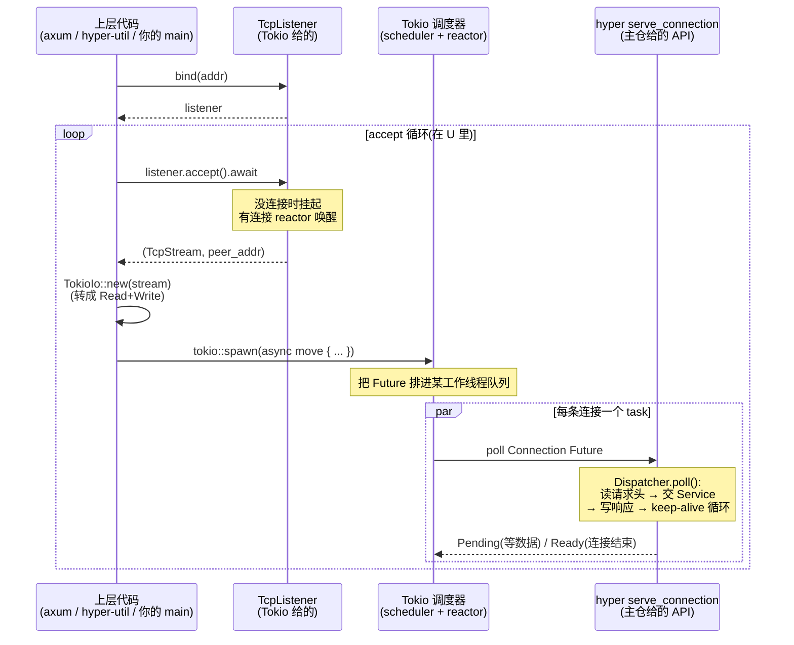
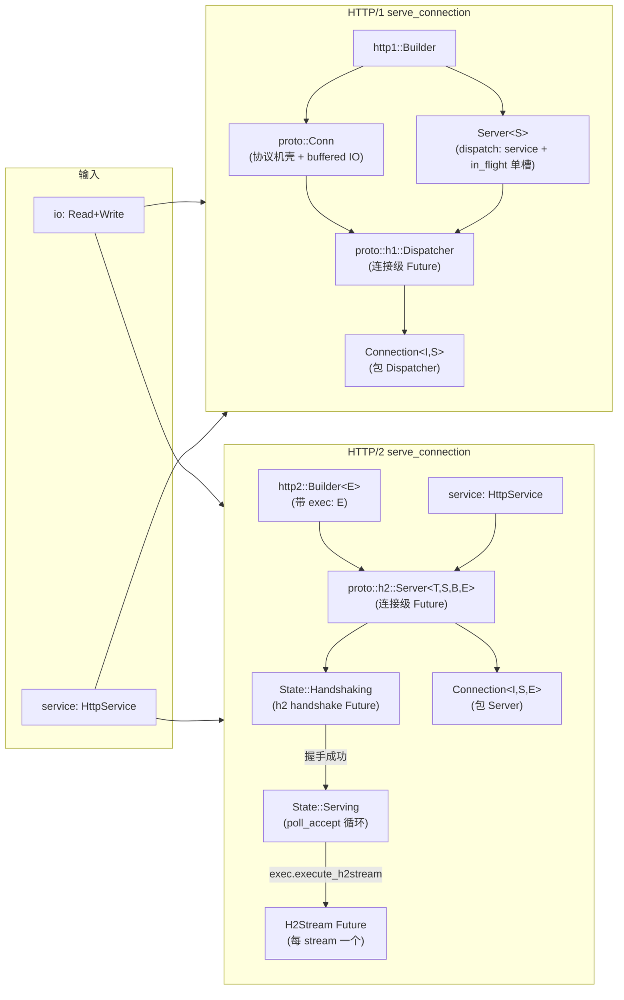

# 第 5 篇 · 第 15 章 · server 接受连接与服务

> **核心问题**:第 4 篇我们拆完了 client——它怎么把请求发出去、怎么用连接池复用 keep-alive 连接。现在反过来——server 侧。你写 `axum::serve(listener, app).await`,或者直接用 hyper 写一个 echo server,这一行背后到底发生了什么?具体说:server 怎么从 `TcpListener` accept 一条 TCP 连接、怎么把每条连接 spawn 成一个独立的 Tokio task、每条连接上跑的到底是个什么东西(协议机循环把请求交给 Service)?那个反复出现的 `serve_connection(io, service)` API 到底是什么——它把"一条 IO + 一个 Service"包成了一个什么样的东西?为什么它返回的是一个 `Future`?HTTP/1 server 和 HTTP/2 server 在 `serve_connection` 这一层有什么不同(HTTP/1 每连接一个协议机、HTTP/2 每连接一个 h2 连接再加多 stream)?最关键的——很多读者以为 hyper 主仓里有一个完整的 accept 循环,但真相是 hyper 1.0 把这条边界切在了 `serve_connection`,accept + spawn 的循环根本不在 hyper 主仓,而在 `hyper-util`(或 axum / 用户代码)。这一章就把"server 怎么接连接、怎么把每条连接交给协议机 + Service"这一层讲到读者脑子里能放映,并把这个 1.0 的边界**诚实**钉死。

> **读完本章你会明白**:
> 1. `serve_connection` 这个 API 到底是什么——它是一个**函数**(`Builder::serve_connection`),吃一条 `io`(任何 `Read + Write + Unpin`)+ 一个 `Service`,吐一个**实现了 `Future` 的 `Connection` 结构**,这个 Future 跑到连接结束。它是"把协议机装在一条连接上"这件事的**API 表达**:一条 io + 一个 Service = 一个跑完连接的 Future。
> 2. 为什么 hyper 主仓**只给 `serve_connection`(单连接),不给 accept 循环**——`server/mod.rs` 顶层文档就明说了"how exactly you choose to listen for connections is not something hyper concerns itself with"。accept + spawn 的循环在 `hyper-util`(auto builder)或 axum / 用户代码。这条 1.0 三分的边界要钉死,这是很多读者最大的认知错位。
> 3. accept + spawn 的工程拼合长什么样——`hello.rs` 这个官方例子就是模板:`TcpListener::bind` → loop { `listener.accept().await` → `tokio::spawn(async { serve_connection(io, svc).await }) }`。每条连接一个 Tokio task,**这是 hyper 贡献的"海量连接并发"地基**,但 spawn/调度机制本身承《Tokio》。
> 4. HTTP/1 server 和 HTTP/2 server 的 `serve_connection` **API 形状一样、底层不同**:H1 把 io + Service 包成一个 `proto::h1::Dispatcher` Future(单协议机循环,`in_flight` 单槽串行处理);H2 把 io + Service + **executor** 包成一个 `proto::h2::Server` Future(连接级 Future,每来一条 stream 调 `exec.execute_h2stream` spawn 出一个 `H2Stream` 子 task)。为什么 H2 需要 executor 而 H1 不需要。
> 5. `HttpService` 是什么、和 `Service` 什么关系——它是 `service/http.rs` 里的一个 **sealed trait alias**,把"接受 `Request<某 Body>`、返回 `Future<Output = Response<某 Body>>`"这一类 `Service` 钉成 server 侧的统一形状。hyper 主仓的 `serve_connection` 收的是 `HttpService<IncomingBody>`,你写的 axum handler 经过层层包装最后也满足这个约束。
> 6. auto 协议选择(ALPN 协商 H1/H2 或 H1 先读字节嗅探)为什么不在 hyper 主仓——它在 `hyper-util::server::conn::auto`,因为"选择哪条协议"和"听端口"一样是上层策略,不是单连接协议机的事。

> **如果一读觉得太难**:先抓三件事——① `serve_connection(io, service)` 返回一个 `Connection` Future,把这个 Future spawn 出去就等于"在这条连接上跑协议机直到结束",这是 hyper server 侧的全部 API 表面;② accept 循环 + 每连接 spawn task 的代码**不在 hyper 主仓**,在 `hyper-util` 或 axum / 你的代码,hyper 主仓只管"一条连接";③ HTTP/1 和 HTTP/2 的 `serve_connection` 形状一样,差别在 H2 多收一个 `executor`(因为 H2 要在连接内 spawn 子 stream task)。这三条钉住,后面所有细节都是它们的展开。

---

## 〇、一句话点破

> **hyper 的 server 侧 API 极简——核心就一个函数:`Builder::serve_connection(io, service) -> Connection`,它把"一条 IO + 一个 Service"包成一个 `Future`,这个 Future 跑到连接结束。`server/mod.rs` 顶层文档白纸黑字写明 hyper **不管 accept**——accept 循环和每连接 spawn task 在 `hyper-util`(auto builder)或 axum / 用户代码里。H1 和 H2 的 `serve_connection` API 形状一样,底层一个包成 `proto::h1::Dispatcher` Future(单协议机串行循环)、一个包成 `proto::h2::Server` Future(连接级 + 每流 spawn 子 task)。一行字:hyper server 侧 = "把一条 io + 一个 Service 包成一个跑完连接的 Future",就这么一层,但这一层把"协议机装在连接上"这件事表达得最干净。**

这是结论。本章倒过来拆:先从 axum 背后那行 `serve` 开始,把"用户视角的 server"和"hyper 主仓给的 server"分开;再钻 `serve_connection` 的 API 形状(吃 io + Service、吐 Future);然后**诚实**讲清 hyper 1.0 这条边界(为什么 accept 循环不在主仓、它在哪);接着拆 accept + spawn 的工程拼合(`hello.rs` 模板);再并排拆 H1 server 和 H2 server 的 `serve_connection` 底层(为什么形状一样、为什么 H2 多一个 executor);然后拆 `HttpService` 这个 sealed trait alias;再讲 auto 协议选择为什么在外部;最后两个技巧精解。

> **承接《Tokio》**:`TcpListener::accept`、`tokio::spawn`、task 的 M:N 调度、`AsyncRead`/`AsyncWrite`、`Future`/`Poll`/`Waker`、budget=128 让出——这些《Tokio》已拆透的机制一句带过。本章不重讲"spawn 怎么调度",只讲 hyper 怎么用"每连接 spawn 一个跑 `serve_connection` 的 task"搭起 server。

> **承 P2-05 / P3-09/10**:H1 的 `Dispatcher` 循环怎么一圈一圈跑(`poll_loop`、`in_flight` 单槽、`KA` 三态),在 P2-05 已拆透,本章只指路;H2 的 `proto::h2::Server` 怎么 `poll_accept` 拿 stream、每 stream 怎么包成 `H2Stream`、body 怎么桥(`PipeToSendStream`/`Incoming::h2`),在 P3-09/10 已拆透,本章只指路。本章篇幅全留 **`serve_connection` 这个 API 层 + accept+spawn 的工程拼合 + H1/H2 server 在这层的差异 + 主仓/hyper-util 的边界**——这些 P2-05 和 P3-09/10 都没讲,因为它们钻在协议机内部,而本章站在它们之上,看"协议机是怎么被装进连接、连接是怎么被 spawn 出去的"。

---

## 一、用户视角的 server vs hyper 主仓给的 server

### 1.1 从 axum 那行 `serve` 说起

大多数人接触 Rust 写 server,第一行是这样:

```rust
// axum 的典型用法(简化示意,非 hyper 源码)
async fn main() {
    let app = axum::Router::new().route("/", get(handler));
    let listener = tokio::net::TcpListener::bind("0.0.0.0:3000").await.unwrap();
    axum::serve(listener, app).await.unwrap();
}
```

读者脑子里浮现的画面往往是:`axum::serve` 内部有个 `loop { listener.accept(); ... }`,每 accept 一条连接就 spawn 一个 task,task 里把连接和 router 交给某个 HTTP 引擎跑。这个画面**对了一半**——确实有 accept 循环和 spawn,但它们**不在 hyper 主仓**。axum 自己实现了一个 accept 循环(axum 0.7+ 不再依赖 `hyper-util` 的 `auto` builder,而是自带的 `serve`),它内部对每条连接调用的是 **hyper 的 `serve_connection`**。

把 hyper 主仓和 axum 的职责拆开:

| 层 | 在哪 | 干什么 |
|---|---|---|
| `TcpListener::bind` / `accept` | `tokio::net`(Tokio 给的) | 监听端口、拿到一条 `TcpStream` |
| accept 循环 + 每连接 spawn | axum 的 `serve` / `hyper-util` 的 `auto` builder / **你的代码** | loop accept → spawn task |
| **`serve_connection(io, service)`** | **`hyper/src/server/conn/http1.rs` / `http2.rs`** | **把一条 io + 一个 Service 包成一个 Future** |
| 协议机循环(H1 `Dispatcher` / H2 `Server`) | `hyper/src/proto/h1/` / `proto/h2/` | 在那个 Future 的 `poll` 里跑 |
| 你的业务 handler | axum router / 你写的 `Service` | 拿到 `Request` 算出 `Response` |

这张表的中间三行就是本章的主角。最关键的一行是第三行——`serve_connection`,它是 hyper 主仓 server 侧**唯一对外暴露的 API 表面**,也是"协议机装在一条连接上"这句话的代码落地。

### 1.2 `server/mod.rs` 顶层文档:hyper 把自己定位讲清楚了

如果读者对"hyper 主仓到底给不给 accept 循环"还有疑问,hyper 的源码顶层文档白纸黑字写明了。打开 `hyper/src/server/mod.rs`,整个文件就 10 行:

```rust
//! HTTP Server.
//!
//! A "server" is usually created by listening on a port for new connections,
//! parse HTTP requests, and hand them off to a `Service`.
//!
//! How exactly you choose to listen for connections is not something hyper
//! concerns itself with. After you have a connection, you can handle HTTP over
//! it with the types in the [`conn`] module.
pub mod conn;
```

(见 `hyper/src/server/mod.rs` 全文。)

注意中间那句加粗的话:**"How exactly you choose to listen for connections is not something hyper concerns itself with."**——"怎么听端口、怎么 accept 连接,hyper 不管。" hyper 主仓的 `server` 模块**只暴露一个子模块 `conn`**,而 `conn` 里只有 `http1` 和 `http2` 两个连接级 builder。没有 `accept`,没有 `Listener` 抽象,没有"server 主循环"。

`server/conn/mod.rs` 的文档进一步钉死:

```rust
//!  Server connection API.
//!
//! The types in this module are to provide a lower-level API based around a
//! single connection. Accepting a connection and binding it with a service
//! are not handled at this level. This module provides the building blocks to
//! customize those things externally.
```

(见 `hyper/src/server/conn/mod.rs`。)

"**Accepting a connection and binding it with a service are not handled at this level.**"——accept 连接、把连接和 service 绑起来,不在这个层级处理。这个模块只提供"**单连接**"的 building block,让你**在外部** customize accept 逻辑。

> **钉死这件事(★1.0 三分的边界,本章最易翻车的点)**:hyper 1.0 三分重构(client/server/service 拆开、连接池挪到 hyper-util)之后,主仓 `hyper::server` **只给 `serve_connection`(单连接)**,不给 accept 循环。很多从 0.14 时代过来的资料、博客,或者从别的语言过来的读者,以为 hyper 主仓里有一个 `Server::bind(addr).serve(make_service)` 这种高层 API——**1.0 之后那个 API 被挪到 `hyper-util` 了**。主仓的 `server` 模块就是"把一条连接跑成 HTTP"这最低一层。读本章,先把这条边界钉死,否则后面看 `serve_connection` 的签名会觉得"怎么这么低级、连个 accept 都没有"——这不是低级,是 1.0 有意的分层。

> **不这样会怎样**:如果把 accept 循环焊死进 hyper 主仓,那 hyper 就得替你决定"用哪种 listener(TcpListener / UnixListener / 自定义)、怎么 spawn(Tokio 多线程 / current_thread + LocalSet / 自定义 executor)、并发上限多少、怎么 graceful shutdown 整个 listener"——这些全是上层策略,不同部署(普通 server / 代理 / 嵌入式 / 测试 mock)需求不同。把 accept 留给上层,hyper 主仓只管"一条连接怎么跑成 HTTP",每一层都可替换。这是 Unix "机制与策略分离"在 server 侧的体现。

---

## 二、`serve_connection`:把一条 io + 一个 Service 包成一个 Future

### 2.1 API 形状:函数签名

现在钻进 hyper 主仓给的 server API。HTTP/1 server 的入口在 `hyper/src/server/conn/http1.rs`,核心是这个方法(贴真实签名):

```rust
// hyper/src/server/conn/http1.rs:452
pub fn serve_connection<I, S>(&self, io: I, service: S) -> Connection<I, S>
where
    S: HttpService<IncomingBody>,
    S::Error: Into<Box<dyn StdError + Send + Sync>>,
    S::ResBody: 'static,
    <S::ResBody as Body>::Error: Into<Box<dyn StdError + Send + Sync>>,
    I: Read + Write + Unpin,
{
    let mut conn = proto::Conn::new(io);
    // ... 一堆 set_xxx 把 Builder 上的选项灌进 conn ...
    let sd = proto::h1::dispatch::Server::new(service);
    let proto = proto::h1::Dispatcher::new(sd, conn);
    Connection { conn: proto }
}
```

把它抽出来,API 形状是:

```
Builder::serve_connection(self, io: I, service: S) -> Connection<I, S>
  where I: Read + Write + Unpin, S: HttpService<IncomingBody>
```

三个关键点:

1. **吃 `&self`(Builder)**:Builder 是配置容器,存了一堆 HTTP/1 选项(keep_alive、half_close、title_case_headers、max_buf_size、header_read_timeout、writev、pipeline_flush、auto_date_header……)。Builder 是 `Clone + Debug`(`http1.rs:71`),所以你可以 `Builder::new()` 一次配好,然后对每条连接复用同一个 Builder 调 `serve_connection`。
2. **吃 `io: I`,约束 `I: Read + Write + Unpin`**:`io` 是任何实现了 `crate::rt::Read + crate::rt::Write` 的东西。注意这不是 `tokio::io::AsyncRead`,而是 hyper 自己在 `rt` 模块定义的 `Read`/`Write` trait(它们是 hyper 1.0 为了"不绑死 Tokio"而抽出来的最小 IO 抽象,实现在 `rt/io.rs`——但实践中你拿到 `tokio::net::TcpStream` 后会包一层 `TokioIo` 把它转成 `Read + Write`)。这个约束保证了 hyper 可以跑在任何异步运行时(只要你能给它 `Read + Write`),但默认就是 Tokio。
3. **吃 `service: S`,约束 `S: HttpService<IncomingBody>`**:Service 在这里是 `HttpService`(下面第五节单独拆)。`IncomingBody` 是 hyper 的请求体类型(`body::Incoming`),固定——server 侧拿到的请求体就是这种"读 h2 RecvStream 或 h1 chunked/length-known 进来的"流式 body。

返回值 `Connection<I, S>` 是本章的主角。它是一个 `Future`——下面看它怎么实现 `Future`。

### 2.2 `Connection` 是一个 Future

`Connection` 这个结构本身极简(`http1.rs:40`):

```rust
// hyper/src/server/conn/http1.rs:32-46(pin_project_lite! 宏展开后大致这样)
pub struct Connection<T, S>
where
    S: HttpService<IncomingBody>,
{
    conn: Http1Dispatcher<T, S::ResBody, S>,
}
```

它就一个字段 `conn`,类型是 `Http1Dispatcher<T, S::ResBody, S>`,展开就是(见 `http1.rs:25-30` 的 type alias):

```rust
type Http1Dispatcher<T, B, S> = proto::h1::Dispatcher<
    proto::h1::dispatch::Server<S, IncomingBody>,
    B,
    T,
    proto::ServerTransaction,
>;
```

也就是说,`Connection` 内部就是一个 `proto::h1::Dispatcher`,这个 Dispatcher 持有:一个 `Conn<I, Bs::Data, T>`(协议机壳 + buffered IO)、一个 `dispatch::Server<S, IncomingBody>`(server 侧的 dispatch,里面装着 Service 和 `in_flight` 单槽)、一个 body drop guard、一个 closing 标志。这些细节 P2-05 已拆透,本章不重讲。

关键点是:`Connection` 实现了 `Future`(`http1.rs:207`):

```rust
// hyper/src/server/conn/http1.rs:207-235
impl<I, B, S> Future for Connection<I, S>
where
    S: HttpService<IncomingBody, ResBody = B>,
    S::Error: Into<Box<dyn StdError + Send + Sync>>,
    I: Read + Write + Unpin,
    B: Body + 'static,
    B::Error: Into<Box<dyn StdError + Send + Sync>>,
{
    type Output = crate::Result<()>;

    fn poll(mut self: Pin<&mut Self>, cx: &mut Context<'_>) -> Poll<Self::Output> {
        match ready!(Pin::new(&mut self.conn).poll(cx)) {
            Ok(done) => {
                match done {
                    proto::Dispatched::Shutdown => {}
                    proto::Dispatched::Upgrade(pending) => {
                        // With no `Send` bound on `I`, we can't try to do
                        // upgrades here. In case a user was trying to use
                        // `Body::on_upgrade` with this API, send a special
                        // error letting them know about that.
                        pending.manual();
                    }
                }
                Poll::Ready(Ok(()))
            }
            Err(e) => Poll::Ready(Err(e)),
        }
    }
}
```

注意三件事:

1. **`Output = crate::Result<()>`**:这个 Future 完成时只告诉你"连接跑完了,要么 Ok 要么错了",不返回任何业务数据。因为业务逻辑(Service)的产出已经通过协议机写回给客户端了,连接 Future 本身没什么可返回的。
2. **`poll` 内部就一行实质逻辑:`Pin::new(&mut self.conn).poll(cx)`**——它把这个 poll 委托给 `Dispatcher` 的 poll。`Dispatcher` 的 poll(P2-05 拆透的 `dispatch.rs:495`)就是那个"读一点、写一点、循环"的协议机循环。也就是说,**`Connection` 这个 Future 的执行,就等于在这条连接上跑协议机循环**。
3. **`Dispatched::Upgrade` 分支**:如果协议机循环退出是因为要协议升级(websocket),`Connection::poll` 在这个 `UpgradeableConnection` 的版本里会去 fulfill 那个 upgrade;但默认的 `Connection`(不带 `with_upgrades()`)只调一个 `pending.manual()`——意思是"这个 Connection 不支持升级,手动报错让用户知道要用 `with_upgrades()`"。这是 hyper 1.0 把升级能力做成 opt-in 的体现(见 P5-16)。

> **钉死这件事**:`Connection` 这个结构,就是"一条 HTTP/1 连接上的协议机循环"的 Future 封装。它的 `poll` 把活儿全委托给内部 `Dispatcher::poll`。从 server 的视角看,**"在这条连接上跑 HTTP" = "把这个 Connection Future poll 到 Ready"**。你 `tokio::spawn` 这个 Future 出去,就等于"让 Tokio 在它的某个工作线程上,反复 poll 这个连接的协议机循环,直到连接结束"。

### 2.3 `#[must_use]` 提示:Future 不 poll 不进展

`Connection` 上有个细节值得注意(`http1.rs:39`):

```rust
#[must_use = "futures do nothing unless polled"]
pub struct Connection<T, S> ...
```

`#[must_use]` 这个属性 + 那句 "futures do nothing unless polled" 是 hyper 在反复提醒你:**这个 Future 必须被 poll(通常 `.await`),否则连接上不会有任何 HTTP 进展**。如果你 `serve_connection(io, svc)` 拿到一个 `Connection` 然后直接 drop 它,连接立刻被丢弃,什么请求都不会被处理。

这条提示是 Rust 异步模型的核心规则(承《Tokio》):Future 是 lazy 的,只有被 poll 才会推进。hyper 用 `#[must_use]` 把这条规则在 API 层面钉死,防止用户写出"拿到 Connection 却忘了 await"的 bug。HTTP/2 server 的 `Connection`(`http2.rs:28`)也有同样的属性和提示。

### 2.4 这就是"协议机装在一条连接上"的 API 表达

把上面三小节合起来,`serve_connection` 这个 API 在表达什么就很清楚了:

> **`serve_connection(io, service) -> Connection` 表达的是:给我一条 IO(任何 `Read + Write`)+ 一个 Service(怎么处理请求),我还你一个 Future,这个 Future 跑到这条连接的协议机结束。把 Future spawn 出去 = 在这条连接上跑 HTTP。**

这就是第一性原理("把 HTTP 协议机无缝建在 Tokio 异步运行时之上——每个连接一个 task")的 **API 落地**。hyper 没有给你一个"Server 对象 + bind + serve"的大一统 API(那是 0.14 时代,1.0 砍了),它给你的就是这一个函数,极简,但表达力完备:

- "每个连接一个 task" → 每条连接调一次 `serve_connection`,拿一个 `Connection` Future,你(或上层)负责 spawn。
- "协议机" → `Connection` 内部的 `Dispatcher`(H1)或 `proto::h2::Server`(H2)。
- "Service 把请求处理抽象成 Future" → `serve_connection` 收的 `S: HttpService<IncomingBody>` 参数。

> **不这样会怎样**:如果 hyper 给的是"Server::bind(addr).serve(svc)"这种 0.14 式大一统 API,那它就得把 listener、accept 循环、spawn 策略、graceful shutdown 全焊死,可替换性差(详见第一节"不这样会怎样")。1.0 重构把这个砍掉,只留 `serve_connection`,把"听端口"还给上层——表面看 API 变"低级"了,实际是把策略(怎么 accept、怎么 spawn、怎么关停)和机制(一条连接怎么跑 HTTP)切干净。这是 1.0 重构最重要的设计取向之一,详见 P6-19。

---

## 三、accept + spawn 在哪:把 hyper 主仓的边界钉死

### 3.1 hyper 主仓里搜不到 accept 循环

很多读者第一次看 hyper 1.x 源码会懵:"server 在哪?accept 循环在哪?"——在 `hyper/src/` 里 grep `TcpListener::bind` 或 `listener.accept()`,**一个都搜不到**。因为 hyper 主仓的 server 模块根本不碰 listener。

这一点是 1.0 三分重构之后最容易让从 0.14 / 从别的语言过来的读者翻车的地方。0.14 时代 hyper 主仓有一个 `hyper::Server`,长这样(简化):

```rust
// hyper 0.14 的大一统 server API(简化示意,非 1.x 源码)
let server = hyper::Server::bind(&addr).serve(make_service);
server.await;
```

这个 `Server::bind` 内部有 accept 循环、有 spawn、有 graceful shutdown——一条龙。1.0 把这一套**整个挪到 `hyper-util` crate**,主仓的 `hyper::server` 只留 `serve_connection` 这最低一层。所以你在 1.x 主仓里再也找不到 `Server::bind`、找不到 accept 循环。

> **钉死这件事(本章最易翻车)**:hyper 1.0 主仓 **没有 accept 循环**。`hyper::server` 模块只给 `conn::http1::Builder::serve_connection` 和 `conn::http2::Builder::serve_connection` 两个入口,每个都是"单连接"API。accept 循环在哪?
> - 在 **`hyper-util` crate** 的 `server::conn::auto::Builder`(auto builder,自动选 H1/H2),它内部 loop accept + spawn + 对每条连接调 hyper 主仓的 `serve_connection`。
> - 或在 **axum** 的 `axum::serve`(axum 0.7+ 自带 accept 循环,内部对每条连接调 hyper 的 `serve_connection`)。
> - 或在 **你的代码**(如果你直接用 hyper 主仓写 server,自己写 accept + spawn loop,见下一节 `hello.rs`)。
>
> 这个边界是 hyper 1.0 三分重构的核心决策之一(client/server/service 拆开,把"上层策略"挪到 hyper-util)。读本章,这条边界必须钉死。

### 3.2 为什么这样切:机制 vs 策略

为什么 1.0 把 accept 循环挪出去?答案是机制与策略分离。

hyper 主仓给的是**机制**:"一条 io + 一个 Service 怎么跑成 HTTP"。这是确定的、可以正确实现的、对所有部署都一样的东西。

accept 循环是**策略**:

- 用什么 listener?`tokio::net::TcpListener`(标准选择)、`tokio::net::UnixListener`(unix socket)、自定义(测试 mock、代理的 inbound listener、io_uring 直接接管 accept)?
- 怎么 spawn?`tokio::spawn`(多线程运行时)、`tokio::task::spawn_local`(current_thread + LocalSet,!Send 任务)、自定义 executor(`trauma` / `smol` / 自己写的)?
- 并发上限多少?无限制、固定上限、令牌桶?
- 怎么 graceful shutdown 整个 listener?等所有在途连接、超时强杀、信号触发?
- 怎么观测?每条连接的 task name、metrics、tracing span?

这些问题的答案,不同部署差别巨大。把 accept 循环焊死进 hyper 主仓,就得替所有这些情况做决定,要么默认值不合理(强制一种 listener)、要么 API 复杂度爆炸(每个旋钮都暴露)。1.0 选择把策略挪到 `hyper-util`(给一个常用默认),把机制留主仓(给最小 building block),这是 Unix 哲学在 server 侧的体现。

> **对照 gRPC synchronous/asynchronous server API(一句带过)**:gRPC C++ core 提供两套 server API——synchronous(`ServerBuilder::BuildAndStart` 给一个 thread pool 同步处理 RPC)和 asynchronous(`ServerBuilder::AddCompletionQueue` 给一个 CQ 异步处理事件)。两套 API 把"怎么 accept、怎么调度"焊死在 C++ core 内,用户只能在它的框架里玩。hyper 1.0 走了相反的路——把 accept 完全交给上层,只给单连接的机制。这是 Rust 异步生态(运行时可换、trait 抽象成熟)和 C++ 异步生态(自带线程池 / 自带 CQ)的差别投射到 server API 设计上。

### 3.3 `hello.rs`:官方例子的 accept + spawn 模板

hyper 主仓的 `examples/hello.rs` 是"用 hyper 主仓直接写 server"的官方模板。它的核心就这么几行(贴真实片段,见 `hyper/examples/hello.rs`):

```rust
// hyper/examples/hello.rs(精简,保留核心)
use tokio::net::TcpListener;

#[tokio::main]
async fn main() -> Result<(), Box<dyn std::error::Error>> {
    let addr = "127.0.0.1:1337";
    let listener = TcpListener::bind(addr).await?;       // <-- 1. bind

    loop {
        let (stream, _) = listener.accept().await?;       // <-- 2. accept
        let io = TokioIo::new(stream);                    // <-- 3. 包装成 Read+Write

        tokio::task::spawn(async move {                   // <-- 4. spawn
            if let Err(err) = http1::Builder::new()       // <-- 5. serve_connection
                .serve_connection(io, service_fn(hello))
                .await
            {
                eprintln!("failed to serve connection: {}", err);
            }
        });
    }
}
```

五步对应五个角色:

1. **bind**:`TcpListener::bind(addr)` 拿到 listener(Tokio 给的)。
2. **accept**:`listener.accept().await` 拿到一条 `TcpStream` + 客户端地址。`accept` 是异步的,没连接时挂起。
3. **包装**:`TokioIo::new(stream)` 把 `TcpStream` 包一层,实现 hyper 的 `rt::Read + rt::Write`(这层适配在 `hyper-util`,因为 hyper 主仓不直接依赖 tokio 的 IO 类型——这也是 1.0 三分的一部分,IO trait 抽象见 P6-19)。
4. **spawn**:`tokio::task::spawn(async move { ... })` 起一个 task,task 里跑那个 `serve_connection` Future。**这一步就是"每连接一个 task"**。
5. **serve_connection**:`http1::Builder::new().serve_connection(io, service_fn(hello)).await`——这是 hyper 主仓给的 API,返回 `Connection` Future,`.await` 它就驱动协议机循环。

> **承接《Tokio》**:`TcpListener::bind` / `accept`、`tokio::task::spawn`、task 的 M:N 调度、`async move` 闭包的捕获——这些全是《Tokio》拆透的。本章只指路:`tokio::spawn` 把 Future 提交给 Tokio 调度器,调度器把它放到某个工作线程的队列上,工作线程空闲时 poll 它;poll 到 Pending 就挂起让出线程,poll 到 Ready 就继续。这套机制 hyper 一行都不重写,只是用。

`hello.rs` 这五步就是"用 hyper 主仓写 server"的全部模板。`multi_server.rs`(同一目录)展示了在两个端口上各起一个 accept 循环——同样模式复制两份。`single_threaded.rs` 展示了用 `tokio::task::spawn_local`(current_thread 运行时 + LocalSet)替代 `tokio::spawn`,让 !Send 的 service 也能跑——这正是因为 accept + spawn 在用户代码里,用户可以自由换 spawn 策略。

> **钉死这件事**:`hello.rs` 是 hyper 主仓 server 用法的**模板**——bind → loop { accept → TokioIo → spawn(serve_connection) }。你看 axum::serve、hyper-util::auto::Builder、任何上层框架的 server,内部核心都是这五步,只是封装得更厚(自动选 H1/H2、统一 graceful shutdown、metrics 接入等)。理解了 `hello.rs`,就理解了 hyper server 侧 80% 的工程拼合。

### 3.4 `hyper-util` 的 auto builder:封装好的 accept 循环

如果你不想自己写 accept 循环,`hyper-util` crate 提供了一个封装好的:`hyper_util::server::conn::auto::Builder`。它的核心职责是:

- 对每条 accept 进来的连接,**自动判断**是 HTTP/1 还是 HTTP/2(通过 ALPN 协商或 H1 先读字节嗅探,见第六节),然后调对应的 `serve_connection`。
- 把 accept + spawn + serve_connection 这套循环包成一个 `serve` 方法,用户传一个 `Accept` trait(抽象 listener)和一个 Service 就行。
- 提供 graceful shutdown 整个 listener 的钩子。

`hyper/src/server/conn/mod.rs` 的文档明确指了这条路(见 `hyper/src/server/conn/mod.rs:11-15`):

```rust
//! If your server needs to support both versions, an auto-connection builder is
//! provided in the [`hyper-util`](https://github.com/hyperium/hyper-util/tree/master)
//! crate. This builder wraps the HTTP/1 and HTTP/2 connection builders from this
//! module, allowing you to set configuration for both. The builder will then check
//! the version of the incoming connection and serve it accordingly.
```

注意 hyper 主仓的文档**自己**就把 auto builder 指向 hyper-util。这条边界在源码里就是这么明确。

> **钉死这件事**:"我要同时支持 H1 和 H2 怎么办?"——主仓不直接给,要么用 `hyper-util` 的 auto builder,要么自己 accept 后先嗅探字节再决定调哪个 `serve_connection`。这是 1.0 有意的取舍——把"协议选择"这个策略留给上层。

### 3.5 mermaid:server accept → spawn → serve_connection 全景

下面这张时序图把 server 接受连接的完整流程定下来:



这张图把三层角色(Tokio 给的 listener、Tokio 调度器、hyper 主仓的 serve_connection)分开,并标出了"accept 循环在上层代码里、serve_connection 在 hyper 主仓里"这条边界。读者脑子里把这图画下来,hyper server 侧的宏观结构就清楚了。

---

## 四、H1 server vs H2 server:`serve_connection` 形状一样、底层不同

### 4.1 H1 和 H2 的 `serve_connection` API 并排

现在把 HTTP/1 和 HTTP/2 的 `serve_connection` 并排放,看它们的形状:

```rust
// HTTP/1 (hyper/src/server/conn/http1.rs:452)
pub fn serve_connection<I, S>(&self, io: I, service: S) -> Connection<I, S>
where
    S: HttpService<IncomingBody>,
    I: Read + Write + Unpin,
    ...

// HTTP/2 (hyper/src/server/conn/http2.rs:306)
pub fn serve_connection<S, I, Bd>(&self, io: I, service: S) -> Connection<I, S, E>
where
    S: HttpService<IncomingBody, ResBody = Bd>,
    I: Read + Write + Unpin,
    E: Http2ServerConnExec<S::Future, Bd>,
    ...
```

形状**几乎一样**:都吃 `&self`(Builder)+ `io`(任何 `Read + Write`)+ `service`(`HttpService`),都返回一个 `Connection` Future。但有两个关键差别:

1. **H2 的 `Builder` 是泛型 `Builder<E>`,H1 的 `Builder` 不是**——H2 Builder 第一个字段就是 `exec: E`(`http2.rs:43`),`E` 是一个 executor。H1 Builder 没这个字段。
2. **H2 的 `serve_connection` 多一个 `E: Http2ServerConnExec<S::Future, Bd>` 约束**——H2 需要一个 executor,而 H1 不需要。

这两个差别指向同一件事:**HTTP/2 server 在一条连接内还要 spawn 子 task(每 stream 一个),而 HTTP/1 server 不需要**。

### 4.2 为什么 H1 不需要 executor、H2 需要

回到 HTTP/1 协议本身:一条 HTTP/1 连接**同一时刻只处理一个请求**(没有多路复用)。请求串行——读完一个请求、写完它的响应,才能读下一个(keep-alive)。hyper 的 H1 server 用一个 `in_flight: Pin<Box<Option<S::Future>>>` **单槽**(见 `proto/h1/dispatch.rs:48-49`)来记"当前正在处理的那个请求的 Future",`poll_ready` 在这个槽非空时返回 `Pending`(`dispatch.rs:626-632`)——也就是"上一个没写完响应,不会读下一个请求"。整个连接的协议机循环(`Dispatcher::poll`)在**同一个 task** 里串行推进,不需要再 spawn 子 task。

HTTP/2 协议相反:一条连接**并发处理多个 stream**(多路复用)。hyper 的 H2 server 在连接级 Future(`proto::h2::Server`)的 `poll_server`(`proto/h2/server.rs:251`)里,循环调 `self.conn.poll_accept(cx)` 拿对端开的新 stream(`server.rs:266`),每拿到一个就构造一个 `H2Stream` Future(`server.rs:312-318`),然后调 **`exec.execute_h2stream(fut)`**(`server.rs:320`)——这个 `execute_h2stream` 就是 spawn,把这个 stream 的处理 Future 提交给 executor 单独跑。

> **承接 P2-05 / P3-09/10**:H1 的 `Dispatcher::poll_loop` / `in_flight` 单槽 / 串行处理,在 P2-05 已拆透,本章只指路——"为什么 H1 不需要 executor"的答案就是 P2-05 那个 `in_flight` 单槽。H2 的 `poll_server` / `H2Stream` / `execute_h2stream`,在 P3-09/10 已拆透,本章只指路——"为什么 H2 需要 executor"的答案就是 P3-09 那个"每 stream 独立 spawn"的决策。

把这个差别画成对照表:

| 维度 | HTTP/1 server | HTTP/2 server |
|---|---|---|
| `serve_connection` API 形状 | `(io, service) -> Connection` | `(io, service) -> Connection`,Builder 带 `exec: E` |
| 返回的 `Connection` 内部 | `proto::h1::Dispatcher` Future | `proto::h2::Server` Future |
| 一条连接同时处理几个请求 | **1 个**(串行,`in_flight` 单槽) | **多个**(并发,每 stream 一个 `H2Stream`) |
| 在连接级 task 里 spawn 子 task? | **不需要** | **需要**,`exec.execute_h2stream(fut)` |
| Builder 上要不要 executor | 不要 | 要,`E: Http2ServerConnExec<S::Future, Bd>` |
| 连接级 Future 的 `poll` 在干什么 | `Dispatcher::poll` 串行读/写一个请求 | `Server::poll` 循环 `poll_accept` 拿 stream + spawn 子 task |

这张表是 H1 server vs H2 server 在 `serve_connection` 这一层的全部差别。

### 4.3 H2 `Server` 的构造:handshake 编进 state

钻一眼 H2 server 的 `serve_connection` 内部(`http2.rs:306`):

```rust
// hyper/src/server/conn/http2.rs:306-323
pub fn serve_connection<S, I, Bd>(&self, io: I, service: S) -> Connection<I, S, E>
where
    S: HttpService<IncomingBody, ResBody = Bd>,
    ...
    E: Http2ServerConnExec<S::Future, Bd>,
{
    let proto = proto::h2::Server::new(
        io,
        service,
        &self.h2_builder,
        self.exec.clone(),
        self.timer.clone(),
    );
    Connection { conn: proto }
}
```

注意它把 **`self.exec.clone()`** 传给 `proto::h2::Server::new`——这就是那个 executor 进入连接级 Future 的入口。`proto::h2::Server` 持有这个 `exec`(`server.rs:88` 的 `exec: E` 字段),之后在 `poll_server` 里调 `exec.execute_h2stream(fut)` 时用它。

`proto::h2::Server::new`(`server.rs:128-183`)内部做了一件有意思的事:它**不立即握手**,而是把 h2 的 `Handshake` Future 存进一个 `State::Handshaking` 状态(`server.rs:103-106`):

```rust
// hyper/src/proto/h2/server.rs:99-108(简化)
enum State<T, B>
where
    B: Body,
{
    Handshaking {
        ping_config: ping::Config,
        hs: Handshake<Compat<T>, SendBuf<B::Data>>,
    },
    Serving(Serving<T, B>),
}
```

`Server` 这个 Future 的第一次 `poll`(`server.rs:210`)会先进 `State::Handshaking` 分支,`poll` 那个 h2 handshake Future,握手成功后才切到 `State::Serving`(`Serving` 里有真正的 `Connection<Compat<T>, SendBuf<B::Data>>`,`server.rs:110-118`)。

> **技巧点睛(为什么把 handshake 编进 state)**:h2 的 handshake 是异步的(它要先和客户端交换 HTTP/2 connection preface、SETTINGS 帧,见《gRPC》第 2 篇)。如果 `Server::new` 同步握手,它就得是 `async fn` ——但 hyper 把 `Server` 设计成一个**手动 poll 的 Future**(不是 async fn),好处是状态机显式、零开销、可以用 `pin_project`。把 handshake 存进 state,第一次 poll 时才推进它,既保持了 Future 模型的统一(整个连接生命周期就是一个 Future 的多次 poll),又让 handshake 这种"启动阶段的异步步骤"无缝接入。这是 Rust 异步里"把 async fn 写成显式状态机 Future"的典型范例——承《Tokio》讲过的 Future 状态机编码。

### 4.4 H2 server 默认配置:窗口、并发、帧大小

H2 `serve_connection` 的另一个特点:它带了一堆 HTTP/2 协议级的默认配置,这些在 `proto/h2/server.rs:36-41` 钉死:

```rust
// hyper/src/proto/h2/server.rs:36-41
const DEFAULT_CONN_WINDOW: u32 = 1024 * 1024; // 1mb
const DEFAULT_STREAM_WINDOW: u32 = 1024 * 1024; // 1mb
const DEFAULT_MAX_FRAME_SIZE: u32 = 1024 * 16; // 16kb
const DEFAULT_MAX_SEND_BUF_SIZE: usize = 1024 * 400; // 400kb
const DEFAULT_SETTINGS_MAX_HEADER_LIST_SIZE: u32 = 1024 * 16; // 16kb
const DEFAULT_MAX_LOCAL_ERROR_RESET_STREAMS: usize = 1024;
```

`Config::default()`(`server.rs:62-80`)把这几个常量灌进去,还有 `max_concurrent_streams: Some(200)`(注意不是协议默认的无限制,hyper 默认限 200,见 `http2.rs:206-218` 的 Builder 注释)。这些是 hyper 给 H2 server 的"开箱即用默认值"——比 h2 crate 自己的默认更宽松(h2 spec 默认窗口是 64KB,hyper 拉到 1MB,见 `server.rs:30-35` 的注释解释"server 通常不资源紧张,默认 64KB 太保守")。

> **承接《gRPC》(一句带过)**:HTTP/2 的 flow control window、`SETTINGS_MAX_CONCURRENT_STREAMS`、frame size、HPACK header table size 这些协议级含义,在《gRPC》第 2 篇已拆透。本章只指路 hyper 默认值的大小,以及怎么通过 `http2::Builder` 的 `initial_stream_window_size` / `max_concurrent_streams` 等方法改。流控的动态行为(adaptive window、ping-based BDP)在 P3-11 拆。

### 4.5 mermaid:H1 vs H2 serve_connection 内部对照

下面这张流程图把 H1 和 H2 的 `serve_connection` 内部数据流并排画出来:



这张图的关键对照:H1 那条线里 `Dispatcher` 是唯一的 Future(串行循环),没有子 spawn;H2 那条线里 `Server` 是连接级 Future,但它会通过 `exec.execute_h2stream` 在连接内 spawn 出多个 `H2Stream` 子 task。这就是"H1 单协议机串行、H2 多 stream 并发"在 `serve_connection` 内部的可视化。

---

## 五、`HttpService`:server 侧 Service 的统一形状

### 5.1 `HttpService` 是什么

`serve_connection` 收的 service 参数约束是 `S: HttpService<IncomingBody>`。这个 `HttpService` 是 hyper 在 `service/http.rs` 里定义的一个 trait。完整定义(`hyper/src/service/http.rs:20-38`):

```rust
// hyper/src/service/http.rs:20-38
pub trait HttpService<ReqBody>: sealed::Sealed<ReqBody> {
    /// The [`Body`] body of the [`Response`].
    type ResBody: Body;

    /// The error type that can occur within this [`Service`].
    type Error: Into<Box<dyn StdError + Send + Sync>>;

    /// The [`Future`] returned by this [`Service`].
    type Future: Future<Output = Result<Response<Self::ResBody>, Self::Error>>;

    #[doc(hidden)]
    fn call(&mut self, req: Request<ReqBody>) -> Self::Future;
}
```

注意三件事:

1. **`sealed` trait**:`HttpService: sealed::Sealed<ReqBody>`。它是 sealed 的——你**不能直接 impl 它**,只能通过 impl `Service` 间接获得。这是 hyper 1.0 的设计,让 `HttpService` 成为一个**编译期 alias**,不让你直接实现。
2. **泛型在 `ReqBody`,不在 `Request`/`Response`**:`HttpService<ReqBody>` 把请求 body 类型作为泛型参数(实践中 server 侧是 `IncomingBody`),响应 body 类型走 associated type `ResBody: Body`。这样 `HttpService` 把"接受 Request<某 Body>、返回 Response<某 Body> 的 Future"这一形状钉死。
3. **`call(&mut self, ...)`**:`HttpService::call` 是 `&mut self`。注意这和 `Service::call` 的 `&self` 有出入(见下一小节)——这是因为 `HttpService` 是给 hyper 内部用的"调用入口",它允许 `&mut self` 是因为 blanket impl 会把 `&mut self` 重借用成 `Service` 要求的 `&self`。

### 5.2 `HttpService` vs `Service`:blanket impl 桥接

`Service` 才是 hyper 真正公开的、让你实现的 trait(`service/service.rs:32-57`):

```rust
// hyper/src/service/service.rs:32-57
pub trait Service<Request> {
    type Response;
    type Error;
    type Future: Future<Output = Result<Self::Response, Self::Error>>;

    /// Process the request and return the response asynchronously.
    /// `call` takes `&self` instead of `mut &self` because:
    /// - It prepares the way for async fn,
    ///   since then the future only borrows `&self`, and thus a Service can concurrently handle
    ///   multiple outstanding requests at once.
    /// - It's clearer that Services can likely be cloned.
    /// - To share state across clones, you generally need `Arc<Mutex<_>>`
    ///   That means you're not really using the `&mut self` and could do with a `&self`.
    fn call(&self, req: Request) -> Self::Future;
}
```

注意 `Service::call` 是 **`&self`**(不是 `&mut self`),源码注释解释了为什么——为了让 `async fn` 的 Future 只借用 `&self`,从而一个 Service 可以**并发处理多个请求**(每个请求的 Future 只借用 `&self`,不互相冲突)。这对 HTTP/2 的多 stream 并发至关重要(同一个 service 被多个 `H2Stream` task 并发调用)。

`HttpService` 和 `Service` 之间用一个 blanket impl 桥接(`service/http.rs:40-54`):

```rust
// hyper/src/service/http.rs:40-54
impl<T, B1, B2> HttpService<B1> for T
where
    T: Service<Request<B1>, Response = Response<B2>>,
    B2: Body,
    T::Error: Into<Box<dyn StdError + Send + Sync>>,
{
    type ResBody = B2;
    type Error = T::Error;
    type Future = T::Future;

    fn call(&mut self, req: Request<B1>) -> Self::Future {
        Service::call(self, req)   // <-- &mut self 在这里被重借用成 &self
    }
}
```

这段的意思是:**任何满足 `Service<Request<B1>, Response = Response<B2>>` 的类型 `T`,自动就是 `HttpService<B1>`**。你只需要 impl `Service`,`HttpService` 自动获得。`HttpService::call(&mut self, ...)` 内部调 `Service::call(self, req)`,把 `&mut self` 重借用成 `&self`(Rust 允许 `&mut T` → `&T` 的重借用)。

> **钉死这件事**:`HttpService` 是 hyper 内部用的"server 侧 service 统一形状"——它把 `Service<Request<某 Body>>` 这一类东西收拢,让 `serve_connection` 的签名干净(`S: HttpService<IncomingBody>`)。你**不直接 impl `HttpService`**,你 impl `Service`(或者用 `service::service_fn` 包一个 async fn),blanket impl 替你转成 `HttpService`。这是 hyper 1.0 用 sealed trait alias 让 API 既灵活(任意 `Service`)又干净(`HttpService` 一个约束)的设计技巧。

### 5.3 `service_fn`:最常见的入口

实践中,大多数 hyper server 例子用 `hyper::service::service_fn` 把一个 async fn 包成 Service。`hello.rs` 里就是这样:

```rust
// hyper/examples/hello.rs(简化)
async fn hello(req: Request<IncomingBody>) -> Result<Response<IncomingBody>, Infallible> {
    Ok(Response::new("hello\n".into()))
}

// 在 serve_connection 里:
http1::Builder::new()
    .serve_connection(io, service_fn(hello))   // <-- service_fn 把 async fn 包成 Service
    .await
```

`service_fn` 是 `service/util.rs` 里的一个 helper(承 P1-02),它把 `Fn(Request) -> Future<Output = Response>` 包成一个 impl `Service<Request>` 的结构。然后通过上面那个 blanket impl,自动满足 `HttpService<IncomingBody>` 约束,喂给 `serve_connection`。

axum handler 经过 router 包装后,最终也是一个 `Service<Request<IncomingBody>>`(具体怎么层层包装见 P1-03 Tower 中间件),同样满足 `HttpService<IncomingBody>`,喂给 hyper 的 `serve_connection`。

> **承 P1-02 / P1-03**:`Service` trait 的设计动机(为什么 `&self`、为什么 1.0 删 Tower 的 `poll_ready`、背压怎么挪到 `in_flight` 单槽 / H2 流控 / client `SendRequest`)在 P1-02 已拆透;Tower 中间件链、`ServiceBuilder` 在 P1-03 已拆透。本章只指路:`HttpService` 这个 sealed alias 是 server 侧的统一形状,所有 Service(无论你是 `service_fn`、axum router、reqwest 内部)经过 blanket impl 都能满足它。

---

## 六、auto 协议选择:为什么不在 hyper 主仓

### 6.1 问题:一条连接进来,怎么知道是 H1 还是 H2

真实部署里,一个端口(比如 443)往往要同时支持 HTTP/1 和 HTTP/2——浏览器用 HTTP/2,老的 client 用 HTTP/1。问题是:hyper accept 到一条 TCP 连接,第一个字节还没读,怎么知道它是 H1 还是 H2?

两种现实方案:

1. **ALPN(Application-Layer Protocol Negotiation)**:在 TLS 握手阶段,client 和 server 协商接下来跑什么协议。浏览器走 HTTPS 时,ALPN 协商出 "h2" 就 HTTP/2,协商出 "http/1.1" 就 HTTP/1.1。这是 HTTPS 场景的标准方案。
2. **H1 先读字节嗅探**:对明文连接(h2c,HTTP/2 cleartext),没法 ALPN,只能 accept 后先读几个字节——HTTP/2 连接以 "PRI * HTTP/2.0\r\n\r\nSM\r\n\r\n" 这个 connection preface 开头,读到这个就是 H2,否则当 H1。这是 h2c 场景的方案。

### 6.2 hyper 主仓不做这件事

`serve_connection` 的两个版本(http1 / http2)是**互斥的**——你调 `http1::Builder::serve_connection` 就只跑 H1,调 `http2::Builder::serve_connection` 就只跑 H2,主仓**没有**"先读字节判断再调对应版本"的逻辑。

为什么主仓不做?和 accept 循环一样,这是**策略**:

- ALPN 协商需要 TLS 层(rustls / openssl),hyper 主仓不绑死 TLS 实现。
- 嗅探字节需要"读了一点之后能 peek 回去"的 IO 适配,这是上层的事。
- 不同部署想用的策略不同(纯 HTTPS 走 ALPN、明文 h2c 走嗅探、内部 RPC 固定走 H2 不判断)。

所以 hyper 把 auto 选择挪到 `hyper-util`。主仓的 `server/conn/mod.rs` 文档明说了(见 `hyper/src/server/conn/mod.rs:11-15`,前面引过):

> If your server needs to support both versions, an auto-connection builder is provided in the [`hyper-util`] crate.

`hyper-util::server::conn::auto::Builder` 内部对每条连接:
- 如果 IO 是 TLS,从 ALPN 协商结果拿协议;
- 否则,先读 connection preface 嗅探;
- 然后调对应的 `http1::Builder::serve_connection` 或 `http2::Builder::serve_connection`。

axum 的 `axum::serve` 也自带类似逻辑(它支持自动 H1/H2)。

> **钉死这件事**:"server 自动选 H1/H2"是上层(hyper-util / axum)的策略,不是 hyper 主仓的机制。主仓的 `serve_connection` 是**协议专用**的——你要么 H1 要么 H2,二选一。这个边界和 accept 循环一样,是 1.0 三分的一部分。

---

## 七、为什么 sound:每连接独立 task、海量连接共享线程

### 7.1 每连接独立 task:不互相阻塞

hyper 的"每连接一个 task"模型,最直接的 sound 在于:**每条连接的协议机循环跑在独立 task 里,task 之间不互相阻塞**。

具体说:连接 A 的协议机在 `read` 时遇到 `Pending`(客户端没发数据),它挂起——但这只阻塞连接 A 的 task,连接 B 的 task 照常跑(读它的数据、写它的响应)。这是 Tokio M:N 调度的核心红利(承《Tokio》):task 挂起不占线程,线程被调度器拿去 poll 别的 ready task。

如果像同步 server 那样一连接一线程,连接 A `read` 阻塞会占住整个线程,连接 B 必须另开线程——10 万并发就要 10 万线程,内核调度爆炸、栈内存爆炸。hyper 靠"一连接一 task + Tokio M:N 调度",10 万连接可能只占几十个线程,每条连接挂起时几乎零成本。

### 7.2 海量连接共享小撮线程

把 `hello.rs` 的模板放大:10 万个 `tokio::spawn`,每个 spawn 一个跑 `serve_connection` 的 task。这 10 万个 task 共享 Tokio 运行时的 N 个工作线程(默认 N = CPU 核数)。每个工作线程的执行模型(承《Tokio》):

1. 从自己的本地队列(或别的线程队列偷)拿一个 ready task。
2. poll 这个 task,推进它的协议机循环。
3. poll 返回 Pending(等数据)→ 把 task 挂回等待队列,Waker 注册到 reactor。
4. poll 返回 Ready(连接结束)→ task 完成,丢弃。
5. 回到第 1 步,拿下一个 task。

这个循环里,**没有一条连接能独占线程**——budget 机制(承《Tokio》,budget=128)保证一个 task poll 太多次(比如一个 keep-alive 连接狂发请求)会主动让出,给别的 task 机会。所以即使某条连接的业务 Service 很慢(比如一个 handler 查数据库卡 10 秒),它在那 10 秒里是 Pending 挂起的,不阻塞任何线程。

### 7.3 连接错误不影响其他连接

每条连接跑在独立 task 里,还有一个 sound:连接 A 出错(协议错误、客户端断开、Service panic),只影响 task A——这个 task 结束,连接 A 关闭,资源释放。连接 B、C、D 完全不受影响。

这和"一个 accept 循环串行处理所有连接"形成对比:如果 accept 循环自己跑协议机(不 spawn task),一条连接出错可能让循环卡住、整个 server 不可用。hyper 的模型里,accept 循环(在上层)只管"accept + spawn",spawn 出去的 task 各自跑各自的协议机,任何一个 task 的失败都被 task 内部捕获(变成 `Connection` Future 的 `Err` 返回),不会污染 accept 循环。

> **钉死这件事**:hyper server 的 sound 三件套——① 每连接独立 task 不互相阻塞;② 海量连接共享小撮 Tokio 工作线程(M:N + budget 让出);③ 连接错误隔离在 task 内部不污染 accept 循环。这三件都建在 Tokio 上(承《Tokio》),hyper 的贡献是"用 `serve_connection` 这个 API 把协议机干净地封装成一个 Future,让你 spawn 一个 task 就等于跑一条连接"——这个 API 抽象让上面三件 sound 自然成立。

---

## 八、技巧精解

本章挑两个最硬核的技巧单独拆透。

### 技巧一:`serve_connection` 把"协议机装在连接上"表达成一个 Future

#### 这个技巧在解决什么

第一性原理那句话——"把 HTTP 协议机无缝建在 Tokio 异步运行时之上,每个连接一个 task"——在 API 层面怎么落地?最自然的想法是给一个 `async fn serve(io, service)`,你 `tokio::spawn(serve(io, svc))` 就行。但 hyper 1.0 没这么写,它给的是:

```rust
pub fn serve_connection<I, S>(&self, io: I, service: S) -> Connection<I, S>
```

返回一个**手动构造的、实现了 `Future` 的结构** `Connection<I, S>`,而不是一个 `async fn` 的返回值。这是一个有意识的设计。

#### 真实源码

`Connection`(`http1.rs:40`)就一个字段 `conn: Http1Dispatcher`,它 impl `Future`(`http1.rs:207`)的 `poll` 把活儿全委托给 `Dispatcher::poll`:

```rust
// hyper/src/server/conn/http1.rs:217(简化)
fn poll(mut self: Pin<&mut Self>, cx: &mut Context<'_>) -> Poll<Self::Output> {
    match ready!(Pin::new(&mut self.conn).poll(cx)) {
        Ok(proto::Dispatched::Shutdown) => Poll::Ready(Ok(())),
        Ok(proto::Dispatched::Upgrade(pending)) => { pending.manual(); Poll::Ready(Ok(())) }
        Err(e) => Poll::Ready(Err(e)),
    }
}
```

HTTP/2 那边对称,`Connection<I, S, E>`(`http2.rs:29`)就一个字段 `conn: proto::h2::Server<T, S, B, E>`,impl `Future`(`http2.rs:83`)的 `poll` 同样委托给 `Server::poll`(`server.rs:210`)。

#### 为什么不写成 `async fn`

如果写成 `async fn serve_connection(io, service) -> Result<()>`,编译器会把它转成一个 Future 状态机,功能上等价。但 hyper 选择**手动写 `Connection` 结构 + 手动 impl Future**,有几个好处:

1. **显式暴露 `graceful_shutdown` 等方法**:`Connection` 不只是 Future,它还提供 `graceful_shutdown(&mut self)`(`http1.rs:138` / `http2.rs:78`)、`into_parts(self)`(`http1.rs:151`,拆回 io + service + read_buf)、`poll_without_shutdown`(`http1.rs:167`,不关 IO 只跑协议,用于协议升级)、`with_upgrades(self)`(`http1.rs:199`,转成 `UpgradeableConnection`)。这些方法需要拿到 `Connection` 这个**具名类型**才能调——`async fn` 返回的是匿名 Future,你拿不到具名类型,调不了这些方法。这是 hyper 用手动 Future 而非 async fn 的**最强动机**:它需要 Future 类型本身是一个公开的、可操作的结构。
2. **H1 和 H2 的 API 形状统一**:H1 的 `Connection<I, S>` 和 H2 的 `Connection<I, S, E>` 是两个不同类型,但都 impl `Future<Output = Result<()>>`,都叫 `Connection`,都从 `Builder::serve_connection` 来。这种"统一 API 形状"用手动 Future 容易表达——你直接定义两个 `pub struct Connection`、各自 impl Future 即可。用 async fn 反而难以让两个 async fn 的返回类型"看起来一样"。
3. **零开销**:手动 impl Future 不引入 `async fn` 编译器生成的中间状态机的额外开销(虽然实践中差异极小,但对 hyper 这种被几亿请求/天的库踩过的库,每个微优化都值得)。

#### 反面对比:如果用 `async fn`

如果 hyper 写成:

```rust
// 假想的 async fn 版本(非 hyper 源码)
pub async fn serve_connection<I, S>(io: I, service: S) -> Result<()>
where ...
```

那 `graceful_shutdown`、`into_parts`、`with_upgrades`、`poll_without_shutdown` 这些方法都没地方放——返回的 Future 是匿名的,你只能 `.await` 它,不能在 await 之前对它做别的操作。hyper 想要的"跑协议机的同时还能从外部触发 graceful shutdown"就实现不了(P5-16 拆 graceful shutdown 会用 `Connection::graceful_shutdown`,这个方法依赖具名 `Connection` 类型)。所以手动 Future 是必须的。

> **钉死这件事**:`serve_connection` 不返回 `impl Future`,而返回具名 `Connection<I, S>` 结构——这是为了让 `Connection` 类型本身可操作(`graceful_shutdown` / `into_parts` / `with_upgrades` / `poll_without_shutdown`)。这是 Rust 异步里"用手动 Future 换取对 Future 类型的控制权"的典型范例:当你需要对一个 Future 在 poll 之外做操作时,async fn 的匿名 Future 不够用,必须手动写具名结构 + impl Future。承《Tokio》(Future 是状态机,手动写就是显式状态机)。

### 技巧二:H2 server 的 `exec.execute_h2stream`——把 spawn 留给上层

#### 这个技巧在解决什么

HTTP/2 server 在一条连接内要 spawn 多个 stream 子 task(每 stream 一个 `H2Stream` Future)。spawn 这个动作需要一个 executor——但 hyper 主仓**自己不 spawn**,它把 spawn 委托给上层传进来的 `exec: E`。这是 hyper 1.0"运行时无关"设计的招牌技巧。

#### 真实源码

`proto/h2/server.rs` 的 `poll_server`(`server.rs:251`)循环 accept stream,每拿到一个构造 `H2Stream`:

```rust
// hyper/src/proto/h2/server.rs:312-320(简化)
let fut = H2Stream::new(
    service.call(req),       // <-- Service 返回的 Future
    connect_parts,
    respond,                 // <-- h2 的 SendResponse
    self.date_header,
    exec.clone(),
);
exec.execute_h2stream(fut);  // <-- 关键:不是 tokio::spawn,而是 exec.execute_h2stream
```

`exec.execute_h2stream(fut)` 是这个技巧的核心。`exec` 的类型是 `E: Http2ServerConnExec<S::Future, B>`(`server.rs:120` 的约束),这个 trait 定义在 `rt/bounds.rs:109-114`:

```rust
// hyper/src/rt/bounds.rs:109-114
pub trait Http2ServerConnExec<F, B: Body>:
    super::Http2UpgradedExec<B::Data> + sealed::Sealed<(F, B)> + Clone
{
    #[doc(hidden)]
    fn execute_h2stream(&mut self, fut: H2Stream<F, B, Self>);
}
```

它有一个 blanket impl(`bounds.rs:117-128`):

```rust
// hyper/src/rt/bounds.rs:117-128
impl<E, F, B> Http2ServerConnExec<F, B> for E
where
    E: Clone,
    E: Executor<H2Stream<F, B, E>>,
    E: super::Http2UpgradedExec<B::Data>,
    H2Stream<F, B, E>: Future<Output = ()>,
    B: Body,
{
    fn execute_h2stream(&mut self, fut: H2Stream<F, B, E>) {
        self.execute(fut);   // <-- 委托给 Executor::execute
    }
}
```

也就是说,**任何 impl `Executor<H2Stream<...>>` 的类型 `E`,自动就是 `Http2ServerConnExec`**。`Executor` 是 hyper 在 `rt/mod.rs:47` 定义的最小 trait:

```rust
// hyper/src/rt/mod.rs(简化)
pub trait Executor<Fut> {
    fn execute(&self, fut: Fut);
}
```

实践中,`hyper-util` 提供一个 `TokioExecutor` impl 这个 `Executor`,`http2::Builder::new(TokioExecutor::new())` 就是标准用法。但关键是 hyper 主仓**不绑死 Tokio**——你可以传一个自己的 executor(比如 `tokio::task::spawn` 的包装、`spawn_local` 的包装、测试用的 mock executor),只要它 impl `Executor<H2Stream<...>>`。

#### 为什么不直接 `tokio::spawn`

如果 hyper 内部直接 `tokio::spawn(fut)`,那 hyper 就**硬依赖 Tokio 的多线程运行时**。但 hyper 1.0 的设计取向之一是"运行时无关"——它定义了自己的 `rt::{Read, Write, Timer, Executor}` 抽象,让你可以把它跑在任何运行时上(虽然实践中 99% 是 Tokio)。把 spawn 委托给 `exec.execute_h2stream`,hyper 主仓就保持了对运行时的中立。

这也让 hyper 能跑在:
- Tokio 多线程运行时(`TokioExecutor` impl `Executor` 调 `tokio::task::spawn`)。
- Tokio current_thread + LocalSet(`TokioExecutor` 换成调 `spawn_local`,见 `examples/single_threaded.rs`)。
- 自定义 executor(测试 mock、嵌入式运行时、glommio / smol 适配)。

#### 反面对比:H1 为什么不需要这个

H1 server 不需要 executor,因为 H1 协议本身在一条连接上**串行处理**一个请求(`in_flight` 单槽,P2-05)。整个连接的协议机循环跑在**同一个 task**(就是 spawn `serve_connection` 那个 task)里,不需要在连接内再 spawn 子 task。所以 `http1::Builder::serve_connection` 没有 `exec` 参数,`http1::Connection<I, S>` 也没有 `E` 泛型。

H2 协议相反,一条连接并发处理多个 stream,每个 stream 的处理(Service 跑完 + body 桥)是独立的异步任务,必须 spawn 出去才能并发。所以 H2 server 必须有 executor,这是协议并发模型决定的,不是 hyper 任意选择。

> **钉死这件事**:H2 server 的 `exec.execute_h2stream` 是"把 spawn 留给上层"的招牌技巧——hyper 主仓不硬依赖 Tokio 的 spawn,而是通过 `rt::Executor` trait 抽象,让上层传 executor 进来。这让 hyper 1.0 既能在 Tokio 多线程运行时上跑(默认),也能在 current_thread + LocalSet、自定义 executor 上跑。H1 server 因为协议串行,不需要这个。这个差别是"H1 单协议机串行 vs H2 多 stream 并发"在 API 层面的直接投射——为什么 `http2::Builder` 是 `Builder<E>` 而 `http1::Builder` 不是,答案就在这里。

---

## 九、章末小结

### 回扣主线

本章是第 5 篇(server)的首章,服务**框架侧**。它回答了"server 怎么 accept 连接、怎么把每条连接交给协议机 + Service"这一层。

- **核心 API**:`Builder::serve_connection(io, service) -> Connection`——把一条 io + 一个 Service 包成一个 `Future`。这个 Future 跑到连接结束,是"协议机装在一条连接上"的 API 表达。
- **核心边界(★1.0 三分)**:hyper 主仓**只给 `serve_connection`(单连接)**,accept 循环 + 每连接 spawn task 在 `hyper-util`(auto builder)/ axum / 用户代码。`server/mod.rs` 顶层文档白纸黑字写明 hyper 不管 accept。
- **H1 vs H2**:API 形状一样(都吃 io + Service,都返回 `Connection` Future),底层不同——H1 包成 `proto::h1::Dispatcher` Future(单协议机串行循环,`in_flight` 单槽);H2 包成 `proto::h2::Server` Future(连接级 + 每来一条 stream 调 `exec.execute_h2stream` spawn 子 task)。H2 的 Builder 多一个 `exec: E` 参数,因为协议并发模型需要 spawn 子 stream task。
- **`HttpService`**:server 侧 Service 的统一形状,sealed trait alias,blanket impl 让任何 `Service<Request<某 Body>, Response = Response<某 Body>>` 自动满足。你不直接 impl `HttpService`,你 impl `Service`(或用 `service_fn`),blanket impl 替你转。
- **sound 三件套**:每连接独立 task 不互相阻塞、海量连接共享小撮 Tokio 线程(M:N + budget)、连接错误隔离在 task 内部。

### 五个为什么

1. **为什么 hyper 主仓没有 accept 循环?** —— accept 循环是策略(用什么 listener、怎么 spawn、并发上限、graceful shutdown 整个 listener),不同部署差别巨大;主仓只给机制(`serve_connection` 单连接),把策略留给 `hyper-util` / axum / 用户代码。这是 1.0 三分重构的核心决策之一。
2. **为什么 `serve_connection` 返回具名 `Connection` 而不是 `impl Future`?** —— 为了让 `Connection` 类型本身可操作(`graceful_shutdown` / `into_parts` / `with_upgrades` / `poll_without_shutdown`)。`async fn` 的匿名 Future 拿不到具名类型,这些方法没地方放。这是"手动 Future 换取类型控制权"的范例。
3. **为什么 H2 server 需要 executor 而 H1 不需要?** —— H2 协议一条连接并发处理多 stream,每 stream 一个 `H2Stream` Future 必须 spawn 出去才能并发,所以需要 executor(`exec.execute_h2stream`);H1 协议串行处理(`in_flight` 单槽),整个连接的循环跑在同一个 task,不需要 spawn 子 task。
4. **为什么 hyper 把 spawn 委托给上层 `Executor`,不直接 `tokio::spawn`?** —— hyper 1.0 设计取向之一是"运行时不绑死 Tokio",通过 `rt::Executor` trait 抽象让 hyper 能跑在任何运行时(Tokio 多线程 / current_thread + LocalSet / 自定义 executor)。H1 不需要这个,H2 必须有,这是协议并发模型决定的。
5. **为什么 `HttpService` 是 sealed trait alias?** —— 让 `serve_connection` 的签名干净(`S: HttpService<IncomingBody>` 一个约束),同时不让你直接 impl(你只能 impl `Service`,blanket impl 替你转)。这是 hyper 1.0 用 sealed trait alias 让 API 既灵活又干净的设计技巧。

### 想继续深入往哪钻

- 想看 Tokio 的 `TcpListener::accept` / `tokio::spawn` / M:N 调度 / budget 让出:读《Tokio 设计与实现》或 [[tokio-source-facts]]。
- 想看 H1 的 `Dispatcher` 循环怎么一圈一圈跑(`poll_loop` / `in_flight` 单槽 / `KA` 三态):本书 P2-05。
- 想看 H2 的 `proto::h2::Server` 怎么 `poll_accept` 拿 stream、`H2Stream` 怎么包、body 怎么桥:本书 P3-09/10。
- 想看 HTTP/2 流控 / ping 保活的动态行为:本书 P3-11。
- 想看 graceful shutdown / 协议升级(websocket / h2c):本书 P5-16(下一章)。
- 想看 1.0 三分重构的全貌(client/server/service 拆开、连接池挪 hyper-util、IO trait 抽象):本书 P6-19。
- 想动手感受:用 hyper 主仓直接写一个 echo server(不经 axum,模仿 `examples/hello.rs`),抓包看一条连接上 keep-alive 的多个请求,然后改成 H2 看 `http2::Builder::new(TokioExecutor::new()).serve_connection` 的差别。

### 引出下一章

本章把 `serve_connection` 这个 API 表面、accept + spawn 的工程拼合、H1/H2 server 在这层的差异钉死了。但有两个问题没回答:server 怎么**优雅关闭**(等在途请求处理完再关连接,而不是粗暴断开)?连接怎么**协议升级**(HTTP 升级成 websocket、h2c 升级成 H2)?这两个都和 `serve_connection` 返回的 `Connection` Future 的额外能力(`graceful_shutdown` / `with_upgrades` / `into_parts`)直接相关。下一章 P5-16,我们钻进 **graceful shutdown 与升级**——server 怎么体面地收场,以及怎么把一条 HTTP 连接"变形"成别的协议。

> **下一章**:[P5-16 · graceful shutdown 与升级](P5-16-graceful-shutdown与升级.md)
