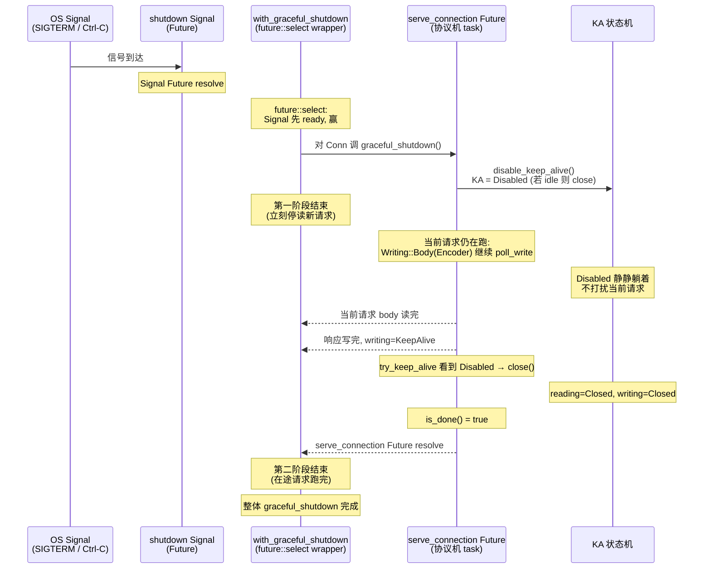
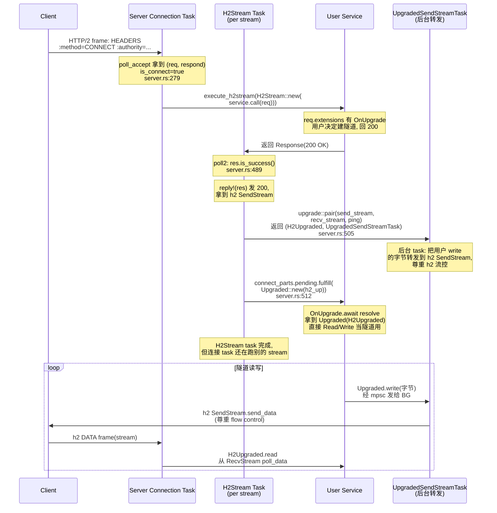

# 第 5 篇 · 第 16 章 · graceful shutdown 与升级

> **核心问题**:上一章讲了 server 怎么 accept 连接、每条连接怎么 spawn 一个 Tokio task 跑协议机。但一个能跑的 server 还差最后两件事:**怎么关**、**怎么改协议**。① 收到关停信号(SIGTERM、Ctrl-C、容器 kill)之后,server 不能"一刀切"——直接 abort 所有连接,会让在途的请求响应写一半,client 收到半截 JSON、半截 HTML,这叫"切断在途响应"。优雅关闭(graceful shutdown)要的是:**不再 accept 新连接、不再在这条连接上读新请求,但已经在处理中的请求(请求 body 还在收、响应还在吐)让它跑完**。这怎么实现?底层协议机是一个 keep-alive 的循环("读请求 → 处理 → 写响应 → 读下一个请求"),要在这个循环里"停读新请求但让当前请求跑完",需要一个状态——hyper 的答案是把 `KA`(keep-alive)从 `Busy`/`Idle` 变成 `Disabled`。② 当双方约定要把这条连接改造为别的协议(websocket 隧道、CONNECT 代理隧道),协议机怎么把底层 IO **干净地交还**给用户,旧协议机怎么退出而不泄漏 IO?HTTP/1 走 `101 Switching Protocols` + `Conn::into_inner` 把 IO 所有权移出,HTTP/2 走 CONNECT(含 RFC 8441 的 extended CONNECT)+ `pair` 把 `SendStream`/`RecvStream` 包成 `H2Upgraded`——为什么两条路长得完全不一样?这一章是第 5 篇的收尾章,把"server 怎么接连接"和"server 怎么关连接、怎么把连接交出去"补成闭环。

> **读完本章你会明白**:
> 1. graceful shutdown 在 hyper 里的**最小实现**只有一个动作:`server/conn/http1.rs::Connection::graceful_shutdown` 调 `self.conn.disable_keep_alive()`(http1.rs:138),它把 `KA` 从 `Busy`/`Idle` 推到 `Disabled`(`proto/h1/conn.rs:876`);`Disabled` 之后协议机不再读新请求头(因为 `try_keep_alive` 一看状态是 `Disabled` 就 `close`,conn.rs:1083),但**当前请求的 Reading/Writing 状态机继续跑到 `is_done()`**——这就是"停读新请求但让在途请求跑完"的全部秘密。
> 2. 为什么"协调多连接、不再 accept 新连接、给一个 deadline 超时强杀"这一层不在 hyper 主仓,而在 `hyper-util`(以及 axum):hyper 主仓只管**单连接**的 `graceful_shutdown`/`with_graceful_shutdown`(后者把 shutdown Signal 和 `serve_connection` Future 用 `future::select`/`try_race` 拼起来,Signal 触发后停读新请求);多连接编排是上层框架的事。这个分工的 why——可组合性、不绑架运行时——是 hyper 1.0 三分重构的延续。
> 3. HTTP/1 升级交接的所有权流(`101 Switching Protocols` → 协议机 `into_inner` 交出 IO → `OnUpgrade` Future resolve 成 `Upgraded`,后者用 `Rewind` 把 read_buf 里多读的字节一起交出 → 旧 `Dispatcher` task 干净退出):P2-07 讲过一笔,本章**钉死所有权交接为什么不泄漏**——`oneshot::Sender` 拿走 `Upgraded` 后,旧协议机的 Future 自然 `is_done()`、`poll_inner` 返回 `Dispatched::Upgrade`、上层 `serve_connection` 解析完成,task 退出,IO 的唯一所有者现在是用户的 `Upgraded`。
> 4. HTTP/2 升级为什么**长不出** HTTP/1 那条"连接级 upgrade"的路:HTTP/2 一条连接并发跑多个 stream,连接不归任何一个请求所有,所以**没有"把整条连接交出去"这回事**;websocket over HTTP/2 走 RFC 8441 的 extended CONNECT(`:method=CONNECT` + `:protocol=websocket`),隧道走经典 `CONNECT`,两条路本质都是**把某一条 stream 改造成双向字节管道**,而连接本身继续跑别的 stream。hyper 的实现:`proto/h2/server.rs` 把 `:method=CONNECT` 的请求挂上 `OnUpgrade`(`server.rs:295`),响应成功(2xx)后用 `upgrade::pair`(`proto/h2/upgrade.rs:19`)把 `SendStream`/`RecvStream` 包成 `H2Upgraded`,`fulfill` 给用户。
> 5. 为什么这两件事 **sound**:shutdown 不切断在途响应(靠 `Disabled` 只挡新请求头、不挡当前 Reading/Writing);upgrade 后旧协议机干净退出不泄漏 IO(靠 `into_inner` 把 IO 所有权移出 + Future 自然 `is_done`);HTTP/2 隧道用 `mpsc` channel + 独立 `UpgradedSendStreamTask` 隔离读写,让 H2 的流控(`reserve_capacity`/`poll_capacity`)和用户 write 解耦,一边的背压不阻塞另一边。

> **如果一读觉得太难**:先抓四件事——① graceful shutdown 的全部秘密是 `KA::Disabled`:一进这个状态,协议机不再开新一轮读,但当前请求照常跑完;② "不再 accept 新连接 + 给 deadline" 这层在 `hyper-util`/`axum`,hyper 主仓只管单连接;③ HTTP/1 升级是 `101` 后 `into_inner` 把 IO 所有权交还给用户,旧 task 自然 `is_done` 退出;④ HTTP/2 没有连接级升级,只有 stream 级(CONNECT/extended CONNECT),用 `pair` 把 h2 的 `SendStream`/`RecvStream` 包成 `H2Upgraded`。四条抓住,后面的源码和状态机就有挂靠点。

> **一个本章反复回扣的总开关**:`KA::Disabled` 之于 HTTP/1、GOAWAY 之于 HTTP/2、`into_inner`+oneshot 之于 HTTP/1 升级、`pair`+`UpgradedSendStreamTask` 之于 HTTP/2 升级——这四个表面看毫不相关的机制,本质是同一件事的不同形态:**给一条连接(或一条 stream)的"去向"——继续 HTTP 循环、还是交给用户、还是改成隧道——一个 sound 的、不泄漏、不串字节的所有权答案。** HTTP/1 因为连接串行,所以"关停"是 keep-alive 状态机的一个翻转,"升级"是 IO 所有权的一次移交;HTTP/2 因为连接并发,所以"关停"是 GOAWAY 卡 stream ID,"升级"是在单 stream 上造管道用 channel 解耦流控。形态跟着协议形态走,这是框架"长在协议机上"的体现。读这一章时,每讲完一个机制就回到这句问:"它给连接的去向一个什么答案?"

---

## 〇、一句话点破

> **graceful shutdown 是"把 keep-alive 状态机从 `Busy/Idle` 推到 `Disabled`,新请求不读了但当前请求跑完";HTTP/1 升级是"`101` 后把底层 IO 的所有权从协议机手里移交给用户,旧 task 自然退出";HTTP/2 升级是"连接不归谁所有,只能在某条 stream 上造一根双向管道,把 h2 的 `SendStream`/`RecvStream` 包成 `Upgraded`"。三件事共享一个根:**一条连接的"去向"——是继续 HTTP 循环、还是交给用户、还是改成隧道——必须始终有一个 sound 的、不泄漏、不串字节的所有权答案。**

这是结论。本章倒过来拆:先看"为什么不能直接 abort"(动机层,为什么 graceful 这件事在协议层而不是运行时层),再看 hyper 单连接的 `graceful_shutdown` 怎么落到 `KA::Disabled`(源码层),然后看上层(hyper-util/axum)怎么编排多连接 + shutdown Signal,接着把 HTTP/1 升级交接的所有权流钉死(承 P2-07 一笔,本章收口),最后讲 HTTP/2 升级为什么是另一条路(CONNECT 隧道 + extended CONNECT + `pair`)。

> **承接《Tokio》**:本章用到的"shutdown Signal 是个 Future""`future::select`/`try_race` 把两个 Future 拼起来谁先 ready 谁赢""oneshot channel""`AtomicWaker` 注册 + 唤醒"——这些《Tokio》拆透的异步原语一句带过。`Signal` 的底层是 Unix signal handler + Tokio reactor 唤醒,`oneshot` 是一次性 channel,`AtomicWaker` 是无锁的"一个 Waker 槽"——这些都不是本章重点,本章篇幅全留 hyper 独有:**`KA::Disabled` 怎么嵌进 keep-alive 状态机、`into_inner` 怎么交出 IO 所有权、`pair` 怎么把 h2 的 stream 包成 Upgraded**。
>
> **承接上一章(P5-15)**:上一章讲 server 怎么 `accept` 一条 TCP 连接、`Builder::serve_connection(io).serve(service)` 怎么 spawn 一个 task 跑协议机。本章接:**这条连接怎么优雅地关**、**怎么把这条连接交出去改协议**。把第 5 篇"server 怎么管一条连接的整个生命周期(接 → 服务 → 关 / 交出)"补成闭环。
>
> **承 P2-07**:HTTP/1 的 upgrade 机制(`101 Switching Protocols`、`OnUpgrade`/`Upgraded`、`Rewind` 还 read_buf)在第 2 篇第 7 章拆过状态机和字节流层面。本章不重复拆协议层,而是**从 server 框架侧钉死所有权交接**——为什么旧 task 一定干净退出、IO 一定不泄漏,把 P2-07 留下的"框架侧怎么收尾"这一笔收掉。HTTP/2 的 CONNECT 隧道承 P3-10(h2 集成),`pair`/`H2Upgraded` 是本章新东西。

---

## 一、为什么不能"直接 abort":graceful shutdown 在协议层,不在运行时层

### 1.1 朴素做法及其失败

收到关停信号,最朴素的 server 写法是:直接把所有 task abort 掉(`tokio::task::AbortHandle::abort()`),或者干脆 `std::process::exit(0)`。这在**短连接、无状态**的场景下勉强能用,但在真实 HTTP server 上有三道致命问题。

**第一道:切断在途响应,client 看到半截。** 一条 HTTP/1 连接此刻可能正处于 `Writing::Body`——server 正在一个 chunk 一个 chunk 地吐一个几 MB 的 JSON 响应,刚吐到一半。你 abort task,`poll_write` 永远不会再被调,TCP 那边 `RST` 一打,client 收到的是一个**截断的响应**——JSON 解析失败、页面白屏、下载文件损坏。对 client 来说这跟"server 崩了"没区别。HTTP/2 更糟:一条连接上并发 100 个 stream,其中 30 个正在写响应,abort 连接,30 个 client 同时收到半截。

**第二道:切断在途请求,body 半道丢弃。** 反方向也一样:client 正在上传一个大文件(POST multipart),server 正在 `poll_read_body` 把字节流式写进磁盘。abort task,上传中断,client 的 `Expect: 100-continue` 已经回了 `100`,body 发了一半,server 不声不响丢了——既没回 `413`,也没回 `500`,client 超时才发现。

**第三道:keep-alive 连接"睡在池子里",你 abort 主循环它还睡着。** 这个更隐蔽。HTTP/1.1 默认 keep-alive,一条连接处理完一个请求后进入 `Idle` 状态,在 `poll_read_keep_alive` 上等下一个请求(等 TCP 上来字节)。你 abort 的是 server 的 accept 循环,这些 idle 连接的 task 还在 reactor 上挂着等读——它们不会立刻死,要等 TCP keep-alive 超时或 client 主动关。这就是为什么很多朴素 server "关了进程但端口还占着 TIME_WAIT 一堆"。

> **不这样会怎样**:朴素的 abort 三件事全砸——半截响应、半截请求、僵尸 idle 连接。生产环境数据库迁移、金丝雀发布、Kubernetes rolling update 全靠 graceful shutdown,一砸就是用户可见的故障。

### 1.2 为什么"优雅"是协议层的事,不是运行时层的事

有人会想:优雅关闭这么常见,运行时不应该提供吗?Tokio 给了 `task::AbortHandle`、`JoinSet`、`CancellationToken`,为什么 graceful shutdown 不能用这些搭?

答案是:**优雅关闭的核心难点不在"怎么停一个 task"(运行时能做),而在"在协议机循环的哪一步停,才能既不切断在途请求又不读新请求"——这是协议机的不变量,只有协议机知道。** 运行时给的 `CancellationToken` 是个全局开关:它一拉,所有 await 这个 token 的 task 都收到信号,各自决定怎么退出。但"各自决定怎么退出"恰恰是问题——HTTP 协议机在 `Writing::Body(Encoder)` 状态收到 cancellation,它该不该立刻退?不该(响应写一半)。在 `Reading::Init` 状态收到,该不该退?该(本来就在等新请求,正好不接)。这个"什么时候退、什么时候不退"的判断,只能由协议机的状态机做——运行时不知道协议机当前在哪个状态。

所以 hyper 的设计是:**运行时给 cancellation 信号(Signal Future),协议机决定怎么响应(`KA::Disabled`)**。这两层分开,cancellation 信号来了不直接打断协议机,而是翻转一个状态位,让协议机在自己下一个"安全的决策点"(`try_keep_alive`)自然分流。这是把"关停"做成**协议机不变量**而非**运行时打断**的精髓。

> **承接《Tokio》**:`CancellationToken`(tokio-util)是"一个原子位 + 多个 Waker 注册"的协作式取消原语,各 task 自己 `token.cancelled().await` 收信号。它和 hyper 的 `KA::Disabled` 思想同源(都是"状态位 + 各处 poll 检查"),区别是 `CancellationToken` 是通用的、面向任意 task,而 `KA::Disabled` 是协议机专用的、只在 keep-alive 决策点检查——后者更精细,因为它知道"哪个检查点是安全的"。Tokio 的 cancellation 一句带过指路《Tokio》。

### 1.3 graceful shutdown 要的状态:停读新请求,让在途的跑完

所以 graceful shutdown 要的不是一个布尔"开/关",而是一个**三态**的语义:

1. **不再 accept 新连接**——这个由 server 的 accept 循环控制(在 hyper-util/axum 那一层)。
2. **不再在已有连接上读新请求**——这个由单连接的协议机控制,就是 hyper 主仓的 `graceful_shutdown`。
3. **已经在处理中的请求(读 body、写响应)继续跑完**——这个不是"额外做什么",而是"不做什么":只要别打断它,它自己会 `is_done()`。

第 2、3 两点合起来,就是 hyper 在**单连接层面**提供的 graceful shutdown。注意它**不**提供第 1 点(不再 accept)——那是上层框架的事。这是 hyper 1.0 三分重构(P6-19 详讲)的关键决策:**单连接的协议机关停**和**多连接的 accept 编排**是两件事,拆开,各管各的。

> **钉死这件事**:graceful shutdown 的本质,在单连接层面,**就是一个状态翻转**——把"这条连接会不会开新一轮读"从"会"翻到"不会"。翻完之后,协议机的循环自己就会在当前请求跑完后停。hyper 把这个翻转做成了一个 keep-alive 状态机的子状态:`KA::Disabled`。下面就看这个状态怎么嵌进协议机。

---

## 二、单连接的 graceful shutdown:`KA::Disabled` 怎么嵌进 keep-alive 状态机

### 2.1 入口:`Connection::graceful_shutdown` 只做一件事

先看 hyper 主仓暴露给用户的 API。`server/conn/http1.rs`:

```rust
// hyper/src/server/conn/http1.rs:138
pub fn graceful_shutdown(mut self: Pin<&mut Self>) {
    self.conn.disable_keep_alive();
}
```

`http2.rs` 那边对称(http2.rs:78):

```rust
// hyper/src/server/conn/http2.rs:78
pub fn graceful_shutdown(mut self: Pin<&mut Self>) {
    self.conn.graceful_shutdown();
}
```

注意 HTTP/1 那边调的是 `disable_keep_alive`,HTTP/2 那边调的是 `graceful_shutdown`——名字不一样,因为两个协议机的关停机制不同(HTTP/1 靠 keep-alive 状态机,HTTP/2 靠 h2 的 GOAWAY)。但**对外 API 名字一致**,都是 `graceful_shutdown`。

这就引出第一个观察:**graceful shutdown 在 hyper 主仓里,对单连接而言,就是一个方法调用。** 没有信号监听、没有 deadline、没有"等所有连接都关"。这些上层编排是 `hyper-util`/`axum` 加的(下一节讲)。hyper 主仓诚实地只提供原子操作。

### 2.2 HTTP/1 的 `disable_keep_alive`:分 idle 和 in-progress 两种

`disable_keep_alive` 在 `proto/h1/conn.rs`:

```rust
// hyper/src/proto/h1/conn.rs:876
#[cfg(feature = "server")]
pub(crate) fn disable_keep_alive(&mut self) {
    if self.state.is_idle() {
        trace!("disable_keep_alive; closing idle connection");
        self.state.close();
    } else {
        trace!("disable_keep_alive; in-progress connection");
        self.state.disable_keep_alive();
    }
}
```

这一个方法分两种情况,正好对应 graceful shutdown 的两个语义:

- **连接此刻 idle**(上一个请求刚处理完,在等下一个请求头):直接 `state.close()`——`reading = Closed`、`writing = Closed`、`keep_alive = Disabled`(conn.rs:1049)。这条连接的 Future 下一轮 `poll` 就 `is_done()` 退出,task 结束。这是"不再读新请求"对 idle 连接的**最干脆**落地——既然没在处理东西,直接关。

- **连接此刻 in-progress**(正在读 body 或写响应):只把 `keep_alive` 标成 `Disabled`,**不动** `reading`/`writing`(conn.rs:1093)。这样当前请求的 Reading/Writing 状态机继续跑,但**跑完后不会开新一轮**。

第二种的妙处就在于"只动 `KA`、不动 Reading/Writing"。下面看 `KA` 这个状态机。

### 2.3 `KA` 三态:`Idle` / `Busy` / `Disabled`

`proto/h1/conn.rs` 的 `KA` enum:

```rust
// hyper/src/proto/h1/conn.rs:1022
#[derive(Clone, Copy, Debug, Default)]
enum KA {
    Idle,
    #[default]
    Busy,
    Disabled,
}
```

三个状态,语义是:

| 状态 | 含义 | 何时进入 |
|------|------|----------|
| `Busy` | 正在处理一个请求(读头/读 body/写响应) | 默认初始态;`state.busy()`(conn.rs:1097) |
| `Idle` | 上一个请求处理完了,在等下一个请求头 | `state.idle()`(conn.rs:1104),由 `try_keep_alive` 在 `Reading::KeepAlive` + `Writing::KeepAlive` 时触发 |
| `Disabled` | 这条连接不会再开新一轮了 | `state.disable_keep_alive()`(用户调 `graceful_shutdown`)/ `close()` / `close_read()` / `close_write()` |

`Busy` 是默认态——一条连接刚 accept 进来,默认"正在处理一个请求"。`Idle` 是处理完一个请求、`try_keep_alive` 把 Reading/Writing 都置成 `KeepAlive`(其实是后续 `idle()` 置回 `Init`)之后的中间态。`Disabled` 是**关停标志位**,一旦进入,永不回退(`disable`/`close` 都是单向的)。

> **承接《Tokio》**:这个三态机本身不涉及 Tokio——它是 hyper 协议机自己的状态。Tokio 只管"这条连接的 Future 挂起/唤醒",状态机的推进由 `poll_loop` 在每次被唤醒时驱动。状态机 + Future 的分工:状态机决定"该干啥",Future 的 `poll` 决定"什么时候干"。

### 2.4 关键不变量:`try_keep_alive` 看到 `Disabled` 就 `close`

`Disabled` 怎么"挡住新请求"?核心在 `try_keep_alive`:

```rust
// hyper/src/proto/h1/conn.rs:1072
fn try_keep_alive<T: Http1Transaction>(&mut self) {
    match (&self.reading, &self.writing) {
        (&Reading::KeepAlive, &Writing::KeepAlive) => {
            if let KA::Busy = self.keep_alive.status() {
                self.idle::<T>();
            } else {
                trace!(
                    "try_keep_alive({}): could keep-alive, but status = {:?}",
                    T::LOG,
                    self.keep_alive
                );
                self.close();   // <-- Disabled 在这里被挡住
            }
        }
        (&Reading::Closed, &Writing::KeepAlive) | (&Reading::KeepAlive, &Writing::Closed) => {
            self.close();
        }
        _ => (),
    }
}
```

`try_keep_alive` 在 `Dispatcher::poll` 里被反复调用,时机是"一个请求刚处理完、reading 和 writing 都到了 `KeepAlive`"(意思是"请求 body 读完、响应写完,准备开下一轮")。它做两件事:

1. 如果 `KA` 还是 `Busy`(正常 keep-alive):调 `idle::<T>()`,把状态置回 `Reading::Init` / `Writing::Init`,等下一个请求头。
2. 如果 `KA` 是 `Disabled`(graceful shutdown 触发了):调 `close()`,把 reading/writing 都置 `Closed`,连接进入终态。

**这就是"停读新请求"的全部实现。** 没有任何特殊分支、没有"if shutting_down"散落在协议机各处——一个状态翻转,`try_keep_alive` 自然就分流了。

那"让在途请求跑完"呢?这一步**不需要任何代码**。因为 `Disabled` 只在 `try_keep_alive` 里被检查,而 `try_keep_alive` 只在"reading 和 writing 都到 `KeepAlive`"时被调——也就是说,**只有当前请求彻底处理完了,才会走到这个检查**。当前请求的 Reading(读 body)和 Writing(写响应)状态机完全不受 `Disabled` 影响,该读读、该写写,跑完自然到 `KeepAlive`,然后被 `close`。

> **钉死这件事**:graceful shutdown 不需要一个"shutdown 分支"打断协议机——它只需要一个状态位 `KA::Disabled`,让"开新一轮"的决策点(`try_keep_alive`)在正常 keep-alive 路径上自然分流。在途请求跑完是**默认行为**(不被打断),不是**额外做**的事。这是把"关停"做成协议机不变量而非外部打断的精妙之处。

### 2.5 `Disabled` 不挡当前请求:状态机怎么不被影响

为了把这点钉死,看一个具体场景:HTTP/1 server 正在写一个 chunked 响应,`writing = Writing::Body(Encoder)`,此时用户调了 `graceful_shutdown`。

1. `disable_keep_alive` 走第二个分支(`!is_idle`),只把 `keep_alive = Disabled`,**没动** `writing`。
2. 协议机继续 `poll_write`——`state.writing` 还是 `Writing::Body(Encoder)`,`poll_write` 的 `match` 正常处理(conn.rs:709 那一大段),把 chunk 写出去。
3. body 写完,`encode_and_end` 返回,`writing` 被置成 `Writing::KeepAlive`(conn.rs:763)。
4. reading 那边 body 也读完了,`reading = Reading::KeepAlive`。
5. 下一轮 `poll`,`try_keep_alive` 看到 `Reading::KeepAlive` + `Writing::KeepAlive` + `KA::Disabled` → `close()`。
6. `is_done()` 为真(`is_read_closed && is_write_closed`),`poll_inner` 返回 `Dispatched::Shutdown`,task 退出。

整个流程里,`Disabled` 只在第 5 步起作用——而那已经是"当前请求处理完"的时刻。在此之前,它就是一个静静躺着的状态位,谁也不打扰。

### 2.6 走一遍源码:`poll_read_head` 怎么和 `Disabled` 配合

为了把"停读新请求"钉到字节级,走一遍 `Dispatcher::poll_read`(dispatch.rs:216)在 graceful shutdown 触发后的完整流程。假设连接刚 accept,正在 `Reading::Init` 等第一个请求头,用户这时调了 `graceful_shutdown`(走 `!is_idle` 分支,`KA = Disabled`,但 `reading = Init` 没动)。

```rust
// hyper/src/proto/h1/dispatch.rs:216 (简化, 非源码原文)
fn poll_read(&mut self, cx: &mut Context<'_>) -> Poll<crate::Result<()>> {
    loop {
        if self.is_closing {
            return Poll::Ready(Ok(()));
        } else if self.conn.can_read_head() {       // <-- 关键检查 1
            ready!(self.poll_read_head(cx))?;       // 读一个请求头
        } else if let Some(mut body) = self.body_tx.take() {
            // ... 读 body ...
        }
        // ...
    }
}
```

`can_read_head`(conn.rs:175)检查 `reading == Reading::Init` 且(server 侧)满足读条件。graceful shutdown 后 `reading` 还是 `Init`(没动),所以 `can_read_head` 还是 true——**第一个请求头照读**。这是对的:这个请求是在 shutdown 之前 accept 的(或者说,连接已经在等它),应该处理。

读完第一个请求,`poll_read_head` 内部(dispatch.rs:301)调 `conn.poll_read_head`,后者把 `state.busy()`(conn.rs:293,把 `KA` 从 `Disabled` 时不变,非 Disabled 时置 Busy)然后根据 body 长度设 `reading`。处理完这个请求,body 读完、响应写完,`reading = KeepAlive`、`writing = KeepAlive`。

下一轮 `poll_read`,`can_read_head` 检查 `reading == Init`——但现在 reading 是 `KeepAlive`,不是 `Init`,所以 `can_read_head` false。走到 `try_keep_alive`(在 `poll_read` 末尾或 `poll_write` 末尾被调,conn.rs:425/830),`try_keep_alive` 看到 `Reading::KeepAlive` + `Writing::KeepAlive` + `KA::Disabled` → `close()`。`reading = Closed`,`is_done()` true,task 退出。

**关键**:整个流程里,`Disabled` 从来没有"打断"任何一次 read/write 操作。它只影响了**一次决策**——"请求边界上要不要开新一轮"。这就是把关停做进状态机而非做进打断的精妙:零额外开销(就一个状态位检查)、零切断风险(只在该停的地方停)、零特殊分支(正常 keep-alive 路径自然分流)。

> **钉死这件事**:graceful shutdown 在 hyper HTTP/1 里的全部实现成本,是**一个 enum 变体**(`KA::Disabled`)+ **一处分支**(`try_keep_alive` 里的 `else { self.close() }`)+ **一个公开方法**(`Connection::graceful_shutdown` → `disable_keep_alive`)。三样东西,不到 20 行实质代码,就完成了"停读新请求 + 让在途跑完"的全部语义。这是协议机状态机设计的胜利——复杂语义被一个状态位吸收了。

> **承接《Tokio》**:这里的"`Disabled` 是个状态位,`poll` 在每次被唤醒时检查它"——是典型的"状态机 + 协作式调度"模式,和 Tokio 的 task cancellation token 思想同源(`CancellationToken` 也是一个原子位,各处 `poll` 自己检查)。区别是 hyper 的 cancellation 只针对"开新一轮",不针对当前进行中的工作——这是 graceful(优雅)和 abort(粗暴)的分水岭。Tokio 的 `CancellationToken` 一句带过,详见《Tokio》。

---

## 三、上层编排:`with_graceful_shutdown` 和多连接协调

### 3.1 hyper 主仓的 `with_graceful_shutdown`:Signal + serve_connection 拼起来

光有单连接的 `graceful_shutdown` 还不够——用户拿到的是一堆 `serve_connection` Future(每条连接一个),得有人监听 shutdown Signal、Signal 一来调每条连接的 `graceful_shutdown`。这一层 hyper 主仓提供了 `with_graceful_shutdown`(在 server 接受连接的辅助 API 里)。

它的实现思路很直白:把"shutdown Signal(一个 Future)"和"serve_connection Future(也一个 Future)"用 `future::select`/`try_race` 拼起来,谁先 ready 谁赢:

- serve_connection 先 ready(连接正常结束了):整体完成。
- shutdown Signal 先 ready:对连接调 `graceful_shutdown`,然后**继续 poll serve_connection**,直到它自己 `is_done()`(在途请求跑完)。

这个"Signal 触发后继续 poll 连接 Future 直到完成"是关键——它把 graceful shutdown 拆成两段:**第一阶段**等信号(信号一到立刻翻 `KA::Disabled`),**第二阶段**等连接自己跑完(可能在途请求还要几秒)。两段串起来,既响应快(信号一到立刻停读新请求),又不切断在途(继续 poll)。

把这个两段式画成 mermaid 时序图,看 graceful shutdown 从信号到连接退出的完整生命周期:



> **承接《Tokio》**:`future::select`(两个 Future 谁先 ready 谁赢)和 `Signal`(把 Unix signal / OS 事件包成 Future)都是 Tokio 异步原语,一句带过指路《Tokio》。本章不展开 `select` 的实现(它本身是个 poll 双 Future 的 combinator)。`Signal` 的底层(Unix 那边 signal handler 注册 + 自管道/socketpair 唤醒 reactor)也不展开,那是运行时机制。

### 3.2 多连接协调 + deadline 在 hyper-util/axum,不在主仓

但真实的 server 不止一条连接——它有一堆。需要的是:

1. accept 循环停掉(不再接新连接)。
2. 对每条**已存在**的连接调 `graceful_shutdown`。
3. 给一个 deadline(比如 30 秒),超时了强杀(否则某个慢请求会把整个 shutdown 拖死)。
4. 等所有连接的 task 都退出,再退出进程。

这一层编排**不在 hyper 主仓**,而在 `hyper-util`(具体是 `hyper-util/src/server/conn/graceful.rs` 的 `GracefulShutdown` watcher)和 axum 的 `serve`。原因有两层:

**第一,可组合性。** hyper 主仓的定位是"协议机 + 单连接"(P6-19 详讲 1.0 三分重构)。多连接的编排、deadline 策略、是否发 GOAWAY、要不要 drain——这些都是**部署级**决策,不同场景(库 vs 框架 vs 网关)需求不同。钉死在主仓里就绑死了用户。`hyper-util` 给一个默认实现,axum 在上面再包一层 `Serve`(带 `with_graceful_shutdown` 便捷方法),用户也可以自己写。

**第二,不绑架运行时。** hyper 主仓刻意不依赖 `tokio::signal`(那会绑死运行时)。`hyper-util` 的 `with_graceful_shutdown` 接受任意 `Future<Output = ()>` 当 Signal——你可以传 `tokio::signal::ctrl_c()`、`tokio::signal::unix::signal(SIGTERM)`、一个 `oneshot::Receiver`、一个 `CancellationToken`——运行时不被绑架。

> **钉死这件事(诚实分工)**:hyper 主仓提供的是**单连接的 `graceful_shutdown`/`with_graceful_shutdown`**(后者把 shutdown Signal 和单连接 serve_future 拼起来);**多连接协调 + accept 停止 + deadline 强杀**在 `hyper-util`(`GracefulShutdown` watcher)和 axum(`Serve::with_graceful_shutdown`)。本书源码以 hyper 主仓为准,`hyper-util` 不在本地仓,不编行号,只引其用法。

### 3.3 对照:Envoy 的 drain、Kubernetes 的 preStop + terminationGracePeriodSeconds

横向看一眼别的系统怎么编排 graceful shutdown,有助于理解 hyper 这个分工的取舍。

**Envoy** 的 drain 是 server 网关级的:收到 drain 信号后,Envoy 会(可配置)停止 accept 新连接、对已有连接先发 `Connection: close` 头(让 client 知道这条连接处理完就别复用了)、等一个 drain duration、最后强杀。Envoy 把这套做在 HCM(HTTP connection manager)层,因为它是个网关,部署级编排就是它的事。hyper 不做网关,所以这层留给 hyper-util/axum。

**Kubernetes** 的滚动更新靠两个钩子:`preStop`(容器收到 SIGTERM 前先 hook 一下,常用来让 server 先从服务发现摘掉)、`terminationGracePeriodSeconds`(SIGTERM 后等多久才 SIGKILL,默认 30 秒)。hyper 的 graceful shutdown 就是接 SIGTERM 这一段——它在 30 秒内要把在途请求跑完,超时被 K8s SIGKILL(那就不是 graceful 了)。所以**真实部署里 deadline 必须有**,hyper-util/axum 那层的 deadline 是生产必需。

**gRPC** 的 `GRPC_ARG_*` 有一堆 keepalive/graceful 参数(`GRPC_ARG_KEEPALIVE_TIME_MS`、`GRPC_ARG_HTTP2_MAX_PINGS_WITHOUT_DATA` 等),gRPC server 的 graceful shutdown 走 HTTP/2 GOAWAY——和 hyper HTTP/2 那条路(下一节)机制一样,只是 gRPC 把编排做进了 core。对照《gRPC》第 2 篇一句带过。

**Pingora**(Cloudflare 的 Rust 代理,建在 Tokio 之上,定位类似 hyper+框架)的 graceful shutdown 给每个连接一个 `Shutdown::Graceful` 信号,连接收到后停 accept 新请求、等在途,超时强杀。它的设计点和 hyper 一致(单连接停读新请求 + 在途跑完),只是 Pingora 把多连接协调做进自己的框架层(不像 hyper 拆到 hyper-util)。这印证了 hyper 这个分工的合理性——单连接 vs 多连接是两个抽象层,任何严肃的 Rust HTTP 框架都得在这两个抽象层做选择:要么像 hyper 拆开(主仓单连接,util 多连接),要么像 Pingora 合在一起(框架自带)。

### 3.4 真实部署的 graceful shutdown 全景:从 SIGTERM 到进程退出

把上面这些拼起来,看一个真实 Kubernetes rolling update 的 graceful shutdown 全景,理解 hyper 在其中的位置:

1. **Kubernetes 发 SIGTERM** 给 Pod 的主进程(或者在 SIGTERM 前 `preStop` hook 先把 Pod 从 Service 的 endpoints 摘掉,避免新请求还往这个 Pod 发)。
2. **应用进程**的信号 handler(axum/tokio)把 SIGTERM 翻译成一个 `shutdown: Future<Output=()>`(通常是个 `CancellationToken` 或 `oneshot::Receiver`)。
3. **axum `Serve`** 的 accept 循环看到 shutdown 信号触发:
   - 停止 `TcpListener::accept`(不再接新连接)——这是 axum 那层。
   - 对每条**已 accept 的连接**,调 `Connection::graceful_shutdown`(hyper 主仓,翻 `KA::Disabled`/发 GOAWAY)——这是 hyper 那层。
   - 启动一个 deadline timer(`terminationGracePeriodSeconds`,默认 30 秒)。
4. **hyper 协议机**(`KA::Disabled`/GOAWAY 后)继续 poll,在途请求跑完,连接 Future 一个个 resolve,task 退出。
5. 要么所有连接都跑完(理想情况,优雅退出),要么 deadline 到了(axum 强制 abort 剩余 task,`tokio::task::AbortHandle::abort`)。
6. **Kubernetes** 在 `terminationGracePeriodSeconds` 之后(如果进程还没自己退)发 SIGKILL。

hyper 在第 4 步——它是"在途请求跑完"的执行者,不是编排者。编排(停 accept、deadline、强杀)在 axum/hyper-util。这个分工让 hyper 保持小而专注(只管协议机 + 单连接),把部署级决策留给上层。如果 hyper 把这些做进主仓,axum 想换一套编排策略就难了——这是 1.0 三分重构(P6-19)的核心动机之一。

> **钉死这件事**:graceful shutdown 在生产部署里是一条多阶段的链(SIGTERM → 摘流量 → 停 accept → 单连接 graceful → deadline → 强杀 → SIGKILL),hyper 主仓只负责"单连接 graceful"这一环。这一环最核心、最协议相关(要懂 keep-alive 状态机/GOAWAY),所以放在协议库里;其他环节(信号、编排、deadline)更靠近运维,放框架层。这是"协议复杂度集中、部署灵活度上浮"的分层。

---

## 四、HTTP/2 的 graceful shutdown:GOAWAY,不是 keep-alive

### 4.1 HTTP/2 没有 keep-alive,只有 GOAWAY

HTTP/1 的 graceful shutdown 落在 keep-alive 状态机上,因为 HTTP/1 的复用单位是"连接"——一条连接串行处理多个请求,keep-alive 决定要不要开下一轮。但 HTTP/2 的复用单位是 **stream**——一条连接并发跑 100 个 stream,连接本身没有"开新一轮"这个概念(它一直在跑)。所以 HTTP/2 的 graceful shutdown 不是"停读新请求",而是 **GOAWAY**。

GOAWAY 是 HTTP/2 的连接级帧(RFC 9113,承《gRPC》第 2 篇一句带过),语义是:"这条连接上,stream ID 大于 `last_stream_id` 的请求我不再处理了。" 收到 GOAWAY 的 client 知道:已经发出去的 stream(server 在 `last_stream_id` 之前认了的)继续跑完,新的请求换条连接发。

这正好对应 graceful 的两个语义:**新请求不接**(GOAWAY 卡住 last_stream_id)、**在途 stream 跑完**(server 继续处理已 accept 的 stream)。

### 4.2 hyper 的实现:委托 h2

hyper 的 HTTP/2 委托 `h2` crate(P3-09~11 详讲),所以 GOAWAY 也是 h2 干的。hyper 这边:

```rust
// hyper/src/proto/h2/server.rs:185
pub(crate) fn graceful_shutdown(&mut self) {
    trace!("graceful_shutdown");
    match self.state {
        State::Handshaking { .. } => {
            self.close_pending = true;   // 握手还没完,先记一笔,握完了再关
        }
        State::Serving(ref mut srv) => {
            if srv.closing.is_none() {
                srv.conn.graceful_shutdown();   // 委托 h2 的 Connection::graceful_shutdown,发 GOAWAY
            }
        }
    }
}
```

注意 `Handshaking` 这个分支——HTTP/2 连接刚 accept 进来时要先跑 TLS/HTTP2 前缀握手,握手没完用户就调了 `graceful_shutdown`,hyper 记一个 `close_pending = true`,等握手完进入 `Serving` 状态时,Future 的 `poll` 里会看到 `close_pending` 补发 GOAWAY(server.rs:233-236):

```rust
// hyper/src/proto/h2/server.rs:232
State::Serving(ref mut srv) => {
    // graceful_shutdown was called before handshaking finished,
    if me.close_pending && srv.closing.is_none() {
        srv.conn.graceful_shutdown();
    }
    ready!(srv.poll_server(cx, &mut me.service, &mut me.exec))?;
    return Poll::Ready(Ok(Dispatched::Shutdown));
}
```

发完 GOAWAY,h2 这边 `poll_accept` 返回 `None`(没有新 stream 了),`poll_server` 走到 server.rs:325 的 `None` 分支,返回 `Ok(())`——但此时在途 stream(已经 accept 进来、spawn 成 `H2Stream` task 的)还在跑。这些 task 是独立的 Future,hyper 用 `exec.execute_h2stream(fut)`(server.rs:320)交给运行时,它们的退出和连接 Future 的退出是解耦的。

### 4.3 GOAWAY 的 `last_stream_id` 协商:为什么在途 stream 能跑完

GOAWAY 不是"立刻关连接",它带一个 `last_stream_id` 字段,语义是:"stream ID 大于这个值的,我(server)没处理;小于等于的,我处理了或在处理。" 这是 HTTP/2 graceful 的精髓——它给了一个**精确的边界**,让 client 知道哪些 stream 安全继续、哪些要重试。

具体流程:

1. server 调 `conn.graceful_shutdown()`,h2 内部记录"当前已 accept 的最大 stream ID"作为 `last_stream_id`,发 GOAWAY 帧。
2. client 收到 GOAWAY,看到 `last_stream_id = N`。它知道:ID ≤ N 的 stream server 会继续处理;ID > N 的(可能已经发出去但 server 还没 accept)要换条连接重发。
3. server 继续处理 ID ≤ N 的 stream(它们是独立的 `H2Stream` task,跑完自己退出)。
4. 所有 ID ≤ N 的 stream 跑完,h2 连接这边没有活跃 stream 了,连接 Future `poll` 完成,task 退出。

这个 `last_stream_id` 协商是 h2 crate 干的,hyper 只是调一下 `conn.graceful_shutdown()`。但理解它很重要,因为它解释了为什么 HTTP/2 graceful shutdown 不需要 keep-alive 状态机——HTTP/2 的复用是 stream 级的,关停边界自然也是 stream 级的(`last_stream_id`),不是连接级的(keep-alive)。

> **承接《gRPC》**:GOAWAY 帧格式、`last_stream_id` 的精确语义、client 收到 GOAWAY 后的重试逻辑(RFC 9113 §6.8 + 《gRPC》第 2 篇 chttp2 的 `grpc_http2_graceful_close` 对照)在《gRPC》拆透,一句带过。本章篇幅留 hyper 怎么把 h2 的 GOAWAY 包成 `graceful_shutdown` API + 怎么处理"握手前就调关停"这个边角。

### 4.4 HTTP/2 在途 stream 的独立性:`execute_h2stream` 的意义

注意 server.rs:320 这一行:`exec.execute_h2stream(fut)`——每条 stream 的处理(Service.call 的 Future + body pipe)被 spawn 成**独立的 task**,不是在连接 task 里 inline 跑。这是 HTTP/2 graceful shutdown 能"在途 stream 跑完"的物理基础:

- 连接 task 发完 GOAWAY,自己 `poll` 完成,退出。
- 但每条在途 stream 是独立 task,运行时继续调度它们,直到各自的 Service 处理完、body 发完、stream 关闭。
- 这些 stream task 持有对 h2 连接的共享引用(通过 `SendStream`/`RecvStream`),连接 task 退出不回收 h2 连接(引用计数还 > 0),直到最后一个 stream task 退出,h2 连接才真正释放。

这种"连接 task 早退、stream task 晚退"的设计,和 HTTP/1 截然不同——HTTP/1 一条连接一个 task,连接 task 退出 = 连接结束;HTTP/2 一条连接 N 个 task(1 连接 task + N stream task),连接 task 退出 ≠ 连接结束(还有 stream task 在用)。这就是为什么 HTTP/2 graceful shutdown 的"在途跑完"是**免费的**(stream task 本来就独立),不需要额外协调。

> **钉死这件事**:HTTP/2 graceful shutdown 的优雅,根源在 HTTP/2 的并发模型——stream 天然是独立 task,GOAWAY 只挡新 stream,老 stream 各跑各的。hyper 没有为此写任何"等所有 stream 完成"的协调代码(那是 hyper-util/上层框架干的事,如果需要的话),协议机的并发模型本身就保证了"GOAWAY 之后在途 stream 继续跑"。

> **承接《gRPC》**:HTTP/2 的 GOAWAY、stream 生命周期、`poll_accept` 返回 `None` 的语义,在《gRPC》第 2 篇拆透(chttp2 的 `grpc_http2_graceful_close` 对照),一句带过。本章篇幅留 hyper 怎么把 h2 的 GOAWAY 包成 `graceful_shutdown` API + 怎么协调握手前后的关停。

### 4.3 HTTP/1 和 HTTP/2 graceful shutdown 的本质对照

把两条路放一起对照,看出协议机形态决定 shutdown 机制:

| 维度 | HTTP/1 | HTTP/2 |
|------|--------|--------|
| 复用单位 | 连接(串行) | stream(并发) |
| "开新一轮"概念 | 有(keep-alive 循环) | 无(连接一直在跑) |
| graceful 机制 | `KA::Disabled` 挡 `try_keep_alive` | GOAWAY 卡 `last_stream_id` |
| 在途工作跑完 | 当前请求的 Reading/Writing 继续 | 已 accept 的 stream task 继续 |
| 实现层 | hyper 自实现(conn.rs) | 委托 h2 |
| 关停信号时机 | 任意(记 `close_pending`) | 任意(记 `close_pending`,握手后补发) |

两条路**对外 API 一致**(都叫 `graceful_shutdown`),**内部机制完全不同**——这是 hyper 把协议差异藏在框架层、给用户统一 API 的体现。用户管它 HTTP/1 还是 HTTP/2,`graceful_shutdown` 一调就完事。

---

## 五、HTTP/1 升级:`101` 后把 IO 所有权交还给用户(承 P2-07,本章钉死所有权)

### 5.1 从"协议层"切到"框架层"视角

P2-07 已经讲过 HTTP/1 升级的协议层:`Upgrade` 头协商、`101 Switching Protocols`、`OnUpgrade` Future、`Upgraded` 类型、`Rewind` 把 read_buf 里多读的字节还给用户。本章不重复协议层,而是从 **server 框架侧**钉死一件事:**所有权交接为什么干净,旧 task 为什么一定退出,IO 为什么一定不泄漏**。这是 P2-07 留下的"框架侧怎么收尾"那一笔。

### 5.2 所有权流:四个阶段

用一张 mermaid 时序图把 HTTP/1 websocket 升级的所有权流画出来:

```mermaid
sequenceDiagram
    participant C as Client
    participant T as Server Task<br/>(Dispatcher Future)
    participant U as User Service<br/>(持有 OnUpgrade)
    participant IO as底层 IO<br/>(TcpStream)

    C->>T: GET /ws HTTP/1.1<br/>Upgrade: websocket
    Note over T: 解析头, wants_upgrade=true<br/>role.rs:318
    T->>U: dispatch.recv_msg(Request)<br/>Request.extensions 插入 OnUpgrade<br/>dispatch.rs:313-321
    Note over U: 用户看到 Upgrade 头,<br/>决定同意, spawn 一个 task<br/>等 OnUpgrade
    U->>T: 返回 Response(101 Switching Protocols)
    Note over T: 写出 101 响应<br/>role.rs:1160 is_upgrade=true<br/>keep_alive=false(连接不复用了)
    Note over T: poll_inner: is_done()<br/>pending_upgrade() = Some(Pending)<br/>返回 Dispatched::Upgrade(pending)<br/>dispatch.rs:152-155
    Note over T: 旧 Dispatcher Future 完成<br/>但 IO 所有权还在 Upgraded 里<br/>(pending.tx 还没 fulfill)
    U->>T: upgrade::on(req).await<br/>拿 OnUpgrade, poll 它
    Note over T: 旧协议机 task 这边<br/>用户(或 hyper)调<br/>Pending::fulfill(Upgraded::new(io, read_buf))
    Note over IO: Upgraded = Rewind&lt;Box&lt;dyn Io&gt;&gt;<br/>内含 IO + read_buf<br/>所有权现在 100% 在 Upgraded
    T-->>U: OnUpgrade resolve 成 Upgraded
    Note over U: 用户拿到 Upgraded,<br/>直接当 Read/Write 用,<br/>跑 websocket 协议
    Note over T: 旧 Dispatcher task 已退出,<br/>不持有 IO, 不泄漏
```

四个阶段:

**阶段一(请求进来,协议机准备升级)。** server 收到带 `Upgrade: websocket` 的请求,`role.rs` 解析时把 `wants_upgrade` 置 true(role.rs:318)。`Dispatcher::poll_read_head` 看到 `wants_upgrade`,调 `conn.on_upgrade()`(dispatch.rs:314)拿到一个 `OnUpgrade` Future,插进 `Request.extensions`(dispatch.rs:320),然后把 Request 交给 Service。这一步 `on_upgrade` 内部调 `state.prepare_upgrade()`(conn.rs:896,1148),它 `crate::upgrade::pending()` 创建一个 `oneshot::channel`,把 `tx`(Pending)存在 `state.upgrade`,`rx` 包成 `OnUpgrade` 给用户。

往细了看,`prepare_upgrade`(conn.rs:1148)只有四行:

```rust
// hyper/src/proto/h1/conn.rs:1148
fn prepare_upgrade(&mut self) -> crate::upgrade::OnUpgrade {
    let (tx, rx) = crate::upgrade::pending();
    self.upgrade = Some(tx);
    rx
}
```

而 `crate::upgrade::pending()`(upgrade.rs:122)也只是创建一个 oneshot:

```rust
// hyper/src/upgrade.rs:122
pub(super) fn pending() -> (Pending, OnUpgrade) {
    let (tx, rx) = oneshot::channel();
    (
        Pending { tx },
        OnUpgrade {
            rx: Some(Arc::new(Mutex::new(rx))),
        },
    )
}
```

注意 `OnUpgrade` 的 `rx` 被包了一层 `Arc<Mutex<...>>`(upgrade.rs:75)——这是因为 `OnUpgrade` 实现了 `Clone`(upgrade.rs:73 的 `#[derive(Clone)]`),允许多处 await 同一个升级(比如用户同时在两处 `.await` 它,或者先存一份再 await)。`oneshot::Receiver` 不能 clone,所以套 `Arc<Mutex>`。多处 poll 时只有一个能拿到 `Upgraded`(oneshot 只发一次),其余拿到 canceled error。这是为边角场景做的设计,但代价是每次 poll 要锁一次 Mutex——升级是一次性的,锁开销可忽略。

**阶段二(用户决定升级,回 101)。** 用户的 Service 看到请求带 Upgrade 头,决定同意,返回 `Response` with status `101 Switching Protocols`(websocket 还要带 `Connection: upgrade` + `Upgrade: websocket` + Sec-WebSocket-Accept 等)。协议机写出 101,`role.rs` 的 client 端 decoder 看到 `101` 把 `is_upgrade=true`(role.rs:1264),server 端 encoder 这边 `keep_alive=false`(role.rs:1167)——这条连接不再 keep-alive 了,因为协议要变了。

**阶段三(协议机 is_done,但 IO 还在手里)。** 101 写完,reading 那边 body 是空(101 的 body 长度是 0),writing 那边响应写完。`Dispatcher::is_done()` 为真。`poll_inner` 检查 `pending_upgrade()`(dispatch.rs:153)——`state.upgrade` 里有那个 Pending(oneshot tx),返回 `Dispatched::Upgrade(pending)`(dispatch.rs:155)。注意:此时**协议机 Future 完成了,但底层 IO 的所有权还在 `state.upgrade` 这个 Pending 里**(因为 `into_inner` 还没调)。这就是为什么 hyper 的 `poll_without_shutdown` 在 `Dispatched::Upgrade` 时调 `pending.manual()`(dispatch.rs:117)——告诉用户"我自己不 shutdown IO,你要手动接管"。

**阶段四(用户 fulfill,IO 所有权移出)。** 用户那边的 `OnUpgrade.await` 在等 oneshot rx。协议机 task(或 hyper-util 的 serve wrapper)调 `Pending::fulfill(Upgraded::new(io, read_buf))`(upgrade.rs:257)。`Upgraded::new` 把 `io`(从 `Conn::into_inner` 拿出来的底层 IO)+ `read_buf`(协议机多读的字节)包成 `Upgraded`(用 `Rewind::new_buffered`,upgrade.rs:143)。`fulfill` 通过 `tx.send(Ok(upgraded))` 把 `Upgraded` 发给用户的 rx。用户的 `OnUpgrade.await` resolve,拿到 `Upgraded`,从此 `Upgraded` 是底层 IO 的唯一所有者,旧协议机 task 已经退出(`Dispatched::Upgrade` 后 Future 完成),不持有任何 IO 引用。

> **钉死这件事(为什么 sound)**:整个交接里,**IO 的所有权在任意时刻有且只有一个所有者**。一开始在 `Conn.io`(协议机持有)。`into_inner` 把它移出来,包进 `Upgraded`,`Upgraded` 通过 oneshot 发给用户。oneshot send 完,`tx` 消费掉(drop),协议机这边再也拿不到 IO。用户拿到 `Upgraded`,它是 IO 的唯一所有者。旧 task 的 Future 已经 `is_done`,task 退出,运行时回收 task 结构。**没有双重所有权、没有悬垂引用、没有泄漏**——这是 Rust 所有权系统在异步交接里的完美兑现。

### 5.3 `Rewind`:把多读的字节一起交出去

所有权交接里有一个细节值得钉死:**协议机多读的字节**。HTTP/1 解析是 buffered IO——协议机一次从 TCP 读一大块字节进 read_buf,可能把 `101` 响应之后的 websocket 第一帧也读进来了。这部分字节属于新协议(websocket),不属于 HTTP,必须一起交给用户,否则用户 `Upgraded.read` 会丢数据。

hyper 用 `Rewind<T>`(common/io/rewind.rs)解决:

```rust
// hyper/src/common/io/rewind.rs:11
pub(crate) struct Rewind<T> {
    pre: Option<Bytes>,
    inner: T,
}

// hyper/src/common/io/rewind.rs:29
pub(crate) fn new_buffered(io: T, buf: Bytes) -> Self {
    Rewind {
        pre: Some(buf),
        inner: io,
    }
}
```

`Rewind` 包一层:先读 `pre`(那块多读的字节),`pre` 读完了再读 `inner`(底层 IO)。对用户来说 `Upgraded` 就是个普通的 Read/Write,但第一次 read 会先吐出 websocket 第一帧(那块 HTTP 协议机多读的字节),后续 read 直接走 TCP。这就是为什么 `Upgraded::downcast` 返回的 `Parts` 里有个 `read_buf`(upgrade.rs:95)——用户 downcast 出原始 IO 类型时,read_buf 也一起还回来。

> **承接《Tokio》**:`Rewind` 实现的是 `Read`/`Write`(hyper 的 rt trait,标准 AsyncRead 的薄包装),它的 `poll_read` 先 poll pre buffer 再 poll inner——这是个纯 Rust 组合,不涉及 Tokio 运行时机制,一句带过。

### 5.4 `downcast`:从 trait object 还原具体 IO 类型

`Upgraded` 内部是 `Rewind<Box<dyn Io + Send>>`(upgrade.rs:67)——一个 trait object,因为协议机不知道用户传进来的是什么具体 IO 类型(`TcpStream`?`UnixStream`?TLS 的 `TlsStream`?)。但用户拿到 `Upgraded` 后常常想用回具体类型(比如 tokio-tungstenite 的 websocket server 要 `TcpStream`)。

hyper 提供 `Upgraded::downcast::<T>()`(upgrade.rs:152),它用 `TypeId` 做运行时类型检查(upgrade.rs:291 的 `__hyper_type_id`),匹配成功就 `Box::from_raw` 把 trait object 还原成 `Box<T>`(upgrade.rs:306,带 SAFETY 注释解释为什么这是 UB-safe 的)。这是 Rust 里"trait object 找回具体类型"的标准技巧(同 `std::error::Error::downcast`),不是 hyper 发明的,但用在这里很巧妙——它让 `Upgraded` 既能擦除类型给框架用,又能让用户找回自己的 IO 类型。

---

## 六、HTTP/2 升级:为什么长不出"连接级 upgrade"这条路

### 6.1 HTTP/2 的连接是共享的,不归谁所有

HTTP/1 升级的本质是"**这条连接归这一个请求所有了,可以把整条连接改造**"。这能成立,是因为 HTTP/1 一条连接**串行处理一个请求**——此刻没有别的请求在用这条连接,所以可以把它整个交出去。

HTTP/2 不是这样。一条 HTTP/2 连接并发跑多个 stream(承《gRPC》/ P3-09),此刻可能有 50 个请求在这条连接的不同 stream 上飞。**连接不归任何一个请求所有**,所以没有"把整条连接交出去"这回事——你交了,其他 49 个 stream 怎么办?

> **钉死这件事**:HTTP/2 不能连接级 upgrade,这是协议本质决定的,不是 hyper 偷懒。client 侧的 `client/conn/http2.rs` 直接 `unreachable!("http2 cannot upgrade")`(http2.rs:284)——这个 unreachable 不是 bug,是协议约束的编译期保证:HTTP/2 client 连接的 Future 永远不会 resolve 成 `Dispatched::Upgrade`。

那 HTTP/2 上跑 websocket、跑隧道怎么办?答案是**在单条 stream 上造一根双向管道**,连接本身继续跑别的 stream。具体有两条路:**经典 CONNECT**(隧道,代理场景)和 **extended CONNECT**(RFC 8441,websocket over HTTP/2)。

### 6.2 经典 CONNECT 和 extended CONNECT

**经典 CONNECT**(RFC 9113 §8.3):`CONNECT` 方法,语义是"给我建一条到 `authority`(host:port)的 TCP 隧道"。常用于 HTTP 代理转发 HTTPS——client 发 `CONNECT example.com:443`,代理回 `200`,之后这条 stream 上双方发的所有字节都是裸 TCP(给 TLS 握手用)。

**extended CONNECT**(RFC 8441):`:method=CONNECT` + `:protocol=websocket`(或别的注册协议)+ `:scheme` + `:path`。这是 RFC 8441 给 HTTP/2 加的,让 websocket 能跑在 HTTP/2 的某条 stream 上,不用再单独开一条 HTTP/1 连接。语义是"这条 stream 改造成 websocket 双向通道"。

两者在 hyper 服务端**走同一条代码路径**,因为它们都是 `:method=CONNECT`,区别只在有没有 `:protocol`。hyper 在 `proto/h2/server.rs:279` 判断:

```rust
// hyper/src/proto/h2/server.rs:279
let is_connect = req.method() == Method::CONNECT;
```

只要 `:method=CONNECT`,就走升级路径(下面拆)。`:protocol` 头(h2 crate 解析成 `h2::ext::Protocol`)在 server.rs:308 被取出转成 hyper 的 `Protocol` 扩展插回 request,用户的 Service 可以看到它、决定怎么处理。

### 6.3 hyper 的实现:挂 `OnUpgrade`,响应成功后 `pair`

来看 server.rs 的完整 CONNECT 处理(承上,server.rs:279-306):

```rust
// hyper/src/proto/h2/server.rs:279 (简化, 非源码原文, 关键行保留)
let is_connect = req.method() == Method::CONNECT;
let (mut parts, stream) = req.into_parts();
let (mut req, connect_parts) = if !is_connect {
    // 普通 request: body 是 IncomingBody::h2(stream, ...)
    (Request::from_parts(parts, IncomingBody::h2(stream, content_length.into(), ping)), None)
} else {
    // CONNECT: body 不是 HTTP body, 而是隧道字节!
    if content_length.map_or(false, |len| len != 0) {
        warn!("h2 connect request with non-zero body not supported");
        respond.send_reset(h2::Reason::INTERNAL_ERROR);
        return Poll::Ready(Ok(()));
    }
    let (pending, upgrade) = crate::upgrade::pending();   // <-- 和 HTTP/1 同一个 upgrade 机制
    parts.extensions.insert(upgrade);
    (
        Request::from_parts(parts, IncomingBody::empty()),  // CONNECT 的 body 是空(语义上)
        Some(ConnectParts { pending, ping, recv_stream: stream }),
    )
};
```

注意三个关键点:

1. **CONNECT 请求的 `stream`(h2 的 RecvStream)不放进 body**——因为 CONNECT 这条 stream 的字节是**隧道数据**(裸 TCP / websocket 帧),不是 HTTP body。所以 `IncomingBody::empty()`,真正的字节流靠 `RecvStream` 单独保存进 `ConnectParts`。

2. **同一个 `crate::upgrade::pending()`**——和 HTTP/1 升级用的是**同一套** `OnUpgrade`/`Pending` 机制(upgrade.rs:122)。这样用户的 `upgrade::on(req).await` API 在 HTTP/1 和 HTTP/2 上长得一模一样,框架把协议差异藏起来。这是 hyper 设计的统一性体现。

3. **`content_length != 0` 直接 reset**——CONNECT 请求不该有 body(它的 body 语义是隧道,不该在 request 阶段发),有 content-length 非 0 是协议错误,reset。

然后用户的 Service 处理这个 CONNECT 请求,返回一个 response。如果 response 是 2xx(成功建隧道),hyper 在 `H2Stream::poll2` 里(server.rs:488-515)做关键交接:

```rust
// hyper/src/proto/h2/server.rs:488 (简化, 非源码原文, 关键行保留)
if let Some(connect_parts) = connect_parts.take() {
    if res.status().is_success() {
        // ... 校验 content-length 不该有 ...
        let send_stream = reply!(me, res, false);   // 发 2xx 响应, 拿到 h2 SendStream
        let (h2_up, up_task) = super::upgrade::pair(   // <-- 关键: 把 SendStream/RecvStream 包成 H2Upgraded
            send_stream,
            connect_parts.recv_stream,
            connect_parts.ping,
        );
        connect_parts.pending.fulfill(Upgraded::new(h2_up, Bytes::new()));   // <-- fulfill 给用户
        self.exec.execute_upgrade(up_task);   // <-- spawn 后台转发 task
        return Poll::Ready(Ok(()));
    }
}
```

这一段的精髓是 `super::upgrade::pair`——它把 h2 的 `SendStream`(写)+ `RecvStream`(读)+ `Recorder`(ping)三件套,包成一个实现 hyper `Read`/`Write` trait 的 `H2Upgraded`,以及一个后台转发的 `UpgradedSendStreamTask`。这两个东西怎么配合,是 HTTP/2 升级最精巧的地方,下一节技巧精解拆透。

### 6.4 用一张时序图收尾 HTTP/2 CONNECT



注意和 HTTP/1 升级的**两个根本区别**:

1. **连接不交出。** HTTP/1 升级后整条连接归用户;HTTP/2 升级后**只这条 stream 归用户**,连接 task 还在跑别的 stream。
2. **读写用 channel 解耦。** HTTP/1 升级后用户直接 read/write 底层 IO;HTTP/2 升级后用户 read 走 `RecvStream.poll_data`,write 走 mpsc channel 发给后台 `UpgradedSendStreamTask`——为什么这么绕,技巧精解拆。

### 6.5 统一抽象的代价:`OnUpgrade` 在两个协议上的同与异

回扣一句关键设计:hyper 在 HTTP/1 和 HTTP/2 上**用同一套** `OnUpgrade`/`Upgraded` API(upgrade.rs:122 的 `pending()` 两边都调)。用户写 `upgrade::on(req).await` 不用关心底下是 HTTP/1 还是 HTTP/2,拿到的 `Upgraded` 都是个 `Read`/`Write`。这个统一是怎么做到的?代价是什么?

**怎么做到**:两边都把"升级后的连接"抽象成实现了 hyper `rt::Read` + `rt::Write` 的类型。HTTP/1 那边是 `Upgraded`(内含 `Rewind<Box<dyn Io>>`,直接读写底层 IO);HTTP/2 那边是 `H2Upgraded`(内含 `RecvStream` + `UpgradedSendStreamBridge`,读写走 h2 stream)。两者都 impl 了 `Read`/`Write`,然后都通过 `Upgraded::new(h2_up, Bytes::new())` / `Upgraded::new(io, read_buf)` 包成统一的 `Upgraded`(注意 HTTP/2 这边 `Upgraded::new` 的第一个参数是 `H2Upgraded`,它 impl 了 `Read`+`Write`+'static,满足 `Upgraded::new` 的 trait bound `T: Read + Write + Unpin + Send`)。所以用户拿到的永远是 `Upgraded`,底下的 `H2Upgraded` 或 `Rewind<io>` 被擦除成 `Box<dyn Io>`。

**代价**:统一是有代价的。HTTP/1 的 `Upgraded` downcast 能拿回原始 `TcpStream`(因为底下真的是 `TcpStream`);HTTP/2 的 `Upgraded` downcast 拿不回任何"h2 流"(因为底下是 `H2Upgraded`,不是用户认识的类型)。用户在 HTTP/2 上拿到 `Upgraded`,只能当 `Read`/`Write` 用,不能直接操作 h2 的 `SendStream`(比如调 `reserve_capacity` 精细控流)。这是统一的代价——精细节制的 h2 API 被中间人(`UpgradedSendStreamTask`)接管了,用户失去直接控制权。

但对绝大多数场景(websocket、隧道),用户只需要"双向字节流",不需要精细控 h2 流控。所以这个统一是划算的:用"失去精细 h2 控制"换"一套 API 通吃 HTTP/1/2"。这也是 hyper 把协议差异藏在框架层的设计哲学——用户只关心"升级后的连接是个 Read/Write",协议怎么实现是框架的事。

> **钉死这件事**:`OnUpgrade`/`Upgraded` 的统一抽象,是 hyper"协议侧差异藏在框架侧"哲学的最强体现。代价是 HTTP/2 上失去对 h2 流控的精细控制,但换来的是用户代码零改动通吃两个协议。这个权衡(websocket 场景下"统一 API">"精细控制")是 hyper 替用户做的设计决策,用户拿到 `Upgraded` 就是个 Read/Write,底下是 TCP 还是 h2 stream 不用管。

---

## 七、技巧精解:HTTP/2 升级的 `pair` + `UpgradedSendStreamTask`——为什么用 channel 解耦

### 7.1 问题:用户的 write 怎么落到 h2 的流控上

HTTP/1 升级后用户 write 很简单——直接 `poll_write` 底层 IO,TCP 满了就 `Pending`。但 HTTP/2 升级后,用户的 write 要落到 h2 的 `SendStream` 上,而 `SendStream` 有**两层流控**(承《gRPC》/ P3-11):连接级 window + stream 级 window。用户 write 100KB,h2 可能因为 window 不够只能发 1KB,剩下 99KB 得等对端 `WINDOW_UPDATE`。

如果让用户直接调 `SendStream.send_data`,用户就得自己处理 h2 的 `reserve_capacity` / `poll_capacity` / `poll_reset`——把 h2 的复杂 API 暴露给用户,违背"统一 Upgraded API"的初衷。

hyper 的解法是**加一层中间人**:`UpgradedSendStreamTask`。用户的 write 不直接到 h2,而是进一个 mpsc channel(容量 1),后台 task 从 channel 拿字节,再处理 h2 流控发出去。这层中间人做了三件事:

1. **API 统一**:用户的 `H2Upgraded` 实现的是普通 `Read`/`Write`(upgrade.rs H2Upgraded 的 impl,server.rs:229/266),和 HTTP/1 的 `Upgraded` 长得一样。
2. **背压传递**:h2 window 满了,后台 task 不从 channel 拿,channel 满了,用户 write `Pending`——背压一路传回去。
3. **生命周期隔离**:连接 task / H2Stream task 可以退出,只要后台 `UpgradedSendStreamTask` 还在,用户的隧道 write 还能跑完。

### 7.2 `pair`:一对桥,一个后台 task

`proto/h2/upgrade.rs:19`:

```rust
// hyper/src/proto/h2/upgrade.rs:19
pub(super) fn pair<B>(
    send_stream: SendStream<SendBuf<B>>,
    recv_stream: RecvStream,
    ping: Recorder,
) -> (H2Upgraded, UpgradedSendStreamTask<B>) {
    let (tx, rx) = mpsc::channel(1);                        // 用户 write -> 后台 task
    let (error_tx, error_rx) = oneshot::channel();          // 后台 task 报错给用户
    let close_notify = Arc::new(UpgradedCloseNotify::new()); // 用户 drop write 端 -> 后台 task 知道该结束

    (
        H2Upgraded {
            send_stream: UpgradedSendStreamBridge { tx, error_rx, close_notify: close_notify.clone() },
            recv_stream,   // read 直接用 RecvStream, 不走 channel
            ping,
            buf: Bytes::new(),
        },
        UpgradedSendStreamTask {
            h2_tx: send_stream,
            rx,
            close_notify,
            error_tx: Some(error_tx),
        },
    )
}
```

`pair` 返回两个东西:`H2Upgraded`(给用户)和 `UpgradedSendStreamTask`(后台跑)。它们通过三个共享通道连起来:

| 通道 | 方向 | 类型 | 用途 |
|------|------|------|------|
| `tx`/`rx` (mpsc cap 1) | 用户 write → 后台 task | `Cursor<Box<[u8]>>` | 用户写的字节 |
| `error_tx`/`error_rx` (oneshot) | 后台 task → 用户 | `crate::Error` | h2 写错了告诉用户 |
| `close_notify` (Arc) | 用户 drop write 端 → 后台 task | `AtomicBool` + `AtomicWaker` | 用户关 write 了, 后台 task 收尾 |

**注意 read 不走 channel。** `H2Upgraded` 的 `poll_read`(upgrade.rs:229)直接调 `recv_stream.poll_data`——读 h2 的 RecvStream 不需要中间人,因为它没有 write 那种"window 满了要等"的复杂流控(读这边 `release_capacity` 是用户主动放,见 upgrade.rs:261)。所以 read 是直连,write 走 channel——不对称,因为 h2 的读写 API 本身不对称。

> **承接《Tokio》**:`mpsc::channel`(这里用的是 `futures_channel` 不是 tokio 的,但模型一样)、`oneshot::channel`、`AtomicWaker`(承《Tokio》拆过的无锁单 Waker 槽)都是异步原语一句带过。重点在 hyper 怎么把它们组合成"统一 Upgraded API + 解耦 h2 流控"的桥。

### 7.3 `UpgradedSendStreamTask::tick`:三路 select + h2 流控背压

后台 task 的核心是 `tick`(upgrade.rs:118),它是个手写的三路 `select`:h2 流控就绪(能发) / channel 有数据(要发) / 用户关了(该收尾)。源码很长(upgrade.rs:118-204),拆成三个要点:

**要点一:h2 capacity 不够时,不从 channel 拉数据(背压)。**

```rust
// hyper/src/proto/h2/upgrade.rs:168 (简化, 非源码原文)
// If h2 has no capacity, don't pull another item from the mpsc
// receiver. That would free a channel slot and let the writer
// enqueue more data without h2 backpressure.
if !h2_has_capacity {
    if me.rx.size_hint().0 == 0 && me.close_notify.poll_closed(cx).is_ready() {
        me.h2_tx.send_data(SendBuf::None, true)?;   // 用户也关了, 发空 end stream
        return Poll::Ready(Ok(()));
    }
    return Poll::Pending;   // h2 没容量, 等着, 不拉 channel
}
```

这段注释是命脉——**为什么不拉 channel**?因为一拉,channel 就空出一个槽(cap 1),用户的下一次 `start_send` 就成功了,用户的 `poll_write` 就返回 `Ready` 了——**背压就断了**。用户会以为"我 write 成功了",但 h2 那边其实 window 满了发不出去,字节在后台 task 里堆着。hyper 的做法是:h2 没容量,就 `Pending`,channel 不空,用户 write 也 `Pending`——背压一路传到用户,用户自然停 write。这是把 h2 的细粒度流控(连接 window + stream window)正确地翻译成对用户的单一 write 背压。

**要点二:有容量 + 有数据,发。**

```rust
// hyper/src/proto/h2/upgrade.rs:187 (简化)
match me.rx.as_mut().poll_next(cx) {
    Poll::Ready(Some(cursor)) => {
        me.h2_tx.send_data(SendBuf::Cursor(cursor), false)?;   // 不 end stream
    }
    Poll::Ready(None) => {
        me.h2_tx.send_data(SendBuf::None, true)?;   // channel 关了, end stream
        return Poll::Ready(Ok(()));
    }
    Poll::Pending => return Poll::Pending,
}
```

`SendBuf::Cursor` / `SendBuf::None` 是个内部枚举(在 proto/h2/mod.rs),区分"有数据发"和"发个空带 end_stream 标志"。h2 的 `send_data(data, end_of_stream)`——`end_of_stream=true` 告诉对端这条 stream 我发完了。

**要点三:监听 RST_STREAM,对端 reset 了要报错。**

```rust
// hyper/src/proto/h2/upgrade.rs:155 (简化)
match me.h2_tx.poll_reset(cx) {
    Poll::Ready(Ok(reason)) => {
        return Poll::Ready(Err(...));   // 对端 reset 这条 stream 了
    }
    ...
}
```

对端可能 RST_STREAM(比如 websocket 那头崩了),后台 task 要把这事告诉用户(通过 error_tx oneshot),用户的下一次 write 会拿到错误。

### 7.4 `close_notify`:用户关 write 了,后台 task 怎么知道

`UpgradedCloseNotify`(upgrade.rs:67)是个 `AtomicBool` + `AtomicWaker`。用户 drop `H2Upgraded` 的 write 端(实际是 drop 整个 `H2Upgraded`,`UpgradedSendStreamBridge` 的 Drop impl 调 `close_notify.close()`,upgrade.rs:61)时,置 bool + wake 后台 task。后台 task 下次 poll 看到 closed,知道用户那边结束了,如果 channel 也空了,就发个 `end_stream` 收尾。

为什么不用 mpsc 的 `None`(channel 关)就够了?因为 `H2Upgraded` 同时持有 read 和 write,drop 整个 `H2Upgraded` 会同时关 read(RecvStream)和 write(channel)。但用户可能只想关 write(半关闭,websocket 里常见),这时 channel 的 tx 还在(没 drop),只是用户不再 write 了——光靠 channel 关检测不到。所以单独加个 `close_notify`。这是 h2 升级特有的精细度,HTTP/1 升级没这问题(TCP 半关闭由内核管)。

> **钉死这件事**:HTTP/2 升级的 `pair` + `UpgradedSendStreamTask` 不是为了好看,是为了**把 h2 的两层流控 + RST + 半关闭这些 h2 特有复杂度,翻译成对用户统一的 `Read`/`Write` 背压语义**。没有这层中间人,用户就得直接面对 h2 API;有了它,`H2Upgraded` 和 HTTP/1 的 `Upgraded` 在用户眼里长得一样。这是框架"藏复杂度"的典范,和 hyper 把 HTTP/1 状态机、HTTP/2 h2 都包成同一个 `serve_connection` API 是同一种设计哲学。

### 7.5 反面对比:如果不加这层中间人会怎样

如果朴素实现——让 `H2Upgraded::poll_write` 直接调 `SendStream::send_data`:

- 用户得自己管 `reserve_capacity` / `poll_capacity`(否则 `send_data` 会 error "no capacity")。
- h2 window 满了,`send_data` 返回 error,用户得自己重试——背压成了 error,语义混乱。
- `poll_reset` 没人监听,对端 reset 了用户不知道,write 一直 `Pending`。
- 连接 task 退出后,`SendStream` 也 drop 了,用户 write 直接 panic / error——生命周期没隔离。

加中间人解决全部:h2 流控由后台 task 处理(用户只看 write 的 Pending/Ready),RST 由后台 task 监听(通过 error_tx 告诉用户),生命周期由独立 task 隔离(连接 task 退了,后台 task 还在,只要用户还持有 `H2Upgraded`)。代价是多一个 task + 一个 channel 的开销——对隧道这种长连接场景,这点开销可忽略。

### 7.6 `H2Upgraded::poll_read`:read 为什么不需要中间人

讲完了 write 走中间人,回看 read 为什么直连。`H2Upgraded::poll_read`(upgrade.rs:229):

```rust
// hyper/src/proto/h2/upgrade.rs:229 (简化, 非源码原文)
impl Read for H2Upgraded {
    fn poll_read(&mut self, cx, read_buf) -> Poll<Result<(), io::Error>> {
        if self.buf.is_empty() {
            self.buf = loop {
                match ready!(self.recv_stream.poll_data(cx)) {
                    None => return Poll::Ready(Ok(())),           // stream 结束(对端 end_stream)
                    Some(Ok(buf)) if buf.is_empty() && !is_end_stream() => continue,
                    Some(Ok(buf)) => {
                        self.ping.record_data(buf.len());          // ping 测 RTT 用
                        break buf;
                    }
                    Some(Err(e)) => return /* 按 reason 分流 */,
                }
            };
        }
        let cnt = min(self.buf.len(), read_buf.remaining());
        read_buf.put_slice(&self.buf[..cnt]);
        self.buf.advance(cnt);
        let _ = self.recv_stream.flow_control().release_capacity(cnt);   // 释放流控 window
        Poll::Ready(Ok(()))
    }
}
```

read 直连 `recv_stream.poll_data`,因为 h2 的 RecvStream 读模型本身就是"pull"的——`poll_data` 返回 `Poll<Option<Result<Bytes>>>`,有数据就给数据、没数据就 `Pending`、stream 结束就 `None`。这天然就是一个 `Read` trait 的语义,不需要中间人翻译。

但有一个 h2 特有的细节:`release_capacity`(upgrade.rs:261)。h2 的流控是双向的——对端发数据占我的 window,我读完要 `release_capacity` 把 window 还回去,对端才能继续发。这个 `release_capacity` 由 `H2Upgraded::poll_read` 在读完字节后**主动调**(upgrade.rs:261)。如果忘了调(h2 的 `RecvStream` 默认不自动 release,要用户显式),对端的 send window 就一直不增长,发一阵就阻塞了。hyper 这里替用户调了,所以用户拿到的 `H2Upgraded` 就是个普通 `Read`,不用懂 h2 流控。

> **钉死这件事**:read 直连 + write 走中间人,这个不对称是有道理的。h2 的 read(`poll_data`)天然是 pull 模型,语义和 `Read` trait 一致;h2 的 write(`send_data`)受流控约束,语义和 `Write` trait 不一致(window 满了不能简单 Pending,要等 `WINDOW_UPDATE`)。所以 write 需要一个中间人把"h2 window 等待"翻译成"`Write::poll_write` 的 Pending",read 不需要。这是对 h2 API 不对称性的诚实回应,不是为了对称而对称。

### 7.7 `UpgradedSendStreamTask` 的三路 select:为什么手写不用 FuturesUnordered

`UpgradedSendStreamTask::tick`(upgrade.rs:118)是个手写的三路 `select`(h2 capacity / channel 数据 / close_notify)。有人会问:为什么不用 `futures::select!` 宏或者把三个 Future 塞进 `FuturesUnordered`?

原因是**背压的正确性要求精确控制 poll 顺序**。看 tick 的循环结构(upgrade.rs:125 的 `loop`):

1. 先 `h2_tx.reserve_capacity(1)` + `poll_capacity`(upgrade.rs:129-153)——确认 h2 有容量。
2. 再 `poll_reset`(upgrade.rs:155)——确认对端没 reset。
3. 如果 h2 没容量,**不**拉 channel(upgrade.rs:174-185)——这是背压关键。
4. 有容量才 `rx.poll_next`(upgrade.rs:187)——拉数据发。

这个"先确认容量再拉数据"的顺序,用 `select!` 宏做不出来——`select!` 是"谁先 ready 谁赢",但这里要的是"容量 ready 是数据 ready 的前置条件",是有序的、有依赖的。手写 loop 让顺序显式,而且能在"h2 没容量"时短路(不拉 channel),这正是背压的精髓。如果用 `select!`,channel 和 capacity 平等竞争,channel ready 了(用户 write 了)但 capacity 没 ready,`select!` 可能选 channel 分支,拉出数据却发不出去——背压断了。

这是 hyper 源码里"手写比宏更精确"的典型例子。`select!` 适合"独立事件谁先到",不适合"有前置依赖的状态机推进"。

---

## 八、为什么这三件事 sound:不变量清单

把本章三个机制(graceful shutdown、HTTP/1 升级、HTTP/2 升级)的 soundness 钉成一张不变量表:

| 机制 | 核心不变量 | 怎么保证 |
|------|-----------|----------|
| graceful shutdown (H1) | 不切断在途响应, 不读新请求 | `KA::Disabled` 只在 `try_keep_alive`(请求边界)检查, 不打扰当前 Reading/Writing |
| graceful shutdown (H2) | 在途 stream 跑完, 新 stream 不接 | GOAWAY 卡 `last_stream_id`, 已 accept 的 stream 是独立 task |
| HTTP/1 升级 | IO 所有权单一, 旧 task 不泄漏 | `into_inner` 移交 + oneshot fulfill + Future 自然 is_done |
| HTTP/2 升级 | 隧道读写不阻塞连接其他 stream, 背压正确传递 | 独立 stream + mpsc channel + 后台 task + close_notify |

四条不变量合起来,回答的是**同一个根问题**:**一条连接的"去向"——继续 HTTP 循环、还是交给用户、还是改成隧道——必须始终有一个 sound 的、不泄漏、不串字节的所有权答案。** hyper 在 HTTP/1 和 HTTP/2 上各给了一套答案,对外统一成 `OnUpgrade`/`graceful_shutdown` 两个 API,内部按协议形态分流。这就是协议机 × 框架的拼合在连接生命周期末尾的最终落地。

---

## 九、章末小结

### 回扣"协议侧 vs 框架侧"

本章是**第 5 篇(server)的收尾**,归属**框架侧**——讲的是 server 怎么管理一条连接的生命周期末尾(关 / 交出)。但三件事都**长在协议机上**:graceful shutdown 长在 keep-alive 状态机(协议侧的 `KA`),HTTP/1 升级长在 `101` 协议(协议侧的 role.rs decoder),HTTP/2 升级长在 CONNECT 协议(协议侧的 h2)。所以本章是**框架侧调度协议侧状态机**的典型——框架决定"什么时候关 / 什么时候交",协议机决定"怎么关得 sound / 怎么交得不泄漏"。这正是第 5 篇"server 框架"和第 2/3 篇"协议机"的接缝。

### 五个为什么

1. **为什么 graceful shutdown 在单连接层面只是 `disable_keep_alive` 一个调用?** 因为协议机的 keep-alive 状态机天然有一个"开新一轮"的决策点(`try_keep_alive`),把 `KA` 翻成 `Disabled`,决策点自然分流——不需要在协议机各处散落 `if shutting_down`。这是把"关停"做成状态机不变量而非外部打断的精妙。
2. **为什么多连接协调 / deadline 在 hyper-util 而不在主仓?** 可组合性(不同部署场景需求不同)+ 不绑架运行时(主仓不依赖 tokio::signal)。这是 hyper 1.0 三分重构的延续:主仓只管协议机 + 单连接,部署级编排交给上层。
3. **为什么 HTTP/1 升级能"把整条连接交出去",HTTP/2 不能?** HTTP/1 一条连接串行处理一个请求,此刻没别的请求在用,可以整个交;HTTP/2 一条连接并发多个 stream,不归谁所有,只能在单条 stream 上造管道。
4. **为什么 HTTP/2 升级要加一层 `UpgradedSendStreamTask` 中间人?** 把 h2 的两层流控 + RST + 半关闭这些 h2 特有复杂度,翻译成对用户统一的 `Read`/`Write` 背压语义。没有它,用户得直接面对 h2 API,统一 Upgraded 抽象就破了。
5. **为什么这三个机制 sound?** 四条不变量——`Disabled` 只在边界检查(不切断在途)、GOAWAY 卡 ID(在途 stream 独立 task)、`into_inner` + oneshot(IO 所有权单一)、独立 stream + channel(读写不互阻塞)。合起来保证:关停不切断、交出不泄漏、隧道不阻塞。

### 想继续深入往哪钻

- **graceful shutdown 的 deadline 策略**:hyper-util 的 `GracefulShutdown` watcher 怎么计时、怎么强杀、和 axum `Serve::with_graceful_shutdown` 的关系——看 `hyper-util/src/server/conn/` 源码(不在本地仓,需另拉)。
- **HTTP/2 GOAWAY 的 `last_stream_id` 协商**:h2 crate 怎么维护 last_stream_id、client 收到 GOAWAY 后怎么把 in-flight stream 换连接重发——看 h2 crate 源码 + 承《gRPC》第 2 篇 chttp2 的 GOAWAY 对照。
- **websocket over HTTP/2 (RFC 8441) 的完整握手**:`:protocol` 头的注册、`Sec-WebSocket-*` 头怎么映射到 extended CONNECT、tungstenite 怎么接 hyper 的 `OnUpgrade`——RFC 8441 + tungstenite 源码。
- **连接 drain 的真实部署**:Envoy 的 drain duration、Kubernetes 的 `terminationGracePeriodSeconds`、为什么 preStop hook 要先摘服务发现——这是运维侧,不在 hyper 源码,但是 hyper graceful shutdown 落地的真实舞台。

### 引出下一章

第 5 篇(server)到此收尾——P5-15 讲 server 怎么 accept 连接、每条连接 spawn task 跑协议机;本章讲连接怎么优雅关、怎么交出去改协议。两章合起来把"server 怎么管一条连接的整个生命周期(接 → 服务 → 关 / 交出)"补成闭环。接下来第 6 篇(性能与演进)切换视角——不再按模块讲,而是按横切性能主题讲:第 17 章 bytes 零拷贝与 buffered IO(协议机里字节怎么零拷贝传递)、第 18 章背压/timer/IO 调优(hyper 怎么不淹不饿)、第 19 章 hyper 1.0 三分重构演进(为什么这么拆)。本章铺垫的"`KA::Disabled` 是状态机不变量""upgrade 用 oneshot 交所有权""H2 升级用 channel 解耦流控"这些设计哲学,会在第 6 篇反复回响——它们都是"把复杂度藏在框架层、给用户统一 API"这一个 hyper 设计主旋律的不同乐章。
