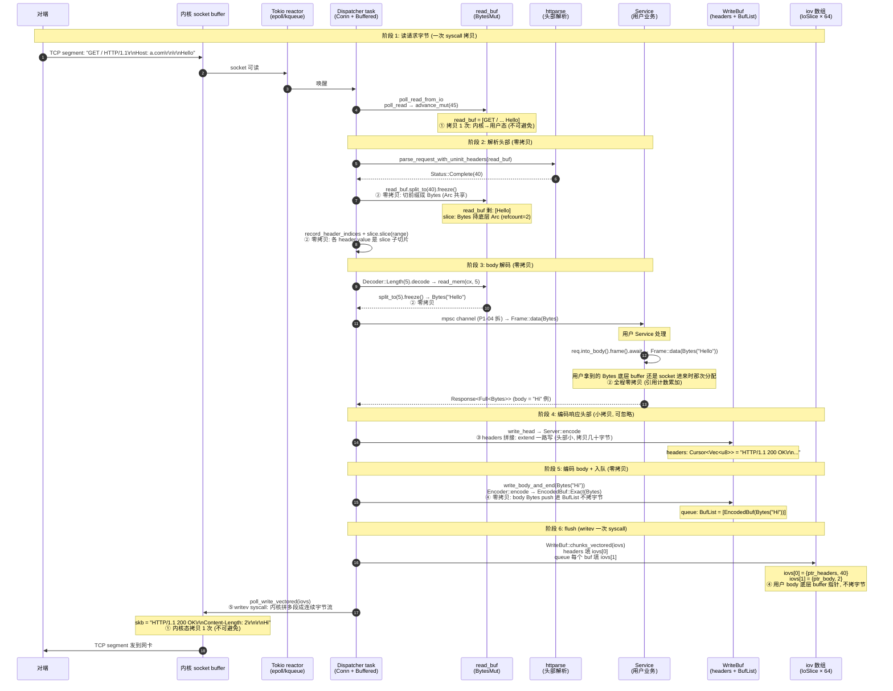

# 第 6 篇 · 第 17 章 · bytes 零拷贝与 buffered IO

> **核心问题**:前面 16 章我们一直在拆 hyper 怎么把 HTTP 协议机建在 Tokio 上——HTTP/1 状态机怎么切字节(P2-06)、响应怎么编回字节(P2-08)、Body 怎么以 Stream 形式流(P1-04)、Service 怎么把请求处理变成 Future(P1-02)、client 怎么复用连接(P4-12)、server 怎么 accept(P5-15)。可有一件事我们一直**当作背景板**没正面拆:HTTP 字节本身——从对端 TCP 字节进来,被解析、被交给 Body、被 Service 处理、被 Encoder 重新编成响应字节、最后写回 socket——这一整条路径上,字节**到底拷了几次**?为什么 hyper 敢说自己"高性能"?`bytes::Bytes` 那个引用计数零拷贝,在 hyper 里到底落在哪里、是怎么落到字节级不拷的?`buffered IO` 又是什么——为什么要在 `AsyncRead`/`AsyncWrite` 之上再垫一层缓冲,`read_buf` / `write_buf` 各自怎么把零散的小 IO 攒成大 IO 减少 syscall?`Buf::chain` 把"头部 + body"链成一个 `Buf` 一次 `writev` 吐出去(P2-08 拆过编码侧),在缓冲层是怎么和 `IoSlice` 数组对接的?协议机多读的字节(upgrade 时残留的 body 前缀)怎么"回放"给上层?这一章把这条"字节全路径"拆透,作为第 6 篇(性能与演进)的开篇——hyper 凭什么快的**第一根支柱**。

> **读完本章你会明白**:
> 1. 为什么"零拷贝"是高性能 HTTP 库的地基:朴素实现下,一个字节从 socket 进来、到被用户 Service 处理、再到响应编回 socket,要被 memcpy 5~10 次;高 QPS 下 memcpy 本身就是 CPU 瓶颈。hyper 的目标是把这条路径上"字节级拷贝"压到最少(读进来的字节,能不拷就不拷,靠引用计数共享底层 buffer)。
> 2. `bytes::Bytes` / `BytesMut` 的引用计数零拷贝到底是怎么做到的:`BytesMut` 是可变字节缓冲,`split_to(len)` 把前缀"切"成一个独立的 `Bytes`——但**底层 buffer 通过 `Arc` 共享,只动指针不拷字节**;`freeze()` 把 `BytesMut` 变 `Bytes`(可变变不可变,引用计数不变);`Bytes::slice(range)` 再切片还是引用计数共享;`clone()` 只是原子引用计数 +1。这套机制让"一段字节被多处持有"的成本是 O(1) 而不是 O(n)。
> 3. hyper 怎么用 bytes 把"读进来 → 解析 → Body → 编码 → 写出去"全程不拷字节:`BytesMut read_buf` 读 socket(`advance_mut` 追加),`split_to(len).freeze()` 切头部成 `Bytes` 零拷贝,`MemRead::read_mem` 切 body 也是 `split_to(min(len, 可用)).freeze()`,`HeaderMap` 用偏移 + `slice` 切子切片,`Encoder::encode` 用 `Chain<ChunkSize, B, "\r\n">` 把头部标记 + 用户 body 链成一个 `Buf`(body 还是原 `Bytes`),`WriteBuf` 队列攒起来,一次 `writev` 吐出去——body 数据从 socket 到对端,一个字节都没被 memcpy 过(只在 `Flatten` 策略或 `Rewind` 前缀拷到调用方 buffer 这两个边角点有少量拷贝,诚实标注)。
> 4. `buffered IO`(`Buffered<T,B>`)是 hyper 在 Tokio 的 `AsyncRead`/`AsyncWrite` 之上垫的一层——读侧 `read_buf: BytesMut` 攒字节再解析(避免每来几个字节就进一次状态机),写侧 `write_buf: WriteBuf<B>`(headers `Cursor<Vec<u8>>` + queue `BufList<B>`)攒字节再 `writev`(避免每个 chunk 一次 syscall)。`WriteStrategy::Queue`(零拷贝,默认)vs `Flatten`(拷贝,退化)的取舍,`MAX_BUF_LIST_BUFFERS = 16` / `max_buf_size ≈ 400KB` 的背压阈值,`Adaptive` 读策略的 2 的幂次增减。
> 5. `Rewind<T>`——协议升级时(P2-07)协议机多读的 body 前缀字节,怎么用 `Option<Bytes>` 当"前置缓冲"交接给上层(websocket 握手后,上层拿到的 `Upgraded` IO 第一次 `poll_read` 先吐前缀、再读底层 socket)。诚实修正:`Rewind::poll_read` 用 `put_slice` **拷贝**前缀到调用方 buffer(不是零拷贝,因为调用方给的是 `ReadBufCursor` 而不是 `BytesMut`),但底层 `Bytes` 的 `advance` 是引用计数切片不拷字节;前缀的底层 buffer 由 `Arc` 共享,活到前缀 drop。
> 6. 为什么这一切是 **sound** 的:零拷贝不丢数据(引用计数保证底层 buffer 活着,只要有一个 `Bytes` 持有它就不会被回收),不重复分配(`BytesMut::with_capacity` 一次,后续 split/freeze/slice 都共享这次分配),`Chain` 不拷字节(只是把多个 `Buf` 的 `IoSlice` 填进 iov 数组,内核 `writev` 负责拼接),`Buffered` 不丢不乱(读侧 `BytesMut` 单缓冲 + 半包不切 + 成功才 split,写侧 FIFO 队列保证字节顺序)。

> **如果一读觉得太难**:先记五件事——① `Bytes` 是引用计数的不可变字节缓冲(本质 `Arc<[u8]>` 的智能切片),`clone`/`slice` 只动引用计数不拷字节;② `BytesMut` 是可变版,`split_to(len).freeze()` 把前缀零拷贝切成独立 `Bytes`(底层 buffer 共享);③ hyper 的 `Buffered<T,B>` 在 Tokio 的 `AsyncRead`/`AsyncWrite` 之上垫一层:读侧 `read_buf: BytesMut` 攒字节再解析,写侧 `write_buf` 攒字节再 `writev`,减少 syscall;④ `WriteStrategy::Queue`(默认,零拷贝)把 body `Buf` push 进 `BufList` 不拷贝,flush 时填 `IoSlice` 数组一次 `writev` 吐出去;`Flatten`(不支持 writev 的 IO)退化成 `extend_from_slice` 拷贝;⑤ 协议升级时多读的字节用 `Rewind<T>` 回放(前置 `Bytes` + 底层 IO)。这五条抓住,后面看源码就有了挂靠点。

---

## 〇、一句话点破

> **HTTP 字节从 socket 进来,到被用户 Service 消费、被 Encoder 重编、再写回 socket,朴素实现要拷贝 5~10 次——高 QPS 下光 memcpy 就吃满 CPU。hyper 的解法是全程尽量"引用计数零拷贝":读进 `BytesMut`,`split_to(len).freeze()` 零拷贝切成 `Bytes`(底层 buffer 靠 `Arc` 共享,只挪指针);`Bytes::slice` / `clone` 只动引用计数;`Encoder` 用 `Chain<ChunkSize, body, "\r\n">` 把头部标记和用户 body 链成一个 `Buf`(body 还是那个 `Bytes`,不拷);`Buffered` 的写侧把一堆这样的 `Buf` 攒进 `BufList` 队列,flush 时把每个 `Buf` 的 `IoSlice` 填进 64 长的 iov 数组,一次 `writev` syscall 吐到 socket——内核负责把不连续的内存段拼成连续字节流发到网卡,用户态一个字节都没拷。整条路径上,真正"拷字节"的只有两个边角点:`Flatten` 策略(不支持 writev 的 IO 退化)和 `Rewind` 前缀(协议升级时把多读字节拷到上层 `ReadBufCursor`)。除此之外,body 数据从 socket 到对端,全程靠引用计数共享,一个 memcpy 都没有。**

这是结论。本章倒过来拆:先讲"为什么零拷贝是高性能 HTTP 库的地基"(朴素实现拷几次、为什么 memcpy 在高 QPS 下是瓶颈),再讲 `bytes::Bytes` / `BytesMut` 的引用计数零拷贝怎么做到(底层 `Arc`、`split_to` / `freeze` / `slice` / `clone` 各自动什么指针),然后拆 hyper 的 `Buffered<T,B>`(`proto/h1/io.rs` 的招牌类型)——读侧 `read_buf` 怎么攒、写侧 `write_buf` 怎么攒、`WriteStrategy::Queue` vs `Flatten` 的零拷贝分野、`BufList` 和 `IoSlice` 数组怎么对接,接着拆 `Rewind<T>`(协议升级的字节回放),再把"一个字节从 socket 到 socket 的零拷贝全路径"画成时序图钉死,最后是技巧精解(`split_to().freeze()` + `Chain` + `writev` 三件套)和对照(`bytes::Bytes` vs gRPC slice vs 《内存分配器》的 slab/arena)。

> **承接《Tokio》**:本章最底层是 Tokio 的 `AsyncRead::poll_read` / `AsyncWrite::poll_write` / `poll_write_vectored`,以及 Tokio 的 reactor(epoll/kqueue edge-triggered 监听 socket 可读可写)、task 调度、budget 让出(budget=128 防一个 task 霸占线程)。这些《Tokio》拆透的机制,本章**一句带过**,篇幅全留 hyper 独有——hyper 在 `AsyncRead`/`AsyncWrite` 之上垫的 `Buffered` 这层,以及它怎么用 `bytes` crate 把字节全程零拷贝串起来。
>
> **承接《内存分配器》+《gRPC》**:`bytes::Bytes` 的引用计数零拷贝(Arc 共享底层 buffer + 切片只挪指针),和《内存分配器》拆过的 slab/arena(预分配大块 + 引用复用)、《gRPC》拆过的 `grpc_slice`(C++ core 的引用计数字节切片,在《gRPC》第 2 篇招牌章讲过),**是同一个思路在不同语言的实现**——"不拷字节,只共享底层分配"。本章只看 hyper 怎么用 `bytes` crate(`Bytes` / `BytesMut` 在外部 bytes crate,不在 hyper 仓,本章诚实标注,引用其 `split_to` / `freeze` / `slice` / `Buf::chain` 用法,不编 bytes 行号),不重讲引用计数本身。
>
> **承接 P2-06 / P2-08 / P1-04**:P2-06 拆解析时点了 `buf.split_to(len).freeze()` 零拷贝切头部、P2-08 拆编码时点了 `Chain<ChunkSize, body, "\r\n">` 零拷贝拼 chunked、P1-04 拆 Body 时点了 `bytes::Bytes` 引用计数——那三章都把"零拷贝"当结论一笔带过指路"本章细拆",本章就是兑现这三笔债。读完本章,再回看那三章的 `split_to` / `Chain` / `Bytes`,你会看到它们是同一套"引用计数零拷贝"思想在协议机不同环节的落地。

---

## 一、为什么"零拷贝"是高性能 HTTP 库的地基

### 1.1 朴素实现:一个字节要被拷几次

要讲清 hyper 为什么对"拷贝"这么较真,先把"朴素实现"的字节路径画出来。想象一个最朴素的 Rust HTTP/1 server(没用 hyper,自己手撸),处理一个 POST 请求"上传 1KB JSON + 返回 200 OK":

```
朴素实现的字节全路径(每一步都拷贝):
┌─────────────────────────────────────────────────────────────────────────┐
│                                                                          │
│  ① socket 内核 buffer                                                    │
│      ↓ (syscall read, 拷贝)                                              │
│  ② user态 Vec<u8>(自己分配的 buffer)                                    │
│      ↓ (String::from_utf8, 拷贝)                                         │
│  ③ String,准备 split("\r\n")                                             │
│      ↓ (split 多次,每次拷贝)                                            │
│  ④ 请求行 String、头部 Vec<String>、body String                          │
│      ↓ (业务处理,可能再 clone body 给后台任务,拷贝)                    │
│  ⑤ 处理完的响应 body String                                              │
│      ↓ (format! 拼状态行 + 头部 + body,拷贝)                            │
│  ⑥ 响应字节 String / Vec<u8>                                             │
│      ↓ (syscall write,拷贝)                                             │
│  ⑦ socket 内核 buffer,发到网卡                                          │
│                                                                          │
└─────────────────────────────────────────────────────────────────────────┘
```

数一数,一个字节从进来到出去,被 memcpy 了至少 **5~7 次**:`read` 1 次、`from_utf8` 1 次、`split` 多次(算 2 次)、`format!` 拼响应 1 次、`write` 1 次。对一个 1KB 的请求,5~7 次 memcpy 加起来 5~7KB 的内存读写——看起来不多。但放到高 QPS 场景下算:

- 一个核心每秒处理 10 万请求(QPS = 100k,中等规模 Web 服务)。
- 每请求平均 body 1KB(典型 JSON API)。
- 每请求拷 5 次 = 5KB 字节读写。
- 每秒 100k × 5KB = **500 MB/s 的纯 memcpy 字节流量**。

500 MB/s 是什么概念?L3 cache 的带宽大概几十 GB/s,L1/L2 大概几百 GB/s——500 MB/s 似乎"还行"。但这是**单核**纯 memcpy 的流量,还没算协议解析、业务逻辑、syscall 开销。真实场景下 body 可能更大(文件上传几 MB)、请求更密(单核 30 万 QPS)、还要叠加 TLS 加密(又一遍字节拷贝)。memcpy 累加起来,**很快就是 CPU 的主要开销**——比协议解析本身、比 syscall 都贵。

> **钉死这件事**:**高 QPS 下,memcpy 是 CPU 的主要瓶颈之一**。这不是理论——所有高性能网络库(nginx、Envoy、hyper、gRPC chttp2)都把"减少拷贝"当一等大事。nginx 的 `sendfile`(零拷贝直发文件)、Envoy 的 `Buffer::Instance` 切片引用、gRPC 的 `grpc_slice` 引用计数、hyper 的 `bytes::Bytes` + `Chain`——都是同一个动机的不同实现:"一个字节,能不拷就不拷"。

### 1.2 内核到用户:syscall 的拷贝无法避免,但可以批量

有一层拷贝是**无法避免**的:socket 内核 buffer ↔ 用户态 buffer。`read(2)` 把字节从内核 skb 拷到用户态 `Vec<u8>`,`write(2)` 反过来。这是 Linux 的设计——用户态不能直接读 skb,必须穿过 syscall 边界,而 syscall 的语义就是"拷贝字节"。

hyper 对这层无可奈何的拷贝,策略是**批量**:

- 读侧:不"每来 100 字节就 read 一次",而是 `read_buf.reserve(8192)` 一次性读 8KB 进来(约两个 TCP segment),解析时从 `read_buf` 切,不再进 syscall。
- 写侧:不"每个 body chunk 就 write 一次",而是把多个 chunk 攒进 `write_buf` 队列,一次 `writev` 吐 64 段(约 64 × chunk_size 字节)。

`writev(2)` 是这里的关键 syscall——它接受一个 `IoSlice` 数组(多段不连续内存的指针 + 长度),一次 syscall 把它们**按顺序**写到 fd。内核负责把多段拼接成连续字节流发到网卡。对用户态来说,这是"零拷贝拼接"——不用把多段 memcpy 到一个大 `Vec`,只需把每段的指针填进 iov 数组。

```
writev(2) 的精髓(对比 write):
朴素 write:                                writev:
┌─ 用户态 ──────────────────────┐         ┌─ 用户态 ──────────────────────┐
│ buf1 = "abc"  buf2 = "def"     │         │ buf1 = "abc"  buf2 = "def"     │
│   ↓ memcpy 拼一个大 Vec         │         │   ↓ 只填指针, 不拷字节          │
│ big = "abcdef"                  │         │ iovs = [{abc, 3}, {def, 3}]     │
│   ↓ write(fd, big)              │         │   ↓ writev(fd, iovs)            │
└─────────────────────────────────┘         └─────────────────────────────────┘
            ↓                                          ↓
┌─ 内核 ────────────────────────┐         ┌─ 内核 ────────────────────────┐
│ skb: "abcdef"                  │         │ skb: "abcdef"                  │
│ (从 big 拷过来)                │         │ (内核自己从 iovs 各段拷拼)     │
└────────────────────────────────┘         └────────────────────────────────┘
```

**用户态那次 memcpy 省掉了**——内核还是要拷(它必须把字节拼进 skb 发到网卡),但用户态不用。对高 QPS 服务,这个"省掉用户态拼接 memcpy"就是性能命脉。

> **承接《Tokio》**:`writev(2)` 在 Tokio 里通过 `AsyncWrite::poll_write_vectored` 暴露(对应 `poll_write` 但接受 `IoSlice` 数组)。Tokio 的 reactor 负责"socket 不可写时挂起 task、可写时唤醒",hyper 在这之上负责"把多个 `Buf` 的 slice 填进 iov 数组让一次 `writev` 吐更多字节"。这套机制本章一句带过 Tokio 那一半,篇幅留 hyper 怎么填 iov。

### 1.3 用户态内部:引用计数换零拷贝

syscall 那层拷贝靠 `writev` 批量化了,但用户态内部的拷贝(`from_utf8`、`split`、`format!` 拼)还在。这层拷贝,hyper 用**引用计数**消灭:

```
引用计数零拷贝的精髓(对比朴素拷贝):
朴素拷贝:                                  引用计数(bytes::Bytes):
┌─ 用户态 ──────────────────────┐         ┌─ 用户态 ──────────────────────┐
│ buf = "GET / HTTP/1.1\r\n..."   │         │ buf = Bytes (持 Arc 指针)      │
│ (一段连续字节, 在堆上)         │         │   ↓                            │
│   ↓ clone 给 body 处理          │         │ 底层: Arc<[u8]> "GET / ..."    │
│ buf2 = "GET / HTTP/1.1\r\n..."  │         │   ↓ slice(0..16) 只改指针       │
│ (拷贝了整段字节)                │         │ head = Bytes(同一底层, ref=2)  │
│   ↓ slice(0..16) 给 head        │         │   ↓ clone 给 body 处理          │
│ head = "GET / HTTP/1.1"(拷贝)   │         │ head2 = Bytes(同一底层, ref=3)  │
│                                 │         │ (只 atomic incr, 不拷字节)     │
└─────────────────────────────────┘         └─────────────────────────────────┘
```

`bytes::Bytes` 的本质是 `Arc<[u8]>` 的智能切片——它持有底层字节分配的 `Arc` 引用 + 一个偏移 + 一个长度。"持有 `Bytes`"不拷字节,只是 `Arc` 强引用计数 +1;"切片"也不拷字节,只是新建一个 `Bytes` 共享 `Arc`、改偏移和长度;"drop"只是强引用计数 -1,归 0 才真正释放底层字节。所有这些操作都是 O(1) 的指针操作 + 原子计数,而不是 O(n) 的 memcpy。

> **对照《内存分配器》+《gRPC》**:这种"引用计数 + 切片"的零拷贝,是高性能网络库的通用模式。《内存分配器》拆过的 tcmalloc/jemalloc 的 thread-local slab(线程本地预分配 + 引用复用),《gRPC》拆过的 `grpc_slice`(C++ core 的引用计数字节切片,《gRPC》第 2 篇招牌章),和 `bytes::Bytes` 是**同一个思想**(不拷字节,共享底层分配)的三种语言实现。本书只看 hyper 怎么用 `bytes` crate 把 HTTP 字节全程零拷贝串起来,引用计数本身不重讲。

那么 hyper 到底在哪些点用了 `Bytes` / `BytesMut`、哪些点真的零拷贝、哪些点有边角拷贝?接下来分四节拆:第二节拆 `bytes` crate 的零拷贝原语(承外部 crate,引用用法)、第三节拆 `Buffered<T,B>` 的读侧、第四节拆写侧、第五节拆 `Rewind<T>`。

---

## 二、bytes::Bytes / BytesMut 的引用计数零拷贝(承外部 crate)

> **诚实标注**:`Bytes`、`BytesMut`、`Buf`、`BufMut`、`Chain`、`take` 都在外部 **bytes crate**(hyperium/bytes,hyper 的姊妹 crate,Sean McArthur 同时维护)。本章引用其用法(split_to / freeze / slice / clone / chain / chunks_vectored),**不编 bytes crate 的行号**——只标"在 bytes crate"。hyper 自己的缓冲抽象是 `common/buf.rs` 的 `BufList`、`proto/h1/io.rs` 的 `Cursor` / `WriteBuf` / `Buffered`、`common/io/rewind.rs` 的 `Rewind`,这些在本仓,标真实行号。

### 2.1 Bytes:Arc 共享底层 buffer 的智能切片

`bytes::Bytes` 的官方定义(在 bytes crate)大致是这样一个结构(简化示意,非源码原文):

```rust
// 简化示意,非源码原文(在 bytes crate)
pub struct Bytes {
    ptr: NonNull<u8>,         // 指向底层字节
    len: usize,               // 这段 Bytes 的长度
    // ... 内部还有一个 Arc/引用计数的 owner(精简)
}
```

它的精髓是:`Bytes` 持一个**指向底层字节分配**的指针 + 一个长度。底层分配由引用计数管理(`Arc` 语义)——多个 `Bytes` 可以共享同一个底层分配,各自持不同的 `[offset, offset+len)` 切片。

```
Bytes 的引用计数共享(多个 Bytes 共享一个底层 buffer):

底层分配 (堆上, 由 Arc 管理, refcount 跟踪):
┌──────────────────────────────────────────────────────────────────┐
│  G E T   /   H T T P / 1 . 1 \r \n H o s t : ... \r\n\r\n body...│
└──────────────────────────────────────────────────────────────────┘
   ↑                   ↑                                 ↑
   │                   │                                 │
bytes_a:               bytes_b:                           bytes_c:
ptr → 起点             ptr → 起点+16                      ptr → 起点+40
len = 16               len = 24                           len = body_len
(refcount = 3)         (refcount = 3)                     (refcount = 3)
   ↑                   ↑                                 ↑
   │                   │                                 │
   └─────── 共享同一个 Arc, refcount = 3 ────────────────┘

clone() / slice() 只 incr refcount, 不拷字节
drop() 只 decr refcount, 归 0 才 free 底层
```

三个关键操作:

- **`Bytes::clone()`**:新建一个 `Bytes`,**同一个 ptr / len**,底层 `Arc` 强引用计数 +1(`Arc::clone` 是原子 increment,几纳秒)。不拷字节。
- **`Bytes::slice(range)`**:新建一个 `Bytes`,**ptr 挪到 offset、len 改成 range 长度**,底层 `Arc` 引用计数 +1。不拷字节。
- **`Bytes::drop()`**:强引用计数 -1。归 0 时才 free 底层分配。

这套机制让"一段字节被多处持有"的成本是 **O(1)** 的原子操作,而不是 O(n) 的 memcpy。

> **钉死这件事**:`Bytes` 的零拷贝本质是"`Arc<[u8]>` 的智能切片"。`clone` / `slice` 只动 `Arc` 引用计数和切片的偏移/长度,字节本身一动不动。读本书看到 `Bytes` 在 hyper 里被传来传去(`HeaderMap`、`Frame::data`、`Body`、`EncodedBuf`),要知道它每次传递都是 O(1) 的引用计数操作,不是 O(n) 拷贝。

### 2.2 BytesMut:可变版 + split_to / freeze 的零拷贝切前缀

`bytes::BytesMut` 是 `Bytes` 的可变版——你可以往里写字节(`put_u8`、`extend_from_slice`、`advance_mut`)。它底层也是一个引用计数分配,但允许多个"写"操作。

hyper 用 `BytesMut` 当**读缓冲**——`Buffered::read_buf: BytesMut`(`proto/h1/io.rs:37`)。socket 字节读进来,`advance_mut(n)` 追加到 `read_buf` 尾部。然后,关键的两个操作:

- **`BytesMut::split_to(len)`**:把 `read_buf` 的**前 len 字节**"切"出来,变成一个新的 `BytesMut`。原 `read_buf` 的指针挪到 len 之后。**底层 buffer 共享**(引用计数 +1),不拷字节。这个操作是 O(1) 的指针操作。
- **`BytesMut::freeze()`**:把 `BytesMut` 转成 `Bytes`(可变 → 不可变)。底层 buffer 不变,只是类型上从"可变"变成"不可变"。引用计数不变。也是 O(1)。

hyper 的协议机(P2-06 拆过)在头部解析成功后,调 `buf.split_to(len).freeze()`(`proto/h1/role.rs:217` Server / `role.rs:1074` Client)——把"请求行 + 头部"那 `len` 字节零拷贝切成 `Bytes`,后续构造 `HeaderMap` 用。

```
BytesMut::split_to(len).freeze() 的零拷贝(读侧切前缀成 Bytes):

读进来后: read_buf: BytesMut (一段连续字节)
┌──────────────────────────────────────────────────────────────────┐
│  HTTP/1.1 200 OK\r\nServer: hyper\r\nContent-Length: 5\r\n\r\nHello│
└──────────────────────────────────────────────────────────────────┘
↑                                                                  ↑
read_buf 起始                                                      read_buf.len()

split_to(54).freeze():
┌─ slice: Bytes (refcount=2) ─────────────────────┐
│  HTTP/1.1 200 OK\r\nServer: hyper\r\n...        │  ← 切出来的前 54 字节
└──────────────────────────────────────────────────┘
↑ 底层 buffer 共享 (Arc refcount+1, 不拷字节)

read_buf: BytesMut (剩下的)
┌───────────────────┐
│  H e l l o         │  ← 指针挪到 54 之后, 内容是 body 或下个请求
└───────────────────┘

后续: slice.slice(0..16) 切"HTTP/1.1 200 OK" 还是引用计数共享
      slice.clone() 给 HeaderMap 也是引用计数 +1
      read_buf 继续给 Decoder 切 body: read_mem → split_to(5).freeze() → Bytes("Hello")
```

> **钉死这件事**:`split_to(len).freeze()` 是 `bytes` crate 专门为"切前缀成独立 Bytes"设计的零拷贝原语。它让 hyper 把"已解析头部"从 `read_buf` 移出来变成独立 `Bytes`,**O(1) 完成**(只动几个指针 + 原子引用计数),不拷字节、不 memmove 后面字节。这是 hyper 协议层性能的命脉——P2-06 拆解析时点过这一行,本章钉死它的零拷贝性质。

### 2.3 Buf trait:统一的字节读取抽象

`bytes` crate 还定义了 `Buf` trait——"一段可读字节"的抽象。`Bytes` 实现 `Buf`,`BytesMut` 实现 `Buf`,`&[u8]` 实现 `Buf`,hyper 的 `BufList` 实现 `Buf`,`bytes::Chain<A, B>` 实现 `Buf`。所有这些类型对外的接口统一:

```rust
// 简化示意,非源码原文(在 bytes crate)
pub trait Buf {
    fn remaining(&self) -> usize;                  // 剩多少字节没读
    fn chunk(&self) -> &[u8];                       // 当前连续一段的 slice
    fn advance(&mut self, cnt: usize);              // 推进"已读"指针 cnt 字节
    fn chunks_vectored<'a>(&'a self, dst: &mut [IoSlice<'a>]) -> usize;  // 填 iov 数组
    // 还有 copy_to_bytes(len) 等便利方法
}
```

`Buf` 的核心是**"当前连续一段"`chunk()` + "推进已读"`advance()`**——它把"读取"抽象成"逐段推进",不要求整个内容在一段连续内存。这让多段内存(`Chain<A,B>`、`BufList`)可以**装作一段连续 `Buf`**——`chunk()` 返回第一段、`advance()` 推进到第二段。

`chunks_vectored` 是 `Buf` 的零拷贝招牌方法——它把 `Buf` 内部的**所有连续段**的 `IoSlice`(指针 + 长度)填进 iov 数组,返回填了几个。这是 `writev` 的对接点:`Buf::chunks_vectored` 填 iov,`AsyncWrite::poll_write_vectored(iovs)` 一次 syscall 写出去。

> **钉死这件事**:`Buf` trait 是 hyper 缓冲抽象的统一接口。`Bytes` / `BytesMut` / `Chain` / `BufList` / `Cursor<Vec<u8>>` 都实现 `Buf`,这让 hyper 的写侧可以把"头部 `Cursor<Vec<u8>>` + body `Bytes` 链 `Chain<ChunkSize, Bytes, &str>` + 结束标记 `&'static [u8]`"全部当 `Buf` 处理,统一塞进 `WriteBuf` 队列,flush 时 `chunks_vectored` 填 iov,一次 `writev` 吐出去。`Buf` 的存在让"多段不连续内存"和"一段连续内存"对调用方透明,这是零拷贝能贯穿全路径的类型层基础。

### 2.4 Chain:把多段 Buf 逻辑拼成一段(零拷贝招牌)

`bytes::Chain<A, B>`(在 bytes crate)是 `Buf` 的招牌组合子——它持两个 `Buf`(A 和 B),对外表现为"A 然后 B"的逻辑连续 `Buf`。`A.chain(B)` 返回 `Chain<A, B>`。

```rust
// 简化示意,非源码原文(在 bytes crate)
pub struct Chain<A, B> {
    a: A,
    b: B,
}

impl<A: Buf, B: Buf> Buf for Chain<A, B> {
    fn remaining(&self) -> usize { self.a.remaining() + self.b.remaining() }
    fn chunk(&self) -> &[u8] {
        let a = self.a.chunk();
        if !a.is_empty() { a } else { self.b.chunk() }
    }
    fn advance(&mut self, mut cnt: usize) {
        let a_rem = self.a.remaining();
        if a_rem >= cnt { self.a.advance(cnt); }
        else { self.a.advance(a_rem); self.b.advance(cnt - a_rem); }
    }
    fn chunks_vectored(&self, dst: &mut [IoSlice]) -> usize {
        let n = self.a.chunks_vectored(dst);
        self.b.chunks_vectored(&mut dst[n..]) + n   // A 的 iov + B 的 iov
    }
}
```

精髓:**不拷字节**。`Chain` 持有 A 和 B 的所有权(by value),A 和 B 各自的内存不动,`Chain` 只是把它们"逻辑上"拼一起。`chunks_vectored` 把 A 和 B 各自的 slice 都填进 iov,`writev` 一次 syscall 写两段(或嵌套两层 Chain,三段)。

hyper 的 P2-08 拆过 `Encoder::encode` 在 chunked 模式下这么做:

```rust
// hyper/src/proto/h1/encode.rs:136-142 (摘录, P2-08 已拆)
Kind::Chunked(_) => {
    let buf = ChunkSize::new(len)              // 第一段: 栈上 [u8;18] "{hex}\r\n"
        .chain(msg)                            // 第二段: 用户 body (Bytes, 引用计数)
        .chain(b"\r\n" as &'static [u8]);      // 第三段: 编译期常量 "\r\n"
    BufKind::Chunked(buf)
}
```

三层 `chain` 把"chunk 大小行(栈上)+ 用户 body(`Bytes` 引用计数)+ 结尾 `\r\n`(静态)"链成一个 `Chain<Chain<ChunkSize, Bytes>, &'static [u8]>`。这个 Chain 是一个 `Buf`——它的 `chunks_vectored` 填三段 iov。`writev` 一次 syscall 吐三段,body 数据(`Bytes` 持的底层 buffer)原样不动,一个字节都没拷。

```
Chain<A, B, C> 三段零拷贝(chunked body chunk 的字节布局):

┌─ ChunkSize (栈上, 18 字节) ─┐  ┌─ Bytes (引用计数) ──┐  ┌─ &'static [u8] ─┐
│ "5\r\n"                       │  │ "hello"             │  │ "\r\n"          │
└───────────────────────────────┘  └─────────────────────┘  └─────────────────┘
       ▲                                    ▲                         ▲
       │                                    │                         │
   栈分配 (函数返回就回收)            用户 body (Arc 共享)         编译期常量

Chain<Chain<ChunkSize, Bytes>, &'static [u8]>:
- remaining() = 5 + 5 + 2 = 12
- chunks_vectored(iovs[0..3]) = 3, 填三个 IoSlice:
    iovs[0] = {ptr_chunksize, 5}
    iovs[1] = {ptr_body, 5}      ← 用户 body 的底层 buffer 指针, 不拷
    iovs[2] = {ptr_rn, 2}

poll_write_vectored(iovs): 一次 syscall, 内核把三段拼成 "5\r\nhello\r\n" 发到网卡
用户态: 一个字节都没拷 (除了 ChunkSize 自己的 5 字节栈写, 但那是必要的格式化)
```

> **钉死这件事**:`Chain<A, B>` 是 `bytes` crate 提供的"零拷贝拼接"原语。它让 hyper 在 chunked 编码时,把"边界标记(ChunkSize 静态小数据)+ 用户 body(Bytes 大数据)"拼成一个 `Buf` 而**不拷 body 字节**。flush 时这个 Chain 的 `chunks_vectored` 填 iov,一次 `writev` 吐出去。这是 hyper 写侧零拷贝的核心机制,P2-08 拆编码时点过,本章钉死它在 `Buf` trait 层的零拷贝性质。

### 2.5 BufList:hyper 自己的"多段 Buf 队列"

讲清了 bytes crate 的 `Chain`(两段),现在看 hyper 自己的招牌缓冲类型——`common/buf.rs` 的 `BufList<T>`。它不是 `Chain` 的两段,而是**任意多段**:

```rust
// hyper/src/common/buf.rs:6-9
pub(crate) struct BufList<T> {
    bufs: VecDeque<T>,
}
```

就是个 `VecDeque<T>`(双向队列),装一堆 `T: Buf`。`BufList` 自己也实现 `Buf`(`buf.rs:29-91`):

```rust
// hyper/src/common/buf.rs:29-91 (摘录)
impl<T: Buf> Buf for BufList<T> {
    fn remaining(&self) -> usize {
        self.bufs.iter().map(|buf| buf.remaining()).sum()      // 所有 buf 剩余之和
    }
    fn chunk(&self) -> &[u8] {
        self.bufs.front().map(Buf::chunk).unwrap_or_default()  // 第一段的 chunk
    }
    fn advance(&mut self, mut cnt: usize) {
        while cnt > 0 {
            let front = &mut self.bufs[0];
            let rem = front.remaining();
            if rem > cnt { front.advance(cnt); return; }       // 第一段够, 推进第一段
            else { front.advance(rem); cnt -= rem; }            // 第一段不够, 跑完, 弹出
            self.bufs.pop_front();
        }
    }
    fn chunks_vectored<'t>(&'t self, dst: &mut [IoSlice<'t>]) -> usize {
        // 遍历所有 buf, 把每个的 slice 都填进 iov, 直到填满 dst
        let mut vecs = 0;
        for buf in &self.bufs {
            vecs += buf.chunks_vectored(&mut dst[vecs..]);
            if vecs == dst.len() { break; }
        }
        vecs
    }
    fn copy_to_bytes(&mut self, len: usize) -> Bytes {
        // 关键优化: 如果第一个 buf 就够长, 直接用它, 零拷贝!
        match self.bufs.front_mut() {
            Some(front) if front.remaining() == len => {
                let b = front.copy_to_bytes(len);
                self.bufs.pop_front();
                b                                            // 零拷贝, 指针 eq 验证
            }
            Some(front) if front.remaining() > len => front.copy_to_bytes(len),  // 也零拷贝
            _ => {
                // 第一段不够, 才 fallback 到分配 + 拷贝
                assert!(len <= self.remaining());
                let mut bm = BytesMut::with_capacity(len);
                bm.put(self.take(len));
                bm.freeze()
            }
        }
    }
}
```

`BufList` 的精髓是"任意多段 `Buf` 当一段用"。它和 `Chain` 的差别:`Chain<A,B>` 是**编译期固定两段**(`A` 和 `B` 是泛型参数,类型层固定),`BufList<T>` 是**运行时任意段**(`VecDeque`,动态 push)。hyper 的写侧需要"任意多个 body chunk 各自一个 `EncodedBuf` 攒起来",所以用 `BufList`,不用 `Chain`(Chain 嵌套三层已经是极限,再多类型爆炸)。

**`copy_to_bytes` 的零拷贝优化**(buf.rs:74-91)是 `BufList` 的招牌——它优先用第一段的 `copy_to_bytes`(`Bytes::copy_to_bytes` 是零拷贝切片),只有在第一段不够长时才 fallback 到"分配新 `BytesMut` + put + freeze"(这时才拷贝)。`buf.rs:107-115` 的测试 `to_bytes_shorter` 用 `ptr::eq(old_ptr, start.as_ptr())` 验证:第一段够长时,返回的 `Bytes` 和原 `Bytes` **共享同一个底层指针**(零拷贝)。

> **钉死这件事**:`BufList` 是 hyper 自己的多段 `Buf` 队列(基于 `VecDeque`),它的 `chunks_vectored` 把所有段的 slice 填进 iov,`copy_to_bytes` 在第一段够长时零拷贝。它是写侧 `WriteBuf.queue` 的载体(下节拆)。`Chain` 适合"编译期固定两三段"(chunked 单 chunk 的三段链),`BufList` 适合"运行时任意段"(多个 chunk 攒队列),hyper 两者都用,各取所长。这是 hyper 缓冲层"既用 bytes crate 原语,又自己造轮子"的招牌——`Chain` 借 bytes 的力,`BufList` 自己写(因为 bytes crate 没有"任意段 Buf 队列"的类型)。

---

## 三、Buffered<T, B>:hyper 在 AsyncRead/AsyncWrite 之上的缓冲层

讲清了 `bytes` crate 的零拷贝原语和 hyper 自己的 `BufList`,现在进入正题——hyper 的缓冲层 `Buffered<T, B>`。

> **诚实修正**:任务简报里说 buffered IO 在 `src/common/io/mod.rs`——**这是不准确的**。`common/io/mod.rs`(`common/io/mod.rs:1-8`)只有 7 行,作用是 re-export `Rewind` 和 `Compat`(HTTP/2 用的 `tokio_util::compat` 适配)。**hyper 真正的 buffered IO 在 `src/proto/h1/io.rs`**(`Buffered<T,B>` 在 `proto/h1/io.rs:32`),因为它是 HTTP/1 协议机的读写字节层(HTTP/2 的字节层在 h2 crate,hyper 只做适配)。本章拆的 `Buffered` / `WriteBuf` / `Cursor` 都在 `proto/h1/io.rs`,`Rewind` 在 `common/io/rewind.rs`。

### 3.1 为什么要在 AsyncRead/AsyncWrite 之上再垫一层

> **承接《Tokio》**:Tokio 给的 `AsyncRead::poll_read` / `AsyncWrite::poll_write` 已经是高效的异步 IO——底层 epoll/kqueue edge-triggered 监听 socket,可读了唤醒 task,task 的 `poll_read` 真正读 socket。这套机制《Tokio》拆透了,本章一句带过。

那 hyper 为什么不直接 `poll_read` / `poll_write`,还要在中间垫一层 `Buffered`?三个理由,每个都是性能或正确性的硬需求:

**理由一:解析状态机要"看到一坨字节",不是一个一个字节进**。HTTP/1 解析(P2-06)的 `httparse` 是个 push parser,要喂一坨字节它才好找 `\r\n\r\n`。如果 hyper 每从 socket `poll_read` 一个字节就进 `httparse` 一次,那 `httparse` 永远返回 `Partial`(没看到完整 `\r\n\r\n`),CPU 全浪费在重复扫上。正确做法是 `poll_read` 一坨(8KB 起步)进 `read_buf`,再把**整个** `read_buf` 喂 `httparse`,一次扫出请求行 + 头部。这要求有个"攒字节"的层——就是 `Buffered::read_buf`。

**理由二:body 边界要精确切,不越界读下一个请求**。HTTP/1 的 `Content-Length` body(P2-06 5.1 节),`Decoder::decode` 调 `MemRead::read_mem(cx, remaining)` 只读 remaining 字节。但 `poll_read` 读进来的字节可能远超 remaining(流水线下一个请求的字节也跟在 body 后面粘在 socket buffer 里)。所以要有 `read_buf` 把"读进来的全部字节"攒着,`read_mem(remaining)` 用 `split_to(min(remaining, 可用))` **只切走 remaining 字节**,剩下的留给下一个请求的解析。这就是 body 不越界的根本保证。

**理由三:写侧要批量 writev,不是每个 chunk 一次 write**。HTTP/1 编码(P2-08)每个 body chunk 经 `Encoder::encode` 变成一个 `EncodedBuf`(可能是 `Chain<ChunkSize, body, "\r\n">` 三段)。如果每个 chunk 立刻 `poll_write`,一个 1GB 文件分 64KB chunk = 16000 次 syscall,syscall 开销爆炸。所以要有 `write_buf` 把多个 `EncodedBuf` 攒起来,一次 `writev` 吐 64 段。这要求有个"攒写"的层——就是 `Buffered::write_buf`。

> **钉死这件事**:`Buffered<T, B>` 是 hyper 在 `AsyncRead`/`AsyncWrite` 之上垫的一层,做三件事:① 读侧 `read_buf: BytesMut` 攒字节给解析(避免每字节进状态机);② 读侧 `MemRead::read_mem` 精确切字节给 body Decoder(防越界);③ 写侧 `write_buf: WriteBuf<B>` 攒多个 chunk,一次 `writev` 吐(省 syscall)。这三个理由决定了 `Buffered` 的存在——它不是"重复造轮子",而是"协议层和 IO 层之间的必要中介"。

### 3.2 Buffered 的全貌:六个字段各司其职

看 `Buffered<T, B>` 的定义(`proto/h1/io.rs:32-40`):

```rust
// hyper/src/proto/h1/io.rs:32-40
pub(crate) struct Buffered<T, B> {
    flush_pipeline: bool,
    io: T,
    partial_len: Option<usize>,
    read_blocked: bool,
    read_buf: BytesMut,
    read_buf_strategy: ReadStrategy,
    write_buf: WriteBuf<B>,
}
```

七个字段(注释只列六个,实际七个)各司其职,逐个拆:

| 字段 | 类型 | 作用 |
|---|---|---|
| `flush_pipeline` | `bool` | server 配置项:是否开 pipeline_flush 模式(P2-08 5.3 拆过,写完头立刻 flush 换低 TTFB,强制 Flatten) |
| `io` | `T` | 底层 IO(`TokioIo<TcpStream>` 或类似),实现 `Read + Write` |
| `partial_len` | `Option<usize>` | 解析半包提示(P2-06 3.2 拆过,记录"上次攒了多少字节",给 `is_complete_fast` 预筛用) |
| `read_blocked` | `bool` | 上次 `poll_read_from_io` 是否返回 `Pending`(task 因 socket 无数据挂起) |
| `read_buf` | `BytesMut` | **读缓冲**(socket 字节攒这里,解析从这切) |
| `read_buf_strategy` | `ReadStrategy` | 读策略:`Adaptive`(默认,2 的幂次增减)或 `Exact`(client 配置) |
| `write_buf` | `WriteBuf<B>` | **写缓冲**(headers `Cursor<Vec<u8>>` + queue `BufList<B>`,见 3.4) |

读侧核心是 `read_buf: BytesMut`,写侧核心是 `write_buf: WriteBuf<B>`。这俩是 buffered IO 的招牌,下面分两节细拆。

### 3.3 读侧:read_buf 怎么攒字节、MemRead 怎么零拷贝切

读侧的两个关键方法:`poll_read_from_io`(socket → read_buf)和 `MemRead::read_mem`(read_buf → 调用方,零拷贝切)。

**`poll_read_from_io`**(`proto/h1/io.rs:219-256`)——把 socket 字节读进 `read_buf`:

```rust
// hyper/src/proto/h1/io.rs:219-256 (摘录)
pub(crate) fn poll_read_from_io(&mut self, cx: &mut Context<'_>) -> Poll<io::Result<usize>> {
    self.read_blocked = false;
    // 这次最多读多少字节: min(策略 next, max - 已攒字节)
    let next = cmp::min(
        self.read_buf_strategy.next(),
        self.read_buf_strategy.max().saturating_sub(self.read_buf.len()),
    );
    if self.read_buf_remaining_mut() < next {
        self.read_buf.reserve(next);                            // 空间不够, reserve 扩容
    }

    // SAFETY: ReadBuf and poll_read promise not to set any uninitialized
    // bytes onto `dst`.
    let dst = unsafe { self.read_buf.chunk_mut().as_uninit_slice_mut() };  // BytesMut 的可写切片
    let mut buf = ReadBuf::uninit(dst);
    match Pin::new(&mut self.io).poll_read(cx, buf.unfilled()) {
        Poll::Ready(Ok(_)) => {
            let n = buf.filled().len();
            trace!("received {} bytes", n);
            // Safety: we just read that many bytes into the
            // uninitialized part of the buffer, so this is okay.
            unsafe { self.read_buf.advance_mut(n); }            // 推进写指针, 字节"追加"到 read_buf 尾部
            self.read_buf_strategy.record(n);                   // 记录这次读了多少, 给 Adaptive 调整
            Poll::Ready(Ok(n))
        }
        Poll::Pending => {
            self.read_blocked = true;
            Poll::Pending
        }
        Poll::Ready(Err(e)) => Poll::Ready(Err(e)),
    }
}
```

几个零拷贝 / 性能点:

1. **`chunk_mut().as_uninit_slice_mut()` + `advance_mut(n)`**:`BytesMut` 提供 `chunk_mut` 返回 `&mut UninitSlice`,直接拿到 read_buf 尾部**未初始化的可写区域**的指针。`poll_read` 把 socket 字节直接写进这块内存(不经过中间 buffer),然后 `advance_mut(n)` 推进 `BytesMut` 的写指针(语义是"我写了 n 字节,把这 n 字节纳入有效范围")。**没有中间拷贝**——socket 字节直接进 read_buf。
2. **`ReadBuf::uninit(dst)`**:`ReadBuf`(在 hyper 的 `rt` trait,承 Tokio 的 `tokio::io::ReadBuf`)支持未初始化缓冲——它接受一个可能未初始化的 `&mut [u8]`,poll_read 只往里写,读出时只看 `filled()` 部分 Written。这避免了"先 memset 整个 buffer 再 poll_read"的浪费(类似 P2-06 拆的 MaybeUninit 优化,但这里是 std 层)。
3. **`next` 由 `ReadStrategy` 决定**:`Adaptive` 默认 `INIT_BUFFER_SIZE = 8192`(`io.rs:15`),根据"上次读到的字节数"动态调整(`record(n)`):读到很多就翻倍(`incr_power_of_two`,`io.rs:431`)、读到很少就减半(`prev_power_of_two`,两步减容防抖动,`io.rs:435` + `decrease_now` 标志)。这是"小请求少占内存、大请求少进 syscall"的权衡。
4. **上限 `max`**:`DEFAULT_MAX_BUFFER_SIZE = 8192 + 4096*100 = 417792`(`io.rs:23`,约 408KB)。这是防慢速攻击的硬上限(P2-06 3.5 拆过),单连接 read_buf 不能超过这个值,否则 `too_large` 报错关连接。

**`MemRead::read_mem`**(`proto/h1/io.rs:344-358`)——把 read_buf 的字节零拷贝切成 `Bytes` 给调用方:

```rust
// hyper/src/proto/h1/io.rs:344-358
impl<T, B> MemRead for Buffered<T, B>
where T: Read + Write + Unpin, B: Buf,
{
    fn read_mem(&mut self, cx: &mut Context<'_>, len: usize) -> Poll<io::Result<Bytes>> {
        if !self.read_buf.is_empty() {
            let n = std::cmp::min(len, self.read_buf.len());
            Poll::Ready(Ok(self.read_buf.split_to(n).freeze()))   // ← 零拷贝切前缀!
        } else {
            let n = ready!(self.poll_read_from_io(cx))?;
            Poll::Ready(Ok(self.read_buf.split_to(::std::cmp::min(len, n)).freeze()))
        }
    }
}
```

精髓就一行:`self.read_buf.split_to(n).freeze()`——把 read_buf 前 n 字节零拷贝切成 `Bytes`(底层 buffer 共享,见 2.2 节)。`n = min(len, read_buf.len())`,所以调用方要 `len` 字节,但如果 read_buf 只有 `available` 字节(`available < len`),只切 `available`,剩下的留给下次(防止越界)。

这就是 body Decoder 的 `Length(N)` 用 `read_mem(cx, remaining)` 的零拷贝落地(P2-06 5.1 拆过):`Decoder` 调 `read_mem(remaining)`,`MemRead` 切 `split_to(min(remaining, 可用)).freeze()`,body 字节从 read_buf 零拷贝变成 `Bytes`,塞进 `Frame::data(Bytes)` 给 channel 给 `Incoming` 给用户 Service。**socket 字节进 read_buf、切出来成 Bytes、给用户,全程没拷过**。

> **钉死这件事**:读侧的零拷贝链路是 `socket → poll_read → advance_mut(进 read_buf) → split_to(len).freeze() → Bytes → Frame::data(Bytes)`。`advance_mut` 和 `split_to` 都是 bytes crate 的零拷贝原语——前者是"我写了 n 字节,推进写指针"(字节本来就在 read_buf 的内存里),后者是"把前 n 字节零拷贝切成独立 Bytes"(底层 Arc 共享)。整条链路,socket 字节进 read_buf 后,没有任何 memcpy。

### 3.4 写侧:WriteBuf 怎么攒、WriteStrategy::Queue 零拷贝 vs Flatten 拷贝

写侧的核心是 `WriteBuf<B>`(`proto/h1/io.rs:514-521`):

```rust
// hyper/src/proto/h1/io.rs:514-521
// an internal buffer to collect writes before flushes
pub(super) struct WriteBuf<B> {
    /// Re-usable buffer that holds message headers.
    headers: Cursor<Vec<u8>>,
    max_buf_size: usize,
    /// Deque of user buffers if strategy is `Queue`.
    queue: BufList<B>,
    strategy: WriteStrategy,
}
```

三个核心字段:

- **`headers: Cursor<Vec<u8>>`**——头部缓冲(状态行 + headers 拼到这里)。`Cursor<T>`(`io.rs:449`)是 hyper 自己的"带读位置的 buffer"——`bytes: T` + `pos: usize`,实现 `Buf`(`remaining = bytes.len() - pos`、`chunk = &bytes[pos..]`、`advance(n)` 改 pos)。HTTP/1 头部是明文拼接(P2-08 拆过,`extend` 一路写到 `headers_buf`),所以这里就是个 `Vec<u8>`,头部本来就小(几十到几百字节),拷贝可忽略。
- **`queue: BufList<B>`**——body 队列(2.5 节拆过的 hyper 自己的 `BufList`)。多个 `EncodedBuf<B>` push 进来,flush 时 `chunks_vectored` 填 iov。
- **`strategy: WriteStrategy`**——`Flatten` 或 `Queue`(`io.rs:641-645`),决定是零拷贝(`Queue`)还是拷贝退化(`Flatten`)。

**`WriteStrategy` 的判定**(`io.rs:59-65`):

```rust
// hyper/src/proto/h1/io.rs:59-65
pub(crate) fn new(io: T) -> Buffered<T, B> {
    let strategy = if io.is_write_vectored() {
        WriteStrategy::Queue                              // IO 支持 writev → Queue 零拷贝
    } else {
        WriteStrategy::Flatten                            // 不支持 → Flatten 拷贝退化
    };
    ...
}
```

`is_write_vectored()` 是 hyper 的 `rt::Write` trait 方法(承 Tokio 的 `AsyncWrite::is_write_vectored`)——返回这个 IO 是否支持 `poll_write_vectored`(底层有没有 `writev`)。`TokioIo<TcpStream>` 返回 true(TCP 支持),`TokioIo<UnixStream>` 也 true,自定义 IO 看实现。**默认走 Queue 零拷贝**,只有不支持 writev 的 IO 才退化。

**Queue 策略(零拷贝,默认)**——`WriteBuf::buffer`(`io.rs:542-577` 摘 Queue 分支):

```rust
// hyper/src/proto/h1/io.rs:568-575 (Queue 分支)
WriteStrategy::Queue => {
    trace!(self.len = self.remaining(), buf.len = buf.remaining(), "buffer.queue");
    self.queue.push(buf.into());                          // 直接 push 进 BufList, 不拷字节!
}
```

`buf.into()` 把传入的 `BB: Buf + Into<B>` 转成 `B`(通常是 `EncodedBuf<Bytes>` 转 `Bytes` 或类似),然后 `BufList::push`(`buf.rs:18-21`)就是 `self.bufs.push_back(buf)`——`VecDeque::push_back`,O(1),**不拷字节**。body 数据(那个 `Bytes`)的底层 buffer 由 `Arc` 共享,在 queue 里持有引用,flush 后释放。

**Flatten 策略(拷贝退化,不支持 writev 的 IO 或 pipeline_flush 模式)**——`WriteBuf::buffer` 的 Flatten 分支(`io.rs:545-567`):

```rust
// hyper/src/proto/h1/io.rs:545-567 (Flatten 分支, 摘录)
WriteStrategy::Flatten => {
    let head = self.headers_mut();
    head.maybe_unshift(buf.remaining());
    loop {
        let adv = {
            let slice = buf.chunk();                      // 取 buf 当前一段
            if slice.is_empty() { return; }
            head.bytes.extend_from_slice(slice);          // ← 拷贝! 把 buf 内容 extend 进 headers
            slice.len()
        };
        buf.advance(adv);                                 // 推进 buf
    }
}
```

`extend_from_slice` 是 `Vec<u8>` 的方法——**拷贝** slice 的字节到 `head.bytes`(头部那个 `Vec<u8>`)。这是 hyper 写侧**唯一的字节级拷贝**(在零拷贝默认路径之外)。

> **钉死这件事**:hyper 写侧的零拷贝分野是 `WriteStrategy::Queue`(零拷贝,默认,IO 支持 writev)vs `Flatten`(拷贝退化,IO 不支持 writev 或 `pipeline_flush` 强制)。Queue 把 body `Buf` `push` 进 `BufList`,只持引用不拷字节;Flatten 把 body `extend_from_slice` 拷进 headers 那个 `Vec<u8>`。生产环境(标准 TCP)永远是 Queue 零拷贝,Flatten 只在边角场景(自定义 IO 不支持 writev、或 `pipeline_flush` 模式)出现。这是任务简报里"BufKind 用 Buf::chain 零拷贝"的完整图景——chain 是协议层的零拷贝(编码时),Queue 是缓冲层的零拷贝(攒写时),两层合力把 body 数据从用户 Service 一直护送到 socket 不拷字节。

### 3.5 flush:chunks_vectored + writev 的零拷贝最后一公里

写侧攒够(`MAX_BUF_LIST_BUFFERS = 16` 或 `max_buf_size`)就要 flush。`Buffered::poll_flush`(`io.rs:266-300`)是写侧的"最后一公里":

```rust
// hyper/src/proto/h1/io.rs:266-300 (摘录)
pub(crate) fn poll_flush(&mut self, cx: &mut Context<'_>) -> Poll<io::Result<()>> {
    if self.flush_pipeline && !self.read_buf.is_empty() {
        Poll::Ready(Ok(()))                               // pipeline 模式 + 读缓冲有字节, 跳过 flush
    } else if self.write_buf.remaining() == 0 {
        Pin::new(&mut self.io).poll_flush(cx)             // 写缓冲空, 转发 io.poll_flush
    } else {
        if let WriteStrategy::Flatten = self.write_buf.strategy {
            return self.poll_flush_flattened(cx);         // Flatten 单独走 poll_write(单段)
        }

        const MAX_WRITEV_BUFS: usize = 64;
        loop {
            let n = {
                let mut iovs = [IoSlice::new(&[]); MAX_WRITEV_BUFS];    // 64 长的 iov 数组
                let len = self.write_buf.chunks_vectored(&mut iovs);    // 填 iov
                ready!(Pin::new(&mut self.io).poll_write_vectored(cx, &iovs[..len]))?
            };
            self.write_buf.advance(n);                                 // 推进已写
            debug!("flushed {} bytes", n);
            if self.write_buf.remaining() == 0 { break; }              // 写完
            else if n == 0 { /* WriteZero 错误 */ }
        }
        Pin::new(&mut self.io).poll_flush(cx)
    }
}
```

Queue 策略下,精髓三步:

1. **`let mut iovs = [IoSlice::new(&[]); MAX_WRITEV_BUFS]`**——栈上分配 64 长的 `IoSlice` 数组(`MAX_WRITEV_BUFS = 64`,`io.rs:276`)。每个 `IoSlice` 是 `{ptr, len}`,对应一段连续内存。64 是经验值——Linux 内核 `UIO_MAXIOV` 是 1024,但实际一个响应"头部 + 几个 body chunk"通常不到 64 段(chain 三段 × 十几个 chunk ≈ 几十段)。
2. **`self.write_buf.chunks_vectored(&mut iovs)`**——`WriteBuf` 实现了 `Buf::chunks_vectored`(`io.rs:635-638`):

```rust
// hyper/src/proto/h1/io.rs:635-638
fn chunks_vectored<'t>(&'t self, dst: &mut [IoSlice<'t>]) -> usize {
    let n = self.headers.chunks_vectored(dst);             // 先填 headers 的 iov
    self.queue.chunks_vectored(&mut dst[n..]) + n          // 再填 queue(BufList) 每个 buf 的 iov
}
```

`headers`(`Cursor<Vec<u8>>`)填一段 iov(头部字节,小)。`queue`(`BufList<B>`)的 `chunks_vectored`(`buf.rs:59-71`)遍历所有 `buf`,每个 `buf` 再调它自己的 `chunks_vectored` 填 iov——单个 `EncodedBuf<Bytes>` 的 chunked 变体是 `Chain<Chain<ChunkSize, Bytes>, &'static [u8]>`,它的 `chunks_vectored` 填三段 iov。所以一个 chunked body chunk 在 iov 里占三段,十几个 chunk 加头部就是几十段 iov。
3. **`poll_write_vectored(&iovs[..len])`**——Tokio 的 `AsyncWrite::poll_write_vectored`,底层 `writev(2)` syscall,一次把所有 iov 段按顺序写到 socket。内核负责把多段拼成连续字节流发到网卡,**用户态零拷贝**。

**Flatten 策略** 走 `poll_flush_flattened`(`io.rs:306-323`),就是普通的 `poll_write(self.write_buf.headers.chunk())`——因为 Flatten 已经把所有字节拷进了 headers 那个 `Vec<u8>`,所以现在它就是一段连续内存,一次 `write` 就行(不需要 writev)。

> **钉死这件事**:写侧零拷贝的最后一公里是 `chunks_vectored` + `writev`。`WriteBuf` 的 `chunks_vectored` 把 headers(一段)+ queue 里每个 `EncodedBuf`(每个可能三段,chain)的 iov 全填进 64 长的 `IoSlice` 数组,`poll_write_vectored` 一次 syscall 吐出去。body 数据(那个 `Bytes`)在 queue 里只持引用,iov 里只填指针,内核 `writev` 自己拷拼——用户态一个字节都没拷。这就是 hyper 写侧"零拷贝 + 批量 syscall"的完整闭环。

### 3.6 背压:MAX_BUF_LIST_BUFFERS = 16 和 max_buf_size

写侧不能无限攒,要有背压——防一个连接的 write_buf 把内存吃光。`WriteBuf::can_buffer`(`io.rs:579-586`)是背压闸:

```rust
// hyper/src/proto/h1/io.rs:579-586
fn can_buffer(&self) -> bool {
    match self.strategy {
        WriteStrategy::Flatten => self.remaining() < self.max_buf_size,
        WriteStrategy::Queue => {
            self.queue.bufs_cnt() < MAX_BUF_LIST_BUFFERS && self.remaining() < self.max_buf_size
        }
    }
}
```

两个阈值:

- **`MAX_BUF_LIST_BUFFERS = 16`**(`io.rs:30`)——Queue 策略下,`BufList` 最多攒 16 个 `Buf`(每个对应一个 `EncodedBuf`,即一个 body chunk 或头部或结束标记)。超过 `can_buffer` 返回 false,`Dispatcher::poll_write`(`dispatch.rs:376`)强制 `poll_flush` 腾地方。
- **`max_buf_size`**(默认 `DEFAULT_MAX_BUFFER_SIZE = 417792`,`io.rs:23`)——写缓冲总字节数上限。

这两个阈值的权衡:

- **攒 16 个 buf 一次 writev**:比"每个 buf 一次 write"省 15 次 syscall(吞吐)。
- **不超过 16**:避免延迟过高(client 等 16 个 chunk 攒齐才收到第一个字节,TTFB 灾难)。
- **`max_buf_size` ≈ 400KB**:防一个连接的 write_buf 吃光内存(背压)。

16 和 P2-08 拆过的 `poll_loop` 的 `for _ in 0..16`(`dispatch.rs:170`)是一个数量级,都是 hyper 在"批量 vs 延迟"的经验值。

```
写侧背压全景(一个连接的 write_buf 演进):

t1: write_head 写入 headers (Cursor<Vec<u8>>: "HTTP/1.1 200 OK\r\n...")
t2: write_body(chunk1) → EncodedBuf push 进 queue (bufs_cnt = 1)
t3: write_body(chunk2) → EncodedBuf push 进 queue (bufs_cnt = 2)
...
t16: write_body(chunk15) → bufs_cnt = 15
t17: write_body(chunk16) → bufs_cnt = 16, can_buffer() 返回 false!
     ↓ Dispatcher 强制 poll_flush
     poll_flush → chunks_vectored 填 iov(headers 1 段 + 16 chunk × 3 段 = 49 段, < 64)
     → writev 一次 syscall 吐 49 段
     → advance, write_buf 清空
     → can_buffer 又 true, 继续攒下一批

每次 writev 吐 16 个 chunk, 比"每 chunk 一次 write"省 15 次 syscall
```

> **钉死这件事**:`MAX_BUF_LIST_BUFFERS = 16` 是写侧批量化与延迟的权衡。攒 16 个 chunk 一次 writev 省 15 次 syscall(吞吐),不超过 16 防 TTFB 灾难(延迟)。这是任务简报里"buffered IO 批量化减少 syscall"的量化落地——16 是经验值,不是协议要求。

---

## 四、读侧零拷贝的完整链路:socket 到 Service

第三节拆了 `Buffered` 的结构,现在把读侧的零拷贝全路径串起来——从 socket 字节进来到用户 Service 拿到 `Frame<Bytes>`,每个环节是怎么零拷贝的。

### 4.1 完整链路图

```
读侧零拷贝全路径(socket → Service):

┌─ 内核 socket buffer ─────────────────────────────────────────────────┐
│   skb: "GET / HTTP/1.1\r\nHost: a.com\r\n\r\nHello..."              │
└──────────────────────────────────────────────────────────────────────┘
                                ↓ poll_read (syscall, 内核→用户态拷贝, 不可避免)
┌─ read_buf: BytesMut ────────────────────────────────────────────────┐
│   [G E T   /   H T T P / 1 . 1 \r \n H o s t : ... \r\n\r\n H e l l o]│
│   ↑ advance_mut(n) 推进写指针, 字节直接进 read_buf, 无中间拷贝      │
└──────────────────────────────────────────────────────────────────────┘
                                ↓ parse → httparse 扫 (P2-06)
                                ↓ 解析成功: role.rs:217 buf.split_to(40).freeze()
┌─ slice: Bytes (refcount=2) ─── 读侧 head 切出来 ────────────────────┐
│   [G E T   /   H T T P / 1 . 1 \r \n H o s t : a.com\r\n\r\n]        │
│   ↑ split_to(40).freeze() 零拷贝 (底层 Arc 共享, read_buf refcount-1)│
└──────────────────────────────────────────────────────────────────────┘
                                ↓ HeaderMap 构造 (record_header_indices 偏移 + slice.slice(range))
┌─ HeaderMap ──────────────────────────────────────────────────────────┐
│   "Host" → slice.slice(16..21) (Bytes, refcount+1, 不拷字节)         │
│   各 header value 都是 slice 的引用计数子切片                         │
└──────────────────────────────────────────────────────────────────────┘
                                ↓ body 解码: Decoder::Length(5).decode
                                ↓ body.read_mem(cx, 5) → MemRead::read_mem
                                ↓ io.rs:352 read_buf.split_to(5).freeze()
┌─ body chunk: Bytes (refcount=1) ─────────────────────────────────────┐
│   [H e l l o]                                                         │
│   ↑ 从 read_buf 切出来 (零拷贝), read_buf 现在空了                    │
└──────────────────────────────────────────────────────────────────────┘
                                ↓ Frame::data(body chunk)
                                ↓ Dispatcher → mpsc channel (P1-04 拆)
                                ↓ Incoming::poll_frame → Frame::data(Bytes)
┌─ 用户 Service ───────────────────────────────────────────────────────┐
│   req.into_body().frame().await → Frame::data(Bytes("Hello"))        │
│   ↑ 用户拿到的就是那个 Bytes, 底层 buffer 还是 socket 进来时的那次分配│
└──────────────────────────────────────────────────────────────────────┘
```

整条路径上,**socket 字节被 memcpy 的次数**:

- **1 次(不可避免)**:`poll_read` 把 socket 内核 buffer 拷到用户态 read_buf。这是 syscall 的语义,无法避免。
- **0 次(全程零拷贝)**:从 read_buf 到 Service 拿到 `Bytes`,全部是 `split_to().freeze()` / `slice` / `clone` 这些 O(1) 引用计数操作。底层 buffer 由 `Arc` 共享,从 read_buf → slice → HeaderMap/body chunk → channel → Incoming → Service,一直是同一个底层分配,只是 `Arc` 引用计数累加。

对比朴素实现(1.1 节)的 5~7 次拷贝,hyper 把用户态内部的拷贝**全部消灭**——只剩 1 次不可避免的 syscall 拷贝。

### 4.2 关键的引用计数追踪

来追踪一下"Hello"那 5 个字节的底层 buffer 的引用计数变化,看清"零拷贝"是怎么落到字节级的:

```
"Hello" 底层 buffer 的引用计数演进:

t0: socket 字节 "Hello..." 进 read_buf
    read_buf: BytesMut (持底层分配 ARC, 这里没显式 Arc, BytesMut 自己管)
    底层 buffer refcount: 1 (read_buf 持有)

t1: poll_read_body → read_mem(cx, 5) → read_buf.split_to(5).freeze()
    split_to(5): read_buf 的指针挪到 5 之后, 切出新的 BytesMut 持底层 Arc
    freeze(): 新 BytesMut → Bytes
    底层 buffer refcount: 2 (read_buf 持有 + 新 Bytes 持有)
    
    注意: 此时 read_buf 剩余字节(body 后面的下个请求字节)和切出的 Bytes 共享底层
    但 read_buf 会很快被后续操作 split 或 drop, 引用计数会降

t2: Frame::data(body_chunk: Bytes) → Dispatcher → mpsc::try_send_data
    mpsc 容量 0 (P1-04 拆过), try_send 把 Bytes 移交给 channel
    底层 buffer refcount: 还是持在 channel 里 (生产端 Dispatcher 不再持, 消费端 Incoming 待取)

t3: Incoming::poll_frame → data_rx.poll_next → 拿到 Bytes
    底层 buffer refcount: 1 (Incoming 持有, 消费者)

t4: Frame::data(Bytes) 返回给用户 Service
    用户在 handler 里 req.into_body().frame().await 拿到 Frame::data(Bytes("Hello"))

t5: 用户 drop 这个 Bytes (处理完了)
    底层 buffer refcount: 0, 真正 free
```

**关键**:从 t1(切出 Bytes)到 t5(用户 drop),这 5 个字节一直共享**同一个底层 buffer 分配**,只是 `Arc` 引用计数在累加/减少。**没有一个 memcpy**。

> **钉死这件事**:读侧零拷贝的精髓是"socket 字节进 read_buf 一次分配,后续所有持有都是引用计数共享"。`split_to().freeze()` 切 `Bytes`、`slice(range)` 切子切片、`clone()` 传给 channel、channel 移交消费端——每一步都是 O(1) 引用计数操作。底层 buffer 一直活到最后一个持有者 drop。这是 hyper 在高 QPS 下不爆 CPU 的根本——一个请求的字节,只 memcpy 一次(socket → read_buf),其余全是引用计数。

### 4.3 反例:不零拷贝会怎样

来几个反例,看清"不零拷贝"会出什么事:

**反例 A:朴素 `to_vec()` 切头部**。假设 hyper 不用 `split_to(len).freeze()`,而是 `let head: Vec<u8> = read_buf[..len].to_vec()`。那 `to_vec()` 拷贝 len 字节(请求行 + 头部,几十到几百字节),然后 `read_buf.drain(..len)` 把后面字节往前搬(O(n) memmove)。一次解析两次拷贝,大请求(几十 KB headers)每秒几万次解析,CPU 全在 memcpy。

**反例 B:朴素 `String::from_utf8` 切 body**。假设 `body.read_mem` 不用 `split_to(n).freeze()`,而是 `String::from_utf8(read_buf[..n].to_vec())`。每个 body chunk 都拷贝一次——1GB 文件分 64KB chunk = 16000 次拷贝 = 1GB 内存读写,纯浪费。

**反例 C:HeaderMap 用 `HeaderValue::from_str(s)`**。假设头部 value 不用 `from_maybe_shared_unchecked(slice.slice(...))`(零拷贝),而是 `from_str(std::str::from_utf8(slice).unwrap())`(拷贝 + 校验)。每个 header value 拷贝一次,大请求(几百个 header)累加成可观开销,还多一次 UTF-8 校验。

hyper 通过"`split_to().freeze()` 切前缀 + `slice(range)` 切子切片 + `from_maybe_shared_unchecked` 包 Bytes"三件套,把这三个反例全消灭——这是协议层零拷贝的招牌。

> **不这样会怎样**:三个反例都是真实的"朴素 HTTP 实现陷阱"。新手自己写 HTTP server,几乎必然踩 to_vec / from_utf8 / drain 这些坑,每解析一个请求拷几次字节。hyper 把 bytes crate 的零拷贝原语用到了协议层的每个切片点,把"切片"从 O(n) 拷贝变成 O(1) 引用计数。这就是为什么"翻过 hyper 源码却一知半解"的读者要看本章——`split_to(len).freeze()` 这一行看似平凡,背后是整个 `bytes` crate 的引用计数零拷贝哲学。

---

## 五、写侧零拷贝的完整链路:Service 到 socket

第四节拆了读侧,这一节对称拆写侧——从用户 Service 返回 `Response<Body>` 到字节写回 socket,每个环节怎么零拷贝。

### 5.1 完整链路图

```
写侧零拷贝全路径(Service → socket):

┌─ 用户 Service ──────────────────────────────────────────────────────┐
│   async fn call(req) -> Response<Full<Bytes>> {                      │
│       Response::new(Full::new(Bytes::from_static(b"Hello")))         │
│   }                                                                  │
│   ↑ body 是 Full<Bytes>, 内部持 Bytes("Hello") (底层 buffer 由       │
│     Bytes::from_static 持有, 'static 生命期, 不分配)                  │
└──────────────────────────────────────────────────────────────────────┘
                                ↓ Dispatcher::poll_write (P2-08 拆)
                                ↓ body.is_end_stream() / size_hint 决定 Transfer-Encoding
                                ↓ write_head(head, Some(BodyLength::Known(5)))
┌─ headers: Cursor<Vec<u8>> ──────────────────────────────────────────┐
│   "HTTP/1.1 200 OK\r\nContent-Length: 5\r\n\r\n"                     │
│   ↑ Server::encode 拼接 (extend 一路写, 头部本来就小, 这里有拷贝但可忽略)│
└──────────────────────────────────────────────────────────────────────┘
                                ↓ write_body_and_end(chunk) 或 write_body(chunk)
                                ↓ Encoder::encode(chunk) (Length 模式, Exact(buf))
                                ↓ self.io.buffer(encoded_buf) → WriteBuf::buffer
                                ↓   Queue 策略: queue.push(buf.into()) 不拷字节!
┌─ queue: BufList<EncodedBuf> ────────────────────────────────────────┐
│   [EncodedBuf::Exact(Bytes("Hello"))]                                │
│   ↑ buf.into() 把 EncodedBuf 转 B, push 进 BufList, O(1) 不拷字节    │
└──────────────────────────────────────────────────────────────────────┘
                                ↓ end_body (Length(0) → Ok(None), 不加字节)
                                ↓ poll_flush (攒够或 poll_loop 触发)
                                ↓ WriteBuf::chunks_vectored(&mut iovs)
                                ↓   headers.chunks_vectored → iovs[0] (头部一段)
                                ↓   queue.chunks_vectored → iovs[1] (body Bytes 一段)
┌─ iovs: [IoSlice; 64] ───────────────────────────────────────────────┐
│   iovs[0] = {ptr_headers, 40}                                        │
│   iovs[1] = {ptr_body, 5}    ← 用户 body 的底层 buffer 指针, 不拷!   │
│   len = 2                                                            │
└──────────────────────────────────────────────────────────────────────┘
                                ↓ poll_write_vectored(&iovs[..2])
                                ↓ writev(2) syscall, 内核拼成连续字节流发到网卡
┌─ 内核 socket buffer ─────────────────────────────────────────────────┐
│   skb: "HTTP/1.1 200 OK\r\nContent-Length: 5\r\n\r\nHello"           │
│   ↑ 内核从 iovs 各段拷拼过来 (内核态拷贝, 用户态零拷贝)              │
└──────────────────────────────────────────────────────────────────────┘
```

整条路径上,**用户 body 字节("Hello")被 memcpy 的次数**:

- **0 次(用户态零拷贝)**:从用户 Service 的 `Full<Bytes>` 到 `EncodedBuf::Exact(Bytes)` 到 `queue.push` 到 `iovs[1] = {ptr_body, 5}` 到 `writev` syscall——body 的底层 buffer 指针从 `Bytes` 一路传到 `IoSlice`,**字节没动过**。
- **1 次(内核态,不可避免)**:`writev` syscall 时,内核把 iovs 各段拷拼进 skb 发到网卡。这是 syscall 的语义,无法避免(用户态不能直接写 skb)。

对比朴素实现(1.1 节)的"`format!` 拼响应拷贝 + `write` 拷贝",hyper 写侧把"用户态拼接 memcpy"消灭了——只剩 1 次不可避免的内核拷贝。

### 5.2 chunked 模式更复杂但同样零拷贝

5.1 用 Length 模式(`Exact(buf)`)举例最简单。chunked 模式(body 长度未知)更复杂,因为每个 chunk 要加 `ChunkSize` + `\r\n` 边界标记。P2-08 拆过 `Encoder::encode` 在 chunked 下生成 `Chain<Chain<ChunkSize, body>, "\r\n">`。这里钉死它在写侧零拷贝链路里的位置:

```
chunked 模式写侧链路(每个 chunk 三段 chain):

用户 body chunk: Bytes("Hello") (底层 buffer 由用户持有)
       ↓
Encoder::encode(chunk) (P2-08 拆):
   ChunkSize::new(5) = 栈上 [u8;18], 内容 "5\r\n" (5 字节有效)
   let buf = ChunkSize.chain(msg).chain(b"\r\n")
       ↓
EncodedBuf { kind: BufKind::Chunked(Chain<Chain<ChunkSize, Bytes>, &'static [u8]>) }
       ↓
self.io.buffer(encoded_buf) → WriteBuf::buffer
   Queue 策略: queue.push(encoded_buf)  ← push 整个 EncodedBuf, body Bytes 还在里面
       ↓
poll_flush → WriteBuf::chunks_vectored
   headers 填 iovs[0] (头部一段)
   queue 遍历每个 EncodedBuf:
     EncodedBuf 实现了 Buf, 它的 chunks_vectored 转发到内部 Chain 的 chunks_vectored
     Chain 的 chunks_vectored 填三段 iov: ChunkSize / body / "\r\n"
   所以一个 chunked chunk 占 iovs 三段
       ↓
poll_write_vectored(iovs) → writev syscall
   内核拼成 "...5\r\nHello\r\n..." 发到网卡

body "Hello" 的底层 buffer: 全程没拷过
  从用户 Full<Bytes> → Encoder::encode.chain(msg) → BufList push → iovs[?] = ptr
  Arc 引用计数跟踪, 字节原地不动
```

**关键观察**:chunked 模式下,每个 body chunk 在 iov 数组里占**三段**(ChunkSize / body / "\r\n"),其中只有 body 段是大块数据(ChunkSize 是 5 字节栈数组,"\r\n" 是 2 字节静态常量,都可忽略)。body 段的 `IoSlice.ptr` 指向用户 `Bytes` 的底层 buffer——**用户态零拷贝**。十几个 chunk × 三段 = 几十段 iov,64 长的 iov 数组够装(超过 64 段就分多轮 writev,见 `poll_flush` 的 `loop`)。

> **钉死这件事**:chunked 模式是写侧零拷贝的最强展示。`Chain<ChunkSize, body, "\r\n">` 把"边界标记(小)+ 用户 body(大)"拼成一个 `Buf`,body 数据在 `Chain` 里只持引用不拷字节。flush 时这个 chain 的 `chunks_vectored` 填三段 iov,`writev` 一次 syscall 吐三段。十几个 chunk 就几十段 iov,`MAX_WRITEV_BUFS = 64` 装得下,一次 syscall 全吐。这是 P2-08 拆编码、本章拆缓冲的合围——编码层生成 chain(协议正确 + 零拷贝),缓冲层攒 chain + 填 iov + writev(批量 + 零拷贝),两层合力把 body 数据护送到 socket。

---

## 六、Rewind<T>:协议升级时的字节回放

> **诚实修正**:任务简报里说 `Rewind` 用 `Bytes::advance` 零拷贝回放——**这是不准确的**。`Rewind::poll_read`(`common/io/rewind.rs:59`)实际用 `buf.put_slice(&prefix[..copy_len])` **拷贝**前缀到调用方 buffer。原因是调用方给的是 `ReadBufCursor`(Tokio 的 `poll_read` 接口),不是 `BytesMut`,无法直接"共享底层 buffer"。但前缀 `Bytes` 自己的 `advance(copy_len)` 是引用计数切片(不拷字节),只是这次"字节从 prefix 拷到调用方 buffer"这一次拷贝避不开。下面详拆。

### 6.1 协议升级的字节问题

HTTP/1 协议升级(P2-07 拆过)——比如 `Upgrade: websocket`,server 同意后这条 TCP 连接从 HTTP 协议机切换成 websocket 协议机。问题是:

协议机为了解析 HTTP/1 请求行 + 头部,可能**多读了一些字节**——HTTP/1 头部解析完(`\r\n\r\n` 之后),如果 socket buffer 里还有字节,协议机可能已经 `poll_read` 把它们读进了 `read_buf`。这些字节**不属于 HTTP 请求**(它们是 websocket 握手后的第一帧数据),协议机不该消化它们,但它们已经在 `read_buf` 里了。

协议升级时,hyper 把这条连接(`TcpStream`)+ 多读的字节,包装成一个 `Upgraded` IO 交给上层(websocket 库)。上层拿到 `Upgraded` 后,第一次 `poll_read` 应该先吐出"多读的字节"(websocket 第一帧的前几个字节),再继续从底层 socket 读。

### 6.2 Rewind 的结构

`Rewind<T>`(`common/io/rewind.rs:11-53`)就是为这个设计的——一个"前置 buffer + 底层 IO"的组合:

```rust
// hyper/src/common/io/rewind.rs:11-14
pub(crate) struct Rewind<T> {
    pre: Option<Bytes>,         // 前置 buffer (协议机多读的字节)
    inner: T,                   // 底层 IO (TcpStream)
}
```

两个工厂方法:

- `Rewind::new(io)`(`rewind.rs:22-27`)——空前置,只有底层 IO(测试用)。
- `Rewind::new_buffered(io, buf: Bytes)`(`rewind.rs:29-34`)——前置 `Some(buf)`,buf 是协议机多读的字节。这是协议升级用的入口。

### 6.3 poll_read:前置 buffer 优先吐,然后转底层 IO

`Rewind` 实现了 `Read`(hyper 的 `rt::Read` trait,承 Tokio `AsyncRead`):

```rust
// hyper/src/common/io/rewind.rs:55-81
impl<T> Read for Rewind<T>
where T: Read + Unpin,
{
    fn poll_read(
        mut self: Pin<&mut Self>,
        cx: &mut Context<'_>,
        mut buf: ReadBufCursor<'_>,
    ) -> Poll<io::Result<()>> {
        if let Some(mut prefix) = self.pre.take() {              // 取出前置 buffer
            if !prefix.is_empty() {
                let copy_len = cmp::min(prefix.len(), buf.remaining());
                // TODO: There should be a way to do following two lines cleaner...
                buf.put_slice(&prefix[..copy_len]);              // ← 拷贝! prefix 字节拷到调用方 buf
                prefix.advance(copy_len);                        // prefix 自己挪指针 (引用计数切片, 不拷)
                if !prefix.is_empty() {
                    self.pre = Some(prefix);                     // 剩下的放回 pre, 下次 poll_read 接着吐
                }
                return Poll::Ready(Ok(()));
            }
        }
        Pin::new(&mut self.inner).poll_read(cx, buf)             // 前置空了, 转底层 IO
    }
}
```

逻辑:

1. **`self.pre.take()`**——拿出前置 buffer(`Option<Bytes>`)。如果有,先吐前置。
2. **`buf.put_slice(&prefix[..copy_len])`**——**拷贝**前缀的前 `copy_len` 字节到调用方的 `ReadBufCursor`。这是 Rewind **唯一拷字节的地方**——因为调用方给的是 `ReadBufCursor`(Tokio 的 `poll_read` 接口,要求"把字节写进这块内存"),不是 `BytesMut`,没法直接"共享底层 buffer"。
3. **`prefix.advance(copy_len)`**——前缀 `Bytes` 自己挪指针(引用计数切片,不拷字节,见 2.1 节)。
4. **剩下的前缀放回 `self.pre`**——下次 `poll_read` 接着吐。
5. **前缀吐完,转底层 IO**——`Pin::new(&mut self.inner).poll_read(cx, buf)` 读 socket。

### 6.4 为什么这里不能零拷贝

要诚实回答:为什么 `Rewind::poll_read` 不能像 `MemRead::read_mem` 那样零拷贝?

**接口约束**:`Read::poll_read` 的签名是 `poll_read(self: Pin<&mut Self>, cx, buf: ReadBufCursor<'_>) -> Poll<io::Result<()>>`。`ReadBufCursor` 是 Tokio 的"可写但未初始化"buffer 抽象——它要求实现者**把字节写进这块内存**(用 `put_slice`、`append` 等方法)。它不接受"我给你一个 `Bytes` 你自己共享底层"的语义。

`MemRead::read_mem` 不一样——它的签名是 `read_mem(&mut self, cx, len) -> Poll<io::Result<Bytes>>`,**返回 `Bytes`**。所以 hyper 可以 `split_to(n).freeze()` 直接返回 `Bytes`(底层共享),调用方拿到 `Bytes` 自己持有引用。

差别在接口:`poll_read` 是"我给你 buffer 你填",`read_mem` 是"你给我 Bytes"。前者必须拷贝(填别人的 buffer),后者可以零拷贝(给 `Bytes` 共享底层)。

> **钉死这件事**:`Rewind::poll_read` 是 hyper 字节路径上**少数有拷贝的点**——前缀字节从 `Bytes` 拷到调用方 `ReadBufCursor`。原因是 `poll_read` 接口约束(填别人的 buffer),不像 `MemRead::read_mem` 可以返回 `Bytes` 共享底层。但这个拷贝很小(前置 buffer 通常就几十到几千字节,协议机多读的 body 前缀),且只在协议升级时发生一次(吐完前置就转底层 socket),对正常 HTTP 请求处理路径**完全没有影响**。任务简报里"Rewind 零拷贝回放"的说法不准确,本章诚实修正:`Rewind` 是"前缀 Bytes 引用计数切片 + 字节拷到调用方 buffer"的混合,不是纯零拷贝。

### 6.5 协议升级的字节交接:conn.rs::into_inner → Upgraded

看协议升级的字节怎么从协议机传到上层。`Conn::into_inner`(`proto/h1/conn.rs:159-161`):

```rust
// hyper/src/proto/h1/conn.rs:159-161
pub(crate) fn into_inner(self) -> (I, Bytes) {
    self.io.into_inner()                    // → Buffered::into_inner
}
```

`Buffered::into_inner`(`io.rs:258-260`):

```rust
// hyper/src/proto/h1/io.rs:258-260
pub(crate) fn into_inner(self) -> (T, Bytes) {
    (self.io, self.read_buf.freeze())       // ← read_buf 整个 freeze 成 Bytes!
}
```

`self.read_buf.freeze()`——把整个 `BytesMut` read_buf 转成 `Bytes`(底层 buffer 不变,只是类型可变 → 不可变)。这是协议机多读的全部字节。

然后 `upgrade::Upgraded::new`(`upgrade.rs:139-146`):

```rust
// hyper/src/upgrade.rs:139-146 (摘录)
pub(super) fn new<T>(io: T, read_buf: Bytes) -> Self
where T: Read + Write + Unpin + Send + 'static,
{
    Upgraded {
        io: Rewind::new_buffered(Box::new(io), read_buf),    // ← 用 Rewind 包起来
    }
}
```

`Rewind::new_buffered(io, read_buf)` 把"(底层 IO, 多读字节)"包成 `Rewind`,作为 `Upgraded` 的内部 IO。上层(websocket 库)拿到 `Upgraded`,调 `poll_read` 时:

1. 第一次:`Rewind::poll_read` 吐前置(`read_buf` 的字节)。
2. 前置吐完:转底层 `TcpStream::poll_read`,正常读 socket。

整条交接链路:`Buffered::read_buf: BytesMut` → `freeze(): Bytes` → `Rewind::new_buffered(_, Bytes)` → `Upgraded` → 上层。**前置 `Bytes` 的底层 buffer 和原 `BytesMut` 共享**(freeze 不拷字节),只是后续 `poll_read` 时 prefix 字节拷到调用方 buffer(6.4 拆过)。

```
协议升级字节交接全景:

协议机运行时:
  read_buf: BytesMut (可能多读了一些字节)
  ┌──────────────────────────────────────────────────┐
  │  [HTTP 头部已解析部分(已 split 走)] [多读字节...]│
  └──────────────────────────────────────────────────┘
                                          ↑
                                  这些是 websocket 第一帧数据

协议升级触发 (Connection: upgrade, 101 Switching Protocols):
  Conn::into_inner → Buffered::into_inner
    → (TcpStream, read_buf.freeze(): Bytes)
    
  read_buf.freeze():  ← 零拷贝, 底层 buffer 共享 (BytesMut → Bytes)
  Bytes { 底层 Arc 共享, 内容 = 多读字节 }

  Upgraded::new(tcp_stream, Bytes):
    Rewind::new_buffered(tcp_stream, Bytes)
    Rewind { pre: Some(Bytes), inner: tcp_stream }

上层 websocket 库拿到 Upgraded, 调 poll_read:
  第一次 poll_read:
    pre = Some(Bytes), 取出
    buf.put_slice(&prefix[..copy_len])  ← 拷贝 copy_len 字节到调用方
    prefix.advance(copy_len)            ← prefix 自己引用计数切片
    剩下的放回 pre

  后续 poll_read (前置吐完):
    Pin::new(&mut inner).poll_read(cx, buf)  ← 直接读 TcpStream
```

> **钉死这件事**:协议升级的字节交接链路是 `read_buf: BytesMut` → `freeze(): Bytes`(零拷贝,底层共享)→ `Rewind::new_buffered(io, Bytes)` → 上层。前置 `Bytes` 的底层 buffer 和原 `BytesMut` 共享(零拷贝),只是 `Rewind::poll_read` 时把 prefix 字节拷到调用方 `ReadBufCursor`(这一次拷贝避不开,接口约束)。所以协议升级的字节交接不是"纯零拷贝",但拷贝量很小(多读的前缀通常就几百到几千字节,远小于一个 body),且只发生一次。这是本章对任务简报的重要修正——`Rewind` 不是零拷贝,是"前缀引用计数 + 单次拷到调用方"的混合。

---

## 七、字节全路径零拷贝时序:一个请求的完整旅程

把第三~六节合起来,画一张完整的时序图——一个 HTTP/1 请求从 socket 字节进来,到响应字节写回 socket,每个环节标注"是否拷贝、为什么"。



### 7.1 这张图的拷贝次数清单

把整条路径上的拷贝点数清楚:

| 阶段 | 操作 | 拷贝? | 次数 | 备注 |
|---|---|---|---|---|
| ① 读 socket | `poll_read` → `advance_mut` | 是 | 1 | syscall 语义,内核→用户态,不可避免 |
| ② 切头部 | `split_to(40).freeze()` | 否 | 0 | Arc 共享底层 buffer |
| ② header value | `slice.slice(range)` + `from_maybe_shared_unchecked` | 否 | 0 | 引用计数子切片 |
| ② body 切片 | `split_to(5).freeze()` | 否 | 0 | Arc 共享 |
| ② channel 传递 | `mpsc::try_send_data(Bytes)` | 否 | 0 | Bytes move,引用计数不动 |
| ② 用户拿到 | `Frame::data(Bytes)` | 否 | 0 | 同上 |
| ③ 拼响应头部 | `extend` 写 `Cursor<Vec<u8>>` | 是 | 1 | 头部小(几十字节),可忽略 |
| ④ 编码 body | `Encoder::encode` → `EncodedBuf::Exact(Bytes)` | 否 | 0 | Bytes move 进 EncodedBuf |
| ④ 入队 | `WriteBuf::buffer` Queue `queue.push` | 否 | 0 | VecDeque push,O(1) |
| ⑤ 填 iov | `chunks_vectored` 填 `IoSlice` | 否 | 0 | 只填指针,不拷字节 |
| ⑤ writev | `poll_write_vectored` | 是 | 1 | syscall 语义,用户态→内核,不可避免 |

**总计**:**2 次不可避免拷贝**(读 socket 1 次 + 写 socket 1 次)+ 1 次可忽略拷贝(头部拼接,几十字节)。对比朴素实现的 5~7 次,**用户态内部的拷贝全部消灭**。

### 7.2 这张图的引用计数追踪

再来追踪用户 body 字节(假设响应 body 是 `Bytes("Hi")`)的引用计数:

```
"Hi" 字节的引用计数演进 (写侧):

t0: 用户 Service 构造 Full::new(Bytes::from_static(b"Hi"))
    Bytes::from_static: 'static 生命期, 不分配 (底层是程序二进制的静态字节)
    引用计数: 1 (Full 持有)

t1: Dispatcher::poll_write → body.poll_frame → Frame::data(Bytes("Hi"))
    Bytes move 给 Dispatcher
    引用计数: 1 (Dispatcher 持有)

t2: Encoder::encode(chunk: Bytes) → EncodedBuf::Exact(Bytes)
    Bytes move 进 EncodedBuf
    引用计数: 1 (EncodedBuf 持有)

t3: self.io.buffer(encoded_buf) → WriteBuf::buffer → queue.push(encoded_buf)
    EncodedBuf move 进 BufList
    引用计数: 1 (BufList 里的 EncodedBuf 持有)

t4: poll_flush → chunks_vectored 填 iov
    iovs[1] = {ptr_body, 2}
    这里 ptr_body 是 borrow (&self), 不是 move
    引用计数: 1 (BufList 仍持有, iov 借用)

t5: poll_write_vectored(iovs) → writev syscall
    内核读 iovs[1].ptr 指向的 2 字节, 拷进 skb
    引用计数: 1 (BufList 仍持有)

t6: write_buf.advance(2) → BufList 弹出已写的 EncodedBuf
    EncodedBuf drop → Bytes drop
    引用计数: 0, 真正释放 (静态字节不释放, 但 Bytes 结构被回收)
```

**关键**:整个写侧路径上,`Bytes("Hi")` 的底层字节(`'static` 静态内存)**没动过**——只是 `Bytes` 结构(持指针的智能切片)被 `move` 来 `move` 去,引用计数恒为 1(move 不增引用计数,只有 `clone` 才增)。最终 `writev` 时,内核通过 `iovs[1].ptr` 直接读那 2 个字节拷进 skb——**用户态零拷贝**。

> **钉死这张时序图**:这是 hyper 高性能的字节级全景。一个 HTTP 请求,从 socket 字节进来、解析、Body 流式、Service 处理、编码、写回 socket,全程用户态内部**零拷贝**——只有 2 次不可避免的 syscall 拷贝(读 + 写)。这是 `bytes::Bytes` 引用计数 + `Buf::chain` 零拷贝拼接 + `writev` 批量 syscall + `Buffered` 缓冲层四件套合力的成果。读完这张图,你应该能在脑子里放映出"一个字节在 hyper 里的完整零拷贝旅程"——这是第 6 篇(性能)开篇要立的最重要画面。

---

## 八、对照:bytes vs gRPC slice vs 朴素 Vec

讲完了 hyper 的零拷贝全路径,横评三个实现——`bytes::Bytes`(Rust)、`grpc_slice`(C++,《gRPC》拆过)、朴素 `Vec<u8>`——看清"引用计数零拷贝"在不同语言里的不同形态。

### 8.1 三个实现对照表

| 维度 | `bytes::Bytes`(Rust, hyper 用) | `grpc_slice`(C++, gRPC 用) | 朴素 `Vec<u8>` |
|---|---|---|---|
| 底层结构 | `Arc<[u8]>` 智能切片(ptr + len + Arc 引用) | `grpc_slice` (refcount + ptr + len) | `Vec<u8>`(ptr + len + cap) |
| 切片成本 | O(1)(新建 Bytes 共享 Arc,改偏移/len) | O(1)(inlined refcount + sub-slice) | O(n)(`to_vec` 拷贝) |
| clone 成本 | O(1)(atomic incr) | O(1)(atomic incr) | O(n)(memcpy) |
| 多段拼接 | `Chain<A,B>` + `chunks_vectored` 填 iov | `grpc_slice_buffer`(多个 slice 的 vector) | 拼一个大 `Vec`(memcpy 各段) |
| 写出 syscall | `writev`(poll_write_vectored) | `writev`(grpc 用 iovec 数组) | `write`(单段) |
| 内存安全 | Rust 所有权 + Arc(编译期保证) | C++ 手动 refcount(运行时, 易 leak) | Rust 所有权(但拷贝多) |
| 生态 | bytes crate(Rust 异步生态基石) | gRPC 自带(C++ core) | std |

三个实现的**共同思想**:不拷字节,共享底层分配,切片只挪指针。差别在语言和生态:

- **`bytes::Bytes`**:Rust 的所有权模型让引用计数安全(`Arc` 编译期保证无 data race),`Chain` 嵌套 + `chunks_vectored` 是零拷贝拼接的招牌。
- **`grpc_slice`**:C++ 手动 refcount(`gpr_ref` / `gpr_unref`),性能极致但易内存泄漏(gRPC core 有大量 slice 调试工具就是防这个)。`grpc_slice_buffer` 是多个 slice 的 vector,类似 hyper 的 `BufList`。
- **朴素 `Vec<u8>`**:最直观但拷贝多。每个切片/clone 都 memcpy,不适合高性能网络库。

### 8.2 为什么 Rust 生态选择了 bytes

Rust 异步生态(tokio、hyper、reqwest、tonic、axum)统一选 `bytes::Bytes`,有几个原因:

1. **`Send + Sync` 安全**:`Bytes` 是 `Send + Sync`(`Arc<[u8]>` 的 `Arc` 保证),可以跨 task(跨 await 点)传递。这是 Rust 异步的硬约束——body 类型必须 `Send`,因为 task 可能在不同线程调度。
2. **零成本抽象**:`Bytes` 的切片/clone 是 O(1),`Buf` trait 的 `chunks_vectored` 是零拷贝填 iov,这些抽象在 release 模式下被 inline 优化掉,运行时开销接近"裸指针操作"。
3. **生态统一**:tokio、http、http-body、hyper 全用 `Bytes`,这让字节可以在不同库之间零拷贝传递(hyper 收到的 `Bytes` 直接给 axum handler,不用转换)。

> **对照《内存分配器》**:`bytes::Bytes` 的底层分配策略(`BytesMut::with_capacity` 预分配、`reserve` 扩容、`split_to` 后底层 buffer 由 Arc 管理到所有持有者 drop),和《内存分配器》拆过的 slab/arena(预分配大块 + 引用复用)是同一种思想——"分配一次,多处复用,延迟释放"。差别是 slab/arena 是"对象池"(固定大小对象),`Bytes` 是"字节缓冲"(变长字节)。两者都把"减少 malloc/free 次数"作为性能命脉。

---

## 九、技巧精解:三个最硬核的零拷贝技巧

本章正文后,挑三个最硬核的零拷贝技巧单独拆透。

### 技巧一:split_to(len).freeze()——把 BytesMut 前缀零拷贝切成 Bytes

这是 hyper 协议层最频繁的零拷贝操作,P2-06 拆解析、本章第三节拆读侧都点了它,这里钉死。

**动机**:解析完一个请求的头部(`len` 字节),要把这 `len` 字节"从 `read_buf` 移出去",变成一个独立的、不可变的、引用计数的 `Bytes`,给 HeaderMap 用。同时 `read_buf` 剩下的字节(body 或下一个请求)要保留。

**朴素做法的代价**(已在 4.3 节反例 A 拆过):

```rust
// 朴素做法(有拷贝)
let head_bytes: Vec<u8> = read_buf[..len].to_vec();   // ① 拷贝 len 字节
read_buf.drain(..len);                                 // ② O(n) memmove 后面字节
let slice: Bytes = head_bytes.into();                  // ③ Vec → Bytes (这次不拷)
```

两次拷贝/搬迁:① `to_vec` 拷 len 字节、② `drain` 把后面字节往前搬。大请求(几十 KB headers)每次解析都 O(n),流水线下 CPU 100%。

**bytes crate 怎么实现(参照)**:`BytesMut::split_to(len)`(在 bytes crate,不标行号)做的是——

1. 新建一个 `BytesMut`,持**底层 buffer 的 Arc 引用** + 偏移 + len(切出来那段)。
2. 原 `BytesMut` 的指针推进到 `len` 之后(原 buffer 还在,只是"已读"挪了)。
3. **不拷字节、不 memmove**——底层 buffer 通过 Arc 共享,两段 `BytesMut`(新的和原的)各持不同切片。

`.freeze()` 把新的 `BytesMut` 转成 `Bytes`(可变 → 不可变),底层 buffer 不变。

**hyper 怎么用**:在 `role.rs:217`(Server)和 `role.rs:1074`(Client)都有 `let slice = buf.split_to(len).freeze();`(P2-06 拆过)。`MemRead::read_mem`(`io.rs:352`)切 body 也是 `read_buf.split_to(n).freeze()`。

**反面对比**(4.3 节反例 A/B/C 已展开):

- `to_vec() + drain`:O(n) 拷贝 + memmove,大请求灾难。
- 两个游标夹中间:维护游标边界复杂,bug 多。
- `Bytes::slice(range)`(不 split_to):slice 是不可变视图,但 `read_buf` 还是 `BytesMut`,要"前 len 给 head、后面给 read_buf"就得 split。

`split_to().freeze()` 是 bytes crate 专门为"切前缀当独立 Bytes"设计的零拷贝原语,O(1) 完成,这是 Rust 异步生态的招牌。

> **钉死这件事**:在 hyper 协议源码里看到 `split_to(...).freeze()`,要知道它是"O(1) 切前缀成独立 Bytes"。这个操作的零拷贝性质,是 hyper 能扛高吞吐 HTTP 的根本之一——每个请求解析都走这条路,如果这条路 O(n),整个协议层就 O(n) 了。

### 技巧二:Chain<A, B> + chunks_vectored + writev——多段 Buf 零拷贝拼接

这是 hyper 编码层和缓冲层合力最精巧的地方,P2-08 拆编码、本章 3.5 节拆 flush 都点了它,这里钉死系统调用层。

**动机**:chunked 编码每个 chunk 要编成"`{hex}\r\n` + chunk 数据 + `\r\n`"三段。朴素做法拼一个 `Vec<u8>`(三段 memcpy 到一起),每个 chunk 拷贝 body 数据,大文件流式响应灾难。要做到零拷贝,得让"边界标记"(ChunkSize、`\r\n`,小)和"body 数据"(Bytes,大)各自待在原地,逻辑上拼一起,flush 时一次 writev 吐出去。

**bytes crate 怎么实现(参照)**:`Chain<A, B>`(在 bytes crate)持两个 `Buf`,实现 `Buf` trait:`remaining()` = 两段之和,`chunk()` 返回第一段(空了返回第二段),`advance()` 先推进第一段、空了推进第二段,`chunks_vectored()` 把两段的 slice 都填进 iov 数组。`A.chain(B).chain(C)` 嵌套两层,就是三段。

**hyper 怎么用**(P2-08 拆过):

```rust
// hyper/src/proto/h1/encode.rs:136-142 (摘录)
Kind::Chunked(_) => {
    let buf = ChunkSize::new(len)              // 第一段: 栈上 [u8;18]
        .chain(msg)                            // 第二段: 用户 body (Bytes)
        .chain(b"\r\n" as &'static [u8]);      // 第三段: &'static [u8]
    BufKind::Chunked(buf)
}
```

这个三段 `Chain` 作为一个 `EncodedBuf` 实现 `Buf`,它的 `chunks_vectored`(`encode.rs:320`)转发到内部 `Chain` 的 `chunks_vectored`,填三段 iov。`WriteBuf::chunks_vectored`(`io.rs:635-638`)再把它和 headers 的 iov 一起填进 64 长的 iov 数组。`poll_flush`(`io.rs:281`)调 `poll_write_vectored(iovs)`,一次 `writev(2)` syscall 吐出去。

**反面对比**:

- **朴素拼接(Vec)**:每个 chunk 拷贝 body 数据。1GB 文件 16000 chunk = 1GB 拷贝。
- **不用 Chain,手动管 iov**:可以做到零拷贝,但 ChunkSize 是栈上数组,出了作用域 iov 悬空,生命周期复杂。`Chain<A, B>` 持有 A 和 B 的所有权(by value),生命周期交给类型系统,安全。
- **不用 writev,每段 write**:三段三次 syscall,syscall 开销爆炸。

`Chain` + `chunks_vectored` + `writev` 三件套是 `bytes` crate + `AsyncWrite::poll_write_vectored` + Linux `writev(2)` 合力的招牌技巧——把"加边界标记"这个本该拷贝的操作,变成"逻辑链接 + 内核拼接",用户态零拷贝。

> **钉死这件事**:`Buf::chain` 三段零拷贝 + `chunks_vectored` 填 iov + `writev` 一次 syscall,是 hyper HTTP/1 编码 + 缓冲层合力的性能命脉。它把"边界标记 + 用户 body"拼成一个 `Buf`,body 数据原样不动,只在前后挂栈上/静态的标记。读 hyper 看到 `.chain(...).chain(...)`,要知道它不是"链表",是"零拷贝的字节拼接 + writev 的 iov 对接"。

### 技巧三:BufList 的 copy_to_bytes 优化——第一段够长就零拷贝

这是 hyper 自己的 `BufList`(`common/buf.rs`)最精巧的优化,2.5 节点过,这里钉死。

**动机**:`BufList<T>` 是写侧 `WriteBuf.queue` 的载体,装多个 `EncodedBuf`。但读侧也用得到——某些场景需要从 `BufList` 拿一段连续 `Bytes`(比如 HTTP/2 的 h2 crate 把多个 data 帧合成一个 body chunk)。朴素做法是"分配新 BytesMut + put 各段 + freeze",但这有拷贝。

**hyper 怎么实现**(`buf.rs:74-91`):

```rust
// hyper/src/common/buf.rs:74-91
fn copy_to_bytes(&mut self, len: usize) -> Bytes {
    match self.bufs.front_mut() {
        Some(front) if front.remaining() == len => {
            let b = front.copy_to_bytes(len);              // 第一段恰好够, 零拷贝!
            self.bufs.pop_front();
            b
        }
        Some(front) if front.remaining() > len => front.copy_to_bytes(len),  // 第一段更长, 也零拷贝
        _ => {
            assert!(len <= self.remaining());
            let mut bm = BytesMut::with_capacity(len);     // 第一段不够, fallback
            bm.put(self.take(len));                         // ← 拷贝各段
            bm.freeze()
        }
    }
}
```

精髓是前两个分支:**第一段够长时,直接用第一段的 `copy_to_bytes`**(`Bytes::copy_to_bytes` 在 bytes crate 是零拷贝切片,本质是 `slice`)。`buf.rs:107-115` 的测试 `to_bytes_shorter` 用 `ptr::eq(old_ptr, start.as_ptr())` 验证:第一段够长时,返回的 `Bytes` 和原 `Bytes` **共享同一个底层指针**(零拷贝)。

只有第三分支(第一段不够长,要跨段拼接)才 fallback 到"分配 + put + freeze"(拷贝)。

**反面对比**:

- **每次都 fallback 拷贝**:不判断第一段是否够长,一律"分配 + put + freeze",每次都拷贝。`BufList` 的优化把"第一段够长"这个常见情况(单个 body chunk 通常就够)做成零拷贝。
- **不用 BufList,用 Chain 嵌套**:Chain 嵌套两层就三段,再多类型爆炸。`BufList` 用 `VecDeque` 支持任意段,且 `copy_to_bytes` 优化针对"第一段够长"这个 hot path。

> **钉死这件事**:`BufList::copy_to_bytes` 的"第一段够长零拷贝"是 hyper 自己造轮子(`BufList`)的核心理由之一——`bytes` crate 没有"任意段 Buf 队列"的类型,hyper 自己写 `BufList`,并在 hot path(第一段够长)做零拷贝优化。`ptr::eq` 测试是这个优化的正确性保证。这是"既用 bytes crate 原语(`Bytes`/`Chain`),又自己造轮子(`BufList`)"的招牌——前者借力,后者补缺。

---

## 十、章末小结

### 回扣主线

本章是第 6 篇(性能与演进)的开篇,也是框架招牌章之一。它把"HTTP 字节怎么在协议机里零拷贝传递"讲到字节级,立起 hyper 高性能的第一根支柱。回到全书的二分法:

- **本章属于框架侧**。`Buffered<T, B>`(`proto/h1/io.rs`)、`WriteBuf<B>`、`BufList`(`common/buf.rs`)、`Rewind<T>`(`common/io/rewind.rs`)——这些都是"怎么把协议机组织成可用 client/server"的框架侧基础设施。它们不是 HTTP 协议的一部分(HTTP RFC 不规定你怎么管理字节缓冲),而是 hyper 为了高性能实现 HTTP 而搭的缓冲层。
- **但本章又紧密咬合协议侧**:`Buffered::read_buf` 是 P2-06 解析状态机的字节源、`MemRead::read_mem` 是 P2-06 body Decoder 的切片入口、`WriteBuf::headers` 是 P2-08 `Server::encode` 的拼接目的地、`WriteBuf::queue` 是 P2-08 `Encoder::encode` 出来的 `EncodedBuf` 的归宿。本章把那两章"一笔带过指路本章"的零拷贝细节,全部兑现。
- **承接 Tokio**:`AsyncRead::poll_read` / `AsyncWrite::poll_write` / `poll_write_vectored`、reactor 监听 socket、task 调度、budget 让出——这些《Tokio》拆透的机制,本章一句带过。hyper 独有的是"在这之上垫 `Buffered` 这层 + 用 `bytes` crate 把字节全程零拷贝串起来"。
- **承接《内存分配器》+《gRPC》**:`bytes::Bytes` 引用计数零拷贝承《内存分配器》slab/arena + 《gRPC》`grpc_slice`,一句带过,篇幅留 hyper 怎么用。

一句话:**hyper 高性能的第一根支柱 = `bytes::Bytes` 引用计数零拷贝(读侧 split_to/freeze,写侧 Chain/BufList)+ `Buffered` 缓冲层(read_buf 攒读、write_buf 攒写)+ writev 批量 syscall**。这三件套合力,把一个 HTTP 请求的用户态内部拷贝消灭到零(只剩 2 次不可避免的 syscall 拷贝)。

### 五个为什么

1. **为什么零拷贝是高性能 HTTP 库的地基?**——高 QPS 下(单核 10 万 QPS × 1KB body × 5 次拷贝 = 500 MB/s 纯 memcpy),memcpy 本身就是 CPU 瓶颈,比协议解析和 syscall 都贵。零拷贝把用户态内部拷贝消灭,只留不可避免的 syscall 拷贝。所有高性能网络库(nginx、Envoy、gRPC、hyper)都把"减少拷贝"当一等大事。
2. **为什么 `bytes::Bytes` 的引用计数零拷贝能做到 O(1) 切片?**——`Bytes` 本质是 `Arc<[u8]>` 的智能切片,持底层 buffer 的 Arc 引用 + 偏移 + 长度。`clone` / `slice` 只 atomic incr 引用计数 + 改偏移/长度,字节不动。底层 buffer 由 Arc 管理,活到最后一个持有者 drop。这是"不拷字节,共享底层分配"的招牌思想(对照《内存分配器》slab + 《gRPC》grpc_slice)。
3. **为什么 hyper 要在 AsyncRead/AsyncWrite 之上垫一层 `Buffered`?**——三个理由:① 解析状态机要"看到一坨字节"不是一字节一字节进(`read_buf` 攒 8KB 起步);② body 边界要精确切不越界(`MemRead::read_mem` split_to(min(len,可用)));③ 写侧要批量 writev 不是每 chunk 一次 write(`write_buf` 攒 16 个 buf 一次 writev)。这层是协议层和 IO 层的必要中介。
4. **为什么 `WriteStrategy::Queue` 零拷贝而 `Flatten` 拷贝?**——Queue 把 body `Buf` push 进 `BufList`(VecDeque,O(1)),只持引用不拷字节;Flatten 把 body `extend_from_slice` 拷进 headers 那个 `Vec<u8>`(`extend_from_slice` 是 memcpy)。Queue 是默认策略(IO 支持 writev 时),Flatten 是退化(IO 不支持 writev 或 `pipeline_flush` 强制)。生产 TCP 永远 Queue 零拷贝。
5. **为什么 `Rewind::poll_read` 不能像 `MemRead::read_mem` 那样零拷贝?**——接口约束:`poll_read` 签名是"调用方给 `ReadBufCursor`,实现者填字节"(`put_slice` 拷贝),`read_mem` 签名是"实现者返回 `Bytes`"(可 `split_to().freeze()` 共享底层)。前者必须拷贝(填别人的 buffer),后者可以零拷贝(给 Bytes 共享)。`Rewind` 的拷贝很小(协议升级时多读的前缀,几十到几千字节)且只发生一次,对正常请求处理路径无影响。任务简报"Rewind 零拷贝"的说法不准确,本章诚实修正。

### 想继续深入往哪钻

- **想看 `bytes` crate 内部实现**:`Bytes` / `BytesMut` 的 `Arc` 引用计数、`split_to` / `freeze` / `slice` 的指针操作,读 bytes crate 源码(hyperium/bytes)。对照《内存分配器》的小对象分配和《gRPC》的 `grpc_slice`。
- **想看 HTTP/2 怎么用 `Bytes`**:第 3 篇 P3-09/P3-10,h2 crate 把 HTTP/2 DATA 帧的 payload 切成 `Bytes` 给 hyper。HTTP/2 的多路复用让"一个连接多个 stream 各自的 body Bytes" 共存,引用计数保证各自独立。
- **想看 buffered IO 怎么和 `poll_loop` 配合**:回顾 P2-05(HTTP/1 连接循环)、P2-06(解析状态机)、P2-08(编码),看 `Buffered::parse` / `poll_flush` 在 `Dispatcher::poll_loop` 里的位置。
- **想看 `Rewind` 在协议升级的完整路径**:回顾 P2-07(chunked、100-continue 与升级),看 `Conn::into_inner` → `Upgraded::new` → 上层(websocket 库)的完整字节交接。
- **想动手感受**:用 hyper 写一个 echo server,handler 里把请求 body 的 `Bytes` 直接放进响应(不拷贝)。用 `strace -e read,write,writev -p <pid>` 跟踪 server 进程,看一次请求处理进了几次 syscall(应该 1 次 read + 1 次 writev)、字节数。再用 `perf stat` 看 memcpy 相关指令占比,验证零拷贝。
- **想看 hyper 怎么调优 IO 缓冲**:下一章 P6-18(背压、timer、IO 调优),拆 `max_buf_size` / `h1_header_read_timeout` / `pipeline_flush` 这些配置怎么影响性能。

### 引出下一章

本章把"hyper 凭什么快"的第一根支柱——`bytes` 零拷贝 + buffered IO——立起来了。一个 HTTP 请求在 hyper 里,用户态内部零拷贝,只 2 次不可避免的 syscall 拷贝,这是高吞吐的微观基础。

但光零拷贝还不够。一个高性能 HTTP 库还要解决"不淹不饿"(背压:body 来得太快不能爆内存,Service 处理太慢不能拖死连接)、"不挂死"(timer:超时控制、keep-alive 定时)、"IO 调优"(缓冲大小、flush 时机)。这些是 hyper 性能的第二、第三根支柱——下一章 P6-18 · **性能:背压、timer、IO 调优**,从 `Buffered` 的 `max_buf_size` / `MAX_BUF_LIST_BUFFERS` 背压(承 P1-04 的容量 0 mpsc 背压 + 本章的写侧背压)、`common/time.rs` 的 timer(承《Tokio》时间轮)、IO 缓冲调优三方面,拆 hyper 怎么"不淹不饿、不挂死"。

> **下一章**:[P6-18 · 性能:背压、timer、IO 调优](P6-18-性能-背压-timer-IO调优.md)
