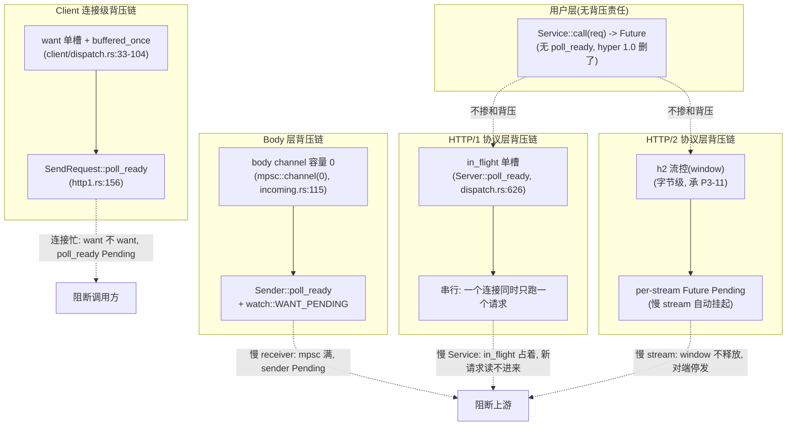
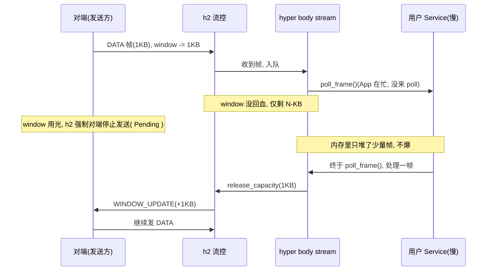

# 第 6 篇 · 第 18 章 · 性能:背压、timer、IO 调优

> **核心问题**:上一章(P6-17)讲了 hyper 的第一根性能支柱——`bytes::Bytes` 零拷贝,把"HTTP 字节在协议机里搬来搬去"的代价压到最低。但光快不够,还得**稳**:一个慢客户端不能把生产方的内存撑爆(不淹)、一个快客户端不能被生产方拖死(不饿)、一个 task 不能霸占 worker 线程让别的连接饿死(不阻塞线程);一条连接挂在那里不读不写,得有 timer 拽它一把(不悬挂);读多少字节、什么时候 flush,得有旋钮让你在吞吐和延迟之间调。这三件事——背压、timer、IO 调优——是 hyper 凭什么"又快又稳"的另外几根支柱。本章把它们收成一张图:背压全景 + timer 旋钮 + IO 调优旋钮,讲清 hyper 为什么 sound(层层兜底不撑爆、timer 防悬挂、yield 防饿死其他 task)。

> **读完本章你会明白**:
> 1. hyper 怎么做到"不淹不饿":背压**不在用户 Service trait 里**,而是散落在协议层(H1 `in_flight` 单槽/H2 流控/body channel 容量 0/client `want`)的四条链上,层层兜底——这是本章最大价值,一张图收拢散在前几章的背压点。
> 2. 为什么 hyper 1.0 删掉 Tower 的 `poll_ready` 不会丢背压:**协议层 + body 层已经自然背压**,用户 trait 不需要再背这个锅。
> 3. hyper 的超时/keepalive timer 怎么控:它自己不实现时间轮,而是包一层 `Time`(`common/time.rs`)把 `tokio::time` 抽象成可替换的运行时旋钮,你能在任何实现 `Timer` trait 的运行时上跑 hyper。
> 4. 一个连接 task 怎么不霸占 worker:`Dispatcher::poll_loop` 的 `for _ in 0..16` + `yield_now`,和 Tokio 的 budget=128 是两道独立防线,为什么 hyper 自己还要 yield。
> 5. IO 缓冲怎么调:`ReadStrategy::Adaptive`(2 的幂次增减)、`WriteStrategy::{Queue, Flatten}`、`MAX_BUF_LIST_BUFFERS`、`pipeline_flush` 模式——这些旋钮各自换什么(吞吐 vs 延迟 vs 内存),什么场景该拧哪一个。

> **如果一读觉得太难**:先只记住三件事——① hyper 的背压是"协议层 + body 层自然背压",H1 靠 `in_flight` 单槽、H2 靠 h2 流控、body 靠 mpsc 容量 0、client 靠 `want` 单槽,用户 Service trait 不掺和;② timer 全是包一层 `tokio::time`,hyper 自己不造时间轮;③ 一个 task 最多连续跑 16 轮协议机就 yield,加上 Tokio budget=128,双重防饿死。这三件事记住,后面调优旋钮慢慢看。

---

## 〇、一句话点破

> **hyper 的性能哲学是"协议层和 body 层自己背压,不让用户操心;timer 全外包给 tokio::time,自己只包一层可替换的壳;IO 缓冲给一堆旋钮让你在吞吐和延迟之间调,但默认值已经替你选好最稳的那档"。背压是兜底的(不淹不饿),timer 是保险的(不悬挂),yield 是协作的(不阻塞线程),IO 调优是权衡的(吞吐 vs 延迟)。**

这是结论。本章倒过来拆:先把散在前几章的背压点收成一张全景图(第一节),再讲 timer 怎么外包 + 旋钮在哪(第二节),再讲一个 task 怎么不饿死别人(第三节),最后讲 IO 缓冲调优旋钮(第四节),技巧精解钉死最硬的两个——`Time` 抽象的运行时可替换 + body channel 容量 0 强交接。

---

## 一、背压全景:为什么 hyper 不需要用户 trait 的 poll_ready

这是本章最大的一块招牌。前几章拆过背压,但都散在各处:P1-02 讲 Service trait 删掉 `poll_ready`、P1-04 讲 body channel 容量 0、P2-05 讲 `poll_loop` yield、P3-11 讲 h2 流控。本章把它们收成一张图——这是你看完本书后能在脑子里"放映"出"一次 HTTP 请求在 hyper 里被层层背压"的关键。

### 提出问题:背压是什么,为什么必须有

背压(backpressure)就是"下游慢了,上游等"。HTTP 服务里,数据是双向流动的:server 收请求 body(下游是用户 Service)、发响应 body(下游是网络);client 发请求 body、收响应 body。任何一段下游慢了,上游不能闷头继续往内存里塞,否则内存就爆了。

举个具体的灾难场景:client 上传一个 10GB 的大 body 给 server,server 的 Service 处理这个 body 时,把它转发给后端数据库(数据库慢,一次只吞 1KB)。如果 hyper 没有背压,会发生什么?hyper 会以网络最大速度把 10GB 全读进内存(因为用户 Service 在等数据库,没空 poll body stream),内存瞬间被撑爆,OOM。

> **钉死这件事**:背压不是"可选优化",是"必须有的正确性"。没有背压的 HTTP 库,一个慢客户端就能把服务器内存打爆。这不是夸张,是真实发生过无数次的线上事故——任何"先把数据全读进来再处理"的设计,在恶意/慢客户端面前都是 DoS 漏洞。

### Tokio/gRPC 怎么做,不这样会怎样

异步系统的背压,本质靠"Future 返回 `Poll::Pending`"。Tokio 的 mpsc channel 就是经典实现:容量 N 的 channel,塞满后再 `send` 返回 `Pending`,sender 这边的 task 就被挂起,让出线程;等 receiver 取走一个,唤醒 sender 继续。这就形成了"receiver 慢 → sender 自动挂起"的背压链。

> **承接《Tokio》**:这种"靠 `Poll::Pending` 形成背压"的机制,Tokio 那本在讲 Future/Stream 时拆透了一一 `Poll::Pending` 不是"出错",而是"我现在干不动,先把我挂起,等我的 Waker 被唤醒"。本章用这个机制,不重讲 Future/Poll。

gRPC 的背压更复杂一点(承《gRPC》第 2 篇):HTTP/2 有协议级的流控(window),一帧一帧地确认,window 用光就停。这是协议内置的字节级背压,粒度到字节。

如果不背压(朴素实现):上游闷头读、闷头塞,内存爆炸。所以**任何高性能网络库都必须有背压,问题只是放在哪里**。

### 所以 hyper 这么设计:背压不在用户 trait,在协议层和 body 层

hyper 1.0 做了一个关键决策——**把背压从用户 Service trait 里挪走**,挪到协议层(H1 `in_flight`/H2 流控)和 body 层(mpsc 容量 0)。P1-02 已经讲过"hyper 1.0 删掉了 Tower 的 `poll_ready`",这里把"删掉之后背压去哪了"收成一张图。

下面这张图是本章的招牌——背压全景,四条背压链:



这张图要看明白四条链各自兜什么底:

**链一:H1 `in_flight` 单槽——串行背压**。HTTP/1 一条连接同时只能处理一个请求(这是协议本质,不是 hyper 的选择)。hyper 在 server 侧的 `Server` dispatch 里用一个 `in_flight: Pin<Box<Option<S::Future>>>` 单槽(`dispatch.rs:49`)来表达"当前有没有在途请求"。`Server::poll_ready` 就是看这个槽有没有空(`dispatch.rs:626`):

```rust
// 简化示意, 对齐 hyper 源码 src/proto/h1/dispatch.rs:626
fn poll_ready(&mut self, _cx: &mut Context<'_>) -> Poll<Result<(), ()>> {
    if self.in_flight.is_some() {
        Poll::Pending   // 当前请求没处理完, 不读新请求
    } else {
        Poll::Ready(Ok(()))
    }
}
```

这个 `Poll::Pending` 被 `Dispatcher::poll_read_head` 用 `ready!` 宏接到(`dispatch.rs:294`):`in_flight` 满着,`poll_ready` 返 `Pending`,整个读循环就停在这里,不再从网络读新请求头。于是**用户的慢 Service 直接卡住 hyper 不读新请求**,客户端的 TCP send buffer 满了,客户端的 `write` 也就阻塞/挂起了——背压一路传回客户端,内存不会爆。

> **钉死这件事**:这条链的本质是"协议串行性天然背压"。HTTP/1 一连接一请求,所以"有没有在处理请求"这一个布尔位就够了背压。hyper 不需要给用户 Service 加 `poll_ready`,协议层的串行性已经把背压兜住了。

**链二:H2 流控——字节级背压**。HTTP/2 一条连接并发多个 stream,串行性没了,但协议本身有流控(window)——每个 stream 有自己的 window,连接也有 window,对端发一帧数据,window 减;window 用光,对端必须停。这是**协议内置的字节级背压**,粒度到字节。承《gRPC》第 2 篇(已拆透 HPACK/流控)和本书 P3-11,这里一句带过:hyper 委托 h2 crate,h2 实现 HTTP/2 流控;hyper 在 body 层有个关键配合——读完一帧 body 后调用 `h2.flow_control().release_capacity(bytes.len())`(`body/incoming.rs:245`),主动归还 window。这就形成了"用户 Service 慢慢 poll body stream → hyper 不 release capacity → h2 的 window 不回血 → 对端停止发数据"的字节级背压链。



> **钉死这件事**:H2 的背压是协议送的字节级精度,hyper 只要在 body 读完一帧后 `release_capacity` 就接上了。慢的 Service 自然让 window 不回血,对端自然停发。这条链 hyper 自己不写流控逻辑,全靠 h2,这也是为什么 hyper 委托 h2 而不是自实现——协议级流控太复杂,委托给专精的库最稳。

**链三:body channel 容量 0——强交接背压**。这是 hyper 自己设计的精妙一招。当 hyper 把请求 body 从网络读进来,要交给用户 Service 时,它不是直接把整个 body 塞给 Service,而是建一个 channel:`IncomingBody::new_channel` 用 `mpsc::channel(0)`(`body/incoming.rs:115`)——**容量 0 的 channel**。容量 0 意味着:sender 发一帧之前必须先 poll 到 receiver 在等着收(`poll_ready`),否则发不出去。

```rust
// 简化示意, 对齐 hyper 源码 src/body/incoming.rs:114-122
pub(crate) fn new_channel(content_length: DecodedLength, wanter: bool) -> (Sender, Incoming) {
    let (data_tx, data_rx) = mpsc::channel(0);   // 容量 0!
    let (trailers_tx, trailers_rx) = oneshot::channel();
    let want = if wanter { WANT_PENDING } else { WANT_READY };
    let (want_tx, want_rx) = watch::channel(want);
    // ...
}
```

容量 0 的语义是"强交接":`Sender::poll_ready`(`incoming.rs:362`)必须先确认对端(receiver)在 `poll_next`,否则 `Pending`。于是 hyper 的 `Dispatcher::poll_read`(`dispatch.rs:224`)在往 body channel 塞数据前,先 `body.poll_ready(cx)`:用户 Service 没在 poll body,`poll_ready` 返 `Pending`,hyper 就**停止从网络读 body**,TCP 缓冲满了,客户端就停发——背压一路传回客户端。

> **钉死这件事**:body channel 容量 0 是 hyper 把"读网络"和"用户消费 body"两个异步环节硬绑在一起的招。容量 0 不是性能损失,是背压精度——零缓冲,一帧都不多堆。配合 `watch`(WANT_PENDING/WANT_READY 两态)还能进一步:用户没 poll 过 body 一次之前,sender 直接不 ready(`wanter=true` 模式),防止"用户注册了 body 但还没开始消费,hyper 就闷头读"的边界情况。

**链四:client `want` 单槽——连接级背压**。client 侧,`SendRequest::poll_ready`(`client/conn/http1.rs:156`)接到 `dispatch.poll_ready`,底层是 `want::Giver::poll_want`(`client/dispatch.rs:76`)。`want` 是个外部 crate(单槽"想不想要"协议):receiver(dispatch task)显式 `want()` 表示"我准备好接下一个请求了",sender 才能发。这形成"连接没处理完上一个请求,用户 `SendRequest::ready` 就 `Pending`"的连接级背压,防止用户往一条忙连接上狂塞请求。

```rust
// 简化示意, 对齐 hyper 源码 src/client/dispatch.rs:74-104
impl<T, U> Sender<T, U> {
    pub(crate) fn poll_ready(&mut self, cx: &mut Context<'_>) -> Poll<crate::Result<()>> {
        self.giver.poll_want(cx).map_err(|_| crate::Error::new_closed())
    }

    fn can_send(&mut self) -> bool {
        if self.giver.give() || !self.buffered_once {
            // receiver 在等, 或还没缓冲过任何一个 -> 允许缓冲一个
            self.buffered_once = true;
            true
        } else {
            false   // 已经缓冲过一个且 receiver 还没要 -> 不让发
        }
    }
}
```

注意 `buffered_once`(`dispatch.rs:53`)的微妙:即使 receiver 还没 `want`,也允许缓冲**一个**请求(提高一点并发),但只一个。第二个请求必须等 receiver 显式 `want`。这是"几乎零缓冲但允许一个 in-flight"的精细权衡。

### 源码佐证:为什么 hyper 1.0 敢删 poll_ready

把四条链合起来看,你就明白 hyper 1.0 为什么敢从 Service trait 删掉 Tower 的 `poll_ready`——背压被四条链兜死了:

| 背压链 | 在哪 | 兜什么 | 粒度 |
|---|---|---|---|
| H1 `in_flight` 单槽 | `dispatch.rs:49,626` | 一连接一请求串行 | 请求级 |
| H2 流控 + `release_capacity` | h2 crate + `body/incoming.rs:245` | 多路复用每 stream | 字节级 |
| body channel 容量 0 | `body/incoming.rs:115` | 读网络 ↔ 用户消费 body | 帧级 |
| client `want` 单槽 | `client/dispatch.rs:33-104` | 一连接一 in-flight 请求 | 请求级 |

Tower 的 `poll_ready` 当年想做的事(让用户 Service 表达"我现在能不能接新请求"),hyper 用这四条链全包了。用户的 Service 只管"接到请求就处理,处理慢了自然形成背压",不用自己写 `poll_ready` 逻辑——这是 hyper 1.0 把"复杂度从用户挪到框架"的典型一笔(承 P6-19 三分重构)。

> **不这样会怎样**:如果 hyper 像 Tower 那样让每个 Service 都实现 `poll_ready`,用户写的每个 axum handler、每个 reqwest 中间件,都得想想"我现在 ready 吗"。99% 的用户 Service 根本不知道自己什么时候 ready(它们只是查个库、调个下游),`poll_ready` 就退化成"永远 Ready"或者"复制一份业务逻辑进 poll_ready"——前者背压失效,后者代码重复且易错。hyper 把背压收进协议层 + body 层,用户彻底解脱。

> **承接 P1-02/P1-04/P2-05/P3-11**:这四条链的细节,前面章节分别拆过:P1-02 拆 Service trait 为什么删 `poll_ready`、P1-04 拆 body channel 容量 0 的强交接、P2-05 拆 `poll_loop` 怎么因 `in_flight` Pending 而停读、P3-11 拆 h2 流控 + `release_capacity` 的字节级配合。本章不重复,只把它们收成一张全景图,让你看到"背压是一个整体设计,不是四个零散机制"。

### 为什么 sound:层层兜底真的不爆,反例对照

讲清"四条链兜底"还不够,得讲清**为什么这四条链合起来真的 sound**(不淹不饿不阻塞)。sound 的证明,最直观的办法是看"如果哪条链断了会怎样",用反例逼出每条链的不可替代性。

**反例一:假设 H1 `in_flight` 链断(删掉这个判断)**。`poll_read_head` 不看 `in_flight` 直接读,会发生什么?用户 Service 还在处理第一个请求(`in_flight` 占着),hyper 又读进来第二个请求头、第三个……read_buf 里堆了一堆解析好的请求,但 Service 还没消费。这本身不爆(read_buf 有 max_buf_size 上限 ~409KB 兜底),但 **read_buf 撑满后 hyper 返 `TooLarge` 错误关连接**——客户端收到一堆 400/连接重置,体验灾难。所以 `in_flight` 单槽不是"防 OOM"(max_buf_size 兜了),是"防协议语义错乱":HTTP/1 串行语义要求"一个请求处理完才读下一个",`in_flight` 是这个语义的代码表达,删了它语义就崩。

**反例二:假设 H2 流控链断(hyper 不调 `release_capacity`)**。用户 Service 慢慢 poll body stream,hyper 读一帧进 body 但不 release capacity,h2 的 stream window 永远不回血。对端发到 window 用光就停——看起来背压还在?但问题在"连接级 window":h2 有连接级 + stream 级两层 window,如果 hyper 不 release stream capacity,连接级 window 也会被慢慢吃光(因为对端发了数据,连接 window 减了),**最后这条 HTTP/2 连接上所有 stream 都卡死**——别的正常 stream 也发不动数据。所以 `release_capacity` 不只是 stream 背压,是保护整条连接不被一个慢 stream 拖死。这条链断的代价是"一个慢请求拖死整条 HTTP/2 连接的所有并发请求",这是 H2 多路复用相比 H1 串行的额外风险面,hyper 必须主动配合 h2 防它。

**反例三:假设 body channel 用容量 N(不是 0)**。容量 8 的 mpsc,hyper 能预读 8 帧 body 进 channel 排队。看起来"性能更好"(预读减少 syscall)?但背压精度丢了 8 帧:用户 Service 卡住,hyper 还能再读 8 帧进内存(每帧默认最大 16KB 左右),堆 128KB 才停。对单个连接不爆,但**1 万个慢连接 × 128KB = 1.28GB**,DoS 攻击面变大。容量 0 把这个攻击面压到"一帧都不多堆",1 万个慢连接也只堆各自的"当前那一帧"。这是 hyper 选容量 0 而不是容量 N 的安全理由——性能上容量 N 略好(预读),安全上容量 0 严格(零堆)。

**反例四:假设 client 删掉 `want` + `buffered_once`**。用户往一条忙连接狂塞请求,每个请求都进 mpsc unbounded channel(`dispatch.rs:32` 用的是 `mpsc::unbounded_channel`!)排着。这条 channel 是 unbounded 的——没有 `want` 兜底,用户能塞无限个请求进内存,连接 task 处理不过来,内存爆。`want` + `buffered_once` 就是给这个 unbounded channel 加"语义上的界":最多缓冲一个(`buffered_once`),第二个必须等 receiver 显式 `want`。注意这个界不是 mpsc 的容量(mpsc 还是 unbounded),是 `want` 协议层的"想不想要"信号——这是个独立于 channel 容量的背压层,设计上把"传输容量"和"接收意愿"分开管。

> **钉死这件事**:四条链合起来 sound 的证明,就是这四个反例——每条链断都有具体的灾难。它们不是冗余(删三条留一条不行),是各兜一面:H1 兜协议语义,H2 兜连接级 window,body channel 兜帧级堆量,client want 兜请求级排队。**hyper 的背压是"纵深防御"——任何一条链失效,别的链还能兜;四条链全失效才会真的爆**。这种纵深防御的设计哲学,和 Linux 同步原语那本讲的"RCU 多道 grace 周期"是同一种思路:不指望单点正确,靠多层独立机制各管一面。

### 量化:一个慢客户端在 hyper 里到底堆多少字节

把四条链的"堆量上限"量化,你就明白 hyper 的内存放大系数有多小:

- **H1 慢 Service**:read_buf 上限 `DEFAULT_MAX_BUFFER_SIZE` ≈ 409KB(一个连接最多堆这么多未处理字节),1 万慢连接 ≈ 4GB——但这是极端(读了一半的请求头堆满),正常慢 Service 场景(`in_flight` 占着但 body 已交 channel)只堆 read_buf 的当前 chunk + body channel 的 0 帧 ≈ 几十 KB/连接,1 万连接几百 MB,可控。
- **H2 慢 stream**:h2 默认 initial window 65536 字节(stream 级),一条慢 stream 最多堆 64KB,连接级 window 默认也 65536。1 万慢 stream ≈ 640MB,可控。
- **client 慢连接**:`buffered_once` 一个请求,一个请求的 body 又被 body channel 容量 0 限到 0 帧——堆量约等于一个请求头大小(几 KB)。1 万慢 client ≈ 几十 MB,几乎可忽略。

对比"无背压朴素实现":每个慢连接堆整个请求 body(可能 GB 级),1 万连接 = TB 级,瞬间 OOM。hyper 把放大系数从"O(body 大小)"压到"O(一个 chunk 或一个 window)",这就是背压的工程价值。

> **对照 gRPC/Envoy 的背压**:gRPC C++ core(chttp2)的 HTTP/2 流控和 hyper+h2 类似(协议级 window),但 chttp2 自己实现流控,代码量大得多(承《gRPC》第 2 篇)。Envoy 的 HCM(HTTP Connection Manager)有 watermarks 机制——给下游 filter 链传背压信号,粒度比 hyper 的四条链粗(Envoy 是"给整个 filter 链一个水位",hyper 是"每个协议层/body 层独立背压")。两种思路:Envoy 走"统一水位 API"(框架重,但 filter 作者好理解),hyper 走"分散在各层自然背压"(框架轻,但要看源码才知道背压在哪)。没有谁对谁错,是"框架显式 vs 隐式"的设计取舍。

---

## 二、timer:全外包给 tokio::time,hyper 只包一层可替换的壳

### 提出问题:超时和 keepalive 怎么控

HTTP 服务里一堆时间相关的事:读请求头不能无限等(客户端开了连接不发包,得超时关)、HTTP/2 连接得定期 PING 保活(中间代理可能掐空闲连接)、keepalive timeout(连接空闲多久就关)。这些"到点做某事"的机制,叫 timer。

hyper 需要 timer,但它**不自己实现时间轮**——这件事 Tokio 已经做透了。hyper 的做法是:包一层薄抽象(`Time`/`Timer`/`Sleep`),让 timer 变成"可替换的运行时组件",默认接 `tokio::time`,但你也能接别的(比如想用 io_uring 自己的时间,或者测试时接 mock timer)。

### Tokio 怎么做,承接铁律

Tokio 有一个时间轮(`tokio::time`),`tokio::time::sleep(duration)` 返回一个 Future,到点 resolve。这个时间轮的内部实现(分层时间轮、Wheel 区间、`runtime/time/wheel`),《Tokio》那本拆透了。

> **承接《Tokio》**:Tokio 的时间轮在 `runtime/time/wheel`,基于分层时间轮(hierarchical timing wheel),`sleep`/`sleep_until` 注册一个 entry,reactor 的 park 循环每次醒来检查最早到期的 entry。这套机制《Tokio》拆到源码级,本书**一句带过 + 指路**,篇幅全留 hyper 怎么把这层包起来用。

### 所以 hyper 这么设计:Time 枚举 + Timer trait,运行时可替换

hyper 在 `src/common/time.rs` 定义了一个 `Time` 枚举(`time.rs:14`),就两个变体:

```rust
// 简化示意, 对齐 hyper 源码 src/common/time.rs:14-17
pub(crate) enum Time {
    Timer(Arc<dyn Timer + Send + Sync>),
    Empty,
}
```

`Empty` 表示"没设 timer",`Timer` 包一个用户提供的 `Timer` trait 实现。`Timer` trait 在 `src/rt/timer.rs:70`:

```rust
// 简化示意, 对齐 hyper 源码 src/rt/timer.rs:70-88
pub trait Timer {
    fn sleep(&self, duration: Duration) -> Pin<Box<dyn Sleep>>;
    fn sleep_until(&self, deadline: Instant) -> Pin<Box<dyn Sleep>>;
    fn now(&self) -> Instant { Instant::now() }   // 默认实现
    fn reset(&self, sleep: &mut Pin<Box<dyn Sleep>>, new_deadline: Instant) {
        *sleep = self.sleep_until(new_deadline);   // 默认: 重建一个
    }
}

pub trait Sleep: Send + Sync + Future<Output = ()> { /* sealed */ }
```

默认实现(用 tokio)在 doc comment 里给了范例(`timer.rs:16-53`):一个 `TokioTimer` 结构,实现 `Timer` 时把 `sleep` 包成 `Box::pin(TokioSleep { inner: tokio::time::sleep(duration) })`。所以 hyper 默认接 `tokio::time`,但你想换运行时,就实现 `Timer` trait 接你的运行时的时间原语——这就是 hyper 1.0 "运行时无关" 的核心抽象之一。

> **钉死这件事**:`Time::Empty` 是个有意思的设计:它表示"用户没设 timer"。这时候 `Time::sleep` 会 `panic!("You must supply a timer.")`(`time.rs:37`)。但 `Time::now()` 在 `Empty` 下不 panic,直接返 `Instant::now()`(`time.rs:55`)。为什么这么分?因为"现在几点"用系统时钟就行,不依赖运行时;但"sleep 到某个点"必须有运行时支持。这种"cheap 操作退化到 std,expensive 操作要求显式注入"的取舍,是 hyper 让运行时可替换又不过度打扰用户的精妙。

### hyper 的超时旋钮:有哪些,在哪设

包好 `Time` 之后,hyper 在各处用它,暴露给用户一堆超时旋钮。下面这张表收齐主要旋钮:

| 旋钮 | 在哪设 | 作用 | 默认 |
|---|---|---|---|
| `header_read_timeout`(H1 server) | `server/conn/http1.rs:352` | 读一个请求头的最长时间, 超了关连接 | 30s(默认) |
| HTTP/2 `keep_alive_interval` | `server/conn/http2.rs:226`、`client/conn/http2.rs:438` | 空闲多久发 PING 保活 | None(关) |
| HTTP/2 `keep_alive_timeout` | `server/conn/http2.rs:237` | 发 PING 后多久没 PONG 就关连接 | — |
| HTTP/2 `keep_alive_while_idle` | `client/conn/http2.rs:458` | 没活跃 stream 时也发 PING | false(client) |
| `timer`(注入 Timer) | `server/conn/http1.rs:411`、`http2.rs:284` 等 | 注入自定义 Timer 实现 | `Time::Empty`(panic if used) |

最值得拆的是 **`header_read_timeout`**——它防"慢速攻击"(slowloris):客户端开了连接,一个字节一个字节地发请求头,每个字节隔 30 秒,把你的连接池耗光。hyper 在 `proto/h1/conn.rs:218-235` 实现:

```rust
// 简化示意, 对齐 hyper 源码 src/proto/h1/conn.rs:218-235
if !self.state.h1_header_read_timeout_running {
    if let Some(h1_header_read_timeout) = self.state.h1_header_read_timeout {
        let deadline = self.state.timer.now() + h1_header_read_timeout;
        self.state.h1_header_read_timeout_running = true;
        match self.state.h1_header_read_timeout_fut {
            Some(ref mut fut) => {
                self.state.timer.reset(fut, deadline);   // 复用, reset deadline
            }
            None => {
                self.state.h1_header_read_timeout_fut =
                    Some(self.state.timer.sleep_until(deadline));   // 新建一个 sleep
            }
        }
    }
}
```

读头开始时,设一个 deadline(现在 + timeout);读到一半还没读完(`Poll::Pending`),在 pending 分支里 poll 这个 sleep(`conn.rs:260`),sleep ready 了就返"读头超时"错误(`conn.rs:264`)。读完头,清掉 running 标记(`conn.rs:275`)。注意 `timer.reset` 的复用——一个 `Sleep` future 反复 reset deadline,不每次新建,这是性能优化(承 tokio::time::Sleep 的 reset 语义)。

> **钉死这件事**:`header_read_timeout` 默认 30 秒(`server/conn/http1.rs:250`),且默认是 `Dur::Default`——意思是"如果你没注入 timer,这个默认值会被 warn 掉但不会 panic"(`time.rs:73-77`);但如果你显式 `header_read_timeout(Some(...))` 配了值却没注入 timer,就 panic(`time.rs:79-81`)。这是"默认值宽容,显式配置严格"的设计:防止用户显式要了超时却忘了注入 timer,导致超时静默失效。

HTTP/2 的 keep_alive 在 `proto/h2/ping.rs` 里(`ping.rs:63-70`):一个 `KeepAlive` 结构,记录 `interval`/`timeout`/`while_idle`/`sleep`/`state`/`timer`。它的逻辑(承 P3-11 已拆):连接空闲超过 `interval` 就发 PING,发了 PING 后超过 `timeout` 还没收到 PONG 就关连接。这是 hyper 在 h2 的 ping 之上加的应用层 keepalive(h2 自己也有协议级 ping,hyper 用它来实现 keepalive)。

> **对照 gRPC 的 deadline/流控调优**:gRPC 有应用层的 deadline(propagate 到对端),HTTP/2 流控调优(window 大小、BDP)。这些在《gRPC》第 2 篇拆过,hyper 的 `keep_alive_interval` 是类似思路(应用层保活),但 hyper 不做 gRPC 那种 deadline 传播(那是 gRPC 协议层的 feature),hyper 的超时更偏"保护连接资源"(防慢速攻击、防死连接)。

### timer 用错的陷阱:两个线上常见坑

hyper 的 timer 抽象很优雅,但用户接进来时有两个常见的坑,值得钉死。

**坑一:忘注入 timer,超时静默失效**。这是最常见的坑。用户写 `Builder::new().header_read_timeout(Some(Duration::from_secs(10)))`,但忘了 `Builder::timer(TokioExecutor::new())`(或者用自己的运行时但忘了实现 `Timer`)。结果是:`Time::Empty` 下,`header_read_timeout` 是 `Dur::Configured(Some(...))`,`Time::check` 走 `Configured(Some)` 分支直接 panic("timeout header_read_timeout set, but no timer set")(`time.rs:79-81`)。看起来是好事(panic 总比静默失效好)?但 panic 在连接 task 里,会把整个连接 task 干掉(不是整个 server),用户看到的是"连接莫名断开",日志里有个 panic stack,排查半天才发现是忘注入 timer。hyper 的设计选择是"显式配置严格(panic),默认配置宽容(warn)"——这是个权衡:panic 在 task 级(不炸 server),且用户显式要了超时却没给工具,确实是程序员错误,panic 比"超时永远不触发然后被慢速攻击打爆"安全。

> **钉死这件事**:`Dur::Default` vs `Dur::Configured` 的区分(`time.rs:21-24`)就是为这个坑设计的。`Default` 是 hyper 自己的默认值(30s),用户没显式配,忘注入 timer 时 warn 但不 panic(降级到"没超时",不炸);`Configured` 是用户显式配的,忘注入 timer 时 panic(用户明确要了这个 feature,没给工具是 bug)。这个区分把"hyper 的默认行为"和"用户的显式意图"分开处理,体现了"显式优于隐式"的 Rust 哲学。

**坑二:`timer.reset` 的语义陷阱**。hyper 复用 `Sleep` future,反复 `timer.reset(&mut sleep, new_deadline)`(`time.rs:60`)。但 `Timer` trait 的默认 `reset` 实现(`timer.rs:85-87`)是**重建一个 Sleep**:`*sleep = self.sleep_until(new_deadline)`。这会丢弃旧的 Sleep,新建一个——性能上比"原地改 deadline"差。tokio 的 `TokioTimer` 覆盖了 `reset`(`timer.rs:31-35` doc 示例),用 `downcast_mut_pin::<TokioSleep>` 拿回具体类型,调 `tokio::time::Sleep::reset`(原地改 deadline,不重建)。所以"复用 + reset"的性能红利,只在用 tokio(或自己覆盖 reset 的 Timer 实现)时才拿到——这是个隐式性能依赖,用户接自定义 Timer 时如果不覆盖 reset,reset 会退化成重建。

> **不这样会怎样**:如果每次都新建 Sleep(`sleep_until` 重建),每次 `header_read_timeout` 触发都要 alloc 一个新的 `Pin<Box<dyn Sleep>>`(tokio 的 Sleep 内部有 entry 注册到时间轮,新建要重新注册)。一个高频小请求场景(每个请求都触发 header_read_timeout 计时),这变成显著的 alloc 开销。复用 + downcast reset 把这个开销压到"只改一个 deadline 字段",零 alloc。这种"trait object 默认慢,具体类型覆盖才快"的设计,是 hyper 在"运行时可替换"和"性能"之间的精细平衡——可替换是兜底(任何 Timer 都能跑),性能靠具体实现覆盖。

---

## 三、一个 task 怎么不饿死别人:poll_loop 的 16 轮 + yield_now

### 提出问题:协作式调度的隐患

hyper 一连接一 task,这些 task 共享一小撮 worker 线程(M:N 调度,承《Tokio》)。如果一条连接特别忙(比如流水线模式下一个连接上排了 20 个请求,每个请求都 ready),这条连接的 task 会不会一直跑、不让别的 task 上 CPU?

这就是协作式调度的经典隐患:**一个 task 在循环里不停 ready,会饿死别的 task**。Tokio 用 budget 解决一部分(承《Tokio》budget=128),但 hyper 自己还有一道防线。

### Tokio 怎么做,承接铁律

Tokio 的 budget 机制:一个 task 在 IO 操作时消耗 budget(默认 128),耗光就主动 yield,让调度器调度别的 task。这套机制《Tokio》拆透了。

> **承接《Tokio》**:budget=128 是 Tokio 的协作式让出机制,基于"IO 操作消耗 budget,耗光 yield"的计数。这套机制《Tokio》拆到源码级,本书**一句带过 + 指路**。

### 所以 hyper 这么设计:poll_loop 自己限 16 轮,再 yield_now

hyper 在 `Dispatcher::poll_loop`(`dispatch.rs:166`)自己加了一道防线——一个 `for _ in 0..16` 循环,跑完 16 轮就 yield:

```rust
// 简化示意, 对齐 hyper 源码 src/proto/h1/dispatch.rs:166-214
fn poll_loop(&mut self, cx: &mut Context<'_>) -> Poll<crate::Result<()>> {
    // Limit the looping on this connection, in case it is ready far too
    // often, so that other futures don't starve.
    //
    // 16 was chosen arbitrarily, as that is number of pipelined requests
    // benchmarks often use. Perhaps it should be a config option instead.
    for _ in 0..16 {
        let _ = self.poll_read(cx)?;
        let write_ready = self.poll_write(cx)?.is_ready();
        let flush_ready = self.poll_flush(cx)?.is_ready();

        let wants_write_again = self.can_write_again() && (write_ready || flush_ready);
        let wants_read_again = self.conn.wants_read_again();

        if !(wants_write_again || wants_read_again) {
            return Poll::Ready(Ok(()));   // 没事可干了, 让出
        }

        if !wants_read_again && wants_write_again {
            if self.poll_write(cx)?.is_pending() {
                return Poll::Ready(Ok(()));   // 写不动了, 让出
            }
        }
    }
    trace!("poll_loop yielding (self = {:p})", self);
    task::yield_now(cx).map(|never| match never {})
}
```

跑满 16 轮还没歇,就 `task::yield_now(cx)`。这个 `yield_now` 在 `common/task.rs:8`:

```rust
// 简化示意, 对齐 hyper 源码 src/common/task.rs:8-11
pub(crate) fn yield_now(cx: &mut Context<'_>) -> Poll<std::convert::Infallible> {
    cx.waker().wake_by_ref();
    Poll::Pending
}
```

就两行:把自己的 waker 立即唤醒(排到队列尾),返 `Pending`(让出当前线程)。下一轮调度回来,继续从 poll_loop 顶部跑。

### 为什么 hyper 自己还要 yield,Tokio budget 不够吗

这是关键问题——Tokio 有 budget=128,hyper 为什么还要自己加个 16?

答案是:**budget 是"IO 操作"才消耗的,协议机循环不一定每次都做 IO**。考虑流水线模式:一条连接的 read_buf 里堆了 20 个完整请求(客户端一次性发了一堆)。hyper 的 `poll_read` 解析出一个请求头,这个解析**不消耗 budget**(它是内存里的字节处理,不是 IO);然后 `poll_write` 把响应写出去——但写可能命中 write_buf 还没满,直接 buffer 进去,**也不一定消耗 budget**。于是这一轮循环没消耗几个 budget,128 个 budget 能撑很久,但这条连接的 task 已经霸占 CPU 跑了几十轮协议机,别的 task 饿死了。

hyper 的 16 轮硬上限就是兜这个底:**不管 budget 消不消耗,协议机循环最多连续 16 轮就 yield**。注释里写得很明白("in case it is ready far too often, so that other futures don't starve")。

> **钉死这件事**:16 这个数字注释里说"arbitrarily chosen, as that is number of pipelined requests benchmarks often use"——流水线基准测试常用 16 个请求排一条连接,所以 hyper 让一条连接一次最多连续处理 16 个(基准测试场景下不会被 yield 卡到),超过 16 就让出。这是个经验值,注释自己也说"Perhaps it should be a config option instead"。两道防线的关系:Tokio budget 防"IO 密集型 task 霸占",hyper 16 轮防"协议机循环(可能不 IO)霸占",**互补不冗余**。

### 为什么 sound:yield 后能被唤醒继续

yield 不是"放弃",是"让出再排回队列"。`yield_now` 用 `cx.waker().wake_by_ref()` 立即把自己排回去,所以下一轮调度这个 task 还会被 poll,从 poll_loop 顶部接着跑。不会丢上下文(状态全在 Dispatcher 结构体里),不会死锁(自己唤醒自己,不依赖别人)。

但如果只 `yield_now` 不做别的,会不会 hot-loop(立即被唤醒又跑 16 轮)?不会,因为 poll_loop 里如果有 `poll_read`/`poll_write` 返 `Pending`,整个 Dispatcher Future 就返 `Pending`,task 真正挂起等 IO 唤醒——yield 只在"16 轮全 ready"时才触发,而那种情况是连接真的有 16+ 个排队的请求可处理,yield 一下让别的 task 跑跑,然后调度回来继续,这是健康的协作。

### 量化:两道防线的触发场景对照

把"Tokio budget=128"和"hyper 16 轮"两道防线的触发场景量化对照,你就明白它们为什么是互补的而非冗余的:

| 场景 | budget 消耗 | 16 轮触发 | 实际让出靠谁 |
|---|---|---|---|
| 一条连接传大文件(body IO 密集) | 每轮 poll_read/poll_write 都消耗 budget,几轮就到 128 | 不太可能触发(传文件不会一轮处理多个请求) | Tokio budget |
| 一条连接流水线堆 20 个小请求 | 每轮可能不 IO(请求都在 read_buf 里, 响应 buffer 进 write_buf) | 16 轮必触发 yield | hyper 16 轮 |
| 一条连接狂收小 JSON 请求(非流水线, keep-alive) | 每个请求一次 read+write, 消耗 budget | 不太触发(每轮有 IO) | Tokio budget |
| 一条 H2 连接多 stream 都 ready | per-stream task 各自 budget | 不太触发(每 stream 独立 poll) | Tokio budget(每 stream) |

关键洞察:**只有"一条连接一次有多个完整请求可处理"的场景,hyper 的 16 轮才是主导防线**——而那恰好是流水线模式(客户端一次发一堆请求)或"read_buf 里堆了多个请求还没消费"的边界。其余场景,Tokio budget 是主导。这就是为什么两道防线都必要:删了 budget,IO 密集 task 霸占;删了 16 轮,协议机循环(无 IO)霸占。

> **钉死这件事**:hyper 的 `for _ in 0..16` 不是"重复造 budget 的轮子",是补 budget 的盲区。这种"运行时有通用让出机制,库自己再加一道针对自己热点的让出"的模式,在 Rust 异步生态里很常见——比如 reqwest 在重试循环里也自己 yield(防止重试风暴),tonic 在 gRPC 流式 RPC 里也自己限轮次。本质都是"通用 budget 防不了我的特定热点,我自己加一道"。这是"运行时和库分工"的体现:运行时管通用调度公平,库管自己的热点公平。

### 反例:如果删掉 yield 会怎样(流水线饿死)

构造一个具体的反例量化"删 yield 的代价"。假设 hyper 删掉 `for _ in 0..16` 和 `yield_now`,只靠 Tokio budget。一个客户端用流水线模式往一条连接发 100 个小请求(每个请求 1KB,响应 1KB),server 侧:

- 连接 task 被 poll,`poll_read` 一次读 100 个请求头进 read_buf(共 100KB,在 buffer 内)。
- `poll_read_head` 解析出第一个请求,交给 Service,Service 同步返回响应(假设是 echo,极快),`poll_write` 把响应 buffer 进 write_buf。
- 第一轮循环结束,budget 消耗:poll_read 一次(-1),poll_write 一次(-1),共消耗 2。还剩 126。
- 回到循环顶,`wants_read_again`(read_buf 里还有 99 个请求没解析)为 true,继续。
- 第二轮:解析第二个请求,响应,消耗 2。还剩 124。
- ...
- 第 64 轮:消耗 128, бюджет 耗光,Tokio 让 task yield。

看起来 budget 兜住了?但这一条连接的 task 已经连续霸占 CPU 跑了 64 轮协议机。如果同时有 1000 条这样的连接(每条都流水线 100 请求),且 worker 线程只有 8 个,会发生什么?8 个 worker 各自抓到一个 task 跑 64 轮,期间别的 task(可能有真正需要 IO 的紧急连接,比如已就绪的 accept)排队等——**紧急连接被流水线连接饿死**。hyper 的 16 轮把"一条连接一次最多连续跑 16 轮"硬限,8 个 worker 各跑 16 轮就让出,紧急连接能插进来。这就是 16 比 128 更激进的让出频率的必要性——对协议机循环这种"每轮轻量但轮次多"的热点,16 比 128 公平得多。

> **钉死这件事**:这个反例不是空想,是流水线基准测试(wrk 用 `pipelining=16`)真实会触发的场景。hyper 选 16 而不是 128,就是为了让"流水线连接"和"普通连接"在调度上更公平——16 轮让出后,普通连接能立刻插队,而流水线连接也只是慢一点点(下一轮调度回来继续跑剩下的)。这是 hyper 对"协议机循环是热点"的精确认识——不是拍脑袋,是基准测试逼出来的经验值。

---

## 四、IO 调优旋钮:read/write buffer 大小、flush 策略、pipeline 模式

### 提出问题:buffer 大小和 flush 时机怎么影响吞吐 vs 延迟

hyper 的 IO 在 `proto/h1/io.rs` 的 `Buffered` 结构里(`io.rs:32`)。这个结构管两件事:read buffer(从网络读进来的字节攒在这里,等协议机解析)和 write buffer(协议机编出来的字节攒在这里,等 flush 到网络)。buffer 多大、什么时候 flush、用不用 vectored write(writev)、要不要 pipeline 模式——这些旋钮直接决定吞吐和延迟的权衡。

### Tokio 怎么做,承接铁律

Tokio 提供 `AsyncRead`/`AsyncWrite` 的 `poll_read`/`poll_write`/`poll_write_vectored`,buffer 由调用方(hyper)自己管。Tokio 的 `BufReader`/`BufWriter` 是通用实现,但 hyper 不用——它自己写了 `Buffered`,因为 HTTP 协议机的读写模式有特殊性(头是文本行、body 是二进制 chunk、可能要 vectored write 把头和 body 拼一次发)。

> **承接《Tokio》**:`AsyncRead::poll_read` 把字节读进 `ReadBuf`,reactor(epoll/kqueue)负责"什么时候有数据可读",buffer 策略是调用方的事。这套《Tokio》拆透了,本书用它的 `poll_read`/`poll_write_vectored`,不重讲。

### 所以 hyper 这么设计:一堆常量 + 策略枚举,默认值替你选最稳的

`proto/h1/io.rs` 顶上一堆常量(`io.rs:14-30`):

```rust
// 简化示意, 对齐 hyper 源码 src/proto/h1/io.rs:14-30
pub(crate) const INIT_BUFFER_SIZE: usize = 8192;                  // 初始 read buf 大小
pub(crate) const MINIMUM_MAX_BUFFER_SIZE: usize = INIT_BUFFER_SIZE;
pub(crate) const DEFAULT_MAX_BUFFER_SIZE: usize = 8192 + 4096 * 100;  // ~409KB
const MAX_BUF_LIST_BUFFERS: usize = 16;                            // Queue 策略下 BufList 最多 16 个 Buf
// flush 里还有: const MAX_WRITEV_BUFS: usize = 64;                // 一次 writev 最多 64 个 iovec
```

加上几个策略枚举:`ReadStrategy::{Adaptive, Exact}`(`io.rs:360`)、`WriteStrategy::{Flatten, Queue}`(`io.rs:641`)。下面挨个拆。

### ReadStrategy::Adaptive:2 的幂次增减

read buffer 不是固定大小,是自适应的。`Adaptive`(`io.rs:362`)记录三个字段:`decrease_now`(要不要现在减)、`next`(下一次预读多少)、`max`(上限)。`record` 方法(`io.rs:396`)每次读完更新策略:

- 读到的字节 >= `next`:说明 buffer 不够大(都读满了),`next` 翻倍(2 的幂次增长),直到 `max`。
- 读到的字节 < 上一个 2 的幂次:说明 buffer 太大了(只读了一点点),标记 `decrease_now`,下一次再小就真的减半(两步减,防抖)。

测试用例(`io.rs:734-757`)验证得清清楚楚:从 8192 开始,record(8192)→ 16384,record(16384)→ 32768,record(usize::MAX)→ 65536(还是翻倍,不跳);减的时候,record(1) 不立即减(第一次只是标记),record(1) 再一次才减到 8192。

> **钉死这件事**:这套 2 的幂次增减 + 两步防抖,本质是"试探连接的真实流量"。大流量连接(传大文件),buffer 涨到几十 KB 一次读一大块,减少 syscall 次数;小流量连接(传小 JSON),buffer 降到 8192,不浪费内存。两步防抖防"一次偶然的小读就缩 buffer",要连续两次小读才真缩。

### WriteStrategy:Flatten vs Queue

写策略两个枚举(`io.rs:641`):

- **Flatten**:所有要写的字节(头 + body chunks)都拷到一个 `Vec<u8>`(headers buffer)里,一次 `poll_write` 发出去。
- **Queue**:用 `BufList`(承 P6-17)维护多个 Buf,一次 `poll_write_vectored`(writev)发出去,**零拷贝**(不合并)。

选哪个?看 `io.is_write_vectored()`(`io.rs:60`):底层 IO 支持 vectored write 就 Queue(tokio TcpStream 支持),不支持就 Flatten。Queue 是默认(vectored 零拷贝,承 P6-17),Flatten 是退化。

但 Queue 有个上限:`MAX_BUF_LIST_BUFFERS = 16`(`io.rs:30`),BufList 里堆超过 16 个 Buf 就强制 flush(`io.rs:579-585`)。这是防"BufList 无限增长,每个 Buf 都还活着(引用计数不释放),内存爆"。flush 时还有 `MAX_WRITEV_BUFS = 64`(`io.rs:276`)——一次 writev 最多 64 个 iovec(系统调用限制)。

### pipeline_flush 模式:吞吐换延迟的旋钮

`pipeline_flush`(`io.rs:33`,设 `set_flush_pipeline` at `io.rs:78`)是个特殊模式。HTTP/1 流水线:客户端一条连接上连续发多个请求(不等响应),server 收到后连续处理多个响应写回去。正常模式下,hyper 写完一个响应就 flush(让客户端早点收到);pipeline 模式下,hyper 攒着多个响应一起 flush(减少 syscall 次数,提吞吐,但延迟变高——第一个响应得等后面的写完才 flush 出去)。

`poll_flush` 里(`io.rs:266`):pipeline 模式且 read_buf 非空(还有请求在排队),直接返 Ready 不真 flush——攒着。这强制用 Flatten 策略(`io.rs:81`,pipeline 模式下 `set_write_strategy_flatten`),因为要攒到一个连续 buffer 里。

> **钉死这件事**:pipeline_flush 是"吞吐 vs 延迟"的经典权衡旋钮。默认关(`server/conn/http1.rs:253`),因为大多数场景延迟敏感(用户等响应);开它适合"吞吐优先、能容忍延迟"的场景(比如内部 RPC,客户端就是批量发、批量收)。这个旋钮的存在,证明 hyper 不替你做所有决策——它给默认值(最稳),也给你旋钮(你想要吞吐就开)。

### IO 调优旋钮汇总表

| 旋钮 | 默认值 | 影响 | 调大/调小的权衡 |
|---|---|---|---|
| `INIT_BUFFER_SIZE` | 8192 | read buf 起步 | 调大: 大请求少 syscall; 调小: 小请求省内存 |
| `DEFAULT_MAX_BUFFER_SIZE` | ~409KB | read buf 上限(防 OOM) | 调大: 允许超大请求头; 调小: 防 DoS(超大头打爆) |
| `max_buf_size`(用户可设) | None(用默认) | 同上的用户旋钮 | `Builder::max_buf_size` |
| `MAX_BUF_LIST_BUFFERS` | 16(常量) | Queue 策略 BufList 上限 | 不可配(常量), 防 BufList 无限增长 |
| `MAX_WRITEV_BUFS` | 64(常量) | 一次 writev 的 iovec 数 | 不可配, 系统调用限制 |
| `WriteStrategy` | Queue(vectored) | 零拷贝 vs 拷贝 | IO 支持 vectored 就 Queue, 否则 Flatten |
| `pipeline_flush` | false | flush 时机 | true: 攒着一起 flush(吞吐↑延迟↑); false: 写完就 flush |
| `ReadStrategy::Exact`(client) | Adaptive | read buf 固定大小 | `set_read_buf_exact_size` 可设固定值 |

> **承接 P6-17**:buffered IO 的零拷贝细节(`bytes::Bytes` 引用计数、`BufList` 切片复用),P6-17 拆透了。本章只讲"这些旋钮换什么",不重讲零拷贝机制。

### 调优实战:三类典型场景该拧哪些旋钮

光给旋钮表不够,得讲清"什么场景拧什么"。下面三个典型场景,是 hyper server 调优最常见的:

**场景一:高吞吐小请求 API(JSON 接口,QPS 极高)**。典型:支付网关、广告竞价。每个请求几 KB,响应几 KB,QPS 几万到几十万。这类场景的特征是"请求小、响应快、连接多"。调优方向:

- `pipeline_flush` 保持关(默认):小请求延迟敏感,用户等响应,不能攒。
- read buffer 不用动:`Adaptive` 会自适应,小请求自然降到 8192,够用。
- 重点不在 IO 调优,在连接数:确保 keep-alive 开(默认开),连接复用率高,syscall 少。这类场景的瓶颈通常在 Service 处理速度,不在 hyper IO。

**场景二:大文件传输(对象存储代理、视频流)**。典型:上传下载大 body,单个 body 几百 MB 到 GB。特征"请求少但每个 body 大"。调优方向:

- read buffer 会自适应涨到 `DEFAULT_MAX_BUFFER_SIZE`(~409KB),一次读一大块,减少 syscall。如果你嫌 409KB 不够(比如 10Gbps 网络一次想读几 MB),可以调大 `max_buf_size`(但注意:调大增加单连接内存,1 万连接 × 4MB = 40GB,得权衡)。
- `WriteStrategy::Queue`(默认)是大文件传输的福音:body 的 `Bytes` chunk 直接进 BufList,vectored write 零拷贝发出去,不拷。承 P6-17。
- 背压是关键:大 body 慢消费者场景,容量 0 的 body channel + H2 流控会兜住,但你要确认 Service 是流式处理 body(`poll_frame` 边读边处理),不是 `aggregate()` 全读进内存——后者直接绕过背压,OOM。

**场景三:内部 RPC(吞吐优先,延迟可容忍)**。典型:服务间通信、批量任务下发。特征"客户端批量发、批量收,延迟不敏感"。调优方向:

- `pipeline_flush` 可以开:攒多个响应一起 flush,syscall 次数减半,吞吐提升(代价是第一个响应延迟变高,但 RPC 场景可接受)。
- 注意开 `pipeline_flush` 会强制 `WriteStrategy::Flatten`(`io.rs:81`),失去 vectored write 零拷贝——这是个 trade-off:用"拷贝合并"换"少 flush 次数"。大 body 不适合(Flatten 拷贝大 body 慢),小请求 RPC 适合(Flatten 拷贝几 KB 无感)。
- 这类场景的极端是 HTTP/2 多路复用:一条连接并发多 stream,比 HTTP/1 流水线更高效(承 P3-09)。如果两端都支持 HTTP/2,优先用 HTTP/2 而不是 HTTP/1 流水线。

### 反例:调错旋钮的灾难

**反例一:小请求场景误开 `pipeline_flush`**。你以为"攒着 flush 提吞吐",但小请求场景用户等响应,p99 延迟从 5ms 飙到 50ms(第一个响应得等后面几个 flush 才出去),SLA 炸。教训:`pipeline_flush` 只适合"客户端就是批量收"的场景,普通 request-response 别开。

**反例二:大文件场景误调小 `max_buf_size`**。为了"省内存"把 `max_buf_size` 调到 16KB,结果大文件传输时 read buffer 只有 16KB,一次 read 16KB,syscall 次数爆炸(10GB 文件 = 60 万次 read),CPU 被 syscall 烧光。教训:`max_buf_size` 是"上限"不是"固定大小",`Adaptive` 会涨到上限,调小等于压低吞吐天花板。默认 ~409KB 是经验最优,除非你知道自己在干嘛,别动。

**反例三:误用 `set_read_buf_exact_size`(client 侧)**。client 侧有个 `ReadStrategy::Exact`(`io.rs:367`,`set_read_buf_exact_size` 设),固定 read buffer 大小不自适应。你以为"固定大小更可控",但实际丢了 `Adaptive` 的"试探流量"能力——小响应用大 buffer 浪费内存,大响应用小 buffer 多 syscall。`Exact` 的真实用途是测试/mock(可控场景),生产几乎不该用。教训:`Adaptive` 是默认且最优,`Exact` 留给测试。

> **钉死这件事**:hyper 的 IO 调优旋钮默认值是"最稳"的——`Adaptive` 自适应、`Queue` 零拷贝、`pipeline_flush` 关、`max_buf_size` ~409KB。这些默认值覆盖 90% 的场景。剩下 10% 才需要拧旋钮,且每个旋钮都有明确的 trade-off(吞吐 vs 延迟 vs 内存)。调优的核心不是"把每个旋钮拧到最优",是"识别你的场景属于哪类,只拧该拧的那个"。拧错的代价(p99 飙升/OOM/syscall 爆炸)往往比不拧还大。这是 hyper"给默认值也给你旋钮"的工程哲学的背面:旋钮是双刃剑,不懂别动。

---

## 五、技巧精解:两个最硬核的技巧

本章挑两个最硬核的技巧钉死:① `Time` 抽象的运行时可替换(为什么是 `Arc<dyn Timer>` 不是泛型);② body channel 容量 0 + watch 双信号强交接(为什么容量 0 还要 watch)。

### 技巧一:Time 为什么是 `Arc<dyn Timer>` 而不是泛型

hyper 的 `Time` 是 `enum { Timer(Arc<dyn Timer + Send + Sync>), Empty }`(`time.rs:14`)。为什么不是 `struct Time<T: Timer>(T)` 泛型?

**反面:如果用泛型**。`Time<T>` 会污染整个调用链:`Conn<I, B, T, Timer>`,`Dispatcher<D, Bs, I, T, Timer>`……每个持有 timer 的结构都多一个泛型参数。而且 timer 要被 clone(每个连接 task 一份),泛型参数得 `Clone`,trait bound 越叠越多。更糟的是,h2 集成里要把 timer 传给 h2,h2 的泛型参数也得跟着膨胀。最后 monomorphization 爆炸:每个 `Timer` 类型都生成一份代码,编译慢、二进制大。

**正面:用 trait object**。`Arc<dyn Timer + Send + Sync>` 是动态分发,所有 `Timer` 实现共用一份代码。`Arc` 让 clone 廉价(引用计数 +1,不复制 Timer 状态)。代价是每次调 `sleep` 一次动态分发(vtable 查一次),但 timer 操作本就不频繁(每个请求几次 sleep),动态分发的开销可忽略。

> **钉死这件事**:这是"泛型 vs trait object"的经典取舍。性能敏感、调用频繁的热路径用泛型(monomorphization 换零开销);非热路径、需要类型擦除( clone/跨结构传递)的用 trait object。hyper 的 `Time` 是后者——timer 调用不在热路径(一个请求就几次 sleep),用 trait object 换"不污染泛型参数 + clone 廉价",值。

注意 `Sleep` 也是 trait object(`Pin<Box<dyn Sleep>>`,`timer.rs:91`),但有个 sealed 的 `__type_id` 方法(`timer.rs:93`)——这是为了 `downcast_mut_pin`(`timer.rs:114`)能 downcast 回具体类型(比如 `TokioSleep`),用来调 `reset`(具体类型的 reset 比 trait 默认实现快,直接改内部 deadline 不重建 Future)。这是个"trait object 但保留 downcast 能力"的混合设计——既要类型擦除的灵活性,又要在热路径(reset)拿回具体类型性能。

### 技巧二:body channel 容量 0 + watch 双信号

容量 0 的 mpsc 已经够背压了,为什么还要加一个 `watch`(`incoming.rs:122`)?这是 hyper 处理"用户注册了 body 但还没开始消费"边界情况的精妙。

**反面:只用容量 0 mpsc**。容量 0 的语义是"sender 发之前,receiver 必须 poll_next"。但这有个漏洞:用户 Service 收到 request,把 body 存起来(`let body = req.into_body()`),但还没 poll 它(先去查数据库了)。这时 hyper 的 Dispatcher 侧 Sender `poll_ready`:mpsc 容量 0,receiver 没 poll 过,`poll_ready` 返 Pending——hyper 停止从网络读 body。看起来没问题?

问题在"receiver 没 poll 过"和"receiver 不打算 poll"分不清。如果用户就是忘了 poll(或者注册了 body 但实际上不需要 body,比如 health check handler),hyper 就永远停着不读 body,客户端的连接卡死(它发了 body,等 hyper 读)。这是假死。

**正面:加 watch 双信号**。hyper 加了一个 `watch::channel(want)`,两态:`WANT_PENDING`(还没被 receiver poll 过)和 `WANT_READY`(已经被 poll 过一次)。`new_channel` 的 `wanter` 参数决定初始值(`incoming.rs:120`):如果 `wanter=true`(比如带 Expect: 100-continue 的请求),初始 `WANT_PENDING`,sender 必须等 receiver poll 过一次才 ready;如果 `wanter=false`,初始 `WANT_READY`,sender 直接 ready(允许发,反正 mpsc 容量 0 还会兜)。

receiver 第一次 `poll_next` 时,把 watch 设成 `WANT_READY`(`incoming.rs` 里的 pollframe 实现),告诉 sender"我开始消费了,你可以发了"。于是边界情况被处理:用户注册 body 但不消费,watch 永远 `WANT_PENDING`(wanter=true 模式),sender 不发,hyper 不读——但这是用户自己的选择(不消费就别注册),不是假死。

> **钉死这件事**:这是"两道独立信号"的精妙。mpsc 容量 0 管"现在能不能发"(瞬时背压),watch 管"用户到底打不打算消费 body"(长期意图)。两道信号叠加,既背压又不假死。这种"一个问题用两个独立机制各管一面"的设计,是 hyper 处理边界情况的招牌——比"一个机制硬扛所有情况"清晰得多,也好调试(每个机制只管一件事)。

---

## 六、章末小结

### 回扣主线

本章是第 6 篇(性能与演进)的第 2 章,接 P6-17(零拷贝)讲性能的另外几根支柱——背压、timer、IO 调优。这三件事,归在**框架侧**:背压是协议层 + body 层的框架设计(不在用户 Service trait),timer 是框架侧的运行时抽象(`Time`/`Timer`),IO 调优是框架侧的 buffer 策略(`Buffered`/`ReadStrategy`/`WriteStrategy`)。它们和 P6-17 的零拷贝合起来,是 hyper 凭什么"又快又稳"的完整答案:零拷贝换吞吐,背压换不爆,timer 换不悬挂,yield 换不饿死别人,IO 旋钮换可调。

### 五个为什么

1. **为什么 hyper 不在用户 Service trait 加 poll_ready?**——背压被四条链兜底:H1 `in_flight` 单槽(请求级串行)、H2 流控 + `release_capacity`(字节级)、body channel 容量 0(帧级强交接)、client `want` 单槽(连接级)。用户的复杂度被挪到框架,P6-19 三分重构的主题之一。
2. **为什么 timer 要包一层 `Time` 而不直接用 `tokio::time`?**——运行时可替换。hyper 1.0 要支持任意实现 `Timer` trait 的运行时(不只是 tokio),`Time` 是这层抽象。默认接 tokio::time,但测试可接 mock,未来可接 io_uring 时间。
3. **为什么 hyper 自己加 `for _ in 0..16` + yield_now,Tokio budget=128 不够?**——budget 是"IO 操作"才消耗的,协议机循环(纯内存字节处理)可能不消耗 budget 却霸占 CPU。16 轮硬上限兜这个底,和 budget 互补不冗余。
4. **为什么 body channel 用容量 0 而不是容量 N?**——容量 0 是"零缓冲强交接",一帧都不多堆,背压精度最高。配合 watch 双信号(WANT_PENDING/WANT_READY)处理"用户注册 body 但没消费"的边界,既背压又不假死。
5. **为什么 IO 调优给一堆旋钮而不是一个最优值?**——吞吐 vs 延迟 vs 内存是三角权衡,没有"最优"。hyper 给默认值(最稳:8192 起步、~409KB 上限、Queue 零拷贝、pipeline 关),也给你旋钮(`max_buf_size`/`pipeline_flush`/`set_read_buf_exact_size`),让你按场景调。这是 hyper"不替你做所有决策"的工程态度。

### 想继续深入往哪钻

- 想看 Tokio 时间轮源码:读《Tokio》讲 `runtime/time/wheel` 的章节。
- 想看 h2 流控怎么实现:读 h2 crate 源码,或《gRPC》第 2 篇(chttp2 的流控对照)。
- 想看 want crate 的单槽协议:`want` crate 源码(外部 crate,本书引用其用法)。
- 想动手调优:用 hyper server 跑 wrk/k6 压测,拧 `max_buf_size` 和 `pipeline_flush`,对比 p99 延迟和吞吐。
- 想看背压实战:写一个慢 Service(sleep 10s 才响应),用 curl 上传大文件,观察 hyper 不读 body(用 strace 看 read syscall 不触发)。

### 引出下一章

本章把性能的几根支柱(背压/timer/IO 调优)收束完了。但 hyper 1.0 不是一开始就长这样——它经历了一次重大重构:从"大一统 Server"到"client/server/service 独立 crate 级 API",body 重做,连接池拆到 hyper-util。这次重构(P6-19 已写完)是 hyper 把"复杂度从用户挪到框架"(本章背压删 poll_ready 就是典型一笔)的最大手笔,也是 hyper 1.0 凭什么"可组合、零成本"的总答案。下一章 P6-19,我们拆这次三分重构的 why 和 how。

> **下一章**:[P6-19 · hyper 1.0 三分重构演进](P6-19-hyper-1.0-三分重构演进.md)
