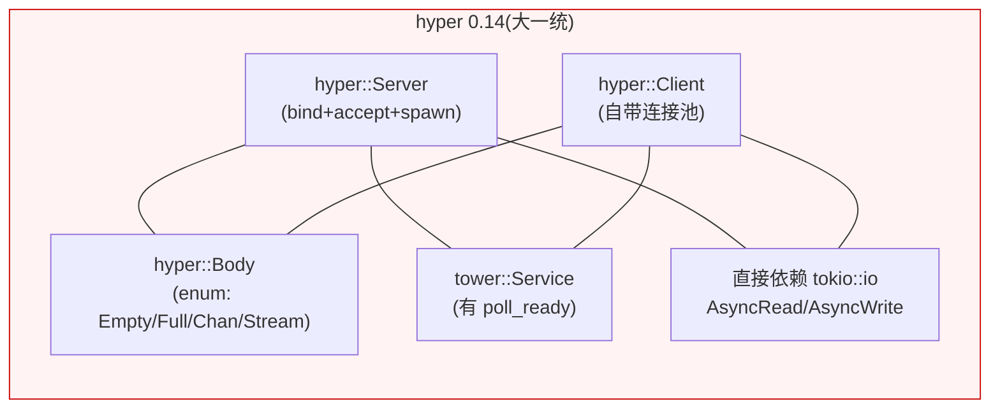
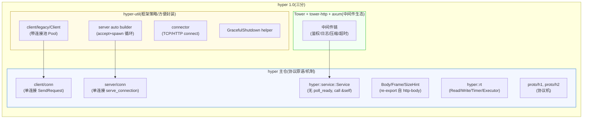
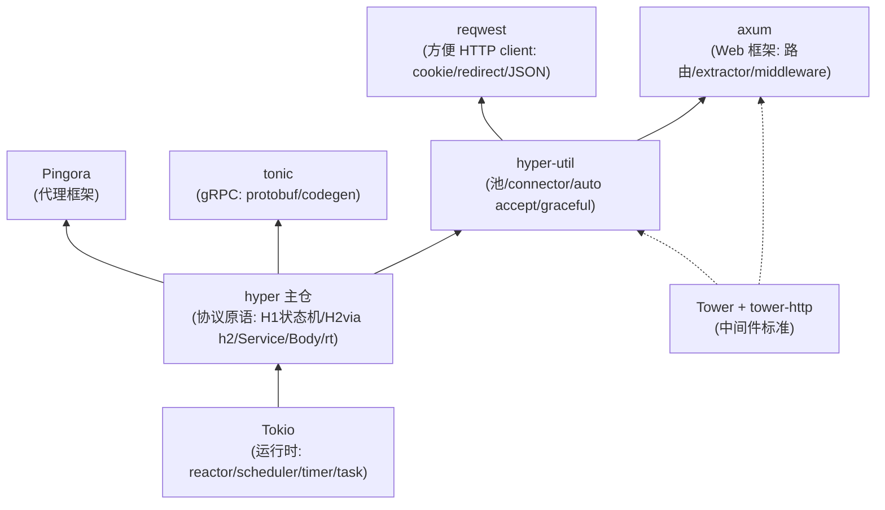

# 第 6 篇 · 第 19 章 · hyper 1.0 三分重构演进

> **核心问题**:前面 18 章我们一直在用一套"瘦"的 hyper——主仓里只有 `client/conn`(单连接)、`server/conn`(单连接)、`Service`、`Body`/`Frame` 这些**协议原语**。可如果你翻过任何一本讲 hyper 0.14 的老书、或看过两年前的博客,你会发现那时候的 `hyper::Server::bind(...).serve(...)`、`hyper::Client::new()` 是**带 accept 循环、带连接池、一把梭**的。为什么 2023 年 11 月的 hyper 1.0 要把这套"开箱即用"的大一统 API 拆散——把带连接池的 `Client` 挪到 hyper-util,把 accept 循环和 `Server` 也挪走,把 `Body` 从 `Chunk`/`Stream` 二选一推倒重做成 `Frame`-based,把 Service trait 里的 `poll_ready` 干掉,甚至连 `hyper::Client`/`hyper::Server` 这两个类型都从主仓删掉?这个"三分重构"的动机到底是什么、解决了 0.14 的什么痛点、为什么是 sound 的?以及——为什么重构之后 hyper 主仓变得"更难直接用"了,可 axum/reqwest/tonic/Pingora 却全都受益?这一章是第 6 篇的收尾,也是全书唯一一篇"演进史"章,把前面 18 章累积的所有 1.0 修正收束成一段"为什么 hyper 长成今天这个三分样子"的叙事。

> **读完本章你会明白**:
> 1. hyper 1.0 的"三分"到底切在哪——**协议原语留在 hyper 主仓(`client/conn`/`server/conn`/`Service`/`Body`/`rt`)/ 框架策略拆到 hyper-util(带连接池的 `Client`、`auto` accept builder、connector、graceful)/ 中间件生态在 Tower + tower-http + axum**,以及为什么这条线是 Unix"机制与策略分离"在 Rust 异步栈上的体现。
> 2. 每一个具体的 breaking change 的**动机**——Service 为什么删 `poll_ready`(背压归协议层)、Body 为什么重做成 `Frame`(表达 trailers)、池为什么拆走(协议 vs 策略)、accept 为什么拆走(主仓只给 `serve_connection`)、Tower 依赖为什么从主仓拿掉(不绑中间件演进)、`stream` feature 为什么删(`Stream` trait 不稳定)、为什么新造一套 `hyper::rt::{Read,Write,Timer,Executor}`(运行时中性)。每一条都配 0.14 怎么做、痛点、1.0 怎么改、CHANGELOG/源码佐证。
> 3. 为什么 1.0 的这套拆分是 **sound** 的——拆完之后各层独立演进不互相绑死、零成本抽象(用户 trait 干净到只剩一个 `call`)、可组合性最大化(axum/tonic/reqwest/Pingora 都能站在精简的 hyper 上各选生态)。
> 4. 为什么 1.0 之后 hyper 主仓"更难直接用",但更对——直接用 `hyper::client::conn` 写 client 要自己管连接池,直接用 `hyper::server::conn` 写 server 要自己写 accept 循环,这正是"协议原语库"该有的样子,而 reqwest/axum 才是"开箱即用"层。**主仓变瘦换来的是整个生态都能站在它上面。**
> 5. 这套"协议核心 / 方便封装 / 中间件生态"的分层,怎么对照 Tokio 自己的演进曲折(Tower 中间件标准化反复)、gRPC 的 filter stack 设计、Envoy 的 filter chain——它们都是同一个"机制与策略分离"思想在不同语言/生态里的投影。

> **如果一读觉得太难**:先抓三件事——① hyper 1.0 = 把"协议原语"留下、把"框架策略/方便封装"挪到 hyper-util、把"中间件"留给 Tower+axum,这叫"三分";② 每个具体改动(Service 删 `poll_ready`、Body 重做 `Frame`、池/accept 拆走、Tower 依赖拿掉)的动机都是"让协议核心和策略解耦,让协议核心可被任何上层复用";③ 拆完之后 hyper 主仓变瘦变难用,但 axum/reqwest/tonic/Pingora 全都受益——这就是"最小协议库换最大可组合性"。这三条钉住,后面每一节都是它们的逐条展开。

---

## 〇、一句话点破

> **hyper 1.0 不是"加功能",而是"减功能"——把 0.14 那个一把梭的 `Server`/`Client`/body/Service 全包的大一统,拆成三份:协议原语(每连接一个 task、HTTP/1 状态机、HTTP/2 via h2、Service、Body/Frame)留在 hyper 主仓;框架策略(带连接池的 Client、accept 循环、graceful 协调、connector)挪到 hyper-util;中间件(鉴权/日志/压缩)留给 Tower+tower-http+axum。这条线就是 Unix "机制与策略分离"在 Rust 异步栈上的落地:机制(HTTP 协议机 + 单连接抽象)只实现一次、谁都能站在上面;策略(怎么池化、怎么 accept、用什么中间件)各上层自己选。代价是 hyper 主仓变瘦变"难直接用",换来的是 axum/reqwest/tonic/Pingora 都能站在这个干净的地基上各搭各的房子。**

这是结论,不是理由。本章倒过来拆:先从 0.14 那个"大一统"的画面讲起,看清它有哪些痛点(这是 ROADMAP-1.0.md 白纸黑字列出来的);再把 1.0 的"三分"边界画出来(配两张 mermaid——0.14 大一统 vs 1.0 三分,Rust 异步 Web 栈分层);然后逐条拆每个 breaking change 的动机(每一节都是"提出问题 → 0.14 怎么做/痛点 → 所以 1.0 这么改 → CHANGELOG/源码佐证");接着讲为什么这套拆分 sound;最后两个技巧精解,把"机制与策略分离"和"Service 删 poll_ready"这两个最硬的钉死。

> **承前 18 章**:Service(P1-02)、Body/Frame(P1-04)、连接池拆 hyper-util(P4-12)、serve_connection(P5-15)——这些机制在前面的章节都已**逐个拆透**。本章不重讲它们的内部机制,只讲"**为什么 1.0 要把它们这么重新切分**"。每提到一处,指路对应的前置章节,篇幅全留"演进动机 + 每个 breaking change 的 why + 为什么 sound"。

---

## 一、起点:0.14 的"大一统"长什么样,它哪里疼

要讲清为什么 1.0 要拆,得先看清 0.14 长什么样、它的设计在哪里成了包袱。这节的素材全部来自 hyper 仓里的 `docs/ROADMAP-1.0.md`(这是 hyper 团队自己写的重构路线图,白纸黑字列了"已知问题")。

### 1.1 0.14 的一把梭画面

hyper 0.14(2020 年 12 月发布,一直到 2022 年的 0.14.19)的对外 API 是这样的:

```rust
// 简化示意,非 1.x 源码,描述 0.14 的典型用法
use hyper::{Server, Client, Body, Request, Response};

// server 侧:Server 自带 accept 循环
Server::bind(&"127.0.0.1:3000".parse().unwrap())
    .serve(MakeService::new(|req: Request<Body>| async move {
        Response::new(Body::from("hello"))
    }))
    .await;

// client 侧:Client 自带连接池
let client = Client::new();
let resp = client.get("https://hyper.rs".parse().unwrap()).await?;
```

注意三件事:

1. `Server::bind` 是一个**完整的 accept 循环**——它内部 bind 端口、loop accept、每条连接 spawn 一个 task,用户只要 `.serve(make_service)` 就完事。
2. `Client::new()` 是一个**带连接池的 client**——它内部维护按 host 分组的空闲连接池、自动建连、自动复用、自动淘汰。
3. `Body` 是一个具体的 struct(`hyper::Body`),内部用 enum 表达"Empty / Full / Chan(channel body)/ Stream"几种变体,用户 `Body::from("hello")` 一把构造。

看起来"开箱即用",对吧?这正是 0.14 受欢迎的原因——`cargo add hyper` 一行,server/client 都能跑起来。可这套"大一统"在 2021-2022 年渐渐暴露出四类痛点,逼出了 1.0 的重构。

### 1.2 痛点一:高层 Server/Client 的稳定性问题

ROADMAP-1.0.md 的"Known Issues"一节(就是重构前的"已知问题"清单)白纸黑字列着(见 `hyper/docs/ROADMAP-1.0.md`):

> **For the `hyper::Server`:**
> - The `Accept` trait is complex, and too easy to get wrong. If used with TLS, a slow TLS handshake can affect all other new connections waiting for it to finish.
> - The `MakeService<&IO>` is confusing. The bounds are an assault on the eyes.
> - The `MakeService` API doesn't allow to easily annotate the HTTP connection with `tracing`.
> - Graceful shutdown doesn't give enough control.

翻译过来:0.14 的 `Server` 那套(`Accept` trait、`MakeService`、graceful shutdown)要么太复杂(`Accept` trait 容易写错,慢 TLS 握手会拖垮所有新连接),要么签名难看到劝退(`MakeService<&IO>` 的 bounds 被形容为"an assault on the eyes"——"对眼睛的冒犯"),要么控制力不够(graceful shutdown 给不了足够的控制)。ROADMAP 甚至直接承认:

> It's more common for people to simply use `hyper::server::conn` at this point, than to bother with the `hyper::Server`.

"比起用高层 `hyper::Server`,大家更常直接用底层的 `hyper::server::conn`。"——也就是说,社区已经用脚投票,高层 `Server` 形同虚设。

高层 `Client` 也类似(同节):

> **While the `hyper::Client` is much easier to use, problems still exist:**
> - The whole `Connect` design isn't stable.
>   - ALPN and proxies can provide surprising extra configuration of connections.
> - The Pool could be made more general or composable. At the same time, more customization is desired, and it's not clear how to expose it yet.

`Connect` trait 不稳定(ALPN、proxy 带来意外的配置需求),连接池想做得更通用/可组合又想更可定制,这两者打架,怎么暴露还不清楚。

### 1.3 痛点二:运行时耦合

ROADMAP-1.0.md 的"Runtime woes"一节:

> - The `runtime` cargo-feature isn't additive
> - Built-in Tokio support can be confusing
> - Executors and Timers ... implicitly relies on Tokio's timer context. This can be quite confusing.
> - IO traits ... Should we publicly depend on Tokio's traits? ... `futures-io`? Definitely nope. Not stable.

0.14 的 hyper 直接依赖 Tokio 的 `AsyncRead`/`AsyncWrite`(在 `tokio::io` 里)、靠 `runtime` feature 隐式拉 Tokio 的 timer 上下文。这带来两个麻烦:一是 hyper 想保持"运行时中性"(理论上能在别的运行时上跑),却被焊死在 Tokio 的 IO trait 上;二是 `runtime` feature 不是加性的(non-additive),开了和不开行为不一样,这在 Rust 的 feature 设计里是个坏味道。IO trait 到底用谁的——Tokio 的?`futures-io` 的(不稳定)?未来的 std 的(设计了好几年还没落地)?hyper 的版本就被 Tokio 的版本绑着,演进不自由。

### 1.4 痛点三:Service trait 的 `poll_ready` 争议

ROADMAP-1.0.md 在"Public API → service"和附录"Unresolved Questions"里反复提了一个问题(见 `hyper/docs/ROADMAP-1.0.md` 的 L361-369):

> ### Should there be a simplified `hyper::Service` trait, or should hyper depend on `tower-service`?
> - There's still a few uncertain decisions around tower, such as if it should be changed to `async fn call`, and if `poll_ready` is the best way to handle backpressure.
> - **It's not clear that the backpressure is something needed at the `Server` boundary, thus meaning we should remove `poll_ready` from hyper.**

`poll_ready` 是 Tower 的 `Service` trait 里的一个方法(`fn poll_ready(&mut self, cx) -> Poll<Result<(), Self::Error>>`),用来表达"我这个 Service 现在准备好了吗"。它在 Tower 的设计里是给"中间件链"做背压的——下游没准备好,上游就别往下游塞。可 hyper 0.14 把这个 trait 直接搬来用在 server 边界,问题来了:**在 server 边界,背压根本不该靠 Service 的 `poll_ready` 来做**。协议机自己有一套更强的背压——HTTP/1 的 `in_flight` 单槽(一条连接同时只处理一个请求)、HTTP/2 的流控(window)、client 的 `SendRequest::poll_ready`(连接的 `want` channel)——这些协议层背压比 Service 的 `poll_ready` 强得多也准得多。让用户在 `Service` 里再写一遍 `poll_ready`,99% 的业务根本用不上,却被这个方法逼着写一个空的 `Poll::Ready(Ok(()))`,徒增噪音。这是 Tower 的 trait 和 hyper 的场景不匹配。

### 1.5 痛点四:body 表达力不够,`Stream` feature 不稳定

0.14 的 `Body` 内部是一个 enum,变体里有一种是"包一个 `Stream`"。可 `Stream` trait 在 `futures` 生态里,版本飘忽、还没进 std、不稳定。hyper 0.14 有个 `stream` feature 来开关这个能力,ROADMAP 直说:

> Remove the `stream` feature. The `Stream` trait is not stable, and we cannot depend on an unstable API.

而且 0.14 的 body 想表达 trailer(body 末尾的尾部头部,gRPC 重度依赖)非常别扭——裸 `Stream<Item = Bytes>` 根本表达不出"这一坨不是数据,是 trailer"。这是 body 抽象的根本短板。

### 1.6 这四类痛点逼出了 1.0 的"三分"

把这四类痛点摆在一起,你会发现它们指向同一个根因:**0.14 把"协议核心"和"框架策略/方便封装"揉在了一个 crate 里,导致两者互相绑死**。

- 高层 `Server`/`Client` 的稳定性问题 → 因为它们是"策略"(怎么 accept、怎么池化),可策略会随生态演进而变,绑在主仓里就拖累主仓的稳定性。
- 运行时耦合 → 因为主仓直接依赖 Tokio 的 IO trait,主仓的版本被 Tokio 绑着。
- `poll_ready` 争议 → 因为 hyper 直接复用 Tower 的 `Service`,把 Tower 为"中间件链"设计的东西用在了"协议边界"。
- body/Stream 不稳定 → 因为主仓想用一个不稳定的外部 trait(`Stream`)。

1.0 的解法一句话:**把协议核心留下,把策略和方便封装挪走,把不稳定的依赖换掉或拿掉**。这就是"三分"。

> **钉死这件事**:0.14 的四类痛点(高层 Server/Client 不稳、运行时耦合、`poll_ready` 不匹配、body/Stream 不稳)根因都是一个——**协议核心和框架策略揉在一个 crate 里互相绑死**。1.0 的"三分"就是从这个根因长出来的解法。后续每一节,都是这个根因在某个具体 API 上的展开。

---

## 二、三分的边界:hyper 主仓 / hyper-util / Tower+axum

现在把 1.0 的"三分"边界画清楚。这是全章的总图。

### 2.1 三分的三条线

| 层 | 在哪 crate | 装什么 | 给谁用 |
|---|---|---|---|
| **协议原语**(机制) | **hyper**(主仓) | HTTP 协议机(`proto/h1`、`proto/h2`)、单连接 API(`client/conn`、`server/conn`)、`Service` trait、`Body`/`Frame`(re-export 自 `http-body`)、`rt`(自己的 `Read`/`Write`/`Timer`/`Executor`) | 框架作者(axum、reqwest、tonic、Pingora 自己写连接管理时直接用 `client/conn`/`server/conn`) |
| **框架策略/方便封装** | **hyper-util** | 带连接池的 `Client`(在 `client/legacy/`)、TCP/HTTP connector、`auto` accept builder、`GracefulShutdown` helper | 应用作者(直接用,或被 reqwest/axum 包一层) |
| **中间件生态** | **Tower + tower-http + axum** | 鉴权/日志/压缩/超时等横切关注点的 Service 中间件链 | 应用作者(用 `ServiceBuilder` 把中间件包在业务 Service 外) |

注意第二层"hyper-util"里那个 `client/legacy/`——它叫 "legacy" 不是因为它要被废弃,而是 hyper 团队诚实标注:"A better pool will be designed"(会重新设计一个更好的池)。所以现在的池是"先搬过来保兼容"的版本。这种诚实标注在 hyper 源码里到处都是,是这本书反复强调的"诚实工程"风格。

### 2.2 用两张图看清:0.14 大一统 vs 1.0 三分



0.14 是一个 crate 装了所有东西:accept 循环、连接池、body、Service、IO trait,全焊在一起。



1.0 把 0.14 那坨切成三份:协议原语留主仓(蓝)、框架策略进 hyper-util(黄)、中间件留 Tower+axum(绿)。注意箭头方向——hyper-util 的池**用**主仓的 `client/conn`,hyper-util 的 auto builder**用**主仓的 `server/conn`,Tower 中间件**包**主仓的 `Service`。依赖单向流动:策略依赖机制,机制不依赖策略。

### 2.3 三分之后,Rust 异步 Web 栈长这样

这张图是本书反复用的"hyper 在 Rust 异步栈的位置"的 1.0 版——把三分之后的完整分层画出来:



(这张图里实线是"直接依赖",虚线是"中间件标准对接"。)

钉死几件事:

- **hyper 是 Tokio 之上第一层**(承 P0-01):它把 HTTP 协议机装在 Tokio 上。
- **hyper-util 是 hyper 之上"方便层"**:它用 hyper 的 `client/conn`/`server/conn` 拼出带池的 Client 和 auto accept。
- **axum/reqwest/tonic/Pingora 是应用层**:它们站在 hyper(或 hyper-util)之上,各加各的东西(axum 加路由/extractor,reqwest 加 cookie/redirect,tonic 加 protobuf/codegen,Pingora 加代理逻辑)。
- **Tower 是横切的中间件标准**:它不"在"哪一层,而是给 Service 链提供 combinator,被 axum/hyper-util 都用。

> **钉死这件事**:1.0 的"三分"让 Rust 异步 Web 栈的分层变得**干净且单向**——Tokio → hyper(协议原语)→ hyper-util(方便封装)→ axum/reqwest/tonic/Pingora(应用),中间件标准 Tower 横切。每一层只依赖下一层,没有循环、没有跨层。这个干净的分层是 1.0 拆分换来的最大红利。

### 2.4 这条线为什么是"机制与策略分离"

把"协议原语/框架策略/中间件"这三条线,套到 Unix 那个老而弥坚的设计原则上——**机制与策略分离**(mechanism vs policy):

- **机制**(mechanism):"怎么做"——怎么把 HTTP 字节切成请求、怎么把响应编回字节、怎么在一条连接上跑协议机循环。这些是**固定的、实现一次就够的**。
- **策略**(policy):"做什么、什么时候做"——用哪个连接池策略(LRU?随机?按 host 分?)、accept 循环怎么写(每连接一个 task?线程池?io_uring?)、用什么中间件(压缩?鉴权?限流?)、连接超时设多少。这些是**会随应用场景变化的**。

Unix 内核的设计哲学就是:内核只提供机制(系统调用、文件抽象、进程抽象),策略交给用户态(各种 shell、调度器、init 系统)。hyper 1.0 干的是同一件事:**hyper 主仓只提供"HTTP 协议机 + 单连接"这个机制,策略(池化、accept、中间件)交给 hyper-util/Tower/axum**。

> **对照 Tokio 自己**:Tokio 也是这么干的——它只给"运行时机制"(reactor/scheduler/timer/task),不给"应用层策略"(不给 HTTP、不给 RPC,这些全留给 hyper/tonic)。hyper 在 Tokio 之上做的,正是 Tokio 在 std 之上做的同一件事:机制层往上一节。所以"hyper 协议原语 / hyper-util 策略"和"Tokio 运行时 / hyper 协议"是同一个分层思想的两次投影。

> **对照《gRPC》**:gRPC 的 C++ core 也走了类似的路线——core 只给"一条 channel 上发 RPC 的核心机制",各语言 wrapper(grpc-python、grpc-java)再加策略(负载均衡、拦截器、连接管理)。不过 gRPC 把负载均衡、拦截器这些**塞回了 core**(在 core 里有 filter stack/LB policy),而 hyper 把它们**整个挪出了主仓**。hyper 的拆法更激进,代价是主仓更难直接用,收益是策略层完全自由。这个取舍差异,后面"对照"小节再展开。

---

## 三、逐条拆:每个 breaking change 的动机

三分的总图清楚了。现在逐条拆每一个具体的 breaking change。每一条都按"提出问题 → 0.14 怎么做/痛点 → 所以 1.0 这么改 → CHANGELOG/源码佐证"四段式走。这节的每一条,都是前面某个章节拆透了的机制(P1-02 Service、P1-04 Body、P4-12 池、P5-15 serve_connection),这里只讲"为什么 1.0 这么改",不重讲机制内部。

### 3.1 Service trait:删 `poll_ready`,`call` 从 `&mut self` 改成 `&self`

**提出问题**:用户写一个 hyper server,要 impl 一个 Service trait。这个 trait 该长什么样?它该不该有 `poll_ready`?`call` 该拿 `&self` 还是 `&mut self`?

**0.14 怎么做/痛点**:0.14 直接复用 Tower 的 `tower_service::Service`,长这样(简化示意):

```rust
// 简化示意,描述 Tower 的 Service(0.14 hyper 用的是这个)
trait Service<Request> {
    type Response;
    type Error;
    type Future: Future<Output = Result<Self::Response, Self::Error>>;
    fn poll_ready(&mut self, cx: &mut Context<'_>) -> Poll<Result<(), Self::Error>>;
    fn call(&mut self, req: Request) -> Self::Future;
}
```

`poll_ready` 是给中间件链做背压用的——下游没准备好(`Pending`),上游就别调 `call`。可 hyper 把这个 trait 用在 server 边界,问题来了:**server 边界根本不需要 Service 层面的 `poll_ready` 做背压**。

为什么不需要?因为协议机自己有更强的背压:

- **HTTP/1 server**:`proto/h1` 的 dispatcher 用 `in_flight` 单槽——一条连接同时只处理一个请求,上一个请求的响应没写完,下一个请求的字节就算到了也先压在 buffer 里。这是协议层背压,根本轮不到 Service 的 `poll_ready` 发言。
- **HTTP/2 server**:`proto/h2` 用 h2 的流控(window)——对端发太快、stream window 满了,h2 自动给对端发 WINDOW_UPDATE 之前就不读。这是 h2 给的背压,Service 层的 `poll_ready` 多此一举。
- **client 侧**:`SendRequest` 有自己的 `poll_ready`(在 `client/dispatch.rs`,走 `want::Giver`/`want::Taker` channel)——连接满了、in-flight 槽位占用,`SendRequest::poll_ready` 返回 `Pending`。这是连接级背压,精确到一条连接。

> **不这样会怎样**:如果靠 Service 的 `poll_ready` 做背压,那用户得在 `poll_ready` 里自己实现"我下游的数据库连接池满了所以我现在不 ready"——可这件事和"HTTP 协议机该不该往我这个 Service 喂请求"是两回事。协议机该不该喂,看协议层(in_flight 槽满没满、window 用没用完);下游业务 ready 不 ready,是业务自己的事,不该污染 hyper 的 trait。把 `poll_ready` 留在 Service 里,等于逼 99% 的业务写一个空的 `Poll::Ready(Ok(()))`,徒增噪音,还误导(让人以为 hyper 靠它做背压)。

ROADMAP-1.0.md 在附录里把这个争议讲得很直白(L361-369):

> - It's not clear that the backpressure is something needed at the `Server` boundary, thus meaning we should remove `poll_ready` from hyper.

"server 边界到底需不需要背压,不清楚;所以也许我们应该从 hyper 删掉 `poll_ready`。"

**所以 1.0 这么改**:hyper 1.0 自己 vendor 了一个简化的 `Service` trait(不再依赖 `tower-service`),把 `poll_ready` 整个删掉,`call` 从 `&mut self` 改成 `&self`。看真实源码 [`hyper/src/service/service.rs#L32-L57`](../hyper/src/service/service.rs#L32-L57):

```rust
pub trait Service<Request> {
    /// Responses given by the service.
    type Response;

    /// Errors produced by the service.
    type Error;

    /// The future response value.
    type Future: Future<Output = Result<Self::Response, Self::Error>>;

    /// Process the request and return the response asynchronously.
    /// `call` takes `&self` instead of `mut &self` because:
    /// - It prepares the way for async fn,
    ///   since then the future only borrows `&self`, and thus a Service can concurrently handle
    ///   multiple outstanding requests at once.
    /// - It's clearer that Services can likely be cloned.
    /// - To share state across clones, you generally need `Arc<Mutex<_>>`
    ///   That means you're not really using the `&mut self` and could do with a `&self`.
    ///   The discussion on this is here: <https://github.com/hyperium/hyper/issues/3040>
    fn call(&self, req: Request) -> Self::Future;
}
```

注意三件事:

1. **没有 `poll_ready`**——整个 trait 只剩一个方法 `call`。用户的业务 trait 干净到只有"处理请求"这一件事。
2. **`call` 拿 `&self` 不是 `&mut self`**——源码注释解释了三个理由:① 为 `async fn in trait` 铺路(async fn 的 future 只借 `&self`,所以一个 Service 能并发处理多个在途请求);② 暗示 Service 可以被 clone;③ 要在多个 clone 间共享状态就用 `Arc<Mutex<_>>`,这时候 `&mut self` 本来就是假的(你拿到 `&mut` 也得内部往 `Arc<Mutex>` 里塞)。
3. **背压挪到协议层**——`in_flight` 单槽、h2 流控、`SendRequest::poll_ready`,这些协议层背压(P2-05、P3-11、P4-13 拆透)接管了原来 `poll_ready` 想做的事,而且做得更准。

**源码/CHANGELOG 佐证**:这条改动在 CHANGELOG 的 v1.0.0-rc.1(2022-10-25)落地,对应 commit `fee7d361`(PR #2920,"create own `Service` trait"),breaking change 文案是:

> Change any manual `impl tower::Service` to implement `hyper::service::Service` instead. The `poll_ready` method has been removed.

`call` 从 `&mut self` 改成 `&self` 在 v1.0.0-rc.4(2023-07-10),commit `d894439e`(PR #3223,"change Service::call to take &self"),breaking change文案:

> The Service::call function no longer takes a mutable reference to self. The FnMut trait bound on the service::util::service_fn function and the trait bound on the impl for the ServiceFn struct were changed from FnMut to Fn.

> **钉死这件事**:hyper 1.0 的 `Service` trait = Tower 的 `Service` **减去 `poll_ready`,加上 `call(&self)`**。删 `poll_ready` 是因为 server 边界的背压由协议层(in_flight/流控/SendRequest)做,不污染用户 trait;`call(&self)` 是为了一个 Service 能并发处理多个请求(为 async fn 铺路、暗示可 clone、和 `Arc<Mutex>` 共享状态一致)。这是 1.0 拆分里"用户 trait 干净到只剩一个 call"的源头。机制内部(`service_fn`、`HttpService` sealed trait alias)在 P1-02 拆透,本章只钉"为什么这么改"。

### 3.2 Body:从 `Chunk`/`Stream` 二选一,重做成 `Frame`-based

**提出问题**:HTTP 的 body 该怎么抽象?它是一段字节?一个流?还是别的?

**0.14 怎么做/痛点**:0.14 的 `hyper::Body` 是一个 enum,内部变体有 `Empty`、`Full`(一次性给全)、`Chan`(channel body,生产者消费者)、`Stream`(包一个 `futures::Stream<Item = Bytes>`)。看起来够用,可一旦碰到 **trailers**(body 末尾的尾部头部)就撞墙——裸 `Stream<Item = Bytes>` 只能流出数据字节,**表达不出"这一坨是 trailer 不是 data"**。gRPC 重度依赖 trailer(放最终状态码),所以 gRPC 在 hyper 上的 body 处理一直很别扭。

而且 0.14 有个 `stream` feature 开关 `Stream` 能力,可 `Stream` trait 在 `futures` 生态里不稳定(版本飘、没进 std)。ROADMAP 直说:

> Remove the `stream` feature. The `Stream` trait is not stable, and we cannot depend on an unstable API.

**所以 1.0 这么改**:1.0 把 body 抽象整个推倒重做,四件事一起干:

1. **把 `Body` 从一个具体 struct 改成一个 trait**(定义提到独立的 `http-body` crate,hyper re-export)。这个 trait 的核心方法是 `poll_frame`,产出的不是裸 `Item`,而是 `Frame<Self::Data>`——一个能区分"data 帧"和"trailers 帧"的类型。
2. **`hyper::Body` 这个具体 struct 改名 `Incoming`**——它是 hyper 收 body 时用的具体类型(server 收请求体、client 收响应体),内部按 HTTP/1 还是 HTTP/2 分两套实现(`Chan`/`H2`)。
3. **发 body 不再由 hyper 主仓给具体类型**——要发 `Full`/`Empty`/`Combinators`,去 `http-body-util` crate(它提供 `Full`、`Empty`、`BoxBody`、`BodyExt` 这些工具)。
4. **删 `stream` feature**——不再依赖不稳定的 `Stream` trait。

看 hyper 主仓怎么 re-export 的 [`hyper/src/body/mod.rs#L22-L27`](../hyper/src/body/mod.rs#L22-L27):

```rust
pub use bytes::{Buf, Bytes};
pub use http_body::Body;
pub use http_body::Frame;
pub use http_body::SizeHint;

pub use self::incoming::Incoming;
```

注意:`Body`/`Frame`/`SizeHint` **全从 `http-body` crate re-export**,hyper 主仓自己不定义这三个 trait/类型。hyper 主仓只定义一个具体 body 类型——`Incoming`(收 body 用的)。发 body 的工具(`Full`、`Empty`)在 `http-body-util`,不在主仓。

新的 `Body` trait 长这样(在 `http-body` crate,不在 hyper 仓;简化示意):

```rust
// 在 http-body crate(外部依赖,不在 hyper 仓),hyper 通过 pub use 复用
pub trait Body {
    type Data;
    type Error;
    fn poll_frame(
        self: Pin<&mut Self>,
        cx: &mut Context<'_>,
    ) -> Poll<Option<Result<Frame<Self::Data>, Self::Error>>>;
    fn is_end_stream(&self) -> bool { /* 默认实现 */ }
    fn size_hint(&self) -> SizeHint { /* 默认实现 */ }
}
```

`Frame<T>` 是个能区分帧类型的枚举(简化示意):

```rust
// 在 http-body crate(外部依赖,不在 hyper 仓)
pub struct Frame<T> { /* 内部是 Data(T) | Trailers(HeaderMap) | ... */ }
```

这一改,body 既能流式(继承 `Stream` 的 poll 模型),又能在末尾带 trailer(`Frame` 能是 `Trailers`),还能给协议机长度提示(`size_hint`,协议机写头部时要问 body 多长)。三个需求一个 trait 搞定。

**源码/CHANGELOG 佐证**:这条改动分两个 commit 在 rc.1 落地:

- `Body` struct 改名 `Incoming`:commit `95a153bb`(PR #3022,"rename `Body` struct to `Incoming`")。
- `HttpBody` trait 改用 `Frame`:commit `0888623d`(PR #3020,"update `HttpBody` trait to use `Frame`s"),breaking change 文案:

  > The polling functions of the `Body` trait have been redesigned. The free functions `hyper::body::to_bytes` and `aggregate` have been removed. Similar functionality is on `http_body_util::BodyExt::collect`.

- `stream` feature 删除:commit `ce72f734`(PR #2896,"remove `stream` cargo feature")。

> **钉死这件事**:hyper 1.0 的 body 重做 = `Body` 从一个 struct 变成一个 trait(`poll_frame` 出 `Frame`),具体收 body 类型改名 `Incoming`,发 body 的工具(`Full`/`Empty`)挪到 `http-body-util`,`stream` feature 删掉。动机是 body 除了 data 还有 trailers,裸 `Stream<Item=Bytes>` 表达不了;`Stream` trait 不稳定,不能依赖。机制内部(`Incoming` 的 `Chan`/`H2` 三套、`DecodedLength`、`Frame` 怎么和协议机对接)在 P1-04 拆透,本章只钉"为什么这么改"。

### 3.3 带连接池的 `Client` 拆到 hyper-util

**提出问题**:HTTP client 要不要自带连接池?如果带,它该在哪个 crate?

**0.14 怎么做/痛点**:0.14 的 `hyper::Client::new()` 自带连接池——按 host 分组、自动建连、自动复用 keep-alive、自动淘汰。看起来方便,可 ROADMAP 列了一堆问题:

> - The whole `Connect` design isn't stable. ALPN and proxies can provide surprising extra configuration of connections.
> - The Pool could be made more general or composable. At the same time, more customization is desired, and it's not clear how to expose it yet.

`Connect` trait 不稳定(ALPN、proxy 带来意外配置),池想更通用又想更可定制,两者打架,怎么暴露还不清楚。最关键的是——**连接池是"策略"**(用 LRU 还是随机?超时设多少?HTTP/2 开几条连接?),策略会随应用场景变。把它焊在主仓里,主仓的版本就被这些策略的演进绑死了。

**所以 1.0 这么改**:1.0 把 `hyper::Client`(带连接池的那个)**整个从主仓删掉**,挪到 hyper-util crate 的 `client/legacy/`(标 legacy,诚实说"会设计更好的池")。hyper 主仓的 `client/` 只剩"单连接发请求收响应"的 `client/conn/`。

看 hyper 主仓的 `client/mod.rs` 全文 [`hyper/src/client/mod.rs#L1-L13`](../hyper/src/client/mod.rs#L1-L13):

```rust
//! HTTP Client.
//!
//! hyper provides HTTP over a single connection. See the [`conn`] module.
//!
//! ## Examples
//!
//! * [`client`] - A simple CLI http client ...
//! * [`client_json`] - A simple program that GETs some json ...

#[cfg(test)]
mod tests;

cfg_feature! {
    #![any(feature = "http1", feature = "http2")]

    pub mod conn;
    pub(super) mod dispatch;
}
```

第一行文档就钉死了:**"hyper provides HTTP over a single connection."**(hyper 只提供"在单条连接上跑 HTTP"。)没有 `Client`、没有 `Pool`、没有连接池。`client/` 模块只暴露 `conn` 子模块(单连接)和 `dispatch`(连接级背压的 channel,池能用它的接口)。

`client/conn/mod.rs` 的文档进一步把读者往外指(见 [`hyper/src/client/conn/mod.rs#L1-L14`](../hyper/src/client/conn/mod.rs#L1-L14)):

```rust
//! Lower-level client connection API.
//!
//! The types in this module are to provide a lower-level API based around a
//! single connection. Connecting to a host, pooling connections, and the like
//! are not handled at this level. This module provides the building blocks to
//! customize those things externally.
//!
//! If you are looking for a convenient HTTP client, then you may wish to
//! consider [reqwest] ... or [`hyper-util`'s client] ...
```

"连接主机、池化连接这些事,不在这个层级处理。要方便的 client,去 reqwest 或 hyper-util。"——hyper 主仓主动把"方便 client"的职责让出去了。

那带连接池的 Client 在哪?在 **hyper-util crate 的 `src/client/legacy/`**(`client.rs`、`pool.rs`、`connect/`)。它实现 `tower_service::Service<Request<B>>`,内部用 `Pool<...>` 管理按 host 分组的空闲连接,来请求时 checkout 空闲连接或建新连接。具体的池机制(`Poolable::reserve()`、HTTP/1 独占 vs HTTP/2 共享、`Checkout`/`Connecting` 赛跑、`IdleTask` 清扫)在 P4-12 已逐行拆透,本章不重讲,只钉"为什么挪走"。

**源码/CHANGELOG 佐证**:

- 删高层 `hyper::Client`:commit `bb3af17c`(PR #2941,"remove higher-level `hyper::Client`"),breaking change 文案:"A pooling client is in the hyper-util crate."
- 删 `client::connect` 模块:commit `5e206883`(PR #2949,"remove `client::connect` module"),文案:"Use `connect` from `hyper-util`."
- 删 `client::conn::{SendRequest, Connection}`(版本无关的版本无关实现):commit `8ae73cac`(PR #2987),改成 `client::conn::http1`/`http2` 子模块(commit `509672aa`,PR #2906)。

> **钉死这件事**:hyper 1.0 主仓的 `client/` **没有连接池、没有带连接池的 `Client`**。主仓只给"一条已经建好的连接上怎么跑 HTTP"(`client/conn/http1`/`http2` 的 `SendRequest`/`Connection`)。**带连接池的 Client 在 hyper-util crate 的 `client/legacy/`**(标 legacy,诚实说会重新设计)。动机:连接池是策略,策略会演进,不该绑死协议核心。机制内部(`Poolable::reserve`、HTTP/1 独占 vs HTTP/2 共享、checkout-connect 赛跑)在 P4-12 拆透,本章只钉"为什么挪走"。

### 3.4 accept 循环拆走:主仓只剩 `serve_connection`

**提出问题**:HTTP server 要不要自带 accept 循环?如果带,它该在哪个 crate?

**0.14 怎么做/痛点**:0.14 的 `hyper::Server::bind(&addr).serve(make_service)` 是一个完整的 accept 循环——内部 bind、loop accept、每条连接 spawn 一个 task。看起来方便,可 ROADMAP 列了一堆 server 侧的稳定性问题(`Accept` trait 容易写错、`MakeService<&IO>` bounds 难看、graceful shutdown 控制不够),还直接承认:

> It's more common for people to simply use `hyper::server::conn` at this point, than to bother with the `hyper::Server`.

"比起高层 `Server`,大家更常直接用 `server::conn`。"——也就是说高层 `Server` 形同虚设,大家早就绕过它用底层了。这种"高层没人用还拖着主仓稳定性"的局面,正是拆分的信号。

**所以 1.0 这么改**:1.0 把高层 `Server`(包括 `Builder`、`Accept` trait、`AddrStream`)**整个从主仓删掉**。hyper 主仓的 `server/` 只剩一个子模块 `conn`,里面只有 `http1` 和 `http2` 两个连接级 builder,核心 API 是 `Builder::serve_connection(io, service)`——它把"一条 io + 一个 Service"包成一个 `Connection` Future,跑到连接结束。

看 hyper 主仓 `server/mod.rs` 全文 [`hyper/src/server/mod.rs#L1-L10`](../hyper/src/server/mod.rs#L1-L10):

```rust
//! HTTP Server.
//!
//! A "server" is usually created by listening on a port for new connections,
//! parse HTTP requests, and hand them off to a `Service`.
//!
//! How exactly you choose to listen for connections is not something hyper
//! concerns itself with. After you have a connection, you can handle HTTP over
//! it with the types in the [`conn`] module.
pub mod conn;
```

中间那句是全书 server 侧的核心钉子:**"How exactly you choose to listen for connections is not something hyper concerns itself with."**(怎么听端口、怎么 accept,hyper 不管。)整个 `server/` 模块就 10 行,只暴露 `conn` 子模块。没有 `Server`、没有 `Listener`、没有 accept 循环。

那 accept 循环在哪?在 **hyper-util crate 的 `server/conn/auto`**(auto builder,自动 H1/H2 协商 + accept 循环),或 **axum 自己的 `serve`**(axum 0.7+ 不依赖 hyper-util 的 auto builder,自带 accept 循环),或**用户代码**(`hello.rs` 官方例子的模板:`TcpListener::bind` → loop { `accept().await` → `tokio::spawn(serve_connection(io, svc))` })。这三条路都在 hyper 主仓之外。

为什么这么拆?和池一样——**accept 循环是策略**(每连接一个 task?线程池?io_uring?怎么 graceful?怎么 trace 注解?),策略会演进,不该绑死协议核心。hyper 主仓只给"一条连接上跑协议机"这个机制(`serve_connection`),怎么 accept、怎么 spawn,交给上层。

**源码/CHANGELOG 佐证**:

- 删高层 `Server`:commit `3c7bef3b`(PR #2932,"remove the high-level Server API")。
- 删 `AddrStream`:commit `e9cab49e`(PR #2869,"remove `AddrStream` struct"),ROADMAP 说它"provides no value but causes binary bloat"(没用还增二进制体积)。
- 删 `server::conn::{Http, Connection}`(版本无关的),改成 `server::conn::http1`/`http2` 子模块:commit `0766d3f7`(PR #3013)+ `fc4d3356`(PR #3011)。

> **钉死这件事**:hyper 1.0 主仓的 `server/` **没有 accept 循环、没有高层 `Server`**。主仓只给"一条连接上跑协议机"的 `serve_connection(io, service) -> Connection Future`。accept 循环 + 每连接 spawn 在 hyper-util(auto builder)/ axum(`serve`)/ 用户代码。`server/mod.rs` 文档白纸黑字"hyper 不管你怎么听端口"。动机:accept 循环是策略,策略会演进,不该绑死协议核心。机制内部(H1 `Dispatcher` vs H2 `Server` Future、`HttpService` sealed trait、auto 协议选择为什么在外部)在 P5-15 拆透,本章只钉"为什么挪走"。

### 3.5 graceful shutdown 协调拆走:主仓只留单连接 `graceful_shutdown`

**提出问题**:server 要优雅关闭(等在途请求处理完再退),这个协调逻辑该在哪?

**0.14 怎么做/痛点**:0.14 的 `Server::bind(...).serve(...).with_graceful_shutdown(signal)` 把"收 shutdown 信号 + 给所有在途连接发停 + 等它们都退"这套协调焊在高层 `Server` 里。可 ROADMAP 说"Graceful shutdown doesn't give enough control"——控制力不够,因为协调逻辑和 accept 循环、连接生命周期绑死在 `Server` 里,用户想自己定"怎么算退完""超时怎么办"很难插手。

**所以 1.0 这么改**:1.0 把这套协调**拆成两层**:

- **单连接层(主仓)**:`Connection::graceful_shutdown()`——hyper 主仓的 `serve_connection` 返回的 `Connection` 结构有一个 `graceful_shutdown` 方法,调了之后这条连接"不再接受新请求,但把在途请求处理完才结束"。这是**单连接**的优雅关闭。
- **协调层(外部)**:"收 shutdown 信号 + 给每条在途连接发 `graceful_shutdown` + 等都退"这套协调,在 **hyper-util 的 `GracefulShutdown` helper**(ROADMAP 明说"A `GracefulShutdown` helper is provided ... with better control"),或 **axum 的 `serve(...).with_graceful_shutdown(signal)`**(axum 自己拼 Signal + serve_connection)。

为什么这么拆?因为"协调多连接关闭"是策略(等所有连接?还是超时强杀?怎么收信号?Signal 还是 watch channel?),策略该在上层。主仓只给单连接的 `graceful_shutdown`,让上层自己拼协调。

> **钉死这件事**:graceful shutdown 在 1.0 被拆成两层——单连接 `Connection::graceful_shutdown()` 在主仓,多连接协调在 hyper-util(`GracefulShutdown` helper)或 axum(`with_graceful_shutdown`)。动机:协调多连接关闭是策略,该在上层拼。机制内部(`Connection::graceful_shutdown` 怎么和 H1 `KA` 状态机/H2 GOAWAY 配合)在 P5-16 拆透。

### 3.6 Tower 依赖从主仓拿掉,中间件归生态

**提出问题**:hyper 主仓要不要依赖 Tower(中间件标准)?Service trait 用 Tower 的还是自己的?

**0.14 怎么做/痛点**:0.14 的 hyper 直接依赖 `tower-service`,用 Tower 的 `Service` trait(带 `poll_ready`)。前面 3.1 讲了 `poll_ready` 不匹配 server 边界。更大的问题是——**一旦主仓依赖 Tower,主仓的版本就被 Tower 的版本绑死**。Tower 自己在演进(`async fn in trait` 要不要改?`poll_ready` 要不要换?),hyper 主仓跟着 Tower 的每次 breaking change 都得跟。

**所以 1.0 这么改**:1.0 把 Tower 依赖**从主仓整个拿掉**。看 hyper 主仓的 `Cargo.toml` [`hyper/Cargo.toml#L22-L42`](../hyper/Cargo.toml#L22-L42) 的 `[dependencies]` 段:

```toml
[dependencies]
bytes = "1.2"
http = "1"
http-body = "1"
tokio = { version = "1", features = ["sync"] }

# Optional
atomic-waker = { version = "1.1.2", optional = true }
futures-channel = { version = "0.3", optional = true }
futures-core = { version = "0.3.31", optional = true }
futures-util = { version = "0.3", default-features = false, features = ["alloc"], optional = true }
h2 = { version = "0.4.14", optional = true }
http-body-util = { version = "0.1", optional = true }
httparse = { version = "1.9", optional = true }
httpdate = { version = "1.0", optional = true }
itoa = { version = "1", optional = true }
pin-project-lite = { version = "0.2.4", optional = true }
smallvec = { version = "1.12", features = ["const_generics", "const_new"], optional = true }
tracing = { version = "0.1", default-features = false, features = ["std"], optional = true }
want = { version = "0.3", optional = true }
```

翻遍这个列表——**没有 `tower`、没有 `tower-service`**。hyper 主仓完全不依赖 Tower。主仓自己 vendor 了一个简化的 `Service` trait(3.1 拆过,无 `poll_ready`、`call(&self)`)。

那中间件(鉴权/日志/压缩/超时)在哪?在 **Tower + tower-http + axum** 这些外部 crate。它们定义自己的中间件 combinator,包在用户业务 Service 外面。hyper 主仓的 `Service` 和 Tower 的 `Service` 之间怎么对接?hyper-util 提供**桥接**(在 `hyper_util::service`,把 hyper `Service` 转成 Tower `Service` 或反过来)。这样 hyper 主仓不绑 Tower 版本,Tower 自己怎么演进都不影响 hyper 主仓。

**源码/CHANGELOG 佐证**:这条改动和 3.1 的"create own Service trait"是同一个 commit(`fee7d361`,rc.1)。breaking change 文案明确:

> Change any manual `impl tower::Service` to implement `hyper::service::Service` instead.

主仓 Cargo.toml 不列 tower/tower-service 是直接证据(见上)。

> **钉死这件事**:hyper 1.0 主仓的 `Cargo.toml` **不依赖 tower/tower-service**。主仓自己 vendor 了一个简化 `Service`(无 `poll_ready`),中间件生态在 Tower+tower-http+axum,hyper-util 提供桥接。动机:不让 Tower 的演进绑死 hyper 主仓的版本。机制内部(中间件链怎么 combinator、`ServiceBuilder` 怎么用)在 P1-03 拆透。

### 3.7 新造 `hyper::rt::{Read,Write,Timer,Executor}`:运行时中性

**提出问题**:hyper 主仓的 IO 该用哪个 trait?Tokio 的 `AsyncRead`/`AsyncWrite`?`futures-io` 的?未来的 std 的?

**0.14 怎么做/痛点**:0.14 直接公开依赖 `tokio::io::{AsyncRead, AsyncWrite}`。ROADMAP 在"Runtime woes"和附录"Should there be `hyper::io` traits?"里反复纠结(见 ROADMAP-1.0.md):

> - Should we publicly depend on Tokio's traits?
> - `futures-io`? Definitely nope. Not stable. (0.3?)
> - Eventual `std` traits? They've been in design for years. We cannot base our schedule on them.
> - Define our own traits, provide util wrappers?

公开依赖 Tokio 的 trait,就把 hyper 的版本焊死在 Tokio 版本上(Tokio 升 hyper 就得跟);依赖 `futures-io`,它不稳定;等 std 的 trait,设计了好几年没落地。这条路看起来只有一条:自己定义 IO trait,在 hyper-util 里提供 Tokio 的 wrapper。

**所以 1.0 这么改**:1.0 在主仓的 `rt/` 模块新造了一套自己的 trait:`Read`、`Write`、`Timer`、`Executor`。看 `hyper/src/rt/` 目录:`io.rs`(`Read`/`Write`/`ReadBuf`/`ReadBufCursor`)、`timer.rs`(`Timer`/`Sleep`/`sleep`)、`bounds.rs`(sealed trait bounds,给 H2 连接 exec 用)、`mod.rs`。

看 `rt/io.rs` 里 `Read` trait 的文档 [`hyper/src/rt/io.rs#L25-L33`](../hyper/src/rt/io.rs#L25-L33):

```rust
/// Reads bytes from a source.
///
/// This trait is similar to `std::io::Read`, but supports asynchronous reads.
///
/// # Implementing `Read`
///
/// Implementations should read data into the provided [`ReadBufCursor`] and
/// and safest approach is to use [`ReadBufCursor::put_slice`]:
```

注意第一句:"This trait is similar to `std::io::Read`, but supports asynchronous reads."——hyper 自己定义了一个"长得像 std::io::Read 但异步"的 trait。它不依赖 Tokio 的 `AsyncRead`,也不依赖 `futures-io`,是 hyper 自己的。

那 Tokio 的 `TcpStream` 怎么接到 hyper?在 **hyper-util 的 `TokioIo` adapter**——一个 wrapper,把 `tokio::net::TcpStream`(impl `tokio::io::AsyncRead`/`AsyncWrite`)包一层,让它 impl `hyper::rt::{Read,Write}`。hyper 主仓不直接认 Tokio,但通过 hyper-util 的 adapter 无缝接上。

> **承接《Tokio》**:hyper 的 `rt::{Read,Write}` 在签名上和 Tokio 的 `AsyncRead`/`AsyncWrite` 几乎一样(都是 `poll_read`/`poll_write` + `ReadBuf`),底层语义全承《Tokio》的 poll/Waker/Pin 模型。本书不重讲 poll 机制,只钉"为什么 hyper 不直接用 Tokio 的 trait"——为了运行时中性、不被 Tokio 版本绑死。

**源码/CHANGELOG 佐证**:这条改动在 v1.0.0-rc.4 落地,commit `f9f65b7a`(PR #3230,"replace IO traits with `hyper::rt` ones"),breaking change 文案:

> Any IO transport type provided must now implement `hyper::rt::{Read, Write}` instead of `tokio::io` traits. You can grab a helper type from `hyper-util` to wrap Tokio types, or implement the traits yourself, if it's a custom type.

`Timer` trait 在 rc.1 加(commit `fae97ced`,PR #2974)。`Executor` trait 一直在。

> **钉死这件事**:hyper 1.0 主仓新造了 `rt::{Read,Write,Timer,Executor}`,不公开依赖 Tokio 的 IO trait。Tokio 的 `TcpStream` 通过 hyper-util 的 `TokioIo` adapter 接入。动机:运行时中性、不被 Tokio 版本绑死(为未来可能的 std 异步 IO trait、或别的运行时留路)。机制内部(`Read`/`Write` 的 `ReadBufCursor` 怎么安全、`Timer`/`Sleep` 怎么和 tokio::time 桥)在 P6-18 拆透。

### 3.8 `http1`/`http2` 子模块分版本,为 HTTP/3 留路

**提出问题**:连接类型该不该按 HTTP 版本分?一个 `Connection` 类型包打 H1/H2/H3 行不行?

**0.14 怎么做/痛点**:0.14 的 `client::conn::{SendRequest, Connection}` 和 `server::conn::{Http, Connection}` 是**版本无关的**——它泛型接受一个 `AsyncRead + AsyncWrite` 的 transport,内部按 ALPN 或嗅探决定跑 H1 还是 H2。看起来"一个类型包打天下",可 ROADMAP 的"Forwards-compatibility"一节点出了死穴:

> New HTTP versions ... HTTP/3 will require a new transport abstraction. It's not as simple as just using some `impl AsyncRead + AsyncWrite`. While HTTP/2 bundled the concept of stream creation internally ... HTTP/3 is different. Stream creation is shifted to the QUIC protocol ...
> This means the existing `Connection` types for both client and server will not be able to accept a QUIC transport so we can add HTTP/3 support.

HTTP/3 不跑在 `AsyncRead + AsyncWrite` 上(它跑在 QUIC 上,QUIC 自己管 stream 创建),所以版本无关的 `Connection` 类型**根本接不了 HTTP/3**。这是个前向兼容的死穴——如果不改,等 HTTP/3 来了就得 hyper 2.0。

**所以 1.0 这么改**:1.0 把连接类型**按版本分**:

- `client::conn::http1::{SendRequest, Connection, Builder}`
- `client::conn::http2::{SendRequest, Connection, Builder}`
- `server::conn::http1::{Builder}`(其 `serve_connection` 返回 `Connection`)
- `server::conn::http2::{Builder}`(其 `serve_connection` 返回 `Connection`)

每个版本一个模块,类型不共用。将来加 HTTP/3,就开 `client::conn::http3`/`server::conn::http3`,不影响现有的 http1/http2。一个"自动协商版本"的 wrapper 类型放在 hyper-util(叫 `auto`),不在主仓。

ROADMAP 的"Split per HTTP version"小节明说(见 ROADMAP-1.0.md):

> The existing `Connection` types ... abstract over HTTP version by requiring a generic `AsyncRead + AsyncWrite` transport type. But as we figure out HTTP/3, that needs to change. So to prepare now, the `Connection` types will be split up.
> For example, there will now be `hyper::server::conn::http1::Connection` and `hyper::server::conn::http2::Connection` types.

**源码/CHANGELOG 佐证**:

- client 分版本:commit `509672aa`(PR #2906,"introduce version-specific client modules"),rc.1。
- server 分版本:commit `fc4d3356`(PR #3011,"`server::conn::http1` and `server::conn::http2` modules"),rc.1。
- 删版本无关的 `server::conn::{Http, Connection}`:commit `0766d3f7`(PR #3013)。
- 删版本无关的 `client::conn::{SendRequest, Connection}`:commit `8ae73cac`(PR #2987)。

> **钉死这件事**:hyper 1.0 把连接类型按 HTTP 版本分(`client/conn/http1`、`client/conn/http2`、`server/conn/http1`、`server/conn/http2`),不共用一个版本无关的 `Connection`。动机:HTTP/3 跑在 QUIC 上(不是 `AsyncRead + AsyncWrite`),版本无关类型接不了 H3,不拆就得 hyper 2.0。一个"自动协商版本"的 wrapper 在 hyper-util(`auto`),不在主仓。

### 3.9 拆分清单(一张表收束)

把上面 8 条 breaking change 收束成一张表,这是本章的"参考卡":

| # | breaking change | 0.14 做法 | 1.0 改法 | 动机 | CHANGELOG/源码 |
|---|---|---|---|---|---|
| 1 | Service trait | 用 Tower 的 `tower_service::Service`,有 `poll_ready`,`call(&mut self)` | vendor 自己的 `Service`,删 `poll_ready`,`call(&self)` | 背压归协议层(in_flight/流控/SendRequest),用户 trait 干净 | rc.1 `fee7d361`(#2920) + rc.4 `d894439e`(#3223);`service.rs#L32-L57` |
| 2 | Body | `hyper::Body` 是 enum(Empty/Full/Chan/Stream),有 `stream` feature | `Body` 是 trait(`poll_frame` 出 `Frame`),re-export 自 `http-body`;收 body 类型改名 `Incoming`;发 body 工具在 `http-body-util`;删 `stream` feature | body 除了 data 还有 trailers,裸 `Stream<Item=Bytes>` 表达不了;`Stream` trait 不稳定 | rc.1 `95a153bb`(#3022)+ `0888623d`(#3020)+ `ce72f734`(#2896);`body/mod.rs#L22-L27` |
| 3 | 带连接池 Client | `hyper::Client::new()` 自带池 | 删高层 `Client`,主仓只剩 `client/conn`(单连接);池在 hyper-util `client/legacy/` | 池是策略,会演进,不该绑协议核心;`Connect` 不稳 | rc.1 `bb3af17c`(#2941)+ `5e206883`(#2949)+ `8ae73cac`(#2987)+ `509672aa`(#2906);`client/mod.rs#L1-L13` |
| 4 | accept 循环 | `Server::bind().serve()` 自带 accept+spawn | 删高层 `Server`/`Accept`/`AddrStream`,主仓只剩 `serve_connection`(单连接);accept 在 hyper-util(auto)/axum/用户 | accept 是策略,会演进;高层 Server 社区已绕过 | rc.1 `3c7bef3b`(#2932)+ `e9cab49e`(#2869)+ `0766d3f7`(#3013)+ `fc4d3356`(#3011);`server/mod.rs#L1-L10` |
| 5 | graceful 协调 | `Server::with_graceful_shutdown(signal)` 焊在高层 Server | 主仓留单连接 `Connection::graceful_shutdown()`;协调在 hyper-util(`GracefulShutdown`)/axum | 协调多连接关闭是策略,该上层拼;控制力不够 | rc.1 配合 #2932;ROADMAP "hyper-util → server → GracefulShutdown" |
| 6 | Tower 依赖 | 主仓依赖 `tower-service` | 主仓 Cargo.toml 不依赖 tower/tower-service;中间件在 Tower+tower-http+axum;hyper-util 桥接 | 不让 Tower 演进绑死 hyper 版本 | rc.1 `fee7d361`(#2920);`Cargo.toml#L22-L42` |
| 7 | rt IO trait | 公开依赖 `tokio::io::{AsyncRead,AsyncWrite}` | 主仓 `rt::{Read,Write,Timer,Executor}`;Tokio IO 通过 hyper-util `TokioIo` adapter 接入 | 运行时中性,不被 Tokio 版本绑死(为 std/别的运行时留路) | rc.4 `f9f65b7a`(#3230)+ rc.1 `fae97ced`(#2974);`rt/io.rs#L25-L33` |
| 8 | 版本分连接 | 版本无关的 `Connection`(泛型 transport) | `client/conn/{http1,http2}`、`server/conn/{http1,http2}` 分版本;auto 协商在 hyper-util | HTTP/3 跑 QUIC 不跑 AsyncRead/AsyncWrite,版本无关类型接不了,不拆得 2.0 | rc.1 `509672aa`(#2906)+ `fc4d3356`(#3011)+ `0766d3f7`(#3013)+ `8ae73cac`(#2987) |

(这张表建议读者反复回看,它是全书 1.0 修正的总收束。)

---

## 四、为什么这套拆分 sound

前面逐条拆了 8 个 breaking change。现在拉高一层,讲为什么这套拆分整体上是 sound 的——也就是,拆完之后没引入新问题,反而解决了老问题。这节给三个维度:各层独立演进、零成本抽象、可组合性最大化。

### 4.1 各层独立演进,不互相绑死

拆分前(0.14),协议核心、连接池、accept 循环、Tower、IO trait 全在一个 crate。它们任何一个要演进,都得 hyper 主仓发新版。比如:

- Tower 想把 `Service` 改成 `async fn call` → hyper 主仓得跟一个 breaking change。
- Tokio 升 `AsyncRead` 的语义 → hyper 主仓得跟。
- 连接池想加一种淘汰策略 → hyper 主仓得改。
- accept 循环想支持 io_uring → hyper 主仓得改。

拆分后(1.0),每层演进独立:

- **Tower 自己演进**(`async fn in trait`、`poll_ready` 改不改)→ 不影响 hyper 主仓,只影响 hyper-util 的桥接层。
- **Tokio 升级**(`AsyncRead` 语义变、mio 升级)→ 不影响 hyper 主仓的 `rt::{Read,Write}`(它自己定义),只影响 hyper-util 的 `TokioIo` adapter。
- **连接池重设计**(hyper-util 团队说"A better pool will be designed")→ 不影响 hyper 主仓,只影响 hyper-util 的 `client/legacy/` 内部。
- **accept 循环换 io_uring** → 不影响 hyper 主仓,axum 或 hyper-util 的 auto builder 自己换。
- **HTTP/3 加进来** → 开 `client/conn/http3`/`server/conn/http3`,不动 http1/http2。

hyper 主仓因此可以**极慢地演进**——它的 API 表面(`client/conn`、`server/conn`、`Service`、`Body`、`rt`)稳定到可以承诺 SemVer。所有会变的策略都在主仓之外,它们爱怎么变怎么变。

> **钉死这件事**:拆分让 hyper 主仓的 API 表面收敛到"协议原语 + 单连接抽象"这一最小集,这个最小集是**最稳定**的(HTTP 协议几十年不变、单连接抽象几乎不变),所以主仓能承诺 SemVer。所有会变的(池策略、accept 策略、中间件标准、运行时适配)都在主仓之外,独立演进。这是"机制与策略分离"在工程上的直接红利——机制稳定,策略自由。

### 4.2 零成本抽象:用户 trait 干净到只剩一个 `call`

`poll_ready` 的删除是零成本抽象的最佳例证。在 0.14,每个 impl `Service` 的用户都得写:

```rust
// 简化示意,0.14 的 hyper Service(用 Tower 的)
impl Service<Request> for MyHandler {
    // ... 关联类型 ...
    fn poll_ready(&mut self, _cx: &mut Context<'_>) -> Poll<Result<(), Self::Error>> {
        Ok(()).into()  // 99% 的业务写这一行空话
    }
    fn call(&mut self, req: Request) -> Self::Future { /* ... */ }
}
```

那行 `Ok(()).into()` 是 99% 的业务写的"假 ready"——它什么都没做,只是满足 trait 签名。这是**抽象的噪音税**:用户为 hyper 的 trait 多写一个方法,可这个方法在 server 边界根本没起作用(背压走协议层)。

1.0 删了 `poll_ready`,用户的 trait impl 变成:

```rust
// 简化示意,1.x 的 hyper Service
impl Service<Request> for MyHandler {
    // ... 关联类型 ...
    fn call(&self, req: Request) -> Self::Future { /* ... */ }
}
```

一个方法。干净到不能再干净。这不仅是"少写一行代码"——它是把"背压该在哪做"这件事想清楚之后的**正确性收束**:背压在协议层做(准、强),不在用户 trait 里做(假、弱)。用户的 trait 就只管"处理请求"这一件事。

而且 `call(&self)`(不是 `&mut self`)让一个 Service 能被并发调用——同一连接多请求(HTTP/2)、或 Service 被 clone 到多连接,都不需要 `&mut`。这为 `async fn in trait`(future 只借 `&self`)铺了路,也为 `Arc<Mutex<_>>` 共享状态的正统写法铺了路。这是零成本抽象:用户写的 trait 既干净,又能并发,又为未来铺路。

> **钉死这件事**:1.0 的 `Service` trait 是"零成本抽象"的范本——删 `poll_ready`(背压归协议层)+ `call(&self)`(可并发、为 async fn 铺路),让用户的 trait impl 干净到只剩一个 `call`,且这个 `call` 在并发、async fn、共享状态三条路上都对。这不是"少写代码"的糖,是把"背压在哪做""并发怎么表达"想清楚之后的正确性收束。

### 4.3 可组合性最大化:axum/reqwest/tonic/Pingora 都能站在上面

拆分最大的红利,是 hyper 主仓变得**可组合**到任何上层都能站在它上面,各选各的策略。

- **axum**(Web 框架):直接用 hyper 的 `server::conn`(serve_connection),自己写 accept 循环(自带 `axum::serve`),自己定义中间件(可对接 Tower)。它不依赖 hyper-util 的 auto builder,也不依赖带连接池的 Client(它主要做 server)。
- **reqwest**(方便 HTTP client):站在 hyper-util 之上(用带连接池的 Client),自己加 cookie、redirect、JSON 解码、重试。它不碰 hyper 主仓的 `client/conn`(那个由 hyper-util 用)。
- **tonic**(gRPC):站在 hyper 主仓之上(用 `client::conn::http2` 和 `server::conn::http2`,因为 gRPC 跑 HTTP/2),自己管 channel/负载均衡/拦截器。
- **Pingora**(代理框架):站在 hyper 主仓之上,自己写代理逻辑、连接管理、负载均衡。

注意这四个上层选了**不同的策略层**:axum 自带 accept、reqwest 用 hyper-util 的池、tonic 直接用主仓 http2、Pingora 自己写连接管理。如果 hyper 主仓还像 0.14 那样焊死 accept 循环/连接池/Tower,这四个上层就得**绕过**或**和主仓打架**。拆分后,它们各取所需——要方便的用 hyper-util,要控制的直接用主仓,要中间件的接 Tower。

> **钉死这件事**:hyper 1.0 拆分换来的最大红利是**可组合性**——hyper 主仓是一个"最小协议库",axum/reqwest/tonic/Pingora 都能站在它上面各选各的策略层(accept/池/中间件/运行时适配)。0.14 那个大一统的 hyper 会和这些上层打架(主仓焊死的策略和上层想要的策略冲突);1.0 的瘦 hyper 让上层自由。这就是"最小协议库换最大可组合性"。

### 4.4 代价:主仓更难直接用——这是对的

红利不是没代价。代价就是:**hyper 1.0 主仓的 API,对新手来说更难直接用**。

想写个 HTTP client?0.14 是 `Client::new().get(url).await`,一行。1.0 你得:

1. 建 TCP 连接(`tokio::net::TcpStream::connect`)。
2. (要 HTTPS 的话)做 TLS 握手。
3. 用 `TokioIo` adapter 包一下。
4. `hyper::client::conn::http1::handshake(io).await` 拿到 `SendRequest`。
5. `sr.send_request(req).await`。
6. 想复用连接?自己管池(或用 hyper-util)。

想写个 HTTP server?0.14 是 `Server::bind(&addr).serve(make_service).await`,一行。1.0 你得:

1. `TcpListener::bind`。
2. `loop { let (io, _) = listener.accept().await; tokio::spawn(async { serve_connection(TokioIo::new(io), svc).await }); }`。

这套"麻烦"是**有意为之**的。hyper 主仓的定位是"building block for libraries and applications"(`lib.rs` 文档原话,"lower-level HTTP library, meant to be a building block")。它假设你要么是框架作者(愿意写 accept 循环换控制力),要么用 reqwest/axum(它们替你写了)。hyper 主仓不追求"一行起 server",它追求"任何上层都能站在我上面"。

ROADMAP 的 FAQ 一节直接回答了这个吐槽("Isn't this making hyper harder?",见 ROADMAP-1.0.md):

> We are making hyper more **flexible**. As noted in the VISION, most use cases of hyper require it to be flexible. That _can_ mean that the exposed API is lower level, and that it feels more complicated. It should still be **understandable**.
>
> But the hyper 1.0 effort is more than just the single `hyper` crate. Many useful helpers will be migrated to a `hyper-util` crate ... While the flexible pieces will be in hyper to compose how they need, we will also write guides ...

"我们在让 hyper 更灵活。这会让 API 更底层、感觉更复杂,但仍应该可理解。而且 hyper 1.0 不只是一个 `hyper` crate——很多方便的工具会进 hyper-util,我们会写指南。"——hyper 团队承认了"更难直接用",但把它定位为"灵活换方便"的取舍,且用 hyper-util + 指南来补方便性。

> **钉死这件事**:hyper 1.0 主仓更难直接用——这是**有意为之**的代价。主仓定位是"building block"(给框架/库的积木),不是"一行起 server"的应用工具。要方便,用 reqwest/axum(它们替你写了 accept/池/TLS)。这个取舍换来了可组合性,是 sound 的:主仓瘦到只管协议机,任何上层都能站上来。

---

## 五、对照:Tower 中间件标准化的曲折 / gRPC filter stack / Envoy filter chain

hyper 1.0 的"三分"不是孤例。它折射的是 Rust 异步生态(乃至整个网络库生态)在"协议核心 vs 中间件/策略"这条线上的反复摸索。这节做三个对照,帮读者把 hyper 的拆分放进更大的图。

### 5.1 对照 Tokio 自己:Tower 中间件标准化的曲折

Tower 是 Tokio 团队(包括 hyper 作者 Sean McArthur)推的"Service 中间件标准"。它的愿景是:所有 Rust 异步网络库(hyper、tonic、linkerd、各种 RPC)都用同一个 `Service` trait + 中间件 combinator,这样中间件(超时、重试、限流、负载均衡)可以跨库复用。

可这条路走得很曲折:

1. **`poll_ready` 的争议**:Tower 的 `Service` 有 `poll_ready`,它给中间件链做背压。可正如 hyper 发现的,server 边界根本用不上 `poll_ready`(背压走协议层)。Tower 的 `poll_ready` 在中间件链里有意义(下游中间件没准备好,上游中间件别调),但在"协议机 → 业务 Service"这个边界上是多余的。
2. **`async fn in trait` 的难题**:Tower 的 `Service` 用关联类型 `type Future`,因为设计时 `async fn in trait` 还不支持。可这让 trait 用起来繁琐(每个 impl 要写 Future 类型)。等 Rust 1.75 支持 `async fn in trait` 了,Tower 又面临"要不要改成 async fn"的 breaking change。
3. **版本飘忽**:Tower 自己在 0.3、0.4、0.5 之间反复改,生态跟着抖。

hyper 1.0 的选择是:**不和 Tower 绑**。主仓 vendor 一个简化 `Service`(无 `poll_ready`),中间件生态在 Tower+tower-http+axum,hyper-util 提供桥接。这样 Tower 自己怎么演进(改 `poll_ready`?改 `async fn`?)都不影响 hyper 主仓。这是 hyper 从 Tower 标准化曲折里学到的教训——**协议核心不能被中间件标准的演进绑死**。

> **钉死这件事**:Tower 作为"Service 中间件标准"的愿景很好,但它的 `poll_ready`/`async fn`/版本演进一直曲折。hyper 1.0 的应对是主仓不依赖 Tower,vendor 自己的简化 `Service`,中间件生态在 Tower+axum,hyper-util 桥接。这让 hyper 主仓不被 Tower 的曲折绑死。这是"协议核心 vs 中间件标准"分层在 Rust 异步栈的具体落地。

### 5.2 对照《gRPC》:filter stack 塞在 core 里

gRPC 的 C++ core 走了**相反**的路线——它把中间件(filter)塞回了 core。

gRPC core 的架构是 filter stack:每个 RPC 请求穿过一条 filter 链(类似 Envoy 的 filter chain / Tower 的中间件链),每个 filter 干一件事(认证、统计、重试、负载均衡、压缩)。这些 filter **都在 gRPC core 里**(C++ 实现),各语言 wrapper(grpc-python、grpc-java)只是 binding。

对照 hyper 1.0:

| 维度 | gRPC core | hyper 1.0 主仓 |
|---|---|---|
| 中间件(filter)在哪 | 在 core 里(C++) | 不在主仓,在 Tower+tower-http+axum |
| 负载均衡在哪 | 在 core 里(LB policy) | 不在主仓,在 hyper-util(连接池)/上层 |
| 重试在哪 | 在 core 里(retry filter) | 不在主仓,在 reqwest/上层 |
| 协议核心和中间件的关系 | 绑在一起(core 一把梭) | 严格分离(主仓只协议原语) |

gRPC 的设计动机是**跨语言可移植**——它要在 Python/PHP/Ruby/Java 里都能用同一套中间件/LB/重试,所以这些必须在 C++ core 里(各语言 binding 共享)。hyper 不需要跨语言(它是 Rust 专用的),所以它可以把中间件/LB/重试**整个挪出主仓**,让 Rust 生态自己组合。

> **对照《gRPC》**:gRPC core 把 filter stack/LB policy/retry 塞在 core 里(为了跨语言共享),hyper 1.0 把中间件/LB/重试挪出主仓(因为 Rust 生态自己能组合)。这是"自带协议栈换跨语言可移植" vs "协议核心最简化换生态自由"的取舍。gRPC 的 filter stack 机制在《gRPC》第 4 篇拆透,本书一句带过。

### 5.3 对照 Envoy:filter chain 在框架里

Envoy(C++ 写的服务网格代理)也有 filter chain——HCM(HTTP Connection Manager)里一条 filter 链,每个 filter 处理 HTTP 请求(路由、重试、压缩、鉴权)。Envoy 的 filter chain **在 Envoy 自己里**,不在某个"协议核心库"里——因为 Envoy 本身就是"应用层代理框架",它的 filter chain 是它的核心卖点。

对照 hyper 1.0:hyper 主仓是"协议原语库"(不是代理框架),它没有 filter chain(filter chain 在 Tower+tower-http+axum 这一层)。如果你要做 Envoy 那种代理,你会站在 hyper 主仓 + 自己写 filter chain(就像 Pingora 做的)。

这三个对照共同说明:**"协议核心 / 中间件/策略"这条线,不同语言/生态切在不同位置**——gRPC 切在"core 边界之外"(中间件在 core 里),hyper 切在"主仓边界之外"(中间件在 Tower+axum),Envoy 不切(它整体是个代理框架,filter chain 是它的核心)。hyper 1.0 选了**最激进的切法**(协议核心最小化),代价是主仓难直接用,收益是 Rust 生态完全自由组合。这个取舍对 Rust 异步栈是对的,因为 Rust 的 trait/泛型让"自由组合"可以做到零成本(不像 C++ 的虚函数/继承有运行时代价)。

---

## 六、技巧精解:两个最硬的钉子

本章是演进史章,有两个最硬的洞察值得单独钉死。

### 技巧一:机制与策略分离——为什么 hyper 1.0 敢把"方便"全挪走

很多人理解 hyper 1.0 的拆分,停留在"把东西挪到另一个 crate"这个表面。真正的洞察是——hyper 团队**准确地识别了"机制"和"策略"的边界**,然后只把"机制"留下。

什么是 hyper 的"机制"?

- HTTP/1 怎么把字节切成请求行/头/body(`proto/h1/decode`)、怎么把响应编回字节(`proto/h1/encode`)。
- HTTP/2 怎么把请求映射成 stream(`proto/h2`)。
- 一条连接上怎么跑协议机循环(`Dispatcher`/`Server` Future)。
- Service 怎么把请求抽象成 Future。
- Body 怎么用 Frame 表达 data + trailers。

这些是**HTTP 协议本身规定的、几十年不变的、实现一次就够的**。它们是机制。

什么是 hyper 的"策略"?

- 连接池用 LRU 还是别的?HTTP/2 开几条连接?超时设多少?
- accept 循环用 tokio spawn 还是 io_uring?怎么 graceful?
- 中间件用 Tower 还是别的?鉴权/压缩/日志怎么组合?
- IO 用 Tokio 还是别的运行时?

这些是**会随应用场景、生态演进而变的**。它们是策略。

hyper 1.0 的洞察是:**机制只实现一次(留在主仓),策略让上层各选(挪到 hyper-util/Tower/axum)**。这个切法不是拍脑袋,是 ROADMAP-1.0.md 的"Design"一节明确写的(见 ROADMAP):

> The main thrust of the proposed changes is to make hyper more **Flexible** and stable. In order to keep hyper **Understandable**, however, the proposed changes *must* be accompanied by providing utilities that solve the common usage patterns ...

"核心是让 hyper 更灵活、更稳定;为了保持可理解,必须配套提供解决常见用法的工具(指 hyper-util)。"——灵活(机制留主仓,策略自由) + 可理解(hyper-util 给常见用法封装),这是 1.0 的双目标。

> **不这样会怎样**:如果 hyper 0.14 那个大一统不拆,会发生什么?① 协议核心被策略演进拖累——Tower 改 `poll_ready`,hyper 主仓就得跟 breaking change;Tokio 升 IO trait,hyper 主仓得跟;池想重设计,hyper 主仓得改。主仓永远稳不下来,SemVer 承诺就是空话。② 上层框架(axum/tonic)和主仓打架——主仓焊死的 accept/池/Tower 和上层想要的冲突,上层要么绕过(浪费主仓代码),要么 fork。③ HTTP/3 来了没法接——版本无关的 Connection 接不了 QUIC,得 hyper 2.0。这三件事任何一个,都足以让 hyper 在 Rust 异步栈的"咽喉"位置上失守。拆分是**避免这三件事的唯一解**。

这个洞察的普适性在于:任何"协议核心库"都该这么切。Tokio 自己也是(只给运行时机制,不给协议策略)。std 也是(只给 IO 原语 std::io,不给异步策略)。hyper 1.0 把这条线切在了"HTTP 协议机 + 单连接抽象",是它在 Rust 异步栈位置上最自然的切法。

### 技巧二:Service 删 `poll_ready`——背压归位的正确性收束

第二个最硬的钉子,是 Service 删 `poll_ready`。表面是"少一个方法",实质是**背压归位的正确性收束**。

在 0.14(Service 有 `poll_ready`),背压的责任是模糊的:

- 协议层有背压(H1 in_flight、H2 流控、SendRequest poll_ready)。
- Service 层也有背压(`poll_ready`)。
- 这两层背压什么关系?谁先谁后?用户该在 `poll_ready` 里做什么?

这种模糊导致两种坏结果:① 用户在 `poll_ready` 里写空话(`Ok(()).into()`),背压名存实亡;② 少数用户真在 `poll_ready` 里做背压(比如检查下游连接池),可这件事和协议层背压打架(协议层说 ready,Service 层说 not ready,dispatcher 不知道听谁的)。

1.0 的收束是:**背压只在协议层做**。

- HTTP/1 server:`in_flight` 单槽——一条连接一个请求,上一个没回完下一个不读。dispatcher 不问 Service ready 不 ready,协议层自己管。
- HTTP/2 server:h2 的流控 window——对端发太快 window 满,h2 自己不发 WINDOW_UPDATE 就不读。
- client:`SendRequest::poll_ready`(走 `want` channel)——连接 in-flight 满了,`poll_ready` 返回 Pending,用户 `send_request` 的 Future 就挂起。

这三条协议层背压,**精确、强、自动**。它们不需要用户在 Service trait 里配合。所以 Service 删 `poll_ready` 不是"少一个方法"——它是把"背压该在哪做"这件事想清楚之后,把责任**收敛到协议层**,让用户 trait 只管"处理请求"。这是正确性的收束:一个责任只有一个明确的归属。

> **不这样会怎样**:如果保留 `poll_ready`(像 Tower 那样),用户得自己想"我该在 `poll_ready` 里做什么"。多数人写空话(背压失效),少数人真做(和协议层打架)。无论哪种,trait 都不干净,背压都不正确。删了它,用户 trait 干净(一个 `call`),背压正确(协议层独家管)。这就是"少即是多"在 trait 设计上的体现——删掉一个方法,反而让系统更对。

这个洞察的普适性在于:**当一个责任有两个候选归属时,收敛到一个、删掉另一个,往往比"两个都留"更对**。hyper 1.0 在 `poll_ready` 上做了这个收束,是它对 Rust 异步 trait 设计最大的贡献之一。

---

## 七、章末小结

### 回扣主线

本章是第 6 篇的收尾,也是全书唯一的"演进史"章。它不新讲任何机制(Service/Body/池/serve_connection/rt 都在前 18 章拆透),它做的是**收束**——把 0.14 → 1.0 的每一个 breaking change 讲清动机,把全书的 1.0 修正收成一段"为什么 hyper 长成今天这个三分样子"的叙事。

回扣全书二分法:**协议侧 vs 框架侧**。1.0 的"三分"切的是框架侧这一面——它把"框架策略"(池/accept/graceful 协调/中间件)从主仓挪走,只留"协议原语"(协议机 + 单连接 + Service + Body + rt)。协议侧(HTTP/1 状态机、HTTP/2 via h2)几乎没动——因为协议是机制,本来就稳定。所以 1.0 的重构**主要是框架侧的瘦身**,协议侧只是顺带按版本分了连接类型(为 HTTP/3 留路)。

> **钉死这件事(全章一句话)**:hyper 1.0 = 把"协议原语"留下、把"框架策略"挪到 hyper-util、把"中间件"留给 Tower+axum。这条线是 Unix"机制与策略分离"在 Rust 异步栈的落地。代价是主仓变瘦变难直接用,换来的是 axum/reqwest/tonic/Pingora 都能站在它上面各选策略,且主仓能承诺 SemVer。

### 五个为什么

1. **为什么 hyper 1.0 要做三分重构?**——0.14 把协议核心和框架策略揉在一个 crate,两者互相绑死(协议核心被策略演进拖累、上层框架和主仓打架、HTTP/3 接不了)。三分把协议原语留下、策略挪走,让协议核心稳定、策略自由。
2. **为什么删 Service 的 `poll_ready`?**——server 边界的背压由协议层做(H1 in_flight/H2 流控/SendRequest poll_ready),Service 层的 `poll_ready` 多余且误导。删了它,用户 trait 干净到一个 `call`,背压责任收敛到协议层独家管。
3. **为什么 Body 重做成 `Frame`-based?**——body 除了 data 还有 trailers,裸 `Stream<Item=Bytes>` 表达不了;`Stream` trait 不稳定不能依赖。`Frame` 统一了 data/trailers/未来帧类型,trait 提到 `http-body` crate 让生态共享。
4. **为什么把带连接池的 Client 和 accept 循环挪到 hyper-util?**——池和 accept 是"策略"(怎么池化/怎么 accept/怎么 graceful),策略会随生态演进而变,绑在主仓就拖累主仓稳定性。挪到 hyper-util,主仓只给"单连接"机制,策略层自由演进。
5. **为什么主仓变难直接用反而是对的?**——hyper 主仓定位是"building block"(给框架/库的积木),不是"一行起 server"的应用工具。要方便用 reqwest/axum(它们替你写了 accept/池/TLS)。主仓瘦换来可组合性(任何上层都能站上来),这是"最小协议库换最大可组合性",对 Rust 异步栈是对的。

### 想继续深入往哪钻

- 想看 ROADMAP-1.0 的完整讨论(每个 breaking change 的设计动机):读 `hyper/docs/ROADMAP-1.0.md`(仓里就有),它列了 Known Issues、Design、Public API、Unresolved Questions、FAQ,是 1.0 重构的"设计圣经"。
- 想看每个 breaking change 的 commit:翻 `hyper/CHANGELOG.md` 的 v1.0.0-rc.1/rc.2/rc.3/rc.4/v1.0.0 段(行号见本章各节)。
- 想看 hyper-util 怎么用主仓拼带连接池的 Client:读 hyper-util crate 的 `src/client/legacy/`(P4-12 拆透)。
- 想看 axum 怎么用主仓的 `serve_connection` 拼自带 accept 的 server:读 axum 的 `serve.rs`(P5-15 拆过边界)。
- 想看 Tower 中间件标准的曲折:读 Tower crate 的 CHANGELOG / 设计文档。
- 想看 gRPC filter stack 对照:读《gRPC》第 4 篇(filter stack 在 core 里的设计)。

### 引出下一章

这是第 6 篇(性能与演进)的收尾,也是全书正文的倒数第二章。我们把"hyper 怎么快"(P6-17 bytes/buffered IO、P6-18 背压/timer)和"hyper 怎么演进成 1.0 的三分"(本章)都讲完了。下一章 P7-20,是全书的收束章——我们要把 hyper 在整个 Rust 异步栈的位置钉死(Tokio 之上、axum/tonic/reqwest/Pingora 之下),做几个最大的对照(gRPC chttp2 vs hyper+h2、Envoy HCM vs hyper HTTP/1 状态机),并展望 hyper 的未来(HTTP/3、运行时适配、生态演进)。读完那一章,你会对"hyper 在 Rust 异步栈的咽喉位置"有最终的、不可动摇的画面。

> **下一章**:[P7-20 · 全书收束:hyper 在 Rust 异步栈的位置](P7-20-全书收束-hyper在Rust异步栈的位置.md)
