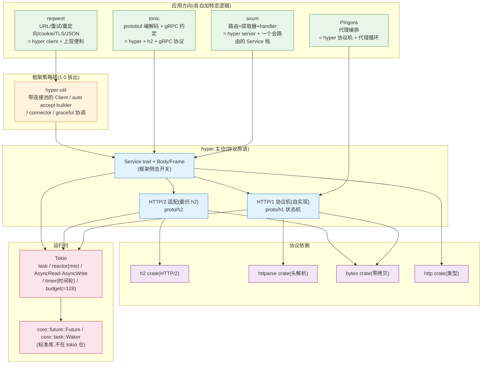
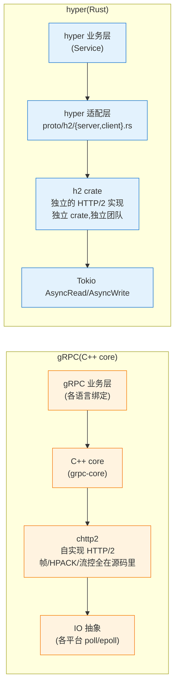
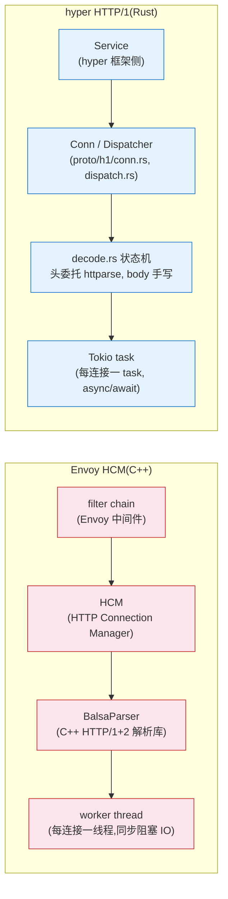

# 第 7 篇 · 第 20 章 · 全书收束:hyper 在 Rust 异步栈的位置

> **核心问题**:读完全书前 19 章,你已经知道 Service trait 怎么把请求抽象成一个 Future、HTTP/1 状态机怎么逐字节切出请求行、h2 怎么把一个 hyper 请求映射成 HTTP/2 stream、连接池怎么按 host 复用 keep-alive 连接、bytes 怎么零拷贝、1.0 为什么把大一统拆成三分。可这些散落在 19 章里的设计动机,合起来到底在说一件事——**hyper 到底是怎么把 HTTP 协议机无缝建在 Tokio 异步运行时之上的?它凭什么成了 Rust 整个异步 Web 栈的咽喉?** 本章是全书最后一章,不引入新机制,只做三件事:① 把散在 19 章的"为什么"收成一条主线、一张网;② 做两个招牌双对照(gRPC chttp2 vs hyper+h2、Envoy HCM vs hyper HTTP/1 状态机),让你看见同一道"HTTP 协议机怎么落地"的工程题,在不同生态里被解成三种最优解;③ 把 hyper 在 Rust 异步栈的位置钉死——Tokio 之上、hyper-util 之上、axum/tonic/reqwest/Pingora 之下,讲清它为什么是咽喉,以及合上书之后你该能讲清的能力清单。

> **读完本章你会明白**:
> 1. 全书 19 章的设计动机怎么收成一句话主线,以及"协议侧 vs 框架侧"这条二分法为什么是理解 hyper(以及任何一个高性能网络库)最锋利的一把刀——你能用这一句话,把任何一个 hyper 机制在 10 秒内归位。
> 2. 为什么说 hyper 是 Rust 异步栈的**咽喉节点**:它向下承接 Tokio(运行时机制),向上托起 axum/reqwest/tonic/Pingora(应用方向),左右对照 gRPC(chttp2 自实现 HTTP/2)和 Envoy(C++ HCM HTTP 状态机)——五个方向同时收束到它一个点上。
> 3. **★招牌双对照一:gRPC chttp2 vs hyper+h2**——同样是把 HTTP/2 落地,为什么 gRPC C++ core 选择"自己用 C 实现全套协议栈",而 hyper 选择"委托 h2 crate"?这不是谁对谁错,是"跨语言生态"vs"单语言 crate 分工生态"逼出的两个标准答案。
> 4. **★招牌双对照二:Envoy HCM vs hyper HTTP/1 状态机**——同样是 HTTP/1 解析,Envoy 用 C++ 写了 BalsaParser,hyper 用 Rust 手写状态机(头解析委托 httparse),这是"C++ 代理数据平面"vs"Rust 异步库"两种语言哲学在同一道题上的投影。
> 5. 合上书之后,你该能讲清的**能力清单**(一张能对面试官、对同事、对自己讲清楚 hyper 全链路的清单),以及 hyper 1.x 之后该往哪看(HTTP/3/QUIC via h3/qpack、可组合 API、async trait 稳定后的影响)。

> **如果一读觉得太难**:这是收束章,没有新机制,只做回顾和定位。如果时间紧,只抓三件事——① 全书一句话主线"把 HTTP 协议机(HTTP/1 状态机 + HTTP/2 多路复用)无缝建在 Tokio 异步运行时之上",所有机制都挂在这句上;② 两个招牌对照的结论:gRPC 自带协议栈换跨语言、hyper 委托 h2 换生态分工,Envoy 用 C++ 写数据平面、hyper 用 Rust 写协议机,都是生态取舍不是优劣;③ hyper 卡在 Tokio 和上层框架之间,是咽喉。这三件事钉死,你就拿到了全书的"导览图"。

---

## 〇、一句话点破

> **全书 19 章,讲的其实只有一件事:把 HTTP 协议机(HTTP/1 状态机 + HTTP/2 多路复用)无缝建在 Tokio 异步运行时之上——每个连接一个 task,IO 用 AsyncRead/AsyncWrite,Service 把请求处理抽象成一个 Future。协议侧(HTTP/1 状态机四章 + HTTP/2 h2 三章)决定"HTTP 字节怎么切、怎么编",框架侧(Service/Body/连接池/server/buffered IO)决定"怎么把协议机组织成可用的 client/server"。这两面全建在 Tokio 上,于是 hyper 成了 Rust 异步栈的咽喉:向下承接运行时,向上托起 axum/reqwest/tonic/Pingora,左右对照 gRPC 的 chttp2 和 Envoy 的 HCM。读完这本书,你该能在脑子里放映出一次 HTTP 请求从 TCP 字节进来、被协议机解析、交给 Service、响应字节写出去的全过程,并且能讲清这每一步底下 Tokio 怎么被用起来、为什么这样设计、不这样会怎样。**

这是结论,不是理由。本章倒过来拆:先把全书 19 章的设计动机收成一条主线和一张网,让你看见全书是一张网而不是 19 个孤立机制;再做两个招牌双对照,把"HTTP 协议机怎么落地"这道工程题在三种生态里的解法并排放出来;然后把 hyper 在 Rust 异步栈的位置钉死,讲清它为什么是咽喉;最后给你一张"读完本书你该能讲清什么"的能力清单,以及合上书之后往哪看。

---

## 一、全书主线再过一遍:19 章收成一句话

如果你合上书,只能记住一句话,那就记这一句:

> **把 HTTP 协议机(HTTP/1 状态机 + HTTP/2 多路复用)无缝建在 Tokio 异步运行时之上——每个连接一个 task,IO 用 AsyncRead/AsyncWrite,Service 把请求处理抽象成一个 Future。**

这句话里的每一个词,都对应着前面若干章的展开。下面把这句话逐词拆,让每个词回到它对应的那一章,你就能看见全书不是 19 个机制,而是这一句话的逐层展开。

### 1.1 "HTTP 协议机"——协议侧四章 + 三章

"HTTP 协议机"这四个字,是全书协议侧七章的总和。

- **HTTP/1 状态机**(第 2 篇,P2-05~08,四章):hyper 自己用 Rust 实现了一套 HTTP/1 协议机。`proto/h1/conn.rs` 的 `Conn` 结构(`conn.rs:38`)管一条连接的整个生命周期,`dispatch.rs` 的 `Dispatcher`(`dispatch.rs:22`)循环驱动"读一个请求 → 交给 Service → 写一个响应 → 再读下一个";`decode.rs` 是逐字节推进的解析状态机(头解析委托 `httparse` crate,body 分帧自己手写,`ChunkedState` 13 态);`encode.rs` 是编码状态机(`Encoder::Kind` + `BufKind::Chain` 零拷贝写出)。这条 HTTP/1 通道不依赖任何外部协议库,纯 Rust 自己啃——这是 hyper 协议侧的招牌。
- **HTTP/2 多路复用**(第 3 篇,P3-09~11,三章):HTTP/2 复杂得多(帧/流/HPACK/流控),hyper 不自己重造,委托 `h2` crate(`Cargo.toml` 里 `h2 = "0.4.14"`)。`proto/h2/server.rs` 和 `proto/h2/client.rs` 是两个独立的适配结构(server 的 `Config` 在 `server.rs:40` 一带,`keep_alive_while_idle: true` 在 `server.rs:169`;client 的 `Config` 在 `client.rs:60` 一带,`keep_alive_while_idle: false` 在 `client.rs:94`),把一个 hyper 请求映射成一条 HTTP/2 stream;`ping.rs` 的 `Recorder`/`Bdp` 做保活和自适应窗口(BDP);流控默认 server 1MB/1MB(`server.rs:36-37`)、client 5MB/2MB(`client.rs:48-49`)。

> **钉死这件事**:协议侧七章,讲的是同一件事的两个版本——HTTP/1 自己写,HTTP/2 委托 h2。无论哪个版本,协议机干完活都产出一个结构化的 `http::Request<ReqBody>`(或消费一个 `http::Response<ResBody>`),把"字节"变成"消息",或把"消息"变回"字节"。**协议机不关心业务,业务也不该关心协议机怎么切字节——中间的缝就是 Service。**

### 1.2 "无缝建在 Tokio 异步运行时之上"——承接铁律的兑现

"无缝建在 Tokio 之上"这句,是全书承接《Tokio》的总兑现。hyper 的几乎每一行都在用 Tokio:

- **每条连接一个 Tokio task**:`tokio::spawn` 出来的 task 里跑协议机循环。`await` 挂起让出线程(M:N 调度),数据来了 reactor 唤醒——这套机制《Tokio》拆到源码级,本书一句带过 + 指路。
- **IO 用 AsyncRead/AsyncWrite**:协议机的每一步"读字节"都是 `AsyncRead::poll_read`,可能返回 `Poll::Pending` 挂起。hyper 在 `common/io` 和 `proto/h1/io.rs` 之上做了 buffered IO(`Buffered` 结构在 `proto/h1/io.rs:32`,不是 `common/io`)。`MAX_BUF_LIST_BUFFERS = 16`(`io.rs:30`)控制缓冲链表上限。
- **Body 是 Stream**:hyper 的 `Body` 基于 `Frame`(1.0 从 `http-body` crate re-export),承接 Tokio Stream 模型,流式而非一次性。
- **timer 用 tokio::time**:超时和 keepalive 用 Tokio 的时间轮(《Tokio》讲过 `runtime/time/wheel`),一句带过。
- **Service 返回 Future**:Service trait 是 `Fn(Request) -> Future<Output = Result<Response, Error>>`,承接 Tokio Future/Poll 模型(标准库 `core::future`)。

> **承接《Tokio》**:这一段全用《Tokio》讲透的机制。task 的 spawn 与 work-stealing 调度、reactor 监听 IO 就绪(mio edge-triggered epoll)、`await` 的挂起与唤醒(`Poll`/`Waker`)、budget 让出(=128,防一个 task 霸占线程),这些在《Tokio》已拆到源码级,本书**一句带过 + 指路**。换句话说,《Tokio》讲的是"运行时这台发动机怎么造",本书讲的是"把 HTTP 协议机这台机器装上发动机、让它真正拉货"。

### 1.3 "Service 把请求处理抽象成一个 Future"——框架侧总开关

"Service 把请求处理抽象成一个 Future"这句,是框架侧的总开关。`Service` trait(`src/service/service.rs:32`)是全书最漂亮的抽象:

```rust
// 对齐 hyper 1.x 源码(src/service/service.rs:32 一带,简化示意)
pub trait Service<Request> {
    type Response;
    type Error;
    type Future: Future<Output = Result<Self::Response, Self::Error>>;
    fn call(&self, req: Request) -> Self::Future; // 注意:&self,且无 poll_ready
}
```

为什么签名长这样,每一处都有理由(详见 P1-02 单章拆透):

- `call` 返回 `Future` 而不是直接 `Response`——因为处理请求天然异步(查库、调下游、等 IO)。
- `call` 拿 `&self` 而不是 `&mut self`——因为一个 Service 要能被并发调用(同一连接多请求 HTTP/2,或被 clone 到多连接 HTTP/1)。
- **没有 `poll_ready`**(这是 hyper 1.0 删掉的,详见 P6-19)——背压改成走"连接池 + H1 `in_flight` 单槽 + H2 流控 + `SendRequest::poll_ready`(body channel 容量 0)",不污染用户的 trait。于是用户的业务 Service 干净得只剩一个 `call`,而背压这个"框架内部的事"被关在 hyper 内部。

> **钉死这件事**:Service 是协议机和业务之间的**那一道缝**。协议机把字节变成 Request,把 Request 交给 Service;Service 算出 Response(可能要查库/调下游),把 Response 交回协议机;协议机把 Response 编成字节写出去。整条链路里,Service 是唯一一个"业务能插手"的地方。axum 的路由表、tonic 的 gRPC 方法、reqwest 的请求逻辑,最后都变成一个 Service。

### 1.4 "协议侧 vs 框架侧"——19 章的归类表

把这 19 章按"协议侧 vs 框架侧"归类,你就能看见全书是一张网:

| 章 | 主题 | 归属 | 一句话收束 |
|---|---|---|---|
| P1-02 | Service trait | 框架 | 把"处理一个请求"抽象成 Future,`call(&self)` 无 `poll_ready` |
| P1-03 | Tower 中间件 | 框架 | Service 链,横切不侵入业务(承 Envoy filter chain / gRPC filter stack) |
| P1-04 | Body as Stream | 框架 | body 基于 Frame/Stream,流式而非一次性 |
| P2-05 | HTTP/1 连接与 keep-alive | 协议 | 一条连接的 dispatch 循环,KA 三态 Idle/Busy/Disabled(`conn.rs:1024`) |
| P2-06 | 请求/响应解析状态机 | 协议(招牌) | `decode.rs` 逐字节推进,头委托 httparse,body 手写 |
| P2-07 | chunked、100-continue、升级 | 协议 | chunked 13 态、100-continue 协商、upgrade 交出 IO |
| P2-08 | HTTP/1 编码与写出 | 协议 | `encode.rs`,`Encoder::Kind` + `BufKind::Chain` 零拷贝 |
| P3-09 | HTTP/2 帧与多路复用 | 协议 | 一条连接并发跑多个 stream(承《gRPC》第 2 篇) |
| P3-10 | h2 集成 | 协议(招牌) | `proto/h2/{server,client}.rs` 把请求映射成 stream |
| P3-11 | HTTP/2 ping 与流控 | 协议 | `ping.rs` BDP 自适应,server 1MB/1MB、client 5MB/2MB |
| P4-12 | client 连接池与分发 | 框架(招牌) | 带池 Client 在 hyper-util,主仓只 `client/conn` 单连接 |
| P4-13 | client/conn 发请求收响应 | 框架 | `SendRequest`,HTTP/1 非 Clone、HTTP/2 Clone |
| P4-14 | 连接复用、keep-alive、重试 | 框架 | 主仓不做请求重试,hyper-util 只窄连接级重试 |
| P5-15 | server 接受连接与服务 | 框架 | 主仓无 accept 循环,只 `serve_connection` 返回具名 `Connection` |
| P5-16 | graceful shutdown 与升级 | 框架 | 等在途请求,`with_graceful_shutdown` 在 hyper-util/axum |
| P6-17 | bytes 零拷贝与 buffered IO | 框架(招牌) | `bytes::Bytes` 引用计数,`Buffered` 在 `proto/h1/io.rs` |
| P6-18 | 性能:背压、timer、IO 调优 | 框架 | 背压三态(H1 in_flight/H2 流控/poll_ready),timer 承 Tokio |
| P6-19 | hyper 1.0 三分重构 | 演进 | 协议原语留主仓/框架策略拆 hyper-util/中间件归 Tower+axum |

这张表是全书的"导览图"。任何一个 hyper 机制,你都可以在 10 秒内归位:它是协议侧的(切字节/编字节)还是框架侧的(组织成 client/server)?它怎么承接 Tokio?它出现在 1.0 重构的哪一刀里?这三问答完,这个机制的位置就钉死了。

> **钉死这件事**:全书的一句话主线、二分法、承接关系,合起来是一个"理解 hyper 的思维框架":**主线**(协议机建在运行时上)告诉你 hyper 在干什么,**二分法**(协议侧 vs 框架侧)告诉你每一个机制在哪个面,**承接**(Tokio 讲透的一句带过)告诉你哪些机制不用在本书重讲。这三件东西合起来,就是读完全书你应该带走的"思维操作系统"。

---

## 二、hyper 是 Rust 异步栈的咽喉:五个方向同时收束

讲清了全书主线,现在把视角拉高,看 hyper 在整个 Rust 异步栈里的位置。这一节的结论是:hyper 是**咽喉节点**——它向下承接 Tokio(运行时机制),向上托起 axum/reqwest/tonic/Pingora(应用方向),左右对照 gRPC(chttp2)和 Envoy(HCM),五个方向同时收束到它一个点上。

### 2.1 Rust 异步 Web 栈全景

先把整个栈画出来。这张图是你合上书之后,该能凭记忆在白板上画出来的图:



这张图从下往上看,就是 Rust 异步 Web 栈的分层:

- **最底**:`core::future::Future` 和 `core::task::Waker`(标准库,不在 tokio 仓)——Rust 异步的地基。
- **运行时**:Tokio(task/reactor/AsyncRead-AsyncWrite/timer/budget)——异步运行时机制,但不懂 HTTP。
- **协议依赖**:h2(HTTP/2)、httparse(头解析)、bytes(零拷贝)、http(类型)——这些是外部 crate,hyper 用它们组装协议机。
- **hyper 主仓**:Service/Body + HTTP/1 协议机(自实现)+ HTTP/2 适配(委托 h2)——这是本书拆的核心层。
- **框架策略层**:hyper-util(1.0 拆出,带连接池的 Client、auto accept builder、graceful 协调)。
- **应用方向**:axum/reqwest/tonic/Pingora,各自把 hyper 当地基,盖不同形状的房子。

> **钉死这件事**:hyper 主仓卡在"运行时(Tokio)+ 协议依赖(h2/httparse/bytes)"和"应用方向(axum/reqwest/tonic/Pingora)"之间。它的下面是"机制"(怎么不阻塞地等待),它的上面是"策略"(怎么把 HTTP 用起来)。它是这条切线上唯一的节点——**这就是"咽喉"的字面含义**:任何 Rust 异步 Web 应用,从 axum 写一个 handler、到 reqwest 发一个请求、到 tonic 跑一个 gRPC 方法、到 Pingora 做一个代理,字节都要穿过 hyper 这一层(或穿过它重做的那套协议机逻辑)。换种说法,你删掉 hyper,Rust 异步 Web 栈就断了。

### 2.2 向下承接:hyper 怎么用 Tokio(承《Tokio》总复习)

hyper 向下承接 Tokio,这一段是全书承接《Tokio》的总复习。把全 19 章里"hyper 怎么用 Tokio"的点收集起来,你能看见 hyper 几乎用到了 Tokio 的每一个原语:

- **task**:每条连接 spawn 一个 task,task 里跑协议机循环。10 万连接 = 10 万 task,8 个 worker 线程扛——这是 Tokio M:N 调度的红利。
- **AsyncRead/AsyncWrite**:协议机的每一步读字节都是 `poll_read`,可能 `Pending` 挂起。hyper 在它之上做 buffered IO(`proto/h1/io.rs`)。
- **Future/Stream**:Service 返回 Future,body 是 Stream——这两个抽象都是 Tokio(标准库)的。
- **timer**:超时和 keepalive 用 `tokio::time`,底层是 Tokio 的 hierarchical 时间轮(`runtime/time/wheel`)。
- **budget**:每条连接的协议机循环里,budget(=128)防一个 task 在循环里霸占线程——`poll_loop` 里 `for _ in 0..16` 之后 `yield_now` 就是这个机制的用户侧体现。
- **reactor(mio)**:IO 就绪由 Tokio reactor 监听(mio edge-triggered epoll/kqueue),hyper 不直接碰 mio,只通过 AsyncRead/AsyncWrite 的 `Pending`/唤醒间接受益。

> **承接《Tokio》**:这六条,每一条都对应《Tokio》的一章。读本书 = 复习深化《Tokio》,看"运行时怎么被一个真实高性能库用起来"。你在《Tokio》看到的 task/调度/reactor/timer/budget,在 hyper 里全是"被真刀真枪用起来"的状态——这就是"机制"和"机制被用起来"的区别。

### 2.3 向上托起:四个应用方向怎么站在 hyper 上

hyper 向上托起 axum/reqwest/tonic/Pingora。这四个不是简单"调 hyper 的 API",它们各自把 hyper 当地基,在上面盖了不同形状的房子。这一段在 P0-01 已展开过,这里只收束成"四个映射",让你看见 hyper 的协议机和 Service 抽象是怎么被复用的:

- **axum = hyper server + 一个会路由的 Service 栈**。axum 不自己写 HTTP 协议机,直接用 hyper 的 server 接受连接、用 hyper 的协议机解析请求。axum 的路由表本身就是一个 `tower::Service`(经 hyper-util 桥接到 hyper 的 `Service`),根据 path 把请求分发给 handler。中间件(tower 的 `Layer`/`Service` 链)就是给这个 Service 套圈,鉴权、日志、压缩每一层都是一个 Service 包装另一层 Service。
- **reqwest = hyper client + 连接池 + 一堆上层便利**。reqwest 底层是 hyper 的 client 连接池(实际在 `hyper-util` 里),但 hyper 的 client 只懂"给一个 `http::Request`、拿一个 `http::Response`",reqwest 在上面加了 URL 解析、重试策略、重定向跟随、cookie store、超时、TLS 配置、JSON 反序列化这些"用起来顺手"的东西。
- **tonic = hyper + h2 + protobuf 编解码 + gRPC 约定**。tonic 把 gRPC 建在 hyper + h2 上。gRPC 本身就是 HTTP/2 协议(POST 一个 path,body 是 protobuf 帧,响应也是 protobuf 流),tonic 拿 hyper 当传输层,在 hyper 的 HTTP/2 连接上跑 gRPC 的 path 约定 + protobuf 序列化/反序列化 + 流式 RPC。
- **Pingora = hyper 协议机 + 代理编排**。Pingora 是 Cloudflare 开源的 Rust 代理框架,它没有完整依赖 hyper 的 server,但重做了 hyper 那套"连接管理 + HTTP 协议机"逻辑的代理侧,大量复用 hyper 的协议解析能力和 `bytes` 零拷贝,把代理的"收一个请求、转发、收一个响应、转发"循环建在这上面。

> **钉死这件事**:这四个例子合起来证明一件事——**hyper 把 HTTP 协议机建在 Tokio 上之后,上面所有 Rust Web/gRPC/代理的需求,都能"复用同一套协议机 + 自己加特定逻辑"**。没有这层地基,Rust 生态不会有今天这么整齐的 Web 栈。这就是"咽喉向上"的含义:不是"某个框架依赖 hyper",而是"整个 Rust 异步 Web 生态同时依赖 hyper"。

### 2.4 左右对照:gRPC 和 Envoy 收束到同一道题

hyper 还向左向右各对照一个兄弟——这是本章两个招牌双对照的主角,下一节单独拆。这里先钉死一件事:这两个对照不是凑出来的,它们是"HTTP 协议机怎么落地"这道工程题在三种生态里的三种解法:

- **gRPC(C++ core)**:跨语言 RPC,自带全套 HTTP/2 协议栈(chttp2),为跨语言可移植付"自己实现协议栈"的代价。
- **Envoy(C++)**:云原生代理,自带 HTTP/1+2 解析(包括 BalsaParser),为代理数据平面的极致性能付"C++ 实现"的代价。
- **hyper(Rust)**:Rust 异步 HTTP 库,HTTP/1 自己写、HTTP/2 委托 h2,为生态分工付"协议层多一个外部依赖"的代价。

三个都在解决"把 HTTP 协议机建在某种 IO 抽象之上"这道题,但各自的生态逼出了不同的最优解。这就是"咽喉左右"的含义——同一道题,三个答案,放在一起看,你才能看清"协议机要不要自实现"这道工程选择题的全部解空间。

---

## 三、★招牌双对照一:gRPC chttp2 vs hyper+h2

这是全书的两个招牌双对照之一。读这一节,你要带走的不是"哪个对哪个错",而是"为什么同一道 HTTP/2 落地的题,会逼出两个截然相反的标准答案"。

### 3.1 两种实现哲学的并排

先看 gRPC 的 C++ core。gRPC 是 Google 的跨语言 RPC,它的 C++ core(grpc-core)被包成十几种语言的绑定(Python 的 grpcio、Ruby 的 grpc、PHP 的 grpc 等)。这个 C++ core **自己用 C 实现了全套 HTTP/2**,代码库里叫 chttp2(`src/core/ext/transport/chttp2/`)——帧解析、HPACK 编解码、流控、流量整形,全在 gRPC 自己源码里。这是《gRPC》第 2 篇的招牌。

再看 hyper。hyper 是 Rust 的 HTTP 库,它的 HTTP/2 **不自己实现**,而是委托 `h2` crate(`Cargo.toml` 里 `h2 = "0.4.14"`)。hyper 在 `proto/h2/` 下做适配层,把"一个 hyper 请求"映射成"一条 HTTP/2 stream",把 h2 的 `SendRequest`/`RequestStream` 桥接成 hyper 的 API。

两种实现哲学的并排图:



左边 gRPC:从业务到 IO,HTTP/2 协议栈(chttp2)焊在 C++ core 里,各语言绑定包 C core。右边 hyper:HTTP/2 协议栈(h2)是独立的 Rust crate,hyper 只做适配层,IO 抽象是 Tokio。

### 3.2 为什么 gRPC 要"自带协议栈"

gRPC 选择自带全套 HTTP/2,根本原因只有一个:**它要跨语言可移植**。

gRPC 的"生态"横跨十几种语言——Python、PHP、Ruby、Node、Go、Java、C#……这些语言里,有的根本没有像样的 HTTP/2 库(2015 年 gRPC 开源时,Python/PHP 的 HTTP/2 支持几乎为零),有的语言运行时性能不行(解释型语言自己实现 HTTP/2 帧解析跑不动高并发)。所以 gRPC 必须把 HTTP/2 这套协议栈**焊死在 C 里**,再用 FFI 把 C core 包成各语言的绑定。这样,无论你用 Python 还是 PHP 写 gRPC,底下跑的都是同一套 C 实现的 HTTP/2,性能可控、行为一致。

代价是什么?三个:

1. **C core 维护成本高**。chttp2 是一大坨 C 代码(帧解析、HPACK、流控、flow control 都自己写),bug 多、内存安全靠人工保证(gRPC 历史上出过若干 chttp2 的 CVE)。
2. **各语言绑定各异**。Python 的 grpcio、Ruby 的 grpc、PHP 的 grpc,各自的 FFI 绑定、各自的构建系统、各自的线程模型,调协议层 bug 要进 C 源码——对应用层开发者是个黑盒。
3. **协议层演进慢**。HTTP/2 的任何改进(比如 HPACK 优化、流控调优)都要在 chttp2 里改,改完还要重新发十几种语言绑定,周期长。

> **对照《gRPC》**:chttp2 的细节(帧解析、HPACK、流控)在《gRPC》第 2 篇已拆透。本书只钉死"gRPC 自带协议栈"这个**取舍**,不重讲 chttp2 内部。

### 3.3 为什么 hyper 要"委托 h2"

hyper 选择委托 h2,根本原因也只有一个:**Rust 生态是单语言的、crate 之间靠 trait 契约组合**。

Rust 的"生态"是单语言的——所有 Rust 库都用 Rust 写,crate 之间靠 trait 契约(`AsyncRead`、`Stream`、`Service`)组合,不靠 FFI。所以 hyper 可以放心地把 HTTP/2 这个庞大且独立的子问题**外包给 h2**,自己只做 h2 和上层框架之间的薄适配。h2 是独立的 Rust crate,有独立的团队(主要是 hyper 的核心贡献者,但作为独立项目演进),独立发版,独立测试。

收益是什么?三个:

1. **各自精专**。h2 团队专精 HTTP/2(帧、HPACK、流控),hyper 团队专精连接组织和 Service 抽象。两边各自演进,谁都不拖谁的后腿。
2. **可替换**。如果哪天 Rust 生态出现一个比 h2 更好的 HTTP/2 实现(更快的 HPACK、更好的流控),hyper 理论上可以换掉 h2 而不动主仓——只要新实现暴露同样的 `SendRequest`/`RequestStream` 接口。这是"委托"换来的灵活性。
3. **Rust 安全红利**。h2 是 Rust 写的,内存安全和并发安全由编译器保证,不像 chttp2 靠人工。h2 历史上的 CVE 数量远少于 chttp2(这是 Rust vs C 在系统编程语言层面的差异,不是 h2 团队比 chttp2 团队聪明)。

代价是什么?hyper 在协议层多了一个外部依赖(h2 crate)。但这个代价在 Rust 生态里几乎不算代价——crate 依赖是 Rust 的常态,`Cargo.toml` 里多一行 `h2 = "0.4.14"` 比"自己维护一套 chttp2"便宜太多了。

### 3.4 这是生态形态逼出的两个标准答案

把 3.2 和 3.3 合起来看,你会得到一个清醒的结论:**这不是谁对谁错,是生态形态逼出的两个标准答案**。

- gRPC 的生态是"跨语言",它的最优解是"自带协议栈换跨语言可移植"——C core 被各语言包,协议栈焊死在 C 里。
- hyper 的生态是"Rust 单语言 crate 分工",它的最优解是"委托 h2 换各自精专"——h2 和 hyper 各管一段,靠 trait 组合。

如果硬要 gRPC 委托某语言的 HTTP/2 库,它就失去跨语言可移植性(Python 没有 h2、PHP 没有 h2);如果硬要 hyper 自己实现 chttp2 那种全套协议栈,它就重复造轮子,且 hyper 团队的精力会被 HTTP/2 这个庞大子问题吞掉,Service/连接池/buffered IO 这些 hyper 独有的东西反而做不深。

> **钉死这件事**:**"协议栈要不要自实现"不是技术问题,是生态问题**。你在《gRPC》那本看到的是"跨语言生态"的最优解(自带协议栈),在本书看到的是"单语言 crate 分工生态"的最优解(委托)。两本一起读,你就同时理解了这道工程选择题的两个标准答案。这是读两本的最大红利——你不再问"hyper 为什么不自己写 HTTP/2",而是能讲清"在什么生态里该自己写、在什么生态里该委托"。

> **对照《gRPC》**:这道取舍在《gRPC》第 2 篇(chttp2)和《gRPC》的"为什么是 C++ core"那部分已反复出现。本书的对照,是站在 hyper 这一侧回看 gRPC,让你看见"同一道题、两个答案、各有道理"。

---

## 四、★招牌双对照二:Envoy HCM vs hyper HTTP/1 状态机

这是全书的第二个招牌双对照。这一个对照换了一个角度:不再问"协议栈要不要自实现",而是问"**用 C++ 写代理数据平面,还是用 Rust 写异步库,这两种语言哲学怎么影响 HTTP/1 状态机的实现**"。

### 4.1 两种 HTTP/1 状态机的并排

先看 Envoy。Envoy 是 Lyft 开源(现 CNCF)的 C++ 代理,它的 HTTP Connection Manager(HCM)是代理数据平面的核心。HCM 用 C++ 实现了一套 HTTP/1+2 解析——早期 Envoy 自己写解析,后来演进到用 BalsaParser(一个独立的、可复用的 C++ HTTP/1+2 解析库,Envoy 的 `common/http/http3/codec_impl` 之类都基于它)。HCM 的工作方式是:每条连接一个 worker thread(Envoy 是线程模型,不是 async/await),连接上的字节被 BalsaParser 切成 header/body,交给 filter chain(Envoy 的中间件),filter 处理完再编回字节转发出去。

再看 hyper。hyper 的 HTTP/1 是 Rust 手写的状态机。`proto/h1/conn.rs` 的 `Conn` 管一条连接(`conn.rs:38`),`dispatch.rs` 的 `Dispatcher` 循环驱动(`dispatch.rs:22`),`decode.rs` 逐字节推进解析状态机(头部解析委托 `httparse` crate,body 分帧自己手写),`encode.rs` 编码写出。每条连接跑在一个 Tokio task 里,不是线程;字节通过 `AsyncRead::poll_read` 读进来,可能 `Pending` 挂起。

两种 HTTP/1 状态机的并排图:



左边 Envoy:filter chain → HCM → BalsaParser,跑在 worker thread 上,同步阻塞 IO。右边 hyper:Service → Conn/Dispatcher → decode.rs 状态机,跑在 Tokio task 上,async/await。

### 4.2 语言哲学:C++ 数据平面 vs Rust 异步库

这两种实现的根本差异,不是"谁的状态机更快",而是**两种语言哲学**在 HTTP/1 状态机这道题上的投影。

**C++ 数据平面哲学(Envoy)**:Envoy 的目标是"做最快的云原生代理",它的设计假设是——代理跑在数据中心,有少量 worker thread(通常等于 CPU 核心数),每个 thread 用 epoll 监听一批连接,连接上有数据就处理。在这种场景下,"同步阻塞 IO + 每 worker thread 处理一批连接"的模型是高效的(因为 thread 数固定,没有 M:N 调度的开销),而 C++ 的零成本抽象、手动内存管理、直接操作指针,让 BalsaParser 这种"逐字节切 header"的状态机能榨干 CPU。

代价是什么?Envoy 的 HTTP/1 状态机是**线程绑定的**——一条连接一旦被某个 worker thread accept,它就 stick 在那个 thread 上,后续的字节处理、filter、转发都在那个 thread 上。这避免了跨 thread 同步,但也限制了连接在 thread 间的迁移。另外,C++ 的内存安全靠人工(BalsaParser 和 HCM 历史上都有 CVE),并发安全靠锁和原子操作(Envoy 有自己的线程模型,见《Envoy》相关章节)。

**Rust 异步库哲学(hyper)**:hyper 的目标是"做 Rust 生态的 HTTP 底层库",它的设计假设是——hyper 之上要托起 axum/reqwest/tonic/Pingora,这些应用的并发模型千差万别(Web server 要扛海量长连接、gRPC 要双向流、代理要转发),所以 hyper 必须把"等数据"这件事做得**零成本可挂起**。在这种场景下,async/await(每连接一 task,task 等 IO 就挂起让出线程,M:N 调度)是更合适的模型,而 Rust 的所有权/借用、`Send`/`Sync`、`unsafe` 审查,让状态机的内存安全和并发安全由编译器保证。

代价是什么?hyper 的 HTTP/1 状态机是**异步的**——每一步"读字节"都是 `poll_read`,可能 `Pending` 挂起,状态机要能暂停、能续上(这是 Rust async 的招牌:把状态机编码进 Future 的 poll 循环,P1-02 和 P2-06 拆过)。这种"可暂停"的写法比"一次性读完所有字节"复杂,但换来的是海量并发。

> **钉死这件事**:**Envoy 和 hyper 的 HTTP/1 状态机,不是"谁抄谁",是两种语言哲学在 HTTP/1 这道题上的投影**。Envoy 走 C++ 数据平面(thread-per-worker + 同步阻塞 + BalsaParser),为代理的极致吞吐付"C++ 内存安全靠人工"的代价;hyper 走 Rust 异步(task-per-connection + async/await + httparse 委托),为海量并发和生态托底付"状态机要写成可挂起"的代价。两个都是各自场景的最优解,放在一起看,你才看清"HTTP/1 状态机用什么语言、什么并发模型写"这道题的全部解空间。

### 4.3 一个细节对照:头部解析要不要委托

Envoy 的 BalsaParser 是**全自实现**的(头和 body 都自己切),hyper 的 HTTP/1 是**头委托 httparse、body 手写**的。这个细节差异,又一次折射出两种哲学。

Envoy 自实现头解析,是因为它要**完全控制解析行为**——代理要对每一个 header 字段做精细处理(改写、删除、注入),BalsaParser 把 header 解析成结构化对象,filter chain 能直接操作。这是代理数据平面的需求,自实现能给最大灵活性。

hyper 委托 httparse,是因为 httparse 是**Rust 生态里最成熟、最快、最被审计的 HTTP/1 头解析库**(性能极优,被 servo 等大项目用),hyper 没必要重造。hyper 只需要"把字节切成请求行 + headers",这个子问题 httparse 已经做到极致,委托它比自己写更安全、更快、更省维护成本。body 分帧(`decode.rs` 的 `ChunkedState` 13 态、`Content-Length` 边界)hyper 自己手写,因为 body 的流式语义和 hyper 的 Body/Frame 抽象紧耦合,委托不划算。

> **对照《Envoy》**:BalsaParser 和 HCM 的细节(filter chain、thread model、HTTP/3 接入)在《Envoy》P3 已拆透。本书只钉死"Envoy 用 C++ 写数据平面、hyper 用 Rust 写异步库"这个**语言哲学对照**,不重讲 HCM 内部。两本一起读,你就同时理解了"HTTP/1 状态机在 C++ 代理里和 Rust 异步库里分别长什么样"。

### 4.4 两个对照合起来看:协议机落地的三种生态解法

把招牌双对照一(gRPC vs hyper)和招牌双对照二(Envoy vs hyper)合起来,你会得到一个更大的图景:**"把 HTTP 协议机建在某种 IO 抽象之上"这道工程题,在不同生态里有三种解法**。

| 维度 | gRPC chttp2(C) | Envoy HCM(C++) | hyper(Rust) |
|---|---|---|---|
| 目标 | 跨语言 RPC | 云原生代理数据平面 | Rust 异步 HTTP 底层库 |
| HTTP/1 | 自实现(各语言绑定) | BalsaParser(自实现) | 手写状态机 + httparse 委托 |
| HTTP/2 | chttp2(自实现全套) | BalsaParser / nghttp2 集成 | 委托 h2 crate |
| 并发模型 | C core 自己管线程 | worker thread + epoll | task + async/await(M:N) |
| 内存安全 | 靠人工(C) | 靠人工(C++) | 编译器保证(Rust) |
| 协议栈策略 | 自带(换跨语言) | 自带(换代理控制) | 委托 h2(换生态分工) |
| 生态形态 | 跨语言(十几种绑定) | 单语言 C++ | 单语言 Rust(crate 分工) |

这张表是全书两个招牌双对照的浓缩。三个项目都在解决"HTTP 协议机怎么落地"这道题,但各自的**目标**(RPC/代理/底层库)和**生态形态**(跨语言/C++ 单语言/Rust crate 分工)逼出了截然不同的最优解。没有谁抄谁,没有谁对谁错——这就是系统设计的常识:**最优解永远是"目标 × 生态"的函数**。

> **钉死这件事**:读完全书,你能讲清"HTTP 协议机在 gRPC/Envoy/hyper 里分别怎么落地",这是比"hyper 怎么用"更大的能力——它意味着你理解了**协议库设计**这道题的通用规律,而不只是 hyper 的一个特例。下一次你面对一个新的协议(比如 HTTP/3、比如某个自定义 RPC),你能问对问题:"这个协议的目标是什么、生态是什么,该自实现还是委托,该用什么并发模型"——这就是读三本书(gRPC/Envoy/hyper)的最大红利。

---

## 五、钉死栈定位:hyper 为什么是咽喉

前面四节把主线、承接、对照都过了一遍。这一节把 hyper 在 Rust 异步栈的位置钉死——讲清它**为什么是咽喉**,以及合上书之后你该怎么向别人描述这个位置。

### 5.1 咽喉的三个含义

hyper 是 Rust 异步栈的咽喉,这句话有三个含义:

**含义一:它是唯一的协议层节点**。在 Rust 异步 Web 栈里,运行时(Tokio)和应用方向(axum/reqwest/tonic/Pingora)之间,只有 hyper 这一层是"专门做 HTTP 协议机"的。运行时不做 HTTP,应用方向不做 HTTP 协议机(它们做业务/便利/编排),hyper 是中间唯一的一层。删掉它,栈就断了——要么应用方向自己重写 HTTP 协议机(reqwest/axum 都试过,最后都回到 hyper),要么运行时吞下 HTTP 协议机(Tokio 故意不干)。

**含义二:它承接最紧密**。hyper 和 Tokio 的承接,是整个 Rust 异步栈里最紧密的一对——task/AsyncRead/Future/Stream/timer/budget,hyper 几乎用到了 Tokio 的每一个原语。读 hyper = 复习深化 Tokio。这种紧密程度,只有 Tokio 之上的"第一层网络库"才配得上——再往上的 axum/reqwest,它们用 Tokio 的方式是"通过 hyper 间接用",不如 hyper 直接。

**含义三:它托起最广**。hyper 向上托起的不是"一个框架",而是"整个 Rust 异步 Web 生态"——axum(Web)、reqwest(client)、tonic(gRPC)、Pingora(代理),四个最主流方向全站在 hyper 上。这种"一个底层库托起整个生态"的格局,在 Rust 里除了 Tokio(托起所有异步)和 hyper(托起所有 HTTP),几乎没有第三个。

### 5.2 咽喉位置的形成史:为什么是 hyper

为什么这个咽喉位置是 hyper 占了,不是别的库?这有一段历史值得知道(诚实标注:这是背景,不是本书拆的源码)。

Rust 的 HTTP 生态早期(2015-2018)有好几个竞争的 HTTP 库——solicit(HTTP/2)、tokio-proto(早期 prototype)、hyper 0.10/0.11(用 mio 直接写)。hyper 在 0.11(2017)决定全面转向 Tokio(`tokio-rs` 生态),成为"Tokio 之上的 HTTP 库"。这个决定让 hyper 搭上了 Tokio 的快车——Tokio 的每一次性能改进、每一次 API 演进,hyper 都直接受益。到 2019-2020,hyper 0.14 已经是 Rust 生态事实上的 HTTP 标准,axum(2021)、reqwest(一直基于 hyper)、tonic(2019)、Pingora(2023 开源)全部站在 hyper 上。

1.0(2023)的三分重构(P6-19 拆透),是 hyper 巩固咽喉位置的最后一次大动作——把"协议原语"留下、"框架策略"拆 hyper-util、"中间件"归 Tower+axum。这次重构的动机就是让 hyper 主仓"瘦到只剩协议机",于是 axum/reqwest/tonic/Pingora 都能站在这个干净的地基上各搭各的房子,不互相绑死。**主仓变瘦,换来的是整个生态都能站在它上面**——这就是"咽喉"的代价和收益。

> **钉死这件事**:hyper 占住咽喉位置,不是因为它最早,而是因为它在 2017 年做了"全面转向 Tokio"的决定,然后在 2023 年做了"三分重构"的决定。这两个决定让 hyper 同时满足了"紧贴 Tokio"和"生态中立"——前者让它拿到运行时的红利,后者让整个生态都愿意站在它上面。这两个决定,是 hyper 团队(主要是 Sean McArthur)最关键的两个工程判断。

### 5.3 怎么向别人描述 hyper 的位置

合上书之后,如果有人问你"hyper 在 Rust 异步栈的什么位置",你该能在 30 秒内讲清。给一个讲法:

> "Rust 异步 Web 栈从下往上是五层——标准库的 `Future`/`Waker`、Tokio 运行时、hyper(HTTP 协议机)、hyper-util(连接池/accept 等框架策略)、axum/reqwest/tonic/Pingora(应用方向)。hyper 是中间的协议层,它把 HTTP 协议机(HTTP/1 自己写、HTTP/2 委托 h2)建在 Tokio 之上,每个连接一个 task,Service 把请求处理抽象成一个 Future。它向下承接 Tokio 几乎所有原语,向上托起整个 Rust 异步 Web 生态,左右对照 gRPC 的 chttp2(自带协议栈换跨语言)和 Envoy 的 HCM(C++ 数据平面)。删掉它,Rust 异步 Web 栈就断了——这就是咽喉。"

这个讲法里,每一个词都对应前面某一章的展开:协议侧(HTTP/1 四章 + HTTP/2 三章)、框架侧(Service/Body/连接池/server/buffered IO)、承接 Tokio(全书一句带过)、对照 gRPC/Envoy(本章招牌双对照)。你能在 30 秒内讲清,说明你真的读通了。

---

## 六、读完本书你该能讲清什么:能力清单

这是全书最后一节正文。给一张"读完本书你该能讲清什么"的能力清单——这张清单是你合上书之后,该能对面试官、对同事、对自己讲清楚的东西。每一条都回扣到对应的招牌章,你可以拿这张清单自测:哪一条讲不清,就回去重读那一章。

### 6.1 协议侧:你能讲清 HTTP 字节怎么切成请求

- **HTTP/1 解析状态机(P2-06,招牌章)**:你能讲清一条 TCP 连接上的字节(`GET / HTTP/1.1\r\nHost: ...\r\n\r\n...`),怎么被 `decode.rs` 的状态机逐字节切成请求行/headers/body,头部解析为什么委托 httparse,body 分帧为什么手写(ChunkedState 13 态),以及"读到半个请求头要等下一段数据"时,状态机怎么暂停/续上(承 Rust async 的状态机编码)。
- **HTTP/1 编码与写出(P2-08)**:你能讲清响应怎么被 `encode.rs` 编回字节,`Encoder::Kind` 和 `BufKind::Chain` 怎么做零拷贝写出,flush 策略怎么平衡吞吐和延迟,`Transfer-Encoding: chunked` 在什么情况下启用。
- **keep-alive 与连接循环(P2-05)**:你能讲清一条 HTTP/1 连接怎么循环处理多个请求,KA 三态(Idle/Busy/Disabled,`conn.rs:1024`)怎么流转,什么情况下 keep-alive 被禁用(显式 `Connection: close`、HTTP/1.0、协议错误)。
- **chunked、100-continue、升级(P2-07)**:你能讲清分块传输的边界怎么判断(13 态状态机),`Expect: 100-continue` 怎么协商,协议升级(websocket)时 hyper 怎么把 IO 交出去(`into_inner`)。
- **HTTP/2 多路复用(P3-09~11)**:你能讲清一条 HTTP/2 连接怎么并发跑多个 stream(承《gRPC》第 2 篇),hyper 怎么通过 h2 适配层(`proto/h2/{server,client}.rs`)把一个请求映射成一条 stream,ping/BDP 怎么做保活和自适应窗口,流控默认值为什么 server 1MB/1MB、client 5MB/2MB。

### 6.2 框架侧:你能讲清请求怎么被组织和处理

- **Service trait(P1-02,招牌章)**:你能讲清 `Service` trait 为什么长这样(`call(&self)` 返回 Future、无 `poll_ready`),为什么 hyper 1.0 删掉了 Tower 的 `poll_ready`,背压改成走"连接池 + H1 in_flight 单槽 + H2 流控",`service_fn` 怎么把一个 `async fn` 零成本包成 Service。
- **Body as Stream(P1-04)**:你能讲清 body 为什么是 Stream(Frame-based,1.0 从 http-body crate re-export)而不是一次性 buffer,流式 body 怎么和协议机的编码/解码协同,长度已知 vs chunked 的差异。
- **连接池(P4-12,招牌章)**:你能讲清为什么带池 Client 在 hyper-util 而不在主仓,主仓的 `client/conn` 怎么管单连接发请求收响应,HTTP/1 SendRequest 非 Clone 和 HTTP/2 SendRequest Clone 的差异,为什么主仓不做请求重试(归 reqwest)。
- **server 与 graceful shutdown(P5-15/16)**:你能讲清为什么主仓没有 accept 循环(只有 `serve_connection`),`serve_connection` 返回的具名 `Connection` 结构怎么驱动单连接,graceful shutdown 怎么等在途请求(`with_graceful_shutdown` 在 hyper-util/axum)。
- **bytes 零拷贝与 buffered IO(P6-17,招牌章)**:你能讲清 `bytes::Bytes` 怎么靠引用计数做零拷贝(承《内存分配器》),`Buffered` 在 `proto/h1/io.rs`(不是 `common/io`),`BufList`(`common/buf.rs`,VecDeque)怎么把多个 Buf 串起来,Rewind 怎么做字节回放。

### 6.3 全链路:你能放映出一次请求的全过程

最重要的一条:合上书之后,你该能**在脑子里放映出一次 HTTP 请求从 TCP 字节进来、到响应字节写出去的全过程**,并且能讲清这每一步底下 Tokio 怎么被用起来。这是全书的"毕业考试"。

拿 axum + hyper server + HTTP/1 的一次 GET 请求举例,你该能讲清这 12 步:

1. Tokio runtime 的某个 worker thread 在 epoll_wait,reactor(mio)通知某条 TCP 连接有数据可读。
2. hyper 在那条连接上 spawn 的 task 被唤醒(从 `AsyncRead::poll_read` 的 `Pending` 返回到 `Ready`)。
3. task 里的 `Dispatcher`(`proto/h1/dispatch.rs`)驱动 `Conn`(`proto/h1/conn.rs`)读字节进 `Buffered`(`proto/h1/io.rs`)。
4. `decode.rs` 的解析状态机逐字节推进,头部委托 `httparse` 切出请求行 + headers,body 按 Content-Length/chunked 分帧。
5. 解析出一个 `http::Request<ReqBody>`,body 是基于 Frame 的 Stream(P1-04)。
6. `Dispatcher` 把 Request 交给 Service。在 axum 里,这个 Service 是 axum 的路由表(一个 `tower::Service`,经 hyper-util 桥接),路由表根据 path 找到 handler。
7. handler 被调用,它 `await` 查库/调下游——这个 `await` 可能让 task 再次挂起(返回 `Pending`),让出 worker thread 给别的 task。
8. handler 算出 `http::Response<ResBody>`,Service 的 Future 返回 `Ready(Response)`。
9. `Dispatcher` 拿到 Response,交给 `encode.rs` 编码——`Encoder::Kind` + `BufKind::Chain` 把 Response 编成字节,零拷贝(`bytes::Bytes` 引用计数)写进 `Buffered`。
10. `Buffered` flush 到 Tokio 的 AsyncWrite(底层是同一条 TCP 连接),字节真的发出去。
11. 如果是 keep-alive,KA 状态从 Busy 回到 Idle(`conn.rs:1032`),`Dispatcher` 循环回第 3 步等下一个请求;如果 `Connection: close`,KA 进 Disabled,连接关闭。
12. 全程 budget(=128)在循环里递减,到 0 就 `yield_now` 让出线程——防这个 task 霸占 worker thread。

你能把这 12 步讲清,说明你真的读通了。这 12 步里,每一步都对应前面某一章:第 3-4 步是 P2-06(解析状态机),第 5 步是 P1-04(Body),第 6 步是 P1-02(Service),第 7 步是 P1-03(Tower 中间件),第 8-10 步是 P2-08(编码写出)+ P6-17(bytes 零拷贝),第 11 步是 P2-05(keep-alive),第 12 步是 P6-18(背压 + budget)。整张图是全书 19 章的浓缩。

> **钉死这件事**:这张"12 步全链路"是你合上书之后该带走的**核心能力**。它能让你在面试、在 code review、在线上排障时,迅速定位"问题出在哪一层"——是协议解析错了(协议侧),还是 Service 慢了(框架侧/业务),还是 IO 卡了(Tokio 层)。这种"分层定位"的能力,就是读源码书最大的红利。

---

## 七、技巧精解:两个第一性洞察

本章是收束章,没有新机制,但有两个最硬核的第一性洞察值得单独钉死——它们是全书两个招牌双对照的"题眼"。

### 洞察一:"协议栈要不要自实现"是生态问题,不是技术问题

这个洞察来自招牌双对照一(gRPC vs hyper)。

很多人会问:"hyper 为什么不自己实现 HTTP/2?这样不是更可控吗?"或者反过来问:"gRPC 为什么不委托某个语言的 HTTP/2 库?这样不是省事吗?"这两个问题的共同错误,是把"协议栈要不要自实现"当成一个**技术问题**——好像有一个客观正确的答案。

实际上,这是一个**生态问题**,答案是"目标 × 生态"的函数。gRPC 的目标是跨语言 RPC,它的生态横跨十几种语言,有的语言没有像样的 HTTP/2 库,所以它**必须**自带协议栈(chttp2),用 C 换跨语言可移植。hyper 的目标是 Rust 异步 HTTP 底层库,它的生态是 Rust 单语言 crate 分工,h2 是成熟的独立 crate,所以它**可以**委托 h2,用生态分工换各自精专。

这个洞察的泛化版本是:**任何"要不要自实现某个子系统"的工程决策,都不能脱离生态谈**。你在设计一个新系统时,先问"我的目标是什么、我的生态是什么",再问"这个子问题是该自己写还是委托"。脱离生态谈"自实现更好"或"委托更好",都是纸上谈兵。

> **反面对比**:如果一个跨语言 RPC(像 gRPC)硬要委托某语言的 HTTP/2 库,它就失去跨语言可移植性(Python/PHP 没有 Rust 的 h2);如果一个单语言生态的库(像 hyper)硬要自实现全套协议栈,它就重复造轮子,且团队精力被吞掉。两种都是脱离生态的最优解,都是工程错误。

### 洞察二:语言哲学决定协议机的实现形态

这个洞察来自招牌双对照二(Envoy vs hyper)。

很多人比 Envoy 和 hyper 时,只比"谁快"——这是丢了西瓜捡芝麻。真正值得比的,是**语言哲学怎么决定协议机的实现形态**。

Envoy 用 C++ 写 HCM,它的并发模型是 worker thread + epoll(thread-per-worker,同步阻塞 IO),所以它的 HTTP/1 状态机(BalsaParser)是"在一个 thread 里一次性处理一批字节"的形态,状态机不需要"可挂起",因为 thread 本身就是并发单位。hyper 用 Rust 写协议机,它的并发模型是 task + async/await(task-per-connection,M:N 调度),所以它的 HTTP/1 状态机(`decode.rs`)是"可挂起、可续上"的形态,每一步"读字节"都可能是 `Pending`,状态机要能暂停(这是 Rust async 把状态机编码进 Future poll 循环的招牌)。

这两种形态不是"谁抄谁",是语言哲学(C++ thread vs Rust async)在协议机这道题上的投影。**语言决定了并发模型,并发模型决定了状态机的形态**——这是比"谁快"深得多的洞察。

> **反面对比**:如果 Envoy 用 Rust async 重写(把 worker thread 换成 task),它的 BalsaParser 就得改成"可挂起"的形态——会失去 C++ 数据平面的极致吞吐(thread 模型省了 M:N 调度开销),但换得 Rust 的内存安全。如果 hyper 用 C++ 重写(把 task 换成 thread),它的 `decode.rs` 就可以改成"一次性处理"的形态——会失去海量并发(10 万 thread 扛不住),但换得单连接的极致吞吐。两种都是语言哲学的取舍,没有绝对优劣。

---

## 八、演展望:hyper 1.x 之后往哪看

合上书之前,看一眼 hyper 1.x 之后的方向。**诚实标注:这一节是展望,不是现状**——以下内容部分基于 hyper 仓的 issue/ROADMAP 和社区讨论,部分是基于趋势的合理推测,不代表 hyper 已经实现或一定会实现。

### 8.1 HTTP/3 与 QUIC

HTTP/3 是 HTTP over QUIC(基于 UDP 的可靠传输,Google 主推,RFC 9114)。hyper 目前**不支持 HTTP/3**,主仓的协议机只有 HTTP/1 和 HTTP/2。Rust 生态里 HTTP/3 的实现主要是 `h3` crate(QUIC 上的 HTTP/3)+ `quinn` crate(QUIC 实现)+ `qpack` crate(HPACK 的 QPACK 变种,HTTP/3 的头部编码)。

hyper 对 HTTP/3 的支持,最可能的方式是**继续走"委托"路线**——像委托 h2 一样,委托 h3/quinn/qpack,在 `proto/h3/` 下做适配层,把一个 hyper 请求映射成一条 HTTP/3 stream。这会保持 hyper 的"协议原语留主仓 + 协议实现委托成熟 crate"的一致哲学。但 QUIC 的复杂度(0-RTT、连接迁移、拥塞控制)远高于 HTTP/2 over TCP,所以这是一个大工程,目前(hyper 1.10.x)还在规划阶段,没有稳定实现。

> **展望**:如果 hyper 接入 h3,本章的招牌双对照一会多一个维度——gRPC 的 HTTP/3 支持(基于 quiche/Google 自己的 QUIC)、Envoy 的 HTTP/3 支持(已原生接入 HCM)、hyper 的 HTTP/3 支持(委托 h3)。三者的"协议栈要不要自实现"取舍,在 HTTP/3 上会再次上演,而且 QUIC 比 HTTP/2 更复杂,自实现 vs 委托的代价差距更大。这是值得持续关注的演进方向。

### 8.2 更可组合的 API

hyper 1.0 的三分重构(P6-19)让主仓变瘦、可组合性最大化,但 API 的可组合性还有提升空间。一个方向是**进一步拆分 trait**——比如 `Service` trait 的泛型参数、`Body` 的 Frame 抽象,能不能更细粒度地组合,让上层框架(axum/tonic)能更灵活地复用。另一个方向是**连接池/accept 的更通用抽象**——hyper-util 目前的连接池和 accept builder 是针对常见场景的,对于特殊场景(比如代理的双向连接池、gRPC 的多路复用池)可能需要更通用的抽象。

> **展望**:这个方向的演进不会是 breaking change 级别(1.0 的三分刚稳定),更可能是 incremental 的 API 扩展。但方向是明确的——让 hyper 主仓的协议原语更细粒度、更可组合,让上层生态能更灵活地拼。

### 8.3 async trait 稳定后的影响

Rust 的 `async fn` in trait 在 Rust 1.75(2023 年底)稳定,这意味着 `Service` trait 理论上可以改成 `async fn call`(而不是现在的关联类型 `type Future: Future<...>`)。这会简化 Service 的写法——用户不用再手写 `type Future = ...`,直接 `async fn call(&self, req: Request) -> Result<Response, Error>` 就行。

但 hyper 目前**没有**把 Service 改成 async trait。原因有几个(诚实标注:这是基于公开讨论的推测):① async trait 的动态分发(boxing)在当前 Rust 实现下有性能开销,hyper 作为底层库不能接受;② 关联类型 `Future` 让用户能精确控制 Future 的类型(可以写 Pin/手动状态机),async trait 剥夺了这个控制;③ 1.0 刚稳定,改 trait 签名是 breaking change,要等 2.0。所以短期内 Service 还是关联类型 `Future`,但长期(2.0?)可能会评估 async trait。

> **展望**:这是 Rust 异步生态整体的方向——async trait 稳定后,很多 trait 设计会重新评估。hyper 作为底层库,对性能和控制力敏感,会更保守;axum/reqwest 这些上层库可能会先一步用 async trait。这个演进值得持续关注。

### 8.4 给读者的持续学习建议

合上书之后,如果你想让"理解 hyper"这个能力不退化,给三个建议:

1. **持续追踪 hyper 仓的 CHANGELOG**。hyper 的每个版本(1.10.x、1.11.x)都会有改进和修正,CHANGELOG 是最权威的"hyper 在演进什么"的来源。重点关注 breaking change(虽然 1.x 不会有大 breaking,但 2.0 的酝酿可能开始)。
2. **读 h2 crate 的源码**。本书把 h2 当外部 crate 委托,只讲适配层(`proto/h2/{server,client}.rs`)。如果你想深化 HTTP/2 的内部(帧、HPACK、流控),读 h2 源码是下一步。h2 的设计哲学和 hyper 一致(Rust async、task-per-connection),读起来不会太陌生。
3. **对照读《gRPC》《Envoy》**。本章的两个招牌双对照,只是把"对照"开了一个头。完整读《gRPC》第 2 篇(chttp2)和《Envoy》P3(HCM),你会同时深化"HTTP 协议机在不同生态里怎么落地"的理解。这是读三本书的最大红利。

---

## 九、章末小结

这是全书最后一章的小结,也是全书的小结。

### 回扣主线

全书 20 章(19 章正文 + 本章收束),讲的是一件事:

> **把 HTTP 协议机(HTTP/1 状态机 + HTTP/2 多路复用)无缝建在 Tokio 异步运行时之上——每个连接一个 task,IO 用 AsyncRead/AsyncWrite,Service 把请求处理抽象成一个 Future。**

这句话的展开,就是全书:

- **协议侧**(HTTP 字节怎么切、怎么编):HTTP/1 状态机四章(P2-05~08,自实现,头委托 httparse)+ HTTP/2 三章(P3-09~11,委托 h2)。
- **框架侧**(怎么把协议机组织成可用的 client/server):Service/Body 三章(P1-02~04)+ client 连接池三章(P4-12~14)+ server 两章(P5-15~16)+ bytes/性能/演进三章(P6-17~19)。
- **承接**:Tokio 讲透的一句带过(每连接一 task、AsyncRead、Future、Stream、timer、budget),篇幅全留 hyper 独有。
- **对照**:gRPC chttp2(自带协议栈换跨语言)vs hyper+h2(委托换生态分工);Envoy HCM(C++ 数据平面)vs hyper(Rust 异步库)。

这三件东西(主线 + 二分法 + 承接/对照)合起来,就是读完全书你应该带走的"理解 hyper 的思维操作系统"。

### 五个为什么(全书版)

这是全书版本的五个为什么,每一条都比章首版更深一层:

1. **为什么 Tokio 之上需要 hyper?**——Tokio 给异步运行时(task/IO/timer/budget)但不懂 HTTP;需要有人把 HTTP 协议机装上去,hyper 干这件事。运行时和协议分层,是机制与策略分离在异步 Rust 的落地。
2. **为什么 hyper 的 HTTP/1 自己写、HTTP/2 委托 h2?**——生态取舍。Rust 单语言 crate 分工生态里,HTTP/1 的复杂度可控(状态机自己写,头委托 httparse),HTTP/2 太复杂(帧/HPACK/流控),委托成熟的 h2 比自己写更安全、更快、更省维护。对照 gRPC:跨语言生态逼它自实现 chttp2。
3. **为什么 Service trait 没有 poll_ready?**——hyper 1.0 把"用户业务 Service"和"hyper 内部连接/分发"彻底解耦。背压改成走"连接池 + H1 in_flight 单槽 + H2 流控",不污染用户 trait。用户的业务 Service 干净得只剩一个 `call`。
4. **为什么 hyper 1.0 要三分重构?**——让协议原语(主仓)和框架策略(hyper-util)和中间件(Tower+axum)解耦。主仓变瘦变"难直接用",但 axum/reqwest/tonic/Pingora 全能站在干净的地基上各搭各的房子。最小协议库换最大可组合性。
5. **为什么 hyper 是 Rust 异步栈的咽喉?**——它是运行时(Tokio)和应用方向(axum/reqwest/tonic/Pingora)之间唯一的协议层节点。向下承接 Tokio 几乎所有原语,向上托起整个 Rust 异步 Web 生态,左右对照 gRPC/Envoy。删掉它,栈就断了。

### 全书回顾:19 章怎么拼成一张网

把 19 章按"协议侧 vs 框架侧"和"承接/对照"拼起来,你会看见全书是一张网:

- **协议侧**:HTTP/1 状态机(P2-06 招牌,逐字节切字节)→ chunked/100-continue/升级(P2-07)→ 编码写出(P2-08)→ keep-alive 连接循环(P2-05)。HTTP/2 帧与多路复用(P3-09)→ h2 集成(P3-10 招牌)→ ping/流控(P3-11)。这七章讲清"HTTP 字节怎么切、怎么编",是协议机的完整画像。
- **框架侧**:Service trait(P1-02 招牌,请求 = Future)→ Tower 中间件(P1-03)→ Body as Stream(P1-04)。client/conn 发请求收响应(P4-13)→ 连接池(P4-12 招牌,在 hyper-util)→ 连接复用/重试(P4-14)。server accept(P5-15)→ graceful shutdown(P5-16)。bytes 零拷贝(P6-17 招牌)→ 背压/timer/IO 调优(P6-18)→ 1.0 三分重构(P6-19)。这十二章讲清"怎么把协议机组织成可用的 client/server"。
- **承接**:每一章都承接 Tokio(task/AsyncRead/Future/Stream/timer/budget),一句带过 + 指路。
- **对照**:第 3 篇对照 gRPC(chttp2),本章对照 Envoy(HCM)。两个对照合起来,讲清"HTTP 协议机在三种生态里怎么落地"。

这 19 章不是 19 个孤立机制,是"协议机建在运行时上"这一件事的逐层展开。你能在脑子里把这张网画出来,就读通了。

### 合上书之前,留一句话给你

读到这里,你已经读完了全书 20 章。合上书之前,留一句话给你:

> **hyper 做的事,本质是把 HTTP 协议机(HTTP/1 状态机 + HTTP/2 多路复用)无缝建在 Tokio 异步运行时之上——每个连接一个 task,IO 用 AsyncRead/AsyncWrite,Service 把请求处理抽象成一个 Future。它向下承接 Tokio 几乎所有原语,向上托起 axum/reqwest/tonic/Pingora,左右对照 gRPC 的 chttp2 和 Envoy 的 HCM。这是 Rust 异步栈的咽喉。读完这本书,你该能在脑子里放映出一次 HTTP 请求从 TCP 字节进来、被协议机解析、交给 Service、响应字节写出去的全过程,并且能讲清这每一步底下 Tokio 怎么被用起来、为什么这样设计、不这样会怎样。**

这句话是全书 20 章的浓缩。如果你能凭记忆讲清这句话里的每一个词(协议机、Tokio、task、AsyncRead、Service、Future、咽喉、gRPC chttp2、Envoy HCM),你就真的读通了 hyper。

### 想继续深入往哪钻

- 想看 Tokio 运行时机制:读《Tokio 设计与实现》,或 [[tokio-source-facts]]。
- 想看 HTTP/2 在 C++ 里怎么自实现:读《gRPC》第 2 篇(chttp2)。
- 想看 HTTP/1 状态机在 C++ 代理里怎么写:读《Envoy》P3(HCM、BalsaParser)。
- 想看 bytes 零拷贝的分配器视角:读《内存分配器》的"引用计数"章节。
- 想看 hyper 源码全景:读本书《附录 A》(全书成稿后)。
- 想动手:用 hyper 直接写一个 echo server 和一个 GET client(不经 axum/reqwest),抓包看一条连接上 keep-alive 的多个请求,用 `tokio-console` 看 task 的挂起/唤醒。

### 全书完

> 全书 20 章至此结束。hyper 不是"一个 HTTP 库",它是"把 HTTP 协议机建在 Tokio 上"这道工程题在 Rust 生态里的标准答案。读完这本书,你拿走的不是"几个 hyper API",而是**理解高性能网络库设计的思维操作系统**——这套系统,你在 gRPC、Envoy、TiKV、任何"把复杂协议机建在异步运行时之上"的系统里都能复用。这是读源码书最大的红利。
