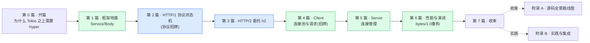

# 《hyper 设计与实现深入浅出:Tokio 之上怎么写一个高性能 HTTP 库》—— 目录与导读

> 一本写给"用 Rust 写过 Web 服务(axum/reqwest)、知道底层是 hyper、翻过 hyper 源码,却一知半解"的人的小书。
>
> **一句话主旨**:把 HTTP 协议机(HTTP/1 状态机 + HTTP/2 多路复用)无缝建在 Tokio 异步运行时之上——每个连接一个 task,IO 用 AsyncRead/AsyncWrite,Service 把请求处理抽象成 Future。hyper 是 Tokio 之上第一层,也是 axum/tonic/reqwest/Pingora 的共同地基。
>
> **二分法**(迷路时回到它):**协议侧**(HTTP/1 解析编码状态机 + HTTP/2 via h2) vs **框架侧**(Service trait + 连接池 + Body Stream + buffered IO)。
>
> **承接**:★强承接《Tokio》(每个连接一个 task、IO 用 AsyncRead/AsyncWrite、Body 是 Stream、Service 返回 Future——Tokio 讲透的一句带过指路)+ 承接《gRPC》(HTTP/2 实现对照:C++ chttp2 vs Rust h2)+ 横连《内存分配器》(bytes 零拷贝)、《Envoy》(HTTP/1 状态机对照 HCM)。
>
> **主比喻**:直球为主、比喻点睛。开篇用"流水线"做一次性点位睛——Tokio 是车间(运行时),hyper 是把 HTTP 这道工序装进车间的流水线。

每章一行:**一句话钩子** —— 技巧标签 —— 二分法归属(`协议` / `框架` / `总览`)。

---

## 全书结构总览

旅程:从"一根 Tokio task",一路走到"一个高性能 HTTP 库怎么把协议机装在运行时上"。读完你能在脑子里放映出:TCP 字节被 reactor 唤醒 → buffered IO 读进 → HTTP/1 状态机切成请求 → Service(Future)处理 → 响应 Body(Stream)编码写回——以及每一步 Tokio 怎么被用起来、对照 gRPC chttp2 / Envoy HCM 怎么做。

---

## 第 0 篇 · 开篇:为什么 Tokio 之上需要 hyper

- [P0-01 · 第一性原理:为什么 Tokio 之上需要 hyper](P0-01-第一性原理-为什么Tokio之上需要hyper.md) —— Tokio 给了运行时但没 HTTP;hyper 把 HTTP 协议机装上去,每连接一个 task,Service 把请求抽象成 Future;承 Tokio/对照 gRPC chttp2/是 axum 地基。 —— 协议机×运行时 + 承接 —— `总览`

## 第 1 篇 · 框架地基:Service 与 Body

> hyper 把"处理请求"抽象成 Future、把"体"抽象成 Stream。**建议顺序读**。

- [P1-02 · Service trait:一个请求一个 Future](P1-02-Service-trait-一个请求一个Future.md) —— hyper 怎么把处理 HTTP 抽象成 Service=Fn(Request)->Future<Response>,为什么 call(&self) 且删掉 poll_ready。 —— Service trait + 删 poll_ready 的真相 —— `框架`
- [P1-03 · Tower 与中间件](P1-03-Tower与中间件.md) —— 鉴权/日志/压缩怎么不侵入业务:Service 链(对照 gRPC filter)。 —— Service 中间件链 —— `框架`
- [P1-04 · Body as Stream](P1-04-Body-as-Stream.md) —— 请求/响应体怎么流而非一次拿全:Body 基于 Frame/Stream。 —— Body + Stream + 长度/chunked —— `框架`

## 第 2 篇 · HTTP/1:协议状态机(协议招牌)

> HTTP/1 hyper 自己实现,招牌。**建议顺序读**。

- [P2-05 · HTTP/1 连接与 keep-alive](P2-05-HTTP1-连接与keep-alive.md) —— 一条连接怎么循环处理多请求:dispatch 循环 + keep-alive 复用。 —— dispatch 循环 + keep-alive —— `协议`
- [P2-06 · 请求/响应解析状态机](P2-06-请求-响应解析状态机.md) —— TCP 字节怎么切成请求行/头/body:HTTP/1 解析状态机逐字节推进(对照 Envoy HCM)。 —— 解析状态机 + buffered IO —— `协议(招牌)`
- [P2-07 · chunked、100-continue 与升级](P2-07-chunked-100continue与升级.md) —— 分块边界/期望 100/升级 websocket。 —— chunked 解码 + upgrade —— `协议`
- [P2-08 · HTTP/1 编码与写出](P2-08-HTTP1-编码与写出.md) —— 响应怎么编成字节写出去:编码状态机 + flush 策略。 —— encode 状态机 + flush —— `协议`

## 第 3 篇 · HTTP/2:委托 h2

> HTTP/2 委托 h2 crate,讲 hyper 怎么把请求映射成 stream。

- [P3-09 · HTTP/2 帧与多路复用](P3-09-HTTP2-帧与多路复用.md) —— 一条连接并发跑多请求:多路复用(承 gRPC P2 一句带过)+ hyper 用 h2。 —— 多路复用 + h2 适配 —— `协议`
- [P3-10 · h2 集成:请求映射成 stream](P3-10-h2集成-请求映射成stream.md) —— hyper 怎么把请求映射成 HTTP/2 stream:proto/h2 适配层 SendRequest/RequestStream。 —— hyper↔h2 桥 + 双侧 —— `协议(招牌)`
- [P3-11 · HTTP/2 ping 与流控](P3-11-HTTP2-ping与流控.md) —— hyper 用 h2 的 ping 保活/测 RTT + 流控(承 gRPC BDP 一句带过)。 —— ping + 流控 —— `协议`

## 第 4 篇 · Client:连接池与请求

- [P4-12 · client 连接池与分发](P4-12-client-连接池与分发.md) —— 多请求复用同 host keep-alive 连接:按 host 复用池 + 分发挑连接(对照 gRPC SubChannel)。 —— 连接池 + dispatch —— `框架(招牌)`
- [P4-13 · client/conn:发请求收响应](P4-13-client-conn-发请求收响应.md) —— 一条 client 连接怎么发请求收响应:协议机循环 + SendRequest。 —— client 协议机循环 —— `框架`
- [P4-14 · 连接复用、keep-alive 与重试](P4-14-连接复用-keep-alive与重试.md) —— 连接何时复用何时关:keep-alive 复用 + 失效处理 + HTTP/2 单连接多 stream。 —— keep-alive + 失效 —— `框架`

## 第 5 篇 · Server:连接管理

- [P5-15 · server 接受连接与服务](P5-15-server-接受连接与服务.md) —— server 怎么 accept + 每连接 spawn task(承 Tokio spawn)+ service::http。 —— accept + spawn task —— `框架`
- [P5-16 · graceful shutdown 与升级](P5-16-graceful-shutdown与升级.md) —— server 优雅关闭 + 协议升级(websocket/h2c)。 —— graceful shutdown + upgrade —— `框架`

## 第 6 篇 · 性能与演进

- [P6-17 · bytes 零拷贝与 buffered IO](P6-17-bytes零拷贝与buffered-IO.md) —— HTTP 字节怎么零拷贝传递:bytes 引用计数(对照内存分配器/gRPC slice)+ buffered IO。 —— bytes 零拷贝 + buffered IO —— `框架(招牌)`
- [P6-18 · 性能:背压、timer、IO 调优](P6-18-性能-背压-timer-IO调优.md) —— 不淹不饿 + 控超时:协议层背压(in_flight/流控,承 budget)+ timer(承时间轮)。 —— 背压 + timer + IO —— `框架`
- [P6-19 · hyper 1.0 三分重构演进](P6-19-hyper-1.0-三分重构演进.md) —— 为什么 1.0 把 client/server/service 拆开、Body 重做:可组合性/零成本。 —— 1.0 三分重构 —— `框架`

## 第 7 篇 · 收束

- [P7-20 · 全书收束:hyper 在 Rust 异步栈的位置](P7-20-全书收束-hyper在Rust异步栈的位置.md) —— hyper 在栈的位置 + 对照 gRPC chttp2/Envoy HCM + axum/tonic 怎么建在它上。 —— 栈定位 + 双对照 —— `总览`

## 附录

- [附录 A · hyper 源码全景路线图](附录A-源码全景路线图.md) —— tokio::net→common/io→proto/{h1,h2}→service→client/conn/server 全栈地图 + 阅读顺序。
- [附录 B · hyper 实践与集成](附录B-实践与集成.md) —— axum/reqwest/tonic 怎么建在 hyper、直接写 client/server、调优、Tokio 运行时配置、排查清单。

---

## 推荐阅读路线

**主线(推荐)**:P0-01 → 第 1 篇全(P1-02~04)→ 第 2 篇全(P2-05~08,协议招牌)→ 第 3 篇 → 第 4 篇 → 第 5 篇 → 第 6 篇 → 第 7 篇 → 附录 A。这是"一次 HTTP 请求在 hyper 里跑完协议+框架两面"的完整旅程。

按目标速查:

| 你的目标 | 读这几章 |
|------|------|
| 只想懂 hyper 整体 | P0-01 → P1-02 → P7-20 |
| 只想懂 HTTP/1 协议机(招牌) | P2-05~08 |
| 只想懂 HTTP/2 怎么用 | P3-09~11 |
| 只想懂 client 连接池 | P4-12~14 |
| 读过 Tokio 想看运行时怎么被用 | P1-02(Service/Future)→ P2-06(AsyncRead 状态机)→ P6-17(buffered IO) |
| 读过 gRPC 想看 HTTP/2 对照 | P3-09~11(h2 vs chttp2)→ P7-20 |
| 用 axum/reqwest 想懂底层 | P1-02~04 → P4-12 → 附录 B |
| 想读 hyper 源码 | 附录 A + 跟本书章节逐个啃 |

> 一个提醒:第 1、2 篇有紧密顺序(框架地基→协议机),**别跳**;本书处处承 Tokio、对照 gRPC,读过那两本收获翻倍。

---

## 配套文件

- [全书规划-总纲](全书规划-总纲.md) —— 主线、二分法、承接 Tokio/gRPC、比喻、分篇分章、源码策略。
- [_章节写作提示词](_章节写作提示词.md) —— 写作执行手册(铁律、四段式、技巧精解、承接铁律)。
- 源码(本地 clone):`../hyper/`(hyperium/hyper,master @ `aecf5abf`,版本 1.10.1)。引用经 Grep/Read 核实行号,钉死在该 commit。
- 承接:[[tokio-series-project]]/[[tokio-source-facts]](运行时)、[[grpc-series-project]](HTTP/2)、[[alloc-series-project]](bytes)、[[envoy-series-project]](HCM 对照)。

---

> 这本书讲的不是"hyper 的 API 怎么用",而是"它凭什么把 HTTP 协议机无缝建在 Tokio 上、源码里那些 Service trait、HTTP/1 状态机、h2 集成、连接池、bytes 零拷贝到底在干什么"。读完,你该能在脑子里放映出一次 HTTP 请求在 hyper 里的全过程——以及每一步 Tokio 怎么被用、对照 gRPC/Envoy 怎么做。
