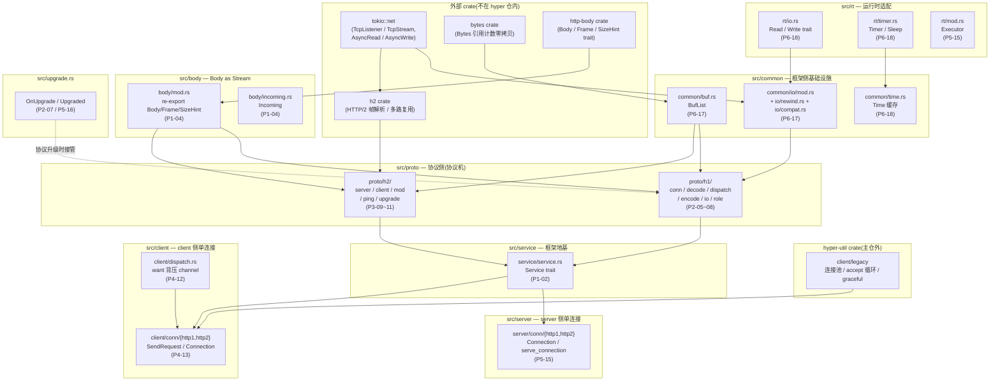
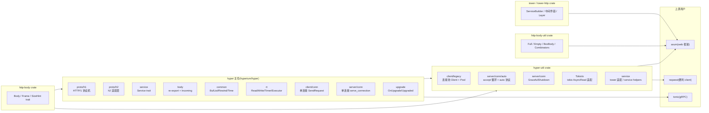

# 附录 A · hyper 源码全景路线图

> 给"读完前面 20 章,想自己下到 hyper 仓里一条一条啃源码"的读者一张地图。
>
> 本文不是平铺的文件清单,而是一份**阅读路线图**:按"一条连接从生到灭穿过的代码层"这条主线,逐模块讲清楚——这个目录管什么、哪几个文件是核心、关键结构在哪一行(配真实行号,基于 `hyper @ aecf5abf, 1.10.1`)、对应本书哪一章、读这里最容易踩什么坑。
>
> 读源码的正确姿势只有一句:**追一条连接的生命周期,从 `tokio::net::TcpStream` 进来,一层层往里钻,直到看见字节怎么变成一个 `Request`,再怎么变成字节写出去。**中途分叉去看细节,不要从 `src/lib.rs` 顺着模块顺序平铺读——那样会把 HTTP/1 状态机、Service trait、连接池读成三座孤岛,丢了 hyper 的命脉。

---

## A.0 一句话:怎么读 hyper 源码

> **从一条连接的生命周期切入,而不是从目录结构切入。**

hyper 是一个"把 HTTP 协议机建在 Tokio 之上"的库,它的所有代码都服务于"一次 HTTP 请求在一条 TCP 连接上的完整旅程"。所以最有效的读法是:

1. 先盯住**一条 HTTP/1 server 连接**:它怎么从 `tokio::net::TcpListener::accept` 出来,怎么被包成 `Conn`,怎么进 `Dispatcher::poll_loop` 循环,每一轮循环里字节怎么被 `Buffered` 读进来、怎么被 `Decoder` 切成请求行和头、怎么交给 `Service::call` 得到一个 Future,响应怎么被 `Encoder` 编成字节经 `Buffered` 写出去。这一条线走完,你就看懂了 hyper 的骨架。
2. 再切到**一条 HTTP/2 连接**:同样的骨架,只是协议机换成 `h2` crate,h1 的 `Dispatcher` 换成 `Server`/`ClientTask`。对比着读,你就看清了"协议侧 vs 框架侧"的二分。
3. 最后切到 **client 侧**:同样的骨架,只是方向反过来——`SendRequest` 把请求推进去,响应收回来。再往上跳一层到 `hyper-util`,看连接池怎么把一堆 keep-alive 连接复用起来。

附录 A 就是按这条阅读路线,逐模块告诉你"走到这一层,打开哪个文件,看哪个结构,对应本书哪一章"。

---

## A.1 全栈地图:一条连接穿过哪些层

先把全栈画出来,后面的逐模块讲解都在这张图里定位。



图里每一格都标了"对应本书哪一章"。读源码时,先从下往上看(`tokio::net` → `common/io` → `proto/h1` → `service` → `server/conn`),把"一条 server HTTP/1 请求"的链路在脑子里走通;再横向对比 `proto/h1` 和 `proto/h2`,看清协议侧的两个分支;最后跳到 `client` 看 client 侧对称结构。

**一句话记住这张图**:`tokio::net` 在最底下提供字节流,`common` 做 buffered 包装,`proto` 把字节切/编成 HTTP 消息,`body`/`service` 提供抽象,`client`/`server` 把这些组装成可用 API——协议侧在 `proto`,框架侧在 `common`/`body`/`service`/`client`/`server`。

---

## A.2 逐模块讲(按推荐阅读顺序)

下面按"追一条连接"的阅读顺序,逐模块拆。每个模块给:**职责 + 关键文件 + 关键结构(配行号)+ 对应本书章节 + 易翻车点**。

---

### A.2.1 `src/proto/h1/` —— HTTP/1 协议机(协议侧招牌,从这里开始读)

**这是读 hyper 源码的第一站**,因为 HTTP/1 是 hyper 自己实现的协议机(不依赖外部 crate),状态机、编码、解码、分发全在这里,看懂它就懂了 hyper"协议机"的命脉。对应本书**第 2 篇(P2-05~08)**。

**六个文件,各司其职**:

| 文件 | 管什么 | 关键结构 |
| --- | --- | --- |
| [`conn.rs`](../hyper/src/proto/h1/conn.rs) | 一条 HTTP/1 连接的状态机容器,持有 IO 和编解码器 | `Conn<I, B, T>` @ L38 |
| [`decode.rs`](../hyper/src/proto/h1/decode.rs) | 把字节切成请求行 / 头 / body(解析状态机) | `Decoder` @ L32 |
| [`encode.rs`](../hyper/src/proto/h1/encode.rs) | 把响应编成字节(编码状态机) | `Encoder` @ L22 |
| [`dispatch.rs`](../hyper/src/proto/h1/dispatch.rs) | 连接上的循环:解析一个请求 → 交给 Service → 编码响应 → 再来 | `Dispatcher<D, Bs, I, T>` @ L22, `Dispatch` trait @ L30 |
| [`io.rs`](../hyper/src/proto/h1/io.rs) | buffered IO,在 AsyncRead/AsyncWrite 之上做缓冲 | `Buffered<T, B>` @ L32, `MemRead` trait @ L340 |
| [`role.rs`](../hyper/src/proto/h1/role.rs) | server / client 两种角色的差异(server 怎么解析请求 / client 怎么解析响应) | `Server` / `Client` 两个 phantom(由 `Http1Transaction` trait 统一) |

**`Conn` 是一条 HTTP/1 连接的"主对象"**,它持有底层 IO(TCP stream)、一对 `Encoder`/`Decoder`、一个 `Buffered`(buffered IO)。注意 `Conn` 的第三个泛型参数 `T: Http1Transaction` 就是"角色"——它要么是 `Server`,要么是 `Client`,用同一个结构体跑两种角色,差异通过 `Http1Transaction` trait 的方法(如 `parse_message` / `encode`)分派到 `role.rs`。这是 hyper 协议机的"模板方法"技巧:一套骨架(`Conn` + `Dispatcher`),两个角色实现。

**`Dispatcher::poll_loop` 是整个 HTTP/1 协议机的心脏**。每轮循环做三件事(对应本书 P2-05):

1. `poll_msg` ——从 dispatch(对 server 是 `Service::call` 返回的 Future,对 client 是用户 push 进来的请求)拿一个要处理的(请求或响应);
2. 调 `Conn::poll_read_head` ——`Decoder` 把字节切成 head + body;
3. 调 `Conn::poll_write` ——`Encoder` 把响应编成字节,经 `Buffered` flush 出去。

循环回到顶部,继续处理下一个请求(keep-alive)。整个循环跑在一个 Tokio task 上,靠 `cooperative` budget 让出(承接 [[tokio-source-facts]] budget=128,一句带过)。

**`Dispatcher` 内部的 `Server` 和 `Client` 两个 dispatch 实现**(dispatch.rs:48 起):server 侧的 `Server` 持有 `in_flight: Pin<Box<Option<S::Future>>>`(L49)——这是**单槽背压**的关键,hyper 1.0 用它替代了 Tower 的 `poll_ready`:server 一条连接同一时刻最多处理一个请求(除非 HTTP/2),所以一个单槽 Future 就够了,不需要复杂的 ready 协商。client 侧的 `Client`(dispatch.rs:56 起)持有一个 `Callback`(给上层回响应的 channel)。

**`Buffered`(io.rs:32)是 HTTP/1 的 buffered IO**,它不是 `tokio::io::BufReader`,而是 hyper 自己写的——因为 HTTP/1 解析经常要"先读一小段看够不够切出请求行,不够再读",普通 BufReader 的 API 不够顺手。`Buffered` 提供 `read_until`/`read_exact`/`read` 这套语义,内部用 `bytes::BytesMut` 当缓冲。`MemRead` trait(io.rs:340)是"如果缓冲里已经有足够字节就别真读 IO"的优化路径——HTTP/1 的请求头通常很小,一次读进来就够切好几个,后续 `read` 直接从内存缓冲取,不碰 syscall。这是 hyper HTTP/1 快的一个重要技巧,详见本书 P6-17。

**`Decoder`(decode.rs:32)是 HTTP/1 解析状态机**,它不一次性把字节吃完,而是返回 `Decoder::Len` / `Decoder::Chunked` / `Decoder::Eof` 这种"接下来怎么读 body"的指令——head 部分用更细粒度的状态机切(请求行 / header name / header value / 空行),body 部分按 `Decoder` 返回的策略读。这个"两阶段"设计(先切 head,再按策略读 body)是 HTTP/1 解析的核心,本书 P2-06 招牌照章拆透。

**易翻车点**:
1. **别把 `proto/h1/io.rs` 的 `Buffered` 和 `common/io` 搞混**。`common/io`(`mod.rs`/`rewind.rs`/`compat.rs`)是给上层(server/conn、upgrade)用的 IO 包装抽象,真正的 buffered 读写在 `proto/h1/io.rs`。很多读者第一眼去 `common/io` 找 buffered,找不到就懵了。本书 P6-17 明确区分这两层。
2. **`Conn` 的泛型 `T: Http1Transaction` 不是 IO 类型**,是"角色"。IO 是第一个泛型 `I`。读源码时把 `I` 当底层流、`T` 当角色标记,就不会被泛型绕晕。
3. **`Dispatcher::poll_loop` 不是 `loop { }`**,而是一个被 `poll` 驱动的状态机——每一轮 `poll` 推进一步,然后返回 `Poll::Pending`,把控制权还给 Tokio。这是 hyper 把同步式的 HTTP/1 循环塞进 async 模型的方式,详见 P2-05。
4. **`role.rs` 里 `Server` 和 `Client` 是空结构体**(phantom 标记),它们的差异全在 `Http1Transaction` trait 的 impl 块里。想看"server 怎么解析请求行",直接 grep `impl Http1Transaction for Server`。

---

### A.2.2 `src/proto/h2/` —— HTTP/2:委托 h2 crate(协议侧第二分支)

HTTP/2 hyper **不自己实现协议机**,而是委托 `h2` crate(`h2` 在外部仓,hyper 只写"怎么把 hyper 的请求/响应映射成 h2 的 stream")。对应本书**第 3 篇(P3-09~11)**。

**五个文件**:

| 文件 | 管什么 | 关键结构 |
| --- | --- | --- |
| [`mod.rs`](../hyper/src/proto/h2/mod.rs) | 共享逻辑:把 hyper Body 灌进 h2 SendStream | `PipeToSendStream<S>` @ L95, `SPEC_WINDOW_SIZE = 65_535` @ L29 |
| [`server.rs`](../hyper/src/proto/h2/server.rs) | server 侧:h2 连接 → 多个 hyper 请求 | `Server<T, S, B, E>` @ L83, `Config` @ L44 |
| [`client.rs`](../hyper/src/proto/h2/client.rs) | client 侧:多个 hyper 请求 → h2 stream | `ClientTask<B, E, T>` @ L425, `Config` @ L64 |
| [`ping.rs`](../hyper/src/proto/h2/ping.rs) | keepalive ping + BDP 探测 | `Recorder` @ L109, `Ponger` @ L113, `Bdp` @ L114 |
| [`upgrade.rs`](../hyper/src/proto/h2/upgrade.rs) | HTTP/2 的协议升级(扩展连接) | `H2Upgraded` 等 |

**关键设计差异 vs HTTP/1**:
- HTTP/1 是"一条连接一个请求",所以有 `Dispatcher::poll_loop` 这个循环;
- HTTP/2 是"一条连接多路复用 N 个 stream",所以 `Server`/`ClientTask` 不是循环,而是**事件驱动**:h2 在底下跑(它自己管 stream 的多路复用),hyper 在上面通过 `h2::server::handshake` / `h2::client::handshake` 拿到 h2 的句柄,每来一个 stream 用 `PipeToSendStream` 把 hyper Body 接上去。

**`PipeToSendStream`(mod.rs:95)是"把 hyper 的 `Body<Data>` 灌进 h2 的 `SendStream`"的桥**。它实现 `Future`,poll 时从 hyper Body 拉一个 `Frame`(data / trailers),写进 h2 SendStream,直到 Body 结束。这是"Body as Stream"模型在 HTTP/2 侧的落地——对照 HTTP/1 的 `Conn::poll_write` 把 Body 写进 buffered IO,是同一个抽象的两个协议实现。本书 P3-10 招牌照章拆这个适配层。

**`SPEC_WINDOW_SIZE = 65_535`(mod.rs:29)** 是 HTTP/2 spec 定义的默认初始窗口大小——注意这个常量名带 `SPEC_`,意思是"spec 规定的默认值",hyper 自己的默认配置(`adaptive_window` 等)在 `Config` 里可调。读 h2 相关代码常看到 `65535` 这个数字,记住它就是初始 flow-control window,跟《gRPC》第 2 篇讲的 HTTP/2 流控是同一套(一句带过指路)。

**`Recorder`/`Ponger`/`Bdp`(ping.rs:109/113/114)** 是 HTTP/2 keepalive 和 BDP 探测的三件套:`Recorder` 在 hyper 这边记录"什么时候发了 ping",`Ponger` 在 h2 那边等 pong,`Bdp`(Bandwidth-Delay Product)根据 RTT 估算动态调窗口。这是 HTTP/2 性能调优的核心,本书 P3-11 拆透。

**易翻车点**:
1. **`proto/h2` 里看不到任何帧解析代码**。HTTP/2 的帧/流/HPACK 全在 `h2` crate(外部仓),hyper 这里只做"映射"。想看帧解析,跳到 `h2` 仓——本书 P3 一句带过,篇幅留 hyper 怎么用 h2。
2. **`Server`(h2/server.rs:83)和 `proto/h1/dispatch.rs` 的 `Server`(L48)不是同一个东西**。前者是 h2 的连接级 server,后者是 HTTP/1 dispatch 循环里的 server dispatch。同名不同物,容易混。
3. **HTTP/2 的 keepalive ping 不是 TCP keepalive**,是 HTTP/2 协议层的 PING 帧。两者别混——hyper 用 h2 的 ping 做应用层保活,跟 OS 的 TCP keepalive 没关系。
4. **`proto/h2/mod.rs` 顶部的 `CONNECTION_HEADERS` 静态数组(L36)** 是 RFC 9110 定义的"连接级头"(keep-alive / proxy-connection / transfer-encoding / upgrade),HTTP/2 不允许这些头,hyper 在映射时要剥掉。这是"HTTP/1 → HTTP/2 头清理"的关键,读源码看到这个数组就知道 hyper 在干什么。

---

### A.2.3 `src/service/` —— Service trait(框架侧地基,协议机之上第一层)

这是 hyper"框架侧"的第一块地基:把"处理一个请求"抽象成一个 Future。对应本书 **P1-02(Service trait)+ P1-03(Tower 中间件)**。

**四个文件**:

| 文件 | 管什么 | 关键 |
| --- | --- | --- |
| [`service.rs`](../hyper/src/service/service.rs) | `Service` trait 定义 | `pub trait Service<Request>` @ L32, `fn call(&self, req)` @ L56 |
| [`util.rs`](../hyper/src/service/util.rs) | `service_fn`:把闭包/函数包成 Service | `service_fn` 函数 |
| [`http.rs`](../hyper/src/service/http.rs) | `HttpService`:一个 sealed alias,把 `Service<Request<Body>, Response = Response<Body>>` 收窄 | `HttpService` trait |
| [`mod.rs`](../hyper/src/service/mod.rs) | re-export + 内部 `Service` 的 `poll_ready` 已删的说明 | — |

**核心是 `service.rs:32` 的 `Service` trait**。注意它**只有 `call(&self, req) -> Future`,没有 `poll_ready`**——这是 hyper 1.0 相对 Tower 0.x 的关键简化。Tower 的 `Service` 有 `poll_ready` 做背压协商,hyper 1.0 把它删了,理由是:

1. 背压被挪到了更合适的地方——HTTP/1 用 `Dispatcher` 的 `in_flight` 单槽(dispatch.rs:49),HTTP/2 用 h2 流控,client 用 `SendRequest::poll_ready`(走 `want` channel);
2. `&self` 而非 `&mut self`,让 Service 可以被 `Clone` 后并发处理多个请求(同一连接 HTTP/2 多 stream、不同连接),状态共享走 `Arc<Mutex<_>>`。

源码注释里 service.rs:48-55 把"为什么是 `&self`"讲得很清楚(为 async fn 铺路、为 clone 铺路)。读这段注释就懂了 hyper Service 的设计哲学。

**`service_fn`**(util.rs)是"把任意 `Fn(Request) -> Future` 闭包包成 Service"的辅助函数,hyper 内部和 examples 大量用它。`HttpService`(http.rs)是个 `pub(crate)` 的 sealed alias,把"Request 的 body 是某种具体类型、Response 也是"收窄,让 `Dispatcher` 内部用起来不那么泛型地狱。

**易翻车点**:
1. **`Service` trait 在 `service.rs:32`,不在 `mod.rs`**。很多读者去 `mod.rs` 找 trait 定义,只找到 re-export。
2. **hyper 的 `Service` 不是 Tower 的 `Service`**(后者有 `poll_ready`),两者签名不同。hyper 用自己的,通过 `hyper-util` 的 `tower` 适配层桥接 Tower 生态。本书 P1-03 讲这个桥。
3. **`call` 是 `&self` 不是 `&mut self`**——这是初学者最容易看漏的点,它决定了"Service 必须可 Clone 才能并发"的模式。
4. **中间件链不在 hyper 仓**,在 `tower` crate(ServiceBuilder / layered)。hyper 只提供最朴素的 Service trait + service_fn,中间件组合留给 Tower 生态。本书 P1-03 引用 Tower 说明。

---

### A.2.4 `src/body/` —— Body as Stream(框架侧地基第二块)

把"请求/响应体"抽象成可流的 `Frame` 序列,而不是一次性 `Vec<u8>`。对应本书 **P1-04**。

**三个文件**:

| 文件 | 管什么 | 关键 |
| --- | --- | --- |
| [`mod.rs`](../hyper/src/body/mod.rs) | re-export `http-body` crate 的 `Body`/`Frame`/`SizeHint`,定义 hyper 自己的 `Incoming` | `pub use http_body::{Body, Frame, SizeHint}` @ L23-25, `pub use self::incoming::Incoming` @ L27 |
| [`incoming.rs`](../hyper/src/body/incoming.rs) | `Incoming`:接收到的 body(请求 body for server / 响应 body for client) | `Incoming` 结构 |
| [`length.rs`](../hyper/src/body/length.rs) | `DecodedLength`:解码出来的 body 长度(已知 / chunked / 直到 EOF) | `DecodedLength` |

**关键事实:`Body`/`Frame`/`SizeHint` 这三个 trait 不在 hyper 仓**,在 `http-body` crate(外部)。hyper 的 `body/mod.rs:23-25` 只是 `pub use http_body::{Body, Frame, SizeHint}` 把它们 re-export 出来,让用户不用单独依赖 `http-body`。这是 hyper 1.0 重构的产物:body 模型被抽成独立的 `http-body` crate,hyper 和 `hyper-util` 都依赖它。

**`Incoming`(incoming.rs)** 是"对方发过来的 body"的容器,内部持有底层帧源(h1 的 buffered IO 残余 / h2 的 RequestStream)。它实现 `Body` trait,被用户 poll 出 `Frame<Bytes>`(data 帧)或 `Frame<Trailers>`(尾随头)。本书 P1-04 拆透它怎么和 `proto/h1`/`proto/h2` 接起来。

**`DecodedLength`(length.rs)** 不是简单 `u64`,是一个枚举式的"长度已知 / chunked / 直到连接关闭"三态——因为 HTTP body 的边界确定方式有三种(`Content-Length` / `Transfer-Encoding: chunked` / 都没有就到 EOF),`DecodedLength` 把这三种编码成一个类型,协议机用它决定 body 什么时候算读完。

**易翻车点**:
1. **`Body` trait 在 `http-body` crate,不在 hyper**。grep `trait Body` 在 hyper/src 里找不到——它在依赖仓。hyper 只是 re-export。读源码看到 `body::Body` 要知道类型真身在 `http-body`。
2. **`Incoming` 不是用户构造 body 用的**。用户要发 body,用 `http_body_util::Full` / `Empty` / `BoxBody` 等(在 `http-body-util` crate),或者直接实现 `Body` trait。hyper 仓里没有"构造响应 body 的便捷类型",这是 1.0 重构有意为之——把 body 构造留给生态,hyper 只管"消费 Incoming / 写出任意 Body"。
3. **`Frame` 是 `Frame<T>`**,泛型 `T` 通常是 `Bytes`(data)或 `HeaderMap`(trailers)。初学者常把 Frame 当成字节切片,其实它是个能装 data 或 trailers 的枚举式容器。

---

### A.2.5 `src/common/` —— 框架侧基础设施(IO / buf / time 等)

跨协议、跨 client/server 共用的工具集。对应本书 **P6-17(buf/io)+ P6-18(time)**。

**核心子目录和文件**:

| 路径 | 管什么 | 关键 |
| --- | --- | --- |
| [`common/buf.rs`](../hyper/src/common/buf.rs) | `BufList`:多个 `Buf` 拼一起当一个大 Buf 用(零拷贝拼接) | `BufList<T>` @ L6, `VecDeque<T>` 内部 |
| [`common/io/mod.rs`](../hyper/src/common/io/mod.rs) | 给上层用的 IO 包装抽象(非 buffered!buffered 在 proto/h1/io.rs) | — |
| [`common/io/rewind.rs`](../hyper/src/common/io/rewind.rs) | `Rewind<T>`:把已经读出来的字节"塞回去"再读一次(零拷贝回放,用于协议升级) | `Rewind<T>` @ L11 |
| [`common/io/compat.rs`](../hyper/src/common/io/compat.rs) | 把 `tokio::io::AsyncRead/AsyncWrite` 适配成 hyper `rt::{Read, Write}` | — |
| [`common/time.rs`](../hyper/src/common/time.rs) | `Time`:缓存"当前时间",避免高频请求每次都调 syscall 取时间 | `Time` @ L32 |

**`BufList`(buf.rs:6)是"多个 bytes 切片零拷贝拼一起"的核心**。它内部是一个 `VecDeque<T>`(T: Buf),实现了 `Buf` trait——读它的时候像读一个大 Buf,但底层是多个独立的 `Bytes`(各自引用计数)。HTTP 响应 body 经常是"headers + 几段 data + trailers"拼起来的,用 `BufList` 不用把多段 memcpy 成一段,这是 hyper 零拷贝的关键之一。对照《内存分配器》的 `bytes::Bytes` 引用计数和 gRPC slice,详见本书 P6-17。

**`Rewind<T>`(rewind.rs:11)是"协议升级"的零拷贝功臣**。HTTP/1 升级(websocket / h2c)时,server 可能已经从 TCP 多读了一些字节(属于升级后的协议),这些字节要"塞回"给升级后的 handler。`Rewind<T>` 包一层,先把它缓存的"前置字节"读出来,再透传到底层 IO——这样升级后的协议不会丢字节,也不需要重读 TCP。本书 P2-07 + P5-16 拆透。

**`Time`(time.rs:32)是高频 Date 头的优化**。HTTP 响应要带 `Date` 头,每个请求都调一次 `SystemTime::now()` 在高 QPS 下是 syscall 开销。`Time` 把"当前时间"缓存一段时间(默认一个精度窗口),多个请求复用同一个时间戳——一个毫秒级精度的"时间缓存"。这是 hyper HTTP 性能调优的一个细节,本书 P6-18 提。

**`compat.rs` 把 tokio 的 AsyncRead/AsyncWrite 适配成 hyper 的 `rt::{Read, Write}`**——这是 hyper"运行时无关"设计的一部分(见 A.2.8)。tokio 是默认运行时,但 hyper 允许用户传别的运行时(`Executor`/`Timer`),compat 层做桥。

**易翻车点**:
1. **`common/io` 不是 buffered IO!** buffered 在 `proto/h1/io.rs` 的 `Buffered`。`common/io` 是给上层(server/conn、upgrade、compat)用的"IO 包装抽象"(Rewind / compat 适配)。这两个名字都带"io",极易搞混。读源码看到 `use crate::common::io`,要知道它不是 buffered。
2. **`common/buf.rs` 的 `BufList` 和 `bytes::BytesMut` 不是一回事**。`BytesMut` 是单个可变缓冲,`BufList` 是多个 `Buf` 的链表式拼接。HTTP body 的多段拼接用 `BufList`,单个帧的构造用 `Bytes`/`BytesMut`。
3. **`Time` 缓存的是"wall clock"不是 monotonic**。它给 `Date` 头用(可读时间),不是给超时用(超时用 monotonic `Sleep`,在 rt/timer.rs)。两者别混。

---

### A.2.6 `src/client/` —— client 侧(单连接发请求收响应)

注意:**连接池 `Client` 不在 hyper 仓,在 `hyper-util` crate**(1.0 三分重构把池拆出去)。hyper 主仓的 `src/client/` 只管"单连接"——一条连接怎么把请求发出去、响应收回来。对应本书 **P4-12(池,引用 hyper-util)+ P4-13(单连接)+ P4-14(复用)**。

**核心文件**:

| 路径 | 管什么 | 关键 |
| --- | --- | --- |
| [`client/conn/http1.rs`](../hyper/src/client/conn/http1.rs) | HTTP/1 client 单连接 | `SendRequest<B>` @ L23, `Connection<T, B>` @ L61, `Builder` @ L123, `UpgradeableConnection` @ L604 |
| [`client/conn/http2.rs`](../hyper/src/client/conn/http2.rs) | HTTP/2 client 单连接 | `SendRequest<B>` @ L24, `Connection<T, B, E>` @ L50, `Builder<Ex>` @ L67 |
| [`client/conn/mod.rs`](../hyper/src/client/conn/mod.rs) | 共享的 builder / 握手逻辑 | — |
| [`client/dispatch.rs`](../hyper/src/client/dispatch.rs) | `Sender`/`Receiver`:把用户请求 push 进连接循环的 channel,带 `want` 背压 | `Sender<T, U>` @ L48, `Receiver<T, U>` @ L176, 用 `tokio::sync::{mpsc, oneshot}` + `want` |
| [`client/mod.rs`](../hyper/src/client/mod.rs) | 主要是 re-export 和测试,真正的 `Client`(带池)在 hyper-util | — |

**`SendRequest`(http1.rs:23 / http2.rs:24)是用户拿到的句柄**——调 `send_request(req)` 返回一个 `Future<Output = Response>`,await 它就拿到响应。内部它把请求经 `dispatch::Sender` push 进连接循环(跑在另一个 task 上的 `Dispatcher` 或 `ClientTask`),响应经 oneshot 回来。

**`Connection`(http1.rs:61 / http2.rs:50)是"连接的 Future"**——await 它会让连接循环跑起来(处理 keep-alive 的多个请求),直到连接关闭。用户的典型用法:`let (send_req, conn) = handshake(tcp_stream).await?; tokio::spawn(async move { conn.await });`,把 conn 扔到后台 task,主线程用 send_req 发请求。

**`dispatch.rs` 是 client 侧的背压与 channel 机制**。它用 `tokio::sync::mpsc::unbounded_channel`(L32)传请求,用 `want::new()`(L33)做背压——`want` 是 hyper 生态的轻量背压原语,`Giver`/`Taker` 两个端,接收端只有在上层"想要"时才允许发送。这避免了"用户疯狂 push 请求,连接循环来不及处理"的爆队列。本书 P4-12 + P6-18 拆透这个背压。

**连接池在哪**:`hyper-util/src/client/legacy/{client.rs, pool.rs}`(外部 crate)。hyper 1.0 把池从主仓拆出去,主仓只留单连接。用户要"按 host 复用 keep-alive 连接",用 `hyper_util::client::legacy::Client`,不是 `hyper::client::Client`(后者主仓里基本是空 re-export)。这是读 hyper client 源码最容易踩的坑,本书 P4-12 明确划界。

**易翻车点**:
1. **`hyper::client::Client` 不是连接池**!连接池在 `hyper-util`。hyper 主仓的 `client/` 是单连接层。别在 `src/client/` 里找池代码,找不到。
2. **`SendRequest::poll_ready` 存在但实现简单**——它就是问 `want` channel "你现在能收吗",不是 Tower 那种复杂的 ready 链。读 http1.rs/http2.rs 的 `poll_ready` 要知道它是 want 背压。
3. **`UpgradeableConnection`(http1.rs:604)是 HTTP/1 client 专门为升级准备的连接变体**——普通的 `Connection` 在连接升级(websocket)后会被 drop,`UpgradeableConnection` 保留对底层 IO 的访问,让用户能拿到升级后的流。本书 P5-16 讲。
4. **HTTP/2 client 的 `SendRequest` 是 `Clone`** 的——因为 HTTP/2 多路复用,一个连接多个 stream,多个 `SendRequest` clone 共享底层连接,各自发各自的 stream。HTTP/1 的 `SendRequest` 一般不 Clone(单请求串行)。这个差异读源码时注意。

---

### A.2.7 `src/server/` —— server 侧(单连接服务)

注意:**accept 循环不在 hyper 仓,在 `hyper-util` crate**(`hyper-util/src/server/conn/auto` / `accept`)。hyper 主仓的 `src/server/` 只管"一条已经 accept 下来的连接怎么服务"。对应本书 **P5-15 + P5-16**。

**核心文件**:

| 路径 | 管什么 | 关键 |
| --- | --- | --- |
| [`server/conn/http1.rs`](../hyper/src/server/conn/http1.rs) | HTTP/1 server 单连接 | `Connection<T, S>` @ L40, `Builder` @ L72, `Parts<T, S>` @ L93, `graceful_shutdown` @ L138 |
| [`server/conn/http2.rs`](../hyper/src/server/conn/http2.rs) | HTTP/2 server 单连接 | `Connection<T, S, E>` @ L29, `Builder<E>` @ L42, `serve_connection` @ L306 |
| [`server/conn/mod.rs`](../hyper/src/server/conn/mod.rs) | 共享 builder 逻辑 | — |
| [`server/mod.rs`](../hyper/src/server/mod.rs) | 主要是 re-export | — |

**用法对称于 client**:`Builder::serve_connection(io, service)` 返回一个 `Connection`(它是个 Future),await 它就让这条连接跑完所有请求(keep-alive),直到关闭或升级。`Builder` 配置超时、缓冲大小、keep-alive 策略等。

**accept 循环在哪**:`hyper-util`。用户写 server 的典型代码(`hyper-util` 提供):

```rust
let listener = TcpListener::bind(addr).await?;
loop {
    let (stream, _) = listener.accept().await?;
    let io = TokioIo::new(stream);
    tokio::spawn(async move {
        if let Err(e) = http1::Builder::new()
            .serve_connection(io, svc)
            .await { /* ... */ }
    });
}
```

accept 循环是用户/hyper-util 写的,hyper 主仓的 `serve_connection` 只服务一条连接。本书 P5-15 明确划这条界。

**`graceful_shutdown`(http1.rs:138 / http2.rs:78)** 是优雅关闭:调用后,连接不再接受新请求,但等在途请求处理完才真正关闭。本书 P5-16 拆。`hyper-util` 有更高层的 `GracefulShutdown` 管理整个 accept 循环的优雅关闭。

**`Parts`(http1.rs:93)** 是 `Connection` 的解构——把连接拆成 `io` + `service` + `read_buf`(已经从 TCP 读出来但还没处理的多余字节)。这主要用于"连接被劫持"的场景(升级后用户拿到原始 IO + 残余字节)。本书 P5-16。

**易翻车点**:
1. **`serve_connection` 不 accept!** 它服务一条**已经 accept 下来的**连接。accept 循环在上层(hyper-util / 用户代码)。在 `src/server/` 里找 `TcpListener::accept` 找不到。
2. **`Connection` 是 Future**——await 它驱动这条连接的协议机循环。不是"持有一个连接"的对象。初学者常把 `Connection` 当同步对象用,理解错。
3. **HTTP/2 server 的 `Builder` 有 `max_concurrent_streams` 等 HTTP/2 专属配置**(http2.rs:215 起),HTTP/1 server 的 `Builder` 没有。两个 Builder 不通用。

---

### A.2.8 `src/rt/` —— 运行时适配(让 hyper 不绑死 tokio)

hyper 不直接依赖 `tokio` 的具体类型,而是定义自己的 `rt::{Read, Write, Timer, Sleep, Executor}` 抽象,让用户可以传任意运行时(默认是 tokio,通过 compat 适配)。对应本书 **P6-18**。

**核心文件**:

| 路径 | 管什么 | 关键 |
| --- | --- | --- |
| [`rt/io.rs`](../hyper/src/rt/io.rs) | `Read`/`Write` trait(hyper 自己的,非 std 非 tokio)+ `ReadBuf`/`ReadBufCursor` | `pub trait Read` @ L74, `pub trait Write` @ L94, `ReadBuf` @ L167, `ReadBufCursor` @ L230 |
| [`rt/timer.rs`](../hyper/src/rt/timer.rs) | `Timer`/`Sleep` trait | `pub trait Timer` @ L70, `pub trait Sleep` @ L91 |
| [`rt/mod.rs`](../hyper/src/rt/mod.rs) | `Executor` trait | `pub trait Executor<Fut>` @ L45 |
| [`rt/bounds.rs`](../hyper/src/rt/bounds.rs) | trait bound:把 tokio 的类型约束到 hyper 的 rt 抽象(连接器 trait bound) | — |

**为什么 hyper 要自己定义 `Read`/`Write` 而不直接用 `tokio::io::AsyncRead`?** 因为 hyper 想支持非 tokio 运行时(虽然实践中 99% 用户用 tokio)。hyper 定义 `rt::Read`/`rt::Write`,然后通过 `TokioIo` 包装(`hyper-util` 提供)把 tokio 的 `AsyncRead`/`AsyncWrite` 适配过来。这是"运行时无关"的代价——多一层间接。本书 P6-18 讨论。

**`Timer`(timer.rs:70)/`Sleep`(timer.rs:91)** 是 hyper 的超时抽象。`Timer::sleep(duration)` 返回一个 `Sleep`(它是个 Future)。默认实现是 `tokio::time::Sleep`(经 compat),但用户可以传自己的(比如 mock 测试)。HTTP 的各种超时(read timeout / keep-alive timeout)都走这个抽象。

**`Executor`(mod.rs:45)** 是"spawn 一个 Future"的抽象。HTTP/2 server 需要为每个 stream spawn task(因为多路复用),用 `Executor` 抽象,默认是 `tokio::runtime::Handle::spawn`。这也是为什么 `http2::Builder` 有 `executor` 配置。

**易翻车点**:
1. **`rt::Read`/`rt::Write` 不是 `std::io::Read` 也不是 `tokio::io::AsyncRead`**!是 hyper 自己的第三套。看到 `impl Read for ...` 在 hyper 仓里,要分清是哪套。`rt/io.rs` 的注释解释了为什么不用 std/tokio 的(主要是 trait 设计和 Send/Sync bound 的权衡)。
2. **`ReadBuf`/`ReadBufCursor`(io.rs:167/230)是 hyper 自己的缓冲抽象**,设计上借鉴了 std 的 `ReadBuf` 但有差异(初始化语义、unsafe 边界)。读这部分源码要小心 unsafe 块的契约。
3. **`bounds.rs` 的 trait bound** 把"实现 tokio AsyncRead + 'static + Send"的类型自动满足 hyper 的 `rt::Read`——这是 `TokioIo` 包装能 work 的类型层基础。读 bounds.rs 能看到 hyper 怎么在类型层桥接两个运行时。

---

### A.2.9 `src/upgrade.rs` —— 协议升级(websocket / h2c)

HTTP/1 升级(websocket / CONNECT / h2c)的核心机制。对应本书 **P2-07 + P5-16**。

**核心结构**(都在 [`upgrade.rs`](../hyper/src/upgrade.rs)):

| 结构 | 行号 | 管什么 |
| --- | --- | --- |
| `OnUpgrade` | L74 | 一个 Future,await 它拿到升级后的 `Upgraded` 流 |
| `Upgraded` | L66 | 升级后的 IO(trait object,持有原始 IO + 残余字节) |
| `Parts<T>` | L84 | `Upgraded` 的解构,拿到强类型 IO + read_buf |
| `on()` | L106 | 内部函数,创建 (Pending, OnUpgrade) 对 |
| `Pending` | L114 | 内部,连接端持有的"待升级"句柄 |

**升级机制**:HTTP/1 请求带 `Upgrade: websocket` 头,server 同意后返回 `101 Switching Protocols`,之后这条 TCP 连接不再是 HTTP,归升级后的协议(websocket)用。hyper 的处理:

1. `proto/h1` 检测到升级请求,经 `on()`(upgrade.rs:106)创建 `OnUpgrade`/`Pending` 对;
2. `OnUpgrade` 放进 `Request::extensions()` 传给 Service;
3. Service 决定升级,await `OnUpgrade` 拿到 `Upgraded`(它持有底层 IO + 已经从 TCP 多读的"残余字节",经 `Rewind` 零拷贝回放);
4. 之后 hyper 不再管这条连接,Service/上层(websocket 库)接管。

**`Upgraded`(L66)内部是 trait object**(`Box<dyn Io>`,见 `Io` trait @ L291),因为 hyper 不知道升级后用户要什么具体 IO 类型。用户要拿强类型,用 `Parts<T>`(L84)解构。这部分有 unsafe(downcast trait object 到具体类型),注释 L310-317 解释了为什么 sound。

**HTTP/2 升级在 `proto/h2/upgrade.rs`**(`H2Upgraded` 等),机制类似但走 h2 的 extended CONNECT。本书 P5-16 拆。

**易翻车点**:
1. **`OnUpgrade` 在 `Request::extensions()` 里,不是 `Request` 的字段**。用户要 `req.extensions().get::<OnUpgrade>()` 才能拿到。很多教程漏掉这步。
2. **`Upgraded` 持有"残余字节"**——升级前 hyper 可能已经从 TCP 多读了一些字节(属于升级后协议),这些字节在 `Upgraded` 里,经 `Rewind` 塞回。如果升级后协议不读这些字节,数据会丢。本书 P2-07 强调。
3. **不是所有 IO 类型都能升级**——`upgrade.rs` 的 `on()` 要求 `T: sealed::CanUpgrade`(L106),这是一个 sealed trait,限制了可升级的 IO 类型。用户自定义 IO 要升级,需要满足这个 bound。

---

### A.2.10 其他目录(快速带过)

- **`src/ext/`**:`h1_reason_phrase.rs` / `informational.rs`,hyper 的扩展类型(非标准 HTTP 头的 Rust 类型表示),影响小,初读可跳。
- **`src/ffi/`**:C API 绑定(给非 Rust 调用方),`body.rs`/`client.rs`/`error.rs`/`http_types.rs`/`io.rs`/`macros.rs`/`mod.rs`/`task.rs`。除非你在做 FFI 集成,否则跳过——它不影响理解 hyper 核心机制。
- **`src/headers.rs`**:一些 header 处理的内部辅助。
- **`src/error.rs`**:`Error`/`Result` 类型,hyper 的错误体系。读源码遇到 `crate::Error` 来这里查错误种类。
- **`src/trace.rs`**:tracing 宏(默认禁用,需 `tracing` feature)。
- **`src/cfg.rs`**:`cfg_proto!`/`cfg_feature!` 等宏,按 feature gate 编译模块。读 `lib.rs` 看到 `cfg_feature! { #![feature = "client"] pub mod client; }` 就是这些宏在控制哪些模块编进去。
- **`src/mock.rs`**:测试 mock,只在 test feature 下编译。

初读源码,这几个目录都不用深挖,聚焦前面 9 个模块就够。

---

## A.3 "按目的读"速查表

不要从头读到尾。按你想搞懂的东西,定向打开文件:

| 你的目的 | 读哪里 | 本书章节 |
| --- | --- | --- |
| 想懂 **HTTP/1 字节怎么切成请求** | `proto/h1/decode.rs`(`Decoder` @ L32)+ `proto/h1/io.rs`(`Buffered` @ L32) | P2-06(招牌) |
| 想懂 **HTTP/1 响应怎么编成字节** | `proto/h1/encode.rs`(`Encoder` @ L22)+ `role.rs` | P2-08 |
| 想懂 **一条 HTTP/1 连接怎么循环处理请求** | `proto/h1/conn.rs`(`Conn` @ L38)+ `dispatch.rs`(`Dispatcher::poll_loop`/`Dispatch` trait @ L30) | P2-05 |
| 想懂 **HTTP/2 多路复用怎么落地** | `proto/h2/mod.rs`(`PipeToSendStream` @ L95)+ `server.rs`/`client.rs` | P3-09 / P3-10(招牌) |
| 想懂 **HTTP/2 ping / 流控 / BDP** | `proto/h2/ping.rs`(`Recorder` @ L109, `Bdp` @ L114) | P3-11 |
| 想懂 **Service trait 怎么定义** | `service/service.rs`(`Service` @ L32,无 `poll_ready`) | P1-02 |
| 想懂 **Body 怎么流** | `body/mod.rs`(re-export http-body)+ `body/incoming.rs`(`Incoming`) | P1-04 |
| 想懂 **零拷贝 / BufList** | `common/buf.rs`(`BufList` @ L6)+ `proto/h1/io.rs`(`MemRead` @ L340) | P6-17(招牌) |
| 想懂 **协议升级(websocket)的零拷贝回放** | `common/io/rewind.rs`(`Rewind` @ L11)+ `upgrade.rs`(`Upgraded` @ L66) | P2-07 / P5-16 |
| 想懂 **client 单连接发请求** | `client/conn/http1.rs`(`SendRequest` @ L23, `Connection` @ L61)+ `dispatch.rs`(`Sender` @ L48, want 背压) | P4-13 |
| 想懂 **client 连接池 / 复用** | **`hyper-util/src/client/legacy/{client.rs, pool.rs}`**(外部 crate!) | P4-12(招牌) |
| 想懂 **server accept + 每连接 task** | `server/conn/http1.rs`(`serve_connection`)+ **`hyper-util` 的 accept 循环**(外部) | P5-15 |
| 想懂 **graceful shutdown** | `server/conn/http1.rs`(`graceful_shutdown` @ L138)+ **`hyper-util` 的 GracefulShutdown** | P5-16 |
| 想懂 **背压(为什么不淹不饿)** | `proto/h1/dispatch.rs`(`Server::in_flight` @ L49,单槽)+ `client/dispatch.rs`(`want` channel)+ HTTP/2 h2 流控 | P6-18 |
| 想懂 **超时 / 时间** | `rt/timer.rs`(`Timer` @ L70, `Sleep` @ L91)+ `common/time.rs`(`Time` @ L32, Date 头缓存) | P6-18 |
| 想懂 **hyper 怎么不绑死 tokio** | `rt/{io.rs, timer.rs, mod.rs}`(自造 trait)+ `rt/bounds.rs`(tokio 桥) | P6-18 |
| 想懂 **hyper 1.0 为什么这么重构** | `lib.rs`(模块组织)+ CHANGELOG + 对比 `hyper-util`/`http-body` 边界 | P6-19 |

---

## A.4 hyper 1.0 三分的源码体现(一张图说清边界)

hyper 1.0(2023)是一次重大重构,把"大一统的 hyper 0.14"拆成了三块独立 crate + 周边生态。读源码前必须搞清楚边界,否则会在错误的仓里找东西。对应本书 **P6-19**。



**三块的核心职责**:

1. **`hyper` 主仓**:`proto/h1`(HTTP/1 协议机)、`proto/h2`(h2 适配)、`service`(Service trait)、`body`(re-export + Incoming)、`common`(BufList/Rewind/Time)、`rt`(运行时抽象)、`client/conn` + `server/conn`(单连接 API)、`upgrade`(协议升级)。**这是"协议机 + 最小框架"**,不包含连接池、accept 循环、便利构造器。
2. **`hyper-util` crate**:连接池(`client/legacy/Client`/`Pool`)、accept 循环(`server/conn/auto`)、graceful shutdown、`TokioIo`(tokio 适配)、tower 桥。**这是"把 hyper 单连接组装成可用 client/server 的胶水"**。
3. **`http-body` crate**:`Body`/`Frame`/`SizeHint` trait 定义。**这是"body 模型的协议无关抽象"**,hyper 和 hyper-util 都依赖它。
4. **`http-body-util` crate**:`Full`/`Empty`/`BoxBody` 等 body 构造器(用户构造响应 body 用)。
5. **`tower` / `tower-http` crate**:中间件链(`ServiceBuilder` / `Layer`)。

**为什么这么拆**(本书 P6-19 详拆):
- **可组合性**:hyper 主仓不绑死 tokio(自造 `rt` 抽象),不绑死任何 body 实现(用 `http-body` trait),不绑死任何运行时(`Executor` 可注入)。这样 axum / tonic / reqwest / Pingora 各取所需。
- **零成本**:用户只要协议机,就只依赖 hyper 主仓;要便利,加 hyper-util;要中间件,加 tower。各层编译成本可控。
- **演进自由**:hyper 主仓 API 稳定(SemVer),hyper-util 可以快速迭代便利 API,http-body 独立演进。

**读源码的实践**:
- 找连接池代码,去 `hyper-util`;
- 找 body trait 定义,去 `http-body`;
- 找 body 构造器,去 `http-body-util`;
- 找中间件,去 `tower` / `tower-http`;
- 找 HTTP 协议机本身、Service trait、单连接 API,才在 hyper 主仓。

这是读 hyper 源码最重要的"边界意识"——别在主仓里找池、找中间件、找 body 构造器,都找不到。

---

## A.5 调试与阅读技巧

### A.5.1 怎么 grep 一个 opcode / 状态

hyper 用 Rust 写,grep 比看二进制友好得多。几个常用姿势:

**找一个 HTTP/1 解析状态**:`grep -rn "enum State" hyper/src/proto/h1/` —— `Decoder` 的内部状态机枚举。想看"读请求行"是哪个状态,grep `RequestLine` / `Headers` / `Body`。

**找一个特定的头处理**:`grep -rn "TRANSFER_ENCODING\|CONTENT_LENGTH\|CONNECTION" hyper/src/proto/h1/` —— 看 chunked / keep-alive / content-length 怎么被解析。

**找一个 opcode / 错误码**:`grep -rn "ErrorKind\|Kind::" hyper/src/error.rs` —— hyper 的错误种类枚举,排查具体错误从这里入手。

**找一个 feature gate**:`grep -rn "cfg_feature\|cfg_proto\|cfg_client\|cfg_server" hyper/src/` —— 看哪些代码在哪个 feature 下编译。

### A.5.2 怎么用 examples 跑

hyper 仓的 `examples/` 目录有 17 个可运行示例,是读源码的最佳伴侣(用 `cargo run --example <name>` 跑):

| 示例 | 演示什么 |
| --- | --- |
| `hello.rs` | 最小 HTTP/1 server,入门第一站 |
| `hello-http2.rs` | 最小 HTTP/2 server,对比 hello.rs 看 h2 差异 |
| `client.rs` | 最小 HTTP/1 client(用 hyper-util) |
| `client_json.rs` | client 收 JSON body |
| `echo.rs` | server 把请求 body 原样返回(Body 流的演示) |
| `gateway.rs` | server + client 组合(代理) |
| `graceful_shutdown.rs` | 优雅关闭(P5-16) |
| `upgrades.rs` | 协议升级(websocket,P2-07) |
| `http_proxy.rs` | HTTP 代理(连接池 + 升级) |
| `multi_server.rs` | 多协议(server/conn/auto) |
| `params.rs` | 路径参数解析 |
| `send_file.rs` | 发文件(TokioIo + fs) |
| `service_struct_impl.rs` | 用自定义 Service struct(不是 service_fn) |
| `single_threaded.rs` | 单线程运行时 |
| `state.rs` | Service 共享状态(Arc<Mutex>) |
| `web_api.rs` | 完整 web server 示例 |

读源码卡住时,找一个最接近的 example 跑起来,加断点(`dbg!` 或 IDE debugger)追一遍,比干看源码快十倍。

**注意**:examples 用 `hyper` + `hyper-util` + `http-body-util` + `tokio` 组合,看 `examples/Cargo.toml` 的依赖就知道每个 example 用了哪些 crate。

### A.5.3 怎么对照本书章节

每个关键源码点,本书正文章节都贴了真实行号。读源码时,翻到对应章节:

- 看到 `proto/h1/decode.rs`,翻 P2-06;
- 看到 `proto/h2/server.rs`,翻 P3-10;
- 看到 `client/dispatch.rs` 的 `want`,翻 P4-12 + P6-18;
- 看到 `common/buf.rs` 的 `BufList`,翻 P6-17。

本书的源码引用都用相对路径 `[描述](../hyper/路径#L起-L止)`,行号基于 `hyper @ aecf5abf (1.10.1)`。如果你本地 clone 的版本不同,行号可能有偏移,以 `git log --oneline` 确认 commit。

### A.5.4 一个推荐的阅读顺序(完整版)

如果你想把 hyper 主仓源码从头到尾啃一遍,推荐这个顺序(约 2~3 周业余时间):

1. **Day 1-2**:`lib.rs`(看模块组织)→ `service/service.rs`(Service trait,最简单)→ `body/mod.rs`(Body re-export)。建立"框架地基"印象。
2. **Day 3-5**:`proto/h1/decode.rs`(HTTP/1 解析,招牌)+ `proto/h1/io.rs`(Buffered)。配合 P2-06。
3. **Day 6-7**:`proto/h1/conn.rs`(Conn)+ `dispatch.rs`(Dispatcher poll_loop)+ `encode.rs`(Encoder)。配合 P2-05 / P2-08。至此 HTTP/1 server 一条连接的全链路通了。
4. **Day 8-9**:`server/conn/http1.rs`(serve_connection)+ 跑 `examples/hello.rs`。把"单连接"和"accept 循环"的界看清楚。
5. **Day 10-11**:`client/conn/http1.rs`(SendRequest / Connection)+ `client/dispatch.rs`(want 背压)+ 跑 `examples/client.rs`。client 侧对称结构通了。
6. **Day 12-14**:`proto/h2/mod.rs`(PipeToSendStream)+ `server.rs` + `client.rs` + `ping.rs`。配合 P3。HTTP/2 落地通了。
7. **Day 15-16**:`common/buf.rs`(BufList)+ `common/io/rewind.rs`(Rewind)+ `upgrade.rs`。配合 P6-17 / P2-07。零拷贝和升级通了。
8. **Day 17-18**:`rt/{io.rs, timer.rs, mod.rs, bounds.rs}`。配合 P6-18。运行时抽象通了。
9. **Day 19-20**:跳到 `hyper-util` 仓,看 `client/legacy/pool.rs`(连接池)+ `server/conn/auto`(accept)+ `TokioIo`。配合 P4-12 / P5-15。完整生态通了。
10. **Day 21+**:按兴趣深入——`ext/`、`ffi/`、`error.rs`、测试、CHANGELOG。

---

## A.6 一份"易翻车点"汇总(读源码前必看)

把前面每个模块的易翻车点集中起来,读源码前过一遍:

1. **buffered IO 不在 `common/io`**,在 `proto/h1/io.rs` 的 `Buffered`(io.rs:32)。`common/io` 是 Rewind / compat 适配层。
2. **`Service` trait 无 `poll_ready`**(service.rs:32),背压挪到了 h1 单槽(dispatch.rs:49)/ h2 流控 / client want channel。
3. **`hyper::client::Client` 不是连接池**!池在 `hyper-util/src/client/legacy`。主仓 `client/` 只管单连接。
4. **`serve_connection` 不 accept**!accept 循环在 `hyper-util` / 用户代码。`server/conn` 只服务一条已 accept 的连接。
5. **`Body`/`Frame`/`SizeHint` trait 在 `http-body` crate**,hyper 只是 re-export(body/mod.rs:23-25)。grep `trait Body` 在 hyper 里找不到。
6. **body 构造器(`Full`/`Empty`/`BoxBody`)在 `http-body-util` crate**,不在 hyper。hyper 仓里没有"构造响应 body 的便捷类型"。
7. **中间件链在 `tower` crate**,不在 hyper。hyper 只提供最朴素的 Service + service_fn。
8. **HTTP/2 帧解析在 `h2` crate**!`proto/h2` 只是"把 hyper 请求映射成 h2 stream"的适配层,看不到帧代码。
9. **`proto/h1` 的 `Server`/`Client`** 和 **`proto/h2` 的 `Server`/`ClientTask`** 是不同结构(h1 在 dispatch.rs, h2 在 server.rs/client.rs),同名不同物。
10. **HTTP/2 keepalive ping 不是 TCP keepalive**,是应用层 PING 帧(proto/h2/ping.rs)。
11. **`rt::Read`/`rt::Write` 是 hyper 第三套 IO trait**,不是 std 也不是 tokio。`bounds.rs` + `TokioIo`(hyper-util)做桥。
12. **`OnUpgrade` 在 `Request::extensions()` 里**,不是 Request 字段,要 `req.extensions().get::<OnUpgrade>()`。
13. **`Time`(common/time.rs)缓存 wall clock**,给 Date 头用,不是超时(超时用 monotonic `Sleep` 在 rt/timer.rs)。
14. **`Conn` 的泛型 `T` 是角色(Server/Client),不是 IO 类型**。IO 是第一个泛型 `I`。
15. **HTTP/2 client 的 `SendRequest` 是 Clone**(多路复用),HTTP/1 的 SendRequest 一般不 Clone(串行)。

---

## A.7 附录小结

回到附录开头的问题:怎么读 hyper 源码?

> **追一条连接的生命周期,从 `tokio::net::TcpStream` 进来,经 `common/io` 包装,进 `proto/h1` 的 `Decoder`/`Encoder`/`Dispatcher`(或 `proto/h2` 的 `Server`/`ClientTask`),交给 `Service`,响应经编码写出去——一层层钻,不要从目录结构平铺读。**

附录 A 给了你:

1. 一张全栈地图(A.1),标出每一层对应本书哪章;
2. 逐模块讲解(A.2),按推荐阅读顺序,每个模块职责 + 关键结构行号 + 对应章节 + 易翻车点;
3. 一张"按目的读"速查表(A.3),你想懂什么,定向打开哪个文件;
4. hyper 1.0 三分的边界图(A.4),搞清主仓 / hyper-util / http-body / tower 各管什么;
5. 调试和阅读技巧(A.5),grep 姿势 + examples + 对照本书章节 + 推荐阅读顺序;
6. 一份易翻车点汇总(A.6),15 条,读源码前过一遍能省大量时间。

读完附录 A,你应该能拿着这份地图,下到 `hyper/src/` 里,自己追出一条 HTTP 请求从字节到响应的完整旅程——并知道每一段在哪一章有详细拆解。源码就在那里,带着这本书去啃,你会发现 hyper 的每个设计都不是凭空的,都是在"把 HTTP 协议机建在 Tokio 之上"这条主线上必然出现的一环。

> **一行行读源码的回报是:你不再只是"用过 hyper",而是能在脑子里放映出一次 HTTP 请求在 hyper 里的全过程——从 TCP 字节被 reactor 唤醒,到协议机切成消息,到 Service 处理,到响应流回去。这是读完一本书之后,把知识钉死的最后一步。**

---

*附录源码引用基于 `hyper @ aecf5abf (1.10.1)`,行号已逐处用 Grep/Read 在 `hyper/src/` 核实。外部 crate(`hyper-util`/`http-body`/`h2`/`tower`/`bytes`)的内部结构本文诚实标注"在 xxx crate",不编造 hyper 行号。若本地版本不同,行号可能偏移,以 `git log` 确认 commit。*
