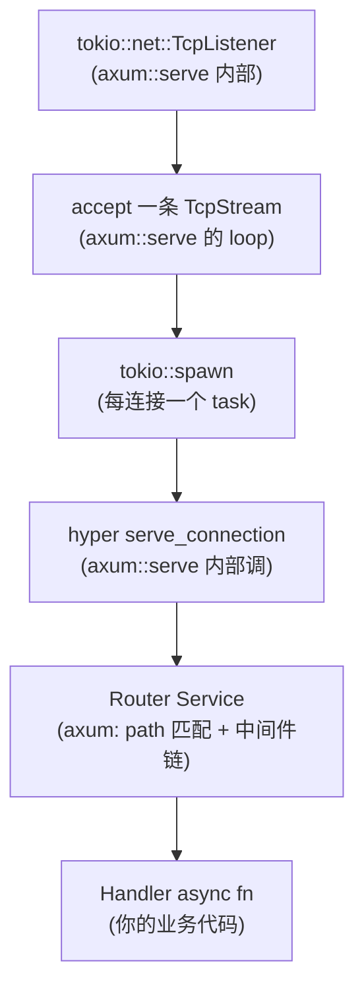
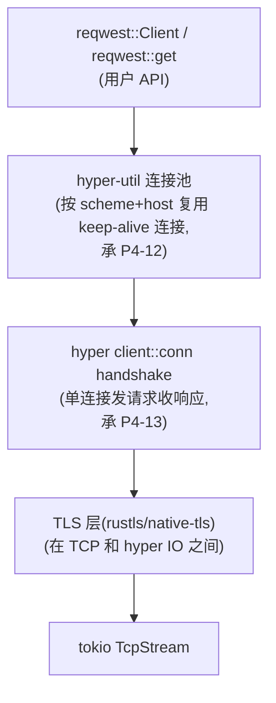
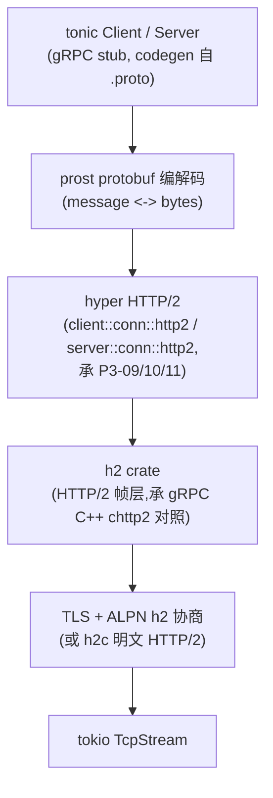
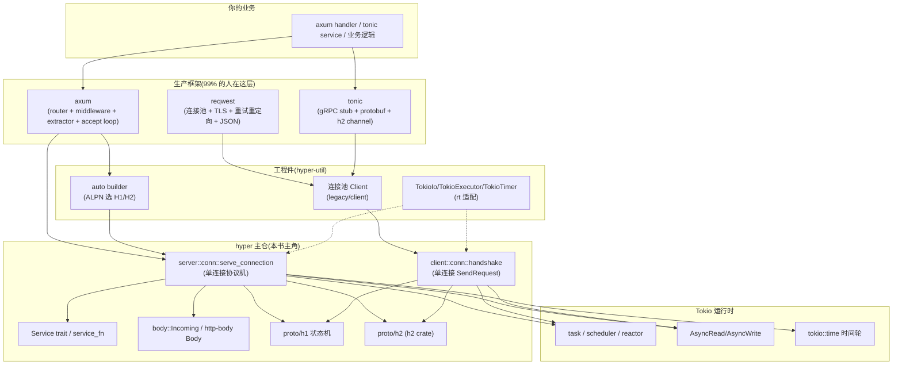

# 附录 B · hyper 实践与集成

> **这个附录要解决的问题**:前面 20 章把 hyper 内部"协议机怎么建在 Tokio 上"拆到了行号,你能讲清 `serve_connection` 内部跑的是什么、连接池为什么按 `(scheme, host)` 分组、HTTP/2 的 ping 怎么测 RTT。但这只回答了"它怎么实现",没回答"**我怎么用它**"。这个附录就是回答后者的——给读者一张"可操作的实践地图":怎么用 hyper 直接写一个能跑的 server 和 client、axum/reqwest/tonic 怎么各自建在 hyper 之上、Tokio 运行时怎么配对 hyper 最优、性能旋钮具体拧到什么值、以及最重要的——线上出了问题(连接泄漏、慢请求、HTTP/2 流控死锁、body 没读完连接不回池)怎么排查怎么修。
>
> 全书的第一性原理在这里收成一句实践口诀:**hyper 主仓只给你"一条连接的协议机"(`serve_connection` / `client::conn::handshake`),accept 循环、连接池、重试重定向、TLS、JSON、router 这些"把单连接组织成可用 client/server"的东西全在更上层(hyper-util / axum / reqwest / tonic)。** 用 hyper 写生产服务,99% 的人会落在 axum(server 侧)和 reqwest(client 侧)上,直接用 hyper 主仓 API 的场景是写代理、网关、或非标准协议。这个附录把这条"从 hyper 主仓到生产框架"的台阶一级一级铺出来。
>
> **诚实标注**:本附录里凡涉及 hyper 主仓 API(`serve_connection` / `handshake` / `service_fn` / `Incoming`),都逐行核对了 `hyper @ aecf5abf (1.10.1)` 的真实源码和 `hyper/examples/` 的真实示例;凡涉及 hyper-util / axum / reqwest / tonic 这些**外部 crate** 的 API 和行为,都以各 crate 自己的文档为准(它们演进比 hyper 主仓快),本附录只讲"它怎么建在 hyper 上"这层关系和"和 hyper 主仓 API 的对应",不冒充这些 crate 的权威文档。

---

## B.0 阅读准备:你的 Cargo.toml 该引什么

在写第一行代码之前,先把"引哪些 crate"这件事讲清,因为 hyper 1.0 的三分重构(`hyper` / `hyper-util` / `http-body-util`)在这里最容易绊倒新手。

### hyper 1.0 的 crate 三分

hyper 1.0(2023 年发布,P6-19 详讲)把原来"大一统"的 hyper 拆成了几个职责清晰的 crate:

- **`hyper`**(主仓,本系列主角):只管"一条连接的 HTTP 协议机"。server 侧给 `server::conn::http1::serve_connection` / `http2::serve_connection`,client 侧给 `client::conn::http1::handshake` / `http2::handshake`,以及 `Service` trait、`body::Incoming`、`service::service_fn`。**它不给你 accept 循环,不给你连接池,不给你 TLS。**
- **`hyper-util`**(外部 crate):补齐"把单连接组织成可用 client/server"的工程件。client 侧有 `hyper_util::client::legacy::Client`(带连接池、DNS、分发),server 侧有 `hyper_util::server::conn::auto::Builder`(ALPN 自动选 H1/H2 + accept 循环辅助)、`hyper_util::rt::TokioIo` / `TokioExecutor` / `TokioTimer`(把 tokio 的 IO/执行器/时钟适配成 hyper 的 `rt` trait)。
- **`http-body-util`**(外部 crate):给 `http-body` crate 的 `Body` trait 提供现成的实现,比如 `Full`(一次性全发)、`Empty`(空 body)、`Combinators::map_frame`、`BodyExt::collect`(把流收成 `Bytes`)。hyper 主仓只给你 `body::Incoming`(收到的请求 body),你要**发**响应 body 或**收集**请求 body,几乎一定要引 `http-body-util`。

> **钉死这条边界**:你在 hyper 主仓里**找不到**一个"听端口 + accept + spawn"的现成 server——`src/server/mod.rs` 顶层文档原话是 "how exactly you choose to listen for connections is not something hyper concerns itself with"(P5-15 拆过)。同理你也找不到一个"带连接池的 client"——它在 hyper-util。这条边界是本附录所有实践建议的地基,记不住它,你会反复在 hyper 主仓里翻一个根本不存在的 API。

### 一个最小可跑 server 的 Cargo.toml

```toml
# 只用 hyper 主仓写一个最朴素 server(不引 hyper-util 的 auto builder)
[dependencies]
hyper = { version = "1", features = ["http1", "server"] }   # 或 ["http2"]
http-body-util = "0.1"                                       # 发响应 body 要用
bytes = "1"                                                  # body 里的字节
tokio = { version = "1", features = ["full"] }               # 运行时
# 如果不想自己写 TokioIo/TokioTimer 适配器,引 hyper-util 更省事:
# hyper-util = { version = "0.1", features = ["tokio"] }
```

### 一个最小可跑 client 的 Cargo.toml

```toml
# 只用 hyper 主仓发一个最朴素请求(单连接,无连接池)
[dependencies]
hyper = { version = "1", features = ["http1", "client"] }
http-body-util = "0.1"
bytes = "1"
tokio = { version = "1", features = ["full"] }

# 生产几乎一定用 reqwest(它内部 = hyper + hyper-util 连接池 + TLS + 重试重定向 + JSON):
# reqwest = { version = "0.12", features = ["json"] }
```

feature flag 的含义:`http1` / `http2` 决定编译进哪个协议机(hyper 是 feature gate 的,不用就不编进去省体积);`server` / `client` 决定编译进哪一侧。下面所有示例默认你按需开了对应 feature。

---

## B.1 用 hyper 主仓直接写一个 HTTP/1 server

这是本附录最基础的一块:**不经 axum、不经 hyper-util 的 auto builder,纯用 `hyper::server::conn::http1` 写一个能跑的 server。** 这正是 hyper 官方例子 [`examples/hello.rs`](../hyper/examples/hello.rs) 的模板,我们逐行拆它。

### B.1.1 完整可跑代码(对照 hyper/examples/hello.rs)

下面这段代码是 `hello.rs` 的简化重写(去掉了 `#[path = "../benches/support/mod.rs"]` 那行——那是 hyper 仓内部为了避免循环依赖才自己实现 `TokioIo`/`TokioTimer`,**你生产里直接引 `hyper-util` 的现成适配器即可**):

```rust
// Cargo.toml: hyper={version="1",features=["http1","server"]}, http-body-util, bytes, tokio, hyper-util={version="0.1",features=["tokio"]}
use std::convert::Infallible;
use std::net::SocketAddr;

use bytes::Bytes;
use http_body_util::Full;
use hyper::server::conn::http1;
use hyper::service::service_fn;
use hyper::{Request, Response};
use hyper_util::rt::TokioIo;            // 把 tokio 的 AsyncRead/AsyncWrite 适配成 hyper::rt::Read/Write
use tokio::net::TcpListener;

// 一个 async fn:吃一个 Request,吐一个 Response。这就是"一个请求的处理"。
async fn hello(_: Request<hyper::body::Incoming>) -> Result<Response<Full<Bytes>>, Infallible> {
    Ok(Response::new(Full::new(Bytes::from("Hello World!"))))
}

#[tokio::main]
async fn main() -> Result<(), Box<dyn std::error::Error + Send + Sync>> {
    let addr: SocketAddr = ([127, 0, 0, 1], 3000).into();
    let listener = TcpListener::bind(addr).await?;
    println!("Listening on http://{}", addr);

    loop {
        // (1) accept 一条 TCP 连接。这是个 .await 点,没连接时这个 task 被挂起,不烧 CPU。
        let (tcp, _) = listener.accept().await?;
        // (2) 适配:tokio::net::TcpStream 实现 tokio::io::AsyncRead/AsyncWrite,
        //     但 hyper 要的是 hyper::rt::Read/Write。TokioIo 就是这座桥。
        let io = TokioIo::new(tcp);

        // (3) 每条连接 spawn 一个独立的 Tokio task。这是 hyper "海量并发"的地基。
        tokio::task::spawn(async move {
            // (4) serve_connection:把"io + service"包成一个 Future,跑到这条连接结束。
            if let Err(err) = http1::Builder::new()
                .serve_connection(io, service_fn(hello))
                .await
            {
                eprintln!("Error serving connection: {:?}", err);
            }
        });
    }
}
```

> **源码锚点**:`http1::Builder::serve_connection` 的真实签名在 [`src/server/conn/http1.rs:452`](../hyper/src/server/conn/http1.rs#L452) `pub fn serve_connection<I, S>(&self, io: I, service: S) -> Connection<I, S>`;`service_fn` 在 [`src/service/util.rs:30`](../hyper/src/service/util.rs#L30);`hyper::body::Incoming` 在 [`src/body/incoming.rs:52`](../hyper/src/body/incoming.rs#L52)。`TokioIo` 的真实实现在 hyper 仓的 [`benches/support/tokiort.rs:90`](../hyper/benches/support/tokiort.rs#L90)(hyper-util 里的版本同源同设计,只是包了 `hyper_util::rt` 路径)。

### B.1.2 逐行对回全书:每一步对应哪一章

这一段循环里每一步,都对应全书拆过的一个机制。把它们对回来,你会发现"用 hyper"其实就是把前 20 章的机制按顺序拼起来:

- **(1) `TcpListener::bind` + `accept().await`**:这是 **Tokio** 的 API,不是 hyper 的。listener 在 Tokio reactor 上注册(`mio` edge-triggered,承《Tokio》),accept 返回 `TcpStream`。**hyper 主仓根本没有 listener**——这是 P5-15 钉死的"accept 循环不在 hyper 主仓"那条边界的直接体现。承《Tokio》的 net 模块一句带过。
- **(2) `TokioIo::new(tcp)`**:把实现了 `tokio::io::AsyncRead/AsyncWrite` 的 `TcpStream`,适配成实现了 `hyper::rt::Read/Write` 的 `TokioIo`。为什么需要这一层?因为 hyper 1.0 把 IO 抽象定义成了**自己的 `rt::Read/Write` trait**(在 [`src/io`](../hyper/src/io) 和 [`src/rt`](../hyper/src/rt)),不直接依赖 tokio 的 trait——这让 hyper 理论上能在任何实现这套 trait 的运行时上跑(比如 `smol`/`async-std` 也能写适配器,虽然生态上 99% 是 tokio)。这座桥的两头都接 tokio,但中间隔着一层抽象,这是 hyper 运行时无关性的代价。`TokioIo` 的源码就是 `pin_project` 包一层 `inner: T`,把 `poll_read`/`poll_write` 在两边互相转发(见 [`benches/support/tokiort.rs:90-230`](../hyper/benches/support/tokiort.rs#L90))。
- **(3) `tokio::task::spawn`**:每条连接一个 task。这是 hyper 贡献"海量并发"的根基——10 万条连接 = 10 万个 task,由 Tokio 的 scheduler 在少量 worker 线程上调度(work-stealing,承《Tokio》)。**hyper 主仓不替你 spawn 这个 task**,它只给你 `serve_connection`(单连接的 Future),spawn 是你的事(或 hyper-util / axum 替你做)。承《Tokio》的 task 模型。
- **(4) `serve_connection(io, service_fn(hello))`**:这是 P5-15 的招牌 API。它把"io + Service"包成一个实现了 `Future` 的 `Connection` 结构,这个 Future 内部跑协议机循环(HTTP/1 是 `proto::h1::Dispatcher` 的 `poll_loop`,P2-05 拆过):读请求头 → 调 `Service::call` 拿到响应 Future → poll 出 Response → 编码写回 → 如果 keep-alive 就循环处理下一个请求。`service_fn(hello)` 是 P1-02 的招牌——把一个 `async fn(Request) -> Response` 零成本包成实现了 `Service` trait 的东西(`call(&self, req) -> Future`)。

> **一句话总结这五行**:用 hyper 写 server = Tokio accept + TokioIo 适配 + Tokio spawn + hyper `serve_connection`。前三个全是 Tokio 的事,只有第四个是 hyper 独有。这就是"hyper 长在 Tokio 上"最直白的体现。

### B.1.3 几个实战要点

**handler 返回的 body 类型**。上面 `hello` 返回 `Response<Full<Bytes>>`——`Full` 是 `http-body-util` 给的"一次性全发"body(body 内容在一个 `Bytes` 里,长度已知)。如果你想流式发(比如边读文件边发),body 类型换成自定义的实现了 `hyper::body::Body` trait 的东西(参考 `examples/send_file.rs` 用 `http_body_util::StreamBody` 把 `tokio` 的 `AsyncRead` 包成 `Frame` 流)。**响应 body 的类型是 handler 签名的一部分**,不同 body 类型对应不同的 `Response<B>` 泛型参数——这是新手最常卡的地方。

**handler 的错误类型**。上面用 `Infallible`(永不出错)。如果 handler 可能出错,`Service::Error` 要能从你的错误类型转过去。`service_fn` 包出来的 Service,其 `Error` 就是闭包返回的 `Result` 的 `Err` 类型。生产里常见的是用 `Box<dyn std::error::Error + Send + Sync>` 或自定义错误枚举。

**不要在 handler 里 `block`**。handler 跑在 Tokio task 上,你如果在里面调 `std::thread::sleep` 或同步阻塞 IO,会**直接卡死这条连接的 task**(进而卡住这个 worker 上排队的别的 task,承《Tokio》"不要阻塞 reactor")。要做延时用 `tokio::time::sleep`,要做 CPU 密集活用 `tokio::task::spawn_blocking`,要做同步 DB 调用也走 `spawn_blocking`。这条在 B.6 还会强调。

**accept 循环要处理错误**。上面 `listener.accept().await?` 用 `?` 直接把错误往上抛——生产里这会让整个 server 在 accept 出错时退出。更稳的是 `if let Err(e) = listener.accept().await { eprintln!("accept error: {e}"); continue; }`,单条 accept 失败不影响其他连接(虽然 accept 连续失败通常意味着 fd 耗尽等系统级问题,要告警)。

---

## B.2 用 hyper 主仓直接写一个 HTTP/1 client

server 侧的对称面:不经 reqwest,纯用 `hyper::client::conn::http1::handshake` 发一个请求。**这一节最重要的诚实交代是:这给你的是"一条连接",没有连接池——要连接池用 hyper-util 或 reqwest(B.4)。**

### B.2.1 完整可跑代码(对照 hyper/examples/client.rs)

```rust
// Cargo.toml: hyper={version="1",features=["http1","client"]}, http-body-util, bytes, tokio, hyper-util={features=["tokio"]}
use bytes::Bytes;
use http_body_util::{BodyExt, Empty};
use hyper::Request;
use hyper_util::rt::TokioIo;
use tokio::io::{self, AsyncWriteExt as _};
use tokio::net::TcpStream;

type Result<T> = std::result::Result<T, Box<dyn std::error::Error + Send + Sync>>;

#[tokio::main]
async fn main() -> Result<()> {
    let url = "http://127.0.0.1:3000/".parse::<hyper::Uri>()?;
    fetch_url(url).await
}

async fn fetch_url(url: hyper::Uri) -> Result<()> {
    let host = url.host().expect("uri has no host");
    let port = url.port_u16().unwrap_or(80);
    let addr = format!("{}:{}", host, port);

    // (1) 自己建一条 TCP 连接。
    let stream = TcpStream::connect(addr).await?;
    let io = TokioIo::new(stream);

    // (2) handshake:在这条 io 上跑 HTTP/1 client 协议机。返回 (SendRequest, Connection)。
    let (mut sender, conn) = hyper::client::conn::http1::handshake(io).await?;

    // (3) 必须把 Connection 的 Future spawn 到后台——它驱动协议机的读写循环。
    //     如果你不 spawn 也不 await 它,连接就死了,send_request 会永远 Pending。
    tokio::task::spawn(async move {
        if let Err(err) = conn.await {
            eprintln!("Connection failed: {:?}", err);
        }
    });

    // (4) 构造请求,用 SendRequest::send_request 发出去,拿到响应 Future。
    let authority = url.authority().unwrap().clone();
    let req = Request::builder()
        .uri(url.path())
        .header(hyper::header::HOST, authority.as_str())
        .body(Empty::<Bytes>::new())?;
    let mut res = sender.send_request(req).await?;

    println!("Response: {}", res.status());

    // (5) 流式收 body:frame by frame。
    while let Some(next) = res.frame().await {
        let frame = next?;
        if let Some(chunk) = frame.data_ref() {
            io::stdout().write_all(chunk).await?;
        }
    }

    Ok(())
}
```

> **源码锚点**:`hyper::client::conn::http1::handshake` 在 [`src/client/conn/http1.rs:140`](../hyper/src/client/conn/http1.rs#L140) `pub async fn handshake<T, B>(io: T) -> crate::Result<(SendRequest<B>, Connection<T, B>)>`。`SendRequest::send_request` 返回一个响应 Future。`res.frame()` 来自 `Body` trait(`http_body_util::BodyExt` 提供),`frame.data_ref()` 拿 `Frame<Bytes>` 里的 data 部分。

### B.2.2 关键认知:这是"一条连接",不是"一个 client"

这是新手对 hyper client 最大的认知错位,也是 P4-12 / P4-13 反复钉死的点:

- **`handshake` 返回的 `SendRequest` 绑死在那一条 TCP 连接上**。你拿这一个 `sender` 发 100 个请求,它们全走同一条连接(HTTP/1 是串行:发一个等响应,再发下一个,承 P2-05 keep-alive 循环)。你**不能**拿它"并发发 100 个请求到不同 host"——它只认 handshake 时那条 io。
- **HTTP/1 的 `SendRequest` 串行**。因为 HTTP/1 一条连接同时只能处理一个请求(响应按序回来)。你要"并发发 100 个请求到同一个 host",朴素做法是 handshake 100 条连接各发一个——但这就需要**连接池**来管理这 100 条连接的复用、空闲淘汰、建新连接的并发控制。这个池**不在 hyper 主仓**,在 `hyper-util::client::legacy::Client`(P4-12 全章拆它)。
- **HTTP/2 的 `SendRequest` 可以并发**。因为 HTTP/2 一条连接多路复用,可以同时跑多个 stream(`hyper::client::conn::http2::handshake` 返回的 `SendRequest` 就是"共享一条 h2 连接",`send_request` 多次返回的多个响应 Future 可以并发 await,承 P3-09/P3-10)。但即便如此,"一个 host 一条 h2 连接够不够"这种池策略仍然在 hyper-util/reqwest 层。

> **实践口诀**:**`client::conn` 是"发一个请求"层,`hyper-util::client` 是"调一个接口"层,`reqwest` 是"调一个接口 + TLS + 重试 + JSON"层。** 你写一个一次性的健康检查脚本,`client::conn` 够了;你写一个生产 HTTP client,直接 `reqwest`。中间地带(自己要连接池但不要 reqwest 的别的功能)用 `hyper-util::client::legacy::Client`。

### B.2.3 为什么必须 spawn 那个 `conn`

第 (3) 步 `tokio::task::spawn(async move { conn.await })` 是新手最容易漏的一行,漏了后果是"请求永远挂起"。原因:`handshake` 返回的 `Connection` 是一个**驱动协议机读写循环**的 Future(它内部 poll IO、读响应、把响应通过 channel 塞给 `SendRequest` 那边)。你不让它跑(既不 spawn 也不在某个 `select!` 里 await 它),它就不读字节,`send_request` 返回的响应 Future 就永远等不到数据,永远 `Pending`。

`examples/client.rs` 的注释把这层关系说得很直白:`conn` 是"the connection task",`sender` 是"the request sender",两者通过内部的 channel(`client/dispatch.rs` 的 `want` 单槽 + mpsc,承 P4-13/P6-18)通信。spawn `conn` = 让读写循环在后台跑,`sender` 才能往里塞请求。

> **如果你忘了 spawn conn**:现象是 `sender.send_request(req).await` 永远不返回(或超时)。排查:`strace`/`lsof` 看连接没数据读进来;代码 review 找 `conn.await` 有没有 spawn。这是 B.7 排查清单的第一条。

---

## B.3 axum:在 hyper 之上加 router / 中间件 / 连接管理

99% 的 Rust Web 服务端用 axum。这一节讲 axum 怎么建在 hyper 上、它补了 hyper 主仓缺的什么、以及它的 Service 栈最后是怎么喂给 `serve_connection` 的。

### B.3.1 axum 补了什么

hyper 主仓给你的是"一条连接的协议机 + Service trait"。**它没给你**:

- **路由**(URL path → handler 的映射):hyper 的 `Service` 是"吃任意 Request",你自己 `match req.uri().path()`(`examples/service_struct_impl.rs` 就是这么干的)。一个稍微复杂的 API(几十上百个路由)这么写不可维护。
- **handler 的 ergonomic**(从 path/body/query 反序列化参数):hyper 给你一个 `Request<Incoming>`,你自己 parse。axum 给你 `#[derive(FromRequest)]`、`Path<i32>`、`Json<T>`、`Query<T>` 这些 extractor。
- **中间件链**(鉴权/日志/CORS/压缩):hyper 主仓不管,得用 Tower(承 P1-03)。axum 把 Tower 中间件集成进 router,`Router::layer(...)` 一行挂上。
- **accept 循环 + 连接管理 + graceful shutdown**:hyper 主仓没有。axum 的 `axum::serve(listener, app)` 给你一个开箱即用的 accept 循环 + 每连接 spawn + graceful shutdown(`axum::serve(...).with_graceful_shutdown(signal)`),内部调的还是 hyper 的 `serve_connection`,但把样板代码都包好了。
- **TLS / HTTP/2 ALPN 自动协商**:axum 配合 `axum-server` 或 `hyper-util` 的 auto builder 处理。

axum 的核心抽象是 `Router`——它本质上是一棵"URL 前缀树 → handler"的路由表,经过 `Router::into_make_service()` 变成一个实现了 `Service<Request<Body>>` 的东西,最后喂给 hyper 的 `serve_connection`。

### B.3.2 axum 的 Service 栈怎么接到 serve_connection

把 axum 的 handler 链从上到下画出来,你能看清"axum 在 hyper 之上加了几层":



axum 的 `serve(listener, app)` 做的事,和 B.1 你手写的那个 `loop { accept; spawn; serve_connection }` **一模一样**——它就是把那个循环包成了 `axum::serve`。差别只在喂给 `serve_connection` 的那个 `Service`:你手写时是 `service_fn(hello)`(一个闭包),axum 时是 `Router`(一棵路由树 + 中间件栈)。

> **关键认知**:**axum handler 的返回值,最后也会变成 `Response<某 Body>`,经过 Router 这个 Service 的层层包装,喂给 hyper 的 `serve_connection`。** hyper 那层根本不知道 axum 存在——它只看到一个实现了 `Service<Request<Incoming>>` 的东西(准确说是 `HttpService`,承 P5-15 的 sealed trait alias)。axum 的所有魔法(router/extractor/中间件)全在"Service 怎么实现"这一层,hyper 的协议机这层完全不变。

这就是为什么 axum 的性能瓶颈几乎不在 axum 自己(路由树匹配 + extractor 反序列化很快),而在 hyper 的协议机和你 handler 里的业务逻辑——因为协议机的字节读写和编码才是热路径(P6-17 的 `bytes::Bytes` 零拷贝就在那)。

### B.3.3 一个最小 axum 示例

```rust
// Cargo.toml: axum={version="0.7"}, tokio={features=["full"]}, hyper, hyper-util (axum 会拉)
use axum::{routing::get, Router};

#[tokio::main]
async fn main() {
    let app = Router::new().route("/", get(|| async { "Hello, World!" }));
    let listener = tokio::net::TcpListener::bind("127.0.0.1:3000").await.unwrap();
    axum::serve(listener, app).await.unwrap();
}
```

对比 B.1 的纯 hyper 版本:同样的事,代码量从 30 行降到 5 行。省下来的就是 accept 循环 + serve_connection 包装 + handler ergonomic。**但底层跑的还是 hyper**,这一点用 `strace`/`tokio-console` 都能看到 `serve_connection` 的协议机在跑。

> **诚实标注**:axum 0.7 用的是 hyper 1.x。早期 axum 0.6 用的是 hyper 0.14(1.0 之前),API 形状差别大(`hyper::Body` vs `hyper::body::Incoming`)。本附录以 axum 0.7+(hyper 1.x)为准。axum 的具体 API(`Router`/`Handler`/`FromRequest`)以 axum 文档为准,演进比 hyper 主仓快。

---

## B.4 reqwest:在 hyper 之上加连接池 + TLS + 重试重定向 + JSON

client 侧的对称面:99% 的 Rust HTTP client 调用用 reqwest。reqwest = `hyper::client::conn` + `hyper-util` 连接池 + TLS(rustls/native-tls)+ 重试 + 重定向 + cookie + JSON 反序列化。

### B.4.1 reqwest 的层次



reqwest 的 `Client`(注意不是 hyper 的 `Client`)内部持有一个 `hyper_util::client::legacy::Client`,后者内部持有连接池(P4-12 全章拆的那个 `pool.rs`)。每发一个请求,reqwest:

1. 解析 URL,确定 scheme(http/https)+ host + port;
2. 向连接池要一条到这个 `(scheme, host, port)` 的可用连接——有就复用,没有就建(建的过程包括 TCP connect + 可选 TLS handshake + hyper `client::conn::handshake`);
3. 拿到 `SendRequest` 后 `send_request`,拿到响应;
4. 如果响应是重定向(301/302 等)且配置了跟随重定向,reqwest 自己处理(再发一个请求到新 URL);
5. 如果请求失败且配置了重试策略,reqwest 自己重试;
6. 请求结束后,连接还回池(keep-alive)或关掉(非 keep-alive)。

hyper 主仓对这些上层逻辑一无所知——它只管"给一条 io,我给你个 SendRequest"。重试/重定向/TLS/JSON 全是 reqwest 加的。

### B.4.2 一个最小 reqwest 示例

```rust
// Cargo.toml: reqwest={version="0.12", features=["json"]}, tokio={features=["full"]}
use serde::Deserialize;

#[derive(Deserialize)]
struct Ip { origin: String }

#[tokio::main]
async fn main() -> Result<(), Box<dyn std::error::Error>> {
    // Client 内部持连接池,要复用就复用这个 Client,别每次 get 都新建。
    let resp = reqwest::get("http://httpbin.org/ip").await?;
    let ip: Ip = resp.json().await?;
    println!("{}", ip.origin);
    Ok(())
}
```

`reqwest::get` 是 `Client::new().get(url)` 的简写,每次都新建 Client = 每次都新建连接池 = 每次都新建连接,**不复用**。生产里要复用连接池,自己 `Client::builder().build()` 一个 Client 长期持有:

```rust
use std::sync::Arc;
use reqwest::Client;

// 全进程一个 Client(Arc 让多 task 共享),连接池在里面复用。
let client: Arc<Client> = Arc::new(
    Client::builder()
        .pool_max_idle_per_host(20)   // 每 host 最多留 20 条空闲连接
        .pool_idle_timeout(std::time::Duration::from_secs(90))
        .timeout(std::time::Duration::from_secs(30))
        .build()?
);
// 每个 task clone 一份 Arc<Client>(廉价,引用计数),用它发请求。
```

> **钉死**:reqwest 的 `Client` 设计成可以廉价 clone(内部 `Arc`),**一个进程应该只有一个 `Client` 实例**(或者说一个共享的 Client),让它内部的连接池跨所有请求复用。新手常犯的错是每次发请求都 `Client::new()`,结果连接池形同虚设,每个请求都新建 TCP 连接——这会把延迟和 CPU 拉高一个数量级。这条在 B.7 排查清单里。

### B.4.3 TLS:hyper 主仓不管,reqwest / hyper-util 管

hyper 主仓的 `client::conn::handshake` 拿的是"已建立的字节流 io"——它不关心这个 io 是裸 TCP 还是 TLS。所以 HTTPS 你要自己:

1. TCP connect 拿到 `TcpStream`;
2. 用 rustls/native-tls 把 `TcpStream` 包成 `TlsStream`(这一步包括 TLS handshake、证书验证、ALPN 协商 HTTP/2);
3. 把 `TlsStream` 用 `TokioIo` 适配,喂给 `hyper::client::conn::http2::handshake`(ALPN 协商出 h2)或 `http1::handshake`。

这个流程在生产里几乎没人手写——reqwest 把它全包了(`reqwest::Client` 默认就是 HTTPS-capable,URL 是 `https://` 就自动走 TLS)。但你要写代理、网关、或需要精细控制 TLS 的场景,就得自己拼这一套(参考 `hyper-util` + `hyper-rustls` 的组合)。这就是 P0-01 反复强调的"hyper 是 Tokio 之上的第一层网络库,不是第一层应用框架"。

---

## B.5 tonic:在 hyper 之上建 gRPC(HTTP/2 + protobuf)

tonic 是 Rust 的 gRPC 框架,它建在 hyper(具体是 hyper 的 HTTP/2 那侧)+ `h2` + `prost`(protobuf)之上。这一节对照《gRPC》那本,讲 tonic 和 gRPC C++ core 的关系、以及它怎么把"一次 RPC"映射成 hyper 的请求/响应。

### B.5.1 tonic 的层次



gRPC 的本质(承《gRPC》第 1 篇):**一次 RPC = 一条 HTTP/2 请求(method 是 `POST /package.Service/Method`,content-type 是 `application/grpc`,body 是长度前缀的 protobuf 序列化字节)**。tonic 做的就是:

- **server 侧**:tonic 的 codegen 给每个 service 生成一个实现了 `Service<Request<Body>>` 的东西(和 axum 的 handler 一个层级),喂给 hyper 的 `http2::serve_connection`(或经 hyper-util 的 auto builder,经 ALPN 协商出 h2)。
- **client 侧**:tonic 的 codegen 给每个 method 生成一个 stub 函数,内部调 hyper 的 `http2::handshake` 拿到 `SendRequest`,然后 `send_request` 发一个 POST。连接复用靠 tonic 内部的 channel(它用 hyper-util 或自己的 channel 管理 h2 连接,一条 h2 连接多路复用跑多个 RPC,承 P3-09)。

### B.5.2 tonic vs gRPC C++ core

这是承《gRPC》那本最重要的一组对照(《gRPC》第 2 篇招牌章拆的 chttp2):

- **gRPC C++ core 自己用 C 实现了 HTTP/2**(叫 `chttp2`,在 `core/ext/transport/chttp2`),包括帧编解码、HPACK、流控。它不依赖任何外部 HTTP/2 库。
- **tonic 不实现 HTTP/2**,它把这一层全委托给 hyper → h2。tonic 只管"gRPC 的约定"(method 路径、content-type、protobuf 序列化、状态码映射、trailers),HTTP/2 的帧/流/HPACK/流控用 h2 crate 的(承 P3-09~11 一句带过:HTTP/2 协议在《gRPC》已拆透)。

这个差异决定了两个框架的"重量":gRPC C++ core 是个庞大的多语言基础库(承《gRPC》),tonic 是个相对薄的 Rust 库(它站在 hyper + h2 + prost 的肩膀上)。这也是为什么 Rust 生态里"hyper + h2"是 gRPC、HTTP/2、HTTP/3(quiche,承未来)的共同地基——tonic 只是这地基上的一个应用层封装。

### B.5.3 一个最小 tonic 示例骨架

```rust
// Cargo.toml: tonic, prost, hyper, tokio, hyper-util (tonic 会拉)
// build.rs: tonic_build::compile_protos("proto/helloworld.proto")

// tonic codegen 出来的(从 .proto):
pub mod hello {
    tonic::include_proto!("helloworld");
}
use hello::{greeter_client::GreeterClient, HelloRequest};

#[tokio::main]
async fn main() -> Result<(), Box<dyn std::error::Error>> {
    // tonic 内部建 h2 连接(明文 h2c 或 TLS+ALPN h2),多路复用。
    let mut client = GreeterClient::connect("http://[::1]:50051").await?;
    let request = tonic::Request::new(HelloRequest { name: "Tonic".into() });
    let response = client.say_hello(request).await?;
    println!("RESPONSE={:?}", response.get_ref());
    Ok(())
}
```

`GreeterClient::connect` 内部建一条 h2 连接(经 hyper `http2::handshake`),后续每个 RPC(`say_hello` 等)在这条连接上开新 stream。tonic 的具体 API(`tonic::transport::Server`/`Channel`、interceptor、streaming)以 tonic 文档为准,本附录只钉死"它建在 hyper+h2 上"这层。

> **承《gRPC》**:tonic 的 interceptor 对应 gRPC 的 interceptor/filter stack(《gRPC》第 4 篇招牌),tonic 的 streaming 对应 gRPC 的 streaming RPC(《gRPC》第 1 篇),tonic 的 deadline/取消对应 gRPC 的 deadline propagation。这些上层语义两边都有,实现机制不同(tonic 用 Tower middleware,gRPC C++ 用 filter 链)。详细对照见《gRPC》。

---

## B.6 Tokio 运行时怎么配对 hyper

hyper 长在 Tokio 上,运行时配得不对,hyper 再快也白搭。这一节讲 worker 线程数、`current_thread` vs `multi_thread`、`block_in_place` 这些旋钮怎么配,承《Tokio》。

### B.6.1 默认 `#[tokio::main]` 等于什么

`#[tokio::main]` 默认是 `tokio::runtime::Builder::new_multi_thread().enable_all().build()`,worker 线程数 = CPU 逻辑核数。这对绝大多数 hyper server 是合理的默认。`enable_all()` 开启 IO driver + time driver(承《Tokio》:IO driver 是 mio epoll/kqueue,time driver 是时间轮)。

### B.6.2 worker 线程数怎么选

- **CPU 密集型 handler**(加密/压缩/大 JSON 序列化):worker 数 ≈ CPU 核数。worker 数 = 核数时,每个核一个 worker,CPU 跑满。worker 数 > 核数没有收益,反而 context switch 开销。
- **IO 密集型 handler**(等数据库/等下游 API):worker 数可以略多于核数(比如核数 + 一点),因为 handler 大部分时间在 `.await`(等 IO),worker 让出线程给别的 task。但 hyper 的"每连接一 task"模型下,worker 数和并发连接数**解耦**——10 万连接可以只用 8 个 worker(因为大部分 task 在 await,8 个 worker 足够调度它们)。所以**worker 数主要看 CPU,不是看连接数**。
- **`spawn_blocking` 池**:Tokio 的阻塞 IO/CPU 活要丢 `spawn_blocking`,这个池默认上限 512。如果你有大量同步 DB 调用,要 `tokio::runtime::Builder::max_blocking_threads(N)` 调大(比如几千)。

### B.6.3 `current_thread` vs `multi_thread`

- **`new_current_thread()`**:只一个线程跑所有 task。省线程开销、内存小,但只用一个核。适合:嵌入式、边缘、CLI 工具、低并发场景。hyper 在 `current_thread` 上完全能跑(`examples/single_threaded.rs` 就是这个模式,它还演示了 `!Send` body 在单线程上的用法——multi_thread 要求 body `Send`,current_thread + `LocalSet` 不要求)。
- **`new_multi_thread()`**:多 worker 线程 work-stealing(承《Tokio》)。生产 server 默认。

> **承《Tokio》铁律**:worker 调度、work-stealing、task 状态机、Cell 内存布局这些是《Tokio》拆透的,这里一句带过。本附录只讲"配几个 worker"这种 hyper 视角的实践。

### B.6.4 不要在 task 里阻塞,真要阻塞用 `spawn_blocking` / `block_in_place`

这是承《Tokio》最重要的纪律,但每本实战附录都得再喊一遍:

- **handler 里 `std::thread::sleep` / 同步阻塞 IO / 长循环 CPU 计算** = 卡死这个 worker,worker 上排队的别的 task 全等。一个慢 handler 能拖垮整个 server。
- **真要阻塞**:同步 DB 调用、CPU 密集活,用 `tokio::task::spawn_blocking(move || { ... })`,它把活丢到专门的阻塞线程池,不占 worker。
- **`block_in_place`**:`tokio::task::block_in_place` 把当前 worker 线程临时转成"阻塞模式"(允许在它上面同步阻塞,同时把别的 task 转移到别的 worker)。它**只在 multi_thread runtime 上有效**。用得少,适合"已经在 task 里、临时要调一个同步库、不想 spawn_blocking 跨线程传数据的场景"。生产里更推荐 `spawn_blocking`。

### B.6.5 一个生产 runtime 配置模板

```rust
fn main() {
    let rt = tokio::runtime::Builder::new_multi_thread()
        .enable_all()
        .worker_threads(num_cpus::get())          // 显式 = 核数(默认就是这个)
        .max_blocking_threads(4096)               // 同步阻塞活多的话调大
        .thread_name("hyper-worker")
        .thread_stack_size(2 * 1024 * 1024)       // 2MB,默认就够
        .build()
        .expect("build runtime");
    rt.block_on(async {
        // 你的 axum::serve / hyper serve_connection loop 在这
        serve().await;
    });
}
```

---

## B.7 性能调优清单(对应 P6-18 的旋钮)

P6-18 把 hyper 的所有性能旋钮拆透了一遍。这一节把它们收成一张**可操作的调优清单**——每个旋钮给默认值、什么时候拧、拧到什么值、拧错了的代价。所有旋钮都核对了源码行号。

### B.7.1 HTTP/1 server 旋钮(`server::conn::http1::Builder`)

| 旋钮 | 源码 | 默认 | 什么时候拧 |
|---|---|---|---|
| `header_read_timeout` | [`http1.rs:352`](../hyper/src/server/conn/http1.rs#L352) | 30s | 慢攻击客户端慢发头,调小(比如 10s)。生产必设。 |
| `keep_alive(bool)` | [`http1.rs:273`](../hyper/src/server/conn/http1.rs#L273) | true | 内存敏感想尽快回收连接,设 false(每个请求后关连接,牺牲复用)。 |
| `max_buf_size` | [`http1.rs:381`](../hyper/src/server/conn/http1.rs#L381) | ~8KB 阶 | 请求行/头超大(老浏览器 cookie 巨长),调大(64KB)。调大增内存(每连接一份)。 |
| `pipeline_flush` | [`http1.rs:405`](../hyper/src/server/conn/http1.rs#L405) | false | HTTP/1 pipelining 场景,设 true 让多个响应 pipeline 写出(吞吐↑,但顺序约束延迟↑)。 |
| `write_timeout` / `read_timeout` | (hyper-util 层) | 无 | 生产必设,防慢客户端。读 10s/写 30s 起步。 |

> **钉死**:HTTP/1 server 的 keep-alive 复用是**默认开**的(`keep_alive: true`),连接处理完一个请求不关、循环处理下一个(承 P2-05)。每条 keep-alive 连接占一个 task + 一份 buffer,连接数 = task 数。10 万 keep-alive 连接 ≈ 10 万 task,内存要算清(承《Tokio》task 内存布局)。

### B.7.2 HTTP/2 server 旋钮(`server::conn::http2::Builder`)

| 旋钮 | 源码 | 默认 | 什么时候拧 |
|---|---|---|---|
| `max_concurrent_streams` | [`http2.rs:215`](../hyper/src/server/conn/http2.rs#L215) | 协议默认 100 | 一条 h2 连接要多开 stream(高并发 API),调到 256/1000。调太大流控和公平性受影响。 |
| `initial_stream_window_size` | [`http2.rs:157`](../hyper/src/server/conn/http2.rs#L157) | 65535 | 大 body 上传想少吃流控往返,调大(1MB)。调大对端能塞更多字节,内存↑。 |
| `initial_connection_window_size` | [`http2.rs:170`](../hyper/src/server/conn/http2.rs#L170) | 65535 | 同上,连接级总 window。一般 ≥ N × stream window。 |
| `keep_alive_interval` | [`http2.rs:226`](../hyper/src/server/conn/http2.rs#L226) | None(关) | 生产开(15s),防 NAT/代理把空闲 h2 连接悄悄干掉(承 P3-11 ping)。 |
| `keep_alive_timeout` | [`http2.rs:237`](../hyper/src/server/conn/http2.rs#L237) | - | keep_alive_interval 配套,ping 发出后多久没 PONG 算死连接(5s)。 |

> **钉死 HTTP/2 keep-alive**:和 HTTP/1 不同,HTTP/2 的 keep-alive 是靠 **PING 帧**(承 P3-11),不是靠发请求。`keep_alive_interval` 设了之后,hyper(经 h2)定期发 PING,对端回 PONG,确认连接还活着。这是 HTTP/2 在长连接场景**必开**的旋钮——很多线上事故(NAT 超时、LB 静默踢连接)就是 h2 keep-alive 没开,连接明明死了上层还以为活着。

### B.7.3 HTTP/2 client 旋钮(`client::conn::http2::Builder`)

| 旋钮 | 源码 | 默认 | 什么时候拧 |
|---|---|---|---|
| `max_concurrent_streams` | [`client/http2.rs:427`](../hyper/src/client/conn/http2.rs#L427) | - | client 侧并发上限,看你一个 host 同时发多少请求。 |
| `keep_alive_interval` | [`client/http2.rs:438`](../hyper/src/client/conn/http2.rs#L438) | None | client 侧也开(15s),双向防死连接。 |
| `keep_alive_timeout` | [`client/http2.rs:449`](../hyper/src/client/conn/http2.rs#L449) | - | 同 server 侧。 |
| `keep_alive_while_idle` | [`client/http2.rs:462`](../hyper/src/client/conn/http2.rs#L462) | false | 没请求时也发 ping(更激进保活),连接空闲也想保活开 true。 |

### B.7.4 全局调优原则

1. **超时必设,且要分层**:TCP connect 超时(几秒)、读超时(header_read_timeout 10s、body 读 30s)、写超时、整体请求超时(reqwest 的 `timeout`)。不设超时的服务迟早被慢客户端拖垮。
2. **buffer 不要无脑调大**:`max_buf_size` 默认值是 hyper 调过的,内存和功能平衡。无脑调大每连接内存翻倍(10 万连接 × 64KB = 6.4GB),收益却小(只有超大头才需要)。
3. **HTTP/2 流控 window 和 body 大小匹配**:window 太小(< 64KB)对大 body 流是多余的往返;太大(> 10MB)对端一个流就能撑爆内存。一般 1MB 是个甜点。
4. **keep-alive 必开**:H1 默认开,H2 要主动开 `keep_alive_interval`。连接复用省的是 TCP/TLS handshake(几十 ms 到几百 ms),生产延迟大头。
5. **背压交给协议层,别在 Service 里手忙脚乱**:承 P6-18 的招牌结论——hyper 的背压在 H1 `in_flight` 单槽 / H2 流控 / body channel 容量 0 / client `want` 单槽,用户 Service trait 不掺和。你不要在 handler 里手动限流(除非有业务理由),协议层已经兜底。

---

## B.8 线上问题排查清单(本附录招牌)

这一节是本附录最有价值的部分——把线上用 hyper / axum / reqwest / tonic 最常踩的坑收成一张"现象 → 根因(对应哪章)→ 怎么查 → 怎么修"的清单。每一条都是真实事故的提炼。

### 坑 1:连接泄漏——fd / 内存涨到上限

**现象**:server 或 client 跑一段时间,`lsof` 看 fd 数一路涨到上限(`ulimit -n`),或内存一路涨到 OOM。重启进程就好,过段时间又涨。

**根因(承 P4-12/P4-14)**:连接没被正确 drop / idle 没设超时。具体几种:

1. **client 侧:reqwest/hyper-util 的 `Client` 每次新建**。每次发请求 `Client::new()`,每个 Client 自己一个连接池,池里的连接不共享,旧 Client drop 之前连接不回收。修:**全进程一个共享 `Client`(Arc)**,见 B.4.2。
2. **client 侧:idle 超时没设或设太大**。`pool_idle_timeout` 默认值在某些版本里是无限,空闲连接永远不淘汰,后端悄悄关了它也不知道,fd 占着。修:`pool_idle_timeout(Some(90s))`。
3. **server 侧:handler 里 hold 了 `Request` 或 body 不放**。如果你把 `Request<Incoming>` 存进某个全局 map(比如做请求追踪),连接的 buffer 引用就回不来。修:handler 结束前把要留的信息 clone 出来(`Bytes` 是引用计数,clone 廉价),别 hold 整个 `Request`。
4. **body 没读完连接不回池**(这是坑 5 单列,这里也提)。

**怎么查**:
- `lsof -p <pid> | wc -l` 看 fd 总数;`lsof -p <pid> | grep TCP | wc -l` 看 TCP 连接数。涨就是泄漏。
- `tokio-console`(Tokio 的 task 监控工具)看 task 数,task 数 = 连接数(每连接一 task)。task 不减 = 连接不退。
- reqwest 的话,开 `RUST_LOG=hyper_util=trace` 看连接 checkout / release 日志,checkout 多 release 少就是泄漏。

**怎么修**:对症——共享 Client、设 idle 超时、不 hold Request、body 读完(见坑 5)。

### 坑 2:慢请求——单请求延迟高

**现象**:大部分请求快,偶尔一个请求特别慢(几秒到几十秒),或整体 P99 延迟高。

**根因**:

1. **header_read_timeout 没设 / 设太大**:`header_read_timeout` 默认 30s(承 P6-18),慢攻击客户端慢发头字节,一条连接被占 30s。修:设小到 10s。
2. **没有整体请求超时**:一个慢请求(等下游、等 DB)把 task 卡住,这条连接的 keep-alive 循环卡住。修:reqwest `timeout`、axum/hyper 自己用 `tokio::time::timeout` 包 handler。
3. **handler 里同步阻塞**:见 B.6.4,`std::thread::sleep` 或同步 IO 卡 worker。修:`spawn_blocking`。
4. **HTTP/2 流控拥塞**:对端慢,window 用光,hyper 这边等对端扩 window,看起来像慢。承 P3-11。修:调大 window、或检查对端为啥不读。
5. **TCP/TLS handshake 反复**:连接没复用,每个请求都重新握手(几十 ms 到几百 ms)。承坑 1 / B.4.2。修:复用 Client / 开 keep-alive。

**怎么查**:
- 加请求级 tracing(`tracing` crate 的 span),看时间花在哪一段(handshake / 读 body / handler 业务 / 写响应)。
- `tokio-console` 看有没有 task 长时间不 poll(在 await)。
- HTTP/2 的话,开 `RUST_LOG=h2=trace` 看流控 window 变化。

**怎么修**:对症——设超时、改异步阻塞、调 window、复用连接。

### 坑 3:HTTP/2 流控死锁——连接"假死"

**现象**:一条 HTTP/2 连接,一开始请求正常,跑着跑着所有请求都 hang 住(timeout 或永不返回),但连接没断。

**根因(承 P3-11)**:HTTP/2 流控是字节级的——发送方要等接收方扩 window 才能继续发。死锁的典型场景:

1. **window 耗尽,对端不读**:client 发大 body 给 server,server 的 handler 不读 body(只要 headers 就开始处理),body 在 h2 内部 buffer 里堆,window 用光,client 这边 send 卡住。修:handler 至少要 drain body(`drop(req.into_body())` 或 `BodyExt::collect`),不读就显式丢。
2. **双向大 body + 不读**:client 上传大 body,server 同时回大 body,两边都不读对方的,window 互相卡死。修:任何一端要边读边处理,不要"先发完再读"。
3. **window 设太小 + 大 body**:初始 window 64KB,发 1MB body 要十几个往返扩 window,延迟高到像卡住。修:调大 `initial_stream_window_size`。

**怎么查**:
- `RUST_LOG=h2=trace` 看 `WINDOW_UPDATE` / `flow control` 日志,window 卡在 0 不动就是流控死。
- 现象是"换 HTTP/1 就没事"——HTTP/1 没有流控,这能强证是 HTTP/2 流控问题。

**怎么修**:drain body、调大 window、避免"先全发再全读"模式。

### 坑 4:body 没读完,连接不回池

**现象**:reqwest/hyper-util client 发请求,连接用完不回池(下次同 host 又建新连接),fd 慢慢涨。

**根因(承 P4-12/P4-14)**:连接池的复用前提是"这条连接是干净的"——上一个请求的 body 必须读完。如果你 `resp.status()` 看一眼就丢(`resp` 没 collect body),hyper-util 认为这条连接还没处理完,不放回池(或放回后被下次 checkout 时发现不干净而丢弃)。

**怎么查**:
- `RUST_LOG=hyper_util=trace` 看连接 release 时是否 "dirty" / "unread body"。
- fd 涨 + 连接复用率低(`hyper_util` 有 pool 统计)。

**怎么修**:**响应 body 一定要读完或显式丢弃**。
- 要 body:`resp.bytes().await?` 或 `resp.text().await?` 或 `while let Some(frame) = resp.frame().await { ... }`。
- 不要 body 也要 drain:`drop(resp)` 不一定够(它可能不主动 drain),保险用 `resp.bytes().await.ok();` 主动读完。reqwest 较新版本在 drop 时会尝试 drain,但别依赖——显式读最稳。

> **这条是 reqwest/hyper-util 文档反复强调的**:keep-alive 连接复用 = body 必须读完。坑了无数人。

### 坑 5:TLS / ALPN 协商失败——HTTP/2 不通

**现象**:client 用 HTTPS + HTTP/2 调 server,连不上或 fallback 到 HTTP/1.1;或 ALPN 协商失败报错。

**根因**:

1. **server 没配 h2 ALPN**:TLS 握手时 ALPN 协商 `h2`,但 server 的 TLS 层没注册 `h2`,协商失败。修:server 侧 TLS 配 ALPN `["h2", "http/1.1"]`(rustls 的 `ServerConfig::set_alpn_protocols`)。
2. **client 没声明要 h2**:reqwest 默认会,但手写 rustls 要自己设 `ClientConfig::set_alpn_protocols(["h2"])`。
3. **h2c(明文 HTTP/2)需要 prior knowledge**:没有 ALPN,client 要么"先发 HTTP/1 升级",要么"prior knowledge 直接发 h2 preface"。tonic 的 `http://` URL 默认走 h2c,server 要支持。
4. **rustls vs native-tls 不一致**:reqwest 默认 rustls(或 native-tls,看 feature),两端 TLS 库不一致有时会协商问题。

**怎么查**:
- `openssl s_client -connect host:443 -alpn h2` 看 ALPN 协商结果。
- `RUST_LOG=rustls=trace` 或 `hyper=trace` 看握手细节。
- 现象"明文 h2c 通,HTTPS+ALPN 不通" = ALPN 配错。

**怎么修**:两端 ALPN 都设 `["h2", "http/1.1"]`,优先 h2 fallback h1。

### 坑 6:graceful shutdown 时连接 / 请求被强杀

**现象**:服务发版,发 SIGTERM,有些在途请求没处理完就被杀了(客户端收到 502 / connection reset)。

**根因(承 P5-16)**:graceful shutdown 没配或配错。hyper 的 `serve_connection` 返回的 `Connection` Future 有个 `graceful_shutdown` 方法([`http1.rs:526`](../hyper/src/server/conn/http1.rs#L526)、[`http2.rs:78`](../hyper/src/server/conn/http2.rs#L78)),调它之后连接不再接新请求,但等在途请求处理完才退出。axum 的 `axum::serve(...).with_graceful_shutdown(signal)` 把这套包好了。

**怎么查**:shutdown 时日志看有没有"in-flight request"被中断。

**怎么修**:
- axum:`axum::serve(listener, app).with_graceful_shutdown(shutdown_signal()).await`,shutdown_signal 等 SIGTERM/SIGINT。
- 自己用 hyper:accept 循环收到 shutdown 信号后,对每条在跑的 `Connection` 调 `graceful_shutdown`,然后 `join` 所有 task(等它们跑完)。参考 [`examples/graceful_shutdown.rs`](../hyper/examples/graceful_shutdown.rs)。
- **配 shutdown timeout**:graceful shutdown 不能无限等(恶意慢请求拖死 shutdown),配个超时(比如 30s),超时强杀。axum/hyper-util 有配套 API。

### 坑 7:handler panic 导致连接断

**现象**:某个 handler 偶尔 panic,这条连接直接断,客户端收到 connection reset。

**根因**:Tokio task 里 panic 默认会让这个 task 直接结束(panic 不跨 task 传播,但这个 task 死了)。`serve_connection` 的 Future 在这个 task 里,task 死 = 连接断。

**怎么查**:日志看 panic stacktrace;监控 task 死亡率。

**怎么修**:
- handler 里别 panic(用 `Result` 处理错误,别 `unwrap`)。
- 真要兜底:在 handler 外层包一层 `catch_unwind`(但要 `UnwindSafe` 约束,不优雅),或在 Service 中间件层包(Tower 的 `catch_panic` 之类)。
- 接受"handler panic = 这条连接断"是 hyper 的语义,做好客户端重试。

### 坑 8:HTTP/1 pipelining / keep-alive 误用

**现象**:client 用 HTTP/1 pipeline 发多个请求,server 响应乱序或卡住。

**根因(承 P2-05/P2-08)**:HTTP/1 pipelining 要求响应**按序**回来,且大部分 server/中间件不支持或默认关。hyper server 默认不开 pipeline_flush(`false`)。client 侧 reqwest 不主动用 pipelining。

**怎么修**:基本不要用 HTTP/1 pipelining(现代场景用 HTTP/2 多路复用替代),除非你清楚知道两端都支持。

---

## B.9 调试与可观测工具箱

最后给一份"用什么工具看 hyper 在干什么"的清单:

- **`RUST_LOG`**:hyper 的日志。`RUST_LOG=hyper=debug` 看协议机,`RUST_LOG=h2=trace` 看 HTTP/2 帧/流控,`RUST_LOG=hyper_util=trace` 看连接池 checkout/release。这是排查的第一工具。
- **`tokio-console`**:Tokio 官方的 task 监控(承《Tokio》)。看 task 数、task 状态(是不是长时间不 poll = 阻塞)、waker 数。task 数 = 连接数,是连接泄漏的第一指标。
- **`tracing` crate**:在 handler / 中间件层加 span,分布式追踪(配合 OpenTelemetry)。axum/tonic 都内置 tracing 集成。
- **`strace` / `lsof` / `ss`**:系统级看 fd、TCP 连接、syscall(`read`/`write`/`epoll_wait`)。
- **`wireshark` / `tcpdump`**:抓包看 HTTP/1 状态机、HTTP/2 帧、TLS 握手。HTTP/2 流控问题抓包最直观(`WINDOW_UPDATE` 帧看 window 变化)。
- **`curl --http2` / `nghttp`**:client 侧调试 HTTP/2,看 ALPN、看帧。

---

## B.10 附录小结:一张"从 hyper 主仓到生产框架"的台阶图

把整个附录收成一张图:



读这张图从下往上:

1. **Tokio** 提供运行时(task/scheduler/reactor/AsyncRead/AsyncWrite/time)——承《Tokio》,本书一句带过。
2. **hyper 主仓**(本书主角)把 HTTP 协议机(H1 状态机 + H2 via h2)建在 Tokio 上,给 `serve_connection` / `handshake` / `Service` / `Body`。这是本书 20 章拆透的。
3. **hyper-util** 补工程件:连接池 `Client`、auto builder(ALPN)、Tokio 适配器。这是 hyper 1.0 三分的一支。
4. **生产框架**(axum/reqwest/tonic)在 hyper 之上加 router/中间件/TLS/重试/JSON/gRPC,99% 的人在这层写业务。
5. **你的业务 handler** 在最上层。

**全附录一句话**:**用 hyper 写生产服务,99% 落在 axum(server)/ reqwest(client)/ tonic(gRPC)上;直接用 hyper 主仓 API 的场景是写代理、网关、或非标准协议,这时你手写 accept 循环 + serve_connection / client::conn::handshake,补齐连接池/TLS/重试自己拼。无论哪条路,底层跑的都是 hyper 的协议机,它长在 Tokio 上。这就是本书第一性原理在实践层的落地。**

---

> **承接**:本附录是实践层,本书正文 20 章是原理层(协议侧 vs 框架侧的逐层拆解)。原理不懂,排查清单(B.8)里的"根因对应哪章"你查不动;实践不练,原理就是空中楼阁。两者配合,你才真正"会用 hyper 又懂 hyper"。回到全书第一性原理——**把 HTTP 协议机无缝建在 Tokio 之上**——这个附录展示了这句话在每一行生产代码里是怎么落地的。