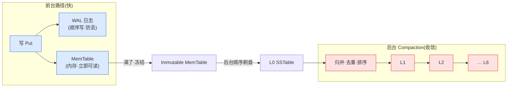
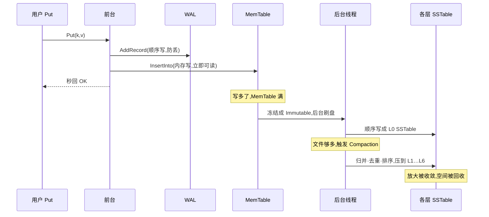

# 第一章 · 第一性原理:为什么把写都变成追加

> 篇:P0 开篇
> 主线呼应:这一章是全书的**总览与定调**。LevelDB 的全部精妙,源于对一个物理事实的顺从——磁盘顺序写快、随机写慢、原地改更慢。读懂这一章,你就拿到了全书剩余 20 章的钥匙:后面每一个组件(WAL、MemTable、SSTable、Compaction、Manifest),都是为了让这条"只追加、不原地改"的路走得通而出现的。

## 核心问题

**为什么 LevelDB 要把每一次写都变成"顺序追加",而不是像传统数据库那样"原地更新"?这一条设计抉择,逼出了 LSM 这整套架构。**

读完本章你会明白:

1. 磁盘的物理真相:为什么"顺序写"比"随机写"快一到两个数量级,而"原地更新"为什么格外贵。
2. 朴素的两条路为什么都不行:纯 `append` 读放大爆炸;B-tree 原地更新写吞吐被随机 I/O 卡死。
3. LSM 的第三条路:只追加换写入吞吐,代价是读/写/空间三笔放大,而 Compaction 是不断把它们收敛回来的会计。
4. LevelDB 的"三件事"——WAL(不丢)、MemTable(立即可读)、Compaction(收敛)——以及它们怎么在源码里字面对应。
5. 全书的二分法:**前台路径**(写秒回、读多路归并)vs **后台 Compaction**(收敛放大)。

---

## 1.1 一句话点破

> **LevelDB 的全部精妙,源于对一个物理事实的顺从:磁盘顺序写快、随机写慢、原地改更慢。于是它把一切"写"都变成追加,把"改"和"删"都变成"打一条新记录盖在旧的上面",再让后台慢慢收拾。**

这是结论,不是理由。本章倒过来拆:先看磁盘到底怎么回事,再看两条朴素的路为什么都撞墙,最后看 LevelDB 怎么用"三件事"把这件事做成。

---

## 1.2 磁盘的物理真相:为什么顺序写这么快

一切要从一根磁头说起。

机械硬盘(HDD)读写数据,磁头要先**寻道**(移动到正确的柱面),再**等盘片转过来**(旋转延迟),才能真正读写。一次随机访问,这两步加起来通常要 **~10 毫秒**。而一旦磁头就位,顺着磁道一路写下去,吞吐可以到 **100~200 MB/s**——这意味着,同样是写 4KB 数据,随机写要付出完整的寻道 + 旋转代价(~10ms),顺序写只是"刷"过去的一瞬间(~几十微秒)。**两者差了三四个数量级。**

那 SSD 呢?SSD 没有机械部件,随机访问的绝对延迟低得多(~100 微秒级)。但"随机写仍比顺序写慢"这条规律在 SSD 上**依然成立**,原因换了:SSD 的擦除单位(一个 flash block,几 MB)远大于写入单位(一个 page,几 KB),要改一个 page 往往要先擦一整块、把块里其它还活着的数据搬走再写回——这叫**写放大**,它让随机写在 SSD 上仍比顺序写慢一个数量级左右,而且会磨损闪存寿命。

> **钉死这件事**:无论机械盘还是 SSD,"**顺序写快、随机写慢、原地改更慢**"都是绕不开的物理事实。几乎所有存储引擎的核心设计抉择,本质上都在回答同一个问题——**怎么少做随机写、多做顺序写**。

| 操作 | 机械盘 | SSD |
|------|--------|-----|
| 顺序写吞吐 | ~100–200 MB/s | ~500 MB/s–数 GB/s |
| 单次随机写延迟 | ~10 ms(寻道+旋转) | ~100 µs(写放大+GC) |
| 顺序 vs 随机差距 | 3~4 个数量级 | ~1 个数量级 |

记住这张表。后面 LevelDB 的每一个决策,都能回扣到"它在帮我们多走顺序、少走随机"。

---

## 1.3 朴素方案 A:全部 append 到一个文件,行不行?

既然顺序写这么香,最朴素的做法呼之欲出:**所有写都 `append` 到一个大文件末尾**。这不就全是顺序写了吗?写入吞吐直接拉满。

写是爽了,代价全甩给了**读取端**。请回答三个问题:

- **读一个 key**:整个文件是无序的流水账,要读 `k=v` 只能从头扫到尾,O(n)。100GB 的库读一个 key 要扫 100GB。
- **改一个 key**:旧值还在文件前头,你又 append 了一条新值在后头。**到底哪个算数?** 读的时候得"取最后一条"——又是全扫。
- **删一个 key**:数据物理上还在,你怎么标记"它被删了"?

> **不这样会怎样**:纯 `append` 把"写快"做到了极致,却把"读准、改、删、省空间"全部推给了读取端。结果是**读放大和空间放大双双爆炸**——读一个 key 要扫全量历史,旧版本永远占着地方。

这条路不是没人走过。它其实正是 LSM 的"原始胚胎"。LevelDB 没有否定它,而是问:**怎么既享受"只追加"的快,又不让读取端被埋葬?** 答案是——给追加出来的数据**排序**、**分层**、再让后台**慢慢收拾**。这就是 LSM。

---

## 1.4 朴素方案 B:B-tree 原地更新,行不行?

那传统关系数据库(PostgreSQL、MySQL/InnoDB)走的 B-tree 路呢?它读很快(树形二分,O(log n) 次页面访问就定位到),它怎么处理"改"?

B-tree 的做法是**原地更新**:沿着树找到目标叶子页,把那条记录的值改掉,再把这一页**写回磁盘的原位置**。

> **不这样会怎样**(它的代价):每一次更新,都是一次**随机写**——定位到那个页(随机寻址)+ 写回那个页。在写入密集的场景下,写吞吐被随机 I/O 死死卡住。为了崩了不丢,B-tree 还得先写 WAL(顺序),再改数据页(随机)——顺序那部分很快,但**随机改页那部分就是吞吐的天花板**。

所以 B-tree 的取舍是:**读优、写劣**。读一次定位 O(log n),但写要付出随机 I/O 的代价。这在读多写少的场景下非常合理,所以 OLTP 数据库普遍用它。但当写入量极大(日志、监控、时序、消息)时,B-tree 的随机写就成了瓶颈——这正是 LSM 崛起的土壤。

> **钉死这件事**:B-tree 用"原地更新"换来读快,代价是写要做随机 I/O。LevelDB 走的是另一条路:放弃原地更新,换写吞吐。

---

## 1.5 LSM 的第三条路:只追加,但用层级 + 后台收拾把代价收敛

既想要"写只追加"的快,又不想像方案 A 那样读放大爆炸——**LSM(Log-Structured Merge-tree)给出的答案,是把"写快"和"收拾烂摊子"在时间上拆开**。

LSM 的做法,一句话能讲清,但每一步都藏着后续 20 章的细节:

1. **写**:一条 `Put(k, v)` 进来,先 `append` 到 **WAL** 日志(防丢),再写进内存里的 **MemTable**(立即可读)。这两步——WAL 是顺序写、MemTable 是内存写——都快得不像话。**写操作几乎是"秒回"的。**
2. **改**:不原地改。再写一条 `(k, v_new)` 进来,新版本盖在旧版本之上。谁新谁说了算,由"读取时取最新版本"来裁决。
3. **删**:不原地删。写一条 **tombstone(墓碑)** 标记进来,表示"这个 key 被删了"。读取时遇到墓碑就当作不存在。
4. **MemTable 满了**:把整块内存**冻结**成 Immutable,在后台**顺序地**刷成一个有序文件 **SSTable**。
5. **SSTable 多了**:后台 **Compaction** 把多个 SSTable **归并、去重、排序**,一层层往下压(L0 → L1 → … → L6),越往下越久远、越整齐。



注意:**改和删都没有碰磁盘上已有的数据**。旧值和新值可以同时躺在不同层里,墓碑和被删的值也可以共存。**正确性,完全靠"读取时按版本取最新、按墓碑判删除"来保证**——这一点我们在第 3 篇(读取)会彻底讲透。

> **不这样会怎样**:写是极致快了,但代价是三笔账,这就是 LSM 的宿命:
> - **读放大**:读一个 key,要翻 MemTable、Immutable、再到每一层的若干 SSTable,直到找到。翻的地方越多,读越贵。
> - **写放大**:同一条数据,会被 Compaction 一层一层反复重写——L0 写一遍,L1 又写一遍,L2 再写一遍……写入的实际磁盘 I/O 远大于用户写的数据量。
> - **空间放大**:旧版本、被删的值,在没被 Compaction 清理掉之前,一直占着磁盘空间。

> **所以这样设计**:既然代价是这三笔放大,那 **Compaction 的全部意义,就是把这三笔账"收敛回来"**——把散在多层的旧版本合并掉、把墓碑和被它盖住的旧值扔掉、把数据压实成更少、更整齐的文件。没有 Compaction,LSM 就退化成方案 A 的灾难;有了 Compaction,放大被控制在可接受的范围,而写入的极致吞吐得以保全。

> **打个比方**:LSM 像先记**流水账**(只管往下记,极快),再让一个**账房先生**(Compaction)在后台慢慢清账——把重复的、作废的、过期的勾掉,整理成一本干净的总账。**记的时候图快,清的时候图准**。这两件事在时间上被刻意拆开,是 LSM 的灵魂。(注意:这个比方只在"理解 LSM 整体心智"时点一下,后面讲跳表、SSTable 格式、归并排序时,我们都直球讲,不再套这个比方。)

---

## 1.6 LevelDB 的三件事:看源码怎么印证

上面讲的是"道理"。现在落到 LevelDB 的源码,看这三件事是不是真的字面对应。我们先看用户能摸到的 API——`include/leveldb/db.h` 里,`DB` 抽象类的几个核心方法([db.h:66](../leveldb/include/leveldb/db.h#L66) 等):

```cpp
virtual Status Put(const WriteOptions&, const Slice& key, const Slice& value) = 0;   // db.h:66
virtual Status Delete(const WriteOptions&, const Slice& key) = 0;                     // db.h:73
virtual Status Write(const WriteOptions&, WriteBatch* updates) = 0;                   // db.h:78
virtual Status Get(const ReadOptions&, const Slice& key, std::string* value) = 0;     // db.h:87
virtual void CompactRange(const Slice* begin, const Slice* end) = 0;                  // db.h:147
```

`Put` / `Delete` 都是 `Write` 的语法糖(单条),真正的写入口是 `Write`。`DBImpl` 里它们的实现极薄——`Put` 直接转调 `Write`([db_impl.cc:1198](../leveldb/db/db_impl.cc#L1198)):

```cpp
Status DBImpl::Put(const WriteOptions& o, const Slice& key, const Slice& val) {
  return DB::Put(o, key, val);   // db_impl.cc:1198 —— Put 只是 Write 的薄壳
}
```

真正的戏在 `DBImpl::Write`([db_impl.cc:1206](../leveldb/db/db_impl.cc#L1206))。我们只看它最核心的那几行——那正是"三件事"里前两件的字面实现:

```cpp
// db_impl.cc:1230 注释原话:Add to log and apply to memtable.
{
  mutex_.Unlock();
  status = log_->AddRecord(WriteBatchInternal::Contents(write_batch));   // db_impl.cc:1236 —— ① 先写 WAL
  ...
  if (status.ok()) {
    status = WriteBatchInternal::InsertInto(write_batch, mem_);          // db_impl.cc:1245 —— ② 再插 MemTable
  }
  mutex_.Lock();
}
```

注释 `"Add to log and apply to memtable"` 一字不差。**第 1236 行 `log_->AddRecord(...)` 是 WAL(第一件事),第 1245 行 `InsertInto(write_batch, mem_)` 是 MemTable(第二件事)**。顺序严格是 **先 WAL、后 MemTable**——这个顺序为什么不能反,是本章技巧精解要钉死的事。

第三件事(Compaction)在 `DBImpl::MaybeScheduleCompaction`([db_impl.cc:668](../leveldb/db/db_impl.cc#L668))里被触发,真正的苦活在 `DoCompactionWork`([db_impl.cc:898](../leveldb/db/db_impl.cc#L898))。这两者都在**后台线程**跑,和前台的 `Write` 互不打扰——这就是"前台 vs 后台"二分法在源码里的体现。

再看 `DBImpl` 的成员字段([db_impl.h:177](../leveldb/db/db_impl.h#L177) 起),它们简直就是"三件事"的字幕:

```cpp
MemTable* mem_;                    // db_impl.h:177 —— 当前 MemTable(前台写在这、读也先查这)
MemTable* imm_;  // Memtable being compacted   // db_impl.h:178 —— 冻结的 Immutable(正被刷成 SSTable)
std::atomic<bool> has_imm_;        // db_impl.h:179 —— 给后台线程看的"有没有 imm 在刷"标志
WritableFile* logfile_;            // db_impl.h:180 —— WAL 文件
log::Writer* log_;                 // db_impl.h:182 —— WAL 写入器(就是上面 log_->AddRecord 的那个 log_)
...
VersionSet* const versions_;       // db_impl.h:200 —— 管理所有 SSTable 的层级状态(Compaction 的舞台)
```

`mem_` / `imm_` / `logfile_` / `log_` 是前台,`versions_` 是后台 Compaction 的领地。**三件事,在类定义里各就各位。**

> **钉死这件事**:LevelDB 的写路径源码,就是"三件事"的字面实现——`log_->AddRecord`(WAL)在前,`InsertInto(mem_)`(MemTable)在后,`MaybeScheduleCompaction`(Compaction)在后台。道理和代码一一对应,没有黑盒。

---

## 1.7 立起全书的二分法

讲到这里,全书的二分法已经呼之欲出。LevelDB 的每一个机制,都可以归到这两面之一:

> **前台路径(让写秒回、让读拿到正确的最新值) vs 后台 Compaction(把追加堆积的碎片、放大、过期版本,一层层合并压缩掉)。**

- **前台**:WAL + MemTable(写)、MemTable + Immutable + 多层 SSTable 多路归并(读)、Iterator 体系、缓存。这些都要"快"。
- **后台**:Immutable 刷盘、Compaction 合并、`VersionSet` 版本管理、Manifest 记账、`RemoveObsoleteFiles` 垃圾回收。这些都要"稳"和"收敛"。

往后读任何一章,如果看不懂某个机制在干嘛,回到这个二分法问一句:"这是在让前台更快更准,还是在让后台把代价收敛?"答案会立刻帮你定位。

一次完整的 `Put`,从前台走到后台,长这样:



这本书接下来,就是沿着这张图,一个驿站一个驿站地走完。第 1 篇讲写怎么进来(P1-02 API 基石 → P1-06 写组),第 2 篇讲落成的文件长什么样(P2-07~10),第 3 篇讲怎么读出来(P3-11~13),第 4 篇讲后台怎么收拾(P4-14~16,全书心脏),第 5 篇讲崩了怎么不丢不乱(P5-17~18),第 6 篇讲性能基建(P6-19~20),第 7 篇收束。

---

## 1.8 技巧精解:三笔放大——LSM 用什么换什么

这一章是定调章,我们把全书会反复回扣的"三笔放大"立清楚。这是 LSM 最核心的权衡,理解了它,你就理解了 LevelDB 为什么要有 Compaction、为什么要有布隆过滤器、为什么 SSTable 要分层。

LSM 用"只追加"换来了写入的极致吞吐,代价是三笔账。这三笔账**互相牵制**:压低一个,往往抬高另一个。LevelDB 的所有参数和机制,本质上都在这三者之间找平衡。

| 放大 | 是什么 | 来源 | 谁在收敛它 |
|------|--------|------|-----------|
| **读放大** | 读 1 条用户数据,实际要读多少次 | 一个 key 的最新版本可能散在 MemTable + 多层 SSTable;每层都要查 | 布隆过滤器(挡掉无效 block)、Compaction(减少层数和重叠)、缓存(少读盘) |
| **写放大** | 写 1 条用户数据,实际落盘多少字节 | 同一条数据被 Compaction 反复重写:L0 写一遍,L1 又写一遍…… | 控制层数、合理设置 compaction 触发阈值、不过度 compact |
| **空间放大** | 存 1 份有效数据,实际占多少磁盘 | 旧版本、墓碑在被清理前一直占空间 | Compaction 去重、丢弃被覆盖的旧值和过期墓碑 |

> **反面对比**:假设我们设计一个"只追加、完全不 Compaction"的 LSM 会怎样?写吞吐确实拉满(纯 append),但——
> - 读放大:一个 key 被改了 1000 次,分散在 1000 个地方,读它要翻遍这 1000 处。
> - 空间放大:那 999 个旧版本永远占着磁盘,库的实际体积是有效数据的几百倍。
> - 而且层数无限增长,文件无限多,最后连"打开哪些文件"都成了负担。
>
> 这就是方案 A 的结局。**Compaction 存在的全部理由,就是把这三笔账从"无限"收敛到"可控"**。它自己要付出写放大(归并重写)的代价,但换来的是读放大和空间放大的可控——这是一笔划算的交易,是 LSM 成立的前提。

LevelDB 官方文档 `doc/impl.md` 给了这套收敛机制的精确数字(真实可靠,后面 Compaction 篇会反复引用):MemTable 写满约 **4MB** 就刷成 SSTable;**level-0** 文件数超过 **4 个**就触发一次 compaction;从 level-1 起,第 L 层的总大小上限是 **10^L MB**(L1=10MB,L2=100MB,……);每个 SSTable 目标大小 **2MB**。这一组数字,就是 LevelDB 在三笔放大之间标定的平衡点。

> **钉死这件事**:LSM 不是免费的午餐。它用读放大、写放大、空间放大这三笔账,换来了写入的极致吞吐;而 Compaction 是那个不断结账、把债务控制在红线之下的会计。全书剩余 20 章,本质上都在讲"怎么把这三笔账管好"。

---

## 章末小结

这一章是全书的**总览与定调**,我们没有钻进任何一行复杂的实现,但立起了贯穿全书的三个东西:

1. **一个物理事实**:磁盘顺序写快、随机写慢、原地改更慢——LevelDB 的全部设计都顺从它。
2. **一条主线 + 一个二分法**:主线是"用只追加换写入吞吐,代价是三笔放大,Compaction 收敛之";二分法是"**前台路径**(快)vs **后台 Compaction**(收敛)"。迷路时回到它们。
3. **三件事**:WAL(不丢)、MemTable(立即可读)、Compaction(收敛)——源码里 `log_->AddRecord` / `InsertInto(mem_)` / `MaybeScheduleCompaction` 字面对应。

### 五个"为什么"清单

1. **为什么顺序写比随机写快这么多?** 机械盘要寻道 + 等旋转(~10ms);SSD 有写放大和 GC。物理事实,绕不开。
2. **为什么 LevelDB 不走 B-tree?** B-tree 原地更新,每次写都是随机 I/O,写吞吐被卡死。LSM 只追加,写吞吐拉满。
3. **为什么写路径必须"先 WAL、后 MemTable"?** WAL 是持久性的唯一保证。反了的话——MemTable 插了但 WAL 没落盘,这一刻崩溃,数据就丢了。这个顺序是正确性的硬约束(本章 1.6 已点,后续 WAL 章详讲)。
4. **三笔放大各是什么、谁在收敛?** 读放大(查多处)、写放大(反复重写)、空间放大(旧值占位);Compaction + 布隆 + 缓存联手收敛。
5. **前台和后台怎么分工、怎么不打架?** 前台只管"写秒回 + 读多路归并",后台只管"刷盘 + 合并 + 记账 + 回收";靠 `Version` 的引用计数让"读用旧版本、写产生新版本"互不阻塞(第 4 篇详讲)。

### 想继续深入往哪钻

- 本章点到的"写组"(并发写批处理,`BuildBatchGroup`)是写入吞吐的核心手段,详见第 6 章 P1-06。
- "先 WAL 后 MemTable"的顺序为什么是正确性强约束,WAL 的格式与崩溃重放,详见第 17 章 P5-17。
- 三笔放大的精确平衡点(4MB / 4 文件 / 10^L MB / 2MB),详见第 15、16 章 Compaction 的触发与执行;真实数字在 `../leveldb/doc/impl.md`。
- 如果你想立刻看一眼真实的写路径全貌,读 `../leveldb/db/db_impl.cc` 的 `Write`([#L1206](../leveldb/db/db_impl.cc#L1206))——1206 到 1277 这 70 行,是本章 1.6 的完整背景。

### 引出下一章

我们立起了"三件事"和"前台 vs 后台"的二分法。但真要走进"一次写",还有几个基础概念必须先卸掉包袱:为什么 LevelDB 到处用 `Slice` 而不是 `std::string`?`Status` 怎么用一个返回值同时表达"成功 / NotFound / 损坏"?`Comparator` 怎么定义键的大小关系(这决定了 MemTable 和 SSTable 里一切"顺序"的含义)?下一章,我们从 API 的三块基石——`Slice`、`Status`、`Comparator`——讲起,正式进入第 1 篇:写入的前台。
