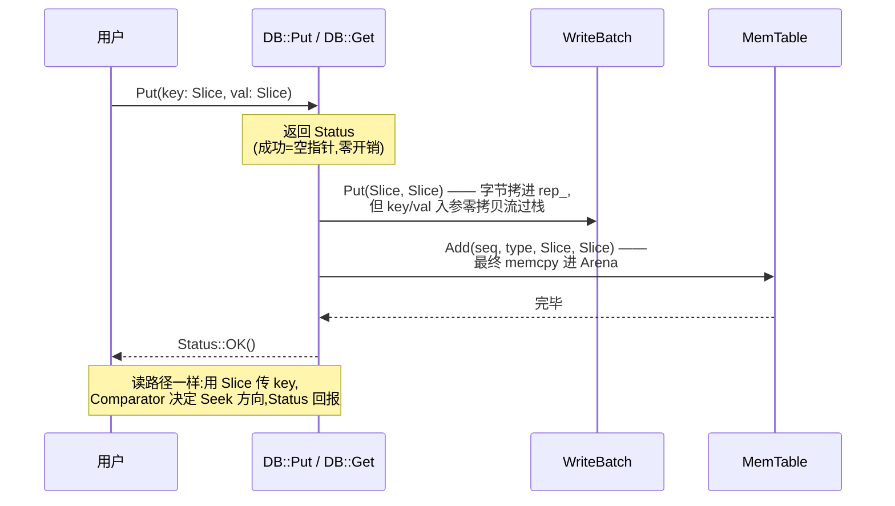

# 第二章 · Slice、Status、Comparator:API 三基石

> 篇:P1 写入的前台
> 主线呼应:这一章是第 1 篇的"卸包袱"章。P0-01 我们立起了"三件事 + 前台 vs 后台"的二分法,但真要走进一次 `Put` 的源码,你会被几个反复出现的小东西绊住——为什么到处是 `Slice` 而不是 `std::string`?为什么所有函数都返回 `Status` 而不是抛异常或返回 `int`?为什么数据库要传入一个 `Comparator`?这三块看似平淡的 API 基石,其实各自藏着一个非平凡的设计抉择:它们是写路径(WAL + MemTable)和读路径都会反复调用的公共积木,本身的效率直接决定了全栈吞吐的下限。

## 核心问题

**为什么 LevelDB 不用 `std::string` 传键值、不用异常报错、不写死按字节比大小?这三个"不用",各自被一个具体的性能或正确性痛点逼出来——本章把这三块公共积木讲透,后面所有章节都能直接调用它们不再展开。**

读完本章你会明白:

1. `Slice` 凭什么做到零拷贝:它就是 `{const char* data_, size_t size_}` 两个字的非拥有视图,为什么这么"简陋"反而是性能关键;以及它最坑人的陷阱——**所指内存一旦先于 Slice 死掉,Slice 就成了悬垂指针**,LevelDB 怎么在源码里小心翼翼地规避。
2. `Status` 凭什么一个值就塞得下"状态码 + 一段消息":它是 `const char* state_` 一个指针,成功时是 `nullptr`,失败时指向一块 `new char[...]`,这块内存的字节布局是怎么把"code、消息长度、消息"打包进连续 5 + N 字节的。
3. `Comparator` 凭什么定义"键序":它是一个虚基类,`BytewiseComparator` 是默认实现,但你完全可以传入自己的(按数字比较、按大小写不敏感比较)——而 MemTable、SSTable、Iterator 体系里一切"顺序",根都在这个 `Comparator` 上。
4. 这三块基石怎么一起把"写秒回、读拿正确值"的前台路径撑起来。

> **如果一读觉得太难**:先只记住三件事——① `Slice` 是不拥有内存的字符串视图,传 `Slice` 不拷贝字节,所以快,但所指对象必须比 Slice 活得久;② `Status` 把成功和失败塞进一个返回值,成功几乎零开销(指针置空),失败时一块 `new char[]` 装下"code+消息";③ `Comparator` 决定键怎么排,所有顺序都根在这里。剩下的细节是"凭什么这么省、这么 sound",可以回头再读。

---

## 2.1 一句话点破

> **`Slice` 是不拷贝字节的字符串视图,`Status` 是不抛异常的返回值,`Comparator` 是不写死顺序的虚基类。这三个"不"换来的是:一次 Put / Get 的全链路没有多余的深拷贝、没有异常展开的开销、键序可以由用户自己定义——这是 LevelDB 前台路径吞吐的底层地租。**

这是结论,不是理由。本章倒过来拆:先看为什么传 `std::string` 会要命,再看 `Slice` 的两个字段怎么救场,再讲它的陷阱;然后是 `Status` 怎么把状态和消息塞进一个返回值;最后是 `Comparator` 怎么把"键序"做成可替换的虚函数。

---

## 2.2 Slice:为什么不直接传 std::string

### 提出问题

一次 `Put(key, value)` 的源码路径上,key 和 value 要从用户手里,经过 `DBImpl::Put` → `DB::Put`(转 `WriteBatch::Put`)→ `WriteBatch` 里的字节序列 → `MemTableInserter::Put` → `MemTable::Add` → 最终塞进 `Arena` 分配的一块内存。读路径上更夸张,一次 `Get` 要在 MemTable、Immutable、每一层的若干 SSTable 之间穿梭,每次都要"拿这条 key 去比一比"。

如果整条路径上传递 key/value 用的是 `std::string`,会发生什么?

### 不这样会怎样

**每一次按值传 `std::string`,都是一次深拷贝**——`std::string` 内部那块缓冲区会被复制一遍,触发一次 `malloc` + `memcpy`。读者大概率知道这条:`std::string` 是值类型,函数签名 `void f(std::string s)` 调用时 `s` 是实参的副本。即便是 `const std::string&`,只要代码里有任何一次把实参"收下、转手、再传出去"的动作(典型如把 key 存进 `WriteBatch` 又插进 `MemTable`),那两次拷贝就跑不掉。

> **反面对比**:假设 LevelDB 把 `Put` 写成 `Status Put(const WriteOptions&, const std::string& key, const std::string& value)`、并把 `std::string` 沿链路传递。一次 batch 写 1000 条 KV,光是把这 1000 条 key/value 从用户传到 `MemTable`,就要触发上千次 `malloc`/`memcpy`(每次 `std::string` 的构造、追加、转手)。LSM 的写路径本来图的是"WAL 顺序写 + MemTable 内存写"两个快动作,结果还没写到 WAL 就先在参数传递上付出几千次堆分配——**这把 LSM 写吞吐的优势抹掉一大半**。

读路径更惨。一次 `Get`,内部要把 user_key 包成 internal_key、再包成 memtable_key,然后在每一层的若干 SSTable 里 Seek 一次。每次包一次、传一次、比一次,只要用 `std::string` 就是一次拷贝。一次 Get 可能要扫十几个文件,堆分配像雨点一样落下来——而 Get 本来应该是"快路径"。

### 所以这样设计

LevelDB 在公开 API 里把所有"键、值、消息"的类型统一换成 [`Slice`](../leveldb/include/leveldb/slice.h#L27):

```cpp
// include/leveldb/slice.h:27-94(节选)
class LEVELDB_EXPORT Slice {
 public:
  Slice() : data_(""), size_(0) {}
  Slice(const char* d, size_t n) : data_(d), size_(n) {}            // 指针 + 长度
  Slice(const std::string& s) : data_(s.data()), size_(s.size()) {} // 从 std::string 借
  Slice(const char* s) : data_(s), size_(strlen(s)) {}              // 从 C 字符串借

  // Intentionally copyable.                                            ← 关键注释
  Slice(const Slice&) = default;
  Slice& operator=(const Slice&) = default;

  const char* data() const { return data_; }
  size_t size() const { return size_; }
  // ...
 private:
  const char* data_;   // 不拥有内存,只是"指过去"
  size_t size_;
};
```

**整个类就两个字段:`const char* data_` 和 `size_t size_`。** 注释 `Intentionally copyable`("故意可拷贝")一语道破——拷贝一个 Slice 等于拷贝两个机器字(一个指针 + 一个 size_t),代价是纳秒级,和拷贝一条几百字节的字符串差两三个数量级。

看真实 API 怎么用 [`Slice`](../leveldb/include/leveldb/db.h#L66):

```cpp
// include/leveldb/db.h:66-87(节选)
virtual Status Put(const WriteOptions&, const Slice& key, const Slice& value) = 0;
virtual Status Delete(const WriteOptions&, const Slice& key) = 0;
virtual Status Write(const WriteOptions&, WriteBatch* updates) = 0;
virtual Status Get(const ReadOptions&, const Slice& key, std::string* value) = 0;
```

`Put` / `Delete` / `Get` 都用 `const Slice&` 接 key/value。`WriteBatch::Put` 也用 `Slice`([write_batch.cc:98](../leveldb/db/write_batch.cc#L98)):

```cpp
void WriteBatch::Put(const Slice& key, const Slice& value) {
  WriteBatchInternal::SetCount(this, WriteBatchInternal::Count(this) + 1);
  rep_.push_back(static_cast<char>(kTypeValue));
  PutLengthPrefixedSlice(&rep_, key);    // ← 这里才把 Slice 的字节 memcpy 进 rep_
  PutLengthPrefixedSlice(&rep_, value);
}
```

注意——**从用户 `Put("hello", "world")` 一直到 `WriteBatch::Put`,key/value 始终以 `Slice` 形式流过栈,字节一次都没被深拷贝**(只在最终落地到 `WriteBatch::rep_` 时做一次 `memcpy`,那次拷贝是必须的——`WriteBatch` 要把数据持久地装进自己的字节流)。

> **钉死这件事**:`Slice` 不是"更好的 `std::string`",它是"**不拥有内存的字符串视图**"。它和 Rust 的 `&str`、Go 的 `[]byte`、C++17 的 `std::string_view` 同源——都是"指针 + 长度"的非拥有视图。LevelDB 在 2011 年就用了这个设计,比 `std::string_view` 进标准早了六年。

### 2.2.1 Slice 的视图语义

把 `Slice` 当"**借来的只读指针 + 长度**",一切都好理解:

- `Slice s(buf, n)`:从 `buf` 借 n 个字节,`s` 不分配、不拷贝。
- `Slice s(std_string)`:从 `std_string` 的内部缓冲借,**`std_string` 死了 `s` 就悬垂**。
- `Slice s("hello")`:从字符串字面量借(字面量在静态存储区,活到程序结束,所以这种借永远是安全的)。
- `s.data()` / `s.size()`:拿原始指针和长度,自己 `memcmp`、自己 `memcpy`。
- `s.ToString()`:这一下**才**做深拷贝,得到一个真正拥有内存的 `std::string`。需要 owning 语义时才调它,代价显式。

所有比较都直球走 `memcmp`,见 [`slice.h:103-113`](../leveldb/include/leveldb/slice.h#L103-L113):

```cpp
inline int Slice::compare(const Slice& b) const {
  const size_t min_len = (size_ < b.size_) ? size_ : b.size_;
  int r = memcmp(data_, b.data_, min_len);
  if (r == 0) {
    if (size_ < b.size_) r = -1;
    else if (size_ > b.size_) r = +1;
  }
  return r;
}
```

两段 `memcmp` 拼起来:先比共同前缀,前缀相同则短的更小。这就是 Bytewise 比较的全部——后面讲 `Comparator` 时你会看到 `BytewiseComparator::Compare` 直接转调 `Slice::compare`。

### 2.2.2 Slice 的生命周期陷阱(必须讲透)

`Slice` 的"零拷贝"是用一个硬代价换来的——**它不拥有内存,它指着的对象必须比它自己活得久**。这一条不讲清楚,读者一上手就会写出悬垂指针的 bug。

`Slice` 的源码注释开篇就警告了这件事([slice.h:5-8](../leveldb/include/leveldb/slice.h#L5-L8)):

```cpp
// Slice is a simple structure containing a pointer into some external
// storage and a size.  The user of a Slice must ensure that the slice
// is not used after the corresponding external storage has been
// deallocated.
```

什么场景会撞上?三个典型坑:

**坑 1:从临时 `std::string` 构造 `Slice`,出了语句就悬垂。**

```cpp
// 反面代码(会出 bug):
Slice bad(std::string("hello") + " world");   // 临时 string 在 ; 处析构
bad.data();                                    // ← 悬垂指针,UB
```

`Slice` 的构造函数 `Slice(const std::string& s)` 只是把 `s.data()` 和 `s.size()` 记下来,**它不延长 `s` 的生命**。临时 string 在分号处析构,缓冲被释放,`bad` 立刻悬垂。

**坑 2:`Slice` 指着 `std::string`,然后 `std::string` 被 `resize`/`reserve`/`clear`,触发 SSO 或重分配。**

```cpp
// 反面代码(会出 bug):
std::string s = "hello";
Slice sl(s);
s.resize(100);    // 很可能让 s 重新分配缓冲,旧的 "hello" 那块被 free 掉
sl.data();        // ← 指向被 free 的旧缓冲,UB
```

哪怕 string 没析构,只要它发生重分配(`resize`/`reserve`/`append` 超容量),内部缓冲搬了家,`Slice` 还指着旧地址,也是悬垂。

**坑 3:把栈上 `std::string` 的 `Slice` 存到比栈帧活得更久的地方。**

```cpp
// 反面代码(会出 bug):
Slice Cache::Get(const Slice& key) {
  std::string computed = ComputeSomething(key);
  return Slice(computed);   // computed 在函数返回时析构,返回的 Slice 立刻悬垂
}
```

LevelDB 内部源码处处在防这几个坑。比如 `MemTable::Get` 里,需要把读出来的 value 交给调用者,但它**不返回 `Slice`**,而是 `value->assign(v.data(), v.size())` 拷一份到出参 `std::string* value` 里([memtable.cc:123-127](../leveldb/db/memtable.cc#L123-L127)):

```cpp
case kTypeValue: {
  Slice v = GetLengthPrefixedSlice(key_ptr + key_length);
  value->assign(v.data(), v.size());    // ← 显式拷贝到出参,因为 v 指着 MemTable 内部
  return true;
}
```

为什么?因为那个 `Slice v` 指着 MemTable 内部的 Arena 内存,而 MemTable 可能在调用者用 value 之前就被换出去、被 Compaction 清掉。把字节拷进调用者的 `std::string`,所有权和生命周期就由调用者自己担保,彻底剥离。

> **钉死这件事**:`Slice` 是"借"不是"有"。任何时候你写 `Slice s(some_string)` 或把 `Slice` 存到结构体里,先问一句"**`some_string` 死之前,`s` 是不是已经用完了?**"。在 LevelDB 源码里,凡是 Slice 要"活过"函数调用边界的地方,要么所指的是 Arena/表文件/字面量这种生命周期足够长的对象,要么干脆在边界上 `ToString()` 显式拷一份。这一节的技巧精解还会再钻一个真实的反面例子。

### 2.2.3 Slice 的所有方法,几乎都是常量时间

`Slice` 还有一个"顺手之妙":它的所有方法(`data`/`size`/`empty`/`compare`/`starts_with`/`remove_prefix`/`ToString`)要么 O(1),要么 O(size)(`memcmp`/`memcpy`),没有任何隐藏的高代价操作。尤其是:

- `remove_prefix(n)`([slice.h:71-75](../leveldb/include/leveldb/slice.h#L71-L75)):指针前移 n,长度减 n,O(1)。这个在解析 WAL record、WriteBatch 字节流、SSTable block 时反复用——边读边"啃掉"前缀,无需拷贝剩余字节。
- `starts_with(x)`([slice.h:87-89](../leveldb/include/leveldb/slice.h#L87-L89)):一次 `memcmp`,常用于按前缀路由。

```cpp
void remove_prefix(size_t n) {
  assert(n <= size());
  data_ += n;
  size_ -= n;
}
```

这种"指针 + 长度"的 API 在 LevelDB 里被复用得淋漓尽致——`WriteBatch::Iterate` 就是边 `remove_prefix` 边解析(见 [write_batch.cc:42-80](../leveldb/db/write_batch.cc#L42-L80)),零拷贝。

> **所以这样设计**:`Slice` 把"传字符串"这件事从"按值拷贝"降到了"传两个机器字"。整个写路径、读路径上,key/value 都以 `Slice` 流过栈,**栈帧之间没有深拷贝,只在"落地"那一两处(WriteBatch 拼 rep_、MemTable 写进 Arena)做必要的 `memcpy`**。这是 LevelDB 前台吞吐的底层地租。

---

## 2.3 Status:为什么不抛异常、不返回 int

### 提出问题

LevelDB 的所有可能失败的 API(`Open` / `Put` / `Get` / `Write` / `Delete` / Iterator 的 `status()`)都返回 [`Status`](../leveldb/include/leveldb/status.h#L24)。`Status` 要表达:成功、NotFound、Corruption(数据损坏)、NotSupported(不支持)、InvalidArgument(参数错)、IOError(I/O 错),并且**每条错误还要能附带一条人类可读的 message**。

C++ 工程里通常有三种做法:

1. **抛异常**:`throw Status::NotFound(...)`,调用方 `try/catch`。
2. **返回错误码 `int`**:0 表成功,非 0 表错误码,消息另外塞出参。
3. **返回 `std::pair<int, std::string>` 或类似结构**。

为什么 LevelDB 三条都不走,自己写了个 `Status`?

### 不这样会怎样

**走异常**:Google C++ 风格指南明确**禁用异常**(原因是历史 + 工具链对异常开销的处理不均,异常在二进制体积、零开销路径上的表现,在 2010 年代早期编译器上不稳定),LevelDB 是 Google 项目,遵这条铁律。即便抛开风格不论,**异常的语义是"出错才返回"**,但 `Get` 找不到 key 返回 `NotFound` 是**常态而非异常**——一次扫表可能查 100 个 key,几十个 NotFound 是正常的,把这些当异常抛,代价和心理模型都不对。

> **反面对比(异常版)**:假设 `Get` 找不到 key 就 `throw NotFound{}`。一个扫描 1000 个 key 的循环里,200 个 miss,catch 200 次。异常在 Itanium ABI 上虽然"零开销路径"理论上便宜,但 catch 路径要走 SJOI 表、栈展开、运行时类型匹配,远比普通返回值贵。把"正常业务分支"塞进异常机制,是反模式。

**走 `int` 错误码**:能 work,但**消息没地方放**。`Get` 返回 NotFound 时,调试时往往想知道"找的是哪个 key、走到了哪一层",`int` 给不了。再加一个 `std::string* msg` 出参呢?成功时也得构造一个空 string,堆分配就藏在每个成功路径上——而成功是绝大多数。

**走 `std::pair<int, std::string>`**:每次返回都是一次 `std::string` 构造(哪怕空),同样,成功路径被堆分配拖累。Get 是热路径,这点开销不能忍。

### 所以这样设计

`Status` 的核心思路:**成功时几乎零开销,失败时才付出"分配一块装消息的内存"的代价**。看 [`status.h:24-101`](../leveldb/include/leveldb/status.h#L24-L101):

```cpp
class LEVELDB_EXPORT Status {
 public:
  // Create a success status.
  Status() noexcept : state_(nullptr) {}        // ← 成功 = 空指针,无分配
  ~Status() { delete[] state_; }

  Status(const Status& rhs);
  Status& operator=(const Status& rhs);
  Status(Status&& rhs) noexcept : state_(rhs.state_) { rhs.state_ = nullptr; }
  Status& operator=(Status&& rhs) noexcept;

  static Status OK() { return Status(); }       // 成功工厂,空指针

  static Status NotFound(const Slice& msg, const Slice& msg2 = Slice()) {
    return Status(kNotFound, msg, msg2);
  }
  // Corruption / NotSupported / InvalidArgument / IOError 同形,省略

  bool ok() const { return (state_ == nullptr); }
  bool IsNotFound() const { return code() == kNotFound; }
  // ...

 private:
  // OK status has a null state_.  Otherwise, state_ is a new[] array
  // of the following form:
  //    state_[0..3] == length of message
  //    state_[4]    == code
  //    state_[5..]  == message
  const char* state_;
};
```

**整个类只有一个字段:`const char* state_`。** 成功时它是 `nullptr`,失败时它指向一块 `new char[...]` 装好的字节流。

> **钉死这件事**:`Status` 的精髓是"**成功零开销,失败才分配**"。`Status::OK()` 返回的对象,构造代价就是"把一个指针置空",析构代价是"判空 + 不 delete"。一次 100 万次成功的 `Put`,Status 这一层贡献的开销约等于零。失败是少数派,值得为它付出一次 `new char[]` 的代价,换来一条可读消息。

### 2.3.1 失败时那块内存怎么布局

`Status` 真正巧的部分,是它**怎么把"code + 消息"塞进一块连续字节**。看构造函数 [`status.cc:21-36`](../leveldb/util/status.cc#L21-L36):

```cpp
Status::Status(Code code, const Slice& msg, const Slice& msg2) {
  assert(code != kOk);
  const uint32_t len1 = static_cast<uint32_t>(msg.size());
  const uint32_t len2 = static_cast<uint32_t>(msg2.size());
  const uint32_t size = len1 + (len2 ? (2 + len2) : 0);   // ← 注意:msg2 非空时,中间还要塞 ": "
  char* result = new char[size + 5];
  std::memcpy(result, &size, sizeof(size));               // state_[0..3] = size(消息总长,LE)
  result[4] = static_cast<char>(code);                    // state_[4]    = code(1 字节)
  std::memcpy(result + 5, msg.data(), len1);              // state_[5..]  = msg1
  if (len2) {
    result[5 + len1] = ':';                               // 中间塞 ": "
    result[6 + len1] = ' ';
    std::memcpy(result + 7 + len1, msg2.data(), len2);
  }
  state_ = result;
}
```

把布局画出来(ASCII 框图):

```
Status::state_ 在失败时指向的字节布局(总长 = size + 5):
 ┌──────────────┬────────┬─────────────────────────────────┐
 │ size (uint32 │ code   │ msg1 [': ' msg2]                │
 │   小端 4 字节)│ (1 字节)│ (size 字节,已含 ": " 分隔)      │
 └──────────────┴────────┴─────────────────────────────────┘
  ↑              ↑        ↑
  state_[0..3]   state_[4] state_[5..]
```

几个关键细节:

1. **`size` 用 4 字节小端 `uint32_t` 存**(直接 `memcpy(&size, ..., sizeof(size))`,而不是写一个字节)。这是因为消息长度需要 4 字节才够装(`uint32_t` 上限 ~4GB,足够)。
2. **`code` 只占 1 字节**(`result[4]`)。LevelDB 只有 6 种错误码,1 字节够用。读出来时是 `static_cast<Code>(state_[4])`([status.h:88-90](../leveldb/include/leveldb/status.h#L88-L90))。
3. **两段 msg 拼在一起**:如果 `msg2` 非空,在 `msg1` 和 `msg2` 之间自动塞一个 `": "`(冒号空格)做分隔。这样 `ToString()` 时一次拼接就出来了,无需多余拼接。
4. **总长 = `size + 5`**。读消息时只看 `state_[5..5+size-1]`,5 字节的 header 是固定开销。

`code()` 怎么解出来,极简([status.h:88-90](../leveldb/include/leveldb/status.h#L88-L90)):

```cpp
Code code() const {
  return (state_ == nullptr) ? kOk : static_cast<Code>(state_[4]);
}
```

`ToString()` 也极简([status.cc:38-75](../leveldb/util/status.cc#L38-L75)):先按 `code()` 选前缀("OK"/"NotFound: "/"Corruption: "/...),再把 `state_[5..5+size]` 这段 message append 上去。一次拼接,无临时对象。

### 2.3.2 拷贝、移动、引用计数式所有权

`Status` 拥有那块 `new char[]`,所以要管它的生老病死。这里 LevelDB 用的是**深拷贝 + 移动语义**,看 [`status.h:103-118`](../leveldb/include/leveldb/status.h#L103-L118):

```cpp
inline Status::Status(const Status& rhs) {
  state_ = (rhs.state_ == nullptr) ? nullptr : CopyState(rhs.state_);
}
inline Status& Status::operator=(const Status& rhs) {
  // The following condition catches both aliasing (when this == &rhs),
  // and the common case where both rhs and *this are ok.
  if (state_ != rhs.state_) {
    delete[] state_;
    state_ = (rhs.state_ == nullptr) ? nullptr : CopyState(rhs.state_);
  }
  return *this;
}
inline Status& Status::operator=(Status&& rhs) noexcept {
  std::swap(state_, rhs.state_);
  return *this;
}
```

`CopyState` 是 [`status.cc:13-19`](../leveldb/util/status.cc#L13-L19) 的内部工具,做一次完整的 `new char[size+5]` + `memcpy`:

```cpp
const char* Status::CopyState(const char* state) {
  uint32_t size;
  std::memcpy(&size, state, sizeof(size));
  char* result = new char[size + 5];
  std::memcpy(result, state, size + 5);
  return result;
}
```

注意拷贝构造的 `if (state_ != rhs.state_)` —— 它顺手挡住了两种情况:**别名**(自己赋值给自己)和**两个都是 OK**(都为 `nullptr`)。后者是热路径——一次 `Get` 成功时,`Status` 之间相互赋值,直接走 fast path(指针相等,跳过 `delete`/`CopyState`),零分配。

> **钉死这件事**:`Status` 是"**只拥有一个指针**"的轻量 RAII 类型。成功时它指针为空,零开销;失败时它指针指向一块自分配的字节流,自带 code 和 message。复制是深拷贝(每份独立拥有自己的内存),移动是 `swap`(O(1))。Google 风格禁用异常,LevelDB 顺势用"成功指针空、失败才分配"的返回值,把异常该干的事做得既清晰又便宜。

---

## 2.4 Comparator:为什么不写死按字节排序

### 提出问题

LSM 里 MemTable 是排好序的、SSTable 是排好序的、合并要靠排序、Seek 要靠排序——**"顺序"是 LSM 一切基础设施的根**。那"两条 key 谁先谁后"这个判断,要不要写死成"按字节比"?

### 不这样会怎样

如果写死按字节比,那"按 uint64 排序""按大小写不敏感排序""按自定义反序列化后的结构排序"这些需求就没法接。用户被迫把 key 编码成"按字节比也对"的形式(典型:把数字用大端 8 字节编码),麻烦且易错。

> **反面对比(写死版)**:假设 MemTable 直接用 `std::less<std::string>`,所有 key 强制按字节比。一个计数器场景,你想把 `count` 当 uint64 存,想让 `"1" < "2" < "10"`(按数字),结果字节序下 `"10" < "1" < "2"`(因为 '0' < 字符串结束),逻辑全乱。你被迫把 uint64 大端编码成 8 字节再当 key——能不能用?能用,但每个用户都要重造一遍。

### 所以这样设计

LevelDB 把"键序"抽象成 [`Comparator` 虚基类](../leveldb/include/leveldb/comparator.h#L20-L55):

```cpp
class LEVELDB_EXPORT Comparator {
 public:
  virtual ~Comparator();

  // Three-way comparison.
  virtual int Compare(const Slice& a, const Slice& b) const = 0;

  // 用于"db 创建时的 comparator 必须和打开时一致"的一致性校验
  virtual const char* Name() const = 0;

  // 高级功能:用于压缩 index block 时的"短键"。可以不实现(返回 start 不变也对)。
  virtual void FindShortestSeparator(std::string* start, const Slice& limit) const = 0;
  virtual void FindShortSuccessor(std::string* key) const = 0;
};
```

`Compare` 是核心,三路比较(`<0` / `=0` / `>0`)。`Name()` 是个**持久化校验**——db 创建时用 `X` comparator,打开时如果换成 `Y`,LevelDB 会拒绝打开(防止顺序错乱导致数据全错乱)。`FindShortestSeparator`/`FindShortSuccessor` 是为 SSTable 的 index block 压缩用的(后续 P2-08 章),默认实现"什么也不做"在语义上也是正确的。

默认实现是 [`BytewiseComparatorImpl`](../leveldb/util/comparator.cc#L21-L67),用 `NoDestructor` 包成单例:

```cpp
namespace {
class BytewiseComparatorImpl : public Comparator {
 public:
  BytewiseComparatorImpl() = default;

  const char* Name() const override { return "leveldb.BytewiseComparator"; }

  int Compare(const Slice& a, const Slice& b) const override {
    return a.compare(b);                  // ← 直接转调 Slice::compare(memcmp)
  }

  void FindShortestSeparator(std::string* start, const Slice& limit) const override {
    // 找共同前缀,把分歧字节 +1 截断(详见 P2-08)
    // ...
  }

  void FindShortSuccessor(std::string* key) const override {
    // 找第一个非 0xff 字节,+1 截断(详见 P2-08)
    // ...
  }
};
}  // namespace

const Comparator* BytewiseComparator() {
  static NoDestructor<BytewiseComparatorImpl> singleton;
  return singleton.get();
}
```

`BytewiseComparator` 就是直接转调 `Slice::compare`(底层 `memcmp`)。但你完全可以传入自己的 Comparator,比如实现一个按 uint64 反序列化后比较的:

```cpp
class Uint64Comparator : public Comparator {
  const char* Name() const override { return "Uint64Comparator"; }
  int Compare(const Slice& a, const Slice& b) const override {
    uint64_t x = DecodeFixed64(a.data());
    uint64_t y = DecodeFixed64(b.data());
    if (x < y) return -1;
    if (x > y) return +1;
    return 0;
  }
  // FindShortestSeparator / FindShortSuccessor 可以先用默认(空实现)
};
```

把它通过 `Options.comparator` 传进去,MemTable、SSTable、Iterator 全链路都用它比——你的 key 就可以按 uint64 自然顺序排,无需大端编码。

> **钉死这件事**:Comparator 是个**虚基类**,用多态替换"写死的比较函数"。所有需要比较 key 的地方(MemTable 的 SkipList、SSTable 的 block、Iterator 的归并),都只持有一个 `const Comparator*` 指针,通过虚函数 `Compare` 调用——这是经典的"策略模式"。代价是每次比较一次虚函数调用(间接跳转,几个 ns),换来的是**整个键序体系开放可替换**。对于按 key 排序是核心操作的 LSM 来说,这点开销值得。

### 2.4.1 内部 Comparator 体系预览

LevelDB 内部其实有**两层 Comparator**,这是为下一章 P1-03(InternalKey)埋的伏笔:

- **`user_comparator`**:用户传入的(默认 `BytewiseComparator`),比较的是 user_key。
- **`InternalKeyComparator`**:在 user_comparator 之上"包了一层",比较的不是 user_key,而是 internal_key(user_key + 8 字节 seq|type)。比较时先按 user_key 升序(委托给 user_comparator),再按 seq|type 降序。

`InternalKeyComparator` 的字段就一个 `const Comparator* user_comparator_`([dbformat.h:102-117](../leveldb/db/dbformat.h#L102-L117)),它**不是替换** user_comparator,而是**复用** user_comparator 来比 user_key 部分。下一章会详讲——先记住,Comparator 是个可叠加的体系。

---

## 2.5 三基石怎么撑起前台路径

回到主线。Slice / Status / Comparator 看似零散,其实它们合力撑起了"前台路径"的所有写和读:



每一块基石服务前台的一面:

- **`Slice`**:让写、读路径上的 key/value 传递零拷贝——写吞吐的地租。
- **`Status`**:让成功路径零分配、错误路径带消息——热路径开销最小化。
- **`Comparator`**:让键序开放可替换——一切"顺序"基础设施(SkipList、SSTable、归并)的根。

这三块都属于**前台**(服务于"写秒回、读拿正确值")。但要注意——Comparator 还有个"在 internal key 上叠加 seq 比较"的版本(`InternalKeyComparator`),那是下一章的事。

---

## 2.6 技巧精解

这一章的技巧精解,我们挑两个最硬核的:`Slice` 的生命周期陷阱(正面源码 + 反面 bug),以及 `Status` 的字节打包布局(怎么把"code+消息"塞进连续字节)。

### 技巧精解 1:Slice 的零拷贝语义 + 生命周期陷阱

**这个技巧在做什么**:让 key/value 在所有 API 边界上"流过栈"而**不发生深拷贝**,只在真正需要持久化时(WriteBatch 拼 rep_、MemTable 写进 Arena)做一次必要的 `memcpy`。

**用了什么手段**:`Slice` 只有 `const char* data_` 和 `size_t size_` 两个字段。它**不拥有**所指向的内存,只借。所以拷贝一个 Slice 等于拷贝两个机器字,纳秒级。

**为什么 sound(为什么不会 UB)**:`Slice` 本身**不持有任何资源**,没有析构、没有 `delete`。它的"正确性"完全靠调用方担保一个约束——**所指对象必须比 Slice 活得久**。LevelDB 源码处处在守这个约束。我们看两处典型正面例子:

**正面例 1:`MemTable::Add` 把 Slice 字节拷进 Arena 后,Slice 就完成使命**([memtable.cc:76-100](../leveldb/db/memtable.cc#L76-L100)):

```cpp
void MemTable::Add(SequenceNumber s, ValueType type, const Slice& key,
                   const Slice& value) {
  // Format: key_size(varint) + key bytes + tag(uint64) + value_size(varint) + value bytes
  size_t key_size = key.size();
  size_t val_size = value.size();
  size_t internal_key_size = key_size + 8;
  const size_t encoded_len = VarintLength(internal_key_size) +
                             internal_key_size + VarintLength(val_size) + val_size;
  char* buf = arena_.Allocate(encoded_len);          // ← Arena 自己拥有这块
  char* p = EncodeVarint32(buf, internal_key_size);
  std::memcpy(p, key.data(), key_size);              // ← Slice 字节落地到 Arena
  p += key_size;
  EncodeFixed64(p, (s << 8) | type);
  p += 8;
  p = EncodeVarint32(p, val_size);
  std::memcpy(p, value.data(), val_size);            // ← Slice 字节落地到 Arena
  // ...
  table_.Insert(buf);                                // ← SkipList 存的是 Arena 的指针
}
```

**调用方传进来的 `key`/`value` Slice 在这一刻完成使命**,字节已经复制进 Arena,Arena 自己拥有。之后 MemTable 用的是 `buf`(Arena 内存),不再碰 Slice。哪怕调用方的 Slice 所指对象已经析构,MemTable 也毫不在乎。

**正面例 2:`MemTable::Get` 把读出来的 Slice 拷贝到出参 `std::string* value`,不直接返回 Slice**([memtable.cc:123-127](../leveldb/db/memtable.cc#L123-L127)):

```cpp
case kTypeValue: {
  Slice v = GetLengthPrefixedSlice(key_ptr + key_length);
  value->assign(v.data(), v.size());                 // ← 必须拷贝,因为 v 指着 MemTable 内部
  return true;
}
```

**为什么这里必须拷贝**?因为 `Slice v` 指着 MemTable 内部 Arena 的内存,而调用方拿到 value 之后,MemTable 可能已经被冻结、被刷盘、被析构——Slice 立刻悬垂。所以 `value->assign(...)` 把字节拷到调用方自己的 `std::string`,所有权彻底转移。

**反面对比(反面 bug)**:

```cpp
// 反面代码(会出 bug):
Status DBImpl::Get(const ReadOptions& opt, const Slice& key, std::string* value) {
  std::string formatted = InternalKey(key, seq, kTypeValue).Encode(); // 临时 string
  Slice lookup(formatted);                                            // Slice 指着临时
  // ... 用 lookup 查询 ...
  return Status::OK();
}   // ← formatted 在此析构,如果 lookup 还被存着,悬垂
```

LevelDB 自己不会犯这种错——它在内部用 `LookupKey` 类把"查询用的 internal key 字节"装进一个 owning 对象([dbformat.h:184-220](../leveldb/db/dbformat.h#L184-L220)),保证 Slice 所指的内存与 Slice 同生共死:

```cpp
class LookupKey {
  // ...
 private:
  const char* start_;
  const char* kstart_;
  const char* end_;
  char space_[200];                 // ← 小键优化:200 字节内联,无需堆分配
};
```

`LookupKey` 自己拥有 `start_`(要么指向内联 `space_[200]`,要么指向构造时 `new char[]` 出来的堆),它的 `memtable_key()` / `internal_key()` / `user_key()` 返回的 Slice 都指着这块自有内存——只要 LookupKey 还活着,Slice 就安全。**这就是把"Slice 不拥有内存"和"RAII 拥有内存"组合的正确姿势。**

> **不这么写会怎样**:如果让 Slice 自己拥有内存(把它做成 owning 的 `std::string` 那种),那每次传参都得拷贝字节,等于回到 `std::string` 的世界——零拷贝优势全失。LevelDB 选择"Slice 不拥有 + 调用方用 RAII 类型(LookupKey/Arena/std::string)担保生命周期",把所有权和视图分离,**性能和正确性两头都顾**。

### 技巧精解 2:Status 的字节打包布局

**这个技巧在做什么**:用**一块连续的 `new char[]`** 同时装下"4 字节 size + 1 字节 code + N 字节 message",让 `Status` 整个对象只持一个指针。

**用了什么手段**:小端打包,固定 header(5 字节)+ 变长 message。构造时一次 `memcpy` 拼好,析构一次 `delete[]`,读出时按固定偏移取。布局:

```
失败时 state_ 的字节布局(总长 size + 5):
 ┌──────────────┬────────┬─────────────────────────────────┐
 │ size (4 字节 │ code   │ msg1 + (": " + msg2)?            │
 │   uint32 LE) │ (1 字节)│ (size 字节)                      │
 └──────────────┴────────┴─────────────────────────────────┘
  state_[0..3]   state_[4] state_[5..5+size-1]
```

**为什么 sound**:

1. **小端固定 header**:`size` 用 `uint32_t` 小端 4 字节(直接 `memcpy(&size, ...)`,因为 LevelDB 钉死 little-endian,见 `util/coding.h` 顶部注释),跨平台一致。`code` 1 字节(`char`)。5 字节固定开销,简单到极致。
2. **成功时 state_ 是 nullptr**:不需要分配,析构 `delete[] nullptr` 也是合法的 no-op。所以 `Status::OK()` 的开销约等于零。
3. **深拷贝是显式的**:`Status` 的拷贝构造/赋值会 `CopyState` 再分配一块,每个 `Status` 独立拥有自己的字节流。移动是 `swap`(O(1))。这是 RAII 的标准玩法。
4. **`code()` 的"判空 then 取字节"是 sound 的**:`state_ == nullptr` 时直接返回 `kOk`,不读 `state_[4]`(否则就 UB 了)。`ok()` 同理,只判 `state_ == nullptr`。这两个函数都不会访问悬垂指针。

**反面对比(朴素写法)**:

```cpp
// 反面代码(更朴素但更贵):
struct Status {
  bool ok_;
  int code_;                 // 4 字节
  std::string message_;      // 24 字节(SSO 之外还有堆)
};  // 至少 32 字节,且每个成功 Status 也得默认构造一个空 std::string
```

朴素版的痛点:

- **每个 `Status`(包括成功)都至少占 32 字节**,而 LevelDB 的 `Status` 只占 8 字节(一个指针)。一次 100 万次 Put,Status 这层节省 24 MB 内存抖动。
- **每个成功 `Status` 都要默认构造一个 `std::string`**(在大多数 stdlib 实现里是 SSO,但仍非零开销)。LevelDB 的成功 `Status` 只置一个指针空,真正零开销。
- **返回值优化(NRVO/RVO)在朴素版上更难**:`std::string` 的移动虽然便宜但仍非平凡;LevelDB 的 `Status` 移动就是 `swap` 一个指针,编译器优化起来轻而易举。

**反面对比(异常版)**:见 2.3 节,异常语义和心理模型都不匹配 `NotFound` 这种"常态业务分支"。

> **钉死这件事**:`Status` 用"成功指针空、失败一块 `new char[]`"的设计,把成功路径的开销降到几乎为零。代价是失败路径要分配一次堆内存,但失败是少数派,值得为它换可读消息。这是"**少数派付钱**"的工程哲学,和 LSM 的"**写快读慢 + 后台收拾**"是同一种思路——**把代价推给少数派、推给后台**,换取热路径的极致便宜。

---

## 章末小结

这一章是第 1 篇的"卸包袱"章,把后面会反复用的三块 API 基石讲透了:

1. **`Slice`**:不拥有内存的 `{指针, 长度}` 视图,让 key/value 在所有 API 边界上零拷贝流过栈。代价是生命周期陷阱——所指对象必须比 Slice 活得久,LevelDB 用 RAII(LookupKey/Arena)担保。
2. **`Status`**:成功指针空、失败一块 `new char[]`,字节布局是"4 字节 size + 1 字节 code + N 字节 message"。成功零开销,失败带消息。
3. **`Comparator`**:虚基类多态定义键序,默认 Bytewise(memcmp),可替换。LSM 一切"顺序"基础设施的根。

回到主线:这三块都属于**前台**(服务于"写秒回、读拿正确值")。Slice 让前台传递零拷贝、Status 让前台热路径零分配、Comparator 让前台顺序体系可替换。这一章没有进入"一次 Put 怎么走完 WAL+MemTable"的细节,但 Put 路径上每一步都会用到这三块积木。

### 五个"为什么"清单

1. **为什么 LevelDB 到处用 `Slice` 不用 `std::string`?** 拷贝 `std::string` 是深拷贝(malloc+memcpy),一次 Put/Get 全链路传几次,堆分配像雨点。`Slice` 拷贝等于拷贝两个机器字,纳秒级。
2. **`Slice` 的生命周期陷阱是什么、怎么防?** Slice 不拥有内存,所指对象必须比它活得久。三个典型坑:从临时 string 构造 Slice、Slice 指着的 string 被 resize、栈上 string 的 Slice 跨栈帧返回。LevelDB 用 RAII(LookupKey、Arena)+ 在边界上 ToString/assign 显式拷贝来防。
3. **为什么 LevelDB 不用异常而要自己写 Status?** Google 风格禁用异常(历史+工具链开销),且 NotFound 是常态业务分支不该走异常机制。`Status::OK()` 零开销(指针空),失败才付出一块 `new char[]` 的代价换消息——少数派付钱。
4. **`Status` 的 `state_` 那块字节流是怎么布局的?** 4 字节 size(uint32 小端)+ 1 字节 code + N 字节 message(msg1 与 msg2 之间塞 ": ")。总长 size+5。`code()` 判空后取 `state_[4]`,即 1 字节码。
5. **`Comparator` 是虚函数会不会慢?** 每次比较一次间接跳转(几个 ns),换来键序体系完全开放可替换——按字节、按 uint64、按自定义结构,都能接。对 LSM 来说,排序是根,这点开销值得。RocksDB 后续也保留了这一接口。

### 想继续深入往哪钻

- `Slice` 在 `WriteBatch::Iterate` 里是怎么被"边 `remove_prefix` 边解析字节流"的,见 [write_batch.cc:42-80](../leveldb/db/write_batch.cc#L42-L80)。这是 P1-06 写组章会详讲的。
- `Status` 在 `DBImpl::Get` 里是怎么把 NotFound 和真错误分流处理的,见 [db_impl.cc:1121 起](../leveldb/db/db_impl.cc#L1121)。P3-13 读路径全流程会详讲。
- `Comparator` 的 `FindShortestSeparator`/`FindShortSuccessor` 在 SSTable 的 index block 压缩里是怎么省空间的,见 [comparator.cc:31-66](../leveldb/util/comparator.cc#L31-L66)。P2-08 前缀压缩章会详讲。
- `Slice` 与 `std::string_view`(C++17)的对比:`Slice` 早 6 年,语义几乎完全一致。RocksDB 沿用了 `Slice`。

### 引出下一章

Comparator 定义了"键序",但 LevelDB 内部存的不是 user_key,而是把 `(user_key, sequence_number, type)` 打包成一个可比的 **internal key**——这样"同一个 key 改了又改、删了又写"的所有版本都能区分新旧,"取最新版本"退化成"按 internal key 排序后取第一个"。下一章,我们钻进 `db/dbformat.h` 和 `db/dbformat.cc`,讲清楚这个打包编码:为什么 seq 占 56 位、type 只占 8 位,为什么比较时 seq 要降序,凭什么 seq 最大者排最前。
