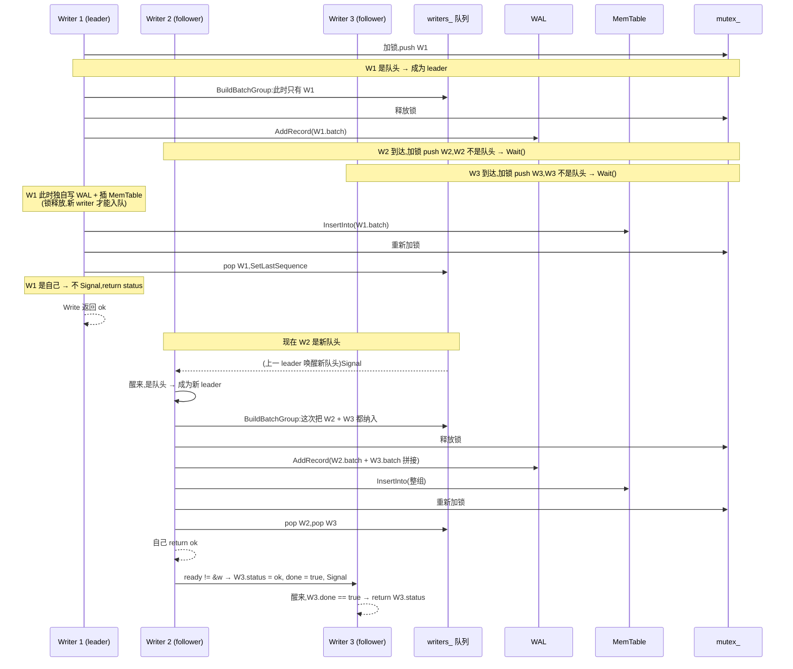

# 第六章 · WriteBatch 与写组:group commit

> 篇:P1 写入的前台
> 主线呼应:前五章我们一层层搭起了"一条 Put 怎么落地"——`Slice`/`Status`/`Comparator`(P1-02)是 API 三基石,`(user_key, seq, type)` 打包成可排序的 internal key(P1-03)是多版本的根,SkipList 无锁读(P1-04)是 MemTable 的骨架,Arena bump 分配(P1-05)是 MemTable 的内存来源。单条 `Put` 已经能写进 MemTable 了。但这一章要回答一个更狠的问题——**多线程同时 `Put` 时,LevelDB 怎么把 N 个写者的写合并成 1 次 WAL 追加 + 1 次 MemTable 插入,把磁盘顺序 I/O 的次数压到最低,从而撑住并发写入的吞吐?** 这就是写组(group commit),写入吞吐的命脉,P1-04 那个"一把大锁 `mutex_` 保证同一时刻只有一个写者在 Insert"的伏笔,在这里收口。

## 核心问题

**一次 `Write` 到底先写 WAL 还是先写 MemTable?为什么顺序不能反?多线程并发 `Write` 时,LevelDB 怎么用一个 leader/follower 的写组批处理机制,把同时到达的 N 个 batch 拼成一条大 batch,只做 1 次 WAL `AddRecord` + 1 次 `InsertInto`,从而让写入吞吐随并发上升而上升,而不是被每个 writer 各写各的 WAL 闷死在 I/O 次数上?**

读完本章你会明白:

1. `WriteBatch` 怎么把一批 Put/Delete 操作打包成**一条原子记录**:8 字节 sequence + 4 字节 count + 重复的 `type | key | value` 条目,贴 `write_batch.cc` 文件头的真实布局注释。这是"原子性"在字节层的体现——一条 batch 要么整条进 WAL、整条进 MemTable,要么都没进。
2. 写路径的顺序为什么**必须先 WAL、后 MemTable**——这不是性能选择,是正确性的强约束:反过来的话,MemTable 插了但 WAL 没落盘,这一刻崩溃,数据就丢了(`Get` 能读到但 WAL 没法重放)。
3. **写组的 leader/follower 协调机制**:第一个拿到 `mutex_` 的 writer 成为 leader,它把队列里后续到达的 writer 串成一个 group,把各自的 batch `Append` 拼到 `tmp_batch_`(一个临时大 batch),然后**主动 `mutex_.Unlock()`** 去写 WAL + 插 MemTable(慢 I/O 不持锁,是新 writer 能继续入组的前提),完成后重新加锁,把整组的 status 写回每个 follower 的 `w->status`,唤醒它们。
4. **`BuildBatchGroup` 的攒批策略**:为什么有 `max_size = 1<<20`(1MB)的上限、为什么小 batch 用 `size + 128KB` 的动态上限(不拖慢第一个小写),为什么 sync 写不能和非 sync 写混进同一组。
5. 写组把 N 次独立的 WAL 追加压成 **1 次** 的硬价值——磁盘顺序写的次数骤降,这正是 LSM 写入吞吐能"反线性扩展"的核心手段。

> **如果一读觉得太难**:先只记住三件事——① 一次 `Write` 严格**先写 WAL、后插 MemTable**,顺序不能反(反了崩溃就丢);② 多线程并发 `Write` 时,LevelDB 选一个 leader 代表整组写,把 N 个 batch 拼成一条大 batch,只做 1 次 WAL 追加 + 1 次 MemTable 插入,follower 干等 leader 完成后被唤醒直接拿 status 返回;③ leader 写 WAL + 插 MemTable 时**主动 `mutex_.Unlock()`**,这是慢 I/O 不阻塞新 writer 入组的关键,没有这一步写组攒不了批。剩下的字节布局、`tmp_batch_` 复用、`max_size` 攒批策略这些细节,可以回头再读。

---

## 6.1 一句话点破

> **`Put`/`Delete` 都是 `WriteBatch` 的语法糖,真正进 `DBImpl::Write` 的是一条 batch。多线程同时 `Write` 时,第一个拿到锁的 writer 当 leader,把队列里后面排队的 writer 的 batch 全 `Append` 拼成一条大 batch,**释放锁**去写 1 次 WAL + 插 1 次 MemTable;follower 在条件变量上干等,leader 写完重新加锁,把 status 一路写回每个 follower 的 `w->status`,唤醒它们。N 个写者合并成 1 次顺序 I/O——这就是 group commit,LevelDB 写入吞吐的命脉。**

这是结论,不是理由。本章倒过来拆:先看 `WriteBatch` 这条原子记录长什么样(它怎么把一批操作打包,凭什么原子),再钉死"先 WAL 后 MemTable"的顺序为什么不能反,然后钻进 `Write` 的源码看 leader/follower 的协调细节,最后在技巧精解里把写组这个机制彻底拆透。

---

## 6.2 Put 和 Delete 其实都是 WriteBatch

### 提出问题

P0-01 我们看过 `DB` 抽象类的几个核心方法——`Put`、`Delete`、`Write`、`Get`、`CompactRange`。直觉上 `Put(k, v)` 就是"写一条",`Delete(k)` 就是"删一条",它们和 `Write(batch)` 是三个不同的入口。但 LevelDB 内部不是这么分的——**`Put` 和 `Delete` 只是 `Write` 的语法糖,真正进引擎的只有 `Write`**。

为什么?因为 LevelDB 要支持**原子批写**:用户可能要"同时改 100 个 key,要么全成要么全不成"(比如转账场景:扣 A 的钱、加 B 的钱,不能只扣不加)。`WriteBatch` 就是这"一批操作"的容器,而单条 `Put` 不过是"批里只有一条"的特例。

### 源码佐证

看 `db_impl.cc` 末尾 `DB::Put` 和 `DB::Delete` 的默认实现([db_impl.cc:1489-1499](../leveldb/db/db_impl.cc#L1489-L1499)):

```cpp
Status DB::Put(const WriteOptions& opt, const Slice& key, const Slice& value) {
  WriteBatch batch;
  batch.Put(key, value);
  return Write(opt, &batch);   // db_impl.cc:1492 —— Put 就是 "装一条进 batch,再 Write"
}

Status DB::Delete(const WriteOptions& opt, const Slice& key) {
  WriteBatch batch;
  batch.Delete(key);
  return Write(opt, &batch);   // db_impl.cc:1498 —— Delete 同理
}
```

`DBImpl::Put`([db_impl.cc:1198-1200](../leveldb/db/db_impl.cc#L1198-L1200))只是转调 `DB::Put`:

```cpp
Status DBImpl::Put(const WriteOptions& o, const Slice& key, const Slice& val) {
  return DB::Put(o, key, val);   // 薄壳,直接转调基类的默认实现
}
```

所以用户调 `db->Put(k, v)`,真正发生的是:**构造一个临时 `WriteBatch`,往里 `Put` 一条,然后调 `Write`**。`Delete` 同理。**所有写,无论单条还是批,都经过 `Write` 这一个入口。** 这一章后面所有戏,都在 `DBImpl::Write`([db_impl.cc:1206](../leveldb/db/db_impl.cc#L1206))这 70 行里。

> **钉死这件事**:`Put` / `Delete` / `Write` 不是三个平行的入口,而是 `Put`/`Delete` 包装成 `WriteBatch` 后转调 `Write`。这是 LevelDB 把"单条写"和"原子批写"统一到一条路径上的设计——无论用户写几条,引擎只认 `WriteBatch` 一种载体。这条统一路径,是后面写组能把 N 个写合并的前提。

---

## 6.3 WriteBatch 怎么打包:一条原子记录的字节布局

### 提出问题

`WriteBatch` 要装下"一批操作",这批操作可能是几个 Put、几个 Delete 的任意组合,而且要**原子**(整批要么全成、要么全不成)。它怎么把这些操作塞进一个数据结构,让"原子性"在字节层就能看出来?

### 真实源码:文件头注释就是格式规范

`write_batch.cc` 文件头有一段 15 行的格式说明([write_batch.cc:5-14](../leveldb/db/write_batch.cc#L5-L14)),这是 `WriteBatch` 字节布局的**权威定义**:

```
// WriteBatch::rep_ :=
//    sequence: fixed64
//    count: fixed32
//    data: record[count]
// record :=
//    kTypeValue varstring varstring         |
//    kTypeDeletion varstring
// varstring :=
//    len: varint32
//    data: uint8[len]
```

`rep_` 是一个 `std::string`(`write_batch.h:78` 的私有字段),内容就是上面这个格式。画成字节布局:

```
WriteBatch::rep_ 的字节布局:
 ┌────────────────┬──────────────┬──────────────────────────────────────┐
 │ sequence       │ count        │ data: record[count]                  │
 │ fixed64 (8 字节)│ fixed32 (4字节)│ 每条 record:                          │
 │ 起始 seq 号     │ 操作条数      │   Put:    kTypeValue | klen | k | vlen│
 │                │              │           v                          │
 │                │              │   Delete: kTypeDeletion | klen | k    │
 │                │              │                                      │
 │                │              │ (len 都是 varint32,变长 1~5 字节)      │
 └────────────────┴──────────────┴──────────────────────────────────────┘
   ↑
   12 字节的 header(kHeader = 12,write_batch.cc:27)
```

几个关键点逐条钉死:

1. **header 12 字节**:前 8 字节是 sequence(fixed64,小端),后 4 字节是 count(fixed32,小端)。`kHeader = 12` 在 [write_batch.cc:27](../leveldb/db/write_batch.cc#L27) 定义。
2. **sequence 是"这批操作里第一条的 seq 号"**,不是每条各一个 seq。后面 `InsertInto` 时,handler 会从这个起始 seq 开始,每插一条 `sequence_++`。也就是说**同一批里的 N 条操作,拿到的 seq 是连续的**——`sequence, sequence+1, sequence+2, ..., sequence+N-1`。这是原子性的 seq 层体现。
3. **count 是操作条数**,不是字节数。`Iterate` 解到结尾会校验 `found != Count(this)`([write_batch.cc:75](../leveldb/db/write_batch.cc#L75)),对不上就报 `Status::Corruption`——这是完整性校验。
4. **每条 record 一个 tag 字节**:`kTypeValue = 0x1`(Put)或 `kTypeDeletion = 0x0`(Delete,P1-03 已立过)。tag 后面跟 varstring(key、可能还有 value),varstring 是 varint32 长度前缀 + 字节。
5. **整个 batch 是一段连续字节**——`rep_` 就是个 `std::string`,所有操作紧凑排列。这是它能整体塞进 WAL 一条 record 的前提。

### Put / Delete 怎么往里加

`WriteBatch::Put`([write_batch.cc:98-103](../leveldb/db/write_batch.cc#L98-L103))和 `Delete`([write_batch.cc:105-109](../leveldb/db/write_batch.cc#L105-L109))就是往 `rep_` 末尾 append:

```cpp
void WriteBatch::Put(const Slice& key, const Slice& value) {
  WriteBatchInternal::SetCount(this, WriteBatchInternal::Count(this) + 1);  // count++
  rep_.push_back(static_cast<char>(kTypeValue));                            // tag
  PutLengthPrefixedSlice(&rep_, key);                                       // varstring key
  PutLengthPrefixedSlice(&rep_, value);                                     // varstring value
}

void WriteBatch::Delete(const Slice& key) {
  WriteBatchInternal::SetCount(this, WriteBatchInternal::Count(this) + 1);  // count++
  rep_.push_back(static_cast<char>(kTypeDeletion));                         // tag
  PutLengthPrefixedSlice(&rep_, key);                                       // varstring key
}
```

逻辑直白:`count++`,append 一个 tag 字节,append varstring。注意 `SetCount` 是**原地修改 header 的第 8~11 字节**(`EncodeFixed32(&b->rep_[8], n)`),不是在末尾加。所以 Put/Delete 越多,header 的 count 字段越大,后面的 data 段越长。

### 凭什么"原子"

`WriteBatch` 这条记录是**一段连续字节**,它会被**整条塞进 WAL 的一条 record**(`log_->AddRecord(WriteBatchInternal::Contents(write_batch))`,下一节会看到)。WAL 的 record 是一个不可分的单元——要么整条落盘、要么整条没落盘(P5-17 会讲 WAL 的 CRC32C 怎么防撕裂)。所以 batch 里的 N 条操作,**要么整批进 WAL、整批进 MemTable,要么都没进**——这就是"原子"的字节层实现。

> **钉死这件事**:`WriteBatch` 是一段连续字节:8 字节 seq + 4 字节 count + 一串 record。它会被整条塞进 WAL 的一条 record,而 WAL record 不可分,所以 batch 整批要么成、要么不成——这是 LevelDB"原子批写"的全部实现。不需要任何额外的"事务日志"或"两阶段提交",原子性就是"一段字节整条塞进一条不可分的 WAL record"。

---

## 6.4 写路径的顺序:先 WAL,后 MemTable——正确性强约束

### 提出问题

一条 batch 进了 `Write`,接下来要落到两个地方:WAL 文件(`log_->AddRecord`)和 MemTable(`InsertInto`)。**这两个动作的先后顺序为什么必须是先 WAL、后 MemTable?反过来行不行?**

直觉上"先写内存、再写磁盘"听起来更快(MemTable 插入比 WAL append 快),为什么 LevelDB 偏偏反过来——先写磁盘的 WAL,再写内存的 MemTable?

### 不这样会怎样

假设反过来:先 `InsertInto(mem_)`,再 `log_->AddRecord`。考虑一个崩溃场景:

1. `InsertInto(mem_)` 成功——batch 进了 MemTable。
2. 还没来得及 `log_->AddRecord`,进程崩了(掉电、kill -9、segfault)。
3. 重启后:MemTable 是内存,进程一死就没了——这条 batch 在 MemTable 里的痕迹**彻底消失**。
4. WAL 也没写,所以崩溃恢复(P5-18)时也重放不出这条 batch。
5. **结果:用户拿到过 `Write` 成功的返回值,但数据丢了。**

这是不可接受的——LevelDB 的承诺是"Write 返回 ok 就意味着数据持久化了"。反过来写就违背这个承诺。

那"先 WAL 后 MemTable"为什么没问题?崩溃时:

1. `log_->AddRecord` 成功——batch 进了 WAL(假设配 `options.sync = true` 还 fsync 了)。
2. 还没 `InsertInto(mem_)`,进程崩了。
3. 重启后:WAL 里有这条 batch,崩溃恢复会**重放 WAL**——把它重新插进新 MemTable(P5-18)。
4. **数据不丢,只是重启后才能读到。**

所以"先 WAL 后 MemTable"是正确性的**强约束**:WAL 是持久性的唯一保证,必须先把它落盘,后面的 MemTable 操作即使中途崩了也能靠 WAL 重放恢复。

> **钉死这件事**:**WAL 是 LevelDB 持久性的根,MemTable 只是性能的加速**。MemTable 里有的,WAL 里必然先有——这条不变式(invariant)是"Write 返回 ok 就不丢"的全部依据。所以顺序必须是先 WAL、后 MemTable,这是正确性强约束,不是性能选择。

### 源码佐证:顺序的字面实现

我们直接看 `Write` 里最核心的那几行(P0-01 已经点过,这里彻底展开),[db_impl.cc:1230-1254](../leveldb/db/db_impl.cc#L1230-L1254):

```cpp
    // Add to log and apply to memtable.  We can release the lock
    // during this phase since &w is currently responsible for logging
    // and protects against concurrent loggers and concurrent writes
    // into mem_.
    {
      mutex_.Unlock();
      status = log_->AddRecord(WriteBatchInternal::Contents(write_batch));   // ① 先写 WAL
      bool sync_error = false;
      if (status.ok() && options.sync) {
        status = logfile_->Sync();                                          //   配 sync 就 fsync
        if (!status.ok()) {
          sync_error = true;
        }
      }
      if (status.ok()) {
        status = WriteBatchInternal::InsertInto(write_batch, mem_);         // ② 再插 MemTable
      }
      mutex_.Lock();
      if (sync_error) {
        // ... 记录后台错误,后续写全部失败
        RecordBackgroundError(status);
      }
    }
```

注释 `"Add to log and apply to memtable"` 一字不差。**`log_->AddRecord`(WAL)在第 1236 行,`InsertInto(write_batch, mem_)`(MemTable)在第 1245 行——顺序字面是先 WAL 后 MemTable,中间隔了 `logfile_->Sync()`(如果配了 `options.sync`)。** 这正是"持久性强约束"在源码里的字面体现。

注意第 1235 行的 `mutex_.Unlock()` 和第 1247 行的 `mutex_.Lock()`——**写 WAL + 插 MemTable 这两个慢操作期间,`mutex_` 是释放的**。这个细节是写组(group commit)能攒批的关键,我们下一节详讲。

> **钉死这件事**:`Write` 的写 WAL 和插 MemTable 之间,顺序严格 `AddRecord → Sync(可选) → InsertInto`,这是正确性强约束。P0-01 的"三件事"里"第一件(WAL)在前、第二件(MemTable)在后",在源码里就是第 1236 行和第 1245 行的先后。崩溃恢复(P5-18)靠的就是"WAL 里有、MemTable 可以重放"这条不变式。

---

## 6.5 Writer 结构:写组的"工牌"

### 提出问题

`Write` 不是一次只处理一个写——多线程同时 `Write` 时,LevelDB 要把它们排成队列、挑一个 leader 代表整组写。每个写者在队列里需要一个"工牌",记录自己的 batch、要不要 sync、写完了没有、唤醒谁。这个工牌就是 `Writer`。

### 真实源码

`Writer` 是 `DBImpl` 的私有内部结构,定义在 [db_impl.cc:42-52](../leveldb/db/db_impl.cc#L42-L52):

```cpp
// Information kept for every waiting writer
struct DBImpl::Writer {
  explicit Writer(port::Mutex* mu)
      : batch(nullptr), sync(false), done(false), cv(mu) {}

  Status status;       // 写完后的状态(leader 写回)
  WriteBatch* batch;   // 这个 writer 要写的 batch
  bool sync;           // 是否需要 fsync(来自 WriteOptions.sync)
  bool done;           // leader 完成后会设 true
  port::CondVar cv;    // 在这上面干等,被 leader 唤醒
};
```

五个字段,逐条说:

1. **`status`**:写完后的状态(成功/失败)。follower 的 status 是 leader 写完帮它填的——follower 醒来一看 `done == true`,直接 return 自己的 `w.status`。
2. **`batch`**:这个 writer 要写的 `WriteBatch*`。注意是指针,**不是拷贝**——指向用户传进来的那个 batch。leader 攒批时如果决定把这个 writer 纳入组,会通过 `WriteBatchInternal::Append` 把它的内容拼到 `tmp_batch_`。
3. **`sync`**:来自 `WriteOptions.sync`——用户要不要这次写 fsync 到底。这个字段在 `BuildBatchGroup` 里有讲究:sync 写和非 sync 写不能混进同一组(否则非 sync 的 leader 不会 fsync,而 sync follower 期望被 fsync,矛盾)。
4. **`done`**:leader 完成后会设 true。follower 在条件变量上 `Wait()`,被唤醒后检查 `done`——true 就返回。
5. **`cv`**:条件变量,绑在 `mutex_` 上。follower `w.cv.Wait()` 干等,leader `w.cv.Signal()` 唤醒它。

队列本身是 `writers_`,一个 `std::deque<Writer*>`([db_impl.h:186](../leveldb/db/db_impl.h#L186)):

```cpp
std::deque<Writer*> writers_ GUARDED_BY(mutex_);
WriteBatch* tmp_batch_ GUARDED_BY(mutex_);
```

`tmp_batch_` 是攒批用的临时 batch(下一节详讲),在 `DBImpl` 构造时 `new` 出来([db_impl.cc:146](../leveldb/db/db_impl.cc#L146) 的初始化列表 `tmp_batch_(new WriteBatch)`)。

> **钉死这件事**:`Writer` 是每个并发写者的工牌——`batch`/`sync` 是它进队时带的"我要写什么、要不要 sync",`status`/`done`/`cv` 是它被 leader 伺候完后"被通知结果"的机制。`writers_` 是 FIFO 队列,先到的 writer 在队头。这一切都被 `mutex_` 保护(`GUARDED_BY(mutex_)`)。

---

## 6.6 Write 的全貌:leader 和 follower 的分野

### 提出问题

现在 `Writer` 和 `writers_` 队列有了,我们要看一次完整的 `Write` 怎么把 N 个写者协调成一个 leader + 一群 follower。**关键的两个动作**:① 入队后,谁排在队头谁是 leader,leader 拿着锁干活;follower 在条件变量上 `Wait()`。② leader 干完活,把队列里它"管过的"writer 全部唤醒,status 写回它们的 `w.status`。

### 真实源码:`Write` 全貌

我们贴 `DBImpl::Write` 完整的 70 行([db_impl.cc:1206-1277](../leveldb/db/db_impl.cc#L1206-L1277)),分四段拆:

```cpp
Status DBImpl::Write(const WriteOptions& options, WriteBatch* updates) {
  // ──────── 第一段:构造 Writer,入队 ────────
  Writer w(&mutex_);
  w.batch = updates;
  w.sync = options.sync;
  w.done = false;

  MutexLock l(&mutex_);
  writers_.push_back(&w);
  while (!w.done && &w != writers_.front()) {
    w.cv.Wait();              // 不是队头 → 在条件变量上干等
  }
  if (w.done) {
    return w.status;          // 被 leader 完成后唤醒,直接返回
  }
```

第一段:每个调 `Write` 的线程,先构造一个栈上的 `Writer w`,把自己 `push_back` 进 `writers_` 队列,然后**检查自己是不是队头**:

- **不是队头**:说明前面有 leader 正在干活,`w.cv.Wait()` 干等(同时释放 `mutex_`,让 leader 能继续推进)。
- **是队头**:说明前面那个 leader 已经干完(或者自己是第一个到的),跳出 while。注意 `w.done == false` 的检查——如果在前一个 leader 的批处理范围里(它把我一起伺候了),`w.done` 会被设 true,被 `Signal` 唤醒后直接 `return w.status`,**根本不走下面的 leader 路径**。

这就是 leader 和 follower 的分野:**队列里同一时刻只有一个 leader(队头那个),其余都是 follower**。

```cpp
  // ──────── 第二段:MakeRoomForWrite + 攒批 ────────
  // May temporarily unlock and wait.
  Status status = MakeRoomForWrite(updates == nullptr);
  uint64_t last_sequence = versions_->LastSequence();
  Writer* last_writer = &w;
  if (status.ok() && updates != nullptr) {  // nullptr batch is for compactions
    WriteBatch* write_batch = BuildBatchGroup(&last_writer);
    WriteBatchInternal::SetSequence(write_batch, last_sequence + 1);
    last_sequence += WriteBatchInternal::Count(write_batch);
```

第二段:这里是 leader 在干活。

- **`MakeRoomForWrite`**:检查 MemTable 有没有空间、L0 文件数有没有超阈值。必要时会切换 MemTable、触发 Compaction。`updates == nullptr` 表示这是 `MakeRoomForWrite` 的"强制"模式(用于 compaction 触发,不是真写)。这个函数我们 6.7 单独看,它可能临时释放 `mutex_`。
- **`versions_->LastSequence()`**:拿到当前的 `last_sequence`(VersionSet 维护的全局 seq,version_set.h:212)。这个 seq 是 leader 要给整组 batch 起始 seq 的依据。
- **`BuildBatchGroup(&last_writer)`**:**核心**。把队列里从队头(自己)开始的若干个 writer 的 batch `Append` 拼到 `tmp_batch_`(或直接用队头 batch),返回这个大 batch 指针。`last_writer` 记录"这次批处理管到了队列里的哪个 writer"。下一节 6.8 详讲。
- **`SetSequence(write_batch, last_sequence + 1)`**:给这条大 batch 设起始 seq = `last_sequence + 1`。注意这是**整组的起始 seq**——拼进来的每个 writer 的 batch,它们各自的 N 条操作会从这个起始 seq 开始连续递增。
- **`last_sequence += Count(write_batch)`**:把 `last_sequence` 推进整组的总操作数。

```cpp
    // ──────── 第三段:释放锁,写 WAL + 插 MemTable ────────
    // Add to log and apply to memtable.  We can release the lock
    // during this phase since &w is currently responsible for logging
    // and protects against concurrent loggers and concurrent writes
    // into mem_.
    {
      mutex_.Unlock();
      status = log_->AddRecord(WriteBatchInternal::Contents(write_batch));
      bool sync_error = false;
      if (status.ok() && options.sync) {
        status = logfile_->Sync();
        if (!status.ok()) {
          sync_error = true;
        }
      }
      if (status.ok()) {
        status = WriteBatchInternal::InsertInto(write_batch, mem_);
      }
      mutex_.Lock();
      if (sync_error) {
        RecordBackgroundError(status);
      }
    }
    if (write_batch == tmp_batch_) tmp_batch_->Clear();

    versions_->SetLastSequence(last_sequence);
  }
```

第三段:6.4 已详讲,这里只点一个关键——**`mutex_.Unlock()`**([db_impl.cc:1235](../leveldb/db/db_impl.cc#L1235))。**写 WAL + 插 MemTable 这两个慢操作期间,`mutex_` 是释放的**。

为什么释放?因为这两个操作慢(尤其 WAL 的 `Sync` 是一次磁盘 fsync,毫秒级)。如果不释放锁,新到达的 writer 会卡在 `writers_.push_back(&w)` 之前的 `MutexLock l(&mutex_)` 上,无法入队——**写组就攒不起来**。释放锁让新 writer 能继续入队,下一个 leader(队列里下一个队头)就有更多 writer 可以攒批。

注释明说:"We can release the lock during this phase since `&w` is currently responsible for logging and protects against concurrent loggers and concurrent writes into `mem_`."——即:虽然锁释放了,但 `log_`(WAL 写入器)和 `mem_`(MemTable)的并发访问由"当前 leader 的身份"独占保证,不会有第二个 leader 同时写。我们 6.9 技巧精解会钉死这件事。

`if (write_batch == tmp_batch_) tmp_batch_->Clear();`:如果这次攒批用的是 `tmp_batch_`(不是直接用队头 batch),清空它,留着下次复用。`tmp_batch_` 是 `DBImpl` 的成员,反复复用,避免每次攒批都 `new` 一个新 `WriteBatch`。

`versions_->SetLastSequence(last_sequence)`:把推进后的 `last_sequence` 写回 VersionSet。下次任何 writer 进来都从这个新 seq 开始。

```cpp
  // ──────── 第四段:唤醒所有 follower ────────
  while (true) {
    Writer* ready = writers_.front();
    writers_.pop_front();
    if (ready != &w) {
      ready->status = status;     // leader 把自己的 status 写给 follower
      ready->done = true;
      ready->cv.Signal();         // 唤醒这个 follower
    }
    if (ready == last_writer) break;
  }

  // Notify new head of write queue
  if (!writers_.empty()) {
    writers_.front()->cv.Signal();
  }

  return status;
}
```

第四段:leader 写完,要把队列里"这次批处理管过的"writer 全部唤醒。

- 从队头开始 `pop_front()`,每个 pop 出来的 writer(`ready`):
  - 如果 `ready != &w`(不是我 leader 自己):给它 `ready->status = status`(leader 的 status 写给它)、`done = true`、`cv.Signal()`(唤醒它的 `Wait()`)。
  - 如果 `ready == &w`(是我自己):什么都不做——我马上 return 自己的 status。
- `if (ready == last_writer) break`:一直 pop 到 `BuildBatchGroup` 记录的 `last_writer` 为止。也就是说,**只唤醒这次批处理覆盖到的 writer**,后面的(批处理时还没入队的,或者 `max_size` 触发没纳入的)留给下一个 leader。
- 最后 `if (!writers_.empty()) writers_.front()->cv.Signal()`:如果队列还有剩下的 writer,唤醒新的队头——它将成为下一个 leader。

这就是 leader/follower 的完整协调。follower 干等,被唤醒后 `w.done == true`,走第一段的 `return w.status`,**根本不进第二、三、四段**。

### 时序图

把上面四段画成时序图,假设 W1 先到(成为 leader),W2、W3 在 W1 攒批时入队(成为 follower):



注意几个关键点:

1. **W1 是 leader 时,W2/W3 能入队**——靠的是 W1 写 WAL/插 MemTable 时释放了 `mutex_`。如果 W1 不释放锁,W2/W3 会卡在加锁那一步,等 W1 全部干完才能入队,也就攒不成更大的批。
2. **W2 成为新 leader 时,把 W3 也一起伺候了**——W3 被 `pop` 时 `ready != &w`,所以 `W3.status = ok; done = true; Signal()`。W3 醒来发现自己已被伺候完,直接 return。
3. **W3 从头到尾没碰 WAL 和 MemTable**——这些都是 W2(leader)代它干的。W3 只是在条件变量上 `Wait`,被唤醒后 return。

> **钉死这件事**:`Write` 全貌 = 入队 + (leader)攒批 + 释放锁写 WAL/插 MemTable + 重新加锁唤醒所有 follower。同一时刻只有一个 leader(队头),其余是 follower 干等。leader 写慢操作时**主动释放 `mutex_`**,这是写组能攒批的关键——下一节技巧精解会把这件事钉死。

---

## 6.7 MakeRoomForWrite:写之前先腾地方

### 提出问题

leader 攒批之前,有一句 `MakeRoomForWrite(updates == nullptr)`([db_impl.cc:1222](../leveldb/db/db_impl.cc#L1222))。它要解决什么问题?

leader 要往 `mem_` 插数据。但 MemTable 有大小上限(`options_.write_buffer_size`,默认 4MB)。如果当前 `mem_` 已经写满了,怎么办?直接插会超。而且 L0 文件数也有上限(`kL0_StopWritesTrigger`,默认 12)——L0 文件太多会拖慢读(读 L0 要扫所有文件),所以这时要**主动停写**,等后台 Compaction 把 L0 压到 L1 再说。

### 真实源码

`MakeRoomForWrite`([db_impl.cc:1331-1405](../leveldb/db/db_impl.cc#L1331-L1405))是一个 `while (true)` 循环,按优先级检查四个条件:

```cpp
Status DBImpl::MakeRoomForWrite(bool force) {
  mutex_.AssertHeld();
  assert(!writers_.empty());
  bool allow_delay = !force;
  Status s;
  while (true) {
    if (!bg_error_.ok()) {
      s = bg_error_;                                           // ① 后台出错 → 让这次写也失败
      break;
    } else if (allow_delay && versions_->NumLevelFiles(0) >=
                                  config::kL0_SlowdownWritesTrigger) {
      // ② L0 文件数接近上限 → 每次写主动 sleep 1ms,削平延迟
      mutex_.Unlock();
      env_->SleepForMicroseconds(1000);
      allow_delay = false;  // 一次写最多 delay 一次
      mutex_.Lock();
    } else if (!force &&
               (mem_->ApproximateMemoryUsage() <= options_.write_buffer_size)) {
      break;                                                    // ③ MemTable 还有空间 → 正常走
    } else if (imm_ != nullptr) {
      // ④ 上一个 Immutable 还在刷盘 → 等后台刷完
      background_work_finished_signal_.Wait();
    } else if (versions_->NumLevelFiles(0) >= config::kL0_StopWritesTrigger) {
      // ⑤ L0 文件数到顶 → 等后台 Compaction
      background_work_finished_signal_.Wait();
    } else {
      // ⑥ 切换 MemTable:旧的冻结成 Immutable,新的开张,触发刷盘 + Compaction
      assert(versions_->PrevLogNumber() == 0);
      uint64_t new_log_number = versions_->NewFileNumber();
      WritableFile* lfile = nullptr;
      s = env_->NewWritableFile(LogFileName(dbname_, new_log_number), &lfile);
      // ... 关旧 log_、开新 log_、imm_ = mem_、mem_ = new MemTable、MaybeScheduleCompaction
    }
  }
  return s;
}
```

逐条钉死:

1. **`bg_error_` 不 ok**:之前某次后台操作(刷盘、Compaction)出错了,`RecordBackgroundError` 把错误记进 `bg_error_`,后续所有写直接失败——这是"后台出错就不让写"的硬约束。
2. **`kL0_SlowdownWritesTrigger`(默认 20)**:L0 文件数接近停止线,主动 sleep 1ms。注释明说:"Rather than delaying a single write by several seconds when we hit the hard limit, start delaying each individual write by 1ms to reduce latency variance."——与其在硬上限那一下卡几秒,不如提前每次慢慢卡 1ms,削平延迟方差。
3. **MemTable 还有空间**:正常走,跳出循环。
4. **`imm_ != nullptr`**:上一次 MemTable 写满冻结成 `imm_`,还在后台刷盘成 SSTable——这时不能再冻结(同时只能刷一个 Immutable),只能 `background_work_finished_signal_.Wait()` 等后台刷完。
5. **`kL0_StopWritesTrigger`(默认 12)**:L0 文件数到顶,读放大失控风险,停写等 Compaction。
6. **else(切换 MemTable)**:`mem_` 写满了,`imm_` 也空着,L0 文件数也没到顶——就切换:`imm_ = mem_`(旧的冻结),`mem_ = new MemTable`(新的开张),关旧 WAL 文件、开新 WAL 文件(每个 MemTable 对应一个 WAL,这样崩溃恢复时 WAL 和 Immutable 能对得上),触发 `MaybeScheduleCompaction` 让后台把 `imm_` 刷成 L0 SSTable。

注意第 ④、⑤ 步的 `background_work_finished_signal_.Wait()`——这是 leader 在 `mutex_` 持有期间**主动 sleep 等后台**。这意味着:`MakeRoomForWrite` 可能阻塞 leader 很久(几秒),这期间 `mutex_` 是被持有的(`Wait()` 会释放锁,被 signal 后重新获取)。所以 `MakeRoomForWrite` 调用是 leader 路径上的"潜在阻塞点",但这是为了让"MemTable 写满"和"L0 文件数失控"这两个边界条件得到正确处理——宁可停写也不能让数据没地方落。

> **钉死这件事**:`MakeRoomForWrite` 是 leader 在攒批之前的一次"安全检查":MemTable 满了就切换(冻结成 Immutable,开新 MemTable,开新 WAL)、L0 文件数失控就停写等 Compaction、后台出错就让这次写也失败。它是写路径的"边界守门员",保证 leader 拿到的 `mem_` 一定有空间可插。

---

## 6.8 BuildBatchGroup:攒批的核心

### 提出问题

`BuildBatchGroup` 是写组的"攒批"核心——它要决定:**这次批处理,把队列里哪些 writer 纳入?** 纳入太少,攒批的收益不明显;纳入太多,又会拖慢第一个小写(它要等后面一大批都写完)。还要处理 sync 写和非 sync 写不能混的问题。

### 真实源码

`BuildBatchGroup`([db_impl.cc:1281-1327](../leveldb/db/db_impl.cc#L1281-L1327)):

```cpp
// REQUIRES: Writer list must be non-empty
// REQUIRES: First writer must have a non-null batch
WriteBatch* DBImpl::BuildBatchGroup(Writer** last_writer) {
  mutex_.AssertHeld();
  assert(!writers_.empty());
  Writer* first = writers_.front();
  WriteBatch* result = first->batch;
  assert(result != nullptr);

  size_t size = WriteBatchInternal::ByteSize(first->batch);

  // Allow the group to grow up to a maximum size, but if the
  // original write is small, limit the growth so we do not slow
  // down the small write too much.
  size_t max_size = 1 << 20;                       // 默认 1MB
  if (size <= (128 << 10)) {                       // 如果第一个 batch <= 128KB
    max_size = size + (128 << 10);                 //   max_size = first_size + 128KB
  }

  *last_writer = first;
  std::deque<Writer*>::iterator iter = writers_.begin();
  ++iter;  // Advance past "first"
  for (; iter != writers_.end(); ++iter) {
    Writer* w = *iter;
    if (w->sync && !first->sync) {
      // sync 写不能进非 sync 的组
      break;
    }

    if (w->batch != nullptr) {
      size += WriteBatchInternal::ByteSize(w->batch);
      if (size > max_size) {
        // 攒太大,停
        break;
      }

      // Append to *result
      if (result == first->batch) {
        // 第一次纳入第二个 writer → 切换到 tmp_batch_,避免污染 first 的 batch
        result = tmp_batch_;
        assert(WriteBatchInternal::Count(result) == 0);
        WriteBatchInternal::Append(result, first->batch);
      }
      WriteBatchInternal::Append(result, w->batch);
    }
    *last_writer = w;
  }
  return result;
}
```

逐段钉死:

#### 6.8.1 max_size 的动态上限

```cpp
size_t max_size = 1 << 20;                       // 1MB
if (size <= (128 << 10)) {                       // 第一个 batch <= 128KB
  max_size = size + (128 << 10);                 // max = first + 128KB
}
```

这是"不拖慢第一个小写"的策略:

- **默认上限 1MB**:攒批最多攒到 1MB。1MB 是一个 WAL record 仍能高效处理的量级(P5-17 会讲 WAL 的 32KB block 分片,1MB 大约 32 个 block,可控)。
- **但如果第一个 batch 很小(<= 128KB)**:把上限收紧到 `first + 128KB`。为什么?注释明说:"if the original write is small, limit the growth so we do not slow down the small write too much"——如果第一个 writer 写的是一条小 Put(比如 100 字节),它本来应该秒回,不能为了攒批让它等一整批 1MB 写完(可能要几十毫秒)。所以小写时把上限收紧,只攒后面 128KB 左右的 writer,平衡"攒批收益"和"第一个写的延迟"。

这是个很精巧的权衡——大 batch(>128KB)时大胆攒到 1MB(已经是大写,不在乎再大点);小 batch 时克制攒批,保护小写的延迟。

#### 6.8.2 sync 写不能混非 sync 组

```cpp
if (w->sync && !first->sync) {
  // Do not include a sync write into a batch handled by a non-sync write.
  break;
}
```

leader(`first`)是非 sync 写时,不能把 sync 的 follower 纳入组。为什么?因为非 sync leader 写完 WAL 后**不会 fsync**(`if (status.ok() && options.sync)` 这个判断用的是 leader 自己的 `options.sync`,不是 follower 的)。如果 sync follower 被纳入非 sync 组,leader 不会 fsync,follower 期望的"返回 ok 就落盘"承诺就破了。

反过来,sync leader 带非 sync follower 是 OK 的——leader 会 fsync(对非 sync follower 来说,fsync 是多余的但无害,follower 没承诺"返回 ok 就落盘",它只承诺"进了 WAL")。

注意这里只检查 `w->sync && !first->sync`——即"follower 要 sync 但 leader 不 sync"才 break。注释明说。

#### 6.8.3 tmp_batch_ 的复用:不污染用户传进来的 batch

```cpp
if (result == first->batch) {
  // Switch to temporary batch instead of disturbing caller's batch
  result = tmp_batch_;
  assert(WriteBatchInternal::Count(result) == 0);
  WriteBatchInternal::Append(result, first->batch);
}
WriteBatchInternal::Append(result, w->batch);
```

这是 `BuildBatchGroup` 最巧妙的一笔。一开始 `result = first->batch`——如果队列里只有 leader 一个(没 follower),直接返回 `first->batch`,根本不用拼接。

但一旦有第二个 follower 纳入,要拼接了,就**切换到 `tmp_batch_`**——把 `first->batch` 的内容 `Append` 进 `tmp_batch_`,然后把 follower 的 batch 也 `Append` 进 `tmp_batch_`。**为什么不直接 append 到 `first->batch`?** 注释明说:"Switch to temporary batch instead of disturbing caller's batch"——`first->batch` 是用户传进来的指针(`WriteBatch* updates`,见 `Write` 第一段 `w.batch = updates`),**不能动用户的 batch**(用户可能后面还要用它,或者栈上 `WriteBatch batch` 在 `Write` 返回后析构)。所以一旦要拼接,就拷到 `tmp_batch_`,用户的 batch 不动。

`tmp_batch_` 是 `DBImpl` 的成员,在构造时 `new WriteBatch`,在析构时 `delete`([db_impl.cc:146](../leveldb/db/db_impl.cc#L146) / [db_impl.cc:168](../leveldb/db/db_impl.cc#L168))。每次 `BuildBatchGroup` 用完,`Write` 第三段末尾 `if (write_batch == tmp_batch_) tmp_batch_->Clear();` 清空它——下次复用。`Clear()` 只是把 `rep_` 缩回 12 字节 header(`rep_.resize(kHeader)`,[write_batch.cc:35-38](../leveldb/db/write_batch.cc#L35-L38)),开销极小。

#### 6.8.4 Append:跳过 header 拼字节

`WriteBatchInternal::Append`([write_batch.cc:144-148](../leveldb/db/write_batch.cc#L144-L148)):

```cpp
void WriteBatchInternal::Append(WriteBatch* dst, const WriteBatch* src) {
  SetCount(dst, Count(dst) + Count(src));                                  // count 累加
  assert(src->rep_.size() >= kHeader);
  dst->rep_.append(src->rep_.data() + kHeader, src->rep_.size() - kHeader); // 跳过 src 的 12 字节 header
}
```

两个动作:

1. **`SetCount(dst, Count(dst) + Count(src))`**:`dst` 的 count 累加 `src` 的 count。这是 header 第 8~11 字节的原地修改。
2. **`dst->rep_.append(src->rep_.data() + kHeader, ...)`**:把 `src` 的**数据部分**(跳过 12 字节 header)append 到 `dst` 末尾。注意**不 append `src` 的 header**——因为 `dst` 只能有一个 header(一个起始 seq + 一个总 count),如果每个 batch 都带 header 拼进去,解析时就会乱。所以 `Append` 只拼 data 段,header 由 `dst` 自己统一管理。

拼接后的 `tmp_batch_`:header 是 leader 设的(后面 `SetSequence` 会设起始 seq,`SetCount` 已经累加了),data 段是各 batch data 的拼接。`InsertInto` 时,handler 从 header 的起始 seq 开始递增,逐条 record 调 `MemTable::Add`——所以每个 follower 的 N 条操作都拿到连续的 seq,各自原子性保持。

> **钉死这件事**:`BuildBatchGroup` 是写组攒批的核心。三个关键策略:① **动态 max_size**——大 batch 攒到 1MB,小 batch 只加 128KB,保护第一个小写的延迟;② **sync 写不混非 sync 组**——sync follower 不能进非 sync leader 的组(否则 leader 不 fsync,follower 的"落盘"承诺破);③ **`tmp_batch_` 复用**——一旦要拼接就切到 `tmp_batch_`,不污染用户传进来的 batch;`Append` 只拼 data 段(跳过 header),由 leader 统一设 header 的 seq 和 count。

---

## 6.9 技巧精解:写组的 leader/follower 批处理(group commit)

### 这个技巧在做什么

把多线程同时 `Write` 的 N 个 writer 合并成**一次** WAL 追加 + **一次** MemTable 插入,把磁盘顺序 I/O 的次数从 N 压到 1,从而让并发写入的吞吐随并发上升而上升(反线性扩展)。

### 用了什么手段

**leader/follower 协调 + 主动释放锁的批处理**。三个动作缺一不可:

#### 动作一:队列 + 一个 leader

`Writer` 结构 + `writers_` 队列([db_impl.cc:42-52](../leveldb/db/db_impl.cc#L42-L52)、[db_impl.h:186](../leveldb/db/db_impl.h#L186))。每个调 `Write` 的线程入队,队列里**同一时刻只有一个 leader(队头)**,其余 follower 在自己的 `cv` 上 `Wait()`。leader 干完活唤醒它管过的所有 follower,新的队头成为下一个 leader。

为什么不是"多 leader 并行写"?因为 WAL 是单文件,`log_->AddRecord` 不是并发安全的(它内部维护 `block_offset_` 顺序状态,见 P5-17)。多 leader 并行写 WAL 会撕裂。所以**串行化 leader**,但用批处理把串行的代价摊到一整组上。

#### 动作二:攒批(leader 把 follower 的 batch 拼进来)

`BuildBatchGroup`([db_impl.cc:1281-1327](../leveldb/db/db_impl.cc#L1281-L1327))。leader 在持有 `mutex_` 时,扫描 `writers_` 队列,把符合条件(sync 一致、总大小不超 max_size)的 follower 的 batch 通过 `WriteBatchInternal::Append` 拼到 `tmp_batch_`。这是**纯内存的字节拼接**,极快(O(总字节数))。

#### 动作三:释放锁写慢操作(写组能攒批的关键)

```cpp
{
  mutex_.Unlock();                                                    // db_impl.cc:1235
  status = log_->AddRecord(WriteBatchInternal::Contents(write_batch));
  ...
  if (status.ok()) {
    status = WriteBatchInternal::InsertInto(write_batch, mem_);
  }
  mutex_.Lock();                                                      // db_impl.cc:1247
}
```

这是写组**最关键的一行**。leader 攒完批(`BuildBatchGroup` 返回),在 `mutex_` 持有期间把整组 batch 拼好了;然后**释放 `mutex_`** 去写 WAL(`AddRecord`,可能 `Sync` = fsync)+ 插 MemTable(`InsertInto`)。这两个慢操作(尤其 fsync 是毫秒级)期间,**`mutex_` 是释放的**。

**为什么这一步是关键?** 因为它让新到达的 writer 能在 leader 干慢活时**继续入队**:

- leader 写 WAL + fsync 这段时间(可能 5~10ms),新 writer 调 `Write` → `MutexLock l(&mutex_)`(能拿到锁,因为 leader 释放了)→ `writers_.push_back(&w)` → 自己不是队头 → `cv.Wait()`。
- 等当前 leader 写完重新加锁、唤醒所有 follower、`if (!writers_.empty()) writers_.front()->cv.Signal()` 唤醒新队头——新队头成为下一个 leader,此时队列里已经攒了好几个新 writer。
- 新 leader `BuildBatchGroup` 把这几个新 writer 又拼成一条大 batch,1 次 WAL 写完。

**如果不释放锁**:leader 持有 `mutex_` 写完 WAL + fsync,这期间所有新 writer 都卡在 `MutexLock l(&mutex_)` 上,**根本进不了 `writers_` 队列**。leader 写完唤醒队头(其实队列就 leader 自己,pop 完就空了)→ 解锁 → 新 writer 才能进队 → 又是新 leader → 又独自写一次 WAL。**写组攒不了批**,退化为"每个 writer 各写各的 WAL"。

所以**释放锁写慢操作**是 group commit 能攒批的**字面前提**。注释明说:"We can release the lock during this phase since `&w` is currently responsible for logging and protects against concurrent loggers and concurrent writes into `mem_`."——即:虽然锁释放了,但"当前 leader"这个身份独占 `log_` 和 `mem_` 的写,不会有第二个 leader 同时进来(第二个 leader 要等当前 leader 唤醒它才能从 `Wait()` 出来)。

### 为什么 sound(正确性)

写组的正确性要回答三个问题:

#### 问题一:leader 释放锁写 WAL,会不会有第二个 leader 同时写?

不会。第二个 leader 必须从 `Wait()` 唤醒,而唤醒它的只能是当前 leader 在第四段 `writers_.front()->cv.Signal()`([db_impl.cc:1273](../leveldb/db/db_impl.cc#L1273))。当前 leader 在第四段之前(第三段)已经写完 WAL + 插完 MemTable + 重新加锁。所以**第二个 leader 醒来时,WAL 和 MemTable 已经被当前 leader 写完**。注释的"`&w` is currently responsible for logging"指的就是这件事——"当前 leader"这个身份独占了 log/mem 的写权,即使锁释放了也不会有第二个 writer 抢。

#### 问题二:整组的 seq 怎么分配,每个 follower 拿到的 seq 区间会不会重叠?

不会。leader 在攒批后做两件事([db_impl.cc:1227-1228](../leveldb/db/db_impl.cc#L1227-L1228)):

```cpp
WriteBatchInternal::SetSequence(write_batch, last_sequence + 1);  // 大 batch 起始 seq = last_seq + 1
last_sequence += WriteBatchInternal::Count(write_batch);          // 推进 last_sequence
```

`tmp_batch_` 是拼接后的整组 batch,它的 header 里 sequence 是 `last_sequence + 1`(整组第一条操作的 seq)。`InsertInto` 时,`MemTableInserter` 从这个 seq 开始,**每插一条 `sequence_++`**([write_batch.cc:121-128](../leveldb/db/write_batch.cc#L121-L128)):

```cpp
class MemTableInserter : public WriteBatch::Handler {
 public:
  SequenceNumber sequence_;
  MemTable* mem_;

  void Put(const Slice& key, const Slice& value) override {
    mem_->Add(sequence_, kTypeValue, key, value);
    sequence_++;
  }
  void Delete(const Slice& key) override {
    mem_->Add(sequence_, kTypeDeletion, key, Slice());
    sequence_++;
  }
};
```

所以整组 batch 里所有操作拿到的是**连续的 seq**:`last_sequence+1, last_sequence+2, ..., last_sequence+Count`。每个 follower 的 batch 在大 batch 里有自己的位置,它的 N 条操作对应大 batch 里的一段连续 seq 区间。**不会重叠**,因为 seq 单调递增。

整组写完后,leader `SetLastSequence(last_sequence)`([db_impl.cc:1257](../leveldb/db/db_impl.cc#L1257))把推进后的 seq 写回 VersionSet。下次任何 writer 进来都从新的 `last_sequence + 1` 开始。

#### 问题三:整组的原子性怎么保证?

整组 batch 是一段连续字节(拼接后),它被**整条塞进 WAL 的一条 record**(`log_->AddRecord(Contents(write_batch))`)。WAL 的 record 是不可分的(P5-17 详讲:CRC32C 防撕裂,一条 record 要么完整落盘要么完全没落盘)。所以**整组要么都进 WAL、都进 MemTable,要么都没进**。

如果 leader 写 WAL 失败(`status` 不 ok),它**不会插 MemTable**(`if (status.ok()) InsertInto` 这个判断保证)。失败时 leader 把 status 写回每个 follower 的 `w.status`,所有 follower 都返回同一个失败 status——**整组一起失败,原子性保持**。

### 反面对比 1:每个 writer 各写各的 WAL(无写组)

假设把 `BuildBatchGroup` 去掉,每个 writer 独自走"写 WAL + 插 MemTable"路径:

```cpp
// 反面代码(无写组):
Status DBImpl::Write(const WriteOptions& options, WriteBatch* updates) {
  MutexLock l(&mutex_);                                      // 持锁全程
  MakeRoomForWrite(false);
  status = log_->AddRecord(Contents(updates));               // 每个 writer 各写一次
  if (status.ok() && options.sync) logfile_->Sync();         // 每个 sync writer 各 fsync 一次
  if (status.ok()) InsertInto(updates, mem_);
  return status;
}
```

会发生什么?

1. **WAL append 次数 = 并发数**:100 个 writer 并发,100 次 `AddRecord`。每次 `AddRecord` 是一次磁盘 append(加上 fsync 就是 100 次 fsync)。
2. **fsync 次数爆炸**:如果每个 writer 都 `options.sync = true`,100 次 fsync,每次 5ms = 500ms 总延迟。吞吐被 fsync 次数死死卡住。
3. **并发无法受益**:本来多线程是为了"并行",但这里每次写都串行写 WAL(因为持锁全程),并发数再高也是一个个排队——**并发数上升,吞吐不升反可能降**(锁争用 + I/O 次数)。
4. **延迟方差大**:单个 writer 可能卡在某次 fsync 后面,延迟方差大。

这就是没有 group commit 的世界——磁盘顺序 I/O 次数随并发线性增长,吞吐被 I/O 次数闷死,无法从并发获益。

### 反面对比 2:写组但不释放锁

假设保留 `BuildBatchGroup` 攒批,但 leader 持锁写 WAL + 插 MemTable:

```cpp
// 反面代码(写组但不释放锁):
WriteBatch* write_batch = BuildBatchGroup(&last_writer);   // 攒批(持锁)
// ... 这里不 mutex_.Unlock()
status = log_->AddRecord(Contents(write_batch));           // 写 WAL(持锁)
if (status.ok() && options.sync) logfile_->Sync();         // fsync(持锁,毫秒级)
if (status.ok()) InsertInto(write_batch, mem_);            // 插 MemTable(持锁)
// ... 这里不 mutex_.Lock()
```

会发生什么?

1. leader 攒批时(`BuildBatchGroup`)持有 `mutex_`,所以**此时队列里的 writer 只有 leader 在攒批时已经入队的那些**——它们被纳入这批。
2. leader 写 WAL + fsync 时(5~10ms),**`mutex_` 被持有**,新 writer 卡在加锁那一步,**无法入队**。
3. leader 写完、解锁,新 writer 才入队,下一个 leader 攒批时**队列里只有这一个 writer**(后面到达的还没解锁进队)——**攒不成更大的批**。

效果:**写组退化成"每次只攒攒批时已经在队列里的那几个 writer"**,无法持续地从并发中受益。fsync 那 5~10ms 是被锁封死的窗口,新 writer 进不来。

所以**释放锁写慢操作**是 group commit 真正能攒批的字面前提——它让 fsync 那个慢窗口对新 writer 开放,新 writer 不断入队,下一个 leader 醒来就有更大的队列可攒。这一行 `mutex_.Unlock()`([db_impl.cc:1235](../leveldb/db/db_impl.cc#L1235))是写组设计的点睛之笔。

### 反面对比 3:写组但 follower 自己写 WAL

假设写组选了 leader,但每个 follower 自己独立写自己的 WAL(只是共享队列协调):

```cpp
// 反面代码(leader 协调但每个 writer 各写 WAL):
while (!w.done && &w != writers_.front()) cv.Wait();   // 等成 leader
// ... leader 写自己的 WAL
log_->AddRecord(Contents(w.batch));
InsertInto(w.batch, mem_);
// 唤醒下一个
writers_.front()->cv.Signal();
```

这就退化成"无写组"了——每个 leader 只写自己的 batch,不攒其他 follower 的。等于没用写组。

所以写组的精髓是:**leader 代表整组写**,follower 的 batch 拼进 leader 的大 batch,**leader 用 1 次 WAL 写完整组**。这是"1 次顺序 I/O 服务 N 个并发写者"的字面实现。

### 反面对比 4:用读写锁替代队列

有人可能想:为什么不直接用 `std::shared_mutex`(读写锁)?读者(`Get`)拿读锁,写者(`Write`)拿写锁,不就完了吗?

问题在于:**写者之间仍然串行**(写锁互斥),所以多 writer 并发仍然是"排队一个个写 WAL"——退化成反面对比 1。读写锁解决的是"读 vs 写"的并发,而 group commit 要解决的是"写 vs 写"的批处理——两者是不同维度的问题。LevelDB 的写组是在"写锁串行"的基础上,用**批处理**把串行的代价摊到一组上,这是读写锁给不了的。

> **钉死这件事**:写组(group commit)是 LevelDB 写入吞吐的命脉。三个动作缺一不可——① **队列 + 单 leader**(WAL 串行写,保证不撕裂);② **`BuildBatchGroup` 攒批**(把 N 个 follower 的 batch 字节拼接到 `tmp_batch_`,N 次 WAL 压成 1 次);③ **释放锁写慢操作**(让 fsync 那个慢窗口对新 writer 开放,持续攒批)。把 N 次顺序 I/O 压成 1 次,这正是 LSM 写入吞吐"反线性扩展"的核心手段——并发越高,攒的批越大,单次 I/O 摊到的写越多,吞吐随并发上升而上升。

---

## 章末小结

这一章讲清了 LevelDB 写入吞吐的命脉——`WriteBatch` 与写组:

1. **`Put`/`Delete` 都是 `Write` 的语法糖**:`DB::Put` 构造临时 `WriteBatch`,转调 `Write`。所有写都走 `Write` 一个入口,载体是 `WriteBatch`。
2. **`WriteBatch` 的字节布局**:8 字节 sequence(起始 seq)+ 4 字节 count(操作条数)+ 一串 record(每条 `tag | varstring key | varstring value`)。整条 batch 是一段连续字节,被整条塞进 WAL 的一条 record——这是"原子批写"的字节层实现(WAL record 不可分)。
3. **写路径顺序强约束**:先 `log_->AddRecord`(WAL)后 `InsertInto(mem_)`。反过来写的话,MemTable 进了但 WAL 没落盘,崩溃就丢。WAL 是持久性的根,MemTable 是性能的加速。
4. **写组的 leader/follower 协调**:`Writer` 结构(工牌)+ `writers_` FIFO 队列。队头是 leader,其余 follower 在自己 `cv` 上 `Wait()`。leader `BuildBatchGroup` 攒批 → **`mutex_.Unlock()`** → 写 WAL + 插 MemTable → `mutex_.Lock()` → 把 status 写回每个 follower、唤醒它们。follower 醒来 `done == true` 直接 return。
5. **`BuildBatchGroup` 的三个策略**:① 动态 `max_size`(大 batch 攒到 1MB,小 batch 只加 128KB,保护第一个小写的延迟);② sync 写不混非 sync 组(否则非 sync leader 不 fsync,sync follower 的承诺破);③ `tmp_batch_` 复用(拼接时切到 `tmp_batch_`,不污染用户传进来的 batch;`Append` 只拼 data 段,header 由 leader 统一设)。

回到主线:这一章服务**前台**(写秒回的吞吐命脉)。写组把 N 次独立的 WAL 追加压成 1 次顺序 I/O,让并发写入的吞吐随并发上升而上升——这是 LSM"用只追加换写入吞吐"在前台并发场景的字面兑现。写组也是 P1-04 那个"一把大锁 `mutex_` 保证同一时刻只有一个写者在 Insert"伏笔的收口:**那把大锁不是为了串行化写而牺牲并发,而是为了攒批——串行化的代价被一整组摊掉**。

### 五个"为什么"清单

1. **为什么 `Put`/`Delete` 都是 `Write` 的语法糖?** LevelDB 要统一"单条写"和"原子批写"到一条路径。`DB::Put` 构造临时 `WriteBatch`,转调 `Write`。这样引擎只认 `WriteBatch` 一种载体,写组可以把多个 `WriteBatch`(无论来自 Put 还是批写)拼成一条。
2. **为什么写路径必须"先 WAL 后 MemTable"?** WAL 是持久性的唯一保证。反过来写的话,MemTable 插了但 WAL 没落盘,崩溃时 MemTable(内存)消失、WAL 也没这条记录,数据彻底丢。"先 WAL 后 MemTable"是正确性强约束,不是性能选择。
3. **为什么写组要选一个 leader,follower 干等?** 因为 WAL 是单文件,`log_->AddRecord` 不并发安全(内部维护顺序状态)。多 leader 并行写 WAL 会撕裂。所以串行化 leader,但用批处理把串行代价摊到一整组上——这是"串行写 + 攒批"的精妙配合。
4. **为什么 leader 写 WAL + 插 MemTable 时要 `mutex_.Unlock()`?** 这是写组能攒批的关键。如果持锁全程,leader 在 fsync 那 5~10ms 期间,所有新 writer 卡在加锁那一步,无法入队——下一个 leader 醒来队列里只有它自己,攒不成更大的批。释放锁让 fsync 那个慢窗口对新 writer 开放,持续攒批。
5. **`BuildBatchGroup` 为什么有动态 `max_size`?** 大 batch(>128KB)时大胆攒到 1MB(已经是大写,不在乎再大点,摊批收益最大);小 batch(<=128KB)时收紧到 `first + 128KB`,保护第一个小写的延迟(不能让一条 100 字节的小 Put 等一整批 1MB 写完)。这是"攒批收益"和"第一个写延迟"的精巧权衡。

### 想继续深入往哪钻

- **WAL 的 32KB block + record 分片**:本章只点了"`log_->AddRecord` 把整条 batch 塞进一条 record",但 batch 可能跨多个 32KB block(1MB 大批能跨 32 个),怎么分片成 `kFirstType`/`kMiddleType`/`kLastType`,怎么用 CRC32C 防撕裂——详见第 17 章 P5-17。
- **崩溃恢复时 WAL 怎么重放回 MemTable**:本章钉死了"先 WAL 后 MemTable"的顺序,但崩溃后 MemTable 没了,WAL 怎么重放出新的 MemTable、重放到哪条 record 为止——详见第 18 章 P5-18(`RecoverLogFile`)。
- **`MakeRoomForWrite` 与后台 Compaction 的协调**:本章 6.7 点了 MemTable 满了切换、L0 文件数失控停写,但"冻结成 Immutable → 后台刷成 SSTable → Compaction 压到 L1"的完整链条是第 4 篇 Compaction 的主题(P4-14 Version/VersionSet、P4-15 触发与选取、P4-16 执行)。
- **RocksDB 的 pipelined write / multi-batch write**:LevelDB 的写组是"leader 代表整组写"的朴素版本。RocksDB 在此基础上做了 pipelined write(WAL 写和 MemTable 插流水线化)、多线程 compaction、write stall 等优化。对照阅读 RocksDB 的 `db/db_impl_write.cc` 能看到这条路的演化。
- **测试验证写组**:`db/db_bench.cc` 跑并发写 benchmark,可以看到开/关写组对吞吐的影响;`db/write_batch_test.cc` 验证 `WriteBatch` 的 `Append`、`Iterate`、字节布局正确性。

### 引出下一章

至此,第 1 篇(写入的前台)全部讲完:API 三基石(P1-02)→ 多版本键编码(P1-03)→ MemTable 的骨架 SkipList(P1-04)→ MemTable 的内存 Arena(P1-05)→ 本章的 WriteBatch 与写组。一条 `Put` 从用户 API 进来,经过 Slice 零拷贝、internal key 打包、写组攒批、先 WAL 后 MemTable,最终落地为"Arena 里一段紧凑字节 + SkipList 里一个节点"——**这条写路径的全程我们已经走完**。

但 MemTable 只是内存,掉电就没了(靠 WAL 兜底重放)。MemTable 写满 ~4MB 后会被冻结成 Immutable,后台刷成 SSTable 文件落盘。**这个 SSTable 文件长什么样?它怎么组织 data block、filter block、index block、footer?为什么 footer 固定在文件末尾当"锚",让打开时一次定位就能拿到整张文件的索引根?** 下一章 P2-07 进入第 2 篇(SSTable 格式),我们开始讲 MemTable 落盘后的那个文件——SSTable 的四级布局。
