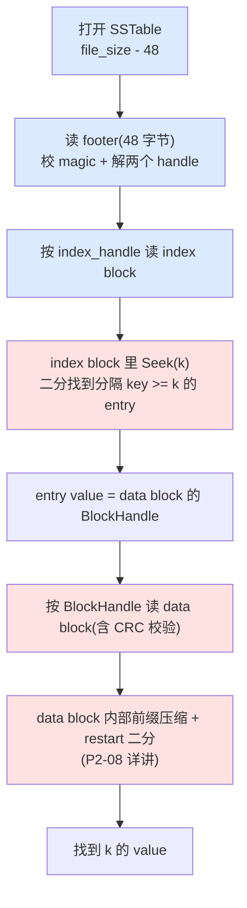

# 第七章 · SSTable 文件格式:四级布局

> 篇:P2 持久化的第一道:SSTable 的格式
> 主线呼应:上一章(P1-06)讲完写组,MemTable 在内存里把写都收住了。但 MemTable 终究在内存里——容量有限,进程一挂就没了。所以 MemTable 写满后,要把它整体**冻结成 Immutable,在后台顺序地刷成一个有序的磁盘文件**,这个文件就是 **SSTable(Sorted String Table)**。这一章不讲刷盘流程(那是 P2-10 TableBuilder 的事),只讲**刷出来的文件长什么样**:一个 `.ldb` 文件内部到底怎么布局,凭什么打开就能 O(1) 定位索引、读到任何一条 KV。

## 核心问题

**一个 SSTable 文件怎么组织,才能既紧凑存 KV、又支持快速随机读?LevelDB 的答案是四级布局——data block 存 KV,filter block 挡无效查询,index block 指向各 data block,footer 固定在文件末尾当"锚"。打开文件只需 seek 到末尾读 48 字节 footer,一次就拿到整张文件的索引根。**

读完本章你会明白:

1. SSTable 从前到后是 **data block → meta block(filter)→ metaindex block → index block → footer** 五段(四级 + footer),官方 `doc/table_format.md` 一张图就能讲清。每一级的职责是什么。
2. 为什么 footer 固定 48 字节、固定在文件末尾——让"打开"O(1):seek 到末尾、读固定大小、一次解码就拿到 metaindex 和 index 的 BlockHandle。
3. `BlockHandle` 怎么用 varint64 编码 offset + size,小数字省字节、大数字自动扩长;`kMaxEncodedLength = 10 + 10 = 20` 这个上限怎么来的。
4. 每个 block 尾巴为什么还有 5 字节 trailer(1 字节 type + 4 字节 masked CRC32C)——CRC 防止磁盘静默损坏,torn write 兜底。
5. 读一条 key 的"反向定位"路径:footer → index handle → index block 二分 → data block handle → data block。这条路径是下一章 P2-08(block 内部)和第 3 篇(读路径全流程)的地基。

> **如果一读觉得太难**:先只记住三件事——① SSTable 末尾固定 48 字节 footer,装着两个指针(metaindex handle + index handle);② 打开文件先 seek 到末尾读 footer,再按 index handle 读 index block,就能 O(1) 拿到索引根;③ 每个 block 尾巴有 5 字节(type + CRC)校验防损坏。剩下的字节级细节可以回头再读。

---

## 7.1 一句话点破

> **SSTable 把索引根"焊"在文件末尾——footer 固定 48 字节,装着 metaindex 和 index 两个 BlockHandle。打开文件只需 seek 到末尾、读这 48 字节、解码出两个指针,整张文件的索引就到手了。这是一次"用末尾固定锚换 O(1) 打开"的精妙取舍:写文件时不用预知总大小,读文件时不用扫全文件。**

这是结论,不是理由。本章倒过来拆:先看"如果索引放文件头"为什么不行,再看 footer 固定末尾怎么同时解决"写时不知大小"和"读时一次定位"两个矛盾,最后钉死 BlockHandle 的变长编码、block trailer 的 CRC 校验。

---

## 7.2 从 MemTable 落盘说起:为什么需要一套文件格式

### 提出问题

P1-04、P1-05 讲过,MemTable 本质是一棵 SkipList,里面存着 internal key → value 的有序映射。MemTable 写满(默认 4MB)后,要被**冻结成 Immutable**,然后后台线程把它**顺序地**刷成一个磁盘文件。

这里有个朴素的问题:**为什么不直接把 MemTable 的内存字节 dump 到磁盘就完事?** 内存里 SkipList 的节点是散在 Arena 里的、靠指针连起来的,你把这个节点的字节写进文件,读出来的时候指针全是悬空的——这种"内存布局"天生不能直接落盘。

所以必须设计一套**磁盘上的、自描述的文件格式**:

1. KV 怎么紧凑排列(不能带指针,要顺序布局)。
2. 怎么快速找到某条 KV(不能扫全文件,要索引)。
3. 怎么从外部"打开"这个文件、定位到索引(打开要快)。
4. 怎么防磁盘静默损坏(校验)。

这四件事,就是 SSTable 文件格式要回答的全部。LevelDB 的答案是**四级布局 + 固定末尾 footer**,下节开始一层层拆。

### 不这样会怎样

> **反面对比(裸 dump 内存)**:假设直接把 SkipList 的节点数组写进文件。每个节点里有 `std::atomic<Node*> next_[kMaxHeight]`——这是**指针**。落盘后指针值毫无意义,且不同进程的地址空间布局不同,根本没法还原。就算改成 offset,也不知道哪个节点在哪、有几层。这种 dump 拿出来,读一条 key 要全扫,O(n)。

> **反面对比(无索引的有序文件)**:假设只把 KV 按序写进一个文件,不加 index。读一条 key,只能从头二分——但二分要随机访问,机械盘每次 seek ~10ms,1GB 文件二分要 30 次 seek = 300ms。完全不可用。**索引的存在,是为了把"读一条 key 的磁盘 I/O 次数"从 O(log n) 次随机 seek 降到 O(1) 次**。

所以 SSTable 必须有索引,而且索引要能被快速定位到。下面看 LevelDB 怎么布局。

---

## 7.3 四级布局:官方 `doc/table_format.md` 一张图

先给结论。整个 SSTable 文件,从前到后长这样(ASCII 框图,来自 [`doc/table_format.md`](../leveldb/doc/table_format.md) 的官方描述):

```
    <beginning_of_file>
    ┌────────────────────────────┐  ← offset 0
    │   [data block 1]            │
    ├────────────────────────────┤
    │   [data block 2]            │
    ├────────────────────────────┤
    │   ...                       │
    ├────────────────────────────┤
    │   [data block N]            │     ↑ 四级之 ①:data block 们
    ├────────────────────────────┤       存 KV,默认 4KB 切一块
    │   [meta block 1: filter]    │     ↑ 四级之 ②:meta block(可选,布隆等)
    ├────────────────────────────┤
    │   [metaindex block]         │     ↑ 四级之 ③:metaindex,指向各 meta block
    ├────────────────────────────┤
    │   [index block]             │     ↑ 四级之 ④:index,指向各 data block
    ├────────────────────────────┤  ← file_size - 48
    │   [Footer]  (固定 48 字节)   │     ↑ 锚:固定末尾,装两个 BlockHandle
    └────────────────────────────┘  ← file_size
    <end_of_file>
```

每一级是什么:

| 级 | 装什么 | 内部格式 | 谁指向它 |
|---|--------|---------|---------|
| **data block** | 实际的 internal_key → value KV 对 | `block_builder.cc` 格式(prefix-compressed,见 P2-08),默认 4KB 切一块 | index block 的 entry value(一个 BlockHandle) |
| **meta block** | 元信息(目前只有 filter,即布隆过滤器) | 各 meta 类型自定义;filter block 格式见 P2-09 | metaindex block |
| **metaindex block** | 一张"meta block 名字 → BlockHandle"的小目录 | 也是 `block_builder.cc` 格式(不压缩,见后) | footer 的 `metaindex_handle` |
| **index block** | 一张"data block 末尾 key → BlockHandle"的目录 | 也是 `block_builder.cc` 格式(restart_interval=1,见 P2-08) | footer 的 `index_handle` |
| **footer** | 固定 48 字节:`metaindex_handle` + `index_handle` + padding + magic | `format.h::Footer` | 打开时 seek 到 `file_size - 48` 直接读 |

一个**重要细节**:data block、meta block、metaindex block、index block 的**内部格式都是同一套**(都是 `block_builder.cc` 生成的前缀压缩格式,只是 index block 把 restart_interval 设成 1)。这是 LevelDB 的一个优雅复用——**block 是 SSTable 的通用积木**,不管装什么内容,KV 排序、前缀压缩、二分查找的机制都一样。下一章 P2-08 就专门钻进 block 内部。

现在逐层拆。

---

## 7.4 data block:KV 的紧凑仓库

### 提出问题

data block 是 SSTable 的主体——所有 KV 最终都落在这里。它怎么切?

答案在 [`table/table_builder.cc:119-123`](../leveldb/table/table_builder.cc#L119-L123):

```cpp
  r->data_block.Add(key, value);                              // table_builder.cc:117

  const size_t estimated_block_size = r->data_block.CurrentSizeEstimate();  // :119
  if (estimated_block_size >= r->options.block_size) {        // :120
    Flush();                                                   // :121
  }
```

每次 `Add` 一条 KV,看 `data_block` 的预估大小(`CurrentSizeEstimate`)是否到了 `options.block_size`。到了就 `Flush`——把这个 block 写到文件、重置 block builder、准备开下一个 block。`block_size` 默认值在 [`include/leveldb/options.h`](../leveldb/include/leveldb/options.h)(`block_size = 4 * 1024`,即 4KB,可配)。

### 不这样会怎样

**为什么不把整个 SSTable 的 KV 全塞进一个超大 block?** 因为读一条 key,要把这个 block **整个读进内存**才能二分查找。block 越大,一次读的磁盘 I/O 越大。4KB 是个甜点——一次磁盘 I/O 读一个 block,内存也装得下。

**为什么不每个 KV 一个 block?** 那样 block 数量爆炸,index block 也要爆(每条 KV 在 index 里一个 entry),浪费空间,且 index block 自己也变成一个大 block。

4KB 是**"一次 I/O 的粒度"和"index 体积"之间的平衡**。LevelDB 默认 4KB,RocksDB 可配 4KB~64KB。

### 所以这样设计

`Flush` 的核心逻辑在 [`table/table_builder.cc:125-139`](../leveldb/table/table_builder.cc#L125-L139):

```cpp
void TableBuilder::Flush() {
  Rep* r = rep_;
  if (!ok()) return;
  if (r->data_block.empty()) return;
  assert(!r->pending_index_entry);
  WriteBlock(&r->data_block, &r->pending_handle);             // :131 —— 写这个 block
  if (ok()) {
    r->pending_index_entry = true;                            // :133 —— 标记:等看到下个 block 的第一条 key,再补 index entry
    r->status = r->file->Flush();                             // :134
  }
  if (r->filter_block != nullptr) {
    r->filter_block->StartBlock(r->offset);                    // :137 —— 通知 filter block:新 block 开始
  }
}
```

注意 `r->pending_index_entry = true`——index block 的 entry **不是在写完 data block 时立即生成**,而是**等下一条 KV(即下一个 block 的第一条)进来时**,回头补这个 index entry。为什么?

看 [`table/table_builder.cc:102-109`](../leveldb/table/table_builder.cc#L102-L109):

```cpp
  if (r->pending_index_entry) {
    assert(r->data_block.empty());
    r->options.comparator->FindShortestSeparator(&r->last_key, key);   // :104 —— 找一个比上 block 末尾 key 大、比本 block 首 key 小的最短串
    std::string handle_encoding;
    r->pending_handle.EncodeTo(&handle_encoding);
    r->index_block.Add(r->last_key, Slice(handle_encoding));            // :107 —— 用这个短 key 当 index entry 的 key
    r->pending_index_entry = false;
  }
```

`FindShortestSeparator(&last_key, key)` 是个技巧——它找一个**比上一个 block 的最后一条 key 严格大、但比当前 key(下个 block 第一条)尽可能短**的字符串。比如上 block 末尾是 `"the quick brown fox"`,当前 key 是 `"the who"`,separator 可以是 `"the r"`——它 >= `"the quick brown fox"`(因为 `"the quick..." < "the r"`,注意 `"q" < "r"`),又 < `"the who"`(`"r" < "w"`)。

源码注释原话([`table/table_builder.cc:50-57`](../leveldb/table/table_builder.cc#L50-L57)):

```
  // We do not emit the index entry for a block until we have seen the
  // first key for the next data block.  This allows us to use shorter
  // keys in the index block.  For example, consider a block boundary
  // between the keys "the quick brown fox" and "the who".  We can use
  // "the r" as the key for the index block entry since it is >= all
  // entries in the first block and < all entries in subsequent
  // blocks.
```

这个技巧的意义:index block 的 key 可以短很多(几字节 vs 几十字节),index block 整体更小,前缀压缩(P2-08)效果更好,读 index 时 I/O 更少。**index entry 的 key 不必是某个真实 key,只要能正确分隔相邻 block 即可**。

### 7.4.1 block trailer:type + CRC

`WriteBlock` 调 `WriteRawBlock`,真正落盘的是 block 数据 + 5 字节 trailer,看 [`table/table_builder.cc:192-209`](../leveldb/table/table_builder.cc#L192-L209):

```cpp
void TableBuilder::WriteRawBlock(const Slice& block_contents,
                                 CompressionType type, BlockHandle* handle) {
  Rep* r = rep_;
  handle->set_offset(r->offset);                              // :195 —— 这个 block 在文件里的起始 offset
  handle->set_size(block_contents.size());                    // :196
  r->status = r->file->Append(block_contents);                // :197 —— 先写 block 数据
  if (r->status.ok()) {
    char trailer[kBlockTrailerSize];                          // kBlockTrailerSize = 5(format.h:79)
    trailer[0] = type;                                         // 1 字节:压缩类型(kNoCompression / kSnappy / kZstd)
    uint32_t crc = crc32c::Value(block_contents.data(), block_contents.size());
    crc = crc32c::Extend(crc, trailer, 1);                    // :202 —— CRC 覆盖 block 数据 + 1 字节 type
    EncodeFixed32(trailer + 1, crc32c::Mask(crc));             // :203 —— masked CRC32C,4 字节小端
    r->status = r->file->Append(Slice(trailer, kBlockTrailerSize));  // :204 —— 再写 5 字节 trailer
    if (r->status.ok()) {
      r->offset += block_contents.size() + kBlockTrailerSize;  // :206 —— offset 推进
    }
  }
}
```

完整的一个 block 在磁盘上长这样:

```
   一个 block 在磁盘上的字节布局(总长 = block_size + 5):
   ┌──────────────────────────┬──────┬──────────────────┐
   │   block 数据 (n 字节)      │ type │ masked CRC32C(4) │
   │   (可能压缩过)              │ (1B) │     小端           │
   └──────────────────────────┴──────┴──────────────────┘
                                       ↑ kBlockTrailerSize = 5 字节
```

两个关键细节:

1. **`type`** 标记这个 block 是否压缩。`kNoCompression`(0)、`kSnappyCompression`(1)、`kZstdCompression`(2)。读 block 时([`table/format.cc:102`](../leveldb/table/format.cc#L102) 的 switch)按 type 解压。
2. **`crc32c::Mask(crc)`** 是一次额外的混淆——把 CRC 通过一个固定变换遮一下,避免写到磁盘上的 CRC 字段正好等于数据里某段值导致校验绕过。读的时候 `crc32c::Unmask` 还原。具体在 `util/crc32c.cc`。

> **钉死这件事**:CRC 是**防止静默损坏**的最后一道防线。磁盘偶尔会写歪(torn write)、扇区偶尔会烂、网络块存储偶尔会返回错数据——这些都不会被文件系统、操作系统发现。LevelDB 给每个 block 带 4 字节 CRC,读 block 时(`options.verify_checksums`)比对,坏了就报 `Corruption`,**宁可报错也不返回错数据**。这是 LSM 这种"文件即数据库"架构的必要兜底。

读 block 的反向流程在 [`table/format.cc:69-162`](../leveldb/table/format.cc#L69-L162) 的 `ReadBlock`:按 BlockHandle 的 offset/size 读出 `n + 5` 字节,校验 CRC,按 type 解压。我们 P2-10、P3-13 详讲。

---

## 7.5 meta block 与 metaindex block:filter 的家

meta block 这一级,**目前 LevelDB 实际只放一种内容:filter block(布隆过滤器)**。P2-09 专门讲它,这里只说它在四级布局里的位置。

为什么 filter 不直接塞进 data block?为什么单独成一级?因为:

1. **生命周期不同**:data block 是"存数据"的,filter 是"挡查询"的——读一条 key,先用 filter 判断"这个 block 大概有没有",再决定要不要读 data block。filter 要能**独立读取**,不能和 data block 绑在一起解压。
2. **粒度不同**:filter 按"2KB 一个 filter 段"组织(见 [`doc/table_format.md`](../leveldb/doc/table_format.md) 的 `base = 2KB`),和 4KB 的 data block 不是一一对应。

所以 meta block 单独成一级,放在 data block 们之后。

那 metaindex block 又是干什么的?它是**"meta block 名字 → BlockHandle"的小目录**。为什么不直接在 footer 里放 filter 的 BlockHandle?因为 meta block 类型可能扩展(`doc/table_format.md` 里就提到 `"stats" Meta Block` 是预留位),footer 要保持简单固定,不能每加一种 meta 就改 footer。所以中间隔一层 metaindex:footer 只指向 metaindex,metaindex 再展开成多张表。

metaindex block 的内容极简,看 [`table/table_builder.cc:228-241`](../leveldb/table/table_builder.cc#L228-L241):

```cpp
  // Write metaindex block
  if (ok()) {
    BlockBuilder meta_index_block(&r->options);
    if (r->filter_block != nullptr) {
      // Add mapping from "filter.Name" to location of filter data
      std::string key = "filter.";                             // :232 —— key 是 "filter." + 过滤器名字
      key.append(r->options.filter_policy->Name());
      std::string handle_encoding;
      filter_block_handle.EncodeTo(&handle_encoding);
      meta_index_block.Add(key, handle_encoding);              // :236 —— value 是 filter block 的 BlockHandle 编码
    }

    // TODO(postrelease): Add stats and other meta blocks
    WriteBlock(&meta_index_block, &metaindex_block_handle);
  }
```

**就一条 entry**(当有 filter 时):key 是 `"filter.<filter_policy->Name()>"`(比如 `"filter.leveldb.BuiltinBloomFilter2"`),value 是 filter block 的 BlockHandle。打开 SSTable 时,`Table::ReadMeta` 按这个 key 找到 filter block 的 handle,再读 filter block(见 [`table/table.cc:82-109`](../leveldb/table/table.cc#L82-L109))。

> **钉死这件事**:metaindex block 的设计是**"留扩展口"**。现在只放 filter,但格式允许未来加 stats、加其他 meta block,而不破坏 footer 的固定布局。打开时按 key 找,找不到就当没有。这是**前向兼容**的标准做法。

---

## 7.6 index block:data block 的目录

index block 是**"data block 边界 key → BlockHandle"的目录**。每个 data block 对应 index block 里一条 entry:

- **key**:上一个 data block 的末尾 key 经过 `FindShortestSeparator` 缩短后的"分隔 key"(见 7.4 节)。它 >= 上 block 所有 key、< 下 block 所有 key。
- **value**:上 block 的 BlockHandle(varint64 编码的 offset + size)。

读一条 `k` 的流程:在 index block 里 Seek(k),找到第一个分隔 key >= k 的 entry,这个 entry 的 BlockHandle 指向的 data block,就是 k 可能在的那个 block。然后读那个 data block。

index block 的一个**特殊配置**:它的 `block_restart_interval = 1`(见 [`table/table_builder.cc:35`](../leveldb/table/table_builder.cc#L35) 和 [`table/table_builder.cc:90`](../leveldb/table/table_builder.cc#L90)),**不是默认的 16**。意思是 index block 里**每条 entry 都是 restart point**(不做前缀压缩)。为什么?

> **钉死这件事**:index block 的查询是**纯随机 Seek**(读任意 key 都要在 index 里二分),不像 data block 可能顺序扫描。restart_interval=1 让 index block 里每条 entry 都自带完整 key,二分时不用解压前缀,**Seek 更快**。代价是 index block 体积稍大,但 index entry 通常很少(每 4KB data block 一条,1GB 库也就几十万条 index entry,完全可接受)。这个权衡见 P2-08 restart point 详解。

index block 写在 [`table/table_builder.cc:243-253`](../leveldb/table/table_builder.cc#L243-L253)(Finish 时):

```cpp
  // Write index block
  if (ok()) {
    if (r->pending_index_entry) {
      // 最后一个 block 没有"下一条 key"来触发 FindShortestSeparator,
      // 所以用 FindShortSuccessor 把 last_key 缩到最短(只用 last_key 自己的信息)
      r->options.comparator->FindShortSuccessor(&r->last_key);  // :246
      std::string handle_encoding;
      r->pending_handle.EncodeTo(&handle_encoding);
      r->index_block.Add(r->last_key, Slice(handle_encoding));
      r->pending_index_entry = false;
    }
    WriteBlock(&r->index_block, &index_block_handle);           // :252
  }
```

注意最后一个 data block 没有"下一个 block 的第一条 key"可用,所以用 `FindShortSuccessor`(只用 last_key 自己找一个最短后继)补上这最后一条 index entry。

---

## 7.7 footer:固定 48 字节的锚

这一章的真正主角来了。前面四级都是为了引出 footer 的设计。

### 提出问题

打开一个 SSTable 文件,要做的第一件事是**定位索引**——拿到 index block 的 BlockHandle。怎么定位?

朴素方案 A:**把 index 放文件头**。打开时从头读一段,就是 index。**问题**:写文件时还没开始写 data,不知道总大小、不知道 index 里每条 entry 的 BlockHandle(指向还没写的 data block 的 offset)。要等全写完再回头改文件头——回头改意味着**随机写**(seek 回文件头),违背"只追加"原则,且文件头改坏了 index 就全毁。

朴素方案 B:**在文件开头存一个"index 的 offset"指针**。比 A 好一点(只改开头 8 字节),但还是要回头改,且 index 本身放哪都不优雅。

朴素方案 C:**扫一遍文件,找 magic number 标记**。打开慢,O(n),且 magic 可能在数据里误匹配。

### 不这样会怎样

> **反面对比(索引放文件头)**:写文件时要先预留 index 空间(预留多大?不知道),或者写完 data 再回头 seek 到文件头写 index(违背顺序写)。两种都不优雅。而且预留空间可能浪费、不够可能要挪动整个文件。LSM 的写入吞吐优势,不能因为一个文件格式细节被打破。

### 所以这样设计

LevelDB 的方案干净到极致——**footer 固定 48 字节,焊在文件末尾**。

为什么末尾?

1. **写时不回头**:整个文件从头到尾顺序写,data block → filter → metaindex → index → footer。footer 最后写,写它的时候 index 已经写完了,handle 都知道了,**全程顺序追加,零回头**。
2. **读时 O(1) 定位**:打开文件时,文件大小是已知的(`Env::FileSize`),`file_size - 48` 就是 footer 的起始 offset。seek 到那、读 48 字节、解码,就拿到了 metaindex 和 index 的 BlockHandle。**一次固定大小的随机读,就完成索引根定位。**

这就是 footer 设计的全部精髓。看 [`table/format.h:46-71`](../leveldb/table/format.h#L46-L71):

```cpp
// Footer encapsulates the fixed information stored at the tail
// end of every table file.
class Footer {
 public:
  // Encoded length of a Footer.  Note that the serialization of a
  // Footer will always occupy exactly this many bytes.  It consists
  // of two block handles and a magic number.
  enum { kEncodedLength = 2 * BlockHandle::kMaxEncodedLength + 8 };   // format.h:53 —— = 2*20 + 8 = 48

  Footer() = default;

  const BlockHandle& metaindex_handle() const { return metaindex_handle_; }
  void set_metaindex_handle(const BlockHandle& h) { metaindex_handle_ = h; }

  const BlockHandle& index_handle() const { return index_handle_; }
  void set_index_handle(const BlockHandle& h) { index_handle_ = h; }

  void EncodeTo(std::string* dst) const;
  Status DecodeFrom(Slice* input);

 private:
  BlockHandle metaindex_handle_;
  BlockHandle index_handle_;
};
```

`kEncodedLength = 2 * BlockHandle::kMaxEncodedLength + 8`。`BlockHandle::kMaxEncodedLength = 10 + 10 = 20`(format.h:26,offset 和 size 各一个 varint64,各最多 10 字节)。所以 `kEncodedLength = 2*20 + 8 = 48` 字节。**固定 48 字节,焊死。**

`Footer::EncodeTo` 在 [`table/format.cc:32-41`](../leveldb/table/format.cc#L32-L41):

```cpp
void Footer::EncodeTo(std::string* dst) const {
  const size_t original_size = dst->size();
  metaindex_handle_.EncodeTo(dst);                            // :34 —— 先写 metaindex handle(varint64 offset + varint64 size)
  index_handle_.EncodeTo(dst);                                // :35 —— 再写 index handle
  dst->resize(2 * BlockHandle::kMaxEncodedLength);            // :36 —— 用 resize 补零到 40 字节(padding)
  PutFixed32(dst, static_cast<uint32_t>(kTableMagicNumber & 0xffffffffu));      // :37 —— magic 低 32 位,小端
  PutFixed32(dst, static_cast<uint32_t>(kTableMagicNumber >> 32));               // :38 —— magic 高 32 位,小端
  assert(dst->size() == original_size + kEncodedLength);
}
```

footer 的字节布局(ASCII 框图):

```
   footer(固定 48 字节),从低地址到高地址:
   ┌──────────────────────────────────┬──────────┐
   │  metaindex_handle (≤ 20 字节)     │          │  ← varint64 offset + varint64 size
   ├──────────────────────────────────┤          │
   │  index_handle     (≤ 20 字节)     │ padding  │  ← varint64 offset + varint64 size
   ├──────────────────────────────────┤ (补零)   │  ← 把前两段总长补到 40 字节
   │         padding (0...)            │          │
   ├──────────────────────────────────┼──────────┤
   │   magic 低 32 位 (4 字节小端)       │          │  ← kTableMagicNumber & 0xffffffff
   │   magic 高 32 位 (4 字节小端)       │          │  ← kTableMagicNumber >> 32
   └──────────────────────────────────┴──────────┘
    ← 0                                40        48 →
```

注意几个细节:

1. **padding 把前两段总长补到 40 字节**(`dst->resize(2 * kMaxEncodedLength)`)。即使 metaindex_handle 只编了 12 字节、index_handle 编了 13 字节,也用 0 补到 40 字节。这样 magic 的位置固定在 `footer_start + 40`。
2. **magic 分两次写 32 位**(用 `PutFixed32`),不是一次写 64 位。这是因为 `kTableMagicNumber = 0xdb4775248b80fb57`,小端写出来就是 `57 fb 80 8b 24 75 47 db`。分两次写低 32、高 32,完全等价于一次 `PutFixed64`,但作者选了分两次(可能历史原因,可能想让 reader 在解析时能"先验 magic 再验 handle")。
3. **magic 的来历**:源码注释 [`table/format.h:73-75`](../leveldb/table/format.h#L73-L75) 写得很有意思——

```cpp
// kTableMagicNumber was picked by running
//    echo http://code.google.com/p/leveldb/ | sha1sum
// and taking the leading 64 bits.
static const uint64_t kTableMagicNumber = 0xdb4775248b80fb57ull;
```

magic 是 LevelDB 项目主页 URL 的 SHA1 前 64 位。这个数字没有任何内在含义,只是个**伪随机但确定**的值——用来在打开文件时校验"这真的不是一个 SSTable"(防止把别的文件误当 SSTable 打开)。`Footer::DecodeFrom` ([`table/format.cc:43-67`](../leveldb/table/format.cc#L43-L67)) 先校 magic,不匹配直接报 `Corruption("not an sstable (bad magic number)")`。

### 7.7.1 打开文件:O(1) 定位索引根

`Table::Open` 完美诠释了 footer 的价值,看 [`table/table.cc:38-80`](../leveldb/table/table.cc#L38-L80):

```cpp
Status Table::Open(const Options& options, RandomAccessFile* file,
                   uint64_t size, Table** table) {
  *table = nullptr;
  if (size < Footer::kEncodedLength) {                        // :41 —— 文件太小,肯定不是 SSTable
    return Status::Corruption("file is too short to be an sstable");
  }

  char footer_space[Footer::kEncodedLength];                  // 栈上 48 字节 buffer
  Slice footer_input;
  Status s = file->Read(size - Footer::kEncodedLength,        // :47 —— seek 到 file_size - 48
                        Footer::kEncodedLength,               //       读 48 字节
                        &footer_input, footer_space);         //       (栈 buffer 当 fallback)
  if (!s.ok()) return s;

  Footer footer;
  s = footer.DecodeFrom(&footer_input);                       // :52 —— 解码 footer(校 magic + 解两个 BlockHandle)
  if (!s.ok()) return s;

  // Read the index block
  BlockContents index_block_contents;
  ReadOptions opt;
  if (options.paranoid_checks) {
    opt.verify_checksums = true;
  }
  s = ReadBlock(file, opt, footer.index_handle(), &index_block_contents);   // :61 —— 按 index handle 读 index block

  if (s.ok()) {
    // We've successfully read the footer and the index block: we're
    // ready to serve requests.
    Block* index_block = new Block(index_block_contents);
    ...
    *table = new Table(rep);
    (*table)->ReadMeta(footer);                                // :76 —— 懒读 metaindex(有 filter_policy 才读)
  }

  return s;
}
```

整个打开流程:

1. `file->Read(size - 48, 48, ...)`——**一次固定大小随机读**,拿到 footer。
2. 解 footer:校 magic,解出 `metaindex_handle` 和 `index_handle`。
3. `ReadBlock(file, opt, footer.index_handle(), ...)`——按 `index_handle` 读 index block。
4. 构造 Table 对象,index block 装进去,完事。

**两次磁盘 I/O 打开一个 SSTable:一次读 footer(48 字节),一次读 index block(几 KB)**。这就是 footer 固定末尾的全部价值——O(1) 打开。

> **钉死这件事**:footer 是 SSTable 格式的**定海神针**。它让"打开文件"这件事变成两次固定大小的 I/O,不依赖文件总大小、不依赖任何"扫一遍找标记"的笨办法。读 footer → 解出 index handle → 读 index block,从此整张文件的索引都在手上。后面任何 Seek,都从 index block 开始二分。

---

## 7.8 一条 key 的"反向定位"全路径

把前几节串起来。读一条 `k`,从 footer 出发的完整路径:



蓝色是"打开"阶段(每个 SSTable 只做一次,table_cache 会缓存打开的 Table 对象),红色是"读"阶段(每次 Get 都做)。

注意 **filter block** 在这条路径里不在主链上——它在 `Table::InternalGet` 里是**一道提前剪枝**(`table.cc:222-226` 的 `filter->KeyMayMatch`):读 data block 之前,先问 filter "这个 block 大概有没有 k",filter 说没有就直接跳过,不读 data block。这把绝大多数无效查询挡在了读 data block 之前。P2-09 详讲。

这条"反向定位"路径,是第 3 篇读路径全流程(P3-13)的文件内骨架。读一条 key 的磁盘 I/O 次数,理想情况下就是:

- 1 次读 footer(打开时,table_cache 缓存后 amortize 到 0)。
- 1 次读 index block(block_cache 缓存后 amortize 到 0)。
- 1 次读 data block(命中 block_cache 则 0 次磁盘)。

**总共 0~1 次磁盘 I/O,就能定位到任意一条 key**。这就是 SSTable 格式的全部回报。

---

## 7.9 技巧精解:footer 固定锚 + BlockHandle 变长编码

这一章的硬核技巧有两个:**footer 作为"固定锚"** 和 **BlockHandle 的 varint64 变长编码**。它们联手把"打开 + 定位索引"做到 O(1)。

### 技巧精解 1:footer 固定 48 字节焊在末尾

**这个技巧在做什么**:让"打开 SSTable 文件、定位索引根"这件事变成**一次固定大小的随机读**,不依赖文件总大小、不依赖扫文件。

**用了什么手段**:在文件末尾固定写 48 字节,内容是 `metaindex_handle + index_handle + padding + magic`。打开时 `file->Read(file_size - 48, 48)` 就拿到。

**为什么 sound**:

1. **顺序写不回头**:写文件时,data → filter → metaindex → index 全部追加完,最后才写 footer。这时 index 的 BlockHandle 已经完全确定,直接编进 footer 追加进去。**整个写过程是一次连续的顺序追加**,没有一次 seek 回头改文件头。这正是 LSM "只追加"哲学在文件格式层面的体现。
2. **打开 O(1)**:`file_size` 通过 `Env::FileSize` 拿到(O(1) 系统调用),`file_size - 48` 就是 footer 起点,一次 `Read` 48 字节。不需要扫文件、不需要找 magic、不需要预知任何元信息。**任意大小的 SSTable,打开都是两次固定大小的 I/O**(读 footer + 读 index block)。
3. **padding 让 magic 位置固定**:即使两个 BlockHandle 编码长度不同(metaindex 可能 12 字节、index 可能 15 字节),也用 0 补到 40 字节,所以 magic 永远在 `footer_start + 40`。这让"先验 magic 再解 handle"成为可能——`Footer::DecodeFrom` 先读 magic 校验,通过后再回头解 handle,中途任何位置都能精确定位。
4. **magic 是 URL 的 SHA1 前 64 位**:伪随机但确定,几乎不可能在真实数据里撞上。它的作用是**文件类型校验**——防止把一个日志文件、一个 manifest、一个普通文本误当 SSTable 打开。一旦 magic 不对,直接 `Corruption`,不往下瞎解。

**反面对比 1(索引放文件头)**:见 7.7 节"提出问题"。写时不知道 data 总大小,要么预留空间(浪费 / 不够 / 挪文件),要么回头 seek 改文件头(违背顺序写,且文件头改坏全毁)。LSM 的写吞吐优势不能因为格式细节打折扣。

**反面对比 2(扫文件找 magic)**:打开慢,O(n),且 magic 是 8 字节固定值,在数据里(尤其 value 是二进制时)可能误匹配,得加更多上下文校验。完全不可取。

**反面对比 3(在文件外存 index 位置)**:比如另一个文件记录"SSTable X 的 index 在 offset Y"。那就是另一个 manifest,多了崩溃恢复的负担——SSTable 文件应该自描述,不该依赖外部元数据才能打开。footer 让 SSTable 自包含,任何 SSTable 单独拿出去都能被打开。

> **钉死这件事**:footer 是 SSTable 自描述的根。固定末尾 + 固定大小 + magic 校验,三者联手让"打开"这件事变成一行 `file->Read(file_size - 48, 48)`。这是 LevelDB 文件格式最优雅的一笔,后续 RocksDB、甚至其他存储引擎(FastrFS、Pebble)都沿用了这个"固定末尾 footer"的设计。

### 技巧精解 2:BlockHandle 的 varint64 变长编码

**这个技巧在做什么**:用一个 BlockHandle(offset + size)指向文件里任意一个 block,且编码尽量短。

**用了什么手段**:offset 和 size 各用一个 **varint64** 编码。varint 是"小数字用少字节、大数字用多字节"的变长编码——每字节高 1 位是"还有后续"标志,低 7 位是数据。看 [`table/format.cc:16-22`](../leveldb/table/format.cc#L16-L22) 和 [`util/coding.cc:55-64`](../leveldb/util/coding.cc#L55-L64):

```cpp
// table/format.cc:16-22
void BlockHandle::EncodeTo(std::string* dst) const {
  assert(offset_ != ~static_cast<uint64_t>(0));
  assert(size_ != ~static_cast<uint64_t>(0));
  PutVarint64(dst, offset_);                                  // offset 编码成 varint64
  PutVarint64(dst, size_);                                    // size 编码成 varint64
}

// util/coding.cc:55-64
char* EncodeVarint64(char* dst, uint64_t v) {
  static const int B = 128;
  uint8_t* ptr = reinterpret_cast<uint8_t*>(dst);
  while (v >= B) {
    *(ptr++) = v | B;                                         // 高位置 1 表示"还有后续"
    v >>= 7;
  }
  *(ptr++) = static_cast<uint8_t>(v);                         // 最后一字节高位是 0
  return reinterpret_cast<char*>(ptr);
}
```

varint64 的字节长度 = `ceil((bit_length + 1) / 7)`,最多 10 字节(64 位 / 7 ≈ 9.14,取上界 10,见 `PutVarint64` 里的 `char buf[10]`)。具体:

| 数值范围 | varint64 字节数 |
|---------|----------------|
| 0 ~ 127 | 1 |
| 128 ~ 16383 | 2 |
| 16384 ~ 2^21-1 | 3 |
| ... | ... |
| 2^56 ~ 2^63-1 | 9 |
| 2^63 ~ 2^64-1 | 10 |

这就是 `kMaxEncodedLength = 10 + 10 = 20` 的来历——offset 和 size 各最多 10 字节。

**为什么 sound**:

1. **绝大多数 BlockHandle 的实际编码远短于 20 字节**。一个 4MB 的 SSTable,offset 最大 ~4,000,000,在 varint64 里只占 3 字节(`4e6 < 2^23`)。一个 4KB 的 data block,size 是 4096,只占 2 字节。**实际一个 BlockHandle 通常 5~6 字节,远小于上限 20 字节**。这在 index block 里尤其重要——index block 有几十万条 entry,每条 entry 的 value 都是一个 BlockHandle,省下来的字节累加起来很可观。
2. **padding 兜底**:`kMaxEncodedLength = 20` 是**最坏情况上界**,实际编码短就用 padding 补齐到 40。这样 footer 总长固定 48,无论 BlockHandle 实际多短。padding 只是几个 0 字节,代价微乎其微。
3. **varint 解码快路径**:`GetVarint32Ptr` 在 [`util/coding.h:108-118`](../leveldb/util/coding.h#L108-L118) 有快路径——如果第一个字节高位是 0,直接返回这个字节(1 字节 case),不用进 fallback 循环。这覆盖了 0~127 的小数字,是热路径的 micro-optimization。
4. **CRC 让数据自校验**:varint 没有 CRC,但 BlockHandle 的载体(index block 的 entry)整个 block 是有 CRC 的(7.4.1 节),所以 BlockHandle 解码错了会被 block 级 CRC 兜住。

**反面对比 1(固定 8 字节 offset + 8 字节 size)**:每个 BlockHandle 16 字节,不管数字大小。index block 里几十万条 entry,每条多 10 字节(16 vs 实际 varint 5~6),几十万 × 10 = 几 MB,index block 膨胀,读 index 的 I/O 也变大。在 LevelDB 这种"小而紧凑"的库里,这是明显浪费。

**反面对比 2(用文本编码 offset,如 "12345678")**:可读性好,但每字节信息量低(ASCII 数字 1 字节只表达 ~3.3 位信息 vs varint 7 位),且要分隔符、要解析,慢且大。

**反面对比 3(只编 offset,不编 size)**:那读 block 时怎么知道多大?得在别处存 size,或者读"到下一个 block 起始之前"——但 block 之间可能有对齐 padding、可能压缩,无法推断。size 必须显式编码,BlockHandle = offset + size 是最小完备的描述。

> **钉死这件事**:varint 是 LevelDB 全书反复出现的位运算技巧(P2-08 的 `shared/non_shared/value_length` 也是 varint32,WAL 的 record 长度也用)。它的核心价值是"**小数字少占字节**",在 metadata 密集的场景(index block、block entry header)收益巨大。代价是解码有分支(变长),但 `GetVarint32Ptr` 的快路径把 1 字节 case 优化到极致,实际开销很小。这是 LSM 这种"小记录海量"场景的标准工具。

---

## 章末小结

这一章讲清了 SSTable 的文件格式——四级布局 + 固定末尾 footer:

1. **四级布局**:data block(KV,4KB 切一块)→ meta block(filter,可选)→ metaindex block(meta 目录)→ index block(data 目录,restart_interval=1)。前四级内部都是同一套 `block_builder.cc` 格式(P2-08 详讲)。
2. **footer 固定 48 字节焊末尾**:`metaindex_handle + index_handle + padding + magic`,让"打开"O(1)。
3. **BlockHandle 用 varint64 编码 offset + size**:小数字省字节,大数字自动扩长,`kMaxEncodedLength = 10 + 10 = 20`。
4. **每个 block 尾 5 字节 trailer**:1 字节 type + 4 字节 masked CRC32C,防静默损坏。
5. **读一条 key 的反向定位路径**:footer → index handle → index block 二分 → data block handle → data block → 内部二分(P2-08)。理想 0~1 次磁盘 I/O。

回到主线:这一章是**衔接**——既服务前台读(打开 SSTable、定位 KV),又服务后台刷盘(TableBuilder 写出 SSTable)。SSTable 是"只追加"哲学落到磁盘上的产物:写时全程顺序追加,读时靠 footer 固定锚 O(1) 定位索引,两者都顺从"顺序写快"的物理事实。footer 的设计,是这一章最值得品味的一笔。

### 五个"为什么"清单

1. **为什么 footer 固定在文件末尾,不放在开头?** 放末尾:写时全程顺序追加(写完 index 才写 footer,不回头),读时 `file_size - 48` 一次固定大小 I/O 拿到。放开头:写时不知道 index handle(指向还没写的 block),要么预留(浪费/不够/挪文件)要么回头 seek 改开头(违背顺序写)。末尾是唯一两全的选择。
2. **为什么 footer 是固定 48 字节?** `kEncodedLength = 2 * BlockHandle::kMaxEncodedLength + 8 = 2*20+8 = 48`。固定大小让"读 footer"是一次固定 I/O,不需要先读个长度再读内容。两个 BlockHandle 各预留最坏 20 字节(实际短就 padding),magic 8 字节。
3. **BlockHandle 为什么用 varint64 而不是固定 8 字节?** 小数字少占字节。一个 4MB 文件 offset 实际 3 字节、4KB block size 实际 2 字节,BlockHandle 通常 5~6 字节 vs 固定 16 字节。index block 几十万条 entry 累计省下 MB 级空间。varint 是"小记录海量"场景的标准工具。
4. **为什么每个 block 尾要带 5 字节 CRC?** 防磁盘静默损坏。磁盘写歪(torn write)、扇区烂、网络块存储返错数据,文件系统和 OS 都不会发现。LevelDB 给每个 block 带 4 字节 masked CRC32C,读时校验,坏了报 `Corruption` 不返错数据。这是"文件即数据库"的必要兜底。
5. **为什么 index block 的 restart_interval=1(每条都是 restart)?** index block 是纯随机 Seek 的目录(读任意 key 都要在 index 二分),不像 data block 可能顺序扫。restart_interval=1 让每条 entry 自带完整 key,二分时不用解压前缀,Seek 更快。代价是 index 稍大,但 index entry 数量远少于 data(每 4KB data 一条 index),可接受。P2-08 详讲 restart point。

### 想继续深入往哪钻

- **官方格式说明**:[`doc/table_format.md`](../leveldb/doc/table_format.md) 是权威,本章的字节布局都以它为准。读它一页胜过任何二手资料。
- **写文件的完整流程**:`TableBuilder::Add` / `Flush` / `Finish` 在 [`table/table_builder.cc`](../leveldb/table/table_builder.cc),是"四级布局怎么写出来"的全过程。P2-10 详讲。
- **打开文件的完整流程**:`Table::Open` / `Table::ReadMeta` / `Table::ReadFilter` 在 [`table/table.cc:38-132`](../leveldb/table/table.cc#L38-L132),是"四级布局怎么读出来"的全过程。P2-10 详讲。
- **varint 的更多应用**:WAL record 的长度、WriteBatch 的 count、LookupKey 的 klength,都用 varint。本书 P5-17(WAL 格式)会再讲一遍。
- **RocksDB 怎么扩展了这个格式**:RocksDB 加了 footer version、加了多种 meta block(properties、range deletion、compression dictionary),但"固定末尾 footer"的骨架没变。看 RocksDB 的 `table/format.cc` 对比。

### 引出下一章

这一章讲了文件的骨架——四级布局 + footer 固定锚。但有个关键问题没回答:**data block 内部的 KV 怎么存?** 一个 4KB 的 data block 里,几十条 KV,如果每条都存完整 internal key,空间浪费严重(相邻 key 前缀大量重复,尤其同 user_key 的多版本)。LevelDB 怎么既紧凑存储、又支持二分查找?这就是下一章 P2-08 的事——**共享前缀压缩 + restart point**:每条 entry 只存"与前一条共享多少字节 + 不共享部分 + value",每隔 16 条存一个完整 key 的 restart point,让压缩后的 block 仍能二分查找。这是 block 这套"通用积木"的内部秘密,也是 LevelDB 空间压缩的核心手段之一。
