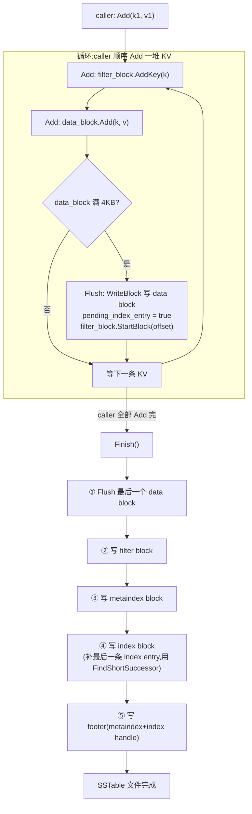
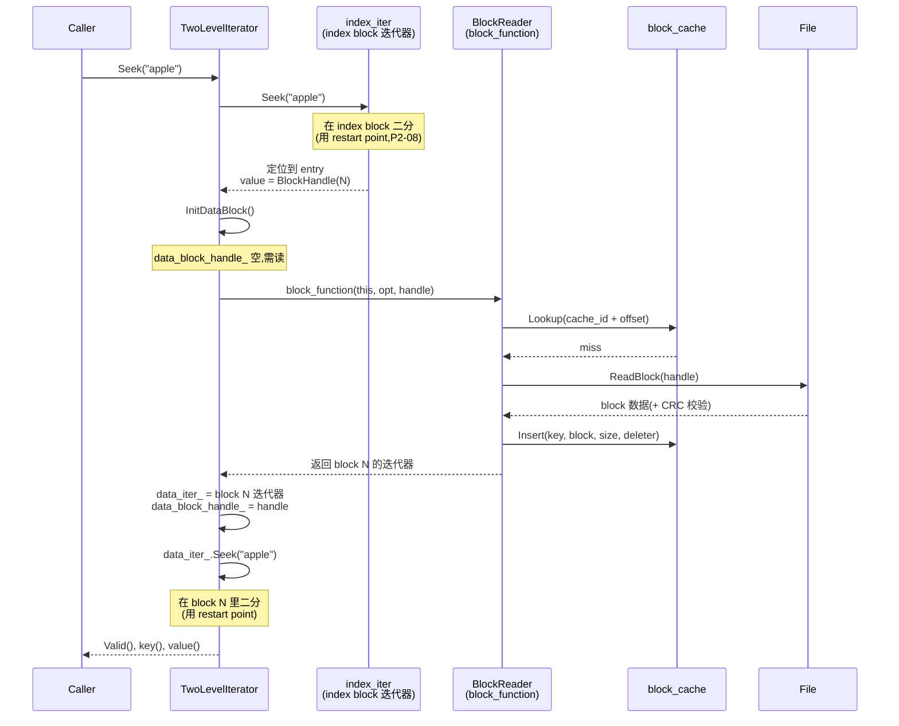
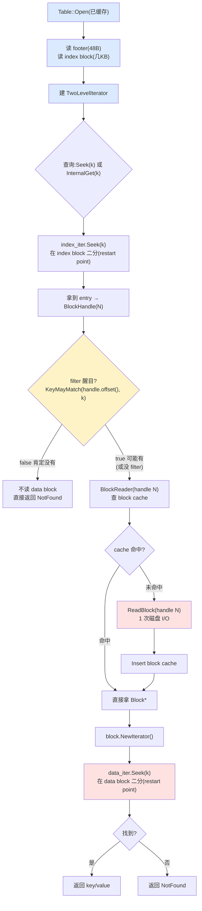

# 第十章 · TableBuilder 与 Table:构建与打开

> 篇:P2 持久化的第一道:SSTable 的格式(收官章)
> 主线呼应:前面三章(P2-07~09)把 SSTable 的四级布局拆完了——data block 怎么前缀压缩(P2-08)、filter block 怎么布隆(P2-09)、index block 和 footer 怎么定位(P2-07)。但这些都是"静态的格式描述":一个 `.ldb` 文件**长什么样**。这一章回答另一个问题:**这个文件是怎么从无到有"写"出来的、又是怎么被"打开"用的?** 写这侧的 `TableBuilder::Add` 是个状态机:每来一条 KV,先攒进 data block,满了 4KB 就 Flush,顺手记 index、刷 filter;全部 Add 完 `Finish()` 收尾,写 metaindex/index/footer。读这侧的 `Table::Open` 只读 footer + index 两个小 block,然后挂一个 **TwoLevelIterator**:上层 index 二分定位 data block,下层 data block **按需读、走 block cache**。这一章收官第 2 篇,把"四级布局怎么组装、怎么拆开"讲透,同时为第 3 篇(读路径全流程)铺好文件内的骨架。

## 核心问题

**SSTable 文件怎么"构建"——一堆已排序的 KV,怎么一边累积、一边顺序写成四级布局的文件?又怎么"打开"——读文件时怎么用最小代价(两次固定大小 I/O)拿到索引根,之后读任意 key 怎么靠"懒加载 + 缓存"把磁盘 I/O 压到最低?前者的核心是 `TableBuilder::Add/Flush/Finish` 状态机和"等下一条 key 再补 index entry"的延迟技巧;后者的核心是 `Table::Open` 读 footer+index、然后挂 `TwoLevelIterator` 让"data block 按需读、走 block cache"。**

读完本章你会明白:

1. `TableBuilder::Add` 的完整状态机:key 进 data block + filter block,满 4KB 触发 `Flush`;index entry **不在 Flush 时立即写**,而是等看到下一条 key 再用 `FindShortestSeparator` 缩短后补——这是上一章 P2-07 7.4 节点过、本章钉死的延迟技巧。
2. `Finish()` 的收尾顺序:flush 最后一个 data block → 写 filter block → 写 metaindex → 写 index → 写 footer。**为什么是这个顺序**(footer 必须最后,因为要知道前面所有 block 的 BlockHandle)。
3. `Table::Open` 只做两次磁盘 I/O:读 footer(48 字节)+ 读 index block。filter block 也在此时一并读进、常驻(P2-09 讲过)。
4. **TwoLevelIterator** 的懒加载:上层 index 迭代器二分找到 data block 的 BlockHandle,回调 `Table::BlockReader` 真正读那个 data block(走 block cache),下层 data block 迭代器按需 Seek。**打开文件时不读任何 data block**,第一次 Seek 才按需读。
5. `BlockReader` 怎么用 `cache_id + offset` 作为 block cache key、怎么用 `RegisterCleanup` 把"迭代器析构时归还 cache 引用"挂上——这是 P6-19 LRU cache 的预热。

> **如果一读觉得太难**:先只记住三件事——① 构建侧是个状态机:`Add` 攒 data block,满 4KB `Flush`,index entry 延迟到下一条 key 来才补(用 `FindShortestSeparator` 缩短),全部 Add 完 `Finish` 依次写 filter/metaindex/index/footer;② 打开侧只读 footer + index block 两个小 block,其余按需;③ 读 key 用 TwoLevelIterator:上层在 index 二分找 data block 的 handle,回调 `BlockReader` 走 block cache 读那个 data block,下层在 data block 里二分。剩下的状态机细节和 cleanup 回调可以回头再读。

---

## 10.1 一句话点破

> **构建侧:KV 进 data block、满 4KB Flush 写一个 data block、顺手刷 filter、index entry 延迟到下一条 key 来再用 `FindShortestSeparator` 缩短补上,最后 `Finish` 顺序写 filter/metaindex/index/footer——全程顺序追加,零回头。打开侧:seek 到末尾读 footer(48 字节)拿到 index handle,读 index block,完事——其余 data block 按需、按缓存,靠 TwoLevelIterator 把"上层 index 二分定位 + 下层 data block 懒读取"组合成一条逻辑有序流。**

这是结论,不是理由。本章倒过来拆:先看构建侧的状态机,再看"延迟补 index entry"的精妙;然后看打开侧的两次 I/O;最后钻进 TwoLevelIterator 这个"两层迭代器"的懒加载设计。

---

## 10.2 构建侧的状态机:`TableBuilder::Rep` 的几个累加器

### 提出问题

`TableBuilder` 的输入是**一堆已排序的 KV**(caller 必须保证 `key` 严格递增),输出是一个写好的 SSTable 文件。它的核心难点是:**这些 KV 要被分发到多个 block 里**(每 4KB 一个 data block),同时要**同步维护三个累加器**——data block(在攒当前的)、index block(记每个 data block 的目录)、filter block(按 2KB 分片攒 filter)。这三个累加器什么时候更新、什么时候刷盘,是个状态机。

先看 `TableBuilder::Rep` 这个内部状态,看 [`table/table_builder.cc:21-63`](../leveldb/table/table_builder.cc#L21-L63):

```cpp
struct TableBuilder::Rep {
  Rep(const Options& opt, WritableFile* f)
      : options(opt),
        index_block_options(opt),
        file(f),
        offset(0),
        data_block(&options),
        index_block(&index_block_options),
        num_entries(0),
        closed(false),
        filter_block(opt.filter_policy == nullptr
                         ? nullptr
                         : new FilterBlockBuilder(opt.filter_policy)),
        pending_index_entry(false) {
    index_block_options.block_restart_interval = 1;          // :35 —— index block 不做前缀压缩(P2-08 讲过)
  }

  Options options;
  Options index_block_options;
  WritableFile* file;                  // :40 —— 输出文件
  uint64_t offset;                     // :41 —— 当前文件偏移(写到哪了)
  Status status;
  BlockBuilder data_block;             // :43 —— 当前正在攒的 data block
  BlockBuilder index_block;            // :44 —— 累积的 index block(全程一个)
  std::string last_key;                // :45 —— 上一条加进去的 key(给 FindShortestSeparator 用)
  int64_t num_entries;                 // :46 —— 已加的 KV 条数
  bool closed;
  FilterBlockBuilder* filter_block;    // :48 —— 累积的 filter block(全程一个)
  bool pending_index_entry;            // :59 —— 标记:上一次 Flush 后,index entry 还没补
  BlockHandle pending_handle;          // :60 —— 上一次 Flush 写的 data block 的 handle,补 index 时用
  std::string compressed_output;       // :62 —— snappy/zstd 压缩用的复用 buffer
};
```

三个 BlockBuilder(`data_block`、`index_block`、`filter_block` 不是 BlockBuilder 而是 `FilterBlockBuilder`,但角色类似)是三个累加器。两个状态变量 `pending_index_entry` 和 `pending_handle` 是状态机的"延迟补 index entry"机制——下一节专门讲。

> **钉死这件事**:`TableBuilder` 全程持有这三个累加器,直到 `Finish()` 把它们全部刷盘、清空。caller 拿不到中间状态(除了 `NumEntries()` 和 `FileSize()`)。这是典型的 builder 模式——把"如何构建一个复杂对象(SSTable 文件)"封装到一个类里,caller 只管 `Add`、`Finish`,不用关心内部分发逻辑。

---

## 10.3 `Add`:每条 KV 的分发逻辑

### 所以这样设计

看 [`table/table_builder.cc:94-123`](../leveldb/table/table_builder.cc#L94-L123) 的 `Add`(本章主角之一):

```cpp
void TableBuilder::Add(const Slice& key, const Slice& value) {
  Rep* r = rep_;
  assert(!r->closed);
  if (!ok()) return;
  if (r->num_entries > 0) {
    assert(r->options.comparator->Compare(key, Slice(r->last_key)) > 0);   // :99 —— caller 必须保证 key 严格递增
  }

  // ① 延迟补 index entry(上一节铺垫,下一节细讲)
  if (r->pending_index_entry) {                                            // :102
    assert(r->data_block.empty());
    r->options.comparator->FindShortestSeparator(&r->last_key, key);       // :104 —— 缩短 last_key
    std::string handle_encoding;
    r->pending_handle.EncodeTo(&handle_encoding);
    r->index_block.Add(r->last_key, Slice(handle_encoding));               // :107 —— 补一条 index entry
    r->pending_index_entry = false;
  }

  // ② 把 key 喂给 filter block
  if (r->filter_block != nullptr) {
    r->filter_block->AddKey(key);                                          // :112
  }

  // ③ 把 KV 喂给 data block
  r->last_key.assign(key.data(), key.size());                              // :115
  r->num_entries++;                                                        // :116
  r->data_block.Add(key, value);                                           // :117

  // ④ 看看 data block 是不是满了
  const size_t estimated_block_size = r->data_block.CurrentSizeEstimate(); // :119
  if (estimated_block_size >= r->options.block_size) {                     // :120
    Flush();                                                               // :121
  }
}
```

每条 KV 进来,做四件事:

1. **如果上一轮 Flush 留了"待补 index entry"标记,先补**(:102-109)。这一段是延迟技巧的核心,下一节细讲。
2. **filter block 记这个 key**(:111-113)。`FilterBlockBuilder::AddKey` 把 key 加到当前 2KB 区间的 key 列表里(P2-09 讲过)。
3. **data block 加这条 KV**(:115-117)。`last_key` 更新(给下一条 KV 的延迟补 index 用),`num_entries` 加 1,`data_block.Add` 真的把 entry 写进 block builder 的内部 buffer(P2-08 讲过 `BlockBuilder::Add` 怎么前缀压缩)。
4. **检查 data block 是否满 4KB**(:119-122)。`CurrentSizeEstimate` 是 block builder 的预估大小(entry 数据 + restart array 预留),到了 `options.block_size`(默认 4KB)就 `Flush`。

注意 :99 的 assert——**caller 必须保证 key 严格递增**。这是个隐含合约:`TableBuilder` 不负责排序,排序在 caller 那一边(MemTable 的 SkipList 已经按序遍历,Compaction 的 MergingIterator 也按序产出)。`TableBuilder` 假设输入有序,只做"分发 + 累积 + 切 block"。这个合约也保证了 block 内 KV 有序、index block 的 key 严格递增——这是后续二分查找正确性的前提。

### 10.3.1 `Flush`:写一个 data block,设置"待补 index"标记

当 `Add` 检测到 data block 满 4KB,调 `Flush`,看 [`table/table_builder.cc:125-139`](../leveldb/table/table_builder.cc#L125-L139):

```cpp
void TableBuilder::Flush() {
  Rep* r = rep_;
  assert(!r->closed);
  if (!ok()) return;
  if (r->data_block.empty()) return;
  assert(!r->pending_index_entry);                                         // :130 —— 进入 Flush 时,上一条 index 必须已补完
  WriteBlock(&r->data_block, &r->pending_handle);                          // :131 —— 写这个 data block,handle 记到 pending_handle
  if (ok()) {
    r->pending_index_entry = true;                                         // :133 —— ★设置"待补 index"标记★
    r->status = r->file->Flush();                                          // :134 —— 刷文件缓冲
  }
  if (r->filter_block != nullptr) {
    r->filter_block->StartBlock(r->offset);                                // :137 —— 通知 filter block:新 block 开始
  }
}
```

`Flush` 做三件事:

1. **`WriteBlock(&r->data_block, &r->pending_handle)`**(:131):把当前 data block 写到文件(经 `WriteBlock` → `WriteRawBlock`,见 10.3.2),BlockHandle(这个 data block 的 offset/size)记到 `r->pending_handle`。
2. **`r->pending_index_entry = true`**(:133):**设置"待补 index"标记**。注意——**这里不立即写 index entry**!index entry 要等到**下一条 KV 进来时**(即下一个 data block 的第一条 key)才补。为什么?下一节细讲。
3. **`r->filter_block->StartBlock(r->offset)`**(:137):通知 filter block"现在文件偏移到了 r->offset",让它判断是不是跨入了新的 2KB 区间,如果是就把之前攒的 key 生成一个 filter(P2-09 讲过 `StartBlock`)。

`WriteBlock` 内部做压缩和写 trailer,看 [`table/table_builder.cc:141-190`](../leveldb/table/table_builder.cc#L141-L190):

```cpp
void TableBuilder::WriteBlock(BlockBuilder* block, BlockHandle* handle) {
  ...
  Slice raw = block->Finish();                                             // :148 —— BlockBuilder::Finish 写 restart array,返回整个 block 数据

  Slice block_contents;
  CompressionType type = r->options.compression;
  switch (type) {
    case kNoCompression:
      block_contents = raw;
      break;
    case kSnappyCompression: {
      std::string* compressed = &r->compressed_output;
      if (port::Snappy_Compress(raw.data(), raw.size(), compressed) &&
          compressed->size() < raw.size() - (raw.size() / 8u)) {           // :161 —— 压缩收益 > 12.5% 才用压缩版
        block_contents = *compressed;
      } else {
        // Snappy not supported, or compressed less than 12.5%, so just
        // store uncompressed form
        block_contents = raw;
        type = kNoCompression;
      }
      break;
    }
    case kZstdCompression: { ... 同上,只是 zstd ... }
  }
  WriteRawBlock(block_contents, type, handle);                             // :187
  r->compressed_output.clear();
  block->Reset();                                                          // :189 —— 清空 block builder,准备攒下一个 block
}
```

注意 :161 的 `compressed->size() < raw.size() - raw.size()/8u`——**压缩收益必须超过 12.5% 才用压缩版**,否则保留未压缩。这个阈值的考虑:压缩 block 节省磁盘 I/O,但读时要解压(CPU 开销),12.5% 是经验阈值,低于这个收益不值得解压。这是个工程取舍。

`WriteRawBlock` 真正写文件,看 [`table/table_builder.cc:192-209`](../leveldb/table/table_builder.cc#L192-L209):

```cpp
void TableBuilder::WriteRawBlock(const Slice& block_contents,
                                 CompressionType type, BlockHandle* handle) {
  Rep* r = rep_;
  handle->set_offset(r->offset);                                           // :195 —— 这个 block 在文件里的起点
  handle->set_size(block_contents.size());                                 // :196
  r->status = r->file->Append(block_contents);                             // :197 —— 写 block 数据
  if (r->status.ok()) {
    char trailer[kBlockTrailerSize];                                       // kBlockTrailerSize = 5
    trailer[0] = type;                                                     // 1 字节:压缩类型
    uint32_t crc = crc32c::Value(block_contents.data(), block_contents.size());
    crc = crc32c::Extend(crc, trailer, 1);                                 // :202 —— CRC 覆盖 block 数据 + 1 字节 type
    EncodeFixed32(trailer + 1, crc32c::Mask(crc));                         // :203 —— masked CRC32C,4 字节小端
    r->status = r->file->Append(Slice(trailer, kBlockTrailerSize));        // :204 —— 写 5 字节 trailer
    if (r->status.ok()) {
      r->offset += block_contents.size() + kBlockTrailerSize;              // :206 —— offset 推进
    }
  }
}
```

`WriteRawBlock` 在 P2-07 7.4.1 节详细讲过 block trailer(type + masked CRC32C),这里不重复。注意 `handle->set_offset(r->offset)` 在写之前——`r->offset` 此时还是 block 起点,所以 handle 记的是正确的 offset。写完后 `r->offset` 推进 `block_contents.size() + 5`。

---

## 10.4 延迟补 index entry:为什么要等下一条 key

### 提出问题

10.3 节有个奇怪的细节:`Flush` 写完一个 data block 后,**不立即写对应的 index entry**,只设个 `pending_index_entry = true` 标记。下一条 KV 进 `Add` 时,才补这个 index entry(10.3 节 :102-109)。为什么这么绕?

### 不这样会怎样

> **反面对比(Flush 时立即写 index entry)**:假设 `Flush` 写完一个 data block,立即在 index block 里加一条 entry,key 用"这个 block 的最后一条 key"。问题是——这条 key 可能很长(几十字节)。而 index block 的 key **唯一作用是分隔相邻 data block 的 key range**,只要 >= 上 block 所有 key、< 下 block 所有 key 即可,不必是某个真实 key。立即写,只能用"最后一条 key",太浪费空间。

### 所以这样设计

延迟补 index entry 的核心动机:**等看到下一个 block 的第一条 key,找一个最短的分隔串**。

源码注释原话([`table/table_builder.cc:50-57`](../leveldb/table/table_builder.cc#L50-L57)):

```
  // We do not emit the index entry for a block until we have seen the
  // first key for the next data block.  This allows us to use shorter
  // keys in the index block.  For example, consider a block boundary
  // between the keys "the quick brown fox" and "the who".  We can use
  // "the r" as the key for the index block entry since it is >= all
  // entries in the first block and < all entries in subsequent
  // blocks.
```

具体例子(注释里的例子):

```
   block N 的最后一条 key:  "the quick brown fox"
   block N+1 的第一条 key:  "the who"
                     ↓
   FindShortestSeparator("the quick brown fox", "the who")
                     ↓
   缩短为:             "the r"
                     ↑
   "the r" >= "the quick brown fox"  (因为 "q" < "r",前 4 字节 "the " 相同)
   "the r" <  "the who"               (因为 "r" < "w",前 4 字节 "the " 相同)
```

于是 index block 里这条 entry 的 key 只需存 `"the r"`(5 字节),而不是 `"the quick brown fox"`(19 字节)。**省 14 字节**。一条 entry 省十几字节,几十万 index entry 累计省 MB 级,index block 体积可能压一半。

看 `Add` 里的延迟补逻辑([`table/table_builder.cc:102-109`](../leveldb/table/table_builder.cc#L102-L109),已贴在 10.3 节):

```cpp
  if (r->pending_index_entry) {                                            // :102
    assert(r->data_block.empty());
    r->options.comparator->FindShortestSeparator(&r->last_key, key);       // :104 —— ★关键:缩短 last_key★
    std::string handle_encoding;
    r->pending_handle.EncodeTo(&handle_encoding);
    r->index_block.Add(r->last_key, Slice(handle_encoding));               // :107 —— 用缩短后的 last_key 当 index entry 的 key
    r->pending_index_entry = false;
  }
```

`FindShortestSeparator(&last_key, key)` 是 `Comparator` 的虚函数,默认 `BytewiseComparator` 的实现找一个" >= `last_key` 且 < `key`"的最短串,直接改 `last_key`。然后 :107 把这个缩短后的 `last_key` 当 index entry 的 key,`pending_handle`(上 block 的 BlockHandle)的 varint 编码当 value,加进 index_block。

**`pending_index_entry` 状态的转移**:

- 初始 `false`(Rep 构造函数)。
- `Flush` 后设 `true`(:133)——意思是"上 block 写完了,index entry 等下条 key 来补"。
- 下一条 KV 进 `Add`,看到 `pending_index_entry == true`,先补 index entry,再设回 `false`(:108)。
- 在 `pending_index_entry == true` 期间,`assert(data_block.empty())`(:103)——保证这个标记只在"data block 已 Flush、新 data block 还没开始攒"的瞬间有效。这是状态不变量。

> **钉死这件事**:延迟补 index entry 是"用一点状态复杂度换显著空间收益"的典型。它的前提是 caller 顺序 `Add`——下一 KV 来时,正好有"上 block 末尾 + 这 block 开头"两个 key 算最短分隔。`FindShortestSeparator` 在默认 `BytewiseComparator` 下是逐字节找一个分叉点,实现简单、收益可观。这个技巧让 index block 的体积压缩到"用真实 key 的 1/3~1/2",直接削读放大(index block 越小,读它一次的 I/O 越少,block cache 命中率越高)。

---

## 10.5 `Finish`:收尾的五步流水

### 提出问题

caller 把所有 KV 都 `Add` 完,最后必须调 `Finish()` 收尾——把还在累加器里的 data block、filter block、index block 全部刷盘,然后写 footer。这一步是状态机的终态转移。

### 所以这样设计

看 [`table/table_builder.cc:213-268`](../leveldb/table/table_builder.cc#L213-L268) 的 `Finish`:

```cpp
Status TableBuilder::Finish() {
  Rep* r = rep_;
  Flush();                                                                 // :215 —— ① 把最后还在攒的 data block 刷掉
  assert(!r->closed);
  r->closed = true;

  BlockHandle filter_block_handle, metaindex_block_handle, index_block_handle;

  // ② 写 filter block
  if (ok() && r->filter_block != nullptr) {
    WriteRawBlock(r->filter_block->Finish(), kNoCompression,
                  &filter_block_handle);                                   // :223-224 —— filter block 不压缩
  }

  // ③ 写 metaindex block(只有一条 entry:"filter." + Name → filter_block_handle)
  if (ok()) {
    BlockBuilder meta_index_block(&r->options);
    if (r->filter_block != nullptr) {
      std::string key = "filter.";
      key.append(r->options.filter_policy->Name());                        // :233 —— "filter.leveldb.BuiltinBloomFilter2"
      std::string handle_encoding;
      filter_block_handle.EncodeTo(&handle_encoding);
      meta_index_block.Add(key, handle_encoding);                          // :236
    }
    WriteBlock(&meta_index_block, &metaindex_block_handle);                // :240
  }

  // ④ 写 index block(补最后一条 index entry)
  if (ok()) {
    if (r->pending_index_entry) {                                          // :245 —— 最后一个 data block 没有下一条 key 来触发
      r->options.comparator->FindShortSuccessor(&r->last_key);             // :246 —— 用 last_key 自己找一个最短后继
      std::string handle_encoding;
      r->pending_handle.EncodeTo(&handle_encoding);
      r->index_block.Add(r->last_key, Slice(handle_encoding));
      r->pending_index_entry = false;
    }
    WriteBlock(&r->index_block, &index_block_handle);                      // :252
  }

  // ⑤ 写 footer
  if (ok()) {
    Footer footer;
    footer.set_metaindex_handle(metaindex_block_handle);                   // :258 —— 此时 metaindex_handle 已知
    footer.set_index_handle(index_block_handle);                           // :259 —— 此时 index_handle 已知
    std::string footer_encoding;
    footer.EncodeTo(&footer_encoding);
    r->status = r->file->Append(footer_encoding);                          // :262 —— 最后写 footer
    if (r->status.ok()) {
      r->offset += footer_encoding.size();
    }
  }
  return r->status;
}
```

五步流水,**顺序严格不能换**:

1. **`Flush()` 最后一个 data block**(:215):`Add` 完最后一条 KV 后,data block 里可能还有没满 4KB 的数据,这里 Flush 掉。
2. **写 filter block**(:222-225):调 `filter_block->Finish()` 生成整个 filter block 数据(末尾的 offset array + array_offset + base_lg_,P2-09 讲过),用 `WriteRawBlock` 写文件,**不压缩**(filter 数据是 bit 数组,压缩收益低,且要随机访问,压缩了不好查)。BlockHandle 记到 `filter_block_handle`。
3. **写 metaindex block**(:228-241):新建一个临时 `BlockBuilder meta_index_block`,加一条 entry(key = `"filter." + Name()`,value = `filter_block_handle` 编码),写文件。metaindex 通常就这一条 entry,极小。BlockHandle 记到 `metaindex_block_handle`。
4. **写 index block**(:244-253):这里有个**收尾的边界情况**——`pending_index_entry` 此时还是 `true`(最后一个 data block Flush 后设的,但再也没有"下一条 KV"来触发补 index)。:245-251 用 `FindShortSuccessor(&last_key)`(只用 last_key 自己找一个最短后继,不看下一个 key,因为没有下一个了)补这最后一条 index entry。然后 `WriteBlock` 写整个 index_block。BlockHandle 记到 `index_block_handle`。
5. **写 footer**(:256-266):此时 metaindex 和 index 的 BlockHandle 都已知,填进 footer,encode,写文件。**footer 必须最后写**,因为它要引用 metaindex 和 index 的 BlockHandle,那两个 block 不写完,handle 就不知道。

整张构建流程(mermaid):



注意"循环"框里那个**延迟补 index entry**:每次 `Add` 进来,先看 `pending_index_entry` 是不是 true,是就用"这条新 key + 上 block 末尾 key"算 `FindShortestSeparator` 补上一条 index entry。这就是 10.4 节讲的状态机在循环里的体现。

> **钉死这件事**:`Finish` 的五步顺序严格不能换——data 必须先于 filter(因为 filter 要覆盖所有 data 的 key),filter 必须先于 metaindex(metaindex 要引用 filter 的 handle),metaindex 必须先于 footer(footer 要引用 metaindex 的 handle),index 必须先于 footer。**整个构建全程顺序追加,零回头**——这正符合 LSM "只追加" 的哲学(P0-01)。从头到尾,`r->offset` 单调递增,文件只往长写,不往回改。

---

## 10.6 打开侧:`Table::Open` 的两次磁盘 I/O

### 提出问题

构建侧讲完了。现在看打开侧:给定一个 `.ldb` 文件,怎么把它"打开"成可以查的 `Table` 对象?

P2-07 7.7.1 节已经讲过 `Table::Open` 的高层逻辑(seek 到末尾读 footer → 解 footer 拿 index handle → 读 index block),这里把细节补全。

### 所以这样设计

看 [`table/table.cc:38-80`](../leveldb/table/table.cc#L38-L80) 的 `Open`:

```cpp
Status Table::Open(const Options& options, RandomAccessFile* file,
                   uint64_t size, Table** table) {
  *table = nullptr;
  if (size < Footer::kEncodedLength) {                                     // :41 —— 文件太小,肯定不是 SSTable
    return Status::Corruption("file is too short to be an sstable");
  }

  char footer_space[Footer::kEncodedLength];                               // 栈上 48 字节 buffer
  Slice footer_input;
  Status s = file->Read(size - Footer::kEncodedLength, Footer::kEncodedLength,
                        &footer_input, footer_space);                      // :47 —— ★第一次 I/O:读 48 字节 footer★
  if (!s.ok()) return s;

  Footer footer;
  s = footer.DecodeFrom(&footer_input);                                    // :52 —— 解 footer(校 magic + 解两个 BlockHandle)
  if (!s.ok()) return s;

  // Read the index block
  BlockContents index_block_contents;
  ReadOptions opt;
  if (options.paranoid_checks) {
    opt.verify_checksums = true;
  }
  s = ReadBlock(file, opt, footer.index_handle(), &index_block_contents);  // :61 —— ★第二次 I/O:读 index block★

  if (s.ok()) {
    Block* index_block = new Block(index_block_contents);
    Rep* rep = new Table::Rep;
    rep->options = options;
    rep->file = file;
    rep->metaindex_handle = footer.metaindex_handle();
    rep->index_block = index_block;
    rep->cache_id = (options.block_cache ? options.block_cache->NewId() : 0);  // :72 —— 给这个 Table 分配一个 cache_id
    rep->filter_data = nullptr;
    rep->filter = nullptr;
    *table = new Table(rep);
    (*table)->ReadMeta(footer);                                            // :76 —— 读 metaindex 和 filter block(P2-09 讲过)
  }

  return s;
}
```

**两次磁盘 I/O**(假设 block cache 没命中):

1. `file->Read(size - 48, 48, ...)`(:47):读 footer,48 字节固定大小。
2. `ReadBlock(file, opt, footer.index_handle(), ...)`(:61):按 `index_handle` 的 offset/size 读 index block,几 KB ~ 几十 KB。

然后 `ReadMeta` 里(如果配了 filter_policy)再读 metaindex + filter block(详见 P2-09 9.5.5 节)——这又是 1~2 次 I/O,但 filter block 之后常驻内存,以后不再读。

**打开完成后,`Table` 对象持有**:`file`(文件句柄)、`index_block`(已读进内存的 index block 对象)、`metaindex_handle`(handle,block 数据没读)、`filter`(FilterBlockReader,filter block 已读进内存)、`cache_id`(用于 block cache key)。**注意:打开时不读任何 data block**——data block 全部按需、按缓存,这是下一节 TwoLevelIterator 的事。

:72 的 `cache_id = options.block_cache->NewId()`:给这个 Table 分配一个**全局唯一**的 ID(每次 `NewId` 调用原子递增)。后面 `BlockReader` 用 `cache_id + offset` 作为 block cache 的 key——这样不同 Table 的同一 offset block 不会冲突。这是 P6-19 LRU cache 的设计,这里先点一下。

`Table` 的析构([`table/table.cc:134`](../leveldb/table/table.cc#L134) `~Table() { delete rep_; }`)由 `Rep` 的析构函数负责清理:

```cpp
struct Table::Rep {
  ~Rep() {
    delete filter;
    delete[] filter_data;
    delete index_block;
  }
  ...
};
```

`filter` 是 `FilterBlockReader*`,`filter_data` 是 filter block 的原始数据(如果是 heap_allocated 的,见 P2-09 9.5.5 的 `ReadFilter` 注释),`index_block` 是 `Block*`。`file` 不归 Table 管(由 caller 传入、caller 负责,通常 table_cache 持有)。

---

## 10.7 TwoLevelIterator:懒加载的核心

### 提出问题

打开 `Table` 后,caller 怎么用它查 key?最朴素的做法是:`Table::Get(k)` 内部直接读 index block 二分 → 读目标 data block → 在 data block 里二分 → 返回。但 LevelDB 不这么做——它把"读 index 找 data block handle"和"读 data block"这两步**组合成一个迭代器**,叫 **TwoLevelIterator**。

为什么搞成迭代器,而不是直接的 `Get` 函数?因为 LevelDB 的读路径(第 3 篇详讲)需要**统一的 `Iterator` 接口**——MemTable、SSTable、MergingIterator、DBIter 都实现同一个 `Iterator` 抽象,这样可以任意嵌套组合(洋葱式叠加)。TwoLevelIterator 是其中一种组合方式:它把"上层 index 迭代器 + 下层 data block 迭代器"包装成一个**逻辑上的单层迭代器**,对外暴露 `Seek/Next/Prev/key/value`,内部自动处理"上层定位、下层按需读、跨 block 切换"。

### 10.7.1 接口与构造

看 [`table/two_level_iterator.h`](../leveldb/table/two_level_iterator.h#L14-L29) 的接口:

```cpp
// Return a new two level iterator.  A two-level iterator contains an
// index iterator whose values point to a sequence of blocks where
// each block is itself a sequence of key,value pairs.  The returned
// two-level iterator yields the concatenation of all key/value pairs
// in the sequence of blocks.  Takes ownership of "index_iter" and
// will delete it when no longer needed.
//
// Uses a supplied function to convert an index_iter value into
// an iterator over the contents of the corresponding block.
Iterator* NewTwoLevelIterator(
    Iterator* index_iter,
    Iterator* (*block_function)(void* arg, const ReadOptions& options,
                                const Slice& index_value),
    void* arg, const ReadOptions& options);
```

参数:

- **`index_iter`**:上层 index block 的迭代器(已经创建好,例如 `index_block->NewIterator(...)`)。它的每条 entry 的 value 是一个 BlockHandle 的 varint 编码。
- **`block_function`**:回调函数,签名是 `Iterator* (*)(void* arg, const ReadOptions&, const Slice& index_value)`。给它一个 index entry 的 value(一个 BlockHandle 编码),它返回那个 block 的迭代器。**这是"懒加载"的钩子**——`block_function` 内部才真的读 block。
- **`arg`**:传给 `block_function` 的上下文(对 Table 来说是 `Table*` 本身,见 10.7.4)。
- **`options`**:ReadOptions,透传给 `block_function`。

`Table::NewIterator` 怎么造一个 TwoLevelIterator,看 [`table/table.cc:208-212`](../leveldb/table/table.cc#L208-L212):

```cpp
Iterator* Table::NewIterator(const ReadOptions& options) const {
  return NewTwoLevelIterator(
      rep_->index_block->NewIterator(rep_->options.comparator),            // :210 —— 上层:index block 的迭代器
      &Table::BlockReader,                                                  // :211 —— 下层按需回调:Table::BlockReader
      const_cast<Table*>(this), options);
}
```

上层是 index block 的迭代器(`Block::NewIterator`,P2-08 讲过它的 Seek 二分逻辑);下层按需回调是静态函数 `Table::BlockReader`。

### 10.7.2 `TwoLevelIterator` 的内部状态

看 [`table/two_level_iterator.cc:18-69`](../leveldb/table/two_level_iterator.cc#L18-L69) 的类定义(在匿名 namespace 里):

```cpp
class TwoLevelIterator : public Iterator {
 public:
  TwoLevelIterator(Iterator* index_iter, BlockFunction block_function,
                   void* arg, const ReadOptions& options);

  void Seek(const Slice& target) override;
  void SeekToFirst() override;
  void SeekToLast() override;
  void Next() override;
  void Prev() override;

  bool Valid() const override { return data_iter_.Valid(); }               // :31 —— 有效性看下层
  Slice key() const override { ... return data_iter_.key(); }              // :32-34 —— key 看下层
  Slice value() const override { ... return data_iter_.value(); }          // :36-38 —— value 看下层
  Status status() const override { ... }

 private:
  ...
  BlockFunction block_function_;
  void* arg_;
  const ReadOptions options_;
  Status status_;
  IteratorWrapper index_iter_;                                             // :64 —— 上层(index block)迭代器
  IteratorWrapper data_iter_;  // May be nullptr                           // :65 —— 下层(data block)迭代器,可能 nullptr(还没读过任何 block)
  std::string data_block_handle_;                                          // :68 —— 当前 data_iter_ 对应的 BlockHandle(避免重复读同一 block)
};
```

几个关键点:

1. **对外 `key()`/`value()`/`Valid()` 全部看 `data_iter_`**(:31-38)。TwoLevelIterator 自己不持有数据,只是个壳——真正的 key/value 永远来自"当前 data block 迭代器"。这是"两层迭代器在逻辑上坍缩成一层"的体现。
2. **`index_iter_` 和 `data_iter_` 都是 `IteratorWrapper`**,不是裸 `Iterator*`。`IteratorWrapper`(`table/iterator_wrapper.h`)是个小工具,**缓存 `Valid()` 和 `key()` 的结果**,避免虚函数调用。Seek/Next/Prev 操作后会自动 `Update()` 把 `valid_` 和 `key_` 缓存。这是热路径的 micro-optimization——`TwoLevelIterator` 的 `SkipEmptyDataBlocksForward` 要反复检查 `data_iter_.Valid()`,直接读缓存比每次虚函数调用快。
3. **`data_block_handle_`**(:68):当前 `data_iter_` 是从哪个 BlockHandle 构造的。**用于避免重复构造同一个 data block 的迭代器**——如果 Seek 后新的 index value 和 `data_block_handle_` 相同,说明还是同一个 block,不用重新 `block_function` 读。详见 10.7.5 的 `InitDataBlock`。

### 10.7.3 `Seek`:两层二分

看 [`table/two_level_iterator.cc:82-87`](../leveldb/table/two_level_iterator.cc#L82-L87) 的 `Seek`:

```cpp
void TwoLevelIterator::Seek(const Slice& target) {
  index_iter_.Seek(target);                                                // :83 —— 上层:在 index block 二分定位
  InitDataBlock();                                                          // :84 —— 按上层定位结果,懒加载 data block
  if (data_iter_.iter() != nullptr) data_iter_.Seek(target);               // :85 —— 下层:在 data block 二分定位
  SkipEmptyDataBlocksForward();                                            // :86 —— 处理空 block / 越界
}
```

三步:

1. **`index_iter_.Seek(target)`**(:83):在 index block 里二分 target。index block 的每个 entry 的 key 是"分隔 key"(P2-07 讲过 `FindShortestSeparator` 缩短后的),value 是一个 BlockHandle 编码。这次 Seek 找到"第一个分隔 key >= target"的 entry——它指向的 data block 就是 target 可能在的那个。
2. **`InitDataBlock()`**(:84):**这是懒加载的关键**。看下节 10.7.5。
3. **`data_iter_.Seek(target)`**(:85):在刚加载的 data block 里二分 target。`Block::Iter::Seek` 用 restart point 二分(P2-08 讲过)。
4. **`SkipEmptyDataBlocksForward()`**(:86):如果当前 data block 没有 >= target 的 key(比如 target 大于这个 block 的所有 key,或者 block 为空),就推进 index 迭代器到下一个 entry,重新 InitDataBlock + SeekToFirst。这是"跨 data block 边界"的处理。

### 10.7.4 `block_function` = `Table::BlockReader`:走 block cache

`InitDataBlock` 会调 `block_function_(arg_, options_, handle)`,对 `Table` 来说就是 `Table::BlockReader`。这是"把 index value 转 data block 迭代器"的真实实现,看 [`table/table.cc:153-206`](../leveldb/table/table.cc#L153-L206):

```cpp
Iterator* Table::BlockReader(void* arg, const ReadOptions& options,
                             const Slice& index_value) {
  Table* table = reinterpret_cast<Table*>(arg);
  Cache* block_cache = table->rep_->options.block_cache;
  Block* block = nullptr;
  Cache::Handle* cache_handle = nullptr;

  BlockHandle handle;
  Slice input = index_value;
  Status s = handle.DecodeFrom(&input);                                    // :162 —— 解 index value,拿到 BlockHandle

  if (s.ok()) {
    BlockContents contents;
    if (block_cache != nullptr) {
      char cache_key_buffer[16];
      EncodeFixed64(cache_key_buffer, table->rep_->cache_id);              // :170 —— cache_id(8 字节)
      EncodeFixed64(cache_key_buffer + 8, handle.offset());                // :171 —— offset(8 字节)
      Slice key(cache_key_buffer, sizeof(cache_key_buffer));
      cache_handle = block_cache->Lookup(key);                             // :173 —— 先查 cache
      if (cache_handle != nullptr) {
        block = reinterpret_cast<Block*>(block_cache->Value(cache_handle)); // :175 —— 命中
      } else {
        s = ReadBlock(table->rep_->file, options, handle, &contents);      // :177 —— 未命中,读盘
        if (s.ok()) {
          block = new Block(contents);
          if (contents.cachable && options.fill_cache) {                   // :180 —— 可缓存 + fill_cache 开关
            cache_handle = block_cache->Insert(key, block, block->size(),
                                               &DeleteCachedBlock);        // :181-182 —— 插 cache,deleter 是 DeleteCachedBlock
          }
        }
      }
    } else {
      s = ReadBlock(table->rep_->file, options, handle, &contents);        // :187 —— 没配 cache,直接读
      if (s.ok()) {
        block = new Block(contents);
      }
    }
  }

  Iterator* iter;
  if (block != nullptr) {
    iter = block->NewIterator(table->rep_->options.comparator);
    if (cache_handle == nullptr) {
      iter->RegisterCleanup(&DeleteBlock, block, nullptr);                 // :198 —— 没 cache:迭代器析构时 delete block
    } else {
      iter->RegisterCleanup(&ReleaseBlock, block_cache, cache_handle);     // :200 —— 有 cache:迭代器析构时 release cache handle
    }
  } else {
    iter = NewErrorIterator(s);
  }
  return iter;
}
```

这是 block cache 的标准用法,几个关键细节:

1. **cache key = `cache_id(8) + offset(8)`**(:169-172):16 字节。`cache_id` 是 `Table::Open` 时分配的全局唯一 ID(:72),`offset` 是 block 在文件里的偏移。两者组合唯一标识一个 block——不同 Table 的同 offset block 不会冲突(`cache_id` 不同),同一 Table 的不同 offset block 也不会冲突。
2. **先 Lookup,未命中再 ReadBlock + Insert**(:173-184):这是 cache 的标准流程。`block_cache->Lookup(key)` 命中,直接拿到 `Block*`;未命中,`ReadBlock` 读盘(走 `format.cc:69` 的 `ReadBlock`,见 P2-07 7.4.1)、构造 `Block`、`Insert` 进 cache(`contents.cachable && options.fill_cache` 双条件,前者由 `ReadBlock` 根据压缩情况设,后者由 caller 控制——顺序扫描场景可设 `fill_cache=false` 不污染 cache)。
3. **`RegisterCleanup`**(:198 或 :200):这是个**注册析构回调**的机制——给迭代器挂一个"析构时要执行的清理函数"。两种情况:
   - **没走 cache**(:197-198):block 是 `new` 出来的,不归 cache 管,迭代器析构时要 `delete block`。挂 `DeleteBlock`(`table.cc:136-138` 的 `delete reinterpret_cast<Block*>(arg)`)。
   - **走了 cache**(:199-200):block 归 cache 管(在 cache 里),迭代器不能 delete 它,只能**释放 cache 引用**(`cache->Release(handle)`,让 cache 的引用计数减 1)。挂 `ReleaseBlock`(`table.cc:145-149`)。

`RegisterCleanup` 的设计很重要:**它把"block 的所有权"和"迭代器的生命周期"解耦**。data block 迭代器用完就析构,但 block 本身可能还在 cache 里(供下次复用),不能跟着 delete。cleanup 回调让"迭代器析构时该做什么"(delete 还是 release)变成可配置的——这是 LevelDB 处理"对象所有权 + 缓存"的标准模式。P6-19 LRU cache 会详讲。

### 10.7.5 `InitDataBlock`:避免重复读同一 block

看 [`table/two_level_iterator.cc:146-161`](../leveldb/table/two_level_iterator.cc#L146-L161) 的 `InitDataBlock`:

```cpp
void TwoLevelIterator::InitDataBlock() {
  if (!index_iter_.Valid()) {
    SetDataIterator(nullptr);                                              // :148 —— index 无效,清空 data iter
  } else {
    Slice handle = index_iter_.value();                                    // :150 —— 当前 index entry 的 value(BlockHandle 编码)
    if (data_iter_.iter() != nullptr &&
        handle.compare(data_block_handle_) == 0) {                        // :151-152 —— ★避免重复读同一 block★
      // data_iter_ is already constructed with this iterator, so
      // no need to change anything
    } else {
      Iterator* iter = (*block_function_)(arg_, options_, handle);         // :156 —— 调 BlockReader 读 block、建迭代器
      data_block_handle_.assign(handle.data(), handle.size());             // :157 —— 记下这次的 handle
      SetDataIterator(iter);                                               // :158
    }
  }
}
```

:151-152 是个**关键优化**:如果新的 index value 和 `data_block_handle_`(上次读的 block 的 handle)字节相同,说明还是同一个 block,**不用重新调 `block_function` 读**。直接复用现有的 `data_iter_`。

什么时候会触发这个优化?`Next` 跨 entry 但不跨 block 时。一个 data block 里有几十条 KV,`Next` 在 block 内部走(`data_iter_.Next()`,10.7.6),不调 `InitDataBlock`。只有跨 block 边界(`SkipEmptyDataBlocksForward` 推进 `index_iter_`)时才调 `InitDataBlock`——这时 index value 变了,新 block 要读。但如果新的 index value 恰好和旧的一样(理论上不该发生,因为 index entry 唯一),就走优化路径。

更实际的场景:**两次 Seek 落在同一个 data block**。比如第一次 `Seek("apple")`,读了 block N;紧接着 `Seek("application")`,index 二分后发现还是 block N。`InitDataBlock` 看到 handle 没变,直接复用 `data_iter_`,**不调 `BlockReader`,不查 cache,不读盘**。这个优化让"对同一 block 的多次查询"几乎零开销。

### 10.7.6 `Next`:跨 block 边界

看 [`table/two_level_iterator.cc:103-113`](../leveldb/table/two_level_iterator.cc#L103-L113) 的 `Next` 和 `SkipEmptyDataBlocksForward`:

```cpp
void TwoLevelIterator::Next() {
  assert(Valid());
  data_iter_.Next();                                                       // :105 —— 先在当前 block 内 Next
  SkipEmptyDataBlocksForward();                                            // :106 —— 如果当前 block 走到头,切下一个 block
}

void TwoLevelIterator::SkipEmptyDataBlocksForward() {
  while (data_iter_.iter() == nullptr || !data_iter_.Valid()) {            // :116 —— 当前 data iter 无效(走到头或没 data iter)
    // Move to next block
    if (!index_iter_.Valid()) {                                            // :118 —— index 也走到头,真的没了
      SetDataIterator(nullptr);
      return;
    }
    index_iter_.Next();                                                    // :122 —— index 推进到下一个 entry
    InitDataBlock();                                                       // :123 —— 读新 block
    if (data_iter_.iter() != nullptr) data_iter_.SeekToFirst();            // :124 —— 在新 block 里 SeekToFirst
  }
}
```

`Next` 的逻辑:

1. **先在当前 data block 内 Next**(:105)。绝大多数情况下这一步就够了——data block 里有几十条 KV,Next 在 block 内部走,不触发跨 block。
2. **如果当前 data block 走到头**(`data_iter_.Valid() == false`),进 `SkipEmptyDataBlocksForward`(:106):index 推进到下一个 entry(`index_iter_.Next()`)、读新 block(`InitDataBlock`)、在新 block 里 SeekToFirst。

**跨 block 边界是少数情况**——一个 data block 几十条 KV,Next 几十次才跨一次。这种"block 内 O(1)、跨 block O(读一个新 block)"的不均匀代价,是懒加载的典型体现:大部分 Next 极快(指针移动 + 解析 entry),偶尔慢一次(读新 block,可能走 cache 命中)。平均下来延迟很低。

`Prev` 是镜像逻辑([`table/two_level_iterator.cc:109-113`](../leveldb/table/two_level_iterator.cc#L109-L113) + `SkipEmptyDataBlocksBackward`),不赘述。

### 10.7.7 一次完整的 `Seek`:把流程串起来

把 10.7.3~10.7.6 串起来,一次 `TwoLevelIterator::Seek("apple")` 的完整流程(假设 block cache 未命中):



整个流程的磁盘 I/O:**1 次 index block 读(打开时已读,这里不重复)+ 1 次 data block 读**(如果 cache miss)。如果 block cache 命中,**0 次磁盘 I/O**。这就是懒加载 + 缓存联手的效果——大部分 Seek 都被 cache 接住,实际磁盘 I/O 极少。

---

## 10.8 技巧精解:TwoLevelIterator 的懒加载

这一章的硬核技巧就是 **TwoLevelIterator 的两级懒加载**。它解决的核心矛盾是:**"打开文件要快"和"data block 数量多、总大小大"怎么调和**。

### 这个技巧在做什么

让一个 SSTable 文件(可能几 MB ~ 几十 MB,含几十~几百个 data block)能够:

1. **O(1) 打开**:打开时只读 footer(48 字节)+ index block(几 KB),不读任何 data block。
2. **按需读 data block**:读某个 key 时,只读它所在的那个 data block,其它 data block 不读。
3. **缓存复用**:读过的 data block 进 block cache,下次读同 block 走 cache。
4. **跨 block 无缝衔接**:对外是个单层迭代器,Seek/Next/Prev 自动跨 block 边界,caller 不用关心。

### 用了什么手段

1. **两层 `Iterator` 嵌套**:上层是 index block 的迭代器(每个 value 是一个 BlockHandle 编码),下层是 data block 的迭代器。两层都实现同一个 `Iterator` 接口,但下层**按需创建**(通过回调 `block_function`)。
2. **`block_function` 回调钩子**:`TwoLevelIterator` 不直接知道"data block 怎么读",它只持有一个回调指针。`Table` 注册 `BlockReader` 作为回调,`BlockReader` 内部走 block cache。这让 `TwoLevelIterator` 可以复用于任何"index → 一堆 block"的场景(不只 SSTable 的 index → data,还有别的,比如 manifest 也用类似结构)。
3. **`data_block_handle_` 去重**(:151-152):记住当前 data_iter_ 对应的 handle,如果新的 index value 相同,不重新调 `block_function`。避免"同一 block 反复读"。
4. **`RegisterCleanup` 解耦所有权**:data block 迭代器析构时,通过 cleanup 回调决定是 `delete block`(没走 cache)还是 `cache->Release`(走了 cache)。block 的所有权和迭代器的生命周期解耦。

### 为什么 sound

1. **打开时不读 data block 是安全的**:打开后 caller 拿到 `Table*`,可以建 `NewIterator`(造 TwoLevelIterator)或调 `InternalGet`(直接查)。这两个操作都是**第一次需要某个 data block 时才读它**。如果 caller 打开 Table 后从不查询,那 data block 永远不读——零浪费。
2. **index block 足够小,常驻内存划算**:index block 每条 entry 几十字节(分隔 key 几字节 + BlockHandle varint 编码几字节),1GB 库也就几十万 entry,总共几 MB。打开时一次性读进 `Table::Rep::index_block`,常驻整个 Table 生命周期。每次 Seek 都用这个常驻的 index,不读盘。
3. **data block 走 cache,命中率有保证**:一个 data block 4KB,block cache 通常配几十~几百 MB,能装几万~几十万个 block。热点 block(被反复查询的)会留在 cache,冷 block 会被 LRU 淘汰。下次读同 block 走 cache,零磁盘 I/O。
4. **跨 block 的边界情况被 `SkipEmptyDataBlocksForward/Backward` 处理**:Next 走到 block 末尾、空 block、index 末尾——所有边界都有专门处理,对外迭代器的语义保持一致。
5. **`IteratorWrapper` 缓存 Valid/key 避免虚函数**:`SkipEmptyDataBlocksForward` 在 while 循环里反复查 `data_iter_.Valid()`,如果每次都虚函数调用会慢。`IteratorWrapper` 把 `valid_` 和 `key_` 缓存成成员,直接读成员比虚函数快。

### 反面对比 1:打开时 mmap 整个文件

把整个 SSTable 文件 mmap 到进程地址空间,操作系统按页按需读。

- **优点**:打开零 I/O(只是建映射),访问时 OS transparent 按需读页。
- **缺点**:
  - **内存压力大**:几十 GB 的库,几十个 SSTable,每个几 MB ~ 几十 MB,mmap 之后虚拟地址空间爆炸。32 位进程根本扛不住,64 位也增加 page table 开销。
  - **无法精细控制缓存**:OS page cache 是按页(4KB)管,粒度粗;LevelDB 想要的"按 block + LRU + 容量上限"做不到。
  - **page fault 抖动**:随机 Seek 不同 block,触发 major page fault,延迟不可控。
  - **Windows 不友好**:Windows 的 mmap 语义和 POSIX 不同,跨平台难。

LevelDB 选 **block cache + 显式 ReadBlock**,把缓存控制权握在自己手里——容量、淘汰策略、热点保留都可配。这是"自己管缓存比交给 OS"的取舍。RocksDB 也沿用,但提供了 mmap 读取选项(`mmap_read`)供特定场景用。

### 反面对比 2:打开时全文件读进内存

最朴素:打开时把整个 SSTable 读进一个 buffer。

- **优点**:之后所有查询零磁盘 I/O。
- **缺点**:几十 GB 库直接爆内存。完全不可行。**内存是稀缺资源,磁盘是廉价资源**——把磁盘数据全搬内存是反着来的取舍。

### 反面对比 3:每次 Seek 现读现解析,无缓存

每次 Seek 都走 index → ReadBlock data → 解析 → 返回,ReadBlock 不走 cache。

- **优点**:实现最简单,无缓存状态。
- **缺点**:**重复读同一 block 重复 I/O**。一个 4KB block 装几十条 KV,顺序扫几十条 key 会触发几十次 ReadBlock 同一 block。机械盘每次 ~1ms,扫描性能崩塌。**block cache 是 LevelDB 读性能的生命线**,没有它 LSM 在随机/顺序读场景都会被 B-tree 完爆。

### 反面对比 4:单层迭代器,打开时把所有 data block 串起来

打开时建一个大 Iterator,内部维护"当前在哪个 data block"+ "当前 block 的迭代器",手动跨 block。

- **优点**:逻辑直球。
- **缺点**:**复用性差**。这个"跨 block 迭代器"只服务于 SSTable 的 data block,不能复用到别处。LevelDB 的 `TwoLevelIterator` 是**通用组件**——任何"index → 一堆 block"的结构都能用,比如 `db/version_set.cc` 里 SSTable 的 index → 文件,也用类似的两级结构。把"两层迭代"抽象成独立类,代码复用度大增。

> **钉死这件事**:TwoLevelIterator 是 LevelDB 读路径的"乐高积木"——它把"上层定位 + 下层按需读"的模式抽象成一个通用 Iterator。这种"统一接口 + 嵌套组合"的设计,让 LevelDB 的读路径可以叠加出任意复杂的结构(MergingIterator 把多个 TwoLevelIterator 归并、DBIter 在最外层翻译 internal key 回 user key,第 3 篇详讲)。打开侧的懒加载(只读 footer+index)+ 读侧的按需 + 缓存,联手把"SSTable 文件大"和"打开/查询快"这对矛盾化解——这是 LSM 读性能的核心架构。

---

## 10.9 一条 key 的完整读路径(文件内)

把 10.6~10.7 串起来,在单个 SSTable 内,读一条 key `k` 的完整流程:



理想情况(所有 cache 命中):**0 次磁盘 I/O**(index block 已在内存,data block 在 block cache)。
常见情况(只 data block miss):**1 次磁盘 I/O**(读那个 data block)。
最坏情况(冷 Table,filter 也 miss):**~3 次磁盘 I/O**(footer + index + data,filter 算第 4 次但很小)。但 footer 和 index 读完后会缓存(Table 对象常驻 table_cache,见 P6-19),之后同一 Table 的查询只剩 data block 那一次。

**对比朴素方案(无布隆、无 cache、无懒加载)**:每个相关 SSTable 都要读 data block,几十次磁盘 I/O。LevelDB 的工程优化把它压到 ~1 次。这就是第 2 篇四级布局 + 本章构建/打开机制的全部回报。

> **钉死这件事**:一条 key 在单个 SSTable 内的读路径,是**多级剪枝**的典型——filter(布隆)挡掉"肯定没有"的 block、index 二分定位"可能有的"block、block cache 接住"已读过的"block。每一道剪枝都把磁盘 I/O 压低一级。这是 LSM 削读放大的工程艺术,第 3 篇 P3-13 会把这条路径扩展到"跨多层 SSTable + MemTable"的全读路径。

---

## 10.10 章末小结

这一章讲清了 SSTable 的构建(`TableBuilder`)和打开(`Table`)——第 2 篇的收官:

1. **构建侧状态机**:`Add` 把 KV 分发给 data block + filter block,data block 满 4KB 触发 `Flush`;index entry **延迟到下一条 KV 来才补**,用 `FindShortestSeparator` 把"上 block 末尾 + 本 block 开头"算最短分隔串,把 index key 压缩到几字节。
2. **`Finish` 五步流水**:flush 最后 data block → 写 filter block → 写 metaindex → 写 index block(补最后一条 index entry 用 `FindShortSuccessor`)→ 写 footer。**全程顺序追加,零回头**,footer 必须最后(引用前面所有 handle)。
3. **打开侧两次 I/O**:`Table::Open` 读 footer(48 字节)+ index block(几 KB),filter block 也此时读进、常驻。data block 一律不读,按需、按缓存。
4. **TwoLevelIterator 懒加载**:上层 index 迭代器二分定位 data block 的 BlockHandle,回调 `Table::BlockReader` 走 block cache 读那个 data block,下层在 data block 里二分。`data_block_handle_` 避免重复读同一 block,`RegisterCleanup` 解耦迭代器生命周期和 block 所有权。
5. **一次 Seek 的 I/O 数**:理想 0(全 cache 命中),常见 1(data block miss),最坏 ~3(冷 Table)。对比朴素方案(几十次)压缩一到两个数量级。

回到主线:这一章是**衔接**——构建侧服务后台 Compaction(归并产出新 SSTable)、Immutable 刷盘(MemTable → SSTable);打开侧 + 懒加载服务前台读。`TableBuilder` 把四级布局"组装"出来,`Table` + TwoLevelIterator 把它"拆开"用,两者合起来是第 2 篇(SSTable 格式)的完整闭环。第 2 篇到此收官:读者已经掌握一个 SSTable 文件**长什么样、怎么写出来、怎么打开、怎么查**。

### 五个"为什么"清单

1. **为什么 `Flush` 后不立即写 index entry,要等下一条 KV?** 立即写只能用"上 block 最后一条 key"当 index key,可能几十字节。等下一条 KV 来,用 `FindShortestSeparator(上 block 末尾, 本 block 开头)` 找一个" >= 上 block 所有 key、 < 本 block 所有 key"的最短分隔串,通常几字节。一条 entry 省十几字节,几十万 entry 累计省 MB 级,index block 体积压一半,读它的 I/O 也少。延迟补 index entry 是用一点状态复杂度(`pending_index_entry` 标记)换显著空间收益。
2. **为什么 `Finish` 必须按 data → filter → metaindex → index → footer 顺序?** 每一级的 BlockHandle 要在更后的级别引用——metaindex 引用 filter、index 不引用别的但要先于 footer、footer 引用 metaindex + index。后写的要引用先写的 handle,所以顺序严格不能换。footer 必须最后,因为它要引用前面所有 handle,而它自己是固定 48 字节焊末尾(P2-07)。
3. **为什么打开时只读 footer + index block,不读 data block?** data block 总大小可能几十 MB(整个文件),全读进内存爆。懒加载——按需读那个 data block、走 block cache、读过的不重读。打开时只读 footer(48 字节定位锚)+ index block(几 KB 索引),之后任意 Seek 都从这两个常驻数据出发。这是"小而常用全读、大而稀疏按需"的取舍。
4. **TwoLevelIterator 为什么要搞两层迭代器,不直接写个 `Get(k)` 函数?** 两个原因:① 统一 `Iterator` 接口——LevelDB 读路径靠 Iterator 嵌套组合(MergingIterator 归并多个 TwoLevelIterator、DBIter 翻译 internal key),SSTable 也必须暴露 Iterator 才能进这套组合;② 通用复用——TwoLevelIterator 抽象"index → 一堆 block"模式,任何类似结构都能用(version_set 里也用)。直接写 `Get` 函数破坏接口统一,且不可复用。
5. **`BlockReader` 为什么用 `RegisterCleanup` 而不是迭代器自己析构 block?** block 的所有权和迭代器的生命周期解耦。走 cache 时 block 归 cache 管(其它查询可能复用),迭代器析构只能 `cache->Release`(减引用计数),不能 delete;没走 cache 时 block 是迭代器独占的,析构要 delete。两种情况清理逻辑不同,通过 cleanup 回调注入,让 `TwoLevelIterator` 不用关心"block 归谁管"。这是 LevelDB 处理"对象所有权 + 缓存"的标准模式。

### 想继续深入往哪钻

- **`TableBuilder` 全文**:[`table/table_builder.cc`](../leveldb/table/table_builder.cc)(280 行)是个干净的状态机实现,读完一遍能完整理解构建侧。重点看 `Add`(94-123)、`Flush`(125-139)、`Finish`(213-268)。
- **`Table` 全文**:[`table/table.cc`](../leveldb/table/table.cc)(271 行)是打开侧 + 查询入口。重点看 `Open`(38-80)、`BlockReader`(153-206,这是 block cache 的标准用法)、`InternalGet`(214-242,这是 SSTable 内部 Get 的入口,P3-13 详讲)。
- **`TwoLevelIterator` 全文**:[`table/two_level_iterator.cc`](../leveldb/table/two_level_iterator.cc)(172 行)。重点看 `Seek`(82-87)、`InitDataBlock`(146-161,懒加载核心)、`SkipEmptyDataBlocksForward`(115-126,跨 block 边界)。
- **`IteratorWrapper`**:[`table/iterator_wrapper.h`](../leveldb/table/iterator_wrapper.h)(93 行)。看它怎么缓存 `valid_`/`key_` 避免虚函数调用,这是 hot path micro-optimization。
- **block cache 怎么工作**:`BlockReader` 用了 `block_cache->Lookup/Insert/Release`,完整的 LRU 实现在 [`util/cache.cc`](../leveldb/util/cache.cc)(P6-19 详讲)。如果想立刻看,关注 `Lookup`、`Insert`、`Release` 三个方法和 handle 的引用计数。
- **RocksDB 怎么扩展**:RocksDB 加了 partitioned index(大 index block 也分片,避免大 index 全读)、data block hash index(在 data block 里加 hash 加速二分)、checksum 选项(每 block 都校验 vs 打开时校验)。但"`TableBuilder` 状态机 + `TwoLevelIterator` 懒加载"的骨架没变。

### 引出下一章(进入第 3 篇)

第 2 篇(SSTable 格式)到此收官——四级布局(data/filter/metaindex/index/footer)、block 内部(前缀压缩 + restart point)、filter(布隆)、构建与打开(TableBuilder + Table + TwoLevelIterator)全部讲清。一个 SSTable 文件,我们能构建、能打开、能查单条 key。

但 LevelDB 的真实读路径远不止"一个 SSTable 内部"。一次 `Get(k)`,要把散在 **MemTable + Immutable + 多层多个 SSTable** 里的版本,拼成一条正确的最新结果——这就需要把 MemTable 的 Iterator、每个 SSTable 的 TwoLevelIterator、所有层级归并起来,还要在最外层把 internal key 翻译回 user key、跳过 tombstone。这就是第 3 篇的事:**Iterator 抽象与 DBIter**(P3-11)、**MergingIterator 多路归并**(P3-12)、**读路径全流程 Get**(P3-13)。下一章 P3-11 我们先讲 LevelDB 怎么用统一的 `Iterator` 接口 + 装饰器模式,把 MemTable、SSTable、归并、翻译这些角色像洋葱一样层层叠成一个能直接用的读迭代器。
