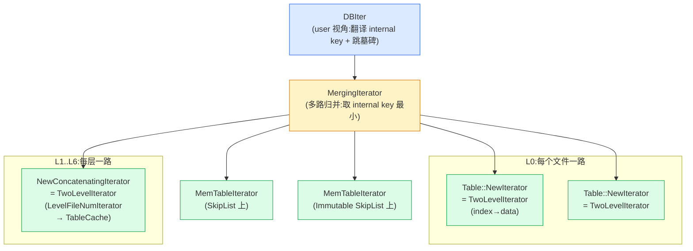

# 第十一章 · Iterator 抽象与 DBIter

> 篇:P3 读取:多路归并的艺术
> 主线呼应:第 2 篇我们讲清了 SSTable 长什么样——一个 `.ldb` 文件,footer 是锚,index block 指向一堆 data block,每个 block 内部前缀压缩,filter block 用布隆挡掉无效查询。但**读一条 key 到底怎么把 MemTable + Immutable + 多层 SSTable 里散落的版本拼成一条正确结果**?这是第 3 篇的事。本章是第 3 篇的第一章,先立地基:LevelDB 把**所有数据源**统一成同一个 `Iterator` 接口,再像套洋葱一样把它们一层层组合起来,最外层套一个 `DBIter` 把 internal key 翻译回 user 眼里的 key、顺手跳过墓碑。这一章讲清"为什么需要这么一套抽象",下一章讲 MergingIterator 的归并算法。

## 核心问题

**为什么 MemTable、Immutable、每个 SSTable(以及它的 index/data 两级)、每一层(一个 LevelFileNumIterator 串多个文件)都实现**同一个 `Iterator` 接口**(`Seek`/`SeekToFirst`/`Next`/`key`/`value`/`Valid`/`status`)?——因为只有这样,才能把任意多个有序数据源**像套洋葱一样组合**成一个:用 `MergingIterator` 把多路归并成一个,用 `TwoLevelIterator` 把"index 指向 data"两层串成一个,用 `DBIter` 在最外层把 internal key 翻译回 user 眼里的 key 并跳过墓碑。一次完整读就是这几层 Iterator 叠出来的。**

读完本章你会明白:

1. 为什么 LevelDB 要把所有数据源抽象成**同一个 `Iterator` 接口**(组合的必要前提);接口里的 `key()` / `value()` 为什么返回 `Slice` 而不是 `std::string`(零拷贝);`RegisterCleanup` 是干嘛的(底层资源引用计数,析构时回调释放)。
2. **洋葱式套娃**长什么样:最外层 `DBIter` → `MergingIterator` → `[MemTableIterator, TwoLevelIterator(SSTable)...]` → 一个 SSTable 的 `TwoLevelIterator` 又是 `index iter` + `data iter`。整条读路径就是这几层组合出来的。
3. `DBIter` 怎么把 internal key `(user_key, seq, type)` 翻译回 user 眼里的 `user_key`:遇到 `kTypeDeletion` 就**对 user 而言当作不存在,跳过这个 user_key 的所有后续版本**;`sequence_` 是快照上界,只暴露 seq <= `sequence_` 的版本。
4. **IteratorWrapper** 这个隐藏技巧:它缓存了 `Valid()` 和 `key()`,让归并循环里频繁的比较不再走虚函数——这是 LevelDB 在热路径上的 micro-optimization。
5. 这是教科书级的**装饰器/组合模式**落地,反面对比"每个数据源写专用读代码"为什么是死胡同。

> **如果一读觉得太难**:先只记住三件事——① 所有数据源(MemTable/SSTable/每层)都实现同一个 `Iterator` 接口;② 任意读路径就是几层 Iterator 套出来的:外层 `DBIter` 翻译+跳墓碑,中间 `MergingIterator` 多路归并,内层 `TwoLevelIterator` 把一个 SSTable 的 index/data 两级串起来;③ `DBIter` 跳墓碑的本质是遇到 `kTypeDeletion` 就把这个 user_key 的所有后续版本一起跳过。剩下的细节是"接口为什么这么设计、套娃怎么连接"。

---

## 11.1 一句话点破

> **LevelDB 把所有数据源都做成 `Iterator`(`Seek`/`Next`/`key`/`value`/`Valid`),于是"读一条 key"就退化成"在一个或多个有序流上做归并"——任意复杂的读路径(跨 MemTable、Immutable、L0..L6 的多个 SSTable)都只是几层 Iterator 像洋葱一样套出来的。最外层的 `DBIter` 负责 internal→user 的翻译和墓碑跳过,让 user 看到的就是一个干净的 `user_key → value` 流。**

这是结论,不是理由。本章倒过来拆:先看"不抽象成 Iterator 会怎样"的死胡同,再看接口为什么这么设计(`Slice` 零拷贝、`RegisterCleanup` 资源管理),最后看 `DBIter` 怎么在最外层把 internal key 翻译回 user 视角、跳过被删的版本。

---

## 11.2 不抽象成 Iterator 会怎样

### 提出问题

一次 `Get(k)` 要同时翻这几个地方:

1. **当前 MemTable**(内存,跳表,SkipList 上的 `Table::Iterator`)。
2. **Immutable MemTable**(如果有,也是 SkipList)。
3. **L0 的若干 SSTable**(每个都是个独立文件,key range 可能互相重叠,所以每个都得查)。
4. **L1..L6 每层的若干 SSTable**(同层文件 key range 不重叠,理论上可以按层串成一个流)。

每个数据源的"读"长得很不一样:

- MemTable 是内存里的 SkipList,`Seek`/`Next` 都是内存指针跳;
- SSTable 是磁盘上的文件,`Seek` 要先读 index block(可能已在 table cache 里)、二分定位、再读对应的 data block(可能已在 block cache 里)、布隆过滤、解压;
- 一层(Ln, n>0)的多个文件 key range 不重叠,可以"按 key range 顺序串成一条流"。

如果每个数据源都暴露**自己专用**的读 API,会怎样?

### 不这样会怎样

> **反面对比 1(每个数据源专用 API)**:假设 MemTable 暴露 `MemTable::Scan(user_key, callback)`,SSTable 暴露 `Table::Find(user_key)`,每层暴露 `Level::ForEach(callback)`——每个接口签名不同、遍历方式不同(有的是回调,有的是返回值,有的支持 Seek 有的不支持)。那 `Get` 就得为每种数据源写一段独立代码:先调 `MemTable::Scan`,没找到再调 `Table::Find`(对 L0 每个文件都调一次),还没找到再调 `Level::ForEach`(对每层调用)。而且**没办法把"多路同时归并取最新"这件事抽象出来**——你必须为每对数据源写一段"两个有序流谁先谁后"的胶水代码,N 个数据源就是 O(N²) 的胶水。更糟糕的是,这套胶水**没法被复用到 Compaction**(Compaction 也要多路归并,只是输入来源不同),得再写一套。

> **反面对比 2(把所有层所有 KV 全读出来再统一排序)**:每次 `Get` 把 MemTable + Immutable + 所有 SSTable 的所有 KV 全读进内存,然后用 user_comparator 排序,取第一个匹配——**O(全部数据量) 的内存 + O(N log N) 的排序**,直接是灾难。一个 100GB 的库读一个 key 要把 100GB 全加载?不可行。

**核心痛点**:这些数据源**本质上都是"一个有序的 KV 流"**——它们都支持"定位到某个 key(Seek)、往后走(Next)、看当前 key/value"。只要把这四个动作抽象出来,任何一个数据源就退化成一个"有序流"对象,可以**统一地**参与归并、统一地被套上装饰器。这就是 `Iterator` 接口存在的理由。

### 所以这样设计

LevelDB 在 `include/leveldb/iterator.h` 里定义了一个**纯虚基类 `Iterator`**——所有数据源的读都实现它。整个接口只有 7 个核心方法 + 1 个资源管理方法:

```cpp
// include/leveldb/iterator.h:24-82(Iterator 抽象基类)
class LEVELDB_EXPORT Iterator {
 public:
  Iterator();
  virtual ~Iterator();

  virtual bool Valid() const = 0;              // 当前是否指向一条有效 entry
  virtual void SeekToFirst() = 0;              // 定位到第一条
  virtual void SeekToLast() = 0;               // 定位到最后一条
  virtual void Seek(const Slice& target) = 0;  // 定位到 >= target 的第一条
  virtual void Next() = 0;                     // 后移一条(REQUIRES: Valid())
  virtual void Prev() = 0;                     // 前移一条(REQUIRES: Valid())

  virtual Slice key() const = 0;               // 当前 entry 的 key(零拷贝)
  virtual Slice value() const = 0;             // 当前 entry 的 value(零拷贝)
  virtual Status status() const = 0;           // 出错时返回错误,否则 OK

  using CleanupFunction = void (*)(void* arg1, void* arg2);
  void RegisterCleanup(CleanupFunction function, void* arg1, void* arg2);
  // ...
};
```

**七个核心方法定义了"有序流"的全部行为**,任何实现这七个方法的东西——MemTable、SSTable、某一层、一段 block、多个 Iterator 的归并、两层 Iterator 的串联——在外部看来都是一个 `Iterator*`。于是:

- 想把"多个有序流"归并成一个?`NewMergingIterator(comparator, children[], n)` —— 下一章详讲。
- 想把"index 指向 data"两层串成一个?`NewTwoLevelIterator(index_iter, block_function, arg)` —— P2-10 已讲。
- 想在最外层翻译 internal key + 跳墓碑?`NewDBIterator(db, user_comparator, internal_iter, sequence)` —— 本章后半详讲。
- 想包一个空 Iterator 或一个出错 Iterator?`NewEmptyIterator()` / `NewErrorIterator(status)`(`table/iterator.cc:70-74`)。

**所有这些"组合器"都返回 `Iterator*`**,所以可以无限制地套下去——MergingIterator 的某个子迭代器,完全可以是另一个 TwoLevelIterator;DBIter 包住的 internal_iter,可以是任意复杂的组合。这就是组合模式的力量。

> **钉死这件事**:`Iterator` 接口是 LevelDB 读路径的**地基**。它让所有数据源变成"同一个东西",于是组合、归并、装饰都成为可能。没有这个抽象,LevelDB 的读路径会变成 N 种专用代码的纠缠,无法维护、无法复用。这一条抽象,**就是 LevelDB 读路径能这么干净的全部原因**。

---

## 11.3 接口为什么这么设计:`Slice` 零拷贝 + `RegisterCleanup` 资源管理

光看接口签名还看不清两个关键设计:`key()` / `value()` 为什么返回 `Slice`?`RegisterCleanup` 是干什么的?这两个设计决定了 Iterator 的性能和正确性。

### `key()` / `value()` 返回 `Slice`:零拷贝

`Slice` 是 P1-02 立起的 API 基石——一对 `{const char* data, size_t size}`,**不拥有内存**,只指向某块内存的一段。Iterator 的 `key()` / `value()` 返回 `Slice`,意味着**不拷贝任何字节**。

看 [`db/memtable.cc:46-100`](../leveldb/db/memtable.cc#L46-L100) 的 `MemTableIterator`(片段):

```cpp
// db/memtable.cc:46(class MemTableIterator : public Iterator)
Slice key() const override {
  assert(Valid());
  return iter_.key();   // ← 返回的是 SkipList 里那块内存的指针,不拷贝
}
```

`iter_.key()` 是 SkipList 内部的 `const char*` 指针,直接包成 Slice 返回。一次 `Get` 涉及的 Seek + 几次 Next,如果每次都拷贝 key(可能上百字节),开销不小;返回 Slice 就只是返回两个机器字。

> **钉死这件事(生命周期陷阱)**:`key()` / `value()` 返回的 Slice **只在 Iterator 下次修改(Next/Prev/Seek)之前有效**。源码注释 [`iterator.h:60-63`](../leveldb/include/leveldb/iterator.h#L60-L63) 原话:"The underlying storage for the returned slice is valid only until the next modification of the iterator"。所以**不能这样写**:`Slice k = iter->key(); iter->Next(); use(k);`——Next 之后 k 指向的内存可能已被覆盖(MemTable 不会,但 SSTable 的 block iterator 会原地解压覆盖)。要在 Next 之前把 key 拷到自己的 std::string 里。DBIter 就是这么做的,见 11.5 节。

### `RegisterCleanup`:Iterator 析构时回调

Iterator 内部可能持有底层资源——比如 SSTable 的 block iterator 持有一个 block cache handle(引用计数,析构要 release)、Table::BlockReader 创建的 block 内存(析构要 delete)、整个读 Iterator 持有对 MemTable 和 Version 的引用计数(析构要 Unref)。这些资源的释放时机和 Iterator 析构绑定。

LevelDB 没有让每个 Iterator 子类各自写析构函数去释放这些(那样每个组合器 MergingIterator/TwoLevelIterator/DBIter 都得知道"我包的这个子迭代器持有什么资源",耦合爆炸),而是提供了一个**通用的 cleanup 钩子**:`RegisterCleanup(function, arg1, arg2)`——Iterator 析构时,会按注册顺序调用所有 cleanup function。

看 [`table/iterator.cc:14-39`](../leveldb/table/iterator.cc#L14-L39) 的实现:

```cpp
// table/iterator.cc:14(Iterator::~Iterator)
Iterator::~Iterator() {
  if (!cleanup_head_.IsEmpty()) {
    cleanup_head_.Run();
    for (CleanupNode* node = cleanup_head_.next; node != nullptr;) {
      node->Run();
      CleanupNode* next_node = node->next;
      delete node;
      node = next_node;
    }
  }
}

// table/iterator.cc:26(RegisterCleanup)
void Iterator::RegisterCleanup(CleanupFunction func, void* arg1, void* arg2) {
  assert(func != nullptr);
  CleanupNode* node;
  if (cleanup_head_.IsEmpty()) {
    node = &cleanup_head_;       // ← 第一次注册:复用 inline 的 head 节点,零堆分配
  } else {
    node = new CleanupNode();    // ← 后续注册:new 一个节点,头插法挂到链表
    node->next = cleanup_head_.next;
    cleanup_head_.next = node;
  }
  node->function = func;
  node->arg1 = arg1;
  node->arg2 = arg2;
}
```

两个细节值得钉死:

1. **第一次注册零堆分配**:`cleanup_head_` 是 Iterator 内联的(`iterator.h:101`),第一次 RegisterCleanup 直接复用它,只有第二次以上才 new。大多数 Iterator 只注册一次 cleanup,这个优化避免了 99% 场景下的堆分配。
2. **单链表头插**:cleanup 节点用单链表组织,析构时按注册顺序逆序调用(`head.Run()` 先,然后 `head.next` 链表上每个 `Run + delete`)。顺序为什么是注册顺序逆序?因为头插法意味着后注册的在前——析构时是从 head 开始,head 是**最后注册的**(头插),所以**后注册的先释放**。这跟 RAII 的"析构逆序"语义一致。

举个真实用例:一个 SSTable 的 data block iterator,创建时会注册一个 cleanup 来释放 block cache handle。看 [`table/table.cc:195-201`](../leveldb/table/table.cc#L195-L201):

```cpp
// table/table.cc:196-201(Table::BlockReader 函数里)
iter = block->NewIterator(table->rep_->options.comparator);
if (cache_handle == nullptr) {
  iter->RegisterCleanup(&DeleteBlock, block, nullptr);       // ← 不走 cache:析构时 delete block
} else {
  iter->RegisterCleanup(&ReleaseBlock, block_cache, cache_handle);  // ← 走 cache:析构时 release handle
}
```

`ReleaseBlock` 会调 `block_cache->Release(cache_handle)`,把引用计数减一——这是 block cache 能被回收的根。**Iterator 析构 = 它持有的所有底层资源被正确释放**,这一切都靠 RegisterCleanup 这个通用钩子串起来,无需 TwoLevelIterator/MergingIterator/DBIter 知道细节。

### 整套 Iterator 组合:洋葱式套娃

把上面两个设计落进一次真实的读,看 LevelDB 怎么把所有数据源套成一个 Iterator。工厂函数 `DBImpl::NewIterator`([`db/db_impl.cc:1168-1178`](../leveldb/db/db_impl.cc#L1168-L1178))是入口:

```cpp
// db/db_impl.cc:1168(NewIterator:用户可见的 Iterator 入口)
Iterator* DBImpl::NewIterator(const ReadOptions& options) {
  SequenceNumber latest_snapshot;
  uint32_t seed;
  Iterator* iter = NewInternalIterator(options, &latest_snapshot, &seed);
  return NewDBIterator(this, user_comparator(), iter,
                       (options.snapshot != nullptr
                            ? static_cast<const SnapshotImpl*>(options.snapshot)
                                  ->sequence_number()
                            : latest_snapshot),
                       seed);
}
```

两步:**先组装 internal-key 视角的 Iterator**(`NewInternalIterator`),**再在外面套一层 DBIter**(`NewDBIterator`)翻译成 user 视角。先看 `NewInternalIterator`([`db/db_impl.cc:1083-1108`](../leveldb/db/db_impl.cc#L1083-L1108)):

```cpp
// db/db_impl.cc:1083(NewInternalIterator:把所有数据源组合成一个 internal iter)
Iterator* DBImpl::NewInternalIterator(const ReadOptions& options,
                                      SequenceNumber* latest_snapshot,
                                      uint32_t* seed) {
  mutex_.Lock();
  *latest_snapshot = versions_->LastSequence();

  std::vector<Iterator*> list;
  list.push_back(mem_->NewIterator());          // ① MemTable(SkipList 的 Iterator)
  mem_->Ref();
  if (imm_ != nullptr) {
    list.push_back(imm_->NewIterator());        // ② Immutable(同样是 SkipList)
    imm_->Ref();
  }
  versions_->current()->AddIterators(options, &list);  // ③ 各层 SSTable
  Iterator* internal_iter =
      NewMergingIterator(&internal_comparator_, &list[0], list.size());
  versions_->current()->Ref();

  IterState* cleanup = new IterState(&mutex_, mem_, imm_, versions_->current());
  internal_iter->RegisterCleanup(CleanupIteratorState, cleanup, nullptr);
  // ↑ 整条 Iterator 链析构时,Unref mem_/imm_/current_,让它们能被回收
  *seed = ++seed_;
  mutex_.Unlock();
  return internal_iter;
}
```

`AddIterators`([`db/version_set.cc:229-244`](../leveldb/db/version_set.cc#L229-L244))把各层 SSTable 加进 list:

```cpp
// db/version_set.cc:229(Version::AddIterators)
void Version::AddIterators(const ReadOptions& options,
                           std::vector<Iterator*>* iters) {
  // L0:文件间 key range 可能重叠,每个文件单独作为一路
  for (size_t i = 0; i < files_[0].size(); i++) {
    iters->push_back(vset_->table_cache_->NewIterator(
        options, files_[0][i]->number, files_[0][i]->file_size));
  }
  // L1..L6:同层文件 key range 不重叠,用 LevelFileNumIterator 串成一路,
  // 再用 TwoLevelIterator 懒加载具体文件
  for (int level = 1; level < config::kNumLevels; level++) {
    if (!files_[level].empty()) {
      iters->push_back(NewConcatenatingIterator(options, level));
    }
  }
}
```

注意 L0 和 L1+ 的关键差异:**L0 每个文件都是一路**(因为 L0 文件之间 key range 可能重叠,得参与多路归并);**L1+ 每层只有一路**(同层文件不重叠,串成一条流),这一路本身又是 `NewTwoLevelIterator(LevelFileNumIterator, GetFileIterator)` —— index 是"本层文件列表",data 是"具体某个文件 Table::NewIterator"。



这张图就是**一次完整读的 Iterator 套娃**。最外层 DBIter 翻译 internal→user,中间 MergingIterator 把 k 路归并成一路,内层每个子迭代器要么是 MemTableIterator(内存跳表),要么是 SSTable 的 TwoLevelIterator(index 指向 data),要么是某一层的 TwoLevelIterator(本层文件列表指向具体文件)。**所有这些层都实现同一个 `Iterator` 接口**,这就是为什么能套下去。

> **钉死这件事**:读路径的复杂度,全部被 `Iterator` 抽象封进了套娃。最外层 user 看到的 `NewIterator` 返回的就是一个 `Iterator*`,Seek/Next 一路走,DBIter 自己负责翻译和跳墓碑,user 永远只看到 `user_key → value` 的有序流。底下的所有复杂度——哪些数据源、怎么归并、怎么懒加载、怎么释放资源——user 一概不需要关心。

---

## 11.4 DBIter:把 internal key 翻译回 user 视角,顺手跳墓碑

最外层的 DBIter 是这一章的主角。它包住一个"internal-key 视角的 Iterator"(底下是 MergingIterator 套一堆),对外的语义却是"user-key 视角的 Iterator"。**这层翻译和过滤的全部逻辑,在 `db/db_iter.cc` 里**。

### 提出问题

底下那个 MergingIterator 输出的是一条**internal key**流——每条 entry 的 key 是 `(user_key, seq, type)` 打包的字节串。如果直接把它返给 user,user 会看到什么?

1. **同一个 user_key 多条 entry**:因为 LSM 不原地更新,user_key="hello" 可能有 seq=3/value、seq=2/value、seq=1/deletion 三条,底下 Iterator 会依次吐出这三条。但 user 只想看到最新的那条(或者根本不看到——如果最新版本是墓碑)。
2. **墓碑暴露**:底下 Iterator 会吐出 `kTypeDeletion` 的 entry。对 user 来说,这个 key "不存在",不该出现在迭代结果里。
3. **快照外版本暴露**:底下 Iterator 还会吐出 seq > snapshot 的版本(其他事务还没提交的)。这些版本对当前读不可见。

### 不这样会怎样

> **反面对比(直接把 internal Iterator 返给 user)**:user 调 `db->NewIterator()` 拿到的是 raw internal iter。`iter->key()` 返回 `(user_key, seq, type)` 打包的 13 字节字节串,user 拿到不知所云;`iter->Next()` 走过同一个 user_key 的好几个版本,user 看到一堆重复;遇到墓碑没跳,user 拿到一条"被删了"的记录。整个 API 不可用。

### 所以这样设计

DBIter 在 internal Iterator 之上包一层,对外做两件事:

1. **翻译**:`key()` 返回 `ExtractUserKey(internal_key)`(去掉 8 字节 seq|type 尾);`value()` 返回底下那条 entry 的 value(已是 user value)。
2. **过滤**:遇到墓碑就跳过,遇到 seq > snapshot 的版本也跳过,同一个 user_key 只吐出**第一个有效版本**。

看 DBIter 的核心字段和构造([`db/db_iter.cc:39-120`](../leveldb/db/db_iter.cc#L39-L120)):

```cpp
// db/db_iter.cc:39(class DBIter : public Iterator)
class DBIter : public Iterator {
 public:
  enum Direction { kForward, kReverse };

  DBIter(DBImpl* db, const Comparator* cmp, Iterator* iter, SequenceNumber s,
         uint32_t seed)
      : db_(db),
        user_comparator_(cmp),
        iter_(iter),                  // ← 底下那个 internal Iterator(MergingIterator 套一堆)
        sequence_(s),                 // ← 快照上界:只暴露 seq <= s 的版本
        direction_(kForward),
        valid_(false),
        rnd_(seed),
        bytes_until_read_sampling_(RandomCompactionPeriod()) {}
  // ...
 private:
  DBImpl* db_;
  const Comparator* const user_comparator_;
  Iterator* const iter_;              // 内部 iter
  SequenceNumber const sequence_;     // 快照上界
  Status status_;
  std::string saved_key_;             // 反向遍历时缓存当前 key
  std::string saved_value_;           // 反向遍历时缓存当前 value
  Direction direction_;
  bool valid_;
  Random rnd_;
  size_t bytes_until_read_sampling_;  // 读字节采样,够数了触发 compaction(P3-13 详讲)
};
```

DBIter 的所有"翻译 + 跳墓碑"魔法,集中在 `FindNextUserEntry`([`db/db_iter.cc:177-207`](../leveldb/db/db_iter.cc#L177-L207))。我们先看 `Seek` 怎么调它([`db/db_iter.cc:278-290`](../leveldb/db/db_iter.cc#L278-L290)):

```cpp
// db/db_iter.cc:278(Seek)
void DBIter::Seek(const Slice& target) {
  direction_ = kForward;
  ClearSavedValue();
  saved_key_.clear();
  // 把 user_key target 编码成一个"完整的 internal seek key":
  //   target ‖ (snapshot_seq << 8 | kValueTypeForSeek)
  // 这样底下 internal iter Seek 之后,落点是"同 user_key 中 seq<=snapshot 的最新版本"
  AppendInternalKey(&saved_key_,
                    ParsedInternalKey(target, sequence_, kValueTypeForSeek));
  iter_->Seek(saved_key_);
  if (iter_->Valid()) {
    FindNextUserEntry(false, &saved_key_ /* temporary storage */);
  } else {
    valid_ = false;
  }
}
```

**关键点**:`sequence_` 是 DBIter 持有的快照上界,Seek 时用它构造 `LookupKey`——这跟 P1-03 讲的 `LookupKey` 思路完全一致(用 `kValueTypeForSeek = kTypeValue` 当 type,保证落点在所有真实版本之前)。**任何 seq > `sequence_` 的版本,因为降序比较,排在 lookup key 之前,Seek 落不到**——所以底下 Iterator 自然就跳过了"快照外"的版本。这是 DBIter 不需要显式过滤快照外版本的原因。

然后看真正跳墓碑的 `FindNextUserEntry`([`db/db_iter.cc:177-207`](../leveldb/db/db_iter.cc#L177-L207)):

```cpp
// db/db_iter.cc:177(FindNextUserEntry:跳过所有不可见 entry,找到第一个对 user 可见的)
void DBIter::FindNextUserEntry(bool skipping, std::string* skip) {
  assert(iter_->Valid());
  assert(direction_ == kForward);
  do {
    ParsedInternalKey ikey;
    if (ParseKey(&ikey) && ikey.sequence <= sequence_) {  // ← 快照内 + 解析成功
      switch (ikey.type) {
        case kTypeDeletion:
          // 遇到墓碑:把这个 user_key 的所有后续版本都跳过
          SaveKey(ikey.user_key, skip);
          skipping = true;
          break;
        case kTypeValue:
          if (skipping &&
              user_comparator_->Compare(ikey.user_key, *skip) <= 0) {
            // 这个 user_key <= skip(即被某个墓碑覆盖),隐藏
          } else {
            valid_ = true;
            saved_key_.clear();
            return;                  // ← 找到第一个有效 user entry,返回
          }
          break;
      }
    }
    iter_->Next();                   // ← 继续往后扫
  } while (iter_->Valid());
  saved_key_.clear();
  valid_ = false;                    // 扫到头了,没有有效 entry
}
```

这段代码的逻辑值得逐字吃透:

1. **`ParseKey` 解析 internal key**:`ParseInternalKey` 把字节串拆成 `(user_key, sequence, type)`(P1-03 已讲)。如果解析失败(文件损坏),`status_` 置 Corruption,跳过这条。
2. **`ikey.sequence <= sequence_` 过滤**:虽然 Seek 已经过滤了 seq > snapshot 的版本,但 Next 走的过程中不会重新 Seek,所以每条 entry 都要再判一遍——快照外版本一律跳过。
3. **遇到 `kTypeDeletion`(墓碑)**:**这是关键**。一旦遇到一个墓碑,它代表的 user_key 在这个快照下"不存在"。但底下 Iterator 还会继续吐出同一个 user_key 的更旧版本(seq 更小)——这些旧版本**全部不可见**(被墓碑盖住)。所以 `skipping = true` 且把墓碑的 user_key 记进 `skip`,接下来凡是 user_key == skip 的 entry,统统跳过。
4. **遇到 `kTypeValue`**:
   - 如果 `skipping` 且 `user_key <= skip`,说明这个版本的 user_key 被某个墓碑盖住了,**隐藏**(continue 不返回)。
   - 否则,这是个有效 entry,`valid_ = true` 然后 return。
5. `iter_->Next()` 继续往后扫,直到找到第一个有效 entry 或扫到头。

> **钉死这件事**:DBIter 跳墓碑不是"遇到墓碑就 return NotFound",而是**"遇到墓碑就把这个 user_key 的所有后续版本(更旧的)全部跳过"**。因为 internal key 是降序排,墓碑下面跟的就是同一个 user_key 的更旧版本,这些版本被墓碑盖住,对 user 不可见。`skip` 这个 string 就是"当前被墓碑盖住的 user_key",`skipping` 是开关。这一段逻辑是 LSM 多版本对 user 透明的核心。

### 反向遍历(Prev)的小心机

`Prev` 比 `Next` 复杂,因为反向扫时,同一个 user_key 的多个版本要从最新往最旧走,而 internal Iterator 反向遍历时是按 internal key 升序排(从旧到新)。所以反向时**要把当前 user_key 的所有版本都过一遍,记录下"最新有效的那条"**,见 `FindPrevUserEntry`([`db/db_iter.cc:236-276`](../leveldb/db/db_iter.cc#L236-L276))。我们不逐行展开,核心是:**反向遍历一个 user_key 时,要把它的所有版本扫一遍,记下最新的可见 entry**(可能是 value,也可能是 deletion —— 如果最新版本是 deletion,这个 user_key 不可见)。这就解释了 DBIter 字段里的 `saved_key_` / `saved_value_`——反向遍历时用来暂存当前 user_key 的最新可见 entry。

`saved_value_` 还有一个小优化([`db/db_iter.cc:95-102`](../leveldb/db/db_iter.cc#L95-L102)):`ClearSavedValue` 时,如果 capacity 超过 1MB,用 `swap` 而不是 `clear` 释放内存(`clear` 不释放内存,只是把 size 置 0)。这避免了一个超大 value 之后,saved_value_ 一直占着大块内存。

---

## 11.5 技巧精解:统一接口 + 装饰器叠加(组合模式)

本章技巧精解挑两个:① **统一的 Iterator 接口 + 装饰器叠加**(这一章的主线技巧);② **IteratorWrapper 缓存热路径**(一个隐藏的 micro-optimization)。

### 技巧精解 1:统一的 Iterator 接口 + 装饰器叠加

**这个技巧在做什么**:让任意复杂的读路径(MemTable + Immutable + L0..L6 各种来源)都退化成"在一个有序流上 Seek/Next"——通过让所有数据源实现同一个 `Iterator` 接口,然后用 MergingIterator/TwoLevelIterator/DBIter 这些"组合器"层层叠加,任意套娃。

**用了什么手段**:

1. **抽象基类 `Iterator`** 定义 7 个核心方法(`Valid`/`Seek`/`SeekToFirst`/`SeekToLast`/`Next`/`Prev`/`key`/`value`/`status`),所有数据源继承它。
2. **三个组合器**(都是 `Iterator` 子类,返回 `Iterator*`):
   - `NewMergingIterator(comparator, children[], n)`([`table/merger.cc:179`](../leveldb/table/merger.cc#L179))——把多个有序 Iterator 归并成一个。
   - `NewTwoLevelIterator(index_iter, block_function, arg)`([`table/two_level_iterator.cc:165`](../leveldb/table/two_level_iterator.cc#L165))——把"index iter 指向 data iter"两层串成一个。
   - `NewDBIterator(db, user_cmp, internal_iter, sequence)`([`db/db_iter.cc:312`](../leveldb/db/db_iter.cc#L312))——在 internal iter 之上套一层翻译+跳墓碑。
3. **组合器之间互相无感**:MergingIterator 不知道它的某个子迭代器是 TwoLevelIterator 还是 DBIter 还是 MemTableIterator,它只调 `Iterator::key()` 比大小、调 `Iterator::Next()` 前进。

**为什么 sound**:

1. **接口最小化**:7 个方法覆盖了"有序流"的全部行为,不多不少。每个组合器只需这 7 个方法就能工作,不需要知道子迭代器内部细节。
2. **资源管理统一**:`RegisterCleanup` 让任意子迭代器持有的底层资源(block cache handle、MemTable 引用、Version 引用)在 Iterator 析构时被正确释放,组合器不需要知道细节。
3. **零拷贝贯穿**:`key()` / `value()` 全程返回 Slice,组合器和子迭代器之间传递的只是两个机器字,不拷贝数据。
4. **可任意套娃**:MergingIterator 的某个子,可以是另一个 TwoLevelIterator;DBIter 包住的 internal_iter,可以是任意复杂的组合——没有套娃深度限制。
5. **同一段代码可复用**:Compaction 也用 `NewMergingIterator`(下一章讲),只是输入不同(几个 SSTable 而不是 memtable+imm+SSTable)。读和写共享同一套归并基础设施。

**反面对比 1(每个数据源专用 API)**:见 11.2 节。N 个数据源要写 O(N²) 胶水,MemTable 一种读法、SSTable 另一种读法,无法组合、无法复用、无法维护。

**反面对比 2(用回调而非 Iterator)**:假设 LevelDB 让数据源暴露 `ForEach(callback)` 而不是 `Iterator`,读的时候注册一个 callback。问题:回调里你想"提前剪枝"(比如遇到墓碑就跳出)就麻烦——callback 没法控制迭代流程(中断、跳过、反向),而 Iterator 的 `Next()`/`Prev()`/`Seek` 是**外层主动控制**的,组合器可以按需推进。所以 Iterator 模型比回调模型在组合上更灵活。

**反面对比 3(用模板而非虚函数)**:为什么 Iterator 用虚函数而不是模板(`template<typename Iter> class MergingIterator`)?因为 LevelDB 的 MergingIterator 的子迭代器**类型在运行时才知道**(memtable iterator、各种 table iterator、level iterator),模板要做这种"动态组合"就得用 variant/类型擦除,反而更复杂。虚函数的代价(一次间接调用)在这里可以接受——因为读路径不是纳秒级热路径,且 IteratorWrapper 已经把最热的 key()/Valid() 调用做了缓存优化(见技巧精解 2)。

> **钉死这件事**:统一的 Iterator 接口 + 装饰器叠加,是 LevelDB 读路径(也是 Compaction 路径)能这么干净的**全部原因**。它把"任意复杂的数据源组合"退化成"在一个有序流上 Seek/Next",让 DBIter/MergingIterator/TwoLevelIterator 各司其职、互不耦合。这是教科书级的**策略 + 装饰器 + 组合**三种模式的落地,GoF 设计模式书里那些抽象的模式名,在 LevelDB 这里是字面的、可读的、必需的。

### 技巧精解 2:IteratorWrapper 缓存热路径

**这个技巧在做什么**:让 MergingIterator 在归并循环里频繁的 `key()` 比较和 `Valid()` 判断,不走虚函数,而是命中缓存。

**为什么需要**:MergingIterator 的 `FindSmallest` 每次都遍历所有子迭代器,每个子调 `Valid()` + `key()` 各一次(下一章详讲)。如果有 10 路子迭代器,每路 Next 一次就要调 10 次 `Valid()` + 10 次 `key()`——全是虚函数。虚函数本身不慢(一次间接跳转),但**cache 不友好**:虚函数表和实际数据可能不在一个 cache line。

**用了什么手段**:看 [`table/iterator_wrapper.h:17-88`](../leveldb/table/iterator_wrapper.h#L17-L88):

```cpp
// table/iterator_wrapper.h:17(class IteratorWrapper)
class IteratorWrapper {
 public:
  void Set(Iterator* iter) { /* ... */ Update(); }

  bool Valid() const { return valid_; }   // ← 直接返回缓存值,不走虚函数
  Slice key() const {
    assert(Valid());
    return key_;                          // ← 返回缓存 Slice,不走虚函数
  }
  Slice value() const { return iter_->value(); }  // value() 仍走虚函数(用得少)

  void Next() {
    iter_->Next();                        // 走虚函数推进
    Update();                             // 然后把新的 Valid()/key() 缓存进来
  }
  // Seek/SeekToFirst/SeekToLast/Prev 同理

 private:
  void Update() {
    valid_ = iter_->Valid();
    if (valid_) {
      key_ = iter_->key();                // ← 缓存 key
    }
  }

  Iterator* iter_;
  bool valid_;
  Slice key_;                             // ← 缓存的 key(一个 Slice,两个机器字)
};
```

`IteratorWrapper` 包住一个 `Iterator*`,在每次 `Next`/`Seek`/... 之后立刻调一次底层 Iterator 的 `Valid()` 和 `key()`,把结果**缓存**进自己的 `valid_` 和 `key_` 字段。之后所有 `Valid()` / `key()` 调用,直接返回缓存值,不走虚函数。

**为什么 sound**:

1. **缓存的 `key_` 是 Slice**:它指向底层 Iterator 的内部内存(block buffer 或 SkipList 节点),只要 Iterator 位置不变,这块内存就不会变。所以缓存值始终有效——直到下一次 `Next`/`Seek`,这时 `Update()` 会刷新缓存。
2. **`key_` 跟 `iter_` 在同一个对象里**:`IteratorWrapper` 三个字段(`iter_`、`valid_`、`key_`)紧凑布局,MergingIterator 的 `FindSmallest` 循环遍历 `children_` 数组,每个 `IteratorWrapper` 在内存里紧密排列,cache 友好。
3. **`value()` 没缓存**:因为归并比较只用 key,不用 value。value 是最后一步才读的(决定胜者之后)。所以缓存 value 没意义,反而浪费内存。

**反面对比(不缓存,每次都走虚函数)**:MergingIterator 的 `FindSmallest` 每次循环 10 个子,每个判 Valid + 读 key,共 20 次虚函数。20 次虚函数 + 可能的 cache miss,在每次 Next 上累积起来——一次范围扫描可能 Next 上百万次,这就是数十毫秒的额外开销。IteratorWrapper 把这个开销抹掉,缓存命中率拉满。

源码注释原话([`iterator_wrapper.h:13-16`](../leveldb/table/iterator_wrapper.h#L13-L16)):

> "A internal wrapper class with an interface similar to Iterator that caches the valid() and key() results for an underlying iterator. This can help avoid virtual function calls and also gives better cache locality."

这是 LevelDB 在 hot path 上的一个 micro-optimization,不起眼,但实打实地让范围扫描更快。**它只在 MergingIterator 内部用**(MergingIterator 的 children_ 是 `IteratorWrapper*` 而不是 `Iterator*`),因为只有归并循环里才有这种"频繁比 key"的场景。

> **钉死这件事**:`IteratorWrapper` 是 LevelDB 把"虚函数开销"压到最低的一个隐藏技巧。它不是 Iterator 子类(没有继承 Iterator),但它有跟 Iterator 几乎一样的接口——只在 MergingIterator 内部用,缓存 Valid()/key()。这一个文件 80 行代码,是 LevelDB 性能意识的一个缩影:**通用接口(Iterator)给灵活性,专用 wrapper(IteratorWrapper)给性能**,两者并存,组合器(MergingIterator)用后者。

---

## 章末小结

这一章立起了 LevelDB 读路径的地基:

1. **统一的 `Iterator` 接口**:所有数据源(MemTable、SSTable、每一层)都实现 `Valid`/`Seek`/`SeekToFirst`/`SeekToLast`/`Next`/`Prev`/`key`/`value`/`status` 七个方法,返回 `Slice` 零拷贝,析构时通过 `RegisterCleanup` 释放底层资源。
2. **三个组合器**:`MergingIterator`(多路归并)、`TwoLevelIterator`(index 指向 data 两级串)、`DBIter`(翻译 internal key + 跳墓碑)——都返回 `Iterator*`,可以任意套娃。
3. **洋葱式套娃**:最外层 DBIter → MergingIterator → [MemTableIterator, TwoLevelIterator(SSTable)...] → 一个 SSTable 的 TwoLevelIterator(index + data)。整条读路径就是这几层组合出来的。
4. **DBIter 的两个职责**:把 internal key `(user_key, seq, type)` 翻译成 user_key(去 8 字节尾),过滤掉墓碑(遇到墓碑就把这个 user_key 的所有后续版本都跳过)和快照外版本(seq > snapshot)。
5. **IteratorWrapper**:MergingIterator 内部的隐藏优化,缓存子迭代器的 Valid()/key(),让归并循环不走虚函数。

回到主线:这一章服务的**前台**那面——让读拿到正确最新值。DBIter 把 LSM 多版本的"复杂性"全部吞下,对外只暴露一个干净的 `user_key → value` 流,user 完全感受不到底下有几路 Iterator 在归并、有几个墓碑被跳过、有几个旧版本被忽略。**前台读的"正确性"和"易用性",这一层全包了**。但底下那个把多路归并成一路的 MergingIterator,它到底怎么"取最小"、为什么"取最小 = 取最新有效版本"、为什么不用优先队列——这是下一章的事。

### 五个"为什么"清单

1. **为什么所有数据源都要实现同一个 `Iterator` 接口?** 不这样,每个数据源得暴露专用读 API,N 个数据源要写 O(N²) 胶水,无法组合、无法复用。统一接口让任意数据源退化成"一个有序流",组合器(Merging/TwoLevel/DBIter)可以任意叠加。
2. **为什么 `key()` / `value()` 返回 `Slice` 而不是 `std::string`?** 零拷贝。一次 Get 涉及 Seek + 几次 Next,如果每次都拷 key(可能上百字节),开销不小;Slice 只返回两个机器字(指针+长度),零开销。代价是生命周期——Slice 只在 Iterator 下次修改前有效,要持久化必须拷出去。
3. **`RegisterCleanup` 是干什么的?** Iterator 析构时回调的钩子,用来释放底层资源(block cache handle 的 Release、block 内存的 delete、MemTable/Version 的 Unref)。第一次注册复用 inline 的 head 节点,零堆分配。
4. **DBIter 怎么跳墓碑?** 不是"遇到墓碑就 return NotFound",而是**"遇到墓碑就把这个 user_key 的所有后续版本(更旧的)全部跳过"**——因为 internal key 是降序排,墓碑下面跟的就是同一个 user_key 的更旧版本,被墓碑盖住不可见。用 `skip` 字符串记录"当前被墓碑盖住的 user_key",`skipping` 开关控制是否进入跳过模式。
5. **IteratorWrapper 为什么不继承 Iterator?** 它是 MergingIterator 内部的专用优化,不是对外接口。继承 Iterator 会引入不必要的虚函数表(它自己就是要避开虚函数),所以它只提供一个**形状类似** Iterator 的接口(Valid/key/value/Next/...),MergingIterator 内部直接持有 `IteratorWrapper*`。这是性能优先于"纯洁性"的工程取舍。

### 想继续深入往哪钻

- `Iterator` 抽象基类的全部定义,见 [`include/leveldb/iterator.h:24-102`](../leveldb/include/leveldb/iterator.h#L24-L102)。注意它 `delete` 了拷贝构造和拷贝赋值(Iterator 是独占资源的对象,不可拷贝)。
- `RegisterCleanup` 的链表实现和析构逆序释放,见 [`table/iterator.cc:14-39`](../leveldb/table/iterator.cc#L14-L39)。第一次注册复用 head 节点的细节,见 `iterator.cc:29-30`。
- DBIter 反向遍历(Prev)的完整实现,见 [`db/db_iter.cc:209-276`](../leveldb/db/db_iter.cc#L209-L276)。反向比正向复杂,因为要"扫完一个 user_key 的所有版本,取最新可见"。
- `DBImpl::NewIterator` 怎么把 internal iter 和 DBIter 拼起来,见 [`db/db_impl.cc:1168-1178`](../leveldb/db/db_impl.cc#L1168-L1178)。`NewInternalIterator` 的组装,见 [`db/db_impl.cc:1083-1108`](../leveldb/db/db_impl.cc#L1083-L1108)。
- RocksDB 在这套基础上加了什么:`ForwardIterator`(避免反向遍历的复杂度)、`MergeIterator` 用堆而非线性(子迭代器多时)、`MinLevelBuffer`(减少 MergingIterator 的内存分配)——展示 LevelDB 这套抽象的扩展性。

### 引出下一章

我们把 Iterator 抽象、DBIter 翻译跳墓碑讲清了,但**底下那个把 k 路子迭代器归并成一路的 MergingIterator,它的"取最小"算法到底怎么工作**?为什么 internal key 排序后"取最小 = 取最新有效版本"?为什么 LevelDB 选了线性扫描而不是优先队列?反向遍历怎么处理?这就是下一章 P3-12 的事——拆开 `FindSmallest` 的胜者逻辑,钉死"取最小 = 取最新"这条贯穿 LSM 多版本的隐含假设。
