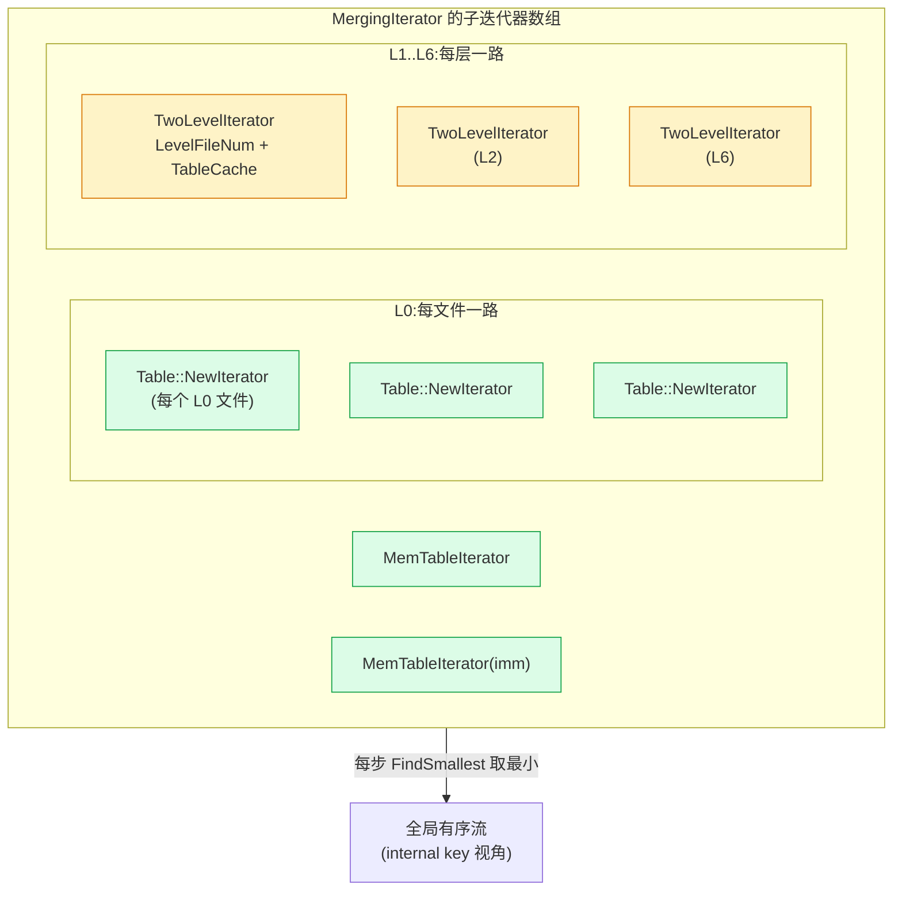

# 第十二章 · MergingIterator:多路归并

> 篇:P3 读取:多路归并的艺术
> 主线呼应:上一章我们立起了 Iterator 抽象——所有数据源都是 `Iterator`,外层 DBIter 翻译 internal key + 跳墓碑。但 DBIter 包住的那个"多数据源归并"的迭代器——也就是 `NewInternalIterator` 返回的那个——到底是什么?它就是本章的主角 **MergingIterator**。它把 MemTable、Immutable、L0 的若干 SSTable、L1..L6 每层的文件流,**k 路归并成一条全局有序流**。这一章我们拆开 `FindSmallest` 的胜者逻辑,钉死那条贯穿 LSM 多版本的隐含假设:**internal key 排序后,取最小者即取最新有效版本**。

## 核心问题

**一次 `Get(k)` 要同时翻 MemTable、Immutable、L0 的若干 SSTable、L1..L6 每层若干 SSTable——每个都是一条有序的 Iterator。MergingIterator 把这 k 条流归并成一条全局有序流:每步从所有当前 `Valid` 的子迭代器里取 internal key 最小的那个。由于 internal key 是"先按 user_key 升序、同 user_key 按 seq 降序"编码的(P1-03),这个"最小者"在同 user_key 中恰好是 seq 最大者(也就是最新有效版本)。所以归并流吐出的第一条同 user_key 的 entry,就是该 user_key 的最新版本——上层(DBIter 或 Get 短路)拿到它即可停手,无需读完所有层。**

读完本章你会明白:

1. **为什么 k 路归并取最小 = 取最新有效版本**:internal key 编码"先升后降",排序后同 user_key 中 seq 最大者排最前(也就是 internal key 最小),归并取最小天然就拿到最新版本。这是 LSM 多版本读能成立的隐含数学。
2. **`FindSmallest` 的胜者逻辑**:线性扫所有子迭代器,挑 internal key 最小者;为什么**不用优先队列**(子路数量小,线性扫更简单、更 cache 友好;源码注释明说)。
3. **反向切向的小心机**:Next 走过一段后,如果调 Prev,MergingIterator 要把所有非 current 子迭代器"重新 Seek 到 current key 之后"——反向切换的代价就在这里。
4. **L0 vs L1..L6 的归并差异**:L0 文件 key range 可能重叠,每个文件是独立的一路;L1+ 同层文件不重叠,先用 LevelFileNumIterator 串成一路,再参与整体归并。
5. **Get 怎么利用归并短路**:不是所有层都要读到底——拿到第一个有效 entry 即返回,后面的层完全不读。

> **如果一读觉得太难**:先只记住三件事——① MergingIterator 把 k 条有序流归并成 1 条,每步取所有子迭代器里 internal key 最小的那个;② 因为 internal key 编码"先升后降",取最小 = 取同 user_key 的最新版本,所以归并流吐出的第一条就是 user 想要的答案,上层拿到就停;③ LevelDB 用线性扫描挑最小(不用优先队列),因为子路数量小(通常 < 20),线性更简单更 cache 友好。剩下的细节是"反向怎么处理、L0 为什么每文件一路"。

---

## 12.1 一句话点破

> **MergingIterator 是 LevelDB 读路径的中枢神经。它把 MemTable + Immutable + L0 若干 SSTable + L1..L6 各层文件流,k 路归并成一条全局有序流——每步从所有子迭代器里挑 internal key 最小者。由于 internal key 编码"先升后降",这个最小者恰是同 user_key 的最新版本。所以归并吐出的第一条就是正确答案,上层拿到即返回,无需读完所有层。**

这是结论,不是理由。本章倒过来拆:先看"取最小 = 取最新"凭什么成立(回扣 P1-03 的 internal key 编码),再看 `FindSmallest` 的源码逻辑、为什么选线性扫不选优先队列,最后看 Next/Prev 的方向切换和 Get 怎么利用归并短路。

---

## 12.2 为什么"取最小 = 取最新有效版本"

这是本章要钉死的**第一条**命脉。如果这条不成立,MergingIterator 整套设计就垮了。

### 提出问题

MergingIterator 在所有 Valid 的子迭代器里挑"internal key 最小"的那个。为什么这个"最小"恰好是 user 想要的"最新有效版本"?

### 回扣 P1-03 的 internal key 编码

P1-03 立起的事:`internal key = user_key ‖ (seq << 8 | type)`,8 字节尾小端编码。`InternalKeyComparator::Compare` 做两段比较:

1. **先比 user_key**:用 user_comparator 升序比(`user_comparator_->Compare(a.user_key, b.user_key)`)。
2. **如果 user_key 相同,再比 8 字节 seq|type 尾**:**符号反转地比**——`anum > bnum → r = -1`(seq 大的反而排前,即降序)。

所以一个全局有序的 internal key 流,长这样:

```
user_key="a", seq=100, value    ┐
user_key="a", seq=50,  value    ├ 同 user_key 内部 seq 降序(新→旧)
user_key="a", seq=10,  deletion ┘
user_key="b", seq=80,  value    ┐
user_key="b", seq=30,  value    ┘ 同 user_key 内部 seq 降序
user_key="c", seq=200, value
...
```

每个 user_key 的所有版本都聚集在一起(因为 user_key 升序排),内部按 seq 降序(最新版本在最前)。**所以"全局最小"的 entry,要么是某个 user_key 的最新版本,要么是更早的 user_key 的某个旧版本**——但只要我们在归并流上 Seek 到某个 user_key 之后再走,第一条遇到的同 user_key entry,**一定是该 user_key 在所有参与归并的子迭代器里 seq 最大的版本**(也就是最新有效版本)。

> **钉死这件事**:归并取最小 = 取最新,**完全依赖 P1-03 的 internal key 编码"先升后降"**。如果编码改成"两段都升序"(seq 小的排前),那取最小就拿到最旧版本,LSM 多版本读彻底垮掉。这一条隐含假设贯穿 MemTable 读、SSTable 读、MergingIterator 归并、Compaction 归并,是 LSM 多版本能成立的数学根。

### 为什么 MergingIterator 不知道 type

注意一件事:**MergingIterator 自己不感知 type(value 还是 deletion)**。它只按 internal key 整体排序取最小,不知道这条 entry 是 value 还是墓碑。

这看似奇怪——遇到墓碑为什么不跳?答案是**职责分离**:MergingIterator 只管"多路归并成一路",它吐出的是 raw internal key 流;**翻译+跳墓碑是上层 DBIter 的事**(P3-11 已讲)。这样分层的好处是:**MergingIterator 可以被 Compaction 复用**——Compaction 归并时不应该跳墓碑(墓碑要原样写到下层,直到能安全丢弃),它只要 raw internal key 流。所以"跳墓碑"的逻辑只能在 user-facing 的 DBIter 里,不能塞进 MergingIterator。

> **反面对比(把跳墓碑塞进 MergingIterator)**:假设 MergingIterator 内部遇到墓碑就跳过。那 Compaction 用它时,墓碑就被吞掉了——但墓碑在 Compaction 时大多数情况**不能扔**(扔早了会让下层旧版本"复活",P4-16 详讲)。所以 MergingIterator 必须保持"无脑取最小",墓碑处理交给上层。这是个干净的职责分离。

---

## 12.3 FindSmallest:线性挑最小,不用优先队列

### 提出问题

k 路归并,每步要从 k 个子迭代器里挑 key 最小的。最直观的算法是优先队列(最小堆):每次取堆顶,Next 之后下沉调整,O(log k)。LevelDB 用了吗?

### 所以这样设计

**没有**。LevelDB 用的是**线性扫描**:遍历所有 k 个子迭代器,逐个比 key,记下最小者。看真实源码 [`table/merger.cc:148-161`](../leveldb/table/merger.cc#L148-L161):

```cpp
// table/merger.cc:148(FindSmallest:挑所有 Valid 子迭代器里 key 最小的)
void MergingIterator::FindSmallest() {
  IteratorWrapper* smallest = nullptr;
  for (int i = 0; i < n_; i++) {
    IteratorWrapper* child = &children_[i];
    if (child->Valid()) {
      if (smallest == nullptr) {
        smallest = child;
      } else if (comparator_->Compare(child->key(), smallest->key()) < 0) {
        smallest = child;
      }
    }
  }
  current_ = smallest;
}
```

逻辑直白:遍历所有 k 个子,跳过 Invalid 的,逐个 `comparator_->Compare(child->key(), smallest->key())`,小的更新为 smallest。最后 `current_` 指向胜者。

注意这里调的是 `child->key()` —— 是 IteratorWrapper 的 key(),**返回缓存值不走虚函数**(P3-11 技巧精解 2 详讲)。所以这个线性扫里每次比较只是两个 Slice 比 + 一个 cache 友好的数组遍历,非常快。

源码注释 [`merger.cc:138-140`](../leveldb/table/merger.cc#L138-L140) 自己解释了为什么不用堆:

> ```
> // We might want to use a heap in case there are lots of children.
> // For now we use a simple array since we expect a very small number
> // of children in leveldb.
> ```

**翻译**:"如果子迭代器很多,可能要用堆;但目前用简单数组,因为我们预期 leveldb 里子迭代器数量很少。"

"很少"到底多少?看 `NewInternalIterator` 组装的 list:

- MemTable 1 路
- Immutable 0 或 1 路
- L0 的每个文件 1 路(L0 文件数典型几个到十几个,超过 4 个触发 compaction,超过 12 个停止写入)
- L1..L6 每层 1 路(7 层最多 6 路,L1 起每层)

加起来典型场景 10~20 路,极端情况 30 路左右。**这个数量级下,线性扫 O(k) 和堆 O(log k) 差距很小**,但线性扫有两个堆比不了的优势。

### 不这样会怎样(为什么不用优先队列)

> **反面对比 1(优先队列/堆)**:
>
> 1. **堆的常数更大**:每次 Next 之后,堆要下沉调整 O(log k),每次比较是一次 `Compare`。线性扫是 O(k) 次比较。k=20 时,线性扫 20 次,堆 4~5 次——堆比较次数少,但每次堆操作要做 swap、维护堆性质,有更多指令。实测在小 k 场景下线性扫经常更快。
> 2. **cache 友好性差**:`children_` 是连续数组,线性扫顺序访问,预取友好。堆的访问是跳跃的(parent/child 索引算出来跳着读),cache miss 多。
> 3. **代码复杂度高**:堆要维护堆结构、处理 Next/Prev 方向切换时重新建堆、处理 Seek 后重建堆。线性扫的代码就上面 10 行,极简。
> 4. **IteratorWrapper 缓存的威力**:线性扫里每次 `child->key()` 命中缓存,几乎免费;堆里频繁的 swap 会让缓存优势部分丧失。

> **反面对比 2(把所有层所有 KV 全读出来再排序)**:见 P3-11。O(全部数据量) 内存 + O(N log N) 排序,灾难。

> **钉死这件事**:MergingIterator 选线性扫不选堆,**是基于"子迭代器数量小"这个 LevelDB 实际场景的工程取舍**。源码注释明说"we expect a very small number of children"。这一条取舍在 RocksDB 里被推翻——RocksDB 的子迭代器可能上百(分区 SSTable、多列族),所以 RocksDB 的 MergeIterator 用了堆。这是同一个问题在不同规模下的不同答案,**也是"别迷信教科书最优算法"的活例子**。

### FindLargest:反向对称

`FindLargest` 是 `FindSmallest` 的对称版,给 `Prev` 和 `SeekToLast` 用,从数组末尾往前扫挑最大者([`merger.cc:163-176`](../leveldb/table/merger.cc#L163-L176)):

```cpp
// table/merger.cc:163(FindLargest:从后往前扫,挑 key 最大)
void MergingIterator::FindLargest() {
  IteratorWrapper* largest = nullptr;
  for (int i = n_ - 1; i >= 0; i--) {       // ← 从后往前扫
    IteratorWrapper* child = &children_[i];
    if (child->Valid()) {
      if (largest == nullptr) {
        largest = child;
      } else if (comparator_->Compare(child->key(), largest->key()) > 0) {
        largest = child;
      }
    }
  }
  current_ = largest;
}
```

为什么从后往前扫?这是个小优化:如果多个子迭代器 key 相同(在 internal key 完整编码下罕见,但比较器可能允许),从后往前扫会优先选 index 大的子迭代器——这跟"相同 key 时偏好较新数据源"的直觉一致(后面的 list 项是 L0 后写进来的、更上层)。这个差异在 internal key 比较器下不显现(因为 seq 全局唯一,不会有完全相同的 internal key),但代码这么写了,作为通用比较器下的合理默认。

---

## 12.4 SeekToFirst / Seek / Next:前进方向的归并

`FindSmallest` 是底层工具,真正对外的接口是 `SeekToFirst`/`Seek`/`Next`。看源码 [`table/merger.cc:31-79`](../leveldb/table/merger.cc#L31-L79):

```cpp
// table/merger.cc:31(SeekToFirst)
void MergingIterator::SeekToFirst() {
  for (int i = 0; i < n_; i++) {
    children_[i].SeekToFirst();    // ← 每个子迭代器都 SeekToFirst
  }
  FindSmallest();                  // ← 然后挑最小
  direction_ = kForward;
}

// table/merger.cc:47(Seek)
void MergingIterator::Seek(const Slice& target) {
  for (int i = 0; i < n_; i++) {
    children_[i].Seek(target);     // ← 每个子迭代器都 Seek(target)
  }
  FindSmallest();
  direction_ = kForward;
}

// table/merger.cc:55(Next)
void MergingIterator::Next() {
  assert(Valid());
  // 反向切正向:重新 Seek 所有非 current 子迭代器
  if (direction_ != kForward) {
    for (int i = 0; i < n_; i++) {
      IteratorWrapper* child = &children_[i];
      if (child != current_) {
        child->Seek(key());
        if (child->Valid() &&
            comparator_->Compare(key(), child->key()) == 0) {
          child->Next();           // ← 跳过相等的(已经吐出过的)
        }
      }
    }
    direction_ = kForward;
  }

  current_->Next();                // ← 当前胜者前进一步
  FindSmallest();                  // ← 再挑最小
}
```

三个方法的共同模式:**让所有子迭代器都到位,然后 FindSmallest 挑胜者**。

`SeekToFirst` 和 `Seek` 简单——所有子都 Seek 到位,然后挑最小。注意这里**所有子都被 Seek 了**,意味着即使某些子迭代器本次查询根本不会胜出,它的 Seek 也做了(比如 L6 某个文件,如果 key 在 MemTable 就找到,这个 L6 文件的 Seek 就浪费了)。这是 MergingIterator 的设计取舍:**它适合"需要扫一段范围"的场景**(全表扫描、Compaction 归并),不适合"点查"。点查走的是 `Version::Get` 的专用短路路径(P3-13 详讲),不走 MergingIterator。

### Next 的反向切向小心机

`Next` 里的 `if (direction_ != kForward)` 这段是关键。如果之前在反向遍历(`Prev` 走过一段),现在要切回 `Next`,会发生什么?

反向时,`current_` 是"最大者"(由 `FindLargest` 设),其他非 current 子迭代器的位置可能在 current key 之前或之后(因为反向遍历不维护它们的位置)。直接 `current_->Next()` 然后 `FindSmallest` 是错的——其他子可能停留在某个**小于当前 key** 的位置,Next 会漏掉它们。

所以切向时要做"对齐":**所有非 current 子迭代器都 Seek 到当前 key,然后如果落在相等的 entry 上,再 Next 一次跳过**(因为相等的已经被吐出过)。这样所有子都"在当前 key 之后",可以安全地正向归并。

代价:O(k) 次 Seek。但方向切换不频繁,这点代价可以接受。源码注释 [`merger.cc:58-62`](../leveldb/table/merger.cc#L58-L62) 说得很清楚:

> ```
> // Ensure that all children are positioned after key().
> // If we are moving in the forward direction, it is already
> // true for all of the non-current_ children since current_ is
> // the smallest child and key() == current_->key().  Otherwise,
> // we explicitly position the non-current_ children.
> ```

翻译:"确保所有子迭代器位置在 key() 之后。如果是正向,自然成立(current_ 是最小的,其他子的 key 都 >= 当前);否则(反向切正向),要显式重定位非 current 子。"

`Prev` 切反向(`merger.cc:81-108`)是对称的:所有非 current 子 Seek 到 key 然后 Prev(或 SeekToLast),让它们"在当前 key 之前"。

> **钉死这件事**:MergingIterator 的 Next/Prev 不是免费的——**方向切换时要做 O(k) 次 Seek 把所有子对齐**。所以频繁来回扫(Next/Prev 反复切)会贵。但归并扫描(单向走)非常便宜,每次 Next 只是一次子迭代器 Next + 一次 FindSmallest 的 O(k) 比较。

---

## 12.5 L0 vs L1..L6:归并的子路从哪来

MergingIterator 的子迭代器,是从 `NewInternalIterator`([`db/db_impl.cc:1083`](../leveldb/db/db_impl.cc#L1083))组装的 list。回扣 P3-11,这个 list 的组成是:

| 来源 | 子迭代器个数 | 为什么 |
|------|------------|--------|
| 当前 MemTable | 1 | MemTable 是一个 SkipList |
| Immutable(若有) | 0 或 1 | 同样一个 SkipList |
| L0 各 SSTable | L0 文件数(典型 4~12) | **L0 文件之间 key range 可能重叠**,每个都得独立查 |
| L1..L6 各层 | 每层 0 或 1(同层文件不重叠,串成一路) | 同层文件 key range 不重叠,可"按文件顺序拼接"成一条流 |

L0 vs L1+ 的差异是关键,看 `Version::AddIterators`([`db/version_set.cc:229-244`](../leveldb/db/version_set.cc#L229-L244)):

```cpp
// db/version_set.cc:229(Version::AddIterators)
void Version::AddIterators(const ReadOptions& options,
                           std::vector<Iterator*>* iters) {
  // L0:每个文件独立成一路(key range 可能重叠,必须多路归并)
  for (size_t i = 0; i < files_[0].size(); i++) {
    iters->push_back(vset_->table_cache_->NewIterator(
        options, files_[0][i]->number, files_[0][i]->file_size));
  }
  // L1..L6:每层一路(同层不重叠,先串文件,再懒打开)
  for (int level = 1; level < config::kNumLevels; level++) {
    if (!files_[level].empty()) {
      iters->push_back(NewConcatenatingIterator(options, level));
    }
  }
}
```

L1+ 的"每层一路"是 `NewConcatenatingIterator`([`db/version_set.cc:222-227`](../leveldb/db/version_set.cc#L222-L227)):

```cpp
// db/version_set.cc:222(NewConcatenatingatingIterator)
Iterator* Version::NewConcatenatingIterator(const ReadOptions& options,
                                            int level) const {
  return NewTwoLevelIterator(
      new LevelFileNumIterator(vset_->icmp_, &files_[level]),  // 上层:本层文件列表
      &GetFileIterator,                                          // 下层工厂:打开具体文件
      vset_->table_cache_, options);
}
```

这是个 `TwoLevelIterator`(P2-10 已讲):**上层是 LevelFileNumIterator(遍历本层所有文件的 key range),下层是 TableCache::NewIterator(具体某个文件的 Iterator)**。Seek 时,上层先二分定位到"key range 包含 target 的文件",然后下层懒打开那个文件,Seek 进去。这样**没读到的文件完全不打开**,极大节省了 table cache 和文件句柄。



> **钉死这件事**:MergingIterator 的子迭代器数量,**主要被 L0 文件数决定**。L0 文件越多,子路越多,FindSmallest 的 O(k) 越慢,table cache 压力越大——这就是为什么 LevelDB 严格控制 L0 文件数(超过 4 个触发 compaction,超过 12 个 stop write)。L1+ 因为同层不重叠,每层只贡献 1 路,影响小。这一条"用 compaction 控制 L0 文件数"的动机,根在 MergingIterator 的性能。

### L0 文件为什么要按 newest-first 排序

点查 `Version::Get` 不走 MergingIterator(走 `ForEachOverlapping` 短路,P3-13 详讲),但思路一致:L0 文件按"新→旧"顺序查,第一个命中即返回。看 [`db/version_set.cc:281-302`](../leveldb/db/version_set.cc#L281-L302):

```cpp
// db/version_set.cc:281(ForEachOverlapping:点查时找所有可能包含 key 的文件)
void Version::ForEachOverlapping(Slice user_key, Slice internal_key, void* arg,
                                 bool (*func)(void*, int, FileMetaData*)) {
  const Comparator* ucmp = vset_->icmp_.user_comparator();

  // L0:从新到旧(newest first),key range 重叠的都得查
  std::vector<FileMetaData*> tmp;
  tmp.reserve(files_[0].size());
  for (uint32_t i = 0; i < files_[0].size(); i++) {
    FileMetaData* f = files_[0][i];
    if (ucmp->Compare(user_key, f->smallest.user_key()) >= 0 &&
        ucmp->Compare(user_key, f->largest.user_key()) <= 0) {
      tmp.push_back(f);
    }
  }
  if (!tmp.empty()) {
    std::sort(tmp.begin(), tmp.end(), NewestFirst);   // ← 按文件号(即新旧)降序排
    for (uint32_t i = 0; i < tmp.size(); i++) {
      if (!(*func)(arg, 0, tmp[i])) return;            // ← 找到就停
    }
  }

  // L1..:二分定位(key range 不重叠,一个 key 至多落在一个文件)
  for (int level = 1; level < config::kNumLevels; level++) {
    // ... 二分 + 单文件查
  }
}
```

L0 因为 key range 重叠,一个 user_key 可能落在多个文件里——但只有一个文件有最新版本。`NewestFirst`(`version_set.cc:277`)按文件号降序排,文件号大的(后创建的、更新的)先查,第一个命中就是最新版本,可以短路返回。

MergingIterator 不显式做 newest-first(它只按 internal key 排序,同 user_key 的 seq 大者排前天然就是最新),但点查走 `ForEachOverlapping` 时要显式排——这是两种读路径在处理 L0 时的差异。

---

## 12.6 多路归并的可视化

把三路归并画出来,直观感受"取最小"。

假设有三路子迭代器:

- 路 1(MemTable):user_key="a"/seq=100, "c"/seq=80
- 路 2(L0 文件 A):user_key="a"/seq=50, "b"/seq=60
- 路 3(L1 一层):user_key="a"/seq=10, "d"/seq=20

按 internal key 编码("a" 内部 seq 降序),归并流是:

```
路 1: ("a", 100) ("c", 80)
路 2: ("a",  50) ("b", 60)
路 3: ("a",  10) ("d", 20)

归并流(每步取最小 internal key):
   ("a", 100)  ← 路1(同 user_key="a" 的 seq 最大者)
   ("a",  50)  ← 路2
   ("a",  10)  ← 路3
   ("b",  60)  ← 路2
   ("c",  80)  ← 路1
   ("d",  20)  ← 路3
```

```
ASCII 示意(三路归并):

  路1 (MemTable):      ("a",100) ───────────────► ("c",80)
                         │
  路2 (L0 file A):   ("a",50) ──► ("b",60)
                         │           │
  路3 (L1 level):    ("a",10) ──────────────────────► ("d",20)
                         │
                         ▼ (FindSmallest 取最小 internal key)
  归并流:           ("a",100),("a",50),("a",10),("b",60),("c",80),("d",20)
                        ↑
                  同 user_key="a" 的最新版本(seq=100)
                  上层(DBIter)拿到它即可停手,不读 ("a",50)/("a",10)
```

注意归并流的**前三条都是 user_key="a"**——因为三路子迭代器在"user_key=a"区间内各自有 entry,归并按 internal key(也就是 seq 降序)排,最新(seq=100)的先吐,然后 seq=50,seq=10。这三条对应的是**同一个 user_key 的三个版本**。上层 DBIter 拿到第一条 ("a", 100, value) 就停——后面的 ("a", 50)、("a", 10) 都被 DBIter 的 `skip` 机制跳过(P3-11 `FindNextUserEntry`)。**这就是 Get 短路的根源**。

如果 ("a", 100, deletion) 是墓碑呢?DBIter 遇到墓碑,把 user_key="a" 记进 skip,继续往下扫——("a", 50)、("a", 10) 全部被 skip 跳过(它们被墓碑盖住)。扫到 ("b", 60),user_key 不同,清除 skip 状态,返回 ("b", 60)。**对 user 来说,"a" 不存在,迭代器跳到了 "b"。**这就是为什么"墓碑 + 归并"能让 user 看到一个干净的流。

---

## 12.7 技巧精解:多路归并的胜者逻辑(k 路取最小)

本章技巧精解挑一个核心:**k 路归并的胜者逻辑(FindSmallest 线性取最小)**。这是 MergingIterator 的全部算法,也是 LSM 多版本读的中枢。

### 这个技巧在做什么

把 k 条有序的 internal key 流,归并成 1 条全局有序流。每步从所有 Valid 的子迭代器里挑 internal key 最小者。

### 用了什么手段

**线性扫描**,不用优先队列。源码就 10 行(`merger.cc:148-161`),核心是:

```cpp
void MergingIterator::FindSmallest() {
  IteratorWrapper* smallest = nullptr;
  for (int i = 0; i < n_; i++) {           // ← 遍历所有 k 个子
    IteratorWrapper* child = &children_[i];
    if (child->Valid()) {
      if (smallest == nullptr) {
        smallest = child;
      } else if (comparator_->Compare(child->key(), smallest->key()) < 0) {
        smallest = child;                  // ← 比出更小的就更新
      }
    }
  }
  current_ = smallest;
}
```

### 为什么 sound(凭什么"取最小 = 取最新")

这是最关键的一点。归并取最小,**凭什么最小者就是 user 想要的最新有效版本**?回扣 P1-03:

1. internal key 编码:`user_key ‖ (seq << 8 | type)`。
2. `InternalKeyComparator::Compare`:先按 user_key 升序,再按 seq|type **降序**。
3. 所以一个 user_key 的多个版本里,seq 最大(最新)的 internal key 最小,排最前。

MergingIterator 每步取所有子迭代器里 internal key 最小者。考虑某个时刻,所有子迭代器都指向 user_key="a" 的某条 entry(因为归并走到了 "a" 区间)。它们的 seq 各不相同,最小的 internal key 就是 seq 最大的那条——也就是 "a" 在所有数据源里的最新版本。**归并吐出这条,DBIter 拿到即返回,这就是答案。**

> **钉死这件事**:"取最小 = 取最新"成立的**唯一条件**是 internal key 编码的"先升后降"。这一条编码是 P1-03 立起的命脉,也是 MergingIterator、MemTable 读、Compaction 归并、Snapshot 隔离**共同**的数学根。如果编码改了(比如 seq 升序),整个 LSM 多版本读就垮。

### 为什么不用优先队列

见 12.3 节的反面对比。简而言之:

1. **子路数量小**(LevelDB 典型 10~20 路),O(k) 线性扫和 O(log k) 堆差距小。
2. **线性扫 cache 友好**:`children_` 连续数组,顺序访问,预取好;堆跳跃访问,cache miss 多。
3. **代码极简**:10 行 vs 堆 + 维护 + 重建。
4. **IteratorWrapper 缓存的威力**充分发挥:线性扫里 `child->key()` 命中缓存,几乎免费。

源码注释 `merger.cc:138-140` 明说:"We might want to use a heap in case there are lots of children. For now we use a simple array since we expect a very small number of children in leveldb."——这是 LevelDB 工程师对"实际场景 vs 教科书最优算法"的清醒取舍。

> **反面对比(在 RocksDB 里)**:RocksDB 的子迭代器可能上百(分区 SSTable、多 Column Family、多层混合),线性扫 O(k) 就慢了,所以 RocksDB 的 MergeIterator 用了堆。这是同一个问题在不同规模下的不同答案,**也是"别迷信教科书最优算法"的活例子**——算法复杂度只是常数,实际场景的 k 才是决定因素。

### 反面对比:为什么不全读出来再排序

> **反面对比(把所有层所有 KV 全读出来再统一排序)**:每次 `Get` 把 MemTable + Immutable + 所有 SSTable 的所有 KV 全读进内存,然后用 user_comparator 排序,取第一个匹配——O(全部数据量) 的内存 + O(N log N) 的排序,直接是灾难。一个 100GB 的库读一个 key 要把 100GB 全加载?不可行。MergingIterator 的妙处是:**它只在内存里维护 k 个子迭代器(k 个指针),每步只看 k 个当前 key,不加载任何额外数据**。归并流是"流式"吐出的,上层拿到第一个有效 entry 就停,大多数情况下根本读不到 L6 的旧版本。

### 反面对比:为什么不在每层各自做归并

> **反面对比(分层归并)**:能不能让 L0 内部先归并成一路,L1 归并成一路,然后再 L0+L1+L2...+MemTable 归并?可以,但没必要——MergingIterator 是平坦的 k 路归并,没有层级。每多一层归并,就多一层虚函数调用 + 多一层 IteratorWrapper 包装。平坦 k 路最直接、常数最小。**这也是为什么 LevelDB 限制 L0 文件数**——因为 L0 文件越多,k 越大,FindSmallest 越慢。L1+ 每层只贡献 1 路(同层文件用 TwoLevelIterator 串起来),所以 L1+ 文件数不影响 k。

> **钉死这件事**:MergingIterator 的胜者逻辑是 LSM 多版本读的中枢。**它的算法之简(10 行线性扫)、依赖之深(internal key 编码的先升后降)、取舍之准(不用堆、平坦 k 路)**,三个加起来,是这一段代码值得精读的全部理由。这也是为什么 LevelDB 的源码被称作"工程典范"——它不追求教科书最优,它追求"在真实场景下最简单、最 cache 友好、最够用"。

---

## 章末小结

这一章拆开了 MergingIterator:

1. **胜者逻辑**:`FindSmallest` 线性扫所有子迭代器,挑 internal key 最小者。10 行代码,不用优先队列——因为子路数量小(典型 10~20),线性扫更简单更 cache 友好。
2. **取最小 = 取最新**:这条隐含假设依赖 P1-03 的 internal key 编码"先按 user_key 升序、同 user_key 按 seq 降序"。归并吐出的第一条同 user_key entry,就是该 user_key 在所有数据源里的最新版本。
3. **职责分离**:MergingIterator 不感知 type(value/deletion),只吐 raw internal key 流。翻译+跳墓碑是上层 DBIter 的事。这让 MergingIterator 可以被 Compaction 复用(Compaction 不跳墓碑)。
4. **方向切换**:Next/Prev 切向时,所有非 current 子迭代器要重新 Seek 到 current key,代价 O(k) 次 Seek。但单向扫描便宜,每次 Next 只是一次子 Next + 一次 O(k) 比较。
5. **L0 vs L1+ 的归并差异**:L0 文件 key range 可能重叠,每文件独立成一路;L1+ 同层不重叠,用 LevelFileNumIterator + TwoLevelIterator 串成一路。MergingIterator 的 k 主要被 L0 文件数决定——这就是为什么 LevelDB 严格控制 L0 文件数。

回到主线:MergingIterator 服务的**前台**那面——让读拿到正确最新值。它的"取最小 = 取最新"依赖 P1-03 的 internal key 编码,是 LSM 多版本读的中枢。但 MergingIterator 本身只是个"归并器",它不知道读一条 key 该按什么顺序查 MemTable→imm→各层 SSTable、每一道怎么剪枝(布隆、index、table cache)、点查怎么短路。这些是真实 `Get(k)` 路径的事——下一章 P3-13 讲读路径全流程。

### 五个"为什么"清单

1. **为什么 MergingIterator 取最小 = 取最新有效版本?** 依赖 internal key 编码"先按 user_key 升序、同 user_key 按 seq 降序"。归并流上同 user_key 的 entry,seq 大者 internal key 小,排最前——所以取最小者即取最新。这条隐含假设贯穿 LSM 多版本读的每一层。
2. **为什么 MergingIterator 不感知 type(不跳墓碑)?** 职责分离。跳墓碑是 user-facing 的 DBIter 的事;MergingIterator 只吐 raw internal key 流,这样它可以被 Compaction 复用(Compaction 不跳墓碑,墓碑要原样写下层直到能安全丢弃)。如果 MergingIterator 跳墓碑,Compaction 就用不了它。
3. **为什么用线性扫不用优先队列?** 子路数量小(LevelDB 典型 10~20 路),O(k) 线性扫和 O(log k) 堆差距小;线性扫 cache 友好、代码极简;IteratorWrapper 缓存的威力充分发挥。源码注释 `merger.cc:138-140` 明说。RocksDB 子路可能上百,改用了堆——同一问题的不同规模有不同答案。
4. **为什么 L0 文件每文件独立成一路,L1+ 每层只一路?** L0 文件之间 key range 可能重叠(因为是 Immutable 直接刷下来的,没经过归并),一个 user_key 可能落在多个 L0 文件里,每个都得独立参与归并。L1+ 经过 Compaction,同层文件 key range 严格不重叠,可以"按文件顺序串成一路"(LevelFileNumIterator + TwoLevelIterator),所以每层只贡献 1 路。
5. **为什么方向切换(Next ↔ Prev)有 O(k) 的额外代价?** 反向时 `current_` 是最大者,其他非 current 子位置可能在 current key 之前或之后,直接 Next 会漏掉它们。切向时要把所有非 current 子 Seek 到 current key(然后跳过相等的),让它们"在 current 之后",才能安全正向归并。代价 O(k) 次 Seek,但方向切换不频繁,可接受。

### 想继续深入往哪钻

- `FindSmallest` 和 `FindLargest` 的源码,见 [`table/merger.cc:148-176`](../leveldb/table/merger.cc#L148-L176)。注意 `FindLargest` 从后往前扫的小细节。
- `NewMergingIterator` 的边界处理(n==0 返回 EmptyIterator,n==1 直接返回那个子,不包一层 MergingIterator),见 [`table/merger.cc:179-189`](../leveldb/table/merger.cc#L179-L189)。这是个避免不必要包装的优化。
- `NewInternalIterator` 怎么把 MemTable + imm + 各层组装成 list 然后扔给 NewMergingIterator,见 [`db/db_impl.cc:1083-1108`](../leveldb/db/db_impl.cc#L1083-L1108)。
- `IterState` 的 cleanup 回调(`CleanupIteratorState`),析构时 Unref mem_/imm_/current_——这是 Iterator 持有的资源被正确回收的根,见 [`db/db_impl.cc:1061-1079`](../leveldb/db/db_impl.cc#L1061-L1079)。
- RocksDB 的 MergeIterator 怎么改用堆,以及它引入的 `MinIterable` 抽象(更细粒度的子迭代器接口),展示 LevelDB 这套归并的扩展边界。

### 引出下一章

我们把 MergingIterator 的归并算法、胜者逻辑、L0 vs L1+ 的差异讲清了。但**一次真实的 `Get(k)`,到底按什么顺序查 MemTable→imm→各层 SSTable?每一道怎么剪枝(布隆过滤、index block 二分、table cache)?点查怎么利用"最新版本排最前"短路,不读所有层?读得多了,`RecordReadSample` 怎么据此触发 Compaction(自动压实热点)?** 这就是下一章 P3-13 的事——拆开 `DBImpl::Get` 和 `Version::Get`,讲清读路径全流程的多级剪枝。
