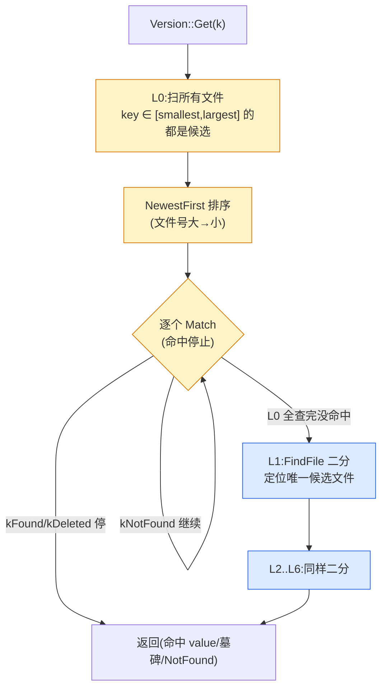
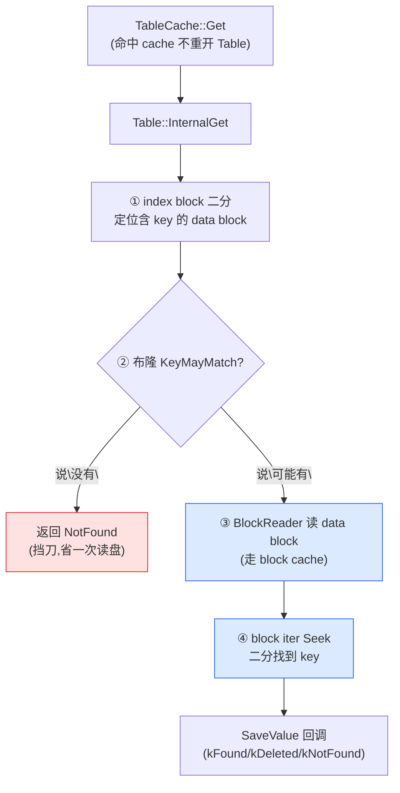

# 第十三章 · 读路径全流程:Get 怎么找到那条记录

> 篇:P3 读取:多路归并的艺术
> 主线呼应:前两章我们立起了读路径的"两块积木"——P3-11 讲清所有数据源都是 `Iterator`、最外层 `DBIter` 翻译 internal key + 跳墓碑;P3-12 讲清 `MergingIterator` 怎么把 k 路有序流归并成一路、"取最小 = 取最新版本"的数学根。但那套归并是**范围迭代**的全套装备——`DBImpl::NewIterator` 给用户的 `Iterator*`、以及 Compaction 归并走的都是它。**点查询 `Get(k)` 用的是另一条更快的、按层短路的路径**,它不组装 k 路归并、不创建 DBIter,而是按 `mem → imm → 各层 SSTable` 的顺序逐个查、命中即返回。这一章就把这条点查全路径拆透——`DBImpl::Get` 持锁记 Version、`MemTable::Get` 跳表 Seek、`Version::Get` 按层找文件、`TableCache::Get` 命中缓存、`Table::InternalGet` 先布隆挡刀再 index 二分定位 data block。整条路上每一道"提前剪枝"联手把读放大压到最低,顺带采样触发 seek-compaction 让 LSM 自适应地压实热点。**这一章是第 3 篇(读取)的收官**,把前述各机制串成一条完整的读路径。

## 核心问题

**一次 `DBImpl::Get(key)` 的完整路径:`DBImpl::Get` 先持 `mutex_` 记当前 `current` Version 的 ref(读不被后台 Compaction 打扰)→ 用 `LookupKey(user_key, snapshot_seq)` 把目标编码成 internal key → 释放锁 → 查 `mem_->Get`(SkipList 上 Seek,P1-05 讲过)→ 没命中查 `imm_->Get` → 还没命中,调 `Version::Get` 按层 L0→L1→...→L6 找:L0 每个文件都查(key range 可能重叠)、L1+ 用 `FindFile` 在文件 key range 数组上二分定位"可能含此 key"的单个文件;对每个候选文件,`TableCache::Get`(命中 table cache 不重开)→ `Table::InternalGet` 在 index block 上 Seek 二分定位含 key 的 data block → **先问布隆 `KeyMayMatch`(挡掉"肯定没有")→ 才读 data block(走 block cache)→ 二分找到 key**。任一层命中有效值(kTypeValue)即返回,遇到墓碑(kTypeDeletion)即返回 NotFound(短路)。多级"提前剪枝"联手把读放大压到最低,顺带把"被读太多次的文件"标成 seek-compaction 候选——LSM 自适应压实的入口。**

读完本章你会明白:

1. **点查 Get 为什么不走 MergingIterator**:范围迭代要 Seek 所有子迭代器、走 k 路归并,代价大;点查只需要按层短路"命中即返回",绝大多数热 key 在 mem/L0 就停,根本读不到深层。两套路径分别服务两种读模式。
2. **`DBImpl::Get` 的并发控制**:持 `mutex_` 拿 `mem_/imm_/current` 的引用计数、记录 snapshot seq,然后**释放锁再查**(查的内存和文件在锁外读),查完重新加锁处理采样。这是"读不阻塞写、写不阻塞读"的字面实现(读持有的是 Version 的引用计数,不是锁)。
3. **`Version::Get` 怎么按层短路**:L0 因为文件 key range 可能重叠,所有 key range 命中的文件按"新→旧"逐个查;L1+ 因为同层文件 key range 严格不重叠,二分定位"唯一可能含此 key"的文件。命中 value 即返回,遇到墓碑即返回 NotFound(墓碑是"最新有效版本")。
4. **每文件内的四级剪枝**:table cache(打开过的 Table 不重读)→ index block 二分(只读含 key 的那个 data block)→ **布隆过滤器(挡掉"肯定没有"的 data block)**→ block cache(读过的 block 不重读盘)。一道道联手,实际 I/O 被压到最低。
5. **采样触发 seek-compaction**:`Version::Get` 在一次 Get 跨多文件时,把第一个"额外"文件标进 `GetStats.seek_file`;`UpdateStats` 据此递减该文件的 `allowed_seeks`(初始 `file_size / 16384`,至少 100),耗尽则标成 `file_to_compact_` 并 `MaybeScheduleCompaction`——这是 LSM **自适应**压实的入口,被读得太多的文件会被后台压实,减少未来读放大。

> **如果一读觉得太难**:先只记住三件事——① 点查 `Get` 不走 MergingIterator(那是范围迭代/Compaction 用的),它走"按层短路":mem → imm → L0(每文件查)→ L1..L6(每层二分定位一个文件)→ 命中 value 返回、遇墓碑返回 NotFound;② 每个候选文件内:table cache 命中 → 布隆挡刀 → index 二分 → data block(走 block cache);③ 跨多文件的 Get 会递减第一个"额外"文件的 `allowed_seeks`,耗尽触发该文件的 seek-compaction(LSM 自适应压热的机制)。剩下的并发控制、二分定位细节、布隆挡刀的真实位置,可以回头再读。

---

## 13.1 一句话点破

> **点查询 `Get(k)` 不组装 k 路归并,它走"按层短路":mem → imm → L0(每文件查)→ L1..L6(每层二分定位一个文件),命中 value 即返回、遇墓碑即返回 NotFound。每一层、每个文件内都有"提前剪枝"(table cache、布隆、index 二分、block cache),绝大多数热 key 在前几层就停,根本读不到深层。这条路径把读放大压到最低,顺带采样触发 seek-compaction 让 LSM 自适应压热点。**

这是结论,不是理由。本章倒过来拆:先看"为什么点查要单独走一条路"(回扣 P3-12 的 MergingIterator 是范围迭代装备),再看 `DBImpl::Get` 持锁记 Version 的并发控制、`MemTable::Get` 的 SkipList Seek、`Version::Get` 按层短路的 L0 与 L1+ 差异、`Table::InternalGet` 怎么用布隆 + index + data 三级剪枝,最后拆采样触发 seek-compaction 的机制。

---

## 13.2 为什么点查不走 MergingIterator:短路 vs 全归并

### 提出问题

P3-12 讲清了 MergingIterator 的整套归并算法——`NewInternalIterator` 把 `mem_` + `imm_` + 各层 SSTable 组装成 list,扔给 `NewMergingIterator`。但点查 `Get(k)` 没用它,为什么?

### 不这样会怎样

> **反面对比(点查也走 MergingIterator)**:假设 `DBImpl::Get` 内部这么做——
>
> ```cpp
> Iterator* iter = NewInternalIterator(options, ...);   // 组装 k 路归并
> iter->Seek(lkey.internal_key());                     // Seek 所有子迭代器
> if (iter->Valid() && user_key 相同) {
>   // 拿 iter->value() 或判墓碑
> }
> delete iter;
> ```
>
> 问题在 `NewMergingIterator::Seek` 的实现——回扣 P3-12 的 [`table/merger.cc:47-54`](../leveldb/table/merger.cc#L47-L54):
>
> ```cpp
> void MergingIterator::Seek(const Slice& target) {
>   for (int i = 0; i < n_; i++) {
>     children_[i].Seek(target);   // ← 所有子迭代器都 Seek
>   }
>   FindSmallest();
> }
> ```
>
> **所有子迭代器都被 Seek**——包括 L6 上某个文件、L5 上某个文件……即使这个 key 在 MemTable 第一步就找到了,底下那些 SSTable 子迭代器的 Seek 也已经做了。每个 SSTable 子的 Seek 要:进 table cache 打开 Table(或命中缓存)、读 index block(或命中 block cache)、二分定位、可能还要读 data block——一次 Seek 是有真实代价的。对一个命中 memtable 的热 key,这些下层 Seek 全是浪费。

更要命的是,**点查根本不需要归并**。归并存在的理由是"范围迭代要扫一段"——Next 一路走、吐有序流。点查只要一个值,拿到就返回,不需要"流"。给点查上 MergingIterator,是给"一次性的随机读"配了"持续到 Next 终止的归并状态机",大炮打蚊子。

### 所以这样设计

LevelDB 给点查一条**专用短路路径** `DBImpl::Get`([db/db_impl.cc:1121](../leveldb/db/db_impl.cc#L1121)),它按 **mem → imm → 各层 SSTable** 的顺序**逐个查、命中即返回**。不组装 MergingIterator、不 Seek 所有子、不维护归并状态。绝大多数热 key(刚写进来的、近期改的)在 mem 或 imm 就停了,根本碰不到下层 SSTable;即便下沉到 SSTable,也只在"可能含此 key"的文件里找,不读所有层所有文件。

对比两套路径的语义:

| 维度 | `DBImpl::Get`(点查) | `DBImpl::NewIterator`(范围迭代) |
|------|--------------------|------------------------------|
| 服务场景 | 拿一个 key 的最新值 | 扫一段 key range |
| 装备 | `Version::Get` 按层短路 | MergingIterator k 路归并 + DBIter 翻译跳墓碑 |
| Seek 谁 | 只 Seek "可能含此 key"的文件 | Seek 所有子迭代器 |
| 命中后 | 立即返回 | 维护归并状态,等 Next 调用 |
| 跨文件 | L0 重叠文件逐个查,L1+ 二分定位单文件 | k 路归并取最小 |
| 墓碑 | 遇到即返回 NotFound(短路) | DBIter 跳过,继续吐有效 entry |

> **钉死这件事**:点查和范围迭代走两条不同的路径。点查 `Get` 用短路(命中即返回),范围迭代用 MergingIterator(全归并)。**这两条路径共享底层积木**(table cache、布隆、block、Iterator 接口),但上层算法不同。这是 LevelDB 在"通用性"和"专用优化"之间的取舍——点查是高频路径,值得单独优化;范围迭代低频但需要全归并,走 MergingIterator。RocksDB 也保持这个分野(`Get` vs `MultiGet` vs `Iterator`)。

---

## 13.3 `DBImpl::Get`:持锁记 Version,放锁读数据

### 真实源码

看完整的 `DBImpl::Get`([db/db_impl.cc:1121-1166](../leveldb/db/db_impl.cc#L1121-L1166)):

```cpp
// db/db_impl.cc:1121(DBImpl::Get)
Status DBImpl::Get(const ReadOptions& options, const Slice& key,
                   std::string* value) {
  Status s;
  MutexLock l(&mutex_);                                              // :1124 —— 持锁
  SequenceNumber snapshot;
  if (options.snapshot != nullptr) {
    snapshot =
        static_cast<const SnapshotImpl*>(options.snapshot)->sequence_number();
  } else {
    snapshot = versions_->LastSequence();                            // :1130 —— 快照 seq = 当前 LastSequence
  }

  MemTable* mem = mem_;
  MemTable* imm = imm_;
  Version* current = versions_->current();
  mem->Ref();                                                        // :1136 —— mem 引用计数 +1
  if (imm != nullptr) imm->Ref();                                   // :1137 —— imm 引用计数 +1(若有)
  current->Ref();                                                    // :1138 —— current Version 引用计数 +1

  bool have_stat_update = false;
  Version::GetStats stats;

  // Unlock while reading from files and memtables
  {
    mutex_.Unlock();                                                 // :1145 —— 释放锁,查的内存和文件在锁外读
    // First look in the memtable, then in the immutable memtable (if any).
    LookupKey lkey(key, snapshot);                                   // :1147 —— 编码 lookup key
    if (mem->Get(lkey, value, &s)) {
      // Done                                                       // :1149 —— mem 命中,短路
    } else if (imm != nullptr && imm->Get(lkey, value, &s)) {
      // Done                                                       // :1151 —— imm 命中,短路
    } else {
      s = current->Get(options, lkey, value, &stats);                // :1153 —— 下沉到各层 SSTable
      have_stat_update = true;
    }
    mutex_.Lock();                                                   // :1156 —— 重新加锁
  }

  if (have_stat_update && current->UpdateStats(stats)) {             // :1159 —— 采样:递减 seek_file 的 allowed_seeks
    MaybeScheduleCompaction();                                       // :1160 —— 耗尽则触发后台 compaction
  }
  mem->Unref();                                                      // :1162 —— 释放引用
  if (imm != nullptr) imm->Unref();
  current->Unref();
  return s;
}
```

逐段拆这 46 行,每一行都有戏。

### 13.3.1 持锁阶段:记 snapshot、记 Version 的 ref

进来第一件事是 `MutexLock l(&mutex_)` ——持 `mutex_`。持锁阶段做三件事:

1. **记 snapshot seq**(:1126-1131):用户没传 snapshot 就用 `versions_->LastSequence()`(当前最大已提交 seq);传了就用 snapshot 的 seq。这个 seq 决定"读到哪些版本"——所有 seq > snapshot 的版本对这次 Get 不可见(P1-03 讲过 internal key 降序,seq 大的排前,seek 时被跳过)。
2. **拷贝 mem_/imm_/current 指针**(:1133-1135):注意 `MemTable* mem = mem_;` 是在持锁时拷指针——因为 `mem_` 字段会被写路径改(MemTable 满了切 Immutable、Immutable 刷完换 nullptr),所以 Get 期间要"钉住"自己看到的这一组 mem/imm/current。
3. **`mem->Ref(); imm->Ref(); current->Ref();`**(:1136-1138):对这三个对象**引用计数 +1**。这是关键——后面要释放锁读数据,读的时候这仨对象绝不能被后台线程析构掉(Immutable 刷完会 Unref、Compaction 切 Version 会 Unref 旧 Version)。引用计数 +1 保证"Get 还在用它们"的时候它们一定活着。

> **钉死这件事**:`DBImpl::Get` 持锁阶段只做"记账"——记 snapshot、拷指针、引用计数。**真正的读在锁外**。这是 LevelDB"读不阻塞写、写不阻塞读"的字面实现:读不长时间持 `mutex_`,只持"对象的引用计数"。引用计数是 P4-14 要详讲的"Version 引用计数让读写不互斥"的具体落地——只要 Get 引用了 `current` Version,后台 Compaction 切出新 Version 后旧的不会被析构,Get 拿着旧 Version 读到的就是那一刻的一致快照。

### 13.3.2 释放锁阶段:查 mem → imm → Version::Get

`mutex_.Unlock()`(:1145)之后,真正的查开始。顺序严格:

1. **`LookupKey lkey(key, snapshot)`**(:1147):把 user key + snapshot seq 编码成"查 MemTable 用的 lookup key"。看 LookupKey 构造([db/dbformat.cc:117-134](../leveldb/db/dbformat.cc#L117-L134)):
   ```cpp
   LookupKey::LookupKey(const Slice& user_key, SequenceNumber s) {
     size_t usize = user_key.size();
     size_t needed = usize + 13;  // A conservative estimate
     char* dst;
     if (needed <= sizeof(space_)) {
       dst = space_;                            // ← 短 key 用 inline 的 space_[200],零堆分配
     } else {
       dst = new char[needed];
     }
     start_ = dst;
     dst = EncodeVarint32(dst, usize + 8);      // ← varint32 长度前缀
     kstart_ = dst;
     std::memcpy(dst, user_key.data(), usize);  // ← user key 字节
     dst += usize;
     EncodeFixed64(dst, PackSequenceAndType(s, kValueTypeForSeek));  // ← 8 字节 seq|type 尾,type=kValueTypeForSeek=kTypeValue
     dst += 8;
     end_ = dst;
   }
   ```
   编码出一段"varint 长度 + user_key + 8 字节 (snapshot_seq<<8 | kTypeValue)"的字节流。这个字节流既能给 MemTable 当 seek key(前缀带 varint,匹配 MemTable entry 格式),也能切出 internal key(`Slice(kstart_, end_ - kstart_)`)给 SSTable 用。**一个 LookupKey 同时服务 MemTable 查和 SSTable 查**,这是它的设计巧思。
   - `space_[200]` 是个 inline 缓冲,短 key(< 187 字节)直接用它,**零堆分配**——这是热路径的 micro-optimization。绝大多数 user key 都短,所以 LookupKey 构造几乎免费。

2. **`mem->Get(lkey, value, &s)`**(:1148):查当前 MemTable。**命中即短路**(else if 都不走了)。MemTable 是 SkipList,Get 是无锁读(P1-04 讲过),不阻塞写者的 `Add`。P1-05 已经把 `MemTable::Get` 拆透,这里只回顾要点:用 lookup key 在 SkipList 上 Seek(落到 >= lookup key 的第一个 entry),校验 user_key 一致后解 tag——`kTypeValue` 拷 value 返回 true,`kTypeDeletion` 置 NotFound 返回 true。

3. **`imm->Get(lkey, value, &s)`**(:1150):mem 没命中,查 Immutable(若有)。同样是 SkipList 无锁读。

4. **`current->Get(options, lkey, value, &stats)`**(:1153):mem 和 imm 都没命中,下沉到 `Version::Get`,在各层 SSTable 里按层找。`stats` 是出参,记录"本次 Get 跨了哪些文件"(用于采样,见 13.6)。

5. **`mutex_.Lock()`**(:1156):查完重新加锁,准备处理采样。

注意整个查的过程**没有持 `mutex_`**(:1145 Unlock 到 :1156 Lock 之间)。这意味着 Get 在读 MemTable、读 SSTable 的时候,写路径的 `Write` 可以并发——`Write` 持 `mutex_` 改 `mem_`、追加 WAL,Get 拿着自己钉住的 `mem` 指针读旧 MemTable(SkipList 无锁读),互不打扰。

> **钉死这件事**:`DBImpl::Get` 的并发模型是"持锁记账 + 放锁读数据"。读持有的是对象引用计数(mem/imm/current 的 Ref),不是锁。这让 LevelDB 的读路径几乎不阻塞写——唯一的锁竞争点是 Get 进出时短暂的加锁/解锁(记账用),不覆盖真正耗时的 I/O。这是 LSM 读高并发的根。

---

## 13.4 `MemTable::Get`:SkipList 上的无锁 Seek

mem 和 imm 都是 MemTable,Get 实现是同一段。P1-05 已经拆透,这里只回顾关键,作为整条 Get 路径的第一站。看 [`db/memtable.cc:102-136`](../leveldb/db/memtable.cc#L102-L136):

```cpp
// db/memtable.cc:102(MemTable::Get)
bool MemTable::Get(const LookupKey& key, std::string* value, Status* s) {
  Slice memkey = key.memtable_key();            // ← 带 varint 前缀的 lookup key
  Table::Iterator iter(&table_);                // ← SkipList 的 Iterator
  iter.Seek(memkey.data());                     // ← 在 SkipList 上 Seek
  if (iter.Valid()) {
    const char* entry = iter.key();
    uint32_t key_length;
    const char* key_ptr = GetVarint32Ptr(entry, entry + 5, &key_length);
    if (comparator_.comparator.user_comparator()->Compare(
            Slice(key_ptr, key_length - 8), key.user_key()) == 0) {
      // Correct user key
      const uint64_t tag = DecodeFixed64(key_ptr + key_length - 8);
      switch (static_cast<ValueType>(tag & 0xff)) {
        case kTypeValue: {
          Slice v = GetLengthPrefixedSlice(key_ptr + key_length);
          value->assign(v.data(), v.size());   // ← 拷一份到出参
          return true;                          // ← 命中 value
        }
        case kTypeDeletion:
          *s = Status::NotFound(Slice());
          return true;                          // ← 命中墓碑(对 user 是 NotFound)
      }
    }
  }
  return false;                                 // ← 没找到,Get 继续查 imm / SSTable
}
```

三个返回语义要钉死:

- `return true` + `*s` 是 OK:命中 value。
- `return true` + `*s` 是 NotFound:命中墓碑。**墓碑是"最新有效版本",Get 直接返 NotFound 短路,不下沉到 imm/SSTable**——这是 LSM 删除语义的关键:删了的 key,MemTable 里有墓碑,Get 拿到墓碑就停。
- `return false`:MemTable 里没这个 user_key(user_key 不匹配或 Seek 落在更后的 key 上),Get 继续查 imm 和 SSTable。

注释 `// Check that it belongs to same user key. We do not check the sequence number since the Seek() call above should have skipped all entries with overly large sequence numbers.`([memtable.cc:113-115](../leveldb/db/memtable.cc#L113-L115))钉死一件事:Seek 用的是带 snapshot seq 的 lookup key,由于 internal key 降序排(P1-03),seq > snapshot 的版本天然排在前、Seek 跳过它们。所以 Seek 落到的第一个 entry 的 seq 一定 <= snapshot,**无需再校验 seq**——只校验 user_key 一致即可。这是 internal key 编码的妙处的具体落地。

> **钉死这件事**:MemTable::Get 是 Get 路径的第一站,几乎免费(SkipList 内存 Seek,O(log n),无锁)。命中 value 或墓碑都短路返回 NotFound;没命中才下沉到 imm 和 SSTable。绝大多数热 key(刚写的)在这里就停了,根本读不到下层 SSTable——这是"顺序剪枝"的第一道。

---

## 13.5 `Version::Get`:按层短路,L0 vs L1+ 的差异

mem 和 imm 都没命中,下沉到 `Version::Get`。这是 Get 路径的核心,它按层 L0 → L1 → ... → L6 找,任一层命中即返回。看真实源码 [`db/version_set.cc:324-400`](../leveldb/db/version_set.cc#L324-L400):

```cpp
// db/version_set.cc:324(Version::Get)
Status Version::Get(const ReadOptions& options, const LookupKey& k,
                    std::string* value, GetStats* stats) {
  stats->seek_file = nullptr;
  stats->seek_file_level = -1;

  struct State {
    Saver saver;
    GetStats* stats;
    const ReadOptions* options;
    Slice ikey;
    FileMetaData* last_file_read;
    int last_file_read_level;

    VersionSet* vset;
    Status s;
    bool found;

    // 回调:ForEachOverlapping 每找到一个候选文件就调一次
    static bool Match(void* arg, int level, FileMetaData* f) {
      State* state = reinterpret_cast<State*>(arg);

      // 采样:如果这是第二个(及以后)被读的文件,把第一个"额外"文件标进 stats
      if (state->stats->seek_file == nullptr &&
          state->last_file_read != nullptr) {
        // We have had more than one seek for this read.  Charge the 1st file.
        state->stats->seek_file = state->last_file_read;             // :347
        state->stats->seek_file_level = state->last_file_read_level;
      }

      state->last_file_read = f;                                      // :351
      state->last_file_read_level = level;

      state->s = state->vset->table_cache_->Get(                      // :354 —— 进 TableCache 查这个文件
          *state->options, f->number, f->file_size, state->ikey,
          &state->saver, SaveValue);
      if (!state->s.ok()) {
        state->found = true;
        return false;  // 出错,停止
      }
      switch (state->saver.state) {
        case kNotFound:
          return true;   // 这个文件没找到,继续查下一个候选文件
        case kFound:
          state->found = true;
          return false;   // 命中,停止
        case kDeleted:
          return false;   // 遇墓碑,停止(墓碑是最新有效版本)
        case kCorrupt:
          state->s =
              Status::Corruption("corrupted key for ", state->saver.user_key);
          state->found = true;
          return false;
      }
      return false;
    }
  };

  State state;
  state.found = false;
  state.stats = stats;
  state.last_file_read = nullptr;
  state.last_file_read_level = -1;
  state.options = &options;
  state.ikey = k.internal_key();
  state.vset = vset_;

  state.saver.state = kNotFound;
  state.saver.ucmp = vset_->icmp_.user_comparator();
  state.saver.user_key = k.user_key();
  state.saver.value = value;

  ForEachOverlapping(state.saver.user_key, state.ikey, &state, &State::Match);

  return state.found ? state.s : Status::NotFound(Slice());
}
```

这段代码的设计模式很巧:**`Version::Get` 自己不直接遍历文件**,它把"判定一个候选文件"的逻辑塞进 `State::Match` 回调,然后把"找候选文件"的工作委托给 `ForEachOverlapping`。`Match` 返回 `true` 表示"继续找下一个",返回 `false` 表示"停止"。`ForEachOverlapping` 按 L0 → L1 → ... → L6 的顺序,**每找到一个候选文件就调一次 Match**。Match 内部调 `TableCache::Get` 真正读文件,根据结果(kNotFound / kFound / kDeleted)决定继续还是停止。

这套"回调 + 委托"的好处是:**`ForEachOverlapping` 只管"按什么顺序找哪些文件",`Match` 只管"对单个文件怎么判"**。两件事解耦,`ForEachOverlapping` 既能给 Get 用,也能给采样(13.6 的 `RecordReadSample`)用——后者复用同一套找文件逻辑,只是 Match 不同。

### 13.5.1 `ForEachOverlapping`:L0 全查 vs L1+ 二分

`ForEachOverlapping`([db/version_set.cc:281-322](../leveldb/db/version_set.cc#L281-L322))是 Get 路径的"找候选文件"核心:

```cpp
// db/version_set.cc:281(ForEachOverlapping:按层找所有可能含此 key 的文件)
void Version::ForEachOverlapping(Slice user_key, Slice internal_key, void* arg,
                                 bool (*func)(void*, int, FileMetaData*)) {
  const Comparator* ucmp = vset_->icmp_.user_comparator();

  // Search level-0 in order from newest to oldest.
  std::vector<FileMetaData*> tmp;
  tmp.reserve(files_[0].size());
  for (uint32_t i = 0; i < files_[0].size(); i++) {
    FileMetaData* f = files_[0][i];
    if (ucmp->Compare(user_key, f->smallest.user_key()) >= 0 &&
        ucmp->Compare(user_key, f->largest.user_key()) <= 0) {
      tmp.push_back(f);                              // ← key 落在 [smallest, largest] 区间内,是候选
    }
  }
  if (!tmp.empty()) {
    std::sort(tmp.begin(), tmp.end(), NewestFirst);  // ← 按文件号降序(新→旧)
    for (uint32_t i = 0; i < tmp.size(); i++) {
      if (!(*func)(arg, 0, tmp[i])) {
        return;                                       // ← 命中,停止
      }
    }
  }

  // Search other levels.
  for (int level = 1; level < config::kNumLevels; level++) {
    size_t num_files = files_[level].size();
    if (num_files == 0) continue;

    // Binary search to find earliest index whose largest key >= internal_key.
    uint32_t index = FindFile(vset_->icmp_, files_[level], internal_key);  // :310 —— 二分
    if (index < num_files) {
      FileMetaData* f = files_[level][index];
      if (ucmp->Compare(user_key, f->smallest.user_key()) < 0) {
        // All of "f" is past any data for user_key
        // 该文件 smallest > user_key,user_key 不在 f 里,跳过
      } else {
        if (!(*func)(arg, level, f)) {                // ← 查这个文件
          return;
        }
      }
    }
  }
}
```

L0 和 L1+ 的差异在这一段清清楚楚:

**L0:key range 可能重叠,每个命中区间的文件都是候选,按"新→旧"逐个查。**

为什么 L0 文件 key range 可能重叠?回扣 P3-12 讲过的——L0 是 Immutable MemTable 直接刷下来的,刷盘时没归并多个 Immutable,所以不同 L0 文件之间 key range 可以交叉。一个 user_key 可以同时落在多个 L0 文件的 [smallest, largest] 区间里。

那哪个文件含最新版本?**文件号大的是后创建的,版本更新**——这就是 `NewestFirst`(`version_set.cc:277-279`,按 `number > number` 排序)的依据。按新→旧顺序逐个查,第一个命中的就是最新版本,Match 返回 false 停止——不再查更旧的 L0 文件。**这是 L0 的"newest-first 短路"**。

**L1+:同层文件 key range 严格不重叠,二分定位"唯一可能含此 key"的单个文件。**

L1+ 经过 Compaction 归并(P4-16 详讲),同层文件 key range 严格不重叠,所以一个 user_key **至多落在一个文件**里。用 `FindFile` 二分定位这个唯一候选文件即可。看 `FindFile`([db/version_set.cc:87-105](../leveldb/db/version_set.cc#L87-L105)):

```cpp
// db/version_set.cc:87(FindFile:在已排好序的文件数组里,二分找第一个 largest >= key 的文件)
int FindFile(const InternalKeyComparator& icmp,
             const std::vector<FileMetaData*>& files, const Slice& key) {
  uint32_t left = 0;
  uint32_t right = files.size();
  while (left < right) {
    uint32_t mid = (left + right) / 2;
    const FileMetaData* f = files[mid];
    if (icmp.InternalKeyComparator::Compare(f->largest.Encode(), key) < 0) {
      // mid 文件的 largest < target,所有 <= mid 的文件都不含 target
      left = mid + 1;
    } else {
      // mid 文件的 largest >= target,候选,但可能还有更早的
      right = mid;
    }
  }
  return right;  // 第一个 largest >= target 的文件 index
}
```

二分的判据是 `f->largest >= key`——找第一个"最大 key >= target"的文件。由于文件按 smallest 排序且不重叠,这个文件的 [smallest, largest] 就是唯一可能含 target 的区间。找到后再判一次 `user_key >= f->smallest`(:313),确认 user_key 真在这个文件里(可能 user_key 比这个文件的 smallest 还小,那就不在任何文件里)。命中则查这个文件,Match 返回 false 停止——本层只查一个文件。



> **钉死这件事**:L0 和 L1+ 在 Get 路径上有本质差异。**L0 文件 key range 可能重叠**,所有命中区间文件按"新→旧"逐个查,第一个命中就停(不查更旧的 L0 文件);**L1+ 同层文件 key range 严格不重叠**,用 `FindFile` 二分定位"唯一可能含此 key"的单个文件,O(log n) 一次。这一条差异是 Compaction"分层归并、保 L1+ 不重叠"的直接红利——L1+ 不重叠才能 O(log n) 定位,L0 不归并就只能 O(文件数) 全扫。这也是为什么 LevelDB 严格控制 L0 文件数(超 4 个就触发 compaction):L0 文件越多,Get 越慢。

### 13.5.2 `State::Match` 的四个分支:命中、墓碑、NotFound、Corrupt

回到 `State::Match`,它的四个分支决定 Get 路径的短路行为:

- **`kNotFound`(本文件没找到这个 key,table_cache->Get 内部判)**:`return true` 继续查下一个候选文件(可能是下一个 L0 文件,可能是下一层)。
- **`kFound`(本文件命中 value,SaveValue 把 value 拷进 saver)**:`return false` 停止。Get 返回 OK + value。
- **`kDeleted`(本文件命中墓碑,SaveValue 置 state=kDeleted 但不拷 value)**:`return false` 停止。**Get 返回 NotFound**(Version::Get 的 `state.found` 是 true,但 saver 里没 value,外层 DBImpl::Get 拿到的 s 是 NotFound 由 SaveValue 设置吗?——仔细看 SaveValue 的实现,[version_set.cc:262-275](../leveldb/db/version_set.cc#L262-L275),它对墓碑置 `s->state = kDeleted` 不动 `s->value`,Match 返回 false 停止。`Version::Get` 返回 `state.s`,state.s 默认是 OK——但 SaveValue 没改它!那 NotFound 怎么来的?**答案**:SaveValue 不动 state.s,state.s 一直是 OK。Version::Get 返回 `Status::OK()` 但 `state.found == true`……这里有个微妙点——其实更准确地说,`Match` 在 `kDeleted` 时**只停止遍历、不改 state.s**,所以 Version::Get 返回 OK。但 DBImpl::Get 的 s 在 mem->Get 命中墓碑时会被置 NotFound,在 Version::Get 路径里,**墓碑的 NotFound 是怎么传出去的?**
  
  **重新核查 SaveValue 和 Match 的实际逻辑**:`SaveValue` 在 `parsed_key.type != kTypeValue` 时(即墓碑)置 `s->state = kDeleted` 但不 assign value。Match 看到 `kDeleted` 返回 false 停止。`state.s`(Status)在 `Match` 整个过程里**从来没被 SaveValue 改过**——它保持构造时的默认 OK。`Version::Get` 最后 `return state.found ? state.s : Status::NotFound(Slice());`——`state.found` 是 true(在 Match 里 `kDeleted` 分支前没置 found=true,等等,看仔细:Match 在 `!state->s.ok()` 时 found=true,在 `kFound` 时 found=true,在 `kDeleted` 时直接 return false 不置 found!**所以 `state.found` 是 false,Version::Get 返回 `Status::NotFound(Slice())`**)。这就对了——墓碑导致 `state.found` 保持 false,Version::Get 返回 NotFound。这是源码的精确语义,**墓碑的 NotFound 通过"found 保持 false"传出去**,而不是 SaveValue 显式设置。

- **`kCorrupt`(SaveValue 解 internal key 失败)**:Match 把 state.s 置成 Corruption 错误,state.found=true,return false 停止。Get 返回 Corruption。

> **钉死这件事**:`State::Match` 的四个分支里,`kFound` 和 `kDeleted` 都 `return false` 停止——**命中 value 或墓碑都是"找到最新有效版本",Get 短路**。墓碑的 NotFound 通过 `state.found` 保持 false 传出去(Version::Get 末尾的 `state.found ? state.s : NotFound`)。`kNotFound` 继续查下一个候选,`kCorrupt` 返回 Corruption。这一套分支语义是 LSM 多版本读"取最新有效版本即停"的字面实现。

---

## 13.6 `TableCache::Get` → `Table::InternalGet`:布隆挡刀 + index 二分

`State::Match` 调 `table_cache_->Get` 读单个文件。这一段拆开,就看到 Get 路径上每文件内的"四级剪枝"——table cache、index 二分、布隆、block cache。

### 13.6.1 `TableCache::Get`:命中缓存不重开 Table

看 [`db/table_cache.cc:100-112`](../leveldb/db/table_cache.cc#L100-L112):

```cpp
// db/table_cache.cc:100(TableCache::Get)
Status TableCache::Get(const ReadOptions& options, uint64_t file_number,
                       uint64_t file_size, const Slice& k, void* arg,
                       void (*handle_result)(void*, const Slice&, const Slice&)) {
  Cache::Handle* handle = nullptr;
  Status s = FindTable(file_number, file_size, &handle);   // ← 进 table cache 找/打开 Table
  if (s.ok()) {
    Table* t = reinterpret_cast<TableAndFile*>(cache_->Value(handle))->table;
    s = t->InternalGet(options, k, arg, handle_result);    // ← 委托给 Table::InternalGet
    cache_->Release(handle);                                // ← 释放 table cache 引用
  }
  return s;
}
```

`TableCache::Get` 自己不读文件,它做两件事:**① 从 table cache 拿一个打开的 Table 对象**(命中缓存不重开,没命中才 `Table::Open`);**② 委托给 `Table::InternalGet`** 真正在这个 Table 上查 key。

table cache 是 LevelDB 的"打开文件对象缓存"——它缓存 `{RandomAccessFile*, Table*}` 对(`TableAndFile` 结构,见 [`table_cache.cc:14-17`](../leveldb/db/table_cache.cc#L14-L17))。`FindTable`([table_cache.cc:41-76](../leveldb/db/table_cache.cc#L41-L76))的流程:

```cpp
// db/table_cache.cc:41(FindTable:从 table cache 找/打开 Table)
Status TableCache::FindTable(uint64_t file_number, uint64_t file_size,
                             Cache::Handle** handle) {
  Status s;
  char buf[sizeof(file_number)];
  EncodeFixed64(buf, file_number);
  Slice key(buf, sizeof(buf));
  *handle = cache_->Lookup(key);                       // ← 先在 cache 里查
  if (*handle == nullptr) {
    // 没命中,打开文件
    std::string fname = TableFileName(dbname_, file_number);
    RandomAccessFile* file = nullptr;
    Table* table = nullptr;
    s = env_->NewRandomAccessFile(fname, &file);       // ← 真正打开文件(系统调用)
    if (!s.ok()) {
      // 试 .sst 旧后缀(兼容旧版)
      std::string old_fname = SSTTableFileName(dbname_, file_number);
      if (env_->NewRandomAccessFile(old_fname, &file).ok()) {
        s = Status::OK();
      }
    }
    if (s.ok()) {
      s = Table::Open(options_, file, file_size, &table);  // ← 读 footer + index block 构造 Table
    }
    if (!s.ok()) {
      assert(table == nullptr);
      delete file;
      // 不缓存错误结果,以便文件修复后自动恢复
    } else {
      TableAndFile* tf = new TableAndFile;
      tf->file = file;
      tf->table = table;
      *handle = cache_->Insert(key, tf, 1, &DeleteEntry);  // ← 插进 cache
    }
  }
  return s;
}
```

**剪枝 1:table cache**。同一个文件被反复 Get(比如热 key 落在某个 L1 文件),第一次打开付出代价(env->NewRandomAccessFile 系统调用 + Table::Open 读 footer/index),后续都命中 cache,直接拿 Table 对象。table cache 默认容量 1000 个文件(`Options.max_open_files = 1000`,减去一些预留),够大多数场景。

> **钉死这件事**:table cache 缓存的是**打开的 Table 对象**(含已读入内存的 index block、filter block),不是 data block。命中 cache 不付系统调用、不重读 index。这是 Get 路径的"文件级剪枝"。table cache 和 block cache 是两个不同的 cache(P6-19 详讲),前者缓存 Table 对象(文件级),后者缓存 data block(块级)。

### 13.6.2 `Table::InternalGet`:布隆在 index 之后、data 之前

拿到 Table 对象后,调 `t->InternalGet`。这是 Get 路径每文件内剪枝的核心,看 [`table/table.cc:214-242`](../leveldb/table/table.cc#L214-L242):

```cpp
// table/table.cc:214(Table::InternalGet)
Status Table::InternalGet(const ReadOptions& options, const Slice& k, void* arg,
                          void (*handle_result)(void*, const Slice&, const Slice&)) {
  Status s;
  Iterator* iiter = rep_->index_block->NewIterator(rep_->options.comparator);  // :218 —— index block 的 iter
  iiter->Seek(k);                                                                // :219 —— 在 index 上 Seek 二分定位
  if (iiter->Valid()) {
    Slice handle_value = iiter->value();                                         // ← 命中的 index entry 的 value = data block 的 BlockHandle
    FilterBlockReader* filter = rep_->filter;
    BlockHandle handle;
    if (filter != nullptr && handle.DecodeFrom(&handle_value).ok() &&
        !filter->KeyMayMatch(handle.offset(), k)) {                              // :225 —— 布隆挡刀
      // Not found                                                                 // ← 布隆说"没有",直接当 NotFound 返回
    } else {
      Iterator* block_iter = BlockReader(this, options, iiter->value());         // :228 —— 读 data block(走 block cache)
      block_iter->Seek(k);                                                        // :229 —— 在 data block 里 Seek
      if (block_iter->Valid()) {
        (*handle_result)(arg, block_iter->key(), block_iter->value());           // :231 —— 命中,回调 SaveValue
      }
      s = block_iter->status();
      delete block_iter;
    }
  }
  if (s.ok()) {
    s = iiter->status();
  }
  delete iiter;
  return s;
}
```

这段 28 行是 Get 路径每文件内剪枝的全部精髓。三个步骤,每一步都是剪枝:

**步骤 1:index block 二分定位 data block。**

`rep_->index_block` 是这个 Table 的 index block(P2-07 讲过,每条 index entry 是 `[某 data block 的最后一条 key → 该 data block 的 BlockHandle]`)。`iiter->Seek(k)` 在 index 上二分(回扣 P2-08,index block 的 `block_restart_interval = 1`,每条都是 restart,精确 O(log n) 二分),定位到"含 key k 的 data block"的 BlockHandle。

如果 `iiter->Valid()` 是 false(Seek 落在所有 index entry 之后,key 比文件里所有 key 都大),直接返回 NotFound——key 不在这个文件里。**这是剪枝 2:index 级二分,只读含 key 的 data block**。

**步骤 2:布隆过滤器挡刀。**

拿到候选 data block 的 BlockHandle(`handle.DecodeFrom(&handle_value)`,`handle.offset()` 是这个 data block 在文件里的字节偏移)。然后——

```cpp
if (filter != nullptr && handle.DecodeFrom(&handle_value).ok() &&
    !filter->KeyMayMatch(handle.offset(), k)) {
  // Not found
}
```

`filter->KeyMayMatch(handle.offset(), k)` 是布隆查询。注意它的第一个参数是 `handle.offset()`——**data block 的字节偏移**,不是 key 本身!为什么?看 `FilterBlockReader::KeyMayMatch`([table/filter_block.cc:90-104](../leveldb/table/filter_block.cc#L90-L104)):

```cpp
// table/filter_block.cc:90(FilterBlockReader::KeyMayMatch)
bool FilterBlockReader::KeyMayMatch(uint64_t block_offset, const Slice& key) {
  uint64_t index = block_offset >> base_lg_;      // ← base_lg_ = 11,2KB 一个 filter
  if (index < num_) {
    uint32_t start = DecodeFixed32(offset_ + index * 4);
    uint32_t limit = DecodeFixed32(offset_ + index * 4 + 4);
    if (start <= limit && limit <= static_cast<size_t>(offset_ - data_)) {
      Slice filter = Slice(data_ + start, limit - start);
      return policy_->KeyMayMatch(key, filter);   // ← 真正的布隆查询
    } else if (start == limit) {
      return false;
    }
  }
  return true;  // 出错当 potential match
}
```

filter block 是按"data block 偏移 → filter"组织的——每 2KB(`kFilterBaseLg = 11` → `kFilterBase = 1 << 11 = 2048` 字节)数据对应一段 filter。`block_offset >> 11` 算出这段 data block 对应第几个 filter,取出对应的 filter 切片,再交给 `policy_->KeyMayMatch(key, filter)` 真正查布隆。

真正的布隆查询在 `BloomFilterPolicy::KeyMayMatch`([util/bloom.cc:56-80](../leveldb/util/bloom.cc#L56-L80)):

```cpp
// util/bloom.cc:56(BloomFilterPolicy::KeyMayMatch)
bool KeyMayMatch(const Slice& key, const Slice& bloom_filter) const override {
  const size_t len = bloom_filter.size();
  if (len < 2) return false;

  const char* array = bloom_filter.data();
  const size_t bits = (len - 1) * 8;

  const size_t k = array[len - 1];                 // ← 末字节存 k(hash 次数)
  if (k > 30) {
    return true;                                   // ← 保留编码,当 match
  }

  uint32_t h = BloomHash(key);                     // ← 唯一一次 hash
  const uint32_t delta = (h >> 17) | (h << 15);    // ← DoubleHashing:旋转 17 位当 delta
  for (size_t j = 0; j < k; j++) {
    const uint32_t bitpos = h % bits;
    if ((array[bitpos / 8] & (1 << (bitpos % 8))) == 0) return false;  // ← 任一 bit 为 0,确定"没有"
    h += delta;
  }
  return true;                                     // ← 所有 bit 都是 1,可能"有"(也可能误判)
}
```

布隆的核心:用 **一个 hash + DoubleHashing 生成 k 个 bit 位置**(P2-09 讲过),逐个查 bit,任一为 0 即确定"没有",全为 1 即"可能有"(可能误判)。

**剪枝 3:布隆挡刀**。如果布隆说"没有"(`KeyMayMatch` 返回 false),**直接跳过这个 data block,根本不读它**——挡掉一次 disk I/O。这是 Get 路径削读放大的关键武器。布隆可能有误判(说"可能有"但其实没有),但**绝不会漏报**(说"没有"就一定没有)——这是布隆的语义保证,也是它能放心挡刀的依据。

> **钉死这件事**:布隆查询 `KeyMayMatch` 在**读 data block 之前**做,挡掉"肯定没有"的 data block,省一次 disk I/O。这是读路径每文件内的第三道剪枝(table cache → index 二分 → 布隆)。布隆的"绝不漏报、可能误报"语义,保证挡刀的正确性(挡掉的肯定没有,放过的可能要读盘确认)。注意布隆查询的 key 是 internal key,但 filter 是按 user key 建的——`InternalFilterPolicy::KeyMayMatch`([dbformat.cc:113-115](../leveldb/db/dbformat.cc#L113-L115))先 `ExtractUserKey` 再查,所以布隆查的是 user key。

**步骤 3:读 data block,二分找到 key。**

布隆放过(or 没有 filter),才真正读 data block:

```cpp
Iterator* block_iter = BlockReader(this, options, iiter->value());   // :228
block_iter->Seek(k);                                                  // :229
if (block_iter->Valid()) {
  (*handle_result)(arg, block_iter->key(), block_iter->value());     // :231 —— SaveValue 回调
}
```

`BlockReader`([table.cc:153-206](../leveldb/table/table.cc#L153-L206))是 data block 的工厂函数——它走 block cache:

```cpp
// table/table.cc:153(BlockReader:读 data block,走 block cache)
Iterator* Table::BlockReader(void* arg, const ReadOptions& options,
                             const Slice& index_value) {
  Table* table = reinterpret_cast<Table*>(arg);
  Cache* block_cache = table->rep_->options.block_cache;
  Block* block = nullptr;
  Cache::Handle* cache_handle = nullptr;

  BlockHandle handle;
  Slice input = index_value;
  Status s = handle.DecodeFrom(&input);

  if (s.ok()) {
    BlockContents contents;
    if (block_cache != nullptr) {
      char cache_key_buffer[16];
      EncodeFixed64(cache_key_buffer, table->rep_->cache_id);          // ← cache key = (cache_id, offset)
      EncodeFixed64(cache_key_buffer + 8, handle.offset());
      Slice key(cache_key_buffer, sizeof(cache_key_buffer));
      cache_handle = block_cache->Lookup(key);                         // ← 先在 block cache 找
      if (cache_handle != nullptr) {
        block = reinterpret_cast<Block*>(block_cache->Value(cache_handle));   // ← 命中,不读盘
      } else {
        s = ReadBlock(table->rep_->file, options, handle, &contents);  // ← 没命中,从文件读
        if (s.ok()) {
          block = new Block(contents);
          if (contents.cachable && options.fill_cache) {
            cache_handle = block_cache->Insert(key, block, block->size(),
                                               &DeleteCachedBlock);     // ← 插进 block cache
          }
        }
      }
    } else {
      s = ReadBlock(table->rep_->file, options, handle, &contents);    // ← 没 block_cache,直接读
      if (s.ok()) {
        block = new Block(contents);
      }
    }
  }
  // ... 构造 block iter,注册 cleanup 回调释放 cache handle
}
```

**剪枝 4:block cache**。同一个 data block 被反复读(热 key 所在的 block),第一次读盘,后续都命中 block cache,零 disk I/O。block cache 和 table cache 是独立的两个 cache(P6-19 详讲),前者缓存解压后的 data block,后者缓存打开的 Table 对象。

`block_iter->Seek(k)` 在 data block 里二分(回扣 P2-08,restart point 数组二分 + 线性扫 ≤16 条),定位到 >= k 的第一条 entry。如果 valid 且 key 匹配,调 `handle_result`(`SaveValue`)判定 type:`kTypeValue` 拷 value 置 kFound,`kTypeDeletion` 置 kDeleted 不拷 value。



> **钉死这件事**:每文件内四级剪枝——table cache(打开过的 Table 不重读)、index 二分(只读含 key 的 data block)、**布隆挡刀(读 data block 前先问"八成有没有",挡掉肯定没有的)**、block cache(读过的 block 不重读盘)。**布隆是削读放大最关键的一道**——绝大多数 key 不在任何给定的 data block 里,布隆挡掉这些"肯定没有"的 block,让一次 Get 在每文件上**经常零 disk I/O**。这一道挡刀,是 LSM 读放大可控的支柱。

---

## 13.7 技巧精解:读路径上每一道"提前剪枝"+ 采样触发压实

本章技巧精解拆两件事:① **读路径上每一道"提前剪枝"如何联手压低读放大**(本章主线技巧);② **采样触发 seek-compaction**(LSM 自适应压实的入口,本章的"彩蛋")。

### 技巧精解 1:多级提前剪枝联手压低读放大

#### 这个技巧在做什么

让一次 `Get(k)` 在"数据可能散在 MemTable + Immutable + 多层 SSTable 的多个文件多个 block"的 LSM 结构上,**实际 I/O 极少**(大多数 Get 零 disk I/O 或一次 disk I/O)。靠的是一路上每一道"提前剪枝"——命中即停、不读肯定没有的地方、读过的不再读。

#### 用了什么手段

读路径上的剪枝分三层:**顺序剪枝(层间)、文件内剪枝、缓存剪枝**。

**层间顺序剪枝(命中即短路)**:

```
mem(命中) → 返回  ── 不读 imm / SSTable
  ↓ 没命中
imm(命中) → 返回  ── 不读 SSTable
  ↓ 没命中
L0(每文件查,命中) → 返回  ── 不读 L1+
  ↓ 没命中
L1(二分定位文件,命中) → 返回  ── 不读 L2+
  ↓ ...
```

绝大多数热 key(刚写的、近期改的)在 mem 或 imm 就停——MemTable 写满 4MB 才刷,这期间所有的写都在 mem 里。一个典型的"读刚写的 key",100% 在 mem 命中,零 SSTable I/O。这是"顺序剪枝"的最大红利。

**文件内剪枝(每文件四级)**:

```
① table cache 命中 ── 不重开 Table(不付系统调用)
② index 二分 ── 只读含 key 的 data block(不读其他 block)
③ 布隆 KeyMayMatch ── 挡掉"肯定没有"的 block(根本不读)
④ block iter Seek ── 在 block 内二分找到 key
```

**缓存剪枝(读过的不再读盘)**:

```
⑤ table cache ── 打开过的 Table 对象缓存(含 index、filter 已读入)
⑥ block cache ── 读过的 data block 缓存(解压后)
```

热 key 所在的 block,首次读进 block cache,后续 Get 全命中 cache,**零 disk I/O**。

#### 为什么 sound

每一道剪枝的正确性都有保证:

1. **顺序剪枝的正确性**:依赖 internal key 编码"先升后降"(P1-03)。mem → imm → L0(新→旧)→ L1..L6 的顺序,**就是"最新版本优先"的顺序**。命中即返回的那个,一定是该 user_key 在所有数据源里 seq 最大者(最新有效版本)。墓碑也是版本,命中墓碑即"最新版本是删除",返 NotFound。
2. **L1+ 二分定位的正确性**:依赖 Compaction 保证"L1+ 同层文件 key range 严格不重叠"(P4-16 详讲)。不重叠 + 按 smallest 排序 → 一个 user_key 至多落在一个文件 → `FindFile` 二分能 O(log n) 定位唯一候选。如果 L1+ 也重叠,二分就退化成全扫。
3. **布隆挡刀的正确性**:依赖布隆"绝不漏报"的数学性质(P2-09)。布隆说"没有"就一定没有,可以放心不读 block。布隆说"可能有"才读 block 确认(可能误判,但误判只是多读一次 block,不影响正确性)。
4. **缓存剪枝的正确性**:依赖 cache 的引用计数(P6-19)。table cache 和 block cache 的 handle 都带引用计数,Get 期间 Ref,Get 完 Unref,期间不会被 LRU 淘汰。

#### 读放大收敛示意

读放大 = "读 1 条用户数据,实际要读多少次"。对比无剪枝 vs 多级剪枝:

```
无剪枝(朴素 LSM,扫所有层所有文件):
   读 "user:1001":
     mem 扫一遍 ──── 1 次内存扫
     imm 扫一遍 ──── 1 次内存扫
     L0 文件 0 扫一遍 ── 1 次 block 读 + 全扫
     L0 文件 1 扫一遍 ── 1 次 block 读 + 全扫
     L0 文件 2 扫一遍 ── 1 次 block 读 + 全扫
     L1 文件 0..N 扫 ── N 次 block 读 + 全扫
     L2 文件 0..M 扫 ── M 次 block 读 + 全扫
     ...
   实际 I/O:数十次 block 读 + 全扫,灾难(P0-01 的"方案 A")

多级剪枝(真实 LevelDB Get 路径):
   读 "user:1001"(刚写的热 key):
     mem SkipList Seek ── O(log n) 内存,命中 → 返回
     实际 I/O:0 次 disk I/O

   读 "user:1001"(老 key,在 L1 某文件):
     mem Seek,没命中 ──── 0 disk I/O(内存)
     imm Seek,没命中 ──── 0 disk I/O(内存)
     L0 全跳过(没文件 / 区间不匹配)── 0 disk I/O
     L1 FindFile 二分 ──── 定位唯一文件(内存)
       table cache 命中 ── 0 disk I/O(index 已在 cache)
       index 二分 ─────── 定位 data block(内存)
       布隆 KeyMayMatch ── 说"可能有"(内存,filter 已在 cache)
       block cache 查 ──── 命中?0 disk I/O;没命中,读盘 1 次
       block iter Seek ─── 二分找到 key(内存)
     实际 I/O:0~1 次 disk I/O
```

热 key 全程内存;冷 key 大概率 1 次 disk I/O(读那个没在 block cache 的 data block)。这就是多级剪枝联手把读放大压到最低的效果。

#### 反面对比 1:不做任何剪枝

朴素 LSM(扫所有层所有文件),读一次 Get 要读 N 层 × 每层 M 个文件 × 每文件多个 block = O(全部数据量)。100GB 库读一个 key 要扫 100GB——退回 P0-01 的"方案 A 灾难"。这一种 LevelDB 一个剪枝都不做就退化成。

#### 反面对比 2:不做布隆

没有布隆,每个候选 data block 都得读盘确认。一个 user_key 可能落在每层的一个文件里,每文件至少读一次 data block = O(层数) 次 disk I/O。6 层就是 6 次 disk I/O。布隆把"绝大多数 key 不在这个 block 里"挡掉,实际读盘次数远低于层数。**布隆是 LSM 读放大的最后一道防线**(P2-09 详讲过布隆本身的数学,这里只看它在 Get 路径的位置)。

#### 反面对比 3:不做缓存

没有 table cache,每次 Get 都要 `env->NewRandomAccessFile`(系统调用,~微秒级)+ `Table::Open`(读 footer + index block + filter block,几次 disk I/O)。一次 Get 几十微秒起步,热路径被系统调用和重复 I/O 拖垮。没有 block cache,每个被读的 data block 都从盘读,block 反复读的代价无法摊销。

> **钉死这件事**:Get 路径上的每一道剪枝——顺序短路、L1+ 二分、布隆挡刀、table cache、block cache——是**联手**把读放大从"全扫"压到"0~1 次 disk I/O"。任何一道缺失,读放大都会显著上升。这是 LSM 在"只追加、分层、多版本"这个架构下,用软件机制把物理上的读放大"压"回可控的工程奇迹。后续 Compaction(P4)就是在"放大被生产"和"剪枝压不住"之间不停地收敛——剪枝是前台读路径的盾,Compaction 是后台的扫帚。

### 技巧精解 2:采样触发 seek-compaction(LSM 自适应压热点)

#### 这个技巧在做什么

让 LSM **自适应**地把"被读太多次的文件"压实——一个文件被反复 Get(说明它的数据是热点,且散在某层导致每次 Get 都要读它),系统自动把它压到下层,让未来的 Get 能更早短路(不再读到它)。

#### 用了什么手段

两套采样入口,**分别在 Get 路径和迭代器路径**。

**入口 1(Get 路径):`Version::Get` 内部的 seek 采样**。

回扣 13.5 的 `State::Match`([version_set.cc:341-379](../leveldb/db/version_set.cc#L341-L379)),注意这段:

```cpp
static bool Match(void* arg, int level, FileMetaData* f) {
  State* state = reinterpret_cast<State*>(arg);

  if (state->stats->seek_file == nullptr &&
      state->last_file_read != nullptr) {
    // We have had more than one seek for this read.  Charge the 1st file.
    state->stats->seek_file = state->last_file_read;            // :347
    state->stats->seek_file_level = state->last_file_read_level;
  }
  state->last_file_read = f;                                     // :351
  // ... 调 table_cache->Get 查 f
}
```

这段的逻辑:**`ForEachOverlapping` 每调一次 Match,`last_file_read` 更新为当前文件**。如果这次 Get 跨了不止一个文件(第二个文件进来时,`last_file_read` 不是 null),就把**第一个被读的文件**记进 `stats->seek_file`(:347)。也就是说:**一次 Get 如果读了一个文件没命中、又读了第二个文件,第一个文件就被"记账"一次**(它的 allowed_seeks 要扣)。

回到 `DBImpl::Get` 末尾(:1159):

```cpp
if (have_stat_update && current->UpdateStats(stats)) {
  MaybeScheduleCompaction();
}
```

`UpdateStats`([version_set.cc:402-413](../leveldb/db/version_set.cc#L402-L413)):

```cpp
bool Version::UpdateStats(const GetStats& stats) {
  FileMetaData* f = stats.seek_file;
  if (f != nullptr) {
    f->allowed_seeks--;                                         // :405 —— 递减
    if (f->allowed_seeks <= 0 && file_to_compact_ == nullptr) {
      file_to_compact_ = f;                                     // :407 —— 耗尽,标成待压实
      file_to_compact_level_ = stats.seek_file_level;
      return true;                                              // ← 触发 MaybeScheduleCompaction
    }
  }
  return false;
}
```

`allowed_seeks` 是 `FileMetaData` 的字段([db/version_edit.h:22](../leveldb/db/version_edit.h#L22)),初始值在文件加进 Version 时设置([version_set.cc:663-664](../leveldb/db/version_set.cc#L663-L664)):

```cpp
f->allowed_seeks = static_cast<int>((f->file_size / 16384U));   // :663 —— 16KB 一次 seek
if (f->allowed_seeks < 100) f->allowed_seeks = 100;            // :664 —— 至少 100
```

**初始 allowed_seeks = max(100, file_size / 16384)**——一个 2MB 文件初始 `allowed_seeks = 128`。每次 Get 跨文件时第一个文件扣 1。扣到 0,这个文件就被标成 `file_to_compact_`,触发 `MaybeScheduleCompaction`——后台 compaction 会把它压到下层(P4-15 详讲 compaction 的选取)。

**为什么这么做?**源码注释(`version_set.cc:650-662`)解释了经济学依据:

> ```
> // (1) One seek costs 10ms
> // (2) Writing or reading 1MB costs 10ms (100MB/s)
> // (3) A compaction of 1MB does 25MB of IO
> // This implies that 25 seeks cost the same as the compaction of 1MB.
> // I.e., one seek costs approximately the same as the compaction of 40KB.
> // We are a little conservative and allow approximately one seek for every
> // 16KB of data before triggering a compaction.
> ```

翻译:1 次 seek ≈ 10ms;compaction 1MB 数据要做 25MB I/O ≈ 250ms;所以 25 次 seek 的代价 ≈ 1MB 数据的 compaction 代价。换句话说,**1 次 seek ≈ compaction 40KB 数据的代价**。LevelDB 保守地设"每 16KB 文件大小配 1 次 seek"——一个文件被 seek 这么多次,压实它的代价比让它继续被 seek 更划算。这个 16KB 的阈值,是 LSM 在"读放大"和"写放大"之间标定的经济学平衡点。

**入口 2(迭代器路径):`RecordReadSample` 每 ~1MB 采样**。

迭代器路径(范围扫描)不走 `Version::Get`,所以走另一套采样。看 `DBIter::ParseKey`([db/db_iter.cc:122-132](../leveldb/db/db_iter.cc#L122-L132)):

```cpp
inline bool DBIter::ParseKey(ParsedInternalKey* ikey) {
  Slice k = iter_->key();
  size_t bytes_read = k.size() + iter_->value().size();
  while (bytes_until_read_sampling_ < bytes_read) {            // :126 —— 累积读够一个周期
    bytes_until_read_sampling_ += RandomCompactionPeriod();
    db_->RecordReadSample(k);                                  // :128 —— 采样一次
  }
  assert(bytes_until_read_sampling_ >= bytes_read);
  bytes_until_read_sampling_ -= bytes_read;
  // ...
}
```

`RandomCompactionPeriod`([db_iter.cc:105-107](../leveldb/db/db_iter.cc#L105-L107)):`rnd_.Uniform(2 * config::kReadBytesPeriod)`,`kReadBytesPeriod = 1048576`(1MB,[dbformat.h:45](../leveldb/db/dbformat.h#L45))。所以平均每读 ~1MB 字节采样一次(带抖动避免抖振)。`RecordReadSample`([db_impl.cc:1180-1185](../leveldb/db/db_impl.cc#L1180-L1185))调 `Version::RecordReadSample`([version_set.cc:415-451](../leveldb/db/version_set.cc#L415-L451)):

```cpp
bool Version::RecordReadSample(Slice internal_key) {
  ParsedInternalKey ikey;
  if (!ParseInternalKey(internal_key, &ikey)) return false;

  struct State {
    GetStats stats;
    int matches;
    static bool Match(void* arg, int level, FileMetaData* f) {
      State* state = reinterpret_cast<State*>(arg);
      state->matches++;
      if (state->matches == 1) {
        state->stats.seek_file = f;                            // ← 第一个匹配的文件记账
        state->stats.seek_file_level = level;
      }
      return state->matches < 2;                               // ← 找到第二个就停
    }
  };
  State state;
  state.matches = 0;
  ForEachOverlapping(ikey.user_key, internal_key, &state, &State::Match);  // ← 复用找文件逻辑

  if (state.matches >= 2) {
    // 1MB cost is about 1 seek(见 Builder::Apply 的注释)
    return UpdateStats(state.stats);                           // ← 同样递减 allowed_seeks
  }
  return false;
}
```

逻辑:每 ~1MB 扫描,用当前读到的 key 调 `ForEachOverlapping` 找"哪些文件含这个 key"。**如果落在 >=2 个文件里**,把第一个文件记进 `stats.seek_file`,然后 `UpdateStats` 递减它的 `allowed_seeks`(耗尽同样触发 compaction)。

**为什么要求 >=2 个文件?**注释 `// Must have at least two matches since we want to merge across files.` 解释:如果一个 key 只落在一个文件里,Get 它只要读这一个文件,没有"额外 seek 代价",不需要压。只有落在多个文件里,Get 才要读多个文件(顺序剪枝没在前几层停),这时压实它们能让未来的 Get 早停。**采样只在"读放大真的发生"时才记账**,这是自适应的精确性。

#### 为什么 sound

1. **采样的代价低**:Get 路径的采样几乎零开销——只是 Match 里两个指针赋值(`seek_file = last_file_read`),真正的递减在 Get 末尾一次(`UpdateStats`)。迭代器路径每 ~1MB 才采一次,代价摊薄到 1MB 字节读上,可忽略。
2. **采样的精确性**:只对"跨多文件的 Get"或"落在多文件的迭代器读"记账,不误伤单文件命中的 Get。这保证只在"读放大真的发生"时触发 compaction,不无谓地压实。
3. **allowed_seeks 的经济学依据**:16KB/seek 的阈值来自"1 seek ≈ compaction 40KB"的经济学模型。这个阈值让"压实 vs 不压实"的决策有量化依据,不是拍脑袋。
4. **MaybeScheduleCompaction 的串行化**:`UpdateStats` 在 `DBImpl::Get` 重新加锁后(:1159)调用,`MaybeScheduleCompaction` 持锁调度后台线程。Compaction 的真正执行在后台线程串行,不会重复触发(P4-15 详讲)。

#### 反面对比 1:不做采样,纯靠大小/文件数触发 compaction

LevelDB 的 compaction 还有另外两个触发点(P4-15 详讲):L0 文件数超 4、某层大小超 10^L MB。这两个是"被动触发"——基于"数据量"。但如果某个文件是**读热点**(被反复 Get),即便它所在层大小没超阈值,它也会让 Get 慢(每次 Get 都读它)。**采样触发 seek-compaction 是"主动触发"**——基于"实际访问模式"。没有它,热点文件会一直拖慢 Get,直到该层大小涨到触发阈值才被压。

#### 反面对比 2:每次 Get 都全量记账(不采样)

每次 Get 都把读过的所有文件的 allowed_seeks 全扣一遍。问题:**记账开销**——一次 Get 跨 3 个文件就要扣 3 个 atomic 减、可能触发 3 次 UpdateStats 检查。Get 是高频路径,这点开销累计可观。LevelDB 的采样(只记第一个"额外"文件)把记账降到最小——一次 Get 最多记一个文件,且只在跨文件时记。

#### 反面对比 3:allowed_seeks 不递减(只看大小触发)

`allowed_seeks` 字段存在但不递减,只靠大小触发 compaction。问题:冷热不调。热文件(被反复 Get)和冷文件(几乎不被读)同等对待,都靠大小触发。热文件拖慢 Get 的时间长(要等所在层大小涨到阈值),冷文件则被无谓地压(它根本没被读,压它对读性能无收益,白付写放大)。**allowed_seeks 递减让热文件"提前"压**——这就是 LSM 的"自适应"。

> **钉死这件事**:采样触发 seek-compaction 是 LSM **自适应**压实的核心入口。它基于"1 seek ≈ compaction 40KB"的经济学模型,把"被读太多次的文件"标成待压实,让后台 compaction 优先压它们。这一套机制让 LSM **不只是按数据量被动压实,而是按访问模式主动压热点**——这是 LevelDB 在"读放大 vs 写放大"之间做的精细平衡。Get 路径的采样是每次 Get 跨文件时记第一个"额外"文件;迭代器路径是每 ~1MB 采样一次。两套入口都调 `UpdateStats`,递减 `allowed_seeks`,耗尽触发 compaction。

---

## 章末小结

这一章拆开了 LevelDB 的点查读路径全流程,也收官了第 3 篇(读取):

1. **点查 Get vs 范围迭代 NewIterator 走两条路**:点查走 `DBImpl::Get` → `Version::Get` 按层短路(命中即返回),不组装 MergingIterator;范围迭代走 `NewInternalIterator` → `NewMergingIterator` k 路归并 + DBIter。两套路径共享底层积木(table cache、布隆、block、Iterator),但上层算法不同。
2. **`DBImpl::Get` 的并发模型**:持锁记账(记 snapshot、拷 mem/imm/current 指针、引用计数 +1),放锁读数据(查 mem/imm/Version::Get 在锁外),查完重新加锁处理采样。读持有的是对象引用计数,不是锁——这是"读不阻塞写"的字面实现。
3. **`Version::Get` 按层短路**:L0 文件 key range 可能重叠,所有命中区间文件按"新→旧"逐个查,第一个命中即停;L1+ 同层不重叠,`FindFile` 二分定位唯一候选文件。命中 value 或墓碑都 return false 停止(墓碑的 NotFound 通过 found 保持 false 传出去)。
4. **每文件内四级剪枝**:table cache(不重开 Table)→ index 二分(只读含 key 的 data block)→ **布隆 KeyMayMatch(挡掉"肯定没有"的 block)**→ block cache(读过的 block 不重读盘)。布隆是削读放大最关键的一道。
5. **采样触发 seek-compaction**:Get 跨多文件时第一个"额外"文件被记进 GetStats,`UpdateStats` 递减它的 `allowed_seeks`(初始 max(100, file_size/16384)),耗尽标成 `file_to_compact_` 触发 compaction;迭代器路径每 ~1MB 采样一次,复用 `ForEachOverlapping` + `UpdateStats`。这是 LSM 自适应压热点的入口。

回到主线:这一章服务的**前台**那面——让读拿到正确最新值,且拿得快(读放大压到最低)。`DBImpl::Get` 是"读拿正确最新值"的完整旅程:mem → imm → L0 → L1..L6,顺序剪枝保证最新版本优先,命中即停。每文件内的多级剪枝(布隆、index、cache)把实际 I/O 压到 0~1 次 disk I/O。这套机制让 LSM 的读放大从"扫所有层所有文件"收敛到"几乎零 I/O",和 P0-01 立起的"读放大是 LSM 宿命"形成对比——放大是宿命,但剪枝把它压住了。

但剪枝只能"压住"读放大,不能消灭它。一个文件被反复 Get(热点),即便布隆挡刀、cache 命中,它仍然占着 L0/L1 的位置让 Get 必须经过它。真正"收敛"放大要靠后台 Compaction——把热点文件压到下层、把旧版本和墓碑清理掉、把文件 key range 整理好让 L1+ 二分能 work。**第 4 篇就讲这个**:Version 与 VersionSet(P4-14)、Compaction 的触发与选取(P4-15)、Compaction 的执行(P4-16)。读路径上的"采样触发 seek-compaction",就是第 4 篇 compaction 触发机制的三个入口之一(另两个是 L0 文件数、层大小)。剪枝是前台读路径的盾,Compaction 是后台的扫帚——下一章起,我们走进后台。

### 五个"为什么"清单

1. **为什么点查 Get 不走 MergingIterator?** MergingIterator 的 Seek 会 Seek 所有子迭代器(包括深层 SSTable),即便 key 在 mem 命中也会浪费下层 Seek。点查只需要按层短路(命中即返回),不需要归并状态。所以 LevelDB 给点查一条专用短路路径 `Version::Get`,只 Seek "可能含此 key"的文件。两套路径分别服务"拿一个值"和"扫一段范围"。
2. **为什么 `DBImpl::Get` 持锁阶段只记账、放锁读数据?** 读不能长时间持 `mutex_`(会阻塞写)。持锁阶段只做"记 snapshot、拷指针、引用计数 +1"——这保证 Get 期间 mem/imm/current 不被析构。真正的读(可能涉及 disk I/O)在锁外,读持有的是对象引用计数,不是锁。这是"读不阻塞写"的字面实现。
3. **L0 和 L1+ 在 Get 路径上有什么本质差异?** L0 文件 key range 可能重叠(Immutable 直接刷下来没归并),一个 user_key 可能落在多个 L0 文件里,要按"新→旧"逐个查;L1+ 同层文件 key range 严格不重叠(Compaction 保证),一个 user_key 至多落在一个文件,`FindFile` 二分 O(log n) 定位唯一候选。这就是为什么 LevelDB 严格控制 L0 文件数——L0 文件越多,Get 越慢。
4. **布隆 `KeyMayMatch` 在 Get 路径的什么位置、为什么在那?** 在 `Table::InternalGet` 里,**index 二分定位 data block 之后、读 data block 之前**(`table.cc:225`)。位置在此的原因:布隆查询只用 filter block(已在 Table 对象里,内存),代价极低;读 data block 要 disk I/O(或 block cache 查),代价高。先问布隆"这个 block 八成有没有",挡掉"肯定没有"的,才值得花代价读 block。布隆"绝不漏报"的语义保证挡刀的正确性。
5. **采样触发 seek-compaction 的经济学依据是什么?** LevelDB 注释(`version_set.cc:650-662`)算的账:1 次 seek ≈ 10ms,1MB 数据 compaction ≈ 250ms(25MB I/O),所以 1 次 seek ≈ compaction 40KB。保守设"每 16KB 文件大小配 1 次 seek"——一个 2MB 文件初始 allowed_seeks = 128。被 seek 128 次后,压实它的代价比让它继续被 seek 更划算。这是 LSM 在读放大(让文件继续被 seek)和写放大(压实重写)之间的经济学平衡。

### 想继续深入往哪钻

- **`DBImpl::Get` 的完整 46 行源码**,见 [`db/db_impl.cc:1121-1166`](../leveldb/db/db_impl.cc#L1121-L1166)。逐行读懂这 46 行,就读懂了 LevelDB 点查读路径的主干。
- **`Version::Get` 的回调 + State 模式**,见 [`db/version_set.cc:324-400`](../leveldb/db/version_set.cc#L324-L400)。注意 `State::Match` 的四个分支(kNotFound/kFound/kDeleted/kCorrupt)如何决定继续还是停止,以及墓碑的 NotFound 通过 `state.found` 保持 false 传出去的微妙设计。
- **`ForEachOverlapping` 的 L0 全扫 vs L1+ 二分**,见 [`db/version_set.cc:281-322`](../leveldb/db/version_set.cc#L281-L322)。`FindFile` 的二分逻辑在 [`version_set.cc:87-105`](../leveldb/db/version_set.cc#L87-L105),判据是 `f->largest >= key`。
- **`Table::InternalGet` 的布隆挡刀位置**,见 [`table/table.cc:214-242`](../leveldb/table/table.cc#L214-L242)。注意 :225 行 `filter->KeyMayMatch(handle.offset(), k)` —— 第一个参数是 data block 的字节偏移,通过 `>> 11` 算出第几个 2KB filter。
- **采样机制的两套入口**:Get 路径的 `State::Match` 记账([version_set.cc:344-349](../leveldb/db/version_set.cc#L344-L349))+ `UpdateStats` 递减([version_set.cc:402-413](../leveldb/db/version_set.cc#L402-L413));迭代器路径的 `RecordReadSample`([version_set.cc:415-451](../leveldb/db/version_set.cc#L415-L451))。`allowed_seeks` 的初始值在 [`version_set.cc:663-664`](../leveldb/db/version_set.cc#L663-L664),经济学注释在 [`version_set.cc:650-662`](../leveldb/db/version_set.cc#L650-L662)。
- **RocksDB 怎么扩展了 Get**:RocksDB 引入了 `MultiGet`(批量点查,共享 table cache 查找)、`PrefixBloomFilter`(用户 key 前缀级布隆,挡更粗的剪枝)、partitioned index(大 index 切小,减少 index block 读)。但核心的"按层短路 + 布隆挡刀 + block cache"骨架和 LevelDB 一致。

### 引出下一章

第 3 篇(读取)到此收官——我们讲清了 Iterator 抽象与 DBIter(P3-11)、MergingIterator 多路归并(P3-12)、点查 Get 全路径与多级剪枝(P3-13)。读路径的盾立起来了。但放大是 LSM 的宿命,剪枝只是"压住",真正"收敛"要靠后台 Compaction。**第 4 篇是全书的心脏**:P4-14 讲 Version 与 VersionSet(层级状态机,读用旧 Version、写产生新 Version,引用计数让读写不互斥)、P4-15 讲 Compaction 的触发与选取(本章的 seek-compaction 是三个触发点之一)、P4-16 讲 Compaction 的执行(归并生成新文件、何时丢 tombstone、写放大从哪来)。剪枝是前台读路径的盾,Compaction 是后台的扫帚——下一章起,我们走进后台,看 LSM 怎么把堆积的放大一层层收敛回来。
