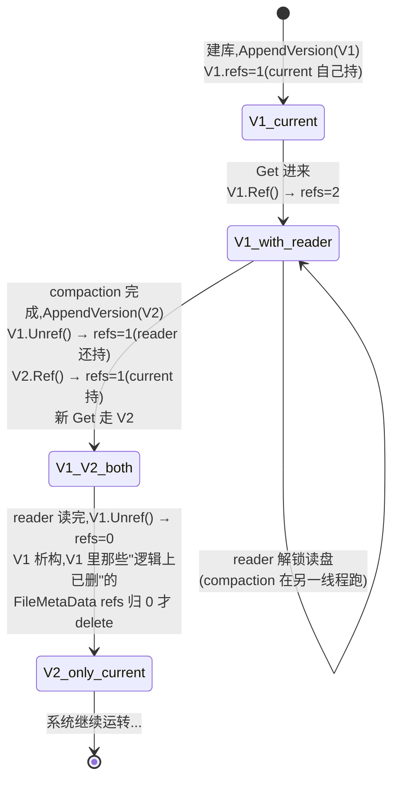

# 第十四章 · Version 与 VersionSet:层级状态机

> 篇:P4 Compaction:后台的灵魂
> 主线呼应:第 3 篇(读)讲透了"读一条 `Get` 怎么在 MemTable + Immutable + 多层 SSTable 里拼出正确结果"。但那张多层的"文件布局"是怎么来的、谁来记账、谁来保证"compaction 正在改文件布局的时候,前台的 `Get` 不被打扰、不被读到一半被删的文件"?答案就在 `Version` 和 `VersionSet`——它们是 LevelDB 后台的"状态机"。这一章是全书枢纽第 4 篇的地基:不把 Version 讲清,下一章的触发选取和再下一章的执行都没法落地。

## 核心问题

**某一刻"数据库长什么样"怎么表达?Compaction 在后台改文件布局(加新 SSTable、删旧 SSTable),而前台读 `Get` 同时在用旧布局——怎么保证读到的永远是一个自洽的、一致的快照,既不会读到一半被删的文件(use-after-free),也不会因为锁住整个库让写停摆?**

读完本章你会明白:

1. **`Version` 是什么**:它就是一张"此刻每层有哪些 SSTable 文件"的快照——`files_[0..6]`,每层一组 `FileMetaData`(每个文件一个,带 `number`/`file_size`/`smallest`/`largest`/`allowed_seeks`)。一个 Version 对象,就是数据库在某一时刻的完整文件布局。
2. **`VersionSet` 怎么管版本更替**:一个 `current_` 指针指向"当前版本",外加一个循环双向链表把所有历史 Version 串起来。compaction 产出一批新文件后,`VersionSet` 把它们写进一个**新 Version**,`AppendVersion` 原子地把 `current_` 切过去——这一刻起,新读请求看新版本,但**正在读旧版本的 reader 不受影响**。
3. **为什么"读用旧 Version、写产生新 Version"不会互斥**:靠的是 `Version` 的**引用计数**(`refs_`)。每个 reader 持一个 `Ref()` 在自己用完前不被析构;VersionSet 自己也持 current 的一个 ref;`Unref()` 到 0 才 `delete`。compaction 删掉的旧文件,只要还有 reader 持着旧 Version 的 ref,那个旧 Version 就还活着、还指向那些"逻辑上已删"的文件,reader 安然读旧文件,用完 `Unref` 才真正回收。
4. **这是"读写不互斥"的工程典范**:不是用读写锁,不是用 MVCC 的版本号链,而是用最朴素的引用计数 + 不可变对象(Version 一旦建好就不再改)——换来了"前台读永远不阻塞后台写,后台写永远不打断前台读"。这一条,是 LevelDB 并发模型的根。

> **如果一读觉得太难**:先只记住三件事——① 一个 `Version` 就是一张"每层有哪些 SSTable"的快照,建好后**只读不改**;② `current_` 指针指向当前 Version,compaction 完成后原子切到新 Version;③ 每个 reader 用 Version 前 `Ref()` 引用计数 +1,用完 `Unref()`,Version 的引用计数归 0 才析构——所以 compaction 删旧文件不会撞上正在读的 reader。剩下的细节是"这套引用计数怎么落地、凭什么 sound",可以回头再读。

---

## 14.1 一句话点破

> **`Version` 是一张不可变的"此刻文件布局"快照,`VersionSet` 用 `current_` 指针管理版本更替。Compaction 产出新文件 → 建一个新 Version → 原子切 `current_`;旧 reader 持着旧 Version 的引用计数继续读旧文件,用完 `Unref` 到 0 才析构。前台读和后台 compaction 因此互不阻塞——这是 LevelDB 并发模型的根,靠的是"引用计数 + 不可变对象"这两件最朴素的兵器。**

这是结论,不是理由。本章倒过来拆:先看"某一刻数据库长什么样"必须包含哪些信息(为什么不能只存一个文件列表),再看朴素做法会撞上什么墙,最后看 Version/VersionSet 怎么用引用计数把读写解耦。

---

## 14.2 一个 Version 要装下什么:为什么不能只存一个文件列表

### 提出问题

P0-01 我们立起了二分法,知道前台读要查 MemTable、Immutable,再查每一层的若干 SSTable。那"每一层有哪些 SSTable"这件事,LevelDB 怎么表达?

最朴素的做法:在 `DBImpl` 里挂一个 `std::vector<std::string> files_per_level[7]`,记每层有哪些 `.ldb` 文件名。读 `Get` 的时候遍历它,compaction 完成时改它(删旧文件名、加新文件名)。听起来够用了——为什么还要单独搞一个 `Version` 类?

### 不这样会怎样

光有文件名不够。读一条 `Get(k)` 要在某一层高效定位,需要这些信息:

1. **这一层有哪些文件**(文件名/编号)。
2. **每个文件的 key range 是什么**(`smallest`/`largest`)——这样 L1+ 的文件按 `smallest` 排好序后,可以二分跳过那些 key range 不重叠的文件(L0 因为文件间可能重叠,只能全部扫)。
3. **每个文件有多大**(`file_size`)——用于算层级大小是否超阈值(`MaxBytesForLevel`,下一章详讲)、用于 seek 采样换算 `allowed_seeks`。
4. **每个文件还允许被 seek 多少次就该压**(`allowed_seeks`)——这是 seek-driven compaction 的依据,本章后面讲。
5. **一个文件可能同时被多个 Version 引用**(compaction 产出新文件、旧 Version 还在被读),所以文件自己也要有引用计数。

光记文件名,以上信息要么每次都重新打开文件读 footer 取(慢到不能忍),要么散落在各处(并发难管)。所以必须把它们**聚合成一个对象**——这就是 `FileMetaData` 和 `Version`。

> **钉死这件事**:`Version` 不是"一个文件列表",它是"此刻每层每个文件的完整元数据快照"。读路径要靠这些元数据做二分、做 seek 采样;compaction 要靠它算层级大小。聚合成一个不可变对象,是后续一切(引用计数、原子切换、读不阻塞写)的前提。

---

## 14.3 FileMetaData:一个 SSTable 文件的元数据

每个 SSTable 文件在 LevelDB 里用一个 `FileMetaData` 描述,看 [`db/version_edit.h:18-27`](../leveldb/db/version_edit.h#L18-L27):

```cpp
struct FileMetaData {
  FileMetaData() : refs(0), allowed_seeks(1 << 30), file_size(0) {}

  int refs;                // 引用计数:多少个 Version 在用这个文件
  int allowed_seeks;       // 还允许被 seek 多少次就触发 compaction
  uint64_t number;         // 文件编号(文件名就是 <number>.ldb)
  uint64_t file_size;      // 文件大小(字节)
  InternalKey smallest;    // 这个文件里最小的 internal key
  InternalKey largest;     // 这个文件里最大的 internal key
};
```

六个字段,各自有它非存在不可的理由:

- **`number`**:文件编号,全局唯一递增(由 `VersionSet::NewFileNumber()` 分配,见 [version_set.h:194](../leveldb/db/version_set.h#L194))。磁盘上文件名就是 `<number>.ldb`。compaction 产出新文件前先 `NewFileNumber()` 拿一个新号。
- **`file_size`**:用于算层级总大小(`NumLevelBytes`)、算 `allowed_seeks`、做 compaction 大小预算。
- **`smallest` / `largest`**:这个文件的 key range。L1+ 的文件按 `smallest` 排好序后,`FindFile` 可以二分([version_set.cc:87-105](../leveldb/db/version_set.cc#L87-L105))——读 `Get(k)` 时跳过 `largest < k` 的文件,O(log n)。L0 因为文件间可能 key range 重叠,不能二分,只能全部扫。
- **`allowed_seeks`**:初始 `1 << 30`(一个超大数),在文件被加进 Version 时由 `Builder::Apply` 重算为 `max(100, file_size / 16384)`([version_set.cc:663-664](../leveldb/db/version_set.cc#L663-L664))。读 `Get` 命中这个文件会 `allowed_seeks--`,耗到 0 就把它标成 `file_to_compact_`,触发 seek-driven compaction。这一条的精妙理由下一章详讲。
- **`refs`**:`FileMetaData` 自己的引用计数——一个文件可能同时被多个 Version 引用(compaction 产出一个新 Version 后,旧 Version 还在被 reader 持着,它们都指向同一批 `FileMetaData`)。Version 析构时把 `files_[level]` 里每个 `FileMetaData` 的 `refs--`,归 0 才 `delete f`([version_set.cc:74-84](../leveldb/db/version_set.cc#L74-L84))。

> **钉死这件事**:`FileMetaData` 是**双重引用计数**的内层——外层是 `Version`(版本级引用计数),内层是 `FileMetaData`(文件级引用计数)。一个文件被多个 Version 引用,要等所有引用它的 Version 都析构了,`FileMetaData` 才析构。这套机制是"compaction 删旧文件、reader 还在读旧文件"能 sound 的根。

---

## 14.4 Version:一张不可变的文件布局快照

把每层一组 `FileMetaData` 装进一个对象,就是 `Version`。看 [`db/version_set.h:60-165`](../leveldb/db/version_set.h#L60-L165) 里它的核心字段:

```cpp
class Version {
 private:
  VersionSet* vset_;              // 所属的 VersionSet
  Version* next_;                 // 循环双向链表的下一个
  Version* prev_;                 // 循环双向链表的上一个
  int refs_;                      // 引用计数(核心!)

  // 每层一组文件 —— 这就是"此刻的文件布局"
  std::vector<FileMetaData*> files_[config::kNumLevels];   // kNumLevels = 7

  // seek-driven compaction 的候选
  FileMetaData* file_to_compact_;
  int file_to_compact_level_;

  // size-driven compaction 的候选(Finalize 算出来的)
  double compaction_score_;
  int compaction_level_;
  // ...
};
```

`config::kNumLevels = 7`([dbformat.h:25](../leveldb/db/dbformat.h#L25)),所以层数是 0..6,即全书常说的 L0..L6(`kMaxLevel = kNumLevels - 1 = 6`)。

`files_[7]` 是一张"每层一组文件"的表,画出来是这样:

```
 一个 Version 装的就是这样一张表(示例):
 ┌────────┬───────────────────────────────────────────────────────────────┐
 │ level  │ 文件列表(每层一组 FileMetaData*)                              │
 ├────────┼───────────────────────────────────────────────────────────────┤
 │   0    │ [f100: 'b'..'e']  [f101: 'a'..'d']  [f102: 'c'..'g']   ←可能重叠│
 │   1    │ [f50: 'a'..'c']  [f51: 'd'..'f']  [f52: 'g'..'z']      ←互不重叠│
 │   2    │ [f20: 'a'..'m']  [f21: 'n'..'z']                        ←互不重叠│
 │   3    │ [f10: 'a'..'z']                                          │
 │   4    │ []                                                       │
 │   5    │ []                                                       │
 │   6    │ []                                                       │
 └────────┴───────────────────────────────────────────────────────────────┘
 注:L0 的文件之间 key range 可能重叠(各是一次 MemTable dump);
     L1+ 的文件互不重叠,且按 smallest 排好序,可二分。
```

这张表就是"数据库此刻长什么样"。`Get(k)` 的时候,前台从 `current_->files_[level]` 拿这张表去查。

`Version` 一旦建好**就不再改**——`files_[level]` 这个 `vector` 的内容不会再增删。这是它做"不可变对象"的关键:不可变 + 引用计数 = 任意多 reader 可以无锁并发读(因为没有写,没有数据竞争)。

> **钉死这件事**:`Version` 是一个**不可变对象**。它建好之后 `files_[7]` 不再改,所以多个 reader 同时读它**不会数据竞争**——这一条是无锁读的语义前提。所有"改"都走"建新 Version、原子切 current"的路子,不原地改旧 Version。

### 14.4.1 compaction_score_ / file_to_compact_:一个 Version 还自带"下次该压哪"

注意 `Version` 还装了 `compaction_score_` / `compaction_level_`(size-driven)和 `file_to_compact_` / `file_to_compact_level_`(seek-driven)。这两个东西是"这个 Version 下次该 compact 哪一层/哪个文件"的提示,由 `Finalize` 在每次建新 Version 时算好(下一章详讲)。也就是说,一个 Version 不光描述"此刻长什么样",还顺手告诉你"此刻需不需要 compact、压哪里"——把状态和决策装在一个对象里,简单。

---

## 14.5 VersionSet:用 current_ 指针管版本更替

一个 `VersionSet` 管理所有的 Version,看 [`db/version_set.h:296-315`](../leveldb/db/version_set.h#L296-L315):

```cpp
class VersionSet {
 private:
  // ...
  Version dummy_versions_;              // 循环双向链表的哨兵头
  Version* current_;                    // == dummy_versions_.prev_,指向当前版本

  // 每层上次 compaction 结束的 key(轮转选取用,下一章详讲)
  std::string compact_pointer_[config::kNumLevels];
};
```

`VersionSet` 持有的核心,就一个 `current_` 指针,指向"当前正在服务的 Version"。所有 `Version` 通过 `next_/prev_` 串成一个循环双向链表,`dummy_versions_` 是哨兵头——`current_` 就是链表的尾(`dummy_versions_.prev_`),也是最新版本。看 [`db/version_set.h:310-311`](../leveldb/db/version_set.h#L310-L311) 的注释原话:

```cpp
Version dummy_versions_;  // Head of circular doubly-linked list of versions.
Version* current_;        // == dummy_versions_.prev_
```

为什么用循环双向链表 + 哨兵头?因为 Version 要频繁地"尾部插入新版本"(compaction 完成)、"任意位置删除旧版本"(引用计数归 0 时析构),循环双向链表对这两个操作都是 O(1),哨兵头让"空链表"和"非空链表"逻辑统一,不用特判。这是经典的双向链表用法。

### 14.5.1 AppendVersion:原子切 current

compaction 产出新 Version 后,要把它"切换成当前版本"。这件事在 `VersionSet::AppendVersion`,看 [`db/version_set.cc:760-775`](../leveldb/db/version_set.cc#L760-L775):

```cpp
void VersionSet::AppendVersion(Version* v) {
  // Make "v" current
  assert(v->refs_ == 0);          // 新 Version 一开始 refs 是 0
  assert(v != current_);
  if (current_ != nullptr) {
    current_->Unref();             // 旧的 current 释一个 ref
  }
  current_ = v;                    // ← 原子切换:这一行之后,新 Get 走新 Version
  v->Ref();                        // current_ 自己持一个 ref

  // Append to linked list
  v->prev_ = dummy_versions_.prev_;
  v->next_ = &dummy_versions_;
  v->prev_->next_ = v;
  v->next_->prev_ = v;
}
```

这里有几个非显然的点:

1. **新 Version 的 `refs_` 一开始是 0**(构造函数 [version_set.h:123-131](../leveldb/db/version_set.h#L123-L131) 里 `refs_(0)`)。`AppendVersion` 进来 `assert(v->refs_ == 0)`,确认它还没被引用过。
2. **`current_ = v` 这一行就是"原子切换"**。这一切换发生在 `DBImpl::mutex_` 保护下(`AppendVersion` 的调用方 `LogAndApply` 持着 `mu`,见 [version_set.h:181-182](../leveldb/db/version_set.h#L181-L182))——所以"切 current"和"前台读 current"之间靠 `mutex_` 互斥。但一旦切完,**新读请求拿到的是新 Version,旧 reader 持的还是旧 Version 的 ref,两者互不干扰**。
3. **`v->Ref()` 让 current 自己持一个 ref**。这个 ref 在两种情况下会释:① 下次 `AppendVersion` 切到更新的 Version 时,旧 current 的 `current_->Unref()`(就在函数开头);② `VersionSet` 析构时 `current_->Unref()`([version_set.cc:754](../leveldb/db/version_set.cc#L754))。

> **钉死这件事**:`AppendVersion` 不是"把新 Version 加进链表"那么简单,它做的是"**把 current 指针原子切到新 Version**"——这一刻是版本更替的边界。切完之后,新进来的 `Get` 拿新 Version,正在跑的旧 `Get` 还持着旧 Version 的 ref,两不相干。这就是"读写不互斥"的根。

### 14.5.2 LogAndApply:compaction 完成后怎么建新 Version

compaction 完成时(`DoCompactionWork` 之后)调 `VersionSet::LogAndApply`,这是"建新 Version + 切 current"的完整入口。看 [`db/version_set.cc:777-798`](../leveldb/db/version_set.cc#L777-L798):

```cpp
Status VersionSet::LogAndApply(VersionEdit* edit, port::Mutex* mu) {
  // ... 设置 log_number、next_file_number、last_sequence ...

  Version* v = new Version(this);            // ← 建一个全新的空 Version
  {
    Builder builder(this, current_);          // 以 current_ 为基底
    builder.Apply(edit);                      // 把 edit(增删文件)apply 上去
    builder.SaveTo(v);                        // 把结果存进 v
  }
  Finalize(v);                                // 算 v 的 compaction_score_ 等

  // ... 把 edit 追加到 MANIFEST 日志(持久化,下一章/第 5 篇详讲)...

  LogAndApply 的最后会调用 AppendVersion(v);  // 把 v 切成 current
  return Status::OK();
}
```

`VersionEdit` 是一个"增量编辑"——记录"这次加了哪些文件、删了哪些文件、改了哪些 compaction 指针"。compaction 完成后,产生的 `VersionEdit`(加新产出的 SSTable、删旧的输入文件)被 `LogAndApply` 应用到当前 Version 上,得到新 Version。

注意"**增量编辑 + 基底 apply**"这种模式:不原地改 current_(那会破坏"Version 不可变"的语义),而是**用 current_ 当基底、apply 增量、得到新 Version**。`Builder` 类([version_set.cc:570-727](../leveldb/db/version_set.cc#L570-L727))做这件事,它内部把"加哪些文件、删哪些文件"先暂存,最后 `SaveTo(v)` 一次性拼出新 Version 的 `files_[7]`。这种"不可变 + 增量编辑产生新版本"的模式,和 Git 的 commit 链、CRDT 是同一种思路——避免原地改,所有"变"都通过"产生新版本"表达。

`Finalize(v)` 顺手算好新 Version 的 `compaction_score_/level_`,见 [`db/version_set.cc:1031-1067`](../leveldb/db/version_set.cc#L1031-L1067):

```cpp
void VersionSet::Finalize(Version* v) {
  int best_level = -1;
  double best_score = -1;

  for (int level = 0; level < config::kNumLevels - 1; level++) {  // 注意:不扫 L6
    double score;
    if (level == 0) {
      // L0 用文件数 / kL0_CompactionTrigger 算 score
      score = v->files_[level].size() /
              static_cast<double>(config::kL0_CompactionTrigger);   // = files/4
    } else {
      // L1+ 用层级总大小 / MaxBytesForLevel(level) 算 score
      const uint64_t level_bytes = TotalFileSize(v->files_[level]);
      score =
          static_cast<double>(level_bytes) / MaxBytesForLevel(options_, level);
    }

    if (score > best_score) {
      best_level = level;
      best_score = score;
    }
  }

  v->compaction_level_ = best_level;     // 记下"该压哪层"
  v->compaction_score_ = best_score;     // 记下"该层的 score"
}
```

`compaction_score_ >= 1` 就意味着这层"超标了该压"(L0 文件数 ≥ 4,或 L1+ 总大小 ≥ MaxBytesForLevel)。`NeedsCompaction()` 就是查这个([version_set.h:252-255](../leveldb/db/version_set.h#L252-L255)):

```cpp
bool NeedsCompaction() const {
  Version* v = current_;
  return (v->compaction_score_ >= 1) || (v->file_to_compact_ != nullptr);
}
```

——这就把"是否需要 compact"的判断退化成"看 current Version 上两个标量"。下一章 P4-15 会详讲这两个 score 怎么驱动触发与选取。

---

## 14.6 引用计数:读用旧 Version、写产生新 Version 的根

这一节是本章的灵魂。我们把 Version 的引用计数(`refs_`)从头到尾讲透,讲清"凭什么 use-after-free 不会发生、凭什么读写互不阻塞"。

### 14.6.1 Ref / Unref:两个四行函数

引用计数的实现简单得不像话,看 [`db/version_set.cc:453-462`](../leveldb/db/version_set.cc#L453-L462):

```cpp
void Version::Ref() {
  ++refs_;
}

void Version::Unref() {
  assert(this != &vset_->dummy_versions_);   // 哨兵头不能 Unref
  assert(refs_ >= 1);
  --refs_;
  if (refs_ == 0) {
    delete this;                              // 归 0 才析构
  }
}
```

`Ref()` 就是 `++refs_`,`Unref()` 就是 `--refs_; if (refs_ == 0) delete this`。**整个引用计数机制就是这两个四行函数**。

那为什么这么简单的东西能做到"读写不互斥"?关键在于"**谁在什么时机 Ref/Unref**"。

### 14.6.2 谁会持 Version 的 ref

我们逐一列出 LevelDB 源码里所有 Ref/Unref Version 的地方:

**1. VersionSet 自己持 current 的一个 ref。**

在 `AppendVersion` 里,新 Version 被切成 current 时 `v->Ref()`([version_set.cc:768](../leveldb/db/version_set.cc#L768))。这个 ref 代表"我是当前版本"。它会在两种时机释放:① 下次 `AppendVersion` 切到更新版本时,旧 current `current_->Unref()`([version_set.cc:765](../leveldb/db/version_set.cc#L765));② `VersionSet` 析构时 `current_->Unref()`([version_set.cc:754](../leveldb/db/version_set.cc#L754))。

**2. 前台读 `DBImpl::Get` 持一个 ref,用完释放。**

看 [`db/db_impl.cc:1121-1164`](../leveldb/db/db_impl.cc#L1121-L1164) 的 `Get`:

```cpp
Status DBImpl::Get(const ReadOptions& options, const Slice& key,
                   std::string* value) {
  // ...
  MutexLock l(&mutex_);                       // 持锁
  // ...
  Version* current = versions_->current();
  mem->Ref();
  if (imm != nullptr) imm->Ref();
  current->Ref();                             // ← 持 current 一个 ref

  // ... 解锁,真的去读盘(读盘期间不持锁,让写能进)...
  {
    mutex_.Unlock();
    // ... 在 current 上查 Get ...
    mutex_.Lock();
  }

  // ... 用完了 ...
  mem->Unref();
  if (imm != nullptr) imm->Unref();
  current->Unref();                           // ← 释放 current 的 ref
  // ...
}
```

`Get` 拿到 current 之后立刻 `current->Ref()`,然后才**解锁去读盘**(读盘期间不持 `mutex_`,让其他写能进)。读盘这一段时间里,即便后台 compaction 完成了 `AppendVersion` 把 current 切到了新 Version,**这个 reader 持的旧 Version 的 ref 还在,旧 Version 不会被析构,旧 Version 指向的那些 SSTable 文件(`FileMetaData`)也不会被删**。reader 安然读完,最后 `current->Unref()`,旧 Version 的 refs 才有可能归 0。

**3. 前台迭代器(`NewIterator`)持一个 ref,迭代器析构时释放。**

看 [`db/db_impl.cc:1097-1107`](../leveldb/db/db_impl.cc#L1097-L1107):

```cpp
versions_->current()->AddIterators(options, &list);
Iterator* internal_iter =
    NewMergingIterator(&internal_comparator_, &list[0], list.size());
versions_->current()->Ref();                  // ← 持 current 一个 ref

IterState* cleanup = new IterState(&mutex_, mem_, imm_, versions_->current());
internal_iter->RegisterCleanup(CleanupIteratorState, cleanup, nullptr);
```

迭代器要走多个 SSTable,可能要花很长时间(用户慢慢迭代)。`Ref()` 之后,即便用户迭代期间 compaction 切了好几次 Version,这个迭代器持的旧 Version 永远活着。等用户用完迭代器、`delete iter` 时,触发的 cleanup 函数 `CleanupIteratorState` 会 `Unref` 掉它(见 [db_impl.cc](../leveldb/db/db_impl.cc) 里 `CleanupIteratorState` 的实现)。

**4. 后台 compaction 持一个它启动时的 input_version_ 的 ref,compaction 结束才释放。**

看 `PickCompaction` 里 [`db/version_set.cc:1287-1288`](../leveldb/db/version_set.cc#L1287-L1288):

```cpp
c->input_version_ = current_;
c->input_version_->Ref();                     // ← compaction 持 input version 一个 ref
```

为什么 compaction 也要持 ref?因为 compaction 是个慢活(归并、写新文件,可能几秒)。这几秒里,可能**有别的 compaction 同时跑完、切了新 Version**,那么 compaction 启动时的 input Version 就不再是 current 了——但 compaction 还在用它(它列出了哪些文件要合并)。持一个 ref,保证这个 input Version 在 compaction 结束前不被析构。compaction 结束时 `Compaction::ReleaseInputs` 调 `input_version_->Unref()`([version_set.cc:1562-1567](../leveldb/db/version_set.cc#L1562-L1567))。

### 14.6.3 引用计数怎么让读写不互斥:一张状态图

把上面这些放到一张图里,看一次"compaction 切 Version、reader 读旧 Version"的完整时序:



注意 V1_V2_both 这一态——**V1 和 V2 同时活着,各持各的 ref,各描述各的文件布局**。新 `Get` 走 V2(它看到了 compaction 产出的新文件、不再列已删的旧文件),旧 reader 走 V1(它看到的是 compaction 前的布局,包括那些"V2 视角里已删"但物理还在的旧文件)。旧 reader 读完 `Unref` 让 V1 的 refs 归 0,V1 析构触发它持有的那些 `FileMetaData` 的 `refs--`,归 0 的才真 `delete`(那些文件此时已经没有任何 Version 引用,物理删除安全)。

> **钉死这件事**:这就是"前台读不被后台 compaction 打扰"的**字面机制**。不是读写锁、不是 MVCC 版本链,就是**最朴素的引用计数 + Version 不可变**。一个 Version 一旦被某个 reader 持了 ref,它就保证活着、保证指向的 `FileMetaData` 不会被回收;compaction 产出的新 Version 通过原子切 current 来"接管"新读请求;旧 reader 用完自然 `Unref`,旧 Version 自然析构。整个过程没有任何一处"读阻塞写"或"写阻塞读"。

---

## 14.7 不这样会怎样:两个朴素反面

把反面摆出来,Version 引用计数 + 不可变对象的妙处才显形。

### 反面 A:读时锁住整个库不让 compaction 改(读阻塞写)

最朴素的做法:`Get` 期间持一把"全局读锁",禁止 compaction 改文件布局。这不就保证一致性了吗?

> **反面对比(全局读锁版)**:`Get` 进来,持 `mutex_`(或者一把专门的 `rwlock_` 的读锁),读完才释。compaction 改文件布局要先拿写锁,被 `Get` 阻塞——而 `Get` 要读盘(~毫秒级),这段时间 compaction 干等。反过来,写路径 `Write` 也要拿 `mutex_` 更新 memtable,被持锁的 `Get` 拖慢。整个系统的吞吐被"全局锁 + 读盘慢"死死卡住,前台和后台互相打架。这正是 LevelDB 极力避免的——它**只在关键路径上短暂持 `mutex_`**(拿 current、Ref),读完盘再回锁里 Unref,读盘期间不持锁,让 compaction/写都能进。

### 反面 B:读时不持引用,compaction 删旧文件 → use-after-free

另一个朴素做法:不搞引用计数,`Get` 直接拿 `current_` 的裸指针就去读,读完不管。compaction 完成时直接 `delete` 旧 Version、删除旧 SSTable 文件。

> **反面对比(裸指针版)**:`Get` 拿了 `current_`(= V1)的裸指针,解锁去读盘。此时 compaction 完成,`AppendVersion(V2)` 把 V1 析构、把 V1 里那些"已删"的 SSTable 文件物理删除。`Get` 在读盘途中,它正打开的那个 `.ldb` 文件被 OS 删(POSIX 下文件可以 unlink 但已打开的 fd 还能用,Windows 下则直接失败)——读到一半读到错误,或者读到不可预测的字节,典型的 **use-after-free / 读取半途失效**。

**反面 B 的 Windows 版尤其惨**:Windows 不允许 delete 一个还被 open 的文件,所以 LevelDB 在 Windows 上删除文件前还要小心翼翼地先关掉所有缓存里的 fd(`table_cache` 里持有 fd)——如果没有引用计数担保"没人再用旧 Version",根本无法安全删除。

> **所以这样设计**:引用计数 + 不可变 Version,把"一致性快照"和"安全回收"两件事一并解决:① reader 持 ref 就保证 Version 活着、文件不被删(一致性);② reader 用完 Unref,Version 引用计数归 0 才析构,文件级引用计数再归 0 才物理删除(安全回收)。整个过程读写不互斥,没有 use-after-free。这是"用引用计数换读写不互斥"的工程典范。

---

## 14.8 一个 Version 的生老病死:完整生命周期

把前面讲的串起来,看一个 Version 从生到死的完整轨迹:

1. **诞生**:`VersionSet::LogAndApply` 里 `Version* v = new Version(this)`([version_set.cc:792](../leveldb/db/version_set.cc#L792))。`refs_ = 0`,空的 `files_[7]`。
2. **填充**:`Builder builder(this, current_); builder.Apply(edit); builder.SaveTo(v);`——以 current_ 为基底,应用 VersionEdit(增删文件),拼出 v 的 `files_[7]`。同时 `Finalize(v)` 算好 `compaction_score_/level_`。
3. **被切成 current**:`AppendVersion(v)` → `current_ = v; v->Ref()` → `refs_ = 1`。从这一刻起,新 `Get` 走 v。
4. **被 reader 引用**:`DBImpl::Get` 里 `current->Ref()` → `refs_ = 2`(或更高,多个 reader 并发)。
5. **被迭代器引用**:`NewIterator` 里 `current->Ref()`。
6. **被自己启动的 compaction 引用**:`PickCompaction` 里 `c->input_version_ = current_; c->input_version_->Ref()`。
7. **退位**:下一次 `LogAndApply` 切新 Version,`AppendVersion` 里 `current_->Unref()`(旧 current 的 refs 减 1)。但只要还有 reader/iterator/compaction 持着 ref,旧 Version 就还活着,旧 reader 继续读旧文件布局。
8. **死亡**:所有 reader/iterator/compaction 用完 `Unref`,加上 current 这个 ref 也被释(退位时),`refs_` 归 0,`Unref` 里 `delete this`。`~Version()` 把 `files_[7]` 里每个 `FileMetaData` 的 `refs--`,归 0 的 `delete f`。

这就是一个 Version 的一生。整个 LevelDB 运转期间,会有成百上千个 Version 经历这个循环——每次 compaction 完成、每次 MemTable dump 完成都会产生一个新 Version。

---

## 14.9 技巧精解:Version 引用计数 + 整体可见性(原子切换)

这一章的技巧精解,我们挑全书最硬核的一个:**Version 的引用计数 + Version 的整体可见性(原子切换)**。它是"前台读不被后台 compaction 打扰"的字面根,也是 LevelDB 并发模型的精髓。

### 这个技巧在做什么

让任意多个 reader 可以**并发读**一个 Version,同时让后台 compaction 可以**自由地产生新 Version 并切换**,两者互不阻塞。reader 看到的永远是一个**自洽、一致**的文件布局快照,compaction 产生的"新文件布局"在一切就绪后**原子地**对 reader 可见。

### 用了什么手段

**两个手段叠加:**

**手段 1:Version 不可变。** 一个 Version 建好后 `files_[7]` 不再改。所有"改"都走"建新 Version"。不可变带来一个直接后果:**多个 reader 并发读同一个 Version,没有数据竞争**(因为没有写)。这是无锁读的语义前提。

**手段 2:引用计数 `refs_`。** `Ref()` 是 `++refs_`,`Unref()` 是 `--refs_; if(refs_==0) delete this`。reader/iterator/compaction 用 Version 前 Ref,用完 Unref。VersionSet 自己也持 current 一个 ref。

**手段 3:整体可见性 = 原子切 current_。** `AppendVersion` 里 `current_ = v` 这一行是版本切换的边界,发生在 `mutex_` 保护下。切之前新 `Get` 拿旧 Version,切之后拿新 Version——**任何 reader 看到的要么完全是旧布局,要么完全是新布局,绝不会看到"一半新一半旧"的撕裂状态**。这叫**整体可见性**——Version 是切换的最小单位,内部不会被部分观测。

### 为什么 sound(凭什么不会 use-after-free)

我们来逐条证明"compaction 删旧文件撞上 reader 读旧文件"这个看似危险的场景,凭什么不会出问题:

1. **reader 持 ref → Version 不会析构**。`Get` 在持锁段做 `current->Ref()`,这一刻 refs 至少是 2(VersionSet 持 1 + reader 持 1)。reader 解锁去读盘,这一段时间里 compaction 即便跑完 `AppendVersion` 切新 Version,旧 current 的 refs 减 1(VersionSet 那个 ref 释放),但 reader 那个 ref 还在,refs ≥ 1,旧 Version **不会析构**。
2. **Version 不析构 → 它指向的 FileMetaData 不会全被删**。`~Version()` 才会 `files_[level][i]->refs--`。Version 没析构,`FileMetaData` 的 refs 不会减。
3. **FileMetaData 不析构 → 物理文件不被 `RemoveObsoleteFiles` 删**。`RemoveObsoleteFiles`(P0-01 提过)在每次 compaction 结束后跑,它会列出所有"被任何 live Version 引用的文件号"(`AddLiveFiles`,[version_set.cc:1149-1159](../leveldb/db/version_set.cc#L1149-L1159)),只删那些**没有任何 Version 引用**的文件。旧 reader 持的旧 Version 还引用着旧文件号,这些文件就不会被删。
4. **reader 读完 Unref** → 旧 Version refs 减 1。如果这时旧 Version 已经退位(VersionSet 那个 ref 已释)、又没有别的 reader 持 ref,refs 归 0,旧 Version 析构,它持有的 `FileMetaData` refs 减 1。如果这个 `FileMetaData` 在新 Version 里也不存在了(被 compaction 删了),它的 refs 也归 0,`delete f`。**到这一刻,物理文件才真正可删**——下一次 `RemoveObsoleteFiles` 跑时,这个文件号不再被任何 live Version 引用,才被磁盘删除。

整个链条严丝合缝:**reader 持 ref 担保 Version 活着 → Version 活着担保 FileMetaData 活着 → FileMetaData 活着担保文件不被物理删**。没有任何一处"reader 还在读但文件被删"的窗口。

> **钉死这件事**:LevelDB 没有"读写锁",它用的是**比读写锁更便宜**的引用计数 + 不可变对象。读写锁的问题是:写者要等所有 reader 释放读锁才能写(reader 多时写饿死),且读锁的获取/释放是原子操作有 cache-line 弹跳。引用计数方案下:reader 走 `++refs_`(纳秒),写者(compaction)永远不等 reader——它直接产生新 Version,旧 Version 留给 reader 用完自然回收。**写的吞吐不被 reader 数量拖累,读的吞吐也不被写者阻塞**。

### 反面对比:COW 链 vs 整体 Version

一种可能的"优化":不复制整个 Version,而是用 COW(Copy-on-Write)链——只复制"改了的那一层",其它层指向旧 Version 的 `files_[level]`。这样建新 Version 更省内存。

> **反面对比(COW 链版)**:省内存,但引入了"部分共享"的复杂度——旧 Version 析构时,它和 new Version 共享的 `files_[level]` 不能简单 delete,要判断"是不是还有别的 Version 在用"。LevelDB 选择了**简单优先**:每次 `Builder::SaveTo(v)` 把所有 7 层都重新拼一遍(虽然大部分是直接拷指针,不拷字节),新 Version 完整拥有自己的 `files_[7]`(每个元素是 `FileMetaData*`,通过文件级引用计数共享)。这样旧 Version 析构时只需把自己持有的 `FileMetaData*` 的 refs 减 1,不用关心别的 Version。这是 LevelDB 一贯的"一把大锁换简单"哲学——**宁可在引用计数上付一点代价,也不引入 COW 共享带来的析构复杂度**。

### 反面对比:读写锁(RWLock)版

> **反面对比(读写锁版)**:假设 LevelDB 用一把 `std::shared_mutex`,`Get` 持 shared lock,compaction 持 exclusive lock。问题:① 读盘是毫秒级操作,持 shared lock 这么久,compaction 想 exclusive 要等所有 reader 释放——**reader 多时 compaction 饿死**,L0 文件堆积触发不了压,读放大雪崩;② shared_mutex 的实现通常有原子计数器 + 可能的内核态切换,比 `++refs_`(一条普通指令)贵得多。引用计数方案彻底回避了这两个问题。

> **钉死这件事**:Version 引用计数 + 整体可见性,是 LevelDB "读写不互斥"哲学的工程典范。它用最朴素的两个四行函数(`Ref`/`Unref`)+ 不可变对象 + 一把短锁,换来了:① reader 永远不阻塞 compaction;② compaction 永远不阻塞 reader;③ reader 看到的永远是自洽的快照。这是 LevelDB 并发模型的根,也是为什么它叫"LSM"——后台慢慢收拾(compact),前台读用旧版本照常工作。

---

## 章末小结

这一章是第 4 篇(Compaction)的地基。我们没有讲 compaction 本身怎么触发、怎么执行,但讲清了 compaction 的**舞台**:Version 和 VersionSet。

1. **`FileMetaData`**:一个 SSTable 文件的元数据(number/file_size/smallest/largest/allowed_seeks/refs),双重引用计数的内层。
2. **`Version`**:一张"此刻每层有哪些 SSTable"的**不可变**快照,自带"下次该压哪"的 score。建好后不再改,所有"变"走"建新 Version"。
3. **`VersionSet`**:用 `current_` 指针管版本更替,Version 通过 `next_/prev_` 串成循环双向链表。compaction 完成后 `LogAndApply` → `AppendVersion` 原子切 current。
4. **引用计数 `refs_`**:VersionSet 持 current 一个 ref,每个 reader/iterator/compaction 用前 Ref 用完 Unref,归 0 才析构。这套机制让"读用旧 Version、写产生新 Version"互不阻塞——这是"前台读不被后台 compaction 打扰"的字面根。

回到主线:这一章全部属于**后台**(Compaction 的舞台与版本管理)。Version 是 compaction 改文件布局的目标,VersionSet 是版本更替的管理者。第 3 篇讲的读路径,正是基于"reader 持 current 的 ref 去读 files_[7]"——本章把"这个 ref 怎么保证 reader 不被打扰"讲透了。

### 五个"为什么"清单

1. **为什么 LevelDB 要单独搞 Version 类,不直接在 DBImpl 里存一个文件列表?** 光文件名不够。读 `Get` 要每层每个文件的 key range 做二分、要 file_size 算层级大小、要 allowed_seeks 做 seek 采样。把这些聚合进 `FileMetaData`、再把每层一组聚合进 `Version`,才有"完整文件布局快照"。而且 Version 是不可变对象,reader 并发读无数据竞争。
2. **为什么 Version 一旦建好就不改?** 不可变 = 多 reader 并发读无数据竞争。所有"改"(加新文件、删旧文件)走"建新 Version、原子切 current"。这就是"读写不互斥"的语义前提。
3. **`AppendVersion` 里 `current_ = v` 这一行是什么意义?** 它是版本切换的**原子边界**,在 `mutex_` 保护下。这一刻前新 `Get` 拿旧 Version,这一刻后拿新 Version——任何 reader 看到的要么完全是旧布局,要么完全是新布局,不会"一半新一半旧"。
4. **为什么 reader 要 `current->Ref()`?** reader 要解锁去读盘(读盘期间不持 `mutex_`,让写能进)。读盘这几毫秒里,compaction 可能跑完切了新 Version。如果 reader 不持 ref,旧 Version 可能被析构、旧文件被物理删,reader 读到一半 use-after-free。持 ref 担保旧 Version 活着,旧文件不被删。
5. **为什么用引用计数不用读写锁?** 读写锁会让 compaction 的写锁等所有 reader 释放(reader 多时 compaction 饿死,触发不了压,读放大雪崩)。引用计数方案下,compaction 永远不等 reader——直接产生新 Version,旧 Version 留给 reader 用完回收。**写的吞吐不被 reader 数量拖累**。

### 想继续深入往哪钻

- `Version` 的 `Get` 怎么用 `files_[7]` 在每一层定位 key、做二分剪枝,见 [version_set.cc:225-280](../leveldb/db/version_set.cc#L225-L280) 的 `Version::ForEachOverlapping`。第 13 章 P3-13 读路径全流程已详讲。
- `VersionEdit` 怎么编码进 MANIFEST 日志持久化,见 [version_edit.cc](../leveldb/db/version_edit.cc)。第 18 章 P5-18 Manifest 与崩溃恢复会详讲。
- `Version` 析构时怎么联动 `FileMetaData` 的文件级引用计数,见 [version_set.cc:67-85](../leveldb/db/version_set.cc#L67-L85) 的 `~Version()`。
- RocksDB 在这套 Version 机制上做了什么演进(ColumnFamily 让多个 CF 共享 VersionSet、SnapshotList 让快照挂进 Version)——附录 B 会提到。

### 引出下一章

Version 表达了"当前文件布局",VersionSet 管好了版本更替。但还有两个问题没回答:① **compaction 什么时候触发**?——我们已经看到 `compaction_score_` 和 `file_to_compact_` 这两个提示,但它们是怎么算出来的、阈值是多少、还有什么触发条件(seek 采样、manual compaction)?② **compaction 选哪些文件去压**?——`PickCompaction` 怎么在"该压的那层"里挑一个文件、凭什么轮转、为什么 L0 特殊?下一章 P4-15,我们钻进 compaction 的触发与选取,讲清"何时压、压谁"的全部规则,以及那个贯穿 LSM 设计的 10x 层级约束。
