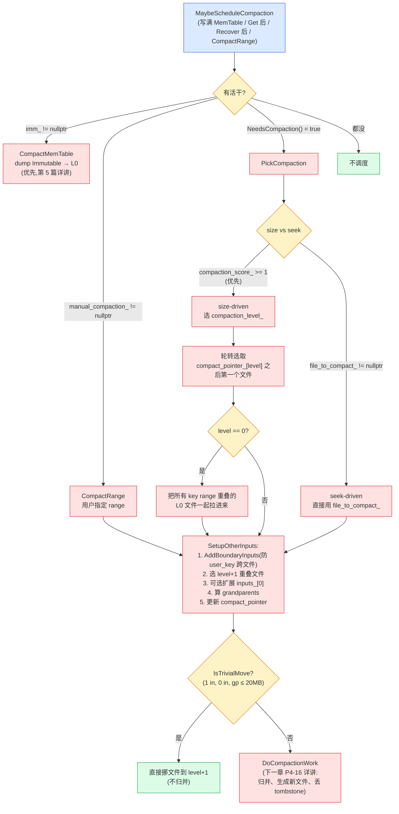

# 第十五章 · Compaction 的触发与选取

> 篇:P4 Compaction:后台的灵魂
> 主线呼应:上一章 P4-14 讲清了 compaction 的舞台——`Version` 描述"此刻文件布局",`VersionSet` 管版本更替。本章回答接下来的两个问题:**compaction 什么时候触发**、**触发后选哪些文件去压**。这一章是全书心脏——LSM 三笔放大(读/写/空间)的收敛全靠 compaction,而 compaction 的"触发条件"和"选取策略"决定了这套收敛在"放大之间"标定的平衡点。理解这一章,你就理解了 LevelDB 为什么是"10 倍层级"、为什么"轮转选取",以及那个工程上反复出现的金句——**"每层是下层的 ~1/10,总写放大 ≈ 10"** 的来历。

## 核心问题

**Compaction 是 LSM 把三笔放大收敛回来的唯一手段,但什么时候该启动它?启动后又该挑哪些文件去压?这两个问题的答案,决定了一台 LevelDB 在"读放大 / 写放大 / 空间放大"三角之间的平衡点:触发太松则堆积、读放大爆炸;触发太紧则反复重写、写放大爆炸;选取不公平则某段 key 反复压、写放大局部爆炸。本章讲透 LevelDB 的四条触发规则、轮转选取策略、L0 的特殊性,以及那个贯穿 LSM 设计的 10x 层级约束。**

读完本章你会明白:

1. **何时触发**:`MaybeScheduleCompaction` 综合四类条件——① Immutable MemTable 等 dump(`imm_ != nullptr`);② 某 L0 文件数 ≥ `kL0_CompactionTrigger`(4)或某 L1+ 层总大小 ≥ `MaxBytesForLevel`(size-driven,score 取最大那层);③ 用户主动调 `CompactRange`(manual);④ 某文件的 `allowed_seeks` 被读 `Get` 采样耗尽(seek-driven,热点文件优先压)。
2. **选哪些文件压**:`PickCompaction` 优先做 size-driven——在 score 最大的那层,用**轮转策略**(记住每层上次 compaction 结束的 key `compact_pointer_[level]`),从该 key 之后选第一个文件,绕回 key 空间开头,公平覆盖整个 key 空间,避免某段 key 反复压。
3. **L0 为什么特殊**:L0 文件之间 key range 可能重叠(各是一次 MemTable dump),所以 L0 compaction 要把**所有与目标重叠的 L0 文件一起**压进 L1——`GetOverlappingInputs` 在 L0 上会扩展搜索范围,直到没有新重叠。
4. **10x 层级约束**的数学:`MaxBytesForLevel(L)` 从 L1 的 10MB 起,每层 ×10(L2=100MB,……,L6=1TB)。10 倍是"层数(影响读放大)"和"单层大小(影响一次 compaction 量)"的权衡点——总写放大 ≈ 10×层数,层数受 `kNumLevels = 7` 限制在 ~6 层,所以 worst-case 写放大 ~50×。这个数字和 `doc/impl.md` 里 "compaction worst case 读 26MB 写 26MB" 的算账完全自洽。

> **如果一读觉得太难**:先只记住三件事——① compaction 由 size-driven(某层超标)主导,辅以 seek-driven(读采样耗尽 allowed_seeks)和 manual(`CompactRange`);② size-driven 在超标最严重的那层选文件,用 `compact_pointer_[level]` **轮转**,从上次结束的 key 之后选第一个,公平覆盖 key 空间;③ L1+ 每层大小上限 `MaxBytesForLevel(L) = 10^L MB`(L1=10MB,……),L0 看文件数(≥4 触发)——这就是"10 倍层级",它让写放大可控。剩下的细节是"这些规则怎么落地、有什么反例",可以回头再读。

---

## 15.1 一句话点破

> **Compaction 触发的根是"放大超标"——L0 文件太多、L1+ 层太大、某文件被 seek 太多次、或用户主动调;选文件压的根是"轮转"——记住每层上次压到哪个 key,这次从它之后选第一个,公平覆盖整个 key 空间。L0 因为文件间可能重叠,要一起压;L1+ 每层 10 倍于上层,让写放大 ≈ 10×层数被 `kNumLevels=7` 限制在可控范围。**

这是结论,不是理由。本章倒过来拆:先看 compaction 触发要回答什么问题,再看朴素做法会撞上什么墙,然后逐条拆 LevelDB 的四类触发 + 轮转选取 + L0 特殊 + 10x 约束。

---

## 15.2 触发要回答的问题:何时动手

### 提出问题

compaction 是个慢活(归并、写新文件,可能几秒)。后台线程只有一个(默认),所以 compaction 是串行的——一次跑一个。那"什么时候启动一个新的 compaction"这个问题,直接决定了 LSM 三笔放大的收敛节奏:

- **触发太松**(很少 compact):SSTable 文件越堆越多,L0 文件几十个、L1+ 层超大。读一条 `Get` 要扫几十个 L0 文件、归并几十路——**读放大爆炸**。旧版本、墓碑清理不及时——**空间放大爆炸**。
- **触发太紧**(不停地 compact):同一条数据被反复重写,L0→L1 一遍,L1→L2 又一遍……**写放大爆炸**,磁盘 I/O 被后台吃光,反而拖累前台写。

所以触发条件要在"太松"和"太紧"之间找平衡点。这个平衡点是什么?

### 不这样会怎样

**朴素方案 A:时间驱动,每秒 compact 一次。** 问题:写入速率是变化的——空载时空跑,高峰期追不上。空载时浪费 I/O,高峰期追不上读放大堆积。

**朴素方案 B:大小驱动,整个 DB 总大小超过某阈值就 compact。** 问题:整库大小阈值无法反映"哪一层堆积"。可能 L0 堆了 100 个文件(读放大严重),但总大小没超阈值,不 compact——读路径崩。

**朴素方案 C:只看 L0 文件数,L0 满 4 个就 compact,L1+ 永不主动 compact。** 问题:L1 不主动 compact,L0→L1 一直堆,L1 文件越积越多,L1 内部某个 key 被改了 1000 次的旧版本永远在那——空间放大爆炸。

> **钉死这件事**:compaction 触发必须是**多层、多条件**的——既要看 L0(防止 L0 堆积读放大),又要看 L1+(防止深层堆积空间放大),还要有"热点文件优先压"的机制(seek-driven),还要给用户一个手动入口(manual)。LevelDB 的四条触发规则,正是这套"多条件"的设计。

---

## 15.3 MaybeScheduleCompaction:四个触发条件汇总

compaction 的调度入口是 `DBImpl::MaybeScheduleCompaction`,看 [`db/db_impl.cc:668-683`](../leveldb/db/db_impl.cc#L668-L683):

```cpp
void DBImpl::MaybeScheduleCompaction() {
  mutex_.AssertHeld();
  if (background_compaction_scheduled_) {
    // 已经有一个 compaction 在跑,不再调度
  } else if (shutting_down_.load(std::memory_order_acquire)) {
    // DB 正在关闭
  } else if (!bg_error_.ok()) {
    // 已经出过错,不再做任何变更
  } else if (imm_ == nullptr && manual_compaction_ == nullptr &&
             !versions_->NeedsCompaction()) {
    // 没活干:没有 imm 要 dump、没有 manual、也不 NeedsCompaction
  } else {
    background_compaction_scheduled_ = true;
    env_->Schedule(&DBImpl::BGWork, this);              // ← 调度后台线程跑
  }
}
```

整个函数就一句话:**只要"有活干"就调度一个后台 compaction**。"有活干"的判断被浓缩成三个条件的或:

1. `imm_ != nullptr`——有 Immutable MemTable 等 dump(前台写满 MemTable 后冻结成 imm,要后台 dump 成 L0 SSTable)。
2. `manual_compaction_ != nullptr`——用户调了 `CompactRange` 主动请求。
3. `versions_->NeedsCompaction()`——size-driven 或 seek-driven 触发。

第三条 `NeedsCompaction()` 上一章点过,看 [`db/version_set.h:252-255`](../leveldb/db/version_set.h#L252-L255):

```cpp
bool NeedsCompaction() const {
  Version* v = current_;
  return (v->compaction_score_ >= 1) || (v->file_to_compact_ != nullptr);
}
```

就是看 current Version 上两个标量——`compaction_score_ >= 1`(size-driven,某层超标)或 `file_to_compact_ != nullptr`(seek-driven,某文件被读采样耗尽)。这两个标量在 `Finalize`/`UpdateStats` 里维护,上一章已讲。

注意 `MaybeScheduleCompaction` 只决定"**要不要调度**",真正的"选哪些文件、压哪一层"在后台线程的 `BackgroundCompaction` 里。调度入口本身很简单——这个简单是有意为之,所有触发条件的复杂度都被装进了 `NeedsCompaction()` 这个布尔,以及 `current` Version 上的两个标量。

### 15.3.1 谁会调用 MaybeScheduleCompaction

`MaybeScheduleCompaction` 在多个时机被调用,基本覆盖了所有"可能需要 compact"的时刻:

- **写路径 `MakeRoomForWrite`**:写满 MemTable 切新 MemTable 时,会调 `MaybeScheduleCompaction` 触发 imm dump。
- **`DBImpl::Get` 后**:如果 `current->UpdateStats(stats)` 返回 true(某文件 seek 采样耗尽),立刻 `MaybeScheduleCompaction`([db_impl.cc:1159-1161](../leveldb/db/db_impl.cc#L1159-L1161))——这是 seek-driven 的入口。
- **`BackgroundCall` 末尾**:`db_impl.cc:704` 一个 compaction 跑完后,会再调一次——因为一个 compaction 可能不够(比如 L0 文件太多,一次压不完),再调度下一个。
- **`CompactRange`(用户主动)**:把 `manual_compaction_` 设好,再 `MaybeScheduleCompaction`。
- **`DBImpl::Recover` 末尾**:打开 DB 恢复完,可能 WAL 重放产生了 L0 文件,顺便检查要不要 compact。

这套"多入口调一次调度"的设计,保证了 compaction 的触发不会被遗漏——任何"可能让放大超标"的事件后,都会检查一下要不要触发。

---

## 15.4 BackgroundCompaction:活儿分四类

后台线程拿到任务后跑 `BackgroundCompaction`,看 [`db/db_impl.cc:708-733`](../leveldb/db/db_impl.cc#L708-L733):

```cpp
void DBImpl::BackgroundCompaction() {
  mutex_.AssertHeld();

  if (imm_ != nullptr) {
    CompactMemTable();                  // ① 优先:dump Immutable MemTable
    return;
  }

  Compaction* c;
  bool is_manual = (manual_compaction_ != nullptr);
  if (is_manual) {
    // ② manual:用户调了 CompactRange
    ManualCompaction* m = manual_compaction_;
    c = versions_->CompactRange(m->level, m->begin, m->end);
    // ...
  } else {
    // ③ 自动:PickCompaction(size-driven 或 seek-driven)
    c = versions_->PickCompaction();
  }
  // ... 真的执行(下一章 P4-16 详讲 DoCompactionWork)...
}
```

优先级很清楚:

1. **最优先:dump Immutable MemTable**。imm 是前台写满 MemTable 后冻结的——如果不赶紧 dump,前台新写又写满 MemTable 时,就要等(见 `MakeRoomForWrite` 的 `imm_ != nullptr` 分支),写停摆。所以 compaction 第一优先是 imm。
2. **第二优先:manual compaction**(`CompactRange`)。用户主动请求,得满足。
3. **默认:size-driven 或 seek-driven**(`PickCompaction`)。

这一节我们把四类触发挨个讲。其中"dump Immutable"和真正的"compaction 合并"是两种不同的活——前者是把 MemTable 刷成 L0 SSTable,后者是把多层 SSTable 合并归并。本章讲的是后者(合并),前者会在第 5 篇崩溃恢复的 `WriteLevel0Table` 里详讲。

---

## 15.5 触发条件 1:size-driven(层级大小超标)

这是最核心的触发。上一章的 `Finalize` 算了每层的 score,L0 用文件数比 `kL0_CompactionTrigger`,L1+ 用总大小比 `MaxBytesForLevel`。我们把这两个分母讲清楚。

### 15.5.1 L0 用文件数不用大小

看 `Finalize` 里 [`db/version_set.cc:1036-1057`](../leveldb/db/version_set.cc#L1036-L1057):

```cpp
for (int level = 0; level < config::kNumLevels - 1; level++) {  // 注意:不扫 L6(L6 是最底层,不主动 compact)
  double score;
  if (level == 0) {
    // We treat level-0 specially by bounding the number of files
    // instead of number of bytes for two reasons:
    //
    // (1) With larger write-buffer sizes, it is nice not to do too
    // many level-0 compactions.
    //
    // (2) The files in level-0 are merged on every read and
    // therefore we wish to avoid too many files when the individual
    // file size is small (perhaps because of a small write-buffer
    // setting, or very high compression ratios, or lots of
    // overwrites/deletions).
    score = v->files_[level].size() /
            static_cast<double>(config::kL0_CompactionTrigger);  // files / 4
  } else {
    const uint64_t level_bytes = TotalFileSize(v->files_[level]);
    score = static_cast<double>(level_bytes) / MaxBytesForLevel(options_, level);
  }
  // ...
}
```

L0 为什么用文件数?源码注释给了两条理由:

1. **write_buffer_size 大时不想太频繁 compact**:L0 文件大小取决于 MemTable 写满的大小(`write_buffer_size` 默认 4MB)。如果 write_buffer 大(比如 64MB),L0 文件也大;按"文件数"触发(4 个)而非"总大小"触发,可以避免每次 dump 完立刻就 compact,给 L0 一个缓冲。
2. **L0 文件在每次读时都要全部归并**(因为 key range 可能重叠)——所以 L0 文件**数量**直接决定读放大,必须严格按"文件数"卡死。`kL0_CompactionTrigger = 4`([dbformat.h:28](../leveldb/db/dbformat.h#L28))。

`kL0_CompactionTrigger = 4` 这个数,是 LevelDB 在"L0 读放大"和"L0→L1 compaction 频率"之间的标定:4 个 L0 文件意味着一次读最多归并 4 路(可接受),再多读放大就上去了。

L0 还有两个相关的 trigger: `kL0_SlowdownWritesTrigger = 8`(开始给写减速)、`kL0_StopWritesTrigger = 12`(完全停写)。看 `MakeRoomForWrite` 里 [`db/db_impl.cc:1362-1365`](../leveldb/db/db_impl.cc#L1362-L1365):

```cpp
} else if (versions_->NumLevelFiles(0) >= config::kL0_StopWritesTrigger) {
  // There are too many level-0 files.
  Log(options_.info_log, "Too many L0 files; waiting...\n");
  background_work_finished_signal_.Wait();    // ← 前台写停下来等
}
```

这是 LevelDB 的**反压**机制——如果 L0 compaction 跟不上写入,L0 文件越积越多,到 12 个时干脆让前台写停下来等 compaction。这是 LSM 的常见痛点:`doc/impl.md` 在 "Timing" 节专门讨论了"如果用户写太快、L0 文件堆积怎么办"的三个解决方案(调大 log 切换阈值、限速、优化归并)。

### 15.5.2 L1+ 用层级总大小:MaxBytesForLevel

L1+ 文件之间互不重叠(一次 compaction 产出),按 `smallest` 排好序,读时可以二分——所以单层文件数对读放大影响小,关键看**总大小**(总大小决定该层数据量,影响"这层有多少旧版本/墓碑需要清理")。分母是 `MaxBytesForLevel(L)`,看 [`db/version_set.cc:41-52`](../leveldb/db/version_set.cc#L41-L52):

```cpp
static double MaxBytesForLevel(const Options* options, int level) {
  // Note: the result for level zero is not really used since we set
  // the level-0 compaction threshold based on number of files.

  // Result for both level-0 and level-1
  double result = 10. * 1048576.0;        // ← L0、L1 都是 10MB
  while (level > 1) {
    result *= 10;                          // ← L2 起,每层 ×10
    level--;
  }
  return result;
}
```

这里有个**容易被误导**的细节:函数名暗示"L 层 = 10^L MB",但实现里 **L0 和 L1 都是 10MB**(同一个基数),L2 才开始 ×10。所以正确的层级大小是:

| Level | MaxBytesForLevel | 备注 |
|-------|------------------|------|
| L0 | 10MB(但实际不用,看文件数) | 注释明说 "result for level zero is not really used" |
| L1 | 10MB | 起点 |
| L2 | 100MB | ×10 |
| L3 | 1GB | ×10 |
| L4 | 10GB | ×10 |
| L5 | 100GB | ×10 |
| L6 | 1TB | ×10(但 L6 是最底层,不进 Finalize 扫描) |

和 `doc/impl.md` 的描述("10MB for level-1, 100MB for level-2, ...")完全一致。L6 是最底层,只接收 compaction 输入,不主动 compact(`Finalize` 扫描 `level < kNumLevels - 1`,即只扫到 L5)。

> **钉死这件事**:`MaxBytesForLevel` 的精确语义是"L1=10MB,L2=100MB,……,每层是上一层的 10 倍"。函数名暗示 "10^L MB",但实现上 L0 和 L1 同享 10MB 基数——这是个易混点,记的时候记"L1=10MB 起步,每层 ×10"最准。

---

## 15.6 触发条件 2:seek-driven(读采样触发热点文件压实)

size-driven 是"看层级整体超标",但有时候某层整体没超标,却有个**热点文件**——它被 `Get` 反复读,每次读都要归并它一次。这种文件即使整层不大,也应该优先 compact,因为它"读一次的代价"太高。

这套机制就是 seek-driven compaction,核心是 `FileMetaData::allowed_seeks`。

### 15.6.1 allowed_seeks 的初值:文件大小 / 16KB

每个 `FileMetaData` 建好时 `allowed_seeks` 初始 `1 << 30`(超大),在 `Builder::Apply` 里被加进 Version 时重算,看 [`db/version_set.cc:644-664`](../leveldb/db/version_set.cc#L644-L664):

```cpp
// Add new files
for (size_t i = 0; i < edit->new_files_.size(); i++) {
  const int level = edit->new_files_[i].first;
  FileMetaData* f = new FileMetaData(edit->new_files_[i].second);
  f->refs = 1;

  // We arrange to automatically compact this file after
  // a certain number of seeks.  Let's assume:
  //   (1) One seek costs 10ms
  //   (2) Writing or reading 1MB costs 10ms (100MB/s)
  //   (3) A compaction of 1MB does 25MB of IO:
  //         1MB read from this level
  //         10-12MB read from next level (boundaries may be misaligned)
  //         10-12MB written to next level
  // This implies that 25 seeks cost the same as the compaction
  // of 1MB of data.  I.e., one seek costs approximately the
  // same as the compaction of 40KB of data.  We are a little
  // conservative and allow approximately one seek for every 16KB
  // of data before triggering a compaction.
  f->allowed_seeks = static_cast<int>((f->file_size / 16384U));   // file_size / 16KB
  if (f->allowed_seeks < 100) f->allowed_seeks = 100;             // 至少 100
  // ...
}
```

这段注释是全书最精彩的"工程算账"之一,值得逐句拆:

- **前提 1**:一次 seek 代价 ~10ms(磁盘寻道)。
- **前提 2**:读写 1MB 代价 ~10ms(顺序 100MB/s)。
- **前提 3**:compact 1MB 数据要 25MB IO(1MB 从本层读 + 10-12MB 从下层读 + 10-12MB 写到下层)。
- **推论**:25 次 seek(25 × 10ms)的代价,等于 compact 1MB 数据(25MB IO × 10ms/MB)的代价。即**1 次 seek ≈ compact 40KB**。
- **保守取**:每 16KB 数据允许 1 次 seek——也就是说,一个 2MB 的文件(file_size / 16KB = 128)允许被 seek 128 次再触发 compaction。下限 100。

这是把"读代价"和"compaction 代价"折算到同一个单位(IO 时间),然后算出"什么时候 compact 这个文件比继续让它被 seek 更划算"。非常工程化、非常 Bigtable 风格。

### 15.6.2 Get 命中怎么消耗 allowed_seeks

读 `Get(k)` 命中一个文件时,如果它在这一层之上还有别的文件也覆盖 k(意味着这次读要归并多路、多花了一次 seek 的代价),就 `allowed_seeks--`。看 `UpdateStats`[`db/version_set.cc:402-413`](../leveldb/db/version_set.cc#L402-L413):

```cpp
bool Version::UpdateStats(const GetStats& stats) {
  FileMetaData* f = stats.seek_file;
  if (f != nullptr) {
    f->allowed_seeks--;
    if (f->allowed_seeks <= 0 && file_to_compact_ == nullptr) {
      file_to_compact_ = f;                       // ← 标成 seek-driven 候选
      file_to_compact_level_ = stats.seek_file_level;
      return true;                                // ← 返回 true 表示"该触发 compaction 了"
    }
  }
  return false;
}
```

`Get` 在 `db_impl.cc:1159-1161` 看到 `UpdateStats` 返回 true,立刻 `MaybeScheduleCompaction()`——这就是 seek-driven 的触发入口。

注意 `if (f->allowed_seeks <= 0 && file_to_compact_ == nullptr)`——只有"还没有 seek-driven 候选"时才设。也就是说,seek-driven 候选一次只有一个,等它被 compact 完(`file_to_compact_` 被清空),才会接下一个。

### 15.6.3 采样而非每次记:RecordReadSample

注意一件事:`Get` 不是每次命中都 `allowed_seeks--`。它先要被 `RecordReadSample` 判断"这次读是不是真的多花了一次 seek 代价",看 [`db/version_set.cc:415-451`](../leveldb/db/version_set.cc#L415-L451):

```cpp
bool Version::RecordReadSample(Slice internal_key) {
  ParsedInternalKey ikey;
  if (!ParseInternalKey(internal_key, &ikey)) {
    return false;
  }

  struct State {
    GetStats stats;  // Holds first matching file
    int matches;
    static bool Match(void* arg, int level, FileMetaData* f) {
      State* state = reinterpret_cast<State*>(arg);
      state->matches++;
      if (state->matches == 1) {
        // 记下第一个匹配的文件
        state->stats.seek_file = f;
        state->stats.seek_file_level = level;
      }
      // 找到第二个匹配就停(说明这次读要归并 ≥2 路,多花了一次 seek)
      return state->matches < 2;
    }
  };

  State state;
  state.matches = 0;
  ForEachOverlapping(ikey.user_key, internal_key, &state, &State::Match);

  // Must have at least two matches since we want to merge across files.
  if (state.matches >= 2) {
    // 1MB cost is about 1 seek (see comment in Builder::Apply).
    return UpdateStats(state.stats);
  }
  return false;
}
```

逻辑:扫一遍哪些文件覆盖这个 user_key,如果有 ≥ 2 个文件覆盖,说明这次读要归并多路(多花 seek),把第一个匹配的文件的 `allowed_seeks--`。

但注意,这个 `RecordReadSample` 不是每次 `Get` 都调,而是**采样**:迭代器每读 1MB(`kReadBytesPeriod = 1048576`)采一次样,见 [db_iter.cc:106](../leveldb/db/db_iter.cc#L106) `rnd_.Uniform(2 * config::kReadBytesPeriod)`。`Get` 路径上则是 `Version::Get` 直接把 stats 回给 `DBImpl::Get` 再 `UpdateStats`——所以 `Get` 是每次都采样,迭代器是每 1MB 采一次。这是 LevelDB 在"采样精度"和"采样开销"之间的权衡——迭代器一次扫几 GB,不可能每条都采样;Get 是单点查询,每次采样无所谓。

> **钉死这件事**:seek-driven 是 LevelDB 的"自适应压实"——热点文件(被反复读)被自动识别并优先 compact,即使整层没超标。这套机制让 LevelDB 在"size-driven 只看平均"之外,补上"看分布"的维度:即使平均层级大小 OK,某个被热点访问的文件也会被早早压实。代价是每次 `Get` 多一点点记账开销(可忽略)。

---

## 15.7 触发条件 3:manual(用户主动 CompactRange)

第三类触发是用户主动调 `DB::CompactRange(begin, end)`,它会设 `manual_compaction_` 指针。`BackgroundCompaction` 看到它就走 `versions_->CompactRange(m->level, m->begin, m->end)` 而不是 `PickCompaction`。看 [`db/version_set.cc:1448-1479`](../leveldb/db/version_set.cc#L1448-L1479):

```cpp
Compaction* VersionSet::CompactRange(int level, const InternalKey* begin,
                                     const InternalKey* end) {
  std::vector<FileMetaData*> inputs;
  current_->GetOverlappingInputs(level, begin, end, &inputs);   // 用户指定 range 内的文件
  if (inputs.empty()) {
    return nullptr;
  }

  // 避免一次 compact 太多(level-0 因为文件重叠,不能这样截断)
  if (level > 0) {
    const uint64_t limit = MaxFileSizeForLevel(options_, level);
    uint64_t total = 0;
    for (size_t i = 0; i < inputs.size(); i++) {
      uint64_t s = inputs[i]->file_size;
      total += s;
      if (total >= limit) {
        inputs.resize(i + 1);                              // 一次最多压 max_file_size 这么多
        break;
      }
    }
  }

  Compaction* c = new Compaction(options_, level);
  c->input_version_ = current_;
  c->input_version_->Ref();
  c->inputs_[0] = inputs;
  SetupOtherInputs(c);
  return c;
}
```

manual 的特点是**用户指定 range**,不像 `PickCompaction` 那样轮转选——用户说压哪儿就压哪儿。如果 range 太大,会按 `MaxFileSizeForLevel`(2MB)截断,一次压一点,然后 `BackgroundCompaction` 末尾更新 `manual_compaction_` 的 begin 到这次结束的位置,下次接着压,直到整个 range 压完。

manual 是给运维用的——典型场景是"做完大批量导入后压实整个库",或者"某个 key range 读放大异常,手动压一下"。它在 `BackgroundCompaction` 里的优先级低于 imm dump,但高于自动 `PickCompaction`。

---

## 15.8 PickCompaction:size-driven 优先,轮转选取

这一节讲最核心的选取策略。当 `NeedsCompaction()` 触发(不是 imm、不是 manual)时,`BackgroundCompaction` 调 `PickCompaction`,看 [`db/version_set.cc:1252-1304`](../leveldb/db/version_set.cc#L1252-L1304):

```cpp
Compaction* VersionSet::PickCompaction() {
  Compaction* c;
  int level;

  // size-driven 优先于 seek-driven
  const bool size_compaction = (current_->compaction_score_ >= 1);
  const bool seek_compaction = (current_->file_to_compact_ != nullptr);
  if (size_compaction) {
    level = current_->compaction_level_;           // size 最大的那层
    assert(level >= 0);
    assert(level + 1 < config::kNumLevels);
    c = new Compaction(options_, level);

    // Pick the first file that comes after compact_pointer_[level]
    for (size_t i = 0; i < current_->files_[level].size(); i++) {
      FileMetaData* f = current_->files_[level][i];
      if (compact_pointer_[level].empty() ||
          icmp_.Compare(f->largest.Encode(), compact_pointer_[level]) > 0) {
        c->inputs_[0].push_back(f);                // ← 选第一个 largest > compact_pointer 的文件
        break;
      }
    }
    if (c->inputs_[0].empty()) {
      // Wrap-around to the beginning of the key space
      c->inputs_[0].push_back(current_->files_[level][0]);   // ← 绕回开头
    }
  } else if (seek_compaction) {
    level = current_->file_to_compact_level_;
    c = new Compaction(options_, level);
    c->inputs_[0].push_back(current_->file_to_compact_);     // ← seek-driven 直接用热点文件
  } else {
    return nullptr;                                           // ← 没活干
  }

  c->input_version_ = current_;
  c->input_version_->Ref();                                   // 持 input version 一个 ref(上一章讲过)

  // Files in level 0 may overlap each other, so pick up all overlapping ones
  if (level == 0) {
    InternalKey smallest, largest;
    GetRange(c->inputs_[0], &smallest, &largest);
    // L0 要把所有 key range 重叠的文件一起压(下面 15.9 详讲)
    current_->GetOverlappingInputs(0, &smallest, &largest, &c->inputs_[0]);
    assert(!c->inputs_[0].empty());
  }

  SetupOtherInputs(c);                                        // 选 level+1 的重叠文件(下面 15.10 讲)

  return c;
}
```

几个关键点:

1. **size-driven 优先于 seek-driven**。注释原话 "We prefer compactions triggered by too much data in a level over the compactions triggered by seeks."——层级整体超标比单文件热点优先级高,因为前者影响面更大。
2. **轮转选取**。size-driven 在 `compaction_level_` 这层,从 `compact_pointer_[level]`(上次 compaction 结束的 key)之后选第一个文件。`compact_pointer_` 是 `VersionSet` 的成员 `std::string compact_pointer_[config::kNumLevels]`([version_set.h:313-315](../leveldb/db/version_set.h#L313-L315)),每层一个,记上次压到哪。
3. **绕回开头**。如果遍历完都没找到 `largest > compact_pointer` 的文件(说明 compact_pointer 已经在 key 空间最末),就 `files_[level][0]`——绕回开头继续轮转。
4. **seek-driven 不轮转**。直接用 `file_to_compact_`,因为这是被读采样挑出来的具体文件,不用"在层里找"。

> **钉死这件事**:`PickCompaction` 的优先级是 **size > seek**,选取策略是 **size-driven 轮转、seek-driven 直选**。轮转的核心是 `compact_pointer_[level]`——它让每层的 compaction 在 key 空间里"转圈",公平覆盖整个 key 空间。

---

## 15.9 L0 的特殊性:文件间可能重叠,要一起压

L0 的特殊源于它的产生方式——每个 L0 文件是一次 Immutable MemTable 的 dump。MemTable 是一个 SkipList,key 是有序的,所以一个 L0 文件**内部**有序。但**两次 dump 产生的两个 L0 文件之间,key range 可能重叠**——因为两次 dump 之间,用户可能写了任何 key。

举个具体场景:MemTable 第一次写满时里面有 `['a', 'b', 'c', 'd']`,dump 成 L0 文件 f1(`'a'..'d'`)。第二次 MemTable 写满时里面有 `['b', 'c', 'e']`(因为写了 `'b'` 的新版本、新 key `'e'`),dump 成 L0 文件 f2(`'b'..'e'`)。f1 和 f2 在 `['b', 'c']` 重叠。

这导致两件事:

1. **读 L0 时不能二分**——因为文件之间可能重叠,读 `Get('c')` 可能既在 f1 也在 f2,必须**全部扫**(每个 L0 文件都查一遍)。这就是 L0 用文件数触发 compaction 的根——文件多了读放大爆炸。
2. **L0 compaction 不能只挑一个文件**——如果挑 f1 压进 L1,那么 f2 里 `['b', 'c']` 的旧版本(注意 f2 更新,f2 的版本更新)就没和 f1 合并;读 `Get('c')` 时会在 L0 看到 f2 的版本(L0 优先级高于 L1),勉强对——但如果未来 f2 被删了,f1 的旧版本却已经被压进 L1 了,就乱了。所以 L0 compaction 要把**所有 key range 与目标重叠的 L0 文件一起**压进 L1。

这就是 `PickCompaction` 里 `if (level == 0)` 那段的语义。看 `Version::GetOverlappingInputs` 在 L0 上的特殊行为 [`db/version_set.cc:498-538`](../leveldb/db/version_set.cc#L498-L538):

```cpp
void Version::GetOverlappingInputs(int level, const InternalKey* begin,
                                   const InternalKey* end,
                                   std::vector<FileMetaData*>* inputs) {
  // ...
  Slice user_begin, user_end;
  if (begin != nullptr) user_begin = begin->user_key();
  if (end != nullptr) user_end = end->user_key();
  const Comparator* user_cmp = vset_->icmp_.user_comparator();
  for (size_t i = 0; i < files_[level].size();) {
    FileMetaData* f = files_[level][i++];
    const Slice file_start = f->smallest.user_key();
    const Slice file_limit = f->largest.user_key();
    if (begin != nullptr && user_cmp->Compare(file_limit, user_begin) < 0) {
      // f 在 range 之前,跳过
    } else if (end != nullptr && user_cmp->Compare(file_start, user_end) > 0) {
      // f 在 range 之后,跳过
    } else {
      inputs->push_back(f);
      if (level == 0) {
        // Level-0 files may overlap each other.  So check if the newly
        // added file has expanded the range.  If so, restart search.
        if (begin != nullptr && user_cmp->Compare(file_start, user_begin) < 0) {
          user_begin = file_start;          // ← range 被新文件扩展了
          inputs->clear();
          i = 0;                            // ← 从头重扫
        } else if (end != nullptr &&
                   user_cmp->Compare(file_limit, user_end) > 0) {
          user_end = file_limit;
          inputs->clear();
          i = 0;
        }
      }
    }
  }
}
```

L0 的特殊在 `if (level == 0)` 那段——每加一个文件,如果它的 key range 扩展了搜索范围(file_start < user_begin 或 file_limit > user_end),就**清空 inputs、从开头重扫**。这是 L0 文件重叠的必然:加一个文件可能引入新的 key range,新的 key range 又可能命中更多重叠文件……直到稳定。L1+ 因为文件互不重叠,直接一遍扫完。

`doc/impl.md` 的原话("because level-0 is special (files in it may overlap each other), we treat compactions from level-0 to level-1 specially: a level-0 compaction may pick more than one level-0 file in case some of these files overlap each other")印证了这一点。

> **钉死这件事**:L0 文件之间可能 key range 重叠,所以 L0 compaction 要把**所有与目标重叠的 L0 文件**一起压进 L1。这导致 L0→L1 compaction 可能输入多个 L0 文件(`inputs_[0]` 多个),不像 L1+ compaction 通常 inputs_[0] 只一个文件(或少数几个)。读 L0 时也要全部扫,不能二分——这就是 L0 用文件数卡触发、L0 文件多了读放大爆炸的根。

---

## 15.10 SetupOtherInputs:补齐 level+1 的重叠 + 边界文件扩展

选好 `level` 层的输入文件(`inputs_[0]`)后,还要选 `level+1` 层的重叠文件(`inputs_[1]`)——因为 compaction 是把 `level` 和 `level+1` 一起归并产生新的 `level+1` 文件。这是 `SetupOtherInputs` 的活,看 [`db/version_set.cc:1385-1446`](../leveldb/db/version_set.cc#L1385-L1446):

```cpp
void VersionSet::SetupOtherInputs(Compaction* c) {
  const int level = c->level();
  InternalKey smallest, largest;

  AddBoundaryInputs(icmp_, current_->files_[level], &c->inputs_[0]);
  GetRange(c->inputs_[0], &smallest, &largest);                       // inputs_[0] 的总 range

  current_->GetOverlappingInputs(level + 1, &smallest, &largest,
                                 &c->inputs_[1]);                     // level+1 的重叠文件
  AddBoundaryInputs(icmp_, current_->files_[level + 1], &c->inputs_[1]);

  // ... 可选:扩展 inputs_[0] 减少未来 compaction 量(见 15.10.2)...

  // 算 level+2 的祖父级重叠文件(grandparents),用于 compaction 执行时切文件
  if (level + 2 < config::kNumLevels) {
    current_->GetOverlappingInputs(level + 2, &all_start, &all_limit,
                                   &c->grandparents_);
  }

  // 更新 compact_pointer:这次压到 largest,下次从 largest 之后选
  compact_pointer_[level] = largest.Encode().ToString();
  c->edit_.SetCompactPointer(level, largest);
}
```

几个关键细节:

### 15.10.1 AddBoundaryInputs:为什么要把"同 user_key 跨文件"的边界文件也拉进来

`AddBoundaryInputs`([version_set.cc:1360-1383](../leveldb/db/version_set.cc#L1360-L1383))做的是:如果 `inputs_[0]` 里的最大 key 是某个 user_key `k`,而同层还有别的文件也覆盖 `k`(它的 smallest 的 user_key 也是 `k`),那么这个文件也必须拉进 compaction。

为什么?注释 [`version_set.cc:1351-1356`](../leveldb/db/version_set.cc#L1351-L1356) 原话:

> If there are two blocks, b1=(l1, u1) and b2=(l2, u2) and user_key(u1) = user_key(l2), and if we compact b1 but not b2 then a subsequent get operation will yield an incorrect result because it will return the record from b2 in level i rather than from b1 because it searches level by level for records matching the supplied user key.

翻译:如果 b1 和 b2 在 user_key `k` 上相接(user_key(b1.largest) = user_key(b2.smallest) = `k`),只压 b1 不压 b2,那么 b1 被压进 L(i+1) 后,b2 还在 Li。读 `Get(k)` 时 LevelDB 按 level 顺序查,在 Li 看到 b2 就停了——但 b2 里 `k` 的版本可能比 b1 旧(因为 internal key 比较是 user_key 升序 + seq 降序,同 user_key 内 seq 大的排前),却因为是"更浅层"被先读到——返回了错的老版本。这是正确性 bug,所以必须把 b2 也拉进 compaction 一起重写。

这就是 `AddBoundaryInputs` 的目的——**防止跨文件的同 user_key 被部分 compaction 切断,导致读路径返回错的老版本**。这是一个不易察觉的正确性陷阱,LevelDB 用专门的工具函数兜底。

### 15.10.2 可选扩展:扩大 inputs_[0] 如果不增加 inputs_[1]

注释 [`version_set.cc:1400-1402`](../leveldb/db/version_set.cc#L1400-L1402) "See if we can grow the number of inputs in 'level' without changing the number of 'level+1' files we pick up." 这是个优化:如果扩展 inputs_[0](纳入更多 level 文件)不会引入新的 level+1 重叠文件(inputs_[1] 大小不变),那就扩展——一次压更多,减少未来 compaction 次数。

但有个上限 `ExpandedCompactionByteSizeLimit` = `25 * TargetFileSize` = 50MB([version_set.cc:37-39](../leveldb/db/version_set.cc#L37-L39))——扩展后总大小不能超 50MB,否则一次 compaction 太久。

这个优化是 LevelDB 在"减少 compaction 频率(降写放大)"和"单次 compaction 不能太久(影响其他活)"之间的权衡。

### 15.10.3 更新 compact_pointer:轮转的核心

注意 `SetupOtherInputs` 末尾 [`db/version_set.cc:1444-1445`](../leveldb/db/version_set.cc#L1444-L1445):

```cpp
// Update the place where we will do the next compaction for this level.
// We update this immediately instead of waiting for the VersionEdit
// to be applied so that if the compaction fails, we will try a different
// key range next time.
compact_pointer_[level] = largest.Encode().ToString();
```

注释值得读:**立即更新,不等 VersionEdit 应用**——这样即便这次 compaction 失败,下次同层 compaction 也会从新的 key 之后选,不会死磕同一个 range。这是个细节但有韧性——失败后换一段再试。

`compact_pointer_[level]` 的更新就是轮转选取的"推进"——每次 compaction 把这层的指针推到本次的 largest,下次从这里之后选。key 空间被这样一圈圈轮转覆盖。

### 15.10.4 grandparents:为执行时切文件做准备

`SetupOtherInputs` 还顺手算了 `c->grandparents_`(与 inputs 总 range 重叠的 level+2 文件)。这是为 compaction 执行时"何时切新输出文件"做准备——下一章 P4-16 会详讲(`ShouldStopBefore` 用它判断"当前输出文件如果继续写,会和太多 grandparent 文件重叠,下次 compaction 会很惨,所以这里切一个新文件")。

---

## 15.11 10x 层级约束:为什么是 10 倍

回到这一章的核心问题之一:**为什么 `MaxBytesForLevel` 是 10 倍递增,不是 2 倍、5 倍、100 倍**?这是 LSM 设计的一个经典权衡点,值得单独讲。

### 15.11.1 10 倍约束的数学直觉

先算笔账。假设我们用 `r` 倍层级(`MaxBytesForLevel(L) = r^(L-1) * 10MB`),有 `K` 层(`kNumLevels - 1 = 6` 个可压层)。看一条数据从 L0 一路 compact 到 L6 要被重写几次——每过一层被重写一次,所以 worst-case 写放大 = `K = 6` 次。但每一层 compaction 不是只重写这一条数据,还要把下层的重叠部分也读出来一起归并——下层的重叠量约等于 `r` 倍(因为下层是上层的 r 倍大,key range 重叠 1/r 概率但下层密度大)。所以**每层 compaction 实际 IO ≈ 1 + r 倍数据**(本层 1 份 + 下层 r 份)。

总写放大 ≈ sum over layers of (1 + r) ≈ K * (1 + r)。

- r = 2:K 要大(数据总量 = `r^K * 10MB`,要装下相同数据量,K ≈ log2(总数据/10MB) 很大),层数多读放大爆炸;每层 IO = 3,总写放大 = 3K。
- r = 10:K = 6(总数据 ~10TB),每层 IO = 11,总写放大 ≈ 66,但 `doc/impl.md` 的 worst case 算账是 26MB IO/2MB 输入 ≈ 13(因为不是每层都满 worst case)。
- r = 100:K 小(数据总量相同下 K ≈ 3),每层 IO = 101,总写放大 ≈ 300;单层太大一次 compaction 几十秒,阻塞其它活。

10 倍是sweet spot——`doc/impl.md` 的 "Timing" 节给了精确算账:

> Other than the special level-0 compactions, we will pick one 2MB file from level L. In the worst case, this will overlap ~12 files from level L+1 (10 because level-(L+1) is ten times the size of level-L, and another two at the boundaries since the file ranges at level-L will usually not be aligned with the file ranges at level-L+1). The compaction will therefore read 26MB and write 26MB.

——一个 2MB 的 L 文件,和 L+1 重叠 ~12 个文件(10 个因为 10x 大小 + 2 个边界对不齐),共 ~26MB IO。10 倍约束下,一次 compaction 的 worst case 是可控的(26MB / 100MB/s ≈ 0.26 秒)。

### 15.11.2 反面对比:r=2 和 r=100

**r=2(2 倍层级)**:要装下相同数据量,层数翻倍(K 从 6 涨到 ~20)。层数多 → 读 `Get` 要扫更多层 → 读放大爆炸。每层 compaction IO 小(3MB),但总次数翻几倍,写放大也涨。这就是为什么不用 2 倍。

**r=100(100 倍层级)**:层数少(K ~3),读放大低。但每层 100MB(L2)、10GB(L3)……一次 L2→L3 compaction 可能要处理几 GB 数据,几秒甚至几十秒——单线程 compaction 阻塞其它触发(L0 文件堆积)。而且单层太大,内部某个 key 被反复改的旧版本清理慢(空间放大)。这就是为什么不用 100 倍。

> **钉死这件事**:10 倍层级是"层数(读放大)"和"单层大小(写放大 + 单次 compaction 时长)"的权衡点。它让 `kNumLevels = 7`(6 个可压层)刚好覆盖 ~10TB 数据,每层 worst case IO ~26MB,单次 compaction ~0.3 秒。这个数字组合是 Bigtable/LevelDB 经过工程实践标定的,后续 RocksDB 也基本沿用(可调)。

### 15.11.3 IsTrivialMove:层级约束下的一个优化

`PickCompaction` 选好 inputs 后,`BackgroundCompaction` 有个快捷路径——`IsTrivialMove`,看 [`db/version_set.cc:1499-1507`](../leveldb/db/version_set.cc#L1499-L1507):

```cpp
bool Compaction::IsTrivialMove() const {
  const VersionSet* vset = input_version_->vset_;
  // Avoid a move if there is lots of overlapping grandparent data.
  // Otherwise, the move could create a parent file that will require
  // a very expensive merge later on.
  return (num_input_files(0) == 1 && num_input_files(1) == 0 &&
          TotalFileSize(grandparents_) <=
              MaxGrandParentOverlapBytes(vset->options_));       // grandparents ≤ 20MB
}
```

如果一个 compaction 满足"inputs_[0] 只 1 个文件、inputs_[1] 0 个文件、grandparents 总大小 ≤ 20MB",那它不需要真归并——直接把那个文件"挪"到下一层就行(`BackgroundCompaction` 里 [db_impl.cc:738-753](../leveldb/db/db_impl.cc#L738-L753) 改个 level 标签,产出一个 VersionEdit)。这是 LevelDB 的"懒优化"——既然下层没重叠,归并就是 1:1 复制,不如直接挪。

grandparents 上限的考虑是:挪到下一层后,这个文件会和 grandparents(level+2)重叠;如果重叠太多,下次 compaction 它就要和大量 grandparent 文件一起合并,代价大。所以只有"挪了之后不会给下次 compaction 添麻烦"时才挪。

`doc/impl.md` 没明说这个优化,但源码里有——这是 LevelDB 在 10x 约束下的一个工程优化,把"假 compaction"(归并空跑)省成 O(1) 的文件移动。

---

## 15.12 整套触发与选取的全景图

把前面讲的串成一张图:



这张图覆盖了 compaction 触发到选取再到决定执行方式的全流程。下一章 P4-16 会钻进 `DoCompactionWork`——真正的归并、生成新文件、丢 tombstone 的苦活。

---

## 15.13 技巧精解:轮转选取策略 + 10x 层级大小约束

这一章的技巧精解,挑两个贯穿 LSM 设计的硬核技巧:**轮转选取** 和 **10x 层级约束**。它们是 LevelDB(以及整个 LSM 流派)在"读/写/空间三放大"之间标定平衡点的两个核心手段。

### 技巧精解 1:轮转选取策略(compact_pointer_)

**这个技巧在做什么**:让每层的 compaction 在 key 空间里"转圈",公平覆盖整个 key 空间,避免某段 key 反复压、某段 key 永远不压。

**用了什么手段**:`VersionSet` 有一个 `std::string compact_pointer_[config::kNumLevels]`([version_set.h:313-315](../leveldb/db/version_set.h#L313-L315)),每层一个,记上次 compaction 结束的 largest key。`PickCompaction` 在 size-driven 选文件时,从 `compact_pointer_[level]` 之后选第一个文件;`SetupOtherInputs` 末尾把 `compact_pointer_[level]` 更新为本次 compaction 的 largest。这样 key 空间被一圈圈轮转覆盖。

**为什么 sound(凭什么不会偏置)**:假设某层有 N 个文件,均匀分布在 key 空间。每次 compaction 选 1 个文件(从 compact_pointer 之后第一个),compact_pointer 推进 1 个文件的距离。N 次 compaction 后,compact_pointer 绕 key 空间一圈,每个文件都被压了一次。这是一个"轮询调度"(round-robin)的实例——每个文件被 compact 的频率相同,没有"热点偏置"。

**反面对比(总从最小 key 压)**:

> **反面对比(固定起点版)**:假设 `PickCompaction` 总是从 `files_[level][0]`(最小 key 的文件)开始压。会发生什么?files_[0] 被压进 level+1,下次它又在 files_[level] 里(因为 level+1 比它小的文件没变,它还是最小),又被压一次……同一段 key 反复压,**写放大爆炸**。而且 key 空间末尾的文件永远压不到,旧版本、墓碑永远清理不掉,**空间放大爆炸**。

`doc/impl.md` 的原话("Compactions for a particular level rotate through the key space")印证了这一点——轮转是 LevelDB 有意为之的设计,不是巧合。

**反面对比(随机选)**:

> **反面对比(随机选版)**:假设每次随机选一个文件压。看似公平,实际有问题:① compact_pointer 失去了"上次压到哪"的记忆,没法做"接着上次往后";② 随机可能短期重复选同一段(虽然概率小),不可控。轮转的确定性保证了"每个文件相等频率被压",且实现简单。

> **钉死这件事**:轮转选取是 LevelDB 在 size-driven 选取上的**公平性保证**——通过 `compact_pointer_[level]` 记忆上次压到哪,这次接着往后选,让整个 key 空间被均匀压实。它和 10x 层级约束组合,让 LevelDB 在"放大收敛"和"公平性"之间找到平衡。

### 技巧精解 2:10x 层级大小约束(MaxBytesForLevel)

**这个技巧在做什么**:为每一层设定一个大小上限(L1=10MB,L2=100MB,……,L6=1TB),让数据按"越往深层越大、越往深层越旧"的层级分布。10 倍是这个约束的"放大系数"。

**用了什么手段**:`MaxBytesForLevel(L)` 从 L1 的 10MB 起每层 ×10。`Finalize` 用它做分母算每层的 compaction score。它和 `kNumLevels = 7`、`kL0_CompactionTrigger = 4`、`TargetFileSize = 2MB` 一起,标定了 LevelDB 的"放大平衡点"。

**为什么 sound(数学直觉)**:

- 总数据量 ≈ `MaxBytesForLevel(L_max)` = 10TB(L6),被 ~6 个可压层装下。
- 每层 worst case compaction IO ≈ 2MB(本层一个文件) + 12MB(L+1 重叠 12 个文件) + 写出 ~14MB ≈ 26MB。
- 单次 compaction worst case 时长 ≈ 26MB / 100MB/s ≈ 0.26 秒(可接受)。
- 总写放大 worst case ≈ 每条数据从 L0 到 L6 被压 6 次,每次重写一遍 ≈ 6×。但考虑每层还要带上 r=10 倍下层重叠,实际 worst case 写放大 ≈ 6 × (1 + 10/某系数) ≈ 几十倍(LevelDB 实测约 10-30×)。

这个数字组合(7 层 + 10 倍 + 2MB 文件)是 Bigtable/LevelDB 经过工程实践标定的,2011 年定下来后基本没变,RocksDB 沿用并把它做可调(`max_bytes_for_level_base`、`max_bytes_for_level_multiplier`)。

**反面对比(2 倍层级)**:

> **反面对比(2x 版)**:层数翻倍(K 从 6 涨到 ~20),读 `Get` 要扫更多层——读放大爆炸。每层 compaction IO 小,但总次数翻几倍,写放大也涨。整个系统的放大都更糟。

**反面对比(100 倍层级)**:

> **反面对比(100x 版)**:层数少(~3 层),读放大低。但每层太大(L3 = 10GB,L4 = 1TB),一次 L3→L4 compaction 可能要处理几 GB,几秒到几十秒——单线程 compaction 阻塞其它触发(L0 文件堆积,前台写停摆)。而且单层太大,某个热点 key 被反复改的旧版本清理周期变长,空间放大高。

> **钉死这件事**:10x 层级是"层数(读放大)"和"单层大小(写放大 + 单次 compaction 时长 + 空间放大)"的权衡点。它让 6 个可压层覆盖 ~10TB,每层 worst case IO ~26MB,单次 compaction ~0.3 秒。这是 Bigtable/LevelDB 的工程标定,是 LSM 流派的"行业事实标准"。

---

## 章末小结

这一章是第 4 篇(Compaction)的中段,讲清了"何时压、压谁"。我们把四类触发、轮转选取、L0 特殊、10x 约束都拆透了:

1. **何时触发**:`MaybeScheduleCompaction` 综合 imm dump、size-driven(`compaction_score_ >= 1`)、seek-driven(`file_to_compact_`)、manual(`CompactRange`)。优先级:imm > manual > size-driven > seek-driven。
2. **选谁压**:size-driven 在 `compaction_level_` 这层用 `compact_pointer_[level]` **轮转选取**;seek-driven 直接用 `file_to_compact_`;manual 用 `CompactRange` 指定的 range。
3. **L0 特殊**:文件间可能 key range 重叠,L0 compaction 要把所有重叠的 L0 文件一起压;读 L0 也要全部扫(不能二分),所以 L0 用文件数卡触发(≥4)。
4. **10x 层级**:`MaxBytesForLevel(L)` 从 L1 的 10MB 起每层 ×10,让 6 个可压层覆盖 ~10TB,平衡读放大(层数)、写放大(单次 IO)、空间放大(清理周期)。
5. **AddBoundaryInputs**:防 user_key 跨文件时被部分 compaction 切断导致读返回错的老版本——一个不易察觉的正确性兜底。

回到主线:这一章全部属于**后台**(Compaction 调度)。compaction 的触发条件和选取策略,是 LevelDB 把三笔放大收敛回来的"调度算法"——size-driven 保证层级不堆积、seek-driven 保证热点被压实、轮转保证公平、10x 保证单次可控。没有这套调度,LSM 就退化成 P0-01 讲的方案 A(纯 append,读/空间放大爆炸)。

### 五个"为什么"清单

1. **为什么 compaction 触发要多条件(imm/size/seek/manual)而不是单一条件?** 单一条件覆盖不全:只看 size 不看 seek,热点文件读放大高;只看 L0 不看 L1+,深层堆积空间放大高;没有 manual,运维无法手动压实。LevelDB 的四类触发各管一面,合起来覆盖"何时该 compact"的全部场景。
2. **L0 为什么用文件数不用大小触发?** L0 文件之间可能重叠,读 L0 要全部归并——所以**文件数**直接决定读放大。文件大小取决于 `write_buffer_size`,按大小触发会和 write_buffer 大小耦合,不稳健。`kL0_CompactionTrigger = 4` 是"L0 读放大"和"L0→L1 compaction 频率"的标定。
3. **为什么 L0 文件间会重叠、L1+ 不会?** L0 文件各是一次 MemTable dump,两次 dump 间用户可能写任何 key,所以 key range 重叠。L1+ 文件是 compaction 产出,compaction 时会按 key range 切文件,保证互不重叠(且按 smallest 排好序)。
4. **`compact_pointer_[level]` 轮转选取为什么公平?** 每次从上次 compact_pointer 之后选第一个文件,compact_pointer 推进一个文件。N 次后绕 key 空间一圈,每个文件被压频率相等。如果总从最小 key 压,同一段反复压写放大爆炸;如果随机选,不可控。轮转是确定性的公平调度。
5. **为什么是 10 倍层级不是 2 倍或 100 倍?** 2 倍层数太多读放大爆炸;100 倍单层太大单次 compaction 太久且空间放大高。10 倍让 6 层覆盖 ~10TB,每层 worst case IO ~26MB,单次 ~0.3 秒。是 Bigtable/LevelDB 工程标定的 sweet spot。

### 想继续深入往哪钻

- `Finalize` 怎么算 `compaction_score_/level_`,见 [version_set.cc:1031-1067](../leveldb/db/version_set.cc#L1031-L1067)。本章的核心算账函数。
- `Builder::Apply` 给 `FileMetaData` 设 `allowed_seeks` 的那段 Bigtable 注释,见 [version_set.cc:644-668](../leveldb/db/version_set.cc#L644-L668)——是全书最精彩的"工程算账"之一,值得反复读。
- `doc/impl.md` 的 "Compactions" 和 "Timing" 节,见 [doc/impl.md](../leveldb/doc/impl.md)——含 worst case 26MB IO、0.3 秒等精确数字,本章多处引用。
- RocksDB 在这套机制上做了什么演进:`max_bytes_for_level_base`/`max_bytes_for_level_multiplier` 可调、Universal Compaction(层级风格可选)、CompactRange 的更多控制——附录 B 会提到。
- LevelDB 的反压机制(`kL0_SlowdownWritesTrigger`/`kL0_StopWritesTrigger`),见 [db_impl.cc:1362](../leveldb/db/db_impl.cc#L1362) 和 [dbformat.h:30-34](../leveldb/db/dbformat.h#L30-L34)——L0 文件堆积时怎么让前台写停下来等。

### 引出下一章

选好了输入文件(`inputs_[0]` 是本层的、`inputs_[1]` 是下层的重叠、`grandparents_` 是再下层的重叠),接下来是真正的苦活——**归并、生成新文件、丢 tombstone**。下一章 P4-16,我们钻进 `DoCompactionWork`:① 用 `MergingIterator` 把 inputs 多路归并成一条有序流;② 边归并边写新 SSTable,每 2MB 切一个文件,或在 `ShouldStopBefore`(grandparent 重叠太多)时切;③ 什么时候才能扔 tombstone(只有所有更深层都没有重叠 key 时才能扔,扔早了会"复活"旧值);④ 写放大的来源(同一条数据被反复重写)。
