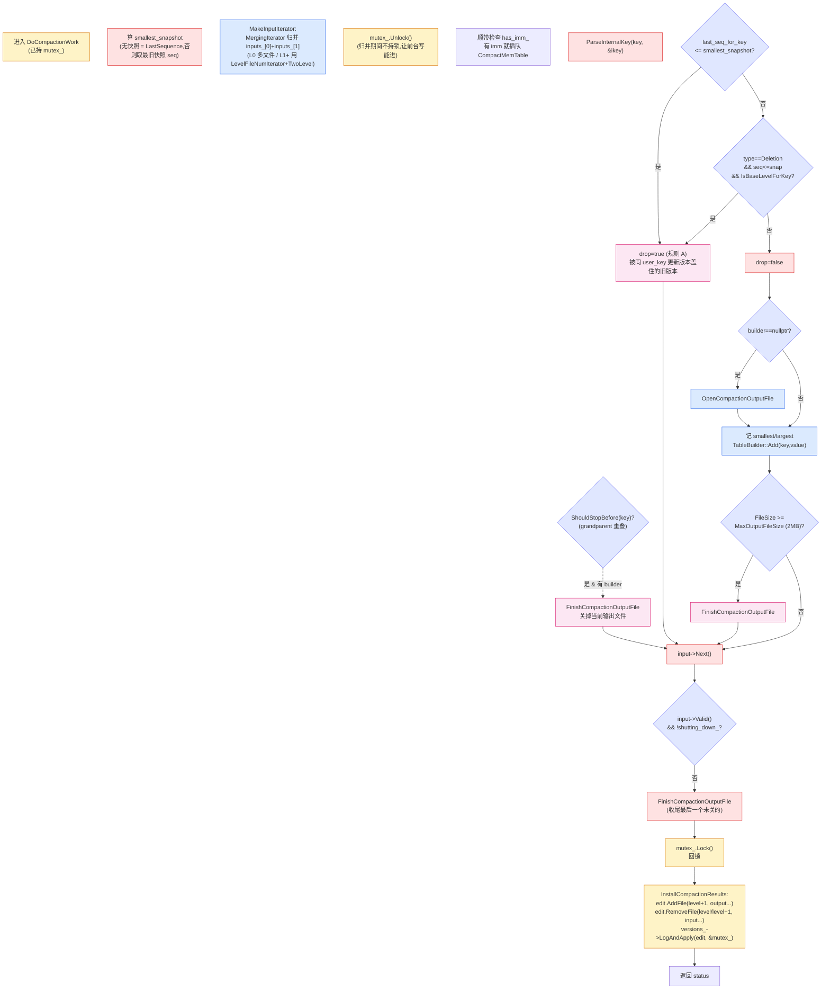
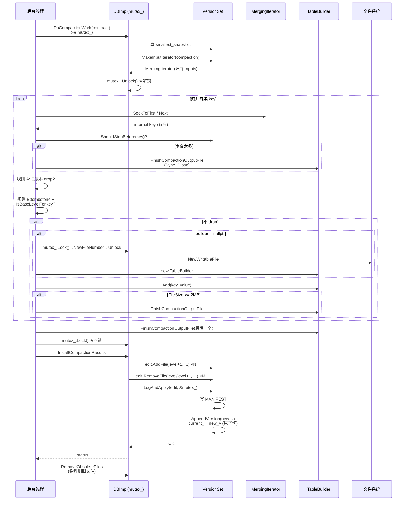
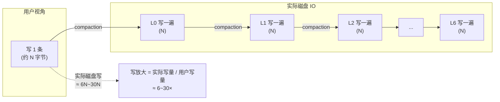

# 第十六章 · Compaction 的执行:归并生成新文件

> 篇:P4 Compaction:后台的灵魂(收官)
> 主线呼应:上一章 P4-15 讲清了 compaction **何时触发、压谁**——`PickCompaction` 在超标层用 `compact_pointer_` 轮转选文件,把所有 L0 重叠文件拉进来,再补齐 `level+1` 的重叠(`inputs_[1]`)和 `level+2` 的祖辈(`grandparents_`),最后用 `IsTrivialMove` 看能不能直接挪。这一章钻进真正的苦活:**选好了输入文件,`DoCompactionWork` 怎么把它们归并成一组新的 `level+1` SSTable,边归并边丢旧版本、丢墓碑,再把"加新文件删旧文件"的 `VersionEdit` 交给 `LogAndApply` 切 Version**。这是全书第 4 篇(Compaction)的收官——也是"前台 vs 后台"二分法里**后台那一面真正落地的最后一公里**。读完这一章,你就真正看懂了一次 compaction 从触发到改完文件布局的完整闭环。

## 核心问题

**`DoCompactionWork` 拿到 `Compaction`(输入文件)后,要回答三个层层嵌套的问题:① 怎么把一堆有序的输入文件变成一条有序的输出流——为什么用 `MergingIterator` 而不是把所有 KV 读出来再排序?② 什么时候切一个新输出文件——光看 `max_file_size = 2MB` 不够,还要看 `ShouldStopBefore`(grandparent 重叠),为什么?③ 什么时候能丢一条记录——同 user_key 的旧版本可以直接丢,但 tombstone 不能无脑丢,扔早了下层那个本该被删的旧值会"复活",扔晚了空间放大永不收敛。三个问题答完,这次 compaction 把结果交 `VersionEdit`、`LogAndApply` 切 Version,后台那一面就走完了一圈。**

读完本章你会明白:

1. **归并生成新文件**:`DoCompactionWork` 用 `versions_->MakeInputIterator` 把 `inputs_[0]`(level 层)+ `inputs_[1]`(level+1 层)的所有文件喂给一个 `MergingIterator`,后者 k 路取最小(按 internal key 排序,即 user_key 升序 + seq 降序),吐出一条有序流;compaction 边读边 `TableBuilder::Add` 写成新的 `level+1` SSTable。本质是**外部归并排序**(external merge sort),去重、丢旧版本、丢过期 tombstone 一站完成。
2. **何时切新文件**:两个触发——① 当前输出文件大小 ≥ `MaxOutputFileSize()`(= `max_file_size`,默认 2MB);② `ShouldStopBefore(key)` 返回 true,表示"当前输出文件如果再加这个 key,它会和 `grandparents_`(level+2 的重叠文件)重叠太多,下次这些 grandparent 文件做 compaction 时会很惨"——所以这里切一刀,让本次产出文件的 key range 不要太宽。这个机制叫 `MaxGrandParentOverlapBytes`(= 10 × `TargetFileSize` = 20MB),它和 10x 层级约束一脉相承。
3. **tombstone 丢弃时机(全章最深的正确性点)**:一条 tombstone(类型 `kTypeDeletion`)能不能在 compaction 时扔掉,源码用 `IsBaseLevelForKey(user_key)` 判断——**只有"所有比输出层更深的层(level+2、level+3……一直到 L6)都没有这个 user_key 的数据"时,才能扔**。为什么?tombstone 的作用是盖住下层的旧值;如果下层(level+2 及以下)还有这个 key 的旧值,你把 tombstone 扔了,读 `Get` 时按层遍历到下层那个旧值就会返回——**已删数据"复活"**,正确性破坏。这是 LSM 最经典的正确性陷阱,本章用一张 ASCII 图钉死它。
4. **写放大的来源**:同一条有效数据从 L0 一路被 compaction 重写到 L1、L2……L6,每过一层就被读写一遍。本章把这个数字算清,并讲清 LevelDB 怎么靠"10x 层级约束 + 轮转 + `IsTrivialMove` + 切文件时机"把写放大压在 ~10×(实测 10~30×,worst case ~50×)。
5. **compaction 怎么收尾**:归并完所有输出文件 → `InstallCompactionResults` 把"加新文件、删旧文件"塞进 `VersionEdit` → `LogAndApply` 写 MANIFEST、切 Version → `RemoveObsoleteFiles` 删真正没用的物理文件。这一步把第 4 篇(Compaction)和第 14 章的 `Version` 引用计数、`AppendVersion` 原子切换彻底闭环。

> **如果一读觉得太难**:先只记住三件事——① compaction 的核心是**外部归并排序**:`MergingIterator` 把多个有序输入归并成一条有序流,边读边写新 SSTable;② 何时丢记录有两条规则:**同 user_key 只留最新版本**(旧版本 `drop=true`,源码标了 `(A)`);**tombstone 只有在"更深层没有这个 key"时(`IsBaseLevelForKey` 返回 true)才能扔**,扔早了会"复活"已删数据;③ 归并完通过 `VersionEdit + LogAndApply` 原子切 Version,前台读不受打扰(第 14 章已讲透)。剩下的"切文件时机、grandparent 重叠、写放大算账"是优化和工程权衡,可以回头再读。

---

## 16.1 一句话点破

> **Compaction 的执行就是一次外部归并排序:`MergingIterator` 把 level + level+1 的所有输入文件吐成一条按 internal key 有序的流,compaction 边读边 `TableBuilder::Add` 写新的 level+1 SSTable,边写边做两件正确性决策——同 user_key 只留最新版本、tombstone 只有更深层都没有这个 key 时才能扔;输出文件超 2MB 或与 grandparent 重叠太多就切新文件;全部写完通过 `VersionEdit` + `LogAndApply` 原子切 Version。这就是 LSM "前台快、后台慢慢收拾" 里"收拾"那一面的最后一公里。**

这是结论,不是理由。本章倒过来拆:先看 `DoCompactionWork` 的主流程长得什么样,再逐段拆"归并、丢旧版本、丢 tombstone、切文件、收尾",最后用"写放大算账"把整套收敛的代价钉死。

---

## 16.2 DoCompactionWork 主流程:解锁归并,再回锁切 Version

`DoCompactionWork` 是本章的主角。它的骨架在 [`db/db_impl.cc:898-1057`](../leveldb/db/db_impl.cc#L898-L1057),我们先把主流程拎出来(下文贴的是真实源码摘录,省略号 `...` 表示略去的日志、错误处理、统计代码):

```cpp
Status DBImpl::DoCompactionWork(CompactionState* compact) {     // db_impl.cc:898
  ...
  if (snapshots_.empty()) {
    compact->smallest_snapshot = versions_->LastSequence();     // db_impl.cc:911
  } else {
    compact->smallest_snapshot = snapshots_.oldest()->sequence_number();
  }

  Iterator* input = versions_->MakeInputIterator(compact->compaction);  // db_impl.cc:916 —— 归并迭代器

  mutex_.Unlock();                                               // db_impl.cc:919 —— 关键:归并期间不持锁

  input->SeekToFirst();
  Status status;
  ParsedInternalKey ikey;
  std::string current_user_key;
  bool has_current_user_key = false;
  SequenceNumber last_sequence_for_key = kMaxSequenceNumber;
  while (input->Valid() && !shutting_down_.load(std::memory_order_acquire)) {   // db_impl.cc:927
    ...  // 中途顺带处理 imm_(下面 16.2.2 讲)

    Slice key = input->key();
    if (compact->compaction->ShouldStopBefore(key) &&           // db_impl.cc:942 —— 切文件判断
        compact->builder != nullptr) {
      status = FinishCompactionOutputFile(compact, input);
      ...
    }

    // Handle key/value, add to state, etc.
    bool drop = false;
    if (!ParseInternalKey(key, &ikey)) {                        // db_impl.cc:952
      ...
    } else {
      if (!has_current_user_key ||
          user_comparator()->Compare(ikey.user_key, Slice(current_user_key)) != 0) {
        // First occurrence of this user key
        current_user_key.assign(...);                           // db_impl.cc:962
        has_current_user_key = true;
        last_sequence_for_key = kMaxSequenceNumber;
      }

      if (last_sequence_for_key <= compact->smallest_snapshot) {
        // Hidden by an newer entry for same user key
        drop = true;  // (A)                                       // db_impl.cc:969 —— 规则 A:旧版本丢弃
      } else if (ikey.type == kTypeDeletion &&
                 ikey.sequence <= compact->smallest_snapshot &&
                 compact->compaction->IsBaseLevelForKey(ikey.user_key)) {
        // ... (1)(2)(3) 的注释 ...
        // Therefore this deletion marker is obsolete and can be dropped.
        drop = true;                                             // db_impl.cc:980 —— 规则 B:tombstone 丢弃
      }

      last_sequence_for_key = ikey.sequence;                    // db_impl.cc:983
    }

    if (!drop) {
      if (compact->builder == nullptr) {
        status = OpenCompactionOutputFile(compact);             // db_impl.cc:998 —— 没开输出文件就开
        ...
      }
      if (compact->builder->NumEntries() == 0) {
        compact->current_output()->smallest.DecodeFrom(key);    // db_impl.cc:1004 —— 记录输出文件 key range
      }
      compact->current_output()->largest.DecodeFrom(key);       // db_impl.cc:1006
      compact->builder->Add(key, input->value());               // db_impl.cc:1007 —— 写进 SSTable

      if (compact->builder->FileSize() >=
          compact->compaction->MaxOutputFileSize()) {           // db_impl.cc:1010-1011 —— 大小触发切文件
        status = FinishCompactionOutputFile(compact, input);
        ...
      }
    }

    input->Next();                                                // db_impl.cc:1019
  }

  ...
  if (status.ok() && compact->builder != nullptr) {
    status = FinishCompactionOutputFile(compact, input);         // db_impl.cc:1026 —— 收尾:最后一个未关的输出文件
  }
  if (status.ok()) {
    status = input->status();
  }
  delete input;

  CompactionStats stats;
  ...  // 算 bytes_read / bytes_written,见 db_impl.cc:1034-1043

  mutex_.Lock();                                                  // db_impl.cc:1045 —— 回锁
  stats_[compact->compaction->level() + 1].Add(stats);

  if (status.ok()) {
    status = InstallCompactionResults(compact);                   // db_impl.cc:1049 —— 把 VersionEdit 交给 LogAndApply
  }
  ...
  return status;
}
```

这张图覆盖了 `DoCompactionWork` 的全部主干。我们把它画成一张流程图:



这张图上有几个**极其关键的设计决策**,我们逐个展开。

### 16.2.1 为什么归并期间要 `mutex_.Unlock()`

`DoCompactionWork` 一进来,在 `MakeInputIterator` 之后立刻 `mutex_.Unlock()`([db_impl.cc:919](../leveldb/db/db_impl.cc#L919)),然后才开始 `input->SeekToFirst()` 真的归并。这一行**非常关键**——它是"前台读不被后台 compaction 打扰"在执行阶段的字面落地。

> **不这样会怎样**:假设 compaction 期间一直持着 `mutex_`,会发生什么?① 前台 `Write` 要拿 `mutex_` 才能 `MakeRoomForWrite`、写 MemTable——被 compaction 阻塞,**写停摆几秒**;② 前台 `Get` 要拿 `mutex_` 才能取 current Version、`Ref()`——被 compaction 阻塞,**读也停摆**;③ compaction 自己因为某个原因要回锁里做点事(比如 `OpenCompactionOutputFile` 要 `NewFileNumber`、`InstallCompactionResults` 要 `LogAndApply`),还得自己解开再拿,逻辑乱。整个数据库变成"一把大锁串行所有事",吞吐崩塌。

所以 `DoCompactionWork` 在**归并重 I/O 的几秒钟里不持锁**,只在工作开始(算 `smallest_snapshot`、`MakeInputIterator`)和工作结束(`InstallCompactionResults` 切 Version)这两段持锁。中间归并的几秒钟,前台 `Write`/`Get` 照常进。

但这里有个**隐患**:compaction 解锁归并期间,如果用户 `Write` 又把 MemTable 写满、冻结成 `imm_`,而 compaction 自己还在跑,怎么办?这就是 `has_imm_` 那一段的作用。

### 16.2.2 has_imm_:归并途中插队处理 Immutable MemTable

看 [`db_impl.cc:929-939`](../leveldb/db/db_impl.cc#L929-L939) 这一段,在归并 while 循环**每一次迭代开头**都跑:

```cpp
if (has_imm_.load(std::memory_order_relaxed)) {            // db_impl.cc:929
  const uint64_t imm_start = env_->NowMicros();
  mutex_.Lock();
  if (imm_ != nullptr) {
    CompactMemTable();                                     // db_impl.cc:933 —— 插队 dump imm
    background_work_finished_signal_.SignalAll();
  }
  mutex_.Unlock();
  imm_micros += (env_->NowMicros() - imm_start);
}
```

`has_imm_` 是 `DBImpl` 的 `std::atomic<bool>` 字段([db_impl.h:179](../leveldb/db/db_impl.h#L179)),前台写满 MemTable 冻结成 imm 时会把它置 true。后台 compaction 在每次读下一条 key **之前**松松地读一下(`memory_order_relaxed`,无需严格同步),如果有 imm 就回锁、把 imm dump 出来。

> **不这样会怎样**:`MakeRoomForWrite` 在前台 `Write` 时,如果 MemTable 满了、`imm_ != nullptr`(上一次的 imm 还没被 dump),前台写会**停下来等**(`background_work_finished_signal_.Wait()`,见 [db_impl.cc:1362](../leveldb/db/db_impl.cc#L1362))。如果 compaction 跑得久(几秒),前台写就卡几秒。插队处理 imm 的设计,让 compaction 在归并的间隙里顺手把 imm dump 掉,**前台写不被 compaction 长任务拖死**。

这是个典型的"长任务里穿插短任务"的工程技巧——归并是几秒的 I/O,imm dump 是几百毫秒,把它们串行排队会浪费前台写;穿插处理就把前台写的延迟压住了。注意 `imm_micros` 单独记了一份时间,最后从 `stats.micros` 里减掉([db_impl.cc:1035](../leveldb/db/db_impl.cc#L1035)),让 compaction 统计不把 imm dump 的时间算进去——精打细算。

### 16.2.3 smallest_snapshot:丢旧版本的全局上界

进入 `DoCompactionWork` 第一件事,是算 `compact->smallest_snapshot`([db_impl.cc:910-914](../leveldb/db/db_impl.cc#L910-L914)):

```cpp
if (snapshots_.empty()) {
  compact->smallest_snapshot = versions_->LastSequence();
} else {
  compact->smallest_snapshot = snapshots_.oldest()->sequence_number();
}
```

`smallest_snapshot` 是"丢旧版本的全局下界"——**只要某条 internal key 的 sequence ≤ `smallest_snapshot`**,意味着这条记录**所有可能还活着的快照都不需要它**(因为同 user_key 一定有更新的版本排在它前面,快照读会取到那个更新的版本)。

- **没快照**:`smallest_snapshot = LastSequence`,所有"非当前最新版本"都能丢。
- **有快照**:取**最旧**那个快照的 seq。比它旧的记录,所有快照(包括最旧的)都不需要,可以丢。

`CompactionState` 结构体在 [`db/db_impl.cc:54-86`](../leveldb/db/db_impl.cc#L54-L86),它的注释把这件事讲得很清楚:

```cpp
// Sequence numbers < smallest_snapshot are not significant since we
// will never have to service a snapshot below smallest_snapshot.
// Therefore if we have seen a sequence number S <= smallest_snapshot,
// we can drop all entries for the same key with sequence numbers < S.
SequenceNumber smallest_snapshot;
```

这段注释就是后面"规则 A"的语义基础。`CompactionState` 还装着 `outputs`(已产出的输出文件列表)、`outfile` + `builder`(正在写的输出文件)、`total_bytes`——这是"一次 compaction 执行"的**全部可变状态**,和不可变的 `Compaction`(输入)分离。

---

## 16.3 归并生成新文件:一次外部归并排序

这一节拆第一个关键决策:**compaction 怎么把一堆输入文件变成一条有序输出流**。

### 16.3.1 提出问题:为什么不用"读所有 KV 排序再写"

最朴素的做法:把 `inputs_[0]`(level 层所有输入文件)+ `inputs_[1]`(level+1 层所有输入文件)的所有 KV 全读进内存,内存里排序,再写出。听起来直观,行不行?

> **不这样会怎样**:
> - **内存爆**:一次 compaction 输入可能几十 MB(L1→L2 worst case ~26MB,L5→L6 worst case 更大),全装内存意味着几十 MB 常驻,和 MemTable、block cache 抢内存。
> - **I/O 浪费**:排序要么内存够大(贵),要么内部排序+外部归并(这不就是归并排序吗?那不如直接 k 路归并)。
> - **没法流式处理**:想"边读边丢旧版本边写",必须让输入流有序——因为"同 user_key 取最新版本"这个判断,只有当**所有同 user_key 的版本都连续到达**时才能做。无序的流没法做这个判断。

所以正确做法是**让输入流先有序**,然后流式处理。LevelDB 的每个 SSTable 内部是有序的(P2-07、P2-08 讲过),所以 k 个有序输入可以做 **k 路归并**——这就是 `MergingIterator`。

### 16.3.2 MakeInputIterator:为 compaction 定制的归并迭代器

`versions_->MakeInputIterator(compact->compaction)`([db_impl.cc:916](../leveldb/db/db_impl.cc#L916))负责造一个把所有输入文件归并起来的迭代器。看 [`db/version_set.cc:1219-1250`](../leveldb/db/version_set.cc#L1219-L1250):

```cpp
Iterator* VersionSet::MakeInputIterator(Compaction* c) {
  ReadOptions options;
  options.verify_checksums = options_->paranoid_checks;
  options.fill_cache = false;                                // ← 关键:不缓存 compaction 读的 block

  // Level-0 files have to be merged together.  For other levels,
  // we will make a concatenating iterator per level.
  const int space = (c->level() == 0 ? c->inputs_[0].size() + 1 : 2);
  Iterator** list = new Iterator*[space];
  int num = 0;
  for (int which = 0; which < 2; which++) {
    if (!c->inputs_[which].empty()) {
      if (c->level() + which == 0) {
        // L0 的每个文件单独进归并(L0 文件之间可能重叠)
        const std::vector<FileMetaData*>& files = c->inputs_[which];
        for (size_t i = 0; i < files.size(); i++) {
          list[num++] = table_cache_->NewIterator(options, files[i]->number,
                                                   files[i]->file_size);
        }
      } else {
        // L1+ 用 concatenating iterator(同层文件不重叠,拼接即可)
        list[num++] = NewTwoLevelIterator(
            new Version::LevelFileNumIterator(icmp_, &c->inputs_[which]),
            &GetFileIterator, table_cache_, options);
      }
    }
  }
  assert(num <= space);
  Iterator* result = NewMergingIterator(&icmp_, list, num);
  delete[] list;
  return result;
}
```

几个关键点:

1. **L0 每个文件单独进归并**(`inputs_[0].size() + 1` 个 Iterator)。为什么?因为 L0 文件之间 key range 可能重叠(P4-15 讲过),要把每个文件当一个独立流喂给 `MergingIterator` 归并。
2. **L1+ 用 `NewTwoLevelIterator`**——上层是 `LevelFileNumIterator`(指向同层的多个文件,按 smallest 排序),下层是每个文件的 `Table::Iterator`。因为 L1+ 文件之间不重叠,可以直接拼接(顺序遍历即可,不用归并)。这就是上一章 P3-12 讲的"两级迭代器"。
3. **最后 `NewMergingIterator` 把上面所有 Iterator 归并起来**——不管 L0 几个、L1 一个、还是 L2 一个,最终都变成一个有序的 `Iterator*`。

注意 `options.fill_cache = false`——compaction 读的 block **不进 block cache**。为什么?compaction 是全量扫描,会把 cache 冲爆,把前台 `Get` 真正要的热数据挤出去。这是 LevelDB 在"compaction I/O"和"前台读缓存"之间的小心隔离——后台别污染前台缓存。

### 16.3.3 MergingIterator:为什么它"不感知 type、不跳墓碑"

这是第 12 章 P3-12 的核心论断,这里再钉一次,因为它对 compaction **极其关键**。

`MergingIterator`([table/merger.cc:14-25](../leveldb/table/merger.cc#L14-L25))构造时拿一个 `comparator_`,对 compaction 来说是 `internal_comparator_`(包含 seq+type 的比较器)。它的核心 `FindSmallest` 在所有子迭代器里挑最小的 internal key——这个"最小"是按 **(user_key 升序, seq 降序, type 升序)** 算的(因为 internal key 编码时 seq 在高位且按位取反使 seq 大的排前,详见 P1-03)。

**关键**:`MergingIterator` 只关心"取最小",它**不解析 internal key 的 type、不跳 tombstone**。这意味着:

- 一条 `kTypeDeletion` 的 tombstone,会被 MergingIterator 当成普通 key 吐出来,**完整地流到 `DoCompactionWork` 的 while 循环**。
- `DoCompactionWork` 自己决定这条 tombstone 该不该丢(见 16.5 节)。

> **钉死这件事**:`MergingIterator` 是个**纯归并器**——它不知道 type、不跳墓碑、不做任何语义判断。**所有"丢旧版本、丢 tombstone"的决策都在 `DoCompactionWork` 里做**。这种"归并和语义分离"的设计,让 MergingIterator 既能服务前台读(`DBIter` 在它之上再做语义过滤),也能服务后台 compaction(`DoCompactionWork` 在它之上做丢弃决策)——同一份代码,两个完全不同的调用方,各自加自己的语义层。这是"组合优于继承"的范例。

---

## 16.4 规则 A:同 user_key 只留最新版本

现在我们看 `DoCompactionWork` while 循环里**第一条丢弃规则**——同 user_key 的旧版本丢弃。

### 16.4.1 提出问题:旧版本能不能留

LSM 的多版本本质是:同 user_key 被改 N 次,会有 N 条 internal key(同 user_key、不同 seq)散落在不同的 SSTable。compaction 把它们归并到一起时,这 N 条会按 internal key 顺序**连续到达**(user_key 相同,seq 大的先到)。问题是:**这 N 条里哪几条要写进新的输出文件**?

> **不这样会怎样**:
> - **全留**:空间放大永不收敛。一个 key 被改 1000 次,L6 里就有 1000 条 internal key,占 1000 倍空间。读 `Get` 走到这一层时,要读到最新版本就停(因为按 seq 降序排),勉强能用,但空间爆炸。
> - **只留最新一条(忽略快照)**:正确性破坏。如果用户开了快照(`GetSnapshot`),那个快照可能 seq = `S`,而最新版本的 seq > `S`,快照读应该看到 seq ≤ `S` 的那个版本——你把那个版本丢了,快照读就读不到正确结果。

所以正确做法是:**对每个 user_key,只留"所有可能被读到的版本"——即 seq > `smallest_snapshot` 的版本**。`smallest_snapshot` 在 16.2.3 已讲:无快照时是 `LastSequence`(只留最新),有快照时是最旧快照的 seq(快照可能读到的版本都得留)。

### 16.4.2 源码:current_user_key + last_sequence_for_key

`DoCompactionWork` 用三个变量跟踪"当前在处理哪个 user_key",看 [`db/db_impl.cc:923-984`](../leveldb/db/db_impl.cc#L923-L984):

```cpp
ParsedInternalKey ikey;
std::string current_user_key;
bool has_current_user_key = false;
SequenceNumber last_sequence_for_key = kMaxSequenceNumber;
while (input->Valid() && ...) {
  ...
  Slice key = input->key();
  ...
  bool drop = false;
  if (!ParseInternalKey(key, &ikey)) {
    // 解析失败(corrupt),清空状态,把这条原样写出去(下面 16.4.3 讲)
    current_user_key.clear();
    has_current_user_key = false;
    last_sequence_for_key = kMaxSequenceNumber;
  } else {
    if (!has_current_user_key ||
        user_comparator()->Compare(ikey.user_key, Slice(current_user_key)) != 0) {
      // First occurrence of this user key
      current_user_key.assign(ikey.user_key.data(), ikey.user_key.size());
      has_current_user_key = true;
      last_sequence_for_key = kMaxSequenceNumber;             // ← 切换 user_key 时,重置 last_seq
    }

    if (last_sequence_for_key <= compact->smallest_snapshot) {
      // Hidden by an newer entry for same user key
      drop = true;  // (A)                                        // ← 规则 A:旧版本丢弃
    } else if (...) {
      ...
    }

    last_sequence_for_key = ikey.sequence;                     // ← 记下这个 user_key 已见过的最新 seq
  }
  ...
}
```

这段逻辑用**两个状态变量**完成"同 user_key 只留前几条 seq 大于 smallest_snapshot 的":

- **`current_user_key`**:当前正在处理的 user_key。每次切到一个新 user_key,重置 `last_sequence_for_key = kMaxSequenceNumber`。
- **`last_sequence_for_key`**:对当前 user_key,**已经处理过的最大 seq**(因为 internal key 按 seq 降序到达,先到的 seq 最大,所以这是"第一个到达"的 seq)。

**规则 A 的判断**:`last_sequence_for_key <= compact->smallest_snapshot` 时 `drop = true`。我们逐步推演:

1. **新 user_key 的第一条**(seq 最大):`last_sequence_for_key` 刚被重置为 `kMaxSequenceNumber`,远大于 `smallest_snapshot`,**条件不成立,不丢**。这条是最新版本,一定要留。处理完,`last_sequence_for_key = 这条的 seq`。
2. **同 user_key 的第二条**(seq 第二大):现在 `last_sequence_for_key = 第一条的 seq`(很大)。如果第一条 seq > `smallest_snapshot`,那 `last_sequence_for_key > smallest_snapshot`,**条件不成立,不丢**——因为第一条是新于 `smallest_snapshot` 的版本,而第二条也新于它(因为按序到达,第二条 seq 仍 > smallest_snapshot 的话),仍然要留(给快照读用)。
3. **某条 seq ≤ `smallest_snapshot`**:这条之后所有同 user_key 的版本(更小的 seq)都被 `drop=true`——因为它们都被某个 seq > smallest_snapshot 的版本盖住了,所有快照读都会取到那个更新的版本,旧版本对任何快照都不可见,可以丢。

> **钉死这件事**:规则 A 的语义是"**只要当前 user_key 已经见过一个 seq > smallest_snapshot 的版本,那 seq ≤ smallest_snapshot 的旧版本都可以丢**"。因为按 internal key 序到达,所以判断变成"`last_sequence_for_key <= smallest_snapshot` 则 drop"。这是 LSM 多版本去重的字面落地,空间放大的收敛全靠它。

### 16.4.3 ParseInternalKey 失败:腐败数据原样写

注意 `if (!ParseInternalKey(key, &ikey))` 分支——如果 internal key 解析失败(长度不对、type 非法等腐败情况),`drop` 保持 `false`,这条数据**原样写进新输出文件**。源码注释 `"Do not hide error keys"`——别把错误藏起来,把它透传给用户。

> **钉死这件事**:LevelDB 在 compaction 里对**腐败数据采取"原样保留"策略**,而不是"丢弃或崩溃"。这样后续用户读这条 key 时会拿到 `Status::Corruption`,能感知到问题;丢掉则会让数据"凭空消失",更糟。这是 LevelDB 一贯的"宁可不优雅,不可静默丢数据"哲学。

---

## 16.5 规则 B:tombstone 丢弃时机(全章最深的正确性点)

这是本章最硬核的一节,也是 LSM 最经典的正确性陷阱。我们慢慢拆。

### 16.5.1 tombstone 是什么,它干什么

先回顾(P0-01 讲过):用户调 `Delete(k)`,LevelDB 不原地删数据,而是写一条 `internal_key = (user_key=k, seq=S, type=kTypeDeletion)` 的"墓碑"。墓碑本身也是一条记录,占着空间。

tombstone 的作用:**盖住下层的旧值**。读 `Get(k)` 时,按层遍历(L0 → L1 → ... → L6),一旦在某层遇到这个 user_key(不管是 Value 还是 Deletion),就停——遇到 Value 返回它,遇到 Deletion 返回 NotFound。所以 tombstone 像一个"屏障",挡住下层对同一 user_key 的旧版本。

### 16.5.2 提出问题:tombstone 能不能在 compaction 时扔

现在问题是:**compaction 时遇到一条 tombstone,能不能丢**?

直觉上,tombstone 是"删标记",似乎可以直接丢——反正是删了的。但**这是 LSM 最容易踩的坑**。我们看三种情况:

**情况 1:深层没有这个 user_key 的数据**。例如 compact L2→L3,遇到 tombstone `del(k)`,L4、L5、L6 都没有 `k`。这时**可以丢**——因为读 `Get(k)` 走到 L3 看到 tombstone(或者根本没看到,因为 k 不在任何层),都返回 NotFound,正确。

**情况 2:深层还有这个 user_key 的旧值**。例如 compact L2→L3,遇到 tombstone `del(k)`(seq=100),但 L4 里还有 `k=旧值`(seq=50)。这时**绝对不能丢** tombstone!为什么?读 `Get(k)` 按层遍历,走到 L3 看到 tombstone(返回 NotFound),正确;如果丢掉 tombstone,读 `Get(k)` 走到 L3 没看到 `k`,继续走到 L4,看到 `k=旧值`,**返回了!——已删数据"复活"**。这就是经典的"tombstone 扔早复活旧值"陷阱。

**情况 3:有快照还可能读到 tombstone**。即使深层没有数据,如果有一个快照 seq ≤ tombstone 的 seq,这个快照的读可能会走到这一层看到 tombstone——丢掉 tombstone 会让快照读返回 NotFound 变成"在更深层找到旧值"。所以还要加一个 seq 约束:`ikey.sequence <= smallest_snapshot`。

### 16.5.3 源码:IsBaseLevelForKey 判断"更深层有没有这个 key"

`DoCompactionWork` 用规则 B 处理这件事,看 [`db/db_impl.cc:970-981`](../leveldb/db/db_impl.cc#L970-L981):

```cpp
} else if (ikey.type == kTypeDeletion &&
           ikey.sequence <= compact->smallest_snapshot &&
           compact->compaction->IsBaseLevelForKey(ikey.user_key)) {
  // For this user key:
  // (1) there is no data in higher levels
  // (2) data in lower levels will have larger sequence numbers
  // (3) data in layers that are being compacted here and have
  //     smaller sequence numbers will be dropped in the next
  //     few iterations of this loop (by rule (A) above).
  // Therefore this deletion marker is obsolete and can be dropped.
  drop = true;
}
```

三个条件**同时成立**才能丢 tombstone:

1. **`ikey.type == kTypeDeletion`**:这条是 tombstone(不是普通 Value)。
2. **`ikey.sequence <= compact->smallest_snapshot`**:tombstone 的 seq 必须 ≤ 最旧快照——否则有快照可能需要它。
3. **`IsBaseLevelForKey(ikey.user_key)`**:**所有比输出层更深的层都没有这个 user_key 的数据**——这是核心。

第 3 条的注释写得非常清楚,值得逐条理解:

- **(1) "there is no data in higher levels"**:更浅的层(L0..level-1)没有这个 user_key 的数据。这一条不需要显式判断——因为如果浅层有 `k`,那个 `k` 的 seq 必然 > 这条 tombstone 的 seq(否则浅层那个 `k` 早被某个更浅的版本盖住),读 `Get(k)` 会先在浅层看到那个 `k`,不会走到本层看到 tombstone,所以 tombstone 丢不丢都不影响这次读。这条注释其实是说"浅层就算有 `k`,它 seq 比这条 tombstone 新,读不会依赖这条 tombstone"。
- **(2) "data in lower levels will have larger sequence numbers"**:**注意这里的 "larger" 在 LSM 里是"更旧"**——因为 seq 越大越新。等等,这其实是个**容易读错的注释**。让我重新核对源码语义。

我们直接看 `IsBaseLevelForKey` 怎么实现,再回过头来对注释。看 [`db/version_set.cc:1517-1536`](../leveldb/db/version_set.cc#L1517-L1536):

```cpp
bool Compaction::IsBaseLevelForKey(const Slice& user_key) {
  // Maybe use binary search to find right entry instead of linear search?
  const Comparator* user_cmp = input_version_->vset_->icmp_.user_comparator();
  for (int lvl = level_ + 2; lvl < config::kNumLevels; lvl++) {        // ← 从 level+2 扫到 L6
    const std::vector<FileMetaData*>& files = input_version_->files_[lvl];
    while (level_ptrs_[lvl] < files.size()) {
      FileMetaData* f = files[level_ptrs_[lvl]];
      if (user_cmp->Compare(user_key, f->largest.user_key()) <= 0) {
        // We've advanced far enough
        if (user_cmp->Compare(user_key, f->smallest.user_key()) >= 0) {
          // Key falls in this file's range, so definitely not base level
          return false;                                                 // ← 这个 key 在更深层某文件 range 内,不能丢 tombstone
        }
        break;
      }
      level_ptrs_[lvl]++;                                               // ← 推进指针(MergingIterator 是有序的,下次 user_key 更大)
    }
  }
  return true;                                                          // ← 所有更深层都没有这个 key,可以丢
}
```

**关键事实**:`IsBaseLevelForKey` 扫描的是 `level_ + 2 .. kNumLevels - 1`(即 level+2 到 L6)。为什么是 `level_ + 2` 而不是 `level_ + 1`?因为——

- **`level_`** 是本次 compaction 的输入层(被压的)。
- **`level_ + 1`** 是本次 compaction 的输出层。本次 compaction 会把 level 和 level+1 的相关文件全部读出来归并,所以输出层(level+1)在 compaction 后会被新文件取代,**旧 level+1 文件全删**。也就是说,level+1 层在 compaction 后**只剩本次输出**,不会有"残留的旧值"。所以判断"更深层有没有这个 key"时,**跳过 level+1**(因为它会被本次 compaction 重写)。
- **`level_ + 2` 及更深**才是真正"没被本次 compaction 触及的层",这些层里如果还有这个 user_key 的数据,就是 tombstone 必须盖住的"旧值"。

> **钉死这件事**:`IsBaseLevelForKey` 扫描 `level+2 .. L6`,**跳过 level+1**——因为 level+1 是本次 compaction 的输出层,会被本次归并完全重写。判断"tombstone 能不能丢"的本质是"**除了本次 compaction 正在处理的这两层,更深层还有没有这个 user_key 的旧值**"。如果没有,tombstone 没东西可盖,可以丢;如果有,tombstone 必须留下继续盖,否则旧值"复活"。

### 16.5.4 一个优化:level_ptrs_[lvl] 为什么能单调推进

注意 `IsBaseLevelForKey` 里有个 `level_ptrs_[lvl]` 指针([version_set.h:363](../leveldb/db/version_set.h#L363)),它在 compaction 开始时初始化为 0,**每次调用 `IsBaseLevelForKey` 都推进**,从不回退。这是个**单调指针优化**,能 work 是因为:

- `MergingIterator` 吐出的 key 是按 internal key 升序的,user_key 单调递增(同 user_key 内连续)。
- L1+ 的文件按 smallest 排序,key range 互不重叠。
- 所以 `IsBaseLevelForKey(k)` 调用一次后,`level_ptrs_[lvl]` 指向"第一个 largest ≥ k 的文件";下次调用 `IsBaseLevelForKey(k')`,`k' > k`,从当前 `level_ptrs_[lvl]` 继续往前扫就行,不用回头。

这是经典的"归并迭代器 + 单调指针"技巧——用流式性质省掉每次二分查找的 log 因子。注释 `// Maybe use binary search to find right entry instead of linear search?` 显示作者考虑过二分,但线性 + 单调指针在归并场景下更优(因为本来就要顺序扫)。

### 16.5.5 一张 ASCII 图钉死"复活"陷阱

把规则 B 用一张图钉死。设 compaction 正在压 L2 → L3:

```
 场景:tombstone 能否丢弃?  (user_key = 'k')

 ┌─────────────────────────────────────────────────────────────┐
 │  L2 (输入层,本次会被压掉)                                    │
 │    [f_a: 'k' seq=200 type=Deletion]   ← tombstone,要不要丢?  │
 │    [f_b: 'k' seq=150 type=Value 'v2'] ← 旧值,规则 A 会丢      │
 ├─────────────────────────────────────────────────────────────┤
 │  L3 (输出层,本次会被重写)                                    │
 │    [f_c: 'k' seq=100 type=Value 'v1'] ← 输入文件之一          │
 │    (compaction 后这些文件全删,被新文件取代)                   │
 ├─────────────────────────────────────────────────────────────┤
 │  L4 (更深层,IsBaseLevelForKey 会扫这层)                       │
 │    [f_d: 'k' seq=50 type=Value 'v0'] ← ★这里有旧值!          │
 └─────────────────────────────────────────────────────────────┘

 IsBaseLevelForKey('k') 扫 L4..L6:
   L4 的 f_d 的 range ['k'..'k'] 包含 'k'  →  返回 false
 → tombstone 不能丢,必须写进 L3 的新输出文件

 为什么不能丢?读 Get('k') 的旅程:
   L0 没找到 → L1 没找到 → L2 在被 compact(此时 Version 切换前
   还看到 f_a 的 tombstone)→ 找到 tombstone → 返回 NotFound  ✓

 如果我们莽撞地丢了 tombstone,compaction 完 Version 切换后:
   读 Get('k'):
     L0 没找到 → L1 没找到 → L2(已删 f_a)没 'k'
       → L3(新输出)没 'k'(我们把 tombstone 丢了)
         → L4 的 f_d 看到 'k'='v0'  ← ★ 已删数据"复活"!正确性破坏
```

对比一下"IsBaseLevelForKey 返回 true"的情况(L4..L6 都没有 'k'):

```
 ┌─────────────────────────────────────────────────────────────┐
 │  L2 [f_a: 'k' seq=200 Deletion]   ← tombstone                │
 │  L2 [f_b: 'k' seq=150 Value 'v2'] ← 旧值(规则 A 丢)          │
 ├─────────────────────────────────────────────────────────────┤
 │  L3 [f_c: 'k' seq=100 Value 'v1'] ← 输入(被重写)             │
 ├─────────────────────────────────────────────────────────────┤
 │  L4 []  L5 []  L6 []   ← 全空,更深层都没有 'k'                │
 └─────────────────────────────────────────────────────────────┘

 IsBaseLevelForKey('k') 返回 true
 → tombstone 可以丢(drop=true)

 为什么可以丢?读 Get('k'):
   L0..L3 都没 'k'(tombstone 丢了,L2 也没 'k' 了)
     → L4..L6 都没 'k' → 返回 NotFound  ✓
   结果一致——因为下层本来就没东西可被"复活"
```

> **钉死这件事**:tombstone 丢弃规则是 LSM 的**正确性红线**。`IsBaseLevelForKey` 扫描 `level+2..L6`,任何一层有这个 user_key 的数据都不能丢 tombstone。这是"扔早了复活旧值"陷阱的唯一防线。无脑丢 tombstone → 已删数据复活(正确性破坏);无脑留 tombstone → 空间放大永不收敛(tombstone 永远占着地方)。LevelDB 用 `IsBaseLevelForKey` 在两者之间精准切分。

---

## 16.6 何时切新文件:MaxOutputFileSize 和 ShouldStopBefore

这一节拆第二个关键决策:**compaction 输出什么时候切新 SSTable**。

### 16.6.1 提出问题:输出文件多大切合适

朴素做法:一次 compaction 输出一个大文件,把所有归并结果都堆进去。行不行?

> **不这样会怎样**:一次 L2→L3 compaction 输入可能 ~26MB,输出 ~26MB,如果合成一个 26MB 的 SSTable——① 读 `Get` 打开这个文件要全文件扫(虽然有 index block,但文件越大 index 越大、bloom 越大);② 这个文件的 key range 可能很宽,下次 L3→L4 compaction 选它做输入时,会和 L4 很多文件重叠(`grandparents_` 大),下次 compaction 很贵;③ 文件太大,内存里的 block cache 命中率低。

所以输出文件要**大小有上限**。LevelDB 的默认是 `max_file_size = 2MB`([options.h:116](../leveldb/include/leveldb/options.h#L116)),通过 `MaxOutputFileSize()`([version_set.h:338](../leveldb/db/version_set.h#L338))返回。看 [`db_impl.cc:1010-1011`](../leveldb/db/db_impl.cc#L1010-L1011):

```cpp
if (compact->builder->FileSize() >=
    compact->compaction->MaxOutputFileSize()) {
  status = FinishCompactionOutputFile(compact, input);
  ...
}
```

文件大小 ≥ 2MB 就切。这和 P4-15 讲的"`TargetFileSize = 2MB`"一致,和 `doc/impl.md` 的"2MB 目标文件大小"一致。

### 16.6.2 提出问题:光看大小够不够

但**只看大小不够**。考虑这个场景:

```
 L2 (输入)    [f_a: 'a'..'z']    ← 一个 2MB 文件,key range 横跨整个字母表
 L3 (输出)    这次 compaction 产出
 L4 (下层)    [f_1: 'a'..'c'] [f_2: 'd'..'f'] [f_3: 'g'..'i'] ... [f_26: 'x'..'z']
                                       ← 26 个文件!
```

如果本次 L2→L3 compaction 产出一个 ['a'..'z'] 的输出文件(2MB 内),那这个输出文件和 L4 的 **26 个文件全部重叠**。下次 L3→L4 compaction 选中这个文件时,它要把 L4 的 26 个文件全部读进来一起归并——26MB IO,慢得要命。这就是 10x 层级约束会被破坏的场景。

**所以光看大小不够,还要看"这个输出文件如果继续写下去,会和多少 grandparent 文件重叠"**。重叠太多就提前切,让本次产出的多个小文件,每个只覆盖一小段 key range,分别和少数几个 grandparent 重叠。这就是 `ShouldStopBefore`。

### 16.6.3 源码:ShouldStopBefore 和 MaxGrandParentOverlapBytes

看 [`db/version_set.cc:1538-1559`](../leveldb/db/version_set.cc#L1538-L1559):

```cpp
bool Compaction::ShouldStopBefore(const Slice& internal_key) {
  const VersionSet* vset = input_version_->vset_;
  // Scan to find earliest grandparent file that contains key.
  const InternalKeyComparator* icmp = &vset->icmp_;
  while (grandparent_index_ < grandparents_.size() &&
         icmp->Compare(internal_key,
                       grandparents_[grandparent_index_]->largest.Encode()) > 0) {
    if (seen_key_) {
      overlapped_bytes_ += grandparents_[grandparent_index_]->file_size;   // ← 累加已越过的 grandparent 文件大小
    }
    grandparent_index_++;
  }
  seen_key_ = true;

  if (overlapped_bytes_ > MaxGrandParentOverlapBytes(vset->options_)) {     // ← 超 20MB 就切
    // Too much overlap for current output; start new output
    overlapped_bytes_ = 0;
    return true;
  } else {
    return false;
  }
}
```

逻辑:

1. `grandparents_` 是 `SetupOtherInputs`(P4-15 讲过)在 compaction 开始前算好的——`level+2` 层里与本次 inputs 总 range 重叠的文件,按 smallest 排好序。
2. `ShouldStopBefore` 每次被 `DoCompactionWork` 在读下一条 key 之前调一次。它用 `grandparent_index_`(单调指针)扫过已经"越过"的 grandparent 文件,**累加它们的 `file_size` 到 `overlapped_bytes_`**。
3. 一旦 `overlapped_bytes_` 超过 `MaxGrandParentOverlapBytes`,**返回 true 切文件**——意思是"当前输出文件如果再写,会和太多 grandparent 重叠,这里切一刀"。
4. 切完之后 `overlapped_bytes_ = 0` 重新计数——下一个输出文件从这开始重新算重叠。

`MaxGrandParentOverlapBytes` 在 [`db/version_set.cc:30-32`](../leveldb/db/version_set.cc#L30-L32):

```cpp
static int64_t MaxGrandParentOverlapBytes(const Options* options) {
  return 10 * TargetFileSize(options);    // 10 × 2MB = 20MB
}
```

**20MB**。一个输出文件最多和 grandparent 重叠 20MB 就要切。这和 P4-15 的 `IsTrivialMove` 里 "grandparents ≤ 20MB" 是同一个阈值——一致。

### 16.6.4 两个切文件触发的配合

`DoCompactionWork` 里两个切文件触发是**或**的关系:

- **大小触发**(`FileSize >= MaxOutputFileSize`):输出文件本身够大,该切。
- **重叠触发**(`ShouldStopBefore`):输出文件会和太多 grandparent 重叠,该切。

这两个触发**互相补充**:

- 如果 grandparent 重叠少(本次 compaction 在一段稀疏 key range 上),输出文件能写到 2MB 才切——正常情况。
- 如果 grandparent 重叠多(本次 compaction 跨越多段密集 key range),输出文件可能写不到 2MB 就被迫切——这是 `ShouldStopBefore` 在"防未来债":现在多切几个小文件,下次这些文件做 compaction 时不用和太多 grandparent 合并。

> **钉死这件事**:`ShouldStopBefore` 是 LevelDB 的"前瞻性切文件"——它不光看本次 compaction 的代价,还看**下次 compaction 的代价**。一个输出文件如果 key range 太宽,会让下次 compaction 和太多 grandparent 重叠(10x 约束被破坏),所以提前切。这种"用当前切文件的小代价换下次 compaction 的大代价"的工程权衡,是 LevelDB 把写放大压在 ~10× 的关键手段之一。P4-15 的 `IsTrivialMove` 里 `grandparents ≤ 20MB` 也是同一个 20MB——一脉相承。

### 16.6.5 DoCompactionWork 里 ShouldStopBefore 的调用点

回看 [`db_impl.cc:942-948`](../leveldb/db/db_impl.cc#L942-L948):

```cpp
Slice key = input->key();
if (compact->compaction->ShouldStopBefore(key) &&
    compact->builder != nullptr) {
  status = FinishCompactionOutputFile(compact, input);
  if (!status.ok()) {
    break;
  }
}
```

注意 `compact->builder != nullptr` 这个守卫——只有"当前正在写一个输出文件"时才需要切。如果当前没在写(上一个文件刚切完,新文件还没开),`builder == nullptr`,此时 `ShouldStopBefore` 返回什么不重要,不重复切。下一条 `if (!drop)` 里如果 `builder == nullptr` 会 `OpenCompactionOutputFile` 开新文件。这个守卫避免了"空切"。

---

## 16.7 OpenCompactionOutputFile 和 FinishCompactionOutputFile

这两个函数是切文件的两个边界——开和关。我们快速看一眼它们做什么。

### 16.7.1 OpenCompactionOutputFile:申请新文件号

看 [`db/db_impl.cc:806-829`](../leveldb/db/db_impl.cc#L806-L829):

```cpp
Status DBImpl::OpenCompactionOutputFile(CompactionState* compact) {
  assert(compact != nullptr);
  assert(compact->builder == nullptr);
  uint64_t file_number;
  {
    mutex_.Lock();                                              // ← 回锁
    file_number = versions_->NewFileNumber();                   // ← 申请新文件号
    pending_outputs_.insert(file_number);                       // ← 标记"这个文件在产出中,别删"
    CompactionState::Output out;
    out.number = file_number;
    out.smallest.Clear();
    out.largest.Clear();
    compact->outputs.push_back(out);
    mutex_.Unlock();
  }

  // Make the output file
  std::string fname = TableFileName(dbname_, file_number);
  Status s = env_->NewWritableFile(fname, &compact->outfile);
  if (s.ok()) {
    compact->builder = new TableBuilder(options_, compact->outfile);
  }
  return s;
}
```

几个关键点:

1. **回锁申请新文件号**。`NewFileNumber` 修改 VersionSet 全局状态(`next_file_number_++`),必须持锁。但锁只持这几行,拿完号就解锁。
2. **`pending_outputs_.insert(file_number)`**——这一行极其重要。它把这个文件号标记为"正在产出中"。为什么?因为 `RemoveObsoleteFiles` 会扫所有磁盘文件,删掉"没有任何 live Version 引用的文件"。如果 compaction 正在写文件 X(还没写进 VersionEdit),这时 `RemoveObsoleteFiles` 跑了(被别的 compaction 触发),会把 X 当成"孤儿文件"删掉——compaction 写到一半文件被删,惨。`pending_outputs_` 让 `RemoveObsoleteFiles` 跳过这些"在产出中"的文件号,保护它们。
3. **`new TableBuilder(options_, compact->outfile)`**——创建 `TableBuilder`,准备写 SSTable(P2-10 讲过 TableBuilder 怎么把 KV 写成文件)。

### 16.7.2 FinishCompactionOutputFile:关文件、记 key range、统计

看 [`db/db_impl.cc:831-879`](../leveldb/db/db_impl.cc#L831-L879):

```cpp
Status DBImpl::FinishCompactionOutputFile(CompactionState* compact,
                                          Iterator* input) {
  assert(compact != nullptr);
  assert(compact->outfile != nullptr);
  assert(compact->builder != nullptr);

  const uint64_t output_number = compact->current_output()->number;
  assert(output_number != 0);

  Status s = input->status();
  const uint64_t current_entries = compact->builder->NumEntries();
  if (s.ok()) {
    s = compact->builder->Finish();                           // ← TableBuilder 收尾(写 index/filter/footer)
  } else {
    compact->builder->Abandon();
  }
  const uint64_t current_bytes = compact->builder->FileSize();
  compact->current_output()->file_size = current_bytes;
  compact->total_bytes += current_bytes;
  delete compact->builder;
  compact->builder = nullptr;

  if (s.ok()) {
    s = compact->outfile->Sync();                             // ← fsync
  }
  if (s.ok()) {
    s = compact->outfile->Close();                            // ← 关文件
  }
  delete compact->outfile;
  compact->outfile = nullptr;

  if (s.ok() && current_entries > 0) {
    // Verify that the table is usable
    Iterator* iter =
        table_cache_->NewIterator(ReadOptions(), output_number, current_bytes);   // ← 打开校验
    s = iter->status();
    delete iter;
    if (s.ok()) {
      Log(options_.info_log, "Generated table #%llu@%d: %lld keys, %lld bytes",
          ...);
    }
  }
  return s;
}
```

几个关键点:

1. **`TableBuilder::Finish`** 写完 index block、filter block、metaindex block、footer(P2-07、P2-10 讲过),一个完整的 SSTable 才成形。
2. **`Sync` + `Close`**——fsync 保证数据真落盘,然后关文件。崩了的话这次 compaction 的输出白写,Version 不会切换,下次重启会重做(详见 P5-18 崩溃恢复)。
3. **`current_entries > 0` 时校验**——`table_cache_->NewIterator` 把刚写的文件打开,验证它能正常迭代。**这是个自检**:compaction 产出的文件如果自己都打不开(corrupt),立刻 `Status` 报错,不会切 Version。这避免了"写出坏文件还上线"。
4. **`current_entries == 0` 时跳过校验**——一个空文件可能发生(比如本次 compaction 所有 KV 都被 drop),这时跳过,但文件本身是无效的,后续 `InstallCompactionResults` 不会把它加进 VersionEdit(下文 16.8.1 讲)。

注意 `DoCompactionWork` 主循环里,每写完一条 KV,如果大小够就 `FinishCompactionOutputFile`——所以一次 compaction 可能产出**多个**输出文件,它们都进 `compact->outputs` 这个 vector。下一次循环迭代里 `if (compact->builder == nullptr)` 会开新文件。

---

## 16.8 收尾:VersionEdit + LogAndApply

归并完所有输入,关掉最后一个输出文件,`DoCompactionWork` 进入收尾阶段。看 [`db_impl.cc:1045-1056`](../leveldb/db/db_impl.cc#L1045-L1056):

```cpp
mutex_.Lock();                                                  // ← 回锁
stats_[compact->compaction->level() + 1].Add(stats);

if (status.ok()) {
  status = InstallCompactionResults(compact);                   // ← 把 VersionEdit 交给 LogAndApply
}
if (!status.ok()) {
  RecordBackgroundError(status);
}
VersionSet::LevelSummaryStorage tmp;
Log(options_.info_log, "compacted to: %s", versions_->LevelSummary(&tmp));
return status;
```

回锁,更新统计,然后调 `InstallCompactionResults`。这是把 compaction 结果"提交"的关键一步。

### 16.8.1 InstallCompactionResults:把加减文件塞进 VersionEdit

看 [`db/db_impl.cc:880-896`](../leveldb/db/db_impl.cc#L880-L896):

```cpp
Status DBImpl::InstallCompactionResults(CompactionState* compact) {
  mutex_.AssertHeld();
  Log(options_.info_log, "Compacted %d@%d + %d@%d files => %lld bytes",
      compact->compaction->num_input_files(0), compact->compaction->level(),
      compact->compaction->num_input_files(1), compact->compaction->level() + 1,
      static_cast<long long>(compact->total_bytes));

  // Add compaction outputs
  compact->compaction->AddInputDeletions(compact->compaction->edit());
  const int level = compact->compaction->level();
  for (size_t i = 0; i < compact->outputs.size(); i++) {
    const CompactionState::Output& out = compact->outputs[i];
    compact->compaction->edit()->AddFile(level + 1, out.number, out.file_size,
                                         out.smallest, out.largest);
  }
  return versions_->LogAndApply(compact->compaction->edit(), &mutex_);
}
```

做三件事:

1. **`AddInputDeletions(edit)`**——把本次 compaction 的所有输入文件(`inputs_[0]` 和 `inputs_[1]`)加进 VersionEdit 的"删除列表"。看 [`db/version_set.cc:1509-1515`](../leveldb/db/version_set.cc#L1509-L1515):

   ```cpp
   void Compaction::AddInputDeletions(VersionEdit* edit) {
     for (int which = 0; which < 2; which++) {
       for (size_t i = 0; i < inputs_[which].size(); i++) {
         edit->RemoveFile(level_ + which, inputs_[which][i]->number);
       }
     }
   }
   ```

   把 level 层的 `inputs_[0]` 和 level+1 层的 `inputs_[1]` 全部标删。
2. **每个输出文件 `AddFile(level + 1, ...)`**——把本次产出的所有新文件加进 VersionEdit 的"添加列表",层号是 `level + 1`(compaction 输出在下一层)。注意 `out.smallest` 和 `out.largest` 是 `DoCompactionWork` 主循环里 `current_output()->smallest.DecodeFrom(key)` / `largest.DecodeFrom(key)` 边写边记的——每个输出文件的 key range,从它写入的第一条 key 到最后一条 key。
3. **`LogAndApply(edit, &mutex_)`**——把 VersionEdit apply 到 current Version 得到新 Version,写进 MANIFEST(第 5 篇详讲),`AppendVersion` 原子切 current(第 14 章详讲)。

这一步完成后,compaction 的"加减文件"在 Version 层面**对前台可见**——新 `Get` 走新 Version,看到新文件、不看到已删的旧文件。

### 16.8.2 谁负责物理删旧文件:RemoveObsoleteFiles

注意 `InstallCompactionResults` 只是在 Version 层面"标删"——`VersionEdit::RemoveFile` 把旧文件从新 Version 的 `files_[level]` 里去掉。但**物理文件还在磁盘上**。真正物理删除发生在 `BackgroundCompaction` 的 `CleanupCompaction` 之后,看 [`db_impl.cc:760-762`](../leveldb/db/db_impl.cc#L760-L762):

```cpp
CleanupCompaction(compact);
c->ReleaseInputs();
RemoveObsoleteFiles();    // ← 这里物理删
```

`RemoveObsoleteFiles` 列出所有"被任何 live Version 引用的文件号"(`AddLiveFiles`),磁盘上不在列表里的 `.ldb` 文件全删。这一步在 P0-01 提过、第 14 章详讲——它依赖 `Version` 引用计数担保"被删的文件确实没人再用"。这里只钉一件事:**物理删除发生在 Version 切换之后**,所以前台正在读旧 Version 的 reader 不会撞上"文件被删"(他们持着旧 Version 的 ref,旧 Version 还引用这些文件,`AddLiveFiles` 会把它们列进 live 集合,不会被删)。

---

## 16.9 完整时序:一次 DoCompactionWork 的全生命周期

把前面讲的串成一张时序图:



这张图覆盖了一次 compaction 从进到出的全过程。两个关键时机(`mutex_.Unlock` 和 `mutex_.Lock`)是"前台不被阻塞"的字面体现——中间归并的几秒,前台 `Write`/`Get` 照常进。

---

## 16.10 技巧精解:归并 + tombstone 丢弃时机 + 写放大来源

这一章的技巧精解,挑三个相互关联的硬核点:**外部归并排序、tombstone 丢弃红线、写放大算账**。它们是 LSM 后台那一面"收敛三放大"的工程精髓。

### 技巧精解 1:外部归并排序——为什么这么朴素这么对

**这个技巧在做什么**:把 N 个有序输入文件(level 层 + level+1 层的所有 `inputs_[0/1]`)归并成一条有序输出流,边归并边写新的 level+1 SSTable。本质是一次**外部归并排序**(external merge sort)——只不过输入已经是 SSTable(内部有序),省掉了内部排序阶段。

**用了什么手段**:

1. **每个 SSTable 内部有序**(P2-07 讲的 data block 内前缀压缩有序、block 间 index block 二分有序)。
2. **`MergingIterator`**([table/merger.cc:14](../leveldb/table/merger.cc#L14))对 k 个有序子迭代器做"取最小"——O(k) 比较开销,用胜者树/优先队列可以做到 O(log k),但 LevelDB k 通常很小(L0 几个文件 + L1 一个 TwoLevelIterator),线性扫就够,不引入优先队列的复杂度。
3. **内部 key 编码**(P1-03)让"取最小 internal key"自动等价于"按 user_key 升序、同 user_key 内 seq 降序"——MergingIterator 不用知道这些语义,只按 internal key 比较即可。

**为什么 sound(凭什么去重正确)**:归并的输出流里,**同 user_key 的所有版本必然连续到达**(因为按 internal key 序排过)。所以 `DoCompactionWork` 用 `current_user_key` 跟踪"当前 user_key",用 `last_sequence_for_key` 跟踪"已见过最大 seq",判断 `last_sequence_for_key <= smallest_snapshot` 来决定丢不丢——这套逻辑只在"同 user_key 连续到达"的前提下成立,而归并恰好提供这个保证。这是**归并 + 状态机**的精确协作。

**反面对比(读所有 KV 进内存排序)**:

> **反面对比(全量内存排序版)**:假设 compaction 把所有输入 KV 全读进一个 `std::vector`,`std::sort` 排序,再写出去。问题:① 一次 compaction 几十 MB,内存爆;② 排序 O(n log n) 远慢于归并 O(n)(输入已经有序);③ 没法流式处理,只能"读 → 排 → 写"三段串行,延迟翻倍;④ 缓存污染(把所有 KV 解码进内存)。归并方案彻底回避了这四个问题。

> **钉死这件事**:外部归并排序是 LSM "compaction 收敛"的算法骨架。它把 N 个有序文件变成一条有序流,所有去重、丢旧版本、丢 tombstone 的决策都建立在这条流的有序性之上。这是为什么 compaction 不会爆炸内存、能流式处理、能和前台并发——根都在归并。

### 技巧精解 2:tombstone 丢弃红线——为什么不能扔早

这是本章最深的正确性点,我们已经在 16.5 节详细拆过。这里用"反面 + 正面"再钉一次。

**朴素做法 A:无脑扔所有 tombstone**。

> **反面对比(无脑扔 tombstone)**:compaction 一遇到 `kTypeDeletion` 就 `drop=true`。结果:任何曾经被删的 key,只要更深层(level+2..L6)还有它的旧值,compaction 完后读 `Get(k)` 就会读到那个旧值——**已删数据复活**。这是正确性破坏,LevelDB 直接不能用作数据库。

**朴素做法 B:无脑保留所有 tombstone**。

> **反面对比(无脑留 tombstone)**:compaction 永远不丢 tombstone,每条 tombstone 一路从 L0 写到 L6。结果:① 一个被删的 key,tombstone 占空间,空间放大永不收敛;② tombstone 越积越多,读 `Get(k)` 总要在每层扫到 tombstone 才确认 NotFound,读放大爆炸;③ 写放大爆炸(tombstone 自己被反复重写)。这是 LSM 的"债务不结"状态。

**LevelDB 的精准切分**:`IsBaseLevelForKey(user_key)` 扫描 `level+2..L6`,**只有所有更深层都没有这个 user_key 时才丢**。这是在"复活陷阱"和"空间不收敛"之间的精准切分——tombstone 的"盖住下层"作用已经无对象可盖时(tombstone 是最深的),才丢。

**一个细节再钉**:为什么扫描从 `level+2` 而不是 `level+1`?因为 level+1 是本次 compaction 的**输出层**,会被本次归并**完全重写**(输入文件全删,被新文件取代)。所以 level+1 在 compaction 后**只剩本次输出**,不会保留任何"残留旧值"。判断"更深层有没有旧值"时,跳过 level+1,直接看 level+2 及更深。

**另一个细节**:`level_ptrs_[lvl]` 单调推进(16.5.4 讲过),利用 MergingIterator 输出的单调性,省掉二分查找。这是"流式算法 + 单调指针"的典型优化。

> **钉死这件事**:tombstone 丢弃规则是 LSM 正确性的红线。`IsBaseLevelForKey` + `level_ptrs_` 单调指针,在"扔早复活旧值"和"留晚空间不收敛"之间精准切分,且利用归并流的单调性做到 O(总 grandparent 文件数) 总开销。这是 LevelDB(以及整个 LSM 流派)最容易被忽视、却最不能搞错的正确性细节。

### 技巧精解 3:写放大的来源——层层重写的代价

这一节算清"写放大"这笔账。LSM 用"只追加"换写入吞吐,代价是**同一条有效数据被 compaction 层层重写**——这就是写放大。

**写放大怎么算**:一条有效数据(假设永远不被删、永远是最新的),从 L0 一路 compact 到 L6,被重写几次?

- L0→L1:写一次(在 L0→L1 compaction 时,这条作为有效版本被写进 L1 的新输出文件)。
- L1→L2:写一次。
- ...
- L5→L6:写一次。

一共 ~6 次(7 层减 1)。这是"纯单条数据"的写放大,**下界 ~6×**。

但实际不止——每层 compaction 不是只重写这一条,还要把下层的重叠部分一起读出来归并。下层(level+1)是本层的 10 倍大(P4-15 的 10x 约束),所以一次 compaction 实际 IO ≈ 本层 1 份 + 下层 ~10 份 + 写出 ~11 份 ≈ 22 倍本层数据量。但**本层数据量在 10x 约束下只占总数据量的 1/11**,所以分摊到单条数据,写放大 ≈ 每层 ~11 / 10 ≈ 1.1 次,6 层 ≈ 6.6 次——这和下界 6× 接近。

但 worst case 更糟:`doc/impl.md` 的算账是"一个 2MB 文件和下层 12 个文件(10 个因 10x + 2 个边界对不齐)合并,26MB IO"。如果某条数据每次都被卷入这样的 worst case compaction,写放大就是 26MB / 2MB = 13× 每层,6 层 = 78×。但实际不会每层都 worst case(轮转选取保证均匀),所以实测写放大 ~10-30×。

**LevelDB 怎么压写放大**:

1. **10x 层级约束**(P4-15):10 倍是"层数(读放大)"和"单层大小(单次 compaction IO)"的 sweet spot,让 worst case IO ~26MB 可控。
2. **轮转选取**(P4-15):每个文件被 compact 频率相等,没有"热点反复压"。
3. **`IsTrivialMove`**(P4-15):下层没重叠时直接挪文件,O(1) 不归并——省掉一次完整 compaction IO。
4. **`ShouldStopBefore`**(本章 16.6):切文件不让单文件 key range 太宽,避免下次 compaction 和太多 grandparent 重叠——**前瞻性切文件,用当前小代价换下次大代价**。
5. **规则 A 丢旧版本**(本章 16.4):旧版本不写到输出文件,直接减少写量。
6. **规则 B 丢 tombstone**(本章 16.5):过期 tombstone 不写到输出文件,进一步减少写量。

这六个手段叠加,把 LevelDB 写放大压在 ~10-30× 的实测范围。对比 B-tree(原地更新,写放大 ~1-2×),LSM 写放大高得多——但 LSM 换来的是**写入吞吐高一两个数量级**(顺序写 vs 随机写)。这是 LSM 的根本权衡,P0-01 立起来的"用三笔放大换写入吞吐"。



> **钉死这件事**:写放大是 LSM 用"只追加"换写入吞吐的代价。LevelDB 通过"10x 层级 + 轮转 + IsTrivialMove + ShouldStopBefore + 丢旧版本 + 丢 tombstone"六个手段,把写放大压在 ~10-30×。这是 LSM 在"写吞吐(低写放大好)"和"读放大 + 空间放大(层数多、文件整齐好)"之间的工程标定。对比 B-tree 的 ~1-2× 写放大,LSM 写放大高,但换来写入吞吐高一两个数量级——根本权衡。

---

## 章末小结

这一章是第 4 篇(Compaction)的收官,也是全书"后台那一面"的最后一公里。我们把 `DoCompactionWork` 拆透了:

1. **归并生成新文件**:`MergingIterator` 把 level + level+1 的所有输入文件归并成一条有序流,`DoCompactionWork` 边读边 `TableBuilder::Add` 写新的 level+1 SSTable。本质是外部归并排序。
2. **规则 A(丢旧版本)**:同 user_key 的旧版本,只要 `last_sequence_for_key <= smallest_snapshot`,直接 `drop=true`。空间放大的收敛靠它。
3. **规则 B(丢 tombstone)**:tombstone 只有在"更深层(level+2..L6)都没有这个 user_key"(`IsBaseLevelForKey`)且 seq ≤ smallest_snapshot 时才能丢。这是 LSM 正确性红线,扔早了"复活"旧值。
4. **切文件时机**:两个触发——大小 ≥ `MaxOutputFileSize`(2MB)或 `ShouldStopBefore`(grandparent 重叠 > 20MB)。后者是前瞻性切文件,防下次 compaction 太贵。
5. **收尾**:`InstallCompactionResults` 把"加新文件、删旧文件"塞进 `VersionEdit`,`LogAndApply` 写 MANIFEST + 原子切 Version。物理删旧文件由 `RemoveObsoleteFiles` 兜底,依赖 Version 引用计数担保安全。
6. **写放大**:同一条数据被层层重写 ~6-30×,是 LSM 换写入吞吐的代价。10x 层级 + 轮转 + IsTrivialMove + ShouldStopBefore + 规则 A/B 联手压住它。

### 第 4 篇收官:Compaction,全书心脏

这一章写完,第 4 篇(Compaction:后台的灵魂)三章全部讲完。回头看整个第 4 篇——

- **P4-14**:`Version` / `VersionSet` / 引用计数——compaction 改文件布局,前台读用旧 Version 不被打扰。**舞台**。
- **P4-15**:`MaybeScheduleCompaction` / `PickCompaction` / 10x 约束——何时压、压谁。**调度**。
- **P4-16**(本章):`DoCompactionWork` / 归并 / 丢旧版本 / 丢 tombstone / 切文件 / 切 Version。**执行**。

三章合起来,把 compaction 从触发到执行到版本切换的完整闭环讲透了。LSM 的"前台快、后台慢慢收拾",**"收拾"那一面的所有细节都在这里**。回到全书主线:**前台只追加换写入吞吐,代价是三笔放大;compaction 是不断把这三笔账收敛回来的会计**。第 4 篇讲的就是这个会计的全部工作。

### 五个"为什么"清单

1. **为什么 compaction 期间要 `mutex_.Unlock()`?** 归并重 I/O 要几秒,一直持锁会让前台 `Write`/`Get` 全停。解锁归并,只在开始(算 snapshot、`MakeInputIterator`)和结束(`InstallCompactionResults` 切 Version)持锁,让前台不被 compaction 长任务拖死。
2. **为什么 `MergingIterator` 不感知 type、不跳墓碑?** 它是纯归并器,只取最小 internal key。语义层(丢旧版本、丢 tombstone)在 `DoCompactionWork` 里做。这让同一份 MergingIterator 代码既能服务前台读(`DBIter` 加语义过滤),又能服务后台 compaction(`DoCompactionWork` 加丢弃决策)——组合优于继承。
3. **tombstone 为什么不能无脑丢?** tombstone 作用是盖住下层旧值。如果下层(level+2..L6)还有这个 user_key 的旧值,丢 tombstone 后读 `Get(k)` 会读到下层那个本该被删的旧值——已删数据"复活"。`IsBaseLevelForKey` 判断"更深层有没有这个 key",没有才能丢。
4. **为什么扫描从 `level+2` 而不是 `level+1`?** `level+1` 是本次 compaction 的输出层,会被本次归并完全重写(输入文件全删,被新文件取代)。所以 level+1 在 compaction 后只剩本次输出,没有"残留旧值"——判断"更深层有没有旧值"时跳过它。
5. **写放大 ~10-30× 这笔账怎么来的?** 一条数据从 L0 到 L6 被重写 ~6 次下界。每层 compaction 还要带上下层 ~10 倍重叠数据,所以实际 ~10-30×。LevelDB 用 10x 层级、轮转、IsTrivialMove、ShouldStopBefore、规则 A/B 六个手段压它。对比 B-tree ~1-2×,LSM 写放大高但换来写入吞吐高一两个数量级——根本权衡。

### 想继续深入往哪钻

- `MergingIterator` 的完整实现,见 [table/merger.cc](../leveldb/table/merger.cc)——`FindSmallest` 的胜者逻辑。第 12 章 P3-12 已详讲。
- `TableBuilder::Add` 和 `Finish` 怎么把 KV 写成 SSTable,见 [table/table_builder.cc](../leveldb/table/table_builder.cc)。第 10 章 P2-10 已详讲。
- `VersionEdit` 怎么编码进 MANIFEST 日志、`Recover` 怎么重放,见 [db/version_edit.cc](../leveldb/db/version_edit.cc)、[db/version_set.cc](../leveldb/db/version_set.cc) 的 `Recover`。第 18 章 P5-18 会详讲。
- `doc/impl.md` 的 "Compactions" 和 "Timing" 节,见 [doc/impl.md](../leveldb/doc/impl.md)——含 worst case 26MB IO、2MB 目标文件大小等精确数字,本章多处引用。
- RocksDB 在 compaction 执行上做了什么演进:并行 compaction(多线程归并)、Subcompaction(一次 compaction 内部分片)、Universal/FIFO compaction(层级风格可选)、`CompactionFilter`(用户自定义丢弃逻辑)——附录 B 会提到。

### 引出下一章

第 4 篇收官。compaction 不断改文件布局——加新 SSTable、删旧 SSTable、切 Version。这一整套"改"必须保证:**进程崩了、机器挂了,重启后能恢复到一致状态**——既不丢已 ack 的写,也不读到半途切换的撕裂 Version。靠什么?靠两层日志——**WAL**(兜用户数据未刷盘部分)和 **Manifest**(兜文件结构变更)。下一章 P5-17,我们钻进 WAL 的格式与读写,看一条 batch 怎么被切片成 32KB block 的 record、CRC32C 怎么防撕裂、log::Writer / log::Reader 怎么配合。然后 P5-18 会把 Manifest + CURRENT + WAL 重放的全流程串起来,讲清"崩了怎么不丢不乱"。第 5 篇,正式开始。
