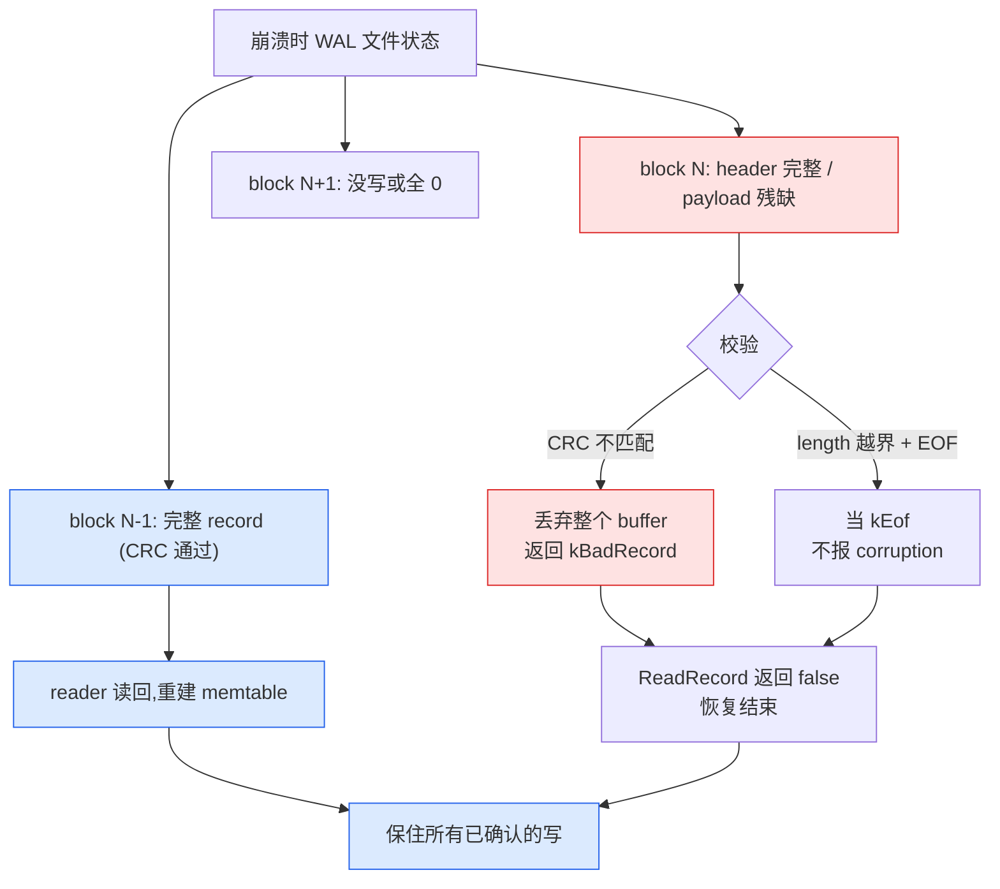

# 第 17 章 · WAL 的格式与读写

> 篇:P5 不丢不乱
> 主线呼应:第 1 篇里我们钉死过一句——**写路径必须"先 WAL、后 MemTable"**(P0-01 的 1.6 节,`db_impl.cc:1236` 的 `log_->AddRecord` 在前,`db_impl.cc:1245` 的 `InsertInto(mem_)` 在后)。那一章只点了"WAL 防丢",却没拆 WAL **这个文件本身长什么样**。这一章就拆它:为什么 WAL 不是一条记录一行地写,而要先切成 32KB 的 block、每条记录前还要塞 7 字节的 header?为什么一条大 batch 要被切片成 First/Middle/Last 三段?为什么每条记录都要算一遍 CRC32C?读完你会发现,WAL 的格式不是随手拍的,它是被"**磁盘会撕裂写、文件会增长、批量写会变大**"这三件事逼出来的。

## 核心问题

**WAL 文件到底怎么组织?一条 `Put` 进来,LevelDB 怎么把它追加到 WAL 文件里、崩了之后又怎么一条条读回来?为什么是这个格式而不是别的?**

读完本章你会明白:

1. WAL 的"32KB block + 7 字节 header"是怎么来的,以及那个看起来神秘的"6 字节 trailer"为什么其实是 7 字节 header 的副产品。
2. 一条 WriteBatch(可能几十 KB)跨 block 时,怎么被分片成 `kFirstType` / `kMiddleType` / `kLastType` 多条 physical record,读回来又怎么拼回一条 logical record。
3. CRC32C(Castagnoli 多项式)怎么防住"撕裂写"(torn write)——磁盘把一个扇区写了一半就崩,恢复时怎么靠 CRC 丢掉损坏的尾部、保住之前所有已确认的写。
4. 为什么 `log::Writer` 和 `log::Reader` 这套机制不光用在 WAL,连 Manifest 文件都直接复用——一个格式扛两份活。

> **如果一读觉得太难**:先只记住三件事——① WAL 按 32KB block 切,每条记录前有 7 字节 header(crc+length+type);② 一条大 batch 会被切成 First/Middle/Last 多片;③ 每片都带 CRC32C,恢复时一遇坏数据就停。细节(header 的 little-endian 编码、Mask 的旋转、reader 的 resync)是给"想看清最后一颗螺丝"的人看的。

---

## 17.1 一句话点破

> **WAL 是一个只追加的文件,被切成一个个 32KB 的 block;每条记录由 7 字节 header(4 字节 CRC32C + 2 字节长度 + 1 字节类型)+ payload 组成。一条 WriteBatch 装不下一个 block 时就被切片成多段,每段独立带 CRC。恢复时逐条读、逐条校验,遇到坏记录就停——这恰好丢掉的是"崩溃时写了一半"的那一段,保住的是"已经 `AddRecord` 返回 ok"的所有写。**

这是结论,不是理由。本章倒过来拆:先看"为什么要切 block",再看"为什么要切片",最后看"CRC 凭什么兜得住撕裂"。

---

## 17.2 为什么是 32KB 的 block:校验粒度与对齐

朴素的写法是这样:每来一条 WriteBatch,我把它序列化成一段字节,直接 `append` 到 WAL 文件末尾,前面加个长度前缀,完事。读的时候按长度读回来。听起来最简单。

> **不这样会怎样**:朴素写法有两个致命问题。第一,**没有校验粒度**。文件末尾是一个无结构的长字节流,如果崩在某个长度前缀的中间,reader 根本不知道"这条记录从哪开始、到哪结束",后面所有数据都成了乱码。第二,**没有对齐**。一条小记录可能横跨两个 4KB 的扇区,读的时候要么每次都跨边界、要么得把整个文件当一坨来处理。

所以 LevelDB 把 WAL 切成了一个个**固定大小的 block**,默认 `kBlockSize = 32768`(32KB,见 [`db/log_format.h:27`](../leveldb/db/log_format.h#L27)):

```cpp
// db/log_format.h:27
static const int kBlockSize = 32768;

// Header is checksum (4 bytes), length (2 bytes), type (1 byte).
static const int kHeaderSize = 4 + 2 + 1;   // = 7
```

每个 block 内塞若干条 record,一条 record 由"7 字节 header + payload"组成。block 是 WAL 的**物理边界**:reader 每次按 32KB 整块读(`log_reader.cc:195` 的 `file_->Read(kBlockSize, ...)`),坏了一块就跳到下一块,不会污染整个文件。

为什么是 32KB 而不是 4KB 或 1MB?这是几条需求撞在一起的折中:

- **要够大,让小记录能塞下**:一条几 KB 的 WriteBatch 应该能整个塞进一个 block 里(用 `kFullType` 标记),而不是动不动就切片。32KB 对 LevelDB 写组(group commit,P1-06)典型的几十~几百条小写来说,绰绰有余。
- **要够小,恢复时校验粒度合理**:一个 block 撕裂了,影响范围就是这个 block,不会一坏坏一片。
- **和常见块设备/页对齐友好**:32KB 是 2 的幂(`2^15`),也正好是 SSD 一个 erase block 的小份额、是 HDD 顺序读的舒服单元。

> **钉死这件事**:32KB block 不是性能极限,是**校验与对齐的平衡点**。它让"坏一块只丢一块、读一块只占一个边界"这两件事同时成立。

---

## 17.3 那个容易看错的"6 字节 trailer"

翻开 [`doc/log_format.md`](../leveldb/doc/log_format.md) 会看到这句官方说明:

> A record never starts within the last six bytes of a block (since it won't fit). Any leftover bytes here form the trailer, which must consist entirely of zero bytes and must be skipped by readers.

初读会犯迷糊:header 明明是 **7 字节**(`kHeaderSize = 4 + 2 + 1 = 7`),为什么 trailer 是 **6 字节**?这不是自相矛盾吗?

不是。把这俩数字摆在一起看就清楚了:

- 一条 record 最小也得有"7 字节 header + 0 字节 payload"= **7 字节**。
- 如果当前 block 还剩 **6 字节**或更少,那这 6 字节连一个 header 都塞不下,**根本没法在当前 block 起一条新记录**。
- 所以这 6 字节(或更少)就是**填零废弃**,reader 一跳就过去了。writer 会把下一个 block 开头作为新记录的起点。

那么 writer 具体怎么"填零废弃"?看 [`db/log_writer.cc:44-54`](../leveldb/db/log_writer.cc#L44-L54):

```cpp
const int leftover = kBlockSize - block_offset_;
assert(leftover >= 0);
if (leftover < kHeaderSize) {                  // db/log_writer.cc:46 —— 剩余不足 7 字节
  // Switch to a new block
  if (leftover > 0) {
    // Fill the trailer (literal below relies on kHeaderSize being 7)
    static_assert(kHeaderSize == 7, "");
    dest_->Append(Slice("\x00\x00\x00\x00\x00\x00", leftover));   // db/log_writer.cc:51 —— 填 0 到块尾
  }
  block_offset_ = 0;                            // db/log_writer.cc:53 —— 跳到下一块的开头
}
```

那个 `"\x00\x00\x00\x00\x00\x00"` 字面量正好 6 字节(`leftover` 最大到 6),配合 `static_assert(kHeaderSize == 7, "")` 这条编译期断言,把"7 字节 header ↔ 6 字节 trailer 上限"这层关系焊死了——要是哪天有人改 `kHeaderSize`,编译器立刻报错。

> **钉死这件事**:`kHeaderSize = 7` 与"trailer 最多 6 字节"是同一件事的两面。header 7 字节,意味着"块尾不到 7 字节就没法起新记录",这 6 字节是 header 大小逼出来的副产品,不是另设的参数。

---

## 17.4 一条大 batch 怎么跨 block:`kFirstType` / `kMiddleType` / `kLastType`

到这里为止,我们假设每条 record 都能塞进当前 block 的剩余空间。但 WriteBatch 可以很大——一次 group commit 把几千条写打包,几十 KB 是家常便饭。一个 block 只有 32KB,塞不下怎么办?

朴素的解法是"把 block 调大到能装下最大的 batch"。但这破坏了"32KB 校验粒度"的好处,而且你永远不知道用户的 batch 会多大。

LevelDB 的解法是**切片(framenting)**:一条 WriteBatch 在逻辑上是一条 record,但在物理上可以分成最多三段,分散在连续的几个 block 里。每段都是一个独立的 physical record(各自带 header),靠 `type` 字段标明自己在 logical record 里的位置。类型在 [`db/log_format.h:14-24`](../leveldb/db/log_format.h#L14-L24):

```cpp
// db/log_format.h:14
enum RecordType {
  // Zero is reserved for preallocated files
  kZeroType = 0,
  kFullType = 1,         // 整条 batch 装在一条 physical record 里(常态)
  // For fragments
  kFirstType = 2,        // 切片的第一段
  kMiddleType = 3,       // 切片的中间段(可以有任意多个)
  kLastType = 4          // 切片的最后一段
};
```

四种 type 的语义一目了然:

| type | 含义 | 出现时机 |
|------|------|---------|
| `kFullType` (1) | 整条 batch 在这一个 physical record 里 | batch 不跨 block,最常见 |
| `kFirstType` (2) | batch 的第一段(后面还有) | batch 当前 block 装不下,从某个非块首位置开始 |
| `kMiddleType` (3) | batch 的中间段(前后都还有) | batch 跨了 2 个以上 block |
| `kLastType` (4) | batch 的最后一段(前面还有) | 收尾 |

writer 怎么决定 type?核心在 [`db/log_writer.cc:34-80`](../leveldb/db/log_writer.cc#L34-L80) 的 `AddRecord`:

```cpp
Status Writer::AddRecord(const Slice& slice) {
  const char* ptr = slice.data();
  size_t left = slice.size();
  Status s;
  bool begin = true;
  do {
    const int leftover = kBlockSize - block_offset_;
    if (leftover < kHeaderSize) {                       // 当前块剩余不够 header,跳新块
      if (leftover > 0) {
        dest_->Append(Slice("\x00\x00\x00\x00\x00\x00", leftover));
      }
      block_offset_ = 0;
    }

    const size_t avail = kBlockSize - block_offset_ - kHeaderSize;   // 本块还剩多少能用
    const size_t fragment_length = (left < avail) ? left : avail;    // 这一刀切多少

    RecordType type;
    const bool end = (left == fragment_length);                       // db/log_writer.cc:63
    if (begin && end) {
      type = kFullType;                                               // 一刀就切完,且是开头
    } else if (begin) {
      type = kFirstType;                                              // 开头但没切完
    } else if (end) {
      type = kLastType;                                               // 不是开头但切完了
    } else {
      type = kMiddleType;                                             // 既非开头也非结尾
    }

    s = EmitPhysicalRecord(type, ptr, fragment_length);
    ptr += fragment_length;
    left -= fragment_length;
    begin = false;
  } while (s.ok() && left > 0);
  return s;
}
```

`begin` 和 `end` 两个布尔量把 4 种 type 唯一确定下来。`do...while` 循环切完为止——空 batch 也要跑一次(发一条 0 字节的 `kFullType`,见 38-41 行注释),否则 reader 无法区分"这一条是空 batch"还是"根本没写"。

下面这张图把"WAL 文件布局 + 一条大 batch 跨 block"画清楚了:

```
WAL 文件:一个 32KB 接一个 32KB 的 block
┌─────────────────────────────────────────────────────────────────┐
│ Block 0 (32768 B)                                               │
│ ┌───────────────┬─────────────────────────────────────────────┐ │
│ │ 7 B header    │ payload (≤ 32768-7 B)                       │ │
│ │ crc+len+FULL  │ WriteBatch #1 整条(很小)                   │ │
│ ├───────────────┼─────────────────────────────────────────────┤ │
│ │ 7 B header    │ payload                                     │ │
│ │ crc+len+FULL  │ WriteBatch #2 整条                          │ │
│ ├───────────────┼─────────────────────────────────────────────┤ │
│ │ ...           │ ...                                         │ │
│ ├───────────────┼─────────────────────────────────────────────┤ │
│ │ 7 B header    │ payload(WriteBatch #N 的前半段)            │ │
│ │ crc+len+FIRST│ ──→ 跨 block,后面还有 MIDDLE/LAST          │ │
│ ├───────────────┴─────────────────────────────────────────────┤ │
│ │ 0~6 B 填零 trailer(若剩余 < 7 B)                          │ │
│ └─────────────────────────────────────────────────────────────┘ │
├─────────────────────────────────────────────────────────────────┤
│ Block 1 (32768 B)                                               │
│ ┌───────────────┬─────────────────────────────────────────────┐ │
│ │ 7 B header    │ payload(WriteBatch #N 的中段)              │ │
│ │ crc+len+MIDDLE                                                │ │
│ ├───────────────┼─────────────────────────────────────────────┤ │
│ │ ...           │ ...                                         │ │
│ ├───────────────┼─────────────────────────────────────────────┤ │
│ │ 7 B header    │ payload(WriteBatch #N 的尾段)              │ │
│ │ crc+len+LAST │ ──→ 至此 #N 拼装完毕                         │ │
│ ├───────────────┼─────────────────────────────────────────────┤ │
│ │ ... 后续记录                                                │ │
│ └─────────────────────────────────────────────────────────────┘ │
└─────────────────────────────────────────────────────────────────┘

reader 读到 FIRST 就开 scratch,读到 MIDDLE 就 append,
读到 LAST 就把 scratch 拼成完整 batch 返回。
```

> **钉死这件事**:切片是**透明的**——上层调用 `AddRecord(batch)` 一次,writer 内部可能切好几刀;上层调 `ReadRecord()` 一次,reader 内部把多片拼回完整 batch。这条"逻辑 record ↔ 物理 record"的解耦,让 WriteBatch 可以任意大,而 WAL 的物理结构永远是"7B header + payload"。

---

## 17.5 record 的 7 字节 header:little-endian 编码

`EmitPhysicalRecord` 把 header 三段塞进 7 字节的代码在 [`db/log_writer.cc:82-108`](../leveldb/db/log_writer.cc#L82-L108):

```cpp
Status Writer::EmitPhysicalRecord(RecordType t, const char* ptr,
                                  size_t length) {
  assert(length <= 0xffff);              // 2 字节 length 上限就是 65535
  assert(block_offset_ + kHeaderSize + length <= kBlockSize);

  // Format the header
  char buf[kHeaderSize];
  buf[4] = static_cast<char>(length & 0xff);      // db/log_writer.cc:89 —— length 低字节
  buf[5] = static_cast<char>(length >> 8);        // db/log_writer.cc:90 —— length 高字节
  buf[6] = static_cast<char>(t);                  // db/log_writer.cc:91 —— type

  // Compute the crc of the record type and the payload.
  uint32_t crc = crc32c::Extend(type_crc_[t], ptr, length);   // db/log_writer.cc:94
  crc = crc32c::Mask(crc);                                    // db/log_writer.cc:95 —— Mask 后再存
  EncodeFixed32(buf, crc);                                    // db/log_writer.cc:96 —— little-endian

  Status s = dest_->Append(Slice(buf, kHeaderSize));
  if (s.ok()) {
    s = dest_->Append(Slice(ptr, length));
    if (s.ok()) {
      s = dest_->Flush();
    }
  }
  block_offset_ += kHeaderSize + length;
  return s;
}
```

三个字段,三件事:

1. **length(2 字节,little-endian)**:这就是 payload 长度,上限 65535(`0xffff`,见 84 行 assert)。一个 block 32KB,刨掉 7 字节 header 后 payload 最大也就 32761 字节,2 字节够用。`buf[4] = length & 0xff`(低字节在前)、`buf[5] = length >> 8`(高字节在后),就是经典的 little-endian 编码——和 [`util/coding.h:54-62`](../leveldb/util/coding.h#L54-L62) 的 `EncodeFixed32` 一模一样的套路,只是这里手写小循环。
2. **type(1 字节)**:就是上节的 `kFullType` / `kFirstType` 等。
3. **crc(4 字节,little-endian)**:由 `EncodeFixed32(buf, crc)` 写入,我们下一节细讲。

注意 `buf` 的字节序:`buf[0..3]` 是 crc,`buf[4..5]` 是 length,`buf[6]` 是 type。reader 解码时对称地读——见 [`db/log_reader.cc:217-221`](../leveldb/db/log_reader.cc#L217-L221):

```cpp
const char* header = buffer_.data();
const uint32_t a = static_cast<uint32_t>(header[4]) & 0xff;
const uint32_t b = static_cast<uint32_t>(header[5]) & 0xff;
const unsigned int type = header[6];
const uint32_t length = a | (b << 8);                 // db/log_reader.cc:221 —— little-endian 还原
```

`length = a | (b << 8)` 把"低字节在前"还原回数值,和 writer 的 `length & 0xff` / `length >> 8` 是一对镜像。

> **钉死这件事**:WAL header 全程用 **little-endian**,不依赖 CPU 字节序。这让 WAL 文件可以在 x86(小端)和某些大端架构之间互通——虽然 LevelDB 实际几乎只在小端机器跑,但格式本身是字节序中立的。编码用 `EncodeFixed32` 而不是 `*reinterpret_cast<uint32_t*>(buf)`,正是为了避免后者依赖 CPU 端序(`util/coding.h:5-8` 的注释直说"Endian-neutral encoding")。

---

## 17.6 CRC32C 与 Mask:兜住撕裂写的最后一道关

到此为止,WAL 的格式还少一块拼图:**校验**。前面所有结构(block 切分、record 切片、header)都假定"磁盘上读出来的字节和写进去的一致"。但磁盘并不保证这件事。

### 17.6.1 什么是撕裂写(torn write)

磁盘的写不是原子的。一次写 4KB(一个扇区/页),可能因为断电、内核崩溃、硬件故障,只写了前 2KB 就停了。读到的是"前半段是新数据、后半段是旧数据或随机数据"。这就是**撕裂写**。

WAL 每秒可能被追加几十上百次,崩溃时正巧写在某个 block 中间,几乎一定会撞上撕裂。如果没有任何校验,reader 读出来的就是垃圾——它会拿前 7 字节当 header、按"假 length"读"假 payload",可能解析出一条不存在的 batch、塞进 memtable,造成**静默数据损坏**。这比直接报错可怕得多。

### 17.6.2 CRC32C:每条 record 一道校验

LevelDB 给每条 physical record 配一个 CRC32C,覆盖"type + payload":

```cpp
// db/log_writer.cc:94
uint32_t crc = crc32c::Extend(type_crc_[t], ptr, length);
crc = crc32c::Mask(crc);
EncodeFixed32(buf, crc);
```

reader 校验在 [`db/log_reader.cc:243-257`](../leveldb/db/log_reader.cc#L243-L257):

```cpp
// Check crc
if (checksum_) {
  uint32_t expected_crc = crc32c::Unmask(DecodeFixed32(header));    // db/log_reader.cc:245
  uint32_t actual_crc = crc32c::Value(header + 6, 1 + length);       // db/log_reader.cc:246
  if (actual_crc != expected_crc) {
    // Drop the rest of the buffer since "length" itself may have
    // been corrupted and if we trust it, we could find some
    // fragment of a real log record that just happens to look
    // like a valid log record.
    size_t drop_size = buffer_.size();
    buffer_.clear();
    ReportCorruption(drop_size, "checksum mismatch");                // db/log_reader.cc:254
    return kBadRecord;
  }
}
```

注意两个细节:

- **CRC 覆盖 `type + payload`**:`crc32c::Value(header + 6, 1 + length)`,从 `header[6]`(type)开始算 1 字节 type + length 字节 payload。如果 type 或 payload 任一字节被撕,都对不上。
- **CRC 不覆盖 length 和 crc 自己**:那怎么防"length 被撕"?reader 解析时,先按读到的 length 去取 payload(取多了或取少了),再算 CRC 一比对——length 错了 payload 边界就错,CRC 几乎一定对不上。万一撞大运对上了(`length` 错但 `crc` 也错得凑巧),reader 还会丢弃整个 buffer(252-253 行 `buffer_.clear()`),把损坏限制在这一个 block 内。

CRC32C 里的 "C" 是 **Castagnoli 多项式**(常数 `0x1EDC6F41`,即反向表示 `0x82F63B78`)。LevelDB 在 [`util/crc32c.cc:20`](../leveldb/util/crc32c.cc#L20) 起那张 256 项的 `kByteExtensionTable`,就是按这个多项式预计算好的查表。为什么用 Castagnoli 而不是经典 CRC-32(多项式 `0xEDB88320`)?因为 Castagnoli 在 32 位 CRC 里**汉明距离最优**(对 2 KB 以下数据,突发错误检测率更好)——iSCSI/SSE4.2 也都用它,Intel 还给了硬件指令(`CRC32`),虽然 LevelDB 这里是纯软件实现。

### 17.6.3 Mask:为什么存盘前要"旋转 15 位再 +Δ"

writer 算完 CRC,**没有直接存**,而是先 `Mask` 了一道(`log_writer.cc:95`):

```cpp
// util/crc32c.h:29-32
inline uint32_t Mask(uint32_t crc) {
  // Rotate right by 15 bits and add a constant.
  return ((crc >> 15) | (crc << 17)) + kMaskDelta;   // kMaskDelta = 0xa282ead8
}
inline uint32_t Unmask(uint32_t masked_crc) {
  uint32_t rot = masked_crc - kMaskDelta;
  return ((rot >> 17) | (rot << 15));
}
```

为什么?`crc32c.h:25-28` 的注释说得很直白:

> Motivation: it is problematic to compute the CRC of a string that contains embedded CRCs. Therefore we recommend that CRCs stored somewhere (e.g., in files) should be masked before being stored.

设想一种自指陷阱:如果某条 record 的 payload 恰好是另一条 record 的"CRC + type + payload"完整拷贝(比如 LevelDB 的 log 文件被当成数据写进了另一个 log 文件——这种"嵌入式"场景在工具/测试里不少见),不做 Mask 的话,payload 里的 CRC 字段会"凑巧"算出自己——出现自洽的假记录。Mask 把 CRC 通过"旋转 + 加常数"打散,让"算出来的 CRC"和"存进去的 CRC"之间隔一道单向函数,杜绝自指。

> **钉死这件事**:Mask 不是加密、不是为了防恶意篡改(它连 1 字节都抗不住),它只防一种很窄的"自指巧合"。但 LevelDB 还是写了,因为成本极低(两次位移 + 一次加减),收益是"不会因为 log 内容里嵌了 log 字节而出现幽灵 record"。

### 17.6.4 恢复时遇到坏 record:丢掉尾部,保住前面

CRC 真正的价值在崩溃恢复那一刻。流程是这样:

- writer `EmitPhysicalRecord` 时,先 `Append(header)` 再 `Append(payload)` 再 `Flush()`(`log_writer.cc:99-105`)。如果崩溃发生在 `Append(payload)` 中途,payload 写了一半——header 里的 length 说"这条 payload 有 N 字节",但实际只有 M < N 字节落盘。
- reader 读到这个 block 时,`buffer_.size() < kHeaderSize + length`(`log_reader.cc:222`)。如果还没到 EOF,报 "bad record length" 当 `kBadRecord`(`log_reader.cc:223-227`);如果到 EOF 了,**不报 corruption**,直接当 `kEof`(`log_reader.cc:228-232`)——这恰好对应"writer 死在写 record 的中途,这是正常崩溃,不是损坏"。
- 如果 header 完整但 payload 撕了(部分扇区写成功部分失败),CRC 一比对,报 "checksum mismatch",丢弃整个 buffer 当 `kBadRecord`(`log_reader.cc:247-255`)。

无论哪种,reader **不会把损坏的字节当有效 record 返回给上层**。上层(`RecoverLogFile`)拿到的是"完整且通过 CRC 的 logical record",坏 record 之后的所有数据全丢。这丢的是谁?**就是崩溃那一刻正在写、还没 `AddRecord` 返回 ok 的那一条**(P0-01 已点:只有 `AddRecord` 返回 ok 才算"已确认")。之前的所有写都已经写完整、通过 CRC、被 reader 读回 memtable。



> **钉死这件事**:WAL 的 CRC 不是"防止数据损坏"(那不可能,数据已经写到磁盘上了),而是**"让恢复时能识别损坏、把损坏范围限制在崩溃的那一条 record"**。这一条丢得起(它本来就没确认),前面所有已确认的丢不起,CRC 把它们守住了。这正是"先 WAL 后 MemTable"那条强约束的下半句:**WAL 落盘且通过校验才算确认**。

---

## 17.7 reader 怎么把切片拼回完整 batch

写路径(`AddRecord` → `EmitPhysicalRecord`)讲完了,读路径(`ReadRecord` → `ReadPhysicalRecord`)是它的镜像。reader 的核心循环在 [`db/log_reader.cc:56-174`](../leveldb/db/log_reader.cc#L56-L174) 的 `ReadRecord`:

```cpp
bool Reader::ReadRecord(Slice* record, std::string* scratch) {
  // ... 跳过 initial_offset 的处理(17.6 节细讲)
  scratch->clear();
  record->clear();
  bool in_fragmented_record = false;
  uint64_t prospective_record_offset = 0;
  Slice fragment;

  while (true) {
    const unsigned int record_type = ReadPhysicalRecord(&fragment);   // db/log_reader.cc:72

    switch (record_type) {
      case kFullType:                              // db/log_reader.cc:92
        // ... 直接返回 fragment 作为完整 record
        *record = fragment;
        return true;

      case kFirstType:                             // db/log_reader.cc:108
        // 开一条新 scratch
        scratch->assign(fragment.data(), fragment.size());
        in_fragmented_record = true;
        break;

      case kMiddleType:                            // db/log_reader.cc:123
        if (!in_fragmented_record) {
          ReportCorruption(...);                   // 没 FIRST 直接来 MIDDLE,坏了
        } else {
          scratch->append(fragment.data(), fragment.size());   // 累加
        }
        break;

      case kLastType:                              // db/log_reader.cc:132
        if (!in_fragmented_record) {
          ReportCorruption(...);
        } else {
          scratch->append(fragment.data(), fragment.size());
          *record = Slice(*scratch);               // 拼装完毕,返回
          return true;
        }
        break;

      case kEof:                                   // db/log_reader.cc:144
        // ...
        return false;

      case kBadRecord:                             // db/log_reader.cc:153
        if (in_fragmented_record) {
          ReportCorruption(scratch->size(), "error in middle of record");
          in_fragmented_record = false;
          scratch->clear();
        }
        break;
    }
  }
}
```

`scratch` 是 reader 提供给 caller 的临时拼装缓冲区——因为切片拼回来的完整 batch 可能比单个物理 record 大,无法放进 reader 内部固定缓冲,所以用 `std::string` 动态拼。当 `ReadRecord` 返回 `true` 时,`*record` 指向的要么是单条物理 record 的 payload(`kFullType`),要么是 `scratch` 的内容(`kFirst/Middle/Last` 拼回)。

注意 `kBadRecord` 在拼装中途出现时,reader 把已经拼的 `scratch` 全丢掉(`log_reader.cc:154-157`)——一条 batch 中间任意一片坏了,整条 batch 都不要。这和 17.6.4 的"丢尾部"一脉相承:**损坏的边界是 logical record,不是物理字节**。

### 17.7.1 `resyncing_`:从中间位置开始读

reader 还有一个看着神秘的状态 `resyncing_`(`log_reader.cc:80-89`),配合构造函数的 `initial_offset`。它的用途是"从 WAL 文件的某个 offset 开始读"时,跳过那些肯定不属于完整 record 的 `MIDDLE`/`LAST` 片段(它们的前驱 `FIRST` 在 `initial_offset` 之前,已经丢了,拼也拼不回来)。普通恢复 `initial_offset = 0`,`resyncing_ = false`,这段逻辑跳过。本书不展开,知道它是"支持从中间位置读"的细节即可。

---

## 17.8 WriteBatch 的字节,就是 WAL record 的 payload

到此你已经看清了 WAL 的物理结构。但有个一直被回避的问题:**WAL record 的 payload 里到底是什么?**

答案极简:**就是 WriteBatch 序列化后的字节**。P0-01 的 1.6 节点过 `log_->AddRecord(WriteBatchInternal::Contents(write_batch))`(`db_impl.cc:1236`),那个 `Contents` 返回的就是 `WriteBatch::rep_`(一个 `std::string`)。P1-06 会详讲 batch 的语义,这里只引用它的字节布局(源码见 [`db/write_batch.cc:5-14`](../leveldb/db/write_batch.cc#L5-L14) 的注释,真实可靠):

```
WriteBatch::rep_ :=
   sequence: fixed64       // 8 字节,本 batch 起始 sequence number
   count:   fixed32        // 4 字节,本 batch 含多少条 put/delete
   data:    record[count]  // 每条 record:1 字节 type(kTypeValue/kTypeDeletion)
                           // + varstring key (+ varstring value, 仅 kTypeValue)
```

12 字节的 header(8+4)+ 若干条变长 record。整个 `rep_` 就是 WAL 的 logical record payload——writer 不关心它内部是 put 还是 delete、key 是什么,只管把它当作一段字节切片、按 17.4 的规则切片、按 17.6 的规则算 CRC。WAL 层和 WriteBatch 层的解耦干干净净:

```
┌────────────────────────────────────────────────────────────┐
│ WAL 视角:每条 record = 7 B header + payload                │
│   └─ payload 是一段不透明的字节(WAL 不解析)               │
├────────────────────────────────────────────────────────────┤
│ WriteBatch 视角:payload = rep_ = seq(8) + count(4) + 条目  │
│   └─ WriteBatch 不关心它会被切成几片(WAL 内部细节)        │
└────────────────────────────────────────────────────────────┘
```

恢复时(`RecoverLogFile`)reader 把 payload 拼回来,交给 `WriteBatchInternal::SetContents(&batch, record)`(`db_impl.cc:438`),再 `InsertInto(&batch, mem)` 把每条 put/delete 写进 memtable。WAL 这一层从头到尾不知道"用户数据"是什么,只负责"字节怎么切片、怎么校验、怎么拼回"。

---

## 17.9 技巧精解:32KB block 对齐 + record 分片 + CRC32C 防撕裂

本章最硬的三件事——block 对齐、record 分片、CRC——其实是**同一个设计哲学的三个动作**:把"无结构的长字节流"变成"有边界、有校验、有类型"的 record 序列。我们拆透这三件事怎么协同,以及它们各自防什么。

### 三件事的协同

```
WAL 写入一个 WriteBatch 的完整流程:

┌──────────────────────────────────────────────────────────┐
│ 1. AddRecord(batch.rep_)                                 │
│    │                                                     │
│    ├─ 计算 batch 字节数,准备切片                         │
│    │                                                     │
│    ├─ 2. while 还有未写字节:                            │
│    │   ├─ 当前 block 剩余 < 7 B? → 填 0 trailer,跳新块  │ ← 32KB block 对齐
│    │   ├─ 决定这一刀切多少(fragment_length)             │
│    │   ├─ 决定 type(FIRST/MIDDLE/LAST/FULL)             │ ← record 分片
│    │   └─ EmitPhysicalRecord:                            │
│    │       ├─ header[4..5] = length(LE)                  │
│    │       ├─ header[6]   = type                         │
│    │       ├─ crc = CRC32C(type + payload)               │
│    │       ├─ header[0..3] = Mask(crc)(LE)               │ ← CRC32C
│    │       └─ Append(header) + Append(payload) + Flush() │
│    └─ 返回 ok / 错                                       │
└──────────────────────────────────────────────────────────┘
```

三个动作各自防的事:

| 动作 | 防什么 | 不这么写的后果 |
|------|--------|--------------|
| **32KB block 对齐** | 校验粒度失控、reader 无法 resync | 一处损坏污染整个文件;reader 不知道该跳到哪重读 |
| **record 分片(FIRST/MIDDLE/LAST)** | 大 batch 受 block 大小限制 | 要么 block 调到巨大(校验粒度失控)、要么 batch 大小封顶 |
| **CRC32C + Mask** | 撕裂写、自指巧合 | reader 把垃圾当 record 返回,静默数据损坏 |

### 反面对比一:一个 record 一行,不切 block

假设我们换种写法——每个 WriteBatch 写成"varint 长度 + payload"一行,文件就是这些行首尾相接。问题立刻冒出来:

1. **没有校验**:某行写一半崩了,reader 按读到的 varint 取 N 字节,取到的 N 字节里很可能跨进了下一行,后面全错。
2. **没有 resync**:一旦错位,reader 不知道下一行从哪开始,整个文件作废。
3. **没有对齐**:每行长度任意,可能横跨 4KB 扇区边界,撕裂影响范围无法预测。

这正是 LevelDB 的 `doc/log_format.md:57-66` 列出的"recordio 格式"的三个缺点。LevelDB 用 block 切分一举解决了这三件:

- 校验是**每条 physical record 一道**(不是每行一道),粒度精细。
- resync 是**按 block 边界**:`ReadPhysicalRecord` 读满 32KB(`log_reader.cc:195`),损坏了一个 block 就跳到下一个 block 起点,无需启发式。
- 对齐天然:32KB 是 2 的幂,和文件系统/磁盘块对齐友好。

### 反面对比二:无 CRC

去掉 CRC 会怎样?reader 拿到一段字节,无法判断"这是真记录还是撕裂后的垃圾"。它会:

- 把撕裂后的随机字节当 length,读到 `0x12345` 这么长的 payload。
- 把随机字节当 type,可能解析成 `kFullType`,塞进 memtable 一条不存在的写。
- **静默数据损坏**:数据库打开看似正常,但内容错了。这是最坏情况——不如直接打不开。

CRC 把"静默损坏"变成"显式 corruption 报告",并让 reader 能**安全丢弃**损坏的 record 而不是返回它。这一道校验,代价是每条 record 多 4 字节 + 一次 CRC 计算(查表法,几纳秒),换的是"恢复时的正确性强保证"。

### 反面对比三:writer 先 payload 后 header

`EmitPhysicalRecord` 是先 `Append(header)` 再 `Append(payload)`(`log_writer.cc:99-101`)。换个顺序——先 payload 后 header——会怎样?答案:**正确性不变,但恢复语义变差**。因为 reader 解析时先读 header(`log_reader.cc:217-221`)才知道 payload 多长、什么 type,如果 header 在 payload 后,reader 得先"猜"payload 多长才能跳到 header,等于把 header 的位置也变成变量,徒增复杂度。先 header 是更自然的"自描述"顺序——读到 header 就知道这条 record 多大、什么类型,无需猜。

### 三个动作合起来护住一件事

这三个动作合起来,护住的是同一件事:**WAL 的"已确认"语义**。

- 用户调 `Write`,`AddRecord` 返回 ok = "这条 batch 已经完整、CRC 正确地写进了 WAL"(虽然不一定 fsync 了,但 `Flush` 调用了)。
- 崩溃后,reader 从文件头逐条读、逐条 CRC 校验,**只把通过校验的完整 logical record 还给上层**。
- 卡在最后一条没写完的,被 reader 识别为 `kBadRecord` 或 `kEof`,**自动丢弃**。
- 所以"已确认的写"= "能被 reader 读回的写",这一等价关系正是 WAL 兜底的全部价值。

> **钉死这件事**:WAL 不是"防止数据写到一半"——磁盘做不到这点。WAL 是"写到一半也能识别出来、把没写完的丢掉、把写完的保住"。block 对齐 + 分片 + CRC 这三件事合起来,把这个"识别 + 丢弃 + 保住"的语义落到了字节级。

---

## 17.10 同一份格式,两份活:Manifest 也用 log::Writer / Reader

读到这里你可能会想:费这么大劲设计这套 record 格式,只用在 WAL 上,性价比高吗?

答案是:**这套格式被复用了**。打开 `db/version_set.cc:811`(`LogAndApply` 里初始化 descriptor_log_)和 `db/version_set.cc:905`(`Recover` 里读 manifest)你会看到:

```cpp
// db/version_set.cc:811 —— 写 Manifest 用的是 log::Writer
descriptor_log_ = new log::Writer(descriptor_file_);

// db/version_set.cc:905 —— 读 Manifest 用的是 log::Reader
log::Reader reader(file, &reporter, true /*checksum*/, 0 /*initial_offset*/);
```

Manifest 文件(下一章 P5-18 详讲)是"版本的编辑日志",里面一条条 `VersionEdit` 追加进去。LevelDB **没有为 Manifest 设计第二套格式**,而是直接复用 WAL 的 32KB block + 7 字节 header + record 分片 + CRC32C 那一套——`VersionEdit::EncodeTo` 出来的字节,当作 WAL record 的 payload 喂给 `log::Writer::AddRecord`。

这一复用印证了"`log::Writer/Reader` 是一套通用的 record framing 工具",WAL 只是它的第一个用户。下一章 P5-18 我们会看到 Manifest 怎么借用这套格式,把"SSTable 文件的增删改"也变成可崩溃恢复的追加日志。

---

## 章末小结

这一章拆完了 WAL 这个文件的物理格式。我们钉死了三件事:

1. **32KB block + 7 字节 header**:`kBlockSize = 32768`、`kHeaderSize = 7`(crc 4 + length 2 + type 1),那个"6 字节 trailer"是 `kHeaderSize = 7` 的副产品——块尾不到 7 字节就没法起新 record,这 6 字节填零废弃。
2. **record 切片**:一条 WriteBatch 跨 block 时被切成 `kFirstType` / `kMiddleType` / `kLastType`,上层一次 `AddRecord` / 一次 `ReadRecord`,内部多片拼装透明。
3. **CRC32C(Castagnoli)+ Mask**:每条 physical record 带 4 字节 CRC,覆盖 type + payload;Mask 防自指巧合;恢复时遇坏就停,丢的是"没写完的尾部",保住的是"已 `AddRecord` 返回 ok 的所有写"。

回到主线:WAL 服务二分法的**一致性**这一面——既兜前台(写路径"先 WAL 后 MemTable"的下半句:WAL 落盘且通过校验才算确认),又兜后台(崩溃恢复时从 WAL 逐条重放,把未刷盘的写重建回 memtable)。它是"不丢"的物理基础。

### 五个"为什么"清单

1. **为什么 WAL 按 32KB 切 block,而不是一行一条记录?** 校验粒度、resync、对齐三者一起要:行式无结构,一处坏全文件作废;block 是 2 的幂,reader 坏一块跳一块,粒度可控。
2. **为什么 header 是 7 字节,而 trailer 上限是 6 字节?** header = crc(4) + length(2) + type(1) = 7。block 尾剩余 < 7 字节就装不下 header,所以这 6 字节填零废弃。`static_assert(kHeaderSize == 7)` 把这层关系焊死。
3. **为什么一条大 batch 要切片,而不是把 block 调大?** 调大 block 破坏 32KB 的校验与对齐平衡;切片让 batch 可以任意大,而物理结构恒定。FIRST/MIDDLE/LAST 让 reader 能把切片拼回完整 logical record。
4. **为什么每条 record 都要 CRC,还要 Mask?** CRC32C 防撕裂写——磁盘写一半 reader 能识别出来,不至于把垃圾当 record 返回(静默损坏)。Mask(旋转 15 位 + 加常数)防"payload 里嵌了 log 字节"的自指巧合。
5. **为什么"恢复遇坏就停"是正确的?** writer 的 `AddRecord` 返回 ok 才算"已确认",没返回 ok 的那条可能没写完。reader 遇坏丢弃的恰好是这条没确认的尾部,之前所有确认的写都通过 CRC 保住了。丢与不丢的边界,正好对齐"已确认"的语义边界。

### 想继续深入往哪钻

- **CRC32C 的查表实现**:看 [`util/crc32c.cc`](../leveldb/util/crc32c.cc) 的 `kByteExtensionTable`(256 项预计算),以及 `Extend` 函数怎么用 `init_crc` 支持流式 CRC。Castagnoli 多项式 `0x82F63B78` 是反向表示,正向是 `0x1EDC6F41`。
- **`log_writer.cc` / `log_reader.cc` 配套测试**:`db/log_test.cc` 有大量边界用例(空 record、刚好塞满 block、撕裂、跨多 block 的大 record),是验证你理解最好的材料。
- **写组与 WAL 的关系**:P1-06 会讲 `BuildBatchGroup` 怎么把 N 个并发 `Write` 合并成一个 batch——这个合并后的 batch 才是 WAL 的一条 logical record。WAL 层看不见"组"的存在,它只看到一条大 batch。
- **延伸到 RocksDB**:RocksDB 的 WAL 格式基本沿用 LevelDB 这一套,但增加了 `kResetType`(用于 ring buffer 模式)和版本号头;`recyclable log` 选项复用旧 log 文件而非新建。

### 引出下一章

WAL 兜住了"用户数据未刷盘部分"——崩了能从 WAL 把写重建回 memtable。但 LevelDB 还有另一类东西也需要兜底:**SSTable 文件结构的变更**(刷盘生成新文件、compaction 合并文件、删旧文件)。如果崩在这一类操作中间,重新打开数据库时,我们怎么知道"现在磁盘上到底有哪些 SSTable、属于哪一层"?这就是 **Manifest** 的活——它复用了本章这套 record 格式(17.10 节已点),把"版本的编辑"也变成可恢复的追加日志。下一章 P5-18,我们拆 Manifest 的格式与 `DBImpl::Recover` 的完整崩溃恢复流程。

---
