# 第 18 章 · Manifest 与崩溃恢复全流程

> 篇:P5 不丢不乱
> 主线呼应:上一章 P5-17 我们拆透了 WAL——它把"用户数据未刷盘的部分"兜住,崩了能逐条重放回 memtable。但 LevelDB 还有另一类状态也怕崩:**SSTable 文件结构的变更**。MemTable 满了刷成 L0 文件、Compaction 把几层文件合并成新文件、旧文件被回收——这些操作每发生一次,数据库"此刻有哪些 SSTable、各在哪一层、key range 是什么"就变了一次。如果崩在这类操作中间,重新打开数据库时,怎么知道磁盘上**到底哪些文件算数、属于哪一层**?这就是 **Manifest** 的活。本章把 Manifest 的格式、`CURRENT` 指针、以及 `DBImpl::Recover` 的完整崩溃恢复流程一气拆透,钉死 LevelDB"两层日志分工"的全貌。

## 核心问题

**Manifest 是什么?它和 WAL 有什么不一样?`CURRENT` 这个小文件指针怎么解决"哪个 Manifest 最新"?打开数据库时 `DBImpl::Recover` 这一套复杂流程——读 CURRENT、重放 Manifest、重放 WAL——为什么必须按这个顺序、每步防的是哪种崩溃?**

读完本章你会明白:

1. **Manifest 是"版本的编辑日志"**:它本身就是一个 log 文件(直接复用 P5-17 那套 record 格式!),里面一条条追加 `VersionEdit`——加文件、删文件、改 compaction pointer、改 next file number、改 last sequence。
2. **`CURRENT` 是单文件指针**:它的内容就是"当前 Manifest 的文件名",靠"临时文件 + rename"的原子切换协议保证一致性。
3. **`DBImpl::Recover` 的完整流程**:① 读 `CURRENT` 找当前 Manifest ②重放 Manifest 的所有 `VersionEdit` 重建 `VersionSet`(得到崩溃前的文件布局)③找未归档的旧 WAL,逐个 `RecoverLogFile` 重放,把未落盘的写重建回 memtable(写满再 dump 成 L0)④`RemoveObsoleteFiles` 清理过期文件。
4. **两层日志为什么是两层**,而不是一层:WAL 兜用户数据(高频小写)、Manifest 兜文件结构(低频结构变更),各自重放、互不干扰。

> **如果一读觉得太难**:先只记住四件事——① Manifest 是 SSTable 文件结构的追加日志,复用 WAL 的 record 格式;② `CURRENT` 是个文本文件,内容是"当前 Manifest 的文件名",靠 rename 原子切换;③ 打开 DB 时先重放 Manifest 重建文件布局,再重放 WAL 重建 memtable;④ WAL 兜数据、Manifest 兜结构,两层日志分工。剩下的细节(VersionEdit 的 tag、ReuseManifest 的优化、save_manifest 的触发)是给"想把崩溃恢复每一颗螺丝都拧一遍"的人看的。

---

## 18.1 一句话点破

> **LevelDB 有两层日志:WAL 兜"用户数据未刷盘的部分",Manifest 兜"SSTable 文件结构的变更"。崩溃后,先重放 Manifest 重建出"磁盘上有哪些文件、各在哪层",再重放 WAL 把"还没刷成 SSTable 的写"重建回 memtable。两层各自追加、各自重放、互不干扰,合起来把数据库恢复到一致状态。`CURRENT` 是个小文本文件,内容就是"当前 Manifest 的文件名",靠"写临时文件 + rename"的原子切换协议保证一致性。**

这是结论,不是理由。本章倒过来拆:先看"为什么需要两层",再看 Manifest 长什么样,最后把 `DBImpl::Recover` 的每一步走一遍。

---

## 18.2 为什么需要两层日志,而不是一层

朴素的设想是这样:既然 WAL 已经能"追加 + 崩溃重放",为什么不把所有需要崩溃恢复的东西都塞进 WAL?每刷一个 SSTable、每合并一次,也在 WAL 里记一笔,恢复时全从一个 WAL 里读。听起来最简单。

> **不这样会怎样**:把用户数据和文件结构变更混在一条日志里有三个问题。

第一,**写特征截然不同**。WAL 是高频小写——每次 `Write` 都要追加一次,几十字节到几 KB,延迟敏感(直接卡着用户的 `Write` 调用)。Manifest 是低频结构变更——compaction 产出几个新文件、memtable 刷盘,才追加一次,几十字节,延迟不敏感(在后台线程做)。混在一起,WAL 的小写会被 Manifest 那种"偶尔但和当前 write 无关"的写入干扰,反过来 Manifest 也会被"WAL 不能等"的延迟要求绑架。

第二,**重放语义不同**。WAL 重放是把每条 batch 重新写进 memtable(像没崩过一样)。Manifest 重放是把每条 `VersionEdit` apply 到一个空的 Version 上(重建文件布局)。这两件事的状态机完全不同,共用一条日志就得在每条记录里加个"我是哪种 record"的标记,徒增复杂度。

第三,**生命周期不同**。WAL 在 memtable 刷盘后就可以归档/删除(它兜的那部分数据已经落盘成 SSTable 了)。Manifest 是"数据库整个生命周期的版本历史",不能因为某次刷盘就删——删了就没法重放出当前的文件布局。

所以 LevelDB 拆成了两层:

| 维度 | WAL | Manifest |
|------|-----|---------|
| 兜什么 | 用户数据(未刷成 SSTable 的写) | 文件结构(SSTable 增删、层级变更) |
| 写特征 | 高频小写(每次 `Write`),前台延迟敏感 | 低频结构变更(compaction / 刷盘),后台 |
| 重放语义 | 把每条 batch 插回 memtable | 把每条 `VersionEdit` apply 到 Version |
| 生命周期 | memtable 刷盘后可归档/删除 | 整个 DB 生命周期的版本历史 |
| 文件名 | `000123.log` | `MANIFEST-000045` |

> **钉死这件事**:两层日志不是设计冗余,是**职责分离**。WAL 是"前台的高速流水账",Manifest 是"后台的版本档案"。它们各自追加、各自重放、各自生命周期,合起来才把"数据 + 结构"都兜住。

---

## 18.3 Manifest 的格式:复用 P5-17 那一套 record framing

P5-17 的 17.10 节我们点过一句:`log::Writer/Reader` 这套 record framing 不是 WAL 专属,Manifest 直接复用。打开 [`db/version_set.cc:811`](../leveldb/db/version_set.cc#L811) 和 [`db/version_set.cc:905`](../leveldb/db/version_set.cc#L905) 你会看到:

```cpp
// db/version_set.cc:808-813 —— LogAndApply 里写 Manifest
new_manifest_file = DescriptorFileName(dbname_, manifest_file_number_);
s = env_->NewWritableFile(new_manifest_file, &descriptor_file_);
if (s.ok()) {
  descriptor_log_ = new log::Writer(descriptor_file_);    // db/version_set.cc:811 —— log::Writer!
  s = WriteSnapshot(descriptor_log_);
}

// db/version_set.cc:902-906 —— Recover 里读 Manifest
log::Reader reader(file, &reporter, true /*checksum*/,    // db/version_set.cc:905 —— log::Reader!
                   0 /*initial_offset*/);
```

`descriptor_log_` 就是 Manifest 文件的 `log::Writer`,`descriptor_file_` 是底层 `WritableFile*`(`db/version_set.h:308-309`)。Manifest 的字节布局和 WAL **一模一样**:32KB block、7 字节 header、record 切片、CRC32C——上一章那套。区别只在 **payload 的语义**:

- WAL 的 payload = WriteBatch 序列化字节(P5-17 的 17.8 节)。
- Manifest 的 payload = `VersionEdit` 序列化字节。

也就是说,Manifest 在物理上就是"WAL 同款格式的 log 文件",区别只在"这条 record 是给谁看的"。`log::Writer` 和 `log::Reader` 完全不知道上层是 WAL 还是 Manifest——这就是好抽象的力量。

### 18.3.1 `VersionEdit` 的 tag 编码

`VersionEdit` 的序列化在 [`db/version_edit.cc:42-85`](../leveldb/db/version_edit.cc#L42-L85) 的 `EncodeTo`。它用"tag + value"的变长编码,tag 在 [`db/version_edit.cc:14-24`](../leveldb/db/version_edit.cc#L14-L24):

```cpp
// db/version_edit.cc:14 —— Tag numbers 严禁改动(写在磁盘上)
enum Tag {
  kComparator     = 1,   // 比较器名字(只在 Manifest 第一条)
  kLogNumber      = 2,   // 当前活跃 WAL 的编号
  kNextFileNumber = 3,   // 下一个可用的文件编号
  kLastSequence   = 4,   // 当前最大 sequence number
  kCompactPointer = 5,   // 某层下次 compaction 从哪个 key 开始
  kDeletedFile    = 6,   // 删除某层的某个文件
  // 8 was used for large value refs
  kNewFile        = 7,   // 在某层添加某个文件(带 file_size 和 key range)
  kPrevLogNumber  = 9    // 旧版本 LevelDB 的双 log 残留,现在不用
};
```

每个 tag 都用 varint 编码(`PutVarint32`),value 也用 varint 或 length-prefixed slice。`EncodeTo` 的写法是"有就写、没有就不写"——比如 `has_log_number_` 为 true 才写 `kLogNumber` tag:

```cpp
// db/version_edit.cc:42-85(节选)
void VersionEdit::EncodeTo(std::string* dst) const {
  if (has_comparator_) {
    PutVarint32(dst, kComparator);
    PutLengthPrefixedSlice(dst, comparator_);
  }
  if (has_log_number_) {
    PutVarint32(dst, kLogNumber);
    PutVarint64(dst, log_number_);                  // db/version_edit.cc:49
  }
  // ... kPrevLogNumber / kNextFileNumber / kLastSequence 同理

  for (size_t i = 0; i < compact_pointers_.size(); i++) {
    PutVarint32(dst, kCompactPointer);
    PutVarint32(dst, compact_pointers_[i].first);   // level
    PutLengthPrefixedSlice(dst, compact_pointers_[i].second.Encode());
  }

  for (const auto& deleted_file_kvp : deleted_files_) {
    PutVarint32(dst, kDeletedFile);
    PutVarint32(dst, deleted_file_kvp.first);       // level
    PutVarint64(dst, deleted_file_kvp.second);      // file number
  }

  for (size_t i = 0; i < new_files_.size(); i++) {
    const FileMetaData& f = new_files_[i].second;
    PutVarint32(dst, kNewFile);
    PutVarint32(dst, new_files_[i].first);          // level
    PutVarint64(dst, f.number);                     // file number
    PutVarint64(dst, f.file_size);                  // file size
    PutLengthPrefixedSlice(dst, f.smallest.Encode()); // 最小 internal key
    PutLengthPrefixedSlice(dst, f.largest.Encode());  // 最大 internal key
  }
}
```

`DecodeFrom`(`db/version_edit.cc:106-204`)是对称的 while 循环:读一个 tag,switch 分支解析对应字段。注意 `kDeletedFile` 和 `kNewFile` 可以在一条 `VersionEdit` 里**出现任意多次**(代码里是 for 循环),所以一次 compaction 产出 5 个新文件、删 3 个旧文件,会编出"5 个 kNewFile 段 + 3 个 kDeletedFile 段",全在一条 `VersionEdit` 里、作为 Manifest 的一条 record。

### 18.3.2 一条 `VersionEdit` 长什么样

举个具体例子。假设某次 compaction 把 L1 的文件 #100 合并成 L2 的文件 #200,删 #100。这次结构变更产生的 `VersionEdit`,序列化后大概长这样(每行一个 tag-value 段,实际是连续字节,这里分行只为可读):

```
[Varint 7=kNewFile][Varint 2=level][Varint 200=filenum]
[Varint 2097152=filesize][varstring smallest ikey][varstring largest ikey]
[Varint 6=kDeletedFile][Varint 1=level][Varint 100=filenum]
[Varint 3=kNextFileNumber][Varint 201]
[Varint 4=kLastSequence][Varint 1234567]
```

`LogAndApply` 把这串字节当作一条 record 追加进 Manifest(`db/version_set.cc:823-824`),`descriptor_log_->AddRecord(record)` 就完事了。下一节我们看 LevelDB 什么时候写、什么时候新建 Manifest。

---

## 18.4 `LogAndApply`:每次版本变更怎么写 Manifest

`VersionSet::LogAndApply`([`db/version_set.cc:777-859`](../leveldb/db/version_set.cc#L777-L859))是"写 Manifest + 切换 Version"的核心。每次 compaction 完成、memtable 刷盘、或恢复结束,都会调它一次。它干四件事:

```cpp
// db/version_set.cc:777-859(结构示意)
Status VersionSet::LogAndApply(VersionEdit* edit, port::Mutex* mu) {
  // 1. 补全 edit 缺的字段
  if (edit->has_log_number_) {
    assert(edit->log_number_ >= log_number_);
    assert(edit->log_number_ < next_file_number_);
  } else {
    edit->SetLogNumber(log_number_);
  }
  if (!edit->has_prev_log_number_) edit->SetPrevLogNumber(prev_log_number_);
  edit->SetNextFile(next_file_number_);
  edit->SetLastSequence(last_sequence_);

  // 2. apply edit 到一个新 Version,Finalize 算 compaction score
  Version* v = new Version(this);
  {
    Builder builder(this, current_);
    builder.Apply(edit);
    builder.SaveTo(v);
  }
  Finalize(v);

  // 3. 必要时开新 Manifest(头一次打开 DB,或复用判断失败)
  std::string new_manifest_file;
  Status s;
  if (descriptor_log_ == nullptr) {                       // db/version_set.cc:804
    assert(descriptor_file_ == nullptr);
    new_manifest_file = DescriptorFileName(dbname_, manifest_file_number_);
    s = env_->NewWritableFile(new_manifest_file, &descriptor_file_);
    if (s.ok()) {
      descriptor_log_ = new log::Writer(descriptor_file_);
      s = WriteSnapshot(descriptor_log_);                  // db/version_set.cc:812 —— 写一条 snapshot
    }
  }

  // 4. 追加本次 edit + (若新建了 Manifest)切换 CURRENT
  {
    mu->Unlock();                                          // 释放锁,让 expensive I/O 不阻塞别人
    if (s.ok()) {
      std::string record;
      edit->EncodeTo(&record);
      s = descriptor_log_->AddRecord(record);              // db/version_set.cc:824 —— 追加 edit
      if (s.ok()) {
        s = descriptor_file_->Sync();                      // db/version_set.cc:826
      }
    }
    if (s.ok() && !new_manifest_file.empty()) {
      s = SetCurrentFile(env_, dbname_, manifest_file_number_);  // db/version_set.cc:836
    }
    mu->Lock();
  }

  // 5. 安装新 Version
  if (s.ok()) {
    AppendVersion(v);                                      // db/version_set.cc:844
    log_number_ = edit->log_number_;
    prev_log_number_ = edit->prev_log_number_;
  } else {
    delete v;                                              // 失败回收
    if (!new_manifest_file.empty()) {
      delete descriptor_log_; descriptor_log_ = nullptr;
      delete descriptor_file_; descriptor_file_ = nullptr;
      env_->RemoveFile(new_manifest_file);
    }
  }
  return s;
}
```

五个关键点:

1. **每次都补全 `next_file_number` / `last_sequence`**:即使 caller 没显式 Set,`LogAndApply` 也会从 VersionSet 当前状态补上。这样每条 `VersionEdit` 都是"自描述的快照增量",恢复时最后一条的 `next_file_number` / `last_sequence` 就是当前值。
2. **`descriptor_log_ == nullptr` 才开新 Manifest**:首次打开 DB 时它为空,这时新建 Manifest 文件 + 写一条 `WriteSnapshot`(把当前所有文件、compact pointer 全写进第一条 edit)。后续 `LogAndApply` 复用同一个 `descriptor_log_`,只追加增量 edit。
3. **`mu->Unlock()` 包住 `AddRecord + Sync`**:Sync 可能很慢(几十毫秒),期间释放锁让前台 `Write` 不被阻塞。这就是注释"Unlock during expensive MANIFEST log write"的用意。
4. **新建 Manifest 时才调 `SetCurrentFile`**:这是 CURRENT 切换的唯一时机——开新 Manifest 时。增量写不需要切 CURRENT(指向的还是同一个 Manifest)。
5. **失败回收**:任一步失败,`delete v` 回收新 Version,新建的 Manifest 文件也 `RemoveFile`,VersionSet 状态不变。这让 `LogAndApply` 是"要么完全成功、要么完全回滚"的原子语义。

---

## 18.5 `CURRENT` 指针:靠"临时文件 + rename"原子切换

每次开新 Manifest 都要更新 CURRENT——否则下次打开 DB 时不知道读哪个 Manifest。这个更新必须**原子**:要么 CURRENT 完整地指向新 Manifest,要么还指向旧 Manifest,不能停在"半个文件名"中间。否则崩在这一步,DB 就打不开了。

LevelDB 的解法是经典的"**临时文件 + rename**"协议。看 [`db/filename.cc:123-139`](../leveldb/db/filename.cc#L123-L139) 的 `SetCurrentFile`:

```cpp
// db/filename.cc:123
Status SetCurrentFile(Env* env, const std::string& dbname,
                      uint64_t descriptor_number) {
  // Remove leading "dbname/" and add newline to manifest file name
  std::string manifest = DescriptorFileName(dbname, descriptor_number);
  Slice contents = manifest;
  assert(contents.starts_with(dbname + "/"));
  contents.remove_prefix(dbname.size() + 1);
  std::string tmp = TempFileName(dbname, descriptor_number);      // db/filename.cc:130 —— 临时文件
  Status s = WriteStringToFileSync(env, contents.ToString() + "\n", tmp);  // db/filename.cc:131
  if (s.ok()) {
    s = env->RenameFile(tmp, CurrentFileName(dbname));            // db/filename.cc:133 —— rename 原子切换
  }
  if (!s.ok()) {
    env->RemoveFile(tmp);
  }
  return s;
}
```

三步:

1. **把新 Manifest 的文件名(去掉 `dbname/` 前缀,加换行)写进临时文件** `000045.dbtmp`。这一步不直接写 `CURRENT`,所以即使崩了 CURRENT 还是旧的,没影响。
2. **`RenameFile(tmp, CURRENT)` 把临时文件原子改名为 CURRENT**。POSIX `rename(2)` 保证这一步是原子的——要么看到旧 CURRENT,要么看到新 CURRENT,不会看到半个。LevelDB 的 `Env::RenameFile` 在各平台都包了这层原子性(`util/env_posix.cc` 调 `rename(2)`,`util/env_windows.cc` 调 `MoveFileEx` 带 `MOVEFILE_REPLACE_EXISTING | MOVEFILE_WRITE_THROUGH`)。
3. **失败时清理临时文件**。如果第 1 步或第 2 步失败,`RemoveFile(tmp)` 把残留的 `.dbtmp` 删掉,保持目录干净。

CURRENT 文件的内容就这么简单——一行文本,内容是 "MANIFEST-000045\n"。读它的代码在 [`db/version_set.cc:869-878`](../leveldb/db/version_set.cc#L869-L878):

```cpp
// Read "CURRENT" file, which contains a pointer to the current manifest file
std::string current;
Status s = ReadFileToString(env_, CurrentFileName(dbname_), &current);
if (!s.ok()) return s;
if (current.empty() || current[current.size() - 1] != '\n') {
  return Status::Corruption("CURRENT file does not end with newline");   // db/version_set.cc:876
}
current.resize(current.size() - 1);                                      // 去掉换行
std::string dscname = dbname_ + "/" + current;                           // db/version_set.cc:880 —— 拼回完整路径
```

末尾的换行是约定——`SetCurrentFile` 写时加 `\n`,`Recover` 读时检查 `\n` 存在并去掉。这一格式的"自校验"让"CURRENT 写一半就崩"(虽然 rename 原子,但万一是别的工具改坏的)能被识别出来。

> **钉死这件事**:`CURRENT` 是单文件指针,内容就是一行 Manifest 文件名。原子切换靠"临时文件 + rename",这是 POSIX 文件系统的经典原子性保证。`doc/impl.md:52-55` 对它的全部描述只有一句:"CURRENT is a simple text file that contains the name of the latest MANIFEST file."

### 反面对比一:CURRENT 用"多个候选 Manifest,比文件号"

设想换种设计:不要 CURRENT,目录下所有 `MANIFEST-*` 都保留,打开时遍历找文件号最大的那个当当前。听起来简单,但有两个坑:

1. **写一半的一致性**:新建一个 Manifest 时,文件号更大的那个可能还没写完整(WriteSnapshot 还没完)。这时候比文件号最大的那个,是坏的。要么加个"完成标志"(又回到需要某种原子切换),要么赌运气。
2. **多版本残留**:每次开新 Manifest,旧的要不要删?不删就堆成几百个;删了又得在 Manifest 里记"我自己要被替换了",鸡生蛋。

`CURRENT` 单文件指针把"哪个最新"这件事**集中到一个原子操作**(rename)上,简单且可靠。多版本 Manifest 的清理交给 `RemoveObsoleteFiles`(本章后半段),职责清晰。

### 反面对比二:CURRENT 用"嵌套指针链"

更复杂的方案是 CURRENT 指向另一个"指针文件",后者再指向真正的 Manifest——为了某种间接性。这是过度设计。LevelDB 的哲学是"简单优先",一层指针够用,就不上两层。

---

## 18.6 `WriteSnapshot`:新建 Manifest 时写一条"全量"

`LogAndApply` 第 804 行那个 `if (descriptor_log_ == nullptr)` 分支里,新建 Manifest 后会调 `WriteSnapshot`(`db/version_set.cc:1069-1097`)。这一步是"把当前 Version 的全部状态序列化成一条 `VersionEdit`,作为新 Manifest 的第一条 record":

```cpp
// db/version_set.cc:1069
Status VersionSet::WriteSnapshot(log::Writer* log) {
  VersionEdit edit;
  edit.SetComparatorName(icmp_.user_comparator()->Name());

  // 1. 所有 compact pointer
  for (int level = 0; level < config::kNumLevels; level++) {
    if (!compact_pointer_[level].empty()) {
      InternalKey key;
      key.DecodeFrom(compact_pointer_[level]);
      edit.SetCompactPointer(level, key);
    }
  }

  // 2. 当前 Version 的所有文件(每一层每个文件一条 AddFile)
  for (int level = 0; level < config::kNumLevels; level++) {
    const std::vector<FileMetaData*>& files = current_->files_[level];
    for (size_t i = 0; i < files.size(); i++) {
      const FileMetaData* f = files[i];
      edit.AddFile(level, f->number, f->file_size, f->smallest, f->largest);
    }
  }

  std::string record;
  edit.EncodeTo(&record);
  return log->AddRecord(record);                                     // db/version_set.cc:1096
}
```

为什么要 snapshot?因为旧 Manifest 里的增量 record,`LogAndApply` 完成就再也不会"回放"了——它们的意义只是"逐步把 Version 从初始状态推到当前状态"。新建一个 Manifest 时,LevelDB 选择把"当前状态"一次性 snapshot 进去,而不是把旧 Manifest 的所有 record 拷过来。这样:

- 新 Manifest 自包含——读它一条 record 就能得到当前所有文件、所有 compact pointer。
- 后续 `LogAndApply` 只往新 Manifest 追加增量。
- 旧 Manifest(`MANIFEST-000044`)就可以被 `RemoveObsoleteFiles` 删掉,腾出磁盘。

注释 `TODO: Break up into multiple records to reduce memory usage on recovery?`(`db/version_set.cc:1070`)是个待办的提示——超大 Version 的 snapshot 可能塞不进一条 record。实际上 LevelDB 一条 record 可以很大(切片成 First/Middle/Last,见 P5-17 的 17.4),所以这个 TODO 一直没动。

### 18.6.1 `ReuseManifest`:不新建 Manifest,直接追加的优化

`Recover` 结束时会调 `ReuseManifest`(`db/version_set.cc:994-1023`)判断"能不能复用旧 Manifest 而不新建"。条件是 `options_->reuse_logs` 打开、旧 Manifest 文件号合法、文件大小没超过 `TargetFileSize`(默认 2MB)。能复用就 `NewAppendableFile` 把旧 Manifest 以追加模式打开,作为 `descriptor_log_` 继续用。

这是个**省一次新建 Manifest + 切 CURRENT 开销**的优化。日常 compaction 几乎总满足复用条件,所以一个长期运行的 DB 可能很久都不会产生新 Manifest 文件——除非旧 Manifest 撑过 2MB 上限。但恢复时,如果 `ReuseManifest` 返回 true,`save_manifest` 就保持 false(`db/version_set.cc:980-981`),`DBImpl::Open` 不会再调 `LogAndApply` 写 snapshot(`db_impl.cc:1527`)。

---

## 18.7 `DBImpl::Recover`:崩溃恢复全流程

到这里,Manifest 的格式和写法都讲清了。现在把"打开 DB 时到底怎么恢复"这套流程完整走一遍。入口是 `DBImpl::Recover`([`db/db_impl.cc:292-383`](../leveldb/db/db_impl.cc#L292-L383)),由 `DB::Open`([`db/db_impl.cc:1503-1544`](../leveldb/db/db_impl.cc#L1503-L1544))在 `impl->mutex_.Lock()` 之后调用。

整个流程分四步,我们逐段拆。

### 18.7.1 第 0 步:目录与 CURRENT 检查(没有就建新 DB)

```cpp
// db/db_impl.cc:298-322
env_->CreateDir(dbname_);                                  // 忽略"已存在"错误
assert(db_lock_ == nullptr);
Status s = env_->LockFile(LockFileName(dbname_), &db_lock_);  // db/db_impl.cc:300 —— 文件锁,防多进程开同一 DB
if (!s.ok()) return s;

if (!env_->FileExists(CurrentFileName(dbname_))) {        // db/db_impl.cc:305
  if (options_.create_if_missing) {
    s = NewDB();                                            // db/db_impl.cc:309 —— 全新 DB,首次初始化
    if (!s.ok()) return s;
  } else {
    return Status::InvalidArgument(dbname_, "does not exist (create_if_missing is false)");
  }
}
// ... error_if_exists 检查
```

第一次打开一个全新 DB 时,CURRENT 不存在,`NewDB`([`db/db_impl.cc:181-214`](../leveldb/db/db_impl.cc#L181-L214))会被调用。它创建第一条 `VersionEdit`(设 comparator、log_number=0、next_file=2、last_seq=0),写到 `MANIFEST-000001`,然后 `SetCurrentFile(env_, dbname_, 1)` 让 CURRENT 指向它。一个全新的 LevelDB 数据库就此诞生——目录里多了两个文件:`MANIFEST-000001` 和 `CURRENT`。

注意 `LockFile` 在最前面:这是文件锁(`util/env_posix.cc` 用 `fcntl(F_SETLK)`),防同一目录被两个进程同时打开。恢复期间一直持锁,直到 `DBImpl` 析构。

### 18.7.2 第 1 步:重放 Manifest,重建 VersionSet

```cpp
// db/db_impl.cc:324
s = versions_->Recover(save_manifest);
```

这一步委托给 [`VersionSet::Recover`([`db/version_set.cc:861-992`](../leveldb/db/version_set.cc#L861-L992))。它干三件事:

**(a) 读 CURRENT,找到当前 Manifest 文件名**

```cpp
// db/version_set.cc:869-889(详见 18.5 节)
std::string current;
Status s = ReadFileToString(env_, CurrentFileName(dbname_), &current);
// ... 校验换行
std::string dscname = dbname_ + "/" + current;             // db/version_set.cc:880
SequentialFile* file;
s = env_->NewSequentialFile(dscname, &file);              // db/version_set.cc:882
```

**(b) 用 log::Reader 逐条读 Manifest,把每条 `VersionEdit` apply 到一个 Builder**

```cpp
// db/version_set.cc:902-945
log::Reader reader(file, &reporter, true /*checksum*/, 0 /*initial_offset*/);
Slice record;
std::string scratch;
Builder builder(this, current_);
int read_records = 0;
while (reader.ReadRecord(&record, &scratch) && s.ok()) {   // db/version_set.cc:909
  ++read_records;
  VersionEdit edit;
  s = edit.DecodeFrom(record);                              // db/version_set.cc:912 —— 解码
  if (s.ok()) {
    if (edit.has_comparator_ &&
        edit.comparator_ != icmp_.user_comparator()->Name()) {
          // 比较器名字对不上,拒绝打开
        }
  }
  if (s.ok()) {
    builder.Apply(&edit);                                   // db/version_set.cc:923 —— 累积应用
  }
  // 收集 log_number / next_file / last_sequence 等"最后一次的值"
  if (edit.has_log_number_)    { log_number    = edit.log_number_;    have_log_number    = true; }
  if (edit.has_next_file_number_){ next_file = edit.next_file_number_; have_next_file = true; }
  if (edit.has_last_sequence_) { last_sequence = edit.last_sequence_; have_last_sequence = true; }
  // ...
}
```

注意它**重放所有 record,不只是最后一条**。因为每条 `VersionEdit` 是增量(加几个文件、删几个文件),最终状态是所有增量累积的结果。第一条 record 通常是 `WriteSnapshot` 写的"全量",后续是每次 `LogAndApply` 追加的增量。Builder 把它们一个个 apply 到一个全新的 Version 上,最后 `builder.SaveTo(v)` 得到"崩溃前的最终 Version"。

**(c) 安装恢复后的 Version + 设置 VersionSet 的元字段**

```cpp
// db/version_set.cc:967-984
Version* v = new Version(this);
builder.SaveTo(v);
Finalize(v);                                                // 算 compaction score
AppendVersion(v);                                           // db/version_set.cc:972 —— 安装为 current_
manifest_file_number_ = next_file;
next_file_number_     = next_file + 1;
last_sequence_        = last_sequence;
log_number_           = log_number;
prev_log_number_      = prev_log_number;

if (ReuseManifest(dscname, current)) {                      // db/version_set.cc:980
  // 复用旧 Manifest,不写新 snapshot
} else {
  *save_manifest = true;                                    // db/version_set.cc:983 —— 通知 caller 要写新 Manifest
}
```

到这里,VersionSet 知道了崩溃前磁盘上**有哪些 SSTable、各在哪层、compact pointer 指哪、log_number 是几、last_sequence 是多少**。文件布局已经"复活"。但 memtable 还是空的——这是下一步的活。

### 18.7.3 第 2 步:找未归档的 WAL,逐个重放

```cpp
// db/db_impl.cc:328-376
SequenceNumber max_sequence(0);

// 找出比 Manifest 记录的 log_number 更"新"的 .log 文件
// (这些是 Manifest 记录 log_number 之后又开的 WAL,没在 Manifest 里登记过)
const uint64_t min_log  = versions_->LogNumber();           // db/db_impl.cc:337
const uint64_t prev_log = versions_->PrevLogNumber();       // db/db_impl.cc:338
std::vector<std::string> filenames;
s = env_->GetChildren(dbname_, &filenames);                 // db/db_impl.cc:340
// ... 顺便检查 Manifest 里登记的 SSTable 文件是不是都还在(expected)
std::vector<uint64_t> logs;
for (...) {
  if (type == kLogFile && ((number >= min_log) || (number == prev_log)))
    logs.push_back(number);                                 // db/db_impl.cc:353
}

// 按文件号升序重放(老的先放,新的后放)
std::sort(logs.begin(), logs.end());                        // db/db_impl.cc:364
for (size_t i = 0; i < logs.size(); i++) {
  s = RecoverLogFile(logs[i], (i == logs.size() - 1), save_manifest, edit, &max_sequence);
  if (!s.ok()) return s;
  versions_->MarkFileNumberUsed(logs[i]);                   // db/db_impl.cc:375
}

if (versions_->LastSequence() < max_sequence) {
  versions_->SetLastSequence(max_sequence);                 // db/db_impl.cc:378-379
}
```

关键点:

- **要重放的 WAL 是"Manifest 没登记过的"那些**。Manifest 里记录的 `log_number` 是"最后一条 VersionEdit 时的活跃 WAL",但之后用户可能又写了 N 次、`logfile_` 可能已经轮换了好几轮(每次 memtable 满了刷盘,会开新 WAL)。这些"WAL 比 Manifest 新"的日志,就是"未归档、需要重放"的部分。这就是为什么代码用 `number >= min_log`——比 Manifest 记录的更新就重放。
- **按文件号升序**:老 WAL 先重放,新 WAL 后重放。这保证 sequence number 单调递增地写进 memtable。
- **每个 WAL 重放完,`MarkFileNumberUsed`** 把这个文件号标记为已用,防止 `NewFileNumber` 再发同一个号(虽然正常不会发生,但崩溃恢复的防御性)。

### 18.7.4 第 3 步:`RecoverLogFile` 把每条 batch 重建回 memtable

[`RecoverLogFile`([`db/db_impl.cc:385-503`](../leveldb/db/db_impl.cc#L385-L503)) 是"单个 WAL 文件的重放器"。它的核心循环:

```cpp
// db/db_impl.cc:412-422 —— 用 P5-17 的 log::Reader 读 record
log::Reader reader(file, &reporter, true /*checksum*/, 0 /*initial_offset*/);

// db/db_impl.cc:432-467 —— 逐条 ReadRecord,塞进 memtable
std::string scratch;
Slice record;
WriteBatch batch;
int compactions = 0;
MemTable* mem = nullptr;
while (reader.ReadRecord(&record, &scratch) && status.ok()) {
  if (record.size() < 12) {
    reporter.Corruption(record.size(), Status::Corruption("log record too small"));
    continue;
  }
  WriteBatchInternal::SetContents(&batch, record);          // db/db_impl.cc:438
  if (mem == nullptr) {
    mem = new MemTable(internal_comparator_);
    mem->Ref();
  }
  status = WriteBatchInternal::InsertInto(&batch, mem);      // db/db_impl.cc:444 —— 重建进 memtable
  // ... 跟踪 max_sequence
  if (mem->ApproximateMemoryUsage() > options_.write_buffer_size) {
    compactions++;
    *save_manifest = true;
    status = WriteLevel0Table(mem, edit, nullptr);          // db/db_impl.cc:458 —— mem 满了,刷成 L0
    mem->Unref();
    mem = nullptr;
  }
}
delete file;

// db/db_impl.cc:472-491 —— 复用最后一个 log 文件的优化
if (status.ok() && options_.reuse_logs && last_log && compactions == 0) {
  // 把最后一个 .log 以 append 模式打开,继续往后写,省一个新建文件
  // ...
}

// db/db_impl.cc:493-500 —— 残留的 mem 刷成 L0
if (mem != nullptr) {
  if (status.ok()) {
    *save_manifest = true;
    status = WriteLevel0Table(mem, edit, nullptr);          // db/db_impl.cc:497
  }
  mem->Unref();
}
```

几个精妙处:

1. **reader 总是开 checksum**(`true`):即使 `paranoid_checks == false`,恢复时也强制 CRC。注释(`db/db_impl.cc:418-421`)说得很直白:"We intentionally make log::Reader do checksumming even if paranoid_checks==false so that corruptions cause entire commits to be skipped instead of propagating bad information (like overly large sequence numbers)."——宁可整条 batch 跳过,也不能让坏数据(比如瞎大的 sequence)污染 memtable。
2. **memtable 重建过程中满了**(`ApproximateMemoryUsage() > write_buffer_size`)就**当场刷成 L0 SSTable**(`WriteLevel0Table`),同时 `*save_manifest = true` 标记"刷出了新文件,需要在恢复结束时写进 Manifest"。这意味着恢复过程本身可能产出若干新 L0 文件。
3. **`reuse_logs` 优化**:如果这是最后一个 WAL、且重放过程中没触发刷盘(`compactions == 0`),就把这个 `.log` 以 append 模式重开,后续 `Write` 接着往里写,省一次新建 WAL。这是 `options_.reuse_logs` 的语义。
4. **最后残留的 mem 也刷成 L0**:WAL 重放完,如果 mem 不为空(且没被复用),就刷成 L0。这样恢复结束后 `mem_` 一定是空的,`DBImpl::Open` 会再开新 WAL + 新 memtable(`db_impl.cc:1512-1525`)。

### 18.7.5 第 4 步:`save_manifest` 决定是否写新 Manifest,然后清理

`Recover` 返回后,`DBImpl::Open` 接力:

```cpp
// db/db_impl.cc:1508-1535
VersionEdit edit;
bool save_manifest = false;
Status s = impl->Recover(&edit, &save_manifest);            // db/db_impl.cc:1511
if (s.ok() && impl->mem_ == nullptr) {
  // 恢复完 mem_ 是空的,开新 WAL + 新 memtable
  uint64_t new_log_number = impl->versions_->NewFileNumber();
  WritableFile* lfile;
  s = options.env->NewWritableFile(LogFileName(dbname, new_log_number), &lfile);
  if (s.ok()) {
    edit.SetLogNumber(new_log_number);
    impl->logfile_ = lfile;
    impl->logfile_number_ = new_log_number;
    impl->log_ = new log::Writer(lfile);
    impl->mem_ = new MemTable(impl->internal_comparator_);
    impl->mem_->Ref();
  }
}
if (s.ok() && save_manifest) {
  edit.SetPrevLogNumber(0);                                  // db/db_impl.cc:1528 —— 旧 log 不再需要
  edit.SetLogNumber(impl->logfile_number_);
  s = impl->versions_->LogAndApply(&edit, &impl->mutex_);   // db/db_impl.cc:1530 —— 写 Manifest
}
if (s.ok()) {
  impl->RemoveObsoleteFiles();                              // db/db_impl.cc:1533 —— 清理过期文件
  impl->MaybeScheduleCompaction();
}
```

`save_manifest` 为 true 的两种情况:

- `Recover` 调用期间产出了新 L0 文件(`RecoverLogFile` 里 mem 满刷盘),这些新文件要登记进 Manifest。
- `ReuseManifest` 判断不能复用旧 Manifest(超 2MB、`reuse_logs` 关、等等),需要新建。

`LogAndApply(&edit, ...)` 把恢复期间累积的所有 VersionEdit(新 L0 文件、新 log_number、prev_log_number=0)一次性写进 Manifest。如果是第一次写,会触发 18.4 节那套"新建 Manifest + WriteSnapshot + SetCurrentFile"。从此 Manifest 和磁盘上的文件布局完全一致。

最后 `RemoveObsoleteFiles`([`db/db_impl.cc:225-290`](../leveldb/db/db_impl.cc#L225-L290))扫一遍目录,把"不在 live 集合"的文件删掉:

- `.log` 文件:`number < versions_->LogNumber()` 且不是 `PrevLogNumber()` 的——这些是已归档的旧 WAL(`db_impl.cc:248-250`)。
- `.ldb/.sst` 文件:`live` 集合里没有的——这些是 compaction 已经替换掉的旧 SSTable(`db_impl.cc:257`)。
- `MANIFEST-*` 文件:`number < ManifestFileNumber()` 的——这些是已经被新 Manifest 取代的旧 Manifest(`db_impl.cc:254`)。

`live` 集合由 `pending_outputs_`(正在写的输出文件)+ `versions_->AddLiveFiles()`(所有 Version 里出现的文件)合起来。这样恢复后磁盘上只剩下"当前 Version 用到的"文件,清清爽爽。

---

## 18.8 全流程图

把 18.7 的四步合成一张图:

```mermaid
flowchart TD
    Start["DB::Open 调用"] --> Lock["LockFile<br/>(防多进程)"]
    Lock --> Check{"CURRENT 存在?"}
    Check -->|"否,新建 DB"| NewDB["NewDB:<br/>写 MANIFEST-000001<br/>SetCurrentFile"]
    Check -->|"是"| ReadCurrent["读 CURRENT<br/>拿到 MANIFEST 文件名"]
    NewDB --> ReadManifest
    ReadCurrent --> ReadManifest["VersionSet::Recover:<br/>用 log::Reader 逐条读 Manifest<br/>Apply 每个 VersionEdit 到 Builder"]
    ReadManifest --> BuildVS["得到崩溃前的 Version<br/>(磁盘有哪些 SSTable、各在哪层)"]
    BuildVS --> Reuse{"ReuseManifest?"}
    Reuse -->|"是"| SkipManifest["save_manifest = false<br/>复用旧 Manifest"]
    Reuse -->|"否"| MarkManifest["save_manifest = true<br/>待会儿新建 Manifest"]
    SkipManifest --> FindLogs
    MarkManifest --> FindLogs
    FindLogs["找未归档的 WAL:<br/>number >= LogNumber 的 .log"]
    FindLogs --> SortLogs["按文件号升序"]
    SortLogs --> ReplayLogs["RecoverLogFile:<br/>log::Reader 逐条读 record<br/>InsertInto 到 memtable<br/>mem 满 → WriteLevel0Table"]
    ReplayLogs --> CheckMem{"mem 非空且不 reuse?"}
    CheckMem -->|"是"| DumpL0["WriteLevel0Table<br/>刷成 L0"]
    CheckMem -->|"否"| OpenNew
    DumpL0 --> OpenNew["开新 WAL + 新 memtable<br/>( logfile_number_ )"]
    OpenNew --> SaveManifest{"save_manifest?"}
    SaveManifest -->|"是"| LogAndApply["VersionSet::LogAndApply:<br/>写 Manifest(必要时新建+WriteSnapshot+SetCurrentFile)"]
    SaveManifest -->|"否"| Cleanup
    LogAndApply --> Cleanup["RemoveObsoleteFiles:<br/>删旧 WAL / 旧 SSTable / 旧 Manifest"]
    Cleanup --> Schedule["MaybeScheduleCompaction"]
    Schedule --> Done["DB::Open 返回 OK"]
    classDef ok fill:#dbeafe,stroke:#2563eb
    classDef new fill:#dcfce7,stroke:#16a34a
    class NewDB,LogAndApply new
    class Done ok
```



这张图里,每一步都防着一种崩溃:

- **CURRENT + Manifest**:防"文件结构变更(刷盘/compaction)中途崩"——重放出崩溃前的最终文件布局。
- **重放 WAL**:防"用户写没刷盘就崩"——把 WAL 里通过 CRC 的所有写重建回 memtable。
- **`save_manifest` + `LogAndApply`**:防"恢复期间产出的新 L0 文件没登记"——把它们也写进 Manifest,从此自洽。
- **`RemoveObsoleteFiles`**:防"旧文件残留占空间"——清干净。

---

## 18.9 技巧精解:两层日志分工 + CURRENT 单文件指针

本章最硬的两件事——两层日志的分工、CURRENT 的原子切换——其实是**同一个设计哲学的两个动作**:把"高频小写"和"低频结构变更"拆开,各自用最合适的格式与生命周期管理;把"哪个最新"的判定集中到一个原子操作上。我们拆透这两件事怎么协同,以及它们各自防什么。

### 两件事的协同:WAL 与 Manifest 的接力

```
正常运行时:
                    ┌─────────────────────────────┐
用户 Write ───────► │ WAL (000123.log)            │ 高频追加(每次 Write)
                    │  └─ record1: batch          │
                    │  └─ record2: batch          │
                    │  └─ ...                     │
                    └─────────────────────────────┘
                                  │
                    MemTable 满,刷盘成 L0 SSTable #200
                                  │
                                  ▼
                    ┌─────────────────────────────┐
后台 compaction ──► │ Manifest (MANIFEST-000045)  │ 低频追加(每次结构变更)
                    │  └─ snapshot: 当前所有文件  │
                    │  └─ edit: +文件#200         │
                    │  └─ edit: -文件#100 ...     │
                    │  └─ edit: +文件#300, -#200  │
                    └─────────────────────────────┘

崩溃恢复时(顺序严格):
  ① 读 CURRENT → 拿到 MANIFEST-000045
  ② 重放 Manifest → 知道磁盘上有文件 #300(没 #100、#200 了)
  ③ 重放 WAL 000123.log → 把没刷盘的 batch 重建回 memtable
  ④ 写新 Manifest 记录"#300 还在 + 新 log_number + 新 L0(若有)"
  ⑤ RemoveObsoleteFiles 删掉 #100、#200 等残留
```

两件事各自防的事:

| 设计 | 防什么 | 不这么写的后果 |
|------|--------|--------------|
| **两层日志(WAL + Manifest)** | 高频小写和低频结构变更互相干扰;重放语义不同;生命周期不同 | 用户写的延迟被 compaction 的结构写绑架;恢复时要在一条日志里区分 record 类型;旧 WAL 没法独立归档 |
| **CURRENT 单文件指针 + rename 原子切换** | "哪个 Manifest 最新"无法原子判定 | 比 file number 会撞到写一半的 Manifest;指针链会过度设计 |

### 反面对比一:只有一层日志(用户数据 + 结构变更混在一起)

假设合并成一条日志。问题立刻冒出来:

1. **延迟串味**:用户每次 `Write` 要等 WAL 追加,这是延迟敏感的前台路径。现在还得跟"compaction 产出 5 个文件"那种后台结构写挤一条日志——后台那条大 record 在前面写,前台这条小 record 就得排队。前台延迟被后台绑架。
2. **重放语义混乱**:一条日志里既有"插 memtable"的 batch record,又有"加文件/删文件"的 VersionEdit record。恢复时每读一条要 switch 不同状态机,出 bug 概率上升。
3. **生命周期绑死**:WAL 在 memtable 刷盘后能删(它兜的部分已经成 SSTable)。但 Manifest 是"DB 整个生命周期的版本史",不能删。混在一起,什么时候能删?要么都不删(空间浪费),要么都删(版本史丢)。

LevelDB 拆成两层,把这三件事各自解掉:WAL 走 WAL 的路(高频小写、可归档),Manifest 走 Manifest 的路(低频结构写、长期保留)。

### 反面对比二:CURRENT 用"指针链"或"比文件号"

我们在 18.5 节已经讨论过这两个反面。"比文件号"撞"写一半的 Manifest";"指针链"过度设计。`SetCurrentFile` 的"临时文件 + rename"是**最小但足够**的方案——一次 POSIX `rename(2)` 的原子性,就够了。这是 LevelDB"简单优先"哲学的典型体现。

### 反面对比三:恢复时不重放,直接信任磁盘目录

设想最朴素的"恢复":扫目录,所有 `.ldb` 文件都当活文件打开。问题:

1. **不知道哪个属于哪一层**:文件名只有文件号(`000200.ldb`),没层级信息。层级在 Manifest 里。
2. **不知道 compact pointer**:下次 compaction 从哪 key 开始。
3. **不知道 log_number / last_sequence**:WAL 重放无从下手。
4. **旧的、被 compaction 替换掉的文件可能还没删**:扫目录会把它们误当成活文件。

所以**必须**重放 Manifest 才能知道"磁盘上哪些文件算数、各在哪层、compact 指哪、sequence 是几"。Manifest 不是可选优化,是正确性的必要条件。

### 三个动作合起来护住一件事

两层日志 + CURRENT 这三件事合起来,护住的是同一件事:**"打开 DB 后看到的数据库状态 = 崩溃前最后一份已确认状态"**。

- Manifest 重放 = 重建"崩溃前的文件布局"。
- WAL 重放 = 重建"已 AddRecord 返回 ok、但还没刷盘的写"。
- CURRENT 原子切换 = 保证"Manifest 哪条最新"不会卡在中间状态。
- `save_manifest` + `LogAndApply` + `RemoveObsoleteFiles` = 让"恢复期间产出的新文件"也登记进 Manifest、旧的清干净,从此 DB 状态自洽。

> **钉死这件事**:崩溃恢复不是"防数据丢"——磁盘上的数据没真丢,只是"状态不一致"。恢复做的事是**重建一致状态**:文件布局(Manifest 重放)+ 内存数据(WAL 重放)+ 文件清理(RemoveObsoleteFiles)。两层日志 + CURRENT 单指针,把这三件事各自落到字节日级,合起来保证"重新打开的 DB 和崩溃前的 DB 在语义上是同一个 DB"。

---

## 18.10 章末小结

这一章拆完了 LevelDB 的"崩溃恢复全流程"。我们钉死了四件事:

1. **Manifest 是"版本的编辑日志"**:它复用 P5-17 那套 record 格式(32KB block + 7B header + CRC32C + 切片),只是 payload 从 WriteBatch 换成了 `VersionEdit`——一条条记录"加文件、删文件、改 compact pointer、改 log_number、改 next_file、改 last_sequence"。
2. **`CURRENT` 是单文件指针**:内容是"当前 Manifest 文件名",靠 `SetCurrentFile` 的"临时文件 + rename"原子切换。
3. **`DBImpl::Recover` 四步走**:① 读 CURRENT 找 Manifest ②`VersionSet::Recover` 重放 Manifest 重建 VersionSet ③找未归档的 WAL,逐个 `RecoverLogFile` 重放回 memtable(满了刷成 L0)④`save_manifest` 决定是否写新 Manifest + `RemoveObsoleteFiles` 清理。
4. **两层日志分工**:WAL 兜用户数据(高频小写、可归档),Manifest 兜文件结构(低频结构写、长期保留)。各自追加、各自重放、互不干扰。

回到主线:这一章和上一章 P5-17 一起,服务二分法的**一致性**这一面——既兜前台(写路径"先 WAL 后 MemTable"的下半句:WAL 落盘且通过 CRC 才算确认),又兜后台(compaction 产出新文件中途崩了,Manifest 重放出崩溃前的最终文件布局)。**WAL + Manifest 这两层日志,就是 LevelDB"不丢不乱"的全部物理基础**。

### 五个"为什么"清单

1. **为什么需要两层日志(WAL + Manifest),不合并成一层?** 写特征、重放语义、生命周期三方面都截然不同。合并会让前台小写被后台结构写绑架、重放时状态机混乱、旧 WAL 没法独立归档。两层分工让各自走自己的路。
2. **为什么 Manifest 复用 WAL 的 record 格式?** `log::Writer/Reader` 是通用的 record framing 工具(32KB block、7B header、切片、CRC32C)。Manifest 的需求(追加 + 崩溃重放 + 校验)和 WAL 完全一样,只是 payload 语义不同。复用省了重新设计、重新调试一套格式的成本。
3. **为什么 `CURRENT` 是单文件指针,而不是比文件号?** 比 file number 会撞"写一半的 Manifest"(file number 更大但内容没写完)。`SetCurrentFile` 的"临时文件 + rename"用一次 POSIX `rename(2)` 的原子性,把"哪个 Manifest 最新"集中到一次原子操作上,简单且可靠。
4. **为什么恢复时必须先重放 Manifest 再重放 WAL?** Manifest 重放给出"磁盘上有哪些 SSTable、属于哪层、log_number 是几"——这些是 WAL 重放的输入。没有 Manifest,WAL 重放不知道"哪些 WAL 已归档不用重放"、不知道"last_sequence 从哪接着算"。顺序反了就乱套。
5. **为什么 `RecoverLogFile` 里 memtable 满了要当场刷成 L0?** 一个大 WAL 重放时可能塞满好几个 memtable 大小(`write_buffer_size`,默认 4MB)。不刷就会 OOM。当场刷成 L0 SSTable,把这批已重建的数据落盘,同时 `save_manifest = true` 让后续 `LogAndApply` 把这些新 L0 文件登记进 Manifest。

### 想继续深入往哪钻

- **Manifest 的 tag 编码**:`db/version_edit.cc:14-24` 的 `enum Tag`。`kComparator = 1`、`kNewFile = 7`、`kDeletedFile = 6` 等。注意 `kPrevLogNumber = 9` 是为兼容旧版本 LevelDB 的"双 log"机制保留的(现在不用,但 DecodeFrom 还会读)。tag 顺序不连续(8 缺失)是因为历史遗留(`8 was used for large value refs`,早期 LevelDB 有"大值外部存储",后来移除)。
- **VersionSet 的字段语义**:`db/version_set.h:301-309` 那一组字段(`next_file_number_` / `manifest_file_number_` / `descriptor_file_` / `descriptor_log_` / `log_number_` / `prev_log_number_`)是恢复的核心状态。`descriptor_file_` 是 Manifest 的 `WritableFile*`,`descriptor_log_` 是它的 `log::Writer`。
- **`LogAndApply` 的并发**:`db/version_set.cc:817-840` 那段 `mu->Unlock() ... mu->Lock()` 是"释放锁做昂贵 I/O"的经典模式。注意它假设调用者(`DBImpl`)持有 `mutex_`,所以传 `port::Mutex* mu` 进来。
- **`RemoveObsoleteFiles` 的清理逻辑**:`db/db_impl.cc:225-290`。注意 `kDescriptorFile` 的判定(`number >= versions_->ManifestFileNumber()`,247-254 行)——比当前 Manifest 文件号更小的 Manifest 都可以被删,但保留当前及更新的(防竞态)。
- **延伸到 RocksDB**:RocksDB 把 Manifest 拆成了"列族 manifest + 全局 manifest"两层,引入了"Snapshot file"概念,但核心思想(LevelDB 这套两层日志 + CURRENT 单指针)完全沿用。RocksDB 的 `VersionEdit` 字段更多(支持列族、压缩字典、范围 tombstone 等),但 tag 编码思路一致。

### 引出下一章

P5-17 和本章 P5-18 一起,把 LevelDB 的"一致性兜底"讲完了——WAL 兜用户数据,Manifest 兜文件结构,CURRENT 指针保证 Manifest 切换原子,恢复时各自重放、互不干扰。这套机制是 LevelDB"不丢不乱"的全部物理基础。但支撑这一切——WAL 的写入、Manifest 的 Sync、SSTable 的读取、cache 的并发——都需要一层**平台抽象**:文件操作、线程调度、时间获取。这就是下一章 P6-19 开始的第 6 篇"性能基建":我们先看 LevelDB 怎么手写一个 LRU cache(block cache + table cache),再看 `Env` 抽象怎么把平台相关操作藏起来。一致性兜底已经够稳,接下来看支撑它的性能基建够不够快。

---
