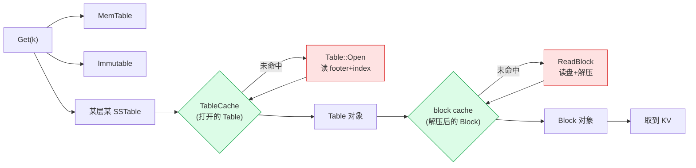

# 第十九章 · ShardedLRUCache:block cache 与 table cache

> 篇:P6 性能基建
> 主线呼应:前面五篇把"一条写怎么进来、怎么不丢、怎么落成文件、怎么被读出来、后台怎么收拾、崩了怎么恢复"全部讲透了。从这一章起,两章性能基建,讲 LevelDB 用什么手段让前面这一切**跑得快、跑得稳、还能跨平台**。这一章讲**缓存**:读路径要反复读 block、反复打开 Table,没有缓存,读放大会比 P0-01 算的那笔账还要炸;有了缓存,热点数据常驻内存,绝大多数读不动磁盘。LevelDB 没有用 STL 拼一个 LRU,而是手写了一个 `ShardedLRUCache`——本章讲清它凭什么这么写,以及为什么"手写"不是炫技,是被四条硬需求逼出来的。

## 核心问题

**为什么 LevelDB 手写一个 LRU cache,而不用 `std::list` + `std::unordered_map` 这套经典组合?它到底要满足哪些 STL 做不到的事?又怎么用 16 路分片把锁争用摊薄?**

读完本章你会明白:

1. LevelDB 对 cache 有四条硬需求,任一条都让"STL 拼 LRU"力不从心:**按字节计费**(不只是按条数)、**handle 内联引用计数**(pin 语义)、**LRU 淘汰回调**(evict 时通知上层释放 Block/Table)、**同时是哈希 entry + 链表节点 + 引用计数对象的三合一 handle**。
2. 一个 `LRUHandle` 结构体怎么同时扮演三个角色,凭什么这样省了一次指针解引用、还对 cache line 友好;`refs` 字段的语义为什么是 `1` 在 LRU 链表、`>=2` 在 in-use 链表。
3. 16 路分片(`kNumShardBits = 4`)为什么用**哈希值的高 4 位**选分片(而不是低位),为什么是 2 的幂。
4. **block cache** 和 **table cache** 缓存的根本不是一种东西:block cache 缓存**解压后的 data block 字节**(key = `(cache_id, offset)`,charge = block 字节数),table cache 缓存**打开的 Table 对象**(key = `file_number`,charge = 1,按条数计);它们一个归 `Options::block_cache` 管(默认 8MB),一个归 `TableCache` 内部管(容量 = `max_open_files - 10`)。

> **如果一读觉得太难**:先只记住三件事——① LevelDB 手写 LRU 是被"按字节计费 + pin 语义 + 淘汰回调"这三条硬需求逼的,STL 拼不出来;② 一个 `Cache::Handle*` 同时是哈希桶节点、双向链表节点、引用计数对象;③ 16 路分片就是 16 把锁,把锁争用除以 16。细节(Refs 转移、`in_cache` 双字段、`FinishErase`)等真要调 cache 再回头看。

---

## 19.1 一句话点破

> **`ShardedLRUCache` 是一个被四条硬需求逼出来的手写 LRU:它按字节计费、handle 自带引用计数支持 pin、淘汰时回调 deleter、一个结构体同时是哈希 entry 和链表节点,再外加 16 路分片把锁摊薄。任何一条单独看都不难,五条叠在一起,STL 就拼不出来了。**

这是结论。本章倒过来拆:先看读路径为什么离不开缓存,再看四条硬需求怎么一条条把 STL 逼到墙角,然后看 `LRUHandle` 怎么"三合一",最后看分片和两种 cache 的真实用法。

---

## 19.2 读路径为什么必须有 cache:从 P0-01 的读放大说起

P0-01 立起的"三笔放大"里,**读放大**是这样算的:读一个 key,要翻 MemTable → Immutable → L0 的若干 SSTable → L1 → … → L6,每一层都可能查一次。但"查一次 SSTable"本身又是一串磁盘 I/O——在第 13 章 P3-13 我们讲过:一次 `Get` 在某个 SSTable 里的路径是 **footer → index block → (布隆过滤) → data block**,每一步若都真去磁盘读,读一个 key 的实际 I/O 次数会爆炸。

更要命的是,这些 I/O 大多数是**重复**的:同一个 SSTable 的 index block,每次 `Get` 都要读一遍;同一个 data block,如果热点 key 集中,反复读的是同一块;同一个 `Table` 对象,反复 `Open`(打开文件、读 footer、读 index)是巨大浪费。P3-13 读路径全流程图里,这些"反复读"的地方都画了缓存命中。

LevelDB 给读路径配了两层 cache:

1. **block cache**:缓存**已经从磁盘读出来并解压好的 Block 对象**。下次同一个 block 再被请求,直接从内存拿,不再读盘、不再解压。归 `Options::block_cache` 管,用户可配,默认 **8MB**(`db/db_impl.cc:116` 的 `NewLRUCache(8 << 20)`)。
2. **table cache**:缓存**已经打开的 Table 对象**(连同它底下的 `RandomAccessFile*`)。下次再访问同一个 SSTable,直接复用,不再 `Open`、不再读 footer/index。归 `TableCache` 类管,内部自建一个 LRU,容量 = `max_open_files - 10`(`db/db_impl.cc:121-124`)。



> **钉死这件事**:block cache 和 table cache 不是可选的优化,是读放大能被压低的关键一环。没有它们,LevelDB 的"读一个 key 要翻多层"会变成"读一个 key 要做几十次磁盘 I/O", LSM 在读场景根本没法用。这一章服务的二分法是**衔接**——它不直接产数据、不直接收敛,但它让前台读路径真的跑得动。

那么问题来了:这两层 cache 都需要一个并发安全、支持容量上限、支持淘汰回调的 LRU。LevelDB 为什么不直接用 STL 拼?

---

## 19.3 STL 拼 LRU 为什么不行:四条硬需求逐条逼迫

"用 `std::list<KeyValuePair>` 保序 + `std::unordered_map<Key, list::iterator>` 做查找"是 LRU 的教科书实现。落到 LevelDB 的 cache 需求上,它一条条撞墙。

### 硬需求 1:按字节 `charge` 计费,而非按条数

教科书 LRU 的容量上限是"最多 N 个条目"。LevelDB 的 cache 容量上限是"**最多 N 字节**"——一个 data block 可能 4KB,也可能 64KB;一个 Table 对象大小忽略不计。如果按条数计,要么小 block 把大 block 挤出去(不公平),要么得手动估权重。

> **不这样会怎样**:按条数计费,4KB 的小 block 和 64KB 的大 block 算同一个权重,缓存命中率会随 block 大小分布剧烈波动;更根本的是,用户配 `block_cache = 8MB` 是"8 兆字节"的意思,不是"8 兆条"。**容量必须按字节算**。

源码里这个 `charge` 字段是 `size_t`,在 [cache.cc:49](../leveldb/util/cache.cc#L49),而且 cache 的总用量是 `usage_` 累加 `charge`,不是 `++count`:

```cpp
struct LRUHandle {
  ...
  size_t charge;  // TODO(opt): Only allow uint32_t?    —— cache.cc:49
  ...
};
```

`Insert` 时 `usage_ += charge`([cache.cc:288](../leveldb/util/cache.cc#L288)),淘汰时 `usage_ -= e->charge`([cache.cc:313](../leveldb/util/cache.cc#L313)),容量检查是 `while (usage_ > capacity_ ...)`([cache.cc:294](../leveldb/util/cache.cc#L294))——**从头到尾按字节算**。

### 硬需求 2:handle 内联引用计数,pin 语义

这是最关键的一条,也是 STL LRU 最难补的。

教科书 LRU:`unordered_map<K, V>` 直接存值。但 LevelDB 的 cache 接口返回一个 `Cache::Handle*`([cache.h:46](../leveldb/include/leveldb/cache.h#L46) 的 `struct Handle {};` 是个空壳,实参是 `LRUHandle*` cast 过来的),调用方拿到 handle 之后,这块缓存的**这条记录绝不能被淘汰**,直到调用方 `Release(handle)`。

为什么?读路径是这样的:`Table::BlockReader` 从 block cache 拿到一个 `Block*`,然后把 `cache_handle` 注册到迭代器的 cleanup 里([table.cc:200](../leveldb/table/table.cc#L200) 的 `iter->RegisterCleanup(&ReleaseBlock, block_cache, cache_handle)`)。在迭代器活着期间,这个 block 必须待在内存里——如果迭代器正在遍历它的时候,cache 因为容量超限把这条记录淘汰了、调 deleter 把 `Block*` `delete` 了,迭代器再 `Seek` 就是 use-after-free。

所以 cache 必须支持 **pin**:**只要有人持着 handle,这条记录就不能被淘汰**。

> **不这样会怎样**:STL LRU 想 pin,得额外维护一个"被引用条目集合";淘汰时先查这个集合,跳过被引用的。但这破坏了"LRU 严格按访问顺序淘汰"的不变量——被 pin 的旧条目占着 capacity 却不进 LRU,容量管理会变成一本糊涂账。LevelDB 的做法是**把引用计数直接焊进 handle**,容量管理逻辑天然知道"这条能不能淘汰"。

### 硬需求 3:淘汰回调(deleter)

block cache 淘汰一个 block,要 `delete` 那个 `Block*`(否则内存泄漏);table cache 淘汰一个 `TableAndFile`,要 `delete table; delete file; delete tf;`([table_cache.cc:19-24](../leveldb/db/table_cache.cc#L19-L24) 的 `DeleteEntry`)。每条 cache 记录都自带一个 `deleter` 函数指针,淘汰时调它。

教科书 STL LRU 存的是 `V`,不知道怎么释放——如果 `V = void*`,谁负责 `delete`?如果 `V = std::any`,类型擦除的开销和正确性都是坑。

源码里 `deleter` 是 handle 的字段([cache.cc:45](../leveldb/util/cache.cc#L45)):

```cpp
struct LRUHandle {
  void* value;
  void (*deleter)(const Slice&, void* value);   // —— cache.cc:45
  ...
};
```

`Unref` 减到 0 时调它([cache.cc:231](../leveldb/util/cache.cc#L231)):`(*e->deleter)(e->key(), e->value); free(e);`。

### 硬需求 4:一个结构体同时是哈希 entry、双向链表节点、引用计数对象

前三条叠在一起,逼出了第四条:不要 `unordered_map<K, V>` + `list<KV>` 两套数据结构,把所有字段塞进**一个** `LRUHandle`。源码 [cache.cc:43-63](../leveldb/util/cache.cc#L43-L63):

```cpp
struct LRUHandle {
  void* value;
  void (*deleter)(const Slice&, void* value);
  LRUHandle* next_hash;   // 哈希桶链表的下一个
  LRUHandle* next;        // 双向链表(LRU/in-use)的下一个
  LRUHandle* prev;        // 双向链表的上一个
  size_t charge;
  size_t key_length;
  bool in_cache;          // 这条记录是否还在 cache 里(见 19.4)
  uint32_t refs;          // 引用计数
  uint32_t hash;          // key 的哈希值(缓存住,避免重复算)
  char key_data[1];       // key 的变长起始(柔性数组技巧)

  Slice key() const { ... return Slice(key_data, key_length); }
};
```

这一个结构体同时是:

| 角色 | 字段 | 谁在用它 |
|------|------|----------|
| 哈希桶节点 | `next_hash`, `hash`, `key_data`, `key_length` | `HandleTable` |
| 双向链表节点 | `next`, `prev` | `LRUCache`(`lru_` / `in_use_`) |
| 引用计数对象 | `refs`, `in_cache`, `deleter`, `value`, `charge` | `Ref`/`Unref`/`FinishErase` |

> **钉死这件事**:`Cache::Handle*` 这个对外暴露的"不透明指针",其实就是一个 `LRUHandle*`。一个指针,既是哈希表里查到的 entry,又是 LRU 链表里的节点,又是引用计数对象。**省了一次指针解引用**(对比 STL:map 找到 iterator,iterator 解引用拿到 KV,KV 里的 value 再指向真正的 Block——多一层间接),cache line 也更友好(命中时一次 load 把所有热字段都拿进来)。

> **柔性数组小技巧**:`key_data[1]` 是 C 风格的"柔性数组"占位。`Insert` 时按 key 实际长度 `malloc(sizeof(LRUHandle) - 1 + key.size())`([cache.cc:274](../leveldb/util/cache.cc#L274))——把 key 直接**内联**在 handle 末尾,又一次省掉一次内存分配、一次间接。这种小技巧在 LevelDB 源码里反复出现(参考 P1-05 Arena 的设计哲学)。

> **反面对比**:假设我们硬要用 `std::list<std::pair<Key, Value>>` + `std::unordered_map<Key, list::iterator>`:
> - 按字节计费要再加一个 `unordered_map<Key, size_t>` 存 charge,或者在 pair 里塞,迭代器/指针纠缠;
> - pin 语义要再加一个"被引用集合";
> - deleter 要把 `function<void(Key, Value)>` 塞进 value,要么牺牲类型安全要么牺牲性能;
> - 更要命的是**迭代器稳定性**:`list::splice` 移动节点会让 `unordered_map` 里的 iterator 失效与否取决于标准库实现,搬起来处处是坑。
>
> 这就是为什么 LevelDB 宁可手写 400 行 cache.cc,也不用 STL 拼——**不是炫技,是被需求逼的**。

---

## 19.4 `refs` 与 `in_cache` 双字段:语义详解

`refs` 和 `in_cache` 这两个字段的组合语义,是 `cache.cc` 里最绕、也是最精妙的部分。先把规则定死:

- **`in_cache`**:这条记录**当前是否还在 cache 的哈希表里**(即是否被 cache 本体"持有")。
- **`refs`**:这条记录当前的引用计数,**含 cache 自己那一份**(如果 `in_cache == true`)。

四条记录的"生命阶段",对应不同的 `(in_cache, refs)`:

| 阶段 | `in_cache` | `refs` | 在哪条链表 | 含义 |
|------|------------|--------|-----------|------|
| 刚 Insert,caller 持有 | true | 2 | `in_use_` | cache 一份 + caller 一份 |
| caller Release,但还在 cache | true | 1 | `lru_` | 只剩 cache 持有,可被淘汰 |
| Erase 了,但 caller 还持着 | false | 1 | 两条都不在 | cache 不要了,等 caller 释放 |
| 全部 Release | false | 0 | 已 free | 调 deleter + free |

为什么需要 `in_cache` 这个 bool,光看 `refs` 不够?源码注释 [cache.cc:24-39](../leveldb/util/cache.cc#L24-L39) 讲得很清楚,大意是:

> "Cache entry 有一个 `in_cache` 布尔,表示 cache 是否持有它。`in_cache` 变 false 而没经过 deleter 的唯一途径是:`Erase()`、`Insert` 同 key 覆盖、cache 析构。"

为什么需要这个 bool?考虑一个场景:**caller `Lookup` 拿到 handle(refs 从 1 变 2),然后另一个线程 `Erase` 了这个 key**。此时 entry 从哈希表里移除、从 LRU 链表里移除、`in_cache = false`,但 caller 还持着 handle,`refs` 从 2 减到 1——这条记录现在**不在任何链表里**,等 caller `Release` 把 `refs` 减到 0,才真正 `free`。

如果只看 `refs`,无法区分"refs==1 是 cache 持有(在 lru_ 链表)"和"refs==1 是 caller 持有(不在任何链表)"——这两种 `refs==1` 的处理完全不同。`in_cache` 就是来消歧的。

`Ref` 和 `Unref` 是这两条字段的总开关([cache.cc:218-238](../leveldb/util/cache.cc#L218-L238)):

```cpp
void LRUCache::Ref(LRUHandle* e) {
  if (e->refs == 1 && e->in_cache) {   // 原来在 lru_ 链表
    LRU_Remove(e);
    LRU_Append(&in_use_, e);            // 移到 in_use_
  }
  e->refs++;
}

void LRUCache::Unref(LRUHandle* e) {
  assert(e->refs > 0);
  e->refs--;
  if (e->refs == 0) {                   // 没人持有了
    assert(!e->in_cache);
    (*e->deleter)(e->key(), e->value);  // 调淘汰回调
    free(e);
  } else if (e->in_cache && e->refs == 1) {  // caller 都释放了,但 cache 还持有
    LRU_Remove(e);
    LRU_Append(&lru_, e);                // 从 in_use_ 移回 lru_,可被淘汰
  }
}
```

读这两段源码,把三条转移路径找出来:

1. **`lru_` → `in_use_`**:`Ref` 时发现 `refs==1 && in_cache`,从 lru 搬到 in-use,然后 `refs++`。
2. **`in_use_` → `lru_`**:`Unref` 时发现 `refs` 减到 1 且 `in_cache`,从 in-use 搬回 lru。
3. **任意 → free**:`Unref` 减到 0,调 deleter,free。

> **钉死这件事**:`refs==1` 不等于"在 lru 链表"。只有 `refs==1 && in_cache==true` 才在 lru 链表。`refs==1 && in_cache==false` 是"caller 持着、cache 不要了"的中间态,不在任何链表里。这个区分是 cache 能正确支持 `Erase` + 并发 `Release` 的关键。

源码文件顶部那段 [cache.cc:24-39](../leveldb/util/cache.cc#L24-L39) 的注释,把"in-use 链表存的是 `refs >= 2 && in_cache==true`、LRU 链表存的是 `refs == 1 && in_cache==true`、被 Erase 但还有外部引用的不在任何链表"这三条不变量讲得一清二楚。LevelDB 用注释立约,用 `assert` 守约——`~LRUCache` 析构时 [cache.cc:207](../leveldb/util/cache.cc#L207) 有 `assert(in_use_.next == &in_use_)`(防止 caller 忘了 Release),`Insert` 的淘汰循环 [cache.cc:296](../leveldb/util/cache.cc#L296) 有 `assert(old->refs == 1)`(只淘汰 lru 链表里的)。

---

## 19.5 自定义 `HandleTable`:为什么不用 `unordered_map`

`HandleTable` 是 `cache.cc` 里另一个手写件([cache.cc:70-148](../leveldb/util/cache.cc#L70-L148))——一个开地址(实际是链地址)哈希表。源码顶部注释直接说明了动机([cache.cc:65-69](../leveldb/util/cache.cc#L65-L69)):

> "我们提供自己的简单哈希表,因为它去掉了一堆移植性 hack,而且在某些编译器/运行时组合下,比内置哈希表实现更快。例如,readrandom 在 g++ 4.4.3 的内置 hashtable 上快了约 5%。"

具体设计:

- **桶数组** `LRUHandle** list_`([cache.cc:110](../leveldb/util/cache.cc#L110)),长度 `length_` 总是 2 的幂。
- **链地址**:同桶冲突的 entry 用 `next_hash` 串起来。
- **动态扩容**:`Insert` 时如果 `elems_ > length_`,调用 `Resize`([cache.cc:123-147](../leveldb/util/cache.cc#L123-L147))把桶数组翻倍,目标负载因子 ≤ 1(每个桶平均链长 ≤ 1)。
- **`FindPointer` 返回 `LRUHandle**`**([cache.cc:115-121](../leveldb/util/cache.cc#L115-L121)):返回"指向目标节点的那个槽位的指针"。这样 `Insert` 和 `Remove` 不用再扫一遍——拿到 `**ptr`,`*ptr = h` 就是插入,`*ptr = result->next_hash` 就是删除。这是链表操作的经典技巧,**一次扫描搞定增删改**。

```cpp
LRUHandle** FindPointer(const Slice& key, uint32_t hash) {
  LRUHandle** ptr = &list_[hash & (length_ - 1)];          // 桶头
  while (*ptr != nullptr && ((*ptr)->hash != hash || key != (*ptr)->key())) {
    ptr = &(*ptr)->next_hash;
  }
  return ptr;   // 指向"目标节点"或"链尾 nullptr"的槽位
}
```

> **技巧点睛**:`hash & (length_ - 1)` 是 2 的幂取模的位运算等价——`length_` 是 2 的幂时,`x % length_ == x & (length_ - 1)`,省一次除法。这是 LevelDB 源码里反复出现的小技巧(参考 P2-09 布隆过滤器的 bit 寻址)。

`hash` 字段缓存:每个 `LRUHandle` 把 `hash` 存下来([cache.cc:53](../leveldb/util/cache.cc#L53)),`FindPointer` 比较时先比 `hash`(整数相等)再比 `key`(Slice 字符串比较)——绝大多数冲突在 `hash` 比较这一步就排除了,字符串比较很少真执行。

> **反面对比**:`std::unordered_map` 的桶结构是实现定义的,且每个节点至少要存 `pair<Key, Value>` + hash + next 指针,内存开销比 `LRUHandle` 这种"三合一"大一截;更关键的是,`unordered_map` 没法让"同一个节点既在哈希表里又在另一个双向链表里"——你得让 map 存 `iterator` 或指针,多一次间接。手写 `HandleTable` 和 `LRUHandle` 共用同一个节点,这才是关键。

---

## 19.6 ShardedLRUCache:16 路分片,16 把锁

前面 `LRUCache` 是单分片、一把锁。真实的 `NewLRUCache` 返回的是一个 `ShardedLRUCache`([cache.cc:339-395](../leveldb/util/cache.cc#L339-L395)),它**内含 16 个 `LRUCache` 分片**,每个分片一把自己的 `mutex_`。

```cpp
static const int kNumShardBits = 4;
static const int kNumShards = 1 << kNumShardBits;   // 16

class ShardedLRUCache : public Cache {
 private:
  LRUCache shard_[kNumShards];
  ...
  static uint32_t Shard(uint32_t hash) { return hash >> (32 - kNumShardBits); }
  ...
};
```

每个公开方法(`Insert`/`Lookup`/`Release`/`Erase`)都是:算 key 的 hash → 用 hash 高 4 位选分片 → 转发给那个分片。以 `Insert` 为例([cache.cc:359-363](../leveldb/util/cache.cc#L359-L363)):

```cpp
Handle* Insert(const Slice& key, void* value, size_t charge,
               void (*deleter)(const Slice& key, void* value)) override {
  const uint32_t hash = HashSlice(key);
  return shard_[Shard(hash)].Insert(key, hash, value, charge, deleter);
}
```

> **不这样会怎样**:假设只有一把全局锁,所有线程的 `Lookup`/`Insert` 都串行化。读路径是 LevelDB 最热的路径之一——`Get` 一次要查 MemTable、查多层 SSTable、查 block cache,任何一个环节加全局锁都会成为吞吐瓶颈。16 路分片把锁争用摊薄到原来的 1/16(假设 hash 均匀),多核扩展性大幅改善。

**为什么用 hash 的高 4 位,而不是低 4 位?**

关键观察:`HashSlice` 用的是 `util/hash.h` 的 `Hash` 函数([cache.cc:345-347](../leveldb/util/cache.cc#L345-L347) 调 `Hash(s.data(), s.size(), 0)`),这个哈希函数的**低位可能不够均匀**(因为 `HandleTable` 内部用 `hash & (length_ - 1)` 取模——也就是用低位选桶)。如果 `Shard` 也用低位,那么"同一个分片里的所有 key"会都集中在 `HandleTable` 的某几个桶里,负载严重不均。

用**高位**选分片,分片选择和分片内哈希桶选择**完全独立**:即使所有 key 落在同一个分片,它们在分片内的桶分布仍然是均匀的。

> **钉死这件事**:分片位选"和分片内哈希正交的那一段 bit"。LevelDB 的 `HandleTable` 用低位取模,所以 `Shard` 用高位。这个细节不读源码注意不到,但它保证了"分片均匀"和"桶均匀"同时成立。

**为什么是 2 的幂(`kNumShards = 16`)?**

因为 `Shard(hash) = hash >> (32 - 4) = hash >> 28`,这个位运算要求"分片数 = 2 的幂"。如果是 17 个分片,就得用 `hash % 17`,既慢又不优雅。2 的幂让分片选择一次位运算搞定。具体选 16(而非 8 或 32)是经验值——够大让锁争用可忽略,够小让单个分片仍能装下足够的 entry 维持 LRU 有效性。

容量分配:`ShardedLRUCache` 构造时([cache.cc:352-357](../leveldb/util/cache.cc#L352-L357))把总容量 `capacity` **除以 16**(向上取整)分给每个分片。每个分片独立维护自己的 `usage_` 和 `capacity_`,淘汰只看自己的容量。这意味着:整个 cache 的实际容量上限是 `16 * ceil(capacity / 16)`,略大于 `capacity`(最多差 15 字节,实际可忽略)。

```cpp
explicit ShardedLRUCache(size_t capacity) : last_id_(0) {
  const size_t per_shard = (capacity + (kNumShards - 1)) / kNumShards;   // 向上取整
  for (int s = 0; s < kNumShards; s++) {
    shard_[s].SetCapacity(per_shard);
  }
}
```

> **技巧点睛**:`(capacity + kNumShards - 1) / kNumShards` 是经典的"整数除法向上取整"位运算技巧,比 `((capacity % kNumShards) ? ...) : ...` 这种分支写法简洁太多。LevelDB 源码里这种小技巧俯拾皆是。

---

## 19.7 `Insert` 全流程:看一眼真实的淘汰发生

把前面几节拼起来,看一次完整的 `Insert`([cache.cc:267-304](../leveldb/util/cache.cc#L267-L304))到底干了什么。这是本章最值得逐行读的一段源码。

```cpp
Cache::Handle* LRUCache::Insert(const Slice& key, uint32_t hash, void* value,
                                size_t charge,
                                void (*deleter)(const Slice& key, void* value)) {
  MutexLock l(&mutex_);                                          // 整个 Insert 持锁

  // ① 分配 handle(key 内联在尾部)
  LRUHandle* e =
      reinterpret_cast<LRUHandle*>(malloc(sizeof(LRUHandle) - 1 + key.size()));
  e->value = value;
  e->deleter = deleter;
  e->charge = charge;
  e->key_length = key.size();
  e->hash = hash;
  e->in_cache = false;
  e->refs = 1;            // for the returned handle.    —— 给 caller 的那份
  std::memcpy(e->key_data, key.data(), key.size());

  if (capacity_ > 0) {
    e->refs++;            // for the cache's reference.   —— cache 自己再持一份
    e->in_cache = true;
    LRU_Append(&in_use_, e);    // 刚 Insert,caller 在用,放 in_use_
    usage_ += charge;
    FinishErase(table_.Insert(e));   // 若同 key 已有旧条目,这里淘汰旧的
  } else {
    e->next = nullptr;            // capacity_==0 是"关缓存"的特殊配置
  }

  // ② 容量超限就从 lru_ 尾部(最旧)淘汰,直到容量达标或 lru_ 空
  while (usage_ > capacity_ && lru_.next != &lru_) {
    LRUHandle* old = lru_.next;
    assert(old->refs == 1);                            // 只淘汰 lru_ 链表里的
    bool erased = FinishErase(table_.Remove(old->key(), old->hash));
    if (!erased) { assert(erased); }
  }

  return reinterpret_cast<Cache::Handle*>(e);
}
```

四个关键点:

1. **`refs` 初值 1,然后 `++` 变 2**([cache.cc:281, 285](../leveldb/util/cache.cc#L281)):第一条 refs 给 caller(因为 `Insert` 返回 handle,caller 必然要持它),第二条 refs 给 cache 自己。所以刚 Insert 完,这条记录在 `in_use_` 链表里,`refs==2`。如果 caller 立刻 `Release`,`refs` 减到 1,`in_cache==true`,搬到 `lru_` 链表,等下次容量超限被淘汰。
2. **`capacity_ == 0` 是合法配置**(关缓存,19.4 末尾讲的):此时 `in_cache = false`,`refs = 1`,只给 caller,不进 cache,caller Release 时直接 free。这给"完全关闭缓存"留了一条干净的退路。
3. **`FinishErase(table_.Insert(e))`**:这一行看着绕,其实是"同 key 覆盖"。`table_.Insert(e)` 把新 entry 塞进哈希表,**同时返回被它顶掉的旧 entry**(如果存在);`FinishErase` 把旧 entry 从链表移除、`in_cache = false`、`Unref`。这一行完成了"Insert 一个已存在的 key 时,旧值被淘汰"的语义。
4. **淘汰循环从 `lru_.next` 即最旧的开始**:`lru_` 是哑头,`lru_.next` 是最旧([cache.cc:187](../leveldb/util/cache.cc#L187) 注释 "lru.prev is newest entry, lru.next is oldest entry")。循环只挑 `refs==1` 的(`assert(old->refs == 1)`),意味着**被 caller 持有的(`refs >= 2`,在 in-use 链表)永不被淘汰**——这就是 pin 语义的落地。

`FinishErase` 本体([cache.cc:308-317](../leveldb/util/cache.cc#L308-L317))很薄:

```cpp
bool LRUCache::FinishErase(LRUHandle* e) {
  if (e != nullptr) {
    assert(e->in_cache);
    LRU_Remove(e);             // 从链表摘下来
    e->in_cache = false;       // 标记"cache 不再持有"
    usage_ -= e->charge;
    Unref(e);                  // cache 那份 refs 减 1
  }
  return e != nullptr;
}
```

注意 `FinishErase` 只减了 cache 那一份 refs(`Unref` 把 refs 从 2 减到 1)。如果此时还有 caller 持着,refs 仍是 1,但 `in_cache` 已经是 false——这种状态下 entry 不在任何链表里(19.4 表格的第三行),等 caller 最后 Release,refs 减到 0,才真正调 deleter + free。

---

## 19.8 两种 cache 的真实用法

理论讲完了,看两种 cache 实际怎么用。它们的差异比想象中大。

### block cache:缓存解压后的 Block 字节

block cache 的 key 是 `(cache_id, block_offset_in_file)`——一个 16 字节的二元组。看 `Table::BlockReader`([table.cc:153-206](../leveldb/table/table.cc#L153-L206))怎么生成这个 key:

```cpp
if (block_cache != nullptr) {
  char cache_key_buffer[16];
  EncodeFixed64(cache_key_buffer, table->rep_->cache_id);       // 前 8 字节:Table 的 cache_id
  EncodeFixed64(cache_key_buffer + 8, handle.offset());         // 后 8 字节:block 在文件里的偏移
  Slice key(cache_key_buffer, sizeof(cache_key_buffer));
  cache_handle = block_cache->Lookup(key);
  if (cache_handle != nullptr) {
    block = reinterpret_cast<Block*>(block_cache->Value(cache_handle));
  } else {
    s = ReadBlock(table->rep_->file, options, handle, &contents);   // 命中失败,读盘+解压
    if (s.ok()) {
      block = new Block(contents);
      if (contents.cachable && options.fill_cache) {
        cache_handle = block_cache->Insert(key, block, block->size(),   // charge = block 字节数
                                           &DeleteCachedBlock);
      }
    }
  }
}
```

三个细节:

1. **`cache_id` 来自 `block_cache->NewId()`**([table.cc:72](../leveldb/table/table.cc#L72) 的 `rep_->cache_id = options.block_cache ? options.block_cache->NewId() : 0`)。`NewId` 是 `Cache` 接口的一个原子递增方法([cache.cc:379-382](../leveldb/util/cache.cc#L379-L382)),保证每个打开的 Table 拿到一个全局唯一 id。这样,即使两个 Table 引用同一个底层文件(理论场景),它们的 block cache key 也不会冲突。
2. **charge 是 `block->size()`**([table.cc:181](../leveldb/table/table.cc#L181)):这个 block 多大,就计多少字节。block cache 的 8MB 容量是字面意义,装满就按 LRU 淘汰最久不用的 block。
3. **`fill_cache` 开关**([table.cc:181](../leveldb/table/table.cc#L181) 的 `options.fill_cache`):用户可以在 `ReadOptions` 里关掉"读出来的 block 入 cache",用于大范围扫描时避免冲刷热点(参考 P3-13)。
4. **淘汰时调 `DeleteCachedBlock`**([table.cc:140-143](../leveldb/table/table.cc#L140-L143)):`delete block;`——释放这个 Block 的内存。这就是 19.3 讲的 deleter 回调的用法。

迭代器销毁时不直接 delete block,而是 `RegisterCleanup(&ReleaseBlock, block_cache, cache_handle)`([table.cc:200](../leveldb/table/table.cc#L200))——迭代器析构时调 `ReleaseBlock`,把 cache 的 refs 减 1。这就是 pin 语义:迭代器活着期间,block 不会被淘汰。

### table cache:缓存打开的 Table 对象

table cache 完全是另一回事。看 `TableCache::FindTable`([table_cache.cc:41-76](../leveldb/db/table_cache.cc#L41-L76)):

```cpp
Status TableCache::FindTable(uint64_t file_number, uint64_t file_size,
                             Cache::Handle** handle) {
  Status s;
  char buf[sizeof(file_number)];
  EncodeFixed64(buf, file_number);                       // key = file_number 的 8 字节编码
  Slice key(buf, sizeof(buf));
  *handle = cache_->Lookup(key);
  if (*handle == nullptr) {
    std::string fname = TableFileName(dbname_, file_number);
    RandomAccessFile* file = nullptr;
    Table* table = nullptr;
    s = env_->NewRandomAccessFile(fname, &file);          // 真去打开文件
    ...
    if (s.ok()) {
      s = Table::Open(options_, file, file_size, &table);  // 读 footer + index block
    }
    ...
    if (s.ok()) {
      TableAndFile* tf = new TableAndFile;
      tf->file = file;
      tf->table = table;
      *handle = cache_->Insert(key, tf, 1, &DeleteEntry);  // ★ charge = 1
    }
  }
  return s;
}
```

四点对比 block cache:

| 维度 | block cache | table cache |
|------|-------------|-------------|
| key | `(cache_id, offset)` 16 字节 | `file_number` 8 字节 |
| value | `Block*`(解压后的 block) | `TableAndFile*`(`Table*` + `RandomAccessFile*`) |
| **charge** | **`block->size()`(按字节)** | **`1`(按条数)** |
| deleter | `DeleteCachedBlock` → `delete block;` | `DeleteEntry` → `delete table; delete file; delete tf;` |
| 容量来源 | `Options::block_cache`,默认 **8 MB** | `TableCache` 内部,容量 = `max_open_files - 10` |
| 谁创建 | `Table::BlockReader`(读 data block 时) | `TableCache::FindTable`(打开 SSTable 时) |

**为什么 table cache 的 charge 是 1?** 因为 `Table` 对象本身的内存开销可以忽略不计(就一个 `Rep` 结构,几百字节),真正贵的是**它持有了一个打开的文件描述符**(以及潜在的 mmap 区域)。table cache 的真正作用不是省内存,是**省文件描述符**——`max_open_files` 是 OS 给进程的硬限制,table cache 用 LRU 保证"同时打开的文件数不超过上限"。所以 charge = 1,容量单位是"条数" = "文件数"。

> **钉死这件事**:block cache 用**字节预算**(因为它管的是内存),table cache 用**条数预算**(因为它管的是文件描述符)。同一个 `Cache` 接口、同一份 `LRUCache` 实现,通过 `charge` 字段的灵活语义,服务了两种完全不同的资源约束——这是 `charge` 抽象的精妙之处。

`db/db_impl.cc:121-124` 的 `TableCacheSize` 函数,直接证实了"按文件数计":

```cpp
static int TableCacheSize(const Options& sanitized_options) {
  // Reserve ten files or so for other uses and give the rest to TableCache.
  return sanitized_options.max_open_files - kNumNonTableCacheFiles;   // kNumNonTableCacheFiles = 10
}
```

预留 10 个 fd 给 WAL、CURRENT、Manifest 等非 SSTable 文件,剩下的全给 table cache。

---

## 19.9 技巧精解:LRU 的双向链表 + 自定义哈希 + handle 引用计数三合一

本章的硬核技巧,集中在"一个 `LRUHandle` 同时是三种角色"这件事上。我们用一个完整的"生命周期"图把所有机制串起来,然后做反面对比。

### 一个 handle 的完整一生

假设 cache 容量是 100 字节,我们连续插入三个 block:

```
时刻 t1: Insert("k1", block1, charge=40)
  ┌──────────────────────────────────────────────────┐
  │ in_use_: [k1]                                      │
  │ lru_:    (空)                                      │
  │ usage_ = 40 / 100    k1.refs = 2 (cache+caller)   │
  └──────────────────────────────────────────────────┘

时刻 t2: caller Release(k1)        —— Unref 把 refs 减到 1,in_cache=true → 移到 lru_
  ┌──────────────────────────────────────────────────┐
  │ in_use_: (空)                                      │
  │ lru_:    [k1]                                      │
  │ usage_ = 40 / 100    k1.refs = 1                  │
  └──────────────────────────────────────────────────┘

时刻 t3: Insert("k2", block2, charge=40),caller 立 Release
  ┌──────────────────────────────────────────────────┐
  │ lru_:    [k1] → [k2]                               │
  │ usage_ = 80 / 100                                  │
  └──────────────────────────────────────────────────┘

时刻 t4: Insert("k3", block3, charge=40),caller 立 Release → usage=120 > 100
  ┌──────────────────────────────────────────────────┐
  │ Insert 末尾的 while 循环:                          │
  │   lru_.next = k1 (最旧, refs==1) → FinishErase   │
  │     → table_.Remove(k1) → deleter(k1) → free     │
  │   usage_ = 80,退出循环                            │
  │ lru_:    [k2] → [k3]                               │
  └──────────────────────────────────────────────────┘
```

注意 t4 时刻的关键点:淘汰时 `assert(old->refs == 1)`([cache.cc:296](../leveldb/util/cache.cc#L296))——**只有 lru_ 链表里的(`refs==1 && in_cache==true`)才会被淘汰**。如果此时有 caller 还持着 k1(k1 在 in-use,refs==2),淘汰循环会跳过它——这就是 pin。

### 反面对比:用 STL 拼 LRU 会怎样

假设我们朴素地写一个 `STLLRU`:

```cpp
class STLLRU {
  std::list<std::pair<Key, Value>> list_;
  std::unordered_map<Key, decltype(list_)::iterator> map_;
  size_t usage_ = 0, capacity_;
 public:
  Handle* Insert(Key k, Value v, size_t charge) {
    list_.push_front({k, v});
    map_[k] = list_.begin();
    usage_ += charge;
    while (usage_ > capacity_) {
      auto& [old_k, old_v] = list_.back();
      usage_ -= ...;   // ← 哪里存 charge?
      delete old_v;     // ← 怎么知道 deleter?
      list_.pop_back();
    }
    return ???;         // ← 返回什么?iterator 不稳定
  }
};
```

撞墙:

1. **charge 存哪?** 得改 `list<pair<Key, struct {Value, charge, deleter}>>`,字段冗余膨胀;或者在 `map_` 里再开一个 `unordered_map<Key, charge>`——多一次哈希查找。
2. **pin 怎么做?** 假设 caller 拿到 iterator,要 pin 住这条记录。你得额外维护 `unordered_set<Key> pinned_`,淘汰时 `if (pinned_.count(...)) continue;`——但 caller 可能在销毁时忘了通知,需要 RAII wrapper、shared_ptr 之类,复杂度爆炸。
3. **handle 返回什么?** `list::iterator` 在 `splice` 后可能失效(取决于标准库实现);`unordered_map::iterator` 在 rehash 后**必然失效**。返回裸指针?那 iterator 和 map 的同步维护变成走钢丝。
4. **并发安全?** 加一把全局锁。LevelDB 的 16 路分片摊薄锁争用这套,用 STL 拼得手动管理 16 套 list+map,代码量和 bug 率都翻几倍。

对比 `cache.cc` 的手写实现:一个 `LRUHandle` 把所有字段塞进去,`HandleTable` 复用它的 `next_hash`,`lru_`/`in_use_` 复用它的 `next`/`prev`,`refs` 自带 pin 语义,`deleter` 自带淘汰回调——**一个结构体,三个职责,零额外分配**(key 内联)。这份代码不到 400 行,每一行都在干活。

> **钉死这件事**:"手写 LRU" 不是 LevelDB 在炫技,是 STL 拼不出"按字节计费 + pin + deleter + 高并发"这四条同时满足的实现。读 cache.cc 看到的每一段代码,都是在解决一个真实需求,不是凭空的"我要写得复杂一点"。

### 为什么 sound:并发与生命周期的正确性证明

最后一个问题:这套机制凭什么不会数据竞争、不会 use-after-free?

1. **并发安全**:每个 `LRUCache` 分片有自己的 `mutex_`,所有公开方法(`Insert`/`Lookup`/`Release`/`Erase`/`Prune`)进函数第一行就 `MutexLock l(&mutex_)`([cache.cc:254, 263, 271, 320, 325](../leveldb/util/cache.cc#L254))。`ShardedLRUCache` 选完分片就转发,跨分片无需协调。所以同一分片内的所有操作串行,不同分片完全并行——`refs`、`in_cache`、`usage_`、链表指针的所有读写都在锁内,sound。

2. **生命周期安全**:`refs` 从 Insert 的 2(或 1)开始,每次 `Ref` `++`、每次 `Unref` `--`;`free` 只在 `Unref` 减到 0 时发生,且 `Unref` 减到 0 必伴随 `in_cache == false`(源码 `assert(!e->in_cache)` 在 [cache.cc:230](../leveldb/util/cache.cc#L230))。这意味着:**只要还有 caller 持着 handle(refs >= 1),entry 绝不会被 free**;entry 被 free 的瞬间,一定已经从哈希表、链表都摘下来了——use-after-free 无从发生。

3. **caller 必须配对**:`Lookup` 返回的 handle 必须由 caller `Release`([cache.h:68-70](../leveldb/include/leveldb/cache.h#L68) 的 REQUIRES);`Insert` 返回的 handle 同理。`~LRUCache` 析构时 `assert(in_use_.next == &in_use_)`([cache.cc:207](../leveldb/util/cache.cc#L207))——如果 caller 忘了 Release,析构直接 assert 崩掉(在 debug 模式下),把 bug 暴露在测试阶段,绝不带到生产。

这三条加起来,是 cache.cc 能在多线程读路径上稳定运行的根基。

---

## 章末小结

这一章讲了 LevelDB 的性能基建第一块:**缓存**。

回到二分法:cache 不直接产数据、不直接做 Compaction 收敛,它服务的不是"前台"或"后台"任一面,而是**衔接**——让前台读路径反复用到的 block、Table 对象常驻内存,让读放大从"每个 Get 几十次磁盘 I/O"压到"热点几乎零磁盘 I/O"。没有它,LSM 在读场景根本没法用。

### 五个"为什么"清单

1. **为什么 LevelDB 手写 LRU 不用 STL?** 四条硬需求(按字节计费、handle 内联引用计数支持 pin、淘汰回调 deleter、三合一结构)任一条都让 STL 拼吃力,叠在一起 STL 完全不可行。手写 400 行 `cache.cc`,每一行都在解决真实需求。
2. **`LRUHandle` 凭什么同时是三种角色?** 因为哈希表、双向链表、引用计数对象都用同一组字段——`next_hash` 给哈希桶、`next`/`prev` 给 LRU/in-use 链表、`refs`/`in_cache`/`deleter`/`charge` 给生命周期和淘汰。一个结构体、零额外分配(key 还内联在尾部),cache line 友好。
3. **`refs==1` 一定意味着"在 lru_ 链表里"吗?** 不一定。只有 `refs==1 && in_cache==true` 才在 lru_ 链表(可淘汰);`refs==1 && in_cache==false` 是"被 Erase 但还有 caller 持着"的中间态,不在任何链表。这个区分由 `in_cache` bool 字段消歧。
4. **16 路分片为什么用 hash 高位选分片?** 因为分片内的 `HandleTable` 用 hash 低位取模选桶;分片选择用高位,让"分片均匀"和"桶均匀"正交,不会因为低位不均导致某个分片的某些桶过载。2 的幂让分片选择是一次位移,代价最小。
5. **block cache 和 table cache 为什么 charge 单位不同?** block cache 管**内存**(charge = block 字节数,容量 8MB),table cache 管**文件描述符**(charge = 1,容量 = `max_open_files - 10`)。同一个 `Cache` 接口、同一份 `LRUCache` 实现,通过 `charge` 的灵活语义服务两种资源约束——这是抽象的精妙。

### 想继续深入往哪钻

- **源码**:`util/cache.cc`(全 401 行,本章主源码)、`util/cache_test.cc`(各种边界测试,尤其 `PinHitMiss` 验证 pin 语义、`HitAndMiss` 验证 LRU 淘汰)。`db/table_cache.cc`、`table/table.cc` 的 `BlockReader`,看两种 cache 的真实调用点。
- **延伸到 RocksDB**:RocksDB 把 LRU 换成了更复杂的 LRU + 高优先级队列(block cache 支持扫描抵抗),table cache 用了 sharded design(更细粒度分片);引入了 block based table format 的 separate cache(index/filter block 可单独配 cache)。这些演进的根因,正是本章讲的这四条硬需求在更大规模下的延续。
- **设计哲学**:cache 是"读路径用内存换磁盘 I/O"的核心手段;它和"写路径用 WAL 换持久性"、"后台用 Compaction 用写放大换空间/读放大收敛"一起,构成了 LSM 在三种资源之间的权衡三角。回到 P0-01 的"三笔放大"——cache 是读放大那一笔的主要收敛者之一(另一个是布隆过滤器,见 P2-09)。

### 引出下一章

cache 管的是**内存**:block 字节、Table 对象。但 LevelDB 的代码里到处是另一类"基建":打开文件、起后台线程、读当前时间、睡觉几毫秒——这些**平台相关**的操作,LevelDB 也没让业务代码直接调 POSIX。它把所有这些抽象成一个 `Env` 虚基类,业务代码只持 `Env*`,POSIX 平台注入 `PosixEnv`、Windows 平台注入 `WindowsEnv`、测试注入纯内存的 `InMemoryEnv`——业务代码零改动跨平台、零改动端到端测试。这个抽象的设计动机、实现技巧,以及一个叫 `NoDestructor` 的小工具怎么避开全局单例的析构顺序坑,是下一章的主题。
