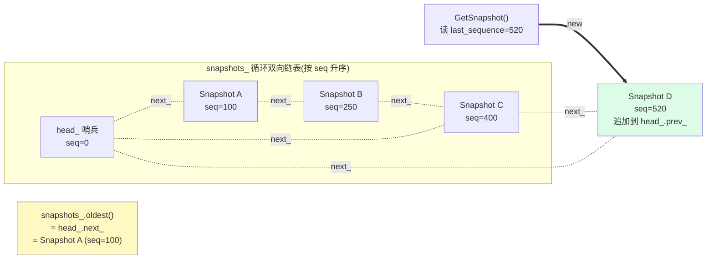
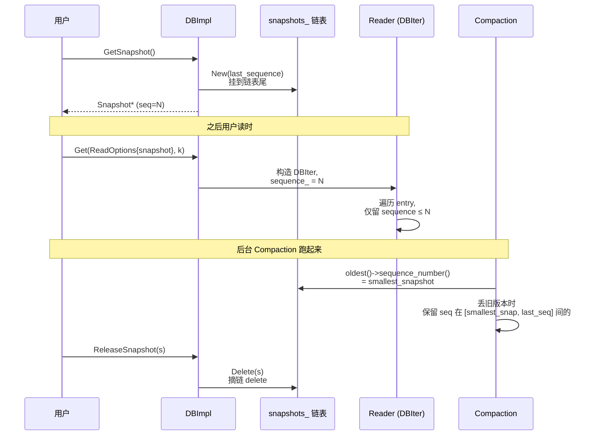
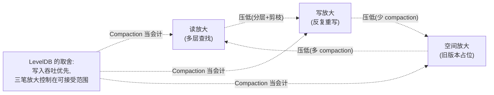
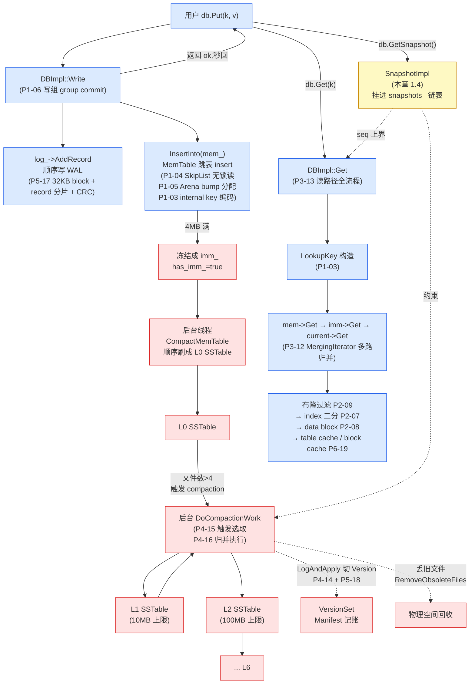

# 第二十一章 · Snapshot/MVCC 与三放大哲学

> 篇:P7 收尾
> 主线呼应:这是全书的**最后一章**。前 20 章我们一站一站走完了"一次 Put 的一生 + 后台收拾 + 崩了不丢不乱 + 性能基建":从 `Slice` 到 internal key,从 MemTable 跳表到 SSTable 四级布局,从多路归并到 Compaction 收敛,从 WAL/Manifest 到 LRU/Env。所有技术拼图都已就位。这一章只做两件事——一是讲一个**最精巧、最轻量**的机制(`Snapshot` 怎么靠一个 SequenceNumber 实现 MVCC 快照隔离),二是把全书 20 章收束成几条贯穿始终的哲学,给三笔放大算一笔**总账**。

## 核心问题

**LevelDB 怎么在不拷数据、不停写的前提下,让一个长读"看见数据库在某一刻的样子",而此后的写对它完全不可见?答案令人惊讶地轻——一个 `Snapshot` 对象就是"记下当前的 `last_sequence`,挂进一条链表";读迭代器多带一个 seq 上界,Compaction 多看一眼"最老活跃快照"。这是零开销 MVCC,也是 P1-03 那条 internal key 编码埋下的伏笔的最终兑现。**

读完本章你会明白:

1. 快照隔离的本质:为什么"记一个 seq 上界"就足以实现 MVCC——没有数据拷贝,没有版本链,没有回滚段。O(1) 创建,O(1) 释放,读时多一次 seq 比较。
2. `SnapshotList` 这条双向链表怎么把所有活跃快照串起来;Compaction 丢旧版本时为什么必须看它一眼——只有"比最老活跃快照更新、且已被覆盖"的版本才能扔。这一条约束是快照隔离不被破坏的红线。
3. 反面对比:朴素快照(拷贝整个库)为什么不可接受(GB 级数据);没有快照(长读会被写打扰,读到不一致的中间态)。
4. 全书 20 章收束成**五条哲学**:只追加不原地改、前台快后台收、一把大锁换简单 + 关键处无锁换读吞吐、用三笔放大换写吞吐 + Compaction 当会计、Version 引用计数让读写不互斥。
5. 一张**三放大总账单**:读放大 / 写放大 / 空间放大各自是什么、谁在收敛它(填进 P0-01 立起的那张表的每一格),全书技术地图的最后一块拼图。

> **如果一读觉得太难**:先只记住三件事——① LevelDB 的快照就是"记一个 sequence number + 挂进一条链表",不拷数据;② 读时给迭代器带一个 `sequence <= snapshot_seq` 上界,所有更新的版本天然被 Seek 跳过(靠的是 P1-03 的 internal key 降序编码);③ Compaction 丢旧版本时,只要看到 `last_sequence_for_key <= smallest_snapshot` 才敢丢,这就是快照对后台的约束。哲学收束部分(第 4 节起)可以单独读。

---

## 1.1 一句话点破

> **Snapshot 不是"复制一份数据",而是"记一句话:这一刻 `last_sequence = N"。从此以后,持有这个快照的读只看 seq ≤ N 的版本;Compaction 也只敢丢 seq 比最老活跃快照更"老"且已被覆盖的版本。一份数据都没拷,一次锁都没加在读上——LSM 多版本编码早就把"快照"这件事变成了纯排序问题。**

这是结论,不是理由。本章倒过来拆:先看"长读会被写打扰"这个真实痛点,再看朴素的两条路(拷贝 / 加锁)为什么都撞墙,然后看 LevelDB 怎么用 SequenceNumber + 一条链表把这件事做得近乎零开销,最后钉死快照对 Compaction 的约束、给全书收笔。

---

## 1.2 长读的痛点:没有快照会怎样

### 提出问题

P0-01 我们讲过,LevelDB 的写是"只追加":一条 `Put(k, v1)` 之后再来 `Put(k, v2)`,v1 和 v2 在 MemTable / SSTable 里**共存**(P1-03 已讲透)。读 k 的时候按 internal key 排序,取最新版本(seq 最大)。

这套机制单独看没问题。但设想一个真实场景:**长读**。

用户开了一个 `Iterator`,要从头扫到尾做一次全表分析(比如离线 ETL、统计、备份)。这个迭代器可能要跑几秒、几十秒,甚至几分钟。这期间,别的线程还在不停地 `Put` / `Delete`——同一个 key k,可能在你迭代到一半时被改、被删。请问:你这个长读迭代器看到的 k,应该是"开始扫那一刻的 k",还是"扫到 k 这一行时的 k"?

- 如果是"开始扫那一刻"——这是**快照隔离**(snapshot isolation):整个长读看见一个稳定、一致的数据库视图,和它启动那一刻一模一样,此后所有写都不可见。
- 如果是"扫到 k 这一行时"——这是**读已提交**(read committed):每行看到的是当时最新的值,但整个扫描可能看见"前后不一致"的中间态(比如 v1 → v2 的迁移中途,部分相关 key 是 v1、部分是 v2)。

### 不这样会怎样

**没有快照的 LevelDB,长读会读到什么?** 默认情况下,`DBImpl::NewIterator` 不传 snapshot 时,用的是 `versions_->LastSequence()`——**但这个 sequence 是在迭代器构造那一刻读出来的**([db_impl.cc:1172-1177](../leveldb/db/db_impl.cc#L1172-L1177)):

```cpp
Iterator* DBImpl::NewIterator(const ReadOptions& options) {
  SequenceNumber latest_snapshot;
  uint32_t seed;
  Iterator* internal_iter = NewInternalIterator(options, &latest_snapshot, &seed);
  return NewDBIterator(this, user_comparator(), iter,
                       (options.snapshot != nullptr
                            ? static_cast<const SnapshotImpl*>(options.snapshot)
                                  ->sequence_number()
                            : latest_snapshot),   // db_impl.cc:1176 —— 默认用"这一刻的 last_sequence"
                       seed);
}
```

所以**即便用户不显式 `GetSnapshot`,LevelDB 也给每次 `NewIterator` 隐式拍了一张快照**——就是这个 `latest_snapshot`(其实是构造 iter 时 `NewInternalIterator` 顺手读的 `versions_->LastSequence()`,[db_impl.cc:1087](../leveldb/db/db_impl.cc#L1087))。换句话说,LevelDB 的迭代器**天生就是快照读**——这是它"读不被写打扰"的字面保证。

> **反面对比 1(读已提交,无快照)**:假设 LevelDB 让迭代器读的是"每一行当下最新版本"。你在扫一张订单表,扫到一半时另一个线程把订单 100 的状态从 "unpaid" 改到 "paid" 并 commit。你这次扫描会看到订单 100 一会儿 unpaid(扫到时还没改)、一会儿 paid(改了)——更糟的是,如果它删了某行,你下次 Next 可能跳过这一行,**结果集行数都数不对**。这就是"长读不一致"。

> **反面对比 2(全表锁,串行化)**:为了解决长读不一致,朴素方案是"长读期间锁住整张表,禁止写"。但 LSM 的卖点是**写吞吐**——一旦为了长读加表锁,LevelDB 的立身之本(写秒回)直接崩塌。这条路也走不通。

所以 LevelDB 必须有快照——而且这个快照必须**几乎零开销**:不能拷数据(GB 级不可接受),不能加锁(写吞吐不能让步),不能让后台 compaction 干等长读完(空间放大会雪崩)。这就是 SequenceNumber + 链表的用武之地。

---

## 1.3 朴素方案的两条死路

在讲 LevelDB 的方案之前,先看两条朴素的"快照实现",它们为什么都撞墙。这能让你看清 LevelDB 的设计有多克制。

### 死路 A:拷贝整个数据库

最朴素的快照——"开始读之前,把整个 LevelDB 的数据 dump 一份到内存 / 另一个目录,后续读就读那份拷贝"。

> **不这样会怎样**:一个 100GB 的 LevelDB,每次开一个长读快照就拷 100GB?**时间和空间都不可接受**。即便用 COW(copy-on-write)页级别,LevelDB 的 SSTable 是不可变文件,根本没有"页级别的写时拷贝"用武之地——它压根不就地改。这条路在 LSM 上是死路。

### 死路 B:版本链(per-key 版本挂链)

另一条朴素路子——"给每个 key 维护一条版本链,所有历史版本挂成一个链表,快照读时顺着链找 `<= snapshot_seq` 的那个"。

这正是 InnoDB 那种 B-tree 引擎的做法(rollback segment + undo log + trx_id)。它能 work,但**代价是每次写都要额外维护版本链的指针**,且读时要回溯链表。这套机制在 B-tree 那种"原地更新"的引擎上是必须的(因为同一条记录在页里只有一份,要靠 undo log 找回旧版本)——但 **LSM 不就地改**,旧版本本来就和新版本**并排存在**于 MemTable / SSTable 里,靠 internal key 的 `(user_key, seq, type)` 编码就能天然区分新旧(P1-03 已详讲)。**既然旧版本已经免费躺在那儿,为什么还要再搞一条版本链?**

> **钉死这件事**:LevelDB 的快照**不需要任何额外的数据结构来存"旧版本"**——旧版本本来就在 MemTable / Immutable / SSTable 里,和最新版本排在一起。快照要做的,只是在"读"和"丢"两个时刻,多带一个 seq 上界。这是 P1-03 那条 internal key 编码埋下的伏笔的最终兑现。

---

## 1.4 LevelDB 的方案:一个 Snapshot 对象 + 一条双向链表

### 提出问题

既然旧版本已经免费躺在那儿,快照的实现就退化成两件事:

1. **记一个 seq 上界**:这个快照"看见"的版本上界是 `N`——任何 `seq > N` 的版本对它不可见。
2. **让 Compaction 知道有活跃快照**:丢旧版本时,要保证不会丢掉任何活跃快照还需要的版本。

第一件事是读路径的事——迭代器带个 seq 上界即可;第二件事是后台 Compaction 的事——它要在丢弃决策里看一眼"最老活跃快照"。两件事都不需要拷数据。

### 所以这样设计

LevelDB 给用户的公开 API 长这样,在 [include/leveldb/db.h:98-106](../leveldb/include/leveldb/db.h#L98-L106):

```cpp
// Return a handle to the current DB state.  Iterators created with
// this handle will all observe a stable snapshot of the current DB
// state.  The caller must call ReleaseSnapshot(result) when the
// snapshot is no longer needed.
virtual const Snapshot* GetSnapshot() = 0;          // db.h:102

// Release a previously acquired snapshot.  The caller must not
// use "snapshot" after this call.
virtual void ReleaseSnapshot(const Snapshot* snapshot) = 0;   // db.h:106
```

注释清楚:"iterators created with this handle will all observe a stable snapshot"。注意 `Snapshot` 这个基类([db.h:26-32](../leveldb/include/leveldb/db.h#L26-L32))只有虚析构,**一个成员都没有**:

```cpp
// Abstract handle to particular state of a DB.
// A Snapshot is an immutable object and can therefore be safely
// accessed from multiple threads without any external synchronization.
class LEVELDB_EXPORT Snapshot {
 protected:
  virtual ~Snapshot();
};
```

注释里那句 "immutable object and can therefore be safely accessed from multiple threads" 是关键——Snapshot 一旦创建就不变,多线程并发访问无需加锁。真正的实现在 `db/snapshot.h` 的 `SnapshotImpl`([db/snapshot.h:17-37](../leveldb/db/snapshot.h#L17-L37)):

```cpp
class SnapshotImpl : public Snapshot {
 public:
  SnapshotImpl(SequenceNumber sequence_number)
      : sequence_number_(sequence_number) {}

  SequenceNumber sequence_number() const { return sequence_number_; }

 private:
  friend class SnapshotList;

  // SnapshotImpl is kept in a doubly-linked circular list. The SnapshotList
  // implementation operates on the next/previous fields directly.
  SnapshotImpl* prev_;
  SnapshotImpl* next_;

  const SequenceNumber sequence_number_;
  ...
};
```

**整个 `SnapshotImpl` 就两个字段值得看:`sequence_number_`(常量,创建时记下)和 `prev_`/`next_`(双向链表指针)。** 没有版本链,没有数据拷贝,没有时间戳数组。一个快照的全部状态,就是一个 64 位整数 + 两个指针。

那 `prev_`/`next_` 是干什么的?它们把这个快照挂进 `SnapshotList`——一条**循环双向链表**。看 [db/snapshot.h:39-91](../leveldb/db/snapshot.h#L39-L91):

```cpp
class SnapshotList {
 public:
  SnapshotList() : head_(0) {
    head_.prev_ = &head_;
    head_.next_ = &head_;
  }

  bool empty() const { return head_.next_ == &head_; }
  SnapshotImpl* oldest() const {         // 最老的活跃快照 = head_.next_
    assert(!empty());
    return head_.next_;
  }
  SnapshotImpl* newest() const {         // 最新的活跃快照 = head_.prev_
    assert(!empty());
    return head_.prev_;
  }

  // Creates a SnapshotImpl and appends it to the end of the list.
  SnapshotImpl* New(SequenceNumber sequence_number) {
    assert(empty() || newest()->sequence_number_ <= sequence_number);

    SnapshotImpl* snapshot = new SnapshotImpl(sequence_number);
    snapshot->next_ = &head_;
    snapshot->prev_ = head_.prev_;
    snapshot->prev_->next_ = snapshot;
    snapshot->next_->prev_ = snapshot;
    return snapshot;
  }

  // Removes a SnapshotImpl from this list.
  void Delete(const SnapshotImpl* snapshot) {
    snapshot->prev_->next_ = snapshot->next_;
    snapshot->next_->prev_ = snapshot->prev_;
    delete snapshot;
  }

 private:
  SnapshotImpl head_;   // 哨兵节点
};
```

这是教科书级的循环双向链表,带一个 `head_` 哨兵节点。`New()` 在 `mutex_` 保护下把新快照**追加到链表尾部**(因为 `last_sequence` 单调递增,新快照的 seq 一定 ≥ 旧快照,见 `assert(empty() || newest()->sequence_number_ <= sequence_number)`),`Delete()` 把它从链表摘下并 `delete`。整条链表按 seq 单调升序排列——**`head_.next_` 就是当前最老的活跃快照,`head_.prev_` 就是当前最新的活跃快照**。这两个端点正是 `oldest()` 和 `newest()` 返回的。

`DBImpl` 里只持一个字段管理这条链表([db/db_impl.h:189](../leveldb/db/db_impl.h#L189)):

```cpp
SnapshotList snapshots_ GUARDED_BY(mutex_);    // db_impl.h:189 —— 所有活跃快照
```

注意 `GUARDED_BY(mutex_)`——这条链表的所有操作都必须持 `mutex_`。这把大锁我们在第 4 节哲学收束里会再讲。

### GetSnapshot / ReleaseSnapshot:就这么短

`DBImpl` 的实现简短到让人怀疑,看 [db/db_impl.cc:1187-1195](../leveldb/db/db_impl.cc#L1187-L1195):

```cpp
const Snapshot* DBImpl::GetSnapshot() {
  MutexLock l(&mutex_);                                     // db_impl.cc:1188 —— 持锁
  return snapshots_.New(versions_->LastSequence());         // db_impl.cc:1189 —— 记下当前 last_sequence,挂进链表
}

void DBImpl::ReleaseSnapshot(const Snapshot* snapshot) {
  MutexLock l(&mutex_);                                     // db_impl.cc:1193 —— 持锁
  snapshots_.Delete(static_cast<const SnapshotImpl*>(snapshot));  // db_impl.cc:1194 —— 摘链并 delete
}
```

**就这。** 加锁,记 `last_sequence`,挂链;加锁,摘链,delete。两段共四行有效代码。没有 `memcpy`,没有 `fork`,没有 `clone`,没有锁升级,没有版本链维护。这就是"零开销"的字面含义——一个 SnapshotImpl 对象 24 字节(两个指针 + 一个 uint64 + vptr),O(1) 创建,O(1) 释放。



### 那读路径怎么"用"这个 snapshot

快照记下来是一回事,读时怎么"过滤掉 seq > snapshot_seq 的版本"?答案在 `DBIter`——第 11 章已详讲,这里只回顾关键两行。

读 API(`Get` / `NewIterator`)在启动读时,先确定本次读的 seq 上界。`Get` 在 [db/db_impl.cc:1121-1131](../leveldb/db/db_impl.cc#L1121-L1131):

```cpp
Status DBImpl::Get(const ReadOptions& options, const Slice& key,
                   std::string* value) {
  ...
  SequenceNumber snapshot;
  if (options.snapshot != nullptr) {
    snapshot =
        static_cast<const SnapshotImpl*>(options.snapshot)->sequence_number();  // 用户传了快照,用它的 seq
  } else {
    snapshot = versions_->LastSequence();   // 没传,用当前 last_sequence(隐式快照)
  }
  ...
}
```

**`snapshot` 就是这次 `Get` 的 seq 上界。** 注意两种情况:**用户显式传了快照**——用快照的 seq;**没传**——用当前 `last_sequence`(这也是一种"隐式快照",只是没挂进 `snapshots_` 链表,生命周期短到只覆盖这一次 `Get` 调用)。两者都是"取一个 seq,后续读用它当上界"。

然后这个 `snapshot` 被塞进 `LookupKey lkey(key, snapshot)`([db_impl.cc:1147](../leveldb/db/db_impl.cc#L1147)),`LookupKey` 在 P1-03 讲过——它构造一个"用户 key + (snapshot_seq << 8 | kValueTypeForSeek)"的 lookup internal key,Seek 到这个点。由于 internal key 是降序排(P1-03 的 InternalKeyComparator),Seek 之后**第一个 user_key 匹配的 entry 就是 seq ≤ snapshot_seq 的最新版本**——更新的版本(seq > snapshot_seq)排在 lookup key 之前,user_key 不匹配,Seek 落不到。

迭代器路径(`NewIterator` → `DBIter`)同理,`DBIter` 持一个 `sequence_` 字段([db/db_iter.cc:48-57](../leveldb/db/db_iter.cc#L48-L57)),过滤逻辑在 `FindNextUserEntry`([db/db_iter.cc:177-207](../leveldb/db/db_iter.cc#L177-L207))和 `FindPrevUserEntry`([db/db_iter.cc:236-276](../leveldb/db/db_iter.cc#L236-L276)):

```cpp
void DBIter::FindNextUserEntry(bool skipping, std::string* skip) {
  ...
  do {
    ParsedInternalKey ikey;
    if (ParseKey(&ikey) && ikey.sequence <= sequence_) {   // db_iter.cc:183 —— seq 上界过滤
      switch (ikey.type) {
        case kTypeDeletion:
          ...
        case kTypeValue:
          ...
      }
    }
    iter_->Next();
  } while (iter_->Valid());
  ...
}
```

**`ikey.sequence <= sequence_` 这一行,就是快照隔离的全部实现。** 读时每看到一条 entry,先 `ParseInternalKey` 解出 seq,如果 `seq > sequence_`(这个版本比快照新),直接 `if` 不进,`iter_->Next()` 跳过。整个过滤逻辑,就是一个 `<=` 比较。

> **钉死这件事**:LevelDB 的快照隔离,在**读路径**上的全部实现,就是 `DBIter` 持一个 `sequence_` 字段,遍历时多一次 `ikey.sequence <= sequence_` 比较。不拷数据,不加锁,不查版本链——靠的是 P1-03 那条 internal key 降序编码 + Seek 落点。这是 LSM 用编码换逻辑的极致体现。

---

## 1.5 快照对 Compaction 的约束:必须尊重最老活跃快照

### 提出问题

快照读没问题了。但还有一个关键角色——**后台 Compaction**。Compaction 在归并时,会丢弃"被覆盖的旧版本"和"过期的 tombstone"(P4-16 详讲)。可是如果它**丢得太狠**,把一个活跃快照还需要的旧版本也丢了,会怎样?

设想这个场景:

1. `t=100`:写 `Put(k, v_old)`,seq=100。
2. `t=200`:用户调 `GetSnapshot()`,拿到快照 `snapA`(seq=200),它看到的 k 应该是 v_old。
3. `t=300`:写 `Put(k, v_new)`,seq=300。
4. `t=400`:Compaction 触发,要把 (k, seq=100) 和 (k, seq=300) 归并。
5. **问题**:Compaction 如果按"最新版本外的都丢"的规则,会把 (k, seq=100) 丢了——只留 (k, seq=300)。
6. **后果**:用户持有的 `snapA`(seq=200)再去读 k,按 `seq ≤ 200` 过滤,找不到任何版本——**读到 NotFound**!可 v_old 明明是在 snapA 之前写的,snapA 应该看见它。**快照隔离被破坏**。

### 不这样会怎样

这就是为什么 Compaction **绝不能无脑丢旧版本**——它必须看一眼"当前还有哪些活跃快照",保证不丢掉任何活跃快照还需要的版本。

### 所以这样设计

Compaction 在丢旧版本时,引入了 `smallest_snapshot` 这个变量——"当前所有活跃快照里,seq 最小的那个"。看 `DoCompactionWork` 的开头,[db/db_impl.cc:910-914](../leveldb/db/db_impl.cc#L910-L914):

```cpp
if (snapshots_.empty()) {
  compact->smallest_snapshot = versions_->LastSequence();    // 没有活跃快照 → 用当前 last_sequence
} else {
  compact->smallest_snapshot = snapshots_.oldest()->sequence_number();  // 有快照 → 用最老那个的 seq
}
```

**`compact->smallest_snapshot` 是这次 compaction 丢旧版本的"地板"**——任何 seq ≤ smallest_snapshot 且被覆盖的版本都不能丢(因为最老的活跃快照可能还需要它)。注意两个分支:

- **没有活跃快照**:`smallest_snapshot = last_sequence`——地板就是当前 seq 上界,这意味着"任何 seq ≤ last_sequence 且被覆盖的版本都可以丢"(因为没有快照会再看它们)。
- **有活跃快照**:`smallest_snapshot = oldest snapshot seq`——比这个 seq 更老且被覆盖的版本可以丢;**这个 seq 和 last_sequence 之间的版本,即便被覆盖,也要保留**(因为最老快照可能还要看)。

具体丢弃决策在归并循环里,[db/db_impl.cc:957-983](../leveldb/db/db_impl.cc#L957-L983):

```cpp
if (!has_current_user_key ||
    user_comparator()->Compare(ikey.user_key, Slice(current_user_key)) != 0) {
  // First occurrence of this user key
  current_user_key.assign(ikey.user_key.data(), ikey.user_key.size());
  has_current_user_key = true;
  last_sequence_for_key = kMaxSequenceNumber;
}

if (last_sequence_for_key <= compact->smallest_snapshot) {
  // Hidden by an newer entry for same user key
  drop = true;  // (A) —— 旧版本,且已有更新的版本可见,可以丢
} else if (ikey.type == kTypeDeletion &&
           ikey.sequence <= compact->smallest_snapshot &&
           compact->compaction->IsBaseLevelForKey(ikey.user_key)) {
  // For this user key:
  // (1) there is no data in higher levels
  // (2) data in lower levels will have larger sequence numbers
  // ...
  // Therefore this deletion marker is obsolete and can be dropped.
  drop = true;   // (B) —— tombstone,在更深层没有旧值能"复活",可以丢
}

last_sequence_for_key = ikey.sequence;
```

逻辑直球:

- 同一个 user_key 的多个版本,归并迭代器按 internal key 排序,最新版本(seq 最大)先来,然后是更旧的。
- `last_sequence_for_key` 记录"上一个见过的版本的 seq"——也就是"比当前这条更新的那条的 seq"。
- **规则 A**:如果 `last_sequence_for_key <= smallest_snapshot`(即"上一条更新的版本,seq 已经 ≤ 最老快照"),意味着"上一条之后,任何活跃快照都已经能看见它了,这条更旧的版本被它盖住、没人需要",`drop = true`。
- **规则 B**(P4-16 详讲):tombstone 在"更深层也没有这个 user_key"(`IsBaseLevelForKey`)且 seq ≤ smallest_snapshot 时才能丢,否则会"复活"旧值。

回到上面那个场景:`snapA`(seq=200)活跃时,`smallest_snapshot = 200`。归并时见到 (k, seq=300, v_new),它是最新的,`last_sequence_for_key = 300`,不丢。下一个 (k, seq=100, v_old),`last_sequence_for_key = 300`,但 `300 <= 200`?**不成立**——所以 `drop` 保持 false,**(k, seq=100) 被保留**。snapA 再读 k,`seq=100 ≤ 200` 过滤通过,能看见 v_old。**快照隔离保住了**。

> **钉死这件事**:Compaction 丢旧版本的"地板"是 `compact->smallest_snapshot = snapshots_.oldest()->sequence_number()`——这个值取自 `snapshots_` 链表的 `head_.next_`(`oldest()`)。这一行代码,就是快照隔离和后台 Compaction 之间唯一的握手。**没有快照机制,Compaction 可以激进地丢所有被覆盖版本;有了快照,它必须对"最老活跃快照之前的版本"网开一面。**

### 一句话总结:Snapshot 和 Compaction 的契约

- **读路径的契约**(P1-03 + P3-11):迭代器持一个 seq 上界,过滤掉更新的版本。
- **Compaction 的契约**(本节):`smallest_snapshot` 当地板,比它更老且被覆盖的才能丢。
- **共同的根**:internal key 的 `(user_key, seq, type)` 编码 + 降序比较——它让"快照"退化成"一个 seq 比较",让"丢旧版本"退化成"一个 seq 大小判断"。**整个 MVCC 机制,没有一处需要遍历版本链,没有一处需要锁住读**。

---

## 1.6 零开销 MVCC:反面对比再强化

让我们把"零开销"这件事用一张表钉死,对比朴素方案:

| 维度 | 朴素快照(拷贝) | 版本链(InnoDB 式) | **LevelDB(SequenceNumber)** |
|------|----------------|-------------------|--------------------------|
| 创建快照的开销 | O(N)(拷整个库) | O(1)(建链表头) | **O(1)**(new 一个 24 字节对象 + 挂链) |
| 写时的额外开销 | 无(但库已拷) | 每次写维护版本链指针 | **零**(旧版本本来就在,不额外维护) |
| 读时的额外开销 | 无(读拷贝) | 回溯版本链找 <= snapshot 的 | **一次 `seq <= snapshot` 比较** |
| Compaction 的额外开销 | — | 周期清理版本链 | **算一次 `smallest_snapshot`**(开头一行) |
| 内存开销 | O(N)(拷贝整个库) | 每条记录一个版本链指针 | **每个活跃快照 24 字节**(一个对象) |
| 受长读影响的写吞吐 | 完全冻结(写不了) | 额外维护链 | **完全不受影响** |

> **反面对比综合**:朴素拷贝在 GB 级数据上完全不可行;版本链在"不就地改"的 LSM 上是多余的开销(旧版本本就免费存在)。LevelDB 选了**第三条路**——根本不存"旧版本"的额外表示,只在读和丢两个时刻多带一个 seq 上界。这是 LSM 编码带来的"结构性优势",B-tree 引擎享受不到。



---

## 1.7 技巧精解:零开销 MVCC 的两块基石

这一章技巧精解挑两块基石——它们合起来,才是 LevelDB 快照"近乎零开销"的全部秘密。

### 技巧精解 1:internal key 降序编码,让快照退化成一次 seq 比较

**这个技巧在做什么**:让"找 snapshot 时刻可见的最新版本"这件复杂事,退化成一次 `seq <= snapshot_seq` 的整数比较 + 一次 Seek。

**用了什么手段**:P1-03 讲透的 internal key 编码——`internal_key = user_key ‖ ((seq << 8) | type)`,`InternalKeyComparator` 先按 user_key 升序、再按 seq|type 降序。这让同一 user_key 的所有版本里,seq 最大者天然排最前。

**为什么 sound**:

1. **Seek 自然落在 snapshot 可见的最新版本上**:构造 lookup key 时用 `(user_key, snapshot_seq, kValueTypeForSeek)`——`kValueTypeForSeek` 是最大的 ValueType(P1-03 已讲为什么必须这样)。由于降序,所有 `seq > snapshot_seq` 的版本排在 lookup key 之前,user_key 相同时 seq 更大者排更前;但 user_key 相同+seq 更大,意味着它"排得更前",而 Seek 是找 `>= lookup key` 的第一个——所以 Seek 落在"`seq ≤ snapshot_seq` 的第一条"上(如果有的话)。**不需要扫过更新的版本,它们天然被 Seek 跳过**。
2. **DBIter 遍历时再兜一道**:`FindNextUserEntry` 里 `if (ParseKey(&ikey) && ikey.sequence <= sequence_)` 这一行,过滤掉极少数 Seek 落点之后还存在的"过期版本"(理论上 Seek 已经能定位,但 Next 走过同 user_key 的旧版本时仍需判断)。
3. **零额外存储**:seq 是 internal key 的一部分,本来就在那儿。快照机制没有为它额外存任何东西。

**反面对比 1(seq 升序,最新版本排最后)**:这是 P1-03 讲过的反例——如果 seq 升序排,Seek 落在最早的版本上,要往前扫过所有旧版本才到最新,读放大爆炸。**根本轮不到快照出场**——基线版本就已经死了。所以"降序编码"既是 LSM 多版本读的基石,也是 MVCC 快照的基石,**一个编码同时服务两件事**。

**反面对比 2(快照单独存一份"此刻的 kv 表")**:朴素拷贝。GB 级数据无法接受。

> **钉死这件事**:**LevelDB 的快照,是 P1-03 internal key 编码埋下的伏笔的最终兑现**。那一章结尾我们留了个钩子——"这一整套编码怎么让 Snapshot 零额外逻辑地退化成'取排序后第一个'",本章给了答案:**Snapshot 不是新机制,它是 internal key 编码 + Seek + 一次 seq 比较的天然结果**。

### 技巧精解 2:SnapshotList 循环双向链表 + `oldest()` 在 Compaction 里的角色

**这个技巧在做什么**:用一个最小化的数据结构,在 O(1) 时间内回答"当前所有活跃快照里,seq 最小的是多少"——这正是 Compaction 丢旧版本的"地板"。

**用了什么手段**:[db/snapshot.h:39-91](../leveldb/db/snapshot.h#L39-L91) 的循环双向链表 + 哨兵头节点 `head_`。因为 `last_sequence` 单调递增,快照按创建顺序追加到链表尾,链表天然按 seq 升序。`oldest()` 就是 `head_.next_`,`newest()` 就是 `head_.prev_`,两次指针解引用,O(1)。

**为什么 sound**:

1. **循环双向链表 + 哨兵节点**:插入和删除都是 O(1),且不需要处理"空链表""头尾边界"等特例(哨兵节点 `head_` 自指)。`New()` 和 `Delete()` 各 4 行赋值,无分支。
2. **`assert(empty() || newest()->sequence_number_ <= sequence_number)`**:这条断言钉死了"链表按 seq 升序"这条不变量。它依赖 `last_sequence` 的单调性——见 [db/db_impl.cc:1223-1257](../leveldb/db/db_impl.cc#L1223-L1257),`Write` 在 leader 写完整组 batch 后 `versions_->SetLastSequence(last_sequence)`,而 `last_sequence += WriteBatchInternal::Count(write_batch)` 严格递增。所以新快照的 seq 一定 ≥ 链表里所有旧快照的 seq。
3. **整条链表 `GUARDED_BY(mutex_)`**:所有读写都在大锁下,不需要无锁链表那种 ABA 问题 / 内存回收复杂度(`Hazard Pointer`、`RCU` 之类的花活儿)。简单是 LevelDB 的整体取舍(下一节哲学里会讲)。
4. **`smallest_snapshot = snapshots_.oldest()->sequence_number()`**([db_impl.cc:913](../leveldb/db/db_impl.cc#L913)):这一行就是快照对 Compaction 的全部影响。Compaction 一开始(在 `mutex_` 保护下)读一次,之后整个归并循环(已 `mutex_.Unlock()`,见 [db_impl.cc:919](../leveldb/db/db_impl.cc#L919))都用这个缓存的 `smallest_snapshot` 判断,不再访问链表。

**反面对比 1(用 `std::set<SequenceNumber>` 存活跃快照)**:也能 work,`*set.begin()` 拿最小,但每次 `GetSnapshot` / `ReleaseSnapshot` 都要 O(log n) 调整红黑树。链表是 O(1),且没有节点额外分配(`SnapshotImpl` 自带 `prev_/next_` 字段,`new SnapshotImpl` 一次搞定)。

**反面对比 2(无锁链表)**:理论上能让 `GetSnapshot` 不持 `mutex_`,但 LevelDB 整体取舍是"一把大锁换简单"——`GetSnapshot` 本来就在 `MutexLock l(&mutex_)` 下,链表跟着用大锁就完事,不引入内存回收复杂度。**这是一个典型的"够用即止"工程取舍**——不为了"更快"引入"更复杂"。

> **钉死这件事**:`SnapshotList` 是 LevelDB 整个 MVCC 机制的"账本"。它只记一件事——"当前还有哪些活跃快照,最老那个的 seq 是多少"。这一件事,够 Compaction 用;够读路径用(读路径其实不直接用链表,只用快照自带的 seq)。**整个快照机制,数据结构上就是一条 24 字节对象 × 活跃快照数 的链表,加一行 `oldest()` 调用。**

---

# 1.8 全书收束:五条哲学 + 三笔放大总账单

讲完快照这个机制,我们做**全书总收束**。前 20 章走完了"一次 Put 的一生 + 后台收拾 + 崩了不丢不乱 + 性能基建",每一章都讲透了一个机制、一组源码、一个 C++ 技巧。现在把它们收起来,看看贯穿全书的是哪几条哲学。这一节不引入任何新机制,只把前 20 章的线索收成几根绳。

## 五条贯穿哲学

### 哲学 1:只追加,不原地改——把所有写都变成顺序写

这是全书的**第一性原理**(P0-01)。磁盘的物理真相是"顺序写快、随机写慢、原地改更慢",LevelDB 顺从它,把每一次写都变成追加——

- `Put` / `Delete`:写一条新记录,不碰旧数据(P0-01、P1-03)。
- WAL:追加 record,从不修改已写的 block(P5-17)。
- Manifest:追加 `VersionEdit`,从不原地改文件结构(P5-18)。
- MemTable:跳表只 insert,不 update(P1-04)。
- SSTable:不可变文件,一旦写完永不改(P2-07)。

**原地改这件事,只在 compaction "整体重写"时发生——但那是后台、批量、顺序地做,不是用户写路径上的随机 I/O**。P0-01 的那张表(顺序 vs 随机的差距)是这条哲学的物理基础。

### 哲学 2:前台快,后台收——把"写快"和"收拾"在时间上拆开

LSM 的灵魂是**把记和算拆开**。前台只管"写秒回 + 读多路归并",后台只管"刷盘 + 合并 + 记账 + 回收"——

| | 前台(快) | 后台(收) |
|---|----------|----------|
| **写** | WAL 追加 + MemTable insert(P1-06) | Immutable 刷盘成 SSTable |
| **读** | MemTable + Immutable + 多层 SSTable 多路归并(P3-12、P3-13) | — |
| **数据治理** | — | Compaction 归并去重丢墓碑(P4-15、P4-16) |
| **版本治理** | — | VersionSet 切 Version、Manifest 记账(P4-14、P5-18) |
| **空间治理** | — | RemoveObsoleteFiles 物理删旧文件 |

前台**绝不在用户路径上做昂贵的事**——刷盘、合并、回收全甩给后台。这换来写的极致吞吐和读的合理延迟。

### 哲学 3:一把大锁 `mutex_` 换简单,关键处无锁换读吞吐

这是 LevelDB 和 Tokio 这种"无锁优先"的运行时的**鲜明对照**。LevelDB 几乎所有状态(`mem_`、`imm_`、`versions_`、`snapshots_`、compaction 调度)都在一把 `DBImpl::mutex_` 下,字段大量 `GUARDED_BY(mutex_)` 注解。这换来的是**代码极简**——没有 lock-free 算法的 ABA、内存回收、内存序调试地狱。

但 LevelDB 在三个关键处放弃了大锁,换读吞吐和并发:

1. **SkipList 的无锁读**(P1-04):写者持 `mutex_`,读者 `std::atomic<Node*>` + acquire/release 内存序无锁读。这是 MemTable 读热路径,不持锁读让 `Get` 不阻塞 `Put`。
2. **`Get` / `DoCompactionWork` 在 I/O 期间释放 `mutex_`**(P3-13、P4-16):`MutexLock l(&mutex_)` 进,在持锁状态下拿引用(`mem->Ref()` / `current->Ref()`),然后 `mutex_.Unlock()` 去做几毫秒的磁盘 I/O,I/O 完再 `mutex_.Lock()`。这让长 I/O 不冻住整库。
3. **`std::atomic` 标志位**:`has_imm_`([db_impl.h:179](../leveldb/db/db_impl.h#L179))、`shutting_down_` 给后台线程看,不持锁。

> **钉死这条对照**:Tokio 用 `unsafe` + 无锁 + Pin 换极致并发;LevelDB 用一把大锁 + 少量 atomic 换简单。两者都"sound",只是不同的工程取舍。**LevelDB 选简单的逻辑是**:存储引擎的瓶颈在磁盘 I/O,不在 CPU 并发原语——一把大锁在 I/O 面前几乎透明,换来代码可读、可维护,值。

### 哲学 4:用读/写/空间三笔放大换写吞吐,Compaction 当会计

这是全书的**主线**(P0-01 立起)。LSM 用"只追加"换写入吞吐,代价是三笔账——读放大、写放大、空间放大。Compaction 是不断把它们收敛回来的会计(P4-15、P4-16)。**这笔账的明细见下一小节的三放大总账单。**

### 哲学 5:Version 引用计数,让读不被写打扰

这是 P4-14 讲透的机制,也是 LSM 实现"读写不互斥"的字面根——

- `Version` 是"此刻每层有哪些 SSTable"的不可变快照([version_set.h:89-92](../leveldb/db/version_set.h#L89-L92) 的 `Ref` / `Unref`)。
- `DBImpl::Get` 启动读时 `current->Ref()`,I/O 期间释放锁,读完 `current->Unref()`([db_impl.cc:1135-1164](../leveldb/db/db_impl.cc#L1135-L1164))。
- Compaction 完成后,`LogAndApply` 切 `current_`——新 `Get` 拿新 Version,旧 reader 还持旧 Version 的 ref。
- 旧 Version 的 ref 归 0(所有 reader 用完)才析构,这时它持有的旧文件才被 `RemoveObsoleteFiles` 物理删([version_set.cc:67-85](../leveldb/db/version_set.cc#L67-L85) 的 `~Version()`)。

这一套机制,加上本章的 Snapshot 链表,共同构成"读不被写打扰"的两道保险——Version 让你读"那一刻的文件布局",Snapshot 让你读"那一刻的 seq 上界"。**两者都是不可变快照,都靠引用计数管生命周期**。

> **钉死这条哲学**:本章讲的 Snapshot(快照)和 P4-14 讲的 Version(版本布局)是**两种不同的"快照"**——一个是"逻辑快照"(seq 上界,管多版本可见性),一个是"物理快照"(文件列表,管文件不被删)。它们正交——一次 `Get` 同时用两者:`current->Ref()` 锁住文件布局,`snapshot_seq` 锁住版本可见性。**缺任何一个,读都可能读到不一致状态。**

---

## 三笔放大总账单

最后,给全书算一笔**总账**。P0-01 立起了"读放大 / 写放大 / 空间放大"三笔账的框架,这里把每一笔的"是什么 / 谁在收敛它 / 在哪一章讲过"全部填进表里。这是全书技术地图的最后一块拼图。

### 读放大(Read Amplification):读一条用户数据,实际要读多少次

| 来源 | 收敛它的机制 | 在哪一章 |
|------|------------|---------|
| MemTable / Immutable / 多层 SSTable 都要查 | MergingIterator k 路归并,取到第一个有效版本就停 | P3-12 |
| 一个 key 的最新版本可能散在多层 | Version 每层一组 `FileMetaData`,按 key range 二分定位 | P4-14、P3-13 |
| 每层可能有多个文件重叠(L0 尤甚) | L0 文件数 > 4 触发 compaction,合并到 L1 去重 | P4-15 |
| 单个 SSTable 内要扫整个 data block | 布隆过滤器先问"这 block 八成有没有它" | P2-09 |
| Block 内 key 多,要线性/二分扫 | 前缀压缩 + restart point 保住二分查找 | P2-08 |
| 多次读同一个 block 要重复解压 | ShardedLRUCache block cache 缓存解压后 block | P6-19 |
| 多次打开同一个 SSTable 要重复读 footer/index | table cache 缓存打开的 Table 对象 | P6-19 |
| 文件层数过多,查找路径长 | 10x 层级约束(L1=10MB, L2=100MB, …),层数控制在 ~7 | P4-15 |
| 热点 key 反复读放大读 | seek 采样(`RecordReadSample`)触发自动 compaction | P3-13 |

**读放大的总收敛思路**:多级剪枝(布隆 → index 二分 → 文件 key range → cache)+ 层级约束 + 热点触发压。

### 写放大(Write Amplification):写一条用户数据,实际落盘多少字节

| 来源 | 收敛它的机制 | 在哪一章 |
|------|------------|---------|
| 同一条数据被 compaction 反复重写(L0→L1→…→L6 ~6 次) | 10x 层级 + 轮转选取,控制总层数 ~7 | P4-15 |
| 每次 compaction 重写都带上下层 ~10 倍重叠 | IsTrivialMove(单文件无重叠直接挪,不重写) | P4-16 |
| Grandparent 重叠太多,下次 compaction 太贵 | ShouldStopBefore(grandparent 重叠 > 20MB 时切文件) | P4-16 |
| 每次 Put 都要写 WAL(顺序写,放大~2×) | 写组 group commit(N 次写合并成 1 次 WAL 追加) | P1-06 |
| MemTable 刷盘写 L0 一次 | MemTable 4MB 才刷,批量而非逐条 | P1-05、P4-15 |
| 输出文件 2MB 才切,避免文件碎片 | `MaxOutputFileSize = 2MB` | P4-16 |

**写放大的总收敛思路**:批量(写组、4MB MemTable、2MB SSTable)+ 避免无谓重写(TrivialMove、ShouldStopBefore)+ 控制层数(10x 约束)。**写放大是 LSM 换写入吞吐的代价,~10-30× 是常态,但对比 B-tree 的随机写瓶颈,这笔账在写密集场景下仍划算**。

### 空间放大(Space Amplification):存一份有效数据,实际占多少磁盘

| 来源 | 收敛它的机制 | 在哪一章 |
|------|------------|---------|
| 旧版本在被清理前一直占空间 | 规则 A:`last_sequence_for_key <= smallest_snapshot` 时丢旧版本 | P4-16、**本章 1.5** |
| Tombstone 在被清理前一直占空间 | 规则 B:`IsBaseLevelForKey` 且无活跃快照时丢 tombstone | P4-16 |
| 被覆盖的旧值在多层重复存在 | Compaction 归并去重,只留最新可见版本 | P4-16 |
| 删除的文件物理空间不立即释放 | RemoveObsoleteFiles 在 Version 切换后回收 | P4-14、P5-18 |
| Compaction 输出和输入并存(瞬时空间放大) | 限制并发 compaction 数(默认 1)、输出大小受限 | P4-15 |
| 活跃快照导致旧版本不能丢 | 快照释放后,下次 compaction 即可清(本章 1.5 的契约) | **本章** |

**空间放大的总收敛思路**:Compaction 是唯一的清道夫——规则 A 丢旧版本、规则 B 丢 tombstone、RemoveObsoleteFiles 物理删文件。**本章讲的快照机制,正是空间放大收敛的"刹车"——只要有活跃快照,相关旧版本就必须保留,空间放大暂时不收敛;快照释放后,下次 compaction 立即清账**。

### 三笔放大的牵制关系

这三笔放大**互相牵制**,压低一个往往抬高另一个:



- 压低读放大(层数少、文件少)→ 写放大上升(每层更大,compaction 重写更多)。
- 压低写放大(少 compaction、TrivialMove)→ 空间放大上升(旧版本堆积)。
- 压低空间放大(频繁 compaction、激进丢旧版本)→ 写放大上升(compaction 频繁重写)。

LevelDB 选的平衡点(P0-01 引用 `doc/impl.md`):MemTable 4MB、L0 4 文件、L1=10MB / L2=100MB / … 的 10x 层级、SSTable 2MB。这一组数字,是 LevelDB 在三笔放大之间标定的"甜点"。

---

## 全书"一次 Put 的一生 + 后台收拾"全景图

把 P0-01 的旅程图展开,标注每一站在哪一章讲过——这是全书技术地图的**收笔**:



三种颜色:**蓝色前台**(用户路径上的快)、**红色后台**(Compaction 收敛)、**黄色快照**(本章的精巧机制)。这张图就是全书 21 章的**全息索引**——任何一处想深挖,顺着颜色找到对应章节即可。

---

## 章末小结:全书总收束

这是**全书最后一章**。我们做了两件事:

1. **讲透一个精巧机制**:LevelDB 的 `Snapshot` 怎么靠一个 SequenceNumber + 一条循环双向链表实现零开销 MVCC。读路径上多一次 `seq <= snapshot_seq` 比较(靠 P1-03 的 internal key 降序编码自然落地);Compaction 上多看一眼 `snapshots_.oldest()->sequence_number()` 当丢旧版本的地板。**没有数据拷贝,没有版本链,没有锁升级——一份数据都没动**。
2. **把全书 20 章收束成五条哲学**:只追加不原地改、前台快后台收、一把大锁换简单 + 关键处无锁换读吞吐、用三笔放大换写吞吐 + Compaction 当会计、Version 引用计数让读写不互斥。再给三笔放大算了**总账单**——每一笔是什么、谁在收敛它、在哪一章讲过。

回到主线:**LevelDB 用"只追加"换写入吞吐,代价是读/写/空间三笔放大,Compaction 是不断把它们收敛回来的会计**。Snapshot 是这套架构上的"点睛之笔"——它让长读也能在不拷数据、不停写的前提下看见一致的视图,把 LSM 多版本编码的红利吃到了极致。**Snapshot 不是新机制,它是 internal key 编码 + Version 引用计数两个机制的自然延伸**——前者让它零开销,后者让它读不被写打扰。

---

### 五个"为什么"清单(全书级)

1. **为什么 LevelDB 的 Snapshot 几乎零开销?** 因为旧版本本来就在 MemTable / SSTable 里,不需要为快照额外存什么;快照只是记一个 seq 上界,挂进链表。读时多一次 seq 比较,Compaction 时多一行 `oldest()->sequence_number()`。
2. **为什么 Compaction 必须看 `snapshots_.oldest()`?** 不看的话,可能丢掉活跃快照还需要的旧版本,破坏快照隔离。`smallest_snapshot` 是丢旧版本的地板,这一行代码是快照和 Compaction 之间唯一的握手。
3. **全书五条哲学里,哪一条最难做到?** 第三条(一把大锁换简单 + 关键处无锁)。它要求克制——明明可以用更精细的并发原语,但选择"够用即止"。这种克制贯穿全书:`SnapshotList` 用大锁不用无锁链表、`Get` 持锁拿引用再解锁做 I/O、SkipList 只在读写路径上无锁。**每一处都是"够用即止"的工程判断**。
4. **三笔放大互相牵制,LevelDB 怎么选平衡点?** 写入吞吐优先(这是 LSM 的立身之本),三笔放大控制在可接受范围。具体参数:MemTable 4MB、L0 4 文件、10x 层级、SSTable 2MB。这些数字是"甜点",不是"最优解"——RocksDB 在这套基础上做了大量参数化和自适应。
5. **Version 和 Snapshot 这两种"快照"有什么区别?** Version 是"物理快照"(文件布局,管文件不被删),Snapshot 是"逻辑快照"(seq 上界,管版本可见性)。两者正交,一次 `Get` 同时用——`current->Ref()` 锁物理,`snapshot_seq` 锁逻辑。**缺任何一个,读都可能不一致**。

### 想继续深入往哪钻

- **本章涉及的源码**:
  - 快照 API 抽象:[include/leveldb/db.h:26-32, 98-106](../leveldb/include/leveldb/db.h#L26-L32)
  - `SnapshotImpl` + `SnapshotList`:[db/snapshot.h:17-91](../leveldb/db/snapshot.h#L17-L91)
  - `GetSnapshot` / `ReleaseSnapshot`:[db/db_impl.cc:1187-1195](../leveldb/db/db_impl.cc#L1187-L1195)
  - `snapshots_` 字段:[db/db_impl.h:189](../leveldb/db/db_impl.h#L189)
  - `Get` / `NewIterator` 怎么用 snapshot seq:[db/db_impl.cc:1121-1178](../leveldb/db/db_impl.cc#L1121-L1178)
  - DBIter 的 seq 上界过滤:[db/db_iter.cc:48-57, 177-207](../leveldb/db/db_iter.cc#L48-L57)
  - Compaction 的 `smallest_snapshot`:[db/db_impl.cc:910-914, 967-983](../leveldb/db/db_impl.cc#L910-L914)
- **延伸到 RocksDB**:
  - `SnapshotList` 在 RocksDB 演进成 `SnapshotImpl` 带 custom callback(用户可在快照上挂回调),支持 `WriteStall`、`max_total_in_place_update_bandwidth` 等更复杂语义。
  - RocksDB 引入 `Snapshot` seq 与 `Flush` / `Compaction` 的更精细交互(比如 `oldest_snapshot` 的写放大控制、`CompactRange` 时可临时忽略快照)。
  - RocksDB 的 `ColumnFamily` 让多个 CF 共享一个 SnapshotList。
- **延伸到 B-tree 引擎**:
  - PostgreSQL / InnoDB 用"版本链 + undo log + trx_id"实现 MVCC,代价是每次写维护版本链。LSM 用"旧版本和新版本并排"天然规避了这点——这是 LSM 相对 B-tree 的一个结构性优势,常被忽略。
  - 但 B-tree 的读放大远低于 LSM(一次 `O(log n)` 页面访问 vs LSM 的多层查找)——这是 B-tree 的读优势。
- **附录 A · 全景脉络** 会把本章的五条哲学再串成一张更紧凑的全景图,并给"前台 vs 后台"的全书维恩图。
- **附录 B · 源码阅读路线与延伸** 会给 LevelDB → RocksDB 的演进对照表(列族、分区 compaction、压缩、多线程),以及 LevelDB 与 B-tree(PG/InnoDB)的对照。

### 收笔

这是全书的最后一章。我们没有再讲任何新机制——Snapshot 只是 internal key 编码 + Version 引用计数的自然延伸,三放大总账单只是把前 20 章的机制填回 P0-01 立起的框架。**读懂这一章,你应该能在脑子里放映出 LevelDB 运转的全过程**:一条 `Put` 怎么进 WAL、怎么 insert MemTable、MemTable 满了怎么冻成 Immutable 刷盘、L0 文件多了怎么触发 compaction、compaction 怎么归并去重丢墓碑、compaction 完怎么切 Version、用户 `Get` 怎么多路归并拿到最新正确值、崩了怎么靠 WAL + Manifest 重放回一致状态、开长读怎么靠 Snapshot 不被写打扰——以及**每一步底下用了什么巧妙的 C++ 手段,它们都在为"写入吞吐"这个第一性原理服务**。

> 如果你想再多走一程,**附录 A** 给全景脉络、**附录 B** 给源码阅读地图与 LevelDB → RocksDB 的演进。如果你想动手,**`leveldb/` 这个目录就是你最好的实验场**——本书引用的每一行源码都钉死在 `7ee830d` 这个 commit 上,你可以顺着章节行号一行行核对、改、跑 test。如果读到这儿你能在脑子里放映出 LevelDB 的运转全过程——这本书的目的就达到了。

---

> **全书写完。主线一句话**:如何用"只追加、不原地改"换来写入的极致吞吐,代价是读/写/空间三笔放大,而 Compaction 是不断把它们收敛回来的会计;Snapshot 是这套架构上的点睛之笔,让长读也享受到 LSM 编码的红利。**懂了这句话,你就懂了 LevelDB**。
