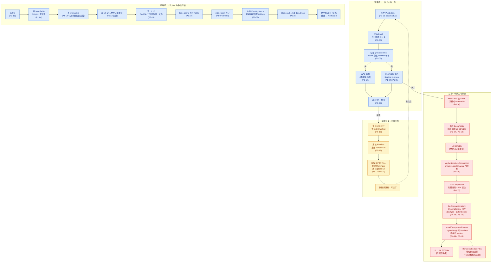

# 附录 A · 全景脉络

> 篇:附录
> 定位:这不是新章,而是**鸟瞰式收束**。前面 20 章把每个零件讲透了——这一篇把它们拼成一张图,再提炼几条贯穿全书的哲学。读完你应该能在脑子里放映出 LevelDB 运转的全过程,而不需要再翻任何一章。

---

## A.1 这本附录要做什么

正文 21 章按"一次 Put 的一生 + 后台收拾 + 崩溃恢复"的旅程展开,每一章只照亮旅程上的一座驿站。读完任何单章,你拿到的是一颗珠子;这本附录要把它们**串成一条线**,再给你几条**贯穿全书的哲学**作为日后看任何存储系统都能用上的权衡地图。

具体做三件事:

1. **一张全景大图**:把"一次 Put 的一生 + 后台收拾 + 崩溃恢复"完整画出来,每个节点标注对应第几章,让你一眼看清"我现在在哪、为什么要这样"。
2. **几条贯穿哲学**:清单式,每条一段说清"全书哪里兑现了它"。这不是新内容,而是把你已经在各章读过的设计抉择,提炼成可复用的判断框架。
3. **前台 vs 后台 全景对照表**:用一张大表把"前台路径"和"后台 Compaction"两面各自的组件、所属章节、解决的问题并排摆出来,完成全书的二分法收束。

---

## A.2 一张全景大图:一次 Put 的一生 + 后台 + 恢复

下面这张 mermaid 流程图,把 LevelDB 的完整生命周期串成一条线。上半部分是**写路径 + 后台**(自上而下),下半部分单独画出**读路径**(自左而右),最右侧是**崩溃恢复**的回环。

**怎么读这张图**:

- **蓝色(写路径 + 读路径)= 前台**,核心诉求是**快**——写要秒回,读要尽快拿到正确最新值。
- **红色(刷盘 + Compaction + GC)= 后台**,核心诉求是**收敛**——把追加堆积的碎片、放大、过期版本一层层合并压缩掉。
- **黄色(崩溃恢复)= 一致性兜底**——进程崩了、机器挂了,重启后按 CURRENT → Manifest → WAL 的顺序重放,恢复到一致状态。
- **每个节点括号里的 P{X-YY}** 就是该机制详讲的章节。这张图本身就是一张"全书目录的可视化"。

**图的三个要点**:

1. **写路径严格"先 WAL 后 MemTable"**:WAL 是持久性的唯一保证,反了这个顺序,MemTable 进了但 WAL 没落盘,崩溃就丢。这条约束在 P0-01(1.6)、P1-06、P5-17 三处反复钉死,是正确性的硬约束。
2. **读路径按"最新版本优先"短路**:MemTable(最新)→ Immutable → L0(新→旧逐个查)→ L1..L6(FindFile 二分定位唯一文件)。每一层内部还有 table cache → index 二分 → 布隆 → block cache 四级剪枝。命中即返回,这是把读放大从"扫所有层"压到"几乎零 I/O"的全部机制。
3. **崩溃恢复是个闭环**:正常运行时写路径往前走,Compaction 在后台慢慢收敛;一旦崩溃,恢复路径把"被中断的写"通过 WAL 重放补回 MemTable,把"被中断的 Compaction"通过 Manifest 重放补回 VersionSet。两条日志(WAL + Manifest)各管一面,各自重放,互不干扰。

---

## A.3 几条贯穿哲学

下面六条,是 LevelDB 全书设计抉择的"骨架"。每一条都不是新东西——你在正文里已经见过它们无数次,这里只是把它们提炼出来,作为日后看任何存储系统都能用上的判断框架。

### ① 只追加,不原地改

**WAL 是追加、MemTable(SkipList)是只新增节点、SSTable 是一次性顺序写出来的文件、Manifest 是追加的编辑日志——LevelDB 里几乎所有"写"都是追加。改=打一条新版本盖在旧的之上(由读取时"取最新"裁决),删=写一条 tombstone 墓碑(由读取时"遇到墓碑当作不存在"裁决)。**

这条哲学的根,是 P0-01 立起的物理事实:磁盘顺序写比随机写快一到两个数量级,原地改(B-tree 那套)就是随机写。LevelDB 顺从这条物理事实,把一切写都变成追加,代价是同一条数据会有多个版本散落在不同层,要靠 Compaction 在后台慢慢去重、清理。

**全书哪里兑现了它**:

- **P0-01**:立起"只追加换写入吞吐,代价是三笔放大"的主线。
- **P1-06**:WriteBatch 把一批操作打包成一条原子记录,整条塞进 WAL 的一条 record——追加的粒度是"一条 batch",不是"一条 Put"。
- **P4-16**:Compaction 的归并产出新 SSTable 也是追加——`TableBuilder::Add` 一边归并一边顺序写新文件,绝不回头改老文件;旧文件靠 `RemoveObsoleteFiles` 物理删除。
- **P5-17 / P5-18**:WAL 和 Manifest 都是追加式日志,崩溃后靠重放恢复。整个系统里**唯一会"原地改"的地方是 CURRENT 文件**,而它用的是"临时文件 + rename"的 POSIX 原子操作,本质也是先写新文件再原子替换。

### ② 前台快,后台收

**前台(WAL + MemTable 写、多路归并读)求快——写秒回,读尽快拿到正确最新值;后台(Immutable 刷盘、Compaction 归并、Manifest 记账、垃圾回收)求稳和收敛。两者通过 `mutex_` + Version 引用计数协作,互不阻塞。**

这是全书的**二分法**。前台路径上每一个机制的存在理由都是"让写更快或让读更准":写组攒批换吞吐、SkipList 无锁读换读吞吐、布隆挡掉无效查询削读放大、block cache 换内存换磁盘 I/O。后台路径上每一个机制的存在理由都是"把追加堆积的代价收敛回来":Compaction 归并去重削空间放大、丢旧版本和墓碑回收空间、Manifest 记账保证崩溃后能恢复、引用计数担保旧 Version 活着让前台读不被打扰。

**全书哪里兑现了它**:这条哲学贯穿全书每一章。具体说:

- **前台这一面**:P1-02(API 基石零拷贝零分配)、P1-04(SkipList 无锁读)、P1-05(Arena bump 分配让写几乎零开销)、P1-06(写组攒批换吞吐)、P2-08(前缀压缩削空间放大)、P2-09(布隆削读放大)、P3-11~13(Iterator 体系 + 多路归并 + 多级剪枝让读尽快短路)。
- **后台这一面**:P4-14(Version/VersionSet 是 compaction 的舞台)、P4-15(触发与选取)、P4-16(归并执行)——这三章是全书心脏,讲的就是"后台怎么收敛"。
- **衔接处**:P5-17 / P5-18(WAL + Manifest)既兜前台(写不丢、可读),又兜后台(崩溃后能恢复);P6-19 / P6-20(cache + Env)是前后台共用的性能基建。

### ③ 一把大锁 mutex_ 换简单,关键处无锁换读吞吐

**这是 LevelDB 与 Tokio(无锁优先)最鲜明的对照。LevelDB 用一把 `port::Mutex mutex_` 管几乎所有共享状态——`mem_` / `imm_` / `writers_` 队列 / `versions_`——简单到可以一眼看懂,正确性几乎免费。唯独 MemTable 的读和 SkipList 的 `next_` 用 `std::atomic` 无锁,因为读是热路径,不能被写阻塞。**

这是一种"取舍分明"的并发哲学:**绝大多数地方用锁换简单**(一把大锁的代码比无锁代码易写易调试一个数量级),**只有读吞吐真的被卡住的地方才上无锁**。LevelDB 判断"哪里值得上无锁"的标准是:读操作远多于写,且读不能被写阻塞。MemTable 正是这个场景——`Get` 要读 MemTable,并发 `Put` 要写 MemTable,如果用读写锁,写阻塞所有读。

**全书哪里兑现了它**:

- **P1-04**:SkipList 的 `std::atomic<Node*> next_[1]`(skiplist.h:176) + release store / acquire load 的内存序,是全书唯一一处真正用了无锁并发的地方。三层担保 sound 性:① `std::atomic<Node*>` 排除单变量撕裂;② release/acquire 建立 happens-before,保证读者通过发布点看到完整节点(包括 key 和所有 next);③ 不变量"节点永不删除、key 永不改变"排除 use-after-free。
- **P1-06**:写组的 leader 在写 WAL + 插 MemTable 时 `mutex_.Unlock()`(db_impl.cc:1230 附近),释放锁让 fsync 那个慢窗口对新 writer 开放、持续攒批——这是"大锁换简单,但关键慢路径上放手"的精确配合。
- **P4-14**:Version 的引用计数替代读写锁。读写锁会让 compaction 的写锁等所有 reader 释放(reader 多时 compaction 饿死,触发不了压,读放大雪崩);引用计数方案下 compaction 永远不等 reader,直接产生新 Version,旧 Version 留给 reader 用完回收。
- **P4-16**:`DoCompactionWork` 在归并重 I/O 期间 `mutex_.Unlock()`,只在开始(算 snapshot、MakeInputIterator)和结束(InstallCompactionResults 切 Version)持锁,让前台 Write/Get 不被 compaction 长任务拖死。
- **P1-05**:Arena 的 `memory_usage_` 用 `relaxed` 原子(arena.h:49-51 的 TODO),其他字段不用原子——这是"只在跨线程字段上加最小同步"的工程范例。

> **对照 Tokio**:Tokio 作为 Rust 异步运行时,无锁优先(work-stealing 调度器、无锁定时器轮);LevelDB 作为 C++ 嵌入式 KV,大锁优先。两者反映的是**语言范式**(async vs 同步)和**工作负载**(网络密集 vs 磁盘密集)的差异。LevelDB 的瓶颈是磁盘 I/O(几毫秒级),锁竞争在 I/O 面前几乎不可见;Tokio 的瓶颈是任务调度(微秒级),锁竞争就是天花板。所以各自的选择都对。

### ④ 用读/写/空间三笔放大换写吞吐,Compaction 收敛

**LSM 不是免费的午餐。它用三笔账换来了写入的极致吞吐:读放大(一个 key 散在多层,读要翻多处)、写放大(同一条数据被 Compaction 反复重写)、空间放大(旧版本和墓碑在被清理前一直占位)。而 Compaction 是不断把这三笔账从"无限"收敛到"可控"的会计。**

这是 P0-01 立起的根本权衡,全书每一章的设计抉择本质上都在这三者之间找平衡。关键认知是:**三笔放大互相牵制**,压低一个往往抬高另一个。例如:

- 加布隆过滤器(P2-09)削读放大,代价是多存一份 filter block(空间放大略升)。
- 加更多层级(L0→L6,每层 10x)削单次 Compaction 的写放大,代价是读要翻更多层(读放大升)。
- 增大 MemTable(默认 4MB)减少刷盘频率,代价是崩溃恢复要重放更多 WAL(恢复时间升)。
- 收紧 Compaction 触发阈值(L0 文件数 4、层级大小 10x)削读放大和空间放大,代价是 Compaction 更频繁、写放大升。

LevelDB 的所有参数(4MB / 4 文件 / 10^L MB / 2MB / 16 restart interval / 10 bits per key / k=6)都是这套权衡的工程标定值。`doc/impl.md` 给了这些精确数字。

**全书哪里兑现了它**:

- **P0-01**:立起三笔放大框架(A.1.8 技巧精解),用"完全无 Compaction 的 LSM 会怎样"的反面对比,钉死 Compaction 的全部意义就是收敛这三笔账。
- **P2-09**:布隆过滤器是削读放大的关键武器——10 bit/key 换 99% 无效查询被挡,这是空间换读放大的精算。
- **P4-15**:10x 层级约束(`MaxBytesForLevel`,version_set.cc:41-50,注释明说"Result for both level-0 and level-1",即 L0/L1 共享 10MB 基数)是三笔放大平衡的工程标定。
- **P4-16**:规则 A(丢旧版本)收敛空间放大,规则 B(丢 tombstone 的 IsBaseLevelForKey 判断)是正确性红线(扔早了"复活"旧值),写放大 ~10-30× 的来源(一条数据从 L0 到 L6 被层层重写)——这一章把三笔放大的"收敛机制"和"代价来源"都讲透了。

### ⑤ 引用计数让读写不互斥

**Version、cache handle、MemTable、FileMetaData 都靠引用计数。读持旧 Version、写产生新 Version,两者并存到读用完为止,互不阻塞。这是"前台读不被后台 Compaction 打扰"的字面根。**

引用计数是 LevelDB 解决"读写并发"的核心手段,比读写锁更适合"读多写少 + 写不能等读"的场景。读写锁的痛点是写锁要等所有 reader 释放——reader 多时 writer 饿死。引用计数反过来:writer 直接产生新版本,旧版本留给 reader 用完回收,writer 永不等 reader。代价是旧版本会短暂多占内存(直到 reader 释放),但在 LSM 场景下这个代价可以接受。

**全书哪里兑现了它**:

- **P4-14**:`Version` 的 `refs_` 字段,VersionSet 持 current 一个 ref,每个 reader/iterator/compaction 用前 Ref 用完 Unref,归 0 才析构。reader 解锁去读盘(读盘几毫秒不持 `mutex_`,让写能进),持 ref 担保旧 Version 活着、旧文件不被 `RemoveObsoleteFiles` 物理删——这是 use-after-free 的防线。
- **P1-05**:`MemTable` 的 `refs_`。DBImpl 的 `mem_` / `imm_` 持有时 Ref,读 Iterator 拿 MemTable Iterator 时 Ref(保证 Iterator 活着期间 MemTable 不析构),刷盘过程中 Ref(保证 Immutable 不被读 Iterator 释放)。Unref 减到零就 `delete this`,析构链 `~MemTable → ~Arena → 全块 delete[]`。
- **P4-14 + P4-16**:`FileMetaData` 也有 `refs`,是 Version 内层引用计数的补充——一个文件可能被多个 Version 引用(新旧 Version 切换的过渡期),文件级引用计数担保物理删除的安全。
- **P6-19**:ShardedLRUCache 的 `LRUHandle` 把引用计数内联进 handle 结构(`refs` / `in_cache` / `deleter` / `charge` 同一组字段),被引用的 handle 不进 LRU 淘汰队列——这是 cache 支持 pin 语义的根。
- **P3-13**:`DBImpl::Get` 持锁阶段只做"记 snapshot、拷指针、引用计数 +1",放锁读数据。读持有的是对象引用计数,不是锁——这是"读不阻塞写"的字面实现。

### ⑥ 变长编码 + 位运算省空间

**varint、共享前缀、DoubleHashing 布隆、internal key 的 seq|type 打包、CRC32C、FindShortestSeparator——LevelDB 大量用变长编码和位运算把"小记录海量"场景下的空间开销压到极小。这是 LSM 空间效率的核心手段。**

为什么 LevelDB 这么在意省几个字节?因为 SSTable 里有几十万到几百万条 entry,每条省几个字节,累计就是 MB 级空间——直接 translates 成更少的 block、更少的磁盘 I/O、更小的读放大和空间放大。这些"小技巧"叠起来,撑起了 LSM 在空间效率上接近 B-tree 的表现。

**全书哪里兑现了它**:

- **P1-03**:internal key 的 `(seq << 8) | type` 打包——8 字节同时塞下 56 位 sequence number 和 8 位 type(`kTypeDeletion = 0x0` / `kTypeValue = 0x1`,dbformat.h:54),让"多版本键"退化成纯排序问题。
- **P2-07**:BlockHandle 用 varint64 编码 offset + size,小数字 1~2 字节、大数字自动扩长,典型 BlockHandle 5~6 字节 vs 固定 16 字节。index block 几十万条 entry 累计省 MB 级空间。
- **P2-08**:block 内部的前缀压缩——相邻 entry 只存 `shared + non_shared + key_delta + value`,压缩率在多版本、相近 key 场景可达 50%~75%。restart point(每 16 条一个完整 key)让压缩后的 block 仍能二分查找,化解"压缩"和"随机访问"这对矛盾。
- **P2-09**:布隆的 DoubleHashing——k 个 hash 实际只算 1 个 `BloomHash`,从中拆出 `delta = (h>>17)|(h<<15)`,用 `g_j = h + j*delta` 衍生 k 个位置。查询从 k 次 hash 降到 1 次 hash + k 次加法,**快 ~4 倍**。默认 `bits_per_key=10, k=6`,误判率 ~1%。
- **P2-09 / P2-10**:`FindShortestSeparator` / `FindShortSuccessor`——在 index block 里,把"上 block 末尾 + 本 block 开头"算一个最短分隔串,通常几字节,把 index key 从几十字节压到几字节。
- **P5-17**:WAL 的 32KB block + 7 字节 header(crc 4 + length 2 + type 1)+ record 分片(FIRST/MIDDLE/LAST),`static_assert(kHeaderSize == 7)` 把这层关系焊死。
- **P6-20**:`no_destructor`(`alignas + char[] + placement new + 不析构`)避开全局单例的析构顺序坑——这是位运算/内存布局技巧在生命周期管理上的应用。

---

## A.4 前台 vs 后台 全景对照表

全书二分法:**前台**(让写秒回、读拿正确最新值)vs **后台**(把追加堆积的碎片、放大、过期版本一层层合并压缩掉)。下表把两面各自的组件、所属章节、解决的问题并排摆出来,完成二分法的收束。

> **WAL 与 Manifest 是衔接处**:既服务前台(写不丢、可读),也服务后台(崩溃恢复)。表中放在"衔接"列。

### 写路径

| 组件 | 归属 | 章节 | 解决什么问题 | 关键技巧 |
|------|------|------|------------|---------|
| `Slice` / `Status` / `Comparator` | 前台 | P1-02 | API 边界零拷贝、热路径零分配、键序可替换 | Slice 不拥有内存 + RAII 担保生命周期 |
| `InternalKey` (seq + type 打包) | 前台 | P1-03 | 同 user_key 多版本如何区分新旧 | `(seq << 8) \| type` 尾部追加,seq 降序让最新排最前 |
| `WriteBatch` + 写组 | 前台 | P1-06 | 多线程并发写如何合并成 1 次 WAL 追加 | leader/follower 攒批 + 动态 max_size |
| **WAL**(32KB block + record 分片 + CRC) | **衔接** | P5-17 | 写不丢(崩溃可重放)+ 防撕裂写 | 32KB 对齐 + FIRST/MIDDLE/LAST + masked CRC32C |
| `SkipList`(`std::atomic<Node*>`) | 前台 | P1-04 | MemTable 写者加锁、读者无锁 | release store / acquire load + 不变量守 sound |
| `Arena`(bump allocator) | 前台 | P1-05 | MemTable 内存分配几乎零开销 | 只进不出 + 整块回收 + 大块直通 |
| `MemTable`(SkipList + Arena + 引用计数) | 前台 | P1-05 | 写秒回的落点、读的第一站 | `refs_` 让读 Iterator 持有时 MemTable 不析构 |
| Immutable(冻结 MemTable) | 衔接 | P4-14 | MemTable 满了切 Immutable,后台刷盘 | `has_imm_` 原子标志 + 引用计数担保活着 |

### 后台(Compaction + 垃圾回收)

| 组件 | 归属 | 章节 | 解决什么问题 | 关键技巧 |
|------|------|------|------------|---------|
| `Version`(不可变快照 + 引用计数) | 后台 | P4-14 | "此刻数据库长什么样"如何表达 + 读写不互斥 | `refs_` 让 reader 持旧 Version,compaction 产生新 Version |
| `VersionSet`(版本更替管理) | 后台 | P4-14 | compaction 完成后原子切 current | `AppendVersion` 的 `current_ = v` 是原子边界 |
| `MaybeScheduleCompaction`(四类触发) | 后台 | P4-15 | 何时该 compact(imm/size/seek/manual) | 优先级 imm > manual > size-driven > seek-driven |
| `PickCompaction`(轮转选取) | 后台 | P4-15 | 选哪个文件压,公平覆盖 key 空间 | `compact_pointer_[level]` 轮转 + L0 特殊(重叠全压) |
| 10x 层级约束 | 后台 | P4-15 | 三笔放大的工程标定 | `MaxBytesForLevel`:L0/L1 共享 10MB 基数,L2+ 每层 ×10 |
| `DoCompactionWork`(归并执行) | 后台 | P4-16 | 多路归并、丢旧版本、丢 tombstone、切文件 | 规则 A(丢旧版本) + 规则 B(IsBaseLevelForKey 才丢 tombstone) |
| `InstallCompactionResults` + `LogAndApply` | 后台 | P4-14 / P5-18 | 切 Version + 持久化进 Manifest | VersionEdit 追加进 Manifest,原子切 current |
| `RemoveObsoleteFiles`(GC) | 后台 | P4-14 / P5-18 | 物理删旧文件,回收磁盘 | 依赖 Version/FileMetaData 引用计数担保安全 |
| **Manifest**(版本编辑日志) | **衔接** | P5-18 | 文件结构变更可恢复(加文件/删文件/改层级) | 复用 WAL record 格式 + `VersionEdit` 一条条追加 |
| **CURRENT**(单文件指针) | **衔接** | P5-18 | "哪个 Manifest 最新"的原子定位 | 临时文件 + `rename(2)` 原子切换 |

### 读路径

| 组件 | 归属 | 章节 | 解决什么问题 | 关键技巧 |
|------|------|------|------------|---------|
| 统一 `Iterator` 接口 + 装饰器 | 前台 | P3-11 | 所有数据源统一成"有序流",可任意组合 | `RegisterCleanup` 链表 + 洋葱式套娃 |
| `DBIter`(翻译 internal key + 跳墓碑) | 前台 | P3-11 | 对外只暴露 user_key → value,吞下多版本复杂性 | 遇墓碑跳过该 user_key 所有更旧版本 |
| `MergingIterator`(多路归并) | 前台 | P3-12 | MemTable + Immutable + 多层 SSTable 归并成一路 | 线性扫描取最小(不用堆)+ 取最小=取最新(依赖 internal key 编码) |
| `Version::Get`(按层短路) | 前台 | P3-13 | 点查按层短路,命中即返回,不归并所有层 | L0 新→旧逐个查,L1+ FindFile 二分定位唯一文件 |
| SSTable 四级布局 + footer 固定锚 | 前台 | P2-07 | 打开文件 O(1) 定位索引根 | 48 字节 footer 焊末尾 + varint BlockHandle |
| 前缀压缩 + restart point | 前台 | P2-08 | block 内紧凑存储 + 仍能二分查找 | 共享前缀 + 每 16 条一个 restart point |
| 布隆过滤器(DoubleHashing) | 前台 | P2-09 | 读 data block 前先问"八成有没有",挡掉无效查询 | 1 次 hash + k 次加法,10 bit/key 换 99% 挡刀 |
| `TwoLevelIterator`(懒加载) | 前台 | P2-10 | index 指向 data 两级串,按需读 data block | 上层 index 二分 + 下层 data 懒打开 + block cache |
| block cache + table cache | 衔接 | P6-19 | 读过的 block / 打开的 Table 常驻内存 | 16 路分片 + handle 内联引用计数 + pin 语义 |
| `RecordReadSample`(采样触发 seek-compaction) | 衔接 | P3-13 → P4-15 | 热点文件被反复 seek 时自动触发压实 | `allowed_seeks` 递减,耗尽标 `file_to_compact_` |

### 性能基建 + 一致性兜底

| 组件 | 归属 | 章节 | 解决什么问题 | 关键技巧 |
|------|------|------|------------|---------|
| `ShardedLRUCache`(block cache + table cache) | 衔接 | P6-19 | 读路径用内存换磁盘 I/O | 双向链表 + 哈希 + handle 引用计数,同一份 `Cache` 接口服务两种资源 |
| `Env`(文件 / 线程 / 时间抽象) | 衔接 | P6-20 | 平台相关操作依赖注入,业务代码零改动跨平台 | `EnvWrapper` 装饰器 + `InMemoryEnv` 纯内存测试 + `no_destructor` 避坑 |
| 崩溃恢复全流程(`Recover`) | 一致性 | P5-17 / P5-18 | 进程崩了、机器挂了,恢复到一致状态 | 读 CURRENT → 重放 Manifest 重建 VersionSet → 重放 WAL 重建 MemTable |

**这张表怎么用**:任何时候看 LevelDB 源码看到某个机制,先问"它属于哪一面"。如果在前台那面,它的存在理由是"让写更快或读更准";如果在后台那面,理由是"把代价收敛";如果在衔接处,理由是"让前后台能协作或能恢复"。这张表就是全书二分法的**可视化总账**。

---

## A.5 一句话点题

读完这 20+ 章,如果把 LevelDB 的全部精妙压缩成一句话:

> **LevelDB 的全部精妙,是对"磁盘顺序写快、随机写慢、原地改更慢"这一物理事实的系统性顺从。**

它把每一次写都变成顺序追加(WAL、MemTable、SSTable、Manifest 全是追加),把每一次改和删都变成"打一条新记录盖在旧的之上"(改=新版本、删=tombstone),让读去裁决"取最新版本",让后台 Compaction 慢慢去重、清理、归档。这套设计换来写入的极致吞吐,代价是读/写/空间三笔放大,而 Compaction 是不断把它们收敛回来的会计。

WAL 换不丢,MemTable 换立即可读,Compaction 换放大可控——三件事,字面对应源码里的 `log_->AddRecord` / `InsertInto(mem_)` / `MaybeScheduleCompaction`。一把大锁换简单,关键处无锁换读吞吐。引用计数让读写不互斥。变长编码和位运算把空间压到极小。这些设计抉择叠起来,构成了一个在单机嵌入式 KV 这个生态位上,把"只追加换吞吐"这条路走到极致的系统。

LevelDB 不是最快的 KV(RocksDB、Redis 都更快),也不是功能最全的(没有列族、没有事务、没有范围删除的原生支持)。但它是** LSM 这套哲学最干净、最易读、最值得反复研读的实现**——40000 行 C++ 讲清了"如何顺从一个物理事实,换一种存储引擎的整个架构"。读完它,再看 RocksDB、Cassandra、HBase、TiKV 的 TiFlash 列存,你会看到同一套权衡在不同规模、不同负载下的延续与变奏。那张权衡地图——只追加换吞吐、三笔放大、前台快后台收、引用计数让读写不互斥——适用于任何 LSM 系统,乃至任何存储系统。

**这就是这本书想给你的东西。**
