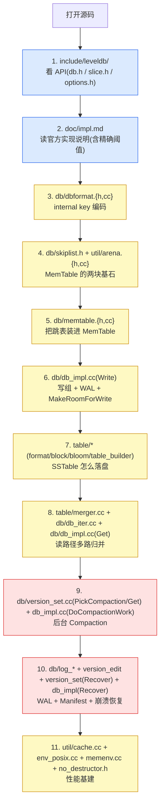
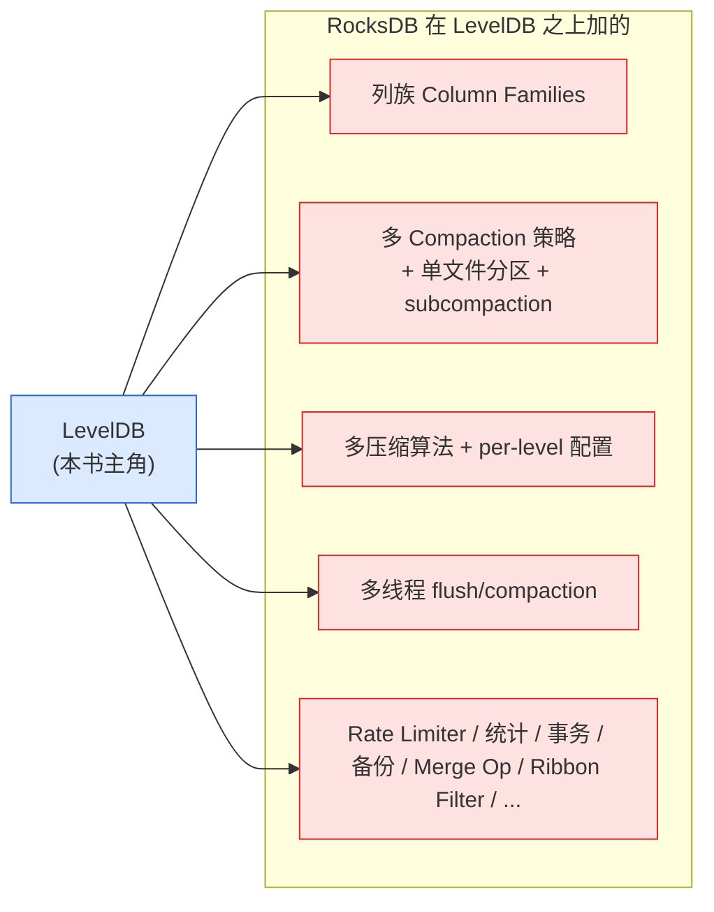

# 附录 B · 源码阅读路线与延伸

> 篇:附录
> 定位:这不是新知识,而是**一张源码地图 + 一条演进路径 + 一面对照镜**。读完前面 21 章的人,手上缺的是"我自己去啃源码,该从哪个目录、哪个文件先看起";以及"LevelDB 之后,RocksDB 在它身上加了什么;它和 B-tree 数据库到底差在哪"。这一份附录把这三件事一次说清。

---

## B.1 一句话点破

> **LevelDB 的源码不大,大约 1.5 万行精心打磨的 C++,却装下了一整个 LSM 家族的骨架。拿到这张源码地图,你就拿到了一条"从 API 到 Compaction 到崩溃恢复"的自学路径;再看清它到 RocksDB 演进了什么、它和 B-tree 在哪儿分野,整个 LSM 流派你都算进了门。**

---

## B.2 LevelDB 源码阅读地图

### B.2.1 先看一棵真实的目录树

下面这棵树是**实地 `ls` 核过**的(对应本地 `leveldb/` master @ `7ee830d`),只保留头文件与实现文件,去掉测试与构建文件:

```
leveldb/
├── include/leveldb/          # 公开 API(读者第一个要读的目录)
│   ├── db.h                  # DB::Open / Put / Get / Delete / Write / CompactRange
│   ├── write_batch.h         # WriteBatch(原子批处理)
│   ├── iterator.h            # 统一的 Iterator 接口
│   ├── options.h             # Options / ReadOptions / WriteOptions
│   ├── comparator.h          # Comparator 基类(BytewiseComparator)
│   ├── filter_policy.h       # FilterPolicy 基类(NewBloomFilterPolicy)
│   ├── cache.h               # Cache 接口(NewLRUCache)
│   ├── env.h                 # Env 抽象(文件/线程/时间)
│   ├── slice.h               # Slice(零拷贝字符串视图)
│   ├── status.h              # Status(状态打包)
│   ├── table.h               # 打开已存在 SSTable
│   ├── table_builder.h       # 构建 SSTable
│   ├── dumpfile.h            # dumpfile 工具
│   ├── c.h                   # C 绑定
│   └── export.h              # DLL 导出宏
│
├── db/                       # 引擎核心(全书大半篇幅都在这里)
│   ├── db_impl.{h,cc}        # ★ DBImpl:写路径、compaction 调度、Recover
│   ├── version_set.{h,cc}    # ★ VersionSet / Version:版本管理、PickCompaction、Version::Get
│   ├── dbformat.{h,cc}       # internal key 编码(ParseInternalKey、AppendKeySequence...)
│   ├── skiplist.h            # ★ SkipList 模板(MemTable 骨架,无锁读)
│   ├── memtable.{h,cc}       # MemTable(SkipList + 引用计数)
│   ├── write_batch.cc        # WriteBatch 编解码与 Iterate
│   ├── write_batch_internal.h
│   ├── log_format.h          # WAL record 类型(kFirstType/kMiddleType/kLastType)
│   ├── log_writer.{h,cc}     # log::Writer(追加 record)
│   ├── log_reader.{h,cc}     # log::Reader(读 record + CRC 校验)
│   ├── version_edit.{h,cc}   # VersionEdit(Manifest 的一条编辑)
│   ├── snapshot.h            # SnapshotImpl(seq 链表)
│   ├── db_iter.{h,cc}        # DBIter(internal key → user key)
│   ├── table_cache.{h,cc}    # 打开过的 Table 对象的缓存
│   ├── filename.{h,cc}       # 文件名编解码(.log/.ldb/.MANIFEST/CURRENT/...)
│   ├── builder.{h,cc}        # BuildTable:Immutable → SSTable
│   ├── repair.cc             # RepairDB:损坏库的修复工具
│   └── dumpfile.cc           # 命令行 dump 工具
│
├── table/                    # SSTable 文件格式
│   ├── format.{h,cc}         # ★ BlockHandle / Footer / ReadBlock(四级布局入口)
│   ├── block.{h,cc}          # Block 读:前缀压缩解码 + 二分
│   ├── block_builder.{h,cc}  # Block 写:共享前缀 + restart point
│   ├── table.{h,cc}          # Table::Open / 内部 Cache
│   ├── table_builder.cc      # TableBuilder::Add(边写边排)
│   ├── filter_block.{h,cc}   # 一个 SSTable 的 filter block
│   ├── merger.{h,cc}         # ★ MergingIterator:k 路归并
│   ├── two_level_iterator.{h,cc}  # 两级迭代器:index 懒指向 data
│   ├── iterator.cc           # EmptyIterator / SingletonIterator
│   └── iterator_wrapper.h    # 缓存上一次 Seek/Value 的包装器
│
├── util/                     # 工具与数据结构
│   ├── arena.{h,cc}          # ★ Arena:bump 分配(MemTable 的内存来源)
│   ├── cache.cc              # ★ ShardedLRUCache(16 分片 LRU + handle 引用计数)
│   ├── bloom.cc              # BloomFilterPolicy(DoubleHashing)
│   ├── filter_policy.cc      # NewBloomFilterPolicy 入口
│   ├── coding.{h,cc}         # varint 编解码
│   ├── crc32c.{h,cc}         # CRC32C(Castagnoli)
│   ├── hash.{h,cc}           # Hash(murmur-like)
│   ├── comparator.cc         # BytewiseComparator / InternalKeyComparator
│   ├── status.cc             # Status 的打包/解包
│   ├── no_destructor.h       # NoDestructor(规避全局析构顺序坑)
│   ├── random.h              # Random(LCG,跳表用 1/4 提升)
│   ├── mutexlock.h           # RAII lock guard
│   ├── logging.{h,cc}        # AppendNumberTo / AppendEscapedStringTo
│   ├── histogram.{h,cc}      # Histogram(统计用)
│   ├── env.cc                # Env 包装
│   ├── env_posix.cc          # ★ Env::Posix
│   ├── env_windows.cc        # ★ Env::Windows
│   ├── posix_logger.h        # PosixLogger
│   ├── windows_logger.h      # WindowsLogger
│   └── options.cc            # 默认 Options
│
├── helpers/memenv/           # 内存 Env(测试用)
│   ├── memenv.{h,cc}         # ★ InMemoryEnv:纯内存实现 Env
│
├── port/                     # 平台抽象
│   ├── port.h                # 选择 port_config / port_stdcxx / ...
│   ├── port_stdcxx.h         # std::mutex / std::condition_variable / OnceType
│   ├── thread_annotations.h  # GUARDED_BY / EXCLUSIVE_LOCKS_REQUIRED 宏
│   └── ...
│
└── doc/                      # 官方说明(必读)
    ├── impl.md               # ★★ 官方实现说明(精确阈值都在这)
    ├── table_format.md       # ★ SSTable 四级布局官方版
    ├── log_format.md         # ★ WAL 32KB block 格式官方版
    ├── index.md              # 各文档索引
    └── benchmark.html        # 官方 benchmark
```

> **这张图怎么用**:左边的 `include/` 是"读 API 想知道全貌"的入口;中间 `db/` 是"引擎怎么转"的核心;右边的 `table/` 是"文件长什么样"的格式;`util/` 是被前两者共同用的工具。带 ★ 的文件是全书各章反复引用的"主角",想直接啃源码的人,按下面的顺序读它们就行。

### B.2.2 推荐阅读顺序(对应本书章节序)

本书 21 章已经按"一次 `Put` 的一生 + 后台收拾 + 兜底"精心排序,源码阅读就跟着这个序走最省力。下面这张表把**章节号**、**该读的源码文件**、**读的时候要盯的函数/结构**对齐:

| 阶段 | 本书的章 | 该读的源码 | 盯哪个函数/结构 |
|------|----------|-----------|------------------|
| 看全貌 | P0-01 | `include/leveldb/db.h`、`doc/impl.md` | `DB::Open`、`Put`、`Get`、`Delete`、`Write`、`CompactRange` 接口 |
| API 三基石 | P1-02 | `slice.h`、`status.h`/`util/status.cc`、`comparator.h`/`util/comparator.cc` | `Slice` 的 `{data_, size_}`、`Status` 的状态打包 |
| 多版本键 | P1-03 | `db/dbformat.{h,cc}` | `ParseInternalKey`、`AppendInternalKey`、`InternalKeyComparator::Compare` |
| MemTable 骨架 | P1-04 | `db/skiplist.h`、`db/skiplist_test.cc` | `Insert`(release store)、`FindGreaterOrEqual`(acquire load) |
| MemTable 内存 | P1-05 | `util/arena.{h,cc}`、`db/memtable.{h,cc}` | `Arena::Allocate`、`MemTable::Add`/`Get` |
| 写组 | P1-06 | `db/db_impl.cc`、`db/write_batch.cc` | `DBImpl::Write`、`BuildBatchGroup`、`MakeRoomForWrite` |
| SSTable 格式 | P2-07~10 | `table/format.{h,cc}`、`table/block_builder.cc`、`table/block.cc`、`util/bloom.cc`、`table/filter_block.cc`、`table/table_builder.cc`、`table/table.cc`、`table/two_level_iterator.cc`、`doc/table_format.md` | `Footer`、`BlockHandle`、`restart point`、`BloomFilterPolicy`、`TableBuilder::Add`、`Table::Open` |
| 读取 | P3-11~13 | `include/leveldb/iterator.h`、`db/db_iter.cc`、`table/merger.cc`、`table/iterator_wrapper.h`、`db/db_impl.cc`、`db/version_set.cc` | `DBIter`、`MergingIterator`、`DBImpl::Get`、`Version::Get`、`RecordReadSample` |
| Compaction | P4-14~16 | `db/version_set.{h,cc}`、`db/db_impl.cc` | `Version`、`VersionSet::PickCompaction`、`DoCompactionWork`、`OpenCompactionOutputFile` |
| WAL + Manifest + 恢复 | P5-17~18 | `db/log_format.h`、`db/log_{writer,reader}.cc`、`db/version_edit.{h,cc}`、`db/version_set.cc`、`db/db_impl.cc`、`db/filename.{h,cc}`、`doc/log_format.md` | `log::Writer::AddRecord`、`VersionEdit`、`VersionSet::Recover`、`DBImpl::Recover`、`WriteLevel0Table` |
| 性能基建 | P6-19~20 | `util/cache.cc`、`include/leveldb/env.h`、`util/env_posix.cc`、`util/env_windows.cc`、`helpers/memenv/memenv.cc`、`util/no_destructor.h` | `ShardedLRUCache`、`Handle`、`Env::Posix`、`InMemoryEnv`、`NoDestructor` |
| 收尾 | P7-21 | `db/snapshot.h`、全书回顾 | `SnapshotImpl`(seq 链表) |

> **一个建议**:本书已经把"为什么要读这段源码"讲透了,读源码时就不用再问"它解决什么问题",专心看"它怎么用这么巧的手段解决的"。每章末尾的"想继续深入往哪钻"已经指了对应的 test 文件(`skiplist_test.cc`、`cache_test.cc` 等),test 文件往往比注释更直白。

### B.2.3 一张"按目录读"的速查图



这张图对应上面那张表,只是更直观地把"读完这块读哪块"连成了链。

---

## B.3 LevelDB → RocksDB 演进了什么

> LevelDB 是 LSM 家族的**精简原型**。RocksDB 是 Facebook(现 Meta)在 LevelDB 基础上,为数据库(MySQL/MyRocks、MongoDB 的 MongoRocks)、消息、SSD 上的高负载场景**持续打磨出的工业级产品**。两者源码同根(LevelDB 本来是 Google 的, RocksDB 一开始就 fork 自 LevelDB),所以**搞清楚 LevelDB 之后,理解 RocksDB 的 80% 就拿到了**——剩下的 20% 是为了在生产里扛住更猛的负载、提供更细的旋钮。下面把几条主要演进讲清。**注意**:这里讲的是基于公开文档与源码的**机制差异**,具体 API 名称请以 RocksDB 官方文档为准。

### B.3.1 列族(Column Families)

LevelDB 一个 DB 就是一个列族(它甚至没有"列族"这个词):所有 KV 共享一份 MemTable、一份 WAL、一套 SSTable。

RocksDB 引入了**列族(Column Family)**:同一个 DB 下可以有多个列族,**共享 WAL 与 Manifest**(写一条 KV 同时落进同一个 WAL,文件结构变更也记在同一份 Manifest),但**每个列族有独立的 MemTable、Immutable、SSTable,以及独立的 Options**。这带来的好处:

- **逻辑分片**:一类 key 一个列族(如 `users`、`orders`、`indexes`),各自可独立配置压缩策略、compaction 策略、TTL、内存预算。
- **跨列族原子写**:因为共享 WAL,一次 `Write` 可以把对多个列族的修改打包成一条 batch,原子提交。
- **删除一整类数据**:删一个列族就能整体丢掉它的 SSTable,不必为每个 key 单独打 tombstone。

> **回扣 LevelDB**:LevelDB 不是"少一个列族",而是把"只有一个列族"这件事用在了全局内存预算与 compaction 调度上,所以简单。RocksDB 的列族,是 LevelDB 单一空间方案的扩展。

### B.3.2 Compaction 多策略与单文件分区

LevelDB 只有一种 compaction 策略——本书讲的 **level compaction**(L0 → L1 → … → L6,10x 大小约束,每层归并)。它简单,但**写放大较大**:一条数据从 L0 一路被归并到 L6,可能被重写 6~7 遍。

RocksDB 在 level compaction 之外,又提供多种策略,生产上可按负载切换或混合:

- **Universal Compaction**(类 tiered):把同一层的多个文件直接堆在一起,等够多了再一次性归并到下一层。**牺牲空间放大,换写放大降低**——适合写极重、空间不敏感的场景。
- **FIFO Compaction**:文件按时间堆积,超出容量直接扔最老的。**纯写优先**,适合纯时序、缓存这类"旧数据可以直接丢"的场景。
- **Tiered Compaction**(现代 RocksDB 进一步优化):介于 level 与 universal 之间。

更关键的是 **Dynamic Level / 单文件分区**(RocksDB 的 SSTable 可以被进一步按 sub-range 分,compaction 时不必整体重写一个文件),以及 **subcompaction**(一次 compaction 内部并行)。这些都是在 LevelDB 的 level compaction 骨架之上做的写放大/并行度优化。

> **回扣 LevelDB**:LevelDB 的 level compaction 是"读放大和写放大之间的一个保守折中"。RocksDB 的多策略,是承认**不同负载要不同的折中**,所以把折中点做成可旋钮。

### B.3.3 压缩(Compression)

LevelDB 在 SSTable 层面支持 **Snappy** 一种压缩(`Options::compression = kSnappyCompression`),且是整块(block)压缩——按 `Options::compression` 全局开关。

RocksDB 内建多种压缩算法(Snappy、ZSTD、LZ4、Zlib、BZip2),并且可以**按层配置不同的压缩**——常见做法是 L0/L1 用快速的 LZ4(降低 CPU),L5/L6 用压缩比更高的 ZSTD(节省空间);甚至**按文件**配置。ZSTD 是 RocksDB 的工业标准选择之一,压缩比与速度都优于 Snappy。

> **回扣 LevelDB**:LevelDB 的 Snappy 已足够展示"压缩是 LSM 减空间放大、减 I/O 的关键手段";RocksDB 把这件事做成 per-level、per-file 的精细旋钮。

### B.3.4 多线程 Flush 与 Compaction

LevelDB 只有一个**后台线程**(`DBImpl::BGWork`)串行地做 flush 或 compaction,通过 `bg_compaction_scheduled_` 计数。**写吞吐大时,后台是瓶颈**。

RocksDB 支持 **多线程 flush + 多线程 compaction**:`max_background_flushes`、`max_background_compactions` 可调,compaction 还能用 subcompaction 在一次 compaction 内并行。这意味着 SSD 上多核可以同时合并多个不相干的文件区间,compaction 跟得上极端写入。

> **回扣 LevelDB**:LevelDB 的"一个后台线程 + 一把大锁"换来了**简单与正确性易证明**;RocksDB 用多线程换吞吐,代价是状态空间复杂得多——这是从原型到产品的常见代价。

### B.3.5 其它值得知道的演进

| 演进点 | LevelDB | RocksDB |
|--------|---------|---------|
| Rate Limiter | 无 | 有,限制 flush/compaction 的 I/O 速率,防止后台压垮前台 |
| Bloom Filter | 经典 bloom | 经典 bloom + **Ribbon Filter**(更省内存,大库尤其显著) |
| WAL 选项 | 一份 WAL,固定行为 | `wal_filter`、可关闭 WAL(`WriteOptions::disableWAL`)、WAL 按 TTL 自动归档 |
| Merge Operator | 无(只 Put/Delete) | 有 `MergeOperator`,读时合并多条增量(计数器、列表追加) |
| 事务 | 无 | **OptimisticTransactionDB** / **TransactionDB**,支持 begin-commit 与冲突检测 |
| 备份与 Checkpoint | 无 | 内建 `BackupEngine`、`Checkpoint::Create` |
| 统计与观测 | 极简 `Histogram` | 丰富的 `Statistics`、`PerfContext`、Trace |
| 压实负载特殊场景 | 无 | TTL、CompactRange 的 filter、prepopulate block cache 等 |
| 后台调度优先级 | 单一队列 | flush 优先于 compaction,可配置 |

> **一句话**:LevelDB 是"**这本书能讲透的最小完整 LSM**";RocksDB 是"**在这个最小完整 LSM 上叠加了生产需要的所有旋钮**"。你在 LevelDB 里学会的每一个组件(WAL、MemTable、SSTable、Compaction、VersionSet、Iterator 体系),在 RocksDB 里几乎都能找到对应物——只是多了配置项、多了并行、多了压缩与列族扩展。



---

## B.4 与 B-tree(PostgreSQL / InnoDB)的对照

LevelDB 是 LSM 家族的代表,PostgreSQL 的堆表 + B-tree 索引、MySQL 的 InnoDB,是 B-tree 家族的代表。回扣 P0-01 的根本分野:**LSM 只追加、不原地改;B-tree 原地改**。这个根本分野,沿着每一条工程权衡往下展开,就有了下面这张对照表。

| 维度 | LevelDB(LSM) | PostgreSQL / InnoDB(B-tree) |
|------|---------------|------------------------------|
| **更新模型** | 只追加。改 = 盖一条新版本,删 = 打墓碑,后台慢慢收拾 | 原地更新。找到叶子页,把值改掉,把这一页写回原位 |
| **写入 I/O 模式** | WAL 顺序追加 + MemTable 内存写 + 后台刷盘/compaction 顺序归并,写几乎全是**顺序** | WAL 顺序追加 + 数据页**随机写回**,随机 I/O 是写吞吐的天花板 |
| **单点读放大** | 读一个 key 要翻 MemTable → Immutable → L0 → L1 → … → L6,直到找到(靠布隆 + index 剪枝削放大) | 树形二分,从根到叶子约 O(log n) 次页面访问,加上 buffer pool 命中后通常内存返回 |
| **写放大** | 大。一条数据 L0 → L1 → … → L6 可能被反复重写 6~7 遍(这正是 compaction 的代价) | 小。一次更新,被改的页面只写一次(尽管有 WAL 与 full page write 的额外开销) |
| **空间放大** | 大。旧版本 + tombstone 在被 compaction 清理前一直占空间 | 小。原地更新不留旧版本,页内紧凑(只有正常页分裂/碎片开销) |
| **范围扫描** | SSTable 本身有序,迭代器一路归并;但跨多层、跨多文件,缓存命中率决定速度 | B-tree 叶子链表天然有序,范围扫描极快、极顺 |
| **并发模型** | 一把大锁 `mutex_` + 后台线程 + 无锁读(SkipList)+ Version 引用计数让读不被写打扰 | latch crabbing(页级锁沿树上行下行)+ MVCC(PostgreSQL)/undo(InnoDB)让读写不互斥 |
| **崩溃恢复** | WAL 重放(用户数据)+ Manifest 重放(文件结构)+ CURRENT 指针定位最新 Manifest | WAL 重放 + checkpoint(同步点到磁盘的位置)+ full page write 防止部分写(torn page) |
| **后台工作** | flush(Immutable → L0)+ compaction(L0…L6 收敛),**是 LSM 命脉**,不做就退化成纯 append | vacuum(PostgreSQL 回收死元组)/ page merge & split(B-tree 自平衡)、purge(InnoDB purge thread 回收 undo) |
| **读优写劣 vs 写优读劣** | 写优读劣。写入吞吐极致,代价是读放大 | 读优写劣。读极快,代价是写要做随机 I/O |
| **适合场景** | 写极重、value 不大、可容忍短暂读放大(日志、时序、监控、消息、本地 KV 缓存) | 读写均衡、读偏多、需要事务与复杂查询(OLTP、关系数据库) |

### B.4.1 把这张表收成三条主线

1. **写路径上的取舍**:LevelDB 把"写"变成**全是顺序追加**(WAL + MemTable),换吞吐;B-tree 把"写"做成**WAL 顺序 + 数据页随机**,换读快。这两条路在 P0-01 里第一次分野,在 LevelDB 每一章里反复印证。
2. **三笔放大的归属**:LSM 的**读放大、写放大、空间放大**三笔账,对应到 B-tree 上分别是"小、小、小"(读树形二分、写只一次、空间紧凑)。**LSM 不是免单,而是把这三笔账挪到了后台 Compaction 慢慢结**——这是它换写吞吐的根本代价。
3. **并发与崩溃恢复的细节差**:B-tree 的 latch crabbing + MVCC,是为了**原地改时还能让别人读**;LSM 的 Version 引用计数,是为了**后台归并切换文件时读不被打扰**。两边都在解决"读写不互斥",但 LSM 因为只追加、不原地改,可以用"读旧 Version"这种更简单的办法。

### B.4.2 不要把这张对照绝对化

> **钉死这件事**:LSM 与 B-tree 不是"谁更好",而是**不同负载下的不同折中**。Facebook 把 MySQL 的 InnoDB 换成 MyRocks(LSM),是为了在同样的 SSD 上塞下更多数据(空间放大更可控);PostgreSQL 也用 B-tree 也能扛住非常重的写负载(buffer pool + WAL 做得够好)。真正决定用哪一种的,是**你的负载里写多还是读多、value 多大、对读延迟敏感到什么程度、能不能容忍后台 compaction 的偶发抖动**。本书讲透 LevelDB,是给你一个"理解整个 LSM 流派"的锚点,不是"LSM 一定更好"。

---

## B.5 延伸阅读

| 资源 | 为什么值得读 |
|------|--------------|
| **`doc/impl.md`(随源码)** | LevelDB 官方实现说明,**短小精悍**,精确阈值(log 4MB 切换、level-0 超 4 文件触发、10^L MB 层级约束、2MB 目标文件)全在这里。读完本书再回头读它,会发现"原来官方几页纸就把全书讲清了"——但只有你读过本书,才能读懂那几页纸里的每一个数字的来历。 |
| **`doc/table_format.md`、`doc/log_format.md`** | SSTable 与 WAL 的官方格式说明,对应本书 P2 篇与 P5-17。 |
| **Bigtable 论文**(Chang et al., OSDI 2006,"Bigtable: A Distributed Storage System for Structured Data") | LSM 思想的源头。LevelDB 自己的 `doc/impl.md` 开篇就说"the representation of a single Bigtable tablet"。读这篇,会看到 SSTable、MemTable、compaction 这些词最初是怎么被设计出来的。 |
| **O'Neil et al., 1996,"The Log-Structured Merge-Tree"** | LSM 这一类数据结构的**原始论文**。LevelDB 是这篇论文思想的一个工业实现。读它可以看到 LSM 理论上的复杂度分析,与 LevelDB 在工程上的取舍做对照。 |
| **RocksDB wiki 与 docs(`github.com/facebook/rocksdb/wiki`)** | 想从 LevelDB 走向 RocksDB 的最佳起点。特别是 "Basic Operations"、"RocksDB Tuning Guide"、"Column Families" 三篇。 |
| **MyRocks / MongoRocks / RocksEngine 等使用 RocksDB 的系统** | 看 LSM 在真实数据库里怎么当存储引擎。 |
| **"Designing Access Methods: The RUM Conjecture"**(Athansoulis et al., 2016) | 把读放大、更新放大、内存放大三者之间的权衡讲成一条理论。读完本书再读它,会看到 LevelDB 每一章的取舍,都能落在这条理论的某个点上。 |

---

## B.6 收束

回到 P0-01 那句话:**LevelDB 的全部精妙,源于对一个物理事实的顺从——磁盘顺序写快、随机写慢、原地改更慢**。于是它把一切"写"都变成追加,把"改"和"删"都变成打标记,再让后台 Compaction 慢慢收拾。从这一条根上长出来的,是 WAL、MemTable、SkipList、Arena、WriteBatch 写组、SSTable 四级布局、Block 前缀压缩、Bloom Filter、两级迭代器、MergingIterator、Version 与 VersionSet、PickCompaction、DoCompactionWork、Manifest、CURRENT——整整 21 章的细节,源码大约 1.5 万行 C++。

附录这一份地图,只想给你留下一个印象:

> **读懂 LevelDB 这 ~1.5 万行精心打磨的 C++,就读懂了整个 LSM 家族的骨架。**

骨架立起来了,RocksDB 的列族、多策略 compaction、多线程、ZSTD、Ribbon Filter,都是在这个骨架上叠加的肉;B-tree 的原地更新、latch crabbing、MVCC,是另一个骨架上的肉。你手里的,是一张能定位所有这些肉的骨头图。

接下来,把本地 `leveldb/` 打开,从 `include/leveldb/db.h` 开始,顺着 B.2.2 的顺序一行行读下去。读到你卡住的地方,就回到本书对应的章节,我们已经在那儿等你了。
