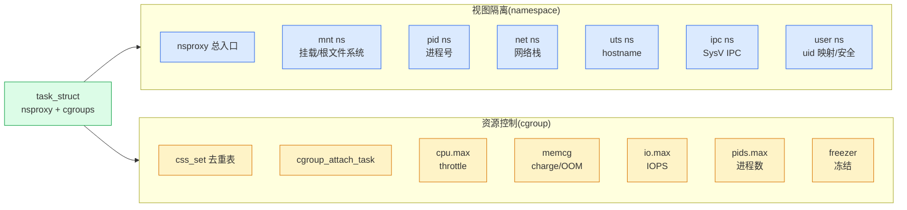

# 第一章 · 第一性原理:为什么需要容器与命名空间

> 篇:P0 开篇
> 主线呼应:这一章是全书的**总览与定调**。你敲一行 `docker run nginx`,几秒钟就拉起一个"看起来独占整机"的 nginx 进程:它有自己的根文件系统、自己的 eth0、自己的 PID 1、自己的 hostname。但宿主机上明明只跑着一个 Linux 内核,这个"盒子"是怎么变出来的?答案不是虚拟机(那太重),而是内核提供的两类原语:**namespace 改它的视图(看不见别人),cgroup 限它的资源(吃不到别人)**。一个进程被这两类原语一夹,就成了容器。读懂这一章,你就拿到了全书剩余 19 章的钥匙:7 种 namespace 各自切什么视图、6 个 cgroup controller 各自限什么资源、运行时怎么把它们拼起来。

## 核心问题

**容器到底是什么?为什么内核非要提供 namespace + cgroup 两类原语,而不是用虚拟机?一个进程被关进"看起来独占整机"的盒子,本质是把它的哪些"指针"换了、哪些"配额"卡住了?**

读完本章你会明白:

1. 容器不是新东西,是**一个被关进盒子的普通进程**:和虚拟机(全机器仿真)不同,它没有 hypervisor、没有客户机内核,跑的就是宿主内核。
2. namespace 的本质:**改 `task_struct` 里的视图指针(`nsproxy`),让进程"看不见"别的进程**——视图隔离。
3. cgroup 的本质:**给 `task_struct` 挂一个 `css_set`(一组 css 指针),让进程"用不到"超额资源**——资源控制。
4. 全书二分法:**视图隔离(namespace)vs 资源控制(cgroup)**,迷路就回到它。
5. ★ 对照 runc/Docker/K8s:内核只提供积木(namespace 系统调用 + cgroup 文件),用户态运行时把它们**组装**成容器;两本(内核 vs 运行时)合一,才是"容器全栈"。

> **逃生阀**:如果你已经被 7 种 namespace、15 个 cgroup controller 吓到,先记住两句话就够了——**namespace 管"看到什么",cgroup 管"能用多少"**;一个进程被这两类原语夹住,就是容器。本章不要求你记住任何具体 ns 或 controller,只立起框架。

---

## 1.1 一句话点破

> **容器不是一个新东西,而是一个被关进"看起来独占整机"盒子的普通进程——内核用 namespace 改它的视图(让它以为自己独占整机),用 cgroup 限它的资源(让它吃不到别人的 CPU/内存/IO),两者一夹,盒子就成了。**

这是结论,不是理由。本章倒过来拆:先看朴素方案的两种走法(虚拟机太重、裸进程太散)为什么都不行,再看内核怎么用 namespace + cgroup 这两类原语造出"又轻又隔离"的容器,然后立起全书二分法,最后钻进两个最基础的设计技巧(`nsproxy` 聚合 + `css_set` 去重)。

---

## 1.2 朴素方案为什么不行:虚拟机太重,裸进程太散

要把一组进程"关起来",最朴素的两条路:

**路一:虚拟机(VM)**。跑一个 hypervisor(KVM/Xen/VMware),仿真一整套硬件,客户机里装一个完整操作系统、一个完整内核。隔离最强(连内核都隔离了),但代价巨大:每个 VM 要起一个客户机内核(几十~几百 MB 内存)、跑一份完整的调度/内存/文件系统/网络栈、启动慢(几十秒)、迁移难。你要部署 100 个 nginx,就得起 100 个 VM,100 个客户机内核——资源浪费惊人。

**路二:裸进程(啥都不做)**。直接在宿主上 `nginx &`,不隔离。轻是轻了,但完全是灾难:① 这个 nginx 看得见宿主上所有进程(`ps aux` 全暴露);② 它能占满整机 CPU(没有限额);③ 它绑宿主的 80 端口,和别的服务冲突;④ 它 `rm -rf /` 能删宿主根文件系统。**完全没法多租**。

> **不这样会怎样**:虚拟机太重,云原生时代要秒级拉起几百个微服务,VM 的启动时间和内存开销顶不住;裸进程太散,没有隔离和限额,一台机器跑不了多个互不信任的服务。两条路都不行,逼出了一个折中——**在宿主内核里,用两类原语把进程的"视图"和"资源"夹住,既轻(没有客户机内核)又隔离(看不见别人、吃不到别人)**。这就是容器。

容器的精妙之处在于:**它不是新的执行环境**。容器里的进程和宿主上的进程,跑的是**同一个内核**,用的是**同一套系统调用**,只是它的"视图"被 namespace 改了、"资源"被 cgroup 限了。所以容器能秒级启动(没有客户机内核要起)、密度极高(几百个容器共享一个宿主内核)、迁移轻量(本质是个进程 + 一份镜像)。这就是云原生选择容器的根本原因。

---

## 1.3 namespace:改 `task_struct` 的视图指针

那内核怎么"改视图"?关键在 `task_struct` 里有个指针 `nsproxy`:

```c
/* include/linux/sched.h:1110(简化) */
struct task_struct {
    ...
    struct nsproxy *nsproxy;   /* L1110 */
    ...
};
```

这个 `nsproxy` 指向一个 [`struct nsproxy`](../linux/include/linux/nsproxy.h#L32-L42)([nsproxy.h:32](../linux/include/linux/nsproxy.h#L32)):

```c
/* include/linux/nsproxy.h:32(简化) */
struct nsproxy {
    refcount_t count;
    struct uts_namespace     *uts_ns;                 /* hostname 视图 */
    struct ipc_namespace     *ipc_ns;                 /* SysV IPC 视图 */
    struct mnt_namespace     *mnt_ns;                 /* 挂载视图(根文件系统) */
    struct pid_namespace     *pid_ns_for_children;    /* 进程号视图(容器里 PID 1) */
    struct net               *net_ns;                 /* 网络栈视图(网卡/路由/iptables) */
    struct time_namespace    *time_ns;
    struct time_namespace    *time_ns_for_children;
    struct cgroup_namespace  *cgroup_ns;              /* cgroup 路径视图 */
};
```

**这就是容器的全部秘密之一**:7 个指针,各管一种视图。普通进程的 `nsproxy` 全指向 init(宿主)的命名空间;容器进程的 `nsproxy` 指向一组**新创建的**命名空间。换了这组指针,进程就只看得见自己盒子里的东西——容器里 `ps` 只看到自己(因为它的 pid ns 里只有它),`ifconfig` 只看到自己的 eth0(因为它的 net ns 里只有那张 veth),`ls /` 看到的是容器根文件系统(因为它的 mnt ns 里的挂载树是隔离的)。

**视图是"换指针",不是"换数据"**——这是 namespace 最反直觉也最精妙的地方。它不复制宿主的进程表/网络栈/挂载树,只是给容器进程发了一副"过滤眼镜"(一组新的 `nsproxy` 指针),让它看不见别人。物理上,宿主内核里只有一张进程表、一套网络栈、一棵挂载树;但每个进程根据自己的 `nsproxy` 看到不同的"投影"。这就是为什么容器比 VM 轻得多——没有数据复制,只有视图过滤。

fork 时,内核检查 `CLONE_NEW*` 标志位,决定子进程是继承父亲的 `nsproxy`(共享)还是造一组新的:

```c
/* kernel/nsproxy.c:151(简化) */
int copy_namespaces(unsigned long flags, struct task_struct *tsk)
{
    struct nsproxy *old_ns = tsk->nsproxy;
    struct user_namespace *user_ns = task_cred_xxx(tsk, user_ns);
    struct nsproxy *new_ns;

    if (likely(!(flags & (CLONE_NEWNS | CLONE_NEWUTS | CLONE_NEWIPC |
                          CLONE_NEWPID | CLONE_NEWNET |
                          CLONE_NEWCGROUP | CLONE_NEWTIME)))) {
        /* 没要新 ns,共享父进程的 */
        ...
        get_nsproxy(old_ns);   /* 引用计数 +1 */
        return 0;
    } else if (!ns_capable(user_ns, CAP_SYS_ADMIN))
        return -EPERM;   /* 要新 ns 必须有 CAP_SYS_ADMIN */
    ...
    new_ns = create_new_namespaces(flags, tsk, user_ns, tsk->fs);
    ...
    tsk->nsproxy = new_ns;   /* 挂上新的 nsproxy */
    return 0;
}
```

([nsproxy.c:151](../linux/kernel/nsproxy.c#L151))

`CLONE_NEWNS`(mnt ns)、`CLONE_NEWUTS`(uts ns)、`CLONE_NEWIPC`(ipc ns)、`CLONE_NEWPID`(pid ns)、`CLONE_NEWNET`(net ns)、`CLONE_NEWCGROUP`(cgroup ns)、`CLONE_NEWUSER`(user ns),这 7 个标志位([uapi/linux/sched.h:20-44](../linux/include/uapi/linux/sched.h#L20-L44))对应 7 种命名空间。一次 `clone(CLONE_NEWNS | CLONE_NEWPID | CLONE_NEWNET | ...)`,就一次系统调用,内核就给子进程造出一组全新的命名空间——这就是 runc 拉起容器的核心动作(第 15 章详讲)。

> **钉死这件事**:namespace 的本质是**给 `task_struct` 换一组 `nsproxy` 指针**。它不复制数据,只过滤视图。7 种 ns(mnt/pid/net/uts/ipc/user/cgroup)各管一种视图,7 个 `CLONE_NEW*` 标志位一次 clone 全可要。换指针而非换数据,是容器比 VM 轻一个数量级的根本。

---

## 1.4 cgroup:给 `task_struct` 挂一组 css 指针

namespace 只解决"看到什么",没解决"能用多少"。一个容器进程就算看不见别人,也能 `while(1)` 占满整机 CPU、`malloc` 直到 OOM、`fork` 出几万个进程拖垮系统。这就需要**第二类原语:cgroup**(control group)。

cgroup 的挂靠点和 nsproxy 类似,也是 `task_struct` 里的一个指针:

```c
/* include/linux/sched.h:1233-1235(简化) */
struct task_struct {
    ...
    /* Control Group info protected by css_set_lock: */
    struct css_set __rcu  *cgroups;   /* L1234,指向一组 css */
    struct list_head      cg_list;    /* L1235 */
    ...
};
```

这个 `cgroups` 指针指向 [`struct css_set`](../linux/include/linux/cgroup-defs.h#L217)([cgroup-defs.h:217](../linux/include/linux/cgroup-defs.h#L217)):

```c
/* include/linux/cgroup-defs.h:217(简化) */
struct css_set {
    /* 一组 css 指针,每个 controller 一个 */
    struct cgroup_subsys_state *subsys[CGROUP_SUBSYS_COUNT];   /* L223 */
    refcount_t refcount;
    struct cgroup *dfl_cgrp;   /* 默认层级里的归属 cgroup */
    int nr_tasks;
    ...
};
```

`subsys[CGROUP_SUBSYS_COUNT]` 是一个**指针数组**,每个槽对应一个 controller(cpuset/cpu/cpuacct/io/memory/devices/freezer/net_cls/perf_event/net_prio/hugetlb/pids/rdma/misc/debug,共 15 个,见 [`include/linux/cgroup_subsys.h`](../linux/include/linux/cgroup_subsys.h#L9-L72))。每个指针指向一个 [`struct cgroup_subsys_state`](../linux/include/linux/cgroup-defs.h#L160)([cgroup-defs.h:160](../linux/include/linux/cgroup-defs.h#L160)),也就是这个任务在某个 controller 上的"配额状态"。

> **钉死这件事**:cgroup 的本质是**给 `task_struct` 挂一个 `css_set` 指针,这个 `css_set` 是一组 css(每个 controller 一个)**。任务在哪个 cgroup,就由这组指针决定;指针指向哪个 cgroup 的 css,任务就用那个 cgroup 的配额。读写 `cgroup.procs` 文件,本质就是改这组指针。

举个具体例子:你建一个 cgroup `/sys/fs/cgroup/mycontainer`,写 `cpu.max = "100000 200000"`(50% CPU)、`memory.max = 512M`,然后把一个进程 PID 写进 `cgroup.procs`。内核的 [`cgroup_attach_task`](../linux/kernel/cgroup/cgroup.c#L2866)([cgroup.c:2866](../linux/kernel/cgroup/cgroup.c#L2866))会把这个进程的 `css_set` 换成"指向 mycontainer 这组 css 的新 css_set"。从此,这个进程的 CPU 时间片由 mycontainer 的 `cpu.max` 限制(超额被调度器 throttle)、它的每次 `malloc` 都被 memcg 记账(超 `memory.max` 触发 OOM kill)、它的 fork 数被 `pids.max` 限制。

**cgroup 是"挂指针 + 配额记账",不是"换执行环境"**——这又是和 VM 的本质区别。VM 是把进程关进另一个内核;cgroup 是把进程的每次资源消耗(一个 tick、一个 page、一次 IO)都记到它所属的 cgroup 账上,超了就拦。这套记账机制渗透到调度器(cpu cgroup 的 `sched_entity` 组调度,回扣《调度器》P6-19)、内存管理(memcg 的 page→memcg 反查,回扣《mm》)、块设备(io cgroup 的 `bio` 限流,回扣《块设备》)。

---

## 1.5 全书二分法:视图隔离 vs 资源控制

把 namespace 和 cgroup 摊开,它们各自管的东西清清楚楚地分两面,这就是全书的**二分法**:

> **视图隔离(namespace:进程看到什么) vs 资源控制(cgroup:进程能用多少)**。

- **视图隔离(namespace)**:`nsproxy` 总入口(聚合 7 种 ns)、mnt namespace(挂载视图/根文件系统)、pid namespace(进程号/容器里 PID 1)、net namespace(网络栈/网卡/路由/iptables)、uts namespace(hostname)、ipc namespace(SysV IPC)、user namespace(uid 映射/安全)、cgroup namespace(cgroup 路径视图)。这些回答**"看到什么"**。
- **资源控制(cgroup)**:`css_set` 去重表(任务↔cgroup 多对多)、`cgroup_attach_task`(迁移机制)、cpu 子系统(`cpu.max`/`cpu.weight` → 调度器 throttle)、memory 子系统(memcg,page charge/OOM)、io 子系统(`io.max` IOPS/BPS)、pids(进程数)、freezer(冻结整组)、cpuset(绑核/绑内存节点)。这些回答**"能用多少"**。

支撑这两者的地基:`task_struct->nsproxy`(视图指针)和 `task_struct->cgroups`(`css_set` 指针)、`copy_namespaces`/`cgroup_post_fork`(fork 时的拷贝/挂靠)、`switch_task_namespaces`/`cgroup_attach_task`(运行时切换)。



往后读任何一章,看不懂就回到这个二分法问:"这是在**改进程的视图(namespace:它看到什么)**,还是在**限进程的资源(cgroup:它能用多少)**?"答案就浮出来了。

一个进程要变成容器,这两面**都要**做:只隔离视图不限资源,一个失控容器能拖垮宿主;只限资源不隔离视图,容器里 `ps aux` 看到所有租户的进程、信息泄漏。**两者一夹,才是容器**——这是 1.1 那句金句的真正含义。

---

## 1.6 ★ 对照 runc / Docker / K8s:内核积木 vs 用户态组装

内核只提供"积木"(namespace 系统调用 + cgroup 文件接口),**内核自己不会"造容器"**。真正把这些积木按 OCI 规范拼成一个容器的,是用户态运行时:runc(Docker/K8s 的默认)、crun(C 实现)、youki(Rust 实现)、runsc(gVisor,沙箱)。

一个最小容器(简化)runc 大致这么造:

| 步骤 | runc 动作 | 对应内核能力 | 本书包哪章 |
|------|-----------|--------------|-----------|
| 1 | `clone(CLONE_NEWNS \| CLONE_NEWPID \| CLONE_NEWNET \| CLONE_NEWIPC \| CLONE_NEWUTS \| CLONE_NEWUSER)` 创命名空间 | `copy_namespaces`→`create_new_namespaces` | P3-15 |
| 2 | `unshare` / `setns` 微调视图(如 `docker exec` 进入已有容器) | `unshare_nsproxy_namespaces` / `setns` | P3-16 |
| 3 | `pivot_root` 换根文件系统到镜像 | `pivot_root`(配合 mnt ns) | P3-17 |
| 4 | 写 `cgroup.procs` 把容器进程迁进限额 cgroup | `cgroup_attach_task` | P3-17 / P2-10 |
| 5 | 设置 `cpu.max` / `memory.max` / `pids.max` | cpu / memcg / pids controller | P2-11/12/14 |

([cgroup.c 的 cgroup_attach_task L2866](../linux/kernel/cgroup/cgroup.c#L2866)、[nsproxy.c 的 copy_namespaces L151](../linux/kernel/nsproxy.c#L151))

Docker 在 runc 之上加镜像管理(docker pull/build)、网络插件、卷管理;K8s 在 Docker/containerd 之上加编排(调度到哪个节点、副本数、滚动升级)。但**它们最终都落到 runc 这套动作上,runc 又都落到内核的 namespace + cgroup 上**。

> **钉死这件事**:本书讲"内核积木"(namespace + cgroup 怎么实现),用户态 runc 讲"怎么组装"(clone/unshare/setns/写 cgroup.procs 的顺序和时机)。本书每章末的"★对照 runc"小栏,会告诉你"这个内核能力,runc 具体怎么用"。两本(内核 vs 运行时)合一,才是"容器全栈"。收尾章 P5-20 给一张**内核能力 → 运行时接口 → 容器效果**的总表。

---

## 1.7 技巧精解:`nsproxy` 聚合 + `css_set` 去重 —— 容器的"账本工程"

这一章是定调章,我们把容器两个最基础也最容易被忽略的工程设计立清楚——它们决定了容器**长什么样**,也是后面所有章节的地基。

### 技巧一:`nsproxy` 聚合 + `CLONE_NEW*` 标志位驱动 —— 一次 clone 切多种视图

Linux 有 7 种命名空间,容器启动时通常要**同时**切其中 6~7 种(mnt/pid/net/uts/ipc/user/cgroup)。朴素地写,会是 7 个独立系统调用:

```c
/* 朴素的、糟糕的写法(示意,非源码) */
int pid = create_mnt_namespace();
switch_to_mnt_ns(pid);
create_pid_namespace();
switch_to_pid_ns(pid);
create_net_namespace();
...   /* 中间任何一步失败,进程视图就"半新半旧" */
```

这会撞上两个致命问题:① **中间状态不一致**——切到第 3 个 ns 时进程视图是"新 mnt + 新 pid + 旧 net",一个"半新半旧"的进程,行为不可预测;② **失败回滚难**——第 4 个 ns 创建失败,前 3 个怎么回滚?

Linux 的做法是**聚合 + 标志位驱动**:把 7 种 ns 指针聚合成一个 [`struct nsproxy`](../linux/include/linux/nsproxy.h#L32)([nsproxy.h:32](../linux/include/linux/nsproxy.h#L32)),fork 时用**一个标志位掩码**(`CLONE_NEWNS | CLONE_NEWPID | CLONE_NEWNET | ...`)告诉内核"我要哪些新 ns",内核的 [`create_new_namespaces`](../linux/kernel/nsproxy.c#L67)([nsproxy.c:67](../linux/kernel/nsproxy.c#L67))**一次性**把它们全造出来,**全成功才挂上去**,半路失败就回滚(已造的 put 掉):

```c
/* kernel/nsproxy.c:67(简化,完整见 L67-L145) */
static struct nsproxy *create_new_namespaces(unsigned long flags,
        struct task_struct *tsk, struct user_namespace *user_ns,
        struct fs_struct *new_fs)
{
    struct nsproxy *new_nsp;
    int err;

    new_nsp = create_nsproxy();
    if (!new_nsp)
        return ERR_PTR(-ENOMEM);

    new_nsp->mnt_ns = copy_mnt_ns(flags, tsk->nsproxy->mnt_ns, user_ns, new_fs);
    if (IS_ERR(new_nsp->mnt_ns)) { err = PTR_ERR(new_nsp->mnt_ns); goto out_ns; }

    new_nsp->uts_ns = copy_utsname(flags, user_ns, tsk->nsproxy->uts_ns);
    if (IS_ERR(new_nsp->uts_ns)) { err = PTR_ERR(new_nsp->uts_ns); goto out_uts; }

    new_nsp->ipc_ns = copy_ipcs(flags, user_ns, tsk->nsproxy->ipc_ns);
    if (IS_ERR(new_nsp->ipc_ns)) { err = PTR_ERR(new_nsp->ipc_ns); goto out_ipc; }

    new_nsp->pid_ns_for_children =
        copy_pid_ns(flags, user_ns, tsk->nsproxy->pid_ns_for_children);
    if (IS_ERR(new_nsp->pid_ns_for_children)) { err = ...; goto out_pid; }

    new_nsp->cgroup_ns = copy_cgroup_ns(flags, user_ns, tsk->nsproxy->cgroup_ns);
    if (IS_ERR(new_nsp->cgroup_ns)) { err = ...; goto out_cgroup; }

    new_nsp->net_ns = copy_net_ns(flags, user_ns, tsk->nsproxy->net_ns);
    if (IS_ERR(new_nsp->net_ns)) { err = ...; goto out_net; }
    ...
    return new_nsp;

out_net:    put_cgroup_ns(new_nsp->cgroup_ns);
out_cgroup: if (new_nsp->pid_ns_for_children) put_pid_ns(...);
out_pid:    if (new_nsp->ipc_ns) put_ipc_ns(new_nsp->ipc_ns);
out_ipc:    if (new_nsp->uts_ns) put_uts_ns(new_nsp->uts_ns);
out_uts:    if (new_nsp->mnt_ns) put_mnt_ns(new_nsp->mnt_ns);
out_ns:     kmem_cache_free(nsproxy_cachep, new_nsp);
    return ERR_PTR(err);
}
```

([nsproxy.c:67-145](../linux/kernel/nsproxy.c#L67-L145))

注意 `goto out_xxx` 的回滚链——这是 Linux 内核经典的"构造失败回滚"模式(.alloc → init A → init B → ... 失败时按反序 put)。**全成或全回滚**,进程的视图永远不会"半新半旧"。

挂上去的动作在 [`copy_namespaces`](../linux/kernel/nsproxy.c#L151)([nsproxy.c:151](../linux/kernel/nsproxy.c#L151))的最后一句 `tsk->nsproxy = new_ns;`(L186),一行指针赋值,**原子**完成视图切换。

> **反面对比**:如果每种 ns 单独系统调用,中间状态的进程行为不可预测——它在"新 mnt + 旧 pid"里跑,根文件系统换了但进程表还是旧的,任何依赖"视图一致"的代码(如 runc 的初始化)都会撞墙。`nsproxy` 聚合 + 标志位驱动,把"切多种视图"压缩成**一次原子操作**,这是容器能干净启动的根基。这种"用结构聚合换原子性"的思路,在全书反复出现(`css_set` 一次换一组 css、`cgroup_attach_task` 四步迁移全成或全回滚)。

### 技巧二:`css_set` 去重表 —— 任务↔cgroup 多对多的账本

再看 cgroup 这边。一个任务属于"一组" cgroup(每个 controller 一个归属),宿主上几千个任务,很多任务归属相同(同一容器内的进程,cpu/memory/io/pids 都在同一组 cgroup)。朴素地写,会在 `task_struct` 里塞 15 个 css 指针:

```c
/* 朴素的、糟糕的写法(示意,非源码) */
struct task_struct {
    struct cgroup_subsys_state *cpuset_css;
    struct cgroup_subsys_state *cpu_css;
    struct cgroup_subsys_state *memory_css;
    ...   /* 15 个指针,fork/exit 时要 15 次 inc/dec */
};
```

这会撞上两个问题:① **内存浪费**——同容器内 1000 个进程,每个 task_struct 都存 15 个相同指针,重复 15000 次;② **fork/exit 慢**——每次 fork 要 inc 15 个 css 引用计数,exit 要 dec 15 次。

Linux 的做法是**中间加一层 `css_set`**:`task_struct->cgroups` 指向一个 [`struct css_set`](../linux/include/linux/cgroup-defs.h#L217)([cgroup-defs.h:217](../linux/include/linux/cgroup-defs.h#L217)),`css_set` 内部有 `subsys[15]` 数组。**归属相同的任务共享同一个 `css_set`**(通过哈希表去重):

```
 1000 个同容器进程共享一个 css_set(简化):

  task_struct A ─┐
  task_struct B ─┼─► css_set X ┬─ subsys[cpuset]  ──► 容器 cgroup 的 cpuset css
  task_struct C ─┤             ├─ subsys[cpu]     ──► 容器 cgroup 的 cpu css
  ...           ─┤             ├─ subsys[memory]  ──► 容器 cgroup 的 memcg css
  task_struct Z ─┘             └─ subsys[...]      (15 个)
                                  refcount = 1000

  迁移整组进程 = 换一个 css_set 指针,不是改 15×1000 个字段
```

[`css_set_count`](../linux/kernel/cgroup/cgroup.c#L750)([cgroup.c:750](../linux/kernel/cgroup/cgroup.c#L750))统计了全机有多少个 `css_set`;新增 cset 要去重——[`find_existing_css_set`](../linux/kernel/cgroup/cgroup.c#L1046)([cgroup.c:1046](../linux/kernel/cgroup/cgroup.c#L1046))先在哈希表 `css_set_table`(L910)里找有没有匹配的,有就复用(refcount++),没有才 [`find_css_set`](../linux/kernel/cgroup/cgroup.c#L1163)([cgroup.c:1163](../linux/kernel/cgroup/cgroup.c#L1163))新建。

这是 cgroup 性能的关键:① fork/exit 只需一次 inc/dec(对 `css_set` 的 refcount);② 迁移整组进程(如一个容器的 1000 个线程)只换一个 `css_set` 指针,而不是改 15000 个字段;③ `css_set` 用 RCU + 引用计数保护,迭代器([`css_task_iter`](../linux/kernel/cgroup/cgroup.c#L4790))能安全遍历,迁移和迭代不互锁。

> **反面对比**:如果不用 `css_set` 去重,1000 个同容器进程各存 15 个指针,fork 一次要 15 次原子操作,迁移整组要遍历 1000 个 task_struct 各改 15 个字段——锁竞争和缓存抖动会让 cgroup 在大规模容器场景(一个 K8s 节点几百个 pod)直接崩。`css_set` 去重表是"用一层间接换内存 + 性能"的典范,和第 8 本《内存分配器》的 per-cpu cache、上一本《mm》的 per-cpu pageset、第 11 本《调度器》的 per-CPU rq 是同一套思路——**用结构设计消灭并发瓶颈**。

> **钉死这件事**:`nsproxy` 聚合(一次 clone 切多视图,全成或全回滚)+ `css_set` 去重(任务↔cgroup 多对多用一张表)是容器的"账本工程"——它们决定了容器**可原子启动、可大规模并发**的骨架。这种"用结构设计消灭问题"的思路,在全书反复出现(7 种 ns 各自的视图隔离机制、6 个 cgroup controller 各自的记账路径),是 Linux 内核工程美学的核心。下一节开始的第 1 篇,就从 `nsproxy` 总入口讲起。

---

## 章末小结

这一章是全书**总览与定调**,我们没有钻进 mnt ns 或 memcg 的细节,但立起了贯穿全书的四样东西:

1. **容器的本质**:一个被关进盒子的普通进程——和 VM 不同,没有客户机内核,跑的就是宿主内核。
2. **namespace 改视图**:`task_struct->nsproxy` 一组 7 个指针,换指针而非换数据,容器比 VM 轻一个数量级。
3. **cgroup 限资源**:`task_struct->cgroups` 指向 `css_set`(一组 css 指针),记账到 cgroup,超了 throttle/OOM。
4. **二分法 + ★对照 runc**:视图隔离(namespace)vs 资源控制(cgroup);内核积木 vs 用户态组装(runc/Docker/K8s),合成容器全栈。

### 五个"为什么"清单

1. **为什么不用虚拟机做容器?** VM 要起客户机内核,启动慢、内存开销大、密度低。容器跑宿主内核,秒级启动、密度极高——代价是隔离比 VM 弱(共享内核),所以需要 namespace + cgroup 补隔离。
2. **namespace 是怎么"隔离"的?** 改 `task_struct->nsproxy` 这组指针,让进程只看见自己 ns 里的东西。不复制数据,只过滤视图。
3. **cgroup 是怎么"限额"的?** 给 `task_struct` 挂一个 `css_set`(一组 css 指针),任务的每次资源消耗(一个 tick、一个 page、一次 IO)都记到所属 cgroup 账上,超了就拦(throttle/OOM)。
4. **为什么必须 namespace 和 cgroup 一起用?** 只隔离不限额,失控容器拖垮宿主;只限额不隔离,容器看见所有租户进程。两者一夹,才是容器。
5. **和 runc/Docker/K8s 什么关系?** 内核只提供积木(namespace 系统调用 + cgroup 文件),runc 把它们按 OCI 规范组装成容器(clone/unshare/setns + 写 cgroup.procs + pivot_root);Docker 加镜像管理,K8s 加编排。本书讲内核积木,用户态运行时是它们的对应物。

### 想继续深入往哪钻

- 本章点到的 `nsproxy` 详见第 2 章(P1-02,总入口),7 种 ns 各自详见第 3~8 章(P1-03~08)。
- `css_set`/`cgroup_attach_task` 详见第 9、10 章(P2-09、P2-10),各 controller 详见第 11~14 章(P2-11~14)。
- 想立刻看一眼容器怎么被造出来,读 [`kernel/nsproxy.c`](../linux/kernel/nsproxy.c) 的 `copy_namespaces`(L151)、`create_new_namespaces`(L67)、`switch_task_namespaces`(L239);以及 [`kernel/cgroup/cgroup.c`](../linux/kernel/cgroup/cgroup.c) 的 `cgroup_attach_task`(L2866)、`find_css_set`(L1163)、`init_css_set`(L728)。
- 想观测容器,看 `/proc/<pid>/ns/*`(进程的各 ns 链接)、`/sys/fs/cgroup/`(cgroup 树),用 `unshare`/`nsenter`/`cgroup-tools` 命令自己造个最小容器(附录 B 详讲)。

### 引出下一章

我们立起了"容器 = namespace 改视图 + cgroup 限资源"和二分法。但要真正钻进 namespace,得先看清它的**总入口**——`task_struct->nsproxy` 这组指针怎么聚合、fork 时怎么拷、运行时怎么切。下一章,我们从 [`include/linux/nsproxy.h`](../linux/include/linux/nsproxy.h) 的 `struct nsproxy`(L32)和 [`kernel/nsproxy.c`](../linux/kernel/nsproxy.c) 的 `copy_namespaces`(L151)、`create_new_namespaces`(L67)、`switch_task_namespaces`(L239)讲起,正式进入第 1 篇:namespace 视图隔离。
