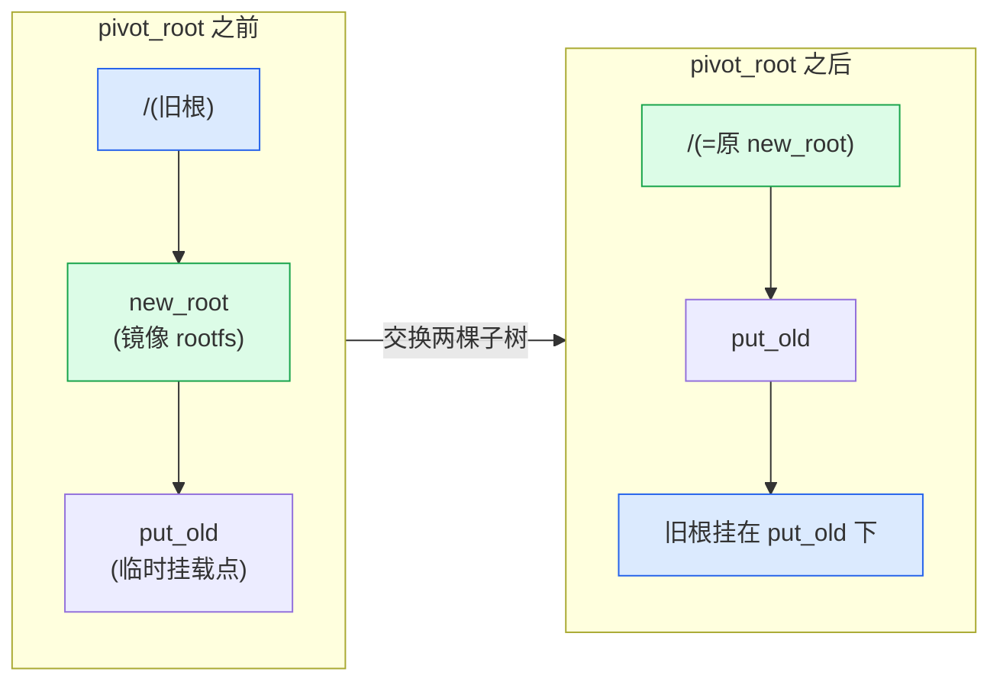

# 第三章 · mnt namespace:挂载视图

> 篇:第 1 篇 · namespace 视图隔离
> 主线呼应:上一章讲了 `nsproxy` 是 7 种 ns 的总入口——它像一个聚合器,把 7 个 ns 指针打包成一张"视图名片",fork 时按 `CLONE_NEW*` 一次性替换。这一章,我们钻进第一张名片:`mnt_ns`(挂载视图)。你 `docker run nginx` 之后,容器进程 `ls /` 看到的不是宿主的根文件系统,而是镜像解压出来的一层 overlayfs。但宿主机上明明只有一棵挂载树,容器进程凭什么看不见宿主的 `/`、`/home`、`/proc`?答案就在 mnt namespace:`copy_mnt_ns` 给新 ns **复制了一棵独立的挂载树**,从此容器里的 `mount`/`umount` 与宿主互不可见。这一章拆清楚三件事——挂载树怎么复制(`copy_tree`/`clone_mnt`)、怎么换根(`pivot_root`/`chroot`)、怎么控制挂载事件在两棵树之间怎么传播(shared/slave/private)。

## 核心问题

**容器里的进程为什么看见的是自己的根文件系统,而不是宿主的?宿主内核里只有一份"挂载点拓扑",mnt namespace 怎么让两个进程各看见一棵不同的挂载树?A 容器 `mount` 一个卷,B 容器为什么看不见?而有的场景(如 `/tmp` 被容器和宿主共享)又为什么看得见?**

读完本章你会明白:

1. mnt namespace 的本质:**给进程复制一棵独立的挂载树**(`struct mnt_namespace`,内含一棵 `struct mount` 树),从此这个进程组里的 `mount`/`umount` 操作被关在这棵树里,与别的 ns 互不可见——这是"视图"而非"物理",文件系统的 superblock/inode 是共享的,只是挂载拓扑被复制了一份。
2. `copy_mnt_ns` 怎么复制:第一遍 `copy_tree` 整树克隆拓扑(每个 `struct mount` 都 `clone_mnt` 出一个孪生节点),第二遍把新进程的 `fs_struct`(根/pwd 指针)切换到新树。
3. `pivot_root` 与 `chroot` 的区别:容器换根几乎都走 `pivot_root` 而非 `chroot`,因为前者交换两棵子树、真正把旧根卸下来挂到 `put_old`,后者只是改进程的 `fs_struct->root`,旧根仍在挂载树里(可逃逸)。
4. 挂载传播(shared/slave/private/unbindable):为什么 Docker 默认把容器的根设成 private(宿主挂的卷容器看不见),而 `docker run -v /host:/container` 又能让宿主和容器共享一目录——本质是不同传播类型,决定 `mount` 事件在一棵树上发生时,会不会"传染"到别的树上的对等节点。
5. 本章不是 ★ 章,但会用一节轻量点出 runc 怎么用这套能力(它必须 `CLONE_NEWNS` + `pivot_root` 才能把 rootfs 切进去)。

> **逃生阀**:挂载传播(shared/slave/private)是 Linux 文件系统最绕的角落之一,有四个宏(`MS_SHARED`/`MS_SLAVE`/`MS_PRIVATE`/`MS_UNBINDABLE`)、两条链表(`mnt_share`/`mnt_slave_list`)、一个 `mnt_master` 指针。如果你只看一节,记住一个口诀就够:**shared 双向同步、slave 单向接收、private 完全隔离、unbindable 禁止 bind**。剩下的细节是给"想搞清楚为什么 A 容器挂个卷 B 容器看不见"的人。

---

## 3.1 一句话点破

> **mnt namespace 不是复制文件系统,而是复制"挂载拓扑"——宿主内核里只有一份 superblock/inode 数据,但每个 mnt ns 有一棵自己的 `struct mount` 树,树的节点(挂载点)可以按 shared/slave/private 决定要不要和别的树同步。容器里 `ls /` 看到镜像 rootfs,是因为它的 `struct mnt_namespace` 里那棵树的根,被 `pivot_root` 换成了镜像解压目录。**

这是结论,不是理由。本章倒过来拆:先看为什么"改文件"不需要 ns(文件本身可以共享),但"改挂载"必须有 ns(否则一个容器 `mount` 会污染宿主);再看 `copy_tree` 怎么整树复制、`pivot_root` 怎么换根、挂载传播怎么在两棵树之间决定"传不传染"。

---

## 3.2 为什么必须有 mnt namespace:挂载是进程组级别的视图

先回答最根本的 why。你也许会想:容器要 rootfs 隔离,那我直接 `chroot` 到镜像解压目录不就行了?为什么内核还要专门造一个 mnt namespace?

> **不这样会怎样**:假设没有 mnt ns,只有 chroot。容器 A 起来,chroot 到 `/var/lib/docker/overlay2/A/merged`;容器 B 起来,chroot 到 `B/merged`。看起来挺好。但只要容器 A 里执行一句 `mount -t tmpfs none /tmp`——这个挂载会**进宿主的挂载树**,容器 B 一 `ls /tmp/A_tmp` 就看得见(如果它能访问那个路径)。更糟的是,容器 A 里 `mount` 一个 `/dev/sda1` 到 `/mnt` 就能读到宿主磁盘所有数据——隔离彻底破产。`chroot` 只改了根目录指针,没拦住挂载操作溢出到宿主。

所以必须有一种机制,让"容器 A 里的 `mount`"和"宿主的 `mount`"是**两棵独立的挂载树**,A 里的挂载事件不进宿主那棵、宿主的也不进 A 那棵。这就是 mnt namespace 的职责。

```c
/* fs/mount.h:8(简化) */
struct mnt_namespace {
    struct ns_common   ns;          /* ns_common 多态钩子(回扣 P1-02) */
    struct mount      *root;        /* 这棵挂载树的根 mount */
    struct rb_root     mounts;      /* 按挂载点排序的红黑树,加速查找 */
    struct user_namespace *user_ns; /* 归属的 user ns(影响 ucounts 配额) */
    struct ucounts    *ucounts;
    u64                seq;         /* 序列号,防循环挂载 */
    unsigned int       nr_mounts;   /* 这棵树里有多少个挂载点 */
    unsigned int       pending_mounts;
    ...
};
```

([fs/mount.h:8](../linux/fs/mount.h#L8))

`struct mnt_namespace` 是一棵挂载树的"容器",`root` 字段指向根 `struct mount`(通常是 `/`)。每个进程通过它的 `task_struct->nsproxy->mnt_ns` 字段知道自己属于哪棵树。两个进程的 `mnt_ns` 不同,它们就在两棵不同的挂载树里;一个 `mount` 系统调用只会改自己那棵树。

> **钉死这件事**:mnt namespace 隔离的是**挂载拓扑**(`struct mount` 树),不是**文件系统**(`struct super_block`/`struct inode`)。两个 mnt ns 可以共享同一个 superblock(同一份磁盘上的数据),但各自的挂载点拓扑是独立的——A 里挂卷 B 看不见,但两边的 `/etc/passwd` 如果指向同一个 overlay 层,内容是相同的。这和 pid ns(进程号隔离但 `task_struct` 是同一个)、user ns(uid 映射但内核里只有一个 kuid)是完全一致的思路:**ns 改视图,不改物理**。

---

## 3.3 `copy_mnt_ns`:怎么复制一整棵挂载树

那么 fork 时带了 `CLONE_NEWNS`,内核怎么给新进程造一棵新挂载树?答案在 [`copy_mnt_ns`](../linux/fs/namespace.c#L3760)([namespace.c:3760](../linux/fs/namespace.c#L3760))。

### 3.3.1 两遍扫描的设计

`copy_mnt_ns` 看起来不长,但藏着一个精巧的两遍扫描设计:

```c
/* fs/namespace.c:3760(简化,完整见 L3760-L3837) */
struct mnt_namespace *copy_mnt_ns(unsigned long flags, struct mnt_namespace *ns,
        struct user_namespace *user_ns, struct fs_struct *new_fs)
{
    struct mnt_namespace *new_ns;
    struct mount *p, *q, *old, *new;
    int copy_flags;

    BUG_ON(!ns);

    /* 没要新 mnt ns,共享父亲的(引用计数 +1) */
    if (likely(!(flags & CLONE_NEWNS))) {
        get_mnt_ns(ns);
        return ns;
    }

    old = ns->root;

    /* 分配一个新的 mnt_namespace 结构体 */
    new_ns = alloc_mnt_ns(user_ns, false);
    if (IS_ERR(new_ns))
        return new_ns;

    namespace_lock();   /* 全局挂载语义锁(回扣 P1-02 讲 namespace_sem) */

    /* === 第一遍:整树复制拓扑 === */
    copy_flags = CL_COPY_UNBINDABLE | CL_EXPIRE;
    if (user_ns != ns->user_ns)
        copy_flags |= CL_SHARED_TO_SLAVE;   /* 跨 user ns,把 shared 降级为 slave(安全) */
    new = copy_tree(old, old->mnt.mnt_root, copy_flags);
    if (IS_ERR(new)) {
        namespace_unlock();
        free_mnt_ns(new_ns);
        return ERR_CAST(new);
    }
    new_ns->root = new;

    /* === 第二遍:把每个 mount 归到新 ns,并切换进程的根/pwd 指针 === */
    p = old;
    q = new;
    while (p) {
        mnt_add_to_ns(new_ns, q);          /* q->mnt_ns = new_ns */
        new_ns->nr_mounts++;
        if (new_fs) {
            if (&p->mnt == new_fs->root.mnt) {
                new_fs->root.mnt = mntget(&q->mnt);  /* 根指向新树的对应节点 */
                rootmnt = &p->mnt;
            }
            if (&p->mnt == new_fs->pwd.mnt) {
                new_fs->pwd.mnt = mntget(&q->mnt);   /* pwd 同理 */
                pwdmnt = &p->mnt;
            }
        }
        p = next_mnt(p, old);
        q = next_mnt(q, new);
        ...
    }
    namespace_unlock();
    ...
    return new_ns;
}
```

([namespace.c:3760-L3837](../linux/fs/namespace.c#L3760-L3837))

两个 pass 分工清楚:

- **第一遍**(`copy_tree`):只管"复制挂载拓扑",把旧树上每个 `struct mount` 都克隆出一个孪生节点,父子关系(`mnt_parent`)、挂载点(`mnt_mountpoint`)、peer 关系(`mnt_share`/`mnt_slave`)都一并复制。这一遍的产物是一棵和原树拓扑完全相同的新树。
- **第二遍**:把新树上每个节点 `mnt->mnt_ns` 字段从"旧 ns"改成"新 ns"(通过 `mnt_add_to_ns`),并顺手把调用进程的 `fs_struct->root`/`pwd` 指针从指向旧树的节点,改指向新树的对应节点。

> **为什么不一遍搞定?** 关键在 `fs_struct` 的切换。新进程的根/pwd 指针原本指向旧树的某个 `struct mount`(因为 fork 时 `fs_struct` 是从父亲复制来的)。如果一遍扫描里同时复制 mount 和改指针,会出现"扫到一半,进程根指针指向了新树某个节点,但那个节点的子节点还没复制完"——指针悬空或半新半旧。两遍扫描把"造拓扑"和"改归属/指针"分开,第一遍结束时新树已完全成形、内部一致,第二遍放心地做归属切换和指针替换。这种"先造完整副本、再整体切换"的思路,在全书反复出现(`create_new_namespaces` 全成或全回滚、`cgroup_attach_task` 四步迁移全成或全回滚、`setns` 两阶段 prepare→commit)——**用阶段分离换原子性**。

### 3.3.2 跨 user ns 的安全降级:`CL_SHARED_TO_SLAVE`

注意这行:

```c
if (user_ns != ns->user_ns)
    copy_flags |= CL_SHARED_TO_SLAVE;
```

这是 mnt ns 与 user ns 联动的一个安全机制。当一个非特权进程(在新 user ns 里)创建新 mnt ns 时,旧树上所有 shared 挂载点,在新树里会被**自动降级为 slave**。这背后的考量:如果新 user ns 里的挂载能保持 shared,那么新 user ns 里的挂载事件会传播回旧 ns(宿主),等于让一个无特权容器往宿主挂载树写——危险。降级为 slave 之后,新 ns 只能**接收**宿主的挂载事件(单向),不能往宿主发。

> **钉死这件事**:`CL_SHARED_TO_SLAVE` 是"跨 user ns 自动降级",不是"跨 mnt ns 自动降级"。同一个 user ns 里建多个 mnt ns(比如你 `unshare -m` 几次),shared 还是 shared,挂载事件在两个 ns 的对等节点之间双向同步。这章后面讲传播类型时会回到这点。

---

## 3.4 `copy_tree`:整树复制的递归核心

`copy_mnt_ns` 把"复制一棵挂载树"的脏活外包给了 [`copy_tree`](../linux/fs/namespace.c#L1969)([namespace.c:1969](../linux/fs/namespace.c#L1969))。这是本章技巧精解的主角之一,我们仔细看。

挂载树本身的数据结构是一棵树(每个 `struct mount` 有 `mnt_parent` 指针、`mnt_mounts` 子链表、`mnt_child` 兄弟链表节点),但 `copy_tree` **不递归**,而是用**显式树遍历**(`list_for_each_entry` + `next_mnt`)。原因是内核栈宝贵(默认 8KB 或 16KB),一棵深挂载树递归下去可能爆栈。

```c
/* fs/namespace.c:1969(简化,完整见 L1969-L2032) */
struct mount *copy_tree(struct mount *mnt, struct dentry *dentry, int flag)
{
    struct mount *res, *p, *q, *r, *parent;

    /* 不允许复制 unbindable 的树(除非显式 CL_COPY_UNBINDABLE) */
    if (!(flag & CL_COPY_UNBINDABLE) && IS_MNT_UNBINDABLE(mnt))
        return ERR_PTR(-EINVAL);

    if (!(flag & CL_COPY_MNT_NS_FILE) && is_mnt_ns_file(dentry))
        return ERR_PTR(-EINVAL);

    /* 复制根:clone_mnt 造一个孪生 mount */
    res = q = clone_mnt(mnt, dentry, flag);
    if (IS_ERR(q))
        return q;
    q->mnt_mountpoint = mnt->mnt_mountpoint;

    p = mnt;
    /* 遍历旧树的所有子树 */
    list_for_each_entry(r, &mnt->mnt_mounts, mnt_child) {
        struct mount *s;
        if (!is_subdir(r->mnt_mountpoint, dentry))
            continue;

        /* depth-first:跳过不在复制范围内的子树 */
        for (s = r; s; s = next_mnt(s, r)) {
            /* 跳过 unbindable 节点(防 bind 死循环) */
            if (!(flag & CL_COPY_UNBINDABLE) && IS_MNT_UNBINDABLE(s)) {
                ...
                s = skip_mnt_tree(s);
                continue;
            }
            /* 同步 p/q 的深度:p 沿父链往上爬,q 跟着爬 */
            while (p != s->mnt_parent) {
                p = p->mnt_parent;
                q = q->mnt_parent;
            }
            p = s;
            parent = q;
            /* 克隆这个子节点 */
            q = clone_mnt(p, p->mnt.mnt_root, flag);
            if (IS_ERR(q))
                goto out;
            lock_mount_hash();
            list_add_tail(&q->mnt_list, &res->mnt_list);
            /* 挂到新树的对应父亲上(对应 mnt_set_mountpoint 的逆操作) */
            attach_mnt(q, parent, p->mnt_mp, false);
            unlock_mount_hash();
        }
    }
    return res;
out:
    /* 失败回滚:把已造的整棵子树 umount 掉 */
    if (res) {
        lock_mount_hash();
        umount_tree(res, UMOUNT_SYNC);
        unlock_mount_hash();
    }
    return q;
}
```

([namespace.c:1969-L2032](../linux/fs/namespace.c#L1969-L2032))

注意几个细节:

1. **根先克隆**(`clone_mnt(mnt, dentry, flag)`),然后遍历子树。这保证了不论后续多少子节点要克隆,新树的根已经存在,可以往它身上挂子节点。
2. **深度同步**:`while (p != s->mnt_parent) { p = p->mnt_parent; q = q->mnt_parent; }` 这段是精髓——因为遍历用的是 `next_mnt`(深度优先的"下一个节点"),新树和旧树的当前节点必须保持"同层同父子关系",所以遍历到深层节点时,要让 `p/q` 沿父链同步往上爬,直到 `p` 是当前要克隆节点的父亲。这段代码看着绕,核心一句话:**新树的每个节点,必须挂到旧树对应节点的父亲在新树里的对应节点下**。
3. **失败回滚**:如果中途 `clone_mnt` 失败,直接 `umount_tree(res, UMOUNT_SYNC)` 把整棵新树连根拔起。这是"构造失败回滚"的标准模式,保证不会留下半棵树。
4. **跳过 unbindable**:`IS_MNT_UNBINDABLE(s)` 的节点不复制。unbindable 是挂载传播类型的第四种,本章最后会讲它的用途——防止 bind mount 死循环。

### 3.4.1 `clone_mnt`:克隆单个挂载节点

那么克隆单个节点呢?那是 [`clone_mnt`](../linux/fs/namespace.c#L1179)([namespace.c:1179](../linux/fs/namespace.c#L1179))。这个函数不仅是 `copy_tree` 的基础,也是 `mount --bind` 的实现核心:

```c
/* fs/namespace.c:1179(简化,完整见 L1179-L1245) */
static struct mount *clone_mnt(struct mount *old, struct dentry *root, int flag)
{
    struct super_block *sb = old->mnt.mnt_sb;   /* 注意:superblock 不复制! */
    struct mount *mnt;

    mnt = alloc_vfsmnt(old->mnt_devname);       /* 分配一个新 struct mount */
    if (!mnt)
        return ERR_PTR(-ENOMEM);

    /* 根据 flag 决定是否共享 peer group id(传播类型核心字段) */
    if (flag & (CL_SLAVE | CL_PRIVATE | CL_SHARED_TO_SLAVE))
        mnt->mnt_group_id = 0;                  /* 不和原 mount 同组 */
    else
        mnt->mnt_group_id = old->mnt_group_id;  /* 同组(shared peer) */

    if ((flag & CL_MAKE_SHARED) && !mnt->mnt_group_id) {
        if (mnt_alloc_group_id(mnt)) goto out_free;
    }

    mnt->mnt.mnt_flags = old->mnt.mnt_flags;    /* 继承标志位 */
    mnt->mnt.mnt_flags &= ~(MNT_WRITE_HOLD|MNT_MARKED|MNT_INTERNAL|MNT_ONRB);

    atomic_inc(&sb->s_active);                  /* superblock 引用计数 +1 */
    mnt->mnt.mnt_idmap = mnt_idmap_get(mnt_idmap(&old->mnt));
    mnt->mnt.mnt_sb     = sb;                   /* 共享 superblock! */
    mnt->mnt.mnt_root   = dget(root);           /* 共享根 dentry! */
    mnt->mnt_mountpoint = mnt->mnt.mnt_root;
    mnt->mnt_parent     = mnt;                  /* 自指,后续 attach_mnt 才设真父亲 */

    /* 根据传播类型 flag 维护 mnt_share/mnt_slave 链表 */
    if ((flag & CL_SLAVE) ||
        ((flag & CL_SHARED_TO_SLAVE) && IS_MNT_SHARED(old))) {
        list_add(&mnt->mnt_slave, &old->mnt_slave_list);
        mnt->mnt_master = old;                  /* 我是 old 的 slave */
        CLEAR_MNT_SHARED(mnt);
    } else if (!(flag & CL_PRIVATE)) {
        if ((flag & CL_MAKE_SHARED) || IS_MNT_SHARED(old))
            list_add(&mnt->mnt_share, &old->mnt_share);  /* 加进 peer 链表 */
        if (IS_MNT_SLAVE(old))
            list_add(&mnt->mnt_slave, &old->mnt_slave);
        mnt->mnt_master = old->mnt_master;      /* 继承 master */
    } else {
        CLEAR_MNT_SHARED(mnt);                  /* private:彻底断开 */
    }
    if (flag & CL_MAKE_SHARED)
        set_mnt_shared(mnt);

    return mnt;
    ...
}
```

([namespace.c:1179-L1245](../linux/fs/namespace.c#L1179-L1245))

`clone_mnt` 最关键的一行在中间:

```c
mnt->mnt.mnt_sb = sb;   /* 共享 superblock */
atomic_inc(&sb->s_active);
```

它**不**复制 superblock,也不复制 inode——它只造一个新的 `struct mount` 包装层,`mnt_sb` 指向旧 mount 的同一个 superblock。这就是为什么 mnt namespace 比虚拟机轻一个数量级:**数据不复制,只复制"挂载包装"**。两个 mnt ns 各自的根 mount 共享一个 superblock,inode/page cache 也是共享的(除非挂了不同的设备);它们的隔离只在"挂载点拓扑"这一层。

后半段的 `list_add(&mnt->mnt_share, ...)` 和 `mnt_master = old` 是传播类型的处理,我们留到 3.6 节讲传播时再回到这里。

> **钉死这件事**:`clone_mnt` 复制的是**挂载包装**(`struct mount`),不是**文件系统**(`struct super_block`)。这正是 mnt ns 比 VM 轻的根因——VM 要仿真整块磁盘(一份独立的 inode 表、一份独立的 page cache),mnt ns 只是两棵 `struct mount` 树指向同一个 superblock,inode 共享,page cache 也共享。理解了这点,你就理解了为什么一个容器读 `/usr/bin/cat` 不需要真的把 cat 文件复制一份——它读到的是宿主 overlay 层同一个 inode 的同一个 page cache。

---

## 3.5 `pivot_root` vs `chroot`:容器怎么换根

造出新 mnt ns 只是第一步。新 ns 里初始的根还是宿主的 `/`,容器进程 `ls /` 还会看到宿主的根文件系统。真正把根换成镜像 rootfs 的,是 [`pivot_root`](../linux/fs/namespace.c#L4179)([namespace.c:4179](../linux/fs/namespace.c#L4179)) 或 `chroot`。

### 3.5.1 `chroot`:最弱的隔离

`chroot` 改的是调用进程 `fs_struct->root` 字段,把进程的"根目录"从 `/` 改成某个子目录(比如 `/var/lib/docker/overlay2/A/merged`)。从此进程的所有路径解析都从新根开始。

但 `chroot` 有个致命弱点:它**只**改了路径解析的根,没改挂载树拓扑。旧根 `/` 仍然在挂载树上,进程只要 `mount --bind / /tmp/host_root` 然后 `chroot /tmp/host_root`(配合某些 root 漏洞)就能逃出去。历史上 `chroot` 被绕过的案例非常多,所以现代容器几乎不用它做根隔离。

### 3.5.2 `pivot_root`:交换两棵子树

`pivot_root(new_root, put_old)` 做的是"交换两棵子树"的拓扑操作:它把当前根(root_mnt)从"根"位置上卸下来,挂到 `put_old` 下;同时把 `new_root` 挂到当前根的位置上。这之后进程的 `/` 就指向 new_root,旧的 `/` 变成 `/put_old`(可以被 umount 掉)。

```c
/* fs/namespace.c:4179(简化,完整见 L4179-L4270) */
SYSCALL_DEFINE2(pivot_root, const char __user *, new_root,
        const char __user *, put_old)
{
    struct path new, old, root;
    struct mount *new_mnt, *root_mnt, *old_mnt, *root_parent, *ex_parent;
    struct mountpoint *old_mp, *root_mp;
    ...

    get_fs_root(current->fs, &root);
    old_mp = lock_mount(&old);
    ...

    new_mnt   = real_mount(new.mnt);
    root_mnt  = real_mount(root.mnt);
    old_mnt   = real_mount(old.mnt);
    ex_parent = new_mnt->mnt_parent;
    root_parent = root_mnt->mnt_parent;

    /* 三个关键约束 */
    if (IS_MNT_SHARED(old_mnt)    ||    /* put_old 不能是 shared */
        IS_MNT_SHARED(ex_parent)  ||    /* new_root 的父亲不能是 shared */
        IS_MNT_SHARED(root_parent))     /* 旧根的父亲不能是 shared */
        goto out4;
    if (!check_mnt(root_mnt) || !check_mnt(new_mnt)) goto out4;
    ...
    /* new_root 必须是挂载点、必须有父、put_old 必须在 new_root 之下 */
    ...

    lock_mount_hash();
    umount_mnt(new_mnt);
    root_mp = unhash_mnt(root_mnt);
    ...
    /* 把旧根挂到 put_old 下 */
    attach_mnt(root_mnt, old_mnt, old_mp, false);
    /* 把 new_root 挂到旧根原来的位置(也就是新的根) */
    attach_mnt(new_mnt, root_parent, root_mp, false);
    ...
    return 0;
}
```

([namespace.c:4179-L4270](../linux/fs/namespace.c#L4179-L4270))

注意三个 `IS_MNT_SHARED` 检查——这是 `pivot_root` 的传播类型约束:`put_old` 和 `new_root` 的父挂载点、以及当前根的父挂载点,**都不能是 shared**。为什么?因为 shared 挂载点的拓扑改动会广播到 peer group 里所有对等节点,如果 `pivot_root` 的两棵子树是 shared,这个交换会被传染到别的 mnt ns 上的对等挂载点,导致**宿主挂载树被改**——容器逃逸。所以内核禁止这种情形,强制你把这几个挂载点设成 private(下一节讲怎么做)。



### 3.5.3 `attach_mnt` 与 `mnt_set_mountpoint`:挂载关系怎么维护

`pivot_root` 末尾两句 `attach_mnt` 把两棵子树重新挂到新位置。挂载关系是怎么写进数据结构的?看 [`mnt_set_mountpoint`](../linux/fs/namespace.c#L912)([namespace.c:912](../linux/fs/namespace.c#L912)):

```c
/* fs/namespace.c:912(完整) */
void mnt_set_mountpoint(struct mount *mnt,
                        struct mountpoint *mp,
                        struct mount *child_mnt)
{
    mp->m_count++;
    mnt_add_count(mnt, 1);            /* 父亲引用计数 +1 */
    child_mnt->mnt_mountpoint = mp->m_dentry;   /* 我挂在父亲的哪个 dentry 上 */
    child_mnt->mnt_parent     = mnt;            /* 我的父亲是谁 */
    child_mnt->mnt_mp         = mp;             /* 我的挂载点对象 */
    hlist_add_head(&child_mnt->mnt_mp_list, &mp->m_list);
}
```

([namespace.c:912-L922](../linux/fs/namespace.c#L912-L922))

四件事:① 父亲引用计数 +1(防止父亲被 umount);② child 记下自己挂在父亲的哪个 dentry 上(`mnt_mountpoint`);③ child 记下父亲是谁(`mnt_parent`);④ 把 child 加到挂载点 `mp` 的"挂在这儿的 mount 列表"里(`mnt_mp_list`)。这样一棵挂载树的父子拓扑就建立了。

> **为什么 `pivot_root` 比 `chroot` 安全**:chroot 只改 `fs_struct->root` 一根指针,旧根的 `struct mount` 仍在挂载树上,理论上可被访问。pivot_root **重新组织挂载树拓扑**:把旧根挪到 `put_old` 下,然后可以 umount 掉 `put_old`,旧根就真正从这棵 mnt ns 的挂载树上消失了——容器进程即使有 CAP_SYS_ADMIN 也找不回宿主的根。所以 runc/容器运行时几乎都走 `pivot_root`(不能 pivot 的场景才退回 `chroot`,比如 ramfs 这种没父挂载点的)。

---

## 3.6 挂载传播:为什么 A 容器挂个卷 B 容器看不见

这一节是本章第二个核心,也是最容易绕晕的地方。我们一步步拆。

### 3.6.1 问题:同一个挂载操作要不要影响别的 mnt ns

假设宿主有 `/data` 挂载点(比如一个 ext4 文件系统)。容器 A 用 `CLONE_NEWNS` 起来,初始时它那棵挂载树的 `/data` 和宿主的 `/data` 是孪生节点(都指向同一个 superblock)。现在在**容器 A 里**执行 `mount -t tmpfs none /data`——这个挂载要不要进宿主的 `/data`?

- 如果要进:容器 A 里挂卷,宿主和容器 B 都看得见——隔离破产。
- 如果不进:容器 A 的挂载是容器 A 的,宿主和容器 B 完全无感——隔离干净。

听起来"不进"才是对的?但有些场景**需要**进。比如宿主在容器启动前 `mount --rbind /var/lib/docker/volumes/foo /var/lib/docker/overlay2/A/merged/data`,希望容器 A 能看到这个卷——这时宿主的挂载事件要**反向**传到容器 A。

所以内核不能一概而论,得给挂载点**可配置的传播类型**,让用户决定"这个挂载点的挂载事件,往哪些对等节点传播"。这就是 `MS_SHARED`/`MS_SLAVE`/`MS_PRIVATE`/`MS_UNBINDABLE` 四种传播类型的由来。

> **注意**:这四个常量定义在 `include/uapi/linux/mount.h`(本书 sparse 树未解压 uapi,以下值是公开 UAPI,跨版本稳定):`MS_SHARED=1<<20`、`MS_PRIVATE=1<<18`、`MS_SLAVE=1<<19`、`MS_UNBINDABLE=1<<17`。它们作为 `mount(2)` 的 flags 参数传入,由内核的 [`change_mnt_propagation`](../linux/fs/pnode.c#L122) 解析。

### 3.6.2 四种传播类型(口诀版)

| 类型 | 行为 | 典型用途 |
|------|------|----------|
| **shared**(`MS_SHARED`) | 挂载事件**双向**传播——本节点的 mount/umount 会同步到 peer group 里所有对等节点,反之亦然 | 宿主和容器想共享某目录(如 systemd 默认把 `/` 设成 shared) |
| **slave**(`MS_SLAVE`) | **单向**接收——本节点能收到 master 的挂载事件,但自己的挂载事件不往 master 发 | 容器想接收宿主挂的卷,但不让容器内的挂载污染宿主(`CL_SHARED_TO_SLAVE` 降级就是干这个) |
| **private**(`MS_PRIVATE`) | **完全隔离**——挂载事件既不发出也不接收,本节点和外界完全无关 | 容器默认状态(`docker run` 内部挂载点通常是 private) |
| **unbindable**(`MS_UNBINDABLE`) | **禁止 bind**——不能被 `mount --bind`,防止 bind mount 死循环 | 在 `mount --rbind` 大量递归 bind 时防止循环复制自身 |

口诀一句:**shared 双向同步、slave 单向接收、private 完全隔离、unbindable 禁止 bind**。

### 3.6.3 数据结构:`mnt_share`、`mnt_slave_list`、`mnt_master`

这四种类型在 `struct mount` 里通过三个字段表达:

```c
/* fs/mount.h:57-60 */
struct mount {
    ...
    struct list_head mnt_share;       /* shared peer 循环链表(同一 peer group) */
    struct list_head mnt_slave_list;  /* 我是 master,我的 slaves 挂在这 */
    struct list_head mnt_slave;       /* 我是 slave,我在 master 的 slave_list 里的节点 */
    struct mount     *mnt_master;     /* 我是 slave,我的 master 是谁 */
    int              mnt_group_id;    /* peer group id(shared 用,同组同 id) */
    ...
};
```

([fs/mount.h:57-L74](../linux/fs/mount.h#L57-L74))

判断一个 mount 是哪种类型,看这两个宏(在 [fs/pnode.h:16-L22](../linux/fs/pnode.h#L16-L22)):

```c
#define IS_MNT_SHARED(m)    ((m)->mnt.mnt_flags & MNT_SHARED)
#define IS_MNT_SLAVE(m)     ((m)->mnt_master)
#define IS_MNT_UNBINDABLE(m) ((m)->mnt.mnt_flags & MNT_UNBINDABLE)
```

- shared:`MNT_SHARED` 标志位置 1,且 `mnt_group_id` 非零,且在 `mnt_share` 循环链表里。
- slave:`mnt_master != NULL`(只要 master 指针非空,就是 slave)。
- private:三个条件都不满足——`MNT_SHARED` 清掉、`mnt_master` 为 NULL、`MNT_UNBINDABLE` 清掉。这是默认状态。
- unbindable:`MNT_UNBINDABLE` 标志位置 1。

注意 shared 和 slave 不互斥——一个 mount 可以既是 shared 又有 master(常见于"原本 slave,又被显式设成 shared")。但 private 是"全清零"状态。

### 3.6.4 切换传播类型:`change_mnt_propagation`

`mount(2)` 系统调用带 `MS_SHARED/SLAVE/PRIVATE/UNBINDABLE` flag 时,内核走 [`change_mnt_propagation`](../linux/fs/pnode.c#L122)([pnode.c:122](../linux/fs/pnode.c#L122)):

```c
/* fs/pnode.c:122(完整) */
void change_mnt_propagation(struct mount *mnt, int type)
{
    if (type == MS_SHARED) {
        set_mnt_shared(mnt);      /* 设 MNT_SHARED 标志、分配 group id、加进 share 链表 */
        return;
    }
    do_make_slave(mnt);           /* 先转成 slave(从 peer group 里退出,认个 master) */
    if (type != MS_SLAVE) {       /* 如果要的是 private 或 unbindable,再进一步处理 */
        list_del_init(&mnt->mnt_slave);
        mnt->mnt_master = NULL;
        if (type == MS_UNBINDABLE)
            mnt->mnt.mnt_flags |= MNT_UNBINDABLE;
        else
            mnt->mnt.mnt_flags &= ~MNT_UNBINDABLE;
    }
}
```

([pnode.c:122-L137](../linux/fs/pnode.c#L122-L137))

这里有个反直觉的设计:**要从 shared 切到 private/unbindable,先要走一遍 slave**。`do_make_slave` 把 mount 从原 peer group 里退出来(`list_del_init(&mnt->mnt_share)`),给它认一个 master(通常是原 peer group 里另一个节点);然后 private/unbindable 再把 slave 关系也断掉(`mnt->mnt_master = NULL`)。这么分两步是因为 slave 是"半脱离"状态——退出 peer group 但还保留一条单向接收通道;private/unbindable 是"完全脱离"——彻底切断。

> **为什么这么设计**:把"shared → private"分解成"shared → slave → private"的状态机,让每一步都对应一个具体动作(退出 peer group / 切断 master 关系)。这比"一个函数直接从 shared 跳到 private"清晰得多——状态转移图是线性的,每条边对应一个原子操作。这种"用状态机管理复杂转移"的思路,在全书反复出现(`freezer` 的任务冻结状态机、`css_set` 的 refcount 状态机)。

### 3.6.5 传播的实际效果:挂载事件怎么在 peer group 里走

到底"传播"是怎么发生的?核心函数是 [`propagate_mnt`](../linux/fs/pnode.c)(pnode.c 里),它在一个挂载操作发生时,遍历当前 mount 的所有 peer(在 `mnt_share` 链表上)和所有 slave(在 `mnt_slave_list` 链表上),把同一个挂载复制到它们的对应位置。shared 节点会复制到 peer(双向),slave 节点会复制到 master 的所有 peer(单向)。private/unbindable 的节点不在任何传播链表上,事件到它这就断了。

举一个具体例子,把 4 种类型走一遍:

```
  宿主 mnt ns                  容器 A mnt ns(由 copy_tree 复制而来)
  ─────────────                ──────────────────────────
  / (shared, group=1)  ◄──────► / (shared, group=1)        ← shared,双向同步
  /data (slave, master=/ )  ◄── /data (slave, master=/ )   ← slave,只接收
  /tmp (private)                /tmp (private)              ← private,完全隔离
  /srv (unbindable)             /srv (不复制,因为 CL_COPY_UNBINDABLE)
```

在容器 A 里 `mount -t tmpfs none /tmp`:private 节点,事件到此为止,宿主的 `/tmp` 不受影响。
在容器 A 里 `mount -t tmpfs none /data`:slave 节点,A 里挂的卷不会传到宿主(slave 单向)。
在宿主里 `mount -t tmpfs none /`:shared 节点,挂载事件传到容器 A 的 `/`(双向)。

> **Docker / K8s 的实际用法**:Docker 启动容器时,runc 会把容器的根挂载点设成 **private**(避免容器内 mount 污染宿主);`docker run -v /host:/container` 挂卷时,根据选项决定传播类型(默认 `private`,可以显式指定 `:shared`、`:slave`、`:rprivate` 等)。K8s 的 Pod 挂载卷(PV/PVC)也走类似逻辑——hostPath 类型默认 private,emptyDir 跨容器共享时用 shared。这些选择的本质就是 3.6.2 那张表里的四种类型。

---

## 3.7 技巧精解:`copy_tree` 整树复制 + 挂载传播状态机

这一章我们拆两个最硬核的技巧。

### 技巧一:`copy_tree` 的"显式树遍历 + 深度同步"

我们已经在 3.4 节贴过 `copy_tree` 的源码。现在问"为什么不朴素地递归"。

> **朴素写法会撞什么墙**:最直白的复制是递归:

```c
/* 朴素递归写法(糟糕,非源码) */
struct mount *copy_tree_naive(struct mount *old) {
    struct mount *new = clone_mnt(old, old->mnt.mnt_root, ...);
    struct mount *child;
    list_for_each_entry(child, &old->mnt_mounts, mnt_child) {
        struct mount *new_child = copy_tree_naive(child);   /* 递归! */
        attach_mnt(new_child, new, ...);
    }
    return new;
}
```

两个致命问题:① **栈深**:内核线程栈默认 8KB(x86_64 也只 16KB),一棵挂载树如果有几百层(虽然罕见,但 mount namespace 嵌套理论上无上限),递归调用每层要保存返回地址、局部变量、寄存器,容易爆栈——内核爆栈直接 panic。② **传播链表维护**:clone_mnt 里要维护 `mnt_share`/`mnt_slave` 链表,这些链表是跨节点的全局结构,递归里维护它们容易出错(每个节点 clone 时都要查原节点是不是 shared、有没有 master,递归的调用栈不方便传递这些上下文)。

内核的做法是**显式树遍历**——用一个 `next_mnt(s, r)` 函数做深度优先的"下一个节点"枚举,在一个函数里走完整棵树,不递归。但显式遍历带来一个新问题:**新树和旧树的当前节点要保持"同父子关系同步"**——当我在旧树走到深层节点 `s` 时,新树对应的 `q` 必须是 `s` 在新树里的父亲,才能把克隆出的 `s'` 挂到 `q` 身上。

这段同步逻辑就是源码里那段绕口的 `while`:

```c
while (p != s->mnt_parent) {   /* p 是旧树当前节点,s 是要克隆的 */
    p = p->mnt_parent;          /* p 往上爬 */
    q = q->mnt_parent;          /* q 同步往上爬 */
}
```

为什么 `p` 和 `q` 要同步往上爬?因为 `next_mnt` 走深度优先,从某个深层节点跳到下一个节点时,可能跳到另一个分支(深度突变)。这时 `p`(旧树当前节点)不再是 `s` 的父亲,需要沿 `mnt_parent` 往上爬,直到 `p == s->mnt_parent`。每爬一层旧树的 `p`,新树的 `q` 也跟着爬一层——因为新树和旧树拓扑完全一致(刚复制完),旧树某节点的父亲在新树里就是新树对应节点的父亲。

> **反面对比**:如果不同步,把克隆出的 `s'` 挂到错误的父亲上,新树的拓扑就和旧树不一致了——容器里 `ls /` 看到的目录结构会和宿主不同。这种 bug 极其隐蔽,因为只在深层挂载树 + 非平凡遍历顺序时才触发。Linux 内核这段代码看着绕,但是**正确性必须的**——它用一段同步逻辑,把"显式遍历"和"保持拓扑一致"两件事协调好,避免了递归爆栈,又保证了正确性。这是内核里典型的"用复杂度换正确性 + 安全"的工程权衡。

### 技巧二:挂载传播的"链表 + 标志位"表达

再看挂载传播的设计。四种类型(shared/slave/private/unbindable)用一张表 + 两条链表 + 一个 master 指针表达——看起来简单,但它解决了"任意拓扑的两棵挂载树之间,如何表达事件传播关系"这个复杂问题。

> **朴素写法会撞什么墙**:最直白的设计是给每个 mount 加一个"传播目标列表":

```c
/* 朴素设计(糟糕,非源码) */
struct mount {
    ...
    struct list_head propagation_targets;   /* 这个 mount 的事件发给谁 */
};
```

问题:① **维护成本**:每次创建/销毁 mount,要同步更新所有相关节点的 `propagation_targets`,且要保持双向一致(shared 是双向的)。② **表达不了 slave 的"单向"**:slave 只接收不发送,需要在节点上加方向标志,又回到原点。③ **不可扩展**:加一种新传播类型,要改所有相关代码。

Linux 的做法是**用现有数据结构表达**——`mnt_share` 循环链表(shared peer group)、`mnt_slave_list`/`mnt_slave`/`mnt_master`(slave 关系)、`MNT_SHARED`/`MNT_UNBINDABLE` 标志位。四种类型由这三个字段的不同组合表达:

| 类型 | `MNT_SHARED` | `mnt_share` 链表 | `mnt_master` | `MNT_UNBINDABLE` |
|------|--------------|-------------------|---------------|-------------------|
| shared | 置位 | 在 peer group 里 | 通常 NULL | 清零 |
| slave | 清零 | 空 | 非 NULL(指向 master) | 清零 |
| private | 清零 | 空 | NULL | 清零 |
| unbindable | 清零 | 空 | NULL | 置位 |

这套设计的精妙之处:

1. **shared 用循环链表 + group id**:peer group 里所有节点在同一个 `mnt_share` 循环链表上,共享同一个 `mnt_group_id`。挂载事件发生时,遍历这个链表即可广播到所有 peer。`mnt_group_id` 用于去重和查找(同一 group id 的节点都是 peer)。
2. **slave 用 master 指针 + slave_list**:slave 节点的 `mnt_master` 指向它的 master。master 节点的 `mnt_slave_list` 是它所有 slaves 的列表。挂载事件在 master 上发生时,遍历 `mnt_slave_list` 广播——单向。
3. **private 是"全空"**:不在任何传播链表上,事件到这就断了。
4. **unbindable 是 private + 一个标志位**:除了不传播,还禁止 `mount --bind` 把它作为源(防 `mount --rbind` 递归 bind 死循环)。

这套设计的扩展性也好——要加一种新传播类型,只要定义新的字段组合即可,核心的 `propagate_mnt` 不用改。

> **反面对比**:如果用"显式目标列表",每种新类型都要重新设计目标列表的维护逻辑,且双向/单向/单向反向的语义混乱。Linux 用"链表成员关系 + 标志位"表达,每种类型对应一种字段组合,语义清晰,扩展容易。这种"用数据结构组合表达复杂语义"的思路,在全书反复出现(`css_set` 用 subsys[] 数组 + 哈希表表达"任务↔cgroup 多对多"、`nsproxy` 用 7 个指针表达"进程的视图名片"、`sched_class` 用函数指针表表达"调度策略多态")。**好设计是用最少的字段表达最丰富的语义**。

---

## 3.8 一句话回扣:runc 怎么用 mnt ns(轻量对照)

本章不是 ★ 章,但 mnt ns 是容器造出来的关键一环,这里轻量点一下 runc 怎么用。runc 在 `create` 容器时大致这样用 mnt ns:

1. `clone(CLONE_NEWNS | ...)` 创新 mnt ns(走 `copy_mnt_ns` → `copy_tree`)。
2. 在新 mnt ns 里把所有挂载点设成 **private**(`mount --make-rslave /` 或 `mount --make-rprivate /`),防止容器内 mount 污染宿主。
3. 准备 rootfs:挂 overlayfs(upperdir/lowerdir/workdir 合并出容器的 `/`),或直接 bind mount 镜像解压目录。
4. `pivot_root(new_root, put_old)`:把容器的根换成 rootfs,旧的根挂到 `put_old` 下然后 umount。
5. 挂载容器需要的卷:`mount --bind /host/path /container/path`,传播类型按 `-v` 选项的 `:shared/:slave/:private` 后缀决定。

runc 这套动作里,`pivot_root` + `private` 是容器 rootfs 隔离的标配——`pivot_root` 换根,`private` 防污染。如果这两步没做,容器进程能看到宿主整个挂载树,等于没隔离。

> **钉死这件事**:mnt ns 是容器 rootfs 隔离的内核基础,但光有 mnt ns 不够——还得 `pivot_root` 换根 + 设传播类型为 private。这三件套(`CLONE_NEWNS` + `pivot_root` + `make private`)是容器成型的最小组合之一,第 17 章(P3-17)会把它们和 cgroup/其他 ns 一起组装成完整容器。

---

## 章末小结

这一章我们钻了 mnt namespace,它是容器"看见自己的根文件系统"的内核基础。回到二分法,它服务**视图**那一面——改进程看到的挂载拓扑,不改文件系统本身。

1. **mnt ns 的本质**:不是复制文件系统,而是复制**挂载拓扑**(`struct mount` 树)。每个 mnt ns 有一棵自己的 `struct mount` 树,`struct mnt_namespace.root` 指向根节点。两棵树可以共享同一个 superblock,但拓扑独立。
2. **`copy_mnt_ns` 的两遍扫描**:第一遍 `copy_tree` 复制拓扑(每个 `struct mount` 都 `clone_mnt` 出孪生节点),第二遍切换归属 + 进程的 `fs_struct` 根/pwd 指针。阶段分离 = 原子性。
3. **`clone_mnt` 复制包装不复制数据**:新 `struct mount` 的 `mnt_sb` 指向旧 mount 的同一个 superblock,inode/page cache 共享——mnt ns 比 VM 轻一个数量级的根因。
4. **`pivot_root` vs `chroot`**:前者重新组织挂载树拓扑(交换两棵子树,旧根真正从这棵树消失),后者只改 `fs_struct->root` 一根指针(可逃逸)。容器几乎都走 `pivot_root`。
5. **挂载传播四种类型**:shared(双向)/ slave(单向接收)/ private(完全隔离)/ unbindable(禁止 bind)。用 `mnt_share` 循环链表 + `mnt_master` 指针 + `MNT_SHARED`/`MNT_UNBINDABLE` 标志位表达,决定了"一个挂载操作要不要传到别的 mnt ns 的对等节点"。

### 五个"为什么"清单

1. **为什么 mnt ns 不能只靠 chroot?** chroot 只改 `fs_struct->root` 一根指针,旧根仍在挂载树上,可被访问甚至逃逸。mnt ns 复制一整棵挂载树,加上 `pivot_root` 重新组织拓扑、`private` 防止传播,才能把容器和宿主的挂载视图真正隔开。
2. **`copy_tree` 为什么不递归?** 内核栈宝贵(8~16KB),深挂载树递归会爆栈。显式树遍历 + 深度同步(`while (p != s->mnt_parent)` 那段)用复杂度换安全和正确性。
3. **`clone_mnt` 为什么不复制 superblock?** 复制 superblock 意味着复制整块磁盘的元数据(inode 表、page cache),开销等同 VM。mnt ns 只复制"挂载包装"(`struct mount`),共享 superblock——这是容器轻量的根因。
4. **`pivot_root` 为什么禁止 `put_old` 是 shared?** shared 挂载点的拓扑改动会广播到 peer group,导致宿主挂载树被改——容器逃逸。内核用 `IS_MNT_SHARED` 检查拦住。
5. **挂载传播为什么搞四种类型?** 因为现实里既要隔离(容器默认 private)、又要共享(hostPath、挂卷)、还要单向接收(`CL_SHARED_TO_SLAVE` 跨 user ns 降级)、还要防 bind 死循环(unbindable)。四种类型覆盖了"挂载事件往哪传"的所有组合。

### 想继续深入往哪钻

- 源码:`fs/namespace.c`(`copy_mnt_ns` L3760、`copy_tree` L1969、`clone_mnt` L1179、`pivot_root` SYSCALL_DEFINE2 L4179、`mnt_set_mountpoint` L912、`change_mnt_propagation` 调用点 L2573)、`fs/pnode.c`(`change_mnt_propagation` L122、`do_make_slave` L73、`propagate_mnt`)、`fs/mount.h`(`struct mount` L33、`struct mnt_namespace` L8、`struct mountpoint` L26)、`fs/pnode.h`(四种 `IS_MNT_*` 宏 L16-L22、`CL_*` 标志位 L24-L31)。
- 观测:在终端跑 `cat /proc/self/mountinfo`,看每个挂载点的传播类型(第 7 字段 `shared:N` / `master:N` / `unbindable` / 空);`findmnt -o TARGET,PROPAGATION` 看全树传播类型;`unshare -m sh -c 'mount -t tmpfs none /tmp && echo OK'` 验证 mnt ns 里 mount 不影响宿主。
- 实验:`unshare --mount --propagation unchanged sh`,在新 mnt ns 里 `mount --make-private /`、`mount --make-shared /tmp`、`mount -t tmpfs none /tmp`,然后在宿主 `findmnt | grep tmp` 看不同传播类型的实际效果。
- 延伸:systemd 默认把 `/` 设成 shared(为了容器挂卷能传播),Ram Pai 2005 年的原始论文和内核文档 `Documentation/filesystems/sharedsubtree.rst` 讲传播类型的来历;OverlayFS/AUFS 等联合文件系统怎么和 mnt ns 配合造镜像分层(本书附录 B)。

### 引出下一章

这一章讲了"挂载视图",但容器里还有一个更直观的"视图"——**进程号视图**。容器里 PID 1 是它的 init 进程,宿主上同一个进程的 PID 可能是 12345。一个进程在不同 pid ns 里怎么有不同号?孤儿进程怎么过继给同 ns 的 subreaper?下一章我们钻 [`kernel/pid_namespace.c`](../linux/kernel/pid_namespace.c) 的 `struct pid_namespace` 层级和 `pid->numbers[]` 多层 PID,讲清楚"容器里 PID 1"的内核真相。
