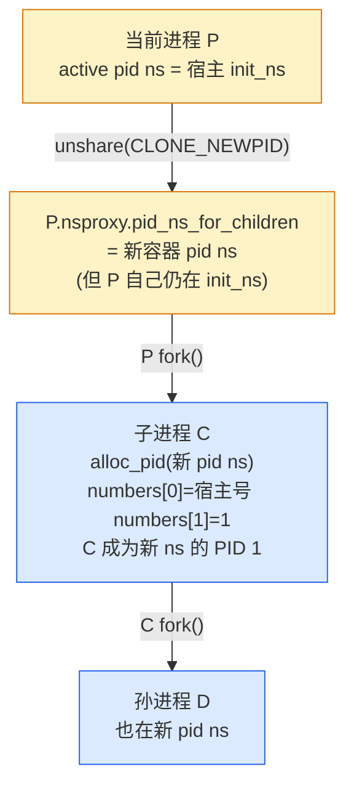
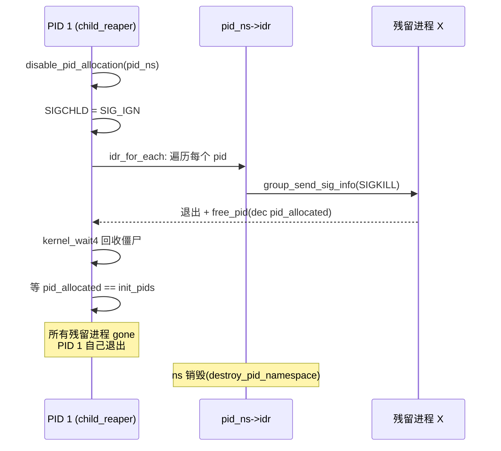

# 第四章 · pid namespace:进程号视图

> 篇:P1 第 1 篇 · namespace 视图隔离
> 主线呼应:上一章我们钻进了 mnt namespace——进程的"挂载视图"是怎么靠 `copy_tree` 整树复制 + 挂载传播变出来的。这一章转到另一种更反直觉的视图:**进程号**。你 `docker exec` 进容器,`ps aux` 看见自己的 bash 是 PID 1,或者某个 nginx worker 是 PID 8。但宿主上 `ps aux | grep nginx` 看见同一进程可能是 PID 4521。**同一个进程,在不同层级的 pid namespace 里有不同的 PID。** 容器里那个"PID 1"不是凭空变出来的,它是内核给这个进程在不同 ns 里各发了一个号码——`task_struct` 里挂着的 `struct pid` 不是单个数字,而是一个**多层号码数组** `numbers[]`。容器之所以能有独立的 PID 1、PID 1 死了能清空整个容器、孤儿进程能被同 ns 的 subreaper 收养——全都靠这套多层 pid 数据结构 + pid ns 层级 + `child_reaper`。读完这一章,你就把"容器里的 PID 1"彻底拆透了。

## 核心问题

**容器里的 PID 1 是怎么变出来的?同一个进程为什么在容器里和宿主上有不同的 PID 号?PID 1 退出时内核怎么保证把整个 pid ns 里所有残留进程都清干净?孤儿进程为什么不会过继给宿主 init,而是同 ns 里的 subreaper?**

读完本章你会明白:

1. pid namespace 是**层级**的(`level` 字段、`parent` 指针),子 ns 的进程同时存在于父 ns 及以上每一层,每层各有一个号码。
2. 一个进程的 `struct pid` 不是单个 `int`,而是一个**多层号码数组** `numbers[level+1]`,每项是一个 `struct upid {nr, ns}`——这是"一个进程在不同 ns 有不同 PID"的全部秘密。
3. `task_struct->nsproxy->pid_ns_for_children` 是**子进程未来要进入**的 pid ns,自己的"当前 active pid ns"另有查法(`task_active_pid_ns`,从 `thread_pid` 反推)——这是 pid ns 区别于其他 6 种 ns 的最大反直觉点。
4. PID 1(`child_reaper`)是 pid ns 的命根子:它死了内核走 `zap_pid_ns_processes` 给全 ns 每个残留进程发 SIGKILL、回收僵尸;孤儿进程过继由 `find_new_reaper` + `has_child_subreaper` 在**同 ns 内**找祖先,绝不跨 ns。
5. 这一切服务二分法的**视图**那一面:pid ns 不创建新进程、不分配新 PID 号段,它只是让容器里的 `ps` 只看见自己 ns 范围内的进程——视图过滤,不是数据复制。

> **逃生阀**:如果你被"多层 PID 数组"绕晕,先记住一句:**一个 `struct pid` 等于从 init ns 到本 ns 这条链上每一层各一个 `nr`**。容器里 `ps` 看到的是本层那个 `nr`(往往是 1);宿主 `ps` 看到的是最外层那个 `nr`(比如 4521)。它们指向同一个 `task_struct`,只是读了 `numbers[]` 的不同槽。

---

## 4.1 一句话点破

> **pid namespace 不是改了进程的号,而是给同一个进程在每个 ns 层级各发了一个号——`struct pid` 是一个数组 `numbers[level+1]`,容器里 PID 1 和宿主上 PID 4521 指向同一个 `task_struct`,只是查了数组的不同槽。**

这是结论,不是理由。本章倒过来拆:先看朴素方案为什么不行(全局唯一 PID 容器里冲突),再看内核怎么用 pid ns 层级 + `numbers[]` 多层号码同时回答"容器 PID 1"和"宿主 PID 4521",然后讲 PID 1 为什么是这个 ns 的命根子(`child_reaper`/`zap_pid_ns_processes`),最后钻进两个最硬核的技巧(多层号码数组、PID 1 退出清场)。

---

## 4.2 朴素方案为什么不行:全局唯一 PID 容器里冲突

要给"容器里有独立 PID 表"这件事做设计,最朴素的写法有两条:

**朴素写法一:每个容器一份独立的 PID 表(独立的 PID 分配器)。**
容器 A 给 nginx 分配 PID 1,容器 B 也给 nginx 分配 PID 1,两份独立计数器。听起来对,但立刻撞墙:宿主内核里只有一份 `task_struct` 全局表(`init_task.tasks` 链表),调度器、`/proc`、信号、ptrace 都跨容器查到同一个 `task_struct`;这个 `task_struct` 只能存一个 PID。你要么给 `task_struct` 加 N 个 pid 字段(N 等于容器数,不可能),要么让宿主 `ps` 看不见容器进程(但内核必须看得见,否则怎么调度)。全局唯一 PID 和容器独立 PID 撞死。

**朴素写法二:全局唯一 PID,容器不要独立 PID 1。**
那容器里 `ps` 看到的就是宿主那套 PID(nginx 是 4521,不是 1)。但这立刻破坏"容器看起来像独占整机"的承诺:容器里的 systemd/init 没法当 PID 1(它是 4521,收不到那些只发给 PID 1 的信号、做不了 wait);容器里启 nginx 还要先看宿主上哪些 PID 被占了——**容器不再是"独立整机"**,只是个进程组。

> **不这样会怎样**:全局唯一 PID 的话,容器要么失去宿主可见性(没法调度),要么失去"像独立整机"的承诺(没法当 PID 1)。两条都不行,逼出了一个折中——**一个进程只有一个 `task_struct`,但内核给它挂一个 `struct pid`,这个 `struct pid` 内部不是单个数字,而是从 init ns 到当前 ns 这条链上每一层各一个号码。任何一层的代码,用"本层的 ns + 本层想要的 nr"哈希查到同一个 `struct pid`,再由 `struct pid` 找到唯一那个 `task_struct`。**

这就是 pid namespace 设计的全部出发点:**不是给进程换个号,而是给同一个进程在每个 ns 层级各发一个号**。

---

## 4.3 `struct pid`:一个多层号码数组

看内核怎么实现。进程的"PID"在 `task_struct` 里不是 `pid_t`,而是一个 [`struct pid *`](../linux/include/linux/pid.h#L55-L69)([pid.h:55](../linux/include/linux/pid.h#L55)):

```c
/* include/linux/pid.h:50-69(简化) */
struct upid {
    int nr;                        /* 在本 ns 里的号码 */
    struct pid_namespace *ns;      /* 哪一层 ns */
};

struct pid {
    refcount_t count;
    unsigned int level;            /* 在第几层 ns(0 = init ns) */
    spinlock_t lock;
    struct dentry *stashed;
    u64 ino;
    /* lists of tasks that use this pid */
    struct hlist_head tasks[PIDTYPE_MAX];   /* 按类型挂 task:PID/PGID/SID */
    struct hlist_head inodes;
    wait_queue_head_t wait_pidfd;
    struct rcu_head rcu;
    struct upid numbers[];         /* 柔性数组,长度 = level+1 */
};
```

关键就两处:

- **`level`**:这个 pid 在第几层 ns。init ns 是 level 0,容器是 level 1,容器里套容器是 level 2。上限是 `MAX_PID_NS_LEVEL = 32`([pid_namespace.h:15](../linux/include/linux/pid_namespace.h#L15))。
- **`numbers[]`**:**柔性数组,长度 = `level+1`**。每一项是一个 `struct upid`,记录"在这一层 ns 里,这个进程的 PID 号是多少"。`numbers[0]` 是 init ns 那层的号(宿主 `ps` 看到的),`numbers[level]` 是最深那层的号(容器里 `ps` 看到的)。

所以一个容器进程(假设套两层,level=2),它的 `struct pid` 长这样:

```
 宿主 init ns (level 0)        容器 ns (level 1)            内层 ns (level 2)
 numbers[0]                    numbers[1]                  numbers[2]
 ┌──────────────┐              ┌──────────────┐            ┌──────────────┐
 │ nr = 4521    │              │ nr = 17      │            │ nr = 1       │
 │ ns = init    │              │ ns = 容器    │            │ ns = 内层    │
 └──────────────┘              └──────────────┘            └──────────────┘
       │                              │                            │
       └────────── 同一个 struct pid ───────────────────────────────┘
                  (count=1, level=2, tasks[PIDTYPE_PID]──► task_struct)
```

**容器里 `ps` 看到的"PID 1",是 `numbers[level].nr`,即 `numbers[2].nr = 1`;宿主 `ps` 看到的"PID 4521",是 `numbers[0].nr`。两者指向同一个 `task_struct`。**

任何一层的代码,只要拿着"本层 ns 指针 + 本层 nr"就能从全局哈希表查到这个 `struct pid`(再由 `struct pid->tasks[]` 找到 `task_struct`)。这个查找在内核里叫 `find_pid_ns`([pid.h:121](../linux/include/linux/pid.h#L121)),它的反操作"给我一个 `struct pid` 和一个 ns,返回本层的 nr"叫 `pid_nr_ns`([pid.h:183](../linux/include/linux/pid.h#L183)):

```c
/* include/linux/pid.h:175-181(简化) */
static inline pid_t pid_nr(struct pid *pid)
{
    pid_t nr = 0;
    if (pid)
        nr = pid->numbers[0].nr;   /* init ns 那层的号 */
    return nr;
}
```

(`pid_nr` 取的是 `numbers[0]`,即"全局号";容器里 `ps` 显示的是 `pid_vnr`,取 `numbers[level]`,即"虚拟号 / 本 ns 号"。)

> **钉死这件事**:`struct pid` 不是一个号,是一个**从 init ns 到当前 ns 的号码数组**。它就是 pid namespace 设计的全部:同一进程在不同 ns 里有不同号,但内核只有一份 `task_struct`、一份 `struct pid`。容器里 PID 1 = 宿主上某个 PID N,只是读了 `numbers[]` 的不同槽。

---

## 4.4 pid ns 层级:`parent` + `level` 串成链

`struct pid` 的多层号码数组需要回答"哪几层"。这就引出 [`struct pid_namespace`](../linux/include/linux/pid_namespace.h#L26-L44)([pid_namespace.h:26](../linux/include/linux/pid_namespace.h#L26)):

```c
/* include/linux/pid_namespace.h:26-44(简化) */
struct pid_namespace {
    struct idr idr;                       /* 本 ns 的 PID 分配器(idr radix tree) */
    struct rcu_head rcu;
    unsigned int pid_allocated;           /* PID 分配状态,高 bit 是 PIDNS_ADDING 标志 */
    struct task_struct *child_reaper;     /* 本 ns 的 PID 1,孤儿进程的收养者 */
    struct kmem_cache *pid_cachep;        /* 本层 ns 分配 struct pid 用的 slab cache */
    unsigned int level;                   /* 第几层(init ns = 0) */
    struct pid_namespace *parent;         /* 父 ns */
#ifdef CONFIG_BSD_PROCESS_ACCT
    struct fs_pin *bacct;
#endif
    struct user_namespace *user_ns;       /* 这个 pid ns 属于哪个 user ns */
    struct ucounts *ucounts;              /* 用户命名空间限额计数 */
    int reboot;                           /* reboot 系统调用时存的退出码 */
    struct ns_common ns;                  /* ns_common 多态(供 setns/open 使用) */
#if defined(CONFIG_SYSCTL) && defined(CONFIG_MEMFD_CREATE)
    int memfd_noexec_scope;
#endif
} __randomize_layout;
```

注意三个字段:

1. **`parent`**:指向父 pid ns。容器 ns 的 `parent` 是宿主 init ns(`init_pid_ns`),容器套容器的 `parent` 是外层容器 ns——形成一条**从 init ns 到当前 ns 的链**。
2. **`level`**:本 ns 在第几层。init ns 的 level 是 0,直接子 ns 是 1,孙子是 2。**`level` 字段就是 `struct pid->numbers[]` 数组长度的来源**——`struct pid` 长度 = `level + 1`。
3. **`child_reaper`**:本 ns 的 PID 1。init ns 的 `child_reaper` 是宿主的 init(PID 1);容器 ns 的 `child_reaper` 是容器里第一个 fork 出来的进程(被 `is_child_reaper` 认定为 PID 1 的那个)。**这个字段是 pid ns 的命根子,后面 4.6 会专讲。**

`level` 和 `parent` 串起 pid ns 的层级结构,这就是为什么"一个进程同时存在于多层 ns"这件事能成立:`struct pid->level` 等于本进程最深那层 ns 的 `level`,`numbers[i].ns` 是这条链上第 i 层的 ns 指针。一个进程只属于**一条**链(从 init ns 到它最深那层),不存在"在 ns A 是 PID 5、在另一个不相邻 ns B 是 PID 7"的情况——pid ns 层级是一棵**严格的树**,每个节点的 `parent` 唯一。

> **钉死这件事**:pid ns 是层级树,靠 `parent` + `level` 串起来。`struct pid->numbers[]` 的每一项对应这条链上的一层。容器里 PID 1 = 链最末端那层的 nr;宿主上 PID N = 链最开头那层(init ns)的 nr。

---

## 4.5 `pid_ns_for_children` 的反直觉:不是"我现在的 ns",是"我子进程将进入的 ns"

讲到这里,该揭开 pid namespace 最大的反直觉了。回看 [`struct nsproxy`](../linux/include/linux/nsproxy.h#L32-L42)([nsproxy.h:32](../linux/include/linux/nsproxy.h#L32)):

```c
/* include/linux/nsproxy.h:32-42(简化) */
struct nsproxy {
    refcount_t count;
    struct uts_namespace     *uts_ns;
    struct ipc_namespace     *ipc_ns;
    struct mnt_namespace     *mnt_ns;
    struct pid_namespace     *pid_ns_for_children;   /* ← 注意这个名字 */
    struct net               *net_ns;
    struct time_namespace    *time_ns;
    struct time_namespace    *time_ns_for_children;
    struct cgroup_namespace  *cgroup_ns;
};
```

字段叫 `pid_ns_for_children`,**不叫 `pid_ns`**。这是 7 种 namespace 里唯一一个不直接挂在自己 nsproxy 上的。为什么?

看头文件那条注释([nsproxy.h:18-23](../linux/include/linux/nsproxy.h#L18-L23)):

> *The pid namespace is an exception — it's accessed using `task_active_pid_ns`. The pid namespace here is the namespace that children will use.*

直译:**这个字段是"我的子进程将要进入的 pid ns",不是"我自己当前的 pid ns"**。

这是 pid namespace 设计里最绕、也最 sound 的一处。它根植于一个无法回避的事实:**进程的 PID 是在它出生的那一刻(fork)分配的,而且整个生命周期不变**。你不能在 `unshare(CLONE_NEWPID)` 之后,把"当前进程"塞进新 pid ns——因为当前进程的 `struct pid` 已经在父 ns 里分配好了(`numbers[]` 已经填好了父 ns 那层的 nr),你没法"现在"给它在新 ns 里凭空补一个 nr。

所以 Linux 的规则是:**`unshare(CLONE_NEWPID)` 只换 `nsproxy->pid_ns_for_children` 这个指针,对当前进程什么也不改;之后 fork 出来的子进程,才会进入这个新 pid ns**(成为新 ns 的 PID 1)。当前进程仍然在自己原来的 pid ns 里,它自己的 PID 不变。

这也是为什么 `nsproxy` 里不叫 `pid_ns`,而叫 `pid_ns_for_children`——名字本身就在提醒这个语义。那么"我自己当前的 pid ns"怎么查?靠 `task_active_pid_ns`,它通过 `task->thread_pid`(`task_struct` 里指向 `struct pid` 的字段)反查 `ns_of_pid`,即"`struct pid` 最末端那个 `numbers[level].ns`":

```c
/* pid_namespace.h:117 声明,实现见 kernel/pid.c(本地 sparse 未解) */
extern struct pid_namespace *task_active_pid_ns(struct task_struct *tsk);
/* 语义等价于:tsk->thread_pid->numbers[tsk->thread_pid->level].ns */
```

([pid_namespace.h:117](../linux/include/linux/pid_namespace.h#L117))

`copy_pid_ns` 也守这个语义([pid_namespace.c:146](../linux/kernel/pid_namespace.c#L146)):

```c
/* kernel/pid_namespace.c:146-154 */
struct pid_namespace *copy_pid_ns(unsigned long flags,
    struct user_namespace *user_ns, struct pid_namespace *old_ns)
{
    if (!(flags & CLONE_NEWPID))
        return get_pid_ns(old_ns);                 /* 没要新 pid ns,共享老的 */
    if (task_active_pid_ns(current) != old_ns)
        return ERR_PTR(-EINVAL);                   /* 必须在当前 active pid ns 里调 */
    return create_pid_namespace(user_ns, old_ns);  /* 否则造新 ns */
}
```

注意第二句 `task_active_pid_ns(current) != old_ns` 的检查:它禁止"在别人的 pid ns 里请求新建"这种语义错乱。要新建 pid ns,你必须在**自己当前 active 的 pid ns** 里请求。

fork 时,内核的 [`copy_process`](../linux/kernel/fork.c#L2406) 调 `alloc_pid` 传的就是 `p->nsproxy->pid_ns_for_children`([fork.c:2406](../linux/kernel/fork.c#L2406)):

```c
/* kernel/fork.c:2405-2412(简化) */
if (pid != &init_struct_pid) {
    pid = alloc_pid(p->nsproxy->pid_ns_for_children, args->set_tid,
            args->set_tid_size);
    ...
}
```

`alloc_pid` 从 `pid_ns_for_children` 开始,沿着 `parent` 链一直走到 init ns,**每一层都分配一个 nr**,填进 `struct pid->numbers[i]`。新进程进入的 ns 就是 `nsproxy` 里那个"为子进程预留的" ns,而它自身从此就是这个 ns 的成员。



> **钉死这件事**:pid namespace 是 7 种 ns 里唯一"不能切当前进程"的。`nsproxy->pid_ns_for_children` 是**子进程将要进入的 ns**,自己的 active pid ns 由 `task_active_pid_ns`(`thread_pid->numbers[level].ns`)反查。原因:**进程的 PID 在 fork 时定死,不可中途改**。`unshare(CLONE_NEWPID)` 只换指针,要等下一次 fork 才真正进入新 ns——这就是 runc 必须用 `clone` 而不是 `unshare` 来开容器 pid ns 的根本原因(详见 P3-15)。

---

## 4.6 PID 1 是命根子:`child_reaper` + `zap_pid_ns_processes`

PID 1 在任何 Unix 系统里都特殊(收养孤儿、回收僵尸),pid namespace 把这种特殊性**层级化**了:每个 pid ns 都有自己的 PID 1,叫 `child_reaper`([pid_namespace.h:31](../linux/include/linux/pid_namespace.h#L31)),负责**本 ns 范围内**的孤儿收养和僵尸回收。容器里那个 PID 1,就是容器 ns 的 `child_reaper`。

### 谁成为 child_reaper

fork 时,内核检测这个新进程是不是它 pid ns 的 PID 1([fork.c:2572-2575](../linux/kernel/fork.c#L2572)):

```c
/* kernel/fork.c:2572-2575 */
if (is_child_reaper(pid)) {
    ns_of_pid(pid)->child_reaper = p;
    p->signal->flags |= SIGNAL_UNKILLABLE;
}
```

`is_child_reaper` 判断"本进程在它最深那层 ns 是不是 nr 1"([pid.h:159-162](../linux/include/linux/pid.h#L159)):

```c
/* include/linux/pid.h:159-162 */
static inline bool is_child_reaper(struct pid *pid)
{
    return pid->numbers[pid->level].nr == 1;
}
```

成为 `child_reaper` 的进程同时被打上 `SIGNAL_UNKILLABLE` 标志——**本 ns 的 PID 1 不能被本 ns 内的普通信号杀掉**(防止容器里某个 fork bomb 把 init 杀了导致整个 ns 失控)。这是容器"防自杀"的关键一环。

### PID 1 死了怎么办:`zap_pid_ns_processes`

如果容器 PID 1 还是死了(比如它 `exit()` 了,或者宿主从外面 SIGKILL 它),内核调用 [`zap_pid_ns_processes`](../linux/kernel/pid_namespace.c#L170)([pid_namespace.c:170](../linux/kernel/pid_namespace.c#L170))给整个 ns 清场。这段代码值得贴出来,它把"pid ns 是层级视图"这件事的后果讲到极致:

```c
/* kernel/pid_namespace.c:170-222(简化,完整 L170-277) */
void zap_pid_ns_processes(struct pid_namespace *pid_ns)
{
    int nr;
    int rc;
    struct task_struct *task, *me = current;
    int init_pids = thread_group_leader(me) ? 1 : 2;
    struct pid *pid;

    /* 1. 关掉本 ns 的 PID 分配:从此本 ns 不能再 fork 新进程 */
    disable_pid_allocation(pid_ns);

    /* 2. 把 SIGCHLD 设为 SIG_IGN,让内核自动回收接下来被杀的子进程 */
    spin_lock_irq(&me->sighand->siglock);
    me->sighand->action[SIGCHLD - 1].sa.sa_handler = SIG_IGN;
    spin_unlock_irq(&me->sighand->siglock);

    /* 3. 遍历本 ns 的 idr(本 ns 已分配的所有 PID),给每个残留进程发 SIGKILL */
    rcu_read_lock();
    read_lock(&tasklist_lock);
    nr = 2;
    idr_for_each_entry_continue(&pid_ns->idr, pid, nr) {
        task = pid_task(pid, PIDTYPE_PID);
        if (task && !__fatal_signal_pending(task))
            group_send_sig_info(SIGKILL, SEND_SIG_PRIV, task, PIDTYPE_MAX);
    }
    read_unlock(&tasklist_lock);
    rcu_read_unlock();

    /* 4. 调 kernel_wait4 等所有被杀的子进程退出回收僵尸 */
    do {
        clear_thread_flag(TIF_SIGPENDING);
        rc = kernel_wait4(-1, NULL, __WALL, NULL);
    } while (rc != -ECHILD);

    /* 5. 等待本 ns 所有进程都 gone(free_pid 会唤醒这里的等待) */
    for (;;) {
        set_current_state(TASK_INTERRUPTIBLE);
        if (pid_ns->pid_allocated == init_pids)
            break;
        ...
        schedule();
    }
    __set_current_state(TASK_RUNNING);
    ...
}
```

注意第 3 步 `idr_for_each_entry_continue(&pid_ns->idr, pid, nr)`——它遍历的是**本 pid ns 的 idr**(本 ns 已分配的所有 PID),不是全局 tasklist。这正是 pid ns 视图隔离的妙处:每个 ns 有自己的 idr(`struct pid_namespace->idr`),记录"在本 ns 这一层分配的 nr → struct pid"。容器 PID 1 死了,内核只需要遍历**本 ns 这一层**的 idr,就能找到本 ns 范围内所有残留进程,挨个 SIGKILL——不会误伤宿主上别的进程。

第 5 步那个 `for (;;)` 自旋等待也值得说:它等的是 `pid_ns->pid_allocated == init_pids`(只剩 init 进程自己)。每个被杀的进程在 `free_pid` 里会 `dec` 这个计数;当计数归零(只剩 init 自己),PID 1 才真正退出,本 ns 才能被销毁。这保证了**一个 pid ns 永远不会"还有进程在跑就被销毁"**——这种 sound 性在 4.7 技巧精解里会展开。

> **钉死这件事**:每个 pid ns 有自己的 `idr`(PID 分配表)+ `child_reaper`(PID 1)。PID 1 死了,`zap_pid_ns_processes` 遍历**本 ns idr**给每个残留进程发 SIGKILL,然后等全部退出才让本 ns 销毁。PID 1 是 pid ns 的命根子——它一死,整个 ns 跟着清场。

---

## 4.7 孤儿收养:`find_new_reaper` 不跨 ns

PID 1 的另一个责任是收养孤儿。但 pid ns 的层级化让这件事多了层规则:**孤儿不能跨 ns 过继**。容器里一个孤儿,绝不能过继给宿主的 init——否则宿主 init 会莫名其妙多出一堆容器里的僵尸孩子,而且容器的 PID 1 还活着,凭什么替它收尸。

看 [`find_child_reaper`](../linux/kernel/exit.c#L585)([exit.c:585](../linux/kernel/exit.c#L585))怎么做的:

```c
/* kernel/exit.c:585-614(简化) */
static struct task_struct *find_child_reaper(struct task_struct *father,
                        struct list_head *dead)
{
    struct pid_namespace *pid_ns = task_active_pid_ns(father);
    struct task_struct *reaper = pid_ns->child_reaper;   /* 本 ns 的 PID 1 */
    ...
    if (likely(reaper != father))
        return reaper;   /* 父亲不是 PID 1,过继给本 ns 的 PID 1 */
    ...
}
```

关键就是开头那句 `task_active_pid_ns(father)`——**只在父亲所在的那个 pid ns 里找 `child_reaper`**,不向上跨 ns。孤儿永远不会被推给宿主 init。

更细的场景——容器里启了个 systemd(用 `prctl(PR_SET_CHILD_SUBREAPER)` 把自己标记为 subreaper),systemd 的子进程死了孙子怎么办?看 [`find_new_reaper`](../linux/kernel/exit.c#L623)([exit.c:623](../linux/kernel/exit.c#L623)):

```c
/* kernel/exit.c:623-656(简化) */
static struct task_struct *find_new_reaper(struct task_struct *father,
                       struct task_struct *child_reaper)
{
    struct task_struct *thread, *reaper;

    /* 1. 同线程组里还有活着的线程? 优先给它 */
    thread = find_alive_thread(father);
    if (thread)
        return thread;

    /* 2. 父亲设了 has_child_subreaper? 在本 ns 里向上找 is_child_subreaper 的祖先 */
    if (father->signal->has_child_subreaper) {
        unsigned int ns_level = task_pid(father)->level;
        /*
         * Find the first ->is_child_subreaper ancestor in our pid_ns.
         * We can't check reaper != child_reaper to ensure we do not
         * cross the namespaces, the exiting parent could be injected
         * by setns() + fork().
         * We check pid->level, this is slightly more efficient than
         * task_active_pid_ns(reaper) != task_active_pid_ns(father).
         */
        for (reaper = father->real_parent;
             task_pid(reaper)->level == ns_level;        /* ← 同一层 ns */
             reaper = reaper->real_parent) {
            if (reaper == &init_task)
                break;
            if (!reaper->signal->is_child_subreaper)
                continue;
            thread = find_alive_thread(reaper);
            if (thread)
                return thread;
        }
    }

    /* 3. 都没找到,过继给本 ns 的 child_reaper(PID 1) */
    return child_reaper;
}
```

三级查找顺序,清晰得像教科书:**同线程组 → 同 ns 的 subreaper 祖先 → 本 ns PID 1**。注意中间那段循环的循环条件 `task_pid(reaper)->level == ns_level`——它用 `struct pid->level` 判断"还在同一个 pid ns 里",避免跨 ns 过继。**注释里特意点出**:`setns()+fork()` 会让进程的 parent 指向另一个 ns 的进程,所以不能简单靠 `reaper != child_reaper` 来判断,必须用 pid 的 `level` 字段。

`has_child_subreaper` 是怎么来的?fork 时从父亲继承([fork.c:2583-2584](../linux/kernel/fork.c#L2583)):

```c
/* kernel/fork.c:2583-2584 */
p->signal->has_child_subreaper = p->real_parent->signal->has_child_subreaper ||
                 p->real_parent->signal->is_child_subreaper;
```

只要进程树里**任何一个祖先**做过 `PR_SET_CHILD_SUBREAPER`,整棵子树就继承这个标志——这样容器里的 systemd 即使不是 PID 1,也能收到自己后代的孤儿。这对容器里的进程管理器(systemd/tini/dumb-init)至关重要。

> **钉死这件事**:孤儿收养严格在**同一个 pid ns 内**进行,绝不跨 ns。规则是:同线程组 → 同 ns 的 subreaper 祖先 → 本 ns PID 1。靠 `struct pid->level` 判断"同 ns",而不是靠进程指针(因为 `setns` 会让进程的 parent 跨 ns)。容器里的 systemd/tini 用 `PR_SET_CHILD_SUBREAPER` 让自己成为同 ns 内的 subreaper,这正是"容器看起来像独立整机"的语义保证。

---

## 4.8 pid ns 怎么被造出来:`create_pid_namespace`

最后快速过一遍"造一个新 pid ns"的路径,把整条链补全。`copy_pid_ns` 只是入口,真正造 ns 的是 [`create_pid_namespace`](../linux/kernel/pid_namespace.c#L73)([pid_namespace.c:73](../linux/kernel/pid_namespace.c#L73)):

```c
/* kernel/pid_namespace.c:73-126(简化) */
static struct pid_namespace *create_pid_namespace(struct user_namespace *user_ns,
    struct pid_namespace *parent_pid_ns)
{
    struct pid_namespace *ns;
    unsigned int level = parent_pid_ns->level + 1;
    struct ucounts *ucounts;
    int err;

    err = -EINVAL;
    if (!in_userns(parent_pid_ns->user_ns, user_ns))
        goto out;                            /* user ns 必须是 pid ns 父链上某层的子孙 */

    err = -ENOSPC;
    if (level > MAX_PID_NS_LEVEL)
        goto out;                            /* 不能超过 32 层 */
    ucounts = inc_pid_namespaces(user_ns);
    if (!ucounts)
        goto out;                            /* 触达 user ns 的 pid ns 数量上限 */

    ns = kmem_cache_zalloc(pid_ns_cachep, GFP_KERNEL);
    if (ns == NULL)
        goto out_dec;

    idr_init(&ns->idr);                      /* 本 ns 的 PID 分配表(idr radix tree) */

    ns->pid_cachep = create_pid_cachep(level);  /* 给本层 struct pid 专开一个 slab cache */
    if (ns->pid_cachep == NULL)
        goto out_free_idr;

    err = ns_alloc_inum(&ns->ns);
    if (err)
        goto out_free_idr;
    ns->ns.ops = &pidns_operations;          /* ns_common 多态:proc_ns_ops 表 */

    refcount_set(&ns->ns.count, 1);
    ns->level = level;                       /* level = parent->level + 1 */
    ns->parent = get_pid_ns(parent_pid_ns);  /* 串父链 */
    ns->user_ns = get_user_ns(user_ns);
    ns->ucounts = ucounts;
    ns->pid_allocated = PIDNS_ADDING;        /* 高 bit 置位:表示还在分配 PID */
    ...
    return ns;
}
```

看三个细节:

1. **`level = parent_pid_ns->level + 1`**:每深一层 ns,`level` 加 1。这正是 `struct pid->numbers[]` 数组要多一个槽的原因。
2. **`create_pid_cachep(level)`**:为**本层 ns 的 `struct pid`** 专开一个 slab cache。为什么?因为 `struct pid` 是**柔性数组**(`numbers[]`),不同 level 的 `struct pid` **大小不同**——level 0 是 `sizeof(struct pid) + 1×sizeof(struct upid)`,level 5 是 `sizeof(struct pid) + 6×sizeof(struct upid)`。每层各开一个 slab cache,分配/释放都在固定大小上做,这就是 [`create_pid_cachep`](../linux/kernel/pid_namespace.c#L39)([pid_namespace.c:39](../linux/kernel/pid_namespace.c#L39))做的事:

```c
/* kernel/pid_namespace.c:39-61(简化) */
static struct kmem_cache *create_pid_cachep(unsigned int level)
{
    struct kmem_cache **pkc = &pid_cache[level - 1];
    ...
    snprintf(name, sizeof(name), "pid_%u", level + 1);
    len = struct_size_t(struct pid, numbers, level + 1);   /* level+1 个 upid */
    ...
    *pkc = kmem_cache_create(name, len, 0,
                 SLAB_HWCACHE_ALIGN | SLAB_ACCOUNT, NULL);
    ...
}
```

这是内核处理"柔性数组结构"的典型模式:**为每种可能的数组长度各开一个 slab cache**。对比朴素做法(每次 `kmalloc(sizeof + n×sizeof)`),slab cache 的好处是固定大小、对齐整齐、缓存友好、碎片少。

3. **`inc_pid_namespaces(user_ns)` + `ucounts`**:每建一个 pid ns,对应 user ns 的命名空间计数 `+1`。这是 user ns 的限额机制(详见 P1-08):**非特权用户能建的 pid ns 数量是有限的**,防止 fork bomb 式的 ns 爆炸。

> **钉死这件事**:造一个新 pid ns,内核做三件事:① `level = parent->level + 1`,串父链;② 为本层 `struct pid` 专开 slab cache(因 `numbers[]` 长度随 level 变);③ 在对应 user ns 上 `inc` 计数限额。`pid_ns->ns.ops = &pidns_operations` 让它能通过 `ns_common` 多态被 setns/open 统一处理。

---

## 4.9 技巧精解:多层号码数组 + PID 1 清场

这一章的技巧精解挑两个最硬核的设计深挖。

### 技巧一:`struct pid->numbers[]` 多层号码 —— 用一个数组吃下"同进程多 ns 不同号"

朴素方案(4.2 节)撞的墙是:全局唯一 PID 容器里冲突,每容器独立 PID 又没法和宿主共享 `task_struct`。Linux 的解法前面已经讲了——`struct pid` 不是单个号,是**柔性数组 `numbers[level+1]`**。这个设计的精妙之处要从三个角度展开:

**(1)为什么是柔性数组,不是定长数组或链表?**

定长数组(比如 `numbers[32]`,等于 `MAX_PID_NS_LEVEL`)也行,但每个 `struct pid` 都吃 32×`sizeof(struct upid)` = 32×16 = 512 字节,init ns 里几万个进程都只用到 `numbers[0]` 一项,浪费巨大。链表呢?每次查"本层 ns 里我的 nr 是多少"都要遍历链表,O(N) 太慢。

柔性数组(`numbers[]`,按 `level` 分配长度)是折中:**长度刚好等于 `level+1`**,init ns 里 `level=0`,只有一个槽(8 字节);容器里 `level=1`,两个槽(16 字节)。配合上节讲的"每层一个 slab cache",分配/释放都是定长操作,没有内部碎片。这就是为什么内核选了柔性数组——空间精确 + O(1) 索引。

**(2)怎么靠哈希表实现"本层 ns + nr → struct pid"?**

`struct upid` 的两个字段 `{nr, ns}` 不是单纯记录,它同时是**全局哈希表的 key**。`alloc_pid` 给每一层分配 nr 时,都会把那个 `upid` 插进一个全局哈希表 `pid_hash`,key 就是 `(nr, ns)`:**任何代码拿着 "本层 ns 指针 + nr" 就能 O(1) 查到 `struct pid`,再由 `struct pid->tasks[PIDTYPE_PID]` 找到 `task_struct`**。这就是 `find_pid_ns` 的实现原理([pid.h:121](../linux/include/linux/pid.h#L121))。

同一进程的多层 `upid`(在 init ns 是 4521、在容器 ns 是 1)**分别**插进哈希表,用不同的 `(nr, ns)` key。宿主 `ps` 查 `(4521, init_ns)`、容器 `ps` 查 `(1, container_ns)`,都能定位到同一个 `struct pid`。这就是"同进程多 ns 不同号"的完整 sound 性。

**(3)为什么 `struct pid` 用 `refcount_t` + RCU?**

一个 `struct pid` 被 `task_struct`、`/proc/<pid>/` 的 inode、pidfd 等多处引用,任何一处都可能并发释放。靠 `refcount_t`(`count`)做引用计数,`get_pid`/`put_pid` 一加一减,最后一个释放才真 free;`rcu_head` 字段(L67)让 `free_pid` 用 `kmem_cache_free` 走 RCU 延迟释放——**还在用 RCU 读 `struct pid` 的代码(比如 `find_pid_ns` 在 RCU 临界区里)不会被释放撕扯**。这套保护机制和上一本《Linux mm》的 page refcount、《调度器》的 task_struct refcount 是同一思路:**引用计数 + RCU = 并发安全的最小代价**。

> **反面对比**:如果用定长数组,init ns 几万进程内存浪费惊人;如果用链表,每次查 PID 都 O(N);如果不用 `(nr, ns)` 哈希,容器里 `ps` 要从全局 tasklist 一遍遍 filter 本 ns 进程,O(全机进程数)。`struct pid->numbers[]` + `(nr, ns)` 哈希是**空间精确 + 时间 O(1) + 并发 sound** 的三全解,这种"用一个柔性数组 + 一个哈希表"的设计是 Linux 处理"层级化身份"的招牌技巧,和 cgroup 的 `css_set` 哈希(下一章 P2-09)是同一套思路。

### 技巧二:PID 1 死了不漏清 —— `zap_pid_ns_processes` 的两段式清场

PID 1 是 pid ns 的命根子(4.6 节),它死了内核必须把本 ns 全部残留进程清干净。这件事有两个看似简单实则棘手的地方:

**(1)清场期间不能让新进程溜进来。**

`zap_pid_ns_processes` 第一件事是 `disable_pid_allocation(pid_ns)`([pid_namespace.c:179](../linux/kernel/pid_namespace.c#L179)),把 `pid_allocated` 的高 bit(PIDNS_ADDING)清掉([pid_namespace.h:48](../linux/include/linux/pid_namespace.h#L48))。之后本 ns 的 `alloc_pid` 一律失败——清场期间不可能有新 fork 溜进来"逃过 SIGKILL"。

> **不这样会怎样**:如果清场时不先关分配,刚发完 SIGKILL 又一个 fork 溜进来(可能是 PID 1 在 `die` 路径上还有线程在 fork),这个新进程就漏过了 SIGKILL,变成 ns 里最后一个活进程,ns 永远销毁不了。先关分配、再清场,是"关闭-清空"两段式的标准并发模式,和数据库的 checkpoint + shutdown、cgroup freezer 的 freeze + kill 是同一思路。

**(2)清场完了要等所有进程真退出,不能抢跑。**

看 4.6 节贴的第 5 步:

```c
for (;;) {
    set_current_state(TASK_INTERRUPTIBLE);
    if (pid_ns->pid_allocated == init_pids)
        break;
    ...
    schedule();
}
```

这个循环**自旋睡眠等** `pid_allocated == init_pids`(只剩 init 进程的计数)。每个被 SIGKILL 的进程在 `free_pid` 里 `dec` 这个计数;归零时 `free_pid` 会唤醒这里的等待。**只有本 ns 所有非 init 进程都真的 gone(不只是被发信号,是真的退出并 `free_pid`),PID 1 才允许真正退出,ns 才允许销毁**。

为什么这么严?注释([pid_namespace.c:234-246](../linux/kernel/pid_namespace.c#L234))说得很清楚:存在一类"父进程在 pid ns 外"的进程(通过 `setns()+fork()` 注入进来的),它们退出后变僵尸,父进程在 ns 外还没 wait,这些僵尸**会过继给 `pid_ns->child_reaper`**。所以 `child_reaper` 必须活到这些僵尸也被 reap——否则就漏了僵尸,内核内存泄漏。



> **反面对比**:如果 PID 1 一死就直接销毁 ns,不遍历 idr、不等 `pid_allocated`,会怎样?① 本 ns 里其他进程还在跑,被宿主的 init "捡走",但它们没有合法的 ns 归属,任何 `task_active_pid_ns` 都返回悬空指针,内核崩;② `setns()+fork()` 注入的进程留下僵尸,泄漏 task_struct 内存。`zap_pid_ns_processes` 的两段式(关分配 → 杀全部 → 等全 gone)是"清场必须彻底"的范式,这种 sound 性是容器能稳定启停的根本。

> **钉死这件事**:本章两个招牌技巧——① `struct pid->numbers[]` 柔性数组 + `(nr, ns)` 哈希,用最小代价同时支持"容器 PID 1"和"宿主 PID N";② `zap_pid_ns_processes` 两段式清场(关分配 → 杀全部 → 等 `pid_allocated` 归零),保证 PID 1 死了 ns 不会漏进程、不留僵尸。两者都是"用数据结构 + 状态机换并发 sound 性"的典范,在全书反复出现。

---

## 章末小结

这一章我们把"容器里的 PID 1"彻底拆透了。容器里 `ps aux` 看到自己的 init 是 PID 1,宿主 `ps` 看到同一进程是 PID 4521——这不是"内核给容器单独的 PID 表",而是**同一个 `struct pid` 数组的不同槽**。pid namespace 用 `struct pid->numbers[level+1]` 这个多层号码数组,把"一个进程在每个 ns 层级各有一个号"这件事压成一个 O(1) 查找的设计;用 `parent` + `level` 把 pid ns 串成层级树;用 `child_reaper` 把 PID 1 的"孤儿收养 + 僵尸回收"职责层级化;用 `zap_pid_ns_processes` 的两段式清场保证 ns 销毁时不漏进程。

服务二分法的**视图**那一面:pid ns 不创建新进程、不分配新 PID 号段,它只是让每个 ns 维护一份"本层 nr → struct pid"的哈希(idr),让容器里的 `ps` 只看见本 ns 范围的进程。这和上一章 mnt ns 的"`copy_tree` 复制挂载视图"、下一章 net ns 的"独立网络栈"是同一套哲学:**视图隔离,不数据复制**。

### 五个"为什么"清单

1. **为什么容器里有独立的 PID 1?** 每个 pid ns 在创建时还没有 PID 1,`copy_process` 给第一个进入的进程分配 nr 1 并设为 `child_reaper`。容器里 PID 1 就是容器 ns 的 `child_reaper`,负责本 ns 的孤儿收养。
2. **为什么同一进程在容器里和宿主上 PID 不同?** 它的 `struct pid` 是个数组 `numbers[level+1]`,每一层 ns 各一个 nr。容器里 `ps` 读 `numbers[level].nr`(本层号),宿主 `ps` 读 `numbers[0].nr`(init ns 号)。同一进程,不同槽。
3. **为什么 `unshare(CLONE_NEWPID)` 不改当前进程的 PID?** 因为进程的 PID 在 fork 时定死、整个生命周期不变,没法中途补一个。`unshare` 只换 `nsproxy->pid_ns_for_children`(子进程将要进入的 ns),要等下一次 fork 才真正进入新 ns。所以 runc 开容器 pid ns 用 `clone(CLONE_NEWPID)` 而不是 `unshare`。
4. **为什么 PID 1 死了整个 ns 都要清掉?** PID 1 是本 ns 的孤儿收养者和僵尸回收者,它没了本 ns 其他进程就成了无主孤儿,会污染宿主 init。`zap_pid_ns_processes` 遍历本 ns 的 idr 给每个残留进程发 SIGKILL,等全部 gone 才让 PID 1 真退出、ns 销毁。
5. **为什么孤儿不会过继给宿主 init?** `find_new_reaper` 严格在**同一个 pid ns 内**找收养者(同线程组 → 同 ns subreaper 祖先 → 本 ns PID 1),靠 `struct pid->level` 判断"同 ns"。容器里的 systemd/tini 用 `PR_SET_CHILD_SUBREAPER` 成为同 ns 内的 subreaper,接管自己后代的孤儿。

### 想继续深入往哪钻

- **源码**:[`include/linux/pid.h`](../linux/include/linux/pid.h)(`struct pid` L55、`struct upid` L50、`pid_nr_ns` L183、`is_child_reaper` L159)、[`include/linux/pid_namespace.h`](../linux/include/linux/pid_namespace.h)(`struct pid_namespace` L26)、[`kernel/pid_namespace.c`](../linux/kernel/pid_namespace.c)(`create_pid_namespace` L73、`copy_pid_ns` L146、`zap_pid_ns_processes` L170、`reboot_pid_ns` L314、`pidns_install` L389)、[`kernel/exit.c`](../linux/kernel/exit.c)(`find_child_reaper` L585、`find_new_reaper` L623)、[`kernel/fork.c`](../linux/kernel/fork.c)(`alloc_pid` 调用 L2406、`is_child_reaper` 设 `child_reaper` L2572)。`kernel/pid.c`(本地 sparse 未解,可在线 elixir.linux.no 行 L6.9)有 `alloc_pid`/`free_pid`/`find_pid_ns`/`task_active_pid_ns` 实现,强烈建议配合读。
- **观测**:进任何容器 `docker exec -it <ct> /bin/sh`,`ps aux` 看到的就是容器 pid ns 的视图;在宿主 `ps aux | grep <那个进程名>`,看到的是 init ns 的号;两者是同一进程的 `numbers[level].nr` 和 `numbers[0].nr`。`/proc/<pid>/ns/pid` 是个符号链接,`readlink` 看到的 inode 号就是 `ns_common.inum`。`/proc/<pid>/status` 里的 `NSpid` 字段一次列出**所有层**的号(从 init 到当前),非常直观。
- **手动实验**:`unshare --pid --fork --mount-proc bash` 是最小化的"开 pid ns"实验。注意必须配 `--fork`——因为 `unshare(CLONE_NEWPID)` 只换 `pid_ns_for_children`,当前进程仍在旧 ns,必须 fork 一下子进程才真正进入。这个细节就是 4.5 节"pid_ns_for_children 反直觉"的活体演示。
- **延伸**:容器 init 进程的"信号屏蔽"(`SIGNAL_UNKILLABLE`)、`reboot` 系统调用在容器内如何被 `reboot_pid_ns` 拦截成"ns 内关机"(pid_namespace.c:314)、`ns_last_pid` sysctl(CHECKPOINT_RESTORE 场景)——这些本章只点到,深读 pid_namespace.c 注释。

### 引出下一章

这一章讲的 pid ns 只动了"进程号视图"——容器里有自己的 PID 1、自己的进程号空间。但容器要真正像独立整机,还得有自己的**网络栈**:自己的 lo、自己的 eth0、自己的路由表、自己的 iptables 规则、自己的 socket 端口空间。下一章 P1-05 转到 net namespace,看 `struct net` 这个网络栈的根怎么靠 `pernet_ops` 链表批量初始化每个协议模块、veth pair 怎么跨 ns 把两个容器的网络连通——这是 7 种 namespace 里**最大、最复杂**的一个。
