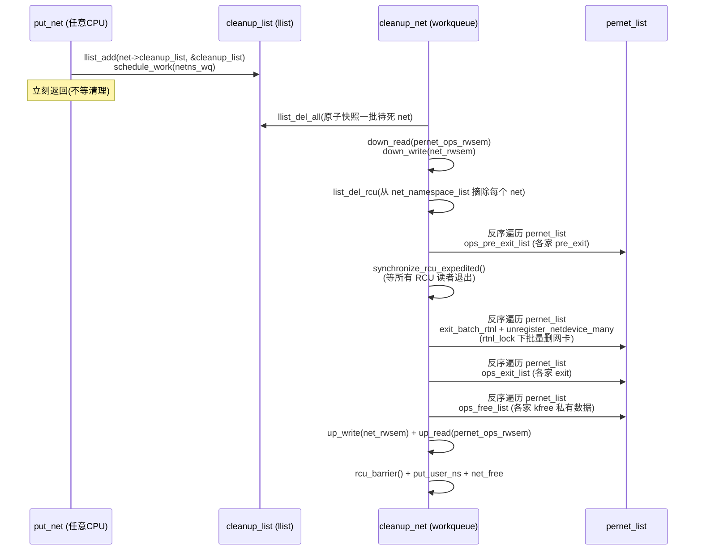

# 第五章 · net namespace:网络栈视图

> 篇:第 1 篇 namespace 视图隔离
> 主线呼应:上一章我们钻了 pid namespace——容器里看到的"PID 1",是 `task_struct->nsproxy->pid_ns_for_children` 这个指针造出来的视图。这一章换个完全不同的维度:网络。你在容器里敲 `ip a`,会看到一张干净的 `eth0`,IP 是你给容器分配的那一个;`ip route` 只有一条默认路由;`iptables -L` 是空的——而宿主机上明明跑着几十张网卡、上百条路由、上千条 iptables 规则。一个进程凭什么"看不见"宿主的网络?答案和 pid ns 同构:**net ns 把 `task_struct->nsproxy->net_ns` 这个指针换成了一个全新的 `struct net`**。但与 uts/pid ns 的"换一个结构体"不同,net ns 是所有 namespace 里**最重**的一个:它不是"换一张路由表",而是**把整张网络栈的每个组件都复制一份**——网卡设备链、路由表(fib)、邻居表(arp)、netfilter(iptables)、procfs 里的 `/proc/net`、sysctl(`net.ipv4.ip_forward`)、协议套接字哈希表……每个 net ns 都有自己一套。这一章讲清这套"网络栈的复制"怎么做到、凭什么能做到不漏不乱,以及内核里那张贯穿全栈的 `pernet_ops` 链表——它是整个 net ns 子系统的工程脊梁。
> 服务二分法归属:**视图**。net ns 回答"进程看见的网络世界"。

## 核心问题

**一个 `struct net` 到底包了什么?为什么 `CLONE_NEWNET` 能凭空造出一个"独立但完整"的网络栈?每个网络协议(TCP/UDP/IPv4/IPv6/netfilter/路由/邻居表……)是怎么知道自己该在新 net ns 里建一份的?以及为什么这个机制不会随协议数量爆炸成改 `copy_net_ns` 的灾难?**

读完本章你会明白:

1. `struct net` 是**网络栈的根容器**——一张网卡链表、一张路由表、一组 netfilter 规则、一组协议私有数据,全挂在它下面;换个 `net_ns` 指针,进程就进了另一套网络世界。
2. `copy_net_ns` 的真正动作不是"拷贝",而是**分配一个空 `struct net`,然后让所有已注册的网络子系统各自往里填一份自己的私有数据**——这是 `setup_net` 的核心。
3. `pernet_ops` 是一张**全局链表**,链上每个节点是一个 `struct pernet_operations`(一张 `init`/`exit` 函数指针表),代表一个网络子系统的"我新建一个 net ns 时该做什么"。`setup_net` 遍历它,每个协议各填一份。**新增一个协议模块,不改 `copy_net_ns` 一行代码**——这就是 net ns 的工程美学。
4. `pernet_ops_rwsem` 这把读写锁保证了"`setup_net` 跑遍历"和"协议模块动态注册 `register_pernet_*`"不互踩;`first_device` 这根游标把"设备类"ops 和"子系统类"ops 分成两段,解决了"网卡设备要在协议之后才创建"的顺序依赖。
5. ★ 对照 runc:`CLONE_NEWNET` 由 runc 在 `clone` 时一次性打上,runc 自身只负责 `loopback` 起来、配置容器网卡 IP;真正跨 net ns 连通两台容器(把宿主一边一根的 veth pair 塞进两个 net ns)是 CNI/Docker 网络驱动用 `RTM_NEWLINK` + `IFLA_NET_NS_FD` 在内核里搬的,这一搬正是 net ns"网卡归属哪个 net"被切换的过程。

> **逃生阀**:如果你只记得一件事,就记这句——**net ns = 一个 `struct net` 容器,`setup_net` 遍历 `pernet_ops` 链表让每个网络协议各填一份私有数据**。`pernet_ops` 是"协议可插拔"的工程核心,其余细节都是为它服务的。

---

## 5.1 一句话点破

> **`struct net` 是网络栈的根,net ns 的本质是给进程换一个根;但网络栈有几十个组件(网卡/路由/邻居表/netfilter/proc……),内核不可能在 `copy_net_ns` 里逐个写死"创建网卡链表、创建路由表、创建 netfilter 表……"——它用一张 `pernet_ops` 全局链表把"每个网络子系统在新 net ns 里的初始化逻辑"注册进来,`setup_net` 遍历这张链表,各协议各填各的。新增一个协议模块,不改 `copy_net_ns` 一行。**

这是结论。本章倒过来拆:先看朴素方案的死结(为什么不能在 `copy_net_ns` 里写死),再看 `struct net` 长什么样、`pernet_ops` 怎么工作,然后钻进最硬核的技巧——**`first_device` 游标与设备/子系统两段分离**,以及**`register_pernet_operations` 反向遍历已有 net ns 做补注册**。

---

## 5.2 不在 `copy_net_ns` 里写死:为什么必须用一张链表

容器要"看起来有独立网络栈",意味着新 net ns 里必须**每一样都不缺**:

- 一张网卡设备链表(`net->dev_base_head`,容器自己的 `lo`、`eth0`)
- 一张 IPv4 路由表(`net->ipv4` 里的 fib)
- 一张邻居表(arp/邻居发现)
- 一组 netfilter 规则(iptables/nftables 表)
- `/proc/net` 视图
- 一份 sysctl(`net.ipv4.ip_forward` 等)
- 协议私有数据(TCP 的 `tcp_death_row`、ICMP 的统计、UDP 的 hash 表……)
- 一个 netfilter 钩子数组(`NF_INET_PRE_ROUTING` 等五个钩子的链)
- netns id 表(把别的 net ns 用整数 id 引用过来)
- `gen`(per-netns 私有指针数组,给"想要 per-netns 私有数据的子系统"用)

朴素地写,`copy_net_ns` 长这样:

```c
/* 朴素的、糟糕的写法(示意,非源码) */
struct net *copy_net_ns(unsigned long flags, ...)
{
    struct net *net = kmalloc(...);

    /* 把每个协议的初始化都写死在这里 */
    net->dev_base_head = init_dev_list();
    ip_route_init_net(net);          /* IPv4 路由 */
    ip6_route_init_net(net);         /* IPv6 路由 */
    neigh_table_init_for_net(net);   /* 邻居表 */
    nf_tables_init_net(net);         /* netfilter */
    tcp_init_net(net);               /* TCP 私有 */
    udp_init_net(net);               /* UDP 私有 */
    icmp_init_net(net);
    /* ……还有几十个协议,每加一个都要改这里 */
    return net;
}
```

> **不这样会怎样**:这撞上三面墙。第一,**耦合爆炸**——Linux 有上百个网络协议,每个协议都"在新 net ns 里建一份自己的私有数据",把这些调用全堆在 `copy_net_ns` 里,这个函数会膨胀成几千行,且每次新协议合入都要改它;第二,**协议模块化失败**——很多协议(尤其 netfilter tables、bridge、vxlan、各种 tunnel)是**可加载模块**(`modprobe`),它们在 `copy_net_ns` 写好的时候根本还没被加载,`copy_net_ns` 怎么可能调到它们的初始化?第三,**顺序依赖无法表达**——网卡设备的初始化必须晚于协议(IP 栈还没准备好,`lo` 起来也没用),而 `copy_net_ns` 里平铺的 `init_*_net()` 调用没法表达这种"先后"。

所以内核换了个**完全反过来**的思路:不让 `copy_net_ns` 去找协议,而让协议**主动来注册**自己。

> **所以这样设计**:每个网络协议(或每个想要 per-netns 私有数据的子系统)在启动时调 [`register_pernet_subsys`](../linux/net/core/net_namespace.c#L1356)(子系统类)或 [`register_pernet_device`](../linux/net/core/net_namespace.c#L1402)(设备类),把自己的一张**函数指针表**——[`struct pernet_operations`](../linux/include/linux/net_namespace.h)——挂到一张**全局链表** [`pernet_list`](../linux/net/core/net_namespace.c#L34) 上。这张表里写着"我新建 net ns 时要做的 init"和"销毁 net ns 时要做的 exit"。然后 `copy_net_ns` 只做一件事:调 [`setup_net`](../linux/net/core/net_namespace.c#L320),后者**遍历 `pernet_list`,挨个调 `ops->init(net)`**。每家各填各的,`copy_net_ns` 自己一行协议特定的代码都不用写。

这是 net ns 子系统的工程美学:**控制反转(IoC)**。`copy_net_ns` 不认识任何具体协议,它只认识一张函数指针表链表。协议主动来注册自己——这和 cgroup 的 `struct cgroup_subsys`(每个 controller 填一份函数指针表,核心代码 `class->xxx()` 调用)、以及第 12 本《内核机制》里 irq_chip/sched_class 的多态是**同一个套路**——用函数指针表换可插拔性。

> **钉死这件事**:net ns 的核心不是"复制网络栈",而是"**用一张全局函数指针表链表 `pernet_list` 把每个网络子系统的 per-netns 初始化逻辑注册进来,`setup_net` 遍历它,各家各填各的**"。这把"协议数量爆炸"和"`copy_net_ns` 该写什么"彻底解耦——新增一个协议模块,只需它自己 `register_pernet_subsys`,核心路径一行不改。

---

## 5.3 `struct net`:网络栈的根容器

先看新 net ns 长什么样。它是一头叫 `struct net` 的怪兽。

> **关于源码引用的诚实标注**:`struct net` 的完整定义在 `include/linux/net_namespace.h`——但本地的 Linux 6.9 sparse 解压**只解了 `kernel/` + `net/core/` + 部分 `include/`,没有 `include/linux/net_namespace.h` 这个文件**。本章对 `struct net` 字段的描述,以 `net/core/net_namespace.c` 的 `setup_net` 和 `net_alloc` 实际**访问**到的字段为准,这些字段都在源码里逐行可查。读者要查完整结构体定义,请打开本地未裁剪的源码树或 [elixir.bootlin.com/linux/v6.9/source/include/linux/net_namespace.h](https://elixir.bootlin.com/linux/v6.9/source/include/linux/net_namespace.h)。

`setup_net` 一上来初始化的字段([net_namespace.c:328-340](../linux/net/core/net_namespace.c#L328-L340)),直接告诉你 `struct net` 里有什么:

```c
/* net/core/net_namespace.c:328-340(简化,完整见 setup_net) */
refcount_set(&net->ns.count, 1);              /* 本 net 的引用计数 */
refcount_set(&net->passive, 1);               /* 异步释放用的被动引用 */
get_random_bytes(&net->hash_mix, sizeof(u32));/* 协议哈希表的扰动值 */
net->net_cookie = gen_cookie_next(&net_cookie); /* 全局唯一 64 位 cookie */
net->dev_base_seq = 1;                        /* 网卡序列号(给 ifindex) */
net->user_ns = user_ns;                       /* 本 net ns 的 owner user ns */
idr_init(&net->netns_ids);                    /* 把别的 net ns 映射成 int id */
spin_lock_init(&net->nsid_lock);              /* 保护 netns_ids */
mutex_init(&net->ipv4.ra_mutex);              /* IPv6 RA 相关互斥锁 */
```

这十行只是"基础字段"。真正撑起网络栈的,是后面 `pernet_list` 里各家填进去的东西——网卡链表(`dev_base_head`,由 `netdev_net_ops` 初始化)、IPv4 路由表(由 IPv4 协议模块的 pernet_ops 初始化)、netfilter 表(由 `nf_tables_net_ops` 初始化)、loopback 设备(由 `loopback_net_ops` 创建并启 up)……每个 `ops->init(net)` 往 `net` 里挂自己那一份。

所以 `struct net` 是个**根容器**——它自己只持有元信息(引用计数、hash_mix、user_ns、netns_ids),真正的网络栈组件被各协议模块挂到它的成员里(`net->ipv4.*`、`net->ipv6.*`、`net->nf.*` 等)。用一个简化框图:

```
  struct net(简化,sparse 树未含 net_namespace.h,字段据 setup_net 实际访问)
  ├─ ns.count / passive            引用计数(同步 get_net / 异步 net_free)
  ├─ hash_mix                      协议哈希表的扰动值(每 net ns 独立)
  ├─ net_cookie                    全局唯一 64 位 id
  ├─ dev_base_seq                  ifindex 计数器
  ├─ user_ns                       本 net 的拥有者 user ns(权限记账)
  ├─ netns_ids (idr)               把别的 net ns 映射成 int(供 setns 关联)
  ├─ nsid_lock                     保护 netns_ids
  ├─ list                          挂到全局 net_namespace_list
  ├─ exit_list                     cleanup_net 用:待销毁的 net 链
  ├─ gen (RCU 指针)                per-netns 私有数据指针数组(net_generic)
  │
  └─ 下列各由对应的 pernet_ops->init 在 setup_net 阶段挂进来:
      ├─ dev_base_head  ← netdev_net_ops:        网卡设备链表(lo/eth0/veth 都挂这)
      ├─ ipv4           ← inet/net/ipv4 模块:    fib 路由表/arp/tcp/udp 私有
      ├─ ipv6           ← inet/net/ipv6 模块:    IPv6 路由/邻居
      ├─ nf / netfilter ← net/netfilter 模块:   iptables/nftables 表
      ├─ proc_net       ← proc_fs net ops:      /proc/net 视图
      ├─ core.sysctl_*  ← net_defaults_ops:     somaxconn/optmem_max 等基础 sysctl
      └─ ... 几十个协议各填一份
```

`copy_net_ns` 拿到一个 `struct net *net` 之后,工作分三步走(见 [net_namespace.c:479-524](../linux/net/core/net_namespace.c#L479-L524)):

```c
/* net/core/net_namespace.c:479(简化) */
struct net *copy_net_ns(unsigned long flags,
        struct user_namespace *user_ns, struct net *old_net)
{
    struct ucounts *ucounts;
    struct net *net;
    int rv;

    if (!(flags & CLONE_NEWNET))
        return get_net(old_net);     /* 没要新 net ns,复用老的 */

    ucounts = inc_net_namespaces(user_ns);   /* 每个 user ns 能开的 net ns 数有限 */
    if (!ucounts)
        return ERR_PTR(-ENOSPC);             /* 超了 user ns 的 net ns 配额 */

    net = net_alloc();               /* ① 分配一个空 struct net */
    if (!net) { rv = -ENOMEM; goto dec_ucounts; }

    preinit_net(net);                /* 初始化 ref_tracker(调试用) */
    net->ucounts = ucounts;
    get_user_ns(user_ns);            /* net 持有 owner user ns 的引用 */

    rv = down_read_killable(&pernet_ops_rwsem);  /* ② 拿 pernet_ops 读锁 */
    if (rv < 0) goto put_userns;

    rv = setup_net(net, user_ns);    /* ③ 遍历 pernet_list,各家 init 填数据 */

    up_read(&pernet_ops_rwsem);
    if (rv < 0) { /* setup_net 失败已自己回滚 */ ... }
    return net;
}
```

三步:**① `net_alloc` 从 `net_cachep` 这个 slab cache 申请一个清零的 `struct net`**(附带分配 per-netns 私有指针数组 `gen`,[net_namespace.c:425-457](../linux/net/core/net_namespace.c#L425-L457));**② 拿 `pernet_ops_rwsem` 读锁**;**③ `setup_net` 干真正的事**——遍历链表逐家 init。

注意第一行:`if (!(flags & CLONE_NEWNET)) return get_net(old_net);`——这行是为什么 `clone` 不带 `CLONE_NEWNET` 时父子共享同一个 `struct net`:**视图是共享指针,不复制数据**。这是 namespace 一贯的"copy-on-clone"逻辑(同 mnt/pid/uts/ipc ns)。

> **钉死这件事**:`struct net` 是个**根容器**,自己只持元信息(refcount、hash_mix、user_ns、netns_ids、gen);真正的网络栈组件(网卡链表、路由、netfilter……)由 `pernet_list` 上各家 ops 的 `init` 挂进去。`copy_net_ns` 只做"分配空壳 + 拿锁 + 调 setup_net"三件事,它不认识任何具体协议。

---

## 5.4 `setup_net` 遍历链表:全成或全回滚

真正干活的是 [`setup_net`](../linux/net/core/net_namespace.c#L320)([net_namespace.c:320-383](../linux/net/core/net_namespace.c#L320-L383))。它的主干是一个 `list_for_each_entry` 遍历 `pernet_list`,挨个调 `ops_init`:

```c
/* net/core/net_namespace.c:320-352(简化) */
static __net_init int setup_net(struct net *net, struct user_namespace *user_ns)
{
    /* Must be called with pernet_ops_rwsem held */
    const struct pernet_operations *ops, *saved_ops;
    LIST_HEAD(net_exit_list);
    LIST_HEAD(dev_kill_list);
    int error = 0;

    refcount_set(&net->ns.count, 1);
    /* ...基础字段初始化,user_ns/netns_ids/dev_base_seq/hash_mix... */

    list_for_each_entry(ops, &pernet_list, list) {
        error = ops_init(ops, net);    /* ← 核心:逐家调 ops->init */
        if (error < 0)
            goto out_undo;             /* ← 任一家失败,跳到回滚 */
    }
    down_write(&net_rwsem);
    list_add_tail_rcu(&net->list, &net_namespace_list);  /* 加入全局 net 列表 */
    up_write(&net_rwsem);
out:
    return error;

out_undo:
    /* 失败:反序调已成功 init 的那几家 ops 的 pre_exit/exit/free,回滚干净 */
    list_add(&net->exit_list, &net_exit_list);
    saved_ops = ops;
    list_for_each_entry_continue_reverse(ops, &pernet_list, list)
        ops_pre_exit_list(ops, &net_exit_list);

    synchronize_rcu();   /* 等待 RCU 读者退出 */

    ops = saved_ops;
    rtnl_lock();
    list_for_each_entry_continue_reverse(ops, &pernet_list, list) {
        if (ops->exit_batch_rtnl)
            ops->exit_batch_rtnl(&net_exit_list, &dev_kill_list);
    }
    unregister_netdevice_many(&dev_kill_list);
    rtnl_unlock();

    ops = saved_ops;
    list_for_each_entry_continue_reverse(ops, &pernet_list, list)
        ops_exit_list(ops, &net_exit_list);

    ops = saved_ops;
    list_for_each_entry_continue_reverse(ops, &pernet_list, list)
        ops_free_list(ops, &net_exit_list);

    rcu_barrier();
    goto out;
}
```

这里有几个不可错过的细节:

**1. `ops_init` 不只是调 `ops->init`**。它还负责给这个 ops 分配 per-netns 私有数据(如果该 ops 声明了 `id` + `size`),并把数据指针存到 `net->gen` 指针数组的对应槽里([net_namespace.c:122-154](../linux/net/core/net_namespace.c#L122-L154)):

```c
/* net/core/net_namespace.c:122-154(简化) */
static int ops_init(const struct pernet_operations *ops, struct net *net)
{
    void *data = NULL;

    if (ops->id && ops->size) {
        data = kzalloc(ops->size, GFP_KERNEL);    /* 分配本 ops 的 per-netns 数据 */
        if (!data) return -ENOMEM;
        net_assign_generic(net, *ops->id, data);  /* 挂到 net->gen[id] */
    }
    if (ops->init)
        return ops->init(net);   /* ← 协议自己的初始化(可能用 net_generic(net, id) 取回 data) */
    return 0;
}
```

所以 per-netns 私有数据是**双轨制**:① 协议可以在 `struct net` 里直接占字段(如 `net->ipv4.ra_mutex`,这种是核心协议、和 `struct net` 强耦合);② 协议也可以声明 `id`+`size`,让 `ops_init` 在 `net->gen[]` 数组里给一个槽(这种是可加载模块、和 `struct net` 解耦)。**双轨制的妙处**:核心协议省一次间接访问,模块化协议不污染 `struct net`——这又是一处为"模块化"留的活口。

**2. 全成或全回滚的回滚链**。如果第 N 家 ops 失败,前 N-1 家已经初始化过了,必须按**反序**把它们各自创建的东西清理掉。注意三个回滚阶段(`pre_exit` → `exit_batch_rtnl` + `unregister_netdevice_many` → `exit` → `free`)——这是为了照顾"设备类"ops 的特殊性:网卡设备的销毁必须在 `rtnl_lock` 保护下批量做(见下一节"技巧精解")。这套回滚逻辑和 `create_new_namespaces` 的 `goto out_xxx` 反序 put 是**同构**的(见第 2 章 P1-02),内核工程里"构造失败反序回滚"是反复出现的模式。

**3. `synchronize_rcu()` 和 `rcu_barrier()`**。为什么回滚要等 RCU 宽限期?因为 `pernet_list` 是被 RCU 保护的读路径——读者(`for_each_net` 遍历)可能在 RC 临界区里读到这个 net 刚刚 init 出来的状态,我们必须等这些读者退出,才能安全地清理协议私有数据;`rcu_barrier()` 等所有挂着的 RCU 回调(包括 `net_assign_generic` 里 `kfree_rcu` 的老 `gen` 数组)跑完。**这是 net ns 正确性的"sound"所在**:并发读者和正在清理的 net 互不踩踏。

**4. `list_add_tail_rcu(&net->list, &net_namespace_list)`**。这行只在**全部 init 都成功**之后执行——意味着一个 net 只有在"完全可用"之后才对全局可见。`for_each_net` 的读者永远不会看到一个"半初始化"的 net。这是 RCU 发布的典型用法(写者 `list_add_tail_rcu`、读者 `for_each_net_rcu`)。

> **不这样会怎样**:如果允许"半初始化的 net 暴露出去",别的 CPU 上正在跑的 `for_each_net`(比如路由查找时要遍历所有 net ns 查 peer id)可能命中这个 net,但它的协议私有数据还没填好——访问到 `net->ipv4` 里的空指针,直接 panic。`setup_net` 的"全成或全回滚 + 全部成功才 RCU 发布"模式保证了这件事不会发生。

---

## 5.5 `pernet_operations`:每个协议一张函数指针表

现在看那张被遍历的链表里的节点。[`struct pernet_operations`](../linux/include/linux/net_namespace.h)(不在本地 sparse 树,以下字段据内核 6.9 在线源码与各协议定义综合)是这样一张函数指针表:

```c
/* include/linux/net_namespace.h(简化,本地 sparse 树未含此头) */
struct pernet_operations {
    struct list_head list;       /* 挂到 pernet_list 的节点 */
    int  (*init)(struct net *net);                /* 新 net ns 创建时调 */
    void (*pre_exit)(struct net *net);            /* 销毁前调(无锁,可睡) */
    void (*exit)(struct net *net);                /* 销毁时调 */
    void (*exit_batch)(struct list_head *net_exit_list); /* 批量销毁 */
    void (*exit_batch_rtnl)(struct list_head *net_exit_list,
                            struct list_head *dev_kill_list); /* rtnl 持锁批量 */
    int  *id;       /* 如果非 NULL,声明了 per-netns 私有数据 */
    size_t size;    /* 私有数据大小,挂到 net->gen[*id] */
    size_t exit_batch_size;  /* 批量 exit 的批次大小(性能调优) */
};
```

每个网络协议(或网络子系统)各填一份。举几个 6.9 里真实的例子:

**net_defaults_ops**——最简单的一家,只填 `init`,给 `net->core` 几个 sysctl 赋初值([net_namespace.c:385-399](../linux/net/core/net_namespace.c#L385-L399)):

```c
/* net/core/net_namespace.c:385-399(原文摘录) */
static int __net_init net_defaults_init_net(struct net *net)
{
    net->core.sysctl_somaxconn = SOMAXCONN;
    net->core.sysctl_optmem_max = 128 * 1024;
    net->core.sysctl_txrehash = SOCK_TXREHASH_ENABLED;
    return 0;
}

static struct pernet_operations net_defaults_ops = {
    .init = net_defaults_init_net,
};
```

**net_ns_ops**——`/proc/<pid>/ns/net` 符号链接和 `/proc/self/ns/net` 的 procfs 入口,也用 pernet_ops 管理([net_namespace.c:746-762](../linux/net/core/net_namespace.c#L746-L762)):

```c
/* net/core/net_namespace.c:746-762(简化) */
static __net_init int net_ns_net_init(struct net *net)
{ return proc_alloc_inum(&net->ns.inum); }   /* 给本 net 分配一个 proc inode 号 */

static __net_exit void net_ns_net_exit(struct net *net)
{ proc_free_inum(net->ns.inum); }

static struct pernet_operations __net_initdata net_ns_ops = {
    .init = net_ns_net_init,
    .exit = net_ns_net_exit,
};
```

这两个最小的 ops 已经能让你看清 pernet_ops 的全部面貌:**一张 list 节点 + 一组 init/exit 回调 + 可选的 id/size 声明私有数据**。复杂的协议(如 netfilter、fib、TCP)的 ops 内容更长,但骨架完全一样。`setup_net` 不认识 `net_defaults_ops` 和 `net_ns_ops` 有什么不同——它对链上每个节点都同样地调 `ops_init(ops, net)`。

> **钉死这件事**:`struct pernet_operations` 是一张函数指针表,每个网络子系统各填一份。`setup_net` 不认识任何具体协议,只对链表上每个节点统一调 `ops_init`——**这是 net ns 子系统可插拔的根基**。新增一个协议模块(比如某种新 tunnel),只要 `register_pernet_subsys(&my_ops)`,它的新 net ns 初始化逻辑就自动被所有未来的 `CLONE_NEWNET` 调用。`copy_net_ns` 核心路径一行不改。

---

## 5.6 `register_pernet_*`:协议如何反向注册自己

上一节说"协议主动注册"。注册入口有两个,长得几乎一样,但**挂的位置不同**:

- [`register_pernet_subsys`](../linux/net/core/net_namespace.c#L1356):挂到 `first_device`(即"子系统段"),典型用户是路由表、netfilter、邻居表这些**纯数据结构**的子系统。
- [`register_pernet_device`](../linux/net/core/net_namespace.c#L1402):挂到 `pernet_list` 尾部(即"设备段"),典型用户是 `loopback_net_ops`(创建 lo 网卡)、`netdev_net_ops`(初始化网卡链表)、`default_device_ops`(设备默认状态)。

看源码就明白两者挂的位置差异([net_namespace.c:1356-1412](../linux/net/core/net_namespace.c#L1356-L1412)):

```c
/* net/core/net_namespace.c:1356-1364(简化) */
int register_pernet_subsys(struct pernet_operations *ops)
{
    int error;
    down_write(&pernet_ops_rwsem);
    error = register_pernet_operations(first_device, ops);  /* 挂到 first_device 之前 */
    up_write(&pernet_ops_rwsem);
    return error;
}
EXPORT_SYMBOL_GPL(register_pernet_subsys);

/* net/core/net_namespace.c:1402-1412(简化) */
int register_pernet_device(struct pernet_operations *ops)
{
    int error;
    down_write(&pernet_ops_rwsem);
    error = register_pernet_operations(&pernet_list, ops);  /* 挂到链表尾部 */
    up_write(&pernet_ops_rwsem);
    return error;
}
EXPORT_SYMBOL_GPL(register_pernet_device);
```

唯一差别就是 `register_pernet_operations` 的第一个参数:`first_device` vs `&pernet_list`。`first_device` 是一个**游标指针**,指向"设备段"的起点;`register_pernet_subsys` 把 ops 插在 `first_device` 之前(即子系统段尾部),`register_pernet_device` 把 ops 插在 `pernet_list` 尾部,并(若是第一个 device ops)把 `first_device` 移到自己身上([net_namespace.c:1407-1408](../linux/net/core/net_namespace.c#L1407-L1408))。最终链表长这样:

```
  pernet_list(全局链表):
  
  head → [net_defaults_ops]   ← core_initcall,最早注册的子系统
       → [IPv4 协议 ops]       ← 子系统段(subsys_register,在 first_device 之前)
       → [IPv6 协议 ops]
       → [netfilter ops]
       → [邻居表 ops]
       → ...
       → [fib_ops]
       ↑ first_device(游标)
       → [netdev_net_ops]      ← 设备段(device_register,挂在 pernet_list 尾)
       → [loopback_net_ops]    ← 注册最关键的 lo 网卡
       → [default_device_ops]
       → NULL
```

`setup_net` 的 `list_for_each_entry(ops, &pernet_list, list)` 从 head 开始**顺序**遍历——所以**子系统段先初始化(IPv4/IPv6/netfilter 先就绪),设备段后初始化(lo/网卡后起来)**。这正合需要:`lo` 起来时要能走 IP 栈收发(127.0.0.1 的包要过 IPv4 协议),如果设备先于协议起来,网卡 up 的事件没有协议处理就丢了。

> **不这样会怎样**:如果用一张平铺链表、所有 ops 无序注册,你会在某些启动顺序下撞上"`lo` 起来了但 IPv4 还没 init,内核 panic"。`first_device` 游标把"数据子系统"和"设备子系统"在链表上**物理分段**,用最简单的方式表达"协议先于设备"这条依赖——这是个又朴素又漂亮的工程技巧,我们把它放在技巧精解里细拆。

**反向遍历**:协议注册不是只在启动时发生,也可以在运行时(`modprobe nf_conntrack` 之类)。这时候 `for_each_net(net)` 要遍历**所有已存在的 net ns**,给新协议补 init。看 [`__register_pernet_operations`](../linux/net/core/net_namespace.c#L1233)([net_namespace.c:1233-1259](../linux/net/core/net_namespace.c#L1233-L1259)):

```c
/* net/core/net_namespace.c:1233-1259(简化) */
static int __register_pernet_operations(struct list_head *list,
                                        struct pernet_operations *ops)
{
    struct net *net;
    int error;
    LIST_HEAD(net_exit_list);

    list_add_tail(&ops->list, list);              /* 先把自己挂进链表 */
    if (ops->init || (ops->id && ops->size)) {
        /* 持有 pernet_ops_rwsem 写锁,并行的 setup_net/cleanup_net 不可能 */
        for_each_net(net) {                        /* 遍历所有现存 net ns */
            error = ops_init(ops, net);            /* 给新协议在每个 net ns 里 init */
            if (error)
                goto out_undo;
            list_add_tail(&net->exit_list, &net_exit_list);
        }
    }
    return 0;

out_undo:
    list_del(&ops->list);                          /* 摘掉自己 */
    free_exit_list(ops, &net_exit_list);           /* 反序 exit 已 init 的 net */
    return error;
}
```

这又是"全成或全回滚"——但这次是**横向**的(对每个 net ns 各试一次),不是 `setup_net` 里那种**纵向**的(在一个 net 内对每个 ops 试一次)。横向回滚和纵向回滚用同一套 `ops_exit_list`/`ops_free_list` 工具,因为它们的语义是一致的:"把这家 ops 在这些 net 上做的事全撤销"。

注意上面 `for_each_net` 那行注释——它**不**用 RCU 版的 `for_each_net_rcu`,因为我们持有 `pernet_ops_rwsem` **写锁**(在 `register_pernet_subsys/device` 里 `down_write`),这时候**不可能**有并发的 `setup_net`/`cleanup_net` 创建/销毁 net,所以 `net_namespace_list` 是稳定的,直接 `for_each_net` 安全。这套"用写锁保证读者独占"的技巧在内核里很常见——比 RCU 简单,代价是并发性。

---

## 5.7 一个 net ns 销毁时:`cleanup_net` 的延迟清理

看完建,再看拆。net ns 销毁远比创建复杂——因为 `struct net` 是个**异步对象**:它在被最后一个引用者 `put_net` 之后,**不会立刻释放**,而是被扔进一个 llist(`cleanup_list`),由一个 workqueue 异步清理([net_namespace.c:581-644](../linux/net/core/net_namespace.c#L581-L644))。为什么?因为销毁要 `synchronize_rcu_expedited()`(等读者退出)、要 `rtnl_lock()`(设备操作互斥)、要批量处理多个一起死的 net——这些都不能在 `put_net` 的上下文(可能是中断或锁敏感路径)里做。



这张时序图告诉你 net ns 销毁的完整流程。关键的"为什么 sound":

- **延迟到 workqueue**:让 `put_net` 在任何上下文都能调(快路径),重活交给内核工作线程。
- **批量**:一次 `cleanup_net` 处理掉 `cleanup_list` 里所有待死 net——很多清理动作(尤其是 `rtnl_lock` 持锁段)批量做比一个个做快得多。
- **三阶段回滚**:pre_exit(无锁,可睡)→ synchronize_rcu(等读者)→ exit_batch_rtnl(rtnl 锁下批量删网卡)→ exit(普通锁下各家 exit)→ free(kfree 私有数据)。这种分阶段是为了协调**多种锁**和**多种副作用**。

> **钉死这件事**:net ns 销毁是**异步、批量、分阶段**的。`put_net` 只把 net 扔进 `cleanup_list`,真正销毁在 `cleanup_net` workqueue 里跑。这避免了"在 `put_net` 路径里做长任务"——和 cgroup 的 `css_set` 用 `put_css_set` 异步释放是**同一套思路**(见第 9 章 P2-09):**热路径轻,清理路径重**。

---

## 5.8 跨 net ns 连通:veth pair 怎么搬过去

到这里 net ns 内部讲完了,但容器要真正能联网,还差一件事:**把宿主上的网络和容器里的网络打通**。一张孤立的 net ns(只有一个 `lo`)只能自己 ping 自己。打通靠的是 **veth pair**——一对虚拟网卡,从一端塞进去的包会从另一端出来。典型用法:一端放在宿主 net ns(比如 `veth0`),另一端塞进容器 net ns(比如 `eth0`),宿主再给 `veth0` 配 IP、加路由或挂到 bridge 上——容器就有了网络出口。

这个"塞进容器 net ns"的动作,是**改网卡的 `dev_net`(归属 net ns)指针**。从用户态怎么做?runc 自己不管,这是 CNI(Container Network Interface)或 Docker 的 network driver 干的事。底层是 netlink:

```
  RTM_NEWLINK + IFLA_NET_NS_FD = <fd of container's /proc/<pid>/ns/net>
```

这条 netlink 消息让内核把网卡 `dev_net` 指针切换到 fd 指向的那个 `struct net`。内核里走的是 `dev_change_net_namespace`(在 `net/core/dev.c`,sparse 树有这个文件但本章不展开)。**注意这和 `setns` 不同**:`setns` 改的是**进程**的 `task_struct->nsproxy->net_ns`,让进程进一个新 net ns;`IFLA_NET_NS_FD` 改的是**网卡**的 `nd_net`,让网卡换一个归属 net ns。容器网络同时需要这两个:进程在容器 net ns 里(看见容器网卡),容器网卡也挂在容器 net ns 里(这样进程才能用)。两件事各管一头。

> **钉死这件事**:net ns 的"独立网卡"不是复制——宿主内核里一张 veth pair 物理上只有两张网卡,只是其中一张的 `dev_net` 指针被改到了容器的 `struct net`,于是宿主的 `ifconfig` 看不见它(它在宿主的网卡链表里被摘除),容器的 `ifconfig` 能看见它(它被挂到容器 net 的 `dev_base_head`)。**视图是换指针,不是复制数据**——这条铁律在 net ns 上依然成立。

---

## 5.9 技巧精解:`pernet_ops` 链表 + `first_device` 游标

本章最硬核的两个技巧,单独拆透。

### 技巧一:`pernet_list` 全局链表 + `pernet_ops_rwsem` 读写锁 —— 协议可插拔的工程脊梁

net ns 子系统面临两个相互冲突的需求:① `setup_net` 要遍历整张 `pernet_list`,里面可能有上百个 ops,每个都要调 `ops->init`——这是个**热路径**(每次 `CLONE_NEWNET` 都跑一遍);② 协议模块可以**随时**动态注册/注销(`modprobe`/`rmmod`),每次注册要把 ops 挂进 `pernet_list` 并遍历所有现存 net ns 补 init——这是个**慢路径**。两者并发:容器在 `clone(CLONE_NEWNET)` 的同时,别的 CPU 可能在 `modprobe` 加载新协议。

朴素地写,用一把 `mutex` 把 `pernet_list` 全程锁住:

```c
/* 朴素的、糟糕的写法(示意,非源码) */
mutex_lock(&pernet_mutex);
list_for_each_entry(ops, &pernet_list, list)
    ops_init(ops, net);
mutex_unlock(&pernet_mutex);
```

> **不这样会怎样**:这会让"100 个容器同时 `CLONE_NEWNET`"(K8s 节点拉起 pod 风暴)全部串行化——每个 clone 都要拿同一把互斥锁,吞吐崩溃。更糟的是 `setup_net` 里的 `ops->init` 可能要分配内存、可能睡——持锁睡眠会饿死所有等待者。

Linux 的做法是**读写锁** + **方向相反的遍历**:

```c
/* net/core/net_namespace.c:504-510(copy_net_ns 拿锁,简化) */
rv = down_read_killable(&pernet_ops_rwsem);   /* 读锁:多个 clone 可并发 setup_net */
...
rv = setup_net(net, user_ns);                 /* setup_net 内部不再加锁 */
...
up_read(&pernet_ops_rwsem);

/* net/core/net_namespace.c:1356-1363(register_pernet_subsys,简化) */
down_write(&pernet_ops_rwsem);                /* 写锁:注册时独占 */
error = register_pernet_operations(first_device, ops);
up_write(&pernet_ops_rwsem);
```

看 6.9 源码注释([net_namespace.c:52-57](../linux/net/core/net_namespace.c#L52-L57)):

```c
/*
 * pernet_ops_rwsem: protects: pernet_list, net_generic_ids,
 * init_net_initialized and first_device pointer.
 * This is internal net namespace object. Please, don't use it
 * outside.
 */
DECLARE_RWSEM(pernet_ops_rwsem);
```

读写锁的妙处:① `setup_net` 持**读锁**,多个 `CLONE_NEWNET` 可并发(K8s 风暴吞吐不塌);② `register_pernet_*` 持**写锁**,独占修改 `pernet_list` 和 `first_device`——这时候所有正在 `setup_net` 的 clone 都要么在锁外等待、要么已开始(但拿不到读锁),不会读到"链表正在被改"的中间状态。`down_read_killable` 那个 `_killable` 还允许在等锁时被信号打断(避免 `CLONE_NEWNET` 卡死时整个进程僵死)。

**为什么 sound**:`pernet_list` 的修改只在写锁下发生,读路径要么完全看到旧链表、要么完全看到新链表,不会看到"半个节点刚挂上去但 `init` 还没填"。`first_device` 这个游标指针同样只在写锁下改——它是 `register_pernet_device` 把自己挂到链尾时,顺手更新 `first_device` 到自己的([net_namespace.c:1407-1408](../linux/net/core/net_namespace.c#L1407-L1408))。

> **反面对比**:如果用单 `mutex`,K8s 拉起 pod 风暴时几百个 `clone(CLONE_NEWNET)` 全串行化,启动延迟数倍上涨。读写锁让"读多写少"(容器创建远多于协议模块加载)的典型场景并发性拉满。这正是为什么内核里到处是 `rwlock_t` / `rwsem`(比如 mm 的 `mmap_lock`、fs 的 `vfs_rename` 锁)——**用锁的类型换并发性**。

### 技巧二:`first_device` 游标 —— 用一个指针表达两段依赖

上一节提到的"`first_device` 把链表分两段",是个看起来朴素、细想非常精巧的设计。回顾问题:**协议数据子系统(IPv4/fib/netfilter)必须先于设备子系统(lo/网卡)初始化**,因为网卡 up 的事件要能被协议处理。

朴素地写,有两种死法:

**死法一**:维护两张链表(`pernet_subsys_list` 和 `pernet_device_list`),`setup_net` 顺序遍历两次。

```c
/* 朴素的、糟糕的写法(示意,非源码) */
list_for_each_entry(ops, &pernet_subsys_list, list) ops_init(ops, net);
list_for_each_entry(ops, &pernet_device_list, list) ops_init(ops, net);
```

> **不这样会怎样**:这要 `setup_net` 认识"两张链表"的概念——但 `cleanup_net` 反序清理时,**也得知道两张链表的反序规则**(先清 device 再清 subsys),逻辑分散到两个地方。更要命的是 `register_pernet_operations` 还要额外决定挂到哪张表——同一个 `register_pernet_operations` 函数(`__register_pernet_operations` 一份代码)现在要分支处理两种 list。代码膨胀。

**死法二**:给 `pernet_operations` 加个 `priority` 字段,排序插入。

> **不这样会怎样**:排序插入要遍历链表找位置(O(n)),还要解决"同优先度的 ops 谁先"的问题(注册顺序 vs 优先级谁赢)。引入全局优先级常量,又得有人维护优先级表(像 sched_class 的优先级那样)。复杂度暴涨。

Linux 的做法:一张链表 + 一个**游标指针** `first_device`([net_namespace.c:35](../linux/net/core/net_namespace.c#L35)):

```c
/* net/core/net_namespace.c:34-35 */
static LIST_HEAD(pernet_list);
static struct list_head *first_device = &pernet_list;  /* 初始指向链表头 */
```

- `register_pernet_subsys` 把 ops 挂在 **`first_device` 之前**(用 `list_add_tail(ops, first_device)`)——即"子系统段尾部"。
- `register_pernet_device` 把 ops 挂在 **`pernet_list` 尾部**——如果它是第一个 device,顺手把 `first_device` 移到自己身上。

最终链表就是 5.6 那张图:head → 子系统段 → `first_device` 游标 → 设备段 → 尾。`setup_net` 从 head 开始遍历,天然**先子系统、后设备**;`cleanup_net` 从尾反序遍历,天然**先设备、后子系统**。**依赖顺序**只用一个游标指针就表达完了,不引入第二张链表、不引入优先级字段、不改 `setup_net` 的遍历代码。

这套"用一个游标把单链表虚拟分成两段、表达先后依赖"的技巧,在内核里不多见,但一出现就是经典。它和 cgroup 的 `css_set` 去重表([cgroup-defs.h:217](../linux/include/linux/cgroup-defs.h#L217)、见第 9 章)、sched 的 `sched_class` 链表(按优先级顺序链接、`__schedule` 遍历,见《调度器》)是同一类**"用数据结构表达依赖"**的工程美学。

> **钉死这件事**:`pernet_ops_rwsem` 读写锁(读多写少场景拉满并发)+ `first_device` 游标(一个指针把单链表分两段,表达"协议先于设备"的依赖)是 net ns 子系统的两个工程脊梁。前者解决了"100 个容器并发 `CLONE_NEWNET` 不串行化",后者解决了"设备类 ops 依赖协议类 ops 就绪"——两个看似冲突的需求,用两把不同的"刀"同时解开。

---

## 5.10 ★ 对照 runc:net ns 在容器里怎么用

内核只提供 `CLONE_NEWNET` + `struct net` + `pernet_ops` 这套积木,**真正用它们造容器网络的是用户态**。看 runc 里的真实调用点:

1. **创建 net ns** —— runc 在 `clone` 时把 `CLONE_NEWNET` 打进标志位。runc 的 [`configs/namespaces_syscall.go:12`](../runc/libcontainer/configs/namespaces_syscall.go#L12) 把 NEWNET 映射到 `unix.CLONE_NEWNET`:
   ```go
   NEWNET: unix.CLONE_NEWNET,
   ```
   最终在 [`nsenter/namespace.h:28-29`](../runc/libcontainer/nsenter/namespace.h#L28-L29) 也保留了对老内核的兼容定义:`#define CLONE_NEWNET 0x40000000`。这就是容器 `clone(CLONE_NEWNET)` 的源头——内核侧对应 [`copy_net_ns`](../linux/net/core/net_namespace.c#L479)。

2. **拉起 `lo`** —— 新 net ns 里只有一张未启用的 `lo` 网卡(loopback_net_ops 创建)。runc 负责把它 up,看 [`libcontainer/network_linux.go:21-23`](../runc/libcontainer/network_linux.go#L21-L23) 和 `loopback` 策略 `initialize` ([network_linux.go:96](../runc/libcontainer/network_linux.go#L96))。这一步是把内核的 `lo` 启用——runc 自己不创建 `lo`(那是 `loopback_net_ops` 的事),它只是配置。

3. **veth pair 跨 ns** —— 这是 CNI 的活,runc 把钩子留出来。CNI 调用 netlink 发 `RTM_NEWLINK` + `IFLA_NET_NS_FD` 把一端网卡 `dev_net` 切到容器的 `struct net`([`process_linux.go:1084`](../runc/libcontainer/process_linux.go#L1084) 里 `Configs.Namespaces.Contains(configs.NEWNET)` 分支、[`process_linux.go:1089`](../runc/libcontainer/process_linux.go#L1089) 的 `nsPath := fmt.Sprintf("/proc/%d/ns/net", p.pid())`)。容器从此有了 `eth0`。

4. **`docker exec` 进容器** —— `setns` 到容器的 `/proc/<pid>/ns/net` 符号链接([validator.go:431](../runc/libcontainer/configs/validate/validator.go#L431) `currentProcessNetns = "/proc/self/ns/net"`),这一步是第 16 章 P3-16 讲的 `prepare_nsset`/`commit_nsset` 的 net 部分。

所以 runc 的角色很清楚:**用 `CLONE_NEWNET` 造一个空 net ns(内核出力)、自己负责 `lo` 起来、把 veth 的另一端交由 CNI 切进容器 net ns**。K8s 的 CNI 插件(Flannel/Calico/Cilium)在这一层之上做更复杂的网络拓扑(overlay/BGP/eBPF)——但它们最终都落到"`dev_change_net_namespace` 改网卡归属 net ns"这个内核动作上。

---

## 章末小结

这一章我们钻了 7 种 namespace 里最重的一种——net ns。立起了三件事:

1. **`struct net` 是网络栈的根容器**,自己只持元信息(refcount/hash_mix/user_ns/netns_ids/gen),真正的网络栈组件(网卡链表/路由/netfilter/TCP 私有……)由各家 pernet_ops 在 `init` 阶段挂进去。
2. **`pernet_ops` 链表是 net ns 可插拔的工程脊梁**:`copy_net_ns` → `setup_net` → 遍历 `pernet_list` → `ops_init` → 各家 `init`/填私有数据。新增协议模块不改 `copy_net_ns` 一行,只要 `register_pernet_*`。
3. **读写锁 + 游标两把刀解开两个冲突需求**:`pernet_ops_rwsem` 读写锁让"100 个容器并发 `CLONE_NEWNET`"不串行化;`first_device` 游标把链表分"子系统段"和"设备段",用一个指针表达"协议先于设备"的依赖。

**回扣二分法**:net ns 归属**视图**——它让容器进程只看见自己 `struct net` 里的网卡/路由/iptables/socket,物理上网卡还是同一张(只是 `dev_net` 指针被换了)。视图是换指针,不是复制数据,这条 namespace 通律在 net ns 上依然成立。

### 五个"为什么"清单

1. **为什么 `struct net` 是网络栈的根容器,不是"复制一份内核网络栈代码"?** 因为代码是共享的(同一份 `tcp_v4_rcv` 给所有 net ns 用),只有**数据**是每 net ns 独立(每个 net 有自己的路由表、邻居表、netfilter 表)。换指针就是换数据视图——这和 mnt ns 换 `struct mnt_namespace`、pid ns 换 `struct pid_namespace` 同构。
2. **为什么协议模块能动态注册而不改 `copy_net_ns`?** 因为 net ns 用了**控制反转**:`copy_net_ns` 不认识协议,协议主动 `register_pernet_*` 把自己的 init/exit 函数指针表挂到 `pernet_list`,`setup_net` 遍历它。`copy_net_ns` 核心路径和协议模块完全解耦。
3. **为什么 `setup_net` 要"全成或全回滚"?** 因为半初始化的 net 如果暴露出去,`for_each_net` 的读者可能访问到没填好的协议私有数据,panic。"全部 init 成功才 `list_add_tail_rcu` 加入全局列表"保证了读者永远只看见完全可用的 net。
4. **为什么 `cleanup_net` 要异步 + 批量?** 因为销毁要做 `synchronize_rcu_expedited`、`rtnl_lock`、批量删网卡这些重活,不能在 `put_net` 的任意上下文做。延迟到 workqueue + 批量处理多个一起死的 net,既快又不阻塞热路径。
5. **`first_device` 游标凭什么解决依赖?** 它用一个指针把单链表虚拟分成"子系统段(先 init)"和"设备段(后 init)"两段,`setup_net` 顺序遍历天然"协议先于设备",`cleanup_net` 反序遍历天然"设备先于协议"。不引入第二张链表、不引入优先级字段——一个指针表达完依赖。

### 想继续深入往哪钻

- 本章核心源码:[`net/core/net_namespace.c`](../linux/net/core/net_namespace.c) 的 `copy_net_ns`(L479)、`setup_net`(L320)、`ops_init`(L122)、`register_pernet_subsys`(L1356)、`register_pernet_device`(L1402)、`__register_pernet_operations`(L1233)、`cleanup_net`(L583)。
- `struct net` 完整定义:本地 sparse 树未含 `include/linux/net_namespace.h`,请用 [elixir.bootlin.com/linux/v6.9/source/include/linux/net_namespace.h](https://elixir.bootlin.com/linux/v6.9/source/include/linux/net_namespace.h) 在线查。
- `struct pernet_operations` 定义同上(`include/linux/net_namespace.h`)。
- 网卡设备视角的 netns:`net/core/dev.c` 的 `netdev_net_ops`(L11571)、`default_device_ops`(L11644)、`register_pernet_device(&loopback_net_ops)`(L11801)。
- 跨 ns 搬网卡:`net/core/dev.c` 的 `dev_change_net_namespace`(把 `dev_net` 指针换到目标 net ns,sparse 树有此文件)。
- 想观测:敲 `ip netns add foo; ip netns exec foo ip a` 创建并进入一个 net ns;`ls -l /proc/<pid>/ns/net` 看进程归属的 net ns 符号链接;`ip netns list` 看所有命名 net ns。
- 容器网络:CNI 规范、Flannel/Calico/Cilium 的 veth/bridge/vxlan 实现;`bridge link`、`ip -n <ns> <cmd>` 这类 per-netns 命令。

### 引出下一章

我们看完了 7 种 namespace 里最重的两种(pid、net)。但有种 namespace 几乎没什么内容,却揭示了 namespace 设计的另一个维度——**"视图是按维度切分"的哲学**。下一章,我们花很少的篇幅钻 uts namespace:它只换一个 `struct new_utsname`(nodename/domainname),几乎没逻辑,但这正是它要讲的故事——**为什么 hostname 要独立成一个 ns?** 答案揭示了"namespace 不是按复杂度切,而是按视图维度切"的内核设计哲学。
