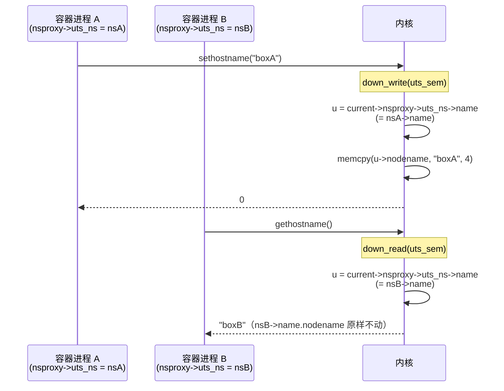

# 第六章 · uts namespace:hostname 视图

> 篇:P1 namespace 视图隔离
> 主线呼应:前五章我们一路从 `nsproxy` 总入口走到 mnt ns(整树复制挂载)、pid ns(多层 PID 号)、net ns(独立网络栈)。那些 ns 都"重"——mnt ns 要复制一棵挂载树,net ns 要为每个协议挨个跑一遍 `pernet_ops` 初始化,pid ns 要维护一张 `pid->numbers[]` 多层号表。这一章换一个极端:`uts namespace`,可能是全书**最薄**的一种 ns。它隔离的东西少得可怜——一个 hostname、一个 domainname,加上 `uname` 返回的 release/version/machine 等"内核自我介绍"字段,仅此而已。源码短到 `kernel/utsname.c` 全文不到 180 行,核心就是一次 `memcpy`。
>
> 但正是这个"薄到几乎没逻辑"的 ns,最适合用来**反观 namespace 的设计哲学**:为什么 hostname 这种东西要单独造一种 ns?为什么不和别的东西合并?答案藏在 Linux 把"视图"按**维度**切分的取舍里——uts ns 不是"为了功能"而存在,而是为了**把一面叫作"系统标识"的视图维度干净地切出去**,让 `hostname`/`domainname`/`uname` 这一组紧耦合的标识符可以独立于 mnt/pid/net 各自演化。读完这一章你会看到,"薄"不是简陋,是边界划得准。

## 核心问题

**一个 hostname 有什么好隔离的?为什么 Linux 要为它单独造一种 namespace,而不是把它塞进 mnt ns 或 pid ns?uts ns 这么薄一层到底装了什么、靠什么技巧让两个进程看到不同的 hostname,又为什么这种"薄"恰好是 namespace 设计哲学的最佳样本?**

读完本章你会明白:

1. uts ns 隔离的不是"一个字符串",而是一整张 `struct new_utsname`——hostname、domainname,加上内核的 sysname/release/version/machine,共六个字段,这是 `uname` 系统调用返回的全部内容。
2. 它的实现简洁到可以用一句话概括:**换 `nsproxy->uts_ns` 这根指针,让 `utsname()` 取到不同的 `new_utsname`**——视图切换的代价只是一次指针赋值。
3. 即便这么薄,它照样要走完 namespace 的全套"仪式":引用计数、`ucounts` 配额、`ns_common` 多态、`proc_ns_operations` 回调表——这些是所有 ns 的通用骨架,uts ns 是看清这套骨架**最好的标本**(没有业务逻辑干扰)。
4. 为什么独立于其他 ns:这是"按视图维度切分"的哲学,本章以此**串起前五章 ns 的共性**,为第 1 篇收口。

> **逃生阀**:如果你读完前五章已经对 `struct ns_common`、`proc_ns_operations`、`copy_*_ns` 的套路烂熟于心,这一章你可以跳到 6.4(设计哲学)和 6.5(技巧精解)——那是本章真正的"肉"。中间 6.1~6.3 是用最薄的 ns 把这套套路再走一遍,给还没完全消化"namespace 切换是什么"的读者一次轻量复习。

---

## 6.1 一句话点破

> **uts namespace 的全部秘密是一行代码:`return &current->nsproxy->uts_ns->name;`。`utsname()` 这个内联函数顺着 `task_struct->nsproxy->uts_ns` 取到 `struct new_utsname`,所以"换 ns"就是"换指针"——sethostname 写的是当前 uts ns 里的那个 `nodename`,gethostname 读的也是它,两个进程只要 `nsproxy->uts_ns` 不同,就活在不同的"主机名世界"里。**

这是结论,不是理由。本章倒过来拆:先看 uts ns 到底装了什么(那张 `new_utsname` 表)、再看 `copy_utsname` 这么薄的函数怎么撑起"创建新 ns"的全部职责、然后看 `sethostname`/`uname` 怎么和它咬合,最后回到那个真正的硬问题——**为什么单独为 hostname 造一种 ns**。

---

## 6.2 uts ns 到底装了什么:`struct new_utsname` 那张表

很多人对 uts ns 的第一印象是"它不就是隔离 hostname 嘛"。这只对了一半。uts ns 里装的,是 `uname` 命令打印出来的那一整张"系统自我介绍表":

```text
$ uname -a
Linux myhost 6.9.0 #1 SMP ... x86_64 GNU/Linux
└sys─┘ └nodename┘ └release┘            └machine┘
```

这张表的内核表示是 [`struct new_utsname`](../linux/include/linux/utsname.h#L24-L30)(定义在 `include/uapi/linux/utsname.h`,本地 sparse 树未解压 uapi 头,从 `sys.c` 的字段访问还原):

```c
/* include/uapi/linux/utsname.h(简化,字段从 sys.c 访问还原) */
struct new_utsname {
    char sysname    [__NEW_UTS_LEN + 1];   /* "Linux"             */
    char nodename   [__NEW_UTS_LEN + 1];   /* hostname            */
    char release    [__NEW_UTS_LEN + 1];   /* "6.9.0"             */
    char version    [__NEW_UTS_LEN + 1];   /* "#1 SMP ..."        */
    char machine    [__NEW_UTS_LEN + 1];   /* "x86_64"            */
    char domainname [__NEW_UTS_LEN + 1];   /* "(none)" / domain   */
};
```

([sys.c:1306-1321](../linux/kernel/sys.c#L1306-L1321) `newuname` 把整张表 memcpy 给用户态;字段名见 `sys.c:1357-1361` 旧 uname 的逐字段拷贝)

而 `struct uts_namespace` 几乎就是给这张表套了个壳:

```c
/* include/linux/utsname.h:24-29 */
struct uts_namespace {
    struct new_utsname name;          /* L25 —— 真正的内容            */
    struct user_namespace *user_ns;   /* L26 —— 这个 ns 归属哪个 user ns */
    struct ucounts      *ucounts;     /* L27 —— 配额计数器             */
    struct ns_common    ns;           /* L28 —— 所有 ns 的通用多态头   */
} __randomize_layout;
```

([include/linux/utsname.h:24](../linux/include/linux/utsname.h#L24))

六个字段,**这就是 uts ns 的全部家当**。对比一下前几章的 ns:`struct mnt_namespace` 里挂一整棵挂载树、`struct pid_namespace` 维护多层号表和 task list、`struct net` 装了上百个协议栈字段;`struct uts_namespace` 只有一张 6 个字符串的定长表。难怪源码文件才 178 行。

> **不这样会怎样**:朴素地想,"隔离 hostname"嘛,在 `task_struct` 里加一个 `char *hostname` 指针不就行了?撞墙的地方在两处:① `uname` 系统调用要返回**六**个字段,不止 hostname,如果 hostname 一个字段、release 一个字段各管各的,容器里改 hostname 不影响 release 这种"理所应当"的隔离就没法表达;② `sethostname`/`setdomainname`/`uname` 三个系统调用操作的是**同一组紧耦合的标识符**,它们必须"同生共死"——切 ns 时一起切、读时一起读、配额计数按组算。把整张 `new_utsname` 表打包成一个 namespace 对象,正是让"系统标识"作为一个**整体维度**被切分。
>
> **所以这样设计**:`struct uts_namespace` 装的不是"一个 hostname",是"一张完整的系统标识表";`name` 字段是内容,`user_ns`/`ucounts`/`ns` 是所有 ns 共用的骨架(归属、配额、多态)。换 uts ns = 换一整套标识符,而不是单换一个字符串。

---

## 6.3 `copy_utsname`:薄到一眼看穿的"造 ns"套路

uts ns 的"造新 ns"函数是 [`copy_utsname`](../linux/kernel/utsname.c#L89-L104),短到可以贴全:

```c
/* kernel/utsname.c:89-104(原文) */
struct uts_namespace *copy_utsname(unsigned long flags,
    struct user_namespace *user_ns, struct uts_namespace *old_ns)
{
    struct uts_namespace *new_ns;

    BUG_ON(!old_ns);
    get_uts_ns(old_ns);                       /* 先把旧的引用计数 +1 */

    if (!(flags & CLONE_NEWUTS))
        return old_ns;                        /* 没要新 uts ns,共享旧的 */

    new_ns = clone_uts_ns(user_ns, old_ns);   /* 真正干活的是 clone_uts_ns */
    put_uts_ns(old_ns);                       /* 配对上面的 get */
    return new_ns;
}
```

([utsname.c:89](../linux/kernel/utsname.c#L89))

逻辑只有三步:

1. 没带 `CLONE_NEWUTS` 标志?直接返回旧的,共享(普通 fork 就走这里)。
2. 带了 `CLONE_NEWUTS`?调 `clone_uts_ns` 真正造一个新的。
3. 返回新 ns,让调用者挂进 `new_nsp->uts_ns`。

真正干活的是 [`clone_uts_ns`](../linux/kernel/utsname.c#L45-L81):

```c
/* kernel/utsname.c:45-81(原文,精简) */
static struct uts_namespace *clone_uts_ns(struct user_namespace *user_ns,
                                          struct uts_namespace *old_ns)
{
    struct uts_namespace *ns;
    struct ucounts *ucounts;
    int err;

    err = -ENOSPC;
    ucounts = inc_uts_namespaces(user_ns);              /* ① 配额检查 */
    if (!ucounts)
        goto fail;

    err = -ENOMEM;
    ns = create_uts_ns();                               /* ② 分配对象 */
    if (!ns)
        goto fail_dec;

    err = ns_alloc_inum(&ns->ns);                       /* ③ 分配 inode 号 */
    if (err)
        goto fail_free;

    ns->ucounts = ucounts;
    ns->ns.ops = &utsns_operations;                     /* ④ 挂多态回调表 */

    down_read(&uts_sem);
    memcpy(&ns->name, &old_ns->name, sizeof(ns->name)); /* ⑤ 拷贝内容 */
    ns->user_ns = get_user_ns(user_ns);                 /* ⑥ 归属 user ns */
    up_read(&uts_sem);
    return ns;
    ...
}
```

([utsname.c:45](../linux/kernel/utsname.c#L45))

这就是**所有 `copy_*_ns` 函数的标准六步仪式**:

| 步骤 | uts ns 里的具体动作 | 为什么要做 | 类比前几章 |
|------|---------------------|------------|-----------|
| ① 配额 | `inc_uts_namespaces`→`inc_ucount(UCOUNT_UTS_NAMESPACES)` | 防止非特权用户无限造 ns | pid ns/net ns 同样有 `UCOUNT_PID_NAMESPACES`/`UCOUNT_NET_NAMESPACES` |
| ② 分配 | `create_uts_ns`→`kmem_cache_alloc(uts_ns_cache)` | 从专用 slab 拿对象 | 每个 ns 都有自己的 `*_ns_cache` |
| ③ inum | `ns_alloc_inum(&ns->ns)` | 给这个 ns 一个唯一编号,供 `/proc/<pid>/ns/uts` 符号链接 | 所有 ns 共用 `ns_common` |
| ④ 多态 | `ns->ns.ops = &utsns_operations` | 挂上这个 ns 的"虚函数表" | 每种 ns 各填一份 `proc_ns_operations` |
| ⑤ 内容 | `memcpy(&ns->name, &old_ns->name, ...)` | **uts ns 唯一的业务**:把父 ns 的标识符拷一份 | mnt ns 在这里换成 `copy_tree` 整树复制 |
| ⑥ 归属 | `ns->user_ns = get_user_ns(user_ns)` | 这个 ns 归属哪个 user ns(capability 边界) | user ns 是所有 ns 的"安全父" |

注意第 ⑤ 步,这是 uts ns **唯一的业务逻辑**:一次 `memcpy`,把父 ns 的 6 个字段原样拷过来。新 uts ns 一开始和父 ns 内容一模一样——这就是为什么你 `unshare -u` 后立刻 `hostname` 看到的还是旧名字,要自己 `hostname newname` 才会改。**uts ns 不会给你随机生成一个 hostname,只是给你一份可以独立修改的副本**。

> **钉死这件事**:uts ns 是看"`copy_*_ns` 到底在干什么"的最佳标本。剥掉 mnt ns 的 `copy_tree`、net ns 的 `pernet_ops` 循环、pid ns 的层级链,剩下的骨架就是这六步:配额、分配、inum、多态、内容、归属。所有 ns 的 `copy_*_ns` 都是这个骨架 + 各自的业务步骤。uts ns 的业务步骤短到一次 `memcpy`——这恰好让你看清骨架本身。

---

## 6.4 `sethostname` 怎么和 uts ns 咬合:视图如何变成行为

造出 uts ns 只是第一步,真正让"两个进程看到不同 hostname"的,是 `sethostname`/`gethostname`/`uname` 这几个系统调用怎么**通过当前进程的 `nsproxy` 找到对应的 `name` 表**。看 [`sethostname`](../linux/kernel/sys.c#L1374-L1398):

```c
/* kernel/sys.c:1374-1398(原文,精简) */
SYSCALL_DEFINE2(sethostname, char __user *, name, int, len)
{
    int errno;
    char tmp[__NEW_UTS_LEN];

    if (!ns_capable(current->nsproxy->uts_ns->user_ns, CAP_SYS_ADMIN))
        return -EPERM;                                  /* ① 权限检查 */

    if (len < 0 || len > __NEW_UTS_LEN)
        return -EINVAL;
    errno = -EFAULT;
    if (!copy_from_user(tmp, name, len)) {
        struct new_utsname *u;

        add_device_randomness(tmp, len);
        down_write(&uts_sem);                           /* ② 写锁 */
        u = utsname();                                  /* ③ 取当前 ns 的表 */
        memcpy(u->nodename, tmp, len);                  /* ④ 只改 nodename 字段 */
        memset(u->nodename + len, 0, sizeof(u->nodename) - len);
        errno = 0;
        uts_proc_notify(UTS_PROC_HOSTNAME);             /* ⑤ 通知 sysctl */
        up_write(&uts_sem);
    }
    return errno;
}
```

([sys.c:1374](../linux/kernel/sys.c#L1374))

关键就是第 ③ 步那个 [`utsname()`](../linux/include/linux/utsname.h#L80-L83):

```c
/* include/linux/utsname.h:80-83(原文) */
static inline struct new_utsname *utsname(void)
{
    return &current->nsproxy->uts_ns->name;
}
```

([utsname.h:80](../linux/include/linux/utsname.h#L80))

一行解构:`current`(当前进程的 `task_struct`)→`nsproxy`(视图指针)→`uts_ns`(这个进程的 uts ns)→`name`(那张 6 字段表)。`sethostname` 改的就是这张表里的 `nodename` 字段。所以"两个进程看到不同 hostname"的机制极其简单:**它们的 `nsproxy->uts_ns` 指向不同的 `struct uts_namespace`,各自的 `name.nodename` 是独立的字符串**。改一个,另一个不受影响。

`gethostname`([sys.c:1402](../linux/kernel/sys.c#L1402))、`setdomainname`([sys.c:1428](../linux/kernel/sys.c#L1428))、`newuname`([sys.c:1306](../linux/kernel/sys.c#L1306))走的是同一条路——全部通过 `utsname()` 拿到当前 ns 的表。这是一组**完全对称的读写**:读走读锁、写走写锁,锁的是同一把 `uts_sem`。



这里有几个细节值得点名:

**① 权限检查用的是 `current->nsproxy->uts_ns->user_ns`**——不是 `current` 的 `user_ns`,而是**当前 uts ns 归属的 user ns**。这意味着:在一个新建的 user ns 里(容器里 root=宿主 nobody),即便你没有 `CAP_SYS_ADMIN` in init_user_ns,但只要你**在自己的 user ns 内**且这个 uts ns 归属你的 user ns,你就能 `sethostname`。这就是为什么容器里能随便改 hostname 而不会影响宿主——容器 root 在宿主层面是 nobody,但 ns_capable 看的是"目标 user ns 里有没有 capability"。这一点回扣 P0-01 讲的 user ns 安全模型,第 8 章(P1-08)会展开。

**② 读写锁 `uts_sem` 是全局的 `DECLARE_RWSEM`**([sys.c:1263](../linux/kernel/sys.c#L1263)),不是 per-ns 的。这意味着:不同容器的 `sethostname` 互相竞争同一把锁——但这个锁保护的临界区只有一次 `memcpy` 几十字节,持有时间极短,实际几乎无竞争。这又是一个"薄 ns"带来的红利:数据少、临界区短,用全局锁就够,不需要 per-ns 锁或 RCU。

**③ `uts_proc_notify(UTS_PROC_HOSTNAME)`** 会通知 `/proc/sys/kernel/hostname` 这个 sysctl 更新——sysctl 走的也是当前进程的 uts ns(`utsname()`),所以容器里 `cat /proc/sys/kernel/hostname` 看到的也是自己的 hostname。视图隔离渗透到了 sysctl 接口。

> **钉死这件事**:`sethostname` 这 25 行代码,把"视图隔离如何变成进程可见行为"讲透了——**所有对 uts 标识的访问,都先经 `utsname()` 这一行解引用当前进程的 `nsproxy->uts_ns`**。ns 的"隔离"不是把数据藏起来,是让每个进程**通过自己的指针**看到不同的数据投影。前五章的 mnt/pid/net ns 也是这个套路,只是它们投影的是挂载树/PID 表/网络栈,数据量大、临界区重,需要更精巧的并发控制。uts ns 因为数据小,这个套路裸露得最清楚。

---

## 6.5 技巧精解:uts ns 为什么"独立",以及背后那把"按视图维度切"的刀

这一章的"技巧精解"不拆一个深奥的内核 C 技巧,而拆一个**更值钱**的东西——**Linux 划分 namespace 的方法论**。uts ns 是看清这套方法论最好的样本,因为它薄到没有任何业务噪声。

### 技巧一:为什么 uts ns 要单独存在,而不是塞进别的 ns

很多人第一次看到 7 种 ns 时都会冒出同一个问题:**hostname 这么个小东西,为什么不和 mnt ns 或 net ns 合并,非得单独造一种 ns?** 这个问题值得认真回答,因为它直指 namespace 的切分哲学。

先看反面:**如果把 hostname 塞进别的 ns 会怎样?**

- **塞进 net ns?** 表面有道理——hostname 和网络栈"沾边"(主机名经常和 DNS 绑一起)。但撞墙的是:net ns 的创建代价**远**高于改一个字符串——它要遍历所有协议模块跑 `pernet_ops->init`,要建独立的路由表、独立的 iptables、独立的 loopback 接口。如果你只想给一个进程改个 hostname(比如某些 license 服务器要求固定主机名),你却被强制付出一整套网络栈的开销,这是**维度混淆**:hostname 的隔离维度 ≠ 网络栈的隔离维度。
- **塞进 mnt ns?** 更不沾边——hostname 和文件系统视图没有任何耦合。把这两个绑在一起,意味着你不能"只换根文件系统而不换 hostname"(容器镜像里 rootfs 是 Ubuntu,但 hostname 想叫 `mybox`),也不能"只换 hostname 而不换根文件系统"(一个测试程序想跑在宿主 rootfs 上但伪装成另一个主机名)。两个维度被错误地耦合,丧失了细粒度。
- **塞进 pid ns?** 完全无关——pid ns 管的是进程号,和系统标识没有任何逻辑重叠。

> **不这样会怎样**:如果把 hostname 绑进 net ns,那么任何只想隔离 hostname 的程序(运维改个主机名做 license 校验)都得连带付出一整套 net ns 的代价;反过来,任何只想隔离 net ns 但不想改 hostname 的程序(一个网络测试工具)也得被迫改 hostname。两个独立的隔离维度被错误耦合,**用户没有选择权**——要么全隔离,要么全不隔离。这是工程上最忌讳的"维度粘连"。
>
> **所以这样设计**:Linux 的取舍是**按"视图维度"切 ns**,每个维度独立成一种 ns。hostname/domainname/uname 这组紧耦合的系统标识是一个**自洽的维度**(它们一起被 `uname` 返回、一起被 `uts_sem` 保护、一起决定"这台机器自称叫什么"),所以它们打包成 uts ns;mnt ns 管"文件系统视图"是另一个维度;net ns 管"网络栈视图"是又一个维度。**维度之间相互独立,用户可以任意组合**:`CLONE_NEWUTS | CLONE_NEWNS` 改 hostname+rootfs 但留宿主网络,`CLONE_NEWUTS` 单独改 hostname 啥都不动——这种正交组合能力,是 Linux 容器能"按需隔离"的根基。

这个哲学在 6.5 末尾那张表里看得最清楚。

### 技巧二:`memcpy` + 全局 rwsem——薄数据的最佳并发策略

uts ns 还有一个容易被忽略的小技巧:**它的数据小到可以用最朴素的并发原语,不需要任何 RCU 或 per-cpu 优化**。对比一下前几章的 ns 怎么保护自己的数据:

| ns | 并发原语 | 为什么 |
|----|----------|--------|
| mnt ns | `mount_lock` 全局自旋 + `namespace_lock` 信号量 + rcu-walk | 挂载树大,读路径(路径解析)极热,需要 RCU |
| pid ns | `tasklist_lock`/rcu + `pidmap_lock` | 进程表大,查找/分配 PID 极热 |
| net ns | per-netns 的大量锁(`rtnl`、协议私有锁) | 网络栈字段多、路径热 |
| **uts ns** | **一把全局 `DECLARE_RWSEM(uts_sem)`** | 数据量 ≤ 6 × 65 字节 ≈ 400 字节,临界区 = 一次 `memcpy` |

`uts_sem` 在 [sys.c:1263](../linux/kernel/sys.c#L1263) 定义:

```c
/* kernel/sys.c:1263(原文) */
DECLARE_RWSEM(uts_sem);
```

读者(`uname`/`gethostname`)走 `down_read`,写者(`sethostname`/`setdomainname`/`clone_uts_ns`)走 `down_write`。**没有 per-ns 锁、没有 RCU、没有任何优化**。为什么能这么"简陋"?

- **数据量极小**:`new_utsname` 总共 6 个字段,每个 `__NEW_UTS_LEN+1 = 65` 字节,整张表不到 400 字节。一次 `memcpy` 的临界区是纳秒级,持锁时间短到可以忽略。
- **读多写极少**:hostname 一辈子改不了几次,但 `uname`/`gethostname` 调用频次中等(每秒几次到几十次)。rwsem 让多读者并行,完全够用。
- **全局锁没有缓存行争用**:uts ns 对象本身是 per-ns 的(`ns->name` 在各自的 uts ns 对象里),不同 ns 的写者写的是**不同的内存地址**,真正的争用只在这把全局锁本身。但临界区太短,锁本身几乎无争用。

> **反面对比**:如果给 uts ns 上 RCU(像 net ns 的路由表那样),反而会撞墙——RCU 的代价是写者要 `synchronize_rcu` 等宽限期、读者要 `rcu_read_lock` 做嵌套,这些开销在"一次 `memcpy` 400 字节"的场景里**比直接上锁还贵**。RCU 是为"读极热、写罕见、临界区大"的场景设计的,uts ns 三个条件一个都不满足。所以朴素的全局 rwsem 是最优解。这是一个反直觉的教训:**简单原语在简单场景里就是最好的**——不是所有内核数据结构都需要顶配并发武器。

### 技巧三:`kmem_cache_create_usercopy` 与 `__randomize_layout`——藏在薄 ns 里的安全细节

最后看一个容易被一笔带过的细节。[`uts_ns_init`](../linux/kernel/utsname.c#L169-L177) 创建 slab 时用的是 `kmem_cache_create_usercopy`:

```c
/* kernel/utsname.c:169-177(原文) */
void __init uts_ns_init(void)
{
    uts_ns_cache = kmem_cache_create_usercopy(
            "uts_namespace", sizeof(struct uts_namespace), 0,
            SLAB_PANIC|SLAB_ACCOUNT,
            offsetof(struct uts_namespace, name),       /* usercopy 区起始 */
            sizeof_field(struct uts_namespace, name),  /* usercopy 区长度 */
            NULL);
}
```

([utsname.c:169](../linux/kernel/utsname.c#L169))

这告诉 slab:**`struct uts_namespace` 里只有 `name` 字段那一块允许直接 copy_to_user/copy_from_user**。其他字段(`user_ns`/`ucounts`/`ns` 都是指针/内核结构)严禁直接拷到用户态——这是 hardening 机制,防止内核 bug 把内核指针泄漏给用户态(`newuname` 的 `copy_to_user(name, &tmp, sizeof(tmp))` 只会拷到 `name` 的范围)。

配合 `struct uts_namespace` 上的 `__randomize_layout`([utsname.h:29](../linux/include/linux/utsname.h#L29))——字段顺序在每次编译时随机化,进一步让攻击者无法靠固定偏移猜字段位置。

这两个细节和"hostname 隔离"的业务逻辑无关,但它们揭示一个事实:**即便是最薄的 ns,内核也没忘记给它上加固**。这是 Linux 内核工程的美学——薄不等于糙。

> **钉死这件事**:uts ns 的"技巧精解"其实是三条:**① 按视图维度切分**(hostname 是自洽维度,不和别人合并);**② 简单数据用简单原语**(全局 rwsem 比 RCU 还便宜);**③ 薄 ns 也不省安全加固**(`kmem_cache_create_usercopy` + `__randomize_layout`)。这三条合起来,是 Linux namespace 设计的"经济适用美学"。

---

## 6.6 ns 的通用骨架:从 uts ns 反观全 7 种

既然 uts ns 这么薄,它反而最适合当作"namespace 标本"——剥掉各种 ns 的业务外壳,看清所有 ns 共享的那套骨架。下面这张表把前五章和本章并列,你能看到"骨架"那六步完全一致,"业务"那一步各填各的:

| 维度 | uts ns | mnt ns | pid ns | net ns | ipc ns(下章) | user ns(P1-08) | cgroup ns(P4-19) |
|------|--------|--------|--------|--------|---------------|----------------|------------------|
| **挂靠** | `nsproxy->uts_ns` | `nsproxy->mnt_ns` | `nsproxy->pid_ns_for_children` | `nsproxy->net_ns` | `nsproxy->ipc_ns` | task->cred->user_ns | `nsproxy->cgroup_ns` |
| **内容** | `new_utsname`(6 字段) | 挂载树 | 多层 PID 表 | 网络栈(数百字段) | IPC ids 表 | uid_map/gid_map | cgroup 根指针 |
| **copy 业务** | `memcpy(name)` | `copy_tree` 整树复制 | 建 pid ns 层级 | `setup_net` 跑 `pernet_ops` | 复制 ipc ids | 建 user ns + 映射表 | 拷贝 cgroup 根指针 |
| **配额** | `UCOUNT_UTS_NAMESPACES` | (mnt 无 ucounts) | `UCOUNT_PID_NAMESPACES` | `UCOUNT_NET_NAMESPACES` | `UCOUNT_IPC_NAMESPACES` | `UCOUNT_USER_NAMESPACES` | (cgroup ns 无) |
| **多态表** | `utsns_operations` | `mntns_operations` | `pidns_operations` | `netns_operations` | `ipcns_operations` | `userns_operations` | `cgroupns_operations` |
| **install** | `utsns_install` | `mntns_install` | ... | ... | ... | ... | ... |
| **观测接口** | `/proc/<pid>/ns/uts` | `/proc/<pid>/ns/mnt` | `/proc/<pid>/ns/pid` | `/proc/<pid>/ns/net` | `/proc/<pid>/ns/ipc` | `/proc/<pid>/ns/user` | `/proc/<pid>/ns/cgroup` |
| **隔离维度** | 系统标识 | 挂载视图 | 进程号 | 网络栈 | SysV IPC | uid/gid | cgroup 路径 |

看最后一行——**"隔离维度"那一行,就是 Linux 把 ns 切成 7 种的依据**。每种 ns 切一个**正交**的视图维度:hostname 和文件系统无关、文件系统和进程号无关、进程号和网络栈无关……用户按需 `CLONE_NEW*` 任意组合,要哪面隔离就开哪面。

这就是为什么 uts ns "薄"却"独立"——**它切的不是功能大小,是维度边界**。一个维度的数据量大小(400 字节 vs 几 MB 挂载树)是次要的;关键在于它是不是一个**自洽的、可以和其他维度解耦**的视图。hostname 符合这个判据(改 hostname 不依赖任何其他视图),所以它独立成 ns。

---

## 6.7 ns 的生命周期:uts ns 怎么生、怎么死、怎么被别人引用

uts ns 的生命周期是所有 ns 的样板,这里走一遍,顺便钉死几个全 ns 通用的概念。

### 出生

新 uts ns 在三个时机被造出来:

1. **`clone(CLONE_NEWUTS)`**:`fork.c` 的 `copy_namespaces`([nsproxy.c:151](../linux/kernel/nsproxy.c#L151))检测到 `CLONE_NEWUTS` → `create_new_namespaces`([nsproxy.c:67](../linux/kernel/nsproxy.c#L67))在 L84 调 `copy_utsname`。
2. **`unshare(CLONE_NEWUTS)`**:当前进程剥出一个新 uts ns,同样走 `copy_utsname`。
3. **`setns(fd)` 到一个已有 uts ns**:不造新的,只是把已有 ns 挂到当前进程——走 [`utsns_install`](../linux/kernel/utsname.c#L140-L153)。

这三个入口在 P3-15/P3-16 章详讲。这里只看 `utsns_install`:

```c
/* kernel/utsname.c:140-153(原文) */
static int utsns_install(struct nsset *nsset, struct ns_common *new)
{
    struct nsproxy *nsproxy = nsset->nsproxy;
    struct uts_namespace *ns = to_uts_ns(new);

    if (!ns_capable(ns->user_ns, CAP_SYS_ADMIN) ||
        !ns_capable(nsset->cred->user_ns, CAP_SYS_ADMIN))
        return -EPERM;                              /* 双重权限 */

    get_uts_ns(ns);                                 /* 新 ns 引用 +1 */
    put_uts_ns(nsproxy->uts_ns);                    /* 旧 ns 引用 -1 */
    nsproxy->uts_ns = ns;                           /* 换指针 */
    return 0;
}
```

([utsname.c:140](../linux/kernel/utsname.c#L140))

注意 `get` 先、`put` 后的顺序——这是引用计数的经典安全写法:**先增新引用,再减旧引用**,避免极端情况下新 ns == 旧 ns 时先 put 把对象 free 了(虽然这里两者不会相等,但内核惯例如此)。

### 被引用

uts ns 被以下东西持有引用:

- **每个 `nsproxy`** 持有一个引用(`nsproxy->uts_ns`)。100 个共享同一 uts ns 的进程,通过共享一个 `nsproxy` 对象只算一份引用(`nsproxy` 自己有 `count` 引用计数)。
- **`/proc/<pid>/ns/uts` 这个符号链接** 持有一个引用——你 `open("/proc/1234/ns/uts")` 拿到 fd,内核给这个 ns 加一个引用,fd 关闭前这个 ns 不会被释放。这就是 setns 能跨进程工作的基础。
- **`ns_common` 的 inum** 隐含一个引用(`ns_alloc_inum`/`ns_free_inum`)。

### 死亡

最后一个引用 put 掉时,`put_uts_ns` 触发 [`free_uts_ns`](../linux/kernel/utsname.c#L106-L112):

```c
/* kernel/utsname.c:106-112(原文) */
void free_uts_ns(struct uts_namespace *ns)
{
    dec_uts_namespaces(ns->ucounts);   /* ① 还配额 */
    put_user_ns(ns->user_ns);          /* ② 还 user ns 引用 */
    ns_free_inum(&ns->ns);             /* ③ 还 inum */
    kmem_cache_free(uts_ns_cache, ns); /* ④ 释放对象 */
}
```

([utsname.c:106](../linux/kernel/utsname.c#L106))

又是四步,和 `clone_uts_ns` 的六步严格对称:**配额、user_ns、inum** 三步还回去,**对象**还回 slab。这是"构造/析构对称"的工程范式——你能在 `clone_*_ns` 里看到多少步 init,就能在 `free_*_ns` 里看到多少步对应 cleanup。所有 ns 都遵守这个对称律。

> **钉死这件事**:uts ns 的生命周期是所有 ns 的模板。生(clone/unshare)走"配额→分配→inum→多态→内容→归属"六步,死(free)走严格反序的对称四步,中间靠 `refcount` 保持活引用。setns 不造新的,只走 install 的"先 get 新、再 put 旧、最后换指针"。**没有一处违反"引用计数先增后减"的安全惯例**——这是所有 ns 在并发下 sound 的根基。

---

## 章末小结

uts ns 是全书最薄的一种 ns,但这一章我们借它做了三件大事:

1. **看清了 ns 的"业务内核"有多薄**:`copy_utsname` 三步、`clone_uts_ns` 六步、唯一业务是一次 `memcpy`——uts ns 把"造新 ns"这件事的骨架裸露得最清楚。
2. **看清了视图隔离怎么变成行为**:`sethostname`/`uname` 全部通过 `utsname()` 这个内联解引用当前进程的 `nsproxy->uts_ns`——一行代码,把"换指针"翻译成"换看到的字符串"。
3. **看清了 namespace 的切分哲学**:hostname 这种"小东西"为什么独立成 ns——因为**ns 是按视图维度切的,不是按功能大小切的**。每个维度自洽正交,用户才能任意组合 `CLONE_NEW*`。

这一章的"薄"是**有意的薄**——Linux 把 hostname/domainname/uname 这一组紧耦合的系统标识单独切出来,既不污染其他 ns 的边界,也允许"只改 hostname 不动其他"的细粒度隔离。uts ns 是"按视图维度切分"哲学的最佳样本。

### 五个"为什么"清单

1. **为什么 hostname 这么个小东西要单独造一种 ns?** 因为 hostname/domainname/uname 是一个**自洽的视图维度**——它们一起被 `uname` 返回、一起被 `uts_sem` 保护、一起决定"这台机器自称叫什么"。塞进 net ns 会强制付出网络栈代价、塞进 mnt ns 会丧失"只换 hostname 不换 rootfs"的能力。维度独立 = 用户有选择权。
2. **uts ns 怎么让两个进程看到不同 hostname?** 两个进程的 `nsproxy->uts_ns` 指向不同的 `struct uts_namespace`,各自有独立的 `name.nodename` 字段。`sethostname` 改的是当前 ns 那个字段,不碰别人的。
3. **uts ns 这么薄为什么还要走 `ucounts`/`ns_common`/`proc_ns_operations` 那一套?** 因为这是**所有 ns 的通用骨架**——配额(防滥用)、inum(给 `/proc/<pid>/ns/uts` 一个稳定 handle)、多态表(`utsns_get/put/install/owner` 四个回调)。uts ns 的薄只在业务步骤,不在骨架。
4. **为什么 `uts_sem` 是全局的而不是 per-ns 的?** 数据量极小(≤400 字节)、临界区极短(一次 `memcpy`),全局锁的争用可忽略。per-ns 锁反而增加内存开销和复杂度。**简单数据用简单原语**——这是 uts ns 的经济适用美学。
5. **uts ns 和 user ns 的关系是什么?** 每个 uts ns 归属一个 user ns(`struct uts_namespace->user_ns`)。`sethostname` 的权限检查 `ns_capable(current->nsproxy->uts_ns->user_ns, CAP_SYS_ADMIN)` 看的是**目标 user ns** 里的 capability——这就是容器里 root(宿主 nobody)能改自己 hostname 的原因,因为 uts ns 归属容器的 user ns。第 8 章(P1-08)展开。

### 想继续深入往哪钻

- 本章只贴了 `copy_utsname`/`clone_uts_ns`/`sethostname` 的骨架,完整源码全在 [`kernel/utsname.c`](../linux/kernel/utsname.c)(178 行,建议通读——这是最短的 ns 源码,半小时读完,看清 ns 的全部套路)。
- `sethostname`/`gethostname`/`setdomainname`/`uname` 的系统调用实现见 [`kernel/sys.c:1306-1452`](../linux/kernel/sys.c#L1306-L1452)。
- 想观测:开两个终端,一个跑 `unshare -u sh`(进新 uts ns 的 shell),另一个不动;两边各自 `hostname`、`uname -a`、`cat /proc/sys/kernel/hostname`,看差异。再用 `readlink /proc/$$/ns/uts` 比较两边的 uts ns inum。
- 想造最小容器:`unshare -u sh` 就是"只隔离 hostname 的最小盒子"——uts ns 单独用时啥都限不住,只是改了个视图。这反向印证了 6.5 的论点:**ns 是按维度切的,单独一种 ns 只切一面**,要造真容器必须多种 ns 组合(第 3 篇 P3-15~17 详讲)。
- 延伸:与 FreeBSD jail 对比——jail 是一个系统调用一次性切多种视图(hostname + 进程可见性 + rootfs),维度粘连;Linux 的 7 种独立 ns 更灵活但更"碎"。这是两种不同的工程取舍。

### 引出下一章

uts ns 把"按视图维度切分"的哲学讲透了,但它的数据是**静态**的——一张表拷过来,之后各改各的。下一章我们看另一种维度更"动态"的 ns:**ipc namespace**,它隔离的不是几个字符串,而是 SysV IPC 的消息队列、信号量、共享内存的**活的数据结构**——进程之间真正在传东西的通道。uts ns 的"`memcpy` 一张表"会换成"`ids` 表的复制",并发也会复杂得多。我们继续第 1 篇的旅程,走进 [`ipc/namespace.c`](../linux/ipc/namespace.c)。
