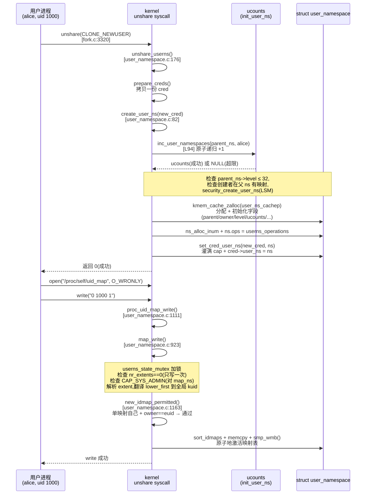

# 第八章 · user namespace:uid 映射与安全

> 篇:P1 namespace 视图隔离
> 主线呼应:前 6 章(mnt/pid/net/uts/ipc)讲的视图隔离都是"看见什么",但它们都建立在一个**默认假设**之上——容器里的进程仍是宿主上的某个 uid。这个假设在云原生多租场景里是**致命的**:如果容器里那个 `uid 0` 就是宿主的 `uid 0`,那一旦容器里的进程拿到 `CAP_SYS_ADMIN`,它对宿主内核就有完整权限,任何一处内核漏洞(逃逸 CVE)都意味着接管整机。user namespace 就是来**拆掉这个假设**的——它让"容器里的 root"和"宿主上的 root"在内核里是**两个完全不同的 kuid_t**,容器 root 在宿主可能是个无权的 `nobody`。这一章是第 1 篇的压轴,也是容器**安全**的基石。

## 核心问题

**user namespace 凭什么让"容器里的 uid 0"等于"宿主的 uid 100000"?内核用一个 `kuid_t`(全局 uid)和一张 `uid_map` 映射表,把"用户态看到的 uid"和"内核里记账的 uid"解耦;`cred->user_ns` 这个指针一变,capability 的生效范围就缩进这个 ns 里——容器里 `CAP_SYS_ADMIN` 只对这个 ns 内的资源生效,碰不到宿主的 `init_user_ns`。这张映射表怎么设计、怎么写入、怎么查找,是本章的核心。**

读完本章你会明白:

1. **kuid_t 解耦**:内核里所有 uid 不再是 `uid_t` 而是新的 `kuid_t` 类型;`cred->user_ns` 指针决定"这个 kuid 在用户态显示成什么"。这是编译期类型系统在帮内核工程师防 bug。
2. **uid_map 是一张分段映射表**:`struct uid_gid_map` 用若干 `(first, lower_first, count)` 的 extent 表示"本 ns 的 uid `[first, first+count)` ↔ 父 ns 的 uid `[lower_first, lower_first+count)`",容器里 uid 0 通过这张表被翻译成宿主的 uid 100000。
3. **`map_write` 的安全约束**:映射表**只允许写一次**;写入者要么有 `CAP_SETUID` 走特权路径,要么只能写"把自己映射成自己"(unprivileged 单映射);映射父 ns 的 uid 0 还要额外的 `CAP_SETFCAP` 校验。这是 unprivileged 容器(rootless)能跑起来的关键。
4. **capability 在 user ns 内有效**:`create_user_ns` 给新 ns 的初始 cred 灌满 `CAP_FULL_SET`,但这些 cap **只对这个 user ns 的资源生效**——`ns_capable(ns, cap)` 检查的是"在这个 ns 的祖先链上,你有没有这个 cap"。
5. ★ 对照 runc:rootless 容器(`runc run --rootless`)就是建立在 user ns 之上——一个普通用户进程用 `clone(CLONE_NEWUSER)` 创 user ns,在里面变成 uid 0,再创其它 ns(mnt/pid/net),不需要 sudo。

> **逃生阀**:如果你被 `kuid_t` / `uid_map` / `projid_map` / `verify_root_map` 一堆术语绕晕,先记住三句话就够了——① 内核里有个全局的 uid(`kuid_t`),用户看到的 uid 是 ns 局部的;② 一张 `uid_map` 表把局部 uid 翻译成全局 kuid;③ capability 绑在 `cred->user_ns` 上,容器里的 cap 出不了这个 ns。本章不要求你记住 `map_write` 的每个分支,只抓住"解耦 + 映射 + 限定"这三件事。

---

## 8.1 一句话点破

> **user namespace 把"用户态看到的 uid"和"内核里记账的全局 kuid_t"解耦,再用一张 `uid_map` 映射表把两者连起来——容器里那个 `uid 0` 在内核里是个无权的 kuid,它拥有的 `CAP_SYS_ADMIN` 只在这个 user ns 里有效,碰不到宿主。**

这是结论,不是理由。本章倒过来拆:先看朴素方案(全局 uid)为什么在多租场景下不可接受,再看 user ns 怎么用"`kuid_t` + 映射表"解耦,然后钻进 `map_write` 看映射表的安全写入约束、`make_kuid`/`from_kuid` 看双向查找,最后看 capability 怎么被关进 user ns 这个笼子。

---

## 8.2 朴素方案为什么不行:全局 uid = 容器逃逸即接管整机

先回到一个根本问题:**没有 user namespace 之前,容器是怎么处理 root 的?**

朴素方案只有一个:全局 uid。容器里跑一个 nginx,nginx 进程的 `task_struct->cred->uid` 就是宿主上 `uid 0`。容器里的 root **就是**宿主的 root。这个方案在多租场景下是灾难性的:

1. **CAP_SYS_ADMIN 等于宿主的 CAP_SYS_ADMIN**:容器里 `chmod 777 /` 改的是宿主根文件系统(如果没有 mnt ns 隔离);容器里 `mount -t nfs ...` 会让宿主内核加载 nfs 模块;容器里 `chroot` 后逃逸(历史上的 CVE-2019-5736 runc 逃逸)就直接拿到宿主 root。
2. **uid 冲突**:你给容器 A 的 nginx 分配 uid 0,给容器 B 的 mysql 也分配 uid 0,它们在宿主上是**同一个用户**,容器 A 里的进程能 `kill` 容器 B 里的进程(都是 uid 0 发的信号),容器 A 里的进程能读容器 B 拥有的文件(都是 uid 0 拥有的)。**无法做到租户隔离**。
3. **必须 root 才能起容器**:`clone(CLONE_NEWNS | CLONE_NEWPID | ...)` 在朴素方案下需要 `CAP_SYS_ADMIN`,普通用户根本起不了容器——这就是为什么早年的 Docker 必须用 root daemon(dockerd 以 root 跑),而 dockerd 一旦被打穿(CVE-2019-5736、CVE-2019-14271)就是宿主 root 级别的事故。

> **不这样会怎样**:全局 uid 方案下,容器在安全意义上**根本不成立**——它只是"一组视图被换了、资源被限额的 root 进程",容器里的 root 就等于宿主的 root,任何内核漏洞(runc/exec/namespace 创建路径的 race)/任何配置失误(挂载了宿主的 `/` 进容器)都直接是宿主接管事故。云原生时代根本不可能在这种基础上做多租。所以内核必须提供一种原语,让"容器里的 root"在内核里是一个**和宿主 root 不同的、权限被裁剪的**身份。这就是 user namespace 出现的根本动机——它是**容器安全**的基石,而不是"又一种视图隔离"。

user namespace 在 3.8(2013 年)被完整合入主线,它的设计哲学是:**身份隔离比视图隔离更根本**。前 6 章 namespace 隔离的都是"进程看见什么/用什么",而 user ns 隔离的是"进程**是谁**"——把进程的身份和权限关进一个独立的笼子。

---

## 8.3 `kuid_t` 解耦:用一个新类型把"全局 uid"从编译期钉死

要解决"容器 root = 宿主 root"的问题,直接的做法是:让内核里 uid 不再是一个简单的 `uid_t`(就是 `unsigned int`),而是一个**带命名空间语义**的新类型 `kuid_t`。这是 Linux 内核工程的一个典型做法——**用类型系统强制区分容易混淆的概念**,让编译器帮你抓 bug。

[`include/linux/uidgid.h`](../linux/include/linux/uidgid.h#L22-L51) 定义了这两个新类型:

```c
/* include/linux/uidgid.h:22-51(简化) */
#define KUIDT_INIT(value) (kuid_t){ value }
#define KGIDT_INIT(value) (kgid_t){ value }

#define GLOBAL_ROOT_UID KUIDT_INIT(0)     /* 全局 root uid */
#define GLOBAL_ROOT_GID KGIDT_INIT(0)
#define INVALID_UID     KUIDT_INIT(-1)    /* 无效 uid(映射失败返回这个) */

static inline uid_t __kuid_val(kuid_t uid)  { return uid.val; }
static inline bool  uid_eq(kuid_t l, kuid_t r)  { ... }
static inline bool  uid_valid(kuid_t uid) { return __kuid_val(uid) != (uid_t) -1; }
```

([uidgid.h:22](../linux/include/linux/uidgid.h#L22)、[uidgid.h:47-51](../linux/include/linux/uidgid.h#L47-L51))

`kuid_t` 在 [`include/linux/uidgid_types.h`](../linux/include/linux/uidgid_types.h) 里就是 `struct { uid_t val; }`,只有一个字段——但它是一个**独立类型**。这意味着内核里:

- `uid_t`(用户态看到的、可能因 ns 而变的局部 uid)和 `kuid_t`(内核全局记账的 uid)是**两种不同的类型**,编译器会警告你直接互相赋值。
- 所有需要"在内核里唯一标识一个用户"的地方(inode 的 owner、task 的 real/effective uid、capability 的检查目标)都用 `kuid_t`,而**不是** `uid_t`。
- 一个 `kuid_t` 想变成用户态看到的 `uid_t`,必须显式调 [`from_kuid(user_ns, kuid)`](../linux/kernel/user_namespace.c#L430)(L430);反过来 `uid_t` 变成 `kuid_t` 要调 [`make_kuid(user_ns, uid)`](../linux/kernel/user_namespace.c#L411)(L411)——**这两个函数都要传 `user_namespace`**,把映射表查一遍。

> **不这样会怎样**:如果内核继续用 `uid_t` 一个类型贯穿全栈,工程师在写代码时根本分不清"这个 uid 是来自用户态输入(可能是 ns 局部的)还是内核记账(必须是全局的)"。一个不经意的 `inode->i_uid = stat.uid`(把用户态传进来的 ns 局部 uid 直接当成 inode owner)就成了一个**安全漏洞**——容器里 uid 0 把自己的文件改成 uid 0,宿主上看起来就是 root 拥有。`kuid_t` 的类型系统让这种错误**在编译期就被抓到**(`kuid_t` 不能赋给 `uid_t`,反之亦然),工程师被迫显式地调 `make_kuid`/`from_kuid` 走映射表。这是"用类型设计换正确性"的典范,和第 13 本《同步原语》里把 `atomic_t` 单列一个类型、第 8 本《内存分配器》用 `tagged pointer` 区分元数据/指针是同一套思路。

钉死这件事:

> **钉死这件事**:`kuid_t` 不是"运行时多了一个字段",它是**类型系统级的隔离**——`uid_t` 是 ns 局部的用户视图,`kuid_t` 是内核全局的真相。两者转换必须经 `make_kuid`/`from_kuid` 走映射表。这是 user namespace 安全性的**编译期防线**:就算某段代码想偷懒"直接用 uid 当 kuid",编译器也会拦下来。

---

## 8.4 `struct user_namespace`:层级树 + 三张映射表

user namespace 自己也是一个**层级结构**:每个 user ns 有一个 parent,根 user ns 是 [`init_user_ns`](../linux/include/linux/user_namespace.h#L124)(系统启动时静态创建)。这个层级是 user ns 一切设计的地基——映射表把"本 ns 的 uid"翻译成"父 ns 的 uid",而不是直接翻译成全局 kuid(全局 kuid 由递归映射到底层得到)。

看 [`struct user_namespace`](../linux/include/linux/user_namespace.h#L72-L113)([user_namespace.h:72](../linux/include/linux/user_namespace.h#L72))的核心字段:

```c
/* include/linux/user_namespace.h:72(简化,仅保留与本章相关的字段) */
struct user_namespace {
    struct uid_gid_map  uid_map;        /* 本 ns 的 uid 映射表 */
    struct uid_gid_map  gid_map;        /* 本 ns 的 gid 映射表 */
    struct uid_gid_map  projid_map;     /* XFS project id 映射表 */
    struct user_namespace *parent;      /* 父 user ns */
    int                 level;          /* 距 init_user_ns 的层数 */
    kuid_t              owner;          /* 创建这个 ns 的进程在父 ns 里的 euid */
    kgid_t              group;          /* 创建者 egid */
    struct ns_common    ns;             /* ns_common 多态(回扣 P1-02) */
    unsigned long       flags;          /* USERNS_SETGROUPS_ALLOWED 等 */
    bool                parent_could_setfcap;  /* 创建者是否有 CAP_SETFCAP */
    struct ucounts      *ucounts;       /* 本 ns 的资源计数(user ns/pid ns/...的嵌套深度上限) */
    long                ucount_max[UCOUNT_COUNTS];     /* 各类 ns 数量上限 */
    long                rlimit_max[UCOUNT_RLIMIT_COUNTS];  /* rlimit 上限(NPROC/MEMLOCK/...) */
    ...
} __randomize_layout;
```

([user_namespace.h:72-113](../linux/include/linux/user_namespace.h#L72-L113))

五个字段值得记住:

1. **`parent` + `level`** —— user ns 是**层级树**。`init_user_ns.level = 0`,每 `create_user_ns` 一次 `level + 1`,内核硬性限制 `level > 32` 就拒绝创建([user_namespace.c:91](../linux/kernel/user_namespace.c#L91))——这是防 fork bomb 式的嵌套爆破。
2. **`uid_map` / `gid_map` / `projid_map`** —— 三张映射表,结构相同(都是 `struct uid_gid_map`)。本章重点看 `uid_map`,`gid_map` 完全对称,`projid_map` 是 XFS 项目配额用的(用得少)。
3. **`owner`** —— 这个 ns 的"创建者"。内核用 `owner` 做一条特殊权限规则:**一个进程只有 `uid == ns->owner` 才能往这个 ns 的 `uid_map` 写映射**(详见 8.5)。这把"谁能给一个新 ns 写映射"钉得很死——只有创建者本人。
4. **`ucounts` + `ucount_max[]`** —— 这是 5.14 引入的**层级资源计数**,记录"这个 user ns 及其后代总共创建了多少个 user ns / pid ns / net ns / 进程数 / sigpending / memlock"。防止一个 user ns 里的进程无限制地嵌套创建子 ns 把内核搞挂。回扣 [`enum ucount_type`](../linux/include/linux/user_namespace.h#L40-L58)(L40):`UCOUNT_USER_NAMESPACES` / `UCOUNT_PID_NAMESPACES` / `UCOUNT_NET_NAMESPACES` 等都有上限。
5. **`parent_could_setfcap`** —— 后面讲 `verify_root_map` 会用到(防止"把父 ns 的 uid 0 映射进本 ns")。

**映射表 `struct uid_gid_map` 的结构**——这是本章的主角之一,在 [`include/linux/user_namespace.h:17-32`](../linux/include/linux/user_namespace.h#L17-L32):

```c
/* include/linux/user_namespace.h:17-32 */
#define UID_GID_MAP_MAX_BASE_EXTENTS 5      /* 内联静态数组上限 */
#define UID_GID_MAP_MAX_EXTENTS      340    /* 动态分配数组上限 */

struct uid_gid_extent {
    u32 first;          /* 本 ns 里的起始 uid */
    u32 lower_first;    /* 父 ns 里的起始 uid */
    u32 count;          /* 这一段长度 */
};

struct uid_gid_map { /* 64 bytes -- 1 cache line */
    u32 nr_extents;
    union {
        struct uid_gid_extent extent[UID_GID_MAP_MAX_BASE_EXTENTS];   /* ≤5 段用内联数组 */
        struct {
            struct uid_gid_extent *forward;   /* >5 段动态分配,按 first 排序 */
            struct uid_gid_extent *reverse;   /* 按 lower_first 排序的反向表 */
        };
    };
};
```

([user_namespace.h:14-32](../linux/include/linux/user_namespace.h#L14-L32))

这个设计的精妙之处:

- **分段映射,而非一一映射**。映射表不是一张 `uid[N]` 的查找表(那样太占内存),而是若干段 `(first, lower_first, count)`三元组。容器最常见的映射是"容器 uid `[0, 65536)` ↔ 宿主 uid `[100000, 165536)`",**一段**就够,占一个 extent 的 12 字节。
- **64 字节,正好一个 cache line**。注释明说 `/* 64 bytes -- 1 cache line */`——映射表是热路径(`stat`/`getuid`/权限检查每次都要查),塞进一个 cache line 就不会有 false sharing。
- **≤5 段用内联数组,>5 段动态分配**。绝大多数容器 ≤5 段,无需 `kmalloc`,直接读内联数组——**零内存分配、零指针解引用**;极端场景(复杂映射)才走 `forward`/`reverse` 动态数组,而且**双向都排序好**(forward 按 `first` 排序用于 down 查找、reverse 按 `lower_first` 排序用于 up 查找),用二分查找(`bsearch`)。

映射表里一个典型的"容器 uid 0 = 宿主 uid 100000"是这样:

```
 本 ns 的 uid_map(容器里看到的):
 ┌─────────────────────────────────────────────────────────────┐
 │ nr_extents = 1                                              │
 │ extent[0]: first=0, lower_first=100000, count=65536         │
 └─────────────────────────────────────────────────────────────┘

 查找(容器进程查自己的 uid):
   容器里 uid 0 ──► map_id_down(uid_map, 0)
                  ──► 命中 extent[0](0 在 [0, 65536) 内)
                  ──► lower_first + (uid - first) = 100000 + (0 - 0) = 100000
                  ──► make_kuid 返回 kuid_t(100000)   ← 内核里记账的全局 uid

 反向查找(宿主 stat 容器内文件,要给容器进程显示):
   kuid_t(100000) ──► map_id_up(uid_map, 100000)
                  ──► 命中 extent[0](100000 在 [100000, 165536) 内)
                  ──► first + (lower_first - lower_first) = 0 + 0 = 0
                  ──► from_kuid 返回 uid 0   ← 容器里 stat 看到的 owner
```

> **所以这样设计**:`uid_map` 用"分段三元组"而非"全表",因为容器映射几乎都是连续大段(一段 `[0, 65536)` 搞定),分段表达**省内存、装得进一个 cache line**;≤5 段内联 + >5 段动态分配 + 二分查找的双引擎,是为了**绝大多数场景零开销**(直接读内联数组)+ 极端场景仍正确(动态分配 + 排序)。这是"快路径/慢路径"的典型分离,和第 8 本《内存分配器》的 per-CPU cache(fast path)→ 中心 arena(slow path)是同一套设计哲学。

---

## 8.5 `map_write`:一张表只准写一次,且写入者必须"够格"

映射表怎么写?用户态进程往 `/proc/<pid>/uid_map` 写一行 `first lower_first count` 就触发了。内核侧的入口是 [`proc_uid_map_write`](../linux/kernel/user_namespace.c#L1111)([user_namespace.c:1111](../linux/kernel/user_namespace.c#L1111)),它进一步调通用的 [`map_write`](../linux/kernel/user_namespace.c#L923)(L923):

```c
/* kernel/user_namespace.c:1111-1126(简化) */
ssize_t proc_uid_map_write(struct file *file, const char __user *buf,
                           size_t size, loff_t *ppos)
{
    struct seq_file *seq = file->private_data;
    struct user_namespace *ns = seq->private;
    struct user_namespace *seq_ns = seq_user_ns(seq);

    if (!ns->parent)
        return -EPERM;                          /* init_user_ns 不准写 */
    if ((seq_ns != ns) && (seq_ns != ns->parent))
        return -EPERM;                          /* 只准本 ns 或父 ns 的进程写 */

    return map_write(file, buf, size, ppos, CAP_SETUID,
                     &ns->uid_map, &ns->parent->uid_map);
}
```

([user_namespace.c:1111-1126](../linux/kernel/user_namespace.c#L1111-L1126))

`map_write` 是 user ns 安全的核心关卡。我们逐条看它怎么把"谁能写、写什么"钉死:

### 约束一:一张表只准写一次

```c
/* kernel/user_namespace.c:969-972 */
ret = -EPERM;
/* Only allow one successful write to the map */
if (map->nr_extents != 0)
    goto out;
```

([user_namespace.c:969-972](../linux/kernel/user_namespace.c#L969-L972))

`map->nr_extents != 0` 表示这张表**已经被写过**(已经有映射了),直接返回 `-EPERM`。这意味着:一个 user ns 的 `uid_map` 在其生命周期内**只能被设置一次**,设置后**永不可改**。

> **不这样会怎样**:如果允许反复改写 `uid_map`,会出现"运行中改变身份"的恐怖场景——一个进程本来是容器里 uid 1000(宿主 uid 101000),中途有人把 `uid_map` 改成 `0 100000 65536`,这个进程在内核里的 kuid **瞬间变成 100000**,它拥有过的文件(原本是 101000 拥有)突然变成"非自己拥有"。这会让所有基于 uid 的权限检查(inode 访问、信号传递、capability 检查)处于不确定状态,而且为攻击者提供了"先建文件,再改映射,让文件归属变化"的攻击面。**一次写入,永久冻结**是 user ns 安全的第一道铁闸。

### 约束二:写入者要有 `CAP_SYS_ADMIN`(对目标 ns 的父 ns)

```c
/* kernel/user_namespace.c:977-978 */
if (cap_valid(cap_setid) && !file_ns_capable(file, map_ns, CAP_SYS_ADMIN))
    goto out;
```

([user_namespace.c:977-978](../linux/kernel/user_namespace.c#L977-L978))

注意这里 `file_ns_capable` 检查的是**打开这个 `/proc/<pid>/uid_map` 文件的进程**(不一定是 `pid` 那个进程自己),要它在 `map_ns` 里(也就是这个 uid_map 所属的 user ns)有 `CAP_SYS_ADMIN`。但这个 cap 必须是**在父 ns 拥有的**(因为新 user ns 刚建出来还没有任何映射,谁能在里面"凭空有 cap"?答案是父 ns 有 `CAP_SYS_ADMIN` 的进程在新 ns 里也有)。

### 约束三:映射目标必须可翻译到全局 kuid

```c
/* kernel/user_namespace.c:1054-1074(简化) */
for (idx = 0; idx < new_map.nr_extents; idx++) {
    struct uid_gid_extent *e;
    u32 lower_first;

    if (new_map.nr_extents <= UID_GID_MAP_MAX_BASE_EXTENTS)
        e = &new_map.extent[idx];
    else
        e = &new_map.forward[idx];

    lower_first = map_id_range_down(parent_map, e->lower_first, e->count);

    /* Fail if we can not map the specified extent to the kernel global id space. */
    if (lower_first == (u32) -1)
        goto out;

    e->lower_first = lower_first;
}
```

([user_namespace.c:1054-1074](../linux/kernel/user_namespace.c#L1054-L1074))

这里藏着一个**非显然**的设计:`uid_map` 里 extent 的 `lower_first` 字段,用户态写的是"**父 ns 的 uid**",但内核存储时**把它翻译成了"全局 kuid(就是 `__kuid_val`)"**。为什么?

考虑三层嵌套:`init_user_ns` → `ns_A`(uid_map:`0 100000 65536`)→ `ns_B`(uid_map:`0 0 65536`)。`ns_B` 里的 uid 0,经自己的映射表变成"父 ns 的 uid 0",再经 `ns_A` 的映射表变成"全局 kuid 100000"。

如果 `map_write` 时**不做这步翻译**,而是把 `lower_first=0` 原样存进 `ns_B->uid_map`,那么每次 `make_kuid(ns_B, 0)` 都要**递归往上**走多次映射,层级越深越慢。内核的做法是:**在 `map_write` 的这一步,一次性把 `lower_first` 翻译到底(全局 kuid)**,之后 `make_kuid` 只需一次 `map_id_down` 就直接拿到全局 kuid。这是"**写入时付出代价,换取读取时 O(1)**"的典型空间换时间——`stat`/`getuid`/权限检查是热路径,每次都递归映射不可接受。

### 约束四:`new_idmap_permitted`——权限三选一

```c
/* kernel/user_namespace.c:1163-1203(简化) */
static bool new_idmap_permitted(const struct file *file,
                                struct user_namespace *ns, int cap_setid,
                                struct uid_gid_map *new_map)
{
    const struct cred *cred = file->f_cred;

    /* 1) uid_map 映射父 ns 的 uid 0,要额外校验 CAP_SETFCAP(详见 8.6) */
    if (cap_setid == CAP_SETUID && !verify_root_map(file, ns, new_map))
        return false;

    /* 2) 单条映射 + 映射的就是自己(owner)—— unprivileged 的"自己映射自己" */
    if ((new_map->nr_extents == 1) && (new_map->extent[0].count == 1) &&
        uid_eq(ns->owner, cred->euid)) {
        u32 id = new_map->extent[0].lower_first;
        if (cap_setid == CAP_SETUID) {
            kuid_t uid = make_kuid(ns->parent, id);
            if (uid_eq(uid, cred->euid))
                return true;
        }
        ...
    }

    /* 3) projid_map 不需要特权 */
    if (!cap_valid(cap_setid))
        return true;

    /* 4) 拥有 CAP_SETUID/CAP_SETGID(对父 ns),且文件 opener 也有 */
    if (ns_capable(ns->parent, cap_setid) &&
        file_ns_capable(file, ns->parent, cap_setid))
        return true;

    return false;
}
```

([user_namespace.c:1163-1203](../linux/kernel/user_namespace.c#L1163-L1203))

这是 user namespace 能支持 **rootless 容器**(普通用户跑容器,不需要 sudo)的关键。注意第 2)条:**一个普通用户**(没有 `CAP_SETUID`)**可以**写 `uid_map`,只要映射的就是自己一个人。具体场景:

- 普通用户 `alice`(uid 1000)运行 `unshare -U`(创 user ns),在新 ns 里她可以写一行 `0 1000 1` —— "把容器里的 uid 0 映射成父 ns 的 uid 1000(就是 alice 自己)"。
- 这条路径**不需要任何特权**,因为 alice 只是把"容器里的 uid 0"和"宿主上的 alice 自己"画上等号——她没有获得任何新的权限,只是把"自己这个身份"在容器里换了个号(0 而已)。
- 这就是 rootless 容器的地基:普通用户用 user ns 把自己"伪装"成容器里的 root,但这个 root 在宿主上就是 alice 本人,没有任何额外权限。

> **所以这样设计**:如果把 `uid_map` 的写入权限**完全**限定为 `CAP_SETUID`(只有 root 能写),那 user ns 就**永远是 root 的玩具**,普通用户永远跑不了容器——这违背了 user ns 的设计初衷(给 unprivileged 用户一个安全隔离容器的能力)。`new_idmap_permitted` 的"单映射自己"特例,是 user ns 在安全性和实用性之间的精确平衡:**普通用户可以创 user ns 并把自己映射进去,但绝不能映射成别人**(那就越权了)。

---

## 8.6 `verify_root_map`:把父 ns 的 uid 0 映射进来要额外校验

`new_idmap_permitted` 里有一个特别处理 —— 映射父 ns 的 uid 0 到本 ns 时,要走 [`verify_root_map`](../linux/kernel/user_namespace.c#L881)(L881)额外校验。为什么?

这要回看 `set_cred_user_ns` 给新 ns 初始 cred 灌的能力——满权 `CAP_FULL_SET`([user_namespace.c:50-51](../linux/kernel/user_namespace.c#L50-L51)):

```c
/* kernel/user_namespace.c:43-60(简化) */
static void set_cred_user_ns(struct cred *cred, struct user_namespace *user_ns)
{
    /* Start with the same capabilities as init but useless for doing
     * anything as the capabilities are bound to the new user namespace. */
    cred->securebits = SECUREBITS_DEFAULT;
    cred->cap_inheritable = CAP_EMPTY_SET;
    cred->cap_permitted   = CAP_FULL_SET;
    cred->cap_effective   = CAP_FULL_SET;
    cred->cap_bset        = CAP_FULL_SET;
    ...
    cred->user_ns = user_ns;
}
```

([user_namespace.c:43-60](../linux/kernel/user_namespace.c#L43-L60))

注释 `/* ... but useless for doing anything as the capabilities are bound to the new user namespace. */` 是关键——满权 cap **只在新 user ns 里有效**,出不了这个 ns。

但如果一个攻击者能让本 ns 的 `uid_map` 把**父 ns 的 uid 0**(全局 root)映射进来,事情就变了:他在本 ns 里运行一个 uid 0 的进程,这个进程在内核里 kuid 就是 `GLOBAL_ROOT_UID`(0),它能做什么?它能写**文件系统的 fscap**(file capabilities,`setcap cap_sys_admin+ep /bin/foo`)——fscap 是文件属性,跟着 inode 走。如果 inode 的 owner 是全局 root(kuid 0),`setcap` 写进去的 cap 在**所有** user ns 里都生效(包括父 ns / init_user_ns),这就**穿透了 user ns 的 cap 隔离**。

[`verify_root_map`](../linux/kernel/user_namespace.c#L881-L921)(L881-L921)就是来堵这个洞的:任何把父 ns uid 0 映射进来的尝试,要么要求写入者有 `CAP_SETFCAP`(对父 ns),要么要求创建这个 ns 的父 ns 进程当时就有 `CAP_SETFCAP`(`parent_could_setfcap` 字段记录)。普通用户不可能满足这两个条件,所以**普通用户绝对无法把全局 root 映射进自己的 user ns**。

> **钉死这件事**:user ns 的 cap 隔离有一个微妙的"穿透点"——fscap(文件 capability)。如果父 ns 的 uid 0 被映射进本 ns,本 ns 里的进程就能写 fscap 到一个全局 root 拥有的 inode,这个 fscap 在父 ns 里也生效——等于"通过 user ns 间接获得了父 ns 的 cap"。`verify_root_map` 堵的就是这个洞:映射父 ns uid 0 要 `CAP_SETFCAP`,普通用户拿不到,所以无法穿透。这是 user ns 安全模型里非常细但**至关重要**的一笔——你能看出,这里的每一个分支都是某个 CVE 的影子。

---

## 8.7 `make_kuid`/`from_kuid`:双向查找,快路径 inline,慢路径 bsearch

映射表建好后,每次 uid 转换都走 [`make_kuid`](../linux/kernel/user_namespace.c#L411)([L411](../linux/kernel/user_namespace.c#L411),用户态 uid → 全局 kuid)或 [`from_kuid`](../linux/kernel/user_namespace.c#L430)([L430](../linux/kernel/user_namespace.c#L430),反向):

```c
/* kernel/user_namespace.c:411-435(简化) */
kuid_t make_kuid(struct user_namespace *ns, uid_t uid)
{
    return KUIDT_INIT(map_id_down(&ns->uid_map, uid));
}
EXPORT_SYMBOL(make_kuid);

uid_t from_kuid(struct user_namespace *targ, kuid_t kuid)
{
    return map_id_up(&targ->uid_map, __kuid_val(kuid));
}
EXPORT_SYMBOL(from_kuid);
```

([user_namespace.c:411-435](../linux/kernel/user_namespace.c#L411-L435))

两个函数本身都很薄,真正的逻辑在 [`map_id_range_down`](../linux/kernel/user_namespace.c#L315)([L315](../linux/kernel/user_namespace.c#L315))和 [`map_id_up`](../linux/kernel/user_namespace.c#L378)([L378](../linux/kernel/user_namespace.c#L378)):

```c
/* kernel/user_namespace.c:315-333(简化) */
static u32 map_id_range_down(struct uid_gid_map *map, u32 id, u32 count)
{
    struct uid_gid_extent *extent;
    unsigned extents = map->nr_extents;
    smp_rmb();   /* 读屏障:先读 extent 数据,再读 nr_extents 配对(map_write 的 smp_wmb) */

    if (extents <= UID_GID_MAP_MAX_BASE_EXTENTS)
        extent = map_id_range_down_base(extents, map, id, count);   /* ≤5 段:线性扫描内联数组 */
    else
        extent = map_id_range_down_max(extents, map, id, count);    /* >5 段:bsearch */

    /* Map the id or note failure */
    if (extent)
        id = (id - extent->first) + extent->lower_first;   /* 命中:做线性变换 */
    else
        id = (u32) -1;                                     /* 未命中:返回 -1(无效) */

    return id;
}
```

([user_namespace.c:315-333](../linux/kernel/user_namespace.c#L315-L333))

注意三个细节:

1. **快路径线性扫描(`map_id_range_down_base`),慢路径二分查找(`map_id_range_down_max`)**——对应 `uid_map` 的"≤5 段内联数组 vs >5 段动态数组"两种存储。绝大多数容器 ≤5 段,走的是 `map_id_range_down_base`,几条汇编指令搞定。
2. **变换是线性的**:`(id - extent->first) + extent->lower_first`。映射表存的是"段的起点和长度",中间的 uid 用简单的加减法完成映射——**O(1)** 找到段、O(1) 算出结果。
3. **`smp_rmb()` 读屏障**:这是 user ns 安全性的**并发关键**。`map_write` 写入时用 `smp_wmb()` 保证"先写 extent 数据,再写 `nr_extents`";`map_id_range_down` 读取时用 `smp_rmb()` 保证"先读 `nr_extents`,再读 extent 数据"——**配对的读写屏障**,确保读者永远不会看到"nr_extents 已增加但 extent 数据还没写完"的中间状态。`map_write` 的注释明说([user_namespace.c:946-964](../linux/kernel/user_namespace.c#L946-L964)):

```c
        /*
         * The userns_state_mutex serializes all writes to any given map.
         *
         * Any map is only ever written once.
         *
         * An id map fits within 1 cache line on most architectures.
         *
         * On read nothing needs to be done unless you are on an
         * architecture with a crazy cache coherency model like alpha.
         *
         * There is a one time data dependency between reading the
         * count of the extents and the values of the extents.  The
         * desired behavior is to see the values of the extents that
         * were written before the count of the extents.
         *
         * To achieve this smp_wmb() is used on guarantee the write
         * order and smp_rmb() is guaranteed that we don't have crazy
         * architectures returning stale data.
         */
```

这里有个**关键的并发技巧**:`map_write` 持有 `userns_state_mutex`(写互斥),但 `map_id_range_down`/`map_id_up` **完全无锁**——读者不拿任何锁就能查映射表。为什么 sound?

- **映射表只写一次**:第一次写完后 `map->nr_extents` 就不再变化(后续写直接 `-EPERM`)。所以读者要么看到 `nr_extents == 0`(还没写,所有 uid 映射失败),要么看到完整写好的 extent 数组——**不存在"写到一半"的中间状态**。
- **写屏障 + 读屏障**:即使在不那么强的内存模型上(alpha 那种),`smp_wmb()`/`smp_rmb()` 配对也保证了"extent 数据的写先于 `nr_extents` 的写对其它 CPU 可见,`nr_extents` 的读先于 extent 数据的读"。读者读到 `nr_extents > 0` 时,extent 数据必定已对它可见。
- **一个 cache line**:整张 `uid_map`(≤5 段时)就在 64 字节内,同一个 cache line——**写时原子地刷整个 cache line**,读者要么看到旧的(nr_extents=0),要么看到新的(完整 5 段),不会读到撕裂。

这是"**写入时加锁,读取时无锁**"的典范,和第 13 本《同步原语》里的 seqlock 是同一思路(seqlock 也是"写时加锁 + 版本号奇偶切换,读时无锁 + 重试")——只不过 user ns 因为"只写一次",连版本号都不需要。

> **反面对比**:如果读者也拿 `userns_state_mutex`,那 `stat`/`getuid`/每次 capability 检查都会去抢这把全局锁,系统开销爆炸。如果完全不加锁也不加屏障,在弱内存模型(arm64/powerpc)上读者可能看到"nr_extents=1 但 extent[0] 数据还没刷过来"的中间状态,读到垃圾数据——这本身就是一个安全漏洞(把容器里的 uid 0 错误地映射成了别的 kuid)。`smp_wmb()`+`smp_rmb()` 配对 + 一个 cache line,把"无锁读"做到了 sound——这是 user ns 的并发美学。

还有一个易错点要拎出来:映射**失败**时返回 `(u32)-1`。调用方必须用 [`uid_valid(kuid)`](../linux/include/linux/uidgid.h#L103) 检查(`INVALID_UID` 就是 `(kuid_t){ -1 }`)。对应的 [`from_kuid_munged`](../linux/kernel/user_namespace.c#L455)(L455)是另一个变体——映射失败时返回 `overflowuid`(一般是 65534,即 `nobody`)而不是 -1。`from_kuid_munged` 用在 `stat`/`getuid` 这种**不能失败**的系统调用上:容器里看到一个 kuid 在自己 ns 没映射时,显示成 `nobody` 而不是报错——这就是"容器里 root 看宿主进程,显示成 nobody"现象的来源。

> **钉死这件事**:`make_kuid`/`from_kuid` 是 user ns 的双向翻译接口,前者把 ns 局部 uid 变成内核全局 kuid(写入时已预翻译到底,所以 O(1)),后者反向。映射失败返回 `INVALID_UID`,调用方要检查;`from_kuid_munged` 是"不能失败"的变体,失败时 munge 成 `overflowuid`(nobody)——**这就是容器里看到的 `nobody` 现象的内核源头**。

---

## 8.8 capability 被关进 user ns:`ns_capable` 的祖先链检查

到这里,我们已经讲完了 uid 映射。但 user ns 的另一半——**capability 的范围限定**——同样关键。前 7 章 namespace 隔离的都是"看见什么",user ns 隔离的是"**能干什么**"。

Linux 的 capability 模型把 root 的权限切成 ~40 个细粒度 cap(`CAP_SYS_ADMIN`/`CAP_NET_ADMIN`/`CAP_SYS_PTRACE`/...)。没有 user ns 时,cap 是全局的——你有 `CAP_SYS_ADMIN` 就是**对整个系统**的 sys admin。有了 user ns,cap 被绑进 `cred->user_ns`,变成**对某个 user ns 及其后代**的 sys admin。

关键机制在 [`create_user_ns`](../linux/kernel/user_namespace.c#L82)([L82](../linux/kernel/user_namespace.c#L82))最后一步调 `set_cred_user_ns`(我们前面看过):

```c
/* kernel/user_namespace.c:161-162(节选) */
    set_cred_user_ns(new, ns);
    return 0;
```

([user_namespace.c:161](../linux/kernel/user_namespace.c#L161))

`set_cred_user_ns` 把新 cred 的 cap 灌满(`CAP_FULL_SET`),**同时把 `cred->user_ns` 指向新建的 user ns**。这两步合起来就是:user ns 的初始 cred 有所有 cap,**但这些 cap 的作用域被钉死在这个新 user ns 里**。

权限检查走 [`ns_capable`](../linux/include/linux/capability.h#L149)(定义在 capability.h,L149)——它检查的是"当前 cred 有没有 `cap`,且这个 `cap` 在目标 `ns` 的祖先链上有效"。具体逻辑(简化):

```c
/* 简化示意(非源码原文):ns_capable 的内核实现 */
bool ns_capable(struct user_namespace *ns, int cap)
{
    return security_capable(current_cred(), ns, cap, CAP_OPT_NONE) == 0;
}
```

[capability.h:149](../linux/include/linux/capability.h#L149)

进一步到 LSM 层(Linux Security Module),核心检查规则是:**当前 cred 拥有 `cap`,且 `cred->user_ns` 是 `ns` 或 `ns` 的后代**。也就是说:

- 在 `ns_A` 里(cred->user_ns == ns_A),调 `ns_capable(ns_A, CAP_SYS_ADMIN)` —— 通过(cap 在自己 ns 内有效)。
- 在 `ns_A` 里,调 `ns_capable(ns_A->parent, CAP_SYS_ADMIN)` —— **失败**(cap 在父 ns 不有效)。
- 在 `ns_A` 里,调 `ns_capable(ns_A->child, CAP_SYS_ADMIN)` —— 通过(对后代 ns,祖先的 cap 有效)。

这就解释了为什么 user ns 里的容器进程有 `CAP_SYS_ADMIN` 但**碰不到宿主**:

- 容器进程想 `mount -t nfs ...` —— 内核检查 `ns_capable(init_user_ns, CAP_SYS_ADMIN)`,容器 cred 的 user_ns 是容器 ns,不是 init_user_ns 的后代(相反,init_user_ns 是它的祖先),**失败**。
- 容器进程想改自己的 mnt ns(`mount`/`umount`)—— 内核检查 `ns_capable(container_user_ns, CAP_SYS_ADMIN)`,cap 在自己 ns 内有效,**通过**。

> **钉死这件事**:capability 在 user ns 模型下不再是"全局权限",而是"**对某个 user ns 的祖先链**有效的权限"。`cred->user_ns` 这一个指针,把进程的全部 cap 关进了一个笼子——这个笼子外的任何 `ns_capable` 检查都会失败。这就是为什么容器里 root(满 cap)对宿主几乎无能为力:**cap 是满的,但 cap 的作用域被裁剪了**。

一个具体的"容器里 root"的例子,把前面几节串起来:

```
 宿主用户 alice(uid 1000)启动 rootless 容器:

  ┌─ init_user_ns (level=0) ─────────────────────────────────┐
  │  uid_map: 空(init 不需要)                              │
  │  alice 进程:cred->uid = kuid(1000),无任何 cap         │
  │                                                          │
  │  alice 执行:unshare -U (CLONE_NEWUSER)                  │
  │     │                                                    │
  │     ▼                                                    │
  │  create_user_ns → 新 ns(假设 ns_C,level=1)            │
  │     owner = alice(kuid 1000)                             │
  │     新 cred:cap_full + user_ns = ns_C                    │
  │                                                          │
  │  alice 写 /proc/self/uid_map: "0 1000 1"                │
  │     (单映射自己,unprivileged 路径,无需特权)           │
  │                                                          │
  │  现在 ns_C 里:                                          │
  │  ┌─ ns_C (level=1,owner=kuid(1000)) ─────────────────┐ │
  │  │  uid_map: extent[0] = {first=0, lower_first=1000, │ │ │
  │  │                        count=1}                   │ │
  │  │  容器进程:                                         │ │
  │  │     cred->uid      = kuid(1000)  (内核全局 kuid)  │ │
  │  │     from_kuid(ns_C, kuid(1000)) = 0 (用户态看到) │ │
  │  │     cred->cap_effective = CAP_FULL_SET             │ │
  │  │     cred->user_ns     = ns_C                       │ │
  │  │                                                     │ │
  │  │  容器里 id 命令显示:uid=0(root) gid=0(root)     │ │
  │  │  容器里进程看自己:有所有 cap                       │ │
  │  │  容器里进程 ns_capable(init_user_ns, ...) ──► 失败 │ │
  │  │  容器里进程 ns_capable(ns_C, ...)       ──► 通过 │ │
  │  │  宿主上 ps 看这个进程:uid=1000(alice)             │ │
  │  │  宿主上 stat 容器内文件:owner=1000(alice 拥有)   │ │
  │  └─────────────────────────────────────────────────────┘ │
  └──────────────────────────────────────────────────────────┘

 这就是"容器里 root = 宿主 alice"的真相:
  - 容器内:uid 0,满 cap,是 root
  - 宿主上:uid 1000,普通用户,做不了任何 root 才能做的事
  - 一切靠:uid_map 把局部 uid 0 翻译成全局 kuid 1000
            + cap 绑在 cred->user_ns(= ns_C)上,出不了这个 ns
```

---

## 8.9 嵌套 user ns 与 ucounts 限额

user ns 可以无限嵌套——`create_user_ns` 时父 ns 的 level+1。内核用两层机制防止嵌套失控:

**第一层:level ≤ 32 硬上限**([user_namespace.c:90-92](../linux/kernel/user_namespace.c#L90)):

```c
/* kernel/user_namespace.c:90-92 */
ret = -ENOSPC;
if (parent_ns->level > 32)
    goto fail;
```

**第二层:`ucounts` 计数**。每个 user ns 维护一个 `ucounts` 结构,记录"这个 user ns 及其后代"创建的各类 ns 数量。[`inc_user_namespaces`](../linux/kernel/user_namespace.c#L33)(L33)在 `create_user_ns` 开头增加计数:

```c
/* kernel/user_namespace.c:33-36 */
static struct ucounts *inc_user_namespaces(struct user_namespace *ns, kuid_t uid)
{
    return inc_ucount(ns, uid, UCOUNT_USER_NAMESPACES);
}
```

([user_namespace.c:33-36](../linux/kernel/user_namespace.c#L33-L36))

`inc_ucount` 内部会沿 `parent` 链一路往上,在每个祖先的 `ucounts->ucount[UCOUNT_USER_NAMESPACES]` 上 `atomic_long_inc`,并和 `ucount_max[UCOUNT_USER_NAMESPACES]` 比较——超过就拒绝。这意味着:一个 user ns 里能创建的后代 user ns 数量,**沿祖先链累加**,根上有上限(默认值在 `/proc/sys/user/max_user_namespaces`)。这套机制同样管 pid ns / net ns / mnt ns / 进程数 / sigpending / memlock 等所有可能被滥用的资源。

> **不这样会怎样**:如果没有 `ucounts` 限额,一个普通用户可以无限制地 `unshare -U` 嵌套创建 user ns,每个 ns 都有 `struct user_namespace`(几百字节)+ `ucounts` + 三张映射表的动态数组——一个 fork bomb 式的"ns bomb"就能把宿主内存吃光。`ucounts` 把"嵌套深度(level ≤ 32)"和"总量(ucount_max)"双管齐下,让 unprivileged 用户也不能滥用 user ns。这是 user ns 安全模型的**资源维度**防御——前几节讲的是"权限维度"防御,这节讲的是"资源维度",两者合起来才 sound。

一个完整的"创建 user ns"时序:



---

## 8.10 技巧精解:`uid_map` 的快慢双引擎 + 无锁读取

这一章最值得单独拆透的技巧,是 `uid_map` 的**数据结构 + 并发读取**设计。它把"快路径/慢路径分离"+"一次性写入 + 无锁读取 + 读写屏障"两件事揉在一起,是内核工程美学的一个小样本。

### 技巧一:`uid_map` 的 union 双引擎——内联数组 vs 动态数组二分

回顾 [`struct uid_gid_map`](../linux/include/linux/user_namespace.h#L23-L32) 的 union 设计:

```c
struct uid_gid_map { /* 64 bytes -- 1 cache line */
    u32 nr_extents;
    union {
        struct uid_gid_extent extent[UID_GID_MAP_MAX_BASE_EXTENTS];   /* 5 段内联 */
        struct {
            struct uid_gid_extent *forward;   /* >5 段:动态分配,按 first 排序 */
            struct uid_gid_extent *reverse;   /* 按 lower_first 排序(反向查找用) */
        };
    };
};
```

为什么是这样一个 union?——为了**绝大多数常见场景(≤5 段)零开销**:

| 场景 | 存储 | 查找算法 | 单次查找代价 | 内存分配 |
|------|------|----------|--------------|----------|
| ≤5 段(99% 容器) | 内联数组 `extent[5]` | [`map_id_range_down_base`](../linux/kernel/user_namespace.c#L296) 线性扫描 | 5 次比较 + 几条加减 | 无(就在结构体里) |
| >5 段(复杂映射) | 动态 `forward` + `reverse` 指针 | [`map_id_range_down_max`](../linux/kernel/user_namespace.c#L278) `bsearch` | O(log N) 二分,340 段最多 9 次比较 | 写时 `kmalloc_array(340, ...)` + `kmemdup` |

注意 `forward` 和 `reverse` 是**同一份 extent 数据的两个排序副本**——forward 按 `first` 排序用于 down 查找(本 ns uid → 全局 kuid),reverse 按 `lower_first` 排序用于 up 查找(全局 kuid → 本 ns uid)。排序在 [`sort_idmaps`](../linux/kernel/user_namespace.c#L846)(L846)里一次性完成(写入时付出代价),读取时永远不需要排序。

> **反面对比**:如果只用一张未排序的动态数组,down 查找和 up 查找都得 O(N) 线性扫描——340 段的极端场景下,每次 `stat` 都要扫几百次,容器密度高的机器上不可接受。如果只保留一份排序(比如只排 forward),up 查找就得反向扫——同样慢。**两份排序副本是经典的"空间换时间"**:用两倍内存换双向 O(log N) 查找。这和数据库索引的"主键索引 + 二级索引"是同一思路——你想按哪个字段查,就为它建一份有序副本。
>
> 再看 union 的巧思:≤5 段时直接用内联数组(零分配、零解引用、一个 cache line 装下),>5 段时升级成动态指针——这种"小用内联、大用动态"的 union 是 Linux 常见的"小对象优化"模式,和 `struct bio` 的内联 vec、`struct sk_buff` 的内联 data 是同一套设计哲学。和第 8 本《内存分配器》的 thread cache(fast path)→ central heap(slow path)是高度同构的——都是"先试便宜的快路径,够用就完事;不够再走慢路径分配"。

### 技巧二:写入时加锁,读取时无锁——smp 屏障配对 + 一个 cache line

`map_write` 持有 [`userns_state_mutex`](../linux/kernel/user_namespace.c#L965)(L965),但 [`map_id_range_down`](../linux/kernel/user_namespace.c#L315)/[`map_id_up`](../linux/kernel/user_namespace.c#L378) **完全不拿锁**——热路径(`stat`/`getuid`/权限检查)的零开销由以下三件事保证:

1. **映射表只写一次**(L971 `if (map->nr_extents != 0) goto out`)。`map_write` 的第一次成功写入后,`map->nr_extents` 在 user ns 的整个生命周期内不再变化(后续写直接 `-EPERM`)。这把"并发写"问题从根本上消灭了——没有"写写冲突",只有"读写并发"。
2. **写入用 `smp_wmb()` 配对读取用 `smp_rmb()`**(L1092 + L319):
   ```c
   /* 写:map_write */
   smp_wmb();                              /* L1092 */
   map->nr_extents = new_map.nr_extents;   /* 先写 extent 数据,后写 count(配 wmb) */

   /* 读:map_id_range_down */
   unsigned extents = map->nr_extents;
   smp_rmb();                              /* L319:先读 count,后读 extent 数据(配 rmb) */
   ```
   `smp_wmb()` 保证"extent 数据的写"在"`nr_extents` 的写"之前对其它 CPU 可见;`smp_rmb()` 保证读者"先读 `nr_extents`,看到 >0 后再读 extent 数据"——配对的屏障确保读者**永远看不到"count 已增但 extent 没写完"的中间状态**。
3. **整张映射表 ≤5 段时正好 64 字节(一个 cache line)**——注释 `/* 64 bytes -- 1 cache line */` 明说。一个 cache line 的写入对其它 CPU 是**原子可见**的(要么看到旧的整个 cache line,要么看到新的整个 cache line,没有撕裂)。>5 段走动态分配时,虽然 forward 指针的写入不再是整个 cache line,但 `nr_extents` 字段仍在一个固定 cache line 内,加上 `smp_wmb()`+`smp_rmb()` 配对,仍然 sound。

> **反面对比**:如果读者也拿 `userns_state_mutex`,那 `stat`/`getuid`/权限检查全部抢一把全局锁,容器密度高(一个节点几百个容器)时这把锁就是系统瓶颈。如果完全无屏障,在 arm64/powerpc 这种弱内存模型上,读者可能看到"`nr_extents=1` 但 `extent[0]` 数据还没刷到自己的 cache",读到垃圾数据——这本身是安全漏洞(把 uid 错误地翻译成另一个 kuid,可能让进程获得非自己应有的权限)。`smp_wmb()`+`smp_rmb()` 配对 + 一个 cache line 的存储设计,把"无锁读取"做到了 sound——这是 user ns 并发路径的精髓。
>
> 这种"**写入时加锁 + 一次性写入 + 读写屏障 + 一个 cache line**"的模式,是第 13 本《同步原语》里 seqlock 的"只写一次"特例——seqlock 是"写时加锁 + 版本号奇偶切换,读时无锁 + 版本号不一致则重试",user ns 因为"只写一次",连版本号和重试都不需要,直接 `smp_wmb()`/`smp_rmb()` 配对就够了。它是 seqlock 思想在"状态机单调"场景下的极简版本。和上一本《Linux 调度器》里 `rq->clock` 的读取(seqlock 保护)、第 9 本《Linux mm》里 page flag 的无锁读取是同一类技巧——**能用单调性 + 屏障解决的,就不要上锁**。

> **钉死这件事**:`uid_map` 的设计是 user ns 安全性的基石,也是并发美学的样本——① 分段映射(`extent[]`)省内存,装进一个 cache line;② ≤5 段内联 / >5 段动态二分的快慢双引擎,99% 容器走快路径零开销;③ 写一次冻结 + `smp_wmb()`/`smp_rmb()` 配对 + 一个 cache line,实现"写入加锁、读取无锁"的零开销并发读。这三个设计叠加,让 user ns 在热路径(`stat`/`getuid`/权限检查)上几乎无可测开销——这就是为什么 user ns 能成为云原生容器的事实基石。

---

## 8.11 ★ 对照 runc:rootless 容器的内核地基

内核提供 user ns + `uid_map` 这套原语,用户态运行时(runc)拿它来做什么?——做 **rootless 容器**(`runc run --rootless` 或 Podman/Fuse-OverlayFS 生态)。一个普通用户(非 root)能不靠 sudo 跑一个完整的容器,底层就是 user ns 在撑:

| runc 步骤 | 内核能力 | 本章锚点 |
|----------|----------|---------|
| 1. `clone(CLONE_NEWUSER)` 创 user ns | `create_user_ns` | [user_namespace.c:82](../linux/kernel/user_namespace.c#L82) |
| 2. 父进程(普通用户)写 `/proc/<child>/uid_map` | `proc_uid_map_write` → `map_write` | [user_namespace.c:1111](../linux/kernel/user_namespace.c#L1111) |
| 3. 写 `/proc/<child>/gid_map`、`/proc/<child>/setgroups`(先 deny) | `proc_gid_map_write` / `proc_setgroups_write` | [user_namespace.c:1128](../linux/kernel/user_namespace.c#L1128) / [L1216](../linux/kernel/user_namespace.c#L1216) |
| 4. 子进程在新 user ns 里 uid=0,有 cap_full | `set_cred_user_ns` | [user_namespace.c:43](../linux/kernel/user_namespace.c#L43) |
| 5. 子进程再 `clone(CLONE_NEWNS\|CLONE_NEWPID\|CLONE_NEWNET)` 创其它 ns——这些原本要 `CAP_SYS_ADMIN` 的操作,user ns 内 cap 即可 | `copy_namespaces` + `ns_capable` | [nsproxy.c:151](../linux/kernel/nsproxy.c#L151) |
| 6. 写 `cgroup.procs` 把自己迁进 cgroup(v2 delegate 到 user ns) | `cgroup_attach_task` | [cgroup.c:2866](../linux/kernel/cgroup/cgroup.c#L2866) |

runc 的 [`libcontainer/internal/userns/userns_maps_linux.go`](../runc/libcontainer/internal/userns/userns_maps_linux.go) 专门负责写映射文件,核心循环(L134-135)就是 `uid_map` 和 `gid_map` 两行写入。Podman、Docker rootless mode、Kubernetes 的 UserNS beta(1.25+)都是建立在这套内核能力之上的。

老一点的 Docker 默认**不**用 user ns(`--userns-remap` 选项才开启),原因有二:① 历史包袱,Docker 早期容器里 root=宿主 root;② user ns 启用后,容器里看到的文件 owner 和宿主上不一致(容器里 root 拥有,宿主上 alice 拥有),需要 remap 挂载层(overlayfs with uid shift)配合,工程上不平凡。但 K8s 1.25 引入 UserNS beta、Podman 默认用 user ns——趋势是不可逆的,**rootless + user ns 是云原生安全的未来**。

---

## 章末小结

这一章是第 1 篇(视图隔离)的压轴,也是容器**安全**的基石。我们没有讲又一种"换视图"的 namespace,而是讲了 user ns 怎么用"**类型解耦 + 映射表 + cap 作用域**"三件套,把"容器里 root"在内核里变成一个权限被裁剪的身份。

1. **`kuid_t` 解耦**:`uid_t`(ns 局部)和 `kuid_t`(全局)是两个类型,转换必须走 `make_kuid`/`from_kuid`——编译期防线,内核工程师想偷懒都做不到。
2. **`uid_map` 映射表**:分段三元组 `(first, lower_first, count)`,≤5 段内联进一个 cache line,>5 段动态分配 + 双向排序二分查找。`map_write` 把 `lower_first` 写入时预翻译成全局 kuid,让读取 O(1)。
3. **`map_write` 安全约束**:只写一次、CAP_SYS_ADMIN 校验、`lower_first` 必须在父 ns 可映射、`new_idmap_permitted` 三选一(特权 / 自己映射自己 / projid 无特权)。`verify_root_map` 堵住"映射父 ns uid 0 → 通过 fscap 穿透"的漏洞。
4. **无锁读取**:`map_write` 加 `userns_state_mutex` + `smp_wmb()`,读者 `map_id_range_down` 完全无锁 + `smp_rmb()` 配对 + 一个 cache line——读取零开销。
5. **cap 关进 user ns**:`cred->user_ns` 这一个指针把所有 cap 的作用域钉死。`ns_capable(ns, cap)` 检查祖先链,容器 cap 出不了自己的 user ns。
6. ★ 对照 runc:rootless 容器就是普通用户用 `CLONE_NEWUSER` 创 user ns、写 uid_map 把自己映射成容器里的 root、再在新 user ns 内(有 cap)创其它 ns 跑容器。Podman / K8s UserNS / Docker `--userns-remap` 都建立在 user ns 之上。

本章服务"视图 vs 资源"二分法的**视图(安全)**那一面——它不是又一种"看见什么"的视图隔离,而是"**你是谁**"的身份隔离。把 user ns 和前 6 章(mnt/pid/net/uts/ipc)合起来,容器才能真正做到:**视图被隔离、资源被限额、身份被裁剪**,三面夹击才是一个 sound 的容器。

### 五个"为什么"清单

1. **为什么 user ns 是容器安全的基石?** 没有 user ns,容器里 root 就是宿主 root,任何内核漏洞或配置失误都意味着宿主接管;有了 user ns,容器 root 在内核里是个权限被裁剪的身份,cap 出不了 user ns。所有 rootless 容器(Podman / K8s UserNS)都建立在 user ns 之上。
2. **`kuid_t` 和 `uid_t` 为什么要分开?** `uid_t` 是 ns 局部(用户态看到的),`kuid_t` 是全局(内核记账)。类型分开让编译器帮你抓"把 ns 局部 uid 当全局用"的 bug——编译期防线,比运行时检查更早更可靠。
3. **`uid_map` 为什么是分段而不是一一映射?** 容器映射几乎都是连续大段(如 `0 100000 65536` 一段),分段表达省内存、装进一个 cache line、查找 O(1)。一一映射的表反而占内存且查找更慢。
4. **为什么 `map_write` 只允许写一次?** 防止"运行中改变身份"——中途改 `uid_map` 会让已有文件的归属和权限检查进入不确定状态,而且为攻击者提供"先建文件再改映射让归属变化"的攻击面。一次写入永久冻结是安全的第一道铁闸。
5. **容器里的 root 为什么对宿主无能为力?** cap 绑在 `cred->user_ns` 上,容器 cap 出不了自己的 user ns。容器里 `CAP_SYS_ADMIN` 只在容器 user ns 内有效,任何触碰宿主的操作(改宿主文件、加载内核模块、操作宿主网卡)都要 `ns_capable(init_user_ns, ...)`,容器 cred 不是 init_user_ns 的祖先,必然失败。

### 想继续深入往哪钻

- 源码主干:[`kernel/user_namespace.c`](../linux/kernel/user_namespace.c) 全文 ~1400 行,建议顺着读——`create_user_ns`@L82 → `set_cred_user_ns`@L43 → `map_write`@L923 → `map_id_range_down`@L315 → `make_kuid`@L411 / `from_kuid`@L430 → `new_idmap_permitted`@L1163 → `verify_root_map`@L881 → `userns_install`@L1339。
- 头文件:[`include/linux/user_namespace.h`](../linux/include/linux/user_namespace.h) 的 `struct user_namespace`@L72 + `struct uid_gid_map`@L23;[`include/linux/uidgid.h`](../linux/include/linux/uidgid.h) 的 `kuid_t` 类型与 `KUIDT_INIT` 宏。
- LSM 层:`security/commoncap.c`(sparse 树未解压,可在线读 6.9 源码)的 `cap_capable`——这是 `ns_capable` 的实际检查函数,它判断"cred->user_ns 是不是 target ns 或其后代"。
- 观测与实验:`cat /proc/self/uid_map` 看自己 user ns 的映射(普通用户在 init_user_ns 里看到的是 `0 0 4294967295`,全映射);`unshare -U -r` 创 user ns 并把自己映射成 root,然后 `cat /proc/self/uid_map` 看 `0 1000 1`;`podman run --userns=keepuid` 看真实 rootless 容器的映射。
- 延伸阅读:`Documentation/admin-guide/cgroup-v2.rst`(cgroup 委派给 user ns)、LWN 系列文章 "User namespaces"(Jonathan Corbet,2012~2022)、CVE-2014-7975 / CVE-2016-3135(user ns 相关历史漏洞,每个都对应一个 `map_write`/`verify_root_map` 的分支)。

### 引出下一章

第 1 篇(7 章 namespace)到此结束——nsproxy 总入口(P1-02)→ mnt/pid/net/uts/ipc 5 种视图 → user ns 压轴安全。你已经看清"容器里**看见什么**、**是谁**"是怎么被换的。但前面讲的所有"换 nsproxy 指针"的动作,都是从用户态发起的——`clone(CLONE_NEW*)`/`unshare`/`setns`。下一篇(P2)我们换一个完全独立的子系统——cgroup,它解决另一面的问题:**进程能用多少**。从 P2-09 的 `css_set` 去重表、P2-10 的 `cgroup_attach_task` 四步迁移开始,我们正式进入资源控制。读完第 2 篇,你才能把"视图 vs 资源"这两面完整拼起来,然后在第 3 篇(P3-15~17)看运行时怎么把它们组装成一个真正的容器。
