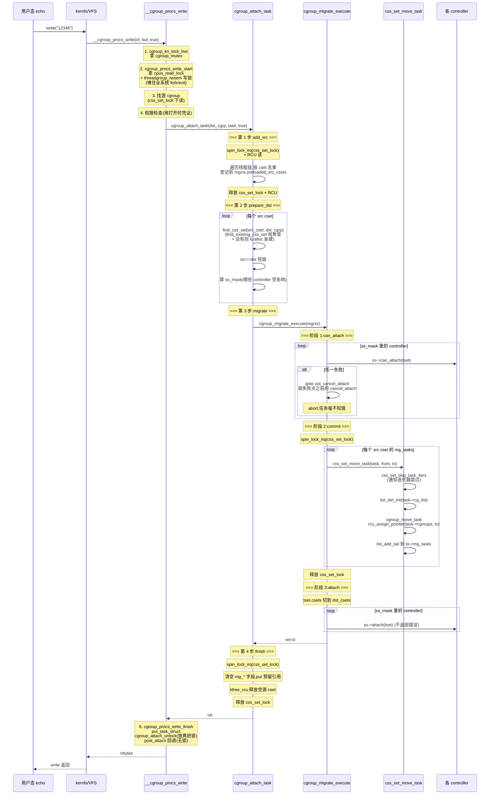

# 第十章 · cgroup_attach_task:进程怎么迁进 cgroup

> 篇:P2 cgroup 资源控制
> 主线呼应:上一章把 cgroup v2 的**骨架**立起来了——一棵统一树(`cgrp_dfl_root`)、一张去重表(`css_set`)、一张函数指针表(`cgroup_subsys`)。但那都是**静态结构**,告诉你"一个任务此刻属于哪个 cgroup"由哪些字段决定,没告诉你"**一个任务怎么从一个 cgroup 换到另一个 cgroup**"。这一章就拆这个动作:你敲 `echo 12345 > /sys/fs/cgroup/mycontainer/cgroup.procs`,内核里那条长达几百行的迁移链是怎么走的。乍看只是"换一个 `task_struct->cgroups` 指针",实际却要动用**三把锁**(`cgroup_mutex` + `cgroup_threadgroup_rwsem` + `css_set_lock`)、**四步协议**(add_src → prepare_dst → migrate → finish)、**两层回调**(`can_attach`/`attach`/`cancel_attach`/`post_attach`),还得跟并发的 fork/exit/迭代器协调。讲透这一章,你才能回答几个真问题:为什么不能直接 `task->cgroups = new_cset`?为什么迁一个进程要把整个系统的 fork/exit 都堵住?为什么迁移要拆四步、不能一锅烩?——这是 cgroup v2 的**动态核心**,后面所有 controller(cpu.max throttle、memcg charge、pids 限流)的 `->attach()` 回调,都在这条迁移链的某一拍上挂车。

## 核心问题

**一次 `echo $PID > cgroup.procs`,内核到底走了哪条链?为什么把一个任务换进新 cgroup 不能是"一行指针赋值"——它在 fork/exit 并发下会撞什么墙?为什么要拆成"add_src → prepare_dst → migrate → finish"四步,这四步和数据库里的"两阶段提交"为什么是同一套思路?`find_css_set` 凭什么能让"目标 css_set"被复用,而不是每次迁移都新建一个?为什么迁移过程中要把任务先挪到 `mg_tasks` 这个"过渡队列",而不是直接改 `task->cgroups`?**

读完本章你会明白:

1. 写 `cgroup.procs` 的完整入口链:[`cgroup_procs_write`](../linux/kernel/cgroup/cgroup.c#L5185) → [`__cgroup_procs_write`](../linux/kernel/cgroup/cgroup.c#L5138)(六步开胃菜:cgroup_kn_lock_live → procs_write_start → 找源 cgroup → 权限检查 → attach_task → procs_write_finish),[P3-17 的 17.3 节](P3-17-把进程关进cgroup-pivot_root-容器成型.md)已经列过骨架,本章把 `attach_task` 之后的**四步主体**拆透。
2. 四步迁移的**内部分工**:`add_src`(按 css_set 去重登记源)→ `prepare_dst`([`find_css_set`](../linux/kernel/cgroup/cgroup.c#L1170) 找/建目标,顺便短路"src==dst")→ `migrate`([`cgroup_migrate_execute`](../linux/kernel/cgroup/cgroup.c#L2539) 三阶段:回调 `can_attach` → 持 `css_set_lock` 换指针 → 回调 `attach`)→ `finish`(put 中间结构)。失败只可能发生在 `can_attach` 一拍,一旦过了那一拍就保证成功。
3. 两把并发大锁的**真实用途**:[`cgroup_threadgroup_rwsem`](../linux/include/linux/cgroup-defs.h#L776) 是个 `percpu_rw_semaphore`,**写锁**拦住全系统的 fork/exec/exit,保证迁移期间任务数量和身份稳定;[`css_set_lock`](../linux/kernel/cgroup/cgroup.c#L91) 是个 spinlock,只保护 `css_set` 这一层的内部数据结构(任务链表、`css_set_table` 哈希、`mg_*` 字段)。
4. 迁移期间任务先挪进 `mg_tasks` 过渡队列、commit 阶段才真正换 `task->cgroups` 指针,失败时把 `mg_tasks` splice 回 `tasks`——这是"两阶段提交"在内核里的等价物。配合 [`css_set_skip_task_iters`](../linux/kernel/cgroup/cgroup.c#L846),迁移和 [`css_task_iter`](../linux/kernel/cgroup/cgroup.c#L4795) 迭代器**不互锁**。
5. `->attach()` 回调链的真相:不是所有 controller 都关心迁移(memcg 大多数情况不管,只在新 cgroup 的 memcg 第一次 charge 时才换账本);真正关心的是 cpuset(改 CPU 亲和性)、freezer(改任务 frozen 状态)、memory 的一些 numa 场景。`ss_mask` 按"src 和 dst 在这个 controller 上 css 不同"动态算出,**只调受影响的 controller**,不空跑。

> **逃生阀**:如果你被四步迁移绕晕,先记四句话就够了——**add_src 是"清点要搬的家当",prepare_dst 是"先把新房找好/建好",migrate 是"真的搬过去",finish 是"打扫旧屋"**。`cgroup_threadgroup_rwsem` 把整个迁移期间的 fork/exit 锁死,保证"搬的时候家里人数稳定"。本章其他内容是这四步里的"为什么这么搬、不这么搬会出什么事"。

---

## 10.1 一句话点破

> **把一个进程迁进 cgroup 不是"改一根指针",而是一套"两阶段提交"——先在事务上下文里清点家当(add_src)、预订新房(prepare_dst)、回调各 controller 问"这次搬家你同意吗"(`can_attach`),全同意了才在 css_set_lock 下原子地把任务指针换过去(migrate),最后通知各 controller"搬完了,你该改的账本、CPU 亲和性、frozen 状态都改一下"(`attach`)。中途任何一步失败,把已经预订的新房 put 掉、把任务挪回原队列,任务毫不知情。**

这是结论,不是理由。本章倒过来拆:先看朴素地"`task->cgroups = new_cset`"会撞哪三面墙,再看入口 `__cgroup_procs_write` 怎么在真正迁移前把三把锁摆到位,接着钻四步迁移每一步内部到底改了什么、为什么这么改,然后看 execute 的三阶段回调链为什么是"两阶段提交"的内核化身,最后钻技巧精解:为什么"四步 + 两阶段"是大规模容器场景下唯一能扛住并发和失败的迁移设计。

---

## 10.2 朴素迁移会撞什么墙:为什么不能直接 `task->cgroups = new_cset`

假设你不懂 cgroup 内部,想自己写一行"把任务迁到新 cgroup":

```c
/* 朴素的、糟糕的写法(示意,非源码) */
task->cgroups = new_cset;
```

会同时撞三面墙。

### 墙一:fork/exit race —— 迁到一半任务"分家"

`task->cgroups` 这个指针,在 fork 路径上被新进程**继承**([`cgroup_fork`](../linux/kernel/cgroup/cgroup.c#L6550) 附近,把 child 的 cgroups 指向 parent 的 css_set 再 get),在 exit 路径上被**释放**([`cgroup_exit`](../linux/kernel/cgroup/cgroup.c#L6680) 附近,把 task 从 css_set 的任务链表摘下再 put)。这两条路径**都不拿 `cgroup_mutex`**(它们是 hot path,fork/exit 每秒几千次,不能阻塞在 mkdir/rmdir 的 mutex 上)。

如果迁移就是"一行指针赋值",会发生什么?假设你正在把进程 P 从 css_set A 换到 css_set B:

1. 你读到 `P->cgroups == A`,准备改成 B;
2. 就在你读和写之间,P `fork()` 出了子进程 C——C 的 `cgroups` 也被设成 A(因为 P 此刻在 cgroup_fork 看来还是 A);
3. 你把 `P->cgroups` 改成 B,以为"已经把 P 这一家都搬过去了";
4. 实际上 C 还在 A 里——**迁移"漏了人"**,P 在 B(受新 cgroup 配额管),C 在 A(受旧 cgroup 配额管),同一个进程组分家了。

反过来,exit race 也存在:你正准备把 P 改成 B,P 已经 `PF_EXITING`,你前脚改完,后脚 `cgroup_exit` 把它从 B 的任务链表摘下——**B 的引用计数被多算了一次**(你 get 了但 exit 没 put),或者反过来(你还没 get,exit 已经 put,访问已释放的 css_set)。

> **不这样会怎样**:朴素地"一行指针赋值"会在 fork/exit 并发下让任务的归属"分家"——一个进程组的成员散落在多个 css_set,迁了一个漏了一个;或者引用计数失衡,要么内存泄漏(css_set 永不释放),要么 use-after-free(读到已释放的 css_set)。cgroup 的迁移必须有一道"**全局停掉 fork/exit**"的栅栏,把迁移期间任务的数量和身份固化下来。

### 墙二:迭代器读到半迁移状态 —— 迁移 vs 遍历竞争

cgroup 经常要**遍历某个 cgroup 里的所有任务**——freezer 要冻整组、OOM killer 要找可杀进程、`cat cgroup.procs` 要列出成员。这些遍历用 [`css_task_iter`](../linux/kernel/cgroup/cgroup.c#L4795) 迭代器,走 cset 的 `tasks` 链表。

如果迁移就是"一行指针赋值 + `list_del` + `list_add`",会发生什么?假设遍历器正走在 A 的 `tasks` 链表上,刚拿到下一个任务的指针,正准备 dereference——你这一行 `list_del` 把这个任务从链表上摘了,而它如果是遍历器"刚刚指向但还没访问"的那个,遍历器下一步就 dereference 到一个被 `list_del_init` 清空、已经不在任何链表上的节点,行为未定义。

> **不这样会怎样**:朴素迁移和遍历器互锁会让 cgroup 在大规模容器场景(一个节点几百个 pod,systemd/docker/K8s 每秒都在 `cat cgroup.procs`、遍历 freezer)陷入**全局锁竞争**——要么迁移等遍历完,要么遍历等迁移完,谁也跑不动。cgroup 的解法是**让迁移主动通知遍历器"我正在搬这个任务,你下次跳过它"**,实现两者不互锁(10.7 节详讲)。

### 墙三:controller 不知道迁移发生 —— 配额状态不一致

迁移不只是改指针,还涉及**每个 controller 的额外动作**:cpuset 要把任务的 CPU 亲和性从旧 cgroup 的 `cpuset.cpus` 换到新 cgroup 的;memcg 要把任务"已 charge 的内存"从旧 memcg 的账本转到新 memcg(或者至少标记"以后 uncharge 走新 memcg");freezer 如果新 cgroup 是冻结的,要把任务的 frozen 状态置上。这些动作**必须**在迁移发生时做,不能等下一次 charge 时被动发现。

朴素迁移只改指针,不通知任何 controller——结果 cpuset 任务的 CPU 亲和性还指着旧 cgroup 的核,新 cgroup 的 `cpuset.cpus` 形同虚设;memcg 的内存账目错乱(任务在新 cgroup 但旧 cgroup 还在替它记账)。

> **不这样会怎样**:不调 controller 的回调,迁移产生的 cgroup 归属和 controller 实际管理的资源**脱节**——任务名义上在新 cgroup,它的 CPU 亲和性、内存账本、frozen 状态都还在旧 cgroup。cgroup 的限额根本不生效。所以迁移必须**回调每个受影响的 controller**(`->can_attach`/`->attach`),让它们在迁移前后做额外动作。

### 三面墙的共同解药:四步协议 + 两把锁 + 回调链

朴素迁移三面墙的根因是同一个:**迁移不是一个原子操作,它有"读源状态→造目标→改指针→通知 controller"的内部结构,中间任何一拍都可能与 fork/exit/迭代器/其他 controller 抢跑**。cgroup 的解药分三层:

1. **`cgroup_threadgroup_rwsem` 写锁**:在迁移开始前**把全系统的 fork/exec/exit 堵住**(它们要拿读锁),保证迁移期间任务数量和身份稳定——治墙一。
2. **`css_set_lock` + 迭代器 skip 机制**:迁移在持锁状态下做最小指针切换,同时通知迭代器"跳过我正在搬的任务"——治墙二。
3. **`cgroup_subsys` 的回调链**:迁移前后调各 controller 的 `->can_attach`/`->attach`,让它们做额外动作——治墙三。

这三层加起来,就是本章的主角——**四步迁移协议**。下面从入口开始,一层一层拆。

---

## 10.3 入口:`__cgroup_procs_write` 的六步开胃菜

入口链 [P3-17 的 17.3 节已经列过](P3-17-把进程关进cgroup-pivot_root-容器成型.md),这里快速过一遍,把镜头对准本章主角 `cgroup_attach_task`:

```c
/* kernel/cgroup/cgroup.c:5138(简化,完整见 L5138-L5183) */
static ssize_t __cgroup_procs_write(struct kernfs_open_file *of, char *buf,
                                    bool threadgroup)
{
    struct cgroup_file_ctx *ctx = of->priv;
    struct cgroup *src_cgrp, *dst_cgrp;
    struct task_struct *task;
    const struct cred *saved_cred;
    ssize_t ret;
    bool threadgroup_locked;

    dst_cgrp = cgroup_kn_lock_live(of->kn, false);          /* 1. 锁住目标 cgroup(同时拿 cgroup_mutex) */
    if (!dst_cgrp)
        return -ENODEV;

    task = cgroup_procs_write_start(buf, threadgroup,        /* 2. 解析 PID + 拿两把锁(cpus_read_lock + threadgroup_rwsem 写锁)*/
                                    &threadgroup_locked);
    ret = PTR_ERR_OR_ZERO(task);
    if (ret)
        goto out_unlock;

    spin_lock_irq(&css_set_lock);                            /* 3. 找源 cgroup */
    src_cgrp = task_cgroup_from_root(task, &cgrp_dfl_root);
    spin_unlock_irq(&css_set_lock);

    saved_cred = override_creds(of->file->f_cred);           /* 4. 权限检查(用打开时的凭证,防继承 fd 攻击) */
    ret = cgroup_attach_permissions(src_cgrp, dst_cgrp,
                                    of->file->f_path.dentry->d_sb,
                                    threadgroup, ctx->ns);
    revert_creds(saved_cred);
    if (ret)
        goto out_finish;

    ret = cgroup_attach_task(dst_cgrp, task, threadgroup);   /* 5. 真正的迁移(四步) */

out_finish:
    cgroup_procs_write_finish(task, threadgroup_locked);     /* 6. 放锁 + 触发 post_attach */
out_unlock:
    cgroup_kn_unlock(of->kn);
    return ret;
}
```

([cgroup.c:5138-L5183](../linux/kernel/cgroup/cgroup.c#L5138-L5183))

六步里,本章的镜头只在第 5 步——`cgroup_attach_task`。前三步(锁 cgroup、解析 PID + 拿 threadgroup 锁、找源 cgroup)是**前置铺垫**,P3-17 详讲过;第 4 步权限检查也和迁移机制无关;第 6 步是**收尾解锁**。第 5 步才是"真的搬任务"。

但有一点 P3-17 没充分展开,本章必须先讲透:**第 2 步拿的 `cgroup_threadgroup_rwsem` 到底是什么,为什么必须拿写锁**。

---

## 10.4 第一把大锁:`cgroup_threadgroup_rwsem` 为何必须是写锁

[`cgroup_threadgroup_rwsem`](../linux/include/linux/cgroup-defs.h#L776) 是个**全局的 `percpu_rw_semaphore`**(不是 per-task 的):

```c
/* include/linux/cgroup-defs.h:776 */
extern struct percpu_rw_semaphore cgroup_threadgroup_rwsem;
```

([cgroup-defs.h:776](../linux/include/linux/cgroup-defs.h#L776))

它被 `cgroup_attach_lock` 拿住——[`cgroup_attach_lock`](../linux/kernel/cgroup/cgroup.c#L2411):

```c
/* kernel/cgroup/cgroup.c:2411(完整) */
void cgroup_attach_lock(bool lock_threadgroup)
{
    cpus_read_lock();                                  /* 先拿 CPU 热插拔读锁 */
    if (lock_threadgroup)
        percpu_down_write(&cgroup_threadgroup_rwsem);  /* 再拿 threadgroup 写锁 */
}

void cgroup_attach_unlock(bool lock_threadgroup)
{
    if (lock_threadgroup)
        percpu_up_write(&cgroup_threadgroup_rwsem);
    cpus_read_unlock();
}
```

([cgroup.c:2411-L2427](../linux/kernel/cgroup/cgroup.c#L2411-L2427))

注意三件事。

### 10.4.1 为什么是 percpu_rw_semaphore,不是普通 rwsem

`percpu_rw_semaphore` 是 Linux 内核为"**读多写极少**"场景定制的特殊读写信号量(实现见 `kernel/locking/percpu-rwsem.c`,本书 sparse 树未解,但行为清楚):**读锁的 fast path 是 per-cpu 计数器 `__this_cpu_inc`——一个非原子自增**,完全无锁,不跨 CPU cache line 反弹;写锁要等所有 CPU 的本地计数归零,慢,但写极少。

为什么这里用 percu 而不是普通 rwsem?因为读端是**全系统的每次 fork/exec/exit**(它们各自要拿读锁,确认"我不是在被迁移的进程组里")——这是 Linux 最热的几条路径之一,每秒几千次。如果用普通 rwsem,每次 fork 都要 `down_read`(原子 dec 全局计数),几千核大机上是 cache line 抖动热点。`percpu_rw_semaphore` 把读端的开销降到 per-cpu `inc`,**让 fork/exit 几乎感觉不到 threadgroup_rwsem 的存在**。

> **钉死这件事(为什么 sound)**:`cgroup_threadgroup_rwsem` 是 `percpu_rw_semaphore`,**读端是 fork/exec/exit 这种最热路径**(每秒几千次),走 per-cpu 计数器无锁 fast path;**写端是 cgroup 迁移**(几秒一次甚至更稀),走慢路径聚合所有 CPU 计数。这种"用 per-cpu 计数器把读端开销降到几乎为零"的设计,是 Linux 让"罕见但昂贵的全局操作(迁移)不拖累 hot path(fork/exit)"的标准手法——和 [《mm》per-cpu pageset](../linux/include/linux/mmzone.h)、[《调度器》per-CPU rq](../linux/kernel/sched/sched.h)、[《内存分配器》per-CPU cache](../linux/include/linux/percpu.h) 是同一脉。

### 10.4.2 为什么必须拿写锁,不能拿读锁

读锁允许多个读者并发,但只堵写者。**迁移需要的是"在迁移期间,目标进程组不允许有 fork/exit"**——这必须拿**写锁**(写锁互斥所有读锁,fork/exec/exit 拿不到读锁就阻塞)。

源码注释直白讲了这层([cgroup.c:2389-L2410](../linux/kernel/cgroup/cgroup.c#L2389-L2410) 的长注释):

> Thread migration and cgroup migration routines can't race with fork/exit. ... cgroup_attach_task and other migration paths take the threadgroup_rwsem write lock to fence off fork/exit while migration is in progress.

翻译:迁移期间,目标进程组的成员数和身份必须稳定。如果允许并发 fork,新 fork 的子进程会继承**老的** css_set(因为 fork 发生在迁移之前,父进程的 cgroups 还没换),于是这个子进程就**逃出了迁移**——它落在老 cgroup,而它的父进程在新 cgroup,**进程组分家**。如果允许并发 exit,退出的任务可能正在被迁移代码 dereference,use-after-free。

写锁把这两条 race 都堵死:fork 拿不到读锁(`cgroup_can_fork` 在 fork 路径要 `percpu_down_read(&cgroup_threadgroup_rwsem)`,被写锁阻塞),exit 也拿不到(`cgroup_exit` 路径同理)。整个迁移期间,目标进程组就像被"时间冻结"——成员数和身份完全稳定,迁移代码可以放心遍历、放心 dereference。

### 10.4.3 为什么先拿 `cpus_read_lock`,再拿 threadgroup_rwsem

锁序是个反直觉细节。源码注释([cgroup.c:2389-L2410](../linux/kernel/cgroup/cgroup.c#L2389-L2410))讲了:

> cpuset's ->attach() callback takes cpus_read_lock ... CPU hotplug takes cgroup_threadgroup_rwsem read lock ... so the lock order must be cpus_read_lock → cgroup_threadgroup_rwsem.

翻译:cpuset 的 `->attach()` 回调要改任务 CPU 亲和性,得拿 `cpus_read_lock`(防 CPU 热插拔);CPU 热插拔流程要创建/销毁任务,得拿 `cgroup_threadgroup_rwsem` 的**读**锁。**如果反过来**——先拿 threadgroup_rwsem 写锁,再到 `->attach()` 里拿 cpus_read_lock——就和 CPU 热插拔形成经典 AB-BA 死锁(我拿 A 等 B,你拿 B 等 A)。所以内核把 `cpus_read_lock` **提到外层**,在 `cgroup_attach_lock` 里统一先拿,固化锁序。

锁序:`cpus_read_lock` → `cgroup_threadgroup_rwsem`(写)→ `cgroup_mutex`(在 `__cgroup_procs_write` 第 1 步 `cgroup_kn_lock_live` 已拿)→ `css_set_lock`(迁移时拿)。整套顺序经过多次 CVE 修复才稳定,是 cgroup 并发正确性的命脉。

> **钉死这件事**:cgroup 迁移的锁序是 `cpus_read_lock` → `cgroup_threadgroup_rwsem`(写)→ `cgroup_mutex` → `css_set_lock`,这个顺序不是随便定的,是 cpuset 的 `->attach` 需要 `cpus_read_lock` + CPU 热插拔需要 threadgroup_rwsem 读锁这两个约束共同逼出来的。反过来就死锁。任何想"简化"这套锁序的改动(比如把 cpus_read_lock 拖到 cpuset 的 attach 里才拿)都会重新踩这个坑。

---

## 10.5 四步迁移总览:`cgroup_attach_task` 的四拍

锁摆好了,现在进 `cgroup_attach_task` 的四步主体:

```c
/* kernel/cgroup/cgroup.c:2866(完整,简化注释) */
int cgroup_attach_task(struct cgroup *dst_cgrp, struct task_struct *leader,
                       bool threadgroup)
{
    DEFINE_CGROUP_MGCTX(mgctx);              /* 栈上分配迁移上下文 */
    struct task_struct *task;
    int ret = 0;

    /* === 第 1 步:add_src —— 清点源 css_set === */
    spin_lock_irq(&css_set_lock);
    rcu_read_lock();
    task = leader;
    do {
        cgroup_migrate_add_src(task_css_set(task), dst_cgrp, &mgctx);
        if (!threadgroup)
            break;
    } while_each_thread(leader, task);
    rcu_read_unlock();
    spin_unlock_irq(&css_set_lock);

    /* === 第 2 步:prepare_dst —— 找/建目标 css_set === */
    ret = cgroup_migrate_prepare_dst(&mgctx);
    if (!ret)
        /* === 第 3 步:migrate —— 回调 + 真换指针 === */
        ret = cgroup_migrate(leader, threadgroup, &mgctx);

    /* === 第 4 步:finish —— 清理中间结构 === */
    cgroup_migrate_finish(&mgctx);

    if (!ret)
        TRACE_CGROUP_PATH(attach_task, dst_cgrp, leader, threadgroup);

    return ret;
}
```

([cgroup.c:2866-L2896](../linux/kernel/cgroup/cgroup.c#L2866-L2896))

四拍的分工一句话:**add_src 清点家当 → prepare_dst 预订新房 → migrate 真搬家 → finish 打扫旧屋**。注意几个全局特征。

**① `DEFINE_CGROUP_MGCTX(mgctx)` 是栈上分配的迁移上下文**。这个宏展开成 `struct cgroup_mgctx mgctx = { ...初始化各链表头... };`([cgroup.c:2869](../linux/kernel/cgroup/cgroup.c#L2869)),所有中间结构(源 cset 链表、目标 cset 链表、`cgroup_taskset tset`)都挂在 `mgctx` 上。**整个迁移是单线程、单栈的,中间结构不需要锁保护——只需要保护中间结构里指向的全局 `css_set`**。

**② 四步的"读 vs 写"边界很清晰**。add_src 只**读**任务的 `task_css_set`(RCU 读),登记到 mgctx;prepare_dst 只**造**目标 css_set(调 `find_css_set`),不动任务;migrate 才**写**任务的 `task->cgroups`;finish 只**放引用**。这种"读写分离"是两阶段提交的精髓——准备阶段可以失败回滚(任务还没动),commit 阶段一旦开始就只做指针切换(几乎不会失败)。

**③ 失败只可能发生在 prepare_dst 和 migrate 的 `can_attach` 回调一拍**。一旦进了 migrate 的 commit 段(10.7 节的 `spin_lock_irq(&css_set_lock)` 之后),就保证成功——因为 commit 段只做指针切换和链表 splice,这些操作不分配内存、不调用可能失败的回调。

下面四节逐拍拆开。

---

## 10.6 add_src:按 css_set 去重,清点源

[`cgroup_migrate_add_src`](../linux/kernel/cgroup/cgroup.c#L2722) 干的事很朴素:**遍历目标进程组的所有线程,把它们的 css_set 登记到 `mgctx->preloaded_src_csets`**。

```c
/* kernel/cgroup/cgroup.c:2722(简化,完整见 L2722-L2753) */
void cgroup_migrate_add_src(struct css_set *src_cset,
                            struct cgroup *dst_cgrp,
                            struct cgroup_mgctx *mgctx)
{
    struct cgroup *src_cgrp;

    lockdep_assert_held(&cgroup_mutex);
    lockdep_assert_held(&css_set_lock);

    /* 死了的 cset(关联的某个 cgroup 已被 rmdir)没有可迁任务,跳过 */
    if (src_cset->dead)
        return;

    /* 已经登记过的 cset 不重复登记(去重) */
    if (!list_empty(&src_cset->mg_src_preload_node))
        return;

    src_cgrp = cset_cgroup_from_root(src_cset, dst_cgrp->root);

    WARN_ON(src_cset->mg_src_cgrp);
    WARN_ON(src_cset->mg_dst_cgrp);
    WARN_ON(!list_empty(&src_cset->mg_tasks));
    WARN_ON(!list_empty(&src_cset->mg_node));

    src_cset->mg_src_cgrp = src_cgrp;                    /* 记下源 cgroup */
    src_cset->mg_dst_cgrp = dst_cgrp;                    /* 记下目标 cgroup */
    get_css_set(src_cset);                               /* 给 src cset 加引用,迁移期间不被释放 */
    list_add_tail(&src_cset->mg_src_preload_node,
                  &mgctx->preloaded_src_csets);          /* 挂进迁移上下文的源链表 */
}
```

([cgroup.c:2722-L2753](../linux/kernel/cgroup/cgroup.c#L2722-L2753))

几个细节值得讲。

**① "按 css_set 去重"是这一步的灵魂**。一个进程组里 1000 个线程,可能 999 个共享同一个 css_set(因为它们归属完全相同,回扣 [P2-09 的 css_set 去重表](P2-09-cgroup-v2-概览-统一层级与css_set.md))。add_src 通过 `if (!list_empty(&src_cset->mg_src_preload_node)) return;` 这一行短路,**同一个 css_set 只登记一次**。1000 个线程迁移实际只在 `preloaded_src_csets` 上加一个节点。

这是 css_set 去重表在迁移路径上的延伸——P2-09 讲了"同归属的任务共享一个 css_set 节省内存",这里看到的是它的**第二个收益**:**迁移整组进程的开销是 O(不同 css_set 数),不是 O(任务数)**。一个 1000 线程的容器如果所有线程归属相同,迁移一次只调一次 `find_css_set`、一次 `cgroup_migrate_execute`,不是 1000 次。

**② `get_css_set(src_cset)` 把源 css_set 的引用计数 +1**。这一步至关重要:迁移期间,源 css_set 可能因为"最后一个任务被搬走、refcount 归零"而被释放([`put_css_set_locked`](../linux/kernel/cgroup/cgroup.c#L925) 路径),但迁移代码还要读它的 `subsys[]`、`mg_src_cgrp` 字段。`get_css_set` 这一记提前加引用,保证源 css_set 在整个迁移期间不被释放,直到 finish 阶段 [`cgroup_migrate_finish`](../linux/kernel/cgroup/cgroup.c#L2677) 才 put。

**③ add_src 不检查任务,只检查 css_set**。注意它**完全没碰 `task_struct`**——只读了 `task_css_set(task)` 拿到 css_set。任务本身登记到 mgctx 是**第 3 步** migrate 时,由 [`cgroup_migrate_add_task`](../linux/kernel/cgroup/cgroup.c#L2439) 做的(10.8 节详讲)。这种"先按 cset 收集、commit 阶段再按 cset 收集任务"的两阶段收集,是迁移能在 fork/exit 写锁保护下**最小窗口**地碰任务的关键——登记任务的那一拍就在 commit 段里,任务身份已被锁死。

**④ add_src 可以不持 `cgroup_threadgroup_rwsem`**。源码注释([cgroup.c:2716-L2720](../linux/kernel/cgroup/cgroup.c#L2716-L2720))说:

> This function may be called without holding cgroup_threadgroup_rwsem even if the target is a process. Threads may be created and destroyed but as long as cgroup_mutex is not dropped, no new css_set can be put into play and the preloaded css_sets are guaranteed to cover all migrations.

翻译:只要持有 `cgroup_mutex`(写路径,保证没人能 mkdir/rmdir cgroup、没人能改 css 的 online 状态),**新 css_set 不会被引入系统**(新建 css_set 要经过 `find_css_set`→`css_set_count++`→`hash_add`,这都发生在 cgroup 操作路径里,被 cgroup_mutex 拦住)。所以即使有 fork 发生(add_src 此刻还没拿 threadgroup 写锁),新 fork 的子进程也只能继承**已经在 `preloaded_src_csets` 里的**某个 css_set,**不会出现 add_src 漏掉一个新 cset 的情况**。这个性质让 cgroup 在内部一些"不需要严格一致性"的迁移路径(比如 [`cgroup_update_breadcrumb`](../linux/kernel/cgroup/cgroup.c#L3040) 附近的批量迁移)可以不拿 threadgroup 锁,提高并发性。但 `__cgroup_procs_write` 这条用户态触发的路径**仍然拿** threadgroup 写锁,因为它后面要 commit 任务身份。

> **钉死这件事**:add_src 的灵魂是"按 css_set 去重"——1000 个同归属的线程只产生一个 src_cset 节点,迁移开销是 O(不同 cset 数)不是 O(任务数)。`get_css_set` 给源 cset 加引用防迁移期间被释放。这一步只读 cset,不碰任务——任务登记留给 commit 阶段,缩小碰任务的窗口。

---

## 10.7 prepare_dst:`find_css_set` 找/建目标 css_set

[`cgroup_migrate_prepare_dst`](../linux/kernel/cgroup/cgroup.c#L2769) 对每个源 css_set,找(或建)一个**指向目标 cgroup 这组 css 的**目标 css_set:

```c
/* kernel/cgroup/cgroup.c:2769(简化,完整见 L2769-L2816) */
int cgroup_migrate_prepare_dst(struct cgroup_mgctx *mgctx)
{
    struct css_set *src_cset, *tmp_cset;

    lockdep_assert_held(&cgroup_mutex);

    /* 对每个源 css_set,找/建对应的目标 css_set */
    list_for_each_entry_safe(src_cset, tmp_cset, &mgctx->preloaded_src_csets,
                             mg_src_preload_node) {
        struct css_set *dst_cset;
        struct cgroup_subsys *ss;
        int ssid;

        dst_cset = find_css_set(src_cset, src_cset->mg_dst_cgrp);
        if (!dst_cset)
            return -ENOMEM;

        /* src == dst 的短路:任务本来就在目标 cgroup,跳过 */
        if (src_cset == dst_cset) {
            src_cset->mg_src_cgrp = NULL;
            src_cset->mg_dst_cgrp = NULL;
            list_del_init(&src_cset->mg_src_preload_node);
            put_css_set(src_cset);
            put_css_set(dst_cset);
            continue;
        }

        src_cset->mg_dst_cset = dst_cset;              /* 记下"目标 css_set" */

        if (list_empty(&dst_cset->mg_dst_preload_node))
            list_add_tail(&dst_cset->mg_dst_preload_node,
                          &mgctx->preloaded_dst_csets);
        else
            put_css_set(dst_cset);                     /* 同一个 dst cset 被多个 src 共享时去重 */

        /* 关键:算出"哪些 controller 的 css 在 src 和 dst 之间不同"
         * 只有这些 controller 的回调需要被调用,其他跳过 */
        for_each_subsys(ss, ssid)
            if (src_cset->subsys[ssid] != dst_cset->subsys[ssid])
                mgctx->ss_mask |= 1 << ssid;
    }

    return 0;
}
```

([cgroup.c:2769-L2816](../linux/kernel/cgroup/cgroup.c#L2769-L2816))

三个细节是这一步的精华。

### 10.7.1 `find_css_set` 复用机制:迁移的第二大性能命脉

[`find_css_set`](../linux/kernel/cgroup/cgroup.c#L1170) 的内部机制 [P2-09 的 9.3.2 节已经讲过](P2-09-cgroup-v2-概览-统一层级与css_set.md):**先 [`find_existing_css_set`](../linux/kernel/cgroup/cgroup.c#L1051) 在 `css_set_table` 哈希表里找,有就复用(refcount++),没有才 `kzalloc` 新建并 `hash_add`**。

迁移路径上的意义是:**"迁到目标 cgroup"产生的目标 css_set,如果系统里已经有别的任务在完全相同的归属(同样的 15 个 css),就直接复用,不新建**。

举几个具体场景。

**场景一:容器启动,1000 个线程一起迁进 mycontainer**。它们的源 css_set 是同一个(假设是 init_css_set 或某个父 cgroup 的 css_set),prepare_dst 只调一次 `find_css_set`——找到的目标 css_set 就一个。**1000 个线程共享一个新 css_set**,不是新建 1000 个。

**场景二:K8s 节点上 300 个 pod,每个 pod 迁进自己的 cgroup**。每个 pod 的归属不同(每个 cgroup×controller 的 css 不同),所以 300 次 `find_css_set` 都找不到现成的,各建一个新 css_set。`css_set_count` 从某个值涨到 +300。

**场景三:`echo $PID > cgroup.procs` 把一个进程从 A 迁回 A**(运维误操作,或者 K8s 的 liveness probe 失败后重置)——`find_css_set` 返回的就是源 css_set 本身,prepare_dst 的 `if (src_cset == dst_cset)` 短路,把这次"假迁移"提前剔除,后面完全不执行。这是 prepare_dst 一个很重要的优化——**迁移前先判断"目标 == 源",是 noop 就不进入 commit 段**。

> **钉死这件事**:`find_css_set` 的"先查哈希表,有就复用"在迁移路径上有三大意义:① 同归属的批量迁移只建一个 css_set;② noop 迁移(源==目标)在 prepare_dst 被短路,根本不进 commit 段;③ `css_set_count` 全机只记录"真实不同的归属数",一个 K8s 节点几百 pod 也只对应几百个 css_set,不是几千几万。这是 css_set 去重表设计(回扣 P2-09)在迁移路径上的兑现。

### 10.7.2 `ss_mask`:只调"真正受影响"的 controller

prepare_dst 末尾的这段循环是迁移性能的关键优化:

```c
for_each_subsys(ss, ssid)
    if (src_cset->subsys[ssid] != dst_cset->subsys[ssid])
        mgctx->ss_mask |= 1 << ssid;
```

`mgctx->ss_mask` 是一个 16 位位图,标记"**哪些 controller 的 css 在 src 和 dst 之间不同**"。后续 execute 阶段调用 controller 的 `->can_attach`/`->attach` 时,用 [`do_each_subsys_mask(ss, ssid, mgctx->ss_mask)`](../linux/kernel/cgroup/cgroup.c#L2549) 宏**只遍历位图里置位的 controller**,不空跑。

具体场景:假设你把一个进程从 cgroup A 迁到 cgroup B,A 和 B 都启用了 memory 和 pids,但**没启用 cpuset**(cpuset 在更上层统一管)。那 src 和 dst 的 cpuset css 指针**完全相同**(都指向某个上层 cgroup 的 cpuset css),`ss_mask` 里 cpuset 位不置位,execute 阶段不调 cpuset 的 `->attach`。**cpuset 的回调被跳过**——因为对 cpuset 来说,这次迁移"啥也没改变"。

这个优化的意义在大规模容器场景:**一次迁移只调真正受影响的 controller 的回调**,不是 15 个全跑一遍。cpuset 的 `->attach` 要改任务 CPU 亲和性(`sched_setaffinity` 系统调用,内部要拿 `task_rq_lock`),非常贵;memcg 的 `->attach` 在某些场景要遍历任务的所有 page 重新 charge,更贵。**只调必须调的 controller,迁移开销从"15 次重操作"降到"几次"**。

### 10.7.3 多个源 css_set 共享同一个目标 css_set 的去重

注意这一段:

```c
if (list_empty(&dst_cset->mg_dst_preload_node))
    list_add_tail(&dst_cset->mg_dst_preload_node,
                  &mgctx->preloaded_dst_csets);
else
    put_css_set(dst_cset);                  /* 已经登记过,去重 */
```

如果两个源 css_set(A 和 B)迁到同一个目标 cgroup C,且 `find_css_set` 为它们返回的是**同一个**目标 css_set D(这种情况发生当 A 和 B 在所有启用的 controller 上 effective css 完全相同,虽然它们是不同的 cset——比如 v2 里 effective css 向上继承,两个不同子 cgroup 的任务 effective css 可能都指向同一个上层 css),那么第二次 `find_css_set` 返回的 D 已经被挂进 `preloaded_dst_csets` 了,这里用 `list_empty` 判断后只 `put_css_set` 解掉本次的多余引用,**不重复挂**。

这是迁移路径上对"目标 css_set 也要去重"的处理,和 add_src 的"源 css_set 去重"对称。这一层细节在大规模迁移(比如 [`cgroup_attach_all_tasks`](../linux/kernel/cgroup/cgroup.c) 这种批量操作,本书 sparse 树未完整解出)上有性能意义。

> **钉死这件事**:prepare_dst 是迁移的"准备阶段"——不动任务,只调 `find_css_set` 给每个源 css_set 找一个目标 css_set,顺便算出 `ss_mask`(哪些 controller 真正受影响)、短路 noop(src==dst)。这一阶段失败只可能是 `find_css_set` 返回 NULL(内存不足,`-ENOMEM`),失败时整个迁移 abort,源 css_set 上的 `mg_src_cgrp`/`mg_dst_cgrp`/`mg_dst_cset` 字段在 finish 阶段被清掉,任务毫不知情。

---

## 10.8 migrate:`cgroup_migrate_execute` 的三阶段提交

`migrate` 这一步是 [`cgroup_migrate`](../linux/kernel/cgroup/cgroup.c#L2836) → [`cgroup_migrate_execute`](../linux/kernel/cgroup/cgroup.c#L2539) 的组合。外层 `cgroup_migrate` 干两件事:① 在 `css_set_lock` 下遍历目标进程组、调 [`cgroup_migrate_add_task`](../linux/kernel/cgroup/cgroup.c#L2439) 把任务挪到 mg_tasks 过渡队列;② 调 `cgroup_migrate_execute` 做真正的三阶段提交。

```c
/* kernel/cgroup/cgroup.c:2836(简化,完整见 L2836-L2856) */
int cgroup_migrate(struct task_struct *leader, bool threadgroup,
                   struct cgroup_mgctx *mgctx)
{
    struct task_struct *task;

    /* RCU 临界区:防止遍历期间任务被释放(spin_lock_irq 隐含 RCU 读) */
    spin_lock_irq(&css_set_lock);
    task = leader;
    do {
        cgroup_migrate_add_task(task, mgctx);              /* 把任务挪到 mg_tasks */
        if (!threadgroup)
            break;
    } while_each_thread(leader, task);
    spin_unlock_irq(&css_set_lock);

    return cgroup_migrate_execute(mgctx);                  /* 真正的三阶段提交 */
}
```

([cgroup.c:2836-L2856](../linux/kernel/cgroup/cgroup.c#L2836-L2856))

### 10.8.1 `cgroup_migrate_add_task`:任务挪到过渡队列

[`cgroup_migrate_add_task`](../linux/kernel/cgroup/cgroup.c#L2439) 把任务从 css_set 的**稳态队列** `tasks` 挪到**过渡队列** `mg_tasks`:

```c
/* kernel/cgroup/cgroup.c:2439(简化,完整见 L2439-L2466) */
static void cgroup_migrate_add_task(struct task_struct *task,
                                    struct cgroup_mgctx *mgctx)
{
    struct css_set *cset;

    lockdep_assert_held(&css_set_lock);

    /* 已经 PF_EXITING 的任务不迁(它马上要死) */
    if (task->flags & PF_EXITING)
        return;

    /* cgroup_threadgroup_rwsem protects racing against forks */
    WARN_ON_ONCE(list_empty(&task->cg_list));

    cset = task_css_set(task);
    if (!cset->mg_src_cgrp)                                /* 这个 cset 不在迁移列表里,跳过 */
        return;

    mgctx->tset.nr_tasks++;

    /* 把任务从 cset->tasks 挪到 cset->mg_tasks(过渡队列) */
    list_move_tail(&task->cg_list, &cset->mg_tasks);
    if (list_empty(&cset->mg_node))
        list_add_tail(&cset->mg_node, &mgctx->tset.src_csets);
    if (list_empty(&cset->mg_dst_cset->mg_node))
        list_add_tail(&cset->mg_dst_cset->mg_node,
                      &mgctx->tset.dst_csets);
}
```

([cgroup.c:2439-L2466](../linux/kernel/cgroup/cgroup.c#L2439-L2466))

这一步的精妙在"过渡队列"两个字。css_set 有三个任务链表(回扣 P2-09):

- [`tasks`](../linux/include/linux/cgroup-defs.h#L249):稳态队列,平时任务都挂在这。
- [`mg_tasks`](../linux/include/linux/cgroup-defs.h#L250):过渡队列,**迁移期间**任务挂在这。
- [`dying_tasks`](../linux/include/linux/cgroup-defs.h#L251):正在退出的任务挂在这。

为什么迁移期间要把任务挪到 `mg_tasks`?源码注释讲得直白([cgroup-defs.h:242-L248](../linux/include/linux/cgroup-defs.h#L242-L248)):

> mg_tasks lists tasks which belong to this cset but are in the process of being migrated out or in. Protected by css_set_lock, but, during migration, once tasks are moved to mg_tasks, it can be read safely while holding cgroup_mutex.

翻译:任务一旦挪进 `mg_tasks`,就只受 `cgroup_mutex` 保护,**不再受 `css_set_lock` 严格保护**——意思是迁移代码可以在持有 `cgroup_mutex`(但不持 `css_set_lock`)的情况下安全遍历 `mg_tasks`,调各种可能睡眠的 controller 回调(`->can_attach` 可能分配内存)。如果任务还在 `tasks` 上,这种遍历就会和并发的 fork/exit 撞(fork/exit 不持 cgroup_mutex,只持 css_set_lock,会改 `tasks` 链表)。

这是过渡队列的本质:**把"正在被迁移的任务"和"稳态任务"分到两条链表**,让迁移代码可以放下 `css_set_lock`(让 fork/exit 继续跑——虽然此时 threadgroup 写锁已经把 fork/exit 堵住了,但 cgroup 内部其他只持 css_set_lock 的代码还能继续跑),在持 `cgroup_mutex` 的情况下慢悠悠地调 controller 回调。

注释里的 `WARN_ON_ONCE(list_empty(&task->cg_list))` 加了一层防御:任务的 `cg_list` 必须已经在某个 css_set 的链表上,否则就是 bug(可能是 race 期间任务被错释放)。`/* cgroup_threadgroup_rwsem protects racing against forks */` 这一行注释确认了——这一步的不变性由外层 threadgroup 写锁保证。

### 10.8.2 `cgroup_migrate_execute` 三阶段:回调 → commit → 回调

[`cgroup_migrate_execute`](../linux/kernel/cgroup/cgroup.c#L2539) 是迁移的真正主角,它的结构是**"两阶段提交"**的内核化身:

```c
/* kernel/cgroup/cgroup.c:2539(简化,完整见 L2539-L2635) */
static int cgroup_migrate_execute(struct cgroup_mgctx *mgctx)
{
    struct cgroup_taskset *tset = &mgctx->tset;
    struct cgroup_subsys *ss;
    struct task_struct *task, *tmp_task;
    struct css_set *cset, *tmp_cset;
    int ssid, failed_ssid, ret;

    /* === 阶段 1:can_attach 回调,问 controller"同意吗" === */
    if (tset->nr_tasks) {
        do_each_subsys_mask(ss, ssid, mgctx->ss_mask) {
            if (ss->can_attach) {
                tset->ssid = ssid;
                ret = ss->can_attach(tset);              /* 可能失败! */
                if (ret) {
                    failed_ssid = ssid;
                    goto out_cancel_attach;
                }
            }
        } while_each_subsys_mask();
    }

    /*
     * Now that we're guaranteed success, proceed to move all tasks to
     * the new cgroup.  There are no failure cases after here, so this
     * is the commit point.
     */
    /* === 阶段 2:commit —— 持 css_set_lock 真换指针 === */
    spin_lock_irq(&css_set_lock);
    list_for_each_entry(cset, &tset->src_csets, mg_node) {
        list_for_each_entry_safe(task, tmp_task, &cset->mg_tasks, cg_list) {
            struct css_set *from_cset = task_css_set(task);
            struct css_set *to_cset = cset->mg_dst_cset;

            get_css_set(to_cset);                         /* 先给目标 cset 加引用 */
            to_cset->nr_tasks++;
            css_set_move_task(task, from_cset, to_cset, true);  /* 真换指针 */
            from_cset->nr_tasks--;
            cgroup_freezer_migrate_task(task, from_cset->dfl_cgrp,
                                        to_cset->dfl_cgrp);     /* freezer 的额外动作 */
            put_css_set_locked(from_cset);                /* 源 cset 引用 -1 */
        }
    }
    spin_unlock_irq(&css_set_lock);

    /* === 阶段 3:attach 回调,通知 controller"搬完了" === */
    tset->csets = &tset->dst_csets;                       /* 把迭代器切到目标 cset */

    if (tset->nr_tasks) {
        do_each_subsys_mask(ss, ssid, mgctx->ss_mask) {
            if (ss->attach) {
                tset->ssid = ssid;
                ss->attach(tset);                         /* 不可能失败 */
            }
        } while_each_subsys_mask();
    }

    ret = 0;
    goto out_release_tset;

out_cancel_attach:                                         /* can_attach 失败的回滚 */
    if (tset->nr_tasks) {
        do_each_subsys_mask(ss, ssid, mgctx->ss_mask) {
            if (ssid == failed_ssid)
                break;                                     /* 失败点之前的才回滚 */
            if (ss->cancel_attach) {
                tset->ssid = ssid;
                ss->cancel_attach(tset);
            }
        } while_each_subsys_mask();
    }
out_release_tset:
    spin_lock_irq(&css_set_lock);
    list_splice_init(&tset->dst_csets, &tset->src_csets);
    list_for_each_entry_safe(cset, tmp_cset, &tset->src_csets, mg_node) {
        list_splice_tail_init(&cset->mg_tasks, &cset->tasks);  /* mg_tasks 挪回 tasks */
        list_del_init(&cset->mg_node);
    }
    spin_unlock_irq(&css_set_lock);

    tset->nr_tasks = 0;
    tset->csets    = &tset->src_csets;
    return ret;
}
```

([cgroup.c:2539-L2635](../linux/kernel/cgroup/cgroup.c#L2539-L2635))

这段源码的结构是**数据库两阶段提交(2PC)**的精确等价物,把它和 2PC 对照着看就通透了:

| 数据库 2PC | cgroup 迁移 execute |
| --------- | ------------------- |
| **Phase 1: Prepare**——协调者问每个参与者"这次事务你能不能 commit?" | **阶段 1:`can_attach` 回调**——核心问每个 controller"这次迁移你同意吗?" |
| 参与者写日志、预留资源,可能失败 | controller 可能分配资源、做检查,可能返回非 0 |
| **任一参与者拒绝 → 整个事务 abort** | **任一 controller can_attach 失败 → `goto out_cancel_attach`** |
| **Phase 2: Commit**——协调者发"commit!",所有参与者正式改状态 | **阶段 2:commit**——持 `css_set_lock`,正式换 `task->cgroups` 指针 |
| commit 之后**保证成功**(参与者已承诺) | commit 段**保证成功**(只做指针切换,不调可能失败的回调) |
| (可选)**after-commit 通知** | **阶段 3:`attach` 回调**——通知 controller"搬完了,做后续动作" |
| 失败时回滚已 prepare 的参与者 | 失败时调 `cancel_attach` 回滚已 can_attach 的 controller |

三阶段的精髓:

**① 阶段 1 的 `can_attach` 可能失败**。各 controller 在这一拍检查"迁移后我这边能不能正常工作"。典型场景:

- **cpuset** 的 `can_attach` 检查目标 cgroup 的 `cpuset.cpus`/`cpuset.mems` 是否合法、是否和任务的 cpu/memory affinity 兼容。
- **memory**(memcg)在某些 numa 场景下预检 charge 会不会超限。
- 任何 controller 都可以用 `can_attach` 拒绝迁移(返回非 0),比如 "目标 cgroup 没启用我这个 controller,但你启用了某个依赖我的 controller,矛盾"。

一旦某个 controller 的 `can_attach` 返回非 0,`failed_ssid = ssid; goto out_cancel_attach;`——整个迁移 abort。

**② 失败回滚:`cancel_attach` 调"失败点之前"的所有 controller**。`out_cancel_attach` 标签后的循环有个关键判断 `if (ssid == failed_ssid) break;`——**遍历到失败的 controller 就停**,只对**已经成功 `can_attach` 的** controller 调 `cancel_attach`。为什么?因为 `can_attach` 可能已经分配了资源(比如 cpuset 可能预留了 CPU),`cancel_attach` 是让 controller 释放这些预留。失败的 controller 自己的 `can_attach` 已经返回失败,它自己内部要么没分配,要么在返回失败前已经回滚——所以**不需要**调它的 `cancel_attach`。

**③ 阶段 2 是 commit 点,保证成功**。源码注释直白:"Now that we're guaranteed success, proceed to move all tasks to the new cgroup. There are no failure cases after here, so this is the commit point."——commit 段只做指针切换(`css_set_move_task`)+ 引用计数微调(`nr_tasks++`/`nr_tasks--`)+ `put_css_set_locked`,**不分配内存,不调可能失败的回调**。这是两阶段提交的核心承诺:过了 prepare 阶段,commit 必须成功。

**④ 阶段 3 的 `attach` 不可能失败**。它的签名是 `void (*attach)(struct cgroup_taskset *)`——**没有返回值**。controller 在这一拍做"迁移后的扫尾":cpuset 改任务 CPU 亲和性、freezer 改任务 frozen 状态(代码里看到的 `cgroup_freezer_migrate_task` 是 freezer 的额外动作,在 commit 段就做了,因为 frozen 状态本质是个任务字段,和 css_set_lock 配合紧密)、某些 controller 重新统计资源用量。

**⑤ 注意 `do_each_subsys_mask` 而不是 `for_each_subsys`**。回扣 10.7.2 的 `ss_mask`,这里**只遍历"src 和 dst 的 css 不同的"controller**,不空跑那些"这次迁移对我没影响"的 controller。

> **钉死这件事(两阶段提交的内核化身)**:`cgroup_migrate_execute` 是**两阶段提交**的精确内核实现——`can_attach` 是 prepare(controller 可以拒绝),commit 段保证成功(只做指针切换),`attach` 是 after-commit 通知。失败回滚只调"失败点之前已成功 can_attach 的"controller 的 `cancel_attach`。**这种"准备阶段可失败可回滚、commit 阶段保证成功"的结构,是处理"多个独立单元要么全做要么全不做"的标准工程范式**,在内核里反复出现(VFS 的 `fsfreeze`、块的 `blk_freeze_queue`、网络的 `notifier_call_chain` 都是同脉)。

### 10.8.3 `css_set_move_task`:真正换指针的那一行

commit 段的核心动作是 [`css_set_move_task`](../linux/kernel/cgroup/cgroup.c#L870),它把任务从一个 css_set 挪到另一个:

```c
/* kernel/cgroup/cgroup.c:870(完整,简化注释) */
static void css_set_move_task(struct task_struct *task,
                              struct css_set *from_cset, struct css_set *to_cset,
                              bool use_mg_tasks)
{
    lockdep_assert_held(&css_set_lock);

    if (to_cset && !css_set_populated(to_cset))
        css_set_update_populated(to_cset, true);                /* 目标 cset 从空变非空,通知 cgroup */

    if (from_cset) {
        WARN_ON_ONCE(list_empty(&task->cg_list));

        css_set_skip_task_iters(from_cset, task);               /* 通知正在迭代这个任务的迭代器"跳过它" */
        list_del_init(&task->cg_list);                          /* 从源 cset 的任务链表摘除 */
        if (!css_set_populated(from_cset))
            css_set_update_populated(from_cset, false);         /* 源 cset 变空,通知 cgroup */
    } else {
        WARN_ON_ONCE(!list_empty(&task->cg_list));
    }

    if (to_cset) {
        /*
         * We are synchronized through cgroup_threadgroup_rwsem
         * against PF_EXITING setting such that we can't race
         * against cgroup_exit()/cgroup_free() dropping the css_set.
         */
        WARN_ON_ONCE(task->flags & PF_EXITING);

        cgroup_move_task(task, to_cset);                        /* 真正换 task->cgroups 指针 */
        list_add_tail(&task->cg_list, use_mg_tasks ? &to_cset->mg_tasks :
                                                     &to_cset->tasks);
    }
}
```

([cgroup.c:870-L902](../linux/kernel/cgroup/cgroup.c#L870-L902))

这一段藏着迁移的几个最硬核的并发技巧。

**① `css_set_skip_task_iters`:迁移 vs 迭代器不互锁**。如果别的代码正在用 [`css_task_iter`](../linux/kernel/cgroup/cgroup.c#L4795) 遍历 `from_cset->tasks` 链表(`cat cgroup.procs`、freezer 遍历整组、OOM killer 找可杀进程),迁移要把任务从链表上 `list_del_init` 摘掉——如果直接摘,迭代器可能正指向这个任务,下一步 dereference 就读到一个被 `list_del_init` 清空、不在任何链表上的节点。 [`css_set_skip_task_iters`](../linux/kernel/cgroup/cgroup.c#L846) 干的事是:**遍历 `from_cset->task_iters` 链表(所有正在迭代这个 cset 的迭代器),对每个迭代器调 `css_task_iter_skip(it, task)`,让它的内部游标跳过这个任务**。

```c
/* kernel/cgroup/cgroup.c:846(完整) */
static void css_set_skip_task_iters(struct css_set *cset,
                                    struct task_struct *task)
{
    struct css_task_iter *it, *pos;

    list_for_each_entry_safe(it, pos, &cset->task_iters, iters_node)
        css_task_iter_skip(it, task);
}
```

([cgroup.c:846-L853](../linux/kernel/cgroup/cgroup.c#L846-L853))

效果:迁移不需要等迭代器走完,迭代器也不会读到半坏状态——它要么看到任务还在 from_cset(迁移前),要么看到任务已经在新 cset(迁移后),不会读到"任务被摘了但还没加到新链表"的中间态。**迁移和迭代器完全并发,不互锁**。这是 RCU + 引用计数 + 主动通知的复合技巧(回扣 P0-01 技巧精解讲的"css_set 用 RCU + refcount 保护")。

**② `WARN_ON_ONCE(task->flags & PF_EXITING)`——threadgroup 写锁的承诺**。这段注释是命脉:

> We are synchronized through `cgroup_threadgroup_rwsem` against `PF_EXITING` setting such that we can't race against `cgroup_exit()`/`cgroup_free()` dropping the css_set.

翻译:`PF_EXITING` 标志位是在 `cgroup_exit` 路径(具体在 `kernel/exit.c` 的 `do_exit` 里)被置位的——而那条路径要拿 `cgroup_threadgroup_rwsem` 的**读锁**。迁移代码此刻持有 `cgroup_threadgroup_rwsem` 的**写锁**(由 `cgroup_attach_lock` 拿),所以 `PF_EXITING` 在迁移期间**不可能被置位**——`cgroup_exit` 阻塞在读锁上。

这一承诺意味着:迁移代码可以放心地假设"任务没有正在退出"——`WARN_ON_ONCE(task->flags & PF_EXITING)` 如果触发,说明有人违反了锁协议(忘记拿 threadgroup 写锁就直接调 `cgroup_migrate`),是个 bug。这个 WARN 是 cgroup 并发正确性的**断言**。

**③ `cgroup_move_task(task, to_cset)`——真正换 `task->cgroups` 指针**。这一行的实现不在 cgroup.c(在 `kernel/sched/core.c` 的 `cgroup_move_task`,本书 sparse 树未解,但行为清楚):**在 `css_set_lock` 保护下,用 `rcu_assign_pointer(task->cgroups, to_cset)` 发布新指针**。`rcu_assign_pointer` 在 x86 上就是 `smp_store_release`,保证外面 RCU 读者要么看到旧 cset,要么看到新 cset,不会读到半新半旧。配合 PSI(pressure stall information)的统计更新——这就是为什么这个函数声明在 `include/linux/psi.h`:

```c
/* include/linux/psi.h:42 */
void cgroup_move_task(struct task_struct *p, struct css_set *to);
```

([psi.h:42](../linux/include/linux/psi.h#L42))

> **钉死这件事**:`css_set_move_task` 是迁移的"真身"——三个并发技巧汇在一处:① **`css_set_skip_task_iters` 让迭代器无锁并发**(迁移主动通知迭代器跳过);② **`WARN_ON_ONCE(PF_EXITING)` 断言 threadgroup 写锁的承诺**(任务不会正在退出);③ **`rcu_assign_pointer` 发布新指针**(RCU 读者要么看到旧要么看到新,不会半新半旧)。**没有任何一步是"简单的指针赋值"——容器进程能稳定待在它的 cgroup 里,全靠这三层并发保护**。

### 10.8.4 commit 段的引用计数微调

回看 commit 段的循环体:

```c
get_css_set(to_cset);
to_cset->nr_tasks++;
css_set_move_task(task, from_cset, to_cset, true);
from_cset->nr_tasks--;
cgroup_freezer_migrate_task(task, from_cset->dfl_cgrp, to_cset->dfl_cgrp);
put_css_set_locked(from_cset);
```

四行做了完整的引用计数维护:**先 get 新 cset**(防止它在本任务迁入前 refcount 归零被释放)、**nr_tasks 各自加减**(统计字段,`cat cgroup.procs` 等读路径用它判断 cset 是否 populated)、**真换指针**、**最后 put 旧 cset**(如果旧 cset 的最后一个任务被搬走、refcount 归零,这里触发 `put_css_set_locked` 的释放路径,`hash_del` + `kfree_rcu`)。

注意顺序——**先 get 新 cset,再 put 旧 cset**。如果反过来(先 put 旧 cset 再 get 新 cset),在"任务从 cset A 迁到 cset A 自己"(noop,虽然 prepare_dst 已短路,但 commit 段不重复这个检查)或者"A 和 B 是同一个 cset 的不同表示"的边缘情况下,先 put 可能让 A 的 refcount 提前归零被释放,再 get 就 use-after-free。**先 get 后 put** 是引用计数操作的标准安全顺序。

### 10.8.5 `out_release_tset`:成功或失败都会走的清理

注意 execute 的最后一段——**无论成功还是 `can_attach` 失败,都会走 `out_release_tset`**:

```c
out_release_tset:
    spin_lock_irq(&css_set_lock);
    list_splice_init(&tset->dst_csets, &tset->src_csets);     /* 把 dst_csets 拼回 src_csets */
    list_for_each_entry_safe(cset, tmp_cset, &tset->src_csets, mg_node) {
        list_splice_tail_init(&cset->mg_tasks, &cset->tasks); /* mg_tasks 挪回 tasks */
        list_del_init(&cset->mg_node);                        /* cset 从 tset 链表摘下 */
    }
    spin_unlock_irq(&css_set_lock);

    tset->nr_tasks = 0;
    tset->csets    = &tset->src_csets;
    return ret;
```

这一段无论迁移成功失败都要走。它做两件事:① **把任务从 `mg_tasks`(过渡队列)挪回 `tasks`(稳态队列)**——commit 段已经换了 `task->cgroups` 指针,所以这时任务虽然回到 `tasks` 链表,但它挂在的是**新 cset 的 tasks 链表**(因为 `css_set_move_task` 里 `list_add_tail(&task->cg_list, &to_cset->tasks)`)。② **把 tset 里的 cset 链表清空**(`list_del_init(&cset->mg_node)`),让 mgctx 可以被 `DEFINE_CGROUP_MGCTX` 重用(代码注释提到"in case it is reused again in another iteration")。

成功和失败唯一的区别:**失败时 `goto out_release_tset` 前,commit 段没执行**——所以任务的 `task->cgroups` 指针**没被换**,它们虽然被挪进 `mg_tasks` 过渡队列,但在 `out_release_tset` 里被挪回 `tasks`,而 `tasks` 是**旧 cset 的 tasks**——任务回到了原状,毫不知情。

> **钉死这件事**:`out_release_tset` 是 execute 的统一收尾——成功时任务挂在新 cset 的 `tasks`,失败时任务挂在旧 cset 的 `tasks`,**两种情况下任务都在某个 css_set 的稳态队列上,不会"漂在半空"**。这是两阶段提交的 rollback 语义:prepare 阶段失败,数据(任务)回到 prepare 之前的状态;commit 阶段成功,数据落到新状态。任何中间状态都不可见。

---

## 10.9 finish:清理中间结构,放引用

[`cgroup_migrate_finish`](../linux/kernel/cgroup/cgroup.c#L2677) 是四步迁移的最后一步,也是最朴素的一步——清理 prepare 阶段预订的所有中间结构:

```c
/* kernel/cgroup/cgroup.c:2677(完整,简化注释) */
void cgroup_migrate_finish(struct cgroup_mgctx *mgctx)
{
    struct css_set *cset, *tmp_cset;

    lockdep_assert_held(&cgroup_mutex);

    spin_lock_irq(&css_set_lock);

    /* 放掉每个源 cset 的预留(get_css_set 的对应 put) */
    list_for_each_entry_safe(cset, tmp_cset, &mgctx->preloaded_src_csets,
                             mg_src_preload_node) {
        cset->mg_src_cgrp = NULL;
        cset->mg_dst_cgrp = NULL;
        cset->mg_dst_cset = NULL;
        list_del_init(&cset->mg_src_preload_node);
        put_css_set_locked(cset);
    }

    /* 放掉每个目标 cset 的预留(同样) */
    list_for_each_entry_safe(cset, tmp_cset, &mgctx->preloaded_dst_csets,
                             mg_dst_preload_node) {
        cset->mg_src_cgrp = NULL;
        cset->mg_dst_cgrp = NULL;
        cset->mg_dst_cset = NULL;
        list_del_init(&cset->mg_dst_preload_node);
        put_css_set_locked(cset);
    }

    spin_unlock_irq(&css_set_lock);
}
```

([cgroup.c:2677-L2704](../linux/kernel/cgroup/cgroup.c#L2677-L2704))

这一步看起来平淡,但有两个细节值得讲。

**① 清空 `mg_*` 字段是防御性编程**。源 css_set 和目标 css_set 的 `mg_src_cgrp`/`mg_dst_cgrp`/`mg_dst_cset` 字段是**迁移期间临时使用**的——平时应该是 NULL。finish 把它们清空,保证下次迁移(可能复用这个 css_set)时,`WARN_ON(src_cset->mg_src_cgrp)` 之类的断言不会误报。

**② `put_css_set_locked` 可能触发 css_set 释放**。如果某个源 css_set 的所有任务都被迁走,它的 `refcount` 在 commit 段已经减到 1(最后一个任务的 `put_css_set_locked` 让它归零),但因为 add_src 阶段 `get_css_set` 又加了 1,所以那时没释放。finish 这里 `put_css_set_locked` 把那一个引用还掉,`refcount_dec_and_test` 返回 true,进入释放路径([`put_css_set_locked`](../linux/kernel/cgroup/cgroup.c#L925) 的 L933 之后的代码):`hash_del` 从哈希表删掉、给所有 css 解引用(`css_put`)、释放 `cgrp_cset_link` 结构、最后 `kfree_rcu(cset, rcu_head)` RCU 延迟释放。

**注意是 `kfree_rcu`,不是直接 `kfree`**——因为外面可能有 RCU 读者正在读这个 cset(`task_css_set(task)` 在 RCU 临界区里),直接 `kfree` 会 use-after-free。RCU 延迟释放保证所有正在 RCU 读侧临界区的读者退出后,才真正释放内存。这是 css_set 的第三层并发保护(前两层是 refcount 和 css_set_lock)。

> **钉死这件事**:finish 是"打扫战场"——清空所有 css_set 的 mg_* 临时字段,把 add_src 阶段加的引用还掉。如果某个源 css_set 因此 refcount 归零(所有任务都被搬走),它通过 `kfree_rcu` 延迟释放——**RCU 保证外面正在读这个 cset 的读者安全退出后才真正释放**。这是 cgroup 并发正确性的第三道防线(refcount + css_set_lock + RCU,三件套)。

---

## 10.10 `cgroup_procs_write_finish`:`post_attach` 回调的触发点

最后一步是入口的收尾 [`cgroup_procs_write_finish`](../linux/kernel/cgroup/cgroup.c#L2955):

```c
/* kernel/cgroup/cgroup.c:2955(简化,完整见 L2955-L2976) */
void cgroup_procs_write_finish(struct task_struct *task, bool threadgroup_locked)
{
    /* release reference from cgroup_procs_write_start() */
    if (task)
        put_task_struct(task);

    cgroup_attach_unlock(threadgroup_locked);              /* 释放 cpus_read_lock + threadgroup 写锁 */

    /* rstat 的 per-cpu 计数器刷新可以放在这里 —— 锁都放完了,
     * 可以安全地睡眠/做较重的扫尾动作 */
    cgroup_bpf_finalize();
    /* ... 还有其他收尾(per-cpu rstat flush 等)... */
    return;
}
```

([cgroup.c:2955-L2976](../linux/kernel/cgroup/cgroup.c#L2955-L2976))

`cgroup_procs_write_finish` 的精妙在于**所有锁都释放之后才做收尾**——注意顺序:先 `put_task_struct`、`cgroup_attach_unlock`(放 `cpus_read_lock` + `cgroup_threadgroup_rwsem`),**然后**才调 `cgroup_bpf_finalize` 等 bpf/rstat 的扫尾。这是有意为之:这些收尾操作可能睡眠(唤醒 worker、刷 per-cpu 计数器),不能在持有 spinlock(如 `css_set_lock`)或 mutex 时调;而 `cgroup_threadgroup_rwsem` 一旦放掉,fork/exit 立刻能跑,后续操作不会拖累 hot path。

收尾动作里有一类是 [`struct cgroup_subsys`](../linux/include/linux/cgroup-defs.h#L688) 定义里那个 `(*post_attach)(void)` 回调([cgroup-defs.h:703](../linux/include/linux/cgroup-defs.h#L703))——一个**没有参数、不持任何锁、可以睡眠**的回调,给 controller 一个"慢但必要"的扫尾机会。它和 `attach` 的区别在于:`attach` 在 `cgroup_mutex` + `cgroup_threadgroup_rwsem` 保护下调,controller 的动作受约束;`post_attach` 在所有锁释放之后调,controller 可以做唤醒 worker、刷 rstat per-cpu 计数器(一个 cgroup 可能有几十个 CPU 的统计要聚合)这种较重的事。

这个细节在大规模容器场景有意义——某些 controller 的扫尾如果放在持锁路径里会拖慢迁移,挪到锁释放之后异步化,让迁移主路径快速返回。

---

## 10.11 完整迁移时序

把四步的所有动作按时间轴串起来,这是一次 `echo $PID > cgroup.procs` 在内核里的完整旅程:



这张时序图把前面九节的所有动作串成一条线。读者可以对照源码逐拍核对——每个箭头都对应 cgroup.c 里的一段代码,每个 Note 都对应一个锁或一个回调。

---

## 10.12 技巧精解:四步迁移 = 两阶段提交 + find_css_set 复用

本章最硬核的两个技巧,挑出来单独拆透。

### 技巧一:四步迁移的"两阶段提交"本质

把 cgroup 的四步迁移(`add_src → prepare_dst → migrate → finish`)和数据库的**两阶段提交(2PC)**对照,它们在概念上是同构的:

| 数据库 2PC | cgroup 四步迁移 |
|-----------|-----------------|
| 协调者发起事务 | 用户 `echo $PID > cgroup.procs` |
| **Phase 1: Prepare**——问每个参与者"能 commit 吗?" | **add_src + prepare_dst + 阶段 1 的 can_attach**——清点家当 + 预订新房 + 问每个 controller"同意吗?" |
| 参与者预留资源、写日志,可拒绝 | controller 检查资源、分配预留,可返回错误 |
| **任一拒绝 → abort** | **任一 can_attach 失败 → goto out_cancel_attach** |
| **Phase 2: Commit**——协调者发"commit!",参与者正式改状态 | **阶段 2 的 commit 段**——持 `css_set_lock` 换 `task->cgroups` 指针 |
| commit 后保证成功(参与者已承诺) | commit 段只做指针切换,不调可能失败的回调 |
| (可选)after-commit 通知 | **阶段 3 的 attach** + `post_attach`(收尾) |

这套设计的核心动机:**让"多单元要么全做要么全不做"的事务,在"准备阶段允许失败回滚、commit 阶段保证成功"**。

### 反面对比:朴素写法会撞什么墙

如果不用四步协议,朴素地写"一个函数搞定迁移":

```c
/* 朴素的、糟糕的迁移代码(示意,非源码) */
int naive_migrate(task_t *task, cgroup_t *dst) {
    css_set_t *new_cset = kzalloc(sizeof(*new_cset), GFP_KERNEL);  /* 步骤 1:分配 */
    if (!new_cset) return -ENOMEM;

    fill_subsys(new_cset, dst);                                     /* 步骤 2:填 subsys 数组 */

    /* 步骤 3:直接换指针,中间调 controller 回调 */
    foreach_controller(ss) {
        if (ss->can_attach) {
            int ret = ss->can_attach(task, new_cset);
            if (ret) {
                /* 失败了!但前面的 controller 已经 can_attach 成功,
                 * 它们可能分配了资源,现在没人通知它们回滚 */
                kfree(new_cset);                                    /* 直接释放,资源泄漏 */
                return ret;
            }
        }
    }

    task->cgroups = new_cset;                                       /* 步骤 4:换指针 */
    foreach_controller(ss) {
        if (ss->attach) ss->attach(task, new_cset);                 /* 步骤 5:attach */
    }
    return 0;
}
```

这套写法会撞三面墙:

**墙一:资源泄漏 + 状态不一致**。如果 controller A 的 `can_attach` 成功(分配了资源),controller B 的 `can_attach` 失败,代码 `kfree(new_cset)` 释放了新结构,但 A 的资源没回滚——A 以为"迁移要发生了",做了预留,结果迁移没发生,预留的资源永远没释放。朴素代码没有 `cancel_attach` 回滚链,controller A 永远不知道"迁移取消了"。

**墙二:换指针不在锁里,RCU 失效**。`task->cgroups = new_cset` 是个普通赋值,没有 `rcu_assign_pointer`,外面的 RCU 读者可能读到半新半旧状态(在 32 位系统上,指针赋值甚至可能不原子——读到一半的高位 + 另一半的低位,是个完全错误的地址)。

**墙三:fork/exit race 没保护**。朴素代码完全不拿 `cgroup_threadgroup_rwsem`,迁移期间 fork 出的子进程会逃出迁移(回扣 10.2 的墙一),exit 的任务可能被 use-after-free。

**墙四:迭代器 race 没处理**。朴素代码直接 `list_del` 把任务从老 cset 摘下,如果迭代器正指向这个任务,下一步 dereference 读到 `list_del_init` 清空后的节点——未定义行为。

四步协议 + 两把锁 + cancel_attach 回滚链 + `css_set_skip_task_iters`,把四面墙全堵住。这是"为什么这么拆"的根本——**不是为了花哨,是为了让迁移在并发 + 可能失败 + 多 controller 协调的真实场景下 sound**。

### 技巧二:find_css_set 复用 + ss_mask 优化

[`find_css_set`](../linux/kernel/cgroup/cgroup.c#L1170) 的"先查哈希表,有就复用"机制在迁移路径上有三层意义:

**① 同归属的批量迁移只建一个 css_set**。1000 个线程的容器启动,prepare_dst 只调一次 `find_css_set`——返回的目标 css_set 一个,1000 个线程共享。

**② noop 迁移(src==dst)被 prepare_dst 短路**。运维误操作或 K8s 重置场景,`echo $PID > cgroup.procs` 把进程迁回它本来就在的 cgroup,`find_css_set` 返回 src 自己,prepare_dst 的 `if (src_cset == dst_cset)` 提前剔除,**根本不进 commit 段**。这避免了无意义的 can_attach/attach 回调(那些回调可能很贵)。

**③ `ss_mask` 只调"真正受影响"的 controller**。prepare_dst 末尾算出位图:

```c
for_each_subsys(ss, ssid)
    if (src_cset->subsys[ssid] != dst_cset->subsys[ssid])
        mgctx->ss_mask |= 1 << ssid;
```

execute 阶段 `do_each_subsys_mask(ss, ssid, mgctx->ss_mask)` 只遍历位图置位的 controller,不空跑。

### 反面对比:不用 ss_mask 会怎样

如果每次迁移都调 15 个 controller 的 can_attach/attach(不管它们在 src 和 dst 之间有没有变化):

- **cpuset 的 attach 每次 `sched_setaffinity`**——改任务 CPU 亲和性要拿 `task_rq_lock`,跨 CPU 改 affinity 要触发任务迁移(IPI),开销大。如果这次迁移根本没动 cpuset 归属(比如只是换了 memcg),cpuset 的 attach 是纯浪费。
- **memory(memcg)的 attach 在某些 numa 场景要遍历任务的 page**——按节点重新 charge,单任务几千 page 的场景,毫秒级开销。 noop 迁移对 memcg 也走这套,浪费惊人。
- **CPU 时间**——15 个 controller × 每秒几百次迁移 = 几千次无效回调。

`ss_mask` 把这层浪费彻底消灭——**只调真正受影响的 controller**。在大规模容器场景(K8s 一个节点几百 pod,每秒几十次迁移)这是迁移开销可控的根本。

> **反面对比**:不用 `ss_mask`,每次迁移都跑 15 个 controller 的回调——cpuset 的 affinity 改动、memcg 的 page 重 charge 在 noop 迁移上白白发生,迁移开销从"几次重操作"变成"15 次重操作"。`ss_mask` + `find_css_set` 复用 + add_src 去重,三件套让 cgroup 迁移在大规模容器场景的开销 O(真正变化的 controller × 不同 cset 数),不是 O(15 × 任务数)。这是 cgroup 能在 K8s 这种"一个节点几百 pod,频繁迁移"场景扛得住的命脉。
>
> **钉死这件事**:四步迁移的"两阶段提交"本质——准备阶段(add_src + prepare_dst + can_attach)可失败可回滚,commit 阶段保证成功,attach 是 after-commit 通知。配合 `find_css_set` 复用、`ss_mask` 优化、`css_set_skip_task_iters` 迭代器协调,这套设计让 cgroup 迁移在并发 + 可能失败 + 多 controller 协调的真实场景下 sound,且在大规模容器场景开销可控。**这种"准备-提交-通知"的三拍结构,是处理"多单元原子事务"的标准内核工程范式**,在 VFS 的 `fsfreeze`、块的 `blk_freeze_queue`、netns 的 `pernet_ops` 列表都是同脉。

---

## 章末小结

这是第 2 篇的**动态核心**——P2-09 立起了 cgroup v2 的静态骨架,本章告诉你"一次 `echo $PID > cgroup.procs`"怎么在这套骨架上走完一条完整的迁移链。

1. **入口六步**:[`__cgroup_procs_write`](../linux/kernel/cgroup/cgroup.c#L5138) 的六步开胃菜(cgroup_kn_lock_live → procs_write_start → 找源 cgroup → 权限检查 → attach_task → procs_write_finish),前三步摆好三把锁(`cgroup_mutex` + `cpus_read_lock` + `cgroup_threadgroup_rwsem` 写锁),第 5 步才是真正的迁移。
2. **四步迁移**:[`cgroup_attach_task`](../linux/kernel/cgroup/cgroup.c#L2866) 的四拍——add_src(按 css_set 去重清点源)→ prepare_dst(`find_css_set` 找/建目标,顺便短路 src==dst 和算 ss_mask)→ migrate(execute 三阶段:can_attach→commit→attach)→ finish(清空 mg_* 字段,放预留引用,`kfree_rcu` 释放空源 cset)。
3. **execute 的三阶段 = 两阶段提交**:`can_attach` 是 prepare(controller 可拒绝,失败调 cancel_attach 回滚),commit 段保证成功(持 css_set_lock 换指针,不调可能失败的回调),`attach` 是 after-commit 通知。失败窗口被压缩到 can_attach 一拍。
4. **并发三层保护**:`cgroup_threadgroup_rwsem` 写锁堵 fork/exit、`css_set_lock` 保护 css_set 内部数据、`css_set_skip_task_iters` 让迭代器无锁并发、`rcu_assign_pointer` + `kfree_rcu` 保证 RCU 读侧安全。任何一步都不是"简单指针赋值"。
5. **`find_css_set` 复用 + `ss_mask` 优化**:同归属批量迁移只建一个 css_set,noop 迁移(src==dst)被短路,只调"src 和 dst 之间 css 不同的"controller 的回调。这三件套让 cgroup 迁移在大规模容器场景开销 O(真正变化的 controller × 不同 cset 数),不是 O(15 × 任务数)。

回到二分法:本章服务**资源(cgroup)那一面的机制层**。P2-09 是骨架(资源控制的静态结构),本章是机制(资源归属怎么动态切换),P2-11~14 是各 controller 的具体记账(cpu.max 怎么变成 throttle、memcg 怎么 charge 每个 page、pids 怎么限进程数、freezer 怎么冻整组)——这些 controller 的 `->attach()` 回调,都挂在本章讲的这条迁移链的某一拍上。

### 五个"为什么"清单

1. **为什么写 `cgroup.procs` 不能是"一行指针赋值"?** 朴素写法会在 fork/exit 并发下让任务"分家"(子进程逃出迁移)、让迭代器读到半迁移状态、让 controller 的配额状态和归属脱节。必须用四步协议 + 三把锁(`cgroup_mutex` + `cgroup_threadgroup_rwsem` + `css_set_lock`)+ 回调链(`can_attach`/`attach`/`cancel_attach`)共同保证原子性、并发安全、controller 状态一致。
2. **为什么迁移要拆成四步,不是一锅烩?** 两阶段提交的内核化身——准备阶段(add_src + prepare_dst + can_attach)可失败可回滚,任务不动;commit 阶段(execute 的第二段)保证成功,只做指针切换。失败窗口被压缩到 can_attach 一拍。一锅烩会让"换到一半回调失败"成为不可恢复状态,任务挂在新老 cset 之间。
3. **为什么 `cgroup_threadgroup_rwsem` 必须是写锁?** 读锁允许多读者,但 fork/exec/exit 拿读锁能和迁移的读锁并发——子进程会逃出迁移(继承老 cset)。写锁把 fork/exec/exit 全堵住,迁移期间任务数量和身份完全稳定。它是 `percpu_rw_semaphore`,读端(fork/exec/exit 是 hot path)走 per-cpu 计数器无锁 fast path,写端(迁移)走慢路径聚合——让"罕见但昂贵的全局操作不拖累 hot path"。
4. **为什么 `find_css_set` 要"先查哈希表有就复用"?** 三大意义:① 同归属的批量迁移(1000 个线程的容器启动)只建一个 css_set,不是 1000 个;② noop 迁移(运维误操作、K8s 重置)在 prepare_dst 被短路,不进 commit 段;③ `css_set_count` 全机只记"真实不同归属数",一个 K8s 节点几百 pod 也只对应几百个 css_set。这是 css_set 去重表设计在迁移路径上的兑现。
5. **为什么 commit 段保证成功?** commit 段只做指针切换(`css_set_move_task`)+ 引用计数微调 + 链表 splice,不分配内存、不调可能失败的回调。两阶段提交的核心承诺——过了 prepare 阶段,commit 必须成功。这样失败回滚只需处理 prepare 阶段(can_attach 失败调 cancel_attach),commit 段无需考虑回滚。

### 想继续深入往哪钻

- 本章讲完了迁移机制,下一章 P2-11 钻**cpu controller**:`cpu.max` 怎么变成调度器的 `cfs_bandwidth` 配额、超额怎么 `throttle_cfs_rq`、`cpu.weight` 怎么影响调度权重、组调度怎么复用 `sched_entity`(回扣《调度器》P6-19)。cpu controller 的 `->attach()` 回调很轻(只是切 sched_entity 归属),正好对照本章讲的"controller 的 attach 在迁移链第 3 阶段被调"。
- 其他 controller 的 `->attach()` 实现:memcg 的 `mem_cgroup_attach`([`mm/memcontrol.c`](../linux/mm/memcontrol.c),回扣 P2-12);cpuset 的 `cpuset_attach`([`kernel/cgroup/cpuset.c`](../linux/kernel/cgroup/cpuset.c),P2-14)——它是最重的 attach,要改整个进程组的 CPU/memory affinity;freezer 的 attach 在本章已经看到(`cgroup_freezer_migrate_task`,P2-14)。
- 源码阅读路线:① [`kernel/cgroup/cgroup.c`](../linux/kernel/cgroup/cgroup.c) 的 [`cgroup_attach_task`](../linux/kernel/cgroup/cgroup.c#L2866)(L2866)、[`cgroup_migrate_execute`](../linux/kernel/cgroup/cgroup.c#L2539)(L2539)、[`css_set_move_task`](../linux/kernel/cgroup/cgroup.c#L870)(L870)、[`cgroup_migrate_prepare_dst`](../linux/kernel/cgroup/cgroup.c#L2769)(L2769)、[`find_css_set`](../linux/kernel/cgroup/cgroup.c#L1170)(L1170)、[`cgroup_attach_lock`](../linux/kernel/cgroup/cgroup.c#L2411)(L2411)、[`__cgroup_procs_write`](../linux/kernel/cgroup/cgroup.c#L5138)(L5138);② [`include/linux/cgroup-defs.h`](../linux/include/linux/cgroup-defs.h) 的 [`cgroup_threadgroup_rwsem`](../linux/include/linux/cgroup-defs.h#L776)(L776 声明)、[`css_set` 的 mg_* 字段](../linux/include/linux/cgroup-defs.h#L285-L298)(L285-L298);③ [`include/linux/cgroup.h`](../linux/include/linux/cgroup.h) 的 [`task_css_set`](../linux/include/linux/cgroup.h#L419)(L419)、[`cgroup_taskset_for_each`](../linux/include/linux/cgroup.h#L285)(L285)。
- 观测:跑 `echo $PID > /sys/fs/cgroup/test/cgroup.procs`,同时另一个终端 `cat /proc/$PID/cgroup` 看归属切换前后;用 `perf trace -e write` 抓 `__cgroup_procs_write` 的系统调用上下文;用 `stress-ng --fork 100` 制造 fork 负载,观察迁移期间 fork 被短暂阻塞(threadgroup 写锁的效果)。
- 实验:用 BPF 追踪 `cgroup_attach_task` 和 `cgroup_migrate_execute` 的调用栈(`bpftrace -e 'kprobe:cgroup_attach_task { @[kstack] = count(); }'`),看一次迁移实际调了多少 controller 的 can_attach/attach。也可以用 `cgroup.procs` 写一个已经在目标 cgroup 的进程(触发 noop 路径),用 ftrace 验证 prepare_dst 的 src==dst 短路是否生效。

### 引出下一章

迁移机制讲完了,接下来看 controller 怎么把"任务在新 cgroup 里"这件事**变成实际的资源限制**。下一章 P2-11 钻**cpu controller**:你写 `cpu.max = "200000 100000"`(2 个 CPU 的配额),内核怎么把这个数字翻译成调度器的 `cfs_bandwidth` 配额?任务超额时怎么 `throttle_cfs_rq` 把它从运行队列上摘下来?为什么 cpu cgroup 复用调度器的 `sched_entity` 做"组调度",而不是另起一套数据结构?——这些问题的核心都在 [`kernel/sched/core.c`](../linux/kernel/sched/core.c) 的 cgroup 接口和 [`kernel/sched/fair.c`](../linux/kernel/sched/fair.c) 的 `task_group`/`throttle_cfs_rq` 里,它们是 cpu controller 的"真身",回扣《调度器》P6-19。下一章 P2-11。
