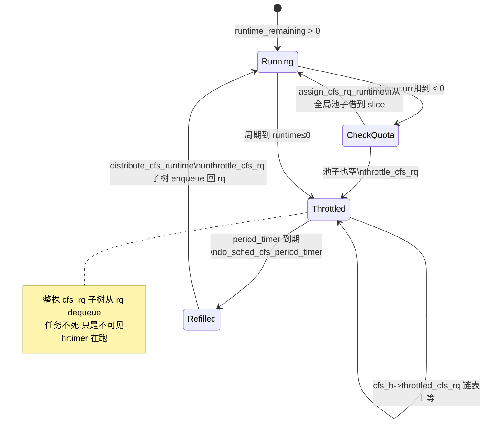

# 第十一节 · cpu 子系统:cpu.max 与 bandwidth throttle

> 篇:P2 cgroup 资源控制
> 主线呼应:上一章我们跟完了 `cgroup_attach_task` 的四步迁移——写一行 `cgroup.procs`,内核把任务的 `css_set` 换成指向新 cgroup 的那一组 css。但"换指针"只是把任务**归到账上**,真正让它**用不到超额资源**的,是每个 controller 自己的记账与拦截机制。这一章就拿 cpu controller 开刀:`cpu.max` 这行字符串怎么变成"任务被踢出运行队列"。你会发现,cpu cgroup 干脆没自己实现任何"限额执行器"——它**复用调度器的组调度(`task_group`/`sched_entity`)+ CFS bandwidth** 这套现成机制,把"超额"翻译成"throttle 一个 `cfs_rq`"。换句话说,cpu cgroup 不是"在 cgroup 里加了限 CPU 的代码",而是"调度器本来就有的组调度能力,cgroup 只是把它暴露成文件接口"。

## 核心问题

**`cpu.max` 写下去之后,内核到底改了哪些数据结构?一个 cfs 周期到了、配额耗光的瞬间,正在跑的任务是怎么被"暂停"的?为什么 cpu controller 不需要自己写限流逻辑,全靠调度器的 `task_group`/`sched_entity` 就能把一个容器按 CPU 配额卡死?**

读完本章你会明白:

1. cpu cgroup 的"资源"在内核里是什么:一个 `struct task_group` 里嵌着 per-CPU 的 `sched_entity *se[]` 和 `cfs_rq *cfs_rq[]`,以及一个 `struct cfs_bandwidth cfs_bandwidth`——它**不是** cgroup 子系统自己发明的新结构,而是调度器的组调度基础设施。
2. `cpu.max`/`cpu.weight`/`cpu.idle` 这些文件,本质是 `struct cgroup_subsys` 的函数指针表(`css_alloc`/`attach`/`dfl_cftypes`)挂出来的接口,写文件最终调到 `tg_set_cfs_bandwidth` / `sched_group_set_shares`。
3. bandwidth throttle 的完整链路:`update_curr` 每次记账 → `account_cfs_rq_runtime` 扣 `runtime_remaining` → 耗光调 `throttle_cfs_rq` → 整棵子树从 rq 上 dequeue → hrtimer 周期到期 `do_sched_cfs_period_timer` 重新发放配额 → `unthrottle_cfs_rq` 把子树 enqueue 回来。
4. ★ 对照 runc:runc 的 `setCPU`(`cgroups/fs2/cpu.go`)就是把 OCI spec 的 `CpuQuota`/`CpuPeriod`/`CpuWeight`/`CpuBurst` 原样写进 `cpu.max`/`cpu.weight`/`cpu.max.burst`,内核这条 throttle 链自动接管——用户态一行 `WriteFile`,内核一套 hrtimer + per-cfs_rq 状态机。
5. 二分法归属:这一章服务**资源**那一面——回答"能用多少 CPU"。但它和上一章(namespace)的对照同样清晰:namespace 切的是**视图**(进程看不见谁),cpu cgroup 切的是**份额**(进程轮不上谁)。

> **逃生阀**:如果你被 `sched_entity`/`cfs_rq`/`task_group` 三者的层级关系绕晕了,先记一句话:**任务自己是一个 `sched_entity`,它所属的 task_group 在每个 CPU 上也挂着一个 `sched_entity`;cfs_rq 是个红黑树根,任务和组都能挂进去。throttle 一个组 cfs_rq,等于把这棵子树整棵从 rq 上摘下来。** 这一句就是本章的脊椎,后面所有细节都是把它展开。

---

## 11.1 一句话点破

> **cpu cgroup 不是"新发明一个限 CPU 的执行器",而是"把调度器本来就有的组调度能力,用 `cpu.max` 这行字符串重新激活":配额耗光的瞬间,内核把这个容器的整棵 `cfs_rq` 子树从 rq 上 dequeue,周期 hrtimer 到期再 enqueue 回来——throttle 不是"杀死任务",是"让任务暂时轮不上"。**

这是结论,不是理由。本章倒过来拆:先看 cpu controller 在 `struct cgroup_subsys` 里挂了哪些回调(`cpu_cgrp_subsys`),再看它背后真正的资源结构 `task_group` 是什么、为什么 per-CPU 一对 `(se, cfs_rq)`;然后跟 `cpu.max` 的写路径(`cpu_max_write` → `tg_set_cfs_bandwidth`)看清配额怎么落进 `cfs_bandwidth`;接着钻进 throttle 的热路径(`update_curr` → `account_cfs_rq_runtime` → `throttle_cfs_rq`);最后看 hrtimer 周期到期怎么 `unthrottle_cfs_rq`。技巧精解里,我们拆两件事:① 为什么任务和组共用 `sched_entity`(而不是各搞一套);② 为什么 throttle 用"dequeue 整棵子树 + hrtimer 重发配额"这种模式,而不是朴素地"每次 tick 检查是否超额"。

---

## 11.2 cpu controller 的全部入口:`cpu_cgrp_subsys` 这张函数指针表

回扣第 9 章:cgroup v2 的每个 controller 都是一张 `struct cgroup_subsys` 函数指针表,核心路径靠 `class->xxx()` 调用,新增 controller 不改核心。cpu controller 的这张表就在 [`kernel/sched/core.c`](../linux/kernel/sched/core.c#L11468-L11483):

```c
/* kernel/sched/core.c:11468(简化) */
struct cgroup_subsys cpu_cgrp_subsys = {
    .css_alloc      = cpu_cgroup_css_alloc,
    .css_online     = cpu_cgroup_css_online,
    .css_released   = cpu_cgroup_css_released,
    .css_free       = cpu_cgroup_css_free,
    .css_extra_stat_show = cpu_extra_stat_show,
    .css_local_stat_show = cpu_local_stat_show,
#ifdef CONFIG_RT_GROUP_SCHED
    .can_attach     = cpu_cgroup_can_attach,
#endif
    .attach         = cpu_cgroup_attach,
    .legacy_cftypes = cpu_legacy_files,
    .dfl_cftypes    = cpu_files,         /* cgroup v2 的 cpu.weight / cpu.max / ... */
    .early_init     = true,
    .threaded       = true,
};
```

([core.c:11468](../linux/kernel/sched/core.c#L11468-L11483))

这张表回答了 cpu controller 的全部"行为入口":

- **建 cgroup 目录** → `cpu_cgroup_css_alloc` → [`sched_create_group`](../linux/kernel/sched/core.c#L10371)([core.c:10371](../linux/kernel/sched/core.c#L10371))分配一个 `struct task_group`,里面给每个 CPU 分配一对 `(se, cfs_rq)`(详下节)。
- **`echo PID > cgroup.procs`** → `cpu_cgroup_attach`([core.c:10599](../linux/kernel/sched/core.c#L10599)) → 对每个被迁的任务调 [`sched_move_task`](../linux/kernel/sched/core.c#L10483)([core.c:10483](../linux/kernel/sched/core.c#L10483)),把它从旧组的 `cfs_rq` 拔出来、挂进新组的 `cfs_rq`。
- **`echo "100000 200000" > cpu.max`** → `cpu_files` 里 `.write = cpu_max_write`([core.c:11400](../linux/kernel/sched/core.c#L11400-L11413)) → [`tg_set_cfs_bandwidth`](../linux/kernel/sched/core.c#L10809)([core.c:10809](../linux/kernel/sched/core.c#L10809))。
- **`echo 262144 > cpu.weight`** → `cpu_weight_write_u64`([core.c:11306](../linux/kernel/sched/core.c#L11306-L11322)) → [`sched_group_set_shares`](../linux/kernel/sched/fair.c#L13007)([fair.c:13007](../linux/kernel/sched/fair.c#L13007))。
- **删 cgroup 目录** → `cpu_cgroup_css_free` → 经 RCU 宽限期后 `sched_unregister_group` 释放([core.c:10575](../linux/kernel/sched/core.c#L10575-L10583))。

`cpu_files` 这个 `cftype` 数组([core.c:11416](../linux/kernel/sched/core.c#L11416-L11466))列出了 cgroup v2 暴露给用户态的全部文件:

| 文件 | 内核回调 | 干什么 | CONFIG |
|------|----------|--------|--------|
| `cpu.weight` | `cpu_weight_read/write_u64` | 设置组调度权重(1~10000,默认 100) | `FAIR_GROUP_SCHED` |
| `cpu.weight.nice` | `cpu_weight_nice_read/write_s64` | 用 nice 值(-20~19)等价设置权重 | `FAIR_GROUP_SCHED` |
| `cpu.idle` | `cpu_idle_read/write_s64` | 把整组标成 SCHED_IDLE(0/1) | `FAIR_GROUP_SCHED` |
| `cpu.max` | `cpu_max_show`/`cpu_max_write` | 设 `"quota period"`(如 `"100000 200000"`) | `CFS_BANDWIDTH` |
| `cpu.max.burst` | `cpu_cfs_burst_read/write_u64` | 允许累积的可透支额度 | `CFS_BANDWIDTH` |
| `cpu.uclamp.min`/`cpu.uclamp.max` | `cpu_uclamp_min/max_*` | util clamp(任务的最小/最大 util) | `UCLAMP_TASK_GROUP` |

注意三个 CONFIG 守卫:`CONFIG_FAIR_GROUP_SCHED`(组调度)、`CONFIG_CFS_BANDWIDTH`(bandwidth throttle)、`CONFIG_UCLAMP_TASK_GROUP`(util clamp)。它们独立开关,但容器场景三者通常全开。本章聚焦前两者:组调度决定"配额怎么按权重分",CFS bandwidth 决定"超额怎么 throttle"。

> **钉死这件事**:cpu controller 的全部用户态接口,都是通过 `cpu_cgrp_subsys` 这张函数指针表挂出去的。cgroup 核心代码(`kernel/cgroup/cgroup.c`)不知道 `cpu.max` 长什么样,它只认 `cftype` 表 + `.write`/`.read` 回调。这种"controller 填函数指针,核心通用"的架构,是 cgroup v2 可插拔的核心——第 9 章讲过的 `struct cgroup_subsys` 多态,这里又一次显形。

---

## 11.3 `task_group`:cpu controller 的真身,藏在调度器里

`cpu_cgroup_css_alloc` 建 cgroup 目录时调 [`sched_create_group`](../linux/kernel/sched/core.c#L10371-L10392),它分配的不是什么"cpu cgroup 私有结构",而是调度器的 [`struct task_group`](../linux/kernel/sched/sched.h#L379-L431)([sched.h:379](../linux/kernel/sched/sched.h#L379-L431)):

```c
/* kernel/sched/sched.h:379(简化,只留与本章相关的字段) */
struct task_group {
    struct cgroup_subsys_state css;     /* ← 它就是个 css,可被 cgroup 核心索引 */

#ifdef CONFIG_FAIR_GROUP_SCHED
    /* 每颗 CPU 一对:(组的 sched_entity, 组在这颗 CPU 上的私有 cfs_rq) */
    struct sched_entity  **se;          /* se[cpu]:这个组在 cpu 上的"代表" */
    struct cfs_rq        **cfs_rq;      /* cfs_rq[cpu]:这个组在 cpu 上的私有运行队列 */
    unsigned long         shares;       /* cpu.weight 写进来 */
    int                   idle;         /* cpu.idle,>0 表示 SCHED_IDLE 组 */
    ...
#endif

    struct task_group    *parent;       /* 层级:父组 */
    struct list_head      siblings;
    struct list_head      children;

    struct cfs_bandwidth  cfs_bandwidth;/* ← cpu.max 的配额池子 */
    ...
};
```

([sched.h:379-L431](../linux/kernel/sched/sched.h#L379-L431))

这里有个**全书最重要的结构对照**。回想第 1 章:`task_struct` 有个 `cgroups` 指针,指向 `css_set`,后者 `subsys[15]` 数组每个槽指向一个 css。cpu controller 的 css,就是**这个 `task_group` 的第一个字段 `css`**(靠 `container_of` 反查)。所以:

```
 task_struct
   └─ cgroups ──► css_set
                   └─ subsys[cpu_cgrp_id] ──► task_group.css
                                              │
                                              ▼
                                            task_group
                                            ├─ se[cpu]   = sched_entity (组的"代表")
                                            ├─ cfs_rq[cpu] = cfs_rq      (组的私有 rq)
                                            ├─ shares     = cpu.weight
                                            └─ cfs_bandwidth = cpu.max 的池子
```

`css_alloc` 的真身 [`alloc_fair_sched_group`](../linux/kernel/sched/fair.c#L12852-L12891)([fair.c:12852](../linux/kernel/sched/fair.c#L12852-L12891))把这两组 per-CPU 数组分出来,然后 [`init_tg_cfs_entry`](../linux/kernel/sched/fair.c#L12938-L12967)([fair.c:12938](../linux/kernel/sched/fair.c#L12938-L12967))把每一对 `(se, cfs_rq)` 在层级里挂好:

```c
/* kernel/sched/fair.c:12938(简化) */
void init_tg_cfs_entry(struct task_group *tg, struct cfs_rq *cfs_rq,
                       struct sched_entity *se, int cpu,
                       struct sched_entity *parent)
{
    struct rq *rq = cpu_rq(cpu);

    cfs_rq->tg = tg;
    cfs_rq->rq = rq;
    init_cfs_rq_runtime(cfs_rq);           /* throttle 字段清零 */

    tg->cfs_rq[cpu] = cfs_rq;
    tg->se[cpu]     = se;

    if (!parent) {
        se->cfs_rq = &rq->cfs;             /* 根组:挂在 rq 的顶层 cfs */
        se->depth  = 0;
    } else {
        se->cfs_rq = parent->my_q;         /* 子组:挂在父组的 my_q */
        se->depth  = parent->depth + 1;
    }
    se->my_q   = cfs_rq;                   /* my_q 指向"自己拥有的"子队列 */
    update_load_set(&se->load, NICE_0_LOAD);
    se->parent = parent;
}
```

([fair.c:12938-L12967](../linux/kernel/sched/fair.c#L12938-L12967))

**这两行是组调度的全部魔法**:`se->cfs_rq = parent->my_q`(子组挂到父组的队列里)和 `se->my_q = cfs_rq`(自己拥有一个队列)。`sched_entity` 有两个 cfs_rq 字段([sched.h:559-L561](../linux/include/linux/sched.h#L559-L561)):`cfs_rq` 是"我被挂到哪个队列",`my_q` 是"我自己拥有的队列(只有组 entity 才有,任务 entity 是 NULL)"。这两个字段一组合,就把 N 个任务、M 个组串成一棵树:

```
 rq->cfs  (顶层 cfs_rq,所有 CPU 都看得到)
   │
   ├── se_A  (容器A 的"代表 sched_entity",my_q 指向 A 的私有 cfs_rq)
   │     │
   │     └── A 的 cfs_rq[A 所在 CPU]
   │           ├── se_t1  (任务 t1,cfs_rq 指向 A 的 cfs_rq;my_q = NULL)
   │           ├── se_t2  (任务 t2)
   │           └── se_t3  (任务 t3)
   │
   ├── se_B  (容器B 的"代表")
   │     └── B 的 cfs_rq
   │           └── se_t4
   │
   └── se_root_task  (一个不在任何 cgroup 里的任务,直接挂顶层)
```

CFS 在 `pick_next_task` 时从 `rq->cfs` 这棵红黑树挑一个 vruntime 最小的 entity。如果挑到的是 `se_A`(组 entity),就**下钻**到 `se_A->my_q`(A 的 cfs_rq)继续挑;直到挑到一个 `my_q == NULL` 的 entity,那才是真正的任务。

> **所以这样设计**:任务和组**共用 `sched_entity`**,组的 `my_q` 不为 NULL。CFS 的核心选择逻辑(`pick_next_entity`、红黑树、EEVDF/虚拟时间)只写一份,无论挂的是任务还是组。**朴素地写**(任务一套 `task_entity`、组一套 `group_entity`、两套红黑树、两套时间记账)会让调度器代码翻倍,而且没法让"组的优先级"和"任务的优先级"在同一棵树里比较——这是组调度的全部意义:一个容器的整体权重,能和单个任务的权重在同一个尺度上竞争。

`alloc_fair_sched_group` 里还有一句关键:`init_cfs_bandwidth(tg_cfs_bandwidth(tg), tg_cfs_bandwidth(parent))`([fair.c:12867](../linux/kernel/sched/fair.c#L12867))——把父组的 `hierarchical_quota` 透传给子组,这是后面"`__cfs_schedulable` 检查子不超父"的地基。

---

## 11.4 `cpu.weight`:把一个数字翻译成调度器权重

最简单的接口先讲。`cpu.weight` 是个 1~10000 的数字(默认 100),它直接对应 `task_group->shares`。写入路径 [`cpu_weight_write_u64`](../linux/kernel/sched/core.c#L11306-L11322)([core.c:11306](../linux/kernel/sched/core.c#L11306-L11322))一行:

```c
return sched_group_set_shares(css_tg(css), scale_load(shareval));
```

`sched_group_set_shares`([fair.c:13007](../linux/kernel/sched/fair.c#L13007-L13019))拿 `shares_mutex` 锁后,调 `__sched_group_set_shares` 遍历所有 CPU,对每个 `tg->se[i]` 调 `reweight_entity` 改 `se->load.weight`。改完之后,这个组在每个 CPU 上的"红黑树权重"就变了,下一次 CFS 选任务时按新权重分时间片。

`scale_load` 是个 fixed-point 缩放([sched.h:135](../linux/kernel/sched/sched.h#L135)):`#define scale_load(w) ((w) << SCHED_FIXEDPOINT_SHIFT)`,其中 `SCHED_FIXEDPOINT_SHIFT = 10`([sched.h:414-L415](../linux/include/linux/sched.h#L414-L415))。`NICE_0_LOAD = 1 << 20 = 1024 << 10`([sched.h:158](../linux/kernel/sched/sched.h#L158)),正好对应 nice 0 的权重 1024——也就是 [`sched_prio_to_weight`](../linux/kernel/sched/core.c#L11518-L11527) 表里 nice 0 那一项([core.c:11518](../linux/kernel/sched/core.c#L11518-L11527))。

这套权重表在调度器那本书里讲透了(回扣《Linux 调度器》P6-19),这里只点一个容器视角的事实:**两个容器的 `cpu.weight` 比例,就是它们分到的 CPU 时间比例**。weight=100 的容器和 weight=200 的容器,在 CPU 紧张时按 1:2 分时间。`cpu.weight.nice` 是同一个东西的 nice 外衣——[`cpu_weight_nice_write_s64`](../linux/kernel/sched/core.c#L11342-L11357) 把 nice(-20~19)在 `sched_prio_to_weight` 表里查一下,转成 weight 再调同一个 `sched_group_set_shares`。

> **钉死这件事**:`cpu.weight` 不是"限多少 CPU",而是"在 CPU 紧张时按权重分"。它只在 CPU 被多个组竞争时生效——一个独占整机的容器,weight 100 还是 10000 没区别。要**硬上限**(不管别人闲不闲,最多用这么多),得用下面的 `cpu.max`。

---

## 11.5 `cpu.max`:配额池子 `cfs_bandwidth` 是怎么填的

`cpu.max` 的格式是 `"quota period"`,比如 `"100000 200000"` = 每 200ms 周期最多跑 100ms(50% CPU),`"max 100000"` = 不限。写入路径 [`cpu_max_write`](../linux/kernel/sched/core.c#L11400-L11413):

```c
/* kernel/sched/core.c:11400(简化) */
static ssize_t cpu_max_write(struct kernfs_open_file *of,
                             char *buf, size_t nbytes, loff_t off)
{
    struct task_group *tg = css_tg(of_css(of));
    u64 period = tg_get_cfs_period(tg);   /* 默认 100ms */
    u64 burst = tg_get_cfs_burst(tg);
    u64 quota;
    int ret;

    ret = cpu_period_quota_parse(buf, &period, &quota);
    if (!ret)
        ret = tg_set_cfs_bandwidth(tg, period, quota, burst);
    return ret ?: nbytes;
}
```

([core.c:11400-L11413](../linux/kernel/sched/core.c#L11400-L11413))

真正的逻辑在 [`tg_set_cfs_bandwidth`](../linux/kernel/sched/core.c#L10809-L10895)([core.c:10809](../linux/kernel/sched/core.c#L10809-L10895)),拆成四步:

**第一步:边界检查**。周期最小 1ms、最大 1s,quota 不能为负、不能超过 `max_cfs_runtime`(防 overflow)([core.c:10818-L10842](../linux/kernel/sched/core.c#L10818-L10842)):

```c
if (quota < min_cfs_quota_period || period < min_cfs_quota_period)
    return -EINVAL;
if (period > max_cfs_quota_period)
    return -EINVAL;
if (quota != RUNTIME_INF && quota > max_cfs_runtime)
    return -EINVAL;
```

`min_cfs_quota_period = 1 * NSEC_PER_MSEC`、`max_cfs_quota_period = 1 * NSEC_PER_SEC`([core.c:10802-L10805](../linux/kernel/sched/core.c#L10802-L10805))。这就是为什么你写 `"50000 500"`(500us 周期)会被拒。

**第二步:层级合法性检查 `__cfs_schedulable`**。cpu cgroup 的层级约束是"子的配额总和不能超过父的配额"(cgroup v2 里更严:子的实际配额取 `min(自己, 父)`)。这个检查不是手写循环,而是**复用调度器的 `walk_tg_tree` 树遍历**:

```c
/* kernel/sched/core.c:11077(简化) */
static int __cfs_schedulable(struct task_group *tg, u64 period, u64 quota)
{
    struct cfs_schedulable_data data = { .tg = tg, .period = period, .quota = quota };

    if (quota != RUNTIME_INF) {
        do_div(data.period, NSEC_PER_USEC);
        do_div(data.quota, NSEC_PER_USEC);
    }

    guard(rcu)();
    return walk_tg_tree(tg_cfs_schedulable_down, tg_nop, &data);
}
```

([core.c:11077-L11092](../linux/kernel/sched/core.c#L11077-L11092))

`walk_tg_tree` 从根组开始 DFS,每个节点调 `tg_cfs_schedulable_down`([core.c:11039-L11075](../linux/kernel/sched/core.c#L11039-L11075))。这个回调的核心是 cgroup v2 行为:

```c
if (cgroup_subsys_on_dfl(cpu_cgrp_subsys)) {
    if (quota == RUNTIME_INF)
        quota = parent_quota;                       /* 没设限 → 继承父 */
    else if (parent_quota != RUNTIME_INF)
        quota = min(quota, parent_quota);           /* 设了限 → 不超父 */
}
```

([core.c:11060-L11064](../linux/kernel/sched/core.c#L11060-L11064))

结果存进 `cfs_b->hierarchical_quota`——这就是"层级化限额"的内核落地:**一个子 cgroup 永远拿不到比父 cgroup 更多的 CPU**。

**第三步:填 `cfs_bandwidth` 池子**。拿 `cfs_b->lock` 后,把新配额写进 `struct cfs_bandwidth`([sched.h:352-L376](../linux/kernel/sched/sched.h#L352-L376)):

```c
/* kernel/sched/core.c:10864(简化) */
scoped_guard (raw_spinlock_irq, &cfs_b->lock) {
    cfs_b->period = ns_to_ktime(period);
    cfs_b->quota  = quota;
    cfs_b->burst  = burst;

    __refill_cfs_bandwidth_runtime(cfs_b);          /* 池子立刻填满 */

    if (runtime_enabled)
        start_cfs_bandwidth(cfs_b);                 /* 启动周期 hrtimer */
}
```

([core.c:10864-L10877](../linux/kernel/sched/core.c#L10864-L10877))

`struct cfs_bandwidth` 是**每个 task_group 一个**的配额池子([sched.h:352](../linux/kernel/sched/sched.h#L352-L376))。关键字段:

```c
struct cfs_bandwidth {
    raw_spinlock_t   lock;
    ktime_t          period;            /* 周期长度 */
    u64              quota;             /* 每周期配额;RUNTIME_INF = 无限 */
    u64              runtime;           /* 当前周期剩余配额(全局共享) */
    u64              burst;             /* 可累积的透支上限 */
    s64              hierarchical_quota;/* 自己 + 子孙 的有效上限 */
    u8               idle;              /* 本周期没人用,可关 timer */
    u8               period_active;     /* hrtimer 在跑 */
    struct hrtimer   period_timer;      /* 周期到期重新发配额 */
    struct hrtimer   slack_timer;       /* 闲置配额回收 */
    struct list_head throttled_cfs_rq;  /* ← 被 throttle 的 cfs_rq 链表 */
    int              nr_periods, nr_throttled;   /* 统计 */
    u64              throttled_time;
};
```

**第四步:per-CPU 同步**。`for_each_online_cpu` 拿每个 CPU 的 rq 锁,把 `cfs_rq->runtime_enabled`/`runtime_remaining` 同步成新状态;如果之前有 throttled 的 cfs_rq,现在配额变多了就 `unthrottle_cfs_rq`([core.c:10879-L10889](../linux/kernel/sched/core.c#L10879-L10889))。

```c
for_each_online_cpu(i) {
    struct cfs_rq *cfs_rq = tg->cfs_rq[i];
    struct rq *rq = cfs_rq->rq;

    guard(rq_lock_irq)(rq);
    cfs_rq->runtime_enabled  = runtime_enabled;
    cfs_rq->runtime_remaining = 0;            /* 清零,等 tick 重新申请 */

    if (cfs_rq->throttled)
        unthrottle_cfs_rq(cfs_rq);
}
```

这里有个**关键并发设计**:`tg_set_cfs_bandwidth` 拿的锁顺序是 `cfs_constraints_mutex` → `cfs_b->lock` → per-CPU `rq->lock`。`cfs_b->lock` 是"配额池子"的全局锁(一个 task_group 一个,所有 CPU 共享);`rq->lock` 是"每颗 CPU 的运行队列"锁。先拿全局的、再拿 per-CPU 的,保证不会和 `account_cfs_rq_runtime`(下面讲)的死锁——后者是先 rq->lock 再 cfs_b->lock 的反序请求,但 `assign_cfs_rq_runtime` 只短拿 cfs_b->lock,不会嵌套 rq->lock。

> **钉死这件事**:`cpu.max` 写下去的四步是:**边界检查 → 层级合法性(`walk_tg_tree` 递归,保证子不超父)→ 填 `cfs_bandwidth` 池子(配额落 `runtime` 字段、启动周期 hrtimer)→ per-CPU 同步(每个 `cfs_rq->runtime_enabled` 翻位、被 throttle 的立即 unthrottle)**。配额不是按 CPU 平分,而是放在一个**全局池子** `cfs_b->runtime` 里,谁要谁来抢——这是多 CPU 容器的关键:一颗 CPU 没用完的配额,另一颗可以接着用。

---

## 11.6 throttle 的热路径:配额耗光的瞬间发生了什么

现在到本章最硬核的部分。一个容器在跑,它每次 tick 都会经过 [`update_curr`](../linux/kernel/sched/fair.c)(CFS 的核心记账函数),`update_curr` 调 [`account_cfs_rq_runtime`](../linux/kernel/sched/fair.c#L5671-L5678)([fair.c:5671](../linux/kernel/sched/fair.c#L5671-L5678))扣配额。这函数是 throttle 的入口:

```c
/* kernel/sched/fair.c:5653(简化) */
static void __account_cfs_rq_runtime(struct cfs_rq *cfs_rq, u64 delta_exec)
{
    cfs_rq->runtime_remaining -= delta_exec;     /* 扣这次跑的时间 */

    if (likely(cfs_rq->runtime_remaining > 0))
        return;                                  /* 还有配额,正常 */
    if (cfs_rq->throttled)
        return;                                  /* 已经在 throttle 状态 */

    /* 配额耗光,尝试从全局池子 cfs_b 要一点 */
    if (!assign_cfs_rq_runtime(cfs_rq) && likely(cfs_rq->curr))
        resched_curr(rq_of(cfs_rq));             /* 要不到 → 标记重调度 */
}
```

([fair.c:5653-L5669](../linux/kernel/sched/fair.c#L5653-L5669))

`runtime_remaining` 是**每个 cfs_rq 一个**的本地余量([sched.h:661](../linux/kernel/sched/sched.h#L661))。注意它和 `cfs_b->runtime`(全局池子)的分层:**全局池子** `cfs_b->runtime` 是 task_group 级别的,所有 CPU 共享;**本地余量** `cfs_rq->runtime_remaining` 是 per-CPU 的,从全局池子里"借"一小段(slice,默认 5ms,`sysctl_sched_cfs_bandwidth_slice`)用。

这种"全局池子 + 本地 slice"的分层,是性能关键:如果每次 tick 都去抢 `cfs_b->lock`(全局锁),几十颗 CPU 抢一个锁会让 cgroup 在大规模场景下崩。所以每次借一整 slice(`assign_cfs_rq_runtime` 调 `__assign_cfs_rq_runtime` 要 `sched_cfs_bandwidth_slice()` 这么多),用完再借——和第 8 本《内存分配器》的 per-CPU cache 思路完全一致:**全局是慢道,本地是快道,用 batch 摊薄锁开销**。

`assign_cfs_rq_runtime`([fair.c:5641-L5651](../linux/kernel/sched/fair.c#L5641-L5651))短拿 `cfs_b->lock`,从 `cfs_b->runtime` 里减 `min_amount` 加到 `cfs_rq->runtime_remaining`。如果全局池子也空了(`cfs_b->runtime <= 0`),返回 0——触发 `resched_curr` 标记当前任务需重调度。

下一次 `schedule()` 被调,会走到 CFS 的 `pick_next_task` → `enqueue_task_fair` 路径,在那里会检查 [`check_cfs_rq_runtime`](../linux/kernel/sched/fair.c#L6305-L6321)([fair.c:6305](../linux/kernel/sched/fair.c#L6305-L6321)):

```c
/* kernel/sched/fair.c:6305(简化) */
static bool check_cfs_rq_runtime(struct cfs_rq *cfs_rq)
{
    if (!cfs_bandwidth_used())
        return false;
    if (likely(!cfs_rq->runtime_enabled || cfs_rq->runtime_remaining > 0))
        return false;
    if (cfs_rq_throttled(cfs_rq))
        return true;                  /* 已经 throttle */

    return throttle_cfs_rq(cfs_rq);   /* ← 真正的 throttle 入口 */
}
```

([fair.c:6305-L6321](../linux/kernel/sched/fair.c#L6305-L6321))

`throttle_cfs_rq`([fair.c:5756-L5843](../linux/kernel/sched/fair.c#L5756-L5843))是本章的另一主角。它做的事情,用一句话概括:**把整棵 `cfs_rq` 子树从 rq 上 dequeue**。展开看:

```c
/* kernel/sched/fair.c:5756(大幅简化,保留主干) */
static bool throttle_cfs_rq(struct cfs_rq *cfs_rq)
{
    struct rq *rq = rq_of(cfs_rq);
    struct cfs_bandwidth *cfs_b = tg_cfs_bandwidth(cfs_rq->tg);
    struct sched_entity *se;
    long task_delta, idle_task_delta, dequeue = 1;

    raw_spin_lock(&cfs_b->lock);
    /* 再确认一次:万一在这期间配额被补回来了,放弃 throttle */
    if (__assign_cfs_rq_runtime(cfs_b, cfs_rq, 1)) {
        dequeue = 0;
    } else {
        /* 把自己挂到"被 throttle 名单"上,等周期 timer 醒来 unthrottle */
        list_add_tail_rcu(&cfs_rq->throttled_list, &cfs_b->throttled_cfs_rq);
    }
    raw_spin_unlock(&cfs_b->lock);

    if (!dequeue)
        return false;

    /* 拿到这个组在当前 CPU 上的"代表 sched_entity" */
    se = cfs_rq->tg->se[cpu_of(rq_of(cfs_rq))];

    /* 冻结这个组子树里所有 cfs_rq 的负载平均值 */
    rcu_read_lock();
    walk_tg_tree_from(cfs_rq->tg, tg_throttle_down, tg_nop, (void *)rq);
    rcu_read_unlock();

    /* 沿父链把每个组 entity 从它所在的 cfs_rq 里 dequeue */
    task_delta = cfs_rq->h_nr_running;        /* 子树里有多少任务 */
    for_each_sched_entity(se) {
        struct cfs_rq *qcfs_rq = cfs_rq_of(se);
        if (!se->on_rq) goto done;

        dequeue_entity(qcfs_rq, se, DEQUEUE_SLEEP);   /* ← 关键 */
        qcfs_rq->h_nr_running -= task_delta;          /* 父队列的计数减掉子树 */
        ...
        if (qcfs_rq->load.weight) {
            se = parent_entity(se);
            break;
        }
    }
    /* 继续往上传 h_nr_running 的变化 */
    ...
    sub_nr_running(rq, task_delta);           /* rq 全局 nr_running 减 */

done:
    cfs_rq->throttled = 1;                    /* ← 标记 */
    if (cfs_rq->nr_running)
        cfs_rq->throttled_clock = rq_clock(rq);
    return true;
}
```

([fair.c:5756-L5843](../linux/kernel/sched/fair.c#L5756-L5843))

注意几个精妙处:

1. **再次检查配额**(`__assign_cfs_rq_runtime(cfs_b, cfs_rq, 1)`)。从 `check_cfs_rq_runtime` 到这里中间释放过锁,周期 timer 可能刚好补了一波配额。这种"close the window"的双重检查在内核并发代码里极常见——避免假 throttle。
2. **挂进 `cfs_b->throttled_cfs_rq` 链表用 `list_add_tail_rcu`**。RCU 添加,这样周期 timer 的 `do_sched_cfs_period_timer` 能在不大锁的情况下遍历这个链表发配额。
3. **`tg_throttle_down` 标记整棵子树的 `throttle_count++`**([fair.c:5737-L5754](../linux/kernel/sched/fair.c#L5737-L5754))。这个计数很重要:父组被 throttle,子组也算被 throttle(`throttled_hierarchy` 看 `throttle_count`,[fair.c:5686-L5689](../linux/kernel/sched/fair.c#L5686-L5689))。`walk_tg_tree_from` 递归标记,保证子组不会在父组被冻结时偷偷运行。
4. **`for_each_sched_entity(se)` 沿父链 dequeue**。这是组调度 dequeue 的标准模式:从被 throttle 的 cfs_rq 对应的组 entity 开始,一层层往父队列 dequeue。如果 dequeue 后父队列空了(`qcfs_rq->load.weight == 0`),父组 entity 也 dequeue;否则父组 entity 还在队列里(只是权重降了),break 出去。
5. **`sub_nr_running(rq, task_delta)`**。rq 全局的 `nr_running` 减掉子树的任务数。这一步让 rq 知道"有这么多任务暂时不参与调度",影响 idle 判断、负载均衡。

throttle 之后这棵 cfs_rq 子树就"消失"了——`pick_next_task` 不会再选到它里面的任何任务,因为组 entity 已经从父队列里 dequeue。任务没死、没被信号打断、没睡眠,只是**在红黑树上不可见**。这就是"throttle 不是杀任务,是让任务轮不上"的内核落地。

> **不这样会怎样**:朴素地写 throttle,你会想"在 tick 里检查超额,超额了就让任务 `schedule()` 出去"。这撞两个墙:① **schedule 出去还是会回 rq 队列**,下次 pick 又选到它——你得让它**根本不在队列里**才管用,所以必须 dequeue 整棵子树;② **一个组里有很多任务,你得让它们一起消失**——单独 dequeue 一个任务,组 entity 还在父队列,只是权重降一点,throttle 不干净。`throttle_cfs_rq` 的设计"dequeue 组 entity,连带子树全部隐身",是唯一能让 throttle 真正生效的写法。

---

## 11.7 周期 hrtimer:配额重发与 unthrottle

throttle 之后怎么恢复?靠 `cfs_bandwidth.period_timer` 这个 hrtimer。`tg_set_cfs_bandwidth` 第三步里调了 `start_cfs_bandwidth`([fair.c:6418-L6428](../linux/kernel/sched/fair.c#L6418-L6428)):

```c
void start_cfs_bandwidth(struct cfs_bandwidth *cfs_b)
{
    lockdep_assert_held(&cfs_b->lock);

    if (cfs_b->period_active)
        return;

    cfs_b->period_active = 1;
    hrtimer_forward_now(&cfs_b->period_timer, cfs_b->period);
    hrtimer_start_expires(&cfs_b->period_timer, HRTIMER_MODE_ABS_PINNED);
}
```

([fair.c:6418-L6428](../linux/kernel/sched/fair.c#L6418-L6428))

注意初始化时 `init_cfs_bandwidth`([fair.c:6390-L6409](../linux/kernel/sched/fair.c#L6390-L6409))给 timer 加了一个随机偏移:

```c
hrtimer_set_expires(&cfs_b->period_timer,
                    get_random_u32_below(cfs_b->period));
```

这是为了避免所有 task_group 的 timer 同时到期——几千个容器的周期 timer 撞在同一微秒,会让 timer 中断抖动严重。这种"加抖动分散"的技巧,在内核里到处都是(回扣第 9 本《mm》的 per-CPU pageset 同步、第 11 本《调度器》的 EEVDF init)。

timer 到期调 [`sched_cfs_period_timer`](../linux/kernel/sched/fair.c#L6335-L6388)([fair.c:6335](../linux/kernel/sched/fair.c#L6335-L6388)),核心是 [`do_sched_cfs_period_timer`](../linux/kernel/sched/fair.c#L6096-L6148)([fair.c:6096](../linux/kernel/sched/fair.c#L6096-L6148)):

```c
/* kernel/sched/fair.c:6096(简化) */
static int do_sched_cfs_period_timer(struct cfs_bandwidth *cfs_b, int overrun, unsigned long flags)
{
    int throttled = !list_empty(&cfs_b->throttled_cfs_rq);

    cfs_b->nr_periods += overrun;
    __refill_cfs_bandwidth_runtime(cfs_b);    /* ← 把池子重新填到 quota+burst */

    if (cfs_b->idle && !throttled)
        goto out_deactivate;                  /* 没人用也没人 throttle,关 timer */

    if (!throttled) {
        cfs_b->idle = 1;                      /* 标记"本周期可能闲置" */
        return 0;
    }

    cfs_b->nr_throttled += overrun;

    /* 有 throttle 的 cfs_rq,把新配额分发下去 */
    while (throttled && cfs_b->runtime > 0) {
        raw_spin_unlock_irqrestore(&cfs_b->lock, flags);
        throttled = distribute_cfs_runtime(cfs_b);  /* ← 给被 throttle 的发配额 */
        raw_spin_lock_irqsave(&cfs_b->lock, flags);
    }

    cfs_b->idle = 0;
    return 0;

out_deactivate:
    return 1;   /* 返回 1 → 调用方关掉 period_active,不再 restart */
}
```

([fair.c:6096-L6148](../linux/kernel/sched/fair.c#L6096-L6148))

这里有个**值得展开的并发技巧**:`distribute_cfs_runtime` 之前**释放 cfs_b->lock**。为什么?因为 `unthrottle_cfs_rq` 要拿 per-CPU `rq->lock`,如果手里拿着 `cfs_b->lock`,锁序就成了 cfs_b->lock → rq->lock;而前面 `account_cfs_rq_runtime` 路径是 rq->lock → cfs_b->lock(短拿)。两边反序,**死锁风险**。所以 `do_sched_cfs_period_timer` 在分发配额时**主动释放 cfs_b->lock**,让 `unthrottle_cfs_rq` 能独立拿 rq->lock。

`__refill_cfs_bandwidth_runtime`([fair.c:5589-L5605](../linux/kernel/sched/fair.c#L5589-L5605))是填池子的核心:

```c
void __refill_cfs_bandwidth_runtime(struct cfs_bandwidth *cfs_b)
{
    s64 runtime;

    if (unlikely(cfs_b->quota == RUNTIME_INF))
        return;

    cfs_b->runtime += cfs_b->quota;                    /* 加本周期配额 */
    runtime = cfs_b->runtime_snap - cfs_b->runtime;
    if (runtime > 0) {
        cfs_b->burst_time += runtime;
        cfs_b->nr_burst++;
    }

    cfs_b->runtime = min(cfs_b->runtime, cfs_b->quota + cfs_b->burst);  /* ← 上限 */
    cfs_b->runtime_snap = cfs_b->runtime;
}
```

([fair.c:5589-L5605](../linux/kernel/sched/fair.c#L5589-L5605))

`min(runtime, quota + burst)` 是 `cpu.max.burst` 的落地:**没用完的配额可以累积,但累积上限是 burst**。一个 `cpu.max="100000 100000"` + `cpu.max.burst=50000` 的容器,某一周期没用掉的配额最多留 50ms 给下周期透支——既允许小波动,又不让"积攒一堆配额一次跑爆"。

`unthrottle_cfs_rq`([fair.c:5845-L5929](../linux/kernel/sched/fair.c#L5845-L5929))是 `throttle_cfs_rq` 的镜像:从 `cfs_b->throttled_cfs_rq` 摘下来 → `cfs_rq->throttled = 0` → `tg_unthrottle_up` 把 `throttle_count--` → 沿父链 `enqueue_entity` 把组 entity 挂回父队列 → `add_nr_running(rq, task_delta)` 把任务数加回 rq。最后一句关键:

```c
/* Determine whether we need to wake up potentially idle CPU: */
if (rq->curr == rq->idle && rq->cfs.nr_running)
    resched_curr(rq);
```

([fair.c:5927-L5928](../linux/kernel/sched/fair.c#L5927-L5928))

如果这个 CPU 现在正闲着(idle),unthrottle 后有活干了,立刻 `resched_curr` 把它从 idle 唤醒——这是"配额补回来,容器立即恢复运行"的最后一步。

> **钉死这件事**:throttle 的恢复完全靠**周期 hrtimer**(`cfs_b->period_timer`,默认 100ms)。每周期 `__refill_cfs_bandwidth_runtime` 重填池子(上限 quota+burst)→ `distribute_cfs_runtime` 把配额分发到被 throttle 的 cfs_rq → `unthrottle_cfs_rq` 把整棵子树 enqueue 回 rq。这套"dequeue 子树 + hrtimer 重发 + enqueue 回来"的状态机,是 cpu.max throttle 的完整闭环。容器看到的"卡 100ms 然后继续跑",就是这套机制在用户态的投影。

---

## 11.8 技巧精解:组调度复用 `sched_entity` + throttle 状态机

本章命脉的两个技巧,单独拆透。

### 技巧一:任务和组共用 `sched_entity` —— 一套红黑树搞定两层调度

`task_struct` 里有一个 [`struct sched_entity se`](../linux/include/linux/sched.h#L536-L575)([sched.h:536](../linux/include/linux/sched.h#L536-L575));`task_group` 里 per-CPU 有一个 `struct sched_entity *se[cpu]`。**两者是同一个 `struct sched_entity` 类型**,只是任务 entity 的 `my_q == NULL`,组 entity 的 `my_q != NULL`:

```c
struct sched_entity {
    struct load_weight load;
    struct rb_node      run_node;     /* 红黑树节点 */
    u64                 deadline;     /* EEVDF deadline */
    u64                 min_vruntime;
    unsigned int        on_rq;
    u64                 sum_exec_runtime;
    u64                 vruntime;
    s64                 vlag;
    u64                 slice;

#ifdef CONFIG_FAIR_GROUP_SCHED
    int                 depth;
    struct sched_entity *parent;
    struct cfs_rq       *cfs_rq;      /* 我被挂在哪个 cfs_rq 上 */
    struct cfs_rq       *my_q;        /* 我自己拥有的队列(只有组非 NULL) */
    unsigned long       runnable_weight;
#endif
    ...
};
```

([sched.h:536-L575](../linux/include/linux/sched.h#L536-L575))

`my_q` 是否为 NULL 是任务 entity vs 组 entity 的唯一标志。CFS 的选择逻辑伪代码:

```c
struct sched_entity *pick_next_entity(cfs_rq) {
    /* 从红黑树挑 deadline 最早的(EEVDF) */
    se = rb_entry(cfs_rq->tasks_timeline.rb_leftmost, struct sched_entity, run_node);
    while (se->my_q) {                          /* 是组 → 下钻 */
        cfs_rq = se->my_q;
        se = rb_entry(cfs_rq->tasks_timeline.rb_leftmost, struct sched_entity, run_node);
    }
    return se;                                  /* my_q==NULL → 真 task */
}
```

这一层"下钻"在 CFS 核心代码里是 `for_each_sched_entity(se)` 宏,它递归沿 `se->parent` 走。**整个 CFS 的红黑树、vruntime/deadline 计算、时间片分配、负载跟踪(`sched_avg`),只写一份**——无论挂的是任务还是组。

> **反面对比**:朴素地写,你会定义两套结构:

> ```c
> /* 朴素的、糟糕的写法(示意,非源码) */
> struct task_sched_entity { ... };     /* 任务调度实体 */
> struct group_sched_entity { ... };    /* 组调度实体,各一套字段 */
> ```

> 这撞三堵墙:① **代码重复**:红黑树、时间记账、负载跟踪、EEVDF 计算,全要写两遍;② **无法同树比较**:CFS 的核心是"vruntime 最小的先跑",任务和组要在同一棵树里比较 vruntime 才有意义——两个不同类型的 entity 没法挂进同一棵红黑树;③ **权重计算割裂**:组 entity 的权重应该等于它子任务权重之和(动态变化),任务 entity 的权重是固定的——两套结构就要在每次 enqueue/dequeue 时手动同步,极易出错。Linux 的做法是**共用 `sched_entity`,用 `my_q` 是否为 NULL 区分**,一劳永逸:任务和组在同一棵树里自然竞争,组的权重由 `update_cfs_group`([fair.c:3971-L3989](../linux/kernel/sched/fair.c#L3971-L3989))根据子 cfs_rq 的负载动态算(`calc_group_shares`),任务权重直接是 `se->load.weight`。

这个设计还有个**深远后果**:throttle 一个组,等同于 dequeue 它的那个 `sched_entity`——CFS 不需要"throttle 任务"和"throttle 组"两套语义,只有"dequeue 一个 entity"一种操作。`throttle_cfs_rq` 里的 `dequeue_entity(qcfs_rq, se, DEQUEUE_SLEEP)`,和任务睡眠时 `dequeue_task_fair` 走的是**同一个 `dequeue_entity` 函数**。CFS 根本不知道"这个 entity 是被 throttle 了还是它的任务睡眠了",它只看到 entity 不在树上了。

这就是为什么 cpu cgroup 能"零成本"复用调度器:**它从不发明新机制,只在 `sched_entity` 这套既有抽象上加了一层"配额池子 + throttle dequeue"**。整个 `kernel/sched/fair.c` 里 CFS bandwidth 相关代码不到 1000 行,但它驾驭的是几百个容器、每容器几千个任务的限流场景——靠的就是"复用"二字。

### 技巧二:throttle 不是"杀任务",是"让整棵子树 dequeue" —— hrtimer 驱动的状态机

第二个值得拆的,是 throttle/unthrottle 这套状态机本身。一个被 throttle 的 cfs_rq 有四个状态字段([sched.h:660-L675](../linux/kernel/sched/sched.h#L660-L675)):

```c
#ifdef CONFIG_CFS_BANDWIDTH
    int      runtime_enabled;       /* 是否启用了 bandwidth 限制 */
    s64      runtime_remaining;     /* 本地余量(slice 借来的) */
    u64      throttled_clock;       /* throttle 起始时刻(统计用) */
    int      throttled;             /* 0/1,我被 throttle 了吗 */
    int      throttle_count;        /* 我或我某个祖先被 throttle(层级) */
    struct list_head throttled_list;/* 挂在 cfs_b->throttled_cfs_rq 上 */
    struct list_head throttled_csd_list; /* 跨 CPU unthrottle 用 */
#endif
```

`throttled` 是本 cfs_rq 自己是否被 throttle;`throttle_count` 是**祖先链上被 throttle 的次数**(`throttled_hierarchy` 查这个, [fair.c:5686-L5689](../linux/kernel/sched/fair.c#L5686-L5689))。两个分开,是因为:子组自己没超配额,但父组超了被 throttle,子组也连带不可见——`tg_throttle_down` 沿树往下走 `throttle_count++`,让每个子孙都知道"我祖先被冻了,别来烦我"。

整个 throttle 生命周期是一个 hrtimer 驱动的状态机:



这个状态机有两个非显然的工程决定:

**① throttle 时把 cfs_rq 挂到 `cfs_b->throttled_cfs_rq` 链表(全局)、不挂到 rq**。为什么?因为"谁被 throttle"是 task_group 级别的状态(整个组共享一个 `cfs_bandwidth`),unthrottle 时周期 timer 要遍历**所有 CPU 上**被 throttle 的 cfs_rq 发配额——挂在一个 task_group 级别的链表上,一次 `distribute_cfs_runtime` 就能扫遍全 CPU。朴素地写"每个 rq 记录自己有哪些 throttled cfs_rq",周期 timer 要遍历所有 CPU 的 rq,锁开销爆炸。

**② unthrottle 走 CSD 跨 CPU 触发**。看 [`__unthrottle_cfs_rq_async`](../linux/kernel/sched/fair.c#L5971)([fair.c:5971](../linux/kernel/sched/fair.c#L5971))和 `__cfsb_csd_unthrottle`([fair.c:5932-L5969](../linux/kernel/sched/fair.c#L5932-L5969)):周期 timer 在 CPU A 上跑,发现 CPU B 上的一个 cfs_rq 该 unthrottle——它**不能直接拿 CPU B 的 rq 锁**跨 CPU 改队列,而是把这个 cfs_rq 挂到 CPU B 的 `rq->cfsb_csd_list` 上,发一个 IPI(CSD,Call Single Function Data),让 CPU B 自己在本地处理。这样 unthrottle 的 enqueue 操作永远在 rq 所在的 CPU 上做,锁不出 CPU——和第 11 本《调度器》讲的"per-CPU rq 细粒度锁"一脉相承。

> **反面对比**:朴素地写 unthrottle,周期 timer 直接 `for_each_cpu` 拿每个 CPU 的 rq 锁、改队列。这撞的墙是:① **跨 CPU 拿 rq 锁极慢**,几十颗 CPU 串行拿,周期 timer 本身就成瓶颈;② **和负载均衡抢锁**(负载均衡也会拿远端 rq 锁),锁竞争让 throttle/unthrottle 抖动严重。CSD IPI 把操作"推"到目标 CPU 本地执行,是内核 SMP 代码的标准模式(回扣第 13 本《同步原语》的 per-CPU 模式)。

> **钉死这件事**:throttle 状态机的两个工程决定——**throttled cfs_rq 挂 task_group 级别链表**(周期 timer 一次扫遍全 CPU)、**unthrottle 走 CSD IPI 推到目标 CPU**(锁不出 CPU)——是 cpu cgroup 在大规模 SMP(几百核、几千容器)下仍能稳定运行的并发根基。和"全局池子 + 本地 slice"一样,都是**用结构设计消灭锁竞争**的典范。

---

## 11.9 ★ 对照 runc:Docker/K8s 一行 `cpus` 怎么落到 `cpu.max`

runc(以及 Docker、K8s 通过 containerd/CRI-O 调用的 runc)的资源设置,最终走到 `github.com/opencontainers/cgroups/fs2/cpu.go` 的 [`setCPU`](../linux/runc/libcontainer/../vendor/github.com/opencontainers/cgroups/fs2/cpu.go#L19-L77)(真实路径 `runc/vendor/.../fs2/cpu.go:19`)。它就是一堆 `WriteFile`:

```go
// runc/vendor/github.com/opencontainers/cgroups/fs2/cpu.go:19(简化)
func setCPU(dirPath string, r *cgroups.Resources) error {
    if r.CpuWeight != 0 {
        cgroups.WriteFile(dirPath, "cpu.weight", strconv.FormatUint(r.CpuWeight, 10))
    }
    if r.CpuQuota != 0 || r.CpuPeriod != 0 {
        str := "max"
        if r.CpuQuota > 0 {
            str = strconv.FormatInt(r.CpuQuota, 10)
        }
        period := r.CpuPeriod
        if period == 0 {
            period = 100000   // 默认 100ms
        }
        str += " " + strconv.FormatUint(period, 10)
        cgroups.WriteFile(dirPath, "cpu.max", str)
    }
    if r.CpuBurst != nil {
        cgroups.WriteFile(dirPath, "cpu.max.burst", burst)
    }
    ...
}
```

OCI spec 里 `LinuxResources.CPU` 字段(`CpuQuota`/`CpuPeriod`/`CpuWeight`/`CpuBurst`/`CPUIdle`)和内核 `cpu.*` 文件的对应:

| OCI spec 字段(Docker/K8s 来源) | 内核文件 | 内核回调 | 物理含义 |
|--------------------------------|---------|---------|---------|
| `CpuQuota`/`CpuPeriod`(Docker `--cpus=1.5`、K8s `limits.cpu: "1500m"`) | `cpu.max` | `cpu_max_write` → `tg_set_cfs_bandwidth` | 每 period 微秒可跑 quota 微秒 |
| `CpuWeight`(Docker `--cpu-shares`、K8s `requests.cpu`) | `cpu.weight` | `cpu_weight_write_u64` → `sched_group_set_shares` | 权重比例分空闲 CPU |
| `CpuBurst`(K8s `cpuBurst`) | `cpu.max.burst` | `cpu_cfs_burst_write_u64` | 累积透支额度 |
| `CPUIdle`(K8s `cpuIdle`) | `cpu.idle` | `cpu_idle_write_s64` → `sched_group_set_idle` | 整组 SCHED_IDLE |

几个容器视角的要点:

- **Docker `--cpus=1.5` 的翻译**:Docker/containerd 把 `--cpus` 乘以 100000 当 quota、period 固定 100000,即 `"150000 100000"`——每 100ms 周期可跑 150ms(等价 1.5 核)。这个字符串就是 runc 写进 `cpu.max` 的内容。
- **K8s 的 `limits.cpu` 与 `requests.cpu` 分工**:`limits.cpu: "1"` → 写 `cpu.max`(硬上限,超了 throttle);`requests.cpu: "500m"` → 写 `cpu.weight`(调度优先级,节点 CPU 紧张时按权重分)。**这是两个不同的内核机制**——前者 throttle、后者只改权重——K8s 把它们语义化成"上限"和"保底"。
- **`cpu.stat` 的解读**:runc 的 `statCpu`(`fs2/cpu.go:79`)读 `cpu.stat` 文件,解析 `nr_periods`/`nr_throttled`/`throttled_usec`。这三个数字是定位"容器 CPU 不够"的关键——`throttled_usec` 大量非零,说明容器经常被打到 throttle,得加 `limits.cpu`。这就是 11.7 讲的 `cfs_b->nr_periods`/`nr_throttled`/`throttled_time` 字段的用户态出口。
- **`early_init = true`**:`cpu_cgrp_subsys` 的这个标志([core.c:11481](../linux/kernel/sched/core.c#L11481))意味着 cpu controller 在 boot 早期就初始化(因为调度器自己需要 root_task_group)。这是为什么 `/sys/fs/cgroup/` 一挂载就有 `cpu.weight`/`cpu.max` 文件——它不是按需加载的。

> **钉死这件事**:runc 的 `setCPU` 就是把 OCI spec 的几个数字原样写进 `cpu.max`/`cpu.weight`/`cpu.max.burst`/`cpu.idle`——**用户态一行 `WriteFile`,内核一条 throttle 链**。Docker 的 `--cpus`、K8s 的 `limits.cpu`/`requests.cpu`,最终都坍缩到 `cfs_bandwidth` 池子和 `task_group->shares` 这两个内核字段。这就是"内核积木 vs 用户态组装":cpu cgroup 提供机制(throttle/权重),runc/Docker/K8s 提供策略(配多少)。

---

## 章末小结

这一章是 cgroup 资源控制的重头戏之一,我们跟完了 cpu controller 从用户态字符串到内核 throttle 的完整链路。把它压成几条:

1. **cpu cgroup 没有自己的资源结构**:它复用调度器的 `struct task_group`(每个容器一个,内含 per-CPU `se[]`/`cfs_rq[]` 和一个全局 `cfs_bandwidth` 池子)。`css_alloc` → `sched_create_group`,`attach` → `sched_move_task`,全是调度器既有函数。
2. **`cpu.max` 落地四步**:边界检查 → `__cfs_schedulable` 层级合法性(子不超父,`walk_tg_tree` 递归)→ 填 `cfs_bandwidth` 池子(`runtime` 字段、启动周期 hrtimer)→ per-CPU 同步(每个 `cfs_rq->runtime_enabled` 翻位)。
3. **throttle = dequeue 整棵 cfs_rq 子树**:tick → `account_cfs_rq_runtime` 扣本地 `runtime_remaining` → 耗光向全局池子借 slice → 池子也空 → `throttle_cfs_rq` 把组 entity 从父队列 dequeue,子树任务全部从 rq 不可见。
4. **unthrottle = hrtimer 周期重发配额**:`period_timer`(默认 100ms)到期 → `__refill_cfs_bandwidth_runtime` 填池子(上限 quota+burst)→ `distribute_cfs_runtime` → `unthrottle_cfs_rq` 走 CSD IPI 在目标 CPU 本地 enqueue 回 rq。
5. **两个工程技巧**:任务/组共用 `sched_entity`(CFS 一套代码搞定两层调度)+ "全局池子 + 本地 slice"(摊薄 `cfs_b->lock` 锁开销,和《内存分配器》per-CPU cache 同源)。

### 五个"为什么"清单

1. **为什么 cpu cgroup 不自己写限流逻辑?** 因为调度器本来就有组调度(`task_group`/`sched_entity`/`cfs_rq`),cpu controller 只是把 `cpu.max`/`cpu.weight` 暴露成文件、把配额落到 `cfs_bandwidth`/`shares` 字段,throttle/unthrottle 全靠调度器既有路径。复用 > 重造。
2. **为什么 throttle 是"dequeue 整棵子树"而不是"让任务 sleep"?** 让任务 sleep 还是在 rq 上,下次 pick 又选到它;只有 dequeue 组 entity,连带子任务全部从红黑树不可见,throttle 才真正生效。任务是"组 entity 的子树",dequeue 组等于冻整棵树。
3. **为什么要有"全局池子 + 本地 slice"两层?** 全局池子让多 CPU 容器能动态调配配额(一颗 CPU 没用完,另一颗接着用);本地 slice(`sysctl_sched_cfs_bandwidth_slice`,5ms)让每次 tick 不用抢全局锁,几十核容器才跑得动。这是"快慢道"思路的又一次显形。
4. **为什么 unthrottle 要走 CSD IPI?** 周期 timer 在 CPU A 跑,要 unthrottle CPU B 的 cfs_rq,不能跨 CPU 拿 B 的 rq 锁——锁竞争 + 和负载均衡抢锁。把操作推到目标 CPU 本地执行(CSD),锁永不出 CPU,是 SMP 内核的标准技巧。
5. **为什么 `cpu.weight` 和 `cpu.max` 是两个机制?** weight 是**相对权重**(CPU 紧张时按比例分,不紧张时空跑);max 是**硬上限**(不管别人闲不闲,最多用这么多)。K8s 把它们语义化成 `requests.cpu`(保底)和 `limits.cpu`(上限),正好对应这两套内核机制。

### 想继续深入往哪钻

- **源码**:[`kernel/sched/core.c`](../linux/kernel/sched/core.c#L10809) 的 `tg_set_cfs_bandwidth`(L10809)、[`kernel/sched/fair.c`](../linux/kernel/sched/fair.c#L5756) 的 `throttle_cfs_rq`(L5756)/`unthrottle_cfs_rq`(L5845)/`do_sched_cfs_period_timer`(L6096);[`kernel/sched/sched.h`](../linux/kernel/sched/sched.h#L352) 的 `struct cfs_bandwidth`(L352)/`struct task_group`(L379)/`struct cfs_rq`(L573)。EEVDF 本身详见《Linux 调度器》P6-19。
- **观测**:`cat /sys/fs/cgroup/<容器>/cpu.stat` 看 `nr_periods`/`nr_throttled`/`throttled_usec`——`throttled_usec` 持续增长就是容器 CPU 不够;`cat cpu.max` 看当前 quota/period;`sysctl kernel.sched_cfs_bandwidth_slice_us` 看本地 slice 大小。
- **工具**:`systemd-cgtop` 实时看每个 cgroup 的 CPU/内存用量;`perf stat -e 'cfs_throttled,*throttle*'` 抓 throttle 事件;`bpftool` 挂 `sched/sched_switch` tracepoint 看 throttle 期间容器进程是否真的不跑。
- **延伸**:`cpu.uclamp.min`/`cpu.uclamp.max`(util clamp)是 5.3+ 新增的,和 `cpu.max` 互补——前者影响频率选择(schedutil governor 按 util 调频),后者直接限时间。第 18 本《eBPF》会讲怎么用 bpf 抓 throttle 事件做容器性能画像。

### 引出下一章

cpu controller 讲的是"限多少 CPU 时间",但容器的资源限制不止 CPU——更常见的痛点是内存。一个 `malloc` 不停的容器,不靠 `cpu.max` 能拦,得靠 memory controller(memcg):每个 page 分配时 `try_charge` 记到 cgroup 账上,超 `memory.max` 直接 OOM kill。memcg 的精妙在"page→memcg 反查"——每个物理页都知道自己属于哪个 cgroup,共享内存、fork 后的 COW 页也能正确记账。下一章,我们钻进 [`mm/memcontrol.c`](../linux/mm/memcontrol.c),看 `memory.current`/`memory.max` 怎么变成 charge/OOM,回扣《Linux mm》第 9 本的 page 分配路径。
