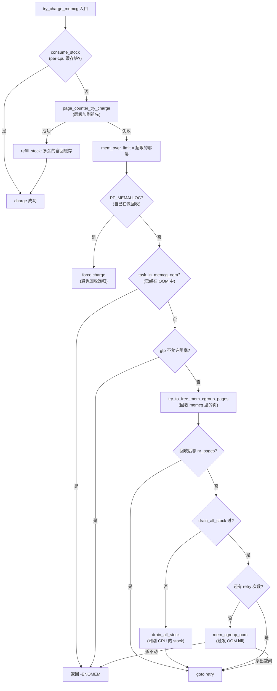

# 第十二章 · memory 子系统(memcg):memory.current 与 charge/OOM

> 篇:第 2 篇 · cgroup 资源控制(进程能用多少)
> 主线呼应:上一章我们看的是 cpu cgroup——它把"一段 CPU 时间"记到 cgroup 的账上,超 `cpu.max` 就被调度器 throttle。这一章换一种资源,也是容器里最容易出事的一种:**内存**。你 `docker run --memory=512m nginx`,容器一旦 malloc 上瘾,内核是怎么做到"杀掉它一个进程,而不是把宿主拖到 OOM"的?答案在 memcg(memory cgroup)。它给每个 cgroup 挂一把"内存账本"(`memory.current`/`memory.max`),每次分配一个 page 都做一次记账(charge),超了就先回收、回收不动就 OOM kill。本章就拆这条 charge 路径,以及它怎么和《mm》的 page 分配咬合在一起。

## 核心问题

**容器是怎么做到"内存超限就杀进程、不连累宿主"的?一个 page 从 `alloc_pages` 到被记进 memcg 的账,内核走的是哪条路?`memory.max` 是怎么变成"上限"的?为什么不是按进程而是按 page 记账?层级 cgroup(子超了父也跟着超)是怎么累加的?OOM kill 时,凭什么只杀容器内的进程?**

读完本章你会明白:

1. memcg 的本质:**每个 cgroup 挂一把 `page_counter` 账本,每个 page 分配时做一次 charge(加到账上),超 `memory.max` 触发 OOM**。
2. 关键设计一:**按 page 记账,不是按进程**——因为 fork 后的 COW 页、共享内存、page cache 都没法归属到某个进程,只能归属到 page 本身。
3. 关键设计二:**层级累加**——子 cgroup 用量自动加到所有祖先(`page_counter` 链),一个祖先超限,子树里谁都分配不动。
4. OOM 机制:**`memory.oom.group` 让一次 OOM kill 整组**——容器被关进 cgroup 盒子,内存炸了整组清空,而不是只杀一个最胖的进程。
5. ★ 对照 runc:Docker 的 `--memory`/`--memory-swap`、K8s 的 `resources.limits.memory`,最终都落到 runc 写 `memory.max`/`memory.swap.max`,触发本章这条 charge 链。

> **逃生阀**:如果 mm 那一侧的 page 分配你已经忘得差不多,只要记住一句话就够看本章——**每个 page 在内存里,memcg 给它打了一个"你属于哪个 cgroup"的标记(`page->memcg_data`)**。分配时打标记 + 记账,释放时抹标记 + 销账。后面所有细节都是围绕"怎么让这件事快、正确、层级化"展开的。

---

## 12.1 一句话点破

> **memcg 就是给每个 cgroup 发一本"内存账本",每个 page 分配时往账上记一笔(charge),超 `memory.max` 就触发 OOM kill。账本不是按进程记,而是按 page 记——因为内存的归属,进程说不清,只有 page 自己说得清。**

这是结论,不是理由。本章倒过来拆:先看朴素地"按进程记内存账"为什么会撞墙,再看 memcg 怎么把账本记到 page 上、怎么一层层累加到祖先、怎么走完"超限 → 回收 → OOM"的全流程,最后钻两个最硬的技巧(`page_counter` 无锁层级累加 + per-cpu stock 批量记账)。

---

## 12.2 朴素地"按进程记账"为什么不行

容器内存限额最朴素的写法,是**按进程**:每个进程在 `task_struct` 里记 `charged_bytes`,分配 page 时加到当前进程头上,超了就杀。

```c
/* 朴素的、糟糕的写法(示意,非源码) */
struct task_struct {
    unsigned long my_charged_bytes;
};

/* page 分配时: */
current->my_charged_bytes += PAGE_SIZE;
if (current->my_charged_bytes > limit)
    oom_kill(current);
```

> **不这样会怎样**:这套写法在三个场景下立刻翻车:

**场景一:fork 后的 COW 页**。父进程 fork 出子进程,两个进程共享同一批 page(写时复制),这批 page 该算到谁头上?算父进程,可父进程可能先死(`wait` 完退出),page 还在用——账就消失了;算子进程,可子进程刚 fork 还没用,父进程却可能在两个子进程之间共享同一页——重复记两遍。**按进程根本算不清 COW 页**。

**场景二:共享内存和 `tmpfs`**。两个进程 `mmap` 同一段 `shmget` 的共享内存,或一起读写同一个 `tmpfs` 文件,这些 page 物理上只有一份,谁分配时就记到谁头上完全是偶然(谁先触发 page fault 谁记)。进程退出时这些 page 还在用,账又对不上。

**场景三:page cache**。容器里 `cat /etc/passwd`,这个文件的 page cache 该算谁?算 `cat`?可它马上就退出了,文件还在 cache 里被下一个进程读。算"最后一次访问的进程"?那容器里所有进程轮流读一个文件,账目就反复迁移。

> **所以这样设计**:把账记到 page 本身上。每个 page 在 `struct page`(更准确说 `struct folio`)里有一个字段 `memcg_data`,标记"我属于哪个 memcg"。分配这个 page 时,内核找到当前的 memcg,把这一页记到它的账上;释放时从账上抹掉。**page 在,账就在;page 被释放,账才销**。这样 COW 页、共享内存、page cache 都能正确归属——不管哪个进程碰它,这个 page 属于哪个 memcg 是固定的。

```c
/* include/linux/memcontrol.h:351-358(简化,真实定义含 MEMCG_DATA_OBJCGS/KMEM 标志位) */
enum page_memcg_data_flags {
    MEMCG_DATA_OBJCGS = (1UL << 0),   /* 这页是 objcgs 向量(slab 用) */
    MEMCG_DATA_KMEM   = (1UL << 1),   /* 这页是内核内存(kmem) */
    __NR_MEMCG_DATA_FLAGS = (1UL << 2),
};
#define MEMCG_DATA_FLAGS_MASK (__NR_MEMCG_DATA_FLAGS - 1)
```

([memcontrol.h:351-360](../linux/include/linux/memcontrol.h#L351-L360))

`page->memcg_data` 的低位拿来当标志位,高位是指针——要么指向 `struct mem_cgroup`(普通用户态页),要么指向 `struct obj_cgroup`(slab/kmem 这种按字节记的)。取出来的时候:

```c
/* include/linux/memcontrol.h:386(简化) */
static inline struct mem_cgroup *__folio_memcg(struct folio *folio)
{
    unsigned long memcg_data = folio->memcg_data;
    /* 低位是标志,清掉就是 memcg 指针 */
    return (struct mem_cgroup *)(memcg_data & ~MEMCG_DATA_FLAGS_MASK);
}
```

([memcontrol.h:386-395](../linux/include/linux/memcontrol.h#L386-L395))

> **钉死这件事**:memcg 记账的根基是 **page→memcg 反查**——每个 page 在 `memcg_data` 字段里打一个"我属于哪个 cgroup"的标记。分配时打标记 + charge,释放时抹标记 + uncharge。不按进程记,因为进程根本说不清这页是谁的(COW、共享内存、page cache 全撞墙)。**page 在,账就在**,这是 memcg 能正确算清容器内存的根本。

---

## 12.3 memcg 的数据结构:一本"层级账本"

账记到 page 上,那"账本"在哪?每个 cgroup 有一个 [`struct mem_cgroup`](../linux/include/linux/memcontrol.h#L200)([memcontrol.h:200](../linux/include/linux/memcontrol.h#L200)),它挂在 cgroup 的 css 上(第 9、10 章讲的 `struct cgroup_subsys_state`),里面就是这本账本:

```c
/* include/linux/memcontrol.h:200(简化,挑本章用得上的字段) */
struct mem_cgroup {
    struct cgroup_subsys_state css;          /* L201 挂到 cgroup */

    struct page_counter memory;              /* L207 主账本(RSS + page cache) */
    union {
        struct page_counter swap;            /* L210 v2: swap 用量 */
        struct page_counter memsw;           /* L211 v1: memory+swap 合计 */
    };
    struct page_counter kmem;                /* L215 v1: 内核内存 */
    struct page_counter tcpmem;              /* L216 v1: tcp 内存 */

    bool oom_group;                          /* L239 memory.oom.group */
    bool oom_lock;                           /* L242 OOM 串行化 */
    int  under_oom;                          /* L243 子树是否在 OOM */

    struct work_struct high_work;            /* L219 memory.high 异步回收 */
    unsigned long soft_limit;                /* L231 memory.low 软限 */

    /* per-cpu 缓存的"批量记账"(后面技巧精解详讲) */
    struct obj_cgroup __rcu *objcg;
    ...
};
```

([memcontrol.h:200-300](../linux/include/linux/memcontrol.h#L200-L300))

核心是 `memory`——一个 [`struct page_counter`](../linux/mm/page_counter.c#L70)([page_counter.c:70](../linux/mm/page_counter.c#L70)),它就是这本"账本"。账本不是平的,而是**层级**的:子 cgroup 的账本挂在父账本下,每记一笔都从自己开始一层层累加到根。`struct page_counter` 长这样(简化):

```c
/* include/linux/page_counter.h(简化) */
struct page_counter {
    atomic_long_t usage;       /* 当前用量(原子,无锁) */
    unsigned long max;         /* 上限(memory.max) */
    unsigned long low;         /* memory.low 保护线 */
    unsigned long min;         /* memory.min 硬保护 */
    unsigned long watermark;   /* 历史峰值(memory.peak) */
    unsigned long failcnt;     /* 失败次数 */
    struct page_counter *parent;  /* ★ 父账本(链到祖先,层级累加靠它) */
};
```

`parent` 字段是层级的命脉。假设你有这样的 cgroup 树:

```
/                    (root_mem_cgroup, A)
└── container1       (memcg B, memory.max=2G)
    ├── app          (memcg C, memory.max=512M)
    └── sidecar      (memcg D, memory.max=256M)
```

那么 `C->memory.parent == B`,`B->memory.parent == A`(root)。C 里分配一个 page,charge 会沿 `parent` 链一路加上去:C.usage++、B.usage++、A.usage++。所以 `memory.current` 在 C 读到 200M,在 B 读到 700M(C 200M + D 500M 假设),在 A 读到全机内存。**子超限当然拦,但任何一个祖先超限,整棵子树都分配不动**——这就是层级限额的来源,后面技巧精解详讲。

整个结构布局:

```
   task_struct
   ├─ cgroups ──► css_set ──► subsys[memory] ──► struct mem_cgroup B (container1)
   │                                              ├─ memory (page_counter)
   │                                              │   ├─ usage: 700M
   │                                              │   ├─ max: 2G
   │                                              │   └─ parent ──┐
   │                                              ├─ swap        │
   │                                              └─ oom_group   ▼
   │                                                      struct mem_cgroup A (root)
   │                                                          └─ memory
   │                                                              └─ parent = NULL
   │
   └─ mm ──► (page fault 时)
              │
              ▼
         struct folio (一个物理页)
         ├─ memcg_data ─► (低位标志 + memcg 指针) ──► memcg B
         └─ ...
```

**关键事实**:`task_struct->cgroups` 指向 css_set,css_set 的 `subsys[memory]` 槽指向当前任务所属的 memcg(的 css,通过 `mem_cgroup_from_css` 内联转成 `struct mem_cgroup *`)。page fault 时,`current` 的 memcg 就是要 charge 的目标。整个反查链是:**task → css_set → memcg css → memcg → page_counter**;反过来 page → memcg 是 `folio->memcg_data`。

---

## 12.4 charge 的完整路径:一次 page fault 怎么落到 memcg 账上

现在把这条路径走完。容器里某个进程访问一个新地址,触发 page fault,内核最终调到 [`__mem_cgroup_charge`](../linux/mm/memcontrol.c#L7293)([memcontrol.c:7293](../linux/mm/memcontrol.c#L7293))。这个函数是 mm 和 memcg 的**接缝**——《mm》那本书讲 page 怎么分配,这里讲这个 page 怎么被记到 memcg 账上:

```c
/* mm/memcontrol.c:7293(简化) */
int __mem_cgroup_charge(struct folio *folio, struct mm_struct *mm, gfp_t gfp)
{
    struct mem_cgroup *memcg;
    int ret;

    memcg = get_mem_cgroup_from_mm(mm);     /* 7298 找到 mm 所属 memcg */
    ret = charge_memcg(folio, memcg, gfp);  /* 7299 charge */
    css_put(&memcg->css);                   /* 7300 放引用 */
    return ret;
}
```

([memcontrol.c:7293-7303](../linux/mm/memcontrol.c#L7293-L7303))

三步:① 找 memcg(从 mm 来,因为 mm 的 owner 进程的 css_set 决定 memcg);② charge(把这一页记到 memcg 账上);③ 放引用。`get_mem_cgroup_from_mm` 在 [memcontrol.c:1079](../linux/mm/memcontrol.c#L1079),它从 `mm->owner`(拥有这个 mm 的进程)拿 css_set,再从 css_set 拿 memcg css,refcount++ 后返回。

`charge_memcg` 在 [memcontrol.c:7279](../linux/mm/memcontrol.c#L7279),它把 charge 拆成两件事:

```c
/* mm/memcontrol.c:7279(简化) */
static int charge_memcg(struct folio *folio, struct mem_cgroup *memcg, gfp_t gfp)
{
    int ret;

    ret = try_charge(memcg, gfp, folio_nr_pages(folio));   /* 7284 试记账 */
    if (ret)
        goto out;

    mem_cgroup_commit_charge(folio, memcg);                /* 7288 打 page->memcg_data 标记 */
out:
    return ret;
}
```

([memcontrol.c:7279-7291](../linux/mm/memcontrol.c#L7279-L7291))

两件事:**try_charge 算账本,commit_charge 打 page 标记**。这两件事分开是有道理的——try_charge 可能因为超限失败(返回 -ENOMEM),也可能因为 reclaim 后又成功,在它返回之前 page 不能挂上 memcg(否则 page 已经算到 memcg 头上了,但 reclaim 还没决定要不要 OOM,会乱)。先 try 成功,再 commit 把 page->memcg_data 指向 memcg(`commit_charge` 在 [memcontrol.c:2949](../linux/mm/memcontrol.c#L2949))。这才完成"page 和账本的对账"。

`try_charge` 是个薄包装([memcontrol.c:2925](../linux/mm/memcontrol.c#L2925)):

```c
/* mm/memcontrol.c:2925(简化) */
static inline int try_charge(struct mem_cgroup *memcg, gfp_t gfp_mask,
                             unsigned int nr_pages)
{
    if (mem_cgroup_is_root(memcg))
        return 0;                          /* root memcg 不记账 */
    return try_charge_memcg(memcg, gfp_mask, nr_pages);
}
```

([memcontrol.c:2925-2932](../linux/mm/memcontrol.c#L2925-L2932))

root memcg(根 cgroup,即没启用限额的"宿主本身")直接返回——这是 memcg 性能的一个重要逃生阀:**没设限额的进程完全不进 charge 路径**,零开销。真正干活的是 [`try_charge_memcg`](../linux/mm/memcontrol.c#L2729)([memcontrol.c:2729](../linux/mm/memcontrol.c#L2729)),它是 memcg 这本书的核心函数,我们一段段拆。

### 第 1 段:per-cpu stock 快速通道

```c
/* mm/memcontrol.c:2729-2745(简化) */
static int try_charge_memcg(struct mem_cgroup *memcg, gfp_t gfp_mask,
                            unsigned int nr_pages)
{
    unsigned int batch = max(MEMCG_CHARGE_BATCH, nr_pages);
    int nr_retries = MAX_RECLAIM_RETRIES;
    ...

retry:
    if (consume_stock(memcg, nr_pages))   /* 2744 先吃 per-cpu 缓存 */
        return 0;
    ...
}
```

([memcontrol.c:2729-2745](../linux/mm/memcontrol.c#L2729-L2745))

`consume_stock` 在 [memcontrol.c:2310](../linux/mm/memcontrol.c#L2310),它做的事是:**每个 CPU 维护一个 `memcg_stock_pcp` 缓存,里面预存了一批已 charge 的 page(默认 32 页),如果当前 CPU 缓存的 memcg 正好是目标 memcg,直接从缓存里扣,n page 的 charge 就免了**。这是 memcg 性能的第二个关键设计——避免每次 page fault 都去碰 `page_counter` 的原子变量。后面技巧精解详讲,这里先知道:**charge 路径有快速通道,大部分小分配走 per-cpu stock,根本不进 page_counter**。

### 第 2 段:层级 charge 到 page_counter

stock 不够,就走慢通道:

```c
/* mm/memcontrol.c:2747-2757(简化) */
    if (!do_memsw_account() ||
        page_counter_try_charge(&memcg->memsw, batch, &counter)) {
        if (page_counter_try_charge(&memcg->memory, batch, &counter))
            goto done_restock;                      /* 2750 成功 */
        if (do_memsw_account())
            page_counter_uncharge(&memcg->memsw, batch);
        mem_over_limit = mem_cgroup_from_counter(counter, memory);
    } else {
        mem_over_limit = mem_cgroup_from_counter(counter, memsw);
    }
```

([memcontrol.c:2747-2757](../linux/mm/memcontrol.c#L2747-L2757))

[`page_counter_try_charge`](../linux/mm/page_counter.c#L97)([page_counter.c:97](../linux/mm/page_counter.c#L97))就是层级累加的核心。它沿着 `counter->parent` 链一路 `atomic_long_add_return`,任何一层超 `max` 就回滚(已加的层 `sub` 回去),返回 false:

```c
/* mm/page_counter.c:97-146(简化) */
bool page_counter_try_charge(struct page_counter *counter,
                             unsigned long nr_pages,
                             struct page_counter **fail)
{
    struct page_counter *c;

    for (c = counter; c; c = c->parent) {       /* 103 从自己往祖先走 */
        long new = atomic_long_add_return(nr_pages, &c->usage);  /* 119 投机加 */
        if (new > c->max) {                     /* 120 超限 */
            atomic_long_sub(nr_pages, &c->usage);  /* 121 撤回 */
            data_race(c->failcnt++);            /* 127 失败计数 */
            *fail = c;                          /* 128 记下哪层失败的 */
            goto failed;
        }
        propagate_protected_usage(c, new);      /* 131 更新 min/low 保护用量 */
        if (new > READ_ONCE(c->watermark))
            WRITE_ONCE(c->watermark, new);      /* 136 更新峰值 */
    }
    return true;

failed:
    for (c = counter; c != *fail; c = c->parent)
        page_counter_cancel(c, nr_pages);       /* 142 撤回更低的祖先 */
    return false;
}
```

([page_counter.c:97-146](../linux/mm/page_counter.c#L97-L146))

这段代码有几个细节,每一个都对应一个真实问题:

**① 投机加,再判上限**。注意是先 `atomic_long_add_return`(L119)再加完之后看 `new > c->max`(L120),不是"读 usage、判上限、再加"。为什么?如果先读再加,两个 CPU 同时读到 `usage=99、max=100`,都判"还差 1,可以加",一起加上去 usage=101,越界。**先加再判**用 `atomic_long_add_return` 的全内存屏障,保证加和判在同一个原子操作里完成;真越界了就 `atomic_long_sub` 撤回(L121)。这是无锁计数器的经典套路——**乐观并发 + 失败回滚**。

**② 失败时记下 `*fail = c`**。哪一层失败很重要,因为回滚时只撤回"失败层以下"的祖先(L142 的 `for c = counter; c != *fail`),失败层自己在 L121 已经撤回过了,不能再撤一次(会变负)。

**③ `watermark` 故意容忍竞争**。注释明说 "This is racy, but we can live with some inaccuracy in the watermark"([page_counter.c:79-85](../linux/mm/page_counter.c#L79-L85))——`memory.peak` 是个统计值,差一点不影响正确性,所以用 `READ_ONCE`/`WRITE_ONCE` 不加锁。这是内核"为统计值让步一致性"的常见权衡。

**④ `propagate_protected_usage` 维护 `memory.min`/`memory.low` 的子树保护用量**(L131,在 [page_counter.c:16-42](../linux/mm/page_counter.c#L16-L42))。`memory.min` 是"硬保护",回收器在系统紧张时尽量不碰这个量;为了知道"父 cgroup 的子树里有多少量是受 min 保护的",需要把每个子 cgroup 的 min 用量累加到父的 `children_min_usage`。这个累加也是无锁的,用 `atomic_long_xchg` 做差量更新。

charge 成功就跳到 `done_restock`,把多 charge 的部分(`batch - nr_pages`)塞回 per-cpu stock(`refill_stock`,[memcontrol.c:2396](../linux/mm/memcontrol.c#L2396)),下次同 memcg 的 charge 就走快速通道了。

### 第 3 段:超限后的回收和 OOM

charge 失败,走 [`mem_over_limit = mem_cgroup_from_counter(counter, memory)`](../linux/mm/memcontrol.c#L2753)([memcontrol.c:2753](../linux/mm/memcontrol.c#L2753))——拿到是哪个 memcg 的哪本账超了。接下来是一长串"先回收,不行再 OOM"的尝试,我把它整理成流程:



([memcontrol.c:2743-2863](../linux/mm/memcontrol.c#L2743-L2863) 的控制流)

这个流程的每一步都解决一个具体问题:

- **`PF_MEMALLOC` 直接 force charge**(L2770-2771):如果当前进程已经在做内存回收(它拿了 `PF_MEMALLOC` 标志,典型是 `kswapd` 或回收路径上 alloc 的进程),charge 失败就强制通过——不然回收自己又要 alloc,alloc 又要 charge,charge 又要回收,**死锁**。这是内核处理"回收递归"的标准逃生阀,允许临时超额换取前向进展。源码注释明说:"we prefer facilitating memory reclaim and getting back under the limit over triggering OOM kills in these cases"([memcontrol.c:2764-2769](../linux/mm/memcontrol.c#L2764-L2769))。
- **`task_in_memcg_oom` 直接失败**(L2773-2774):当前进程已经被 memcg OOM 标记过(等着被杀),不让它再 retry,直接返回 -ENOMEM,避免 OOM 风暴。
- **`drain_all_stock`**(L2790-2794):回收完发现还是差一点,可能是别的 CPU 上缓存了同 memcg 的 stock(还没归还),刷一次再 retry。这是 per-cpu stock 的代价——精度被缓存"借走"了一点,关键时刻要刷回来。
- **最后才 `mem_cgroup_oom`**(L2831-2836):回收 + drain 都不行,才进 OOM kill。注意 kill 完之后 `passed_oom = true; nr_retries = MAX_RECLAIM_RETRIES; goto retry;`——杀一个进程腾出空间了,再试一次;如果杀了还腾不出空间(`task_is_dying()`),才认输返回 -ENOMEM。

> **钉死这件事**:charge 失败不是立刻 OOM,而是走"force(回收路径)→ 自己已在 OOM → 不许阻塞 → 同步回收 → 刷 stock → retry → 最后才 OOM kill → 再 retry"的层层降级。每一层都是为了**尽量避免杀进程**——内核宁可自己苦一下回收,也不轻易杀业务进程。memcg 的设计哲学是:OOM kill 是最后手段,不是第一反应。

---

## 12.5 OOM kill:`memory.oom.group` 凭什么一次清空整组

最后这道 OOM,是怎么杀的?[`mem_cgroup_oom`](../linux/mm/memcontrol.c#L2002)([memcontrol.c:2002](../linux/mm/memcontrol.c#L2002))是入口:

```c
/* mm/memcontrol.c:2002-2053(简化) */
static bool mem_cgroup_oom(struct mem_cgroup *memcg, gfp_t mask, int order)
{
    bool locked, ret;

    if (order > PAGE_ALLOC_COSTLY_ORDER)
        return false;                          /* 2006 大页不 OOM */

    memcg_memory_event(memcg, MEMCG_OOM);      /* 2009 抛 memory.events oom */

    if (READ_ONCE(memcg->oom_kill_disable)) {  /* 2029 用户禁用 OOM killer */
        ...                                    /* 延迟到 fault 末尾再睡 */
        return false;
    }

    mem_cgroup_mark_under_oom(memcg);
    locked = mem_cgroup_oom_trylock(memcg);    /* 2041 串行化 OOM */
    if (locked)
        mem_cgroup_oom_notify(memcg);          /* 通知 oom listener */
    mem_cgroup_unmark_under_oom(memcg);

    ret = mem_cgroup_out_of_memory(memcg, mask, order);   /* 2047 真正杀 */

    if (locked)
        mem_cgroup_oom_unlock(memcg);
    return ret;
}
```

([memcontrol.c:2002-2053](../linux/mm/memcontrol.c#L2002-L2053))

两个细节:

**① `mem_cgroup_oom_trylock` 串行化**(在 [memcontrol.c:1886](../linux/mm/memcontrol.c#L1886))。它用一棵 cgroup 子树范围的全局锁,保证"同一个 memcg 子树同一时刻只有一个 OOM killer 在跑"。为什么必要?想象 100 个进程同时撞 memory.max,如果 100 个都并行去选 victim、杀 victim,可能杀 100 个进程才停——而实际上杀一个进程腾出 100M,够剩下 99 个用了。串行化让"杀一个,看效果"成为可能。

**② `mem_cgroup_out_of_memory` 才是真正杀**(在 [memcontrol.c:1795](../linux/mm/memcontrol.c#L1795))。它构造一个 `struct oom_control`,塞进 `out_of_memory(&oc)`(mm/oom_kill.c 的核心 OOM killer),让 OOM killer 在**这个 memcg 的范围内**选一个最肥的进程杀掉:

```c
/* mm/memcontrol.c:1795-1822(简化) */
static bool mem_cgroup_out_of_memory(struct mem_cgroup *memcg,
                                     gfp_t gfp_mask, int order)
{
    struct oom_control oc = {
        .zonelist = NULL,
        .nodemask = NULL,
        .memcg    = memcg,          /* ★ 只在 memcg 子树里选 victim */
        .gfp_mask = gfp_mask,
        .order    = order,
    };
    bool ret = true;

    if (mutex_lock_killable(&oom_lock))
        return true;
    if (mem_cgroup_margin(memcg) >= (1 << order))
        goto unlock;                /* 1810 拿锁后再看一次,可能别的线程已腾出 */
    ret = task_is_dying() || out_of_memory(&oc);
unlock:
    mutex_unlock(&oom_lock);
    return ret;
}
```

([memcontrol.c:1795-1822](../linux/mm/memcontrol.c#L1795-L1822))

`oc.memcg = memcg` 是关键——它告诉全局 OOM killer:"别在全机选 victim,就在这个 memcg 子树里选"。这就是为什么 `docker run --memory=512m`,容器 OOM 时**只杀容器里的进程,不动宿主其他进程**。mm 那本书讲的 `out_of_memory` 是全机的,memcg 给它加了个 `memcg` 字段当"作用域"。

### `memory.oom.group`:整组清空

但有时候你不只想杀一个最肥的——你想**整组清空**。比如一个 K8s pod 里有多个容器共享一个 cgroup,任何一个容器 OOM 你都想把整个 pod 重启(K8s 的 pod 级重启语义)。这就是 `memory.oom.group`。

`struct mem_cgroup` 里有个 `oom_group` 字段([memcontrol.h:239](../linux/include/linux/memcontrol.h#L239)),用户写 `memory.oom.group=1` 设置它(cftype 在 [memcontrol.c:7071-7076](../linux/mm/memcontrol.c#L7071-L7076))。当 OOM kill 发生时,内核用 [`mem_cgroup_get_oom_group`](../linux/mm/memcontrol.c#L2121)([memcontrol.c:2121](../linux/mm/memcontrol.c#L2121))**从 victim 进程往祖先走,找到最高一层 `oom_group=1` 的 memcg,把这个 memcg 子树里所有可杀进程全杀了**:

```c
/* mm/memcontrol.c:2121-2166(简化) */
struct mem_cgroup *mem_cgroup_get_oom_group(struct task_struct *victim,
                                            struct mem_cgroup *oom_domain)
{
    struct mem_cgroup *oom_group = NULL;
    struct mem_cgroup *memcg;

    if (!cgroup_subsys_on_dfl(memory_cgrp_subsys))
        return NULL;                          /* v1 不支持 */
    if (!oom_domain)
        oom_domain = root_mem_cgroup;

    rcu_read_lock();
    memcg = mem_cgroup_from_task(victim);     /* victim 的 memcg */
    if (mem_cgroup_is_root(memcg))
        goto out;
    if (unlikely(!mem_cgroup_is_descendant(memcg, oom_domain)))
        goto out;                            /* victim 被异步迁走了,放弃 */

    /* 2152: 从 victim 往上找最高一层 oom_group=1 的 */
    for (; memcg; memcg = parent_mem_cgroup(memcg)) {
        if (READ_ONCE(memcg->oom_group))
            oom_group = memcg;                /* 记下,继续往上找更高的 */
        if (memcg == oom_domain)
            break;
    }

    if (oom_group)
        css_get(&oom_group->css);             /* 拿引用给调用者 */
out:
    rcu_read_unlock();
    return oom_group;
}
```

([memcontrol.c:2121-2166](../linux/mm/memcontrol.c#L2121-L2166))

注意 L2152 的循环:**从 victim 一路往上,只要哪层 `oom_group=1` 就记下,继续往上找更高的**。最后 `oom_group` 是最高一层设置了 `oom_group` 的祖先。这种"找最高祖先"的语义对应一个场景:容器里套了子 cgroup(`container/webapp`、`container/db`),只要某一层设了 `oom_group`,OOM 就清空那一层以下的所有进程。比如 `container` 设了 `oom_group=1`,那 `webapp` 和 `db` 任一个 OOM,整个 `container` 子树都被清——K8s pod 的"任一容器 OOM 整 pod 重启"就这么实现。

> **钉死这件事**:memcg OOM kill 有两层作用域。**默认作用域**:`oc.memcg = memcg`,OOM killer 只在超限 memcg 子树里选一个最肥的 victim 杀。**`memory.oom.group=1`**:`mem_cgroup_get_oom_group` 从 victim 往祖先找最高一层设了的 memcg,把这个 memcg 子树里所有进程全杀——这是 K8s pod 级 OOM 重启的内核支撑。两层都靠"OOM killer 的作用域参数",不是另起一套杀进程的代码。

---

## 12.6 用户态接口:`memory.current`/`memory.max`/`memory.oom.group`

memcg 暴露给用户态的文件在 [`memory_files[]`](../linux/mm/memcontrol.c#L7014)([memcontrol.c:7014](../linux/mm/memcontrol.c#L7014)),这是 cgroup v2 的 cftype 表(第 9 章讲的 `struct cftype`):

| 文件 | 读写 | 含义 | 对应源码 |
|------|------|------|----------|
| `memory.current` | 只读 | 当前用量(page_counter.usage) | `memory_current_read`@6691 |
| `memory.max` | 读写 | 内存上限 | `memory_max_show`@6802 / `memory_max_write`@6808 |
| `memory.peak` | 只读 | 历史峰值 | `memory_peak_read` |
| `memory.high` | 读写 | 软上限(超了异步回收,不 OOM) | `memory_high_show/write` |
| `memory.low` | 读写 | 软保护线(回收时尽量不碰) | `memory_low_show/write` |
| `memory.min` | 读写 | 硬保护线 | `memory_min_show/write` |
| `memory.swap.max` | 读写 | swap 上限 | `swap_max_write`@8031 |
| `memory.oom.group` | 读写 | OOM 整组清空 | `memory_oom_group_show/write`@7074 |
| `memory.events` | 只读 | 事件计数(low/high/max/oom/oom_kill/oom_group_kill) | `memory_events_show`@6853 |
| `memory.events.local` | 只读 | 本 cgroup 的 events(不含子树) | `memory_events_local_show` |
| `memory.stat` | 只读 | 详细统计(cache/rss/swap/slab 等) | `memory_stat_show` |
| `memory.reclaim` | 只写 | 触发主动回收 | `memory_reclaim` |

([memory_files cftype 表 @memcontrol.c:7014-7083](../linux/mm/memcontrol.c#L7014-L7083))

挑两个关键的讲:

**`memory.current`**:它的读函数是 [`memory_current_read`](../linux/mm/memcontrol.c#L6691)([memcontrol.c:6691](../linux/mm/memcontrol.c#L6691)),返回 `page_counter_read(&memcg->memory)`——就是 `atomic_long_read(&counter->usage)`,一次原子读。这就是 `cat /sys/fs/cgroup/xxx/memory.current` 拿到的字节数。它**包含子树所有 cgroup 的用量**(因为是层级累加),所以容器里嵌套 cgroup 时,父的 `memory.current` = 所有子树之和。

**`memory.max` 写**:这是最有意思的接口,因为写它**不只是改个数字**:

```c
/* mm/memcontrol.c:6808-6852(简化) */
static ssize_t memory_max_write(struct kernfs_open_file *of,
                                char *buf, size_t nbytes, loff_t off)
{
    struct mem_cgroup *memcg = mem_cgroup_from_css(of_css(of));
    unsigned int nr_reclaims = MAX_RECLAIM_RETRIES;
    bool drained = false;
    unsigned long max;
    int err;

    buf = strstrip(buf);
    err = page_counter_memparse(buf, "max", &max);   /* "max" 关键字=无穷 */
    if (err)
        return err;

    xchg(&memcg->memory.max, max);                   /* 6822 改上限 */

    for (;;) {
        unsigned long nr_pages = page_counter_read(&memcg->memory);
        if (nr_pages <= max)
            break;                                   /* 用量已在限内 */
        if (signal_pending(current))
            break;
        if (!drained) {
            drain_all_stock(memcg);                  /* 刷 stock 重算 */
            drained = true;
            continue;
        }
        if (nr_reclaims) {
            if (!try_to_free_mem_cgroup_pages(memcg, nr_pages - max,
                    GFP_KERNEL, MEMCG_RECLAIM_MAY_SWAP))
                nr_reclaims--;
            continue;                                /* 回收超出的部分 */
        }
        memcg_memory_event(memcg, MEMCG_OOM);
        if (!mem_cgroup_out_of_memory(memcg, GFP_KERNEL, 0))
            break;                                   /* 回收不动 → OOM kill */
    }
    ...
    return nbytes;
}
```

([memcontrol.c:6808-6852](../linux/mm/memcontrol.c#L6808-L6852))

注意 `xchg(&memcg->memory.max, max)` 之后那个 for 循环——**如果你把一个已经在用 1G 内存的容器 `memory.max` 调到 512M,内核会立刻替你回收 + OOM,直到用量降到 512M 为止**。这是 memcg 的一个语义亮点:设限额不是"将来不许超",而是"现在就得回到限额内"。K8s 的 `kubectl edit limits` 改内存上限能立刻生效,就是这个 write 路径在做苦力。

> **钉死这件事**:memcg 的用户态接口是一组 cftype 文件(`memory.current`/`memory.max`/`memory.oom.group` 等),读 = 看 `page_counter.usage`,写 = 改 `page_counter.max` + 触发回收/OOM。`memory.max` 写函数最重——它不只是改个数字,而是把已超限的部分立刻回收掉,收不掉就 OOM。所以在线调容器的内存限额是**即时生效且可能杀进程**的。

---

## 12.7 技巧精解:page→memcg 反查 + 层级累加 + per-cpu stock

这一章最硬的三个技巧,我们单独拆透。这三个技巧是 memcg 能"又准又快又层级化"的根基。

### 技巧一:`page_counter` 的无锁层级累加

memcg 是层级化的——子 cgroup 用量累加到所有祖先。这意味着**每次 charge 一个 page,要改 N 个 page_counter 的 usage**(N 是祖先深度,容器场景通常 2~5 层)。如果用普通的自旋锁保护这 N 个计数器,会撞上两个问题:① 高并发下锁竞争(几百个 CPU 同时 charge 不同 memcg,但它们共享某些祖先,比如 root);② 缓存行抖动(锁变量在多个 CPU 之间来回弹)。

Linux 的做法是**完全无锁**,每个 `page_counter` 的 `usage` 是独立的 `atomic_long_t`,charge 时沿 parent 链做 `atomic_long_add_return`:

```c
/* mm/page_counter.c:70-86(简化,见 page_counter_charge) */
void page_counter_charge(struct page_counter *counter, unsigned long nr_pages)
{
    struct page_counter *c;
    for (c = counter; c; c = c->parent) {       /* 从自己到根 */
        long new = atomic_long_add_return(nr_pages, &c->usage);
        propagate_protected_usage(c, new);
        if (new > READ_ONCE(c->watermark))
            WRITE_ONCE(c->watermark, new);
    }
}
```

([page_counter.c:70-86](../linux/mm/page_counter.c#L70-L86))

**整个 charge 路径没有一个锁**。两个 CPU 同时 charge 同一个 memcg,它们各自做 `atomic_long_add_return`,硬件保证原子性,不需要任何内核同步原语。两个 CPU 同时 charge 不同 memcg 但共享某祖先(比如 root),它们各自对 root 的 `usage` 做 `atomic_long_add_return`,硬件 cache 协议保证正确性。

> **反面对比**:朴素地写,会给每个 page_counter 配一个 `spinlock_t`,charge 时一路 lock 自己 + 所有祖先、改 usage、再 unlock。结果:① root memcg 的锁被所有 CPU 抢(因为所有 charge 都要改 root),成为全局瓶颈;② 锁链长,容易死锁(不同 CPU 的 charge 顺序不一致);③ 缓存行 ping-pong 严重。无锁设计直接消灭这些问题——这是 memcg 在大规模容器场景(一个 K8s 节点几百个 pod)能扛住的根本。

但无锁有个微妙之处:**try_charge 时怎么判断"超 max"?** 看上面的代码,是先 `atomic_long_add_return` 加完,再看 `new > c->max`。这意味着 **usage 会临时越过 max 一点点**(在 `atomic_long_sub` 撤回之前)。这是允许的——`memory.max` 是软限,允许几个 page 的临时超额,只要最终被撤回。注释明说:"This is indeed racy, but we can live with some inaccuracy"([page_counter.c:104-118](../linux/mm/page_counter.c#L104-L118))。这是无锁设计的典型权衡:**用少量精度换取无锁的高性能**。

还有 `watermark`(峰值)和 `failcnt`(失败次数)也是 `data_race()` 标记的竞争访问——它们是统计值,差几个不影响正确性,内核不为它们付锁代价。这种"分清什么是必须精确的(usage)、什么是可以模糊的(watermark/failcnt)"的工程判断,在 memcg 源码里随处可见,值得品味。

### 技巧二:per-cpu stock 批量记账

无锁层级累加解决了"charge 一个 page 要改 N 个原子变量"的并发问题,但**没解决"每次 page fault 都走一次原子操作"的频率问题**。一个繁忙的容器一秒能触发几万次 page fault,每次都做 5 层 `atomic_long_add_return`,即便无锁,cache 行在 CPU 之间弹也够喝一壶。

memcg 的解法是**每 CPU 批量记账**(per-cpu stock)。每个 CPU 有一个 [`struct memcg_stock_pcp`](../linux/mm/memcontrol.c#L2256)([memcontrol.c:2256](../linux/mm/memcontrol.c#L2256)),里面缓存了一批已 charge 的 page(默认 32 页 = `MEMCG_CHARGE_BATCH`):

```c
/* mm/memcontrol.c:2256(简化) */
struct memcg_stock_pcp {
    struct mem_cgroup *cached;     /* 这个 stock 缓存的 memcg */
    unsigned int nr_pages;         /* 缓存了多少 page(已 charge) */
    struct obj_cgroup *cached_objcg;
    int nr_bytes;
    unsigned long flags;
    struct work_struct work;
};
static DEFINE_PER_CPU(struct memcg_stock_pcp, memcg_stock);
```

([memcontrol.c:2256-2275](../linux/mm/memcontrol.c#L2256-L2275))

charge 的快速通道就是从这个缓存里扣:

```c
/* mm/memcontrol.c:2310-2330(简化,见 consume_stock) */
static bool consume_stock(struct mem_cgroup *memcg, unsigned int nr_pages)
{
    struct memcg_stock_pcp *stock;
    bool ret = false;

    if (nr_pages > MEMCG_CHARGE_BATCH)
        return ret;                           /* 大分配不走 stock */

    local_lock_irqsave(&memcg_stock.stock_lock, flags);
    stock = this_cpu_ptr(&memcg_stock);
    if (memcg == READ_ONCE(stock->cached) && stock->nr_pages >= nr_pages) {
        stock->nr_pages -= nr_pages;          /* 直接扣,不动 page_counter */
        ret = true;
    }
    local_unlock_irqrestore(&memcg_stock.stock_lock, flags);
    return ret;
}
```

([memcontrol.c:2310-2330](../linux/mm/memcontrol.c#L2310-L2330))

**注意这里完全没有动 `page_counter`**。stock 里的 page 是**之前某次 charge 多 charge 的部分**——`try_charge_memcg` 成功后,batch 是 32 页但实际只要 1 页,多出的 31 页塞回 stock([memcontrol.c:2865-2867](../linux/mm/memcontrol.c#L2865-L2867) 的 `done_restock: refill_stock(memcg, batch - nr_pages)`)。下次同 memcg 的 charge,直接从 stock 扣,直到 stock 见底才再走一次 `page_counter_try_charge` 批量 charge 32 页。

效果:**32 次 page fault 才动一次 `page_counter`**。对一个繁忙容器,charge 路径的原子操作频率降到 1/32,cache 行 ping-pong 大幅减少。

> **反面对比**:朴素地写,每次 charge 都走一次 `page_counter_try_charge`(5 层原子加)。一个 64 核机器跑 200 个容器,假设每核每秒 1 万次 page fault,全局原子操作频率 = 64×10000×5 = 320 万次/秒,绝大部分落在共享的祖先 memcg(比如 root)上,cache 行在 64 个核之间疯狂弹,L1/L2 miss 暴涨。per-cpu stock 把这个频率降到 1/32,而且**每个 CPU 只动自己的 stock**(本地变量,无竞争),只在 stock 见底时碰一次 `page_counter`。这是典型的"per-cpu 批量化"思路,和第 8 本《内存分配器》的 per-CPU cache、上一本《mm》的 per-cpu pageset、第 11 本《调度器》的 per-CPU rq 是同一套设计哲学——**把高频的全局计数,降频批量化到每 CPU**。

但 stock 有代价:**精度损失**。stock 里缓存的 page 已经 charge 到 page_counter 了,但还没被任何具体分配"消耗"。这意味着 `memory.current` 会临时比真实用量高一点(最多 32 页 × CPU 数)。memcg 用两个机制对付:① **charge 失败时 `drain_all_stock`**([memcontrol.c:2409](../linux/mm/memcontrol.c#L2409))——把全机所有 CPU 的 stock 刷掉,让 page_counter 回归精确,再 retry;② **`memory.high` 异步回收**——超过 high 时 `schedule_work(&memcg->high_work)`,后台回收,容忍临时超额。这是"用精度换性能"的工程权衡,和 `watermark` 的容忍竞争是同一种思路。

### 技巧三:obj_cgroup —— slab/小对象的二级账本

到这里讲的都是 page 级记账。但容器里还有一类内存:**slab**(内核数据结构缓存,如 `struct file`、`struct inode`、`struct task_struct` 本身)。slab 一个对象可能只有几十字节,给每个对象都挂一个 `mem_cgroup *` 指针太亏(指针 8 字节,对象本身可能才 32 字节,膨胀 25%)。而且 slab 是 slab 分配器管的,memcg 不该侵入 slab 分配器的内部数据结构。

memcg 的解法是**二级账本 `obj_cgroup`**([memcontrol.h:184](../linux/include/linux/memcontrol.h#L184)):

```c
/* include/linux/memcontrol.h:184(简化) */
struct obj_cgroup {
    struct percpu_ref refcnt;        /* 引用计数 */
    struct mem_cgroup *memcg;        /* 归属的 memcg */
    atomic_t nr_charged_bytes;       /* 字节级的"零头"账 */
    union {
        struct list_head list;       /* 在 memcg->objcg_list 上 */
        struct rcu_head rcu;         /* RCU 释放 */
    };
};
```

([memcontrol.h:184-192](../linux/include/linux/memcontrol.h#L184-L192))

`obj_cgroup` 是一个**共享的二级账本**:同一个 memcg 下成千上万个 slab 对象不各挂一个 memcg 指针,而是**共享一个 obj_cgroup**(`folio->memcg_data` 的低位 `MEMCG_DATA_KMEM=1`,高位指向 obj_cgroup 而不是 mem_cgroup)。slab 分配一个对象时,调 [`obj_cgroup_charge`](../linux/mm/memcontrol.c#L3556)([memcontrol.c:3556](../linux/mm/memcontrol.c#L3556)):

```c
/* mm/memcontrol.c:3556-3598(简化) */
int obj_cgroup_charge(struct obj_cgroup *objcg, gfp_t gfp, size_t size)
{
    unsigned int nr_pages, nr_bytes;

    if (consume_obj_stock(objcg, size))      /* 3561 同样有 per-cpu stock */
        return 0;

    nr_pages = size >> PAGE_SHIFT;           /* 字节数拆成"整页 + 零头" */
    nr_bytes = size & (PAGE_SIZE - 1);
    if (nr_bytes)
        nr_pages += 1;                       /* 有零头就多算一页 */

    ret = obj_cgroup_charge_pages(objcg, gfp, nr_pages);   /* 按 page charge */
    if (!ret && nr_bytes)
        refill_obj_stock(objcg, PAGE_SIZE - nr_bytes, false);  /* 把零头还回 stock */
    return ret;
}
```

([memcontrol.c:3556-3598](../linux/mm/memcontrol.c#L3556-L3598))

精妙之处:**字节级记账被转换成 page 级记账**。一个 100 字节的 slab 对象,实际 charge 一整页(4096 字节),多出的 3996 字节塞回 obj_cgroup 的 per-cpu stock(`refill_obj_stock`),下次小对象分配直接从 stock 扣。这样 memcg 复用同一套 `page_counter` 层级账本(通过 `obj_cgroup_charge_pages` → `try_charge`),不需要为 slab 单独搞一套字节级计数器。

> **反面对比**:朴素地写,要么给每个 slab 对象挂 memcg 指针(指针膨胀),要么给 memcg 维护一个原子字节计数器(不是 page 对齐,和 `page_counter` 对不上,层级累加难)。`obj_cgroup` 用一个共享的二级结构 + 字节零头 stock,把"字节级 slab 记账"统一到"page 级 memcg 记账",复用整套层级 `page_counter`,零膨胀、零特殊路径。这种"用一层间接换统一"的思路,和第 9 章的 `css_set` 去重表(任务↔cgroup 多对多)是同一套工程设计美学。

> **钉死这件事**:memcg 的三个核心技巧——**page→memcg 反查**(账记到 page 上,COW/共享内存/page cache 都能算清)、**page_counter 无锁层级累加**(原子操作沿 parent 链,无锁高并发)、**per-cpu stock 批量记账**(32 次小分配才动一次 page_counter)+ **obj_cgroup 二级账本**(slab 字节级记账统一到 page 级)——共同实现了"在 64 核机器跑 200 个容器、每秒几十万次内存分配"场景下,memcg 仍能正确又高效地记账。这三招都不是 memcg 独有,和《内存分配器》的 per-CPU cache、《mm》的 per-cpu pageset 是同一种"per-cpu 批量化 + 层级无锁"的内核工程范式。

---

## 12.8 ★ 对照 runc:Docker `--memory`/K8s `limits.memory` 落到哪

内核提供 `memory.max`/`memory.swap.max`/`memory.oom.group` 这些 cftype 文件,真正把它们设进容器的是用户态运行时。runc(以及 OCI cgroups 库)的 v2 路径在 `vendor/github.com/opencontainers/cgroups/fs2/memory.go`:

```go
// vendor/github.com/opencontainers/cgroups/fs2/memory.go(简化,真实代码见 L40-L70)
func (s *Memory) Set(path string, r *resources.Resources) error {
    if r.MemorySwap != 0 {
        swapStr := strconv.FormatInt(r.MemorySwap-r.Memory, 10)
        if err := cgroups.WriteFile(path, "memory.swap.max", swapStr); err != nil {
            return err       // L55 写 memory.swap.max
        }
    }
    if r.Memory != 0 {
        val := strconv.FormatInt(r.Memory, 10)
        if err := cgroups.WriteFile(path, "memory.max", val); err != nil {
            return err       // L64 写 memory.max
        }
    }
    ...
}
```

([runc: vendor/github.com/opencontainers/cgroups/fs2/memory.go L55, L64](../runc/vendor/github.com/opencontainers/cgroups/fs2/memory.go#L55))

`r.Memory` 来自 OCI spec 的 `linux.resources.memory.limit`(Docker 的 `--memory`、K8s 的 `resources.limits.memory`),runc 把它转成字符串写进 `memory.max`。这一写就触发了我们前面讲的 [`memory_max_write`](../linux/mm/memcontrol.c#L6808)——如果容器当时已经在用 1G 内存、你写 `memory.max=512M`,内核立刻开始回收 + 必要时 OOM kill。所以**Docker 的 `--memory` 不是"建议",是硬限**,超了内核会真杀。

systemd 模式下(`systemd/v2.go`)走的是 systemd 的单位属性(`MemoryMax`/`MemorySwapMax`/`MemoryHigh`),最终也是落到这几个 cgroup v2 文件。

| 用户态 | 接口 | 内核 |
|--------|------|------|
| `docker run --memory=512m` | OCI: `linux.resources.memory.limit` | 写 `memory.max` → `memory_max_write` |
| `docker run --memory-swap=1g` | OCI: `linux.resources.memory.swap` | 写 `memory.swap.max` → `swap_max_write` |
| K8s `resources.limits.memory` | 同上 | 同上 |
| K8s pod 级 OOM 重启 | OCI: `linux.resources.memory.disableOOMKiller` 或 `oom_group` | 写 `memory.oom.group` |
| `docker stats` 看内存 | OCI: 读 stat | 读 `memory.current` / `memory.stat` |
| K8s `kubectl top pod` | cAdvisor 读 | 读 `memory.current`(经 rstat 聚合) |

> **钉死这件事**:Docker 的 `--memory`、K8s 的 `limits.memory`、pod 级 OOM 重启,这些用户态语义最终都落到 runc 写 `memory.max`/`memory.swap.max`/`memory.oom.group` 这几个 cgroup v2 文件——本章讲的 charge 路径、OOM kill、`oom_group` 整组清空,就是这些用户态配置的内核执行体。两本(内核 vs 运行时)对齐了,容器的内存限额才完整。

---

## 章末小结

这一章我们钻完了 cgroup 资源控制里最复杂的一个 controller——memory。回到二分法:**memcg 服务的是"资源"那面**,具体回答"这个容器能用多少内存"。它的整套机制——page→memcg 反查、page_counter 层级账本、per-cpu stock 批量记账、obj_cgroup 二级账本、OOM kill 整组清空——都是为了一个目标:**精确、高效、层级化地把每个 page 记到正确的 cgroup 账上,超限时不连累宿主**。

1. **memcg 的本质**:`struct mem_cgroup` 挂在 cgroup 的 css 上,里面有一本 `page_counter` 账本(`memory`),记录这个 cgroup 子树的内存用量。
2. **charge 的根本是 page→memcg 反查**:每个 page 在 `memcg_data` 字段里标记所属 memcg,分配时打标记 + charge,释放时抹标记 + uncharge。按 page 记账,不按进程——因为 COW、共享内存、page cache 按进程算不清。
3. **层级累加靠 `page_counter->parent` 链**:`page_counter_try_charge` 沿 parent 链一路原子加,任何一层超 `max` 就回滚。子超当然拦,任何一个祖先超限,整棵子树都分配不动。
4. **charge 失败不是立刻 OOM**:而是层层降级——force(回收路径)→ 自己已在 OOM → 不许阻塞 → 同步回收 → 刷 stock → retry → 最后才 OOM kill。内核宁可自己苦,也不轻易杀进程。
5. **`memory.oom.group` 整组清空**:`mem_cgroup_get_oom_group` 从 victim 往祖先找最高一层设了的 memcg,把这个 memcg 子树里所有进程全杀——K8s pod 级 OOM 重启的内核支撑。

### 五个"为什么"清单

1. **为什么 memcg 按 page 记账,不按进程?** fork 后的 COW 页、共享内存、page cache 都没法归属到某个具体进程(进程死了 page 还在用、多进程共享同一页、page cache 谁最后访问算谁的)。按 page 记账,page 在账就在,page 释放账才销,三种场景都能正确归属。
2. **为什么 memcg 能做到层级限额?** `page_counter` 有 `parent` 指针,charge 时沿 parent 链一路加到根。子超拦子,祖先超拦整棵子树。这是"层级资源约束"的数据结构根基。
3. **为什么 `page_counter` 不用锁?** 每个 counter 的 `usage` 是独立的 `atomic_long_t`,charge 是沿链做 `atomic_long_add_return`,硬件保证原子性,不需要内核同步原语。代价是 usage 会临时越过 max 几个 page(在撤回前),内核接受这个精度损失换零锁竞争。
4. **为什么需要 per-cpu stock?** 无锁解决了并发,但没解决频率——每次 page fault 都做 5 层原子加,cache 行在 CPU 之间弹。per-cpu stock 把 32 次小分配合并成 1 次 page_counter 操作,每个 CPU 只动自己的本地缓存,频率降到 1/32。代价是 `memory.current` 临时偏高最多 32 页 × CPU 数,charge 失败时 `drain_all_stock` 刷回精确。
5. **为什么 memcg OOM 只杀容器内进程?** `mem_cgroup_out_of_memory` 构造 `oom_control` 时塞了 `oc.memcg = memcg`,告诉全局 OOM killer 只在这个 memcg 子树里选 victim。所以容器 OOM 不连累宿主其他进程。`memory.oom.group` 进一步把作用域扩大到"victim 的最高 oom_group 祖先",实现整组清空。

### 想继续深入往哪钻

- **源码**:`mm/memcontrol.c` 是 memcg 主战场,关键函数本章都标了行号;`mm/page_counter.c` 是层级账本(只有 200 多行,建议通读);`mm/oom_kill.c` 是全局 OOM killer,`out_of_memory` 接受 `oc.memcg` 参数实现作用域限制;`include/linux/memcontrol.h` 的 `struct mem_cgroup`/`struct obj_cgroup`/`folio_memcg` 是数据结构入口。
- **观测**:在容器里 `cat /sys/fs/cgroup/memory.current`(看用量)、`memory.max`(看上限)、`memory.events`(看 oom/oom_kill 计数)、`memory.stat`(看详细统计 RSS/cache/swap/slab)。`cat /proc/<pid>/cgroup` 看进程在哪个 memcg。`docker stats` 看 container 维度,`kubectl top pod` 看 pod 维度。
- **延伸**:`Documentation/admin-guide/cgroup-v2.rst` 的 Memory Controller 段落(官方语义);`Memory Reclaim` 路径(`try_to_free_mem_cgroup_pages`)和《mm》回收章节的咬合;`swap` 记账(`memory.swap.max`、`do_memsw_account`);`zswap` 压缩后端(`obj_cgroup_charge_zswap`@8199);K8s 的 cgroup v2 最佳实践(`memory.oom.group` 用在 pod 级 cgroup)。
- **对照**:《mm》的 page 分配路径(`alloc_pages` → `__mem_cgroup_charge`)和本章的 charge 路径是同一条链的两段;《调度器》的 cpu cgroup throttle(上一章 P2-11)和 memcg OOM 是 cgroup 资源控制的两个典型范式(throttle vs kill),值得对比——throttle 是"减速但不杀",OOM 是"直接杀"。

### 引出下一章

cpu.max 是 throttle(减速),memory.max 是 OOM(杀进程),这是 cgroup 资源控制的两种典型语义。下一章换一种资源:**块设备 IO**。`io.max` 限 IOPS/BPS,既不是 throttle(还能跑,只是慢)也不是 OOM(没进程可杀),而是一种**限流 + 代价模型**——blk-iocost 把不同 IO 代价(随机 4K 和顺序 1M 不一样)抽象成 token,精确分配 IOPS/BPS。我们会回扣《块设备》这本书,讲清容器 IO 限额的实现路径,以及它为什么比 cpu/memory 都难。
