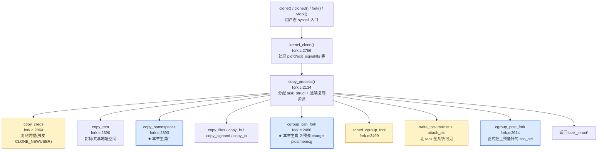
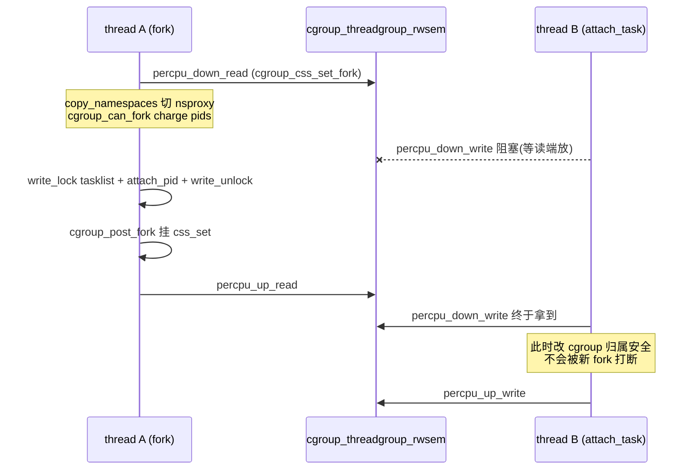

# 第十五章 · `clone(CLONE_NEW*)`:一次系统调用造命名空间

> 篇:P3 容器组装
> 主线呼应:第 1 篇讲透了 7 种 namespace 各自怎么切视图(P1-02 总入口 + P1-03~08 六种 ns),第 2 篇讲透了 cgroup 怎么把进程迁进限额(P2-09~14)。但读者一定还憋着一个问题:runc 启动一个容器,底层调的到底是哪一次系统调用?一句话,是 `clone(CLONE_NEWNS | CLONE_NEWPID | CLONE_NEWNET | CLONE_NEWIPC | CLONE_NEWUTS | CLONE_NEWUSER)`——一次系统调用,一个 `unsigned long flags` 的 7 个位,内核就给子进程**一次性**造出全套命名空间,中途任何一步失败都全回滚,绝不会留下一个"新 mnt + 旧 pid + 新 net"的半新半旧进程。这一章不是把 P1-02 的 `copy_namespaces`/`create_new_namespaces` 再讲一遍,而是把视角抬到 **fork 调用链的总图**:从 `SYSCALL_DEFINE5(clone)`/`SYSCALL_DEFINE2(clone3)` 的入口、`kernel_clone` → `copy_process` 的总调度、`copy_namespaces` 与 `cgroup_can_fork` 的交错,到 `CLONE_NEW*` 7 个标志位的位掩码布局、`CAP_SYS_ADMIN` 权限闸门、`CLONE_NEWUSER` 的"不要 CAP_SYS_ADMIN"特例、`CLONE_NEWPID` 为何"延迟一代"生效、runc 的 `Namespaces.CloneFlags()` 怎么把 8 个位拼成一个 `uintptr`。读完,你该能在脑子里画出一次 `clone(CLONE_NEW*)` 从 glibc 到 task_struct 挂上 nsproxy 的完整时序。

## 核心问题

**为什么 Linux 选了"一次 clone 切多种 namespace"而非"每种 ns 单独一个系统调用"?fork 路径里 `copy_namespaces`(L2393)和 `cgroup_can_fork`(L2486)、`cgroup_post_fork`(L2614)谁先谁后,为什么要这样排序?7 个 `CLONE_NEW*` 标志位为什么这样编号、为什么 `CLONE_NEWUSER` 是唯一一个不需要 `CAP_SYS_ADMIN` 的?新建 7 种 ns 各自的代价差多少(net/mnt 重,pid/uts 轻)?**

读完本章你会明白:

1. **fork 调用链总图**:`clone`/`clone3` syscall → `kernel_clone` → `copy_process` → `copy_namespaces` + `cgroup_can_fork`/`cgroup_post_fork` 这条主轴,以及 `copy_namespaces` 内部如何把"切多种视图"压成一次 `create_new_namespaces`(全成或全回滚)。
2. **`CLONE_NEW*` 7 个位的布局与含义**:`flags` 是 `unsigned long`,低 8 位是退出信号,中段是共享选项,高段是 namespace;`CLONE_NEWUSER` 与 `CLONE_NEWPID` 不能与 `CLONE_THREAD` 共用,`CLONE_NEWNS` 不能与 `CLONE_FS` 共用——这些互斥约束堵的是语义冲突。
3. **权限闸门**:`ns_capable(user_ns, CAP_SYS_ADMIN)` 是 6 种 ns 的统一闸门,唯独 `CLONE_NEWUSER` 走自己的权限模型(`create_user_ns` 内的 `unprivileged_userns_clone` sysctl 与 `current userns depth` 检查)——这是容器安全的基石,P1-08 详讲。
4. **`copy_namespaces` 与 `cgroup_can_fork` 的交错**:fork 时 cgroup 先在 `can_fork` 阶段 charge 资源(pids 计数 +1、memcg 提前 reservation)、在 `post_fork` 阶段正式挂 css_set;namespace 是另一条独立路径,在 `copy_process` 中段一次性切。两者通过 `cgroup_threadgroup_rwsem` 串行化,保证"造 ns"和"改 cgroup 归属"不抢跑。
5. ★ 对照 runc:`runc/libcontainer/configs/namespaces_syscall.go` 的 `Namespaces.CloneFlags()` 用一个 for 循环把容器 config 里要新建的 ns 位全部 OR 起来,得到的 `uintptr` 就是 clone 的第一个参数——这就是"内核只提供位掩码,runc 只提供配置"的接口哲学。

> **逃生阀**:本章代码会反复出现 `flags & CLONE_NEW*` 掩码判定、`goto bad_fork_xxx` 回滚链、`percpu_down_read(&cgroup_threadgroup_rwsem)` 三条模式。抓住三条就抓住了 80%:第一条是"标志位驱动",第二条是"原子回滚",第三条是"fork 和 cgroup 迁移不抢跑"。读不懂某段细节时,先问"这段是在判定标志位、是在回滚已造资源、还是在和 cgroup 迁移抢锁"。

---

## 15.1 一句话点破

> **`clone(CLONE_NEW*)` 把"切 7 种视图"压成一次系统调用——一个 `unsigned long flags` 的位掩码一次性表达"要哪些新 ns",`copy_process` 里的 `copy_namespaces` 把它交给 `create_new_namespaces`,后者用"构造失败反序回滚链"保证全成或全回滚;同时 `cgroup_can_fork`/`cgroup_post_fork` 在 fork 的另一条路径上把进程的 cgroup 归属预先准备好。fork 路径选"一次切多种 ns"而非"每种 ns 一个系统调用",是因为前者能保证原子性、后者必然留下半新半旧的进程。**

这是结论,不是理由。本章倒过来拆:先从最顶层的 `clone` syscall 入口往下,看清 `kernel_clone` → `copy_process` 的总图;再钻进 `copy_process` 里那串按顺序排开的 `copy_*` 函数,定位 `copy_namespaces` 在哪一步、`cgroup_can_fork` 在哪一步、为什么这样排;然后拆 `CLONE_NEW*` 7 个标志位的编号、互斥约束、权限闸门;接着讲 `create_new_namespaces` 的回滚链(本章只点骨架,P1-02 已细讲);最后看 7 种 ns 各自的代价差、`CLONE_NEWUSER` 的特殊权限模型,以及 runc 怎么把一个 `Namespaces` 配置结构翻译成一个 clone 标志位。

> **本章不重复 P1-02**:P1-02 已逐行拆透 `copy_namespaces`/`create_new_namespaces`/`switch_task_namespaces`/`ns_common`+`proc_ns_operations` 的内部机制。本章的视角是**fork 调用链的总图 + `CLONE_NEW*` 标志位本身 + fork/cgroup 两路并行的编排**,看的是"`copy_namespaces` 在 fork 路径里处在什么位置",而不是"`copy_namespaces` 内部怎么写"。

---

## 15.2 fork 总图:从 syscall 到 task_struct 挂上 nsproxy

进入 namespace 造物主视角之前,先看清"造一个新 task"的总体编排。Linux 提供 4 个用户态入口创建进程:

| syscall | 行号 | 用途 |
|---------|------|------|
| `fork()` | [fork.c:2879](../linux/kernel/fork.c#L2879) | 最老最朴素,父子不共享任何资源 |
| `vfork()` | [fork.c:2895](../linux/kernel/fork.c#L2895) | 父子共享 VM,父挂起等子 `_exit`/`execve` |
| `clone(flags, ...)` | [fork.c:2908](../linux/kernel/fork.c#L2908) | 通用入口,flags 决定共享什么/造什么 ns |
| `clone3(uargs, size)` | [fork.c:3082](../linux/kernel/fork.c#L3082) | 5.3+ 引入,struct 形式支持更多参数(cgroup、set_tid 数组等) |

这 4 个入口最终**全部汇聚到 `kernel_clone`**([fork.c:2756](../linux/kernel/fork.c#L2756)),后者再调 [`copy_process`](../linux/kernel/fork.c#L2134)([fork.c:2134](../linux/kernel/fork.c#L2134))——这是 fork 主轴上的核心函数,把所有"子进程需要的东西"按顺序分配好,失败就回滚。



这条链上有几个关键观察,是本章后续展开的引子:

**观察一:`copy_namespaces`(L2393)在 `cgroup_can_fork`(L2486)之前。** 这不是随意的顺序。namespace 切换是"换指针"(task_struct 的 nsproxy 字段),完成后立刻可见;cgroup 准备是"先 charge 资源 + 预备一个目标 css_set",在 task 全系统可见后才挂上。把 namespace 放前面,是因为后续的 `copy_files`/`copy_fs` 等步骤会根据当前进程的 nsproxy 决定路径解析——比如 task 在新 mnt ns 里,后续操作就要用新挂载树。namespace 必须先就位,后面的 copy 步骤才有正确的视图基础。

**观察二:`cgroup_can_fork`/`cgroup_post_fork` 分两阶段,夹住 tasklist_lock。** `cgroup_can_fork` 在 L2486(task 还没全系统可见,可以安全失败回滚、不会被别人看见半成品 task),`cgroup_post_fork` 在 L2614(task 已经写进 tasklist、已经被 attach_pid、已经向全系统广播)。两阶段中间隔着 `write_lock_irq(&tasklist_lock)`(L2516)。这个编排的目的是:**资源 charge 在 task 可见之前(can_fork 阶段 charge 失败就 `goto bad_fork_put_pidfd` 回滚,没人看见这个 task),css_set 正式挂靠在 task 可见之后(post_fork 阶段,此时 fork 已经"成功",只是收尾)**。这种"can/post 分两阶段夹住 tasklist_lock"的模式,是 cgroup 与 fork 子系统的核心接口约定。

**观察三:失败回滚链严格按构造反序。** 看 copy_process 末尾的标号链([fork.c:2625-2650](../linux/kernel/fork.c#L2625-L2650)):`bad_fork_cancel_cgroup` → `bad_fork_put_pidfd` → `bad_fork_free_pid` → `bad_fork_cleanup_thread` → ...。每一个标号对应一个 `copy_*` 步骤,反序排列,失败跳到对应标号就开始按反序 put/undo。namespace 在 L2393 构造,所以它的 undo 点是 `bad_fork_cleanup_mm` 标号附近(走 `exit_task_namespaces(p)`)——这就是为什么构造顺序的镜像必须是释放顺序,和 `create_new_namespaces` 的 `goto out_xxx` 反序 put 是同一套模式(P1-02 详讲过)。

> **钉死这件事**:fork 不是"分配 task_struct 再逐项填字段"的线性过程,而是一串**带严格顺序依赖**的 `copy_*` + cgroup 两阶段。namespace 在 cgroup 之前切(task 后续步骤要用新视图),cgroup 用 can/post 两阶段夹住 tasklist_lock(charge 在可见前、挂靠在可见后)。失败严格按反序回滚。这个编排是 fork/cgroup/namespace 三方子系统的**接口契约**。

---

## 15.3 进 `copy_process`:CLONE_NEW* 的最早一道闸

进 `copy_process`([fork.c:2134](../linux/kernel/fork.c#L2134))的第一个动作不是分配 task_struct,而是一连串**标志位互斥约束**检查。这些检查堵的是"语义上不可能同时成立"的 flag 组合,是 clone 接口设计的第一道闸门:

```c
/* kernel/fork.c:2147-2190(节选) */
__latent_entropy struct task_struct *copy_process(
    struct pid *pid, int trace, int node, struct kernel_clone_args *args)
{
    ...
    const u64 clone_flags = args->flags;
    struct nsproxy *nsp = current->nsproxy;

    /* CLONE_NEWNS 和 CLONE_FS 互斥 */
    if ((clone_flags & (CLONE_NEWNS|CLONE_FS)) == (CLONE_NEWNS|CLONE_FS))
        return ERR_PTR(-EINVAL);

    /* CLONE_NEWUSER 和 CLONE_FS 互斥 */
    if ((clone_flags & (CLONE_NEWUSER|CLONE_FS)) == (CLONE_NEWUSER|CLONE_FS))
        return ERR_PTR(-EINVAL);

    /* CLONE_THREAD 隐含 CLONE_SIGHAND,CLONE_SIGHAND 隐含 CLONE_VM */
    if ((clone_flags & CLONE_THREAD) && !(clone_flags & CLONE_SIGHAND))
        return ERR_PTR(-EINVAL);
    if ((clone_flags & CLONE_SIGHAND) && !(clone_flags & CLONE_VM))
        return ERR_PTR(-EINVAL);

    /* CLONE_PARENT 限制:全局 init 的兄弟不允许 */
    if ((clone_flags & CLONE_PARENT) &&
                current->signal->flags & SIGNAL_UNKILLABLE)
        return ERR_PTR(-EINVAL);

    /* CLONE_THREAD 不能同时要 NEWUSER 或 NEWPID */
    if (clone_flags & CLONE_THREAD) {
        if ((clone_flags & (CLONE_NEWUSER | CLONE_NEWPID)) ||
            (task_active_pid_ns(current) != nsp->pid_ns_for_children))
            return ERR_PTR(-EINVAL);
    }
    ...
}
```

([fork.c:2151-2190](../linux/kernel/fork.c#L2151-L2190))

每一个互斥约束背后都有一个具体的语义冲突,值得逐个拆:

**`CLONE_NEWNS | CLONE_FS` 互斥(L2151)**:`CLONE_FS` 要求父子共享 `fs_struct`(root/pwd 路径),`CLONE_NEWNS` 要求子进程有独立挂载视图。两者矛盾——共享 fs 意味着父子走同一个 root/pwd 解析,但新 mnt ns 的挂载树是独立的,fs 的 root/pwd 指向的 dentry 在新挂载树里可能根本不存在。所以必须拒绝。

**`CLONE_NEWUSER | CLONE_FS` 互斥(L2154)**:同理,新 user ns 切了 uid 映射,fs_struct 里记录的 root inode 的所有权会随之变化,共享 fs 会让父子对同一文件看到矛盾的属主。

**`CLONE_THREAD | CLONE_NEWUSER | CLONE_NEWPID` 互斥(L2186-2189)**:这是 namespace 里最隐蔽的一条。线程(`CLONE_THREAD`)必须共享 thread group leader 的 pid ns 和 user ns——一个线程组里的所有线程都得在同一个 pid ns 里(否则 PID 含义不一致)、同一个 user ns 里(否则权限检查不一致)。`CLONE_NEWUSER`/`CLONE_NEWPID` 是"我要切到新 ns",和"我和兄弟线程共享 ns"语义直接冲突。注释 L2183 写得明明白白:

```
/*
 * If the new process will be in a different pid or user namespace
 * do not allow it to share a thread group with the forking task.
 */
```

([fork.c:2182-2185](../linux/kernel/fork.c#L2182-L2185))

> **不这样会怎样**:如果允许 `CLONE_THREAD | CLONE_NEWPID`,会出现"一个线程组里两个线程,一个在父 pid ns、一个在子 pid ns"——给这个线程组发信号(`kill -SIG tgid`),每个线程看到的发送者/接收者 PID 都不一样,信号语义崩溃。`CLONE_NEWUSER` 同理:一个线程组里 uid 0 和 uid 1000 混着,权限检查无法决定以谁的权限执行。这些互斥约束不是接口洁癖,是 sound 的硬要求——它们堵的是"运行时不可解释"的病态状态。

这些检查在 `copy_process` 最开头,连 task_struct 都还没分配就拒绝。这是 clone 接口设计的原则:**先排除不可能的组合,再开始分配资源**——避免"分配了 task_struct 才发现 flag 组合非法"的浪费回滚。

---

## 15.4 CLONE_NEW* 标志位:7 个位的布局与命名

把这 7 个标志位单独拉出来看,它们是 P1-02 立起来的"标志位驱动"的全部输入。定义在 [`include/uapi/linux/sched.h`](../linux/include/uapi/linux/sched.h#L10-L44):

```c
/* include/uapi/linux/sched.h:10-44 */
#define CSIGNAL             0x000000ff    /* 退出信号,低 8 位 */
#define CLONE_VM            0x00000100    /* 共享地址空间 */
#define CLONE_FS            0x00000200    /* 共享 fs(root/pwd) */
#define CLONE_FILES         0x00000400    /* 共享 fd 表 */
#define CLONE_SIGHAND       0x00000800    /* 共享信号 handler */
#define CLONE_PIDFD         0x00001000
#define CLONE_PTRACE        0x00002000
#define CLONE_VFORK         0x00004000
#define CLONE_PARENT        0x00008000
#define CLONE_THREAD        0x00010000    /* 同一 thread group */
#define CLONE_NEWNS         0x00020000    /* ★ 新 mnt namespace */
#define CLONE_SYSVSEM       0x00040000
#define CLONE_SETTLS        0x00080000
#define CLONE_PARENT_SETTID 0x00100000
#define CLONE_CHILD_CLEARTID 0x00200000
#define CLONE_DETACHED      0x00400000    /* 已废弃,忽略 */
#define CLONE_UNTRACED      0x00800000
#define CLONE_CHILD_SETTID  0x01000000
#define CLONE_NEWCGROUP     0x02000000    /* ★ 新 cgroup namespace */
#define CLONE_NEWUTS        0x04000000    /* ★ 新 uts namespace */
#define CLONE_NEWIPC        0x08000000    /* ★ 新 ipc namespace */
#define CLONE_NEWUSER       0x10000000    /* ★ 新 user namespace(唯一不要 CAP_SYS_ADMIN) */
#define CLONE_NEWPID        0x20000000    /* ★ 新 pid namespace(只对子进程生效) */
#define CLONE_NEWNET        0x40000000    /* ★ 新 net namespace */
#define CLONE_IO            0x80000000

/* 仅供 clone3/unshare 用,不和 CSIGNAL 冲突 */
#define CLONE_NEWTIME       0x00000080    /* ★ 新 time namespace(5.6 引入) */
```

([uapi/linux/sched.h:10-44](../linux/include/uapi/linux/sched.h#L10-L44))

把这张表摊开,有几件事值得钉死:

**布局一:`flags` 的低 8 位是退出信号,不是 clone 选项。** `CSIGNAL = 0x000000ff` 把低 8 位抠出来表示子进程退出时要发给父进程的信号(SIGCHLD 等)。所有 clone flag 从 `0x00000100`(CLONE_VM)起步。`clone3` syscall 单独提供 `exit_signal` 字段后,这点约束就弱化了,但 `clone` 老接口仍然把信号和 flag 塞在一个 `unsigned long` 里——这是历史包袱。

**布局二:`CLONE_NEW*` 大致按"引入时间"排位。** `CLONE_NEWNS`(0x00020000)是 2002 年最早引入的(2.4.19),占了 NEW 系列的最小位;后面 `CLONE_NEWCGROUP`/`CLONE_NEWUTS`/`CLONE_NEWIPC`/`CLONE_NEWUSER`/`CLONE_NEWPID`/`CLONE_NEWNET` 基本是 0x02000000 起每两位翻一倍(0x02/0x04/0x08/0x10/0x20/0x40 百万位),正好排开。`CLONE_NEWTIME`(0x00000080)是最晚的(2020,5.6),但它**低于 0x100**,所以只能配合 `clone3`/`unshare` 用,不能用在老 `clone`——因为老 `clone` 把低 8 位留给 CSIGNAL,`CLONE_NEWTIME = 0x80` 会和信号位冲突。这是一个接口演进的细节:**老 clone 的 flag 空间已满,新 namespace 只能走 clone3**。

**布局三:7 个位全在一个 `unsigned long` 里,一次按位 OR 就表达完。** 这是"标志位驱动"的精髓:

```c
/* 一次 clone 切 6 种 namespace(容器启动的典型调用) */
unsigned long flags =
      CLONE_NEWNS     /* 0x00020000 */
    | CLONE_NEWUTS    /* 0x04000000 */
    | CLONE_NEWIPC    /* 0x08000000 */
    | CLONE_NEWPID    /* 0x20000000 */
    | CLONE_NEWNET    /* 0x40000000 */
    | CLONE_NEWUSER   /* 0x10000000 */
    | CLONE_NEWCGROUP;/* 0x02000000 */
/* = 0x7E020000,一个 32 位数 */
```

内核拿到这个数,用 `flags & (CLONE_NEWNS | CLONE_NEWUTS | CLONE_NEWIPC | CLONE_NEWPID | CLONE_NEWNET | CLONE_NEWCGROUP | CLONE_NEWTIME)` 一次性判定"要不要进 `create_new_namespaces`"(P1-02 已拆)。这种"用位运算把多维度选择压成一个数"是 clone 系统调用的灵魂,也是为什么 Linux 没有选择"7 个独立系统调用,每种 ns 一个"。

> **钉死这件事**:`CLONE_NEW*` 是 7 个独立的位,布局大致按引入时间。低 8 位是 CSIGNAL(信号),所以老 `clone` 装不下 `CLONE_NEWTIME`(它值 0x80 会和信号冲突),只能走 `clone3`。容器启动一次 clone 通常 OR 起 6~7 个位,内核用一次位运算判定全部。这种"标志位驱动"是 namespace 子系统能"一次系统调用切多种视图"的接口保证。

---

## 15.5 一次系统调用而非 7 次:为什么必须原子

到这里可以正面回答本章的核心问题之一:**为什么 Linux 不为每种 namespace 提供一个独立的系统调用?**

朴素设计是 7 个 syscall:`create_mnt_ns()`/`create_pid_ns()`/`create_net_ns()`/...。这会撞上的致命问题,在 P0-01 和 P1-02 已经从不同角度点过,这里把所有问题收齐:

**问题一:中间状态不一致。** 假设调了 `create_mnt_ns()`、`create_pid_ns()`,但 `create_net_ns()` 还没调,这个进程的 nsproxy 是"新 mnt + 新 pid + 旧 net + 旧 uts + ..."。这个进程跑任何代码,行为都不可预测——它在新 mnt ns 里看到的 rootfs 是容器内的,但旧 net ns 里它还连着宿主的 eth0,任何 socket 操作都会泄漏宿主网络信息。容器逃逸漏洞往往就藏在这种"视图不一致"的窗口里。

**问题二:失败回滚难。** 假设第 4 个 ns 创建失败(`create_net_ns` 返回 ENOMEM),前 3 个已经成功的 ns 怎么办?应用层得自己记得"我已经造了哪些",逐个回滚——这把内核内部的失败处理甩给了应用,是糟糕的接口设计。

**问题三:权限检查重复。** 7 个 syscall 都要做 `CAP_SYS_ADMIN` 检查,都是同一套 user_ns 归属判断,7 次重复。

Linux 的选择是**把 7 个标志位压进一个 `unsigned long`,一次 clone 调用表达全部**。内核在 `copy_namespaces`([nsproxy.c:151](../linux/kernel/nsproxy.c#L151))里用一次位运算判定,然后 `create_new_namespaces`([nsproxy.c:67](../linux/kernel/nsproxy.c#L67))用构造失败反序回滚链(P1-02 已拆透)保证全成或全回滚——任何一个 `copy_*_ns` 失败,前面已造的 ns 按反序 put,task 的 nsproxy 字段永远是"要么全旧的、要么全新的",绝不会半新半旧。

> **反面对比**:如果用 7 个独立 syscall,容器启动要么留窗口期(视图不一致,有安全漏洞),要么应用层手写回滚(把内核复杂性漏给应用)。Linux 用"一次 clone + 标志位掩码 + 内核内部回滚链"把这一切压在内核里,应用层只看见一次原子操作。这种"用接口设计消灭一类问题"的思路,和 `open(O_CREAT|O_EXCL)` 用一个原子调用消除"先 stat 后 creat"的 race condition 是同一套哲学。

这条思路还连带决定了 `unshare` 和 `setns` 的接口形态——`unshare(CLONE_NEWNS|CLONE_NEWNET|...)` 也是一次调用切多种,`setns(fd, flags)` 的 `flags` 也接受多个 `CLONE_NEW*` 位的 OR(P3-16 详讲)。整个 namespace 子系统的用户态接口都建立在这套"位掩码驱动一次原子"的设计上。

---

## 15.6 fork 路径上的两路并行:namespace 与 cgroup

现在聚焦本章最容易被忽略、却最关键的一条编排:**fork 路径上 namespace 切换和 cgroup 准备是两条并行的路径,通过 `cgroup_threadgroup_rwsem` 串行化**。

这两条路径在 `copy_process` 里的位置:

```c
/* kernel/fork.c:2390-2510(关键顺序节选) */
retval = copy_mm(clone_flags, p);              /* L2390 地址空间 */
if (retval)
    goto bad_fork_cleanup_signal;

retval = copy_namespaces(clone_flags, p);      /* L2393 ★ namespace 路径 */
if (retval)
    goto bad_fork_cleanup_mm;
...
retval = cgroup_can_fork(p, args);             /* L2486 ★ cgroup 路径:can 阶段 */
if (retval)
    goto bad_fork_put_pidfd;

sched_cgroup_fork(p, args);                    /* L2499 调度器接入 */

p->start_time = ktime_get_ns();                /* L2509 记起始时间 */
...
write_lock_irq(&tasklist_lock);                /* L2516 ★ 分水岭 */
...
attach_pid(p, PIDTYPE_PID);                    /* L2600 挂进 PID hash */
...
write_unlock_irq(&tasklist_lock);              /* L2607 task 全系统可见 */
...
cgroup_post_fork(p, args);                     /* L2614 ★ cgroup 路径:post 阶段 */
```

([fork.c:2390-2614](../linux/kernel/fork.c#L2390-L2614))

这两条路径的特点:

**namespace 路径(`copy_namespaces` L2393)**:**一步到位**。它内部调 `create_new_namespaces`(P1-02 拆过)造出完整的新 nsproxy,然后 `tsk->nsproxy = new_ns;`([nsproxy.c:186](../linux/kernel/nsproxy.c#L186))一行指针赋值,task 的视图立刻切换。从这一行起,task 持的是新 nsproxy。

**cgroup 路径(cgroup_can_fork + cgroup_post_fork)**:**两阶段**。`can_fork` 在 task 全系统可见**之前**做资源 charge 和 css_set 预备;`post_fork` 在 task 全系统可见**之后**正式把 task 挂到预备好的 css_set 上。

这两条路径为什么必须串行化?因为它们都在改 task 的"身份相关字段"——namespace 改 nsproxy,cgroup 改 cgroups 指针。如果 fork 进行到一半,另一个线程发起 `cgroup_attach_task`(把这个 task 的父亲迁到另一个 cgroup),父亲被迁的同时儿子还在 fork,会出现"父亲在新 cgroup、儿子带着旧 css_set 出生"的混乱状态。Linux 用 [`cgroup_threadgroup_rwsem`](../linux/kernel/cgroup/cgroup.c#L114)([cgroup.c:114](../linux/kernel/cgroup/cgroup.c#L114)) 这把 percpu rwsem 解决:

- **fork 走读端**:`cgroup_css_set_fork`([cgroup.c:6389](../linux/kernel/cgroup/cgroup.c#L6389))在 `cgroup_can_fork` 内部调 `cgroup_threadgroup_change_begin(current)`([cgroup.c:6401](../linux/kernel/cgroup/cgroup.c#L6401)),本质是 `percpu_down_read(cgroup_threadgroup_rwsem)`。
- **cgroup attach 走写端**:`cgroup_attach_task` 调 `percpu_down_write(cgroup_threadgroup_rwsem)`([cgroup.c:2415](../linux/kernel/cgroup/cgroup.c#L2415),P2-10 详讲)。

读写 sem 的语义保证:**任意时刻要么有多个 fork 在并行(都持读端),要么有一个 attach 在独占(持写端),两者不重叠**。所以 fork 进行中,不会有 attach 抢进来改 task 的 cgroup 归属;attach 进行中,新的 fork 会等它完成。这就是 fork/cgroup 两路并行的串行化保证。

namespace 这边没参与这把锁——namespace 的切换靠 `task_lock`(P1-02 已拆)保护 nsproxy 指针,本身是 per-task 的。但 fork 时整个 task 还是"半构造"状态,别的 CPU 看不到它(还没写进 tasklist),所以 namespace 切换在 fork 内部完全自洽,不需要外部锁协调。

> **钉死这件事**:fork 路径上 namespace 和 cgroup 是两条独立但平行的路径,各自管自己的字段。namespace 一步到位(`copy_namespaces` 切 nsproxy),cgroup 两阶段(`can_fork` 预备 + `post_fork` 挂靠)。两者通过 `cgroup_threadgroup_rwsem` 串行化,保证 fork 进行中不会有 attach 抢进来改归属。这种"两路并行 + 一把读写锁"是 fork/cgroup 接口契约的核心。

### cgroup_can_fork 内部:charge 在前

钻进 `cgroup_can_fork`([cgroup.c:6525](../linux/kernel/cgroup/cgroup.c#L6525))看它做什么:

```c
/* kernel/cgroup/cgroup.c:6525-6553(简化) */
int cgroup_can_fork(struct task_struct *child, struct kernel_clone_args *kargs)
{
    struct cgroup_subsys *ss;
    int i, j, ret;

    ret = cgroup_css_set_fork(kargs);    /* L6530 预备 css_set + down_read rwsem */
    if (ret)
        return ret;

    do_each_subsys_mask(ss, i, have_canfork_callback) {
        ret = ss->can_fork(child, kargs->cset);   /* L6535 多态分发 */
        if (ret)
            goto out_revert;
    } while_each_subsys_mask();

    return 0;

out_revert:
    for_each_subsys(ss, j) {
        if (j >= i)
            break;
        if (ss->cancel_fork)
            ss->cancel_fork(child, kargs->cset);   /* 反序 cancel */
    }

    cgroup_css_set_put_fork(kargs);   /* 释放 rwsem */
    return ret;
}
```

([cgroup.c:6525-6553](../linux/kernel/cgroup/cgroup.c#L6525-L6553))

这里藏两个细节:

**细节一:`have_canfork_callback` 是个掩码,只有实现了 `can_fork` 的 controller 才被遍历。** 看 [cgroup.c:6019](../linux/kernel/cgroup/cgroup.c#L6019):`have_canfork_callback |= (bool)ss->can_fork << ss->id`——controller 注册时,如果它有 `can_fork` 回调,对应 bit 置位。`do_each_subsys_mask(ss, i, have_canfork_callback)` 只遍历这些位,跳过没实现的。这是函数指针多态 + 位掩码的合体:**接口是函数指针表(`struct cgroup_subsys`),优化是掩码预筛选**。

**细节二:目前 15 个 controller 里真正实现 `can_fork` 的几乎只有 pids。** 看 [`kernel/cgroup/pids.c`](../linux/kernel/cgroup/pids.c):

```c
/* kernel/cgroup/pids.c:238-260(简化) */
static int pids_can_fork(struct task_struct *task, struct css_set *cset)
{
    struct cgroup_subsys_state *css;
    struct pids_cgroup *pids;
    int err;

    if (cset)
        css = cset->subsys[pids_cgrp_id];     /* 用预备好的 css_set */
    else
        css = task_css_check(current, pids_cgrp_id, true);  /* 回退到 current */
    pids = css_pids(css);
    err = pids_try_charge(pids, 1);             /* ★ 计数 +1,超额返回 -EAGAIN/ENOSPC */
    ...
    return err;
}

static void pids_cancel_fork(struct task_struct *task, struct css_set *cset)
{
    ...
    pids_uncharge(pids, 1);    /* 失败时回滚 */
}

struct cgroup_subsys pids_cgrp_subsys = {
    ...
    .can_fork    = pids_can_fork,       /* L381 */
    .cancel_fork = pids_cancel_fork,    /* L382 */
    ...
};
```

([pids.c:238-273](../linux/kernel/cgroup/pids.c#L238-L273)、[pids.c:376-382](../linux/kernel/cgroup/pids.c#L376-L382))

`pids_can_fork` 做的事极简:**往父进程所属的 pids cgroup 计数器 +1,超额就拒绝 fork**。这就是容器 `pids.max` 限额能在 fork 路径生效的原因——`pids.max = 100` 的容器,第 101 次 fork 在 `cgroup_can_fork` 阶段就被 `pids_try_charge` 拒绝,fork 返回 `-EAGAIN` 或 `-ENOSPC`,子进程根本不会出生。

注意 pids.c L235-237 的注释把 sound 的关键钉死了:

```
/*
 * task_css_check(true) in pids_can_fork() and pids_cancel_fork() relies
 * on cgroup_threadgroup_change_begin() held by the copy_process().
 */
```

([pids.c:234-237](../linux/kernel/cgroup/pids.c#L234-L237))

翻译:`pids_can_fork` 读取的 css(`task_css_check(current, ..., true)`)是 current 的,这个读取 sound 的前提是 `copy_process` 持着 `cgroup_threadgroup_rwsem`——否则 attach 可能正在改 current 的 css_set,读到的就是半迁移状态。`task_css_check` 的第三个参数 `true` 就是 "我知道有锁保护,放心读" 的标记。这是 fork/cgroup/namespace 三方在锁协议上互相依赖的明证。

> **钉死这件事**:`cgroup_can_fork` 是 cgroup 在 fork 路径的预备阶段——预备 css_set、对实现了 `can_fork` 的 controller(目前主要是 pids)做资源 charge,失败就反序 cancel + 释放锁。pids 的 charge 让 `pids.max` 限额能直接拒绝 fork。整个机制 sound 的前提是 `cgroup_threadgroup_rwsem` 已被 `cgroup_css_set_fork` 取下读锁。

### cgroup_post_fork:挂靠在后

`cgroup_post_fork`([cgroup.c:6585](../linux/kernel/cgroup/cgroup.c#L6585))是收尾阶段,task 已经在 tasklist 里、已经 attach_pid。它做的事更少:

```c
/* kernel/cgroup/cgroup.c:6585-6614(简化) */
void cgroup_post_fork(struct task_struct *child,
                      struct kernel_clone_args *kargs)
    __releases(&cgroup_threadgroup_rwsem) __releases(&cgroup_mutex)
{
    ...
    cset = kargs->cset;             /* 取出 can_fork 阶段预备的 css_set */
    kargs->cset = NULL;

    spin_lock_irq(&css_set_lock);

    if (likely(child->pid)) {       /* 非 init 任务 */
        ...
        cset->nr_tasks++;
        css_set_move_task(child, NULL, cset, false);   /* ★ 正式挂上 */
    } else {
        put_css_set(cset);          /* init 任务特殊,不挂 */
        cset = NULL;
    }

    if (!(child->flags & PF_KTHREAD)) {
        if (unlikely(test_bit(CGRP_FREEZE, &cgrp_flags))) {
            /* 容器被 freezer 冻结时,新 fork 的子进程也要立即冻结 */
            ...
            child->jobctl |= JOBCTL_TRAP_FREEZE;
        }
    }
    ...
}
```

([cgroup.c:6585-6634](../linux/kernel/cgroup/cgroup.c#L6585-L6634))

注意 `__releases(&cgroup_threadgroup_rwsem)`——这个函数返回时会**释放** `cgroup_threadgroup_rwsem` 读锁(锁是 `cgroup_css_set_fork` 取的,在 post_fork 结束时放)。这把锁从 `can_fork` 一直持到 `post_fork`,横跨 tasklist_lock 写锁的获取与释放——这是有意为之:**整个 fork 过程中,attach 都进不来**。

另一个细节:`freezer` 在这里埋点。如果父 cgroup 被冻结(`CGRP_FREEZE` 置位),新出生的子进程立即被打上 `JOBCTL_TRAP_FREEZE`,一出生就进入冻结状态。这是为什么 `freezer` 能"冻结整个 cgroup 包括正在 fork 的子进程"——埋点在 fork 路径上,P2-14 详讲。

---

## 15.7 权限闸门:CAP_SYS_ADMIN 与 CLONE_NEWUSER 的特例

进 `copy_namespaces`([nsproxy.c:151](../linux/kernel/nsproxy.c#L151)),它做的第二件事(第一件是判 `CLONE_NEW*` 掩码,要不要进 create_new_namespaces)是权限检查:

```c
/* kernel/nsproxy.c:151-188(节选) */
int copy_namespaces(unsigned long flags, struct task_struct *tsk)
{
    struct nsproxy *old_ns = tsk->nsproxy;
    struct user_namespace *user_ns = task_cred_xxx(tsk, user_ns);
    ...

    if (likely(!(flags & (CLONE_NEWNS | CLONE_NEWUTS | CLONE_NEWIPC |
                          CLONE_NEWPID | CLONE_NEWNET |
                          CLONE_NEWCGROUP | CLONE_NEWTIME)))) {
        /* 不要任何新 ns:走共享快路 */
        ...
        get_nsproxy(old_ns);
        return 0;
    } else if (!ns_capable(user_ns, CAP_SYS_ADMIN))
        return -EPERM;    /* ★ 6 种 ns 的统一权限闸门 */
    ...
}
```

([nsproxy.c:151-178](../linux/kernel/nsproxy.c#L151-L178))

注意三件事:

**一:`ns_capable(user_ns, CAP_SYS_ADMIN)`,不是 `capable(CAP_SYS_ADMIN)`。** `capable` 检查的是 init user ns(全机 root),`ns_capable` 检查的是 `user_ns` 指定的那个 user ns 里是否有这个 capability。这个区别是容器安全的基石——容器里 root(uid 0 在容器 user ns 内)在宿主上是 nobody(uid 100000),它没有 init user ns 的 `CAP_SYS_ADMIN`,但**在自己的 user ns 里有**。所以容器里 root 可以创 mnt/pid/net 等 ns(因为 `ns_capable` 检查它自己的 user ns),但不能影响宿主(没有 init user ns 的 cap)。这是 user namespace 把"特权"和"身份"解耦的核心,P1-08 详讲。

**二:检查的是 6 种 ns 的掩码,不含 `CLONE_NEWUSER`。** 看那个掩码表达式:`CLONE_NEWNS | CLONE_NEWUTS | CLONE_NEWIPC | CLONE_NEWPID | CLONE_NEWNET | CLONE_NEWCGROUP | CLONE_NEWTIME`——**7 种里 6 种**(NEWUSER 不在里面)。为什么 `CLONE_NEWUSER` 不参与这个权限检查?因为 user ns 是 7 种里**唯一**一个不要 `CAP_SYS_ADMIN` 的——非特权用户也能创建自己的 user ns(这就是 `unshare -Urn` 不需要 root 的原因)。

`CLONE_NEWUSER` 的权限检查走自己的路径——它在 `copy_creds`([fork.c:2864](../linux/kernel/fork.c#L2864))里触发,最终落到 [`create_user_ns`](../linux/kernel/user_namespace.c#L82)([user_namespace.c:82](../linux/kernel/user_namespace.c#L82),P1-08 详讲)。`create_user_ns` 内部的检查更细致:涉及 `unprivileged_userns_clone` sysctl(若关闭则非特权用户不能创建)、user ns 嵌套深度限制(防止无限嵌套 DoS)。

**三:`user_ns` 来自 task 的 cred。** `task_cred_xxx(tsk, user_ns)`——从 task 的凭据里取出 user_ns。注意这里取的是 **tsk 的 user_ns**(此时 tsk 已经 copy_creds 完成,如果 `CLONE_NEWUSER` 已置位,tsk 的 user_ns 已经是新创建的那个)。所以一次 `clone(CLONE_NEWUSER | CLONE_NEWNS | ...)`,`CLONE_NEWUSER` 先在 `copy_creds` 阶段生效(造出新 user ns 挂进 tsk 的新 cred),然后 `copy_namespaces` 检查 `CAP_SYS_ADMIN` 时,`user_ns` 已经是新的——新 user ns 里 tsk 自己就是 root(初始情况下),自然有 cap。这就是为什么"非特权用户一次 clone(CLONE_NEWUSER|CLONE_NEWNS|...)"能成功:**CLONE_NEWUSER 先生效,造出一个新 user ns 让 tsk 在其中是 root,后续 CLONE_NEWNS 等就在这个新 user ns 内获得 CAP_SYS_ADMIN**。

> **钉死这件事**:`CAP_SYS_ADMIN` 是 6 种 ns 的统一权限闸门,用 `ns_capable(user_ns, ...)` 而非 `capable(...)`——容器 root 在自己的 user ns 内有这个 cap,在 init user ns 内没有。唯独 `CLONE_NEWUSER` 走自己的权限模型(不要 CAP_SYS_ADMIN),所以 `unshare -Urn` 这种组合不需要宿主 root。一次 clone 同时要 NEWUSER 和其他 NEW* 时,NEWUSER 先在 copy_creds 生效,让后续 NEW* 在新 user ns 内自然获得 cap——这是 user namespace 作为容器安全基石的精妙之处,P1-08 详讲。

---

## 15.8 七种 ns 的代价差:从 uts 的"几乎零成本"到 net 的"遍历 pernet_ops"

7 个 `CLONE_NEW*` 都走同一个 `create_new_namespaces` 入口,但它们**各自的创建代价差着几个数量级**。这是为什么容器启动通常**同时**要 6~7 种 ns——反正一次 clone,多要几个位几乎不增加 syscall 次数,但**每种 ns 的内部代价**决定了启动延迟:

| ns | CLONE_NEW* | 关键函数 | 创建代价 | 说明 |
|----|-----------|---------|---------|------|
| uts | CLONE_NEWUTS | `copy_utsname` → `clone_uts_ns` | 极低 | kmem_cache_alloc + 复制几个字符串(nodename 等) |
| ipc | CLONE_NEWIPC | `copy_ipcs` → `clone_ipc_ns` | 低 | 复制几个 ids 表头,不复制 IPC 对象 |
| time | CLONE_NEWTIME | `copy_time_ns` | 低 | 偏移参数,单调时钟 |
| cgroup | CLONE_NEWCGROUP | `copy_cgroup_ns` | 低 | 复制 cgroup 路径视图,见 P4-19 |
| pid | CLONE_NEWPID | `copy_pid_ns` → `create_pid_namespace` | 中 | 分配 pid_namespace 结构 + 准备 procfs,不立刻填充 |
| mnt | CLONE_NEWNS | `copy_mnt_ns` → `copy_tree` | 高 | **整棵挂载树复制**,每个 mount 一个 `clone_mnt`,见 P1-03 |
| net | CLONE_NEWNET | `copy_net_ns` → `setup_net` | 最高 | **遍历所有 pernet_ops 的 init 回调**,初始化路由表/iptables/各协议栈 |

具体看 uts 和 net 这两个极端:

**uts ns(几乎零成本)**:`clone_uts_ns` 内部就是 kmem_cache_alloc 一份新 `struct uts_namespace`,把 old 的字符串字段(nodename/release/version 等)复制过去,挂上新 `ns_common`。整个操作是 O(1) 的内存复制,纳秒级。这就是为什么"hostname 隔离"这种看似没用的功能几乎没人反对——它便宜到几乎没有存在感。

```c
/* kernel/utsname.c:89-104(P1-02 已贴,这里只看骨架) */
struct uts_namespace *copy_utsname(unsigned long flags,
    struct user_namespace *user_ns, struct uts_namespace *old_ns)
{
    ...
    get_uts_ns(old_ns);
    if (!(flags & CLONE_NEWUTS))
        return old_ns;             /* 不要新 ns:直接共享 */
    new_ns = clone_uts_ns(user_ns, old_ns);   /* 要新 ns:复制一份 */
    put_uts_ns(old_ns);
    return new_ns;
}
```

([utsname.c:89-104](../linux/kernel/utsname.c#L89-L104))

**net ns(代价最高)**:`copy_net_ns` → [`setup_net`](../linux/net/core/net_namespace.c#L320)([net_namespace.c:320](../linux/net/core/net_namespace.c#L320))遍历一张**所有协议模块注册的 pernet_operations 链表**,逐个调 `ops->init`:

```c
/* net/core/net_namespace.c:setup_net 骨架(P1-05 详讲) */
static __net_init int setup_net(struct net *net, struct user_namespace *user_ns)
{
    ...
    for_each_pernet_ops(&pernet_list, ops) {    /* 遍历所有 pernet_ops */
        error = ops->init(net);                  /* 调每个协议模块的 init */
        if (error < 0)
            goto out_undo;                       /* 失败:反序 exit */
        ...
    }
    ...
}
```

每个协议(IPv4/IPv6/TCP/UDP/Unix socket/Netfilter/XFRM/...)都注册了一个 pernet_ops,init 函数里给这个新 net ns 初始化自己的路由表、iptables 规则表、socket 哈希表、/proc 目录条目。这意味着**创建一个 net ns 要跑几十个协议模块的 init**——这就是为什么容器启动时 net ns 是最慢的一项,也是为什么 runc 通常只在确实需要网络隔离时才要 CLONE_NEWNET(有些极简容器,如只跑计算的工具,会复用宿主 net ns)。

**mnt ns(代价高,但可优化)**:`copy_tree`([namespace.c:1969](../linux/fs/namespace.c#L1969))遍历父挂载树的每个 mount,逐个 `clone_mnt`(P1-03 详讲)。如果宿主根文件系统挂载点很多(一个完整 Linux 系统可能有几百个 mount),`copy_tree` 是 O(N) 的。但 Linux 后续版本做了不少优化(如 mount propagation 类型、lazy copy),实际代价没 net ns 那么夸张。

**pid ns(中等)**:`copy_pid_ns` → `create_pid_namespace` 分配 `struct pid_namespace`,初始化 pid 分配器(pidmap)、procfs 挂载点。注意 pid ns 的 `for_children` 语义——`CLONE_NEWPID` 不会改变**当前进程**的 pid ns(它仍是父亲那个 ns 里的 PID),而是让**子进程**进入新 pid ns(成为容器里的 PID 1)。这个"延迟一代"特性 P1-02 已经点过,P1-04 详讲。

> **钉死这件事**:7 种 ns 的代价从 uts(几乎零)到 net(遍历所有协议模块 init)差着几个数量级。容器启动通常同时要 6~7 种,但 net 和 mnt 是大头。这也解释了一个工程现象:很多轻量容器(如 Kata Containers 的某些配置、一些只跑计算的工具)会省掉 CLONE_NEWNET 或 CLONE_NEWNS 以加速启动。代价权衡是工程取舍,不是"全要才是好容器"。

---

## 技巧精解:`CLONE_NEW*` 标志位驱动 + fork/cgroup 两路并行

本章技巧精解挑两个最容易被忽略、却决定 fork 全图 sound 的设计单独拆透。

### 技巧一:标志位驱动 —— 一个 `unsigned long` 表达全部选项

clone 系统调用的第一个参数是 `unsigned long flags`,Linux 用它表达"共享什么"(CLONE_VM/CLONE_FILES/CLONE_SIGHAND 等几十个共享选项)+"造什么新 ns"(7 个 CLONE_NEW*)+"退出信号"(低 8 位 CSIGNAL)。一个 64 位数装下了 fork 的全部维度选择。

这个设计的精妙在三层:

**一:位运算天然原子。** `flags & (CLONE_NEWNS | CLONE_NEWUTS | ...)` 是一次位 AND,结果是一个数,直接判断非零。这种判定没有循环、没有分支预测、没有锁——O(1) 的一条 CPU 指令。Linux 用这一条指令回答"要不要进 create_new_namespaces"。

**二:位掩码可扩展。** 新加一种 ns(time ns 在 5.6 引入)只需要新增一个 `#define CLONE_NEWTIME 0x00000080`,不需要改任何现有代码。`copy_namespaces` 里只要在掩码表达式里 OR 上这个新位——一行改动。这就是 namespace 子系统能从 2002 年的 mnt ns 一路扩展到 2020 年的 time ns 的接口原因。

**三:位掩码天然支持组合。** `CLONE_NEWNS | CLONE_NEWPID | CLONE_NEWNET | ...` 一次 OR 就表达了"同时要这些新 ns",应用层不需要写 7 行独立调用。这把"切多种视图"压缩成"一次 syscall + 一次位运算",是 namespace 子系统能原子启动的接口基础。

> **反面对比**:如果用 7 个独立 syscall,① 中间状态半新半旧(视图不一致);② 失败回滚漏给应用;③ 权限检查 7 次重复。位掩码驱动 + 内核内部回滚链,把这一切压在内核里,应用层只看见一次原子操作。这种"用接口设计消灭一类问题"的思路,和 `open(O_CREAT|O_EXCL)`、`mmap(PROT_READ|PROT_WRITE|MAP_SHARED)`、`socket(SOCK_STREAM|SOCK_NONBLOCK|SOCK_CLOEXEC)` 是同一套哲学:**用位掩码把多维选择压成一次调用**。

### 技巧二:fork/cgroup 两路并行 + cgroup_threadgroup_rwsem

第二个技巧更隐蔽。fork 路径上,namespace 和 cgroup 是**两条独立路径**,各自管自己的字段(nsproxy vs cgroups),但它们都改 task 的"身份字段",所以必须有一把锁防止 cgroup attach 抢进 fork 中间。

Linux 的选择是 [`cgroup_threadgroup_rwsem`](../linux/kernel/cgroup/cgroup.c#L114)([cgroup.c:114](../linux/kernel/cgroup/cgroup.c#L114))——一把 **percpu rwsem**:

- **fork 走读端**(`cgroup_css_set_fork` 里 `cgroup_threadgroup_change_begin` → `percpu_down_read`):多个 fork 可以并行,因为它们改不同 task 的字段,互不冲突。
- **cgroup attach 走写端**(`cgroup_attach_task` → `percpu_down_write`):attach 进行中,所有 fork 必须等它完成,因为 attach 在改 thread group 的 cgroup 归属,fork 读这个归属会读到中间状态。

为什么是 rwsem 而不是普通 mutex?因为 fork 远比 attach 频繁(云原生一个节点每秒几百次 fork,但 attach 几乎只在容器启停时),用 mutex 会让 attach 阻塞所有 fork。rwsem 让多个 fork 并行(读端不互斥),只在 attach(写端)时独占。percpu rwsem 比普通 rwsem 更快——读端只需 inc 本 CPU 的计数器,不需要原子操作全局变量,缓存友好。这是 Linux 把高并发场景的锁优化推到极致的典型(第 13 本《同步原语》详讲 percpu rwsem)。

注意锁的持有时间窗口:`cgroup_css_set_fork` 在 `cgroup_can_fork` 入口取锁,`cgroup_post_fork` 末尾放锁——这横跨了 `write_lock_irq(&tasklist_lock)` 的获取与释放。也就是说:**fork 进行中,既不被 cgroup attach 打断,也不让其他 fork 的 task 进入 tasklist(因为 tasklist_lock 写锁互斥)**。整个"半构造 task"被严格保护在这两把锁之内,外界看不到。



> **钉死这件事**:fork/cgroup 两路并行靠 `cgroup_threadgroup_rwsem` 这把 percpu rwsem 串行化。fork 持读端(多个 fork 并行),attach 持写端(独占)。锁从 `cgroup_can_fork` 持到 `cgroup_post_fork`,横跨 tasklist_lock 写锁——整个半构造 task 都在这两把锁保护下。这种"读写锁分离高频路径"是 Linux 把高并发场景锁优化推到极致的典范,和《调度器》的 rq->lock、《mm》的 per-cpu pageset、《内存分配器》的 per-CPU cache 是同一思路。

---

## ★ 对照 runc:从 Namespaces 配置到 clone 标志位

最后看 runc 怎么把这个内核能力用起来。容器启动时,runc 拿到 OCI spec(config.json)里的 `linux.namespaces` 数组(每项形如 `{"type": "pid"}` / `{"type": "user", "path": "/proc/.../ns/user"}`),翻译成一组 clone flags。核心代码在 [`libcontainer/configs/namespaces_syscall.go`](../runc/libcontainer/configs/namespaces_syscall.go):

```go
// runc/libcontainer/configs/namespaces_syscall.go(节选)
var namespaceInfo = map[NamespaceType]int{
    NEWNET:    unix.CLONE_NEWNET,
    NEWNS:     unix.CLONE_NEWNS,
    NEWUSER:   unix.CLONE_NEWUSER,
    NEWIPC:    unix.CLONE_NEWIPC,
    NEWUTS:    unix.CLONE_NEWUTS,
    NEWPID:    unix.CLONE_NEWPID,
    NEWCGROUP: unix.CLONE_NEWCGROUP,
    NEWTIME:   unix.CLONE_NEWTIME,
}

// CloneFlags 把容器配置的 Namespaces 翻译成 clone 的 flags 参数。
// 只返回"要新建"的 ns 的位;path 不为空(复用已有 ns)的不在这里。
func (n *Namespaces) CloneFlags() uintptr {
    var flag int
    for _, v := range *n {
        if v.Path != "" {
            continue   // path 不空 → 走 setns 加入,不走 clone
        }
        flag |= namespaceInfo[v.Type]
    }
    return uintptr(flag)
}
```

([runc/libcontainer/configs/namespaces_syscall.go](../runc/libcontainer/configs/namespaces_syscall.go))

这段 Go 代码做的事和内核的"标志位驱动"完全同构:**把"要新建的 ns 集合"用一个 for 循环 OR 进一个整数**。OCI spec 里的 ns 配置 → 一个 `uintptr` flags → clone 系统调用的第一个参数。容器运行时的"组装"在这一步表现得淋漓尽致——内核只提供位掩码接口,runc 只提供配置翻译,中间没有任何"容器"这个抽象。

调用点在 [`container_linux.go`](../runc/libcontainer/container_linux.go):

```go
// runc/libcontainer/container_linux.go:653
data, err := c.bootstrapData(c.config.Namespaces.CloneFlags(), nsMaps)
```

([runc/libcontainer/container_linux.go#L653](../runc/libcontainer/container_linux.go#L653))

`bootstrapData` 把 flags 序列化进一个 bootstrap payload,通过 socket 传给 `nsexec`(runc 的 C 初始化器,在 `libcontainer/nsenter/`),后者真正调 clone 系统调用。`nsenter/namespace.h` 里甚至有兼容性 fallback——把每个 `CLONE_NEW*` 的值都 `#define` 一遍,防止老内核头文件缺失。

注意 `v.Path != ""` 这个分支——如果 OCI spec 里某项 ns 指定了 path(如 `{"type": "net", "path": "/proc/1234/ns/net"}`),表示"不新建,加入已有的",这就不走 clone(CLONE_NEWNET),改走 `setns(fd, CLONE_NEWNET)`(P3-16 详讲)。这就是 runc 灵活性的来源:**同一个容器,可以部分 ns 新建(clone)、部分 ns 复用(setns)**——内核提供的是两套独立但互补的接口,runc 根据配置选择哪套。

K8s 这层往上:Pod spec 里的 `hostNetwork: true` / `hostPID: true` / `hostIPC: true` 会让 kubelet 不向 OCI spec 写对应 ns(即不 clone 也不 setns,容器直接用宿主 ns);`shareProcessNamespace` 会让同一个 Pod 内的多个容器共享一个 ipc+pid ns(用 setns 加入 Pod infra 容器的 ns)。所有这些最终都落到 runc 的 `Namespaces.CloneFlags()` 那一个 OR 操作上——**K8s 的语义、OCI 的规范、runc 的翻译、内核的位掩码,层层落到一个 `unsigned long`**。

> **钉死这件事**:runc 的 `Namespaces.CloneFlags()` 用一个 OR 循环把容器配置的"要新建的 ns"翻译成 clone flags。同一容器可以混合策略——新建的走 clone,复用的走 setns——内核提供两套互补接口,runc 按配置选。K8s 的 `hostNetwork` 等开关只是控制 OCI spec 里写不写对应 ns,最终都落到同一个 clone 位掩码上。

---

## 章末小结

这一章是第 3 篇(组装)的第一章。我们没有重复 P1-02 对 `copy_namespaces`/`create_new_namespaces` 内部机制的拆解,而是把视角抬到**fork 调用链的总图**:从 `clone`/`clone3` syscall → `kernel_clone` → `copy_process` 的主轴,`copy_namespaces` 和 `cgroup_can_fork`/`cgroup_post_fork` 两条路径的并行与串行化,`CLONE_NEW*` 7 个标志位的布局、互斥约束、权限闸门,以及 7 种 ns 各自的代价差。

回扣全书二分法:这一章服务的显然是**组装**那一面——它讲的是怎么把第 1 篇的 namespace 视图隔离能力**用起来**。clone 是容器诞生的第一个动作:这一次 syscall 把第 1 篇讲的 7 种 ns 一次性造出来,挂到新 task 的 nsproxy 上;同时 cgroup 在另一条路径上预备好资源归属(等 P3-17 把 cgroup.procs 写下去完成迁入)。namespace 是"视图",cgroup 是"资源",clone 把视图一次性切好,把资源的预备做好,剩下的就是 P3-16 的 setns(进入已有容器)和 P3-17 的 pivot_root(换根)+ cgroup_attach_task(正式迁入 cgroup)。

### 五个"为什么"清单

1. **为什么 Linux 选"一次 clone 切多种 ns",而不是 7 个独立 syscall?** 一次调用保证原子性——`create_new_namespaces` 的反序回滚链让全成或全回滚,绝不留下半新半旧的进程。7 个独立 syscall 必然留窗口期,容器逃逸漏洞常藏在这种视图不一致的窗口里。

2. **为什么 `copy_namespaces`(L2393)在 `cgroup_can_fork`(L2486)之前?** namespace 切换一步到位(`tsk->nsproxy = new_ns`),后续的 `copy_files`/`copy_fs` 等步骤要根据新 nsproxy 解析路径(尤其新 mnt ns 的挂载树)。namespace 必须先就位,cgroup 后面的资源 charge 才在正确的 ns 上下文里。

3. **为什么 `cgroup_can_fork`/`cgroup_post_fork` 分两阶段夹住 tasklist_lock?** can_fork 在 task 全系统可见**之前**做资源 charge(pids 计数 +1,失败就回滚,没人看见半成品 task);post_fork 在 task 可见**之后**正式挂 css_set(此时 fork 已"成功",只是收尾)。中间的 tasklist_lock 写锁保证 task attach_pid 期间不被打扰。

4. **为什么 `CLONE_NEWUSER` 不需要 `CAP_SYS_ADMIN`?** user ns 是 7 种里唯一一个走自己权限模型的——非特权用户也能创建自己的 user ns(`unprivileged_userns_clone` sysctl 默认开启)。这是容器安全的基石:让容器里 root(在自己 user ns 内是 uid 0)能在不获得宿主 root 权限的前提下,在自己的 user ns 内创其他 ns。一次 clone(CLONE_NEWUSER|CLONE_NEWNS|...)里,NEWUSER 先在 copy_creds 生效,后续 NEW* 在新 user ns 内自然获得 CAP_SYS_ADMIN。

5. **为什么 runc 的 `Namespaces.CloneFlags()` 只一个 OR 循环就能翻译配置?** 内核的"位掩码驱动"接口设计——每个 ns 一个独立位,OR 起来表达"同时要"。runc 只需遍历配置数组,对"要新建"的项 OR 对应位。这是"内核提供位掩码接口、用户态提供配置翻译"的接口哲学,中间没有"容器"这个额外抽象。

### 想继续深入往哪钻

- 本章点到的 `copy_process` 主轴见 [`kernel/fork.c:2134`](../linux/kernel/fork.c#L2134);`copy_namespaces` 调用点 L2393、`cgroup_can_fork` L2486、`cgroup_post_fork` L2614、`clone` syscall L2908、`clone3` syscall L3082、`unshare` syscall L3392。
- `CLONE_NEW*` 标志位定义见 [`include/uapi/linux/sched.h:10-44`](../linux/include/uapi/linux/sched.h#L10-L44);`struct nsproxy` 见 [`include/linux/nsproxy.h:32`](../linux/include/linux/nsproxy.h#L32);`struct kernel_clone_args` 见 [`include/linux/sched/task.h`](../linux/include/linux/sched/task.h)(clone3 的参数容器)。
- cgroup 侧:`cgroup_css_set_fork` 在 [`kernel/cgroup/cgroup.c:6389`](../linux/kernel/cgroup/cgroup.c#L6389)、`cgroup_can_fork` L6525、`cgroup_post_fork` L6585;pids controller 的 `can_fork` 在 [`kernel/cgroup/pids.c:238`](../linux/kernel/cgroup/pids.c#L238);`cgroup_threadgroup_rwsem` 定义在 [`cgroup.c:114`](../linux/kernel/cgroup/cgroup.c#L114)。
- 想观测:用 `strace -e clone,clone3 docker run hello-world` 看一次容器启动调了哪个 syscall、flags 是什么值;`ls -l /proc/<pid>/ns/` 看一个容器进程的 7 个 ns 链接;`cat /proc/sys/kernel/yama/ptrace_scope` 和 `/proc/sys/user/max_user_namespaces` 看本机的 user ns 限制。
- 想动手:写一个最小 C 程序调 `clone(CLONE_NEWNS|CLONE_NEWPID|CLONE_NEWNET, ...)` 看子进程的 `/proc/self/ns/` 链接是不是全新;`unshare -Urn /bin/bash` 给自己造新 user+net ns(不需要 root,因为 CLONE_NEWUSER 不要 CAP_SYS_ADMIN)。

### 引出下一章

clone 造出了新 ns,但容器还有第二种需求:**进入已经存在的容器**(如 `docker exec`、`kubectl exec`)。这时不能用 clone(那会造新 ns),要用 `setns`(加入已有 ns)。还有第三种:**当前进程运行时剥出新 ns**(如 `unshare` 命令)。这两条路径在内核里走 `unshare_nsproxy_namespaces` 和 `prepare_nsset`/`commit_nsset`,核心是**两阶段 commit**(全部 install 成功才一次性挂上,绝不半新半旧)。下一章 P3-16,拆 unshare 与 setns。
