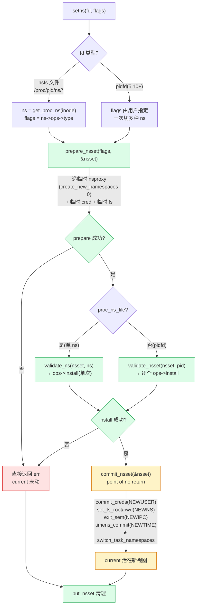

# 第十六章 · unshare 与 setns:运行时改视图

> 篇:P3 容器组装
> 主线呼应:上一章我们讲了第一条进入 namespace 的路——`clone(CLONE_NEW*)` 在 fork 时造出一整套全新命名空间。那是容器**诞生**的动作,一次性的。但容器场景里还有一类**运行时**的视图切换需求:① 已经活着、早已 fork 出来的进程,临时想给自己剥出一组新 ns(比如 `unshare -Urn` 让自己掉进一个新 user ns + net ns);② 更常见——一个进程想**加入别人已经存在的容器**,这就是 `docker exec`/`kubectl exec` 进入容器背后内核干的事。这两条路径,一条是"从自己身上剥出新视图",一条是"跳进别人已有的视图",内核分别给了两个系统调用:`unshare(2)` 和 `setns(2)`。它们都汇聚到第 2 章讲过的 [`switch_task_namespaces`](../linux/kernel/nsproxy.c#L239-L252)([nsproxy.c:239](../linux/kernel/nsproxy.c#L239))那一行指针赋值,但中间多了几个看似琐碎、实则钉死正确性的环节——尤其 setns 的"prepare→validate→commit"两阶段,是把视图切换的"可能失败的复杂逻辑"和"绝不能失败的原子换指针"严格分开的典范。这一章把这两条路径彻底拆透。

## 核心问题

**`unshare` 凭什么从一个已经活着的进程身上剥出新 ns,它和 `clone(CLONE_NEW*)` 的本质差别在哪?`setns` 从一个 fd 到 `ns_common`、再到 `commit_nsset` 换 nsproxy,中间走了哪几个阶段?为什么非要拆成 prepare/validate/commit 三步,朴素地"一步到位换 nsproxy"会撞什么墙?为什么 commit 阶段是"point of no return"——前面所有 install 都成功之后才走 commit,这之间为什么不会切到半新半旧的视图?**

读完本章你会明白:

1. `unshare` 是 clone 的"晚到版"——同一个 `create_new_namespaces`,只是把"造新 nsproxy"这个动作从 fork 路径剥出来,让一个已经存在的进程也能给自己造新视图。
2. `setns` 的 fd 不神秘:它就是 `/proc/<pid>/ns/*` 那个符号链接指向的 nsfs 文件,inode 里藏着一个 `struct ns_common`——所有 ns 共用的多态锚。
3. setns 的"prepare→validate→commit"三阶段:prepare 先建一个**临时** nsproxy + 临时 cred + 临时 fs_struct,validate 把目标 ns 逐个 install 进这个临时 nsset(每种 ns 自己的 install 检查权限、调 `ns_capable`、可能失败),全部成功之后 commit 才一次性换上。
4. 为什么必须两阶段:install 里要 `ptrace_may_access`、`ns_capable`、可能调 `copy_mnt_ns` 整树复制——这些都是**可能失败、可能睡眠**的复杂逻辑,不能在"持锁改 nsproxy"的临界区里做;commit 阶段只做无副作用的事(一行 `switch_task_namespaces` + 一次 `commit_creds`),进 commit 之后保证不再失败。
5. ★ 对照 runc:用户态运行时怎么用这两个系统调用——`unshare` 多用于容器启动早期给自己建 user ns,`setns` 是 `docker exec`/`kubectl exec` 进入容器的核心动作(runc 的 nsexec.c 逐个 fd 调 setns)。

> **逃生阀**:本章代码会反复出现"临时 nsset"这个词。抓住一句话就抓住了 80%——**setns 先把目标 ns 装进一个不挂到任何 task 上的临时 nsset,全部 install 成功之后才用 `switch_task_namespaces` 一次性把这个临时 nsset 换上去**。读不懂某段细节时,先问"这段是在改临时 nsset(可能失败,在 prepare/validate 阶段),还是已经换成 current 的 nsproxy(commit 阶段)"。

---

## 16.1 一句话点破

> **unshare 是"从自己身上长出新视图",setns 是"跳进别人已有的视图";两者最后都走 `switch_task_namespaces` 那一行原子指针赋值,但 setns 因为要装别人现成的 ns,中间多一个"临时 nsset"当缓冲——prepare 造一个临时的壳,validate 把目标 ns 一个个 install 进壳里(每个 install 都可能因为权限/资源失败,失败就扔壳退出),全部成功后 commit 才把这个壳换上 current。这个"壳"是 setns 永远不切到半新半旧视图的工程保证。**

这是结论,不是理由。本章倒过来拆:先看 unshare 为什么是"clone 的晚到版"、它怎么复用 `create_new_namespaces`,再看 setns 的 fd 怎么变成 `ns_common`、`prepare_nsset` 造的临时 nsset 长什么样、`validate_nsset` 怎么用 `ns->ops->install` 多态分发到各 ns、最后钻进 `commit_nsset` 看那个"point of no return"做了哪几件事,然后技巧精解单独拆 setns 两阶段为什么这么设计(反面对比"一步到位换 nsproxy")。

---

## 16.2 unshare:从已经活着的进程身上剥出新视图

第 2 章(P1-02)讲 fork 路径时已经看过 `copy_namespaces`:fork 时检测 `CLONE_NEW*`,有就调 [`create_new_namespaces`](../linux/kernel/nsproxy.c#L67-L145) 造一组新 nsproxy。但 `create_new_namespaces` 返回的 nsproxy 还**没挂到任何 task 上**——`copy_namespaces` 在最后一句 `tsk->nsproxy = new_ns;` 把它挂到刚 fork 出来的子进程。这是一次性的:fork 完成时,子进程的视图就定型了。

如果一个进程**已经活了很久**,中途想给自己剥一组新 ns(比如一个 daemon 进程跑了半天,现在想把自己关进一个新 net ns 里隔离网络),fork 这条路走不通——它已经出生了。内核给的另一个入口是 `unshare(2)`:

```c
/* kernel/fork.c:3392-3395 */
SYSCALL_DEFINE1(unshare, unsigned long, unshare_flags)
{
    return ksys_unshare(unshare_flags);
}
```

([fork.c:3392](../linux/kernel/fork.c#L3392))

它直接转给 [`ksys_unshare`](../linux/kernel/fork.c#L3273-L3390)([fork.c:3273](../linux/kernel/fork.c#L3273))。这个函数本身很长(100 多行),但骨架极其清晰——它一次性处理多种"unshare":fs/files/credentials/namespaces。我们只看 namespace 这条线:

```c
/* kernel/fork.c:3273-3390(节选 namespace 相关) */
int ksys_unshare(unsigned long unshare_flags)
{
    struct fs_struct *fs, *new_fs = NULL;
    struct files_struct *new_fd = NULL;
    struct cred *new_cred = NULL;
    struct nsproxy *new_nsproxy = NULL;
    int do_sysvsem = 0;
    int err;

    /* ① 强制连带 unshare:CLONE_NEWUSER 必须带 CLONE_THREAD|CLONE_FS */
    if (unshare_flags & CLONE_NEWUSER)
        unshare_flags |= CLONE_THREAD | CLONE_FS;
    if (unshare_flags & CLONE_NEWNS)
        unshare_flags |= CLONE_FS;
    ...

    err = check_unshare_flags(unshare_flags);
    if (err) goto bad_unshare_out;

    /* CLONE_NEWIPC 要 detach sem undolist */
    if (unshare_flags & (CLONE_NEWIPC|CLONE_SYSVSEM))
        do_sysvsem = 1;

    err = unshare_fs(unshare_flags, &new_fs);          if (err) goto ...;
    err = unshare_fd(unshare_flags, NR_OPEN_MAX, &new_fd); if (err) goto ...;
    err = unshare_userns(unshare_flags, &new_cred);    if (err) goto ...;

    /* namespace 这条线 */
    err = unshare_nsproxy_namespaces(unshare_flags, &new_nsproxy,
                                     new_cred, new_fs);
    if (err) goto bad_unshare_cleanup_cred;

    /* ─── 分隔线:到这里所有 unshare 都构造好了,还没动 current ─── */
    if (new_fs || new_fd || do_sysvsem || new_cred || new_nsproxy) {
        if (do_sysvsem) exit_sem(current);
        if (unshare_flags & CLONE_NEWIPC) {
            exit_shm(current);              /* 旧 ipc ns 的共享内存扔掉 */
            shm_init_task(current);
        }

        /* ★ 关键:换 nsproxy 这一行! */
        if (new_nsproxy)
            switch_task_namespaces(current, new_nsproxy);

        task_lock(current);
        if (new_fs) { ...; current->fs = new_fs; ... }
        if (new_fd) swap(current->files, new_fd);
        task_unlock(current);

        if (new_cred) {
            commit_creds(new_cred);         /* user ns 配套换 cred */
            new_cred = NULL;
        }
    }
    perf_event_namespaces(current);
    /* 错误路径:put_cred/put_files_struct/free_fs_struct */
    ...
}
```

([fork.c:3273-3390](../linux/kernel/fork.c#L3273-L3390))

这段代码可以拆成三个层次:

**层次一:强制连带(`unshare_flags |= ...`)。** 这是 unshare 比 clone 更细的地方。`CLONE_NEWUSER` 必须连带 `CLONE_THREAD | CLONE_FS`——为什么?因为 user ns 是**凭据(cred)的一部分**(P1-02 第 2.3 节点过这个不对称),换 user ns 等于换"我是谁";线程组里共享 cred 的兄弟线程没法跟你一起换,fs 的 root/pwd 也得跟着换(否则 pwd 指向一个在新 user ns 里没权限的路径,后续操作全 EACCES)。同理 `CLONE_NEWNS` 必须连带 `CLONE_FS`——换挂载视图必须同时换 fs 的 root/pwd,否则 pwd 指向旧挂载树里的某个目录,行为撕裂。**这些强制连带,本质是"换视图必须换得彻底,不能留半旧"**。

**层次二:构造阶段(`unshare_*` 一系列调用)。** 这里所有调用都填的是 `&new_xxx`——它们只**构造**,不动 `current`。构造的内容写到独立的局部变量 `new_fs`/`new_fd`/`new_cred`/`new_nsproxy` 里。`unshare_nsproxy_namespaces` 就是其中负责 namespace 的那个:

```c
/* kernel/nsproxy.c:213-237 */
int unshare_nsproxy_namespaces(unsigned long unshare_flags,
    struct nsproxy **new_nsp, struct cred *new_cred, struct fs_struct *new_fs)
{
    struct user_namespace *user_ns;
    int err = 0;

    if (!(unshare_flags & (CLONE_NEWNS | CLONE_NEWUTS | CLONE_NEWIPC |
                           CLONE_NEWNET | CLONE_NEWPID | CLONE_NEWCGROUP |
                           CLONE_NEWTIME)))
        return 0;                                 /* 没要任何新 ns,早退 */

    user_ns = new_cred ? new_cred->user_ns : current_user_ns();
    if (!ns_capable(user_ns, CAP_SYS_ADMIN))
        return -EPERM;                            /* 要新 ns 必须 CAP_SYS_ADMIN */

    *new_nsp = create_new_namespaces(unshare_flags, current, user_ns,
                                     new_fs ? new_fs : current->fs);
    if (IS_ERR(*new_nsp)) {
        err = PTR_ERR(*new_nsp);
        goto out;
    }
out:
    return err;
}
```

([nsproxy.c:213-237](../linux/kernel/nsproxy.c#L213-L237))

这里和 `copy_namespaces`(fork 路径,P1-02 第 2.3 节)几乎逐字相同——同一个判定(检查 `CLONE_NEW*`、检查 `CAP_SYS_ADMIN`),同一个构造(`create_new_namespaces` 一次造多种 ns,全成或全回滚)。差异只有一个:fork 里 `copy_namespaces` 最后直接 `tsk->nsproxy = new_ns;` 挂到刚 fork 出来的 task;unshare 里**不在 `unshare_nsproxy_namespaces` 内部挂**,而是把 `new_nsproxy` 通过 `*new_nsp` 返回给 `ksys_unshare`,由后者统一决定何时挂。

> **钉死这件事**:`unshare` 和 `clone(CLONE_NEW*)` 用**同一个 `create_new_namespaces`**——所以 unshare 也是"一次调用切多种 ns、全成或全回滚、不会有半新半旧"。区别只在挂靠点:clone 在 fork 路径里挂到刚出生的子进程;unshare 挂到已经活着的 current。

**层次三:提交阶段(分隔线之后)。** 注释里明说 `if (new_fs || new_fd || ...) { ... }`——只有构造阶段至少有一个成功了,才进提交阶段。提交阶段就是一系列"换 current 字段"的动作:`switch_task_namespaces` 换 nsproxy、`task_lock` 保护下换 fs/files、`commit_creds` 换 cred。

注意提交阶段的顺序:**先 `switch_task_namespaces(current, new_nsproxy)` 换 nsproxy,再换 fs/files,最后换 cred**。这个顺序有讲究——nsproxy 先换,意味着后续换 fs/files 时已经在新的 mnt ns 视图下(避免 fs 切换引用了旧 mnt ns 里的路径);cred 最后换,因为 `commit_creds` 会触发一系列后续操作(keyring、capability 检查等),放在最后让"nsproxy 已经新、fs 已经新"的状态稳定下来再做身份切换。

> **不这样会怎样**:如果"一步到位"——构造和提交混在一起,在 `unshare_nsproxy_namespaces` 内部就 `switch_task_namespaces(current, new_nsp)`,① 构造到一半失败(copy_net_ns OOM),进程已经切到了部分新视图(虽然 `create_new_namespaces` 有回滚链保证不半新半旧,但 new_fs/new_cred 的构造没法和 nsproxy 共享这个回滚链);② 锁顺序乱——`switch_task_namespaces` 内部 `task_lock(current)`,而 unshare_fs/unshare_fd 可能已经在 task_lock 下做了部分操作,容易死锁。所以 Linux 严格把构造和提交分到分隔线两边,**构造可以任意失败任意回滚,提交阶段才动 current**,这是 unshare 的核心工程骨架。

### 为什么 CLONE_NEWUSER 是 unshare 的特权路径

一个反直觉细节:`unshare(CLONE_NEWUSER)` 是**唯一一个不需要任何特殊权限**就能调用的"切 ns"路径(`CLONE_NEWUSER` 不要求 `CAP_SYS_ADMIN`)。这是容器安全的基石——允许非特权用户在自己的 user ns 里造"假 root",这个 root 在新 user ns 里有全部 capability,但在宿主上仍然是 nobody(详见第 8 章 P1-08)。

runc 用 unshare 给非特权容器开门:`runc run` 启动一个无 root 的容器,第一步就是 `clone` + 立刻 `unshare(CLONE_NEWUSER)`(或直接 clone 带上 `CLONE_NEWUSER`),让自己掉进新 user ns 里变成"容器里的 root",后续再 unshare 其他 ns、挂 cgroup——这一切的起点就是"CLONE_NEWUSER 不需要特权"这条内核规则。

---

## 16.3 setns 的入口:fd 到 ns_common

unshare 是"自给自足"——它造的是全新 ns,完全独立。但容器场景里有一类需求:**加入别人已经存在的 ns**。典型场景是 `docker exec`/`kubectl exec`:容器早就在跑了(`docker run` 时造的 7 种 ns),现在管理员想再 spawn 一个 bash 进程进到**同一个容器**里——这个新 bash 要共享容器的 mnt ns(看到同一个 rootfs)、pid ns(在容器里能看见容器内其他进程)、net ns(用容器的 lo/eth0),等等。

这就是 `setns(2)` 干的事:

```c
/* kernel/nsproxy.c:546-585 */
SYSCALL_DEFINE2(setns, int, fd, int, flags)
{
    struct fd f = fdget(fd);
    struct ns_common *ns = NULL;
    struct nsset nsset = {};
    int err = 0;

    if (!f.file)
        return -EBADF;

    if (proc_ns_file(f.file)) {
        /* 路径 A:fd 指向 /proc/<pid>/ns/* 符号链接 */
        ns = get_proc_ns(file_inode(f.file));
        if (flags && (ns->ops->type != flags))
            err = -EINVAL;
        flags = ns->ops->type;                /* type 由 fd 决定 */
    } else if (!IS_ERR(pidfd_pid(f.file))) {
        /* 路径 B:fd 是 pidfd(5.10+ 新接口),一次加入多种 ns */
        err = check_setns_flags(flags);
    } else {
        err = -EINVAL;
    }
    if (err) goto out;

    err = prepare_nsset(flags, &nsset);       /* ① 造临时 nsset */
    if (err) goto out;

    if (proc_ns_file(f.file))
        err = validate_ns(&nsset, ns);        /* ②a 单 ns 路径:install */
    else
        err = validate_nsset(&nsset, pidfd_pid(f.file));  /* ②b pidfd 路径 */
    if (!err) {
        commit_nsset(&nsset);                 /* ③ 全成功才 commit */
        perf_event_namespaces(current);
    }
    put_nsset(&nsset);                        /* ④ 清理临时 nsset */
out:
    fdput(f);
    return err;
}
```

([nsproxy.c:546-585](../linux/kernel/nsproxy.c#L546-L585))

这是 setns 的全部入口——10 来行,但 4 个阶段清清楚楚:① `prepare_nsset` 造临时 nsset;② `validate_ns`/`validate_nsset` 把目标 ns install 进临时 nsset;③ `commit_nsset` 一次性换上 current;④ `put_nsset` 清理。

先看 fd 这一头:`fd` 到底是什么?两条路径:

**路径 A:`proc_ns_file(f.file)` 为真——fd 指向 nsfs 文件。** 这是经典路径。用户态 `open("/proc/1234/ns/net", O_RDONLY)` 拿到一个 fd,这个 fd 指向的文件系统是 `nsfs`([fs/nsfs.c](../linux/fs/nsfs.c))——内核专门为 ns 做的虚拟文件系统。它的 inode 的 `i_private` 指向一个 [`struct ns_common`](../linux/include/linux/ns_common.h#L9-L14),通过 [`get_proc_ns(file_inode(f.file))`](../linux/fs/nsfs.c#L126)([nsfs.c:126](../linux/fs/nsfs.c#L126)) 反查出来。注意这一行:

```c
if (flags && (ns->ops->type != flags))
    err = -EINVAL;
flags = ns->ops->type;
```

——**单次 setns 只能切一种 ns**。`flags` 参数是用户传进来的"我要切这个 type",`ns->ops->type` 是这个 fd 对应的 ns 的真实 type(比如 net ns 的 `CLONE_NEWNET`)。两者必须一致(或者用户传 0,由内核自己确定)。所以"一次切多种 ns"必须多次调用 setns——这正是 runc 干的(后面★对照栏详讲)。

**路径 B:`pidfd_pid(f.file)` 为真——fd 是个 pidfd。** 这是 5.10+ 加进来的新接口(`CLONE_NEWPIDFD` 那套)。pidfd 让用户态一次 setns 加入目标进程的**全部** ns——`flags` 由用户指定一个掩码(比如 `CLONE_NEWNS | CLONE_NEWNET | CLONE_NEWUTS`),内核在 `validate_nsset` 里逐个 install。这条路径更接近"一次切多种"的语义,但内核实现仍然是逐个 install(只是把它们包在一次 setns 调用里)。

> **钉死这件事**:setns 的 fd 就是 `/proc/<pid>/ns/*` 那个符号链接指向的 nsfs 文件——inode 里藏着一个 `ns_common`,它的 `ops` 字段是这张 ns 的多态函数指针表(`proc_ns_operations`)。`ns->ops->type` 告诉内核这是哪种 ns,`ns->ops->install` 是这张 ns 的 install 实现。这是第 2 章 P1-02 讲的"`ns_common` + `proc_ns_operations` 多态骨架"在 setns 里的落地——**核心路径不知道具体是哪种 ns,它只通过 `ops->install` 动态分发**。

### nsfs 文件长什么样

`/proc/<pid>/ns/` 目录下有 7~8 个符号链接,每个指向一个 nsfs 文件:

```text
$ ls -l /proc/self/ns/
total 0
lrwxrwxrwx ... cgroup -> cgroup:[4026531835]
lrwxrwxrwx ... ipc    -> ipc:[4026531839]
lrwxrwxrwx ... mnt    -> mnt:[4026531840]
lrwxrwxrwx ... net    -> net:[4026531992]
lrwxrwxrwx ... pid    -> pid:[4026531836]
lrwxrwxrwx ... pid_for_children -> pid_for_children:[4026531834]
lrwxrwxrwx ... time   -> time:[4026531834]
lrwxrwxrwx ... user   -> user:[4026531837]
lrwxrwxrwx ... uts    -> uts:[4026531838]
```

方括号里的数字就是 `ns_common.inum`(这个 ns 的唯一 inode 号)。`readlink` 看到的形如 `net:[4026531992]` 的字符串是 [`ns_dname`](../linux/fs/nsfs.c#L27-L35)([nsfs.c:27](../linux/fs/nsfs.c#L27))拼出来的:`ns_ops->name` + `:` + `[inode->i_ino]`。

两个进程的同一 ns 指向同一 inode(inum 相同),就表示共享这个 ns——这是检查"两个进程在不在同一个容器里"的内核级方法(对比 inum)。

---

## 16.4 prepare_nsset:造一个不挂到任何 task 上的临时 nsset

`prepare_nsset` 是 setns 两阶段的**第一阶段**——它造一个 `struct nsset`,这个 nsset 是后续 install 的"容器":

```c
/* include/linux/nsproxy.h:54-59 */
struct nsset {
    unsigned flags;
    struct nsproxy *nsproxy;   /* 临时 nsproxy,install 改它的字段 */
    struct fs_struct *fs;      /* 临时 fs,mnt ns 用得到 */
    const struct cred *cred;   /* 临时 cred,user ns 用得到 */
};
```

([nsproxy.h:54](../linux/include/linux/nsproxy.h#L54))

注意 `nsset->nsproxy` 不是 current 的 nsproxy——它是 **prepare_nsset 临时造出来的**一份。看构造:

```c
/* kernel/nsproxy.c:331-361 */
static int prepare_nsset(unsigned flags, struct nsset *nsset)
{
    struct task_struct *me = current;

    nsset->nsproxy = create_new_namespaces(0, me, current_user_ns(), me->fs);
    if (IS_ERR(nsset->nsproxy))
        return PTR_ERR(nsset->nsproxy);
    /* ↑ flags=0,所以 create_new_namespaces 造的是一个"克隆 current 的 nsproxy"
       ——所有 ns 都和 current 共享(get,不是 clone)。这是临时壳的起点。 */

    if (flags & CLONE_NEWUSER)
        nsset->cred = prepare_creds();          /* 准备一份可改的 cred 副本 */
    else
        nsset->cred = current_cred();           /* 不换 user,用现有 cred */
    if (!nsset->cred) goto out;

    /* mnt ns 配套要换 fs:只有 CLONE_NEWNS 单独,fs 直接用;否则复制一份 */
    if (flags == CLONE_NEWNS) {
        nsset->fs = me->fs;
    } else if (flags & CLONE_NEWNS) {
        nsset->fs = copy_fs_struct(me->fs);
        if (!nsset->fs) goto out;
    }

    nsset->flags = flags;
    return 0;

out:
    put_nsset(nsset);
    return -ENOMEM;
}
```

([nsproxy.c:331-361](../linux/kernel/nsproxy.c#L331-L361))

最值得注意的一行是 `create_new_namespaces(0, me, ...)`——传 `flags=0`,意味着**不 clone 任何 ns**。回忆 `create_new_namespaces` 内部对每个 ns 调 `copy_*_ns(flags, ...)`,而 `copy_*_ns` 范式是"检查标志位→不要新的就 return old(已 +1)"(P1-02 第 2.4 节"细节一")。所以 `flags=0` 时,7 个 ns 字段全部返回 current 的原 ns 的**共享引用**(refcount 各加 1)。

这个临时 nsproxy 的语义是:**"以 current 的视图为起点,后续 install 一个个替换成目标 ns"**。这就是"临时壳"的本质——它是 current 视图的一份拷贝,但**没有挂到 current 上**(它挂在 `nsset->nsproxy` 这个栈变量上)。

> **不这样会怎样**:install 阶段要**逐个**改 nsproxy 的字段(`nsproxy->uts_ns = new`、`nsproxy->mnt_ns = new`...),如果直接改 current 的 nsproxy,① current 的 nsproxy 是被多个任务共享的(兄弟进程/fork 出来的子进程),改它会污染所有共享者(和第 2 章讲的"朴素改共享 nsproxy 会篡改父亲视图"是同一个问题);② install 过程中任意失败,已改的字段没法干净回滚——current 已经被切到了部分新视图,行为不可预测。

> **所以这样设计**:setns 造一个**独立的临时 nsproxy**,install 只改它,失败就 `put_nsset` 整个扔掉——current 一点没动。这是"用一层间接换可回滚性"的典范(和第 2 章 `create_new_namespaces` 构造好再挂上、第 10 章 `cgroup_attach_task` 的临时 cset 是同构思路)。

> **钉死这件事**:`prepare_nsset` 造的临时 nsset,它的 nsproxy 是 current 视图的一份"独立拷贝"(共享同一组 ns 但独立持有引用),cred/fs 是配套准备的临时副本。**这个 nsset 在 commit 之前完全脱离 current——任何失败都不会污染 current 的视图**。这是 setns "永远不切到半新半旧"的工程保证。

---

## 16.5 validate_nsset:多态 install,每个 ns 自己的检查

临时壳造好了,接下来 `validate_nsset` 把目标 ns 一个个 install 进去。这个函数有两种形态——单 ns 路径(`validate_ns`,proc_ns_file 路径)和多 ns 路径(`validate_nsset`,pidfd 路径)。后者更全面,我们看它:

```c
/* kernel/nsproxy.c:375-501(节选) */
static int validate_nsset(struct nsset *nsset, struct pid *pid)
{
    int ret = 0;
    unsigned flags = nsset->flags;
    struct user_namespace *user_ns = NULL;
    struct pid_namespace *pid_ns = NULL;
    struct nsproxy *nsp;
    struct task_struct *tsk;

    /* ① 拍目标 task 的 nsproxy 快照 */
    rcu_read_lock();
    tsk = pid_task(pid, PIDTYPE_PID);
    if (!tsk) { rcu_read_unlock(); return -ESRCH; }

    if (!ptrace_may_access(tsk, PTRACE_MODE_READ_REALCREDS)) {
        rcu_read_unlock();
        return -EPERM;                          /* 没权限看这个 task */
    }

    task_lock(tsk);                             /* 持对方 task_lock 拍快照 */
    nsp = tsk->nsproxy;
    if (nsp) get_nsproxy(nsp);
    task_unlock(tsk);
    if (!nsp) { rcu_read_unlock(); return -ESRCH; }

    /* CLONE_NEWPID 特殊:目标进程的 active pid ns,不在 nsproxy 里 */
    if (flags & CLONE_NEWPID) {
        pid_ns = task_active_pid_ns(tsk);
        if (unlikely(!pid_ns)) { ... return -ESRCH; }
        get_pid_ns(pid_ns);
    }

    /* CLONE_NEWUSER 特殊:user ns 在 cred 里,不在 nsproxy */
    if (flags & CLONE_NEWUSER)
        user_ns = get_user_ns(__task_cred(tsk)->user_ns);
    rcu_read_unlock();

    /* ② 逐个 install,多态分发到各 ns 的 install 实现 */
    if (flags & CLONE_NEWUSER) {
        ret = validate_ns(nsset, &user_ns->ns);   if (ret) goto out;
    }
    if (flags & CLONE_NEWNS) {
        ret = validate_ns(nsset, from_mnt_ns(nsp->mnt_ns));   if (ret) goto out;
    }
    if (flags & CLONE_NEWUTS) {
        ret = validate_ns(nsset, &nsp->uts_ns->ns);   if (ret) goto out;
    }
    if (flags & CLONE_NEWIPC) {
        ret = validate_ns(nsset, &nsp->ipc_ns->ns);   if (ret) goto out;
    }
    if (flags & CLONE_NEWPID) {
        ret = validate_ns(nsset, &pid_ns->ns);   if (ret) goto out;
    }
    if (flags & CLONE_NEWCGROUP) {
        ret = validate_ns(nsset, &nsp->cgroup_ns->ns);   if (ret) goto out;
    }
    if (flags & CLONE_NEWNET) {
        ret = validate_ns(nsset, &nsp->net_ns->ns);   if (ret) goto out;
    }
    if (flags & CLONE_NEWTIME) {
        ret = validate_ns(nsset, &nsp->time_ns->ns);   if (ret) goto out;
    }

out:
    if (pid_ns) put_pid_ns(pid_ns);
    if (nsp) put_nsproxy(nsp);                   /* 放掉快照引用 */
    put_user_ns(user_ns);
    return ret;
}
```

([nsproxy.c:375-501](../linux/kernel/nsproxy.c#L375-L501))

`validate_ns` 是一行多态分发:

```c
/* kernel/nsproxy.c:363-366 */
static inline int validate_ns(struct nsset *nsset, struct ns_common *ns)
{
    return ns->ops->install(nsset, ns);          /* ← 多态调用! */
}
```

([nsproxy.c:363-366](../linux/kernel/nsproxy.c#L363-L366))

`ns->ops->install` 这一行,核心代码根本不知道调的是哪个 ns 的 install——是 uts ns 的 `utsns_install`、net ns 的 `netns_install`、还是 user ns 的 `userns_install`,由运行时 `ns->ops` 指向哪张表决定。这就是第 2 章 P1-02 讲的"函数指针表 + 多态分发"在 setns 的落地。

看两种 install 的对比,理解"多态"为什么必要——每个 ns 自己最懂自己的 install 规则:

```c
/* kernel/utsname.c:140-153(uts ns 的 install,极简) */
static int utsns_install(struct nsset *nsset, struct ns_common *new)
{
    struct nsproxy *nsproxy = nsset->nsproxy;
    struct uts_namespace *ns = to_uts_ns(new);

    if (!ns_capable(ns->user_ns, CAP_SYS_ADMIN) ||
        !ns_capable(nsset->cred->user_ns, CAP_SYS_ADMIN))
        return -EPERM;

    get_uts_ns(ns);                              /* 新 ns 引用 +1 */
    put_uts_ns(nsproxy->uts_ns);                 /* 旧 ns 引用 -1 */
    nsproxy->uts_ns = ns;                        /* 换指针 */
    return 0;
}
```

([utsname.c:140-153](../linux/kernel/utsname.c#L140-L153))

uts ns 的 install 干脆利落——两个 `ns_capable` 检查权限(目标 ns 所在的 user ns + 当前 cred 的 user ns,都要 `CAP_SYS_ADMIN`),然后 `get` 新 ns、`put` 旧 ns、换指针。共 5 行核心。

再看 user ns 的 install——因为涉及特权,检查更严:

```c
/* kernel/user_namespace.c:1339-1368(user ns 的 install) */
static int userns_install(struct nsset *nsset, struct ns_common *ns)
{
    struct user_namespace *user_ns = to_user_ns(ns);
    struct cred *cred;

    /* 不能 reenter 自己已经在的 user ns(防提权) */
    if (user_ns == current_user_ns())
        return -EINVAL;
    /* 线程组必须整体共享 user ns */
    if (!thread_group_empty(current))
        return -EINVAL;
    /* fs 必须独占(否则其他 task 的 root/pwd 会跟着错) */
    if (current->fs->users != 1)
        return -EINVAL;

    if (!ns_capable(user_ns, CAP_SYS_ADMIN))
        return -EPERM;

    cred = nsset_cred(nsset);                    /* 取临时 cred */
    if (!cred) return -EINVAL;

    put_user_ns(cred->user_ns);
    set_cred_user_ns(cred, get_user_ns(user_ns));
    if (set_cred_ucounts(cred) < 0) return -EINVAL;
    ...
}
```

([user_namespace.c:1339-1368](../linux/kernel/user_namespace.c#L1339-L1368))

user ns 的 install 多了三条独特检查:① `user_ns == current_user_ns()` 拒绝——防止"进自己已经在的 user ns"绕过能力检查(注释直说"Don't allow gaining capabilities by reentering the same user namespace");② `thread_group_empty` 要求——线程组必须整体换 user ns(同 unshare 的 `CLONE_THREAD` 强制连带);③ `fs->users == 1` 要求——fs 必须独占,否则其他共享 fs 的 task 的 root/pwd 会被意外改掉。

mnt ns 的 `mntns_install`、net ns 的 `netns_install`、pid ns 的 `pidns_install` 各有各的检查——mnt 要复制整棵挂载树(`copy_mnt_ns`),net 要检查 netns 的 owner,pid 要检查不能在已 fork 之后切换 pid ns。**每个 ns 的 install 都封装了它自己的特权规则和构造逻辑**,核心 setns 代码只管调 `ops->install`,不知道也不需要知道这些差异。

> **钉死这件事**:`validate_nsset` 是 setns 多态分发的主战场——一个 `ns->ops->install` 调用,8 种 ns 各有自己的 install 实现(uts 5 行、user 30 行、mnt 一整棵挂载树复制)。新增一种 ns 只需要实现一张 `proc_ns_operations` 表(填 install/get/put/owner 等),核心 setns 不用改一行。这正是第 2 章 P1-02 讲的"namespace 子系统能一路扩展到 time ns 而核心不动"的架构原因。

### 拍目标 task 快照:ptrace_may_access + task_lock

`validate_nsset` 开头有一段拍目标 task 的 nsproxy 快照:

```c
if (!ptrace_may_access(tsk, PTRACE_MODE_READ_REALCREDS)) {
    rcu_read_unlock();
    return -EPERM;
}

task_lock(tsk);
nsp = tsk->nsproxy;
if (nsp) get_nsproxy(nsp);
task_unlock(tsk);
```

这两段合起来回答一个看似简单的问题:**凭什么你能 setns 进别人的容器?** 答案是 `ptrace_may_access`——同一套"你可以 ptrace 这个进程吗"的权限模型。如果你能 ptrace 它(`PTRACE_MODE_READ_REALCREDS` 是只读凭据级别),你就能进它的 ns;否则 EPERM。这保证了"docker exec 必须是 root(或容器 owner)"的语义。

`task_lock(tsk)` + `get_nsproxy(nsp)` 这一段,是第 2 章 P1-02 讲的 **nsproxy 访问规则三**("读别人 nsproxy 持对方 task_lock")的标准实现——持 task_lock 读取 nsproxy 指针,非 NULL 就 `get_nsproxy` 加引用,解锁后用。读到的 nsp 在 `rcu_read_unlock` 之后仍然安全(因为持了引用),后面 install 阶段都用它。

注意 pid ns 和 user ns 是**例外**——它们不在 nsproxy 里(pid ns 在 `task_active_pid_ns`,user ns 在 cred 里),所以单独拍快照:

```c
if (flags & CLONE_NEWPID) {
    pid_ns = task_active_pid_ns(tsk);
    ...
    get_pid_ns(pid_ns);
}
if (flags & CLONE_NEWUSER)
    user_ns = get_user_ns(__task_cred(tsk)->user_ns);
```

这两个"例外"是第 2 章 P1-02 点过的设计不对称——pid ns 的"代际延迟"(自己用 active、子进程用 nsproxy 里的 `pid_ns_for_children`)和 user ns 的"身份非视图"(在 cred 不在 nsproxy)在 setns 这里再次显形。

---

## 16.6 commit_nsset:point of no return 的一次性换装

`validate_nsset` 全部 install 成功(没失败没回滚),最后一步是 `commit_nsset`——这个函数有个专门的注释,叫"point of no return":

```c
/*
 * This is the point of no return. There are just a few namespaces
 * that do some actual work here and it's sufficiently minimal that
 * a separate ns_common operation seems unnecessary for now.
 * Unshare is doing the same thing. If we'll end up needing to do
 * more in a given namespace or a helper here is ultimately not
 * exported anymore a simple commit handler for each namespace
 * should be added to ns_common.
 */
static void commit_nsset(struct nsset *nsset)
{
    unsigned flags = nsset->flags;
    struct task_struct *me = current;

    /* user ns:换 cred */
    if (flags & CLONE_NEWUSER) {
        commit_creds(nsset_cred(nsset));        /* ← 提权点! */
        nsset->cred = NULL;
    }

    /* mnt ns 配套:同步 fs_struct 的 root/pwd */
    if ((flags & CLONE_NEWNS) && (flags & ~CLONE_NEWNS)) {
        set_fs_root(me->fs, &nsset->fs->root);
        set_fs_pwd(me->fs, &nsset->fs->pwd);
    }

    /* ipc ns:旧 ns 里的 SysV 信号量 undo list 扔掉 */
    if (flags & CLONE_NEWIPC)
        exit_sem(me);

    /* time ns:时钟偏移提交 */
    if (flags & CLONE_NEWTIME)
        timens_commit(me, nsset->nsproxy->time_ns);

    /* ★ 核心:换 nsproxy! */
    switch_task_namespaces(me, nsset->nsproxy);
    nsset->nsproxy = NULL;                       /* 转移所有权给 current */
}
```

([nsproxy.c:503-544](../linux/kernel/nsproxy.c#L503-L544))

"point of no return"——不可回头。注释里强调,走到这里就**保证不再失败**。所以 commit 阶段做的全是"绝不能失败"的事:① `commit_creds` 换 cred(user ns 必须的);② mnt ns 的 root/pwd 同步(用临时 fs_struct 里的);③ `exit_sem` 扔掉旧 ipc ns 的 sem undo list;④ `timens_commit` 提交时钟;⑤ 最后 `switch_task_namespaces(me, nsset->nsproxy)` 把临时 nsproxy 换上去。

最关键的是最后两行:

```c
switch_task_namespaces(me, nsset->nsproxy);
nsset->nsproxy = NULL;
```

`switch_task_namespaces` 就是第 2 章 P1-02 第 2.5 节讲透的那个函数——持 task_lock、读旧 nsproxy、写新 nsproxy、解锁、put 旧 nsproxy。**这一行指针赋值,是 setns 整个两阶段的高潮**——前面所有工作(造临时壳、install 各 ns)都是为了让这一行的"new"参数是一个完整、合法、已经填好的 nsproxy。换上去的瞬间,`current->nsproxy` 就是新视图,从此 current 活在新视图里。

`nsset->nsproxy = NULL` 是"所有权转移"的标记——这个临时 nsproxy 现在归 current 了(通过 `current->nsproxy`),nsset 不再持有它,后面 `put_nsset(&nsset)` 不会误把刚换上去的 nsproxy 释放掉。这种"转移所有权 + 置 NULL 防 double-free"是内核代码里的经典模式。

注意 commit 阶段没有锁保护——它一口气做完所有事,中间不持任何全局锁(每个内部函数自己加细粒度锁:`commit_creds` 自己加 task_lock,`switch_task_namespaces` 自己加 task_lock)。这是为了**让 commit 尽量短**——commit 是 setns 真正改 current 的阶段,越长越容易和别的 CPU 撞(比如另一个 CPU 在 fork 我们的子进程、在读我们的 nsproxy)。

> **不这样会怎样**:如果 commit 里还做可能失败的事(比如再调一次 `copy_mnt_ns` 整树复制,或 `ptrace_may_access` 检查),走到一半失败就要回滚——但 `commit_creds` 已经换了 cred、`switch_task_namespaces` 已经换了 nsproxy,这两步本身不可撤销(cred 换了之后,keyring/capability 已经按新身份重建)。回滚不了,进程就卡在"半新 cred + 旧 nsproxy"的撕裂状态。
>
> **所以这样设计**:把所有可能失败的复杂逻辑全部前置到 prepare/validate(commit 之前),commit 只做"必成"的事——一行指针赋值 + 一次 cred 提交。这是内核处理"复杂构造 + 原子提交"的标准范式:把不可撤销的动作集中到一个无失败阶段,让正确性靠结构而非靠运气。

> **钉死这件事**:`commit_nsset` 是 setns 的"point of no return"——前面 install 全成功才走到这里,走进来就保证不再失败。它做的全是"必须做的事":换 cred(提权点)、同步 fs、扔旧 ipc 的 sem、提交 time ns、最后 `switch_task_namespaces` 换 nsproxy。这一行原子指针赋值,是 setns 两阶段的终点。从这里开始,`current` 活在新视图里。

### 为什么 commit 要 `exit_sem` / `timens_commit` 这些副作用

看几个 install 之外的副作用:`exit_sem(me)`(ipc ns)、`timens_commit`(time ns)。这些是 install 阶段做不到的——install 只改临时 nsproxy 的字段(`nsp->ipc_ns = new`),但 current 的 task_struct 上还有一些状态依赖于旧 ns(比如 `task->sysvsem.undo_list` 指向旧 ipc ns 里的信号量数组),这些状态必须在 current 真正切到新 ns 之后才能清理。所以 commit 阶段单独跑这些 cleanup——它们必须在 nsproxy 换好之前或之后跑(顺序由 commit_nsset 的实现精心安排:`exit_sem` 在 `switch_task_namespaces` 之前,保证切到新 ipc ns 时 current 已经没有旧 ns 的 undo list 牵扯)。

这又一次印证了"两阶段"的价值——**install 只做"能撤销"的事**(往临时壳里塞新 ns,失败就扔),**commit 才做"不能撤销"的事**(改 current、清理旧 ns 状态)。如果 install 里就调 `exit_sem`,失败时 current 已经被改过,没法回滚了。

---

## 技巧精解:setns 的两阶段 prepare→commit —— 用临时壳把"可能失败的复杂逻辑"和"绝不能失败的原子换装"严格分开

本章技巧精解拆 setns 最值得钻的工程设计——为什么必须两阶段,朴素地"一步到位"会撞什么墙。

### 朴素写法:一步到位换 nsproxy 会怎样

一个朴素的设计是:`setns(fd, flags)` 直接做——拍目标快照、改 current 的 nsproxy 字段、一次 syscall 返回。看起来简单:

```c
/* 朴素的、糟糕的写法(示意,非源码) */
SYSCALL_DEFINE2(setns_bad, int, fd, int, flags)
{
    struct ns_common *ns = get_proc_ns(fd);
    struct nsproxy *nsp = current->nsproxy;

    /* 直接改 current 的字段 */
    task_lock(current);
    if (flags == CLONE_NEWUTS) {
        nsp->uts_ns = to_uts_ns(ns);   /* 篡改! */
    } else if (flags == CLONE_NEWNET) {
        ...
    }
    task_unlock(current);
    return 0;
}
```

这个朴素写法撞上的墙至少有五堵:

**墙一:current 的 nsproxy 是共享的。** `current->nsproxy` 是一个 refcount 共享对象(fork 后不要 NEW 的兄弟进程、CLONE_VM 的线程都共享同一个 nsproxy)。直接改 `nsp->uts_ns = ...`,所有共享者的视图都被篡改——这不是"我加入别人",这是"我把全家拖进别人"。要避免,只能**先 COW 一份独立 nsproxy**,再改。这正是 `prepare_nsset` 干的——`create_new_namespaces(0, ...)` 造一份共享引用的独立 nsproxy,后续 install 改的是这份独立拷贝。

**墙二:install 过程中任意失败,要回滚。** pidfd 路径一次切多种 ns(比如 `CLONE_NEWNS | CLONE_NEWNET | CLONE_NEWUTS`),前两个成功第三个失败,已经改了两个字段——怎么回滚?朴素写法得在 setns 里维护一个"已改了哪些字段、各自原值是什么"的回滚表,复杂且容易错。Linux 的做法:install 改的是临时 nsset,失败就 `put_nsset` 扔掉整个临时壳,**current 一字未改**,零回滚负担。

**墙三:install 内部可能睡眠/可能失败。** `mntns_install` 要调 `copy_mnt_ns` 整树复制(`copy_tree` 遍历整棵挂载树,可能几万个 mount,要分配内存,可能 OOM);`netns_install` 要遍历协议栈 init(pernet_ops 链表);`userns_install` 要 `set_cred_ucounts` 可能因为 ucount 上限失败。这些都是"可能睡眠、可能失败"的复杂逻辑,**不能在持锁改 nsproxy 的临界区里做**(task_lock 是 spinlock,持锁时不能睡眠;就算换把可睡眠锁,持锁时间太长会阻塞所有访问 current 的其他 CPU)。两阶段把"复杂逻辑"全放进 prepare/validate 阶段(无锁、可睡眠、可失败),commit 阶段只做"快且必成"的事(`switch_task_namespaces` 一行指针赋值)。

**墙四:多 ns install 的权限检查顺序敏感。** `userns_install` 必须先跑(因为换 user ns 后,后续 install 的 `ns_capable` 检查在新 user ns 视角下做——容器里 root 才能 install 进容器的其他 ns)。朴素写法用一堆 if 顺序硬编码,容易写错。两阶段用 `validate_nsset` 按固定顺序(CLONE_NEWUSER 最先)逐个 install,顺序清晰。

**墙五:commit 必须是"point of no return"。** install 成功之后到 commit 之间,如果有任何动作能失败,就回到了墙二的回滚难题。所以 Linux 的 commit_nsset 注释明说"point of no return"——它只做"保证不失败"的事。这种"把不可撤销的动作集中到一个无失败阶段"的模式,在内核里反复出现(`cgroup_attach_task` 的 `cgroup_migrate` 完成后才 `commit`、事务型文件系统的 journal commit)。

### 两阶段的工程骨架

setns 的两阶段用一张表说清楚:

| 阶段 | 操作对象 | 能否失败 | 能否睡眠 | 失败了怎么办 | 改没改 current |
| ------ | ------ | ------ | ------ | ------ | ------ |
| prepare_nsset | 临时 nsset(新建空壳) | 是(ENOMEM) | 是 | `put_nsset` 扔壳 | 没 |
| validate_nsset / validate_ns | 临时 nsset(install 各 ns) | 是(EPERM/ENOMEM 等) | 是(install 可能睡眠) | `put_nsset` 扔壳 | 没 |
| commit_nsset | current(换 cred/fs/nsproxy) | **否**(point of no return) | 是(但内部锁细粒度) | 不回滚 | **换!** |
| put_nsset | 临时 nsset(清理残留) | 否 | 是 | — | 没(commit 后 nsset->nsproxy=NULL) |

这四个阶段严格分开:**前三个阶段任何失败都不会污染 current**——因为 current 只在 `commit_nsset` 里被改,而走到 commit 意味着前三个阶段全成功。这种"把所有可能失败的复杂逻辑集中在提交之前"的设计,是 setns 永远不切到半新半旧视图的根本保证。

用一张 mermaid 把 setns 全流程串起来:



这张图最值得看的是那条"失败→G(直接返回,current 未动)"的退路——**它只在前三个阶段存在**。一旦进了 `commit_nsset`(橙色),就没有退路,保证走到底。这就是"point of no return"的真正含义:不是"commit 一定不会失败"(代码写成不会),而是"commit 不允许失败"——设计上把所有可能失败的逻辑都放到了 commit 之前。

> **钉死这件事**:setns 的两阶段,核心是**用一层"临时壳"(nsset)把"可能失败的复杂逻辑(install)"和"绝不能失败的原子换装(switch_task_namespaces)"严格分开**。install 改的是 nsset,失败扔掉 current 一字未动;install 全成功之后 commit 才换上 current,换的瞬间是一行指针赋值。这种"构造 → 提交"的两阶段,是内核处理"复杂构造 + 原子切换"的标准范式——`copy_namespaces` 的"create_new_namespaces + tsk->nsproxy = new;"(第 2 章)、`ksys_unshare` 的"构造阶段 + 提交阶段"分隔线(本章 16.2)、`cgroup_attach_task` 的"prepare_dst + migrate"(第 10 章)都是同构设计。

---

## ★ 对照 runc:setns 在 docker exec / kubectl exec 里怎么用

`docker exec bash`、`kubectl exec -it pod -- bash` 这两个最常用的容器操作,内核侧的实现就是 setns。runc 的 `libcontainer/nsenter/nsexec.c` 是这套动作的核心(C 代码,被 runc 在创建/exec 容器进程时通过 `memfd`+`execve` 注入到目标进程的早期启动阶段):

```c
/* runc/libcontainer/nsenter/nsexec.c:548-587(节选) */
static nsset_t __join_namespaces(nsset_t allow, struct namespace_t *ns_list, size_t ns_len)
{
    nsset_t joined = 0;

    for (size_t i = 0; i < ns_len; i++) {
        struct namespace_t *ns = &ns_list[i];
        int type = nstype(ns->type);
        int err, saved_errno;

        if (!(type & allow)) continue;

        err = setns(ns->fd, type);               /* ← 内核 setns(2)! */
        saved_errno = errno;
        ...
        if (err < 0) {
            if (saved_errno == EPERM) continue;  /* 跳过没权限的 ns */
            bailx("failed to setns into %s namespace: %s", ...);
        }
        joined |= type;

        /* CLONE_NEWUSER 后立刻 setresuid(0,0,0) 变成容器 root */
        if (type == CLONE_NEWUSER) {
            if (setresuid(0, 0, 0) < 0)
                bail("failed to become root in user namespace");
        }
        close(ns->fd);
        ns->fd = -1;
    }
    return joined;
}
```

([runc/libcontainer/nsenter/nsexec.c:548-587](../runc/libcontainer/nsenter/nsexec.c#L548-L587))

注意几个细节,直接对应本章讲的内核设计:

1. **runc 逐个 ns 调 setns**(`for` 循环里 `setns(ns->fd, type)`)——因为内核 setns 的 proc_ns_file 路径**一次只接受一个 type**(本章 16.3 讲的 `flags = ns->ops->type`)。要切 6 种 ns 就 6 次 setns。这正是为什么内核有 pidfd 路径(5.10+ 加进来)——一次切多种,但 runc 目前主要还是走逐个调用的经典路径(兼容性更好)。
2. **CLONE_NEWUSER 优先且单独处理**——`setns` 进 user ns 后立刻 `setresuid(0,0,0)` 变成容器 root。这对应本章 16.6 讲的"commit_creds 是提权点":换 user ns 后,在新 user ns 里有全部 capability,身份自动是 root,后续操作以容器 root 身份做。
3. **EPERM 被容忍跳过**(`if (saved_errno == EPERM) continue`)——某些场景下用户可能没权限进某些 ns,runc 选择"能进的进,不能进的跳",让用户态配置决定。这对应本章 16.5 讲的 `ptrace_may_access` 权限闸门——内核拒绝,runc 不强求。
4. fd 来源:`/proc/<container_pid>/ns/*` 符号链接——runc 在 exec 前 `open("/proc/<容器 init pid>/ns/net", O_RDONLY)` 等拿到一组 fd,传给 nsexec。这对应本章 16.3 讲的 nsfs 路径。

`docker exec bash` 端到端大致是:docker CLI → containerd/shim → runc exec → fork 一个新进程 → 这个新进程跑 nsexec.c,逐个 setns 进容器的 7 种 ns → 最后 `execve("/bin/bash", ...)` 把自己变成 bash。bash 一启动就活在容器的全套视图里——`ps` 看到容器内进程(pid ns)、`ls /` 看到容器 rootfs(mnt ns)、`ip link` 看到容器的 lo/eth0(net ns)。**这一切的内核基础,就是 setns 的两阶段换装**。

---

## 章末小结

这一章讲了 namespace 的第三条进入路径——运行时改视图。和 fork 路径(clone,第 15 章 P3-15 详讲)的"出生时一次性造一组新 ns"不同,unshare 和 setns 处理的是**已经活着的进程**的视图切换:unshare 是"自给自足"造新 ns,复用 `create_new_namespaces` + `switch_task_namespaces`;setns 是"加入别人已有的 ns",走 prepare→validate→commit 三阶段。

回扣全书二分法:这一章服务的显然是**组装**那一面——它不是新造一种视图隔离机制(那是第 1 篇 P1-02~08 的事),也不是新造一种资源控制(那是第 2 篇 P2-09~14),它是把已经造好的 ns "切换到 current 身上"的工具。unshare 和 setns 都汇聚到第 2 章讲的 `switch_task_namespaces` 那一行原子指针赋值——再一次印证"换视图 = 换指针"是 namespace 这层全部的精妙。

### 五个"为什么"清单

1. **为什么 unshare 复用 `create_new_namespaces`?** unshare 是"clone 的晚到版"——同一个"造新 nsproxy + 全成或全回滚"的构造器,只是从 fork 路径剥出来让已存在的进程也能用。`unshare_nsproxy_namespaces` 几乎逐字复制 `copy_namespaces` 的判定逻辑,只是挂靠点不同(clone 挂到子进程、unshare 挂到 current)。

2. **为什么 `CLONE_NEWUSER` 必须连带 `CLONE_THREAD | CLONE_FS`?** user ns 是凭据(cred)的一部分,换 user ns 等于换"我是谁"——线程组里共享 cred 的兄弟没法跟你换,fs 的 root/pwd 也得跟着换(否则 pwd 指向在新 user ns 里没权限的路径)。这种"换视图必须换得彻底"是 unshare 的强制连带规则。

3. **为什么 setns 的 fd 是 `/proc/<pid>/ns/*`?** 那个符号链接指向 nsfs 文件,inode 的 `i_private` 藏着一个 `struct ns_common`——所有 ns 共用的多态锚。`get_proc_ns(inode)` 反查出来,`ns->ops` 是这张 ns 的函数指针表,`ns->ops->type` 告诉内核这是哪种 ns,`ns->ops->install` 是 install 实现。fd → inode → ns_common → ops,这就是 setns 的入口链条。

4. **为什么 setns 必须两阶段(prepare→commit)?** 五堵墙:① current 的 nsproxy 是共享的(直接改会污染所有共享者);② install 过程任意失败要回滚(临时壳失败扔掉 current 未改,零回滚负担);③ install 内部可能睡眠/失败(copy_tree OOM、userns ucount 满),不能在持锁改 nsproxy 的临界区里做;④ 多 ns install 顺序敏感(user ns 必须先);⑤ commit 必须是 point of no return(把不可撤销的动作集中到一个无失败阶段)。两阶段用一层"临时壳"(nsset)把复杂构造和原子换装严格分开。

5. **为什么 `commit_nsset` 是 point of no return?** 走到 commit 意味着 prepare/validate 全成功——临时 nsset 已经填好。commit 只做"必须做的事 + 绝不会失败的事":换 cred(NEWUSER)、同步 fs(NEWNS)、`exit_sem`(NEWIPC)、`timens_commit`(NEWTIME)、最后 `switch_task_namespaces` 一行指针赋值换 nsproxy。这一行是 setns 两阶段的高潮,前面所有工作都服务于让这一行的"new"参数合法。

### 想继续深入往哪钻

- 本章点到的 `unshare_nsproxy_namespaces`、`prepare_nsset`、`validate_nsset`、`commit_nsset`、`SYSCALL_DEFINE2(setns)` 全在 [`kernel/nsproxy.c`](../linux/kernel/nsproxy.c)(L213/L331/L375/L512/L546);`ksys_unshare` 在 [`kernel/fork.c`](../linux/kernel/fork.c)(L3273);`struct nsset` 在 [`include/linux/nsproxy.h`](../linux/include/linux/nsproxy.h#L54-L59)(L54)。
- 想看各 ns 自己的 install 实现:uts ns 最简单([`kernel/utsname.c`](../linux/kernel/utsname.c#L140) `utsns_install`,5 行核心)、user ns 最严([`kernel/user_namespace.c`](../linux/kernel/user_namespace.c#L1339) `userns_install`,带三条独特检查)、mnt ns 最重(`fs/namespace.c:5393` `mntns_install`,要 `copy_mnt_ns` 整树复制)。
- 想看 nsfs 怎么把 ns 变成文件:[`fs/nsfs.c`](../linux/fs/nsfs.c)(`ns_dname` L27 拼链接名、`ns_get_path` L74 拿 path、`proc_ns_file` L166 判断是不是 nsfs 文件)。
- 想观测:setns 切视图后,`ls -l /proc/self/ns/` 会看到 ns 链接的 inum 变了(切进容器后看到的是容器的 inum);`unshare -Urn bash` 给自己造新 user ns + net ns,`ip link` 看到只有 lo(新 net ns 啥都没有)。
- 想动手:用 `nsenter -t <pid> -m -u -i -n -p -- bash` 进入另一个进程的全部 ns(nsenter 就是一系列 setns 的封装);或 `unshare -r -n bash`(unshare 一个 user ns + net ns,`-r` 把自己 map 成 root)。

### 引出下一章

unshare 和 setns 讲完了——运行时改视图的两条路。但一个完整的容器,光有视图还不够——还要限资源(cgroup)和换根文件系统(rootfs)。下一章 P3-17 把所有组装动作串起来:写 `cgroup.procs` 触发 `cgroup_attach_task`、`pivot_root` 配合 mnt ns 换根、最后给一张"最小容器长什么样"的清单——7 种 ns + cpu.max + memory.max + rootfs + 进程,顺序依赖必须对(先 mnt ns + pivot_root 再 unshare user,反了会逃逸)。这是容器组装篇的高潮,也是 runc 全流程的内核侧总览。

