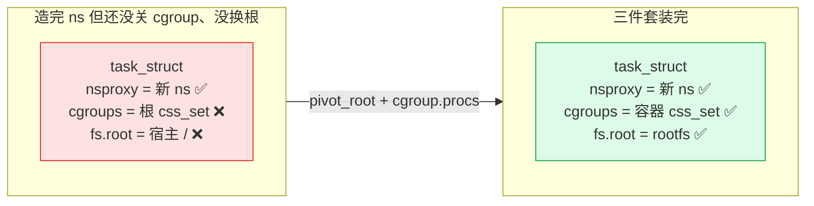
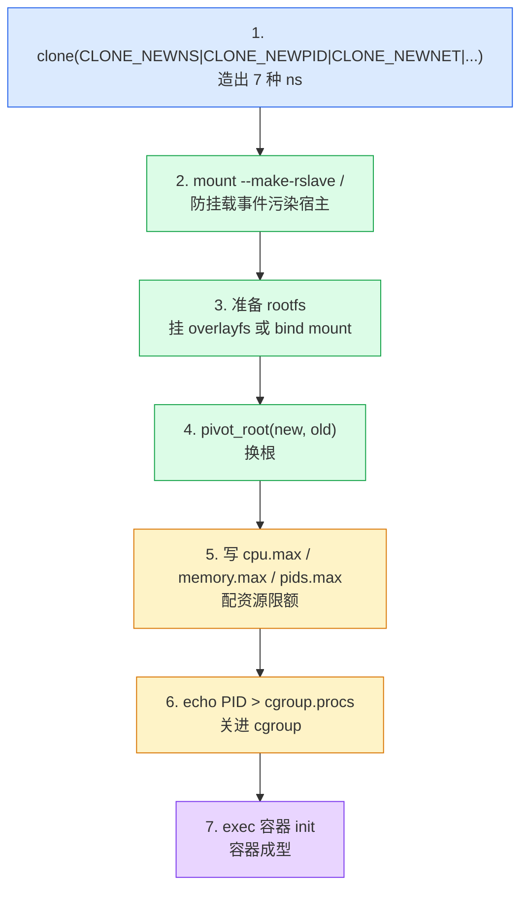

# 第十七章 · 把进程关进 cgroup + pivot_root:容器成型

> 篇:第 3 篇 · 容器组装:把它们拼起来
> 主线呼应:前两章把"造容器"的两类积木攒齐了——第 15 章(P3-15)讲了 `clone(CLONE_NEW*)` 怎么用一次系统调用造出 7 种命名空间、第 16 章(P3-16)讲了 `unshare`/`setns` 怎么在运行时改视图。现在新进程有了独立视图(mnt/pid/net/uts/ipc/user/cgroup 七种 ns 全套),但还差两步才算容器:① 它**还没被关进资源配额的笼子**——新进程此刻仍挂在根 cgroup 里,能吃光整机 CPU/内存;② 它**还站在宿主的根文件系统上**——`ls /` 看到的是宿主的 `/etc`、`/usr`,根本不是镜像。这一章把这两步装上:把进程 PID 写进 `cgroup.procs`(内核走 [`cgroup_attach_task`](../linux/kernel/cgroup/cgroup.c#L2866) 把它迁进限额 cgroup),再用 [`pivot_root`](../linux/fs/namespace.c#L4179) 把根文件系统换成镜像。这两步加上前面的 ns 创建,合称"容器成型的三件套"。**三件套有严格的顺序依赖——顺序错一步,要么容器逃逸,要么卡死。** 这一章是组装篇的收束,读完你就能在脑子里放映出"一个进程怎么从一堆零散的内核积木变成一个盒子"的完整动作清单。

## 核心问题

**把一个有了独立 ns 的进程,真正关进盒子的最后两步是什么?为什么写 `cgroup.procs` 走的是"四步迁移"而不是简单的指针赋值?为什么 `pivot_root` 必须配合 mnt ns,而且要在 unshare 之后、切 user ns 之前?三件套的顺序错一处会怎样——容器逃逸还是卡死?一个最小容器到底由哪些"零件"组成?**

读完本章你会明白:

1. 写 `cgroup.procs` 的完整路径:用户写 PID → kernfs → [`__cgroup_procs_write`](../linux/kernel/cgroup/cgroup.c#L5138) → [`cgroup_procs_write_start`](../linux/kernel/cgroup/cgroup.c#L2898)(拿 `cgroup_threadgroup_rwsem` 锁住 fork/exit)→ [`cgroup_attach_task`](../linux/kernel/cgroup/cgroup.c#L2866) 四步迁移 → `cgroup_procs_write_finish`。**一次"echo PID > cgroup.procs"背后是一整套带并发保护的迁移协议**。
2. `pivot_root` 不是"换指针",是"交换两棵子树":它把旧根挪到 `put_old` 下、把 `new_root` 挂到根位置,顺便做四道 `IS_MNT_SHARED` 检查防逃逸。理解它为什么比 `chroot` 安全。
3. 三件套的**顺序依赖**:必须**先 ns 再 pivot 再 cgroup.procs**——顺序错了要么容器能逃出根(如还没 unshare mnt ns 就 pivot,等于改宿主挂载树)、要么 cgroup 被容器内进程反向操纵(如先 cgroup 后 unshare user,容器 root 能写宿主的 `/sys/fs/cgroup/`)。
4. 最小容器的零件清单:**7 种 ns + cpu.max/memory.max/pids.max 三个限额文件 + rootfs + 一个进程**,加起来一个能跑的盒子。runc 按 OCI 规范按这个清单把容器造出来。
5. ★ 对照 runc 全流程:runc 的 `runc create`/`run` 在用户态怎么调这些内核接口,父子进程的同步握手(sync pipe)怎么保证顺序。

> **逃生阀**:如果你只看一节,看 17.5(三件套的顺序依赖)。那一节是本章的"工程结论",它把所有零散的内核能力拼成一张**动作清单**——什么时机调什么 syscall,错了会怎样。其他小节是那张清单背后的"为什么和怎么做到的"。

---

## 17.1 一句话点破

> **容器成型 = 三件套按严格顺序装上去:`clone(CLONE_NEW*)` 造视图 → `pivot_root` 换根文件系统 → 写 `cgroup.procs` 关进资源笼子。顺序错一步——要么视图没立住就动挂载树导致容器逃逸,要么笼子没关好就被容器内 root 反向操纵宿主配额。这三步不是孤立的系统调用,而是一套"先关门窗、再换地板、最后锁笼子"的工程协议,内核给了原语,runc 按协议把它们串成一个盒子。**

这是结论,不是理由。本章倒过来拆:先看为什么"有了 ns 还不够"——光切了视图的进程仍能吃光资源、看见宿主根;再拆 `cgroup.procs` 写入背后的四步迁移链(为什么不能简单地 `task->cgroups = new_cset`),接着钻 `pivot_root` 重新组织挂载树拓扑的细节(为什么必须配 mnt ns),最后把三件套的顺序依赖钉成一张清单,并在章末用 runc 的真实代码印证这套清单。

---

## 17.2 光有 ns 还不够:造完视图的进程为什么还是"裸的"

先回答最根本的 why。前两章我们花了很大力气讲 `clone(CLONE_NEW*)` 造命名空间、`unshare`/`setns` 改视图。一个新进程带着全套 ns 站起来了——它的 `nsproxy` 指向一组新创建的 mnt_ns/pid_ns/net_ns/uts_ns/ipc_ns/user_ns/cgroup_ns,它看不见别的进程了,它有自己的 PID 1 视图,它有自己的网卡。这还不够吗?

> **不这样会怎样**:假设你觉得"造完 ns 就是容器了",直接 `exec /bin/sh` 让它跑起来。会立刻撞三面墙:

**墙一:资源没限**。这个新进程此刻还挂在**根 cgroup**(`cgroup root`)里,根 cgroup 没有任何 `cpu.max`/`memory.max`/`pids.max` 限制。它一句 `while(1) fork()` 就能 fork 出几万个进程拖垮系统、一句 `malloc` 死循环就能吃光内存逼宿主 OOM。它是有独立视图了,但**没有资源笼子**——视图隔离和资源控制是两件独立的事,前两章只做了前者。

**墙二:根没换**。新进程的 `fs_struct->root` 还指向宿主的 `/`,它 `ls /` 看到的是宿主的 `/etc/passwd`、`/usr/bin`、`/var/log`。你给的 mnt namespace 是一张白纸(`copy_tree` 创出来时和宿主的挂载树拓扑完全相同,见 [P1-03 的 3.3 节](P1-03-mnt-namespace-挂载视图.md)),白纸不等于 rootfs,白纸要被 `pivot_root` 重新组织之后,根才会真正换成镜像。

**墙三:进程没被关进 cgroup**。写 `cgroup.procs` 之前,任务还挂在根 cgroup 的 `css_set` 上。它的 CPU 时间片走根 cgroup 的调度配额(无限)、它的 page 分配走根 cgroup 的 memcg 记账(无上限)、它的 fork 数走根 cgroup 的 pids(无限)——**根 cgroup 等于没 cgroup**。



所以容器成型还差两步:**换根(pivot_root)+ 关进 cgroup(写 cgroup.procs)**。这一章就拆这两步,以及它们和 ns 之间的顺序依赖。

> **钉死这件事**:`clone(CLONE_NEW*)` 造出来的是一个"有视图但没资源、没根"的半成品。要把它变成容器,必须再走两步:① `pivot_root` 把根文件系统换成镜像;② 写 `cgroup.procs` 把它迁进限额 cgroup。这两步加上 ns 创建,合起来就是"容器成型的三件套"。

---

## 17.3 写 `cgroup.procs`:一次 echo 背后的四步迁移协议

先把"关进 cgroup"这一步拆透。你敲一行 `echo 12345 > /sys/fs/cgroup/mycontainer/cgroup.procs`,内核里发生了什么?

### 17.3.1 cgroup.procs 是一个 kernfs 文件

`cgroup.procs` 不是普通文件,它是 cgroup v2 在每个 cgroup 目录里自动创建的**控制文件**。它的注册在 [`cgroup_base_files`](../linux/kernel/cgroup/cgroup.c#L5203-L5220)(cgroup.c:5203 附近):

```c
/* kernel/cgroup/cgroup.c:5210(简化) */
static struct cftype cgroup_base_files[] = {
    ...
    {
        .name = "cgroup.procs",
        .flags = CFTYPE_NS_DELEGATABLE,
        .file_offset = offsetof(struct cgroup, procs_file),
        .release = cgroup_procs_release,
        .seq_start = cgroup_procs_start,
        .seq_next = cgroup_procs_next,
        .seq_show = cgroup_procs_show,
        .write = cgroup_procs_write,        /* 写入入口 */
    },
    ...
};
```

([cgroup.c:5210-L5220](../linux/kernel/cgroup/cgroup.c#L5210-L5220))

`.write = cgroup_procs_write` 这一行告诉 kernfs:用户对这个文件 `write()` 时,回调到 `cgroup_procs_write`。这是 cgroup 的"函数指针多态"在起作用——`struct cftype` 是一张小的函数指针表,每个控制文件各填一份 `write`/`seq_show`/`release`,核心路径按表分派(回扣 P2-09 讲的 `cgroup_subsys` 函数指针表,这里是同一套思路在文件接口层的应用)。`cgroup_procs_write` 本身只是个壳:

```c
/* kernel/cgroup/cgroup.c:5185(完整) */
static ssize_t cgroup_procs_write(struct kernfs_open_file *of,
                                  char *buf, size_t nbytes, loff_t off)
{
    return __cgroup_procs_write(of, buf, true) ?: nbytes;
}
```

([cgroup.c:5185-L5189](../linux/kernel/cgroup/cgroup.c#L5185-L5189))

`true` 表示"线程组迁移"(把整个 thread group 迁过去,不只是单个线程)。对应的 `cgroup.threads` 文件([cgroup.c:5196](../linux/kernel/cgroup/cgroup.c#L5196))会传 `false`,只迁单线程。这两个文件的差别就在这个布尔值上。

### 17.3.2 `__cgroup_procs_write`:六步开胃菜

真正的入口是 [`__cgroup_procs_write`](../linux/kernel/cgroup/cgroup.c#L5138)(cgroup.c:5138):

```c
/* kernel/cgroup/cgroup.c:5138(简化,完整见 L5138-L5183) */
static ssize_t __cgroup_procs_write(struct kernfs_open_file *of, char *buf,
                                    bool threadgroup)
{
    struct cgroup_file_ctx *ctx = of->priv;
    struct cgroup *src_cgrp, *dst_cgrp;
    struct task_struct *task;
    const struct cred *saved_cred;
    ssize_t ret;
    bool threadgroup_locked;

    dst_cgrp = cgroup_kn_lock_live(of->kn, false);     /* 1. 锁住目标 cgroup */
    if (!dst_cgrp)
        return -ENODEV;

    task = cgroup_procs_write_start(buf, threadgroup, &threadgroup_locked);  /* 2. 解析 PID + 锁 fork/exit */
    ret = PTR_ERR_OR_ZERO(task);
    if (ret)
        goto out_unlock;

    /* 3. 找源 cgroup(任务当前所属) */
    spin_lock_irq(&css_set_lock);
    src_cgrp = task_cgroup_from_root(task, &cgrp_dfl_root);
    spin_unlock_irq(&css_set_lock);

    /* 4. 权限检查(用打开文件时的凭证,防继承 fd 攻击) */
    saved_cred = override_creds(of->file->f_cred);
    ret = cgroup_attach_permissions(src_cgrp, dst_cgrp,
                                    of->file->f_path.dentry->d_sb,
                                    threadgroup, ctx->ns);
    revert_creds(saved_cred);
    if (ret)
        goto out_finish;

    /* 5. 真正的迁移 */
    ret = cgroup_attach_task(dst_cgrp, task, threadgroup);

out_finish:
    cgroup_procs_write_finish(task, threadgroup_locked);  /* 6. 解锁 + post_attach 回调 */
out_unlock:
    cgroup_kn_unlock(of->kn);
    return ret;
}
```

([cgroup.c:5138-L5183](../linux/kernel/cgroup/cgroup.c#L5138-L5183))

六步:① 锁 cgroup(`cgroup_kn_lock_live` 同时拿了 `cgroup_mutex`,回扣 P2-09);② 解析 PID 并锁住目标的 fork/exit(`cgroup_procs_write_start`);③ 找源 cgroup;④ 权限检查;⑤ 迁移主体(`cgroup_attach_task`);⑥ 解锁并触发 `post_attach` 回调。

其中**第 4 步的"用打开文件时的凭证"** 容易被忽略但很关键:`override_creds(of->file->f_cred)` 临时把当前进程的 cred 换成**文件被打开那一刻**的 cred,而不是 `write()` 调用此刻的 cred。这是防"继承 fd 攻击"——进程 A 打开 `cgroup.procs`,把 fd 通过 UNIX socket 传给进程 B(setuid 后的特权进程),B write 这个 fd 时如果不检查"打开者"的权限,就等于 A 借 B 的特权做了 cgroup 迁移。源码注释直白点出这层顾虑:

> Process and thread migrations follow same delegation rule. Check permissions using the credentials from file open to protect against inherited fd attacks. ([cgroup.c:5162-L5166](../linux/kernel/cgroup/cgroup.c#L5162-L5166))

**钉死这件事**:cgroup v2 的权限模型是"按打开时凭证授权",不是"按写入时凭证授权"。这让"setuid 程序 + 传 fd"的提权路径直接失效。

### 17.3.3 `cgroup_procs_write_start`:拿住 `cgroup_threadgroup_rwsem`

第 2 步 [`cgroup_procs_write_start`](../linux/kernel/cgroup/cgroup.c#L2898)(cgroup.c:2898)值得单独看,因为它是**并发正确性**的核心:

```c
/* kernel/cgroup/cgroup.c:2898(简化,完整见 L2898-L2953) */
struct task_struct *cgroup_procs_write_start(char *buf, bool threadgroup,
                                             bool *threadgroup_locked)
{
    struct task_struct *tsk;
    pid_t pid;

    if (kstrtoint(strstrip(buf), 0, &pid) || pid < 0)
        return ERR_PTR(-EINVAL);

    lockdep_assert_held(&cgroup_mutex);     /* 调用者必须已拿 cgroup_mutex */
    *threadgroup_locked = pid || threadgroup;
    cgroup_attach_lock(*threadgroup_locked);   /* 进 cpus_read_lock + 可能的 threadgroup_rwsem 写锁 */

    rcu_read_lock();
    if (pid) {
        tsk = find_task_by_vpid(pid);           /* PID → task_struct(RCU 保护) */
        if (!tsk) {
            tsk = ERR_PTR(-ESRCH);
            goto out_unlock_threadgroup;
        }
    } else {
        tsk = current;                          /* pid=0 表示迁自己 */
    }

    if (threadgroup)
        tsk = tsk->group_leader;                /* 迁线程组 → 取 leader */

    if (tsk->no_cgroup_migration || (tsk->flags & PF_NO_SETAFFINITY)) {
        tsk = ERR_PTR(-EINVAL);
        goto out_unlock_threadgroup;
    }

    get_task_struct(tsk);                       /* 拿一个引用,防止任务被释放 */
    goto out_unlock_rcu;
    ...
}
```

([cgroup.c:2898-L2953](../linux/kernel/cgroup/cgroup.c#L2898-L2953))

注意两个并发关键点:

**① `cgroup_attach_lock` 的双重锁**。看 [`cgroup_attach_lock`](../linux/kernel/cgroup/cgroup.c#L2411)(cgroup.c:2411):

```c
/* kernel/cgroup/cgroup.c:2411(完整) */
void cgroup_attach_lock(bool lock_threadgroup)
{
    cpus_read_lock();                              /* 先拿 CPU 热插拔锁 */
    if (lock_threadgroup)
        percpu_down_write(&cgroup_threadgroup_rwsem);   /* 再写锁 threadgroup */
}

void cgroup_attach_unlock(bool lock_threadgroup)
{
    if (lock_threadgroup)
        percpu_up_write(&cgroup_threadgroup_rwsem);
    cpus_read_unlock();
}
```

([cgroup.c:2411-L2427](../linux/kernel/cgroup/cgroup.c#L2411-L2427))

这里藏着一个**锁顺序的反直觉设计**——为什么先拿 `cpus_read_lock` 再拿 `cgroup_threadgroup_rwsem`?源码注释讲得清楚([cgroup.c:2389-L2410](../linux/kernel/cgroup/cgroup.c#L2389-L2410)):cpuset controller 的 `->attach()` 回调要拿 `cpus_read_lock`(因为它要改任务的 CPU 亲和性),而 CPU 热插拔流程里要创建/销毁任务(需要 `cgroup_threadgroup_rwsem` 的读锁),**锁序是 cpus_read_lock → threadgroup_rwsem**。如果反过来——先拿 threadgroup_rwsem 再去 `->attach()` 里拿 cpus_read_lock——和 CPU 热插拔形成经典的 AB-BA 死锁(参考注释里那条 lkml 链接)。所以内核把 `cpus_read_lock` 提到外层、统一在 `cgroup_attach_lock` 里拿,让锁序固化。

**② `cgroup_threadgroup_rwsem` 写锁拦住 fork/exit**。这个 rwsem 是**进程级**的(不是 per-task),写锁一旦拿到,整个系统的 fork/exec/exit 都会被阻塞在 `cgroup_fork`/`cgroup_exit` 路径上(它们要拿读锁)。为什么必须拦?因为迁移的四步协议要求"任务数量和身份在整个迁移过程中稳定"——如果迁移到一半,任务的某个子线程 fork 出一个新进程,这个新进程会继承**老的** css_set,于是它就逃出了 cgroup 迁移,落在一个"半新半旧"的状态。写锁直接堵死这条 race。

**③ `pid=0` 表示迁自己**。`cgroup_procs_write_start` 里 `tsk = current` 这行很妙:很多容器运行时(包括 runc)在 `fork` 出子进程后,子进程自己写 `cgroup.procs`(把 PID 0 写进去),而不是父进程代劳。这避免了"父进程在子进程 PID 上做查找"的竞态——子进程对自己的身份最清楚。

> **钉死这件事**:写 `cgroup.procs` 走的不是"简单指针赋值",而是"拿 `cgroup_mutex` + `cgroup_threadgroup_rwsem` 写锁 + `cpus_read_lock` 三把锁,再四步迁移"的完整协议。三把锁的顺序是 cpus_read_lock → threadgroup_rwsem → (迁移时)css_set_lock,这个顺序经过多次 CVE 修复才固化。朴素地"改 task->cgroups 指针"会在 fork/exit race 下让任务逃出 cgroup、让迭代器读到半迁移状态。

### 17.3.4 `cgroup_attach_task`:四步迁移

第 5 步 [`cgroup_attach_task`](../linux/kernel/cgroup/cgroup.c#L2866) 是迁移主体。这是 P2-10 的主角(虽然那章还没写,但本章需要引用它的核心结构),它把"把任务从源 css_set 迁到目标 css_set"拆成了**四步**:

```c
/* kernel/cgroup/cgroup.c:2866(简化,完整见 L2866-L2896) */
int cgroup_attach_task(struct cgroup *dst_cgrp, struct task_struct *leader,
                       bool threadgroup)
{
    DEFINE_CGROUP_MGCTX(mgctx);
    struct task_struct *task;
    int ret = 0;

    /* === 第 1 步:add_src —— 登记所有源 css_set === */
    spin_lock_irq(&css_set_lock);
    rcu_read_lock();
    task = leader;
    do {
        cgroup_migrate_add_src(task_css_set(task), dst_cgrp, &mgctx);
        if (!threadgroup)
            break;
    } while_each_thread(leader, task);
    rcu_read_unlock();
    spin_unlock_irq(&css_set_lock);

    /* === 第 2 步:prepare_dst —— 找/建目标 css_set === */
    ret = cgroup_migrate_prepare_dst(&mgctx);
    if (!ret)
        /* === 第 3 步:migrate —— 真正换指针 + 调 ->can_fork/->attach 回调 === */
        ret = cgroup_migrate(leader, threadgroup, &mgctx);

    /* === 第 4 步:finish —— 释放中间结构、put 旧 css_set === */
    cgroup_migrate_finish(&mgctx);

    if (!ret)
        TRACE_CGROUP_PATH(attach_task, dst_cgrp, leader, threadgroup);

    return ret;
}
```

([cgroup.c:2866-L2896](../linux/kernel/cgroup/cgroup.c#L2866-L2896))

四步的分工:

- **add_src**(cgroup.c:2722 [`cgroup_migrate_add_src`](../linux/kernel/cgroup/cgroup.c#L2722)):遍历目标线程组的所有线程,把它们的 `task_css_set`(源 cset)登记到迁移上下文 `mgctx->src_csets` 链表里。**注意**:多个线程可能共享同一个 `css_set`(回扣 P0-01 的 css_set 去重表),所以这一步是按 cset 去重的——1000 个同 cset 的线程只产生一个 src_cset 节点。
- **prepare_dst**([`cgroup_migrate_prepare_dst`](../linux/kernel/cgroup/cgroup.c#L2769)):对每个源 cset,调 [`find_css_set`](../linux/kernel/cgroup/cgroup.c#L1170) 找一个"指向目标 cgroup 这组 css 的"目标 cset(先 [`find_existing_css_set`](../linux/kernel/cgroup/cgroup.c#L1051) 在哈希表里查、有就复用 refcount++,没有才新建)。这一步**不动任务**,只准备目标 cset。
- **migrate**([`cgroup_migrate`](../linux/kernel/cgroup/cgroup.c#L2836) → [`cgroup_migrate_execute`](../linux/kernel/cgroup/cgroup.c#L2539)):真正换指针。对每个任务调 [`css_set_move_task`](../linux/kernel/cgroup/cgroup.c#L870) 把 `task->cgroups` 从源 cset 换到目标 cset,并在切换前后调各 controller 的 `->attach()` 回调(memcg/cpuset 等需要做额外动作,如 memcg 要 charge 已有 page)。
- **finish**([`cgroup_migrate_finish`](../linux/kernel/cgroup/cgroup.c#L2677)):释放迁移上下文、put 中间 css_set(源 cset 如果引用计数归零就释放)。

> **为什么拆四步,而不是一个函数直接 `task->cgroups = new_cset`?** 这是本章技巧精解的主菜(17.6 节详拆),这里先说核心:**阶段分离 = 原子性 + 并发安全**。add_src 只读 + 登记,prepare_dst 只造目标(不动任务),migrate 在 css_set_lock 保护下做最小的指针切换,finish 清理。如果在一个步骤里又造目标 cset 又切指针又调回调,会出现"切到一半回调失败、任务挂在新老 cset 之间"的不可恢复状态。拆成四步后,prepare_dst 阶段可以失败回滚(目标 cset 直接 put 掉,任务还没动)、migrate 阶段一旦开始就只做指针切换(几乎不会失败)——失败窗口被压缩到最小。

### 17.3.5 `css_set_move_task`:真正换指针的那一行

迁移链的"真身"在 [`css_set_move_task`](../linux/kernel/cgroup/cgroup.c#L870),它把任务从一个 cset 挪到另一个 cset:

```c
/* kernel/cgroup/cgroup.c:870(简化,完整见 L870-L902) */
static void css_set_move_task(struct task_struct *task,
                              struct css_set *from_cset, struct css_set *to_cset,
                              bool use_mg_tasks)
{
    lockdep_assert_held(&css_set_lock);

    if (to_cset && !css_set_populated(to_cset))
        css_set_update_populated(to_cset, true);

    if (from_cset) {
        css_set_skip_task_iters(from_cset, task);   /* 跳过正在迭代这个任务的迭代器 */
        list_del_init(&task->cg_list);              /* 从源 cset 的任务链表摘除 */
        if (!css_set_populated(from_cset))
            css_set_update_populated(from_cset, false);
    }

    if (to_cset) {
        /*
         * We are synchronized through cgroup_threadgroup_rwsem
         * against PF_EXITING setting such that we can't race
         * against cgroup_exit()/cgroup_free() dropping the css_set.
         */
        WARN_ON_ONCE(task->flags & PF_EXITING);

        cgroup_move_task(task, to_cset);            /* 真正换 task->cgroups 指针 */
        list_add_tail(&task->cg_list, use_mg_tasks ? &to_cset->mg_tasks :
                                                     &to_cset->tasks);
    }
}
```

([cgroup.c:870-L902](../linux/kernel/cgroup/cgroup.c#L870-L902))

里面藏着一个**关键的并发正确性注释**:

> We are synchronized through `cgroup_threadgroup_rwsem` against `PF_EXITING` setting such that we can't race against `cgroup_exit()`/`cgroup_free()` dropping the css_set. ([cgroup.c:891-L895](../linux/kernel/cgroup/cgroup.c#L891-L895))

翻译:在 `cgroup_threadgroup_rwsem` 写锁保护下,任务的 `PF_EXITING` 标志位**不可能**在我们迁移过程中被置位(置位发生在 `cgroup_exit` 路径上,而那条路径要拿读锁,被我们的写锁堵住)。所以迁移代码可以放心地假设"任务没有正在退出"——否则 `WARN_ON_ONCE(task->flags & PF_EXITING)` 会触发。

`css_set_skip_task_iters` 这一行也别忽略——它是"迁移 vs 迭代器不互锁"的关键。如果有别的代码正在用 [`css_task_iter`](../linux/kernel/cgroup/cgroup.c#L4790) 遍历这个 cset 的任务列表(比如 `cgroup.procs` 的 seq_show),迁移要把任务从列表里摘掉,如果直接摘会让迭代器读到空指针。`css_set_skip_task_iters` 告诉所有正在迭代这个任务的迭代器"下次跳过它",从而实现"迁移和迭代并发进行、不需要互锁"。这是 RCU + 引用计数的典型用法(回扣 P0-01 技巧精解里的"css_set 用 RCU + refcount 保护")。

> **钉死这件事**:写 `cgroup.procs` 的完整路径是 `cgroup_procs_write` → `__cgroup_procs_write`(六步开胃菜) → `cgroup_attach_task`(四步迁移) → `css_set_move_task`(换指针)。每一步都有并发保护:`cgroup_mutex` 拦住其他 cgroup 操作,`cgroup_threadgroup_rwsem` 拦住 fork/exit,`css_set_lock` 保护 cset 的内部数据结构,`css_set_skip_task_iters` 让迭代器无锁并发。**没有任何一步是"简单的指针赋值"——容器进程之所以能稳定地待在它的 cgroup 里,全靠这套协议**。

---

## 17.4 `pivot_root`:换根文件系统的拓扑操作

关进 cgroup 之后(或之前,顺序见 17.5),还要换根文件系统。前面 [P1-03 的 3.5 节](P1-03-mnt-namespace-挂载视图.md)已经初步介绍过 `pivot_root` 和 `chroot` 的区别,这里我们钻进 `pivot_root` 的**源码细节**——因为本章是组装篇,要把这个能力和其他能力拼起来,必须看清楚它内部到底做了哪些约束检查。

### 17.4.1 `pivot_root` 的约束检查清单

[`SYSCALL_DEFINE2(pivot_root)`](../linux/fs/namespace.c#L4179)(namespace.c:4179)是一个长长的约束检查函数,失败点很多。我们把检查清单列出来:

```c
/* fs/namespace.c:4179(简化,完整见 L4179-L4276) */
SYSCALL_DEFINE2(pivot_root, const char __user *, new_root,
                const char __user *, put_old)
{
    struct path new, old, root;
    struct mount *new_mnt, *root_mnt, *old_mnt, *root_parent, *ex_parent;
    struct mountpoint *old_mp, *root_mp;
    int error;

    if (!may_mount())                  /* 检查 0:必须有 CAP_SYS_ADMIN */
        return -EPERM;

    /* 解析 new_root 和 put_old 两个路径 */
    user_path_at(AT_FDCWD, new_root, ...);
    user_path_at(AT_FDCWD, put_old, ...);
    security_sb_pivotroot(&old, &new); /* 检查 1:SELinux/AppArmor hook */
    ...
    new_mnt   = real_mount(new.mnt);
    root_mnt  = real_mount(root.mnt);   /* 当前进程的根 */
    old_mnt   = real_mount(old.mnt);
    ex_parent = new_mnt->mnt_parent;    /* new_root 的父挂载点 */
    root_parent = root_mnt->mnt_parent; /* 当前根的父挂载点 */

    /* 检查 2:put_old、new_root 的父、当前根的父,都不能是 shared */
    if (IS_MNT_SHARED(old_mnt) ||
        IS_MNT_SHARED(ex_parent) ||
        IS_MNT_SHARED(root_parent))
        goto out4;
    /* 检查 3:new_root 和当前根都必须在当前进程的 mnt_ns 里 */
    if (!check_mnt(root_mnt) || !check_mnt(new_mnt))
        goto out4;
    /* 检查 4:new_root 不能是 MNT_LOCKED(禁止移动的挂载) */
    if (new_mnt->mnt.mnt_flags & MNT_LOCKED)
        goto out4;
    /* 检查 5:new_root 不能是被 unlink 的 dentry */
    if (d_unlinked(new.dentry))
        goto out4;
    /* 检查 6:new_root 和 put_old 都不能等于当前根 */
    if (new_mnt == root_mnt || old_mnt == root_mnt)
        goto out4;
    /* 检查 7:当前根必须是挂载点(path_mounted) */
    if (!path_mounted(&root))
        goto out4;
    /* 检查 8:当前根必须挂在一棵挂载树里(mnt_has_parent) */
    if (!mnt_has_parent(root_mnt))
        goto out4;
    /* 检查 9:new_root 必须是挂载点 */
    if (!path_mounted(&new))
        goto out4;
    /* 检查 10:new_root 必须挂在某棵挂载树下 */
    if (!mnt_has_parent(new_mnt))
        goto out4;
    /* 检查 11:put_old 必须能从 new_root 到达 */
    if (!is_path_reachable(old_mnt, old.dentry, &new))
        goto out4;
    /* 检查 12:new_root 必须在当前根之下 */
    if (!is_path_reachable(new_mnt, new.dentry, &root))
        goto out4;

    /* === 真正的拓扑交换 === */
    lock_mount_hash();
    umount_mnt(new_mnt);                          /* 把 new_root 从原父节点摘下 */
    root_mp = unhash_mnt(root_mnt);               /* 把当前根从根位置摘下 */
    if (root_mnt->mnt.mnt_flags & MNT_LOCKED) {
        new_mnt->mnt.mnt_flags |= MNT_LOCKED;     /* 继承 MNT_LOCKED */
        root_mnt->mnt.mnt_flags &= ~MNT_LOCKED;
    }
    attach_mnt(root_mnt, old_mnt, old_mp, false); /* 旧根挂到 put_old 下 */
    attach_mnt(new_mnt, root_parent, root_mp, false); /* new_root 挂到根位置 */
    mnt_add_count(root_parent, -1);
    touch_mnt_namespace(current->nsproxy->mnt_ns);
    list_del_init(&new_mnt->mnt_expire);
    put_mountpoint(root_mp);
    unlock_mount_hash();
    chroot_fs_refs(&root, &new);                  /* 改所有进程的 fs.root 指针 */
    error = 0;
    ...
}
```

([namespace.c:4179-L4276](../linux/fs/namespace.c#L4179-L4276))

12 道检查看着吓人,但可以归三类:

**① 传播类型约束(检查 2)**:`put_old`、`new_root` 的父、当前根的父,都不能是 `shared`。为什么?因为 shared 挂载点的拓扑改动会**广播到 peer group**——如果 `pivot_root` 涉及的三棵子树里有 shared 节点,这次"交换两棵子树"的操作会被传染到宿主挂载树上对等的节点,**直接改了宿主的 `/`**——容器逃逸,宿主根被换。所以内核用三个 `IS_MNT_SHARED` 检查拦死这种可能。这也是为什么 runc 在调 `pivot_root` 之前,会先把所有挂载递归设成 `rslave` 或 `rprivate`(见后面 17.5 和 17.7)。

**② 路径可达性约束(检查 11、12)**:`put_old` 必须能从 `new_root` 到达,`new_root` 必须在当前根之下。这两条保证 `pivot_root` 操作的几何合理性——`put_old` 是用来"临时挂载旧根"的,它必须在 `new_root` 的子树里(否则交换之后旧根无处可放);`new_root` 必须在当前根之下(否则 `new_root` 本身就在容器外,谈不上换根)。

**③ ns 归属约束(检查 3)**:`check_mnt` 检查挂载点是否属于**当前进程的 mnt_ns**。如果你没 `unshare(CLONE_NEWNS)` 就直接 `pivot_root`,当前 mnt_ns 就是宿主的 mnt ns,`check_mnt` 当然通过——但这时你改的是**宿主的挂载树**,整个宿主的 `/` 会被换掉!这就是为什么 `pivot_root` 必须配合 mnt ns——不是 `pivot_root` 本身强制要求(它不检查你有没有新 mnt ns),而是**不创新 mnt ns 就直接 pivot 等于对宿主搞破坏**。这个"syscall 不强制检查、但语义上必须配合 ns"的设计,是容器逃逸的常见来源(见 17.5 顺序依赖)。

> **钉死这件事**:`pivot_root` 不是"改一根指针",而是"重新组织挂载树拓扑"——把旧根挪到 `put_old` 下、把 `new_root` 挂到根位置、最后调 `chroot_fs_refs` 批量改所有进程的 `fs.root` 指针。它的 12 道约束里,3 道 `IS_MNT_SHARED` 检查是防逃逸的(避免改动广播到宿主),1 道 `check_mnt` 检查是 ns 归属(但它**不检查你是不是在新 ns 里**,只检查挂载点属于哪个 ns)——所以 `pivot_root` 必须配 `CLONE_NEWNS` 用,不是 syscall 强制,是语义必须。

### 17.4.2 `chroot_fs_refs`:批量改所有进程的根指针

`pivot_root` 的最后一步 `chroot_fs_refs(&root, &new)` 容易被忽略,但它体现了内核的一个工程美学——**批量更新共享数据**。

`pivot_root` 交换了两棵子树之后,所有"根指针指向旧根"的进程,理论上都要把 `fs_struct->root` 改到新根。如果你一个一个改,每个进程一次 `task_lock` + 指针赋值,在几百个进程的系统上会有几百次原子操作。`chroot_fs_refs` 的做法是**一次遍历所有任务**:

```c
/* chroot_fs_refs 遍历所有 task_struct,如果它的 fs.root == 旧根,
   就换成新根。整个过程在 tasklist_lock 读锁 + task_lock 保护下。 */
```

(具体实现在 [namespace.c:3077 附近](../linux/fs/namespace.c#L3077),本书 sparse 树可见其调用点 [namespace.c:4262](../linux/fs/namespace.c#L4262))

这种"批量改共享指针"的思路,在全书反复出现——`cgroup_attach_task` 迁移整组线程是一次 batch、`css_set_move_task` 配合 `css_set_skip_task_iters` 让并发迭代器无感迁移也是同一种思路。**并发场景下,批量化是降低锁开销和保证一致性的关键**。

### 17.4.3 `pivot_root` vs `chroot`:为什么容器几乎都走 pivot

[P1-03 已经讲过这层区别](P1-03-mnt-namespace-挂载视图.md),这里只重申要点(本章后面要引用):

- `chroot` 只改**当前进程**的 `fs_struct->root` 一根指针,旧根的 `struct mount` 仍在挂载树上,可被访问甚至逃逸(配合 `mount --bind` 能逃出 chroot jail,历史上有大量 CVE)。
- `pivot_root` 重新组织**挂载树拓扑**——旧根从树上挪到 `put_old` 下,可以 `umount` 掉 `put_old`,旧根就真正从这棵 mnt ns 里消失了。

容器运行时几乎都走 `pivot_root`,不能 pivot 的场景(ramfs 没父挂载点)才退回 `MS_MOVE + chroot`。runc 的代码里这两种路径并存(见 17.7 的真实调用点)。

---

## 17.5 三件套的顺序依赖:容器成型的工程协议

这一节是本章的"工程结论",**三件套的顺序依赖**——它是本章技巧精解之外的、整章最值得记住的一张表。

### 17.5.1 为什么顺序不能乱

三件套的顺序:**先 `clone(CLONE_NEW*)` 造 ns → 再 `pivot_root` 换根 → 最后写 `cgroup.procs` 关进 cgroup**。这个顺序不是 runc 随便定的,是内核语义和容器安全的共同要求。乱一步,轻则容器卡死,重则容器逃逸。



下面逐条解释"为什么不能乱"。

### 17.5.2 顺序错 1:没 `CLONE_NEWNS` 就 `pivot_root` —— 宿主根被改

如果你不先 `unshare(CLONE_NEWNS)`,直接 `pivot_root`,会发生什么?

当前进程的 mnt_ns 就是**宿主的 mnt ns**。`pivot_root` 的 `check_mnt` 检查("挂载点必须属于当前 mnt ns")当然通过——因为宿主的挂载点本来就在宿主的 mnt ns 里。于是 `pivot_root` 毫无阻拦地**改了宿主挂载树的根**:宿主的 `/` 被换成了你的 `new_root`,宿主上所有进程的 `fs.root` 被 `chroot_fs_refs` 批量改到了新根。

结果是灾难性的:宿主上所有进程的路径解析全乱,`/usr/bin/ls` 找不到、`/etc/passwd` 找不到、systemd 直接 crash。整个宿主系统**当场死亡**。

> **钉死这件事**:`pivot_root` 不检查"你有没有在新 mnt ns 里",它只检查"挂载点属于哪个 mnt ns"。在宿主 mnt ns 里调 `pivot_root` = 改宿主根。所以 `pivot_root` 必须在 `CLONE_NEWNS` 之后做——这是语义层面的强约束,不是 syscall 的代码层面的强检查。容器逃逸 CVE 里有一类就是"运行时忘记先 unshare mnt ns 就 pivot,把宿主搞挂"。

### 17.5.3 顺序错 2:没 `make-rslave` 就 `pivot_root` —— 挂载事件污染宿主

即使你先 `CLONE_NEWNS` 了,如果没把挂载点设成 `slave` 或 `private`,就直接 `pivot_root`,仍然会出问题。

回到 `pivot_root` 的检查 2:`put_old`、`new_root` 的父、当前根的父,都不能是 `shared`。如果你创新 mnt ns 时没显式 `make-rslave`,新 mnt ns 里的根挂载点默认**继承**宿主的传播类型——而宿主的 `/` 在很多发行版上默认是 `shared`(systemd 把 `/` 设成 shared,详见 [P1-03 的 3.6 节](P1-03-mnt-namespace-挂载视图.md))。

这时 `pivot_root` 会直接 `goto out4` 返回 `-EINVAL`。不会逃逸,但**容器根本起不来**——你卡在 "Invalid argument" 上,看不出原因。这就是为什么 runc 在调 `pivot_root` 之前必做 `mount --make-rslave /` —— 把挂载点从 shared 降级为 slave,既绕过 `pivot_root` 的检查,又防止后续挂载事件污染宿主。

[runc 的真实代码印证这一点(rootfs_linux.go:1182)](../runc/libcontainer/rootfs_linux.go#L1182):

```go
// Make oldroot rslave to make sure our unmounts don't propagate to the
// host (and thus bork the machine). We don't use rprivate because this is
// known to cause issues due to races where we still have a reference to a
// mount while a process in the host namespace are trying to operate on
// something they think has no mounts (devicemapper in particular).
if err := mount("", ".", "", unix.MS_SLAVE|unix.MS_REC, ""); err != nil {
    return err
}
```

([rootfs_linux.go:1177-L1184](../runc/libcontainer/rootfs_linux.go#L1177-L1184))

注释直白:**"to make sure our unmounts don't propagate to the host (and thus bork the machine)"** —— 不 make-rslave 就会让 umount 传到宿主,把宿主搞挂("bork the machine")。注释还提到不用 rprivate 而用 rslave 的原因——rprivate 会让宿主和容器彻底断开,某些场景(如 devicemapper)下宿主还在操作那个挂载点时,rprivate 会引发 race;rslave 保持单向接收通道,避开这个坑。

> **钉死这件事**:`CLONE_NEWNS` 创新 mnt ns 后,新挂载点的传播类型继承自宿主。宿主的 `/` 在 systemd 时代默认是 shared,所以必须 `make-rslave`(或 rprivate)降级,才能安全 `pivot_root`。这一步的顺序是:`CLONE_NEWNS` → `make-rslave` → `pivot_root`,中间不能跳。

### 17.5.4 顺序错 3:没 `pivot_root` 就 exec —— 容器进程跑在宿主根上

如果你 `CLONE_NEWNS` 了、`make-rslave` 了,但忘了 `pivot_root`,直接 `exec /bin/sh`,会发生什么?

新进程的 `fs.root` 还指向**宿主的 `/`**,它 `ls /` 看到宿主的 `/etc/passwd`、`/usr/bin`。你给它建的 overlayfs 根本没挂到 `/` 上,而是挂在某个临时目录里(比如 `/var/lib/docker/overlay2/xxx/merged`),新进程得知道那个路径才能访问。

这不算逃逸(还在新 mnt ns 里,挂载和宿主隔离了),但**容器根本没用**——容器进程看到的是宿主的文件系统视图,容器镜像白做了。

所以 `pivot_root` 必须在 `exec` 前做,把根换成 rootfs,容器进程 `ls /` 才能看到镜像内容。

### 17.5.5 顺序错 4:先 `pivot_root` 再 `CLONE_NEWUSER` —— 容器 root 反向操纵宿主

这一条更微妙,涉及 user namespace。假设你按这个顺序:

```
clone(CLONE_NEWNS)         # 创新 mnt ns
pivot_root                 # 换根
unshare(CLONE_NEWUSER)     # 创新 user ns,容器里 root=宿主 nobody
```

看起来没什么问题?其实顺序错了。`pivot_root` 要 `CAP_SYS_ADMIN`,而**在新 user ns 里**调 `pivot_root` 内核会按"容器内的 CAP_SYS_ADMIN"判断(因为 user ns 决定 capability 语义);但**在宿主的 user ns 里**调 `pivot_root`,你得真的是宿主的 root。

但更关键的是 cgroup 路径:如果你**先 pivot_root 再 unshare user**,容器进程在新根里能看到 `/sys/fs/cgroup/` 这个挂载点(如果它没被 umount)——而此时容器进程还是**宿主的 root**(因为还没切 user ns),它能直接写宿主的 `/sys/fs/cgroup/mycontainer/cgroup.procs`,**把宿主上任意进程关进任意 cgroup**!这就是容器逃逸的典型路径——CVE-2019-5736(runc runC 逃逸)之类的漏洞就和这种"切 user ns 之前就有过多权限"的窗口有关。

正确顺序是**先 `CLONE_NEWUSER` 把自己降级成容器内的 root,再 `pivot_root` 再写 cgroup.procs**——这样容器进程写 `/sys/fs/cgroup/` 时,已经是"容器内的 root = 宿主的 nobody",没有写权限了。

> **钉死这件事**:`CLONE_NEWUSER` 必须在三件套里**最早**做(在 mnt/pid/net 之前),原因是"capability 语义由 user ns 决定"。先切 user ns 再做其他 ns + pivot + cgroup,保证容器进程在所有后续操作里都是"容器内 root",而不是"宿主 root 临时降级"。runc 在创建容器时,第一个 `clone` 就带 `CLONE_NEWUSER`(rootless 模式),或由特权父进程帮忙做(norootless 模式)。

### 17.5.6 顺序错 5:`pivot_root` 在写 `cgroup.procs` 之后 —— cgroup 路径不可达

最后一种顺序错:`cgroup.procs` 在 `pivot_root` 之前写,会怎样?

容器进程在 pivot 之前,根还是宿主的 `/`,所以 `/sys/fs/cgroup/mycontainer/cgroup.procs` 是宿主路径上的文件,能正常写入。迁移成功。

然后你 `pivot_root` 换根——这时容器进程的根变成了 rootfs,`/sys/fs/cgroup/` 在新根下要么不存在(没挂),要么挂的是容器自己的 cgroup ns 视图。**容器进程从此再也访问不到它刚才被迁进去的宿主 cgroup 路径**——它被锁在笼子里,但笼子的钥匙孔从容器内部够不着了。

这本身不算 bug(容器进程也不应该再写自己的 cgroup 文件),但会让一些"启动后再调整 cgroup"的操作失败。所以正确顺序是**先 pivot_root 再写 cgroup.procs**,写的时候容器进程还是 root(在新 user ns 里),能访问到 `/sys/fs/cgroup/`(此时 cgroup ns 还没切,看到的是宿主的 cgroup 路径),迁移完成后 cgroup 才真正"关上"。

### 17.5.7 完整的顺序清单

把所有约束汇总,容器成型的完整顺序是:

| 步骤 | 动作 | 内核接口 | 顺序约束(为什么这步在这) |
|------|------|----------|----------------------------|
| 1 | `clone(CLONE_NEWUSER)` | `copy_namespaces`→`create_user_ns` | **必须第一个**,它决定后续 capability 语义 |
| 2 | `clone(CLONE_NEWNS\|CLONE_NEWPID\|CLONE_NEWNET\|...)` 或 `unshare` | `copy_*_ns` | 跟在 user ns 后,各 ns 创建 |
| 3 | `mount --make-rslave /` | `change_mnt_propagation` | `CLONE_NEWNS` 之后、`pivot_root` 之前 |
| 4 | 准备 rootfs(overlay/bind) | `mount` | `pivot_root` 之前,rootfs 要先就位 |
| 5 | `pivot_root(new, old)` | `SYSCALL_DEFINE2(pivot_root)` | mnt ns + rslave 之后,exec 之前 |
| 6 | `umount put_old` | `umount2` | pivot 之后,清理旧根 |
| 7 | 写 `cpu.max` / `memory.max` / `pids.max` | kernfs write | 任何时候,通常在 cgroup.procs 之前 |
| 8 | `echo PID > cgroup.procs` | `__cgroup_procs_write` | pivot 之后,exec 之前 |
| 9 | `exec` 容器 init | `execve` | 全部完成后,容器成型 |

这张清单是容器运行时(runc/crun/youki)的**核心协议**。runc 的 `standard_init_linux.go` 按这个顺序逐行调用(17.7 节会贴真实代码)。

> **钉死这件事**:容器成型的三件套顺序 = `CLONE_NEWUSER`(最早) → `CLONE_NEWNS` + 其他 ns → `make-rslave` → `pivot_root` → 写限额文件 → 写 `cgroup.procs` → `exec`。每一步的顺序都是内核语义或容器安全的要求,**跳步或乱序都会导致容器逃逸、卡死或宿主被破坏**。这套协议不是某个运行时拍脑袋定的,是十多年容器安全实践和 CVE 修复累积出来的工程共识。

---

## 17.6 技巧精解:容器成型 = 三件套的顺序依赖

这一节我们单独拆一个最硬核的"工程技巧"——**为什么三件套的顺序依赖是一种设计而非偶然**。

### 17.6.1 朴素写法会撞什么墙

假设你不懂这套协议,想自己造一个最小容器。朴素写法可能是:

```c
/* 朴素的、糟糕的容器启动代码(示意,非源码) */
int pid = clone(child_fn, stack,
                CLONE_NEWNS | CLONE_NEWPID | CLONE_NEWNET, ...);
/* 直接 exec,不管 pivot_root 和 cgroup */
waitpid(pid, ...);

void child_fn() {
    execl("/bin/sh", "sh", NULL);   /* 立刻 exec */
}
```

这种代码会同时撞上 17.5 节列的所有坑:

1. 容器进程**在新 mnt ns 里,但根还是宿主的 `/`**——它 `ls /` 看到宿主文件系统。容器等于没做。
2. 容器进程**没关进 cgroup**——`while(1) fork()` 能 fork 出几万进程拖垮宿主。
3. 容器进程**没切 user ns**——它是宿主的 root,容器逃逸毫无门槛。
4. 即使你后续补一句 `mount --make-rshared /`,挂载事件也会**双向传播到宿主**,宿主挂载树被污染。

朴素写法没有任何一步是"语义上错的"——`clone` 是合法的、`exec` 是合法的、`mount` 是合法的。但**这些合法操作组合在一起,产生了完全不隔离的"伪容器"**。

### 17.6.2 协议化的顺序:用"语义前置"把语义窗口关掉

Linux 容器的工程协议是怎么解决这个问题的?核心思路是**"语义前置"**——每一步的语义依赖都由前一步铺垫好,前一步做完,后一步的语义就成立,中间不留"语义窗口"。

具体到三件套:

| 前置步骤 | 它铺垫了什么 | 后续步骤的语义依赖 |
|---------|--------------|--------------------|
| `CLONE_NEWUSER` | capability 语义切到"容器内 root" | 后续所有特权操作都按容器内权限判断,不会是"宿主 root 临时降级" |
| `CLONE_NEWNS` | 创了一棵新的挂载树 | 后续 `pivot_root` 改的是这棵新树,不会改宿主 |
| `make-rslave` | 切断挂载事件双向传播 | 后续 `mount`/`umount` 不会污染宿主 |
| `pivot_root` | 根换成 rootfs | 后续 `exec` 的进程看见的是镜像内容,不是宿主 |
| 写限额文件 | cgroup 的配额已设 | 写 `cgroup.procs` 后,进程立刻受配额约束,没有"无限"窗口 |
| 写 `cgroup.procs` | 进程被关进笼子 | 后续 `exec` 的进程受 cgroup 约束 |

**每一步做完,后续步骤才有正确的语义**。这就是"协议化的顺序"——不是内核强制检查(内核大部分时候不检查),而是**用户态运行时按协议调用,语义才能成立**。

> **反面对比**:如果内核强制检查每一步(比如 `pivot_root` 检查"你有没有 unshare mnt ns",`write cgroup.procs` 检查"目标进程是否已在新 user ns 里"),这些 syscall 会变得极其死板——其他不相关用途(比如系统管理员工具 `unshare`/`chroot` 做隔离测试)就用不了。Linux 的设计哲学是**提供原语、不强制协议**——内核给你 `pivot_root`、`cgroup.procs`、`CLONE_NEW*`,协议由用户态自己组织。代价是协议错了会出事(容器逃逸 CVE),收益是原语极其灵活(可以单独 `chroot` 做测试、单独 `unshare -m` 做挂载隔离)。runc 的存在意义就是**把这套协议封装起来**,让普通用户 `docker run` 就能用容器,而不用自己背 12 道检查的顺序清单。

### 17.6.3 协议的另一面:并发同步

顺序依赖不仅是"先后",还包括"父子同步"。容器启动时,父进程(运行时)和子进程(容器 init)要**精确同步**每一步——父进程做一部分(创建 cgroup、写限额、clone)、子进程做一部分(pivot_root、写 cgroup.procs、exec),两边的进度要靠 **pipe handshake** 严格协调。

runc 的实现是父进程 clone 出子进程后,子进程在每一步关键操作前/后都通过 pipe 和父进程同步:

- 父进程 clone → 子进程起来,父进程先 `cgroupManager.Apply(pid)` 把子进程 PID 写进 cgroup([process_linux.go:825](../runc/libcontainer/process_linux.go#L825));
- 父进程通知子进程 "cgroup 关好了" → 子进程才继续往下做 pivot_root 和 exec。

源码注释直白点出这个时序:

```go
// Do this before syncing with child so that no children can escape the
// cgroup. We don't need to worry about not doing this and not being root
// because we'd be using the rootless cgroup manager in that case.
if err := p.manager.Apply(p.pid()); err != nil {
    ...
}
```

([process_linux.go:822-L825](../runc/libcontainer/process_linux.go#L822-L825))

**"Do this before syncing with child so that no children can escape the cgroup"** —— "在通知子进程继续之前关好 cgroup,免得子进程逃出笼子"。这就是协议的并发面——**父进程先关好笼子,再放子进程出来跑**。

> **钉死这件事**:三件套的顺序依赖不仅是"先后顺序",还包括"父子同步"。容器运行时用 pipe handshake 精确协调每一步——父进程做完它的部分(clone + cgroup.apply),通知子进程继续;子进程做完它的部分(pivot_root + exec),通知父进程"容器已成型"。这个握手是**容器安全的关键防线**——握手错了,子进程可能在 cgroup 还没关好之前就 exec 出一个不受约束的容器进程,等于逃逸。

---

## 17.7 ★ 对照 runc:容器成型的真实代码

理论讲完,看 runc 怎么落地这套协议。runc 是 Docker/K8s 默认的 OCI 运行时,它的 `standard_init_linux.go` 把 17.5 的清单逐行实现了一遍。

### 17.7.1 runc 的初始化顺序

[`linuxStandardInit.Init()`](../runc/libcontainer/standard_init_linux.go#L51)(standard_init_linux.go:51)是容器 init 进程的入口,它在新进程里(已经 `clone` 过了、已经在所有新 ns 里了)依次做:

```go
/* runc/libcontainer/standard_init_linux.go:51(简化,完整见 L51-L220+) */
func (l *linuxStandardInit) Init() error {
    /* ... keyring、network、route 设置 ... */

    err := prepareRootfs(l.pipe, l.config)           /* 步骤 A:准备 rootfs(挂 overlay、bind 等) */
    if err != nil {
        return err
    }

    /* ... console、pidfd 设置 ... */

    if l.config.Config.Namespaces.Contains(configs.NEWNS) {
        if err := finalizeRootfs(l.config.Config); err != nil {   /* 步骤 B:finalize rootfs */
            return err
        }
    }

    if hostname := l.config.Config.Hostname; hostname != "" {
        if err := unix.Sethostname([]byte(hostname)); err != nil { ... }   /* 步骤 C:设 hostname */
    }
    /* ... domainname、apparmor、sysctl、readonlyPaths、maskPaths ... */

    /* 步骤 D:通过 pipe 通知父进程 "我准备好了"(syncParentReady) */
    if err := syncParentReady(l.pipe); err != nil {
        return fmt.Errorf("sync ready: %w", err)
    }

    /* ... seccomp、capabilities ... */

    return system.Exec(name, l.config.Args, os.Environ())   /* 步骤 E:exec 容器 init */
}
```

([standard_init_linux.go:51-L220](../runc/libcontainer/standard_init_linux.go#L51))

`prepareRootfs` 里包括挂 overlay、`make-rslave`、`pivot_root` 这些动作,顺序符合 17.5 的清单。

### 17.7.2 runc 的 `pivotRoot`:pivot_root(".", ".") 的妙用

runc 的 [`pivotRoot`](../runc/libcontainer/rootfs_linux.go#L1146)(rootfs_linux.go:1146)有一个非常巧妙的技巧——它调用 `pivot_root(".", ".")`,把 `new_root` 和 `put_old` 都设成同一个目录(当前目录,即 rootfs):

```go
/* runc/libcontainer/rootfs_linux.go:1146(简化,完整见 L1146-L1195) */
func pivotRoot(root *os.File) error {
    // While the documentation may claim otherwise, pivot_root(".", ".") is
    // actually valid. What this results in is / being the new root but
    // /proc/self/cwd being the old root. Since we can play around with the cwd
    // with pivot_root this allows us to pivot without creating directories in
    // the rootfs. Shout-outs to the LXC developers for giving us this idea.

    oldroot, err := linux.Open("/", unix.O_DIRECTORY|unix.O_RDONLY|unix.O_PATH, 0)
    defer unix.Close(oldroot)

    /* cwd 切到 rootfs(新根) */
    if err := unix.Fchdir(int(root.Fd())); err != nil { ... }

    /* 关键一行:pivot_root(".", ".") */
    if err := unix.PivotRoot(".", "."); err != nil { ... }

    /* cwd 现在指向旧根(根据内核代码),切回去持有它 */
    if err := unix.Fchdir(oldroot); err != nil { ... }

    /* 把旧根递归设成 rslave,防止 umount 传到宿主 */
    if err := mount("", ".", "", unix.MS_SLAVE|unix.MS_REC, ""); err != nil { ... }

    /* umount 旧根(MNT_DETACH 允许 umount /proc/self/cwd) */
    if err := unmount(".", unix.MNT_DETACH); err != nil { ... }

    /* 切回新根 */
    if err := unix.Chdir("/"); err != nil { ... }
    return nil
}
```

([rootfs_linux.go:1146-L1195](../runc/libcontainer/rootfs_linux.go#L1146-L1195))

`pivot_root(".", ".")` 为什么合法?因为内核的约束是"`put_old` 必须在 `new_root` 之下",而**一个目录是它自己的祖先**(在 dentry 树的语义里,`is_path_reachable` 对自己返回真)。所以 `new_root == put_old == rootfs` 满足所有约束。结果是:新根是 rootfs,旧根被挂在 `put_old` 下——但因为 `put_old == new_root`,旧根挂在 rootfs 下一个"幽灵"位置,只能通过 `/proc/self/cwd` 访问到。这个技巧让 runc 不需要在 rootfs 里挖一个 `put_old` 目录(镜像里可能没这个目录)。

注释里的 "Shout-outs to the LXC developers" 点出这个技巧的来源——容器运行时之间互相借鉴的工程智慧。

### 17.7.3 runc 怎么写 `cgroup.procs`

runc 的 `cgroupManager.Apply(pid)` 是写 `cgroup.procs` 的入口。v2 走 [`fs2.Manager.AddPid`](../runc/vendor/github.com/opencontainers/cgroups/fs2/fs2.go#L90)(fs2.go:90):

```go
/* fs2.go:87(完整) */
// AddPid adds a process with a given pid to an existing cgroup.
// The subcgroup argument is either empty, or a path relative to
// a cgroup under under the manager's cgroup.
func (m *Manager) AddPid(subcgroup string, pid int) error {
    path := filepath.Join(m.dirPath, subcgroup)
    if !strings.HasPrefix(path, m.dirPath) {
        return fmt.Errorf("bad sub cgroup path: %s", subcgroup)
    }
    return cgroups.WriteCgroupProc(path, pid)
}
```

([fs2.go:87-L97](../runc/vendor/github.com/opencontainers/cgroups/fs2/fs2.go#L87-L97))

`WriteCgroupProc` 就是简单的 `OpenFile + WriteString`(utils.go:380 附近):

```go
/* utils.go:380(简化) */
func WriteCgroupProc(dir string, pid int) error {
    file, err := OpenFile(dir, CgroupProcesses, os.O_WRONLY)   /* CgroupProcesses = "cgroup.procs" */
    if err != nil { ... }
    defer file.Close()

    for range 5 {
        _, err = file.WriteString(strconv.Itoa(pid))
        if err == nil {
            return nil
        }
        /* EINVAL 可能是因为任务处于 TASK_NEW 状态,重试 */
        if errors.Is(err, unix.EINVAL) {
            time.Sleep(30 * time.Millisecond)
            continue
        }
        return fmt.Errorf("failed to write %v: %w", pid, err)
    }
    return err
}
```

([utils.go:380-L415](../runc/vendor/github.com/opencontainers/cgroups/utils.go#L380-L415))

注意重试逻辑:`EINVAL` 时重试最多 5 次,每次间隔 30ms。注释解释:"EINVAL might mean that the task being added to cgroup.procs is in state TASK_NEW"。**`TASK_NEW` 是内核里 fork 出来但还没 `wake_up_new_task` 的中间状态**——这时任务的 `css_set` 还没挂稳,写 `cgroup.procs` 会失败(回扣 17.3 的 `cgroup_can_fork`/`cgroup_post_fork` 协议)。runc 用重试规避这个 race,等 `cgroup_post_fork` 把新任务的 `css_set` 挂好之后再迁移。这就是为什么 runc 在 `clone` 之后会稍微等一下才写 `cgroup.procs`——内核的 fork→cgroup 关联路径需要时间完成。

### 17.7.4 runc 的容器成型动作汇总

把 runc 的整套动作按 17.5 的清单对齐:

| 步骤 | runc 代码 | 内核接口 |
|------|-----------|----------|
| 1 | 父进程 `clone(CLONE_NEWUSER\|CLONE_NEWNS\|...)` 创建子进程 | `copy_namespaces` → 各 `copy_*_ns` |
| 2 | 父进程 `cgroupManager.Set` 写 `cpu.max`/`memory.max`/`pids.max` | kernfs write → controller 的 `write` 回调 |
| 3 | 父进程 `cgroupManager.Apply(pid)` 写 `cgroup.procs` | [`__cgroup_procs_write`](../linux/kernel/cgroup/cgroup.c#L5138) → `cgroup_attach_task` |
| 4 | 父进程通过 pipe 同步子进程 "可以继续了" | 无(用户态 pipe) |
| 5 | 子进程 `prepareRootfs` 挂 overlay、bind mount | `mount` |
| 6 | 子进程 `pivotRoot(rootFd)` 换根 | [`pivot_root`](../linux/fs/namespace.c#L4179) |
| 7 | 子进程 `umount` 旧根、`make-rslave` | `umount2`、`change_mnt_propagation` |
| 8 | 子进程 `syncParentReady` 通知父进程 | 用户态 pipe |
| 9 | 子进程 `system.Exec` 执行容器 init | `execve` |

容器成型完成。Docker 和 K8s 都在 runc 之上:Docker 加镜像管理(docker pull/build)、K8s 加编排(调度、副本数)。但**最终都落到 runc 这套动作上,runc 又都落到内核的 `pivot_root` + `cgroup_attach_task` + `copy_namespaces` 上**。

> **钉死这件事**:runc 的存在意义就是把 17.5 的那张顺序清单**封装成一个可执行程序**。`docker run nginx` 敲下去,Docker 调 runc,runc 调内核的三件套——namespace 系统调用、pivot_root、写 cgroup 文件。每一层都是上一层的高级接口,内核是最终的落地。本书讲内核积木,runc 讲怎么拼,两本合一才是容器全栈。

---

## 章末小结

这是**组装篇的收束**。我们没引入新的内核机制,而是把第 1 篇(namespace)和第 2 篇(cgroup)的能力**拼装**成了一个能跑的容器。回到二分法,本章服务**组装**那一面——它不新增视图或资源,而是把视图和资源用一套严格的顺序协议装成一个盒子。

1. **光有 ns 不够**:`clone(CLONE_NEW*)` 造出来的是一个"有视图但没资源、没根"的半成品。还差 `pivot_root` 换根 + 写 `cgroup.procs` 关进 cgroup。
2. **写 `cgroup.procs` 走四步迁移**:`__cgroup_procs_write` → `cgroup_procs_write_start`(拿 `cgroup_threadgroup_rwsem` + `cpus_read_lock`)→ `cgroup_attach_task`(add_src/prepare_dst/migrate/finish 四步)→ `css_set_move_task`(真正换 `task->cgroups` 指针)。每一步都有并发保护,不是简单指针赋值。
3. **`pivot_root` 重新组织挂载树**:12 道约束检查(3 道 `IS_MNT_SHARED` 防逃逸、1 道 `check_mnt` ns 归属、几何可达性)。它**不**检查"你是不是在新 mnt ns 里",所以必须配 `CLONE_NEWNS` 用,否则改的是宿主根。
4. **三件套的顺序依赖**:`CLONE_NEWUSER`(最早,决定 capability 语义)→ `CLONE_NEWNS` + 其他 ns → `make-rslave` → `pivot_root` → 写限额 → 写 `cgroup.procs` → `exec`。顺序错一步,容器逃逸或卡死。
5. **协议化的工程美学**:内核提供原语、不强制协议——`pivot_root`/`cgroup.procs`/`CLONE_NEW*` 都是灵活的原语,用户态运行时按协议组合,语义才成立。runc 的存在意义就是封装这套协议。

### 五个"为什么"清单

1. **为什么写 `cgroup.procs` 不能是"简单指针赋值"?** 因为迁移过程中要保证任务数量稳定(防 fork/exit race)、要保证并发迭代器无锁安全、要按 controller 调 `->attach()` 回调做额外动作(memcg 要 charge 已有 page、cpuset 要改 CPU 亲和性)。四步迁移 + 三把锁(`cgroup_mutex` + `cgroup_threadgroup_rwsem` + `css_set_lock`)是这些需求的共同要求。
2. **为什么 `pivot_root` 必须配 mnt ns?** `pivot_root` 不检查"你有没有在新 mnt ns 里",只检查"挂载点属于哪个 mnt ns"。在宿主 mnt ns 里调 `pivot_root` 等于改宿主根——整个宿主系统崩溃。所以必须先 `CLONE_NEWNS`,在新 mnt ns 里改的才是新树。
3. **为什么 runc 在 `pivot_root` 前要先 `make-rslave`?** 宿主的 `/` 在 systemd 时代默认是 `shared` 传播类型,创新 mnt ns 时会继承。`pivot_root` 的检查 2 禁止相关挂载点是 shared(否则改动广播到宿主),所以必须先 `make-rslave` 降级,绕过检查 + 防污染。
4. **为什么 `CLONE_NEWUSER` 必须第一个做?** capability 语义由 user ns 决定——在新 user ns 里,容器 root 是"宿主 nobody";在宿主 user ns 里,容器 root 就是"宿主 root"。先切 user ns 再做后续操作,保证整个启动过程都是"容器内 root"权限,避免"宿主 root 临时降级"的逃逸窗口。
5. **runc 和内核的关系是什么?** 内核只提供原语(namespace syscall + cgroup 文件接口 + pivot_root),协议由 runc 在用户态组织。`docker run nginx` → Docker → runc → 内核原语,每一层是上一层的封装。本书讲内核积木,runc 讲怎么拼,两本合一是容器全栈。

### 想继续深入往哪钻

- 源码:[`kernel/cgroup/cgroup.c`](../linux/kernel/cgroup/cgroup.c) 的 `cgroup_attach_task`(L2866)、`cgroup_procs_write_start`(L2898)、`css_set_move_task`(L870)、`cgroup_attach_lock`(L2411)、`__cgroup_procs_write`(L5138);[`fs/namespace.c`](../linux/fs/namespace.c) 的 `pivot_root`(L4179);runc 的 [standard_init_linux.go:51](../runc/libcontainer/standard_init_linux.go#L51)、[rootfs_linux.go:1146](../runc/libcontainer/rootfs_linux.go#L1146)、[process_linux.go:825](../runc/libcontainer/process_linux.go#L825)、[fs2.go:87](../runc/vendor/github.com/opencontainers/cgroups/fs2/fs2.go#L87)。
- 观测:跑 `docker run -it alpine sh`,在另一个终端 `ls -l /proc/$(docker inspect -f '{{.State.Pid}}' <cid>)/ns/`,看 7 种 ns 的符号链接(每种 ns 都是一个独立的 inode);`cat /sys/fs/cgroup/<container_cgroup_path>/cgroup.procs` 看容器进程的 PID;`findmnt` 看容器的挂载树(`pivot_root` 之后根挂载点是 rootfs)。
- 实验:用 `unshare --user --mount --pid --net --uts --ipc --fork -r sh` 起一个最小容器(不挂 rootfs,但所有 ns 都新),然后 `mount -t proc proc /proc`(验证在新 pid ns 里 `/proc` 要重挂)、`pivot_root . .`(自己试 pivot)、`echo $$ > /sys/fs/cgroup/mytest/cgroup.procs`(自己关进 cgroup)。完整的"自己造容器"教程见附录 B。
- 延伸:OCI Runtime Spec(`github.com/opencontainers/runtime-spec`)定义了 runc 的接口;LXC 是更早的容器运行时(同样基于 namespace + cgroup,但实现思路不同);crun(C 实现)、youki(Rust 实现)是 runc 的替代品,对比它们的 init 流程能加深对协议的理解。CVE-2019-5736(runc runC 逃逸)是经典的"协议没封好导致容器逃逸"案例,值得读漏洞分析。

### 引出下一章

这一章把容器装起来了,但有个 cgroup v2 的关键约束我们一直没讲透——**为什么 cgroup v2 是单一层级(unified hierarchy),而 v1 是每个 controller 一棵树?** 写 `cgroup.subtree_control` 启用 controller 是什么意思?为什么 cgroup v2 禁止"在内部 cgroup 里跑进程"(no internal process 约束)?这些是下一章的主题。下一章我们钻 [`kernel/cgroup/cgroup.c`](../linux/kernel/cgroup/cgroup.c) 的 `cgroup.subtree_control`、`cgroup.type`(domain/threaded)、no internal process 约束,讲清楚 cgroup v2 的统一模型——为什么它比 v1 的 hybrid 层级更合理,以及为什么这套统一模型是容器能在大规模集群(K8s 一个节点几百个 pod)上跑得起来的根本。
