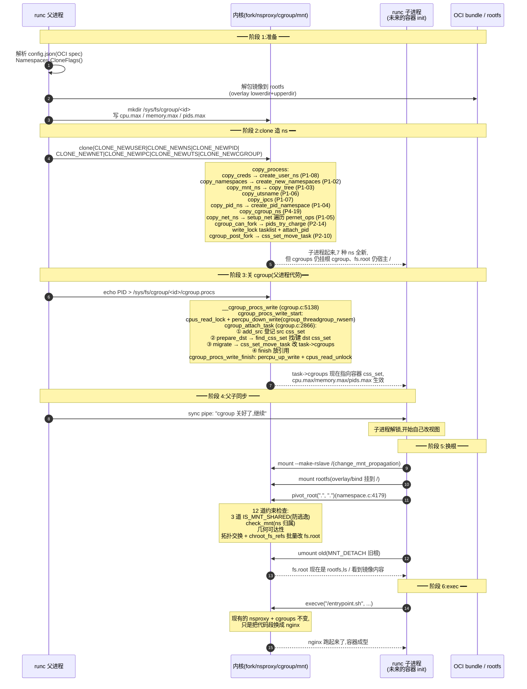
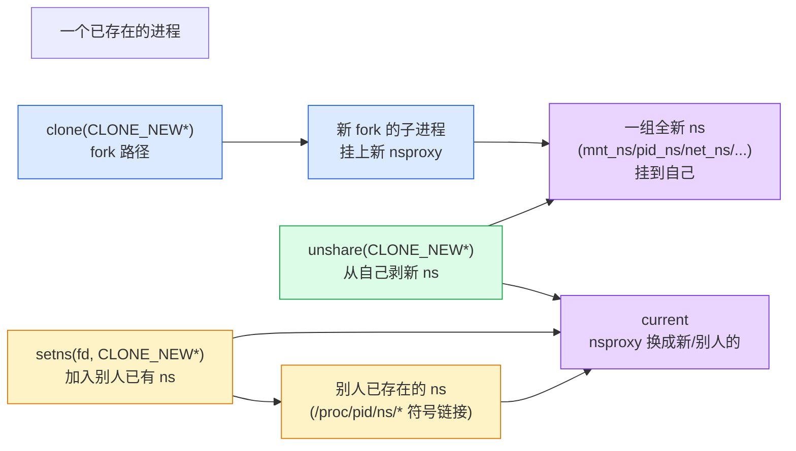

# 附录 A · 全景脉络:一次 `docker run` 的端到端时序 + namespace/cgroup 关系图

> 篇:附录(收束)
> 主线呼应:前 20 章把容器拆成了 20 个零件——7 种 namespace(`nsproxy` 总入口 + mnt/pid/net/uts/ipc/user/cgroup 各章)、6 个 cgroup controller(`css_set` 去重表 + `cgroup_attach_task` 迁移 + cpu/memory/io/pids/freezer/cpuset)、3 条进入 ns 的路(clone/unshare/setns)、cgroup v2 统一树、容器成型的三件套协议。每章都是一个局部放大图,但读者很可能到现在已经"只见树木不见森林"——`docker run nginx` 这一行命令敲下去,从 OCI bundle 到容器进程拉起来,中间 7 种 ns、3 条进入路径、6 个 controller、`pivot_root`、`cgroup_attach_task` 到底**按什么顺序、在哪一个 syscall、改 `task_struct` 的哪几个字段**?这个附录就是一张**全景图**:把 20 章所有局部拼回一张完整的端到端时序,把 7 种 ns + 6 个 controller 钉成一张关系图,把 clone/unshare/setns 三条路径排成一张对比表。读完,你该能在脑子里**一眼放完整部容器电影**——从 `docker run` 到容器 init 跑起来,每一帧内核做了什么。

## 核心问题

**一次 `docker run` 从 OCI bundle 到容器进程,内核侧到底跑了多少 syscall、动了哪些数据结构?7 种 namespace 和 6 个 cgroup controller 在 `task_struct` 上是怎么"挂"上去的——它们彼此独立还是有先后?clone/unshare/setns 三条进入 namespace 的路径,各自什么时候用、代价差多少、原子性保证在哪一层?**

读完本附录你会明白:

1. **端到端时序**:`docker run nginx` 从用户敲命令到 nginx 进程跑起来,中间 runc/Docker/containerd 层、内核层、各 ns 创建层、cgroup 迁移层如何交错;每个 syscall 落到哪个内核函数、改了 `task_struct` 哪个字段。
2. **namespace 7 种 + cgroup 6 controller 的关系图**:它们不是平铺的 13 个开关,而是**视图面(7 种 ns 聚合在 nsproxy)+ 资源面(6 个 controller 经 css_set subsys[] 数组)**,两面通过 `task_struct->nsproxy` 和 `task_struct->cgroups` 两个指针挂到进程上,互相正交。
3. **三路径对比**:clone(出生时一次性造 ns)、unshare(运行时自给自足剥新 ns)、setns(运行时加入别人已有 ns)三条路径,**何时用、原子性靠什么、代价差多少**,一张表说清。
4. **回扣全书二分法**:这个附录不引入新机制,而是把 20 章的所有局部收束成**视图 vs 资源**的总图——容器的全部秘密就是这两个指针 + 两类原语。

> **逃生阀**:如果你只看一节,看 A.2 的端到端时序图和 A.4 的三路径对比表。前者把全书压成一部电影,后者把 namespace 的进入方式钉成一张表。其他小节是它们的展开和佐证。

---

## A.1 一句话点破

> **容器不是一个新对象,是一个普通进程被两个指针夹住——`task_struct->nsproxy` 指向一组 7 种 ns(视图面),`task_struct->cgroups` 指向一个 `css_set`(资源面,内含 6+ 个 controller 的 css 指针)。一次 `docker run` 在内核侧的全部动作,就是按一套严格的协议,先后改这两个指针:先 `clone(CLONE_NEW*)` 把 nsproxy 换成一组全新 ns,再 `pivot_root` 把新 mnt ns 的根换成 rootfs,最后 `echo PID > cgroup.procs` 把 cgroups 指针换成指向限额 cgroup 的 css_set。顺序错一处,容器逃逸或宿主崩溃。**

这是结论,不是理由。本附录倒过来拆:先看"一次 docker run"从命令行到容器进程的**完整时序**(用户态分层 + 内核侧每个 syscall 的落点),把全书 20 章按时间轴排开;再把 nsproxy 和 css_set 在 `task_struct` 上的挂靠画成**关系图**,看清"视图 vs 资源"两面如何正交;然后给 clone/unshare/setns 三条进入 ns 的路一张**对比表**,把它们的语义、代价、原子性保证钉死;最后用一个"技巧精解"小节拆全景里最值得钻的一个工程技巧——**为什么"两个独立指针 + 一套协议"比"一个统一的容器对象"更优**(这是 Linux 容器哲学的工程化显形)。

> **本附录不重复细节**:每个 ns、每个 controller 的内部机制前 20 章已逐章拆透。这里只把它们**拼回一张图**,标注每个机制在全局的位置,以及对应该读哪一章深入。

---

## A.2 端到端时序:一次 `docker run` 在内核侧的电影

这一节是本附录的核心。把 `docker run nginx` 从用户敲命令到 nginx 进程起来,中间用户态的分层调用、内核的每个 syscall、各 ns 的创建、cgroup 的迁移,全部排成一张时序图。读者按这张图往回读前 20 章,就能把每个局部钉回全局位置。

### A.2.1 用户态分层:Docker → containerd → runc → nsexec

`docker run nginx` 不是一个进程的动作,是一条调用链:

```
docker CLI  ──►  dockerd(Docker daemon)
                  │
                  ▼
              containerd(容器运行时守护)
                  │
                  ▼
              containerd-shim(每个容器一个,托管容器生命周期)
                  │
                  ▼
              runc create + runc start(OCI 运行时,真正调内核)
                  │
                  ▼
              nsexec.c(C 初始化器,runc fork 出来的子进程里跑)
                  │
                  ▼
              容器 init(最终 exec 的 nginx / sh / pause)
```

每一层职责:Docker 负责镜像管理(`docker pull` 把 nginx 镜像解包成 rootfs)、CLI 解析、卷/网络插件;containerd 管理容器生命周期(启停、镜像快照);containerd-shim 把每个容器和 containerd 解耦(shim 死了 containerd 不死);runc 是真正按 OCI 规范调内核的层;nsexec 是 runc 在容器 init 进程里跑的 C 初始化器(通过 `memfd` + `execve` 注入),负责 fork 多代、逐个 setns/pivot_root。本附录聚焦**内核侧**,用户态分层只到这里点一下,详细的 runc 内部见 P3-15/16/17 的 ★对照 runc 小栏。

### A.2.2 内核侧端到端时序图

下面这张时序图把容器成型全过程画成一部电影。参与者(从左到右):runc 父进程、内核各子系统(fork/nsproxy/cgroup/namespace)、runc 子进程(未来的容器 init)。注意时间从上往下,**每个箭头都是一次 syscall 或一次内核内部调用**。



这张时序图是**本书 20 章的浓缩**。读者按编号回扣:

- **阶段 2 的 clone**(P3-15):一次 syscall 把 `CLONE_NEW*` 7 个位 OR 起来,内核 `copy_process` 按 7 个位依次调 7 个 `copy_*_ns`,全成或全回滚。同时 cgroup 在 fork 路径上通过 `cgroup_can_fork`(charge pids)+ `cgroup_post_fork`(挂 css_set)两阶段参与。
- **阶段 3 的 cgroup.procs 写入**(P3-17 + P2-10):走 `__cgroup_procs_write` → `cgroup_attach_task` 四步迁移(add_src/prepare_dst/migrate/finish),持三把锁保证 fork/exit 不抢跑。
- **阶段 5 的 pivot_root**(P3-17):12 道约束检查 + 拓扑交换,配 mnt ns 用(语义层面必须,不是 syscall 强制)。
- **阶段 6 的 execve**:nsproxy 和 cgroups 都已就位,execve 只换代码段,不改身份。

### A.2.3 时序里几个容易被忽略的"钉子"

时序图之外,有几个细节值得单独钉死,因为它们决定了"为什么容器能干净起来":

**钉子一:阶段 2 和阶段 3 之间的 `cgroup_post_fork` 把新进程挂进"根 cgroup"**。注意阶段 2 的 clone 把 7 种 ns 都造好了,但新进程此刻的 `task->cgroups` 指向的是**根 cgroup 的 `init_css_set`**——根 cgroup 没有 `cpu.max`/`memory.max` 限制,所以这一刻新进程是个"有视图但没笼子"的半成品。这就是为什么阶段 3(写 cgroup.procs)必须紧跟阶段 2 之后,**不能让子进程在这个窗口期 exec**——否则它跑出来一个不受约束的进程,能 fork 炸弹吃光宿主。runc 的父子 pipe 同步就是堵这个窗口:父进程先写 cgroup.procs 把笼子关好,再通过 pipe 通知子进程"可以继续"。

**钉子二:`pivot_root` 必须在 cgroup.procs 之后做?还是之前?** 看 P3-17 的 17.5.6 节给了答案:**pivot_root 之后再写 cgroup.procs**。原因是 pivot 之前根还是宿主 `/`,`/sys/fs/cgroup/<id>/cgroup.procs` 这个路径在宿主文件系统上能正常写;pivot 之后根换成了 rootfs,这个路径在新根下要么不存在要么是另一套视图(cgroup ns 切了之后)。所以协议是:`CLONE_NEWNS` → `make-rslave` → `pivot_root` → 写 `cgroup.procs` → `exec`。阶段 3 在时序图里画在 pivot 之前是简化(更精确的顺序见 P3-17 表 17.5.7),实际 runc 的 v2 cgroup 路径是 `/sys/fs/cgroup/<id>/cgroup.procs`,在 pivot 之前宿主路径上能访问;有些 rootless 场景为了避开这个时序敏感,会用 `CLONE_INTO_CGROUP`(clone 的扩展参数,5.7+)直接在 clone 时把子进程放进目标 cgroup,跳过"写 cgroup.procs"这一步——时序图里我们画的是经典协议,新接口在 P3-15 的 15.6 节点过。

**钉子三:阶段 5 的 `pivot_root(".", ".")` 是 runc 的工程技巧**。runc 用同一个目录当 `new_root` 和 `put_old`,绕过"rootfs 里要挖一个 put_old 目录"的麻烦(镜像里可能没这目录)。这是用户态运行时的工程美学,内核侧 `pivot_root` 的约束是"`put_old` 必须从 `new_root` 可达",自己可达自己,所以合法。详见 P3-17 的 17.7.2 节。

> **钉死这件事**:`docker run` 在内核侧是一部"7 syscall 电影"——① `clone(CLONE_NEW*)` 造 7 种 ns,② `mount --make-rslave`,③ `mount` rootfs,④ `pivot_root`,⑤ `umount` 旧根,⑥ `write(cgroup.procs)`,⑦ `execve`。每一步都有前一步铺垫的语义依赖,顺序错一步要么逃逸要么卡死。这个时序是 20 章所有局部机制在时间轴上的排列。

---

## A.3 关系图:namespace 7 种 + cgroup 6 controller 在 `task_struct` 上怎么挂

时序讲完了,这一节换一个视角——**结构**。容器成型之后,`task_struct` 上挂着什么?把它们画成一张关系图,就能看清"视图面"和"资源面"如何在同一个进程上正交共存。

### A.3.1 `task_struct` 的两个挂靠点

容器的全部秘密在 `task_struct` 的两个字段:

```c
/* include/linux/sched.h(简化,字段的精确行号以 6.9 源码为准) */
struct task_struct {
    ...
    struct nsproxy *nsproxy;          /* 视图面:7 种 ns 的指针聚合 */
    ...
    struct css_set __rcu *cgroups;    /* 资源面:一组 css 指针(controller 配额) */
    struct list_head cg_list;         /* 挂在 css_set->tasks 链表上的节点 */
    ...
};
```

这两个字段是**完全独立**的:改 `nsproxy` 不动 `cgroups`,改 `cgroups` 不动 `nsproxy`。这就是"视图 vs 资源"二分法在数据结构层面的体现——namespace 和 cgroup 是两套正交的原语,各自管自己的字段,通过同一个 `task_struct` 关联到同一个进程。

### A.3.2 视图面:`nsproxy` 聚合 7 种 ns

[`struct nsproxy`](../linux/include/linux/nsproxy.h#L32-L42)([nsproxy.h:32](../linux/include/linux/nsproxy.h#L32))是一个聚合结构,内部 7 个指针各指向一种 ns:

```
  task_struct
  │
  └─ nsproxy ──► struct nsproxy (include/linux/nsproxy.h:32)
                  │
                  ├─ mnt_ns ─────────► struct mnt_namespace  (P1-03 挂载树)
                  │                     └─ 一棵 mount 树(每节点一个 struct mount)
                  │
                  ├─ pid_ns_for_children ─► struct pid_namespace  (P1-04)
                  │                         └─ 层级 ns,每层独立 pidmap
                  │                         注:当前进程的 active pid ns 在 task->signal
                  │
                  ├─ net_ns ──────────► struct net  (P1-05 网络栈)
                  │                     ├─ netns_ipv4 / netns_ipv6 (路由表、filter 表)
                  │                     ├─ loopback、网卡列表
                  │                     └─ pernet_ops 初始化的所有协议模块状态
                  │
                  ├─ uts_ns ──────────► struct uts_namespace  (P1-06)
                  │                     └─ nodename / release / version 等字符串
                  │
                  ├─ ipc_ns ──────────► struct ipc_namespace  (P1-07)
                  │                     └─ ids[3]:消息队列/信号量/共享内存的 idr 表
                  │
                  ├─ time_ns + time_ns_for_children ─► struct time_namespace  (CLONE_NEWTIME)
                  │
                  └─ cgroup_ns ───────► struct cgroup_namespace  (P4-19)
                                        └─ 容器内能看见的 cgroup 路径根
```

注意三件事:

**一:`nsproxy` 不直接持有 pid ns 的 active 引用。** `pid_ns_for_children` 是"未来子进程要进入的 pid ns"——当前进程自己的 active pid ns 在 `task->signal->pid_ns`。这个不对称是 P1-02 第 2.3 节点过的"代际延迟":`CLONE_NEWPID` 不改变**当前**进程的 pid ns,只让**后续 fork 出来的子进程**进入新 ns。所以容器 init 自己永远是宿主 pid ns 的某个 PID,它的子进程(用 `CLONE_NEWPID` 之后 fork 出来的)才是容器里的 PID 1。这个不对称是 pid ns 设计上最反直觉的地方,P1-04 详讲。

**二:user namespace 不在 nsproxy 里。** user ns 是**凭据(cred)的一部分**,在 `task->cred->user_ns`,不在 nsproxy。这个不对称是 P1-02 第 2.3 节点的另一个"设计例外"——user ns 决定"我是谁"(capability 语义),是身份不是视图。所以 7 种 ns 看似对称,实际 user ns 是特殊的那个,P1-08 详讲。

**三:`cgroup_ns` 是最晚加入的(4.6,2016)。** 它管的是"容器里能看见的 cgroup 路径"——`/proc/self/cgroup` 在 cgroup ns 内展示成相对路径,避免宿主路径泄漏。它的设计哲学是"把视图隔离补完",P4-19 详讲。

### A.3.3 资源面:`css_set` 聚合 6+ 个 controller

再看资源面。`task->cgroups` 指向一个 [`struct css_set`](../linux/include/linux/cgroup-defs.h#L217-L290)([cgroup-defs.h:217](../linux/include/linux/cgroup-defs.h#L217))。这个结构里最关键的是一个 `subsys[]` 数组:

```
  task_struct
  │
  └─ cgroups ──► struct css_set (include/linux/cgroup-defs.h:217)
                  │
                  ├─ subsys[0]  ──► cpuset 的 css  (P2-14 绑核/绑内存节点)
                  ├─ subsys[1]  ──► cpu 的 css     (P2-11 cpu.max → throttle)
                  ├─ subsys[2]  ──► cpuacct 的 css (CPU 使用统计)
                  ├─ subsys[3]  ──► io 的 css      (P2-13 io.max → iocost/iolatency)
                  ├─ subsys[4]  ──► memory 的 css  (P2-12 memcg charge/OOM)
                  ├─ subsys[5]  ──► devices 的 css(设备访问白名单)
                  ├─ subsys[6]  ──► freezer 的 css (P2-14 整组冻结)
                  ├─ subsys[7]  ──► net_cls 的 css (网络流量分类,v1 历史包袱)
                  ├─ subsys[8]  ──► perf_event 的 css
                  ├─ subsys[9]  ──► net_prio 的 css
                  ├─ subsys[10] ──► hugetlb 的 css (大页限额)
                  ├─ subsys[11] ──► pids 的 css    (P2-14 pids.max 限进程数)
                  ├─ subsys[12] ──► rdma 的 css
                  ├─ subsys[13] ──► misc 的 css
                  └─ subsys[14] ──► debug 的 css
                  │
                  ├─ refcount = 1000   (1000 个同归属进程共享一个 css_set)
                  ├─ nr_tasks = 1000
                  ├─ tasks 链表(挂所有归属此 cset 的 task_struct->cg_list)
                  └─ hlist(挂在 css_set_table 哈希桶里去重)
```

注意 [`include/linux/cgroup_subsys.h`](../linux/include/linux/cgroup_subsys.h#L9-L72)([cgroup_subsys.h:9](../linux/include/linux/cgroup_subsys.h#L9))列出的是 **15 个** controller slot,不是 6 个——本附录标题说的"6 个"是指**容器场景真正用到的 6 个核心**(cpu/memory/io/pids/freezer/cpuset)。剩下 9 个要么是 v1 历史包袱(`net_cls`/`net_prio`/`cpuacct`),要么是基础设施(`perf_event`/`devices`/`hugetlb`/`rdma`/`misc`/`debug`)。这 15 个 slot 全部聚合在一个 `css_set` 里,容器进程一次 `cgroup_attach_task` 就把全部 controller 的归属同时换掉——这就是 css_set 去重表的价值(P0-01 技巧精解二、P2-09 详讲)。

为什么用 `css_set` 聚合而不是每个 controller 各自挂 task?这是 P0-01 立起来的"账本工程":同归属的 1000 个进程共享一个 `css_set`,fork/exit 只 inc/dec 一次 refcount;迁移整组进程只换一个指针,而不是改 15000 个字段。这是"用一层间接换内存 + 性能"的典范。

### A.3.4 两面正交:视图面 × 资源面

把 A.3.2 和 A.3.3 拼起来,就得到容器进程的**完整关系图**:

```
  ┌─────────────────────────────────────────────────────────────────────┐
  │                      task_struct(容器 init 进程)                    │
  │                                                                     │
  │   ┌────────── nsproxy ──────────┐    ┌────────── cgroups ─────────┐ │
  │   │  视图面(7 种 ns,看到什么)│    │ 资源面(6+ controller,能用多少)│ │
  │   │                             │    │                            │ │
  │   │  mnt_ns   ──► 挂载树         │    │  subsys[cpu]     ──► cpu.max │ │
  │   │  pid_ns*  ──► 进程号         │    │  subsys[memory]  ──► memcg   │ │
  │   │  net_ns   ──► 网络栈         │    │  subsys[io]      ──► io.max  │ │
  │   │  uts_ns   ──► hostname      │    │  subsys[pids]    ──► pids.max│ │
  │   │  ipc_ns   ──► SysV IPC      │    │  subsys[freezer] ──► 冻结    │ │
  │   │  time_ns  ──► 时钟偏移       │    │  subsys[cpuset]  ──► 绑核    │ │
  │   │  cgroup_ns─► cgroup 路径视图 │    │  ...(共 15 个 slot)         │ │
  │   │                             │    │                            │ │
  │   │  ★ user_ns 在 cred 不在这   │    │  refcount/N 个 task 共享    │ │
  │   └─────────────────────────────┘    └────────────────────────────┘ │
  │                                                                     │
  │   两个指针完全独立:改 nsproxy 不动 cgroups,反之亦然              │
  └─────────────────────────────────────────────────────────────────────┘

  造 ns:clone(CLONE_NEW*) / unshare / setns   → 改 nsproxy
  关 cgroup:echo PID > cgroup.procs           → 改 cgroups
  换根:pivot_root                              → 改 fs_struct.root(在 mnt_ns 视图内)
```

这张图钉死了全书的工程美学:**容器没有"一个统一的容器对象",而是 `task_struct` 上的两个独立指针 + 一套协议把它们拼起来**。改视图不动资源,改资源不动视图,换根在 mnt ns 内做。这种"正交分解"是 Linux 容器比 VM 轻、比单一抽象灵活的根本——你可以单独用 namespace(不挂 cgroup)、单独用 cgroup(不切 ns)、单独 pivot_root(不切 ns),每种原语都能独立用,runc 把它们组装起来才是完整容器。

> **钉死这件事**:容器进程在 `task_struct` 上挂两个独立指针——`nsproxy`(视图面,聚合 7 种 ns)+ `cgroups`(资源面,聚合 15 个 controller 的 css)。两面完全正交,各自有独立的进入路径(`copy_namespaces` / `cgroup_attach_task`)、独立的并发保护(`task_lock` / `cgroup_threadgroup_rwsem`)、独立的源码子系统(`kernel/nsproxy.c` + 各 ns 文件 / `kernel/cgroup/cgroup.c` + 各 controller)。容器不是单一对象,是两个指针 + 一套协议。

---

## A.4 三条进入 namespace 的路径:clone / unshare / setns 对比

namespace 有三种"进入"方式,前 20 章分别在不同章讲过,这一节把它们排成一张对比表,钉死何时用哪条。

### A.4.1 三条路径的本质差别

| 维度 | `clone(CLONE_NEW*)` | `unshare(CLONE_NEW*)` | `setns(fd, CLONE_NEW*)` |
|------|---------------------|----------------------|-------------------------|
| **何时用** | fork 时造新 ns | 已存在进程给自己剥新 ns | 已存在进程加入别人已有 ns |
| **典型场景** | 容器诞生(runc create) | 容器启动早期补建 user ns | docker exec / kubectl exec 进入容器 |
| **ns 来源** | 全新创建 | 全新创建 | 加入已存在的 ns(/proc/pid/ns/*) |
| **入口 syscall** | `clone` / `clone3`([fork.c:2908](../linux/kernel/fork.c#L2908) / [3082](../linux/kernel/fork.c#L3082)) | `unshare`([fork.c:3392](../linux/kernel/fork.c#L3392)) | `setns`([nsproxy.c:546](../linux/kernel/nsproxy.c#L546)) |
| **内部构造函数** | `copy_namespaces` → `create_new_namespaces` | `unshare_nsproxy_namespaces` → `create_new_namespaces` | `prepare_nsset` → `validate_nsset` → `commit_nsset` |
| **构造模式** | 直接构造 + 挂到新 task | 构造阶段(填局部变量)+ 提交阶段(挂到 current) | 两阶段:prepare/validate 改临时 nsset,commit 才换上 current |
| **原子性保证** | `create_new_namespaces` 反序回滚链,全成或全回滚 | 同 clone(`create_new_namespaces` 共用)+ 构造/提交分隔线 | "point of no return"——install 全成功才 commit,commit 只做无副作用的事 |
| **一次切多种 ns** | 是(7 个位 OR) | 是(同 clone) | proc_ns_file 路径**一次一种**,pidfd 路径(5.10+)一次多种 |
| **权限要求** | `CAP_SYS_ADMIN`(除 `CLONE_NEWUSER`) | 同 clone | `CAP_SYS_ADMIN` + `ptrace_may_access` 目标进程 |
| **代价** | 7 种 ns 各自的 `copy_*_ns` 代价(net/mnt 重) | 同 clone(走同样的 `create_new_namespaces`) | 几乎不创 ns(加入已有的),只 install;但 mnt ns install 仍要 `copy_tree` |
| **挂靠点** | 新 fork 出来的 task_struct(`tsk->nsproxy = new`) | current(`switch_task_namespaces(current, new)`) | current(同 unshare,最终走 `switch_task_namespaces`) |

### A.4.2 三条路径的语义图

用 mermaid 把三条路径画成一张状态图:



### A.4.3 共同点:三条路径最后都走 `switch_task_namespaces`

三条路径看着不同,但最终都汇聚到同一个函数——[`switch_task_namespaces`](../linux/kernel/nsproxy.c#L239-L252)([nsproxy.c:239](../linux/kernel/nsproxy.c#L239))。这个函数是 namespace 切换的**唯一真身**:

```c
/* kernel/nsproxy.c:239(简化) */
void switch_task_namespaces(struct task_struct *p, struct nsproxy *new)
{
    struct nsproxy *ns;

    might_sleep();
    task_lock(p);              /* 持 task->alloc_lock,不是全局锁 */
    ns = p->nsproxy;
    p->nsproxy = new;          /* ★ 一行指针赋值,视图切换 */
    task_unlock(p);

    if (ns)
        put_nsproxy(ns);       /* 旧 nsproxy 引用 -1 */
}
```

([nsproxy.c:239-L252](../linux/kernel/nsproxy.c#L239-L252))

**`p->nsproxy = new` 这一行,是所有 namespace 切换的最终落点**。无论你是 clone 出来的新进程、unshare 的 current、还是 setns 的 current,最后视图切换都是这一行指针赋值。三种路径的差别全在"如何造出那个合法的 `new`":

- **clone**:`create_new_namespaces` 一次造 7 种 ns,挂到刚 fork 的子进程。
- **unshare**:同 `create_new_namespaces`,但挂到 current(在 `ksys_unshare` 的提交阶段)。
- **setns**:用别人已存在的 ns,逐个 install 进临时 nsset,commit 时把整个 nsset 换上 current。

> **钉死这件事**:三条进入 ns 的路径(clone/unshare/setns)的本质差别在"ns 从哪来 + 挂到哪个 task"——clone 是全新 ns 挂到新 task,unshare 是全新 ns 挂到 current,setns 是别人已有 ns 挂到 current。但三条路径**最后都走 `switch_task_namespaces` 那一行 `p->nsproxy = new`**。这就是"换视图 = 换指针"这个 namespace 全部秘密在源码层面的显形。

### A.4.4 实战:什么时候用哪条

把三路径落到具体场景:

| 场景 | 用哪条 | 为什么 |
|------|--------|--------|
| `docker run` / `runc create` 启动新容器 | clone | 容器诞生的标准动作,一次 syscall 造全套 ns |
| rootless 容器启动时把自己降级成容器 root | clone 带 `CLONE_NEWUSER`(或 unshare `CLONE_NEWUSER`) | `CLONE_NEWUSER` 是唯一不要 `CAP_SYS_ADMIN` 的,rootless 必走 |
| `docker exec bash` / `kubectl exec -it pod -- bash` 进入已有容器 | setns | 容器已存在,新 bash 加入容器的 7 种 ns |
| 一个 daemon 想给自己隔离网络 | unshare `CLONE_NEWNET` | 不 fork,直接剥 |
| 调试时 `unshare -Urn bash` 给自己造新 user+net ns | unshare | 命令行工具,非特权(`CLONE_NEWUSER` 不要 cap) |
| Pod 内多个容器共享一个 ipc ns | 第二个容器 setns 进第一个容器的 ipc ns | K8s 的 `shareProcessNamespace`/`shareProcessNamespace` 类语义 |
| 监控 agent 进宿主的 net ns 看网络 | setns(或不切,本来就在宿主 ns) | K8s 的 `hostNetwork: true` |

实战中 runc 几乎不用 unshare——它的容器创建走 clone,exec 走 setns,unshare 只在 rootless 早期建 user ns 时偶尔用。但内核里 unshare 是不可或缺的第三条路,它让"已存在进程"也能造新 ns,这是 namespace 能作为通用原语(不只是容器)的关键。

---

## A.5 6 个 cgroup controller:视图面之外的资源面

namespace 7 种讲完了,资源面 6 个核心 controller 也钉一张速查表,把每个 controller 的"限额文件→内核落点"串起来。

| controller | 限额文件 | 内核落点 | 何时生效 | 本书章节 |
|-----------|---------|---------|---------|---------|
| **cpu** | `cpu.max`(quota period)<br/>`cpu.weight`(1~10000) | `cpu.max` → `cfs_bandwidth`→ `throttle_cfs_rq`([fair.c](../linux/kernel/sched/fair.c)) | 调度器 tick,超额 throttle 整组 | P2-11(对照《调度器》P6-19) |
| **memory**(memcg) | `memory.max`<br/>`memory.swap.max`<br/>`memory.oom.group` | 每次 page 分配 `try_charge`→超 `memory.max` 触发 OOM | page 分配路径(mm/memcontrol.c) | P2-12(对照《mm》) |
| **io** | `io.max`(rbps/wbps/riops/wiops) | → `blk-iocost`/`blk-iolatency` token 模型 | bio 提交路径(block/blk-iocost.c) | P2-13(对照《块设备》) |
| **pids** | `pids.max` | fork 路径 `pids_can_fork` → `pids_try_charge` 超额返回 `-EAGAIN`/`-ENOSPC` | fork 时(P3-15 讲过 fork 路径) | P2-14 |
| **freezer** | `cgroup.freeze`(1 写入即冻结) | 整组任务状态机 `JOBCTL_TRAP_FREEZE`,新 fork 子进程一出生也冻 | 任务调度入口检查 | P2-14 |
| **cpuset** | `cpuset.cpus`<br/>`cpuset.mems` | 改任务 `task->cpus_allowed` / `task->mems_allowed` | `cgroup_attach_task` 的 `->attach()` 回调 | P2-14 |

注意三个跨 controller 的共性:

**一:限额生效时机各不相同,但都"记账到 cgroup 账上"**。cpu 在 tick 累加、memory 在 page 分配、io 在 bio 提交、pids 在 fork、freezer 在调度入口、cpuset 在 attach。每种资源都在它最自然的记账点埋了 charge/uncharge 的钩子,这就是 cgroup "渗透到内核各子系统"的工程现象(P0-01 第 1.4 节点过)。

**二:每个 controller 都是一张 `struct cgroup_subsys` 函数指针表**。15 个 controller 各自填一张表,核心路径按 `class->xxx()` 调用:

```c
/* include/linux/cgroup-defs.h:688(骨架) */
struct cgroup_subsys {
    struct cgroup_subsys_state *(*css_alloc)(struct cgroup_subsys_state *parent_css);
    int (*css_online)(struct cgroup_subsys_state *css);
    void (*css_offline)(struct cgroup_subsys_state *css);
    void (*css_release)(struct cgroup_subsys_state *css);
    void (*css_free)(struct cgroup_subsys_state *css);

    int (*can_fork)(struct task_struct *task, struct css_set *cset);
    void (*cancel_fork)(struct task_struct *task, struct css_set *cset);
    void (*fork)(struct task_struct *task);
    void (*exit)(struct task_struct *task);
    void (*release)(struct task_struct *task);
    void (*bind)(struct cgroup_subsys_state *root_css);

    bool threaded;           /* 能否用于 threaded cgroup */
    bool early_init;         /* 是否在 boot 早期初始化 */

    /* ... 一共几十个函数指针 ... */
};
```

([cgroup-defs.h:688](../linux/include/linux/cgroup-defs.h#L688))

每个 controller(cpuset/memory/cpu/io/pids/freezer/...)各填一份这张表。比如 pids controller 填 `.can_fork = pids_can_fork`([pids.c:376](../linux/kernel/cgroup/pids.c#L376)),freezer 填 `.fork = freezer_fork`([freezer.c](../linux/kernel/cgroup/freezer.c)),memcg 填 `.css_alloc = mem_cgroup_css_alloc`。核心路径 `cgroup_can_fork` 用 `do_each_subsys_mask` 遍历调用(P3-15 第 15.6 节详讲过),不知道具体是哪个 controller——**这就是"函数指针多态",controller 可插拔是 cgroup v2 架构的核心**(P2-09 详讲)。

**三:cgroup v2 的单一树(unified hierarchy)**。所有 controller 共用同一棵 cgroup 树,不像 v1 那样每个 controller 一棵树。这让"一个容器 = 一个 cgroup 目录"自然成立——写 `/sys/fs/cgroup/mycontainer/cpu.max` 和 `/sys/fs/cgroup/mycontainer/memory.max` 在同一个目录下,而不是两个不同的挂载点。这个统一模型是 cgroup v2 的核心改进,P4-18 详讲。

---

## A.6 技巧精解:为什么是"两个独立指针 + 一套协议"而非"一个统一容器对象"

本附录技巧精解挑一个最值得钻的全局问题——**Linux 容器为什么选了"`task_struct` 上两个独立指针 + 用户态组装协议"这种分散式设计,而不是像 VM 那样一个统一的"容器对象"?** 这个选择背后的工程考量,是全书哲学的工程化显形。

### A.6.1 朴素设计:统一容器对象会怎样

假设 Linux 当初选了"统一容器对象"的路线,会怎样?朴素设计是在内核里引入一个 `struct container`:

```c
/* 朴素的、糟糕的设计(示意,非源码) */
struct container {
    struct nsproxy *ns;            /* 视图 */
    struct css_set *cset;          /* 资源 */
    struct fs_struct *fs;          /* 根文件系统 */
    struct list_head tasks;        /* 容器内的所有进程 */
    u64 container_id;              /* 容器唯一 ID */
    /* ... 一堆容器级别的字段 ... */
};

struct task_struct {
    ...
    struct container *my_container;  /* 指向所属容器 */
    ...
};
```

syscall 可能是 `container_create(flags, cpu_max, mem_max, rootfs, ...)`,一次调用造出整个容器。看起来比 Linux 现有的"7 种 ns + 15 个 controller + pivot_root + 协议"简单得多。为什么 Linux 没这么选?

这个朴素设计会撞上**至少五堵墙**:

**墙一:无法局部使用**。有时候你只想用 namespace 的一部分(比如 `unshare -m` 只隔离挂载视图,不限资源),有时候只想用 cgroup 的一部分(比如把一个 daemon 关进 cpu cgroup 限 CPU,不切 ns)。统一容器对象把视图和资源**强绑定**,每次都要"造一个完整容器"才能用任何一部分——这是巨大的灵活性损失。现实里 namespace 和 cgroup 的独立使用场景非常多:systemd 用 cgroup 管服务资源(不切 ns)、flatpak 用部分 ns 做沙箱(不挂完整 cgroup)、`unshare` 命令只切一两种 ns。这些场景下"统一容器"是负担。

**墙二:演进僵化**。Linux 的 ns 从 2002 年(mnt ns,2.4.19)一路加到 2020 年(time ns,5.6),cgroup controller 也从最早的 cpuset/cpu/memory 一路加到 misc/rdma。统一容器对象意味着每次加一种 ns 或 controller 都要改 `struct container` 的定义、改 `container_create` 的参数、改所有调用方。分散式设计下,加一种 ns 只需要新增一个 `CLONE_NEW*` 位 + 一个 `copy_*_ns` 函数,核心 nsproxy 不用改(标志位驱动,P3-15 第 15.4 节点过);加一个 controller 只需要填一张新的 `cgroup_subsys` 表 + 注册进 `cgroup_subsys.h`(函数指针多态,P2-09 详讲)。**分散式设计的演进成本是 O(1),统一式是 O(N)**。

**墙三:权限粒度丢失**。`CLONE_NEWUSER` 不要 `CAP_SYS_ADMIN`,其他 6 种要;`setns` 要 `ptrace_may_access` 目标进程;cgroup.procs 要检查打开时的 cred(P3-17 第 17.3.2 节点过防继承 fd 攻击)。这些权限检查分散在不同 syscall 里,每个原语都有自己的权限模型——统一容器对象的 `container_create` 要么"全有或全无"(粒度太粗),要么内部还是分散检查(等于绕了一圈回到分散式)。

**墙四:并发协议难表达**。fork 路径上 namespace 和 cgroup 是**两条并行路径**(P3-15 第 15.6 节),通过 `cgroup_threadgroup_rwsem` 串行化;`setns` 是两阶段 prepare/commit(P3-16);`cgroup_attach_task` 是四步迁移(P2-10/P3-17)。这些精细的并发协议对应到"散落的原语 + 独立的锁",如果塞进一个 `container_create`,锁的设计会极其复杂——你得同时保护 ns 切换、cgroup 迁移、rootfs 换根,而且要保证三者的原子性。Linux 现有设计把锁**分散到各自子系统**(`task_lock` 保护 nsproxy、`cgroup_threadgroup_rwsem` 保护 threadgroup、`css_set_lock` 保护 cset),每个子系统自己最懂自己的锁需求。

**墙五:用户态灵活性**。runc 能根据 OCI spec 灵活组合 ns(部分新建、部分 setns 复用,见 P3-15 ★对照栏)、能 rootless(CAP_NEWUSER 先生效)、能 pivot_root(".", ".") 用技巧(见 P3-17 第 17.7.2 节)。这些灵活性都建立在"内核提供细粒度原语,用户态自由组合"的基础上。统一容器对象会把这套灵活性全抹平——`container_create` 一次调用,内部写死顺序,用户态没空间发挥。

### A.6.2 Linux 的选择:原语 + 协议

Linux 的选择是**提供原语、不强制协议**——namespace 系统调用、cgroup 文件接口、pivot_root,各自是独立的 syscall,用户态自己决定调用顺序。这带来:

- **正交分解**:视图和资源是两个独立指针,各自有独立的子系统、独立的锁、独立的演进。
- **细粒度可用**:`unshare -m` 只切 mnt ns、`systemd` 用 cgroup 不切 ns、`chroot` 只换根不切 ns——每种原语都能单独用。
- **协议在用户态**:runc 封装协议,普通用户 `docker run` 不用背 12 道检查的顺序;但高级用户(自己写容器运行时、做沙箱)可以直接调原语组合,灵活性全留。
- **演进成本低**:加 ns / controller 都是局部改动,核心不动。

代价是**协议错了会出事**——忘记 `CLONE_NEWNS` 就 `pivot_root` 会改宿主根(P3-17 第 17.5.2 节)、忘记 `make-rslave` 会让挂载事件污染宿主(17.5.3)、`CLONE_NEWUSER` 不第一个做会有逃逸窗口(17.5.5)。历史上容器逃逸 CVE(CVE-2019-5736 等)大多和"协议没封好"有关。这就是 runc 这种"参考运行时"的存在意义——它把协议封装成可执行程序,让普通用户不用自己背协议清单。

### A.6.3 这种哲学的更广显形

"原语 + 协议"是 Unix 工程美学的核心,不止容器:

- **文件系统**:`open/read/write/close/lseek/mmap` 是原语,`fopen/fread/fclose`(stdio)是用户态封装的协议。
- **进程间通信**:`pipe/socket/shm/sem/msg` 各自是原语,具体协议(HTTP、gRPC、JSON-RPC)在用户态组织。
- **网络**:`socket/bind/listen/accept/connect` 是原语,HTTP/ TLS / WebSocket 在用户态或更上层内核模块实现。
- **容器**:namespace + cgroup + pivot_root 是原语,OCI 规范 + runc 是用户态封装的协议。

这种"内核提供积木、用户态搭房子"的哲学,和 Windows 的"内核提供 CreateProcess、CreateFile、CompletePort 这种高级接口"形成鲜明对比。Linux 选择了灵活性,代价是用户态要承担更多组织责任——这就是为什么 Docker/K8s/runc 这种用户态运行时在 Linux 上繁荣,而在 Windows 上一直做不起来(Windows 的容器模式更接近"统一对象",灵活性受限)。

> **反面对比**:如果 Linux 选了"统一容器对象"(`container_create` 一次 syscall 造出整个容器),灵活性会大幅丧失——无法局部使用 namespace/cgroup、演进成本 O(N)、权限粒度丢失、并发协议难表达、用户态无空间组合。Linux 的选择是"原语 + 协议":namespace/cgroup/pivot_root 是原语,runc 封装协议。这是 Unix 工程美学的延续——内核提供积木,用户态搭房子。代价是协议错了会出事(CVE),收益是极大的灵活性。

> **钉死这件事**:`task_struct` 上两个独立指针 + 一套用户态协议,是 Linux 容器工程的全部秘密。视图(nsproxy)和资源(cgroups)正交分解,各自有独立的子系统、锁、演进路径。内核提供原语,runc/Docker/K8s 在用户态封装协议。这种哲学是 Unix 美学的延续,也是 Linux 容器能在云原生时代繁荣的根本。

---

## 章末小结

这个附录是全书的**收束图**。我们没有引入任何新机制,只是把前 20 章的所有局部拼回三张图——端到端时序(A.2)、关系图(A.3)、三路径对比(A.4),再用一个技巧精解(A.6)拆"为什么是两个独立指针 + 协议"这个全书最深的工程哲学。

回到全书二分法:**视图隔离(namespace)vs 资源控制(cgroup)**。这个附录把二分法在数据结构层面显形——`task_struct->nsproxy` 是视图面的入口、`task_struct->cgroups` 是资源面的入口,两者正交。一次 `docker run` 在内核侧的全部动作,就是按协议改这两个指针:先 `clone(CLONE_NEW*)` 造视图、再 `pivot_root` 改根(在视图内)、最后 `write(cgroup.procs)` 改资源。整个容器从无到有,就是这两个指针的两次写入。

### 五个"为什么"清单

1. **为什么 `docker run` 必须按"ns → pivot_root → cgroup.procs"这个顺序?** 每一步的语义依赖前一步铺垫:`CLONE_NEWUSER` 决定后续 capability 语义、`CLONE_NEWNS` 决定 pivot 改哪棵挂载树、`make-rslave` 防挂载事件污染宿主、`pivot_root` 把根换成 rootfs、`write(cgroup.procs)` 关资源笼子。顺序错一步,要么逃逸(没切 user ns 就有过多权限)、要么宿主崩(没切 mnt ns 就 pivot)、要么卡死(没 make-rslave 被 `IS_MNT_SHARED` 检查拒)。

2. **为什么 nsproxy 和 cgroups 是两个独立指针,而不是一个统一容器对象?** 正交分解带来灵活性——可以单独用 namespace(如 `unshare -m`)、单独用 cgroup(如 systemd 管服务)、单独 pivot_root(如 `chroot` 替代)。统一对象会丧失局部可用性、演进僵化(加 ns/controller 成本 O(N))、权限粒度丢失、并发协议难表达。Linux 选原语 + 协议,代价是协议错会出事,收益是极大灵活性。

3. **为什么 clone/unshare/setns 三条路径最后都走 `switch_task_namespaces`?** 那一行 `p->nsproxy = new` 是所有视图切换的唯一真身。三条路径的差别全在"如何造出合法的 `new`":clone 是 `create_new_namespaces` 全新造、unshare 是同 `create_new_namespaces` 造到 current、setns 是用别人已存在的 ns install 进临时 nsset 再 commit。这种"多条进入路径汇聚到一个原子操作"是 namespace 子系统的工程设计美学。

4. **为什么 15 个 cgroup controller 共用同一个 `css_set`?** `css_set` 是任务↔cgroup 的多对多去重表(P0-01 技巧精解二)。同归属的 1000 个进程共享一个 `css_set`,fork/exit 只 inc/dec 一次 refcount;迁移整组进程只换一个指针(`task->cgroups = new_cset`),而不是改 15000 个字段。这种"用一层间接换内存 + 性能"是 cgroup 在大规模容器场景(K8s 一个节点几百个 pod)能跑得起来的根本。

5. **为什么 Linux 容器比 VM 轻、比单一抽象灵活?** 视图是"换指针"不是"换数据"——namespace 不复制进程表/网络栈/挂载树,只给进程发一副过滤眼镜;资源是"记账"不是"换执行环境"——cgroup 不起客户机内核,只在每次资源消耗时记到 cgroup 账上。所以容器秒级启动(没客户机内核要起)、密度极高(几百容器共享一个宿主内核)、迁移轻量(本质是进程 + 镜像)。代价是隔离比 VM 弱(共享内核),所以需要 namespace + cgroup + user ns 补隔离。

### 想继续深入往哪钻

- **时序图里每个 syscall 的内核侧细节**:clone 路径见 [P3-15](P3-15-clone-CLONE_NEW-一次系统调用造命名空间.md) 第 15.2 节 fork 总图、cgroup.procs 写入见 [P3-17](P3-17-把进程关进cgroup-pivot_root-容器成型.md) 第 17.3 节六步开胃菜、pivot_root 见同章 17.4 节。
- **7 种 ns 各自的内部机制**:[P1-02](P1-02-nsproxy-namespace的总入口.md) 总入口 + `ns_common`/`proc_ns_operations` 多态骨架;[P1-03](P1-03-mnt-namespace-挂载视图.md) mnt ns 的 `copy_tree` + 挂载传播;[P1-04](P1-04-pid-namespace-进程号视图.md) pid ns 层级;[P1-05](P1-05-net-namespace-网络栈视图.md) net ns 的 `pernet_ops`;[P1-06](P1-06-uts-namespace-hostname视图.md) uts ns 设计哲学;[P1-07](P1-07-ipc-namespace-SysV-IPC视图.md) ipc ns ids 表;[P1-08](P1-08-user-namespace-uid映射与安全.md) user ns `kuid_t` 解耦。
- **6 个 cgroup controller 各自的记账路径**:[P2-09](P2-09-cgroup-v2-概览-统一层级与css_set.md) `css_set` 去重 + `cgroup_subsys` 多态;[P2-10](P2-10-cgroup_attach_task-进程怎么迁进cgroup.md) 四步迁移;[P2-11](P2-11-cpu子系统-cpu_max与throttle.md) cpu cgroup 组调度;[P2-12](P2-12-memcg-memory子系统-charge与OOM.md) memcg charge;[P2-13](P2-13-io子系统-io_max与IOPS限额.md) io cgroup iocost;[P2-14](P2-14-pids-freezer-cpuset-进程数冻结绑核.md) pids/freezer/cpuset。
- **cgroup v2 统一模型 + cgroup ns**:[P4-18](P4-18-cgroup-v2-统一层级-vs-v1-hybrid.md) 单一树 + no internal process;[P4-19](P4-19-cgroup-namespace-视图隔离的最后一环.md) cgroup ns 视图裁剪。
- **哲学与总表**:[P5-20](P5-20-Linux容器的哲学-对照runc-Docker-K8s总表.md) 内核积木 vs 用户态组装全栈。
- **附录 B**:[附录 B · 源码阅读路线与延伸](附录B-源码阅读路线与延伸.md)——`kernel/cgroup/` + 各 ns 文件阅读地图、`/proc/<pid>/ns/*` / `/sys/fs/cgroup/` / `unshare`/`nsenter`/`cgroup-tools` 命令、crun/youki/runsc(gVisor)对照、与 FreeBSD jail/Solaris Zones/VM 对比、容器逃逸 CVE 案例。

### 引出下一附录

这个附录画了全景图,把 20 章的局部拼回了整体。下一个附录 B 给的是**阅读路线 + 延伸**——如果你想自己钻进 `kernel/cgroup/` 或 `kernel/nsproxy.c` 读源码,从哪个文件开始、哪些函数是必读;如果你想用 `unshare`/`nsenter`/`cgroup-tools` 自己动手造最小容器,命令怎么敲;如果你想横向对比,crun(C 实现)/youki(Rust 实现)/runsc(gVisor 沙箱)和 runc 有何异同;如果你想看容器安全边界,FreeBSD jail、Solaris Zones、VM 各自的隔离哲学,以及 CVE-2019-5736 这种经典容器逃逸漏洞怎么利用"协议没封好"的窗口。附录 B 是本书的最后一篇,读完它你该有自己继续钻下去的路线图。
