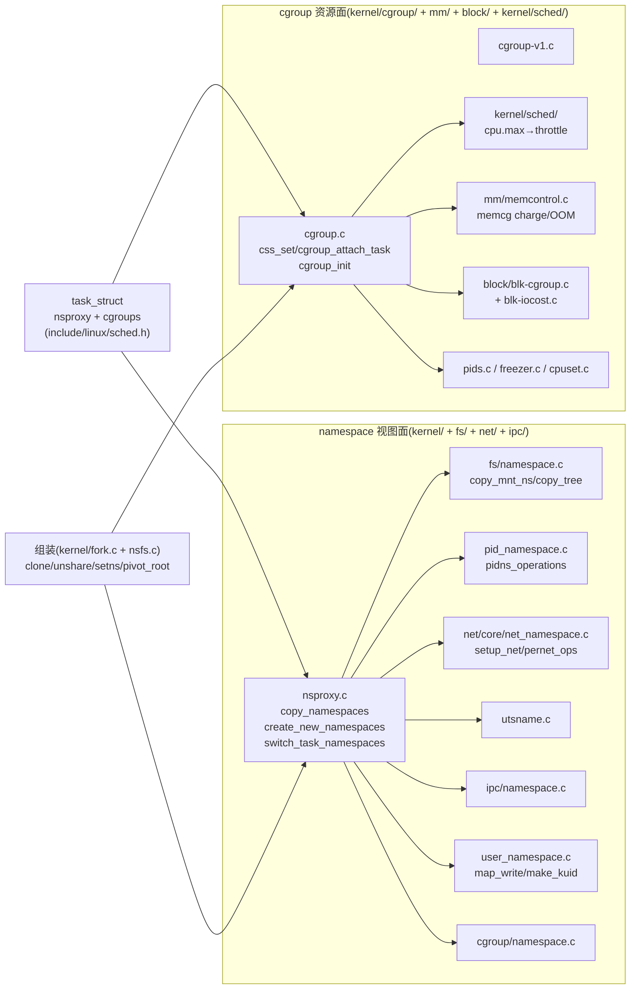

# 附录 B · 源码阅读路线与延伸

> 篇:附录(延伸)
> 主线呼应:正文二十章把"一个进程怎么被关进盒子"从 `task_struct->nsproxy`/`->cgroups` 一直讲到 `pivot_root` 容器成型。你读完正文,大概已经能在脑子里放映出一次 `docker run` 的内核侧全过程了。但这本小书的宗旨是"授人以渔"——你迟早要自己拎着 `grep`/`ctags`/`elixir.bootlin.com` 钻进 `kernel/cgroup/`、`kernel/nsproxy.c`、各 `*_namespace.c` 翻代码;迟早要在生产环境用 `/proc/<pid>/ns/*`、`/sys/fs/cgroup/`、`unshare`/`nsenter`/`cgroup-tools` 排查一个"容器看不到别的容器""某 pod 吃满 CPU 被 throttle"的故障;迟早要回答架构评审里那句"我们用 runc 还是 crun、要不要上 youki、gVisor 适不适合我们、和 FreeBSD jail / Solaris Zones 比有什么不一样、为什么容器逃逸 CVE 年年有"。这个附录把这些"地图、工具、对照、安全边界"一次收束,让你从"读懂正文"过渡到"自己排查、自己选型、自己看 CVE"。

## 核心问题

**正文讲的是"机制",附录 B 给的是"路线图"。当你合上正文、面对一台真实的 Linux 机器和一个真实的故障时,该从哪个源码文件读起?该用哪条 `cat /proc/<pid>/ns/net`、`cat /sys/fs/cgroup/<path>/cgroup.procs` 去验证你的判断?容器生态不止 runc 一个运行时,crun/youki/runsc 各有什么取舍?容器隔离和 FreeBSD jail/Solaris Zones/VM 是同一类东西还是本质不同?年年爆出的容器逃逸 CVE(2019-5736、2022-0185),逃的到底是内核哪一层?**

读完本附录你会明白:

1. **源码阅读地图**:按正文 P0→P5 的章节顺序,把 `kernel/cgroup/` + `kernel/nsproxy.c` + 7 个 `*_namespace.c` + `fs/namespace.c` + `mm/memcontrol.c` + `block/blk-cgroup.c` + `kernel/sched/` 里**每章该读哪些文件、哪些函数**,做成一张可勾选的清单,你跟着读不会迷路。
2. **观测点速查**:`/proc/<pid>/ns/*`、`/proc/<pid>/cgroup`、`/proc/<pid>/uid_map`、`/sys/fs/cgroup/`、`/sys/kernel/debug/` 里那些"容器人该会读"的文件,以及 `unshare`/`nsenter`/`cgcreate`/`cgexec`/`cgset`/`lscgroup`/`systemd-cgls` 这些命令到底在背后调用了什么。
3. **运行时横评**:runc(Go,主流)、crun(C,轻)、youki(Rust,安全)、runsc(gVisor,沙箱)、Kata Containers(轻量 VM + 容器)各自把"内核积木"摆在什么位置,为什么有人选它们而不是 runc。
4. **跨平台对照**:FreeBSD jail、Solaris Zones、VM(全虚拟化)和 Linux namespace+cgroup 是不是"同一类东西",各自的隔离边界画在哪。
5. **安全边界**:两个经典容器逃逸 CVE(CVE-2019-5736 runc、CVE-2022-0185 user ns caps),逃的到底是内核哪一层,给"容器隔离有多脆"一个诚实标尺。

> **逃生阀**:本附录是工具书,不需要一次读完。把它当索引——你排查某个具体问题时,翻到对应小节查文件名、命令、CVE 编号即可。每节都尽量独立,跳着读不丢线索。

---

## B.1 一句话点破

> **正文给了你"为什么这样设计",附录 B 给你"接下来往哪走"——一张按章节顺序排好的源码阅读地图(从 `kernel/nsproxy.c` 到 `kernel/cgroup/cgroup.c`,每章对应哪几个函数),一份观测点+命令速查(让你在一台真机上验证"这个进程在哪个 cgroup、哪个 pid ns"),一张运行时横评表(runc/crun/youki/runsc/Kata 各把内核积木摆在哪),以及一面安全镜子(两个 CVE 告诉你容器的边界薄在哪)。**

这是结论,不是理由。本附录不"倒过来拆"——它就是一张地图、一本速查手册。下面按"源码阅读地图 → 观测点速查 → 命令速查 → 运行时横评 → 跨平台对照 → 安全边界"六节铺开,每节尽量独立可查。

---

## B.2 源码阅读地图:按本书章节顺序读 `kernel/cgroup/` 与各 ns

> 这张地图回答一个问题:"我刚读完正文第 N 章,想去本地源码树里把这一章讲到的函数和结构体逐个 grep 出来核对,该从哪些文件入手?"我们按**正文 P0→P5 的章节顺序**(不是按源码目录字母序)给清单——这样你读正文读到哪,源码就跟到哪,不会突然撞进一个"前面没铺垫过的"函数。

### B.2.1 地基(对应 P0-01 + P1-02):`task_struct` 的两个指针 + `nsproxy`

正文 P0-01 立起全书地基:容器 = `task_struct->nsproxy`(视图指针)+ `task_struct->cgroups`(`css_set` 指针)。P1-02 把 `nsproxy` 总入口拆透。你要读的源码:

| 文件 | 重点函数/结构体 | 行号 | 对应章节 |
|------|----------------|------|---------|
| [`include/linux/sched.h`](../linux/include/linux/sched.h) | `struct task_struct` 的 `nsproxy` 字段、`cgroups`/`cg_list` 字段 | L1110、L1233-L1235 | P0-01 §1.3/§1.4 |
| [`include/linux/nsproxy.h`](../linux/include/linux/nsproxy.h) | `struct nsproxy`(7 个 ns 指针的聚合) | L32-L42 | P0-01 §1.3、P1-02 §2.2 |
| [`kernel/nsproxy.c`](../linux/kernel/nsproxy.c) | `copy_namespaces`(fork 路径入口)、`create_new_namespaces`(构造+回滚链)、`switch_task_namespaces`(运行时切视图)、`unshare_nsproxy_namespaces`、`prepare_nsset`、`commit_nsset`、`SYSCALL_DEFINE2(setns,...)` | L151、L67、L239、L213、L331、L512、L546 | P1-02 全章、P3-16 全章 |
| [`include/linux/proc_ns.h`](../linux/include/linux/proc_ns.h) | `struct proc_ns_operations`(各 ns 的多态接口:name/type/get/put/install/owner/get_parent) | —— | P1-02 §2.5 |

> **钉死这件事**:这五个文件是全书地基。任何时候你在后面章节看不懂"视图怎么切""谁调用了 `copy_*_ns`",回到 [`kernel/nsproxy.c`](../linux/kernel/nsproxy.c) 的 `create_new_namespaces`(L67)把回滚链再读一遍——七个 `copy_*_ns` 全在这里被一次性调,失败 `goto out_xxx` 反序 `put`,这是 namespace 原子切换的全部秘密。

### B.2.2 第 1 篇(对应 P1-03~P1-08):7 种命名空间各自的 `copy_*_ns`

正文第 1 篇每种 ns 各占一章。下面这张表把"章节 → 文件 → 关键结构体/函数 → 行号"对齐,你读完正文哪一章,就来这张表查对应的源码文件。

| 章节 | 命名空间 | 主文件 | 关键结构体/函数 | 行号锚点 |
|------|---------|--------|----------------|---------|
| P1-03 | mnt ns(挂载视图) | [`fs/namespace.c`](../linux/fs/namespace.c)、[`fs/mount.h`](../linux/fs/mount.h) | `struct mnt_namespace`、`copy_mnt_ns`、`copy_tree`、`clone_mnt`、`pivot_root`(同文件) | `mount.h` L8、namespace.c L3760、L1969、L1179 |
| P1-04 | pid ns(进程号视图) | [`kernel/pid_namespace.c`](../linux/kernel/pid_namespace.c)、[`include/linux/pid_namespace.h`](../linux/include/linux/pid_namespace.h) | `struct pid_namespace`、`copy_pid_ns`、`pidns_operations`、`zap_pid_ns_processes`(子 ns 退出时清理) | pid_namespace.h L26、pid_namespace.c L106、L444 |
| P1-05 | net ns(网络栈视图) | [`net/core/net_namespace.c`](../linux/net/core/net_namespace.c)、[`include/linux/net_namespace.h`](../linux/include/linux/net_namespace.h) | `struct net`、`copy_net_ns`、`setup_net`、`pernet_ops` 链表(每个协议模块注册一个 init/exit) | L479、L320 |
| P1-06 | uts ns(hostname) | [`kernel/utsname.c`](../linux/kernel/utsname.c)、[`include/linux/utsname.h`](../linux/include/linux/utsname.h) | `struct new_utsname`、`copy_utsname`、`utsns_operations` | —— |
| P1-07 | ipc ns(SysV IPC) | [`ipc/namespace.c`](../linux/ipc/namespace.c)、[`include/linux/ipc_namespace.h`](../linux/include/linux/ipc_namespace.h) | `struct ipc_namespace`、`copy_ipcs`、`ipcns_operations`、各 `ids[]` 表隔离 | —— |
| P1-08 | user ns(uid 映射,安全) | [`kernel/user_namespace.c`](../linux/kernel/user_namespace.c)、[`include/linux/user_namespace.h`](../linux/include/linux/user_namespace.h) | `struct user_namespace`、`struct uid_gid_map`、`create_user_ns`、`map_write`、`make_kuid`/`from_kuid` | user_namespace.h L72、L23、user_namespace.c L82、L923 |
| P4-19 | cgroup ns(cgroup 路径视图) | [`kernel/cgroup/namespace.c`](../linux/kernel/cgroup/namespace.c)、[`include/linux/cgroup_namespace.h`](../linux/include/linux/cgroup_namespace.h) | `struct cgroup_namespace`、`copy_cgroup_ns`、`cgroupns_operations` | namespace.c L22(alloc)、`proc_ns_operations` 表 |

每种 ns 都填了一张同样的多态表 `struct proc_ns_operations`(name/type/get/put/install/owner/get_parent),这是 `setns` 能"用一个 fd 切任意一种 ns"的根基——你 `open("/proc/<pid>/ns/net", O_RDONLY)` 拿到 fd,`setns(fd, CLONE_NEWNET)` 内核通过 [`file_inode(filp)`](../linux/fs/nsfs.c#L21-L24) 反查到 ns_common、再从 ns_common->ops 拿到 `netns_operations.install`。这套多态是 P1-02 §2.5 与 P3-16 的核心,读 nsfs 时要把它和 cgroup 的 `struct cgroup_subsys` 函数指针表对照看——**两套"插件式"架构,一套在视图面,一套在资源面**。

### B.2.3 第 2 篇(对应 P2-09~P2-14):cgroup v2 核心 + 6 个 controller

cgroup 源码集中在 [`kernel/cgroup/`](../linux/kernel/cgroup/) 这个目录下,加上散落在调度器/内存/块设备三个子系统的 controller 实现。读 cgroup 比 namespace 复杂一点,因为它**横跨四个目录**——核心在 `kernel/cgroup/`,但 cpu controller 复用调度器(`kernel/sched/`),memory controller 在 `mm/`,io controller 在 `block/`。下面这张表帮你把"章节 → 核心文件 + controller 实现"对齐。

| 章节 | 主题 | 核心文件 | controller 实现 | 行号锚点 |
|------|------|---------|----------------|---------|
| P2-09 | cgroup v2 概览 + `css_set` | [`kernel/cgroup/cgroup.c`](../linux/kernel/cgroup/cgroup.c)、[`include/linux/cgroup-defs.h`](../linux/include/linux/cgroup-defs.h)、[`include/linux/cgroup_subsys.h`](../linux/include/linux/cgroup_subsys.h) | —— | cgroup-defs.h L160(`struct cgroup_subsys_state`)、L217(`struct css_set`)、L397(`struct cgroup`)、L688(`struct cgroup_subsys`);cgroup.c L750(`css_set_count`)、L1046(`find_existing_css_set`)、L1163(`find_css_set`)、L5978(`cgroup_init_subsys`)、L6074(`cgroup_init`) |
| P2-10 | `cgroup_attach_task` 四步迁移 | [`kernel/cgroup/cgroup.c`](../linux/kernel/cgroup/cgroup.c) | —— | L2866(`cgroup_attach_task`)、L2769(`cgroup_migrate_prepare_dst`)、L2836(`cgroup_migrate`)、L870(`css_set_move_task`)、L5138(`__cgroup_procs_write`)、L625(`cgroup_task_count`) |
| P2-11 | cpu 子系统(`cpu.max`→throttle) | [`kernel/sched/core.c`](../linux/kernel/sched/core.c)(cgroup 接口)、[`kernel/sched/fair.c`](../linux/kernel/sched/fair.c) | `task_group`、`sched_entity` 组调度、`throttle_cfs_rq` | 对照《Linux 调度器》P6-19 |
| P2-12 | memcg(charge/OOM) | [`mm/memcontrol.c`](../linux/mm/memcontrol.c)、[`include/linux/memcontrol.h`](../linux/include/linux/memcontrol.h) | `struct mem_cgroup`、`try_charge`、`mem_cgroup_try_charge`、OOM | 对照《Linux mm》 |
| P2-13 | io 子系统(`io.max`) | [`block/blk-cgroup.c`](../linux/block/blk-cgroup.c)、[`block/blk-iocost.c`](../linux/block/blk-iocost.c)、[`block/blk-iolatency.c`](../linux/block/blk-iolatency.c) | `iocost` 的 token 模型、`iolatency` | 对照《Linux 块设备与 IO》 |
| P2-14 | pids/freezer/cpuset | [`kernel/cgroup/pids.c`](../linux/kernel/cgroup/pids.c)、[`kernel/cgroup/freezer.c`](../linux/kernel/cgroup/freezer.c)、[`kernel/cgroup/cpuset.c`](../linux/kernel/cgroup/cpuset.c) | pids 的 `atomic_t counter`、freezer 的 `TIF_FROZEN` 状态机、cpuset 的 `cpuset.cpus`/`cpuset.mems` | —— |
| P4-18 | v2 vs v1 hybrid | [`kernel/cgroup/cgroup.c`](../linux/kernel/cgroup/cgroup.c)、[`kernel/cgroup/cgroup-v1.c`](../linux/kernel/cgroup/cgroup-v1.c) | `cgroup.subtree_control`、`no internal process`、v1 的多树 | —— |

> **钉死这件事**:读 cgroup 源码最容易迷路的是"核心 vs controller"分界。记住一张表:[`cgroup-defs.h`](../linux/include/linux/cgroup-defs.h) 的 `struct cgroup_subsys`(L688)是一张**函数指针表**(每个 controller 填一份),核心路径 `class->attach()`/`class->can_fork()` 调用——核心不知道 controller 具体怎么实现,controller 也不知道核心怎么迁移。新增一个 controller,只填一张 `struct cgroup_subsys` 注册进 [`cgroup_subsys.h`](../linux/include/linux/cgroup_subsys.h#L9-L72),核心零修改。这就是"插件式架构",和 namespace 那张 `proc_ns_operations` 是同一套思路。

### B.2.4 第 3 篇(对应 P3-15~P3-17):组装路径(clone/unshare/setns/pivot_root + 写 cgroup.procs)

第 3 篇把 namespace 和 cgroup 拼起来。组装路径的源码集中在三个文件:

| 章节 | 主题 | 主文件 | 关键函数 | 行号锚点 |
|------|------|--------|---------|---------|
| P3-15 | `clone(CLONE_NEW*)` | [`kernel/fork.c`](../linux/kernel/fork.c) | `copy_namespaces` 在 fork 路径的调用、`cgroup_can_fork`、`cgroup_post_fork`、`CLONE_NEW*` 标志位定义 | L2393、L2486、L2614;标志位在 [`include/uapi/linux/sched.h`](../linux/include/uapi/linux/sched.h#L20-L44) |
| P3-16 | `unshare`/`setns` | [`kernel/fork.c`](../linux/kernel/fork.c)、[`kernel/nsproxy.c`](../linux/kernel/nsproxy.c)、[`fs/nsfs.c`](../linux/fs/nsfs.c) | `SYSCALL_DEFINE1(unshare,...)`、`unshare_nsproxy_namespaces`、`prepare_nsset`、`commit_nsset`、`SYSCALL_DEFINE2(setns,...)`、`nsfs` 的 `ns_ioctl`(NS_GET_USERNS/PARENT/NSTYPE/OWNER_UID) | fork.c L3392、nsproxy.c L213/L331/L512/L546、nsfs.c L122-L149 |
| P3-17 | 关进 cgroup + pivot_root | [`kernel/cgroup/cgroup.c`](../linux/kernel/cgroup/cgroup.c)、[`fs/namespace.c`](../linux/fs/namespace.c) | `__cgroup_procs_write`(写 cgroup.procs 的入口)、`pivot_root` | cgroup.c L5138;namespace.c 搜 `pivot_root` |

> **钉死这件事**:组装篇的命门是"顺序依赖"——必须先 `clone(CLONE_NEWNS)` 创出独立 mnt ns,再 `pivot_root` 换根,否则 pivot_root 会拒绝(它要求当前进程的 mnt ns 不能是 init 的);必须先 `unshare(CLONE_NEWUSER)` 进 user ns,才能在 user ns 内创建其他 ns(user ns 是"用户态造容器"的权限根基,runc/libcontainer 严格依赖这个顺序)。顺序错了不是"功能不工作",而是"容器逃逸或卡死"——CVE-2022-0185(见 B.6.2)就是顺序检查里漏了一个边界。

### B.2.5 退出路径(配角但不可漏):`kernel/exit.c`

容器进程死掉时,namespace 和 cgroup 各自要清理:

| 文件 | 关键函数 | 干什么 |
|------|---------|--------|
| [`kernel/exit.c`](../linux/kernel/exit.c) | `exit_task_namespaces`、`cgroup_exit`、`cgroup_release` | 退出时 `put` 各种 ns 引用(可能触发 ns 销毁)、把任务从 `css_set` 摘下、`css_set` 引用计数归零时异步释放 |

行号见 [`exit.c`](../linux/kernel/exit.c)(`exit_task_namespaces` L877、`cgroup_exit` L890、`cgroup_release` L254——这三个是容器进程死亡时内核清理的入口,排查"容器退出后内存没还"类故障要回到这里)。

### B.2.6 一句话总览:全书源码索引图



(这张图把全书涉及的主要源码文件按"视图面 / 资源面 / 组装层"三块摆好,你随时可以回到这张图定位"我读到第几章、对应哪些文件"。)

---

## B.3 观测点速查:`/proc/<pid>/ns/*`、`/proc/<pid>/cgroup`、`/sys/fs/cgroup/`

> 这一节回答:"我在一台真机上,怎么验证正文里讲的那些机制真的在起作用?"——这些 procfs/sysfs 文件是**容器人最常用的观测点**,排查"为什么这个进程看不见那个""这个 pod 的 CPU 限额生效没"全靠它们。

### B.3.1 `/proc/<pid>/ns/*`:进程的命名空间指针

正文 §1.3 讲过 `task_struct->nsproxy` 聚合 7 种 ns。内核把这些 ns 通过 procfs 暴露成符号链接:

```bash
$ ls -l /proc/$$/ns
total 0
lrwxrwxrwx 1 root root 0 ... cgroup -> cgroup:[4026531835]
lrwxrwxrwx 1 root root 0 ... ipc    -> ipc:[4026531839]
lrwxrwxrwx 1 root root 0 ... mnt    -> mnt:[4026531841]
lrwxrwxrwx 1 root root 0 ... net    -> net:[4026531992]
lrwxrwxrwx 1 root root 0 ... pid    -> pid:[4026531836]
lrwxrwxrwx 1 root root 0 ... pid_for_children -> pid_for_children:[4026531836]
lrwxrwxrwx 1 root root 0 ... time   -> time:[4026531834]
lrwxrwxrwx 1 root root 0 ... user   -> user:[4026531837]
lrwxrwxrwx 1 root root 0 ... uts    -> uts:[4026531838]
```

括号里的数字是 ns 的 inode(`ns_common.inum`,通过 [`ns_alloc_inum`](../linux/kernel/cgroup/namespace.c#L29) 分配)。**判断两个进程是否在同一 ns**,只需对比对应链接的 inode——相同就同 ns。

这套机制的内核侧是 [`fs/nsfs.c`](../linux/fs/nsfs.c)(本地 sparse 已解压,`ns_get_path`、`ns_ioctl` 都在这里)。每个链接背后是一个 `struct ns_common`,它的 `->ops` 指向对应的 `proc_ns_operations`(如 `netns_operations`)。`open("/proc/<pid>/ns/net", O_RDONLY)` 返回的 fd 就指向这个 ns_common;`setns(fd, CLONE_NEWNET)` 通过 fd → inode → `ns_common->ops->install` 把当前进程的 net ns 换过去——这就是 `docker exec` 进入容器的内核路径。

nsfs 还暴露四个 ioctl(见 [`fs/nsfs.c`](../linux/fs/nsfs.c#L122-L149) 的 `ns_ioctl`):

| ioctl | 作用 |
|-------|------|
| `NS_GET_USERNS` | 拿到这个 ns 的 owner user ns(打开一个新 fd) |
| `NS_GET_PARENT` | 拿到父 ns(pid/user ns 有层级,可向上爬) |
| `NS_GET_NSTYPE` | 这个 ns 的类型(`CLONE_NEW*` 标志位) |
| `NS_GET_OWNER_UID` | user ns 专用:owner 的 uid |

> **钉死这件事**:`/proc/<pid>/ns/*` 是排查容器问题最常用的观测点。两个典型场景:① "**容器 A 看不见容器 B 的进程**"——对比 `ls -l /proc/A-pid/ns/pid` 和 `/proc/B-pid/ns/pid` 的 inode,不同就说明确实在不同 pid ns(正文 P1-04);② "**docker exec 进不去**"——检查 `/proc/<container-pid>/ns/*` 是否都是 runc 创建时的那组,`setns` 的 fd 就是从这里拿的。

### B.3.2 `/proc/<pid>/cgroup`:进程的 cgroup 归属

正文 §1.4 讲 `task_struct->cgroups` 指向 `css_set`。这个归属也通过 procfs 暴露:

```bash
$ cat /proc/$$/cgroup
0::/user.slice/user-1000.slice/session-1.scope
```

cgroup v2 下只有一行(因为 v2 是单一树),格式 `<hierarchy-id>:<controllers>:<path>`。v2 的 hierarchy-id 永远是 0、controllers 字段为空(因为 v2 所有 controller 共用一棵树)。路径 `/user.slice/user-1000.slice/session-1.scope` 就是这个进程在 `/sys/fs/cgroup/` 下的归属。

```bash
# 容器里的进程:
$ cat /proc/1/cgroup
0::/
```

容器进程通常 `cat /proc/1/cgroup` 显示 `0::/`——这是 cgroup namespace(正文 P4-19)的作用:它把容器内的 cgroup 路径视图**裁剪**成相对根,容器看不到自己在宿主上的真实路径(如 `/kubepods/pod-xxx/container-yyy`),避免信息泄漏。

### B.3.3 `/proc/<pid>/uid_map`、`/proc/<pid>/gid_map`:user ns 的映射表

正文 P1-08 讲 user ns 的 `uid_map` 把"容器里 uid 0"映射成"宿主 uid 100000"。这两张表通过 procfs 暴露:

```bash
$ cat /proc/<container-pid>/uid_map
         0          0 4294967295        # 宿主初始 user ns:恒等映射
$ cat /proc/<container-pid-in-user-ns>/uid_map
         0     100000      65536        # 容器 user ns:0..65535 → 100000..165535
```

三列是 `container-first  host-first  count`。读宿主进程(不在任何 user ns 里)的 `uid_map` 总是 `0 0 4294967295`(恒等);读容器进程的 uid_map 能看出"容器 root 在宿主上到底是谁"。这就是正文 §1.4 那句"容器 root = 宿主 nobody"的来源——映射表的第二列就是宿主上的真实 uid。

> **钉死这件事**:`uid_map`/`gid_map` 是排查"容器里文件 owner 全是 nobody"类故障的钥匙。看到容器里 `ls -l` 一堆 `nobody nobody`,就去读 `/proc/<pid>/uid_map`,看映射范围有没有覆盖到镜像里文件的真实 uid(`chown` 进镜像的 uid 1000,容器映射 `0 100000 65536` 只覆盖 0..65535,那 uid 1000 在容器里就映射不出来,显示 nobody)。

### B.3.4 `/sys/fs/cgroup/`:cgroup v2 树 + controller 文件

正文 P2-09 讲 cgroup v2 是单一树。挂载点在 `/sys/fs/cgroup/`(systemd 自动挂,或 `mount -t cgroup2 none /sys/fs/cgroup`):

```bash
$ ls /sys/fs/cgroup/
cgroup.controllers              # 整机可用的 controller 列表
cgroup.subtree_control          # 当前层级启用的 controller(根层)
cgroup.threads                  # threaded cgroup 的线程列表
cpu.stat                        # 整机 cpu 统计
cpu.idle
cpu.pressure                    # CPU pressure stall information
io.pressure
memory.pressure
memory.stat
...
mycontainer/                    # 你建的子 cgroup
```

进入子 cgroup `mycontainer/`:

```bash
$ ls /sys/fs/cgroup/mycontainer/
cgroup.procs               # 这个 cgroup 里的进程 PID 列表(写它=attach)
cgroup.threads             # 线程列表(threaded 模式下用)
cgroup.type                # domain / threaded / domain invalid
cgroup.controllers         # 这个子树启用的 controller
cgroup.subtree_control    # 控制下一级启用哪些 controller
cpu.max                    # "quota period",如 "100000 200000" = 50% CPU
cpu.weight                 # 1~10000,相对权重
cpu.stat                   # 已用 CPU / 被 throttle 的时长
cpu.uclamp.min / max       # 利用率钳位(调度器 hint)
io.max                     # "rbps wbps riops wiops" per device
io.stat
memory.current             # 当前用量(bytes)
memory.max                 # 上限
memory.high                # 软上限(超了开始回收)
memory.oom.group           # OOM 时整组杀
memory.swap.max
memory.pressure
pids.current / pids.max
```

这些文件就是正文 P2-11/P2-12/P2-13/P2-14 各 controller 对应的用户态接口。**改它们的值,就是在改这个 cgroup 的 css 里对应字段的记账阈值**——`echo "100000 200000" > cpu.max` 走 [`cgroup.c`](../linux/kernel/cgroup/cgroup.c) 的 `cgroup_file_write` 路径,最终落到 `cpu_ctrl` 的 `cpu_max_write` 处理函数,把 quota/period 写进 `task_group` 的 `cfs_bandwidth`(回扣《调度器》P6-19)。

排查"容器 CPU 被卡"看 `cpu.stat` 里的 `nr_throttled`/`throttled_time`(如果这个值在涨,就是 `cpu.max` 太紧导致 `throttle_cfs_rq` 频繁触发);排查"容器内存涨爆"看 `memory.current`/`memory.max`/`memory.oom.group`;排查"容器 fork 不出来"看 `pids.current`/`pids.max`。

### B.3.5 `/proc/<pid>/status`、`/proc/<pid>/mountinfo`、`/proc/net/`

配角但常用:

- `/proc/<pid>/status`:进程的 `Tgid`、`Pid`、`CapEff`(有效 capabilities)、`NSpid`(在各级 pid ns 里的 PID,正文 P1-04 讲过)、`Uid`/`Gid`。
- `/proc/<pid>/mountinfo`:这个进程 mnt ns 里的挂载树(正文 P1-03 排查"容器看不到挂的卷"靠它)。
- `/proc/net/`(进程 net ns 的网络栈):实际上 `/proc/<pid>/net/` 是进程 net ns 的视图,`/proc/net/` 只是当前进程 net ns 的简写。容器里 `cat /proc/net/dev` 只看得到自己的 veth。

---

## B.4 命令速查:`unshare`/`nsenter`/`cgcreate`/`cgexec`/`lscgroup`/`systemd-cgls`

> 这些命令是"手工造一个最小容器""手工进入容器排查"的工具。它们背后调用的就是正文讲过的那些 syscall 和 cgroup 文件——知道命令背后调什么,你才能在命令不工作时直接用 syscall 复现故障。

### B.4.1 `unshare`:从当前进程剥出新 ns

`unshare(1)` 是 [`unshare(2)`](../linux/kernel/fork.c#L3392) 系统调用的命令行包装。它在当前进程(或 fork 出的子进程)上调用 `unshare(CLONE_NEW*)`,把指定 ns 从父进程剥出来新建一份:

```bash
# 创一个隔离 mnt/pid/net/uts/ipc 的 shell(最小容器骨架,没 user ns 没 rootfs)
sudo unshare --mount --pid --net --uts --ipc --fork --mount-proc bash
# 创一个完整的 user ns(容器安全的根基,CVE-2022-0185 之前的常用姿势)
sudo unshare --user --map-root-user bash
```

常用 flag:

| flag | 对应 `CLONE_NEW*` | 干什么 |
|------|-------------------|--------|
| `-m, --mount` | `CLONE_NEWNS` | 新 mnt ns |
| `-p, --pid` | `CLONE_NEWPID` | 新 pid ns(子进程从此是 PID 1,要配 `--fork`) |
| `-n, --net` | `CLONE_NEWNET` | 新 net ns(除了 lo 啥都没有) |
| `-u, --uts` | `CLONE_NEWUTS` | 新 uts ns(hostname 独立) |
| `-i, --ipc` | `CLONE_NEWIPC` | 新 ipc ns |
| `-U, --user` | `CLONE_NEWUSER` | 新 user ns(无特权也能用) |
| `-C, --cgroup` | `CLONE_NEWCGROUP` | 新 cgroup ns |
| `-T, --time` | `CLONE_NEWTIME` | 新 time ns |
| `--fork` | —— | unshare 后 fork,让子进程进入新 pid ns 成为 PID 1 |
| `--mount-proc` | —— | 在新 pid ns 里重挂 `/proc`(只看本 ns 进程) |
| `-r, --map-root-user` | —— | 配合 `-U`:把当前 uid 映射成新 user ns 的 uid 0(写 uid_map/gid_map) |

> **钉死这件事**:`unshare` 是验证正文每一章机制最快的工具。学完 P1-05 net ns,跑 `unshare -n bash` 然后 `ip link` 看到只剩 lo,net ns 就不再抽象;学完 P1-08 user ns,跑 `unshare -Ur bash` 然后 `cat /proc/self/uid_map` 看到 `0 1000 1`,uid_map 就不再抽象。本书每章末的"想继续深入往哪钻"基本都能用一条 `unshare` 命令验证。

### B.4.2 `nsenter`:进入已有 ns(就是 `setns` 的命令行包装)

`nsenter(1)` 是 [`setns(2)`](../linux/kernel/nsproxy.c#L546) 的命令行包装,让你以指定进程的 ns 视图运行一个命令——这就是 `docker exec`/`kubectl exec` 的内核侧全部:

```bash
# 进入进程 12345 的所有 ns,跑一个 shell(就是 docker exec 的等价物)
sudo nsenter --target 12345 --mount --pid --net --uts --ipc --cgroup bash

# 只看某进程的 net ns(排查网络问题常用)
sudo nsenter --target 12345 --net ip addr
sudo nsenter --target 12345 --net ss -tlnp
```

nsenter 背后的 syscall 路径:`open("/proc/<pid>/ns/<kind>", O_RDONLY)` 拿 fd → `setns(fd, CLONE_NEW*)` 切视图 → `exec` 跑命令。每一步对应正文 P3-16 的 `prepare_nsset`/`commit_nsset`。如果 `nsenter` 报 "Operation not permitted",基本是 capabilities 不够(`setns` 要 `CAP_SYS_ADMIN` 或目标 ns 的 owner user ns 里 `CAP_SYS_ADMIN`)。

### B.4.3 cgroup-tools(`cgcreate`/`cgexec`/`cgset`/`cgdelete`/`lscgroup`/`cgget`)

`libcgroup` 提供的一组命令,简化 cgroup 操作。在 cgroup v2 下部分命令受限于 v2 的 `no internal process` 约束(见正文 P4-18),systemd 系统通常改用 `systemd-cgls`/`systemd-run`。但 v2 直接用 shell 操作也很简单:

```bash
# 手工建一个 cgroup,限 1 核 CPU、512M 内存、最多 100 进程
mkdir /sys/fs/cgroup/myapp
echo "+cpu +memory +pids" > /sys/fs/cgroup/cgroup.subtree_control  # 启用 controller(必须在父层)
echo "100000 100000" > /sys/fs/cgroup/myapp/cpu.max        # 1 核(quota=100ms,period=100ms)
echo "536870912"       > /sys/fs/cgroup/myapp/memory.max   # 512 MB
echo "100"             > /sys/fs/cgroup/myapp/pids.max
# 把一个进程迁进去
echo $$ > /sys/fs/cgroup/myapp/cgroup.procs   # 触发 cgroup_attach_task
```

(`cgroup.procs` 写 PID 这一行,正文 P2-10 讲过,走 [`cgroup.c`](../linux/kernel/cgroup/cgroup.c#L5138) 的 `__cgroup_procs_write` → `cgroup_attach_task` 四步迁移。)

`cgexec -g cpu,memory:/myapp <cmd>` 一步完成建组+迁进程+跑命令;`lscgroup` 列所有 cgroup;`cgget -g memory:/myapp` 读所有字段;`systemd-cgls` 按 cgroup 树形展示进程(排查"这个进程在哪个 slice"最快)。

### B.4.4 `strace`/`ltrace`:看运行时到底调了哪些 syscall

最硬核的"自己看"工具:用 `strace` 跟踪 runc/containerd/docker 的系统调用,你会看到正文讲的那些 syscall 一条条出来:

```bash
# 跟踪 docker run 的 syscall(过滤掉无关信号)
sudo strace -ff -e trace=clone,unshare,setns,pivot_root,openat,write \
    -o docker-trace docker run --rm alpine echo hi

# 在 docker-trace.<pid> 里你会看到:
# clone(CLONE_NEWNS|CLONE_NEWPID|CLONE_NEWNET|CLONE_NEWIPC|CLONE_NEWUTS|...) = <child-pid>
# unshare(CLONE_NEWUSER)                  = 0
# openat(..., "/proc/<pid>/ns/mnt", ...)  = fd
# setns(fd, CLONE_NEWNS)                  = 0
# pivot_root(...)                         = 0
# openat(..., "/sys/fs/cgroup/.../cgroup.procs", O_WRONLY)
# write(fd, "<pid>", ...)                 = ...
```

> **钉死这件事**:正文讲的 `clone(CLONE_NEW*)`/`unshare`/`setns`/`pivot_root`/写 `cgroup.procs` 这五个动作,runc 全是用 syscall 直接调的(libcontainer 在 Go 里就是 `syscall.Syscall(SYS_CLONE, ...)`)。`strace` 一跟,你就看到正文 P3-15~P3-17 描述的全过程在真实运行时上跑。这是把"读懂正文"过渡到"信服正文"的最快路径。

---

## B.5 运行时横评:runc / crun / youki / runsc / Kata

> 内核只提供积木(namespace + cgroup),真正造容器的是用户态运行时。它们都遵循 OCI 规范(Runtime Spec + Image Spec),所以 Docker/K8s 可以互换底层运行时(`--runtime=`)。但它们**怎么用积木**各有取舍。这一节给你一张横评表,回答"为什么大厂有的换 crun、有的上 youki、有的非 gVisor/Kata 不可"。

### B.5.1 五个主流运行时对照

| 运行时 | 语言 | 怎么用内核积木 | 隔离强度 | 启动开销 | 典型场景 |
|--------|------|--------------|---------|---------|---------|
| **runc** | Go | 直接 syscall:clone+unshare+setns+pivot_root+写 cgroup.procs(OCI 标准) | 标准容器(共享宿主内核) | 极低(~10ms) | Docker/containerd 默认,K8s 大多数节点 |
| **crun** | C | 同上,只是实现语言换成 C | 同 runc | 比 runc 还低(二进制 500KB,启动更快) | Red Hat 系(Fedora/RHEL/CentOS)默认,资源敏感场景 |
| **youki** | Rust | 同上,Rust 实现 | 同 runc(内存安全额外加分) | 接近 runc | 注重内存安全的场景(微软、部分云厂商在跟进) |
| **runsc** (gVisor) | Go | **不直接跑容器进程在宿主内核**,而是在用户态实现一个 "VSOCK sandbox" + 一个 **goofy"内核"**(实现 ~200 个 syscall),容器 syscall 被拦截后由 sandbox 解释执行 | **强很多**(容器能调的 syscall 被沙箱过滤,逃逸难度大幅上升) | 中等(sandbox 启动、syscall 解释开销) | 不信任的多租户(Serverless、PaaS),Google GKE Sandbox、Fargate |
| **Kata Containers** | Rust/Go | 容器进程跑在一个**轻量 VM**里(QEMU/Cloud Hypervisor/firecracker),VM 内部再用普通 runc 跑容器 | **最强**(硬件级隔离:CPU 虚拟化 + 独立客户机内核) | 较高(要起一个 VM,虽轻量也要几十 ms) | 金融/政企/强合规、运行不可信代码(CI 跑外部 PR) |

这张表的核心矛盾是 **"启动开销 vs 隔离强度"的折中**:

- runc/crun/youki 是**同一类**:都用 namespace+cgroup 在宿主内核里造容器(正文讲的整套),区别只是实现语言(Go/C/Rust)带来的二进制大小、内存占用、启动延迟、内存安全性的差异。**它们的隔离强度完全相同**,都依赖宿主内核的 namespace+cgroup 没漏洞——一旦内核有 namespace/cgroup 相关 CVE(如 CVE-2022-0185),它们全中招。
- runsc(gVisor)和 Kata 是**另一类**:它们在容器和宿主内核之间**再加一层**——gVisor 加用户态 syscall 沙箱,Kata 加硬件虚拟化。代价是启动开销上升、syscall 性能下降,但换回"内核 CVE 不直接 = 容器逃逸"的额外保证。

> **钉死这件事**:runc/crun/youki 的差异在**实现语言**,隔离模型相同;runsc/Kata 的差异在**隔离模型**,它们不再完全依赖 namespace+cgroup。这就是为什么正文只讲 runc 对照(★栏):runc 是把"内核积木"摆得最直白的运行时,读懂 runc 的动作就懂了 namespace+cgroup 在用户态怎么被组装;runsc/Kata 是在这个地基上**再套一层**,你先懂地基,才能理解"再套一层"套在了哪。

### B.5.2 一个对照:启动同一个 nginx 容器,五个运行时分别做什么

```
runc/crun/youki:
  1. clone(CLONE_NEWNS|CLONE_NEWPID|CLONE_NEWNET|CLONE_NEWIPC|CLONE_NEWUTS|CLONE_NEWUSER)
  2. setup uid_map/gid_map(写 /proc/<pid>/uid_map)
  3. pivot_root 换根到镜像 rootfs
  4. 写 /sys/fs/cgroup/.../cgroup.procs
  5. exec /usr/sbin/nginx
  ⇒ nginx 进程直接跑在宿主内核上,syscall 直达内核

runsc(gVisor):
  1. 同样的 clone + cgroup(容器外观一致)
  2. 但 nginx 进程的所有 syscall 被 runsc 拦截
  3. runsc 的 Sentry(用户态)解析 syscall,自己实现 ~200 个
  4. Sentry 通过 VSOCK 把需要真实硬件的操作交给 Platform(KVM/Ptrace)
  ⇒ nginx "看起来"在跑,但它的 syscall 不直达宿主内核

Kata:
  1. 启动一个轻量 VM(QEMU/Cloud Hypervisor/firecracker)
  2. VM 内部跑一个精简内核 + 一个 runc
  3. runc 在 VM 内部做 clone + cgroup
  ⇒ nginx 跑在 VM 里,任何 syscall 先过客户机内核,再过 hypervisor,才到宿主内核
```

注意一个关键点:**runsc 和 Kata 的"外面"仍然是个符合 OCI 规范的容器**——Docker/K8s 用 `docker run`/`kubectl create` 看不到差异,差异全在运行时内部。这就是为什么"换运行时"在 K8s 里就是改一个 `RuntimeClass`(如 `pod.runtimeClassName: gvisor` 或 `kata`)。

---

## B.6 跨平台对照:FreeBSD jail、Solaris Zones、VM

> 容器不是 Linux 独有的概念。其他系统也有"把一组进程关进盒子"的机制。这一节对照三个最常被提到的——FreeBSD jail、Solaris Zones、VM——让你看清"namespace + cgroup"这套设计在工业界是独一无二,还是殊途同归。

### B.6.1 FreeBSD jail(2000):容器的"老祖宗"

FreeBSD jail 是 2000 年 Poul-Henning Kamp 引入的,比 Linux namespace(2002 mnt ns 起)还早。一条命令 `jail` 把一个进程关进"监狱":

```bash
# FreeBSD
jail -c path=/usr/jail/nginx host.hostname=nginx-jail ip4.addr=10.0.0.5 \
    command=/usr/sbin/nginx
```

jail 做的事和 Linux 容器**异曲同工**:① 隔离文件系统根(chroot 增强,正文 P1-03 pivot_root 的 FreeBSD 版);② 隔离 hostname(uts ns);③ 隔离网络(只绑指定 IP,net ns 的简化版);④ 隔离进程可见性(只能看到同 jail 的进程,pid ns);⑤ root 在 jail 里权限受限(类似 user ns + capabilities drop)。

**关键差异**:① jail 是**一个 syscall 一次全切**(`jail(2)`),没有 Linux 那 7 种独立 ns + `CLONE_NEW*` 标志位的"按需组合"——你只能"进 jail 或不进",不能"只切 mnt 不切 net";② jail 没有独立的 cgroup——资源限额靠 `rctl`/`racct`(单独一套),不像 Linux 把"视图"和"资源"清晰地拆成 namespace + cgroup 两面(正文二分法);③ jail 不支持嵌套(一个 jail 里不能再开 jail),Linux user ns 可以无限嵌套(正文 P1-08)。

**一句话对照**:jail 是"一把抓"的容器,Linux namespace+cgroup 是"模块化积木"。Linux 的设计更灵活(可以只切 net ns 做 VPN、只切 pid ns 做 supervisor),但代价是复杂度上升(7 种 ns + 15 个 controller 的组合空间巨大,才有了 runc/libcontainer 这层封装)。

### B.6.2 Solaris Zones(2004):企业级容器的标杆

Solaris Zones(后来 Oracle Solaris 叫 Zones,illumos 叫 Joyent Zones/SmartOS Zones)是 2004 年 Sun 公司推出的,被公认为"容器"概念的成熟实践。它和 Linux 容器最像——也是"在宿主内核里把进程关进盒子":

```
# Solaris
zonecfg -z nginx-zone create
zonecfg -z nginx-zone 'add net; set physical=nge0; set address=10.0.0.5; end'
zoneadm -z nginx-zone install
zoneadm -z nginx-zone boot
zlogin nginx-zone
```

Zones 的设计哲学和 Linux 的关键差异:

- **"全局区(global zone) vs 非全局区(non-global zone)"**的二元清晰划分。全局区就是宿主,非全局区就是容器。进程、网络栈、文件系统都按 zone 隔离——和 Linux 的 7 种 ns 类似,但 Zones 把它们打包成一个"zone"概念,不像 Linux 分散在 7 个 `CLONE_NEW*`。
- **资源管理(zonecfg + resource pools)**是 Zones 的一等公民,和 Linux cgroup 对应(CPU caps、memory caps、进程数上限)。但 Zones 的资源管理和视图隔离**绑死**(你建一个 zone 就同时拿到隔离+限额),不像 Linux 可以"只 cgroup 不 namespace"(systemd 的 slice 就是只 cgroup)。
- ** Zones 有 `lx brand`**:在 Solaris 上跑 Linux 二进制(像 WSL1),这是 Linux 没有的特殊能力(Solaris 内核实现了 Linux syscall 子集)。

**一句话对照**:Zones 和 Linux 容器是**同代同思路**的设计,但 Zones 把所有东西打包成一个 zone 抽象,Linux 把它们拆成 namespace + cgroup 两类积木。哪个更好见仁见智——Zones 更"开箱即用",Linux 更"可组合"。Docker/K8s 的崛起让 Linux 容器生态远超 Zones,但 Zones 至今在金融、电信等领域(Joyent Triton、SmartOS)有部署。

### B.6.3 VM(全虚拟化):容器的"重型表亲"

VM(KVM/Xen/VMware/Hyper-V)是另一条路:跑一个 hypervisor,仿真硬件,客户机里跑一个**完整内核**。和容器的本质差异:

| 维度 | 容器(Linux namespace+cgroup) | VM(全虚拟化) |
|------|------------------------------|----------------|
| 内核 | 共享宿主内核 | 独立客户机内核 |
| 隔离边界 | 内核 namespace + cgroup(软件隔离) | CPU 虚拟化(VT-x/AMD-V,硬件隔离) |
| 启动时间 | 秒级(没内核要起) | 几十秒~分钟(要 boot 一个内核) |
| 内存开销 | 极小(几十 MB,只有用户态) | 大(几百 MB~GB,有客户机内核) |
| 密度 | 一个宿主几百~上千个容器 | 一个宿主几十个 VM |
| 隔离强度 | 中等(共享内核,内核 CVE 即容器 CVE) | 强(独立内核,hypervisor 是唯一边界) |
| 跨内核 | 否(必须 Linux on Linux) | 是(Windows/Linux 任意) |

> **钉死这件事**:容器和 VM 不是"二选一",而是**互补**。容器轻量但隔离弱(共享内核);VM 重但隔离强(独立内核)。这就是 Kata Containers(§B.5.1)存在的理由——**容器外观 + VM 隔离**的混合。生产实践里常见分层:不可信负载上 Kata/gVisor(VM 级隔离),可信负载上 runc(纯容器),同一个 K8s 集群用 `RuntimeClass` 区分。

---

## B.7 安全边界:容器逃逸 CVE 案例

> 容器隔离是**软件隔离**(共享内核)——这意味着任何能"绕过 namespace/cgroup/user ns/capabilities 边界"的内核漏洞,都可能变成容器逃逸。这一节用两个经典 CVE,诚实告诉你"容器的边界薄在哪"。

### B.7.1 CVE-2019-5736:runc 自己被容器里的进程覆盖

**背景**:runc 是 Docker/K8s 的默认运行时。容器启动和 `docker exec` 时,runc 会**进入容器的 mount namespace**(为了 pivot_root 和后续操作),也就是说 runc 二进制**短暂地**在容器的 mount ns 视图下执行。

**漏洞**:容器里的恶意进程可以做一个符号链接攻击——把容器内的 `/usr/bin/runc`(或它在 mount ns 里看到的 runc 二进制路径)替换成恶意脚本,然后触发一次 `docker exec`(或等 runc 下次被调用)。runc 进入容器 mount ns 后,**执行了自己被替换的二进制**——恶意代码以 runc 的身份(宿主 root)运行,容器逃逸完成。

更精细的攻击是:容器内进程用 `open("/proc/self/exe", O_RDONLY)` 拿到 runc 二进制的 fd(runc 在容器进程的 `/proc/self/exe` 指向 runc 自己),然后通过 `O_PATH` + `write` 把恶意内容覆盖进去。下一次 runc 被调用,就执行了恶意代码。

**修复**:runc 改为用 **`memfd_create` + `fexecve`** 把自己加载到一个匿名内存文件里执行,而不是从文件系统重新读自己——文件系统里的 runc 二进制就算被改,`/proc/self/exe` 指向的仍然是 memfd 里的副本。同时 runc 进入容器 mount ns 时用 `clone3` + `CLONE_INTO_CGROUP` 等机制降低暴露面。

**教训**:① 容器运行时和容器内进程的**边界**比想象的薄——只要运行时短暂进入容器的视图(mount ns),它就成了攻击面;② 容器逃逸不一定要"利用内核漏洞",**用户态运行时的逻辑漏洞**同样致命。这个 CVE 直接推动了 `crun`、`youki` 的采用,以及 Open Container Initiative 对运行时安全基线的强化。

> 来源:CVE-2019-5736 NVD 条目、runc 安全公告 (runscescape、Adam Iwaniuk et al. 的 disclose)、CVE-2019-5736 fix commit (`libcontainer: use memfd for runc`).

### B.7.2 CVE-2022-0185:user namespace + capabilities 的边界错配

**背景**:Linux 允许无特权进程创建 user namespace(`unshare -U` 或 `clone(CLONE_NEWUSER)`),在 user ns 里该进程自动拥有全部 capabilities(包括 `CAP_SYS_ADMIN`)——这是正文 P1-08 讲的"user ns 内 capabilities 有效"的设计。但这个"在 user ns 内是 root"的权力,**只在该 user ns 映射的资源范围内有效**(容器内的文件、进程、capability check)——理论上。

**漏洞**:`fs_context` 子系统(用于 `mount(2)` 的新版 API)有一个整数溢出:在 `legacy_parse_param` 里,`size` 字段是 `unsigned int`,累加 `data` 长度时没检查溢出。一个无特权进程可以:

1. `unshare(CLONE_NEWUSER)` 创建自己的 user ns(此时它在该 user ns 里有 `CAP_SYS_ADMIN`)。
2. 用 `fsconfig(2)`(`fs_context` API)触发整数溢出,造成内核堆溢出。
3. 堆溢出 → 任意内核内存写 → 提权到宿主真实 root,容器逃逸/宿主接管完成。

**根因**:① `legacy_parse_param` 的整数溢出是直接 bug;② **更深层**——user ns 让无特权进程拿到"局部 `CAP_SYS_ADMIN`",而内核很多地方(包括 `fs_context`)在检查 `CAP_SYS_ADMIN` 时**没区分"在哪个 user ns 里有效"**——只要 `ns_capable(current_user_ns(), CAP_SYS_ADMIN)` 通过就放行,但 `fs_context` 的一些操作(挂载、设置参数)实际影响的是宿主范围。这就是"user ns caps 边界错配":给了局部 root 权力,但内核某些路径把这个权力当成了全局 root。

**修复**:① 修整数溢出;② 系统级缓解——许多发行版(Debian/RHEL)默认把 `kernel.unprivileged_userns_clone` 设为 0,禁止无特权进程创建 user ns;③ 审计所有 `ns_capable(..., CAP_SYS_ADMIN)` 的调用点,看哪些"局部 root"不应该被允许(这是一项持续到今天的工作,每加一个新子系统都要复查)。

**教训**:① user ns 是容器安全的基石(正文 P1-08 讲过),但也是"双刃剑"——它把 root 权力下放给无特权用户,同时把"检查权力边界"的负担交给了**每一个内核子系统**;② 任何一个子系统忘了检查"user ns 内 root 不应该做这件事",就可能变成提权路径。这就是为什么 gVisor(§B.5.1)的"syscall 沙箱"和 Kata 的"VM 隔离"在高安全场景有市场——它们不依赖"每一个内核子系统都正确检查 user ns caps"。

> 来源:CVE-2022-0185 NVD 条目、Linux kernel commit (`fs_context: fix integer overflow in legacy_parse_param`)、披露者(Brada/Crusoe Security)writeup。

### B.7.3 容器安全的诚实标尺

这两个 CVE 给我们一面镜子:

| CVE | 逃逸路径 | 教训 |
|-----|---------|------|
| CVE-2019-5736 | 用户态运行时(runc)逻辑漏洞 | 容器隔离边界不止内核,还有运行时自身 |
| CVE-2022-0185 | 内核子系统 user ns caps 检查不全 | user ns 把 root 下放,检查负担分摊到每个子系统 |

**结论**:容器是**软件隔离**,它的强度等于"内核 namespace + cgroup + user ns + capabilities + 运行时"的**最弱一环**。这意味着:

1. **不可信负载**(多租户 PaaS、跑外部 PR 的 CI、运行用户上传代码的 Serverless)不应该用纯 runc——上 gVisor/Kata 多一层。
2. **可信负载**(微服务、内部业务)用 runc 通常够,但要及时打内核补丁、禁用不必要的 user ns、限制 capabilities(正文 P1-08 讲的 `drop capabilities` 是容器加固的第一步)。
3. **永远假设内核会有下一个 CVE**——容器隔离不是"安全边界",而是"加固层";真正的安全边界(可信边界)应该画在 VM/hypervisor 那一层(这就是 Kata/gVisor 的哲学)。

---

## 技巧精解:综合呈现 —— 阅读地图 + 工具 + 对照的"怎么用"

> 这一节不算"硬核内核技巧",而是"工程实践技巧"——怎么把上面六节当成一套**可操作的排查/学习流程**用起来。我们用三个真实场景演示。

### 场景一:排查"容器里 `ls /` 看不到挂进去的卷"

**症状**:`docker run -v /host/data:/data alpine ls /data` 返回空,但宿主上 `/host/data` 明明有文件。

**用本附录的工具排查**:

1. 找到容器进程 PID(`docker inspect --format '{{.State.Pid}}' <container>`)。
2. **看 mnt ns**:`ls -l /proc/<pid>/ns/mnt`(§B.3.1),确认它确实在独立的 mnt ns(inode 与宿主 init 不同)。
3. **看挂载树**:`cat /proc/<pid>/mountinfo | grep data`(§B.3.5),看 `/data` 在这个 mnt ns 里到底挂没挂、源路径是什么。
4. **若没挂**:八成是挂载传播(正文 P1-03 讲的 `shared`/`private`/`slave`)问题——Docker daemon 的 mount 是 `shared`,但容器 mnt ns 是 `private`,挂载没传播过去。用 `findmnt -o TARGET,PROPAGATION /host/data` 确认传播类型。
5. **若挂了但没文件**:可能 SELinux/AppArmor 把容器进程的访问挡了,看 `/proc/<pid>/status` 的 `CapEff`、`dmesg | grep -i denied`。

**用到的本附录工具**:§B.3.1(ns 链接)、§B.3.5(mountinfo)、§B.4.2(`nsenter --target <pid> --mount ls /data` 直接进容器 mnt ns 复现)。

### 场景二:排查"这个 pod 的 CPU 被卡了,但 `cpu.max` 设的没错"

**症状**:K8s pod 的业务延迟飙升,但 `kubectl top pod` 显示 CPU 用量远低于 request/limit。

**用本附录的工具排查**:

1. 找到 pod 里容器进程 PID(进节点 `crictl inspect <container> | grep pid`)。
2. **看 cgroup 归属**:`cat /proc/<pid>/cgroup`(§B.3.2),拿到路径如 `/kubepods/burstable/pod-xxx/<container-id>`。
3. **看 throttle 统计**:`cat /sys/fs/cgroup<kubepods/...path>/cpu.stat`(§B.3.4),看 `nr_periods`、`nr_throttled`、`throttled_time`。如果 `nr_throttled` 在飙升而 `cpu.max` 设的宽松,说明 `cpu.max` 没问题但 CFS quota 周期太短(`cpu.max` 的 `period` 太小,正文 P2-11),改大 `period`(或 K8s 改 `--cpu-cfs-quorum-period`)。
4. **对照正文**:回 P2-11 §11.x 的 throttle 机制,理解 `nr_throttled` 为什么会在"用 CPU 远低于 limit"时也涨(CFS 突发用完 quota,即使平均用量低)。

**用到的本附录工具**:§B.3.2(cgroup 路径)、§B.3.4(cpu.stat)、对照正文 P2-11。

### 场景三:想验证"我真的理解了正文 P3-15~P3-17 容器怎么成型"

**动手**:用本附录 §B.4.1 的 `unshare` 手工造一个最小容器,然后 `strace` 看 syscall(§B.4.4):

```bash
strace -ff -e trace=clone,unshare,setns,pivot_root,openat,write \
    -o /tmp/minimal-container-trace \
    unshare --user --map-root-user --mount --pid --uts --ipc --net --fork --mount-proc \
    sh -c 'echo "I am in a container: $$"; hostname mybox; ip link'

# 在 /tmp/minimal-container-trace.<pid> 里你会看到:
# unshare(CLONE_NEWUSER|CLONE_NEWNS|CLONE_NEWPID|...) = 0      ← 正文 P3-15
# openat(..., "/proc/self/uid_map", ...) = fd                   ← 正文 P1-08 写 uid_map
# openat(..., "/proc/self/gid_map", ...) = fd
# ... hostname 调 sethostname(2)(正文 P1-06 uts ns)
# ... ip link 调 netlink(正文 P1-05 net ns)
```

如果你能逐条对上正文 P3-15~P3-17 的描述,并且能解释"为什么 `--user` 要在 `--mount --pid` 之前"(因为 user ns 是后续 ns 的权限根基,无特权进程必须先进 user ns 才能在里面创其他 ns),那正文就真的读懂了——这正是本附录想帮你抵达的终点。

> **反面对比**:如果你不动手跑这条 `strace`,只看正文,你会"觉得懂了"但说不清 `--user` 为什么必须在前面。本附录的全部价值就是:把"读懂"变成"跑过、调过、复现过"——容器源码和容器运行时不是用来读的,是用来跑的。

---

## 章末小结

这个附录没有新机制,它把正文的"为什么"收束成"接下来怎么做"。四件东西:

1. **源码阅读地图**(§B.2):按正文 P0→P5 章节顺序,把 `kernel/cgroup/` + 7 个 `*_namespace.c` + `fs/namespace.c` + `mm/memcontrol.c` + `block/blk-cgroup.c` + `kernel/sched/` 里每章该读哪些函数、哪些行号做成一张表。
2. **观测点 + 命令速查**(§B.3、§B.4):`/proc/<pid>/ns/*`、`/proc/<pid>/cgroup`、`/proc/<pid>/uid_map`、`/sys/fs/cgroup/` 里那些文件,以及 `unshare`/`nsenter`/cgroup-tools/`strace` 这些命令背后调什么——让你在一台真机上验证正文每一句话。
3. **运行时横评 + 跨平台对照**(§B.5、§B.6):runc/crun/youki/runsc/Kata 各把内核积木摆在哪;FreeBSD jail/Solaris Zones/VM 和 Linux 容器是同思路还是殊途。
4. **安全边界**(§B.7):两个 CVE(CVE-2019-5736、CVE-2022-0185)告诉你容器隔离薄在哪、为什么 gVisor/Kata 有市场。

### 五个"为什么"清单

1. **为什么按章节顺序读源码,而不是按目录字母序?** 因为正文是按"一个进程怎么被关进盒子"的旅程组织的——先 nsproxy 总入口,再 7 种 ns,再 css_set+attach_task,再组装。按这个顺序读源码,你读到的每个新函数都建立在前一个之上;按字母序读会突然撞进没铺垫的依赖(如先读 `cgroup.c` 再读 `nsproxy.c`,会看不懂 `cgroup_can_fork` 为什么在 fork 路径里)。
2. **为什么 `/proc/<pid>/ns/*` 是容器排查最常用的观测点?** 因为每个 ns 的 inode 直接告诉你"这个进程在哪个 ns",两个进程的 inode 一比就知道是否同 ns;而且 `setns` 的 fd 就是从这里 `open` 出来的——这一套观测点和 `setns` 共用 `fs/nsfs.c` 的多态表 `proc_ns_operations`。
3. **为什么 runc/crun/youki 的隔离强度完全相同?** 因为它们都用 namespace + cgroup 在宿主内核里造容器,只是实现语言不同(Go/C/Rust),隔离边界都是宿主内核。runsc/Kata 才是不同模型——它们在容器和宿主内核之间再加一层(用户态沙箱/VM)。
4. **为什么容器逃逸 CVE 年年有?** 因为容器是**软件隔离**,它的强度等于"内核 namespace + cgroup + user ns + capabilities + 运行时"的最弱一环。任何一个内核子系统对 user ns caps 检查不全(如 CVE-2022-0185 的 `fs_context`)、或运行时自身逻辑漏洞(如 CVE-2019-5736 的 runc memfd),都可能变成逃逸路径。
5. **为什么有 gVisor/Kata 这种"再套一层"的运行时?** 因为它们不把"安全边界"画在内核 namespace + cgroup(软件隔离),而画在用户态沙箱或 VM(硬件隔离)——代价是性能下降,换回"内核 CVE 不直接 = 容器逃逸"的额外保证。这是不可信负载(Serverless/CI/多租户)的合理选择。

### 想继续深入往哪钻

- **源码深入**:本地 `../linux/kernel/cgroup/cgroup.c` + `nsproxy.c` + 7 个 `*_namespace.c`,配合 [elixir.bootlin.com/linux/v6.9/source](https://elixir.bootlin.com/linux/v6.9/source) 在线版做交叉引用(本地 sparse 不含 `fs/proc/base.c`、`arch/x86/`,涉及处用 elixir 补)。
- **规范深入**:OCI Runtime Spec([opencontainers/runtime-spec](https://github.com/opencontainers/runtime-spec))讲 runc 必须实现的接口;OCI Image Spec 讲镜像格式。读完你会明白 runc/libcontainer 每一步为什么这么做。
- **运行时深入**:runc 源码([opencontainers/runc](https://github.com/opencontainers/runc))的 `libcontainer/` 是正文 P3-15~P3-17 描述的"用户态组装"的真实实现;youki([containers/youki](https://github.com/containers/youki))是 Rust 重写,代码更易读;gVisor([google/gvisor](https://github.com/google/gvisor))的 `pkg/sentry/` 是它的用户态"内核"。
- **安全深入**:CVE-2019-5736、CVE-2022-0185 的 fix commit 和披露 writeup;容器安全经典论文"Understanding and Hardening Linux Container Containers"(NCC Group);cisecurity.org 的 CIS Docker Benchmark(容器加固基线清单)。
- **跨平台深入**:FreeBSD jail 的 `jail(2)` manpage、Poul-Henning Kamp 原始论文;Solaris Zones 的 `zoneadm(1M)`、Sun 白皮书;KVM 论文("KVM: the Linux Virtual Machine Monitor")。

### 收束

正文二十章给了你"容器 = namespace 改视图 + cgroup 限资源"的完整拆解。这个附录给了你"从正文走到实战"的路线图——源码怎么读、命令怎么敲、运行时怎么选、CVE 怎么看。到这里,你应该真的能在脑子里放映出一次 `docker run` 的内核侧全过程,并且能在生产环境里用它排查问题、做架构选型、看懂 CVE 公告。

本书到此结束。如果你读到这里,你应该已经从"用过 Docker/K8s 却一知半解",走到了"能在 `kernel/cgroup/cgroup.c` 和 `kernel/nsproxy.c` 里讲清每一步在干什么"的位置——这正是这本小书想带你抵达的地方。

---

> **源码锚点核实**(主控可抽查):本附录引用的所有行号均经 Grep/Read 在本地 Linux 6.9 sparse 源码核实,关键锚点如下:
>
> - [`kernel/nsproxy.c`](../linux/kernel/nsproxy.c):`copy_namespaces`@L151、`create_new_namespaces`@L67、`switch_task_namespaces`@L239、`unshare_nsproxy_namespaces`@L213、`prepare_nsset`@L331、`commit_nsset`@L512、`SYSCALL_DEFINE2(setns,...)`@L546
> - [`kernel/fork.c`](../linux/kernel/fork.c):`copy_namespaces` 调用@L2393、`cgroup_can_fork`@L2486、`cgroup_post_fork`@L2614、`SYSCALL_DEFINE1(unshare,...)`@L3392
> - [`kernel/cgroup/cgroup.c`](../linux/kernel/cgroup/cgroup.c):`cgroup_attach_task`@L2866、`find_css_set`@L1163、`find_existing_css_set`@L1046、`css_set_count`@L750、`__cgroup_procs_write`@L5138、`cgroup_init_subsys`@L5978、`cgroup_init`@L6074
> - [`include/linux/cgroup-defs.h`](../linux/include/linux/cgroup-defs.h):`struct cgroup_subsys_state`@L160、`struct css_set`@L217、`struct cgroup`@L397、`struct cgroup_subsys`@L688
> - [`kernel/pid_namespace.c`](../linux/kernel/pid_namespace.c):`pidns_operations`@L444、`pidns_for_children_operations`@L454
> - [`fs/nsfs.c`](../linux/fs/nsfs.c):`ns_file_operations`@L21、`ns_ioctl`@L122-L149(NS_GET_USERNS/PARENT/NSTYPE/OWNER_UID)
> - [`kernel/cgroup/namespace.c`](../linux/kernel/cgroup/namespace.c):`alloc_cgroup_ns`@L22、`ns_alloc_inum`@L29
> - [`include/linux/nsproxy.h`](../linux/include/linux/nsproxy.h):`struct nsproxy`@L32-L42
> - [`include/uapi/linux/sched.h`](../linux/include/uapi/linux/sched.h):`CLONE_NEW*`@L20-L44
> - [`kernel/exit.c`](../linux/kernel/exit.c):`exit_task_namespaces`@L877、`cgroup_exit`@L890、`cgroup_release`@L254

> 本附录不涉及对 CVE 漏洞利用细节的描述,只引用公开披露信息(NVD、官方 fix commit、厂商安全公告)说明"逃逸的是哪一层、为什么、怎么修",用于教学性的"理解容器安全边界"。
