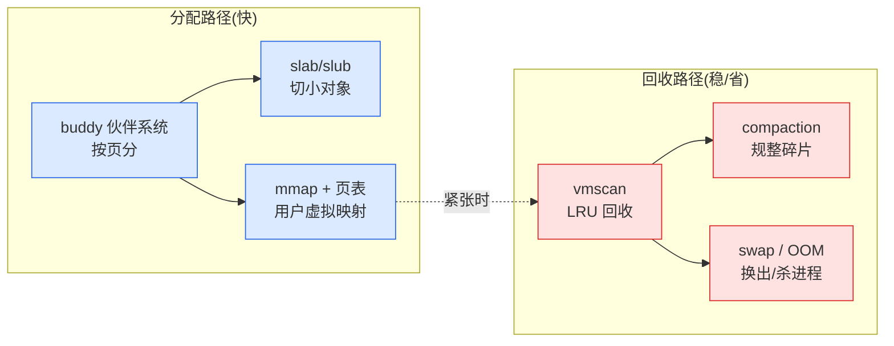

# 第一章 · 第一性原理:为什么内核要管内存

> 篇:P0 开篇
> 主线呼应:这一章是全书的**总览与定调**。用户态程序 `malloc` 一行,看似简单,背后是内核 mm 子系统在管着整台机器的物理内存。为什么内核非得管这件事?因为物理内存**稀缺**又**被所有人共享**——必须有个仲裁者决定"这块给谁、谁映射到哪、紧张了收回谁的"。读懂这一章,你就拿到了全书剩余 20 章的钥匙:buddy、slab、页表、回收,都是为了让"内存分得出去又收得回来"而存在的。

## 核心问题

**物理内存是稀缺且被所有进程共享的资源,为什么不能让进程自己管(像单片机那样直接用物理地址)?内核 mm 必须管分配、映射、回收,背后是什么本质约束?**

读完本章你会明白:

1. 物理内存的两个本质约束:稀缺(不够分)+ 共享(多进程抢同一片)。
2. 为什么需要虚拟地址 + MMU 页表(隔离 + 保护),这是 mm 的硬件地基。
3. 内核 mm 的三件事:分配(给内存)、映射(虚拟到物理)、回收(紧张时)。
4. mm 全貌 + 二分法:**分配路径 vs 回收路径**。
5. ★ 对照第 8 本:内核态分配 vs 用户态分配,合成"内存分配全栈"。

---

## 1.1 一句话点破

> **内核必须管内存,是因为物理内存稀缺又被所有人共享——必须有个仲裁者决定"这块物理页给谁、谁的虚拟地址映射到哪、内存紧张了收回谁的",否则进程互相踩、系统崩溃。这个仲裁者,就是 mm 子系统。**

这是结论,不是理由。本章倒过来拆:先看物理内存的两个本质约束,再看虚拟地址 + 页表这个硬件地基,然后看 mm 的三件事,最后立起全书二分法。

---

## 1.2 物理内存的两个本质约束

物理内存有两个绕不开的约束,mm 的一切设计都从它们出发:

- **稀缺**:一台机器的物理内存就那么多(几 GB 到几百 GB),但所有进程加起来"想要的"远超物理内存。一台 16GB 的机器跑几十个进程,每个都想要几 GB——物理上塞不下。
- **共享**:物理内存是**全局唯一**的一份资源,所有进程 + 内核自己,都要用这同一片。没有任何一个进程能独占它。

> **不这样会怎样**:如果让进程直接用物理地址(像单片机那样),进程 A 写物理地址 `0x1000`,进程 B 也写 `0x1000`,立刻冲突;一个进程的 bug 能覆盖另一个进程的数据,甚至覆盖内核——系统毫无安全可言,多任务根本无从谈起。

这两个约束决定了:**必须有一个被所有人信任的仲裁者(内核),统一管理这片共享的稀缺资源**。它要决定哪块给谁、谁能访问哪、不够了怎么办。这就是 mm。

---

## 1.3 虚拟地址 + MMU 页表:隔离与保护的硬件地基

那内核怎么"仲裁"?靠一个硬件机制:**虚拟地址 + MMU + 页表**。

每个进程看到的不是物理内存,而是自己的**虚拟地址空间**(一片连续的、独立的地址范围)。进程访问一个虚拟地址时,CPU 的 **MMU**(内存管理单元,硬件)会查**页表**(page table),把虚拟地址翻译成物理地址。页表由内核维护,记录"这个进程的虚拟地址 X → 物理页 Y"。

这套机制带来两个决定性的好处:

- **隔离**:进程 A 和进程 B 的虚拟地址 `0x1000`,通过各自的页表映射到**不同**的物理页。它们各写各的,互不干扰——虽然它们都以为自己独占了整块内存。
- **保护**:进程访问一个没映射的虚拟地址,MMU 翻译失败,触发**缺页异常**(page fault)交给内核。内核可以拒绝(段错误)、或按需建映射。进程无法越界访问别的进程或内核的内存。

> **钉死这件事**:虚拟地址 + 页表是 mm 的**硬件地基**。没有它,隔离和保护都无从谈起;有了它,内核才有"按进程、按需、按权限"地分配和映射物理内存的可能。后续第 4 篇(用户地址空间)会讲内核怎么建页表、怎么处理缺页。

每个物理页在内核里都有一个 [`struct page`](../linux/include/linux/mm_types.h#L74)([mm_types.h:74](../linux/include/linux/mm_types.h#L74))来描述它——这是 mm 管理物理内存的"账本"。一个物理页是 4KB,机器有几 GB 内存就有几百万个页,`struct page` 怎么不把自己撑爆,是本章技巧精解的问题。

---

## 1.4 内核 mm 的三件事

有了虚拟地址 + 页表这个地基,内核要干**三件事**,才能让内存真正可用:

### ① 分配:把物理内存分出去

谁要内存(进程要页、内核自己要对象),内核要给。但物理内存不能按字节随便切(会碎成无法用的渣),内核分两层:

- **buddy(伙伴系统)**:按**页**(4KB 为单位,2 的幂)分配物理内存。给进程大块、给 slab 大块。
- **slab/slub**:在 buddy 给的页上,切出**固定大小的小对象**(给内核自己的 `kmalloc`、各种 `kmem_cache`)。

物理内存还按 **zone** 分组管理(`mmzone.h` 的 [`struct zone`](../linux/include/linux/mmzone.h#L822)、[`enum zone_type`](../linux/include/linux/mmzone.h#L727))——DMA / Normal / HighMem / Movable,各有用途。一次页分配的快路径,就是从 zone 的空闲区里取一页([`get_page_from_free_area`](../linux/mm/page_alloc.c#L709),[page_alloc.c:709](../linux/mm/page_alloc.c#L709))。

### ② 映射:把虚拟连到物理

进程 `malloc`(或 `mmap`)拿到的是**虚拟**地址区间,此刻还没物理页。等进程真正读写这个地址时,触发缺页,内核才分配一个物理页、在页表里建"虚拟→物理"的映射。这叫**惰性分配**——要的时候才给。

### ③ 回收:紧张时把内存收回来

物理内存塞满了怎么办?内核有一套回收机制:把不活跃的页换出到 swap、把干净的文件页丢弃、实在没了用 OOM killer 挑个进程杀掉。还有 compaction 把碎片整理出连续大块。

> **钉死这件事**:mm 的三件事——**分配(给出去)、映射(虚拟连物理)、回收(收回来)**——是全书的主干。第 1~4 篇讲分配与映射,第 5 篇讲回收。

---

## 1.5 mm 全貌 + 全书二分法

把三件事摊开,mm 的所有机制可以归到两条线上,这就是全书的**二分法**:

> **分配路径(把内存分出去:buddy 分页、slab 切对象、mmap 建用户映射) vs 回收路径(紧张时收回来:vmscan 回收、compaction 规整、swap 换出、OOM 杀进程)。**

- **分配路径**:buddy(`__alloc_pages`/`__free_pages`)、slab(`kmalloc`)、vmalloc、用户地址空间(mmap/VMA/页表/缺页)。这些要**快**——快路径无锁、per-cpu 缓存。
- **回收路径**:watermark/kswapd、LRU/vmscan、compaction、swap/OOM。这些要**稳**和**省**——紧张时的兜底。

支撑这两者的地基:`struct page`/zone/node(物理内存组织)、页表与 rmap(虚拟反查物理)。

往后读任何一章,看不懂就回到这个二分法问:"这是在把内存分出去,还是在紧张时收回来?"

---

## 1.6 ★ 对照第 8 本:内核态 vs 用户态,合成"内存分配全栈"

本书和第 8 本《内存分配器设计与实现深入浅出》是一对——一本讲**内核态**分配(Linux mm),一本讲**用户态**分配(tcmalloc/jemalloc)。把它们放一起,就拼出了 `malloc` 一行调用背后的**完整全栈**:

| 层 | 谁 | 干什么 |
|---|---|---|
| 用户态 | tcmalloc/jemalloc(第 8 本) | 进程 `malloc` → 在自己的 thread cache 找 → 没有就向内核要大块 |
| 系统调用边界 | `brk` / `mmap` | 用户态分配器向内核"批发"大块虚拟内存 |
| 内核态 | **本书(Linux mm)** | buddy 分配物理页、建页表映射、紧张时回收 |

一次 `malloc` 的完整旅程:`用户 malloc → tcmalloc thread cache → 不够,调 mmap/brk → 内核 buddy 分配物理页 → 进程访问触发缺页 → 内核建页表映射`。**第 8 本管"用户态切小对象 + free list",本书管"内核分物理页 + 映射 + 回收"**。两本合起来,才是 `malloc` 的全部。

后续 slab 篇(P2)会细对照:tcmalloc 的 thread cache ↔ slab 的 per-cpu partial;tcmalloc 的 span ↔ buddy 的页块。收尾章(P7-21)给一张总表,把两本书钉成"内存分配全栈"。

---

## 1.7 技巧精解:`struct page` —— 几百万个页的元数据怎么省

这一章是定调章,我们把 mm 一个最基础也最容易被忽略的工程难题立清楚:**内核拿什么记录"每一个物理页的状态"**,且不能把它自己撑爆。

一台 16GB 的机器,有 16GB ÷ 4KB = **4 百万个物理页**。内核要管理每一个页(它空闲吗?属于谁?在哪个 LRU?脏了吗?……),就得给每个页一个描述符——[`struct page`](../linux/include/linux/mm_types.h#L74)([mm_types.h:74](../linux/include/linux/mm_types.h#L74))。

> **反面对比**:如果 `struct page` 朴素地罗列所有可能字段(一个页的所有状态都开成独立成员),它可能要几百字节。4 百万页 × 几百字节 = **几个 GB 的 `struct page` 数组**——光记账就吃掉一大块内存,荒谬。

内核怎么解决?靠**紧凑布局**,核心是两招:

1. **联合体(`union`)复用**:一个物理页在不同时期扮演不同角色(空闲页在 buddy 的链上、映射进进程的页有 rmap、被 slab 用的页是 slab 的一部分……)。这些角色**互斥**(同一时刻一个页只是一种),于是用 `union` 让它们共享同一段内存,而不是各占一段。
2. **位段(page flags)**:页的很多状态是布尔/小整数(脏?锁定?在哪个 zone?引用计数……),挤进一个 `unsigned long` 的各个位段,而不是每个状态一个字段。

经过这样的紧凑设计,`struct page` 在 64 位系统上被压到 **约 64 字节**(8 个 `unsigned long`)。4 百万页 × 64 字节 ≈ 256MB——仍不小,但相比"几个 GB"已是巨大节省,且这个数组(`vmemmap`)本身在物理上是连续的,给定一个页能 O(1) 定位它的 `struct page`。

> **钉死这件事**:`struct page` 的紧凑布局(union 复用 + 位段)是 mm 的"账本工程"。它让内核能用可接受的内存开销,管理几百万个物理页的状态。这种"海量小对象的元数据要省"的思路,在第 2 篇 slab(对象布局)、第 4 篇(页表)里会反复出现。

---

## 章末小结

这一章是全书**总览与定调**,我们没有钻进 buddy 或 slab 的细节,但立起了贯穿全书的四样东西:

1. **物理内存的两个约束**:稀缺 + 共享——逼出"必须有仲裁者"。
2. **虚拟地址 + MMU 页表**:隔离与保护的硬件地基。
3. **mm 的三件事**:分配(给)、映射(虚拟连物理)、回收(紧张收回)。
4. **二分法 + ★对照第 8 本**:分配路径 vs 回收路径;内核态 vs 用户态,合成内存分配全栈。

### 五个"为什么"清单

1. **为什么进程不能直接用物理地址?** 物理内存共享,直接用会互相踩;虚拟地址 + 页表隔离每个进程。
2. **为什么需要 MMU/页表?** 硬件把虚拟翻译成物理,内核维护映射;没有它隔离和保护无从谈起。
3. **mm 的三件事是什么?** 分配(buddy/slab 给内存)、映射(页表连虚拟物理)、回收(vmscan/swap/OOM 收回)。
4. **分配路径和回收路径怎么分?** 分配要快(快路径无锁、per-cpu);回收要稳(紧张兜底)。迷路回到二分法。
5. **和第 8 本(用户态分配器)什么关系?** 第 8 本管用户态切小对象 + free list,本书管内核分物理页 + 映射 + 回收;两本合成 `malloc` 全栈。

### 想继续深入往哪钻

- 本章点到的 `struct page`/zone 详见第 2 章(P1-02 物理内存模型)。
- buddy 怎么按页分配,详见第 3、4 章(P1-03 buddy 算法、P1-04 __alloc_pages)。
- 想立刻看一眼物理内存的组织,读 [`include/linux/mmzone.h`](../linux/include/linux/mmzone.h) 的 `enum zone_type`(L727)、`struct zone`(L822),以及 [`include/linux/mm_types.h`](../linux/include/linux/mm_types.h) 的 `struct page`(L74)。
- 想观测 mm 运行,看 `/proc/meminfo`、`/proc/buddyinfo`、`/proc/slabinfo`(附录 B 详讲)。

### 引出下一章

我们立起了"内核必须管内存"和三件事、二分法。但要真正钻进 mm,得先看清物理内存是怎么组织的——页、zone、node、`struct page` 这些账本。下一章,我们从 `mmzone.h` 和 `mm_types.h` 讲起,正式进入第 1 篇:buddy 伙伴系统。
