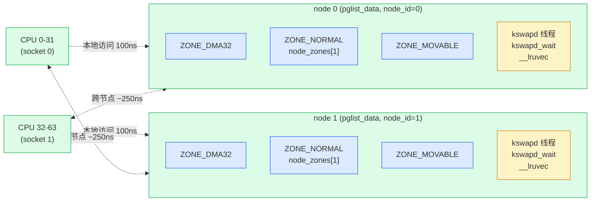
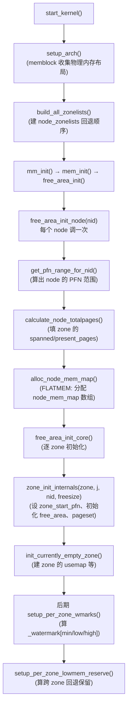

# 第二章 · 物理内存模型 + node/zone/pgdat

> 篇:P1 buddy 伙伴系统
> 主线呼应:上一章立起了"内核必须管内存"和三件事、二分法。但二分法要落地,内核得先把"一大片物理内存"这片混沌资源**变成一本能查、能改、能 O(1) 定位**的账本——否则 buddy 没页可分,vmscan 没页可收。这一章就是给全书立地基:**物理内存的模型与组织**。讲完这章,你手里就有了 `struct page`/`struct folio`/`pglist_data`/`struct zone` 这四把钥匙,后面 buddy 怎么分、kswapd 怎么收,全是在这套账本上做加减。
>
> 二分法归属:**支撑**——物理内存组织是分配与回收**共同**的地基。章末会明确这一点。

## 核心问题

**内核手里有一大片物理内存(几 GB 到几 TB),它怎么把这块混沌的"字节海洋"组织成一本账本——既能用可接受的开销给每一个 4KB 物理页记一份状态,又能让 NUMA 拓扑、DMA 约束、可迁移性这些约束反映到数据结构里,还能让"给定一个物理页 → O(1) 拿到它的描述符"这件事成立?**

读完本章你会明白:

1. `struct page`/`struct folio` 怎么描述每一个物理页,且为什么"约 64 字节"就够——`union` 复用 + flags 位段的紧凑布局,以及 6.x 引入的 folio 是什么、解决什么。
2. NUMA 下 `pglist_data`(node)怎么把内存按物理节点分仓;`vmemmap` 怎么让"物理页 → `struct page`"做到 O(1)。
3. `struct zone` 怎么按用途(DMA/Normal/Movable)再分组,`free_area[]` 字段怎么为第 3 章 buddy 预留位置,`_watermark[]` 怎么为第 5 篇回收预埋。
4. page flags 的高位怎么塞进 SECTION/NODE/ZONE/LRU_GEN 等位段——以及这套布局为什么"一次性、只读"。

---

## 2.1 一句话点破

> **内核把物理内存组织成三级账本:NUMA 节点(node,`pglist_data`)→ 用途分区(zone,`struct zone`)→ 单页描述符(`struct page`/`struct folio`)。每一级都对应一个绕不开的约束——node 对应"远端访问慢"、zone 对应"DMA 寻址能力/可迁移性"、page 对应"4KB 是最小单位 + 海量页的元数据不能撑爆内存"。这本账本不是装饰,是 buddy 一切操作(取一页、还一页、合伙伴、回收)的索引。**

这是结论,不是理由。本章倒过来拆:先看最小单位 `struct page`/`folio`,再看它怎么 O(1) 被定位(`vmemmap`),然后看 zone 怎么按用途切、node 怎么按物理拓扑切,最后把账本和"预埋"两个字钉死——watermark 为回收预埋,free_area[] 为 buddy 预埋。

---

## 2.2 一切从"4KB"开始:`struct page` 与 `struct folio`

### 2.2.1 为什么需要每个页一个描述符

内核管物理内存的**最小单位**是**页**(page),大小由 `PAGE_SHIFT` 决定,绝大多数架构上是 **4KB**(`1 << 12`)。一个页是 buddy 分配、回收、按页映射(页表项指向一个页)的基本单位。一台 16GB 的机器,就有 `16GB / 4KB = 4,194,304` 个页。

要对每一个页做管理(它空闲吗?属于谁?在哪个 LRU?脏没脏?被几个 PTE 映射?……),内核给每一个页一份**描述符**:[`struct page`](../linux/include/linux/mm_types.h#L74)([mm_types.h:74](../linux/include/linux/mm_types.h#L74))。这玩意儿在物理上是个**大数组**(叫 `vmemmap`,见 2.3),数组下标就是页的**PFN**(page frame number,物理页帧号)。

```c
// include/linux/mm_types.h:74-206(简化,非源码原文,只展示主结构)
struct page {
    unsigned long flags;            // 高位塞 SECTION/NODE/ZONE/...,低位塞各种 PG_* 状态
    union {                         // ★ 五个字的联合体——同一个页在不同时期扮演互斥角色
        struct {                    // 角色 A:被映射进进程 / 在 page cache
            union {
                struct list_head lru;          // 挂在 LRU 链表上(回收用)
                struct list_head buddy_list;   // 或:挂在 buddy 的空闲链上
                struct list_head pcp_list;     // 或:挂在 per-cpu pageset 上
                struct { void *__filler; unsigned int mlock_count; };
            };
            struct address_space *mapping;     // 文件映射:指向 address_space;匿名页:低位编码 anon_vma
            union { pgoff_t index; unsigned long share; };
            unsigned long private;             // 多用途:buffer_head / swap cache / buddy order
        };
        struct { ..., struct page_pool *pp; ..., atomic_long_t pp_ref_count; };  // 角色 B:网络 page_pool
        struct { unsigned long compound_head; };                                 // 角色 C:大页的尾页
        struct { struct dev_pagemap *pgmap; void *zone_device_data; };           // 角色 D:ZONE_DEVICE
        struct rcu_head rcu_head;                                                // 角色 E:RCU 回收
    };
    union { atomic_t _mapcount; unsigned int page_type; };   // 4 字节:被多少 PTE 映射 / 或页类型
    atomic_t _refcount;                                      // 引用计数(别直接用,见 page_ref.h)
#ifdef CONFIG_MEMCG
    unsigned long memcg_data;                                // memcg 计费信息
#endif
} __aligned(sizeof(unsigned long));
```

> **不这样会怎样**:如果 `struct page` 朴素地把一个页可能拥有的所有字段**各自独立开列**(lru、mapping、index、private、pp、pgmap、compound_head、rcu_head、mapcount、refcount……),它会有几百字节。4 百万页 × 几百字节 = **几个 GB 的账本**——光记账就吃掉一大块物理内存,荒谬。更糟的是,这些角色**同一时刻只有一个生效**(一个页不会既在 buddy 空闲链上又是大页尾页),独立开列等于让绝大多数字段在绝大多数时间闲置。

> **所以这样设计**:靠两招把 `struct page` 压到 **约 64 字节**(8 个 `unsigned long`,刚好对齐一个或两个缓存行):
> 1. **`union` 复用**:把"空闲页的 buddy 链"、"page cache 页的 lru/mapping"、"大页尾页的 compound_head"、"网络 page_pool 的 pp_ref_count"、"ZONE_DEVICE 的 pgmap"、"RCU 回收的 rcu_head"——这些**互斥角色**塞进同一个 5 字联合体。同一时刻只有一个角色活,共用 40 字节。
> 2. **flags 位段**:页的很多状态是布尔(脏、锁、写回、引用计数标志等)或小整数(zone 编号、node 编号、SECTION 编号、LRU 代次),全挤进一个 `unsigned long flags` 的各个位段。下一小节(2.2.4)专门拆 flags 的位段布局。

> **钉死这件事**:`struct page` 的紧凑布局(union 复用 + flags 位段)不是"省一点点内存"的小优化,而是**让账本规模可控**的生存级决策。4 百万页 × 64 字节 ≈ 256MB,与"几个 GB"差一个数量级。这种"海量小对象的元数据要省"的思路,会在第 2 篇 slab(对象布局)、第 4 篇(多级页表)反复出现。

### 2.2.2 那几个字段到底是什么意思(逐字解)

`struct page` 最容易让人劝退的就是"这么多字段到底干嘛"。我们按它"被谁用、什么时候用"分组拆:

| 字段 | 何时有意义 | 谁在用 |
|------|-----------|--------|
| `flags` | 永远 | 高位 SECTION/NODE/ZONE/LRU_GEN,低位一堆 `PG_*`(PG_locked/PG_dirty/PG_uptodate/PG_writeback/PG_head/PG_tail/PG_slab/PG_swapcache…);下面 2.2.4 专门拆 |
| 联合体(40B) | 取决于页的当前角色 | buddy 用 `buddy_list`、page cache/LRU 用 `lru`/`mapping`/`index`/`private`、per-cpu pageset 用 `pcp_list`、大页尾页用 `compound_head`、网络用 `pp_*`、设备用 `pgmap`、RCU 用 `rcu_head` |
| `_mapcount` | 页能被用户态映射时 | 被多少个 PTE 映射(回收时要判断"有没有人映射我");与 page_type 互斥 |
| `_refcount` | 永远(但**别直接用**) | 引用计数——`get_page`/`put_page`;为 0 可释放。直接读写危险,要走 [`include/linux/page_ref.h`](../linux/include/linux/page_ref.h) 的访问器 |
| `memcg_data` | `CONFIG_MEMCG` | memcg 计费/归属 |

**最容易踩的坑**:注释明确写着 `*DO NOT USE DIRECTLY*`——`_refcount`/`_mapcount` 都不该直接读写,得用 `folio_ref_count()`/`folio_mapcount()` 这类访问器。原因:folio 引入后,大页的尾页 `struct page` 这两个字段被"借走"存了别的信息(如 `_entire_mapcount`/`_nr_pages_mapped`),直接读尾页的 `_refcount` 会拿到垃圾值。这是 folio 改造留下的"地雷区",访问器替你处理了 head/tail 区分。

### 2.2.3 folio 是什么,为什么引入

读老内核文档或老书,通篇都是 `struct page`,6.x 之后到处是 `struct folio`。这是 5.16 起的重构,到 6.9 已经渗透到 mm 的每个角落。**这是 6.x 与老文档最显眼的差异,必须讲清。**

**问题**:老内核里,"一个页"这个概念被 `struct page` 一肩挑了两件不同的事:

1. **基本页(单页,buddy order 0)**:就是一个 4KB 的物理页,描述符就是一个 `struct page`。
2. **大页的"组成部分"**:一个 2MB 大页由 512 个 4KB 组成,每个 4KB 都有一个 `struct page`,但它们逻辑上是**一个整体**(head page + 512 个 tail page)。head 的 `flags` 里有 `PG_head`,tail 的 `compound_head` 低位为 1 指向 head。

后果:写 mm 代码时,"我手里这个 `struct page *`,到底是单页,还是大页 head,还是大页 tail?"——每个调用点都得先 `compound_head()` 跳到 head,才能安全操作。**漏写就是 bug**:拿 tail page 的 `_mapcount`/`_refcount` 直接读会拿到大页的内部计数字段(被尾页复用了),值完全不对。老内核里因为漏跳 head 出过不少 bug。

**解决**:[`struct folio`](../linux/include/linux/mm_types.h#L309)([mm_types.h:309](../linux/include/linux/mm_types.h#L309))——**一个 folio 代表"一组连续的、2 的幂大小的页"的全体**,永远指向 head:

```c
// include/linux/mm_types.h:309-378(简化)
struct folio {
    union {
        struct {                            // 头部字段——和 struct page 头部布局一致(过渡用)
            unsigned long flags;
            struct list_head lru;           // 或 mlock_count
            struct address_space *mapping;
            pgoff_t index;
            union { void *private; swp_entry_t swap; };
            atomic_t _mapcount;
            atomic_t _refcount;
            ...
        };
        struct page page;                   // ★ folio 的头部就是一个 struct page(过渡用)
    };
    union {
        struct {                            // 大页专有:整个大页的元信息(单页 folio 不用)
            unsigned long _flags_1, _head_1, _folio_avail;
            atomic_t _entire_mapcount;      // "整个大页被映射了多少次"(PMD 一次映射整个大页)
            atomic_t _nr_pages_mapped;      // 所有 tail page 的 mapcount 之和(分页映射计数)
            atomic_t _pincount;             // GUP 钉住计数
            unsigned int _folio_nr_pages;   // 大页含多少个 4KB 页
        };
        ...
    };
    ...
};
```

关键设计:**`struct folio` 的头部布局和 `struct page` 完全一样**(通过内嵌一个 `struct page page` 成员保证),所以"一个 folio 指针"在内存里**就是一个指向 head page 的指针**——你可以安全地把 `struct page *`(假定是 head)cast 成 `struct folio *`。`page_folio` 宏就是干这个的:

```c
// include/linux/page-flags.h:268-270
#define page_folio(p)   (_Generic((p),                            \
    const struct page *: (const struct folio *)_compound_head(p), \
    struct page *:      (struct folio *)_compound_head(p)))
```

注意它内部走了 `_compound_head(p)`——不管你传进来的是 head 还是 tail,**都会先跳到 head**,再 cast 成 folio。这样调用方再也无需操心"是不是 tail",`page_folio()` 帮你兜底。反方向 `folio_page(folio, n)` 把 folio 的第 n 个页取出来:

```c
// include/linux/page-flags.h:281
#define folio_page(folio, n) nth_page(&(folio)->page, n)
```

> **不这样会怎样**:老内核到处写 `struct page *page`,每个函数开头都得 `page = compound_head(page);` 防御性地跳 head,漏了就是隐藏 bug。重构后 API 层面"操作单位"统一为 folio——你要操作一个内存对象,就拿到 `struct folio *`,它永远是 head,内部计数(`_entire_mapcount`/`_nr_pages_mapped`/`_pincount`)语义清楚;只有当你真的要拆成单个 4KB(比如做 DMA scatter-gather、页表 PTE 级操作)才用 `folio_page(folio, i)` 取出来。**folio = "把 head page 概念扶正"的工程结果**。

> **钉死这件事**:6.x 里凡涉及"一整块连续页"的操作(分配、释放、回收、迁移、写回、lru),API 已经从 `page` 全量迁到 `folio`:`alloc_pages` → `folio_alloc`、`__free_pages` → `folio_free`、回收 `shrink_folio_list`、rmap `folio_add_*`。本书后续讲到 mm 代码时,凡是 6.9 源码里用 `folio` 的,我们都按 `folio` 讲;只在确实落到单页(PTE 级)时才回到 `page`。**读老文档(5.15 之前)时脑内要做 page→folio 翻译**。

### 2.2.4 flags 位段:一个 unsigned long 怎么塞下 SECTION/NODE/ZONE/LRU_GEN/PG_*

`struct page` 第一个字段 `unsigned long flags` 承担的信息量远超它的大小。在 SPARSEMEM+NUMA+THP 全开的典型 x86_64 上,这一个 64 位被切成好几段(从高位到低位):

```
64 位 flags 的位段布局(include/linux/mmzone.h:1057-1064,简化示意,非源码原文)
┌──────────────┬────────┬────────┬────────────┬───────────┬───────────┬──────────────────┐
│ [SECTION]    │ [NODE] │ [ZONE] │ [LAST_CPUPID]│[KASAN_TAG]│[LRU_GEN]  │ ... 低位 PG_*    │
│ SECTIONS_WIDTH│NODES_WIDTH│ZONES_WIDTH│LAST_CPUPID_WIDTH│KASAN_WIDTH│LRU_GEN_WIDTH  │  + LRU_REFS + FLAGS│
└──────────────┴────────┴────────┴────────────┴───────────┴───────────┴──────────────────┘
高位侧 ←─────────────────────────────────────────────────────────────────────────────→ 低位侧
```

**怎么算每段宽度**:每段的宽度由"该值可能取多少个"决定:

- `SECTIONS_WIDTH` = 向上取整 log2(内存 section 数);x86 section 大小 1GB,几 TB 内存需要十几位。
- `NODES_WIDTH` = 向上取整 log2(`MAX_NUMNODES`);典型 6~10 位。
- `ZONES_WIDTH` = 向上取整 log2(`__MAX_NR_ZONES`);x86_64 有 DMA/DMA32/NORMAL/MOVABLE/DEVICE,需 3 位。
- `LAST_CPUPID_WIDTH` = 记录"上次访问这个页的 CPU+PID",用于 NUMA balancing;典型 8~12 位(可配)。
- 低位剩下的:`PG_locked`/`PG_dirty`/`PG_uptodate`/`PG_writeback`/`PG_head`/`PG_tail`/`PG_slab`/`PG_swapcache`/`PG_referenced`/`PG_lru` 等一堆单 bit 标志(见 `include/linux/page-flags.h`)。

**为什么把 SECTION/NODE/ZONE 塞进 flags 高位**:内核拿到一个 `struct page *`,经常要问"这个页在哪个 zone、哪个 node"。访问器 [`page_zonenum`](../linux/include/linux/mmzone.h#L1097)([mmzone.h:1097](../linux/include/linux/mmzone.h#L1097))就是直接从 `flags` 里把 ZONE 段抠出来:

```c
// include/linux/mmzone.h:1097-1101
static inline enum zone_type page_zonenum(const struct page *page)
{
    ASSERT_EXCLUSIVE_BITS(page->flags, ZONES_MASK << ZONES_PGSHIFT);
    return (page->flags >> ZONES_PGSHIFT) & ZONES_MASK;
}
```

`ASSERT_EXCLUSIVE_BITS` 是个编译期断言,保证"这几位不会被别的位段误用"——flags 在 `free_area_init_core()` 初始化后**这几位再也不改**(注释原话:"The zone field is never updated after free_area_init_core() sets it",[mmzone.h:1052-1054](../linux/include/linux/mmzone.h#L1052)),所以读取无锁也无数据竞争。

> **不这样会怎样**:如果 zone/node 不挤进 flags,就得给每个 `struct page` 单独开 `enum zone_type zone; int node;` 两个字段(共 8 字节)。4 百万页 × 8 字节 = 32MB,看似不多,但这是**只读、高频访问**的信息,放 flags 高位省下的字段可以留给联合体放更有用的数据。更关键的是:flags 是 `struct page` 的第一个字段,它本身就在缓存行最热的位置,顺手读 zone 比再多解一次指针快得多。

> **钉死这件事**:flags 位段是 mm 的"零成本记账"哲学——把多种小信息用位运算塞进一个 word,既省空间又省一次访存。代价是可读性差(代码里满地 `>> ZONES_PGSHIFT & ZONES_MASK`),所以内核用一堆宏(`PageLocked`/`SetPageDirty`/`page_zonenum`/`page_to_nid`)把它们包起来。**你看到这些宏,心里要有"它在读 flags 的某几位"的直觉**。

---

## 2.3 vmemmap:怎么从"物理页"O(1) 定位它的 `struct page`

账本建起来了,但还有个根本问题:**给定一个物理页的 PFN(或物理地址),内核怎么 O(1) 拿到它的 `struct page *`?** 反过来,给定 `struct page *`,怎么 O(1) 算出它的 PFN?

### 2.3.1 朴素做法和它的问题

最朴素的方案(FLATMEM 模型)是把所有 `struct page` 摊成一个**全局大数组** `mem_map[]`:

```
PFN:    0        1        2        3      ...      N-1
mem_map[0]  mem_map[1]  mem_map[2]  mem_map[3]  ...  mem_map[N-1]

pfn_to_page(pfn)  = mem_map + pfn
page_to_pfn(page) = page - mem_map
```

常数时间,O(1),漂亮。但问题:这只在"物理内存连续、无空洞"时成立。现代服务器动辄几十 TB 物理内存,中间还可能有空洞(PCI hole、热插拔、NUMA 节点不连续),一个 `mem_map[]` 平铺会把空洞也开成 `struct page`,浪费巨大。SPARSEMEM 模型(默认 x86_64 服务器用)把内存切成 **section**(典型 1GB,`SECTION_SIZE_BITS=27`),每个 section 里的 `struct page` 连续,section 之间用一个 `mem_section[]` 数组索引,空洞的 section 就不开 page 数组。

### 2.3.2 SPARSEMEM_VMEMMAP:用一个专门的虚拟地址段映射 page 数组

x86_64 默认用 **SPARSEMEM_VMEMMAP**(虚拟内存映射版 sparsemem):内核在**虚拟地址空间**里专门开一段 `VMEMMAP_START`(x86_64 上是 `0xffffea0000000000` 附近),这段虚拟地址被当成"一个虚拟的大 `mem_map[]`"——`vmemmap[pfn]` 就是 PFN=pfn 的 `struct page`。物理上这段虚拟地址背后是按 section 动态建立页表映射的(哪个 section 有内存,就给那段虚拟地址建映射,指向实打实分配的 `struct page` 数组;空洞 section 的虚拟地址不映射,访问会缺页——内核永远不会去访问空洞)。

于是访问器变成了:

```
// 简化示意(asm-generic/memory_model.h,SPARSEMEM_VMEMMAP 模型)
#define __pfn_to_page(pfn)  (vmemmap + (pfn))     // vmemmap 是 struct page * 类型的基址
#define __page_to_pfn(page) ((unsigned long)(page) - vmemmap_base) / sizeof(struct page))
```

`vmemmap` 是个 `struct page *` 类型的虚拟基址,加 PFN 直接偏移——**还是 O(1),但对内核来说"物理上有空洞"和"逻辑连续"解耦了**。

> **不这样会怎样**:如果不用 vmemmap 这层虚拟映射、直接用物理 section 数组查表,那 `pfn_to_page` 要做两次解引用(先查 `mem_section[pfn >> SECTION_SHIFT]`,再在里面偏移),慢一倍;且 section 数组本身要预先分配大块连续物理内存。vmemmap 借 MMU 的页表机制把"按需映射"这件事交给硬件,软件层 `pfn_to_page` 退化成一次加法。

> **钉死这件事**:`pfn_to_page`/`page_to_pfn`/`virt_to_page`/`page_to_pfn` 这几个宏是 mm 的"地址翻译底座"——buddy 拿到一页要算 PFN、回收要反查、DMA 要算物理地址,全走它们。你读 mm 源码时只要看到 `page_to_pfn`/`pfn_to_page`,心里要有"这就是 vmemmap 数组偏移,O(1)"的直觉。代价是 `vmemmap` 本身要吃一点内存(每 4KB 物理页 64 字节描述符,即 1.56%——4GB 物理内存的 vmemmap 占 ~64MB),这是"为 O(1) 索引付的固定税"。

---

## 2.4 NUMA:为什么要把内存按节点(node)分仓

到这里账本是一维的:PFN → `struct page`。但现代多 socket 服务器是 **NUMA**(Non-Uniform Memory Access)架构——每个 CPU socket 直连一块本地内存,访问别 socket 的内存要跨 inter-connect,延迟高 1.5~3 倍。内核必须让"这块物理内存属于哪个 NUMA 节点"这件事在数据结构里显式存在。

### 2.4.1 node 抽象:`pglist_data`(别名 `pg_data_t`)

每个 NUMA 节点用一个 [`pglist_data`](../linux/include/linux/mmzone.h#L1275)(typedef 成 `pg_data_t`,[mmzone.h:1275](../linux/include/linux/mmzone.h#L1275))描述。UMA(单节点,普通 PC)机器上整个系统只有一个 `pglist_data`。

```c
// include/linux/mmzone.h:1275-1394(简化,非源码原文)
typedef struct pglist_data {
    struct zone       node_zones[MAX_NR_ZONES];          // ★ 这个节点里的所有 zone(内嵌数组,不指针)
    struct zonelist   node_zonelists[MAX_ZONELISTS];     // 分配时的 zone 回退顺序
    int               nr_zones;                          // 这个节点实际有 zone 数(populated)
#ifdef CONFIG_FLATMEM
    struct page      *node_mem_map;                      // FLATMEM 下的 mem_map 基址
#endif
    unsigned long     node_start_pfn;                    // 这个节点的起始 PFN
    unsigned long     node_present_pages;                // 实际存在的物理页总数
    unsigned long     node_spanned_pages;                // 跨度(含空洞)
    int               node_id;                           // 节点号(0,1,2...)

    wait_queue_head_t kswapd_wait;                       // ★ 这个节点的 kswapd 等待队列(回收预埋!)
    wait_queue_head_t pfmemalloc_wait;                   // OOM 兜底等待
    struct task_struct *kswapd;                          // 这个节点的 kswapd 内核线程
    int               kswapd_order;                      // kswapd 要回收的 order
    enum zone_type    kswapd_highest_zoneidx;            // kswapd 扫到哪个 zone 为止
    ...
    unsigned long     totalreserve_pages;                // 给内核预留的页(不参与用户分配)
    struct lruvec     __lruvec;                          // LRU 容器(回收预埋!)
    ...
} pg_data_t;
```

几个**关键点**:

1. **`node_zones[]` 是内嵌数组**——一个 node 里**所有可能的 zone 都在这**(不管这个 node 有没有 DMA 区,槽位都开着)。`nr_zones` 记的是**实际 populated 的 zone 数**。
2. **node 是回收的现场**:注意 `kswapd_wait`/`kswapd`/`__lruvec` 都挂在 node 上——第 5 篇回收的 kswapd 后台线程是**每节点一个**,LRU 链表也按 node(及 memcg)组织。本章只把它们"预埋"在这里,不展开——读者记住"node 不仅分分配,也分回收"即可。
3. **PFN 范围**:`node_start_pfn`/`node_present_pages`/`node_spanned_pages` 把这个节点的物理内存范围钉死。`spanned` 含空洞,`present` 是实打实的页。

> **不这样会怎样**:如果不按 node 分仓、把所有物理内存当成一个全局池子,那分配器在给一页时无法表达"尽量给本节点的页"——进程跑在 node 0 的 CPU 上,却可能拿到 node 1 的页,每次访问多走几十纳秒 inter-connect 延迟。在 NUMA 机器上累积起来是可观的性能损失(数据库、JVM 这类延迟敏感的负载尤其敏感)。

> **所以这样设计**:把内存按物理节点分仓,`alloc_pages` 默认走 **node 0 的 zone**(分配请求来自哪个 CPU 就优先用哪个 CPU 所在 node),只有本节点不够了才回退到别的 node(回退顺序由 `node_zonelists[]` 决定)。这就是 NUMA aware allocation。第 6 篇会讲 mempolicy 怎么让用户态显式控制"我要哪个 node"。

### 2.4.2 NUMA 拓扑示意



**两个 node 各有独立的 `pglist_data`**,各有自己的 `kswapd`。CPU 优先访问本地 node 的内存(本地节点 ~100ns,跨节点 ~250ns,延迟差是 NUMA 一切优化的出发点)。

---

## 2.5 zone:为什么同一个 node 里还要按"用途"再分组

物理内存即便在同一个 NUMA 节点内,也不是铁板一块。它有**好几类硬约束**:

1. **DMA 寻址能力**:老式 ISA 设备只能 DMA 到物理地址低 16MB;32 位 PCI 设备只能 DMA 到低 4GB。内核给这些设备分配缓冲时,必须从对应的低地址区里拿。
2. **32 位内核的 highmem**:32 位 x86 内核自己只能直接映射 896MB 以下的物理内存,超过的(highmem)要靠 `kmap` 临时建映射才能访问——这类页单独成区,避免普通分配误用。
3. **可迁移性**:大页(THP/hugetlb)、内存热插拔需要大块**连续**物理页。如果所有页混在一起,跑久了碎片化就拿不到大块。把"可迁移的"(用户进程页、page cache)集中放一个区(`ZONE_MOVABLE`),给"不可迁移的"(内核分配的页表、内核栈)留出连续空间。

这些约束决定:**同一个 node 的物理内存要按"用途"再切成几个 zone**。

### 2.5.1 `enum zone_type`:zone 的种类

[`enum zone_type`](../linux/include/linux/mmzone.h#L727)([mmzone.h:727](../linux/include/linux/mmzone.h#L727))列出了所有可能的 zone:

```c
// include/linux/mmzone.h:727-816(简化)
enum zone_type {
#ifdef CONFIG_ZONE_DMA
    ZONE_DMA,          // ISA 设备能 DMA 的低 16MB(x86)
#endif
#ifdef CONFIG_ZONE_DMA32
    ZONE_DMA32,        // 32 位 PCI 设备能 DMA 的低 4GB(x86_64)
#endif
    ZONE_NORMAL,       // 普通可寻址内存(绝大多数分配走这)
#ifdef CONFIG_HIGHMEM
    ZONE_HIGHMEM,      // 32 位内核的 highmem(64 位没有)
#endif
    ZONE_MOVABLE,      // 只放可迁移页(为热插拔/大页留连续空间)
#ifdef CONFIG_ZONE_DEVICE
    ZONE_DEVICE,       // 设备内存(pmem/HMM),不被 buddy 管
#endif
    __MAX_NR_ZONES
};
```

**x86_64 典型配置**:`ZONE_DMA`(0-16MB)、`ZONE_DMA32`(16MB-4GB)、`ZONE_NORMAL`(4GB 以上)、`ZONE_MOVABLE`(由 `kernelcore=`/`movablecore=` 启动参数从 NORMAL 里切出来)、可选 `ZONE_DEVICE`。注意 `__MAX_NR_ZONES` 是个**枚举上界**,它决定 `pglist_data.node_zones[]` 数组大小——不管这个 node 实际用几个 zone,槽位都按上界开。

### 2.5.2 `struct zone`:账本的核心

[`struct zone`](../linux/include/linux/mmzone.h#L822)([mmzone.h:822](../linux/include/linux/mmzone.h#L822))是 mm 里**最重要的结构之一**——buddy 的空闲链在它里面、回收的水位在它里面、per-cpu pageset 在它里面。它分三段(用 `CACHELINE_PADDING` 显式按缓存行对齐),我们先看全貌再逐段拆:

```c
// include/linux/mmzone.h:822-996(简化,保留核心字段)
struct zone {
    /* ---- Read-mostly fields(分配快路径几乎只读,尽量独占缓存行)---- */
    unsigned long _watermark[NR_WMARK];     // ★ 三档水位:min/low/high(+promo,第 5 篇回收)
    unsigned long watermark_boost;          // 水位自适应提升(抗抖动)
    unsigned long nr_reserved_highatomic;   // 给高阶原子分配预留的页
    long           lowmem_reserve[MAX_NR_ZONES];   // 跨 zone 回退时的保留量(防低 zone 被掏空)
    int            node;                    // 属于哪个 node
    struct pglist_data *zone_pgdat;         // 反向指针:回指所属 node
    struct per_cpu_pages  __percpu *per_cpu_pageset;       // ★ per-cpu 热页缓存(第 5 章详讲)
    struct per_cpu_zonestat __percpu *per_cpu_zonestats;
    unsigned long  zone_start_pfn;          // 这个 zone 的起始 PFN
    atomic_long_t  managed_pages;           // buddy 实际管的页数(扣掉预留)
    unsigned long  spanned_pages;           // 跨度(含空洞)
    unsigned long  present_pages;           // 实际存在的页
    const char    *name;                    // "DMA"/"Normal"/"Movable"...

    /* ---- Write-intensive(分配热路径读写,独占缓存行避免 false sharing)---- */
    CACHELINE_PADDING(_pad1_);
    struct free_area free_area[NR_PAGE_ORDERS];  // ★ buddy 的空闲链!每 order 一组(第 3 章核心)
    unsigned long   flags;
    spinlock_t      lock;                         // 保护 free_area 的自旋锁(分配/释放都要拿)

    /* ---- Write-intensive(compaction/vmstats 用,再独立缓存行)---- */
    CACHELINE_PADDING(_pad2_);
    unsigned long   percpu_drift_mark;            // 防止 per-cpu 计数漂移破坏水位
    /* compaction 相关缓存... */

    CACHELINE_PADDING(_pad3_);
    atomic_long_t   vm_stat[NR_VM_ZONE_STAT_ITEMS];   // zone 统计(空闲页/各种 LRU 计数)
    atomic_long_t   vm_numa_event[NR_VM_NUMA_EVENT_ITEMS];
} ____cacheline_internodealigned_in_smp;
```

**三个关键预埋**(本章读者必须看到,但具体机制留给后面章节):

| 字段 | 服务谁 | 哪一章展开 |
|------|--------|-----------|
| `free_area[NR_PAGE_ORDERS]` | buddy 分配/释放 | **第 3 章 buddy 算法**、第 5 章 pageset |
| `_watermark[NR_WMARK]` + `watermark_boost` | kswapd/vmscan 回收决策 | **第 4 章**水位判断、**第 5 篇**回收 |
| `per_cpu_pageset` | 释放/小量分配的 per-cpu 无锁快路径 | **第 5 章** per-cpu pageset |

> **不这样会怎样(三段缓存行对齐)**:如果 `free_area[]` 和 `vm_stat[]` 不按缓存行分隔,分配 CPU 改 `free_area`、统计 CPU 改 `vm_stat` 时会**反复把对方的缓存行 invalidate**——这叫 **false sharing**,在多核分配热路径上会变成性能灾难。`struct zone` 用三个 `CACHELINE_PADDING` 把字段按"读多写少 / 分配热路径写 / 统计写"分成三段,每段尽量独占缓存行。这是内核对 SMP 缓存行为的极致考究——后面第 5 章讲 per-cpu pageset、第 8 章讲 frozen slab,本质思路都是"把热路径数据按 CPU 分开,避免锁/缓存行竞争"。

### 2.5.3 watermark:回收的字段,这里预埋

`_watermark[NR_WMARK]` 对应 [`enum zone_watermarks`](../linux/include/linux/mmzone.h#L645)([mmzone.h:645](../linux/include/linux/mmzone.h#L645)):

```c
// include/linux/mmzone.h:645-651
enum zone_watermarks {
    WMARK_MIN,    // 最低:低于这个,分配走直接回收/OOM
    WMARK_LOW,    // 唤醒 kswapd 的阈值
    WMARK_HIGH,   // kswapd 停下的阈值
    WMARK_PROMO,  // NUMA promoting 用
    NR_WMARK
};
```

访问器宏([mmzone.h:667-670](../linux/include/linux/mmzone.h#L667)):

```c
#define min_wmark_pages(z)  (z->_watermark[WMARK_MIN]  + z->watermark_boost)
#define low_wmark_pages(z)  (z->_watermark[WMARK_LOW]  + z->watermark_boost)
#define high_wmark_pages(z) (z->_watermark[WMARK_HIGH] + z->watermark_boost)
```

**完整工作机制留给第 4、5 章**,这里读者只需建立直觉:

- `WMARK_HIGH`(high):空闲多于这个,kswapd 睡觉,啥都不干。
- `WMARK_LOW`(low):空闲掉到这个,kswapd 被唤醒,**后台**回收(不阻塞业务)。
- `WMARK_MIN`(min):空闲掉到这个,**业务分配直接触发回收**(直接回收,direct reclaim),性能掉崖。

水位怎么算出来的:[`__setup_per_zone_wmarks`](../linux/mm/page_alloc.c#L5845)([page_alloc.c:5845](../linux/mm/page_alloc.c#L5845))按每个 zone 的 `managed_pages` 比例分配 `min_free_kbytes`(系统级参数),`low`/`high` 再按 `watermark_scale_factor`(默认 10%,即 low=min×1.1,high=min×1.2)拉开。**这套水位为第 5 篇整个回收子系统预埋**——kswapd 何时醒、vmscan 扫哪个 zone、何时上 OOM,全靠这几个数。

> **钉死这件事**:本章不展开回收,但读者要记住——**`struct zone` 不是只为分配服务**。它同时是分配和回收的战场:`free_area[]` 给分配、`_watermark[]` 给回收、`per_cpu_pageset` 给分配快路径、`vm_stat[]` 给回收扫描决策。这就是为什么本章归"支撑"——zone 是分配与回收**共同**的账本。

### 2.5.4 `free_area[]`:buddy 的位置,这里预留

我们重点看 [`struct free_area`](../linux/include/linux/mmzone.h#L117)([mmzone.h:117](../linux/include/linux/mmzone.h#L117)),因为下一章就靠它开张:

```c
// include/linux/mmzone.h:117-120
struct free_area {
    struct list_head  free_list[MIGRATE_TYPES];   // 每个 migrate type 一条链
    unsigned long     nr_free;                    // 这个 order 下的空闲块总数(块数,非页数)
};

// 用在 struct zone 里:
struct free_area  free_area[NR_PAGE_ORDERS];      // NR_PAGE_ORDERS = MAX_PAGE_ORDER + 1 = 11
```

这里 `NR_PAGE_ORDERS = 11`(`MAX_PAGE_ORDER = 10`,[mmzone.h:30-38](../linux/include/linux/mmzone.h#L30)),意味着一个 zone 最多管 11 个 order(order 0 = 1 页,order 10 = 1024 页 = 4MB)。每个 `free_area[order]` 里有 `MIGRATE_TYPES` 条链(UNMOVABLE/MOVABLE/RECLAIMABLE/CMA/...,第 6 章讲 migrate types),空闲块按"大小 + 迁移类型"二维挂链。

下一章我们就会看到 buddy 怎么从 `free_area[order]` 取块、怎么拆分、怎么合并伙伴——本章只把"位置"立在这里,告诉读者"这就是 buddy 工作的地方"。

---

## 2.6 整张图:node → zone → free_area → page

把这一章的三层账本拼起来:

```
                    pglist_data (node 0)                pglist_data (node 1)
                    ┌────────────────────┐              ┌────────────────────┐
                    │ node_id = 0        │              │ node_id = 1        │
                    │ node_start_pfn=0   │              │ node_start_pfn=... │
                    │ kswapd, __lruvec   │              │ kswapd, __lruvec   │
                    │ node_zones[]       │              │ node_zones[]       │
                    │  [0] ZONE_DMA      │              │  [0] ZONE_DMA      │
                    │  [1] ZONE_DMA32    │              │  [1] ZONE_DMA32    │
                    │  [2] ZONE_NORMAL ◄─┼──┐           │  [2] ZONE_NORMAL   │
                    │  [3] ZONE_MOVABLE  │  │           │  [3] ZONE_MOVABLE  │
                    └────────────────────┘  │           └────────────────────┘
                                            │
                          ┌─────────────────┴──────────────────┐
                          │  struct zone  (ZONE_NORMAL, node 0) │
                          │ ─────────────────────────────────── │
                          │  _watermark[NR_WMARK]  ◄── 第 5 篇回收 │
                          │  lowmem_reserve[]                    │
                          │  zone_pgdat ──►(回指 pglist_data)     │
                          │  per_cpu_pageset ◄── 第 5 章 pageset   │
                          │  managed_pages, spanned_pages, ...   │
                          │ ─────── CACHELINE_PADDING ─────────  │
                          │  free_area[NR_PAGE_ORDERS]:          │
                          │    free_area[0]  ◄── order 0 (1 页)   │ ←─┐
                          │    free_area[1]  ◄── order 1 (2 页)   │   │
                          │    free_area[2]  ◄── order 2 (4 页)   │   │ 第 3 章 buddy
                          │    ...                                │   │ 在这上面工作
                          │    free_area[10] ◄── order 10(1024页)│ ←─┘
                          │  flags, lock                         │
                          │ ─────── CACHELINE_PADDING ─────────  │
                          │  vm_stat[], vm_numa_event[]          │
                          └─────────────────────────────────────┘

  每个 free_area[order].free_list[migratetype] 是一条双向链表,链着 struct folio/page:

       free_list[MOVABLE]:  [folio A] ⇄ [folio B] ⇄ [folio C] ⇄ ...
                            每个是一个 order 大小的空闲块(2^order 个连续页)

  从一个 folio 拿到 struct page:   folio_page(folio, 0)   ← 第 0 个页(head)
  从一个 struct page 拿到 folio:   page_folio(page)       ← 自动跳到 head
  从一个 struct page 拿到 PFN:     page_to_pfn(page)      ← O(1), vmemmap 反查
  从一个 PFN 拿到 struct page:     pfn_to_page(pfn)       ← O(1), vmemmap 正查
  从一个 folio 拿到 size:          folio_nr_pages(folio)  ← 2^order
```

---

## 2.7 初始化:这套账本在启动期怎么搭起来

读者可能会问:这套 `pglist_data`/`zone`/`free_area` 是什么时候、谁建的?回答:**boot 期由 [`free_area_init_core`](../linux/mm/mm_init.c#L1554) 建立**([mm_init.c:1554](../linux/mm/mm_init.c#L1554))。

> **★ 修正**:总纲/第 1 章提到"node/zone 初始化相关在 page_alloc.c"——**6.x 起这部分已从 `mm/page_alloc.c` 拆到 [`mm/mm_init.c`](../linux/mm/mm_init.c)**。本书后续凡引用 node/zone 启动期初始化,都以 `mm_init.c` 为准。

流程(简化):



关键几步:

1. **`calculate_node_totalpages`**([mm_init.c:1268](../linux/mm/mm_init.c#L1268)):遍历每个 zone,调 `zone_spanned_pages_in_node`/`zone_absent_pages_in_node` 算出 `spanned_pages`(跨度,含空洞)和 `present_pages`(实打实的页,扣空洞),填进 `zone->spanned_pages`/`zone->present_pages`。
2. **`free_area_init_core`**([mm_init.c:1554](../linux/mm/mm_init.c#L1554)):对 node 里每个 zone,先扣掉 `memmap_pages`(`calc_memmap_size` 算出的"这个 zone 的 `struct page` 数组本身要吃多少页",这个开销记账进去),再调 `zone_init_internals` 设 `zone_start_pfn`、初始化 `free_area[]` 和 `per_cpu_pageset`。**注意:此刻 `free_area[]` 各条链都是空的**——真正往里塞页是 buddy 后续做的事(把 bootmem 释放的页交给 buddy)。
3. **`__setup_per_zone_wmarks`**([page_alloc.c:5845](../linux/mm/page_alloc.c#L5845)):按 `min_free_kbytes` 和每个 zone 的 `managed_pages` 比例,算出 `_watermark[WMARK_MIN/LOW/HIGH]`。
4. **`setup_per_zone_lowmem_reserve`**([page_alloc.c:5816](../linux/mm/page_alloc.c#L5816)):算 `lowmem_reserve[]`,防止高 zone(比如 NORMAL)的分配把低 zone(比如 DMA)掏空,留给真正需要低 zone 的请求。

> **钉死这件事**:启动期建的这套账本,**结构定下来后基本不动**——`node_zones[]` 数组、`zone->zone_start_pfn`、`_watermark` 默认值、`free_area[]` 的槽位,启动后都不改(热插拔除外)。运行期改的是 `free_area[]` 里挂哪些页、`_watermark` 的具体值(由 `min_free_kbytes`/`watermark_scale_factor` 调)、`vm_stat[]` 的计数。这种"结构静态、内容动态"的设计,让运行期的分配热路径几乎不需要锁保护结构本身,只需锁 `zone->lock` 保护 `free_area` 的链表操作。

---

## 技巧精解:两个最硬核的"账本工程"

正文把三层账本讲完了。这一节我们把本章两个最硬核的技巧单独拆透——它们是 mm "用可接受开销管海量页"的根基。

### 技巧一:`struct page` 的 `union` 复用——一个页的多重身份怎么共处 40 字节

**问题**:同一个物理页,在它的生命周期里会**轮流**扮演好几种互斥角色:

- 刚被 buddy 分配出去前:挂在 `free_area[order].free_list[mt]` 上,用 `buddy_list` 字段。
- 落到 per-cpu pageset 缓存里:用 `pcp_list` 字段。
- 被分配给用户进程 / 进了 page cache:挂 LRU 链表,用 `lru`/`mapping`/`index`/`private`。
- 是某个大页(THP/hugetlb)的尾页:用 `compound_head`(低位为 1,指向 head)。
- 是 ZONE_DEVICE 页:用 `pgmap`/`zone_device_data`。
- 被网络栈用 page_pool 管理:用 `pp_magic`/`pp`/`pp_ref_count`。
- 即将被 RCU 延迟释放:用 `rcu_head`。

**朴素做法**:`struct page` 把这些字段全开成独立成员:

```c
// 反面:朴素版 struct page(每个角色独立字段,严禁用于生产)
struct page_BAD {
    unsigned long flags;
    struct list_head lru;            // 16B
    struct list_head buddy_list;     // 16B  ← 和 lru 互斥,白开
    struct list_head pcp_list;       // 16B  ← 和上两个互斥,白开
    struct address_space *mapping;
    pgoff_t index;
    unsigned long private;
    unsigned long compound_head;     // ← 仅大页尾页用,白开
    struct dev_pagemap *pgmap;       // ← 仅 ZONE_DEVICE 用,白开
    void *zone_device_data;
    unsigned long pp_magic;
    struct page_pool *pp;
    unsigned long _pp_mapping_pad;
    unsigned long dma_addr;
    atomic_long_t pp_ref_count;
    struct rcu_head rcu_head;        // ← 仅 RCU 释放用,白开
    atomic_t _mapcount;
    atomic_t _refcount;
    ...
};  // 合计 ≈ 130 字节
```

4 百万页 × 130 字节 ≈ 520MB,vs. 实际 ~64 字节约 256MB——**朴素版多花一倍**,且大部分字段在大部分时间是垃圾值。

**内核做法**([mm_types.h:74-151](../linux/include/linux/mm_types.h#L74)):把这些**互斥角色**全塞进一个 `union`。源码原话:"Five words (20/40 bytes) are available in this union":

```c
// 正解:include/linux/mm_types.h:83-151(简化,展示 union 关键分支)
struct page {
    unsigned long flags;
    union {    /* 同一时刻只有一个角色活,共用 5 个字 = 40 字节(64 位) */
        struct { ... struct list_head lru; ... mapping; index; private; };  /* page cache/LRU */
        struct { ..., struct list_head buddy_list; struct list_head pcp_list; }; /* 嵌在上一分支的 lru union 里 */
        struct { unsigned long pp_magic; struct page_pool *pp; ...; atomic_long_t pp_ref_count; }; /* page_pool */
        struct { unsigned long compound_head; };                              /* 大页尾页 */
        struct { struct dev_pagemap *pgmap; void *zone_device_data; };        /* ZONE_DEVICE */
        struct rcu_head rcu_head;                                             /* RCU 释放 */
    };
    union { atomic_t _mapcount; unsigned int page_type; };   /* 4B union */
    atomic_t _refcount;
    ...
};
```

注意几个微妙点(源码注释直接点破):

- **`lru`/`buddy_list`/`pcp_list` 自己又是一个内嵌 union**——它们都是"挂某种双向链表"的用途,字段类型都是 `struct list_head`,但挂在不同链上(buddy / pcp / LRU),内核让它们共用同一块 16 字节,靠"此刻页在哪个子系统"来区分。**这是 union 内套 union 的极致复用**。
- **`compound_head` 低位为 1**——这是 PageTail() 判断的依据(`READ_ONCE(page->compound_head) & 1`,[page-flags.h:285](../linux/include/linux/page-flags.h#L285))。源码注释专门强调:`union` 第一个字的 bit 0 被 tail page 占用,其它分支**绝不能用 bit 0**,否则会被误判成 tail page——这是"共用内存但留出 sentinel 位"的经典技巧。
- **`_mapcount`/`page_type` 也是 union**——页能被用户态映射时 `_mapcount` 有效;页既不能映射也不是 slab 时,这 4 字节被挪用存 `page_type`(页类型,见 page-flags.h)。

**为什么 sound**:这种 union 复用不是"看起来对",它**靠"同一时刻一个页只能处于一种状态"这条不变量**保证正确——buddy 空闲页绝不会同时在 LRU 上;大页尾页绝不会同时是 ZONE_DEVICE。子系统在把页从一种状态切到另一种时,会清掉旧字段再写新字段(如 buddy 把页从 free_list 摘下、清掉 `buddy_list` 的链节点、再让 page cache 挂上 `lru`),切换点都在持锁(`zone->lock` 或 `lruvec->lru_lock`)的临界区里。所以"角色互斥"这条不变量被锁保护着,union 复用不会数据竞争。

> **反面对比**:如果你写一个用户态的"小对象池"也想用 union 复用,但忘了用锁或原子操作保护"角色切换",就会出现:线程 A 正在按"角色 X"读 union 的字段,线程 B 把它切到"角色 Y"写新值,A 读到的是半个旧半个新的脏数据。**union 复用的正确性 100% 依赖"角色互斥"的不变量,而这条不变量要靠并发控制来守**。内核在每个切换点都明确加了锁,这是它 sound 的根基。

### 技巧二:folio 的 head/tail 区分——为什么不能直接读 tail page 的 `_refcount`

**问题**:大页(比如 2MB 的 THP)由 512 个连续 `struct page` 组成。head page 的 `_refcount`/`_mapcount` 表示"整个大页"的引用/映射计数;但 tail page 的 `_refcount`/`_mapcount` 字段被**挪用**了——存的是大页内部的细分计数字段(`_entire_mapcount`/`_nr_pages_mapped`/`_pincount`,在 `struct folio` 第二个 union 里)。

**朴素做法**:老代码到处写 `page->_refcount`,以为拿到的是"这个页的引用计数"。如果 `page` 恰好是某个大页的 tail page,读到的其实是 `_nr_pages_mapped` 之类的内部字段,值完全不对。老内核里因为漏 `compound_head()` 跳 head 出过若干 bug。

**内核做法(6.x folio 重构)**:

1. 引入 `struct folio`——**永远指向 head**。`page_folio(p)` 内部强制走 `_compound_head(p)`,即使 `p` 是 tail 也跳到 head([page-flags.h:268](../linux/include/linux/page-flags.h#L268)):

```c
// include/linux/page-flags.h:268-270
#define page_folio(p)   (_Generic((p),                            \
    const struct page *: (const struct folio *)_compound_head(p), \
    struct page *:      (struct folio *)_compound_head(p)))
```

2. 把所有"操作整块连续页"的 API 从 `page` 迁到 `folio`——`folio->_refcount`/`folio->_mapcount` 永远是 head 的字段,语义清楚。访问器 `folio_ref_count(folio)`/`folio_mapcount(folio)` 替代裸字段访问。

3. 只有真正需要"单页粒度"(PTE 级页表操作、DMA scatter-gather)时才 `folio_page(folio, i)` 取出第 i 个 page——这种场景下调用方明确知道自己在操作 tail,会用对应的 tail-safe 访问器(如 `page_mapcount()` 内部也走 `page_folio(page)` 跳 head)。

**为什么 sound**:`struct folio` 的内存布局保证"folio 指针 = head page 指针"([mm_types.h:345](../linux/include/linux/mm_types.h#L345) `struct page page;` 是 folio 的第一个成员),所以 `(struct folio *)page_head == page_head`,cast 无开销。`_compound_head` 怎么找到 head?——靠 tail page 的 `compound_head` 字段低位为 1,值是 head 的指针(减 1 去掉标志位);head page 自己的 `compound_head` 字段(其实在 union 里和别的字段重叠)低位为 0,直接返回自己。这套用位编码区分 head/tail 的技巧,让"跳 head"是 O(1) 的一次内存读 + 位运算。

> **反面对比**:如果不引入 folio、继续用 `struct page`,要么每个 API 调用方都自觉地 `compound_head()`(漏一处就是 bug,而且 bug 隐蔽——单页时一切正常,只有大页场景才暴雷);要么给 `_refcount`/`_mapcount` 加运行时 `if (PageTail(page)) return fall_through_to_head();` 分支(热路径多一次分支预测开销,且每个访问点都要加)。folio 把"跳 head"这件事**固化在类型系统里**——你拿到 `struct folio *`,编译器和类型检查帮你保证了它是 head,运行时只多一次位运算。这是用类型系统消除一整类 bug 的工程范例。

---

## 章末小结

这一章是**第 1 篇的地基章**。我们没有进 buddy 算法,但把 buddy 工作所需的全部账本立起来了:

1. **`struct page`/`struct folio`**:每个 4KB 物理页的描述符。靠 union 复用 + flags 位段压到约 64 字节;folio 是 6.x 把"head page 概念扶正"的结果,解决了 tail page 字段挪用导致的 bug。
2. **`vmemmap`**:`pfn_to_page`/`page_to_pfn` 的 O(1) 索引,靠虚拟地址段映射 sparse 的 page 数组。
3. **`pglist_data`(node)**:NUMA 拓扑的物理节点分仓,内嵌 `node_zones[]` 数组,挂着本节点的 kswapd/LRU(为回收预埋)。
4. **`struct zone`**:同节点内按用途(DMA/Normal/Movable)分组。`free_area[]` 为 buddy 预留(下章核心)、`_watermark[]` 为回收预埋(第 5 篇)、`per_cpu_pageset` 为无锁快路径预留(第 5 章)。
5. **page flags 位段**:SECTION/NODE/ZONE/LRU_GEN/PG_* 全挤进一个 `unsigned long`,只读字段无锁读取。

### 回扣二分法:这一章服务谁

本章明确归属 **支撑**——**物理内存组织是分配与回收共同的地基**:

- 给**分配**(buddy)用的:`struct page`/`struct folio` 是分配单位、`zone->free_area[]` 是 buddy 工作的链表、`zone->per_cpu_pageset` 是无锁快路径缓存、`pglist_data->node_zones[]` 给分配器提供 fallback 顺序。
- 给**回收**(vmscan)用的:`zone->_watermark[]` 决定何时回收、`pglist_data->kswapd`/`__lruvec` 是回收的执行者和数据结构、`struct page` 的 `lru`/`mapping`/`_mapcount` 是回收扫描和 rmap 的依据。

读后续章节时,凡是看到"从某个 zone 取一页""某个 zone 水位低于 low""把页挂到 LRU"——你都要回到这一章的账本,知道它操作的是哪个字段。

### 五个"为什么"清单

1. **为什么 `struct page` 要用 union 复用?** 一个页在不同时期扮演互斥角色(buddy 空闲、page cache、大页尾页、ZONE_DEVICE、RCU…),这些角色字段共用 40 字节,而非各占一段——4 百万页的账本规模才能压到 ~256MB。
2. **为什么引入 folio?** 老 `struct page` 一肩挑"单页"和"大页组成"两个概念,tail page 的 `_refcount`/`_mapcount` 被挪用存大页内部计数,直接读会出错。folio 永远指向 head,通过 `page_folio` 强制跳 head,把"别误读 tail"固化进类型系统。
3. **为什么要分 node 和 zone 两层?** node 对应 NUMA 物理拓扑(远端访问慢),zone 对应同节点内的用途约束(DMA 寻址、highmem、可迁移性)。两层独立——一个 node 有多个 zone,一个 zone 永远属于一个 node。
4. **为什么 zone 里要预埋 `_watermark[]` 和 `free_area[]`?** 它们是分配与回收的共同战场。`free_area[]` 是 buddy 的空闲链(下章),`_watermark[]` 是回收决策的阈值(第 5 篇)。本章只立位置,具体机制留给后章——这是 mm 数据结构"结构静态、内容动态"的设计思路。
5. **`pfn_to_page` 怎么做到 O(1)?** SPARSEMEM_VMEMMAP 在虚拟地址空间开一段 `VMEMMAP_START`,`vmemmap[pfn]` 就是 PFN=pfn 的 `struct page`。物理上有空洞的 section 不建映射,软件层退化成一次加法——O(1),代价是 vmemmap 自身吃约 1.56% 物理内存。

### 想继续深入往哪钻

- **源码**:
  - [`include/linux/mm_types.h`](../linux/include/linux/mm_types.h) 的 `struct page`@74、`struct folio`@309——本章反复引用,值得通读注释。
  - [`include/linux/mmzone.h`](../linux/include/linux/mmzone.h) 的 `enum zone_type`@727、`struct zone`@822、`pglist_data`@1275、watermark 宏@667——第 1 篇后续章节的引用源头。
  - [`include/linux/page-flags.h`](../linux/include/linux/page-flags.h) 的 `page_folio`@268、`folio_page`@281、各种 `PG_*` 标志——flags 位段的全部细节。
  - [`mm/mm_init.c`](../linux/mm/mm_init.c) 的 `free_area_init_core`@1554、`calculate_node_totalpages`@1268——启动期账本搭建主体。
  - [`mm/page_alloc.c`](../linux/mm/page_alloc.c) 的 `__setup_per_zone_wmarks`@5845、`setup_per_zone_lowmem_reserve`@5816——水位和跨 zone 保留的计算。
- **观测**:
  - `cat /proc/meminfo` —— `DMA`/`DMA32`/`Normal`/`Movable` 各 zone 的 `MemFree`/`Managed` 计数。
  - `cat /proc/buddyinfo` —— 每个 node 的每个 zone、每个 order 还剩多少空闲块(直接看见 `free_area[]` 的状态)。
  - `numactl --hardware` —— NUMA 拓扑,看几个 node、各 node 多大、CPU 归属。
  - `cat /sys/devices/system/node/node*/vmstat` —— per-node 统计(kswapd 活动、NUMA hit/miss)。
- **延伸**:第 6 篇 NUMA mempolicy 讲用户态怎么控制"我要哪个 node 的页";附录 B 讲 `/proc/buddyinfo` 与 `crash` 工具怎么深挖。

### 引出下一章

我们立好了 zone 里的 `free_area[NR_PAGE_ORDERS]` 字段——它现在每条链都是空的(账本建好但还没页)。下一章我们正式钻进 buddy 算法:它怎么用 `free_area[order]` 按 order(2^N 页)管理空闲、分配时怎么**拆分**(从大 order 取一块、切成两个伙伴、小的进下一 order)、释放时怎么**合并**(和自己地址相邻的伙伴合回大 order)。buddy 一切抗碎片的设计,都建立在 `struct zone` 这个账本之上。
