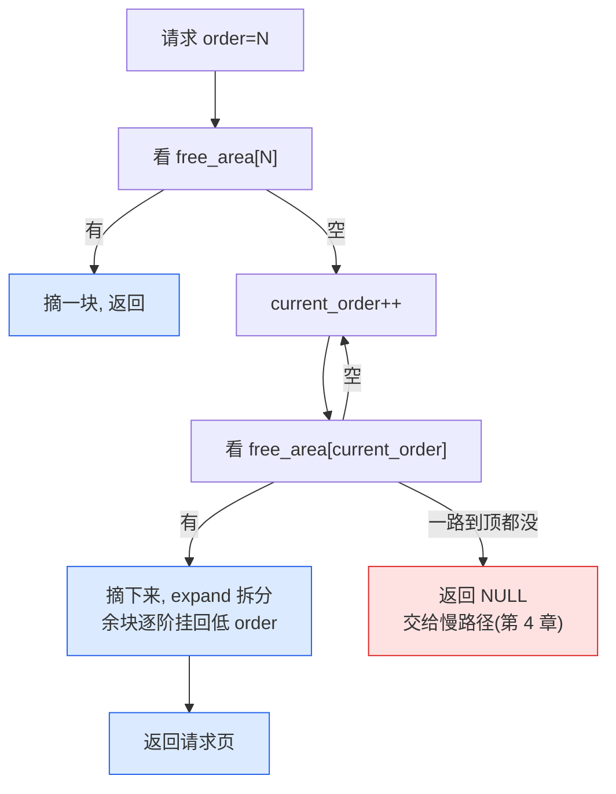
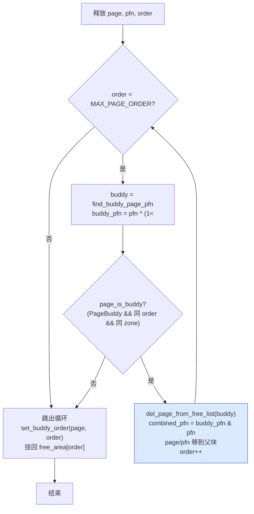

# 第三章 · buddy 算法:order、free_area、拆分合并

> 篇:第 1 篇 · buddy 伙伴系统(分配·物理页)
> 主线呼应:上一章立起了"物理页怎么组织"——`struct page`/`folio`、node/zone、`free_area[]` 字段。本章正式打开 buddy 伙伴系统:它怎么用 `free_area[]` 这套结构,把页**按 2 的幂组织**起来,在分配时**从大块对半拆**、在释放时**和"伙伴"合回去**。这是 mm 把内存**分出去**的最底层原语,后面 slab、用户缺页、回收,全都站在它肩膀上。

## 核心问题

**物理页怎么管理才既快又抗碎片?——buddy 按 order(2^N 页)组织空闲、`free_area[]` 每 zone 一个按 order 索引、分配时从大块拆分、释放时和"伙伴"合并回去,核心是对抗外碎片(external fragmentation)。**

读完本章你会明白:

1. **为什么要按 2 的幂(order)管理空闲页**——而不是按字节、按线性大小随便切。
2. **`free_area[]` 这套数据结构长什么样**——每个 order 一条链、每个 order 又按 migrate type 分链。
3. **分配一次高阶页怎么拆分**(`expand`),**释放时怎么和伙伴合并**(`__free_one_page`),以及为什么**找伙伴是 O(1)**。
4. buddy 算法在**抗碎片**和**速度**之间的取舍——它不消灭碎片,只是让碎片能**尽量合回去**。

> **逃生阀**:如果你对"2 的幂""异或"感到陌生,别慌。本章会先用一个最朴素的问题("按字节分配会怎样")逼出 buddy 的设计,再一步步落到源码。`__find_buddy_pfn` 那行 `pfn ^ (1 << order)` 是全章的"aha 时刻",我们会把它拆到你能背下来。

---

## 3.1 一句话点破

> **buddy 之所以按 2 的幂(order)管理空闲页,是为了让"找伙伴"和"合并"都变成一次异或 O(1)——给定一个页的 pfn 和 order,它的伙伴 pfn 就是 `pfn ^ (1 << order)`。这一行异或,是整个 buddy 算法抗碎片能力的根。**

这是结论,不是理由。本章倒过来拆:先看"按字节分配会碎成什么样",再看为什么 2 的幂能让碎片**自愈**,然后落到 Linux 的 `free_area[]` 和 `__free_one_page`/`__rmqueue_smallest` 这两组源码,最后讲 migrate type 怎么预埋第 6 章。

---

## 3.2 先看清要解决什么问题:外碎片

回到第 2 章:每个 zone 手里有一大把**物理页**,每页 4KB。内核随时会有人来要内存——

- 进程缺页,要 1 页(4KB)。
- slab 分配器要 1 页,在上面切小对象。
- 某个驱动要 4 页(16KB)做 DMA buffer。
- 有人想要 8 页、16 页,甚至一整个 2MB 大页(`order=9`,512 页)。

这些请求的**大小是 2 的幂**(1、2、4、8……页),因为内核设计上就倾向于按页的倍数要内存。如果有人要的字节数不是 2 的幂,那是 slab 的事(在页内切),不是 buddy 的事。

那问题是什么?问题是**外碎片**:

> 物理内存总量够,但**空闲页被打散成了无数小块**,凑不出一个连续的大块。比如机器还剩 100 页空闲,但因为它们东一块西一块,**要 8 页连续的请求却拿不到**。

这是 mm 最头疼的事。一台机器跑久了,碎片化会让"明明内存还够"却分配不出大页、做不成 DMA——明明没到 OOM,功能却挂了。

> **不这样会怎样**:假设内核用一个朴素的方案——维护一条**所有空闲页的大链表**,要 N 页就从头数 N 个连续的页给出去。问题:
>
> 1. **找 N 个连续页要 O(总页数)**——几百万页里扫,慢得无法接受。
> 2. **释放时没法合**——还回来 1 页,怎么知道它**旁边**那页是不是也空闲、能不能合成 2 页?得扫整条链找邻居,又 O(n)。
> 3. **碎片永远自愈不了**——每次释放都孤零零地挂回去,小碎块永远是小碎块,系统越用越碎。

这就是 buddy 算法要正面解决的:**让"按大小分配"和"找伙伴合并"都极快,且让碎片能自动合回去**。

---

## 3.3 为什么是 2 的幂:order 的诞生

buddy 的核心约定,是把空闲页**按 2 的幂**分组管理:

| order | 页数 | 大小(4KB 页) |
|------|------|------------|
| 0 | 1 | 4 KB |
| 1 | 2 | 8 KB |
| 2 | 4 | 16 KB |
| 3 | 8 | 32 KB |
| 4 | 16 | 64 KB |
| … | … | … |
| 9 | 512 | 2 MB |
| 10 | 1024 | 4 MB |

一个 `order=N` 的空闲块,就是 **2^N 个连续的物理页**,且它的起始 pfn **必须**是 2^N 的倍数(对齐)。这是 buddy 的铁律——不是任意 2^N 个连续页都算 `order=N`,只有**从 2^N 对齐的位置开始**的才算。

在 Linux 6.9 里,这个最大阶叫 [`MAX_PAGE_ORDER`](../linux/mm/page_alloc.c#L30)(=10),对应的页数 [`MAX_ORDER_NR_PAGES`](../linux/mm/page_alloc.c#L34)(=1024)。

> **源码印象修正**:你在老资料/老书里看到的常叫 `MAX_ORDER`。Linux 6.x 里它被**重命名**为 `MAX_PAGE_ORDER`(配合一个更大的 `MAX_ORDER` 在别的子系统复用同名),`page_alloc.c` 顶部 [L29-38](../linux/mm/page_alloc.c#L29-L38) 给出定义。本书统一用新名字。另外还有一个 [`NR_PAGE_ORDERS = MAX_PAGE_ORDER + 1`](../linux/mm/page_alloc.c#L38)(=11),是"阶的总数",用来当数组大小。

### 为什么必须是 2 的幂且对齐

这个约定看似死板,但它带来一个**惊人**的性质:给定任意一个页的 pfn 和它的 order,它的**伙伴 pfn**可以用一次异或算出来。我们下一节专门拆这个。这里先建立直觉:

- 一个 `order=N` 的块,有一个**唯一的伙伴**——它对半切出来的另一半。
- 伙伴的 pfn,就是当前块 pfn **翻转第 N 位**得到的那个数。
- 两块合起来,正好是父块(order N+1),父块 pfn 是当前块 pfn **清掉第 N 位**。

举例(以 pfn 计,假设起始):

```
父块 order=2 (4 页): pfn = 0   →  [0, 1, 2, 3]
对半切,两个 order=1 的子块:
  子块 A: pfn = 0   →  [0, 1]   (第 1 位 = 0)
  子块 B: pfn = 2   →  [2, 3]   (第 1 位 = 1)   ← A 的伙伴
再切,A 的两个 order=0 子块:
  页 0 (第 0 位 = 0)  和  页 1 (第 0 位 = 1)互为伙伴
```

注意:**伙伴是相互的、唯一的、O(1) 可算的**。这是 buddy 全部精妙的地基。

> **钉死这件事**:buddy 的"按 2 的幂 + 对齐"不是教条,而是**为了让伙伴关系可计算**。一旦伙伴可计算,"找空闲块"和"合并"就都从 O(n) 扫描降到了 O(1) 异或。这就是 buddy 用 2 的幂的真正原因——不是为了好看,是为了**算得出伙伴**。

---

## 3.4 数据结构:`free_area[]` 每 zone 一个

知道 order 是什么,数据结构就好讲了。每个 zone 里,有一个数组 [`free_area[NR_PAGE_ORDERS]`](../linux/include/linux/mmzone.h#L941):

```c
// include/linux/mmzone.h (简化示意,非源码原文)
struct zone {
    ...
    struct free_area free_area[NR_PAGE_ORDERS];   // L941: 每 zone 一个,按 order 索引
    ...
};
```

而每个 `free_area`([mmzone.h:117-120](../linux/include/linux/mmzone.h#L117-L120))长这样:

```c
struct free_area {
    struct list_head free_list[MIGRATE_TYPES];   // 每个 migrate type 一条链
    unsigned long   nr_free;                      // 这个 order 下各链空闲块的总数
};
```

也就是说:

```
zone->free_area[order].free_list[migratetype]
                                       ↑ 一条双向链表,挂着所有 order 阶、migratetype 类型的空闲块
```

画成图:

```
                zone
                 │
                 ▼
   ┌────────────────────────────────────────────────────┐
   │  free_area[0]  (order 0 = 1 页)                    │
   │    free_list[UNMOVABLE]:   ○ -> ○ -> ○ -> ○        │
   │    free_list[MOVABLE]:     ○ -> ○                  │
   │    free_list[RECLAIMABLE]: ○ -> ○ -> ○             │
   │    nr_free = 9                                     │
   ├────────────────────────────────────────────────────┤
   │  free_area[1]  (order 1 = 2 页)                    │
   │    free_list[UNMOVABLE]:   ○○ -> ○○                │
   │    free_list[MOVABLE]:     ○○ -> ○○ -> ○○         │
   │    nr_free = 5                                     │
   ├────────────────────────────────────────────────────┤
   │  free_area[2]  (order 2 = 4 页)                    │
   │    free_list[MOVABLE]:     ○○○○ -> ○○○○           │
   │    nr_free = 2                                     │
   ├────────────────────────────────────────────────────┤
   │  ...                                               │
   ├────────────────────────────────────────────────────┤
   │  free_area[10] (order 10 = 1024 页, 最大)          │
   │    free_list[MOVABLE]:     (空)                     │
   │    nr_free = 0                                     │
   └────────────────────────────────────────────────────┘

   ○ = 一个空闲块(挂在链上的是它的"首页" struct page)
   每个 ○ 在 order N 下代表 2^N 个连续页
```

挂在链表上的"节点"是什么?是空闲块的**首页**的 `struct page`。它通过 [`page->buddy_list`](../linux/include/linux/mm_types.h#L102) 这个字段串在链上(`buddy_list` 和 `pcp_list`、`lru` 在 union 里复用,因为一个页同一时刻只在一种链上)。同时,`page->private` 存了**自己的 order**,还有一个标志位 `PageBuddy` 表示"我正在 buddy 的空闲链上"。

> **不这样会怎样**:如果不用"按 order 分桶 + 链表",而是把所有空闲块堆在一起按大小排序(比如红黑树),分配时要查树、释放时要插树,O(log n) 也不慢——但**找伙伴合并**还是得在树里查"我旁边那块在不在",每次释放都两次树操作。buddy 用"按 order 数组分桶 + 每 order 链表",让分配是"取链头"(O(1))、合并是"异或算伙伴 pfn 再查那条链"(O(1))。简单、快、cache 友好。

`nr_free` 是这个 order 下所有 migrate type 的空闲块**总数**(单位是"块",不是"页")。`/proc/buddyinfo` 输出的那一串数字,就是每个 order 的 `nr_free`(详见章末观测)。

> **关于 migrate type**:为什么 `free_list` 还要再分 `MIGRATE_TYPES` 条链?这是第 6 章的主题(migrate types 抗碎片)。这里先点一句:每个 order 的空闲块,还会按"能不能搬走"分到 UNMOVABLE/MOVABLE/RECLAIMABLE 三条链(还有 CMA/HIGHATOMIC/ISOLATE)。**把会动的页和不会动的页分开放**,给大块连续留余地。本章涉及分配/合并时,migratetype 都是"这块页属于哪个组"的标签,先不展开。

---

## 3.5 分配:从大块拆分(`__rmqueue_smallest` + `expand`)

现在看分配。请求是"给我一个 order=N 的块"。buddy 的策略朴素到极点:

1. **先看 `free_area[N]`**:有就拿链头一块,完事。
2. **没有,往上看 `free_area[N+1]`**:有就拿一块,对半切,一半给请求,另一半挂回 `free_area[N]`。
3. **还没有,继续往上 `free_area[N+2]`**:切两次……
4. 一路找到 `free_area[MAX_PAGE_ORDER]` 都没有,返回失败(交给 fallback/慢路径,见第 4 章)。

这个"找不到就往上找、找到就拆"的逻辑,在 Linux 里由 [`__rmqueue_smallest`](../linux/mm/page_alloc.c#L1562-L1586) 实现:

```c
// mm/page_alloc.c#L1562-L1586 (简化示意,保留主干)
static __always_inline
struct page *__rmqueue_smallest(struct zone *zone, unsigned int order,
                                int migratetype)
{
    unsigned int current_order;
    struct free_area *area;
    struct page *page;

    /* 从请求的 order 开始,逐阶往上找 */
    for (current_order = order; current_order < NR_PAGE_ORDERS; ++current_order) {
        area = &(zone->free_area[current_order]);
        page = get_page_from_free_area(area, migratetype);   // 取链头
        if (!page)
            continue;
        del_page_from_free_list(page, zone, current_order);  // 摘下来
        expand(zone, page, order, current_order, migratetype); // 拆出多余的挂回
        set_pcppage_migratetype(page, migratetype);
        return page;
    }
    return NULL;
}
```

注意循环里两个动作:**先 `del_page_from_free_list` 把整块从链上摘下来,再 `expand` 把拆出来的余块挂回去**。`expand`([page_alloc.c:1387-1409](../linux/mm/page_alloc.c#L1387-L1409))是拆分的核心:

```c
// mm/page_alloc.c#L1387-L1409 (简化示意,去掉 guard page 分支)
static inline void expand(struct zone *zone, struct page *page,
                          int low, int high, int migratetype)
{
    unsigned long size = 1 << high;   // high 阶的页数

    while (high > low) {
        high--;
        size >>= 1;                   // 每降一阶,页数减半
        /* 把后半块挂回 free_area[high] */
        add_to_free_list(&page[size], zone, high, migratetype);
        set_buddy_order(&page[size], high);  // page[size]->private = high; __SetPageBuddy
    }
}
```

拆分过程用 ASCII 画清楚。假设请求 `order=0`(1 页),但 `free_area[0]` 空,要从 `free_area[2]`(4 页)拆:

```
初始: free_area[2] 有一个块, pfn = 0..3 (4 页)
      ○○○○  (一整块 order 2)

第一步: high=2 -> 1, size 从 4 减到 2
        把 page[2..3] 挂回 free_area[1]
        ○○   ○○
        ↑    ↑ 挂回 free_area[1]
        保留给请求(继续拆)

第二步: high=1 -> 0, size 从 2 减到 1
        把 page[1] 挂回 free_area[0]
        ○    ○
        ↑    ↑ 挂回 free_area[0]
        最终给请求的页(pfn 0)
```

最终:请求拿到 pfn=0 的 1 页,free_area[1] 多了 1 块(pfn 2..3),free_area[0] 多了 1 块(pfn 1)。**拆出来的余块,全部以正确的 order 挂回对应的 free_area**。

> **不这样会怎样**:假设分配时不拆,而是"要 1 页就老老实实从 4 页块里抠 1 页、剩下 3 页原样留着"。那这 3 页就成了一个**非法的 order**(3 页既不是 order 0 也不是 order 1),buddy 的 order 体系立刻崩溃——下次释放没法用异或找伙伴了。**buddy 的精髓是:拆出来的余块必须仍是 2 的幂、仍对齐**,所以 expand 是"逐阶对半拆",每一步拆出来的都是合法 order。这是 order 体系能运转的代价——**任何时刻所有空闲块都是合法的 2^N 对齐块**,否则异或找伙伴就失效。

### 拆分递归的整体观

把"找不到就往上找 + 拆"画成 mermaid:



注意:Linux 的实现**不是递归**,而是 `__rmqueue_smallest` 里的那个 `for` 循环(逐阶往上找)+ `expand` 里的 `while` 循环(逐阶往下拆)。**等价于递归,但用迭代写,避免内核栈深度问题**—— buddy 分配在任意上下文(包括中断、原子)都可能发生,递归是不必要的风险。

---

## 3.6 释放:和伙伴合并(`__free_one_page`)

释放是 buddy 的重头戏,也是它**抗碎片**的关键。还回来一个 order=N 的块,buddy 不只是把它挂回 `free_area[N]`,而是**尽量和伙伴合成 order N+1,再尽量合成 N+2……一路合到合不动为止**。

这就是 [`__free_one_page`](../linux/mm/page_alloc.c#L765-L844)。它的合并循环(L786-824)是本章最值得逐行读的代码:

```c
// mm/page_alloc.c#L786-L824 (简化示意,去掉 compaction_capture / pageblock 边界特判)
while (order < MAX_PAGE_ORDER) {
    buddy = find_buddy_page_pfn(page, pfn, order, &buddy_pfn);
    if (!buddy)                       // 伙伴不在空闲链上,合不动了
        goto done_merging;

    /* 伙伴在空闲链上,且 order 一致、同 zone —— 合并! */
    del_page_from_free_list(buddy, zone, order);   // 把伙伴摘下来
    combined_pfn = buddy_pfn & pfn;               // 父块 pfn = 两个伙伴 pfn 的按位与
    page = page + (combined_pfn - pfn);            // page 指针移到父块首页
    pfn = combined_pfn;
    order++;                                       // 阶 +1,继续尝试往上合
}

done_merging:
    set_buddy_order(page, order);                  // page->private = order; __SetPageBuddy
    /* 根据 cache 局部性,选挂到链头还是链尾(见 3.8 技巧精解) */
    if (to_tail) add_to_free_list_tail(...);
    else         add_to_free_list(...);
```

每一步循环做三件事:

1. **算伙伴 pfn,看它在不在空闲链上**(`find_buddy_page_pfn`)。
2. **在,就把伙伴摘下来,两者合成父块**(`combined_pfn = buddy_pfn & pfn`,阶 +1)。
3. **拿着父块,继续尝试往上合**(下一轮循环)。

直到某一步伙伴不在空闲链上(已被分配了、或 order 不匹配),跳出循环,把当前块挂回 `free_area[最终 order]`。

### 一行异或算出伙伴

这里要专门讲 [`find_buddy_page_pfn`](../linux/mm/internal.h#L454-L467) 背后的 [`__find_buddy_pfn`](../linux/mm/internal.h#L434-L438)——**全章最关键的一行**:

```c
// mm/internal.h#L434-L438 (源码原文,核心一行)
static inline unsigned long
__find_buddy_pfn(unsigned long page_pfn, unsigned int order)
{
    return page_pfn ^ (1 << order);
}
```

一行异或。给定当前块 pfn 和 order,伙伴 pfn 就是 `page_pfn ^ (1 << order)`——**翻转第 order 位**。

为什么?回到 3.3 节的对齐约定:order=N 的块,起始 pfn 必须是 2^N 对齐的,即**第 0 到 N-1 位全是 0**。它和它的伙伴合起来是 order N+1 的父块(2^(N+1) 对齐),所以**两兄弟唯一的区别,就是第 N 位**——一个是 0,一个是 1。翻转第 N 位,就跳到了兄弟那里。

```
order=1, 父块 pfn=0 (对齐 2^2=4)
  子块 A: pfn = 0  = 0b00  (第 1 位=0)
  子块 B: pfn = 2  = 0b10  (第 1 位=1)
  A ^ (1<<1) = 0 ^ 2 = 2 = B   ✓
  B ^ (1<<1) = 2 ^ 2 = 0 = A   ✓
```

合并时,父块 pfn 是 `buddy_pfn & pfn`(按位与,清掉第 N 位),在源码 [L820](../linux/mm/page_alloc.c#L820):

```c
combined_pfn = buddy_pfn & pfn;
```

因为两兄弟只在第 N 位不同,按位与正好把第 N 位清零,得到父块 pfn。`&` 和 `^` 是一对:异或找兄弟、按位与找父亲。

### 验证:伙伴是不是真的能合

光算出 buddy_pfn 不够,还得确认"那个 pfn 上的页,确实是个**空闲的、同 order、同 zone** 的伙伴"。这就是 [`page_is_buddy`](../linux/mm/internal.h#L396-L415):

```c
// mm/internal.h#L396-L415 (简化示意)
static inline bool page_is_buddy(struct page *page, struct page *buddy,
                                 unsigned int order)
{
    if (!page_is_guard(buddy) && !PageBuddy(buddy))   // 伙伴得在 buddy 空闲链上
        return false;
    if (buddy_order(buddy) != order)                  // 阶得一致
        return false;
    if (page_zone_id(page) != page_zone_id(buddy))    // 得在同一个 zone
        return false;
    return true;
}
```

三个条件:**`PageBuddy` 标志、同 order、同 zone**。这三个标志(`PageBuddy` + `page->private` 存的 order + zone id)**全在 `zone->lock` 这个自旋锁保护下设置/清除/检查**(见 [`__free_one_page` 调用栈](../linux/mm/page_alloc.c#L1259),释放路径在锁内调用)。这是 buddy 并发正确性的根基——没有这个锁,两个 CPU 同时释放互为伙伴的两块,可能各自都把对方摘下来、合成父块,然后**同一块内存被挂到两条链上**,内存管理当场崩盘。

> **钉死这件事**:`PageBuddy`/`buddy_order`/zone id 这三个标志,都在 `zone->lock` 串行下读写。这是 buddy 算法**为什么 sound**(不会数据竞争、不会双重合并)的根。锁很粗(整个 zone 一把),但 buddy 的快路径在第 5 章(释放)会靠 per-cpu pageset 绕开大部分锁竞争;第 4 章(分配)会看到 `zone->lock` 在快路径里仍要拿,但拿锁内的操作极短。

---

## 3.7 合并的递归流程:Mermaid

把 `__free_one_page` 的合并循环画成流程图(它是迭代写法,逻辑等价于递归):



每合一次,order +1,再用新的 order 算新伙伴。比如释放 order=0 的页,先试合到 order=1,再试合到 order=2……直到某阶伙伴不在空闲链,挂回那一阶。**一次释放可能合并 0 次到 MAX_PAGE_ORDER 次**——理想情况下,一次释放能把一整个被拆散的大块**全部拼回去**。

### 一次完整的拆分-合并循环(ASCII 全景)

下面这张图把"分配拆分 + 释放合并"的整个生命周期画出来,这是 buddy 最值得在脑子里建立的画面:

```
初始: 一个 order=2 的空闲块 (pfn 0..3)
      [ 0  1  2  3 ]   order=2, 全空闲,挂在 free_area[2]

① 请求 order=0 (1 页): free_area[0] 空, 从 order=2 拆
      拆 1: [0 1 2 3] → [0 1] + [2 3],把 [2 3] 挂 free_area[1]
      拆 2: [0 1] → [0] + [1],把 [1] 挂 free_area[0]
      给出 [0]
      现状: [0]在用, [1]在 free_area[0], [2 3]在 free_area[1]

② 再请求 order=0: free_area[0] 有 [1],直接给
      现状: [0][1]在用, [2 3]在 free_area[1]

③ 释放 [0]: 试合伙伴
      order=0: 伙伴 pfn = 0 ^ 1 = 1,但 [1] 在用 → 合不动
      挂回 free_area[0]
      现状: [0]在 free_area[0], [1]在用, [2 3]在 free_area[1]

④ 释放 [1]: 试合伙伴
      order=0: 伙伴 pfn = 1 ^ 1 = 0,[0] 在空闲! 合成 [0 1] order=1
      order=1: 伙伴 pfn = 0 ^ 2 = 2,[2 3] 在空闲! 合成 [0 1 2 3] order=2
      order=2: 已到原阶(或伙伴不在),停止
      挂回 free_area[2]
      现状: [0 1 2 3] 全回 free_area[2],碎片自愈!
```

第 ④ 步是 buddy 抗碎片的精华:**只要伙伴都在,释放会自动把它们一层层拼回大块**。这就是 buddy 能对抗外碎片的原因——它不消灭碎片,但它让碎片**能合回去**,只要释放顺序合理。

---

## 3.8 技巧精解:buddy 合并的"一行异或"与挂链的 cache 心机

### 技巧一:O(1) 找伙伴靠 `pfn ^ (1 << order)`

这是全章最该钉死的技巧。我们用**反面对比**让它的妙处显形。

> **反面对比·朴素方案 A(按字节/线性大小分配)**:假设内核不用 order,而是把空闲内存按"任意字节大小"切成块,用一棵平衡树按 `(起始, 大小)` 组织。分配 16KB 时,在树里找一块 ≥16KB 的,可能切掉前面一段给请求、后面剩的留在树里。释放时,要找邻居合:
>
> - 先在树里查"pfn-大小"那个位置在不在空闲——一次 O(log n) 查找。
> - 如果在,再查它的更上一层邻居……每层合并都两次树操作。
> - 而且**邻居的"大小"不固定**(可能 1 页、可能 3 页),合并时要处理各种大小组合,逻辑复杂、容易出 bug。
>
> 结果:每次释放 O(log n) 起步,常量因子大,且合并边界条件繁琐。

> **反面对比·朴素方案 B(按固定大小但不对齐)**:假设按 2 的幂分桶,但**不要求对齐**——任意连续 2^N 页都算一个 order=N 块。那"一个页的 order=N 伙伴"就**不唯一**了:同一个页,可以属于多种不同的 order=N 块组合,伙伴 pfn 算不出来,得查表/查树。又回到方案 A 的问题。

buddy 的方案(C,**当前 Linux**):

- **只认对齐的 2^N 块**(order=N 块的 pfn 必须是 2^N 倍数)。
- 这个约束下,一个 order=N 块的伙伴**唯一**,且伙伴 pfn = `pfn ^ (1 << order)`——**一次异或,O(1)**。
- 父块 pfn = `buddy_pfn & pfn`——**一次按位与,O(1)**。

合并循环里,每轮就是:`异或算伙伴 → 查一条链 → 在就摘 → 阶+1`。最坏情况合 `MAX_PAGE_ORDER`(10)次,每次都是几次内存访问 + 位运算,**完全没有树查找、没有扫描**。

```c
// 这一行是 buddy 抗碎片能力的全部根基 (mm/internal.h#L437)
return page_pfn ^ (1 << order);
```

> **钉死这件事**:buddy 用"2 的幂 + 对齐"换来了"伙伴 O(1) 可算"。这个约束是**故意**的——它让一个看起来很复杂的问题(在几百万页里找邻居、合并碎片)退化成了**位运算 + 链表头操作**。这是"用约束换性能"的教科书案例:放弃"任意大小任意位置"的灵活性,换来 O(1) 的合并。

### 技巧二:挂链头还是挂链尾?——`buddy_merge_likely` 的 cache 心机

[`__free_one_page` 在合并结束、要把块挂回 `free_area[order]` 时](../linux/mm/page_alloc.c#L826-L839),不是无脑挂链尾,而是先调一次 [`buddy_merge_likely`](../linux/mm/page_alloc.c#L725-L739) 决定挂头还是挂尾:

```c
// mm/page_alloc.c#L829-L839 (简化示意)
if (fpi_flags & FPI_TO_TAIL)
    to_tail = true;
else if (is_shuffle_order(order))
    to_tail = shuffle_pick_tail();
else
    to_tail = buddy_merge_likely(pfn, buddy_pfn, page, order);

if (to_tail)
    add_to_free_list_tail(page, zone, order, migratetype);
else
    add_to_free_list(page, zone, order, migratetype);
```

`buddy_merge_likely` 干什么?它**预判**"这块的上一层伙伴是不是也快被释放了":

```c
// mm/page_alloc.c#L725-L739 (简化示意)
buddy_merge_likely(unsigned long pfn, unsigned long buddy_pfn,
                   struct page *page, unsigned int order)
{
    if (order >= MAX_PAGE_ORDER - 1)
        return false;
    higher_page_pfn = buddy_pfn & pfn;                       // 父块 pfn
    higher_page = page + (higher_page_pfn - pfn);
    return find_buddy_page_pfn(higher_page, higher_page_pfn,
                               order + 1, NULL) != NULL;      // 父块的伙伴在不在空闲链
}
```

它查的是**父块**(order+1)的伙伴**是不是已经在空闲链上**。如果"父块的伙伴在",说明这块释放后,**继续往上合成 order+2 的概率很高**——那这一阶就挂到**链尾**(晚一点被分配出去),让合并继续往上走。反之挂**链头**(早一点被分配出去也无所谓,反正合不上去)。

> **不这样会怎样**:如果每次都挂链头,那"快要合上去的块"很容易在下一次分配时被先取走,**合并链被切断**,大块永远凑不出来,碎片化加剧。挂链尾让"有希望继续合并的块"活得久一点,给后续释放留出合并窗口。这是个**启发式**(heuristic),不保证正确,只为提高合并概率、降低长期碎片化。是 buddy 算法里少有的"不改变正确性、只为性能/抗碎片"的细节,体现了内核对实际工作负载的细致调优。

---

## 3.9 关于"代价":buddy 不消灭碎片,只是让它能合回去

讲到这里要泼一盆冷水,免得读者误以为 buddy 万能。

buddy **对抗**外碎片,但**不消灭**外碎片。它有一个绕不开的盲点:

> **如果伙伴不在空闲链上(还在用),就合不动**。

最坏情况:一块 4MB(order=10)的大块,被分配出去了 1 页(最坏情况,伙伴的另一页在用)。那剩下 4MB-1 页**永远无法合并成大块**,直到那 1 页被释放。这种"一个大块里只有零星几页在用、其余空闲但凑不回大块"的状态,就是 buddy **无能为力**的碎片。

Linux 为此准备了两道后手(都是后续章节的主题):

1. **migrate types + pageblock(第 6 章)**:把"会搬走的页"(MOVABLE)和"钉死的页"(UNMOVABLE)分区域放。这样 UNMOVABLE 的小分配不会卡在 MOVABLE 大块中间,MOVABLE 区域还能整体腾空、合并成大块。
2. **compaction(第 18 章)**:碎片化严重、要大块拿不到时,内核**主动搬页**——把 MOVABLE 页从碎片区域搬走,腾出连续大块。这是 buddy 之外的"强制整理"。

所以 buddy 是**第一道防线**(让碎片能合就合),migrate types 是**第二道**(别让难搬的页卡在大块里),compaction 是**第三道**(实在碎了,我动手搬)。三道合起来,才让 Linux 能在长期运行下仍分配得出大页、做得了 DMA。

> **钉死这件事**:buddy 解决"快"和"能合",但解决不了"伙伴被卡住"的碎片。完整的抗碎片是 buddy + migrate types + compaction 三层。第 6 章讲第二层,第 18 章讲第三层。

---

## 3.10 一句话点一下:buddy 与用户态分配器的 span

(本章不标 ★,这里只一句轻点,完整对照在第 10、21 章。)

如果你读过第 8 本《内存分配器》,会注意到 tcmalloc/jemalloc 里有一个概念叫 **span**——"一段连续的页"。tcmalloc 的中央堆(CentralFreelist)就是按 span(页级)管理内存,再在 span 内切小对象。**buddy 就是内核版的"span 管理器"**——它管的就是"页级的连续块",内核的 slab 再在 buddy 给的页(相当于一个最小 span)上切小对象。两边都把"页级管理"和"对象级管理"分了两层,只是用户态分配器多了 thread cache(用户态的 per-CPU 缓存)、内核多了 per-cpu pageset(P5 第 5 章)。完整对照见第 10、21 章。

---

## 章末小结

这一章我们把 buddy 伙伴系统拆透了。它不是什么神秘算法,核心就三件事:

1. **按 order(2^N 对齐页)组织空闲**——`zone->free_area[order]`,每阶一条链,每阶再按 migrate type 分链。
2. **分配时拆**(`expand`):找不到匹配阶就从大阶对半切,余块逐阶挂回。
3. **释放时合**(`__free_one_page`):异或算伙伴、按位与算父块,合到合不动为止。

这套设计让"在几百万页里找空闲块"和"找伙伴合并"都退化成 O(1) 的位运算 + 链表头操作——这是 buddy 凭什么这么快的根。而它**抗碎片**的能力,来自"只要伙伴都在,释放会自动把它们拼回大块"——前提是伙伴没被别的分配卡住(那是第 6 章 migrate types 和第 18 章 compaction 的活)。

本章服务二分法的**分配**那一面:buddy 是把物理页**分出去**的最底层原语。第 4 章会讲一次真实的 `__alloc_pages` 怎么调它(快路径),并在水位不足时走慢路径;第 5 章讲释放路径怎么用 per-cpu pageset 绕开 `zone->lock`。

### 五个"为什么"清单

1. **为什么 buddy 按 2 的幂(order)组织空闲?** 因为这样"一个块的伙伴"唯一可算(`pfn ^ (1 << order)`),合并退化成 O(1) 异或 + 按位与。按字节/任意大小分,找邻居要 O(n) 扫描或 O(log n) 树查找。
2. **为什么 order=N 块的 pfn 必须是 2^N 对齐?** 对齐保证"两兄弟只在第 N 位不同",异或/按位与才有意义。不对齐,伙伴关系就不唯一了。
3. **分配时找不到匹配阶怎么办?** 从 `free_area[order+1]` 取一块,`expand` 对半拆,一半给请求一半挂回 `free_area[order]`;再没有就继续往上,直到 `MAX_PAGE_ORDER`。
4. **释放时怎么知道能不能合?** `find_buddy_page_pfn` 算出伙伴 pfn,再用 `page_is_buddy` 验证(伙伴在空闲链、同 order、同 zone)。三个标志在 `zone->lock` 下读写,这是 buddy 并发正确性的根基。
5. **buddy 解决了外碎片吗?** 部分。它让碎片**能合回去**(只要伙伴都在),但解决不了"伙伴被卡住"的碎片。完整抗碎片靠 buddy + migrate types(第 6 章)+ compaction(第 18 章)三层。

### 想继续深入往哪钻

- **源码**:
  - [`mm/page_alloc.c`](../linux/mm/page_alloc.c) 的 `__free_one_page`(L765)、`expand`(L1387)、`__rmqueue_smallest`(L1562)、`__rmqueue`(L2087)、`buddy_merge_likely`(L725)、`set_buddy_order`(L607)、`add_to_free_list`/`del_page_from_free_list`(L664/L696)。
  - [`mm/internal.h`](../linux/mm/internal.h) 的 `__find_buddy_pfn`(L434)、`find_buddy_page_pfn`(L454)、`page_is_buddy`(L396)。
  - [`include/linux/mmzone.h`](../linux/include/linux/mmzone.h) 的 `struct free_area`(L117)、`enum migratetype`(L48)、`zone->free_area[]`(L941)。
- **观测**:
  - `cat /proc/buddyinfo`——每个 node/zone 一行,后面 11 个数字依次是 `free_area[0..10]` 的 `nr_free`。看着这些数字随系统运行变化,能直观感受碎片化。
  - `cat /proc/pagetypeinfo`——更细,每个 order × 每个 migrate type 的空闲块数(第 6 章会用到)。
  - `ftrace` 的 `mm_page_alloc`/`mm_page_free`/`mm_page_pcpu_drain` tracepoint,能看到每次分配/释放的 pfn 和 order。
- **延伸**:Knuth 在 *The Art of Computer Programming* Vol.1 给出 buddy 系统的原始论述;Knowlton 1965 年的论文是 buddy 的起源。Linux 的 buddy 在经典原则上加了 migrate types(第 6 章)、per-cpu pageset(第 5 章)、`buddy_merge_likely` 这种启发式。

### 引出下一章

buddy 算法本身讲完了——它是一个"给 order 就能 O(1) 分配/合并"的原语。但**谁来调它、什么时候调、调不到怎么办**?真实的一次页分配 `alloc_pages` → `__alloc_pages`,远不止"调 buddy"这一步:它要先查水位(watermark)够不够、要不要走快路径、不够时是不是该唤醒 kswapd、要不要直接回收、要不要 compaction……buddy 只是这套决策树最底层的执行者。下一章,我们讲完整的 `__alloc_pages` 快慢路径,把 buddy 拼回它真正运行的位置。
