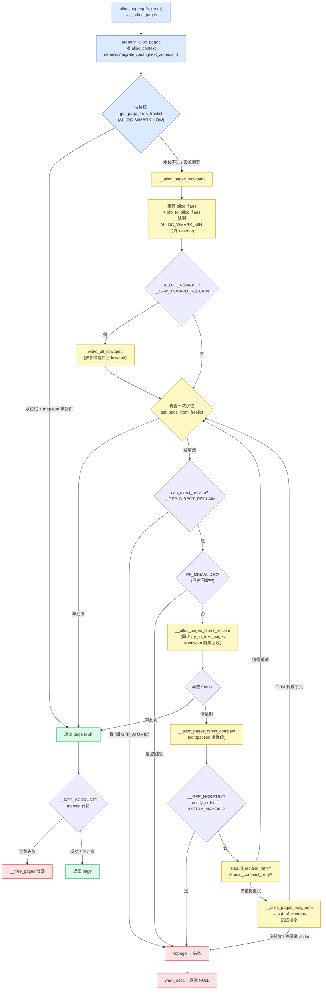

# 第四章 · 分配路径 __alloc_pages:快路径与慢路径

> 篇:P1 buddy 伙伴系统
> 主线呼应:上一章我们把 buddy 的拆分/合并原语(`__rmqueue_smallest`/`expand`/`__free_one_page`)讲透了。但那只是"原子操作"——真正的一次页分配,远不止"取一页"那么简单。这一章讲**一次 `alloc_pages()` 走的完整决策树**:大部分时候,内存充裕,内核只查个水位、从 free_area 拿一页就返回(快路径);可一旦内存紧张,它就要**唤醒 kswapd、直接回收、做 compaction 规整、甚至 OOM 杀进程**(慢路径)。这是全书**快慢分级**思想的样板——也是**分配与回收两条主线第一次正面交汇**的地方。读懂这一章,你就看懂了内核 mm"平时一路狂奔、遇阻分级兜底"的脾气。

## 核心问题

**一次 `alloc_pages()`,从调用到拿到物理页(或失败),到底走了哪些路?快路径为什么几乎"无锁"就能拿页?慢路径为什么按"唤醒后台 → 直接回收 → 规整 → OOM"这样的顺序兜底?GFP 标志(GFP_KERNEL/GFP_ATOMIC/`__GFP_NOFAIL` 等)又是怎么决定分配能走哪条路、不能走哪条路的?**

读完本章你会明白:

1. `alloc_pages` → `__alloc_pages` → `get_page_from_freelist`(快路径)→ `__alloc_pages_slowpath`(慢路径)这条主链,以及它在源码里的确切位置。
2. 快路径为什么用 **watermark + rmqueue** 就能"几乎无锁-ish"地返回页(order-0 还走 per-cpu pageset,连 zone 锁都不碰)。
3. 慢路径的**六级兜底**:重算 alloc_flags 重试、唤醒 kswapd、(costly 的)直接 compaction、直接回收 vmscan、回收/规整重试循环、OOM——每一级在源码里对应哪段,为什么是这个顺序。
4. **watermark 三档(min/low/high)**和 `_watermark[]`/`wmark_pages()` 的关系(为第 16 章 watermark + kswapd 铺垫)。
5. **GFP 标志如何塑造分配上下文**:`GFP_ATOMIC` 不能睡眠/不能直接回收(中断上下文),`GFP_KERNEL` 可以,`__GFP_NORETRY`/`__GFP_NOFAIL` 改变重试与 OOM 行为。

> **逃生阀**:这一章是全书最长的决策树。如果一开始觉得 `__alloc_pages_slowpath` 的代码像迷宫,记住一条主线——**快路径是"乐观假设内存充裕,只做最便宜的检查";慢路径是"快路径没拿到页,从轻到重、逐级上手段,直到 OOM"**。每一步都问自己:"这一级比上一级贵多少?为什么放在这之后?"你就能看懂它的逻辑。

---

## 4.1 一句话点破

> **`__alloc_pages` 的全部分工,就是把"分配物理页"这件事切成两段:水位满足就只做最便宜的查表 + 拿页(快路径,几乎不锁 zone);不满足才进慢路径,按"代价从轻到重"逐级兜底——先唤醒后台 kswapd(异步、不阻塞我),再直接回收(同步、阻塞但能腾出页),再 compaction 规整(给高阶分配凑连续),最后 OOM。两级之间用 watermark 当分界线,用 GFP 标志决定能走哪些路。**

这是结论,不是理由。本章倒过来拆:先看快路径为什么能"几乎无锁"——它乐观地相信水位检查;再看水位不满足时,慢路径怎么从轻到重逐级上手段;最后看 GFP 标志怎么决定"哪些手段你能用"。

---

## 4.2 入口:从 `alloc_pages()` 到 `__alloc_pages()`

先定位入口。用户态的 `malloc` 最终通过缺页走到 `alloc_pages`;内核态的 `kmalloc`(高阶回退)、`__get_free_pages`、各种 `vmalloc` 也都汇到这一个入口。

[`alloc_pages`](../linux/include/linux/gfp.h#L272) 是个 inline,转手给 [`__alloc_pages_node`](../linux/include/linux/gfp.h#L233),最终调到 [`__alloc_pages`](../linux/mm/page_alloc.c#L4539):

```c
// include/linux/gfp.h(简化示意)
static inline struct page *alloc_pages(gfp_t gfp_mask, unsigned int order)
{
    return alloc_pages_node(numa_node_id(), gfp_mask, order);   // 选 NUMA 本节点
}

static inline struct page *alloc_pages_node(int nid, gfp_t gfp_mask, unsigned int order)
{
    ...
    return __alloc_pages(gfp_mask, order, nid, NULL);
}
```

而 [`__alloc_pages`](../linux/mm/page_alloc.c#L4539) 自己只做三件事——**准备(填 `alloc_context`)、试快路径、试慢路径**:

```c
// mm/page_alloc.c#L4539-L4601(简化示意,保留主干)
struct page *__alloc_pages(gfp_t gfp, unsigned int order, int preferred_nid,
                           nodemask_t *nodemask)
{
    struct page *page;
    unsigned int alloc_flags = ALLOC_WMARK_LOW;          // 快路径用 low 水位
    gfp_t alloc_gfp;
    struct alloc_context ac = { };

    if (WARN_ON_ONCE_GFP(order > MAX_PAGE_ORDER, gfp))    // order 上界 = 10
        return NULL;

    gfp &= gfp_allowed_mask;
    gfp = current_gfp_context(gfp);                       // 继承 NOFS/NOIO scope
    alloc_gfp = gfp;

    /* 1) 准备:把 gfp 翻译成 zonelist、migratetype、preferred zone 等 */
    if (!prepare_alloc_pages(gfp, order, preferred_nid, nodemask,
                             &ac, &alloc_gfp, &alloc_flags))
        return NULL;

    alloc_flags |= alloc_flags_nofragment(ac.preferred_zoneref->zone, gfp);

    /* 2) 快路径:水位满足就直接拿页 */
    page = get_page_from_freelist(alloc_gfp, order, alloc_flags, &ac);
    if (likely(page))
        goto out;

    /* 3) 慢路径:从轻到重逐级兜底 */
    alloc_gfp = gfp;
    ac.spread_dirty_pages = false;
    ac.nodemask = nodemask;
    page = __alloc_pages_slowpath(alloc_gfp, order, &ac);

out:
    if (memcg_kmem_online() && (gfp & __GFP_ACCOUNT) && page &&
        unlikely(__memcg_kmem_charge_page(page, gfp, order) != 0)) {
        __free_pages(page, order);                       // memcg 计费失败,吐回去
        page = NULL;
    }
    ...
    return page;
}
```

源码注释把这函数称作 **"the heart of the zoned buddy allocator"**([page_alloc.c:4537](../linux/mm/page_alloc.c#L4537))——"带 zone 的 buddy 分配器的心脏"。三步非常对称:**准备 → 快 → 慢**。注意快路径默认带的是 `ALLOC_WMARK_LOW`(用 low 水位做检查),这是快路径乐观的体现——下面讲。

[`prepare_alloc_pages`](../linux/mm/page_alloc.c#L4324) 把 GFP 标志翻译成一张"分配上下文快照",装在 [`struct alloc_context`](../linux/mm/internal.h#L336) 里,贯穿快慢路径:

| `alloc_context` 字段 | 怎么来的 | 干什么用 |
|---|---|---|
| `zonelist` | `node_zonelist(preferred_nid, gfp_mask)` | 备选 zone 链表,按 NUMA 距离从近到远排 |
| `nodemask` | 调用者传(可为 NULL) | NUMA 节点过滤 |
| `preferred_zoneref` | `first_zones_zonelist(...)` | 扫 zonelist 的起点(水位检查、统计用它) |
| `migratetype` | `gfp_migratetype(gfp_mask)` | 决定从哪条 `free_list[mt]` 取页 |
| `highest_zoneidx` | `gfp_zone(gfp_mask)` | GFP_DMA 只能拿 DMA,GFP_HIGHMEM 能拿高端内存…… |
| `spread_dirty_pages` | `gfp_mask & __GFP_WRITE` | 脏页均衡,只在快路径做 |

`prepare_alloc_pages` 还顺带做了**cpuset 的快速过滤**:如果开了 cpuset 且在进程上下文,直接把 `nodemask` 设成 `cpuset_current_mems_allowed`,让快路径只在允许的 node 上找——这是快路径里"cpuset/内存策略快速过滤"那一笔(本章不展开,第 20 章 NUMA/mempolicy 详讲)。

---

## 4.3 快路径 `get_page_from_freelist`:乐观的"查水位 + 拿页"

### 不这样会怎样:朴素方案的两次撞墙

如果让你写一个"页分配器",最朴素的版本是什么?

```c
// 朴素方案(反面对比,非源码)
struct page *naive_alloc(zone, order) {
    spin_lock(&zone->lock);
    page = 取 free_area[order] 的一个页块;   // 没有就向高 order 拆分
    spin_unlock(&zone->lock);
    return page;
}
```

这个朴素方案撞两堵墙:

1. **每次分配都锁 zone,并发全堵死**。一台 64 核机器,SMP 上每个 CPU 都在分配/释放页,全挤在一个 zone->lock 上——锁竞争 cacheline 弹来弹去,性能崩盘。
2. **没有"内存紧张"的概念,直到 free_area 真的空了才反应**。等空闲页快耗光才发现没页可分,业务就开始大面积直接回收、卡顿、甚至抖动到 OOM——没有任何缓冲带。

快路径 `get_page_from_freelist` 的设计,正是冲着这两堵墙来的。

### 快路径的主循环:扫 zonelist,逐 zone 查水位 + rmqueue

[`get_page_from_freelist`](../linux/mm/page_alloc.c#L3176) 是快路径的核心。它**不锁 zone**,而是先扫一遍 zonelist,对每个候选 zone 做"水位检查";水位过了才进 `rmqueue`(那时才锁 zone 拿页)。核心循环([page_alloc.c:3185-3341](../linux/mm/page_alloc.c#L3185))简化如下:

```c
// mm/page_alloc.c#L3176-L3353(简化示意,保留主干)
static struct page *
get_page_from_freelist(gfp_t gfp_mask, unsigned int order,
                       int alloc_flags, const struct alloc_context *ac)
{
    struct zone *zone;
    struct zoneref *z;

retry:
    z = ac->preferred_zoneref;
    for_next_zone_zonelist(zone, z, ac->highest_zoneidx, ac->nodemask) {

        /* (a) cpuset 快速过滤:这个 zone 在当前进程允许的 cpuset 里吗? */
        if (cpusets_enabled() && (alloc_flags & ALLOC_CPUSET)
            && !__cpuset_zone_allowed(zone, gfp_mask))
            continue;

        /* (b) 脏页均衡:__GFP_WRITE 的分配不能压在同一个 node 上 */
        if (ac->spread_dirty_pages && !last_pgdat_dirty_ok)
            continue;

        /* (c) 抗碎片:ALLOC_NOFRAGMENT 避免跨 node fallback 提前碎片化 */
        if (no_fallback && nr_online_nodes > 1
            && zone != ac->preferred_zoneref->zone
            && zone_to_nid(zone) != local_nid) {
            alloc_flags &= ~ALLOC_NOFRAGMENT;
            goto retry;
        }

        /* (d) 水位检查:这是快路径的灵魂,见 4.4 */
        mark = wmark_pages(zone, alloc_flags & ALLOC_WMARK_MASK);
        if (!zone_watermark_fast(zone, order, mark, ac->highest_zoneidx,
                                 alloc_flags, gfp_mask)) {
            /* 水位不过 —— 这个 zone 跳过,试下一个 */
            ...必要时 node_reclaim 后再查一次...
            continue;
        }

try_this_zone:
        /* (e) 水位过了 —— 才锁 zone 拿页(rmqueue) */
        page = rmqueue(ac->preferred_zoneref->zone, zone, order,
                       gfp_mask, alloc_flags, ac->migratetype);
        if (page) {
            prep_new_page(page, order, gfp_mask, alloc_flags);
            return page;
        }
    }
    return NULL;   /* 所有 zone 都没满足,回主调用进慢路径 */
}
```

关键观察:**(a)~(d) 全是"不锁 zone 的过滤"**——cpuset、脏页均衡、抗碎片、水位检查,都是在 `zone->lock` 之外做的。只有走到 `(e)` 的 `rmqueue`,才会真正拿 zone 锁(而且 order-0 的 `rmqueue` 还会先走 per-cpu pageset,连 zone 锁都不碰,见下一章 P1-05)。注意 `rmqueue` 最终取页的原语就是上一章 P1-03 讲过的 [`get_page_from_free_area`](../linux/mm/page_alloc.c#L709)(一个 `list_first_entry_or_null`)+ [`__rmqueue_smallest`](../linux/mm/page_alloc.c#L1563) 的拆分——快路径"拿页"那一行,落到最底层就是从 `free_area[order].free_list[mt]` 链头摘一页。

> **钉死这件事**:快路径的"几乎无锁"不是说它不锁,而是它**把所有不一定要锁的决策(过滤 + 水位)搬到锁之外**,只在最后不得不锁的拿页环节才拿 zone 锁。这是把"乐观 + 分级"思想用在并发设计上的典型——便宜的全做在锁外,贵的(rmqueue)才进锁。

### `rmqueue`:order-0 走 per-cpu pageset,高阶才锁 zone

[`rmqueue`](../linux/mm/page_alloc.c#L2891) 自己也分快慢:

```c
// mm/page_alloc.c#L2891-L2924(简化示意)
struct page *rmqueue(struct zone *preferred_zone, struct zone *zone,
                     unsigned int order, gfp_t gfp_flags,
                     unsigned int alloc_flags, int migratetype)
{
    struct page *page;

    if (likely(pcp_allowed_order(order))) {
        /* order-0(及 cheap 高阶)走 per-cpu pageset —— 不锁 zone! */
        page = rmqueue_pcplist(preferred_zone, zone, order,
                               migratetype, alloc_flags);
        if (likely(page))
            goto out;
    }

    /* 否则锁 zone,走 buddy 的 __rmqueue(上一章讲的拆分原语) */
    page = rmqueue_buddy(preferred_zone, zone, order, alloc_flags, migratetype);

out:
    /* 拿到页后,如果 zone 被标了 watermark boost,顺手唤醒 kswapd */
    if ((alloc_flags & ALLOC_KSWAPD) &&
        unlikely(test_bit(ZONE_BOOSTED_WATERMARK, &zone->flags))) {
        clear_bit(ZONE_BOOSTED_WATERMARK, &zone->flags);
        wakeup_kswapd(zone, 0, 0, zone_idx(zone));
    }
    return page;
}
```

[`pcp_allowed_order`](../linux/mm/page_alloc.c#L550) 说"order ≤ `PAGE_ALLOC_COSTLY_ORDER`(=3)或 THP 的 pageblock_order"才允许走 per-cpu pageset。也就是说**99% 的分配(order-0 单页,来自 slab/缺页)根本不碰 zone 锁**——直接从当前 CPU 的 per-cpu 热页缓存里 pop 一个。这是 buddy 另一处"per-cpu 无锁快路径",和上一章讲的 `__rmqueue_smallest` 的拆分原语配合。**per-cpu pageset 的细节是下一章 P1-05 的主角**,本章你只需要知道:快路径拿 order-0 页时连 zone 锁都不锁,这才是"几乎无锁"的真正含义。

> **所以这样设计**:把"过滤"和"水位"放锁外、把"拿页"尽量放进 per-cpu 缓存,核心动机是**让绝大多数分配完全绕开 zone 锁**。zone 锁只留给真正的高阶分配和 buddy 拆分/合并。这就是为什么内核能在 64 核以上仍把页分配扩展得动。

---

## 4.4 watermark:快路径的分界线,慢路径的扳机

快路径"乐观"乐观在哪?乐观在它相信**水位检查通过 = 这个 zone 现在分得起这一页**。水位就是这条分界线。

### 三档水位 min / low / high

每个 zone 有一个 [`_watermark[NR_WMK]`](../linux/include/linux/mmzone.h#L826) 数组,三档([`enum zone_watermarks`](../linux/include/linux/mmzone.h#L645)):

```c
// include/linux/mmzone.h#L645-L651
enum zone_watermarks {
    WMARK_MIN,
    WMARK_LOW,
    WMARK_HIGH,
    WMARK_PROMO,    // promo tier NUMA 用,本章不展开
    NR_WMK
};
```

三档的含义,粗略用一张 ASCII 图表示一个 zone 的空闲页数量和水位的关系:

```
 zone 的空闲页数量
 ────────────────────────────────────────────► 0
                                              │
   free 充足            ↑ high_wmark          │  kswapd 在 high 以上停止回收
                       ↑                      │
   free 减少,kswapd 在  ↑ low_wmark           │  kswapd 在低于 low 时被唤醒,回收到 high 才停
                       ↑                      │
   free 紧张            ↑ min_wmark           │  低于 min:GFP_ATOMIC 才能动用 reserve
                       ↑                      │
   free 枯竭            ↓ 0                   │  OOM 兜底
                                              │
 ────────────────────────────────────────────►
   (注:这只是示意,min/low/high 的实际值由 min_free_kbytes 等算出,
    见第 16 章 watermark + kswapd)
```

三档的来源、怎么从 `min_free_kbytes` 算出来、`watermark_boost` 又是干嘛的,是第 16 章(P5-16 watermark + kswapd)的主菜。本章你只需要知道:

- `min` 是**底线**——空闲页低于它,普通分配一律失败(只有 GFP_ATOMIC 等能挖 reserve)。
- `low` 是**快路径的扳机**——快路径用 low 水位检查,低于 low 就直接进慢路径(详见 4.6)。
- `high` 是**kswapd 的目标**——kswapd 被唤醒后一直回收到 high 才停。

访问水位的宏在 [mmzone.h:667-670](../linux/include/linux/mmzone.h#L667):

```c
// include/linux/mmzone.h#L667-L670
#define min_wmark_pages(z)  (z->_watermark[WMARK_MIN]  + z->watermark_boost)
#define low_wmark_pages(z)  (z->_watermark[WMARK_LOW]  + z->watermark_boost)
#define high_wmark_pages(z) (z->_watermark[WMARK_HIGH] + z->watermark_boost)
#define wmark_pages(z, i)   (z->_watermark[i]          + z->watermark_boost)
```

`watermark_boost` 是个动态加成(给 kswapd 提前多一点缓冲),第 16 章讲。

### ALLOC_WMARK_*:把"用哪档水位"塞进 alloc_flags

水位有三档,但一次分配到底用哪档检查?靠 [`ALLOC_WMARK_*`](../linux/mm/internal.h#L967) 把"用哪档"塞进 `alloc_flags` 的低 2 位:

```c
// mm/internal.h#L967-L974
#define ALLOC_WMARK_MIN         WMARK_MIN      // = 0
#define ALLOC_WMARK_LOW         WMARK_LOW      // = 1
#define ALLOC_WMARK_HIGH        WMARK_HIGH     // = 2
#define ALLOC_NO_WATERMARKS     0x04           // 完全不查水位(__GFP_MEMALLOC)
#define ALLOC_WMARK_MASK        (ALLOC_NO_WATERMARKS-1)   // 取水位档位
```

注意一个小巧思:**`ALLOC_WMARK_MIN/LOW/HIGH` 直接复用了 `WMARK_*` 的数值(0/1/2)**,这样 `wmark_pages(zone, alloc_flags & ALLOC_WMARK_MASK)` 就能直接用 `alloc_flags` 的低位当数组下标去查 `_watermark[]`——少一次 if-else 分支。`get_page_from_freelist` 里的这句就是:

```c
// mm/page_alloc.c#L3265
mark = wmark_pages(zone, alloc_flags & ALLOC_WMARK_MASK);
```

快路径入口(`__alloc_pages`)默认用 `ALLOC_WMARK_LOW`([page_alloc.c:4543](../linux/mm/page_alloc.c#L4543));慢路径会把水位降一档(降到 `ALLOC_WMARK_MIN`),让分配更激进一点(见 4.6)。这是"水位档位 = 分配激进度"的设计——非常 elegant。

### 水位检查怎么算:`zone_watermark_fast` / `__zone_watermark_ok`

水位检查的实现在 [`zone_watermark_fast`](../linux/mm/page_alloc.c#L3048) → [`__zone_watermark_ok`](../linux/mm/page_alloc.c#L2963)。先看后者([page_alloc.c:2963-3039](../linux/mm/page_alloc.c#L2963),简化):

```c
// mm/page_alloc.c#L2963-L3038(简化示意)
bool __zone_watermark_ok(struct zone *z, unsigned int order, unsigned long mark,
                         int highest_zoneidx, unsigned int alloc_flags,
                         long free_pages)
{
    long min = mark;
    int o;

    /* 从空闲页里扣掉"不能用"的部分:高阶对齐残渣、highatomic 预留、CMA、unaccepted */
    free_pages -= __zone_watermark_unusable_free(z, order, alloc_flags);

    /* GFP_HIGH / GFP_ATOMIC / OOM victim 可以挖到 min 以下的 reserve */
    if (alloc_flags & ALLOC_RESERVES) {
        if (alloc_flags & ALLOC_MIN_RESERVE)   min -= min / 2;   // __GFP_HIGH:挖一半
        if (alloc_flags & ALLOC_NON_BLOCK)     min -= min / 4;   // GFP_ATOMIC:再多挖 1/4
        if (alloc_flags & ALLOC_OOM)           min -= min / 2;   // OOM victim:挖到底
    }

    /* 关键判定:扣完后,空闲页是否 > min + lowmem_reserve */
    if (free_pages <= min + z->lowmem_reserve[highest_zoneidx])
        return false;

    if (!order)                       // order-0:水位过了就够了
        return true;

    /* 高阶:还得确认有"足够大的伙伴块"可分——扫 free_area[order..] */
    for (o = order; o < NR_PAGE_ORDERS; o++) {
        if (!z->free_area[o].nr_free) continue;
        if (有可用的 migratetype) return true;
    }
    return false;
}
```

这段有几个非常精彩的设计点:

1. **`__zone_watermark_unusable_free` 扣除"看起来空闲但用不了"的页**([page_alloc.c:2932](../linux/mm/page_alloc.c#L2932)):`(1<<order)-1` 是高阶分配对齐时可能的残渣;`nr_reserved_highatomic` 是给高阶原子预留的(不能动);`NR_FREE_CMA_PAGES` 是 CMA 区域(非 MOVABLE 分配不能动);`NR_UNACCEPTED` 是 TDX/接受内存相关的。**水位检查必须"诚实"——把账面虚高的空闲扣掉,否则会误判充裕**。

2. **`lowmem_reserve[highest_zoneidx]`**:保护低端 zone(DMA/DMA32)不被高端 zone 的分配挤占。比如 Normal 的分配不应该把 DMA 的页用光——DMA 留给真的需要 DMA 的设备。这是 `highest_zoneidx` 字段的核心用途。

3. **`ALLOC_RESERVES` 决定能挖多少 reserve**:`__GFP_HIGH` 挖 min 的一半,`GFP_ATOMIC`(non-block)再多挖 1/4,OOM victim 挖到底。**这是 GFP 标志影响"能走多深的 reserve"的直接体现**。

4. **高阶分配的双层检查**:order-0 只要水位过就行;高阶分配还要**扫一遍 `free_area[order..]` 确认有可用块**([page_alloc.c:3015](../linux/mm/page_alloc.c#L3015))——否则水位过了但全是碎页,拿不到 order-N 块,白锁 zone。注释明说:"Checking now avoids taking the zone lock to check in the allocation paths if no pages are free."——**把高阶的"有没有大块"检查也搬到锁外**。

### `zone_watermark_fast`:order-0 的"超快路径"

[`zone_watermark_fast`](../linux/mm/page_alloc.c#L3048) 在 `__zone_watermark_ok` 之上又加了一层**order-0 专用快查**:

```c
// mm/page_alloc.c#L3048-L3071(简化示意)
static inline bool zone_watermark_fast(struct zone *z, unsigned int order,
        unsigned long mark, int highest_zoneidx, unsigned int alloc_flags,
        gfp_t gfp_mask)
{
    long free_pages = zone_page_state(z, NR_FREE_PAGES);

    if (!order) {                                   // 只给 order-0 用超快路径
        long usable_free = free_pages;
        long reserved = __zone_watermark_unusable_free(z, 0, alloc_flags);
        usable_free -= min(usable_free, reserved);
        if (usable_free > mark + z->lowmem_reserve[highest_zoneidx])
            return true;                            // 不用进 __zone_watermark_ok
    }

    return __zone_watermark_ok(z, order, mark, highest_zoneidx, alloc_flags,
                               free_pages);
}
```

order-0 的优化在于:**不需要扫 `free_area[]`(单页总归有),只看空闲页总数扣完 reserve 够不够 mark**——直接 return true,绕开 `__zone_watermark_ok` 里的循环。这是 order-0 分配(slab 缺页的最常见情况)在水位检查这一步的额外加速。

> **钉死这件事**:watermark 不是"一个数",而是一套**三档 + reserve + lowmem_reserve + unusable_free 扣除**的系统。它让快路径能用最便宜的方式判断"这个 zone 分不分得起",把"分不起"的 zone 一眼跳过;真正分不起时,慢路径再换用更激进的 min 水位、挖 reserve,逐级加码。第 16 章会接着讲这三档水位是怎么算出来、kswapd 怎么用它们做后台预回收。

---

## 4.5 全景决策树:一次 `__alloc_pages` 走过哪些路

把入口、快路径、慢路径串起来,就是这张全景图:



这张图是本章的"地图"。下面几节我们顺着它,把慢路径的每一级拆开。

---

## 4.6 慢路径 `__alloc_pages_slowpath`:从轻到重的六级兜底

[`__alloc_pages_slowpath`](../linux/mm/page_alloc.c#L4046) 是个 280 行的大函数。但它的逻辑非常清晰——**从轻到重,逐级上手段**。我们按源码顺序拆六级。

### 第 1 级:重算 alloc_flags,降到 min 水位 + 唤醒 kswapd

慢路径一进来([page_alloc.c:4075](../linux/mm/page_alloc.c#L4075)),第一件事是把 `alloc_flags` 重新算一遍:

```c
// mm/page_alloc.c#L4063-L4102(简化示意)
restart:
    compaction_retries = 0;
    no_progress_loops = 0;
    compact_priority = DEF_COMPACT_PRIORITY;

    /* 重算 alloc_flags:把水位降到 ALLOC_WMARK_MIN,允许 reserve */
    alloc_flags = gfp_to_alloc_flags(gfp_mask, order);

    ac->preferred_zoneref = first_zones_zonelist(...);
    if (!ac->preferred_zoneref->zone)
        goto nopage;

    /* 唤醒后台 kswapd —— 异步,不阻塞我 */
    if (alloc_flags & ALLOC_KSWAPD)
        wake_all_kswapds(order, gfp_mask, ac);

    /* 用新的 alloc_flags 再查一次 freelist */
    page = get_page_from_freelist(gfp_mask, order, alloc_flags, ac);
    if (page)
        goto got_pg;
```

[`gfp_to_alloc_flags`](../linux/mm/page_alloc.c#L3840) 是关键——它把快路径的 `ALLOC_WMARK_LOW` 降成 `ALLOC_WMARK_MIN`,并根据 GFP 标志加各种 reserve 权限:

```c
// mm/page_alloc.c#L3840-L3886(简化示意)
static inline unsigned int
gfp_to_alloc_flags(gfp_t gfp_mask, unsigned int order)
{
    unsigned int alloc_flags = ALLOC_WMARK_MIN | ALLOC_CPUSET;

    /* __GFP_HIGH → ALLOC_MIN_RESERVE(可挖 min 的一半)
     * __GFP_KSWAPD_RECLAIM → ALLOC_KSWAPD(可唤醒 kswapd)
     * 注意:内核刻意让这两个 GFP 位和 ALLOC 位数值相同,省分支 */
    BUILD_BUG_ON(__GFP_HIGH != (__force gfp_t) ALLOC_MIN_RESERVE);
    BUILD_BUG_ON(__GFP_KSWAPD_RECLAIM != (__force gfp_t) ALLOC_KSWAPD);
    alloc_flags |= (__force int)(gfp_mask & (__GFP_HIGH | __GFP_KSWAPD_RECLAIM));

    if (!(gfp_mask & __GFP_DIRECT_RECLAIM)) {       /* 不能直接回收的(如 GFP_ATOMIC) */
        if (!(gfp_mask & __GFP_NOMEMALLOC)) {
            alloc_flags |= ALLOC_NON_BLOCK;          /* 可挖 min 的 1/4 */
            if (order > 0)
                alloc_flags |= ALLOC_HIGHATOMIC;     /* 高阶还能用 HIGHATOMIC reserve */
        }
        if (alloc_flags & ALLOC_MIN_RESERVE)         /* GFP_ATOMIC 不受 cpuset 限制 */
            alloc_flags &= ~ALLOC_CPUSET;
    } else if (unlikely(rt_task(current)) && in_task())
        alloc_flags |= ALLOC_MIN_RESERVE;            /* 实时任务也能挖 reserve */

    alloc_flags = gfp_to_alloc_flags_cma(gfp_mask, alloc_flags);
    return alloc_flags;
}
```

里面有一个**非常巧的技巧**:`BUILD_BUG_ON(__GFP_HIGH != ALLOC_MIN_RESERVE)` —— 内核**故意把 `__GFP_HIGH` 这个 GFP 位安排在和 `ALLOC_MIN_RESERVE` 相同的数值上**,这样 `alloc_flags |= (gfp_mask & (__GFP_HIGH | __GFP_KSWAPD_RECLAIM))` 就**一个位运算同时把两个 GFP 位翻译成两个 ALLOC 位**,省掉两次 if 分支。注释明说:"to save two branches"。这是把 GFP 标志位布局和 ALLOC 标志位布局"对齐"的设计——细节处的工程美感。

> **钉死这件事**:慢路径一进来就**把水位从 low 降到 min**,意味着"既然快路径(用 low)都失败了,我就愿意再往下挖到 min,甚至挖 reserve"。这是慢路径"加码"的第一级——代价最低(就重算几个标志),效果可能最大(kswapd 异步回收可能在快路径失败到我们重查之间已经腾出页)。

`wake_all_kswapds`([page_alloc.c:3820](../linux/mm/page_alloc.c#L3820))遍历 zonelist,对每个 node 调 [`wakeup_kswapd`](../linux/mm/vmscan.c#L7182)。**唤醒是异步的**——只是把 kswapd 进程的 waitqueue 拨醒,自己继续往下走,不等 kswapd 干完。这是"后台预回收"的核心,kswapd 的完整逻辑是第 16 章的主菜,本章你只需要知道:**唤醒 kswapd 是慢路径里"最便宜的一级兜底"**。

### 第 2 级:costly 高阶分配——先 compaction,别急着回收

如果上一步没拿到页,慢路径看 order:

```c
// mm/page_alloc.c#L4121-L4165(简化示意)
    if (can_direct_reclaim && can_compact &&
            (costly_order ||
               (order > 0 && ac->migratetype != MIGRATE_MOVABLE))
            && !gfp_pfmemalloc_allowed(gfp_mask)) {
        page = __alloc_pages_direct_compact(gfp_mask, order, alloc_flags, ac,
                                            INIT_COMPACT_PRIORITY,
                                            &compact_result);
        if (page) goto got_pg;

        /* costly + __GFP_NORETRY:compaction 没成就放弃(典型是 THP) */
        if (costly_order && (gfp_mask & __GFP_NORETRY)) {
            if (compact_result == COMPACT_SKIPPED ||
                compact_result == COMPACT_DEFERRED)
                goto nopage;
            compact_priority = INIT_COMPACT_PRIORITY;
        }
    }
```

注意 **`costly_order = order > PAGE_ALLOC_COSTLY_ORDER`(= 3)**([page_alloc.c:4051](../linux/mm/page_alloc.c#L4051))——意思是 16 页以上的分配"代价高",内核对它的态度是"尽力但不拼命"。对这类高阶分配,**碎片化往往比内存不足更可能是失败原因**(order-0 总有,只是不连续),所以**先尝试 compaction 规整(把 MOVABLE 页搬走凑连续),再考虑回收**——compaction 在这里比回收便宜也更对症。

`__alloc_pages_direct_compaction`([page_alloc.c:3515](../linux/mm/page_alloc.c#L3515))调用 `try_to_compact_pages` 做实际规整,然后再查一次 freelist。compaction 的完整机制是第 18 章的主菜,本章点到这一级存在即可。

### 第 3 级:直接回收 vmscan(`__alloc_pages_direct_reclaim`)

到了 `retry` 标号([page_alloc.c:4167](../linux/mm/page_alloc.c#L4167)),慢路径开始动真格:

```c
// mm/page_alloc.c#L4167-L4205(简化示意)
retry:
    /* 再唤醒一次 kswapd,防止它在我们循环时睡着了 */
    if (alloc_flags & ALLOC_KSWAPD)
        wake_all_kswapds(order, gfp_mask, ac);

    /* 处理 __GFP_MEMALLOC / PF_MEMALLOC / OOM victim:放开 ALLOC_NO_WATERMARKS */
    reserve_flags = __gfp_pfmemalloc_flags(gfp_mask);
    if (reserve_flags)
        alloc_flags = ... | (alloc_flags & ALLOC_KSWAPD);

    /* 必要时放开 cpuset 限制 */
    if (!(alloc_flags & ALLOC_CPUSET) || reserve_flags) {
        ac->nodemask = NULL;
        ac->preferred_zoneref = first_zones_zonelist(...);
    }

    /* 用放开后的 alloc_flags 再查一次 */
    page = get_page_from_freelist(gfp_mask, order, alloc_flags, ac);
    if (page) goto got_pg;

    /* 不能直接回收的(如 GFP_ATOMIC)—— 到此为止,失败 */
    if (!can_direct_reclaim)       /* gfp_mask & __GFP_DIRECT_RECLAIM */
        goto nopage;

    /* 已经在回收中(PF_MEMALLOC)—— 防止递归 */
    if (current->flags & PF_MEMALLOC)
        goto nopage;

    /* 直接回收(同步,阻塞当前进程!) */
    page = __alloc_pages_direct_reclaim(gfp_mask, order, alloc_flags, ac,
                                        &did_some_progress);
    if (page) goto got_pg;
```

这一级有两个**关键的"能走 / 不能走"判断**,都由 GFP 标志决定:

1. **`can_direct_reclaim = gfp_mask & __GFP_DIRECT_RECLAIM`**([page_alloc.c:4049](../linux/mm/page_alloc.c#L4049))。`GFP_ATOMIC` 不带 `__GFP_DIRECT_RECLAIM`(它在中断上下文,不能睡眠),所以**走到这里直接 goto nopage 失败**——这就是"中断上下文分配失败更早"。`GFP_KERNEL` 带,所以可以继续。

2. **`current->flags & PF_MEMALLOC`**:如果当前进程已经在回收中(比如 kswapd 自己、或 vmscan 回收路径里又要分配页),就**不能再触发回收,否则递归爆炸**。这是 mm 防"回收递归"的一道闸。

`__alloc_pages_direct_reclaim`([page_alloc.c:3787](../linux/mm/page_alloc.c#L3787))的核心是调 [`__perform_reclaim`](../linux/mm/page_alloc.c#L3761) → `try_to_free_pages`——**这就是 vmscan 的入口,第 5 篇的主角**。它的代价非常重:

- **同步阻塞当前进程**(可能睡几毫秒到几十毫秒,等回写)。
- 调用栈深(进 shrink_lruvec、shrink_folio_list、回写、可能 swap)。
- 还可能触发 `drain_all_pages`(把所有 CPU 的 per-cpu pageset 清空回 zone)+ `unreserve_highatomic_pageblock`(放开高阶原子 reserve)再试一次。

> **钉死这件事**:**直接回收是分配与回收两条主线的交汇点**——一个分配请求,因为内存紧张,反过来触发了完整的回收流程(vmscan)。这正是本章在全书的特殊地位:**分配路径在慢路径里把回收路径"拉了进来"**。这一级的细节(回收谁、怎么回收)留给第 17 章(LRU + workingset + vmscan);你只需要理解它在 `__alloc_pages_slowpath` 里的位置:**compaction 不够用了,才上 vmscan**。

### 第 4 级:回收后再 compaction

回收完仍没拿到页?再来一轮 compaction([page_alloc.c:4207](../linux/mm/page_alloc.c#L4207)):

```c
    /* Try direct compaction and then allocating */
    page = __alloc_pages_direct_compact(gfp_mask, order, alloc_flags, ac,
                    compact_priority, &compact_result);
    if (page) goto got_pg;
```

为什么回收后还要 compaction?因为回收腾出的页可能仍不连续——对于高阶分配,得靠 compaction 把它们挪到一起才能凑出 order-N 块。所以**回收 + compaction 是一对配合**:回收解决"页不够",compaction 解决"页够但不连续"。

### 第 5 级:重试循环 `should_reclaim_retry` / `should_compact_retry`

到这里,慢路径进入一个**受控的重试循环**([page_alloc.c:4213-4239](../linux/mm/page_alloc.c#L4213)):

```c
    /* __GFP_NORETRY:用户明确说"别死磕",直接失败 */
    if (gfp_mask & __GFP_NORETRY)
        goto nopage;

    /* costly 高阶且不允许 RETRY_MAYFAIL:也放弃 */
    if (costly_order && (!can_compact || !(gfp_mask & __GFP_RETRY_MAYFAIL)))
        goto nopage;

    /* 回收值得再试吗?(避免死循环:MAX_RECLAIM_RETRIES 次 / 或理论回收完也凑不够) */
    if (should_reclaim_retry(gfp_mask, order, ac, alloc_flags,
                             did_some_progress > 0, &no_progress_loops))
        goto retry;

    /* compaction 值得再试吗? */
    if (did_some_progress > 0 && can_compact &&
            should_compact_retry(ac, order, alloc_flags,
                compact_result, &compact_priority, &compaction_retries))
        goto retry;
```

这一级体现两个 GFP 标志的关键作用:

- **`__GFP_NORETRY`**:用户明确说"失败没关系,我兜得住"——典型是 THP 的 page fault 路径(`GFP_TRANSHUGE_LIGHT`),失败就退回 4KB 小页。**内核尊重这个意愿,直接 nopage**。
- **`__GFP_RETRY_MAYFAIL`**:用户说"可以多试几次,但实在不行就放弃,别 OOM"——内核给它更宽松的重试上限,但仍不触发 OOM。
- **`__GFP_NOFAIL`**:用户说"我绝不能拿到失败,你必须无限重试"——下面第 6 级处理。

[`should_reclaim_retry`](../linux/mm/page_alloc.c#L3940) 的设计是**反死循环的**:它既看"已经连续多少次没进展"(`no_progress_loops` 达到 `MAX_RECLAIM_RETRIES`),又算"理论上把所有 LRU 都回收了够不够这次的水位"——如果理论都不够,再试也没用,直接进 OOM。这避免了在内存真耗尽时空转。

### 第 6 级:OOM(`__alloc_pages_may_oom`)

最后一级是 OOM([page_alloc.c:4251](../linux/mm/page_alloc.c#L4251)):

```c
    /* Reclaim has failed us, start killing things */
    page = __alloc_pages_may_oom(gfp_mask, order, ac, &did_some_progress);
    if (page) goto got_pg;

    /* OOM victim 自己分配:别无限循环 */
    if (tsk_is_oom_victim(current) &&
        (alloc_flags & ALLOC_OOM || (gfp_mask & __GFP_NOMEMALLOC)))
        goto nopage;

    /* OOM killer 释放了页:再试一次 */
    if (did_some_progress) {
        no_progress_loops = 0;
        goto retry;
    }
```

[`__alloc_pages_may_oom`](../linux/mm/page_alloc.c#L3420) 先抢 `oom_lock`(避免多个进程同时触发 OOM 雪崩),再用 `ALLOC_WMARK_HIGH` 查最后一次(看有没有别的 OOM 已经释放了页),最后才调 [`out_of_memory`](../linux/mm/oom_kill.c) —— 这是第 19 章(P5-19 swap + OOM)的主菜。注意几个**OOM 不触发的"逃生阀"**([page_alloc.c:3460-3477](../linux/mm/page_alloc.c#L3460)):

- `order > PAGE_ALLOC_COSTLY_ORDER`:高阶分配失败不杀进程(杀也凑不出连续大块)。
- `__GFP_RETRY_MAYFAIL | __GFP_THISNODE`:用户已经说"失败我能接受"或"只要这个 node",不杀。
- `highest_zoneidx < ZONE_NORMAL`:DMA 等低端 zone 分配失败不杀(杀也释放不到 DMA)。
- coredump 进行中、挂起的存储设备——也不杀。

### 第 6.5 级:`__GFP_NOFAIL` 的无限循环

如果上面都失败、但调用者带 `__GFP_NOFAIL`,慢路径不放弃——进一个**受控的无限循环**([page_alloc.c:4280](../linux/mm/page_alloc.c#L4280)):

```c
    if (gfp_mask & __GFP_NOFAIL) {
        ...
        WARN_ON_ONCE_GFP(!can_direct_reclaim, gfp_mask);    // 不能回收却要 NOFAIL?警告
        WARN_ON_ONCE_GFP(current->flags & PF_MEMALLOC, gfp_mask);
        WARN_ON_ONCE_GFP(costly_order, gfp_mask);           // 高阶 NOFAIL 也不鼓励

        /* 给 NOFAIL 一点特殊照顾:挖 ALLOC_MIN_RESERVE 的 reserve */
        page = __alloc_pages_cpuset_fallback(gfp_mask, order, ALLOC_MIN_RESERVE, ac);
        if (page) goto got_pg;

        cond_resched();              // 别把 CPU 占死
        goto retry;                  // 无限重试
    }
```

`__GFP_NOFAIL` 是把双刃剑——保证不失败,但**可能让进程无限阻塞**。所以内核对它的用户非常挑剔(注释里抱怨"existing users are all blockable"),还特意 WARN 高阶 NOFAIL(高阶分配本就不该 NOFAIL,会一直失败一直重试)。这是 mm 工程师对"绝不失败"承诺的警惕。

> **钉死这件事**:慢路径的**六级顺序不是随便排的**,而是"**代价从轻到重 + 副作用从小到大**"的严格梯度:
> ① 重算标志(几乎免费)→ ② 唤醒 kswapd(异步、不阻塞)→ ③ compaction(中等、可能迁移页)→ ④ 直接回收 vmscan(重、可能睡、可能回写)→ ⑤ compaction 重试 / 回收重试(受控循环)→ ⑥ OOM(杀进程,不可逆)。
> 每一级都问"上一级不行、再加一级值得吗?不值得就提前 nopage"。**`__GFP_NORETRY`/`__GFP_RETRY_MAYFAIL`/`__GFP_NOFAIL` 三个 GFP 标志,就是用户在这个梯度上画"停在哪一级"的旋钮**。

---

## 4.7 GFP 标志:分配上下文的"身份证"

讲完六级兜底,你一定发现:**几乎每一级的"能走/不能走"判断,都在查 GFP 标志**。GFP(Get Free Pages)标志是一张"分配上下文身份证"——它告诉内核这次分配"在什么上下文、能做什么、不能做什么"。

### GFP 标志的分类

GFP 标志分几大类(都在 [`include/linux/gfp_types.h`](../linux/include/linux/gfp_types.h#L1)):

**zone 修饰符**(决定从哪个 zone 拿,低 4 位):

| 标志 | 含义 |
|---|---|
| `__GFP_DMA` | 只从 ZONE_DMA 拿(ISA DMA,16MB 以下,x86) |
| `__GFP_DMA32` | 只从 ZONE_DMA32 拿(32 位地址可达) |
| `__GFP_HIGHMEM` | 可从 ZONE_HIGHMEM 拿(32 位时代的产物) |
| `__GFP_MOVABLE` | 可从 ZONE_MOVABLE 拿;同时说明页可迁移 |

**迁移性修饰符**(决定 migratetype,影响从哪条 `free_list` 取):

| 标志 | 含义 |
|---|---|
| `__GFP_MOVABLE` | 页可迁移(compaction/回收能搬走) |
| `__GFP_RECLAIMABLE` | 页可回收(如 dentry/inode cache) |

**水位 / reserve 修饰符**(决定能挖多深的 reserve):

| 标志 | 含义 | 在慢路径的效果 |
|---|---|---|
| `__GFP_HIGH` | 高优先级 | `ALLOC_MIN_RESERVE`:可挖 min 的 1/2 |
| `__GFP_MEMALLOC` | 紧急(如 swap over NFS) | `ALLOC_NO_WATERMARKS`:完全不查水位 |
| `__GFP_NOMEMALLOC` | 禁止动用 emergency reserve | 覆盖 `__GFP_MEMALLOC` |

**回收修饰符**(决定能走哪些慢路径)——**这一组最重要**:

| 标志 | 含义 | 在慢路径的效果 |
|---|---|---|
| `__GFP_IO` | 可启动物理 IO(回写) | `try_to_free_pages` 能回写脏页 |
| `__GFP_FS` | 可向下进 FS(调 fs 回调) | 能释放 dentry/inode 等 |
| `__GFP_DIRECT_RECLAIM` | 可直接回收(睡眠) | `can_direct_reclaim = true`,能进 vmscan |
| `__GFP_KSWAPD_RECLAIM` | 可唤醒 kswapd | `ALLOC_KSWAPD`,慢路径会 `wake_all_kswapds` |
| `__GFP_RECLAIM` | = `DIRECT_RECLAIM \| KSWAPD_RECLAIM` | 简写 |
| `__GFP_NORETRY` | 别死磕,失败我兜 | 慢路径第 5 级提前 nopage |
| `__GFP_RETRY_MAYFAIL` | 多试几次,但别 OOM | 给更宽松重试上限,不触发 OOM |
| `__GFP_NOFAIL` | 绝不能失败 | 第 6.5 级无限重试 |

### 三大常用组合

实际代码里几乎不直接用 `__GFP_*`,而是用几个常用组合([gfp_types.h:362-375](../linux/include/linux/gfp_types.h#L362)):

```c
// include/linux/gfp_types.h#L362-L375
#define GFP_ATOMIC      (__GFP_HIGH|__GFP_KSWAPD_RECLAIM)
#define GFP_KERNEL      (__GFP_RECLAIM | __GFP_IO | __GFP_FS)
#define GFP_NOWAIT      (__GFP_KSWAPD_RECLAIM | __GFP_NOWARN)
#define GFP_NOIO        (__GFP_RECLAIM)                         // 可回收,但不启 IO
#define GFP_NOFS        (__GFP_RECLAIM | __GFP_IO)              // 可回收 + IO,但不进 FS
#define GFP_USER        (__GFP_RECLAIM | __GFP_IO | __GFP_FS | __GFP_HARDWALL)
#define GFP_HIGHUSER    (GFP_USER | __GFP_HIGHMEM)
#define GFP_HIGHUSER_MOVABLE  (GFP_HIGHUSER | __GFP_MOVABLE | __GFP_SKIP_KASAN)
#define GFP_TRANSHUGE_LIGHT  ((GFP_HIGHUSER_MOVABLE | __GFP_COMP | \
                __GFP_NOMEMALLOC | __GFP_NOWARN) & ~__GFP_RECLAIM)
#define GFP_TRANSHUGE   (GFP_TRANSHUGE_LIGHT | __GFP_DIRECT_RECLAIM)
```

这三个最有代表性:

- **`GFP_ATOMIC` = `__GFP_HIGH | __GFP_KSWAPD_RECLAIM`**:**没有 `__GFP_DIRECT_RECLAIM`** —— 不能直接回收(中断上下文不能睡),只能挖 reserve(`__GFP_HIGH`)+ 唤醒 kswapd。所以 `GFP_ATOMIC` 的慢路径"短":第 1 级 + 第 2 级就 nopage 了。代价是**它失败率高**,用得多会触发 OOM 抖动。
- **`GFP_KERNEL` = `__GFP_RECLAIM | __GFP_IO | __GFP_FS`**:能唤醒 kswapd + 能直接回收 + 能进 FS/IO——**全部慢路径都能走**。这是内核分配的"默认款"。
- **`GFP_NOFS` / `GFP_NOIO`**:FS 自己在持锁时要分配页,递归回 FS 会死锁,所以**剥掉 `__GFP_FS`**(或连 `__GFP_IO` 也剥)——vmscan 看到 `__GFP_FS` 没置,就只回收不调 FS 回调。这是 mm 给文件系统的"防递归闸"。

### GFP 标志如何塑造分配路径

把 GFP 标志和慢路径六级兜底对应起来:

| 慢路径级别 | 谁能走 | 由哪个 GFP 标志决定 |
|---|---|---|
| ① 重算标志 + ② 唤醒 kswapd | 几乎所有人 | `__GFP_KSWAPD_RECLAIM`(基本都带) |
| ③ compaction | `__GFP_DIRECT_RECLAIM` + 可 compact | `__GFP_DIRECT_RECLAIM`(由 `__GFP_RECLAIM` 含) |
| ④ 直接回收 vmscan | 只能 `__GFP_DIRECT_RECLAIM` 的 | `__GFP_DIRECT_RECLAIM`(GFP_ATOMIC **没有**) |
| ⑤ 回收/compaction 重试循环 | 非 `__GFP_NORETRY` 的 | `__GFP_NORETRY` 提前退出 |
| ⑥ OOM | 非 `__GFP_NORETRY` / 非 `__GFP_RETRY_MAYFAIL` / 非 costly / 非 THISNODE | 多个标志联合判断 |
| 6.5 无限重试 | `__GFP_NOFAIL` 专属 | `__GFP_NOFAIL` |

> **钉死这件事**:GFP 标志不是"分配属性的描述",而是**"分配路径的路线选择器"**。同一个 `__alloc_pages_slowpath`,给 `GFP_ATOMIC` 走就是"短路径"(中断里不能睡,失败就失败),给 `GFP_KERNEL` 走就是"长路径"(能睡、能回收、能 OOM)。**理解 GFP 标志 = 理解分配能走多远**。

---

## 4.8 技巧精解:快慢分级 + watermark,以及 GFP 位与 ALLOC 位的对齐

本章最硬核的两个技巧,单独拆透。

### 技巧一:快慢分级 + watermark —— 把"乐观"做成可调旋钮

**设计动机**:页分配是全系统最热的路径之一(每秒成千上万次),但又必须在内存紧张时做正确的事(回收/规整/OOM)。如果每次分配都"老老实实"检查一切、必要时回收,业务延迟毛刺不断;如果完全不检查,OOM 抖动。矛盾怎么解?

**实现手段**:把分配**分级**,用 watermark 当分级阈值:

- **快路径**:水位(low)满足 → 只查水位 + rmqueue,几乎不锁 zone → 返回。
- **慢路径**:水位不满足 → 从轻到重逐级上手段(kswapd → compaction → vmscan → OOM)。

**反面对比**(如果没有 watermark + 分级):

```c
// 反面:无水位,每次分配都可能触发同步回收
struct page *naive_alloc(zone, order) {
    spin_lock(&zone->lock);
    page = __rmqueue_smallest(zone, order);
    spin_unlock(&zone->lock);
    if (!page) {
        try_to_free_pages(...);   // 每次都同步回收!
        spin_lock(&zone->lock);
        page = __rmqueue_smallest(zone, order);
        spin_unlock(&zone->lock);
    }
    return page;
}
```

这个版本的灾难性后果:

1. **业务延迟毛刺**:`try_to_free_pages` 是几十毫秒级的同步操作。内存稍紧,每次分配都可能卡几十毫秒——对延迟敏感的应用(数据库、交易系统)直接崩。
2. **OOM 抖动**:没有 watermark 就没有"缓冲带",空闲页会在 zero 附近震荡,一个突发就 OOM,杀完进程内存又多出来——系统在 OOM 边缘反复跳。
3. **没用 kswapd 的后台预回收**:全靠业务同步回收,浪费了空闲 CPU(系统闲时本可以提前回收)。

有了 watermark + 分级:

- kswapd 在 `free < low` 时**后台**回收到 high,业务基本不感知(第 16 章详讲)。
- 业务进 `__alloc_pages` 的**绝大多数**走快路径——只查水位、rmqueue,纳秒级返回。
- 只有 kswapd 来不及(突发分配、内存真紧)时业务才进慢路径,这时同步回收的代价"分摊"到了少数分配上。

> **钉死这件事**:快慢分级 + watermark 的精髓是**"把贵的操作挪到出现概率小的路径上"**。watermark 三档不是给"现在有多少页"记账,而是给**"什么时候该上哪一级手段"**设阈值。这是全书"快慢分级"思想的样板——后面 slab 的 per-cpu partial(P2-08)、page fault 的惰性分配(P4-14)都是同一思想的不同应用。

### 技巧二:GFP 位与 ALLOC 位的数值对齐 —— 省 two branches

第二个技巧是个小细节,但极具代表性。看 [`gfp_to_alloc_flags`](../linux/mm/page_alloc.c#L3849) 的开头:

```c
// mm/page_alloc.c#L3849-L3850
    BUILD_BUG_ON(__GFP_HIGH != (__force gfp_t) ALLOC_MIN_RESERVE);
    BUILD_BUG_ON(__GFP_KSWAPD_RECLAIM != (__force gfp_t) ALLOC_KSWAPD);
```

这是**编译期断言**,强制 `__GFP_HIGH`(GFP 标志里的位)和 `ALLOC_MIN_RESERVE`(ALLOC 标志里的位)数值相等;`__GFP_KSWAPD_RECLAIM` 和 `ALLOC_KSWAPD` 同理。

**设计动机**:GFP 标志是给用户的接口(API),ALLOC 标志是内部的分配控制标志。两者本可以是完全独立的位布局。但内核**故意**把它们对齐——`__GFP_HIGH` 在 GFP 的第几位,`ALLOC_MIN_RESERVE` 就在 ALLOC 的第几位。

**实现效果**:翻译变成一次位或:

```c
// mm/page_alloc.c#L3858-L3859
    alloc_flags |= (__force int)
        (gfp_mask & (__GFP_HIGH | __GFP_KSWAPD_RECLAIM));
```

一个位与 + 一个位或,**同时翻译了两个标志**。注释明说:"to save two branches"。

**反面对比**(如果不对齐):

```c
// 反面:不重合,要分支
if (gfp_mask & __GFP_HIGH)
    alloc_flags |= ALLOC_MIN_RESERVE;
if (gfp_mask & __GFP_KSWAPD_RECLAIM)
    alloc_flags |= ALLOC_KSWAPD;
```

两次分支,在快路径上每次都执行——热路径上的分支开销累积可观。对齐之后,**编译器就把它当成纯位运算,无分支、可向量化**。

**为什么 sound**(为什么这么搞不会出问题):

- GFP 和 ALLOC 是**不同的类型**(`gfp_t` vs `unsigned int`),只在内部用 `(__force int)` 强转,不暴露给用户——对齐是个**内核内部约定**,不影响 API。
- `BUILD_BUG_ON` 在编译期保证:任何人改 GFP 位布局或 ALLOC 位布局,只要破坏了对齐,编译就过不去——**把"约定"变成"编译期契约"**。
- 对齐的这两位(`__GFP_HIGH` 和 `__GFP_KSWAPD_RECLAIM`)在 GFP 里语义独立,在 ALLOC 里语义也独立(`ALLOC_MIN_RESERVE` 和 `ALLOC_KSWAPD`)——一对一映射,不会混淆。

这是 mm 工程师对"热路径省分支"的执着。同类技巧在内核里到处都是(比如 `TASK_NORMAL` 和 `TASK_INTERRUPTIBLE` 的数值关系)。读者看 mm 源码遇到 `BUILD_BUG_ON(X != Y)` 这种,要敏感——它往往意味着"这里有个故意的设计对齐"。

> **钉死这件事**:小技巧别嫌琐碎。这种"把两个语义相关的标志位布局对齐,用位运算代替分支"的思路,是 mm 性能优化的一招。在 `zone_watermark_fast` 的"order-0 超快路径"里,在 `ALLOC_WMARK_*` 复用 `WMARK_*` 数值当数组下标的设计里,你会反复看到同一个思想——**热路径上,能用位运算别用分支**。

---

## 4.9 一句话回扣

**`__alloc_pages` 把分配切成快路径(乐观查水位 + rmqueue,几乎不锁 zone)和慢路径(从轻到重六级:kswapd → compaction → 直接回收 → compaction → 重试 → OOM)。watermark 三档(min/low/high)是分级阈值,GFP 标志是路线选择器——`GFP_ATOMIC` 短路径(不能睡)、`GFP_KERNEL` 长路径(能回收能 OOM)、`__GFP_NORETRY/NOFAIL` 决定在哪一级停。慢路径里的直接回收 vmscan 是分配与回收两条主线的交汇点。**

---

## 章末小结

这一章是全书**快慢分级**思想的样板。我们把一次 `alloc_pages()` 的完整决策树拆开了:从入口 `__alloc_pages` 的"准备 → 快 → 慢"三步,到快路径 `get_page_from_freelist` 的"锁外过滤 + 水位检查 + rmqueue",再到慢路径 `__alloc_pages_slowpath` 的六级兜底,以及 GFP 标志如何作为"路线选择器"决定每一级能不能走。

### 服务二分法的哪一面

本章**主体服务"分配"**(把内存分出去),但**慢路径里的直接回收 vmscan 是分配与回收两条主线的第一次交汇**——一次分配请求,因为内存紧张,反过来触发了完整的回收流程。这正是 mm 子系统高度耦合的体现:**分配路径在内存紧张时把回收路径"拉了进来"**。第 5 篇(P5)会把回收路径完整展开,你会看到 vmscan 那边的全貌;本章里它只以"慢路径第 4 级"的身份出现,作为 `try_to_free_pages` 被调用。

### 五个"为什么"清单

1. **为什么快路径"几乎无锁"?** 因为它把所有不一定要锁的决策(cpuset 过滤、脏页均衡、抗碎片、水位检查)都搬到 zone 锁之外,只在最后不得不锁的拿页环节才拿锁;而且 order-0 还走 per-cpu pageset,连 zone 锁都不碰(下一章 P1-05 详讲)。
2. **为什么慢路径要分六级,而不是直接 OOM?** 因为每一级代价不同(从几乎免费的唤醒 kswapd,到几十毫秒的 vmscan,到不可逆的 OOM),按代价从轻到重逐级上手段,既减少业务延迟毛刺,又避免误杀进程。
3. **watermark 三档各干什么用?** `min` 是底线(普通分配低于它就失败)、`low` 是快路径的扳机(低于 low 进慢路径)、`high` 是 kswapd 的目标(回收到 high 停)。三档怎么算出来,第 16 章详讲。
4. **GFP_ATOMIC 和 GFP_KERNEL 在慢路径走的有啥不一样?** `GFP_ATOMIC` 不带 `__GFP_DIRECT_RECLAIM`(中断里不能睡),所以它的慢路径"短":重算标志 + 唤醒 kswapd + 可能的 compaction 就 nopage 了;`GFP_KERNEL` 带全部回收权限,六级都能走。
5. **`__GFP_NORETRY`/`__GFP_RETRY_MAYFAIL`/`__GFP_NOFAIL` 有什么区别?** `NORETRY` 在慢路径第 5 级提前 nopage(失败我兜得住,典型 THP);`RETRY_MAYFAIL` 给更宽松的重试上限但不触发 OOM;`NOFAIL` 进入受控的无限循环,绝不返回失败。

### 想继续深入往哪钻

- **源码**:重读 [`__alloc_pages`](../linux/mm/page_alloc.c#L4539)(心脏)、[`get_page_from_freelist`](../linux/mm/page_alloc.c#L3176)(快路径)、[`__alloc_pages_slowpath`](../linux/mm/page_alloc.c#L4046)(慢路径),顺着本章的六级标号在源码里跳一遍,印象会深很多。
- **GFP 标志**:[`include/linux/gfp_types.h`](../linux/include/linux/gfp_types.h#L1) 把每个标志的文档注释写得很详尽,值得整文件读一遍。
- **watermark 字段**:[`struct zone`](../linux/include/linux/mmzone.h#L826) 的 `_watermark[]`/`watermark_boost`/`lowmem_reserve[]`,以及 `wmark_pages` 等宏。
- **观测**:`/proc/meminfo` 的 `MemFree`/`MemAvailable`/`SwapFree`、`/proc/zoneinfo`(每个 zone 的 `min`/`low`/`high`/`free` 都列出来了)、`/proc/vmstat` 的 `allocstall_*`(直接回收次数)、`pgalloc*`/`pgsteal*`(分配/回收页数)。用 `ftrace` 的 `mm_page_alloc`/`mm_page_free`/`mm_vmscan_*` 事件能抓到每一次分配/回收(附录 B 详讲)。
- **调参**:`vm.min_free_kbytes`(改 watermark 基线)、`vm.watermark_scale_factor`(改三档间距)、`vm.zone_reclaim_mode`(NUMA 直接回收)。

### 引出下一章

这一章讲完了**分配**的主链——但还有对称的另一面没讲:**释放**。一次 `__free_pages` 怎么把页还回去、怎么和伙伴合并?更重要的是,**per-cpu pageset**(那个让 order-0 分配/释放都不锁 zone 的关键)到底是怎么工作的?下一章 P1-05 我们讲释放路径 `__free_pages` + per-cpu pageset——你会发现释放也有快路径,而且是整个 buddy 性能的另一根支柱。
