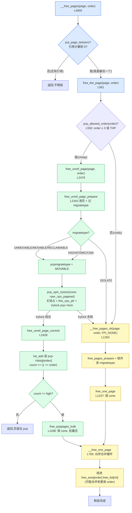

# 第五章 · 释放路径 __free_pages + per-cpu pageset

> 篇:P1 buddy 伙伴系统
> 主线呼应:上一章我们把分配侧的快慢路径拆透了——一次 `alloc_pages()` 的绝大多数走快路径,只查水位、`rmqueue`,而且 order-0 连 zone 锁都不碰,直接从**当前 CPU 的 per-cpu pageset(pcp)**里 pop 一页。这一章讲它的对称镜像:**释放**。一次 `__free_pages()` 释放一页,绝大多数也走快路径——order-0 页先进**当前 CPU 的 pcp 热页缓存**(无锁,只动本 CPU),攒够或内存紧张了,再批量 `free_pcppages_bulk` 一次还一批给 buddy 的 `free_area`,顺带做伙伴合并。**释放侧的 per-cpu pageset,是整个 buddy 在 SMP 上能扛得住锁竞争的另一根支柱**——和分配侧的 pcp 一起,把 99% 的单页操作彻底移出 zone 锁。

## 核心问题

**释放一页怎么和伙伴合并回去?为什么释放也要快路径?——per-cpu pageset:每个 CPU、每个 zone 一份热页缓存,释放的 order-0 页先进 pcp(只动本 CPU 数据,绕开 zone->lock),攒到 `high` 就批量还一批(`batch` 个)给 buddy 的 `free_area`,把 N 次锁压成 1 次。这是分配侧 per-cpu 快路径的对称镜像,也是 buddy 抗 zone 锁风暴的关键。**

读完本章你会明白:

1. `__free_pages` 的完整入口链:`__free_pages`(L4655)→ `free_the_page`(L561)→ 按 order 分流:`pcp_allowed_order` 过的走 `free_unref_page`(进 pcp),其余走 `__free_pages_ok`(直接进 buddy)。
2. **per-cpu pageset 的数据结构**:`struct per_cpu_pages`(`count`/`high`/`batch`/`lists[NR_PCP_LISTS]`),每 CPU、每 zone 一份,挂在 `zone->per_cpu_pageset`。
3. **释放的快路径** `free_unref_page` → `free_unref_page_commit`:把页 `list_add` 进当前 CPU 的 `pcp->lists[]`、`count++`,只在 `count >= high` 时才批量 `free_pcppages_bulk` 还给 buddy。
4. **为什么"只碰本 CPU 数据"是 sound 的**:`pcpu_task_pin` = `preempt_disable` + `this_cpu_ptr` + `spin_trylock(&pcp->lock)`;本 CPU 不会跑到别的 CPU 的 pcp,抢占被关,中断已 trylock 让路——释放的并发安全不靠 zone 锁,靠"CPU 亲和 + 关抢占 + 一把 pcp 自旋锁"。
5. **批量归还** `free_pcppages_bulk`:一次拿 zone 锁、还多页、对每页调 `__free_one_page` 做伙伴合并——把 N 次 zone 锁的开销**摊薄**成 1 次。

> **逃生阀**:本章源码函数看起来不少(`__free_pages`/`free_the_page`/`free_unref_page`/`free_unref_page_commit`/`free_pcppages_bulk`/`__free_one_page`/`free_one_page`/`__free_pages_ok`),但主线只有两条——**order 分流**(走 pcp 还是不走)+ **pcp 的攒/放机制**(攒到 high 批量还)。所有函数都在为这两条服务。任何时候迷路,回到这张分流图:"释放一页,先看 order;order 小的进 pcp,攒够一批再还 buddy;order 大的直接进 buddy 合并"。

---

## 5.1 一句话点破

> **释放一页和分配一页是对偶——分配侧有 per-cpu pageset 让 order-0 不锁 zone,释放侧也有同一个 per-cpu pageset 让 order-0 释放不锁 zone。释放的页先进本 CPU 的 pcp 热页缓存(无锁-ish:关抢占 + trylock 本 CPU 的 pcp->lock),等攒到 `high` 才批量 `free_pcppages_bulk` 还给 buddy。这把"每次释放都拿 zone 锁"压成了"攒一批才拿一次 zone 锁",是 buddy 在多核上能扛住释放风暴的核心设计。**

这是结论,不是理由。本章倒过来拆:先看为什么"每次释放都锁 zone"会撞墙;再看 pcp 数据结构长什么样、为什么"只碰本 CPU 数据"就 sound;然后落到 `free_unref_page`/`free_unref_page_commit`/`free_pcppages_bulk` 的源码;最后讲 order>0 的释放为什么不走 pcp、直接 `__free_one_page` 合并伙伴。

---

## 5.2 入口:从 `__free_pages` 到 `free_the_page`

先定位入口。和分配侧的 `__alloc_pages` 对称,所有页释放最终都汇到 [`__free_pages`](../linux/mm/page_alloc.c#L4655):

```c
// mm/page_alloc.c#L4655-L4666
void __free_pages(struct page *page, unsigned int order)
{
    /* get PageHead before we drop reference */
    int head = PageHead(page);

    if (put_page_testzero(page))              // 引用计数 -1,到 0 才真释放
        free_the_page(page, order);
    else if (!head)
        while (order-- > 0)
            free_the_page(page + (1 << order), order);
}
EXPORT_SYMBOL(__free_pages);
```

`__free_pages` 做的第一件事是 [`put_page_testzero`](../linux/include/linux/mm.h)(对 `page->_refcount` 做 `atomic_dec_and_test`)——**引用计数减 1,只有到 0 才真正释放**。这是 mm 的基本约定:一个页可以被多个使用者共享(比如 fork 后的 COW 页、`get_user_pages` 钉住的页),每次 `get_page` 计数 +1,每次 `put_page` 计数 -1,**只有最后一个使用者 put 到 0,才允许释放**。所以你看到 `__free_pages` 不是"调一次就释放",而是"调一次只是 put 一次,真释放要看计数"。

> **钉死这件事**:`__free_pages` 的语义不是"释放这页",而是"**放弃一次这页的引用**;如果我是最后一个(`put_page_testzero` 返回真),才真释放"。这和用户态 `free` 不一样——用户态 `free` 一调就交还(用户态分配器自己管 free list);内核的页是共享的,释放要看引用计数。后面 rmap(P4-15)、`get_user_pages`(P4-15)都建立在这个计数上。

到 0 之后,真正的释放委托给 [`free_the_page`](../linux/mm/page_alloc.c#L561):

```c
// mm/page_alloc.c#L561-L567
static inline void free_the_page(struct page *page, unsigned int order)
{
    if (pcp_allowed_order(order))     /* Via pcp? */
        free_unref_page(page, order);
    else
        __free_pages_ok(page, order, FPI_NONE);
}
```

`free_the_page` 是释放路径的**第一个分叉**:走 pcp,还是不走?判定的准星是 [`pcp_allowed_order`](../linux/mm/page_alloc.c#L550):

```c
// mm/page_alloc.c#L550-L559
static inline bool pcp_allowed_order(unsigned int order)
{
    if (order <= PAGE_ALLOC_COSTLY_ORDER)        // order <= 3 (即 ≤ 8 页)
        return true;
#ifdef CONFIG_TRANSPARENT_HUGEPAGE
    if (order == pageblock_order)                // THP 的 order(常 = 9,512 页)
        return true;
#endif
    return false;
}
```

这个判定和上一章分配侧 `rmqueue` 里用的**完全相同**(同一个函数,见 P1-04 的 [page_alloc.c:2891](../linux/mm/page_alloc.c#L2891))——**这是一对对称的分流**:分配时,`pcp_allowed_order(order)` 为真的 order 走 `rmqueue_pcplist` 从 pcp 取;释放时,同样的 order 走 `free_unref_page` 把页放进 pcp。`order ≤ 3`(8 页,32KB)是"cheap" 分配的边界——再大就不走 pcp 了,因为大块在 pcp 里缓存既占地方又难以及时合并,反而有害。

注意 THP(`order == pageblock_order`)是个特例:它虽然 order 很大(常 9,2MB),但因为是"批量分配的大页",内核允许它在 pcp 里缓存一条专门的链(下面 5.3 讲 `NR_PCP_THP`),保证 THP 的分配/释放也享受无锁快路径。

> **所以这样设计**:`free_the_page` 一开始就用 `pcp_allowed_order` 把释放**分流**:cheap 的(order ≤ 3 + THP)进 pcp 无锁快路径,costly 的高阶(order 4~9 非 THP)直接 `__free_pages_ok` → `free_one_page` → `__free_one_page`,锁 zone 做伙伴合并。**这个分流和分配侧严丝合缝对齐**——分配时什么 order 从 pcp 取,释放时同样的 order 进 pcp,保证 pcp 进出平衡。

`else` 分支里的 [`__free_pages_ok`](../linux/mm/page_alloc.c#L1263) 做的是"直接进 buddy"的活:先 `free_pages_prepare`(清页状态、释放关联资源),再 [`free_one_page`](../linux/mm/page_alloc.c#L1247)(锁 zone → `__free_one_page` 合并伙伴 → 解锁)。这条路的灵魂 `__free_one_page` 我们在 5.6 拆。本章主线先讲第一条路——pcp。

---

## 5.3 per-cpu pageset 长什么样

进入 `free_unref_page` 之前,先把它的"工作台"——`per_cpu_pages` 看清楚。这是整个机制的地基。

### 数据结构:`struct per_cpu_pages`

每个 zone 有一个 `per_cpu_pageset` 字段([mmzone.h:846](../linux/include/linux/mmzone.h#L846)),它是 `__percpu` 的——**每个 CPU 各一份**:

```c
// include/linux/mmzone.h#L846
struct zone {
    ...
    struct per_cpu_pages  __percpu *per_cpu_pageset;   // 每 CPU 一份
    ...
};
```

`per_cpu_pages` 自己的定义在 [mmzone.h:687](../linux/include/linux/mmzone.h#L687):

```c
// include/linux/mmzone.h#L687-L703
struct per_cpu_pages {
    spinlock_t     lock;          /* 保护 lists 字段 */
    int            count;         /* 链上当前页数(所有 lists 汇总) */
    int            high;          /* 高水位:超过就要批量还给 buddy */
    int            high_min;      /* high 的下限(动态调参用) */
    int            high_max;      /* high 的上限(动态调参用) */
    int            batch;         /* 批量大小:每次 add/remove chunk */
    u8             flags;         /* PCPF_* 标志,见下 */
    u8             alloc_factor;  /* 分配批的缩放因子 */
#ifdef CONFIG_NUMA
    u8             expire;        /* 远程 pageset 过期计数 */
#endif
    short          free_count;    /* 连续释放计数(动态调 batch 用) */

    /* 一组链,按 migratetype × order 分 */
    struct list_head lists[NR_PCP_LISTS];
} ____cacheline_aligned_in_smp;
```

几个字段是核心,务必记牢:

| 字段 | 含义 | 谁改它 |
|---|---|---|
| `lock` | **本 CPU 的 pcp 自旋锁**(注意:不是 zone->lock!) | 释放/分配/排空时关 |
| `count` | 本 CPU pcp 上**所有** list 汇总的页数 | 释放 +、分配 -、批量归还 - |
| `high` | 高水位:`count >= high` 就触发批量归还 | 动态调参(见 5.5) |
| `batch` | 批量大小:一次还/取多少页 | 启动时按 zone 大小算(见 5.5) |
| `lists[NR_PCP_LISTS]` | 按 (migratetype, order) 分的若干条单向链 | `list_add` 进、`list_first_entry` 出 |

### `NR_PCP_LISTS`:为什么 pcp 也有多条链

[`NR_PCP_LISTS`](../linux/include/linux/mmzone.h#L665) 的定义揭示了 pcp 的链组织:

```c
// include/linux/mmzone.h#L664-L665
#define NR_LOWORDER_PCP_LISTS  (MIGRATE_PCPTYPES * (PAGE_ALLOC_COSTLY_ORDER + 1))
#define NR_PCP_LISTS           (NR_LOWORDER_PCP_LISTS + NR_PCP_THP)
```

也就是说 pcp 有 **(migratetype 数 × 低阶 order 数) + THP 专属 1 条** 这么多条链。`MIGRATE_PCPTYPES = 3`(UNMOVABLE、MOVABLE、RECLAIMABLE,见 [mmzone.h:52](../linux/include/linux/mmzone.h#L52)),`PAGE_ALLOC_COSTLY_ORDER = 3`,所以 `NR_LOWORDER_PCP_LISTS = 3 × 4 = 12` 条,再加 THP 的 1 条(开了 THP 时),共 **12 或 13 条链**。

为什么分这么多条?两个原因:

1. **按 migratetype 分**:释放时页有自己的 migratetype(MOVABLE/UNMOVABLE/RECLAIMABLE),分配时也要按 migratetype 取——分开存才能按类型精准取回,不污染抗碎片的布局(第 6 章 P1-06 详讲 migrate types)。
2. **按 order 分**:虽然 pcp 主要缓存 order-0,但也允许 cheap 高阶(order 1~3)和 THP(order 9)进 pcp,这些不同大小的页要分链存,不然取一页还得遍历。

(migratetype, order) → 链下标的换算用 [`order_to_pindex`](../linux/mm/page_alloc.c#L522) / [`pindex_to_order`](../linux/mm/page_alloc.c#L536):

```c
// mm/page_alloc.c#L522-L534(简化示意)
static inline unsigned int order_to_pindex(int migratetype, unsigned int order)
{
    if (order > PAGE_ALLOC_COSTLY_ORDER) {       // THP 的大 order
        return NR_LOWORDER_PCP_LISTS;            // 走专属的最后一格
    }
    return (MIGRATE_PCPTYPES * order) + migratetype;   // 二维 → 一维
}
```

`pindex = 3 × order + migratetype`——一个一维数组表达二维表,这是非常常规的展平。你可以把 pcp 的 `lists[]` 想成一张二维表:

```
                migratetype →
                UNMOVABLE(0)  MOVABLE(1)   RECLAIMABLE(2)
   order 0:        [0]           [1]           [2]        ← 单页,3 条链
   order 1:        [3]           [4]           [5]        ← 2 页,3 条链
   order 2:        [6]           [7]           [8]        ← 4 页,3 条链
   order 3:        [9]           [10]          [11]       ← 8 页,3 条链
   order 9 (THP):                              [12]       ← 专属一格(开了 THP 才有)

   NR_PCP_LISTS = 3 × 4 + (1 if THP) = 12 或 13 条链
```

### 全局视图:每 CPU × 每 zone 一份

把 pcp 放回全局看,它是一张"二维网格":**每个 CPU、每个 zone 各一份 `per_cpu_pages`**。一台 64 核、每 node 4 个 zone(DMA/DMA32/NORMAL/HIGHMEM/MOVABLE 之类)、2 个 NUMA node 的机器,pcp 实例数 = 64 × 4(粗算) = 256 份。每份独立 `lock`/`count`/`high`/`batch`/`lists[]`。

```
                    ZONE_DMA   ZONE_DMA32   ZONE_NORMAL   ZONE_MOVABLE
                  ┌──────────┬────────────┬──────────────┬─────────────┐
   CPU 0          │ pcp[0,0] │ pcp[0,1]   │ pcp[0,2]     │ pcp[0,3]    │  ← 每个 pcp 一把 lock
   CPU 1          │ pcp[1,0] │ pcp[1,1]   │ pcp[1,2]     │ pcp[1,3]    │     互不干扰
   ...            │ ...      │ ...        │ ...          │ ...         │
   CPU 63         │ pcp[63,0]│ pcp[63,1]  │ pcp[63,2]    │ pcp[63,3]   │
                  └──────────┴────────────┴──────────────┴─────────────┘

   释放:CPU N 释放一页 → 进 pcp[N, zone(page)] → 只动这一格,不碰 zone->lock
   分配:CPU N 分配一页 → 从 pcp[N, preferred_zone] 取 → 同样不碰 zone->lock
```

关键观察:**任意两个不同的 CPU,释放/分配 order-0 页时碰的是完全不同的 `per_cpu_pages` 实例**,所以它们之间**没有共享锁、没有共享 cacheline**(注意 `____cacheline_aligned_in_smp` 让每个 pcp 占自己的缓存行,避免 false sharing)。这就是 pcp 在多核上能扛住释放/分配风暴的物理基础。

> **钉死这件事**:pcp 不是"一个全局缓存",而是"**每 CPU、每 zone 一份的本地缓存**"。它把"释放/分配 order-0 页"这个高频操作,从"全局 zone 锁"降级为"本 CPU 的本地数据操作"。一台 N 核机器,N 个 CPU 并发释放页,N 份 pcp 互不干扰——这就是 pcp 的 SMP 可扩展性根。

---

## 5.4 释放的快路径:`free_unref_page` → `free_unref_page_commit`

有了 5.3 的数据结构,我们看真正的释放代码。

### `free_unref_page`:分流 + 选 pcp + 提交

[`free_unref_page`](../linux/mm/page_alloc.c#L2479) 是 pcp 路径的入口:

```c
// mm/page_alloc.c#L2479-L2516(简化示意,保留主干)
void free_unref_page(struct page *page, unsigned int order)
{
    unsigned long __maybe_unused UP_flags;
    struct per_cpu_pages *pcp;
    struct zone *zone;
    unsigned long pfn = page_to_pfn(page);
    int migratetype, pcpmigratetype;

    if (!free_unref_page_prepare(page, pfn, order))   // 准备:清页 + 记 migratetype
        return;

    /* pcp 只跟踪 UNMOVABLE/MOVABLE/RECLAIMABLE 三类;ISOLATE 直接进 buddy */
    migratetype = pcpmigratetype = get_pcppage_migratetype(page);
    if (unlikely(migratetype >= MIGRATE_PCPTYPES)) {
        if (unlikely(is_migrate_isolate(migratetype))) {
            free_one_page(page_zone(page), page, pfn, order, migratetype, FPI_NONE);
            return;                                    // ISOLATE 页不进 pcp
        }
        pcpmigratetype = MIGRATE_MOVABLE;              // HIGHATOMIC/CMA 当 MOVABLE 存
    }

    zone = page_zone(page);
    pcp_trylock_prepare(UP_flags);
    pcp = pcp_spin_trylock(zone->per_cpu_pageset);     // 关抢占 + 拿本 CPU 的 pcp->lock
    if (pcp) {
        free_unref_page_commit(zone, pcp, page, pcpmigratetype, order);
        pcp_spin_unlock(pcp);
    } else {
        free_one_page(zone, page, pfn, order, migratetype, FPI_NONE);  // trylock 失败回退
    }
    pcp_trylock_finish(UP_flags);
}
```

这里有几个关键设计点:

**(1) 准备阶段** [`free_unref_page_prepare`](../linux/mm/page_alloc.c#L2342) 做两件事:一是调 `free_pages_prepare`(清页的 PG_dirty/PG_locked 等标志、释放页关联的内核资源如 slab 元数据),二是读出页的 migratetype 存进 `page->index`(通过 `set_pcppage_migratetype`)。**这两件事都无需持锁**——是释放的"前置清理"。

**(2) migratetype 过滤**:pcp 只认三种 migratetype(UNMOVABLE/MOVABLE/RECLAIMABLE)。特殊类型:

- `MIGRATE_ISOLATE`(被 offlining 的页)——直接 `free_one_page` 进 buddy,不进 pcp(注释明说:"place ISOLATE pages on the isolated list because they are being offlined")。
- `MIGRATE_HIGHATOMIC`/`MIGRATE_CMA`——**当作 MOVABLE 存进 pcp**(注释:"treat HIGHATOMIC and CMA as movable pages so we can get those areas back if necessary")。这样既能享受 pcp 加速,又能在需要时通过排空 pcp 把这些页要回来。

**(3) 关键的 `pcp_spin_trylock`**——这是 pcp"无锁快路径"的真相,下一节专门拆。

**(4) trylock 失败的回退**:如果拿不到 pcp->lock(可能正被中断里的释放路径占着,或排空在跑),`free_unref_page` **不忙等**——直接走 `free_one_page`(锁 zone 进 buddy)。这是"快路径拿不到就退到慢路径"的典型设计,保证释放**永远不空转、不死锁**。

### `pcp_spin_trylock`:为什么"只碰本 CPU 数据"是 sound 的

这是本章最硬核的并发点。`pcp_spin_trylock` 的定义在 [page_alloc.c:159](../linux/mm/page_alloc.c#L159),它依赖一组宏 [page_alloc.c:116-163](../linux/mm/page_alloc.c#L116):

```c
// mm/page_alloc.c#L116-L122(简化)
#ifndef CONFIG_PREEMPT_RT
#define pcpu_task_pin()     preempt_disable()     // 关抢占
#define pcpu_task_unpin()   preempt_enable()
#else
#define pcpu_task_pin()     migrate_disable()     // RT 用迁移禁用
#define pcpu_task_unpin()   migrate_enable()
#endif

// mm/page_alloc.c#L128-L147(简化示意)
#define pcpu_spin_lock(type, member, ptr) ({
    type *_ret;
    pcpu_task_pin();                              // (a) 关抢占
    _ret = this_cpu_ptr(ptr);                     // (b) 取本 CPU 的实例
    spin_lock(&_ret->member);                     // (c) 锁它的 lock
    _ret;
})

#define pcp_spin_trylock(ptr)  pcpu_spin_trylock(struct per_cpu_pages, lock, ptr)
```

`pcp_spin_trylock` 做三件事:

- **(a) `preempt_disable()`**:关掉抢占。这一刻起,当前代码不会被打断然后切到别的 CPU 上去跑。
- **(b) `this_cpu_ptr(zone->per_cpu_pageset)`**:取**当前 CPU** 的 `per_cpu_pages` 实例的地址。per-cpu 变量靠段寄存器(gs/base)+ 偏移寻址,不触碰任何共享内存。
- **(c) `spin_trylock(&pcp->lock)`**:尝试拿这一份 pcp 的自旋锁。注意——**这把锁只有当前 CPU 上的代码会来抢**(同一 CPU 上的中断释放、排空路径),跨 CPU 不抢。

为什么这套是 sound 的?

1. **`this_cpu_ptr` 取的是当前 CPU 的实例,不会被别的 CPU 改**。per-cpu 变量在 SMP 上的语义保证:每 CPU 看到的是自己的副本,`this_cpu_ptr` 是原子的(不靠锁,靠 gs 段寻址)。
2. **`preempt_disable` 把"取指针 + 操作数据"包成一个不可分割的临界区**。没有抢占,代码不会中途被调度到别的 CPU——也就不会"在 CPU 0 取了 pcp[0],却被调度到 CPU 1 去 list_add",这种错乱不可能。
3. **`pcp->lock` 只防同一 CPU 上的中断重入**。在同一 CPU 上,释放路径可能在进程上下文(`kfree`、缺页回收),也可能在中断上下文(网卡收包后释放 skb 的页)。它们都会碰同一份 pcp,所以需要一把自旋锁把中断重入挡住。**跨 CPU 不需要——别的 CPU 碰的是它自己的 pcp,不会来抢我这把锁**。

这就解释了 pcp 的精妙:**它不是"无锁",而是"锁的粒度缩到了本 CPU"**。锁的范围从"全系统的 zone"(zone->lock)缩小到"仅本 CPU 上的这一份 pcp"——别的 CPU 根本不来抢这把锁,锁竞争的来源被结构性消除了。

> **不这样会怎样**:假设不引入 pcp,每次释放 order-0 页都直接 `free_one_page`(锁 zone):

```c
// 反面:没有 pcp,每次释放都锁 zone(非源码)
void naive_free(struct page *page) {
    spin_lock(&zone->lock);                    // 全系统共享的 zone 锁
    __free_one_page(page, ..., 0, mt, FPI_NONE);
    spin_unlock(&zone->lock);
}
```

后果:

1. **多核释放风暴下 zone->lock 成瓶颈**。一台 64 核机器,每秒每个 CPU 可能释放几万次页(网络收包、slab 回收、缺页取消)。**64 个 CPU 全挤在一把 zone->lock 上**,cacheline 在核间弹来弹去,锁等待队列暴涨。本该纳秒级的释放,被锁竞争拖到微秒级。
2. **伙伴合并的小操作被放大成全局序列化**。其实释放 order-0 未必能合并(伙伴不一定空闲),但朴素方案每次都得拿 zone 锁查——查完发现不能合,锁开销全浪费了。

引入 pcp 之后:释放 order-0 **99% 不碰 zone->lock**(只碰本 CPU 的 pcp->lock,无人争抢),只在 `count >= high` 时才批量还 buddy(那时才拿一次 zone 锁,还的是 batch 个页)。**锁开销被摊薄到 1/batch**。这是 pcp 的全部价值。

### `free_unref_page_commit`:真正干活的函数

拿到 pcp 锁后,进入 [`free_unref_page_commit`](../linux/mm/page_alloc.c#L2428):

```c
// mm/page_alloc.c#L2428-L2474(简化示意,保留主干)
static void free_unref_page_commit(struct zone *zone, struct per_cpu_pages *pcp,
                                   struct page *page, int migratetype,
                                   unsigned int order)
{
    int high, batch;
    int pindex;
    bool free_high = false;

    pcp->alloc_factor >>= 1;                         // 分配侧缩放因子衰减
    __count_vm_events(PGFREE, 1 << order);           // vmstat 计账
    pindex = order_to_pindex(migratetype, order);    // 算出该进哪条 list
    list_add(&page->pcp_list, &pcp->lists[pindex]);  // ★ 挂进本 CPU 的 pcp 链
    pcp->count += 1 << order;                        // ★ 计数累加

    batch = READ_ONCE(pcp->batch);

    /* 高阶页在 pcp 里不宜过多,触发 free_high 标志降低 high */
    if (order && order <= PAGE_ALLOC_COSTLY_ORDER) {
        free_high = (pcp->free_count >= batch &&
                     (pcp->flags & PCPF_PREV_FREE_HIGH_ORDER) && ...);
        pcp->flags |= PCPF_PREV_FREE_HIGH_ORDER;
    }

    if (pcp->free_count < (batch << CONFIG_PCP_BATCH_SCALE_MAX))
        pcp->free_count += (1 << order);             // 记录连续释放计数

    high = nr_pcp_high(pcp, zone, batch, free_high); // 动态算 high
    if (pcp->count >= high) {                        // ★ 攒够了!
        free_pcppages_bulk(zone, nr_pcp_free(pcp, batch, high, free_high),
                           pcp, pindex);             // 批量还 buddy
        if (test_bit(ZONE_BELOW_HIGH, &zone->flags) &&
            zone_watermark_ok(zone, 0, high_wmark_pages(zone),
                              ZONE_MOVABLE, 0))
            clear_bit(ZONE_BELOW_HIGH, &zone->flags);
    }
}
```

核心就两步:

1. **`list_add` + `count +=`**:把页挂进 pcp 的对应 list,计数加。**这一步无 zone 锁**——只动本 CPU 数据。
2. **判定 `count >= high`**:攒够了,就调 `free_pcppages_bulk` 批量还 buddy;没攒够,函数就返回了——这次释放到此为止,页**留在 pcp**里,等下一次释放来凑数。

注意 `list_add(&page->pcp_list, ...)` 用的是 `page->pcp_list` 这个字段——`struct page` 用 `union` 复用(见 P1-02 讲的紧凑布局):一个页在 buddy 的 `free_area` 里用 `buddy_list` 挂,在 pcp 里用 `pcp_list` 挂,两者不会同时发生,所以共用同一段内存。

还有几个小巧思:

- **`pcp->alloc_factor >>= 1`**:释放时把"分配缩放因子"减半。这是和分配侧(`nr_pcp_alloc` 里 alloc_factor 累加)配对的——释放多了,下次分配的批量就小一点;反之分配多了,释放的批量也调整。两者动态平衡,避免 pcp 在"全分配"或"全释放"工作负载下偏向一方。
- **`free_high` 标志**:如果连续释放大量高阶页(order 1~3,不是 THP),pcp 会主动降低 high(见 `nr_pcp_high` 的 `free_high` 分支),让这些高阶页尽快还回 buddy——**因为高阶页囤在 pcp 里会妨碍 buddy 的伙伴合并,加剧碎片**(注释:"high-order pages other than THP's stored on PCP can contribute to fragmentation")。THP 例外,因为 THP 本就是要从 pcp 快速再分配出去的。
- **`ZONE_BELOW_HIGH` 清除**:批量归还后如果 zone 水位回到了 high 以上,清除 `ZONE_BELOW_HIGH` 标志——这是和 kswapd/回收路径的联动(第 16 章详讲)。

### 一句话总结这条快路径

**`free_unref_page_commit` 的 95% 工作量就是一次 `list_add` + `count++`**——纳秒级,无 zone 锁,只碰本 CPU 数据。剩下 5% 是 `count >= high` 时的批量归还,把攒下的页一次倒给 buddy。这就是"释放也要快路径"的全部含义。

---

## 5.5 high / batch:攒多少、还多少

pcp 有两个核心参数:`high`(什么时候还)和 `batch`(一次还多少)。它们的取值决定了 pcp 的"脾气"。

### 启动时的初值

启动早期用的是 boot pageset([page_alloc.c:5239](../linux/mm/page_alloc.c#L5239)),它的 high/batch 是固定的极小值:

```c
// mm/page_alloc.c#L5237-L5238
#define BOOT_PAGESET_HIGH   0
#define BOOT_PAGESET_BATCH  1
```

也就是说**启动时 pcp 的 high=0**——任何释放都立刻触发批量归还(其实就还 1 个),pcp 形同虚设。这是因为启动早期内存还紧、还没建好完整的 zone 信息,不适合囤页。等系统跑起来、zone 大小确定后,[`zone_set_pageset_high_and_batch`](../linux/mm/page_alloc.c#L5529) 会重算每 zone 的 high/batch,写进每 CPU 的 pcp。

### `zone_batchsize`:batch 怎么算

[`zone_batchsize`](../linux/mm/page_alloc.c#L5367) 给出了 batch 的算法,源码注释写得非常清楚:

```c
// mm/page_alloc.c#L5367-L5396(简化示意)
static int zone_batchsize(struct zone *zone)
{
    int batch;

    /*
     * The number of pages to batch allocate is either ~0.1%
     * of the zone or 1MB, whichever is smaller. The batch
     * size is striking a balance between allocation latency
     * and zone lock contention.
     */
    batch = min(zone_managed_pages(zone) >> 10, SZ_1M / PAGE_SIZE);  // ~0.1% zone 或 256 页
    batch /= 4;
    if (batch < 1)
        batch = 1;

    /* clamp 到 2^n - 1(避免 2^n 引起 cache aliasing) */
    batch = rounddown_pow_of_two(batch + batch/2) - 1;

    return batch;
}
```

核心思想——**batch 是"分配延迟"和"zone 锁竞争"的平衡**:

- batch 太小:pcp 很快就满,频繁批量归还,zone 锁竞争没摊薄多少。
- batch 太大:pcp 囤页太多,延迟高(页在 pcp 里等 buddy 合并等太久),还可能囤掉 buddy 的合并机会。

内核选的是"zone 的 0.1% 和 256 页(1MB)取小"——典型的 16GB NORMAL zone(batch 算下来约 31)、64GB 的机器(batch 约 63)等等。还有个非常细节的技巧——**clamp 到 `2^n - 1`** 而不是 `2^n`。注释解释:在两个任务交替批量分配的场景下,`2^n` 的 batch 容易让一个任务拿走一半的 page color、另一个拿另一半,**cache aliasing 不均**;`2^n - 1` 破坏了这种对称性,color 分布更均匀。这是 mm 工程师对 cache 微架构的体贴。

### `zone_highsize`:high 怎么算

[`zone_highsize`](../linux/mm/page_alloc.c#L5416) 算 high。high 一般是 batch 的若干倍,并且**还和 CPU 数有关**——CPU 越多的 node,每份 pcp 的 high 越小(否则 N 个 CPU 各囤一份,总和太大)。`percpu_pagelist_high_fraction` 这个 sysctl 可以手动调(默认 0 表示自动)。

还有一套**动态调参**:`nr_pcp_high`([page_alloc.c:2380](../linux/mm/page_alloc.c#L2380))会在运行时根据 `ZONE_RECLAIM_ACTIVE`(回收中)、`ZONE_BELOW_HIGH`(zone 水位低于 high)、连续释放/分配的情况**动态压低或抬高 high**:

- 回收活跃时:压低 high(`pcp->high = max(high - free_count, high_min)`),让 pcp 少囤页,尽快还 buddy 给回收用。
- zone 水位低于 high 时:压低 high,加速回流。
- 连续释放高阶页时:压低 high,避免高阶页囤 pcp 加剧碎片。

这套动态逻辑让 pcp **不是死参数**,而是能配合系统状态自适应。细节读 [`nr_pcp_high`](../linux/mm/page_alloc.c#L2380) 和 [`nr_pcp_free`](../linux/mm/page_alloc.c#L2355) 的源码和注释。

> **钉死这件事**:`high`/`batch` 不是写死的常量,而是**按 zone 大小算 + 运行时动态调**。batch 平衡"延迟 vs 锁竞争",high 平衡"pcp 缓存命中 vs buddy 合并机会"。pcp 的所有"怪脾气"(高阶页要尽快还、回收时压低 high)都是这两个参数的动态调节在起作用。

---

## 5.6 批量归还:`free_pcppages_bulk` + `__free_one_page`

pcp 攒到 `count >= high` 就要批量还。这是 pcp 把"很多次小释放"压成"一次大归还"的地方。

### `free_pcppages_bulk`:一次锁 zone,还一整圈

[`free_pcppages_bulk`](../linux/mm/page_alloc.c#L1188) 是批量归还的核心:

```c
// mm/page_alloc.c#L1188-L1245(简化示意,保留主干)
static void free_pcppages_bulk(struct zone *zone, int count,
                               struct per_cpu_pages *pcp, int pindex)
{
    unsigned long flags;
    unsigned int order;
    bool isolated_pageblocks;
    struct page *page;

    count = min(pcp->count, count);             // 不超过 pcp 实际有的
    pindex = pindex - 1;                        // 从"刚释放进去的那条"的下一条开始

    spin_lock_irqsave(&zone->lock, flags);      // ★ 拿 zone 锁(一次性)
    isolated_pageblocks = has_isolate_pageblock(zone);

    while (count > 0) {
        struct list_head *list;
        int nr_pages;

        /* 轮转扫所有 pcp 链,跳过空链 */
        do {
            if (++pindex > NR_PCP_LISTS - 1)
                pindex = 0;                      // 回卷
            list = &pcp->lists[pindex];
        } while (list_empty(list));

        order = pindex_to_order(pindex);
        nr_pages = 1 << order;
        do {
            int mt;

            page = list_last_entry(list, struct page, pcp_list);
            mt = get_pcppage_migratetype(page);

            list_del(&page->pcp_list);           // 从 pcp 摘下
            count -= nr_pages;
            pcp->count -= nr_pages;

            VM_BUG_ON_PAGE(is_migrate_isolate(mt), page);
            if (unlikely(isolated_pageblocks))
                mt = get_pageblock_migratetype(page);

            __free_one_page(page, page_to_pfn(page), zone, order, mt, FPI_NONE);  // ★ 进 buddy + 合并
        } while (count > 0 && !list_empty(list));
    }

    spin_unlock_irqrestore(&zone->lock, flags);  // ★ 还是把 zone 锁一次
}
```

几个观察:

1. **zone 锁只拿一次**。整个 while 循环都在 `spin_lock_irqsave(&zone->lock, ...)` 之内,还多少页都是这一次锁——**这就是"把 N 次锁压成 1 次"**。如果还 31 页(batch=31),锁开销摊薄到 1/31。
2. **轮转扫所有 pcp 链**。从 `pindex - 1` 开始(也就是"刚释放进去的那条"的下一条),`++pindex` 回卷扫,跳过空链。这样**所有 migratetype/order 的页都有机会被还**,不会偏向某一条链。`pindex - 1` 的用意是"上次刚释放进去的那条优先级最低",避免它一直被优先还掉。
3. **`list_last_entry` 从尾取**。释放时是 `list_add`(进链头),所以尾是最老的页——优先还老的,符合 LRU 的直觉(老的更不可能再被本 CPU 用到)。
4. **每页都调 `__free_one_page`**。摘下 pcp 链、对每页单独调 `__free_one_page`——**这是真正进 buddy free_area、做伙伴合并的地方**(下一节拆)。
5. **`spin_lock_irqsave` 而不是普通 `spin_lock`**:因为批量归还可能在进程上下文被中断打断,save/restore IRQ 避免中断重入。

### `__free_one_page`:伙伴合并的核心

批量归还最终都汇到 [`__free_one_page`](../linux/mm/page_alloc.c#L765)。这是 buddy 释放的原子操作,P1-03 已经拆过它的伙伴合并逻辑,这里只复习关键:

```c
// mm/page_alloc.c#L765-L844(简化示意,保留合并循环主干)
static inline void __free_one_page(struct page *page, unsigned long pfn,
        struct zone *zone, unsigned int order, int migratetype, fpi_t fpi_flags)
{
    unsigned long buddy_pfn = 0;
    unsigned long combined_pfn;
    struct page *buddy;

    while (order < MAX_PAGE_ORDER) {
        /* (1) 找当前页在 order 阶的伙伴 pfn */
        buddy = find_buddy_page_pfn(page, pfn, order, &buddy_pfn);
        if (!buddy)
            goto done_merging;                  // 伙伴不空闲/不存在,停止合并

        /* (2) 大块合并要检查 migratetype 一致性(避免跨 pageblock 误合) */
        if (unlikely(order >= pageblock_order)) {
            int buddy_mt = get_pfnblock_migratetype(buddy, buddy_pfn);
            if (migratetype != buddy_mt && ...)
                goto done_merging;
        }

        /* (3) 伙伴空闲,合并:从 free_area 摘下伙伴,组合 pfn,order++ */
        if (page_is_guard(buddy))
            clear_page_guard(zone, buddy, order, migratetype);
        else
            del_page_from_free_list(buddy, zone, order);
        combined_pfn = buddy_pfn & pfn;        // 父块的 pfn = 两伙伴 pfn 的与
        page = page + (combined_pfn - pfn);
        pfn = combined_pfn;
        order++;                                // 升一阶,继续找上一级的伙伴
    }

done_merging:
    set_buddy_order(page, order);              // 标记 order + PageBuddy
    /* 选头插还是尾插(buddy_merge_likely 优化,见 P1-03) */
    if (to_tail)
        add_to_free_list_tail(page, zone, order, migratetype);
    else
        add_to_free_list(page, zone, order, migratetype);

    if (!(fpi_flags & FPI_SKIP_REPORT_NOTIFY))
        page_reporting_notify_free(order);     // 通知页报告子系统(guest free hint)
}
```

**伙伴合并的灵魂是那行异或**——[`__find_buddy_pfn`](../linux/mm/internal.h#L435):

```c
// mm/internal.h#L434-L438
static inline unsigned long
__find_buddy_pfn(unsigned long page_pfn, unsigned int order)
{
    return page_pfn ^ (1 << order);    // ★ 翻转第 order 位 = 伙伴 pfn
}
```

给定一个页的 pfn 和它的 order,伙伴的 pfn 就是 `pfn ^ (1 << order)`——一次异或,O(1)。这一行是整个 buddy 算法抗碎片能力的根,P1-03 已详讲。这里你只需要记住:**`__free_one_page` 拿着这页一直往上合并,直到找不到空闲伙伴为止,然后把最终的大块挂进 `free_area[order]` 的对应 `free_list[migratetype]`**。

### `__free_one_page` 必须在 zone 锁内

注意 `__free_one_page` 本身**不锁 zone**——它是"裸"的合并原语。调用它的地方负责锁:

- `free_pcppages_bulk`:外面套 `spin_lock_irqsave(&zone->lock, ...)`(L1206)。
- `free_one_page`([L1247](../linux/mm/page_alloc.c#L1247)):自己锁 zone,然后调 `__free_one_page`。
- `__free_pages_ok`([L1263](../linux/mm/page_alloc.c#L1263)):通过 `free_one_page` 间接锁。

**为什么 `__free_one_page` 必须在 zone 锁内?** 因为它读写 `free_area[]`(`del_page_from_free_list`/`add_to_free_list`),这些是**全 zone 共享**的数据。多个 CPU 同时合并伙伴、改 `free_area`,必须序列化。zone 锁就是干这个的。

这就是 pcp 的全部价值所在——**它让绝大多数释放根本进不到 `__free_one_page`,从而绕开了 zone 锁**。只有批量归还(以及高阶直接释放)时才进 zone 锁,而且一次锁还一大批。

---

## 5.7 order > 0 的释放:不走 pcp,直接合并

前面讲了 order-0(和 cheap 高阶)走 pcp。那 order > `PAGE_ALLOC_COSTLY_ORDER`(= 3)的释放呢?它们走 `free_the_page` 的 else 分支:

```c
// mm/page_alloc.c#L561-L567
static inline void free_the_page(struct page *page, unsigned int order)
{
    if (pcp_allowed_order(order))
        free_unref_page(page, order);          // cheap:进 pcp
    else
        __free_pages_ok(page, order, FPI_NONE); // costly:直接进 buddy
}
```

[`__free_pages_ok`](../linux/mm/page_alloc.c#L1263) 做的是"直接进 buddy"——不走 pcp:

```c
// mm/page_alloc.c#L1263-L1283(简化示意)
static void __free_pages_ok(struct page *page, unsigned int order, fpi_t fpi_flags)
{
    int migratetype;
    unsigned long pfn = page_to_pfn(page);
    struct zone *zone = page_zone(page);

    if (!free_pages_prepare(page, order))
        return;

    /* 锁外先读 migratetype,缩短锁内时间 */
    migratetype = get_pfnblock_migratetype(page, pfn);

    free_one_page(zone, page, pfn, order, migratetype, fpi_flags);  // 锁 zone + __free_one_page

    __count_vm_events(PGFREE, 1 << order);
}
```

注意一个细节——`get_pfnblock_migratetype` **故意放在锁外**。注释明说([L1273-L1277](../linux/mm/page_alloc.c#L1273)):"Calling get_pfnblock_migratetype() without spin_lock_irqsave() here is used to avoid calling get_pfnblock_migratetype() under the lock. This will reduce the lock holding time."——**把能挪到锁外的都挪出去,缩短 zone 锁的临界区**。这是 mm 对热路径锁开销的极致控制。

### 为什么高阶不走 pcp

为什么不所有 order 都走 pcp?三个原因:

1. **高阶页在 pcp 里囤着妨碍合并**。pcp 里的页是"散"的——它们不和 buddy 的 free_area 协作,伙伴关系不被追踪。一个 order-4 的块囤在 pcp 里,它的 order-4 伙伴即使空闲也无法和它合并(伙伴在 buddy 的 free_area 里,在 pcp 里的是"隐身"的)。**只有让高阶页尽快回 buddy,合并才能发生**。
2. **高阶释放频率低**。order-0 释放占绝大多数(slab 还页、缺页取消、网络收包),高阶释放 rare(大块 DMA buffer、THP 失败回退)。rare 的操作不值得用 pcp 优化。
3. **pcp 的批量摊薄对高阶意义小**。高阶一次就是几个页,攒 batch 没意义;而 order-0 一秒几万次,摊薄收益巨大。

所以内核的设计是:**pcp 专供 order-0(及 cheap 高阶和 THP),costly 高阶直接进 buddy**。这是对 pcp 角色的精准定位——**它服务高频小释放,不服务低频大释放**。

> **钉死这件事**:pcp 不是"什么释放都接"的通用缓存,而是**专为 order-0 高频释放设计的热页缓存**。order > 3(非 THP)直接走 buddy,这是 pcp 的边界。理解这个边界,你才理解为什么 `pcp_allowed_order` 写得那么精确(`order ≤ 3` 或 `order == pageblock_order`)——它在划"哪些释放值得缓存"。

---

## 5.8 全景流程图:一次 `__free_pages` 的决策树

把上面所有分支串起来,就是这张释放流程图:



这张图有两层意义:

- **横向看(order 分流)**:cheap 走 pcp 绿色路径,costly 走 buddy 黄色路径。两者最后都汇到 `__free_one_page`(黄色),但 cheap 是**攒一批才汇**,costly 是**立刻汇**。
- **纵向看(并发层次)**:绿色路径的锁是 pcp->lock(本 CPU),黄色路径的锁是 zone->lock(全 zone)。pcp 的存在让 95% 的释放停在绿色,只有攒够才下到黄色。

---

## 5.9 排空 pcp:谁、什么时候、为什么

pcp 不是"只进不出"的黑洞——除了 `count >= high` 的常规批量归还,还有几种"强制排空"的路径,它们把 pcp 里的页**主动**倒回 buddy:

### (1) `drain_zone_pages` / `drain_pages_zone`:NUMA 过期 + 显式排空

[`drain_zone_pages`](../linux/mm/page_alloc.c#L2200)(NUMA 用)在远程 pageset 过期时被 vmstat 更新路径调用,排掉 `min(count, batch)` 个页。[`drain_pages_zone`](../linux/mm/page_alloc.c#L2217) 排空指定 CPU、指定 zone 的整个 pcp:

```c
// mm/page_alloc.c#L2217-L2227(简化示意)
static void drain_pages_zone(unsigned int cpu, struct zone *zone)
{
    struct per_cpu_pages *pcp;
    pcp = per_cpu_ptr(zone->per_cpu_pageset, cpu);
    if (pcp->count) {
        spin_lock(&pcp->lock);
        free_pcppages_bulk(zone, pcp->count, pcp, 0);   // 一次全倒空
        spin_unlock(&pcp->lock);
    }
}
```

### (2) `drain_all_pages`:内存紧张时的全系统排空

`drain_all_pages`([page_alloc.c 附近](../linux/mm/page_alloc.c#L2254))在**内存紧张/直接回收**时被调用(上一章 P1-04 慢路径提到过 "drain_all_pages")。它给所有非空的 CPU 发 IPI(或用 workqueue),让每个 CPU 把自己的 pcp 排空。**这是"pcp 里囤着的页"被强制吐回 buddy 的兜底机制**——当 buddy 自己都缺页时,pcp 里囤着的几百页是"看得见拿不到"的,必须排空。

排空的代价不小(跨 CPU IPI + 每台 CPU 一次 zone 锁),所以只在需要时触发。`drain_all_pages` 的注释明确写它"optimized to only execute on cpus where pcplists are not empty"——通过 IPI 前先看 pcp->count,空的 CPU 不动。

### (3) `zone_pcp_drain`:offlining / hibernate / dump

offlining 内存页(`memory_hotplug`)、hibernate、kdump 这类场景,需要把 pcp **彻底排空**,因为 pcp 里囤着的页会导致 offlining 失败(页还"在用")。这些路径都会调 `drain_all_pages`,保证 pcp 干净。

### (4) `decay_pcp_high`:vmstat 更新时的周期性衰减 + 排空

[`decay_pcp_high`](../linux/mm/page_alloc.c#L2164) 由 vmstat 计数器更新路径周期性调用,作用是**衰减 pcp->high 并在需要时排空一部分页**([L2176-L2191](../linux/mm/page_alloc.c#L2176))。它的逻辑:`high` 周期性往下调(每次减 `high >> 3`,直到 `high_min`),如果 `count > high` 就 `free_pcppages_bulk` 排掉超出部分。这是"周期性、低频、机会主义"的排空——避免 pcp 囤页太久(尤其在分配/释放都很稀疏的 CPU 上,pcp 里的页可能一直不到 high 触发归还,靠 decay 兜底回流)。

> **钉死这件事**:pcp 不是"攒到 high 才还"这一条出路的单向阀,它有**多条排空路径**:常规的 high 触发、NUMA 过期、内存紧张时的 `drain_all_pages`、offlining/hibernate 的强制排空、vmstat 的周期性排空。这些路径保证 pcp 里的页**最终一定回得去 buddy**,不会成为"内存黑洞"。这是 pcp 设计的 soundness 保证——快路径可以囤页,但兜底机制保证页能被收回。

---

## 5.10 技巧精解:per-cpu pageset 的无锁快路径 + 批量归还摊薄

本章最硬核的两个技巧,单独拆透。

### 技巧一:per-cpu pageset 的"本 CPU 数据 + 关抢占"无锁快路径

**设计动机**:页释放是全系统最热的路径之一(每秒每个 CPU 可能几万次),但绝大多数释放是 order-0(单页)。如果每次都走 buddy(`__free_one_page`),每次都得拿 zone 锁——多核下 zone 锁成为瓶颈。怎么让 99% 的释放**不碰 zone 锁**?

**实现手段**:给每个 CPU、每个 zone 配一份本地缓存(`per_cpu_pages`),释放 order-0 时**只动本 CPU 的 pcp 数据**:

1. `pcp_spin_trylock` = `preempt_disable` + `this_cpu_ptr` + `spin_trylock(&pcp->lock)`。
2. `list_add(&page->pcp_list, &pcp->lists[pindex])` + `pcp->count++`。
3. `pcp_spin_unlock` + `preempt_enable`。

全程**不碰 zone->lock**。只有 `count >= high` 时才下到 `free_pcppages_bulk`(那时才拿 zone 锁,而且一次还一批)。

**反面对比**(如果不用 pcp,每次释放都锁 zone):

```c
// 反面:没有 pcp,每次释放都锁 zone(非源码)
void naive_free(struct page *page) {
    unsigned long flags;
    int mt = get_pfnblock_migratetype(page, pfn);
    spin_lock_irqsave(&zone->lock, flags);      // 每次都锁全 zone!
    __free_one_page(page, pfn, zone, 0, mt, FPI_NONE);
    spin_unlock_irqrestore(&zone->lock, flags);
}
```

这个朴素版本的灾难:

1. **zone 锁竞争**:64 个 CPU 释放页,全挤在一把 `zone->lock` 上。cacheline 在核间弹来弹去,锁等待暴涨。每秒几百万次释放 × 几十纳秒锁开销 = 几十秒 CPU 时间耗在等锁。
2. **`__free_one_page` 每次都查伙伴**:其实大多数释放,伙伴不空闲,不能合并——查了也白查,但锁开销照付。
3. **SMP 不可扩展**:CPU 越多,锁竞争越惨。加核不能加吞吐,反而劣化。

引入 pcp 后:

- 释放 order-0 → `list_add` 进本 CPU pcp(纳秒级,无 zone 锁)。
- pcp 的 `lock` 是**本 CPU 独占**的——别的 CPU 根本不来抢(它们有自己的 pcp)。
- 同一 CPU 内,只防中断重入释放(`spin_trylock` 让中断路径拿不到锁就回退到 `free_one_page`)。

**为什么 sound**(为什么"只碰本 CPU 数据"不会出问题):

1. **per-cpu 变量的硬件语义**:`this_cpu_ptr` 通过段寄存器(gs/base)寻址,每个 CPU 看到自己的副本,这是 per-cpu 子系统的硬件保证,不需要锁。
2. **关抢占保证不可分割**:`preempt_disable` 到 `preempt_enable` 之间,当前代码不会被调度到别的 CPU。所以"取本 CPU 指针 → 操作 pcp 数据"是一个原子序列(对其他 CPU 而言)。
3. **本 CPU 的 pcp 只有本 CPU 的代码会写**:进程上下文释放 + 本 CPU 的中断释放(网卡 RX softirq)——它们都用 `spin_trylock(&pcp->lock)` 互斥。跨 CPU 的访问不存在(别的 CPU 碰自己的 pcp)。
4. **`____cacheline_aligned_in_smp`**:每个 pcp 占自己的 cacheline,避免两个 CPU 的 pcp 落在同一 cacheline 引起 false sharing。
5. **trylock 失败的回退**:中断路径拿不到 pcp->lock(被进程上下文占着),直接走 `free_one_page`(锁 zone)——**永远不忙等、不空转**。这保证了"快路径拿不到就退到慢路径"的无死锁设计。

> **钉死这件事**:pcp 的"无锁快路径"不是真的无锁,而是**把锁的粒度缩到了本 CPU**。它的 soundness 不靠 zone 锁,靠"per-cpu 寻址 + 关抢占 + 本 CPU 自旋锁 + trylock 回退"这套组合拳。这是 mm 在 SMP 上扛得住释放风暴的核心技巧——后面 slab 的 per-cpu partial(P2-08)用的是同一套思路的不同实现。

### 技巧二:批量归还摊薄锁开销 —— 把 N 次锁压成 1 次

**设计动机**:pcp 攒到 `high` 总得还 buddy(否则 pcp 变成内存黑洞,伙伴合并不了)。但还的时候能不能"一次还一个、一次锁一次"?显然不能——那就把 pcp 的好处全还回去了。怎么还最划算?

**实现手段**:`free_pcppages_bulk` 一次拿 zone 锁,在锁内 while 循环还一大批页:

```c
// mm/page_alloc.c#L1206-L1244(简化示意)
spin_lock_irqsave(&zone->lock, flags);        // ★ 一次锁
while (count > 0) {
    /* 轮转选一条非空 pcp 链 */
    do { ... pindex = ...; list = &pcp->lists[pindex]; } while (list_empty(list));

    order = pindex_to_order(pindex);
    nr_pages = 1 << order;
    do {
        page = list_last_entry(list, struct page, pcp_list);
        mt = get_pcppage_migratetype(page);
        list_del(&page->pcp_list);             // 从 pcp 摘下
        count -= nr_pages;
        pcp->count -= nr_pages;
        __free_one_page(page, page_to_pfn(page), zone, order, mt, FPI_NONE);  // 进 buddy + 合并
    } while (count > 0 && !list_empty(list));
}
spin_unlock_irqrestore(&zone->lock, flags);   // ★ 一次解锁
```

**反面对比**(如果"一次还一个、一次锁一次"):

```c
// 反面:pcp 满了,一次还一个,每次都锁(非源码)
while (pcp->count > 0) {
    page = pop_one(pcp);
    spin_lock_irqsave(&zone->lock, flags);     // 每个 page 都锁一次!
    __free_one_page(page, ..., 0, mt, FPI_NONE);
    spin_unlock_irqrestore(&zone->lock, flags);
}
```

后果:

1. **锁开销没摊薄**:还 31 页,锁 31 次。pcp 的"攒页"白做了——还的时候又退化成朴素方案。
2. **锁内的合并机会丢失**:`__free_one_page` 合并伙伴需要看 `free_area[]` 的状态。如果一次锁一个页,合并只能逐页做,跨页的大块合并机会少(这一页还进去时,它的伙伴还没还,不能合;等伙伴还进来时,这一页又已经被别的分配拿走了)。**批量锁内还,合并机会更多**——因为同批的页在锁内都能看到彼此。

**批量归还的额外好处**:

- **锁 cacheline 只弹一次**:多核下,锁竞争的开销不只是"等锁时间",还有"cacheline 在核间传递的延迟"。批量让 cacheline 只在"批量归还的 CPU"和"上一个持锁者"之间传一次,而不是 N 次。
- **`spin_lock_irqsave` 的中断关闭开销摊薄**:关中断是有开销的(打断中断响应)。批量让一次关中断覆盖 N 页归还。

**为什么 sound**(为什么批量归还不出问题):

1. **整个 while 在 zone 锁内**:`free_area[]` 的读写、`zone->free_area[order].nr_free` 的增减、`__free_one_page` 的合并循环——全部在锁内,无数据竞争。
2. **pcp 的 `count`/`lists[]` 在 pcp->lock 之外改**:看起来矛盾?其实不——**`free_pcppages_bulk` 是在 `free_unref_page_commit` 里被调用的,那时已经持有 pcp->lock**(见 [L2466-L2468](../linux/mm/page_alloc.c#L2466))。所以 pcp 的 list_del/count-- 也是受 pcp->lock 保护的。同时持 pcp->lock 和 zone->lock,锁序固定(先 pcp 后 zone),无死锁。
3. **轮转扫所有链**:不会让某一条 pcp 链"饿死"——所有 migratetype/order 的页都有机会被还,保证 pcp 不会偏向某一类。

> **钉死这件事**:"攒一批 + 批量归还"是 pcp 把锁开销摊薄的核心。同 batch 里的页在锁内能互相看到,合并机会比"逐页归还"更多——这是 pcp 不仅省锁、还顺便帮 buddy 合并的额外红利。这种"用批量摊薄昂贵操作"的思路,在 mmu_gather 批量刷 TLB(P4-13)、slab 的 partial 批量(P2-08)里会反复出现。

---

## 5.11 分配侧的 pcp:对称镜像(快速回顾)

上一章 P1-04 已经讲过分配侧的 pcp(`rmqueue_pcplist`),这里做个快速对照,帮你把"分配/释放"两侧的 pcp 钉成对称的一对:

| | 分配侧 | 释放侧 |
|---|---|---|
| 入口 | `rmqueue`(P1-04)→ `rmqueue_pcplist` | `free_unref_page` → `free_unref_page_commit` |
| 操作 | `list_first_entry` 从 pcp 摘一页 | `list_add` 把页挂进 pcp |
| 计数 | `pcp->count--` | `pcp->count += (1 << order)` |
| 何时回 buddy | pcp 空 → `rmqueue_buddy` 从 buddy 批量取 batch 个填 pcp | `count >= high` → `free_pcppages_bulk` 批量还 |
| 锁 | pcp->lock(本 CPU) | pcp->lock(本 CPU) |
| 不锁 zone 的条件 | pcp 非空 | `count < high` |

两侧共享同一份 `per_cpu_pages`,同一个 `lock`/`count`/`high`/`batch`/`lists[]`。**这是 buddy 设计的对称美**——一个 pcp 同时服务分配和释放,两侧都绕开 zone 锁。

还有一个非常细节的对称设计:`alloc_factor` 和 `free_count` 这对计数器。分配时 `pcp->alloc_factor` 累加(`nr_pcp_alloc`),释放时 `pcp->alloc_factor >>= 1`(`free_unref_page_commit` L2441);释放时 `pcp->free_count` 累加,分配时 `pcp->free_count >>= 1`(`rmqueue_pcplist` L2866)。**它们是一对镜像**——分配多了缩释放、释放多了缩分配,动态平衡 pcp 的批量大小,避免在工作负载偏向一方时 pcp 失衡。这是 mm 工程师对"动态自适应"的执着。

> **钉死这件事**:pcp 是**分配/释放共享**的一对缓存。理解了释放侧的 pcp(本章),再回看分配侧的 pcp(P1-04),你会发现它们是同一个机制的两面——挂页/摘页、count 加/减、批量还/批量取。两侧共享数据结构、共享锁、共享 high/batch。这种对称设计是 buddy 性能的两根支柱(分配快 + 释放快),缺一不可。

---

## 5.12 一句话回扣

**`__free_pages` 释放一页,cheap 的(order ≤ 3 或 THP)进当前 CPU 的 per-cpu pageset(关抢占 + 本 CPU pcp->lock,不碰 zone 锁),攒到 `high` 才批量 `free_pcppages_bulk` 一次还一批给 buddy(那时才拿 zone 锁,而且同批的页在锁内能互相看到、合并机会更多);costly 的高阶(order 4~9 非 THP)直接 `__free_pages_ok` → `__free_one_page` 锁 zone 合并伙伴。pcp 的 soundness 靠"per-cpu 寻址 + 关抢占 + 本 CPU 自旋锁 + trylock 回退",不靠 zone 锁。它是分配侧 pcp 的对称镜像,两者共享 `per_cpu_pages`,把 99% 的 order-0 操作彻底移出 zone 锁。**

---

## 章末小结

这一章我们把 buddy 的**释放路径**拆透了:从 `__free_pages` 的引用计数检查、`free_the_page` 的 order 分流,到 `free_unref_page` → `free_unref_page_commit` 的 pcp 快路径,再到 `free_pcppages_bulk` 的批量归还和 `__free_one_page` 的伙伴合并。pcp 是释放侧的核心——它让绝大多数释放绕开 zone 锁,只在攒够时批量归还。

### 服务二分法的哪一面

本章**服务"分配"**(释放是分配的对偶,仍属"把页管起来"的快路径)。pcp 让释放快,和分配侧的 pcp 对称,共同把 buddy 的单页操作做成"几乎无锁"——这是分配路径能一路狂奔的物理基础。本章没有触及回收路径(vmscan/swap/OOM),但 5.9 讲的 `drain_all_pages` 是回收路径触发 pcp 排空的接口——内存紧张时回收会强制排空 pcp,把囤着的页要回来。这条联动将在第 5 篇(P5)展开。

### 五个"为什么"清单

1. **为什么释放也要快路径?** 因为释放是分配的对偶,频率一样高(每秒每 CPU 几万次)。如果每次释放都锁 zone,多核下 zone 锁成瓶颈——和分配侧一样需要 per-cpu 缓存。pcp 是释放侧的快路径,让 99% 的释放不碰 zone 锁。

2. **pcp 的"无锁快路径"为什么 sound?** 靠"per-cpu 寻址(每 CPU 看自己副本)+ `preempt_disable`(不可分割)+ 本 CPU 的 `pcp->lock`(只防同 CPU 中断重入)+ `spin_trylock` 失败回退到 buddy(不忙等)"。跨 CPU 不抢同一把锁——这是 pcp 在 SMP 上可扩展的根。

3. **`high`/`batch` 是怎么定的?** `batch` 启动时按 zone 大小算(`zone_batchsize`:zone 的 0.1% 和 256 页取小,clamp 到 `2^n - 1`),`high` 是 batch 的若干倍且随 CPU 数调整(`zone_highsize`)。运行时还会动态调(`nr_pcp_high`/`nr_pcp_free`):回收活跃、zone 水位低、连续释放高阶页时都会压低 high,加速回流。

4. **为什么高阶(order > 3,非 THP)不走 pcp?** 三个原因:高阶页囤 pcp 妨碍伙伴合并(pcp 里的页是"隐身"的)、高阶释放 rare 不值得缓存、pcp 的批量摊薄对高阶意义小。所以 `pcp_allowed_order` 精确划界:order ≤ 3 或 THP 进 pcp,其余直接 `__free_pages_ok` 进 buddy。

5. **pcp 的页最终怎么回 buddy?** 多条路径:常规的 `count >= high` 触发 `free_pcppages_bulk`(批量还)、NUMA 过期的 `drain_zone_pages`、内存紧张的 `drain_all_pages`(全系统 IPI 排空)、offlining/hibernate 的强制排空、vmstat 折叠时的周期性排空。这些保证 pcp 不是"内存黑洞",页最终一定回得去 buddy。

### 想继续深入往哪钻

- **源码**:重读 [`__free_pages`](../linux/mm/page_alloc.c#L4655)(入口)、[`free_the_page`](../linux/mm/page_alloc.c#L561)(分流)、[`free_unref_page`](../linux/mm/page_alloc.c#L2479) → [`free_unref_page_commit`](../linux/mm/page_alloc.c#L2428)(pcp 快路径)、[`free_pcppages_bulk`](../linux/mm/page_alloc.c#L1188)(批量归还)、[`__free_one_page`](../linux/mm/page_alloc.c#L765)(伙伴合并)、[`__find_buddy_pfn`](../linux/mm/internal.h#L435)(异或找伙伴)。顺着本章的流程图标号在源码里跳一遍,印象会深很多。
- **数据结构**:[`struct per_cpu_pages`](../linux/include/linux/mmzone.h#L687) 的所有字段(`count`/`high`/`high_min`/`high_max`/`batch`/`flags`/`alloc_factor`/`free_count`/`lists[NR_PCP_LISTS]`),以及 [`struct zone`](../linux/include/linux/mmzone.h#L822) 的 `per_cpu_pageset` 字段(L846)。
- **调参**:`zone_batchsize`([L5367](../linux/mm/page_alloc.c#L5367))、`zone_highsize`([L5416](../linux/mm/page_alloc.c#L5416))、`percpu_pagelist_high_fraction` sysctl(`sysctl -w vm.percpu_pagelist_high_fraction=N`)。
- **观测**:`/proc/zoneinfo` 每个 zone 的 `pagesets` 区段列出了 per-cpu 的 `count`/`high`/`batch`/`vm_stat_diff`;`/proc/vmstat` 的 `pgfree`(释放总次数)、`pcp_isolate_frag`、`pgsteal_kswapd`/`pgsteal_direct`(回收次数,间接反映 pcp 排空频率)。用 `ftrace` 的 `mm_page_pcpu_drain`(pcp 排空到 buddy)、`mm_page_free`(直接释放)、`mm_page_free_batched`(pcp 释放)能抓到每次释放走的是哪条路。
- **延伸**:读 [`drain_all_pages`](../linux/mm/page_alloc.c#L2254) 的实现,看它怎么用 IPI/workqueue 让所有 CPU 排空;读 `pcp_vm_stats_diff` 看周期性排空怎么和 vmstat 折叠配合。

### 引出下一章

第 1 篇到这里,buddy 的核心机制都讲完了:**怎么组织页(P1-02)→ 怎么按 order 拆分合并(P1-03)→ 怎么分配(P1-04)→ 怎么释放(P1-05)**。但 buddy 有一个绕不开的长期问题:**碎片化**。系统跑久了,即使总空闲页够,也可能因为 MOVABLE 和 UNMOVABLE 页交错分布,凑不出连续的大块——大页分配失败、THP 失败、设备 DMA 失败。第 6 章 P1-06 讲 migrate types 和 pageblock:内核怎么把"会动的页"和"不会动的页"**物理上分开**,给大块连续留余地;以及 CMA(连续内存分配)怎么在不需要时给 movable 用、需要时收回来给设备。这是 buddy 抗碎片的最后一道防线。
