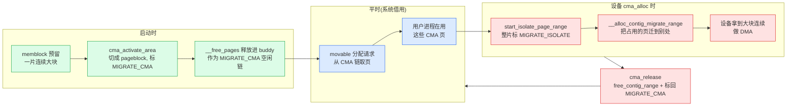
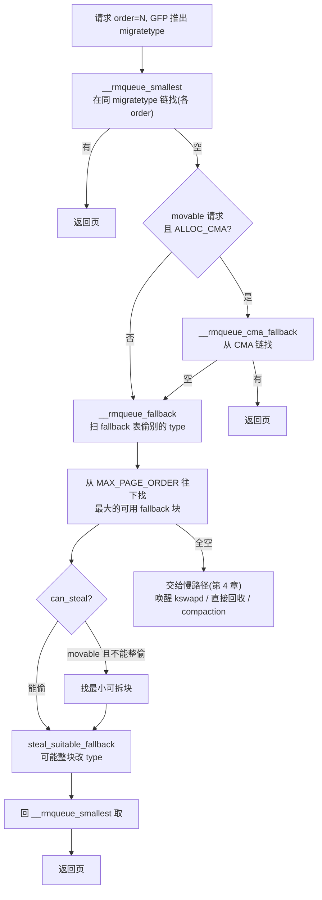

# 第六章 · migrate types、pageblock 与 CMA

> 篇:第 1 篇 · buddy 伙伴系统(分配·物理页)
> 主线呼应:前三章我们立起了 buddy 的骨架——按 order(2^N)组织空闲、`free_area[]` 按 order 分桶、分配拆分、释放合并,靠"一行异或"让找伙伴 O(1)。但第 3 章末尾留了一个洞:buddy 让碎片**能合回去**,却解决不了"伙伴被卡住"——如果一个大块里只有几页被钉死(UNMOVABLE),其余空闲页就永远合不回大块,大页/DMA/连续大请求全废。本章就是填这个洞的:把页按**可迁移性**分类(migrate types),同类聚集;用 **pageblock** 当分类的管理粒度;**CMA** 借这套机制给设备预留大块连续内存又"不浪费"。这一章是 buddy 篇的收束,buddy + migrate types + CMA 三件套合起来,才是 Linux 真正的"分页 + 抗碎片"。

## 核心问题

**buddy 跑久了碎片化,为什么还能凑出大块连续页?——把页按"可迁移性"分类(MOVABLE/UNMOVABLE/RECLAIMABLE),分配时同类放一起、释放时不混,给 UNMOVABLE 留余地;pageblock 是 migrate type 的管理粒度;CMA 预留一片 MOVABLE 区,平时可借给 movable 分配、设备要用时把占用的页迁走。**

读完本章你会明白:

1. **migrate types 是什么、为什么这么分**——页按"能不能搬走"分类,而不是按"大小"或"进程"分类。
2. **pageblock 是 migrate type 的管理粒度**——一片 `pageblock_nr_pages` 个页(通常 512 页 = 2MB)共享一个 migrate 标签,放在 3 个 bit 里。
3. **fallback + steal 怎么工作**——某 type 的空闲链空了,允许从"更 movable"的 pageblock 偷,偷的时候整块改 type,避免碎片扩散。
4. **CMA 的双向使用**——预留区平时当 MOVABLE 池不浪费,设备 `cma_alloc` 时把占了它的 movable 页迁走,既不浪费内存又能给设备大块连续。
5. 这一切服务二分法的**分配**那一面(抗碎片是为"大块连续分配"服务的),也悄悄给第 18 章 compaction 铺了路。

---

## 6.1 一句话点破

> **buddy 解决了"碎片能合回去",但解决不了"伙伴被钉死"——只要一个大块里夹着一页 UNMOVABLE(内核 kmalloc 的页、映射了固定物理地址的页),这块就永远合不回大块。Linux 的解法是:把页按"可迁移性"分类,同类聚集放一起,让 UNMOVABLE 的小分配别散到 MOVABLE 大块里,MOVABLE 区还能整体腾空。这一招"分类聚集"是 migrate types 的全部。**

这是结论,不是理由。本章倒过来拆:先看"不分类型会碎成什么样",再看 migrate types 怎么分类、pageblock 怎么当管理粒度,然后讲 fallback + steal 怎么应对"某类型空了"的情形,最后拆 CMA 这个"分类抗碎片"思想的极致应用。

---

## 6.2 先看清要解决的问题:伙伴被钉死的碎片

回到第 3 章末尾。buddy 让碎片**能合回去**——释放一页时,只要它的伙伴也在空闲链,就合成 order+1 的父块,一路合上去。这套机制很美,但它有一个致命盲点:

> **如果伙伴被分配出去了(还在用),就合不动**。

最坏的情况:一个 2MB 的 order=9 大块,被分配出去了 1 页(给某个内核 `kmalloc` 的小对象)。剩下 2MB-1 页虽然空闲,但**永远合不回 order=9**,直到那 1 页被释放。这一页就像一颗钉子,把整个 2MB 大块钉死了。

```
一个 order=9 (512 页 = 2MB) 的大块,中间被钉了 1 页:

   ┌──────────────────────────────────────────────────┐
   │  空闲 空闲 空闲 ... 空闲 ★ 空闲 ... 空闲 空闲 空闲 │   ★ = 被 kmalloc 钉死的 UNMOVABLE 页
   └──────────────────────────────────────────────────┘
                                       ↑
                            这 1 页在用, 整个 2MB 合不回大块
```

如果这种钉子到处都是(系统跑久了就是这样),会出现一种尴尬局面:

- **物理内存总量够**,空闲页加起来几 GB。
- **但分配不出大块连续**——要一个 2MB 大页、要做一次 DMA,失败。
- 内存没到 OOM,功能却挂了。

更糟糕的是,这种碎片会**自我加剧**。如果内核到处随便分配单页(给 `kmalloc`、给页表、给各种固定物理地址的映射),UNMOVABLE 的小分配会**均匀散落**到物理内存各处,几乎每一个大块里都钉着一两颗钉子。系统跑一天之后,大页分配成功率断崖式下跌。

> **不这样会怎样**:假设内核完全不管"页能不能搬走",随便在物理内存里挑空闲页给任何请求。`kmalloc` 要 1 页?随便挑一页。某个驱动要 1 页做 DMA(物理地址必须固定)?随便挑一页。用户进程要 1 页?随便挑一页。结果就是:
>
> 1. **UNMOVABLE 页均匀散落**到所有大块里——每个 2MB 大块里几乎都被钉了一两颗。
> 2. **MOVABLE 区永远腾不空**——本来可以搬走的用户进程页,被钉死页夹在中间,无法整体回收成大块。
> 3. **大块连续永久拿不到**——大页、DMA、CMA 全废。
> 4. compaction(第 18 章)也无能为力——它能搬走 MOVABLE 页,但搬不走 UNMOVABLE 页,而 UNMOVABLE 页散落在所有大块里。

这就是为什么需要 migrate types。它不消灭碎片,但它让碎片**有地方聚集**——把会搬走的页(MOVABLE)集中放,让不会搬走的页(UNMOVABLE)另找地方,这样 MOVABLE 区还能整体腾空。

---

## 6.3 migrate types:按"可迁移性"分类

Linux 的核心洞察是:**不是所有页都一样难搬**。有些页,换个物理地址没关系(用户进程的页,迁移一下页表就行);有些页,地址是钉死的(DMA buffer、内核某些固定映射),搬不动。把它们分开管理,让"难搬的"别污染"能搬的"。

具体来说,Linux 把页分成几类,定义在 [`enum migratetype`](../linux/include/linux/mmzone.h#L48-L71):

```c
// include/linux/mmzone.h#L48-L71 (源码原文)
enum migratetype {
    MIGRATE_UNMOVABLE,    /* 不可迁移:内核 kmalloc、页表、固定物理地址映射 */
    MIGRATE_MOVABLE,      /* 可迁移:用户进程页,迁一下页表就行 */
    MIGRATE_RECLAIMABLE,  /* 可回收:slab 缓存、干净文件页,丢弃或回写即可 */
    MIGRATE_PCPTYPES,     /* = 3,前 3 类会进 per-cpu pageset */
    MIGRATE_HIGHATOMIC = MIGRATE_PCPTYPES,  /* 高阶原子分配的紧急池 */
#ifdef CONFIG_CMA
    MIGRATE_CMA,          /* CMA 区:平时当 MOVABLE 借,设备用时迁走 */
#endif
#ifdef CONFIG_MEMORY_ISOLATION
    MIGRATE_ISOLATE,      /* 被隔离,不能从这里分配(内存热插拔/CMA 迁移用) */
#endif
    MIGRATE_TYPES         /* = 总数,当数组大小用 */
};
```

前三个是**真正的"按可迁移性分类"**,含义:

| migratetype | 含义 | 典型来源 | 为什么这么分 |
|---|---|---|---|
| `MIGRATE_UNMOVABLE` | 物理地址钉死,搬不动 | 内核 `kmalloc`、page table 页、`__pa()`-style 固定映射、slab 的页 | 必须放在它"原始分配到的"物理位置,迁走就坏 |
| `MIGRATE_MOVABLE` | 能搬到别的物理页 | 用户进程匿名页/文件页、THP、`__GFP_MOVABLE` 分配 | 迁移 = 分配新页 + 改 PTE + 拷贝内容,业务无感 |
| `MIGRATE_RECLAIMABLE` | 不搬,但可以丢弃/回写 | slab 可回收缓存(`dentry_cache`/`inode_cache`)、干净文件页 | 直接释放即可回收,不用搬 |

后两个(`HIGHATOMIC`、`CMA`)是特殊用途,`ISOLATE` 是临时隔离(本章后面讲)。

> **钉死这件事**:这个分类的精髓不在"3 类",而在**为什么按可迁移性分,而不是按大小、按进程、按 zone 分**。因为碎片化的根源是"难搬的页夹在能搬的页里",要抗碎片就得把"难搬的"和"能搬的"分开。按大小分没用(大请求也可能 movable,小请求也可能 unmovable);按进程分没用(一个进程的页可能既有 movable 又有 unmovable);按 zone 分太粗(zone 是按地址/用途分,不是按可迁移性)。**只有按可迁移性分,才能让 MOVABLE 区有可能整体腾空**——这就是 migrate types 的全部理由。

### 分配时怎么知道页是哪类?——GFP 标志

一次页分配请求,调用者通过 **GFP 标志**(Get Free Pages mask)告诉内核"我要的是哪类页"。两个关键标志在 [`include/linux/gfp.h`](../linux/include/linux/gfp.h#L14):

- `__GFP_MOVABLE`:我要的是 movable 页(用户进程页,以后可以迁移)。
- `__GFP_RECLAIMABLE`:我要的是 reclaimable 页(可回收缓存)。
- 都不带:默认 UNMOVABLE(内核固定分配)。

内核用一个巧妙的位编码,把这两个 GFP 标志**直接映射**成 migratetype,见 [`gfp_migratetype`](../linux/include/linux/gfp.h#L17-L31):

```c
// include/linux/gfp.h#L17-L31 (简化示意,保留主干)
#define GFP_MOVABLE_MASK (__GFP_RECLAIMABLE | __GFP_MOVABLE)
#define GFP_MOVABLE_SHIFT 3

static inline int gfp_migratetype(const gfp_t gfp_flags)
{
    /* 把 GFP_MOVABLE_MASK 这两位,右移 3 位,得到 migratetype */
    return (unsigned long)(gfp_flags & GFP_MOVABLE_MASK) >> GFP_MOVABLE_SHIFT;
}
```

这里的位编码极其巧妙:`___GFP_MOVABLE` 和 `___GFP_RECLAIMABLE` 这两位的值,正好分别右移 3 位后等于 `MIGRATE_MOVABLE`(=1)和 `MIGRATE_RECLAIMABLE`(=2),而都没设(=0)就是 `MIGRATE_UNMOVABLE`(=0)。所以 GFP 标志到 migratetype 的转换就是**一次位运算**——没有分支、没有查表。

> **技巧·位编码免查表**:`gfpflags → migratetype` 的转换用"标志位的值正好等于 migratetype 左移 3 位"这个精心安排的编码,让转换退化成一次 mask + shift。这是 mm 里"用编码约定换性能"的小例子,和第 3 章的"用 2^N 对齐换 O(1) 找伙伴"是同一思路——**用约束换性能**。

---

## 6.4 pageblock:migrate type 的管理粒度

知道了页有 migrate type,下一个问题:**这个标签挂在哪?多大粒度?**

如果每页都挂一个 migratetype 标签,4 百万页 × 一个字节 = 几 MB 的标签数据,不划算;而且分配时(比如要 1 页)总不能挑"任意一页 movable",得有一片连续的 movable 区域可挑。所以 Linux 用一个更大的粒度:**pageblock**——一片 `pageblock_nr_pages` 个页共享一个 migrate 标签。

### pageblock_order 是多大

[`pageblock_order`](../linux/include/linux/pageblock-flags.h#L44) 的定义是个宏:

```c
// include/linux/pageblock-flags.h#L31-L53 (简化示意)
#ifdef CONFIG_HUGETLB_PAGE
#  define pageblock_order  min_t(unsigned int, HUGETLB_PAGE_ORDER, MAX_PAGE_ORDER)
#else
#  define pageblock_order  MAX_PAGE_ORDER
#endif

#define pageblock_nr_pages  (1UL << pageblock_order)
```

x86_64 上启用了 `CONFIG_HUGETLB_PAGE`,默认大页 2MB,即 `HUGETLB_PAGE_ORDER = 9`(512 页),`MAX_PAGE_ORDER = 10`。取 min,所以 **`pageblock_order = 9`**,**`pageblock_nr_pages = 512`**——一个 pageblock 就是 512 页(2MB)。和默认大页一样大不是巧合:**pageblock 设计上就和大页对齐**,这样"凑出一个大页"= "凑出一个 pageblock 的连续 MOVABLE 页"。

> **源码印象修正**:`pageblock_order` 不是个固定常量,它是宏。如果体系结构大页大小可变(`CONFIG_HUGETLB_PAGE_SIZE_VARIABLE`),它甚至是个运行时变量(见 [page_alloc.c:228](../linux/mm/page_alloc.c#L228) 的 `unsigned int pageblock_order __read_mostly`)。但绝大多数平台(x86_64/arm64 默认配置)它就是 9。本书统一按 `pageblock_order = 9` 讲。

### 标签怎么存:3 bit 的小账本

每个 pageblock 一个 migratetype,这些标签放在哪?放在 section 的 [`usage->pageblock_flags`](../linux/include/linux/mmzone.h#L1847) 这个 bitmap 里。每个 pageblock 用 **3 个 bit** 存 migratetype(见 [`pageblock-flags.h`](../linux/include/linux/pageblock-flags.h#L16-L29)):

```c
// include/linux/pageblock-flags.h#L16-L29 (源码原文)
#define PB_migratetype_bits 3
enum pageblock_bits {
    PB_migrate,
    PB_migrate_end = PB_migrate + PB_migratetype_bits - 1,
    PB_migrate_skip,  /* 如果设置,compaction 跳过这个 block */
    NR_PAGEBLOCK_BITS
};
```

3 bit 能存 8 个值,够装下 `MIGRATE_TYPES`(当前 6~7 种类型)。所以**一个 pageblock 占 3 bit**——一页只用 3/512 bit,极省。一台 16GB 的机器(4 百万页 / 512 = 7812 个 pageblock)的标签 bitmap 才 7812 × 3 bit ≈ 3KB。

给定一个页,找它的 pageblock migratetype 由 [`get_pageblock_migratetype`](../linux/mm/page_alloc.c#L393) → [`get_pfnblock_flags_mask`](../linux/mm/page_alloc.c#L347) 完成:用 `pfn >> pageblock_order` 算出是第几个 pageblock,再去 bitmap 里取 3 bit。

设置 migratetype 由 [`set_pageblock_migratetype`](../linux/mm/page_alloc.c#L432-L440) 完成:

```c
// mm/page_alloc.c#L432-L440 (源码原文)
void set_pageblock_migratetype(struct page *page, int migratetype)
{
    if (unlikely(page_group_by_mobility_disabled &&
                 migratetype < MIGRATE_PCPTYPES))
        migratetype = MIGRATE_UNMOVABLE;

    set_pfnblock_flags_mask(page, (unsigned long)migratetype,
                            page_to_pfn(page), MIGRATETYPE_MASK);
}
```

`set_pfnblock_flags_mask` 内部用 `cmpxchg` 把 bitmap 的对应 3 bit 原子地改掉(见 [page_alloc.c:425-430](../linux/mm/page_alloc.c#L425-L430))。

> **逃生阀**:如果你对"3 bit 存类型"这种位压缩感到陌生,回想第 0 章的 `struct page` 紧凑布局——mm 的传统就是"海量小对象元数据要省",pageblock flags 也一样。这里的代价是访问要算 bit 偏移、要原子操作,但比起每页一个字节,省了一个数量级。

### free_area 的链:每 order 再按 migrate type 分

回忆第 3 章:[`struct free_area`](../linux/include/linux/mmzone.h#L117-L120) 里,每个 order 的空闲链**还要再按 migrate type 分**:

```c
struct free_area {
    struct list_head free_list[MIGRATE_TYPES];  // 每 migrate type 一条链
    unsigned long   nr_free;
};
```

也就是说,buddy 的完整索引是 `zone->free_area[order].free_list[migratetype]`——一个二维结构(11 个 order × 几种 migratetype),每格一条空闲链。这让"分配一个 order=N 的 movable 块"退化成"取 `free_area[N].free_list[MOVABLE]` 链头",O(1)。

```
   zone
    │
    ▼  free_area[0..10],每 order 再按 migrate type 分链:

   ┌─────────────────────────────────────────────────────────┐
   │ free_area[0] (1 页)                                     │
   │   free_list[UNMOVABLE]:   ○ -> ○                        │
   │   free_list[MOVABLE]:     ○ -> ○ -> ○ -> ○ -> ○         │
   │   free_list[RECLAIMABLE]: ○ -> ○                        │
   │   free_list[CMA]:         ○ -> ○ -> ○                   │
   ├─────────────────────────────────────────────────────────┤
   │ free_area[9] (512 页 = 1 pageblock)                     │
   │   free_list[MOVABLE]:     ○○...○○ -> ○○...○○           │
   │   free_list[CMA]:         ○○...○○  (CMA 大块)          │
   └─────────────────────────────────────────────────────────┘

   每条链只挂"该 order × 该 migratetype"的空闲块
   分配 order=N 的 movable 块 = 取 free_area[N].free_list[MOVABLE] 链头
```

现在物理内存的物理布局画出来就是这样(zone 被切成 pageblock,每个 pageblock 一个 migrate 标签):

```
zone 的物理页(每个 [ ] 是一个 pageblock, 通常 2MB = 512 页):

   ┌──────────────────────────────────────────────────────────────────┐
   │ [UNMOVABLE] [MOVABLE] [MOVABLE] [MOVABLE] [RECLAIMABLE] [MOVABLE]│
   │ [UNMOVABLE] [UNMOVABLE] [MOVABLE] [MOVABLE] [CMA] [CMA] [CMA]    │
   │ [MOVABLE] [MOVABLE] [RECLAIMABLE] [MOVABLE] [MOVABLE] [UNMOVABLE]│
   └──────────────────────────────────────────────────────────────────┘

   同类 pageblock 倾向于聚集(靠 fallback + steal 维持)
   UNMOVABLE 页被限制在 UNMOVABLE pageblock 内, 不会散落到 MOVABLE 区
   MOVABLE pageblock 有望整体腾空 -> 合并成大块连续
```

> **钉死这件事**:pageblock 是 migrate type 的**最小管理单位**。一个 pageblock(通常 2MB)只能有一个 migratetype 标签——不能"半个 pageblock movable, 半个 unmovable"。这个粒度选择是平衡:太小(比如按页)标签数据爆炸;太大(比如按 zone)分类太粗没用。一个 pageblock 2MB,既能让大页对齐,又让 UNMOVABLE 的小分配被圈在一小块内不外溢。这个粒度,是 migrate types 抗碎片能力的物理基础。

---

## 6.5 分配:同类型优先 + fallback + steal

知道了分类和 pageblock,分配路径就好讲了。一个分配请求进来(带 GFP 标志,推出 migratetype),buddy 分三步:

### 第一步:同类型同 order 直接取

最理想情况:`free_area[order].free_list[migratetype]` 链上有块,直接取链头。这就是第 3 章讲的 [`__rmqueue_smallest`](../linux/mm/page_alloc.c#L1562-L1586) 干的事。如果同 order 没有,它还会往高 order 找(取大的、拆分),但**都在同一个 migratetype 的链里找**。这是"同类优先"。

### 第二步:同类没了,看 CMA(movable 请求时)

如果调用者是 movable 请求,且 `ALLOC_CMA` 标志打开(默认打开),buddy 会先尝试从 [`MIGRATE_CMA` 的链上分](../linux/mm/page_alloc.c#L2092-L2104)——CMA 区平时就是给 movable 请求借的:

```c
// mm/page_alloc.c#L2092-L2117 (简化示意)
retry:
    page = __rmqueue_smallest(zone, order, migratetype);
    if (unlikely(!page)) {
        if (alloc_flags & ALLOC_CMA)
            page = __rmqueue_cma_fallback(zone, order);   // 从 CMA 链取
        if (!page && __rmqueue_fallback(zone, order, migratetype, alloc_flags))
            goto retry;                                    // 转向 fallback
    }
    return page;
```

注意这里还有个 CMA 平衡逻辑(`__rmqueue` 开头,见 [L2098-L2104](../linux/mm/page_alloc.c#L2098-L2104)):如果 zone 的空闲页有超过一半在 CMA 区,优先用 CMA 分配,避免 regular 区被掏空而 CMA 闲着。

### 第三步:同类完全没了,fallback 偷别人的

最棘手的情况:**请求 migratetype 的链全空**(包括同 order 和高 order)。这时不能直接失败——内存还有,只是分类不符。Linux 允许"偷"别的 migratetype 的 pageblock。这就是 [`__rmqueue_fallback`](../linux/mm/page_alloc.c#L2005-L2080)。

#### fallbacks 表:谁可以偷谁(有方向性)

并不是任意类型都能互相偷。Linux 用一张静态表规定**每种 type 空了,可以退到哪些 type**([page_alloc.c:1595-1599](../linux/mm/page_alloc.c#L1595-L1599)):

```c
// mm/page_alloc.c#L1595-L1599 (源码原文)
static int fallbacks[MIGRATE_TYPES][MIGRATE_PCPTYPES - 1] = {
    [MIGRATE_UNMOVABLE]   = { MIGRATE_RECLAIMABLE, MIGRATE_MOVABLE   },
    [MIGRATE_MOVABLE]     = { MIGRATE_RECLAIMABLE, MIGRATE_UNMOVABLE },
    [MIGRATE_RECLAIMABLE] = { MIGRATE_UNMOVABLE,   MIGRATE_MOVABLE   },
};
```

意思是:
- `UNMOVABLE` 空了,先尝试退到 `RECLAIMABLE`,再退到 `MOVABLE`。
- `MOVABLE` 空了,先退到 `RECLAIMABLE`,再退到 `UNMOVABLE`。
- `RECLAIMABLE` 空了,先退到 `UNMOVABLE`,再退到 `MOVABLE`。

注意 `CMA`、`ISOLATE`、`HIGHATOMIC` 不在这张表里——**别的类型不能 fallback 到 CMA**(CMA 是设备预留,有专门的 `__rmqueue_cma_fallback` 路径);`ISOLATE` 是隔离,谁都不能用。

> **方向性的微妙**:这张表看起来"对称",其实关键不在对称,而在**偷的时候会改 pageblock 的 type**。比如 UNMOVABLE 偷了 MOVABLE 的 pageblock,这个 pageblock 会被改成 UNMOVABLE——这是**单向不可逆**的扩散(UNMOVABLE 区扩大)。Linux 在 `steal_suitable_fallback` 里做了精细的启发式,避免 UNMOVABLE 到处扩散吃掉 MOVABLE 区。这是本节技巧精解的重点。

#### __rmqueue_fallback:找最大的可用块 + steal

[`__rmqueue_fallback`](../linux/mm/page_alloc.c#L2005-L2080) 的逻辑分两步:

1. **找最大的可用块**:从 `MAX_PAGE_ORDER` 往下扫,看哪个 order 的哪个 fallback type 链上有块(用 [`find_suitable_fallback`](../linux/mm/page_alloc.c#L1846-L1868))。
2. **steal**:调用 [`steal_suitable_fallback`](../linux/mm/page_alloc.c#L1765-L1838) 把这个块(可能连同它所在的整个 pageblock)改成请求 migratetype。

```c
// mm/page_alloc.c#L2029-L2073 (简化示意,保留主干)
for (current_order = MAX_PAGE_ORDER; current_order >= min_order; --current_order) {
    area = &(zone->free_area[current_order]);
    fallback_mt = find_suitable_fallback(area, current_order,
                    start_migratetype, false, &can_steal);
    if (fallback_mt == -1)
        continue;

    /* movable 请求且不能整块偷,就找最小的块(split) */
    if (!can_steal && start_migratetype == MIGRATE_MOVABLE
                && current_order > order)
        goto find_smallest;

    goto do_steal;
}
...

do_steal:
    page = get_page_from_free_area(area, fallback_mt);
    steal_suitable_fallback(zone, page, alloc_flags, start_migratetype, can_steal);
    return true;
```

为什么 movable 请求"不能整块偷就找最小的块"?因为**movable 分配扩散是无害的**——movable 页以后能搬走,即使散落到别的 pageblock 也不造成永久碎片。而 UNMOVABLE 偷 MOVABLE 的 pageblock 是**有害的**(UNMOVABLE 钉死就搬不回),所以尽量小偷。这是 `can_steal` 启发式的核心。

#### steal_suitable_fallback:偷多少、改不改 type

[`steal_suitable_fallback`](../linux/mm/page_alloc.c#L1765-L1838) 是抗碎片的关键启发式。它决定**偷一个 pageblock 时,是整块改 type 还是只改这一小块**。逻辑分三档:

```c
// mm/page_alloc.c#L1765-L1838 (简化示意)
static void steal_suitable_fallback(struct zone *zone, struct page *page,
        unsigned int alloc_flags, int start_type, bool whole_block)
{
    unsigned int current_order = buddy_order(page);
    int old_block_type = get_pageblock_migratetype(page);

    /* 一档:请求的块本身就 >= 一个 pageblock,整块改 type */
    if (current_order >= pageblock_order) {
        change_pageblock_range(page, current_order, start_type);
        goto single_page;  // 只把请求块挪到 start_type 链
    }

    /* 二档:请求块 < pageblock,但允许整块偷 + 整块够"兼容" */
    if (!whole_block)
        goto single_page;

    free_pages = move_freepages_block(zone, page, start_type, &movable_pages);
    /* 统计这个 pageblock 里有多少页和请求 type 兼容 */
    if (start_type == MIGRATE_MOVABLE)
        alike_pages = movable_pages;
    else if (old_block_type == MIGRATE_MOVABLE)
        alike_pages = pageblock_nr_pages - (free_pages + movable_pages);
    else
        alike_pages = 0;

    /* 如果 pageblock 里"空闲 + 兼容"的页 >= 一半, 整块改 type */
    if (free_pages + alike_pages >= (1 << (pageblock_order - 1)))
        set_pageblock_migratetype(page, start_type);

    return;

single_page:
    move_to_free_list(page, zone, current_order, start_type);
}
```

逻辑的核心思想是**"如果偷一个 pageblock 时它大部分已经空闲/兼容,就把整块改 type;否则只改这一小块,别污染整块"**。这样:

- 整块 pageblock 改 type → 这个 pageblock 以后所有空闲页都属于新 type,UNMOVABLE 能聚集,**不散落**。
- 只改一小块 → 这个 pageblock 大部分还是原 type,只有这一小块被借走。新 type 的页夹在原 type 的 pageblock 里,但是单页级别,不会扩散。

这个"一半阈值"(`1 << (pageblock_order-1)` = 256 页)是个启发式,不保证正确,只为了**在抗碎片和分配成功率之间平衡**。

> **不这样会怎样**:如果 fallback 时无脑把 pageblock 整块改 type,会发生灾难:每次 UNMOVABLE 小分配(1 页)都会把整个 2MB MOVABLE pageblock 改成 UNMOVABLE,MOVABLE 区迅速被吃光,系统再无大块 MOVABLE 连续,大页全废。反之如果永远不改 type(只借用),UNMOVABLE 页会散落在 MOVABLE pageblock 各处,也是灾难。`steal_suitable_fallback` 的"一半阈值"是这两个极端的折中——**让 UNMOVABLE 的扩散受限,又给小分配留路**。这是 migrate types 抗碎片能力的真正心脏。

---

## 6.6 释放:回同类链 + pageblock 跨界防合并

释放一页时,它挂回哪条 migrate 链?答案:**挂回它所在 pageblock 的 migratetype 链**(不是"它分配出来时的 migratetype")。这就是第 5 章讲的 [`__free_one_page`](../linux/mm/page_alloc.c#L765) 接收 migratetype 参数,而调用者(通过 `get_pfnblock_migratetype`)从 pageblock 标签算出来的原因。

```c
// mm/page_alloc.c#L797-L804 (源码原文,__free_one_page 内)
while (order < MAX_PAGE_ORDER) {
    ...
    buddy = find_buddy_page_pfn(page, pfn, order, &buddy_pfn);
    if (!buddy)
        goto done_merging;

    if (unlikely(order >= pageblock_order)) {
        /*
         * We want to prevent merge between freepages on pageblock
         * without fallbacks and normal pageblock. Without this,
         * pageblock isolation could cause incorrect freepage or CMA
         * accounting or HIGHATOMIC accounting.
         */
        int buddy_mt = get_pfnblock_migratetype(buddy, buddy_pfn);
```

注意这里一段关键的代码:当 `order >= pageblock_order` 时(即合并的块已经跨 pageblock 大小),要**检查伙伴所在 pageblock 的 migratetype 是否一致**——如果不一致,禁止合并。为什么?

> **钉死这件事**:跨 pageblock 边界合并会导致**两个不同 migratetype 的 pageblock 的页混进同一个空闲块**,把账算乱(CMA 区的页跑进 MOVABLE 块,或反之)。这是 buddy + migrate types 协作的细节:**合并要在同 migrate type 内**。这个检查在 `order >= pageblock_order` 才触发,因为只有这时合并的块才可能跨 pageblock。

### page_group_by_mobility_disabled:逃生阀

如果用户讨厌这种分类带来的开销(比如某些专用机器就是不要抗碎片),可以打开 `page_group_by_mobility_disabled`(sysctl 可调),这时 [`set_pageblock_migratetype`](../linux/mm/page_alloc.c#L434-L436) 强制把所有 migratetype 设为 UNMOVABLE,`gfp_migratetype` 也返回 UNMOVABLE——退化成"不分类型"的朴素 buddy。这是个逃生阀,通常只在嵌入式、特殊工作负载打开。本书默认它关闭。

---

## 6.7 CMA:分类抗碎片的极致应用

讲到这里,migrate types 抗碎片的核心就完了。但 Linux 还有一个**重量级应用**直接建在 migrate types 之上——**CMA(Contiguous Memory Allocator, 连续内存分配)**。它解决一个长期难题:

> **设备(摄像头、GPU、硬件加速器)经常需要大块物理连续内存做 DMA,但平时这块内存闲着也是浪费。怎么"既给设备预留,平时又不浪费"?**

CMA 的答案是:**预留一片大块连续内存,标成 `MIGRATE_CMA`,平时让 buddy 当 MOVABLE 池用(不浪费),设备要时再"抢回来"——把占着它的 movable 页迁走**。这是 migrate types 思想的极致:利用"MOVABLE 页可以搬"这个性质,让一片物理内存"既属于设备又平时给系统用"。

### CMA 的双向使用

CMA 区域的生命周期画出来是这样(本章核心图):



这张图是 CMA 的灵魂。关键观察:

- **启动时**:预留区不是闲挂着的,而是被切成 pageblock 标成 `MIGRATE_CMA`,然后**释放进 buddy 系统**(`__free_pages`),进入 `free_area[].free_list[MIGRATE_CMA]` 链。
- **平时**:movable 分配请求(带 `ALLOC_CMA` 标志)可以从 CMA 链取页——这页被用户进程用了,但**仍是 CMA 区的页**(pageblock 还是 `MIGRATE_CMA`)。
- **设备用时**:`cma_alloc` 调 `alloc_contig_range`,把占用 CMA 的页**迁走**,腾出连续大块给设备。
- **设备用完**:`cma_release` 把页再释放回 buddy,标回 `MIGRATE_CMA`,恢复"平时池"身份。

这样一片内存**身兼两职**:平时给系统当 MOVABLE 池,设备用时给设备。这是"利用 MOVABLE 可迁性"的最精彩应用。

### 激活:把预留区变成 MIGRATE_CMA

启动时,`memblock` 已经预留了一片连续大块(物理上连续)。然后 [`cma_init_reserved_areas`](../linux/mm/cma.c#L141-L150)(一个 `core_initcall`)调用 [`cma_activate_area`](../linux/mm/cma.c#L92-L139) 把它激活:

```c
// mm/cma.c#L114-L116 (源码原文)
for (pfn = base_pfn; pfn < base_pfn + cma->count;
     pfn += pageblock_nr_pages)
    init_cma_reserved_pageblock(pfn_to_page(pfn));
```

按 pageblock 粒度遍历,每个 pageblock 调 [`init_cma_reserved_pageblock`](../linux/mm/mm_init.c#L2330-L2346):

```c
// mm/mm_init.c#L2330-L2346 (源码原文)
void __init init_cma_reserved_pageblock(struct page *page)
{
    unsigned i = pageblock_nr_pages;
    struct page *p = page;

    do {
        __ClearPageReserved(p);     // 清掉 reserved 标志
        set_page_count(p, 0);       // 引用计数清零
    } while (++p, --i);

    set_pageblock_migratetype(page, MIGRATE_CMA);   // ★ 标成 MIGRATE_CMA
    set_page_refcounted(page);
    __free_pages(page, pageblock_order);            // ★ 释放进 buddy

    adjust_managed_page_count(page, pageblock_nr_pages);
    page_zone(page)->cma_pages += pageblock_nr_pages;
}
```

两个关键动作:① 把 pageblock 标成 `MIGRATE_CMA`;② 用 `__free_pages` 把这一整个 pageblock(2MB)释放进 buddy——进入 `free_area[9].free_list[MIGRATE_CMA]` 链。从这一刻起,这片预留区**正式成为 buddy 的一部分**,只是带了个"CMA"标签,平时任何 movable 请求都能借它。

> **源码事实**:任务说明里提到 `init_cma_reserved_pageblock` 在 `cma.c`,其实**它的实现在 `mm/mm_init.c:2330`**(`cma.c` 只是声明 `extern` + 调用)。这是 mm 模块化的产物:boot-time 初始化代码集中在 `mm_init.c`,运行时 CMA 逻辑在 `cma.c`。引用时不要找错文件。

### 平时:movable 分配借 CMA

平时系统跑业务,用户进程缺页要 movable 页。`__rmqueue` 看到 `ALLOC_CMA` 标志打开,且 zone 里 CMA 页占比超过一半,就**优先从 CMA 链分配**([page_alloc.c:2098-2104](../linux/mm/page_alloc.c#L2098-L2104)):

```c
// mm/page_alloc.c#L2098-L2104 (源码原文)
if (alloc_flags & ALLOC_CMA &&
    zone_page_state(zone, NR_FREE_CMA_PAGES) >
        zone_page_state(zone, NR_FREE_PAGES) / 2) {
    page = __rmqueue_cma_fallback(zone, order);
    if (page)
        return page;
}
```

如果常规 movable 链空了,也会 fallback 到 CMA(`__rmqueue` 第二次尝试 [L2109-L2110](../linux/mm/page_alloc.c#L2109-L2110))。所以**CMA 区在平时就是 movable 池的一部分**——分配路径透明地从 CMA 取页,业务无感。

### 设备用:cma_alloc + alloc_contig_range

设备要大块连续了。驱动调 [`cma_alloc`](../linux/mm/cma.c#L420-L518),核心逻辑:

```c
// mm/cma.c#L451-L489 (简化示意)
for (;;) {
    spin_lock_irq(&cma->lock);
    /* 在 CMA bitmap 上找一段连续 0(空闲位) */
    bitmap_no = bitmap_find_next_zero_area_off(cma->bitmap,
                bitmap_maxno, start, bitmap_count, mask, offset);
    if (bitmap_no >= bitmap_maxno) { spin_unlock_irq(&cma->lock); break; }
    bitmap_set(cma->bitmap, bitmap_no, bitmap_count);   // 占住这段
    spin_unlock_irq(&cma->lock);

    pfn = cma->base_pfn + (bitmap_no << cma->order_per_bit);
    mutex_lock(&cma_mutex);
    ret = alloc_contig_range(pfn, pfn + count, MIGRATE_CMA,
                 GFP_KERNEL | (no_warn ? __GFP_NOWARN : 0));
    mutex_unlock(&cma_mutex);
    if (ret == 0) { page = pfn_to_page(pfn); break; }

    cma_clear_bitmap(cma, pfn, count);   // 失败, 还回 bitmap
    if (ret != -EBUSY) break;
    start = bitmap_no + mask + 1;        // 换一段重试
}
```

`cma_alloc` 自己**不搬页**——它只是占住 bitmap,真正干活的是 [`alloc_contig_range`](../linux/mm/page_alloc.c#L6339-L6462)。这是 CMA 的硬核:

```c
// mm/page_alloc.c#L6339-L6462 (简化示意, 保留四步)
int alloc_contig_range(unsigned long start, unsigned long end,
               unsigned migratetype, gfp_t gfp_mask)
{
    struct compact_control cc = { .zone = page_zone(pfn_to_page(start)),
                                  .mode = MIGRATE_SYNC, ... };

    /* 第 1 步: 整片标成 MIGRATE_ISOLATE(别人不能从这里分配) */
    ret = start_isolate_page_range(start, end, migratetype, 0, gfp_mask);

    drain_all_pages(cc.zone);  // 把 pcp 里的页冲回 buddy

    /* 第 2 步: 把占用这段的 movable 页迁走 */
    ret = __alloc_contig_migrate_range(&cc, start, end, migratetype);

    /* 第 3 步: 确认整段真的全空闲了 */
    if (test_pages_isolated(outer_start, end, 0)) { ret = -EBUSY; goto done; }

    /* 第 4 步: 从 buddy 把这段页全部摘下来(给设备) */
    outer_end = isolate_freepages_range(&cc, outer_start, end);

done:
    undo_isolate_page_range(start, end, migratetype);  // 撤销 ISOLATE
    return ret;
}
```

四步:

1. **隔离(`start_isolate_page_range`)**:把范围内的所有 pageblock 标成 `MIGRATE_ISOLATE`。这一步的核心是 [`set_migratetype_isolate`](../linux/mm/page_isolation.c#L147-L204)——它会先 [`has_unmovable_pages`](../linux/mm/page_isolation.c#L33-L140) 扫一遍,**如果有钉死的 UNMOVABLE 页,直接返回 `-EBUSY`**(CMA 区不该有 UNMOVABLE,但 `set_migratetype_isolate` 还是检查一遍保险)。然后改 type,`zone->nr_isolate_pageblock++`,`move_freepages_block` 把空闲页挪到 ISOLATE 链。
2. **迁移(`__alloc_contig_migrate_range`)**:[page_alloc.c:6242-L6316](../linux/mm/page_alloc.c#L6242-L6316) 用 compaction 的同款机制(`isolate_migratepages_range` + `migrate_pages`),把占用这段的 movable 页**迁到别处**——分配新页、改 PTE、拷贝内容。这是真正"搬页"的一步,内部用的就是 rmap(第 15 章)+ 页表 + 迁移机制。
3. **确认(`test_pages_isolated`)**:验证整段真的全空闲。
4. **拿走(`isolate_freepages_range`)**:从 buddy 把这段页全摘下来,给设备。

> **钉死这件事**:`alloc_contig_range` 是"分类抗碎片 + 实际搬页"的合体。它依赖的事实是:**CMA 区的页都是 movable(或空闲)**,所以可以被迁走——这正是因为平时 `MIGRATE_CMA` 只接受 movable 请求,UNMOVABLE 分配进不来(`has_unmovable_pages` 的 [page_isolation.c:43-53](../linux/mm/page_isolation.c#L43-L53) 专门处理 CMA,且 fallback 表里不让别的类型偷 CMA)。**没有 migrate types,就没有 CMA**——这是分类抗碎片思想的极致应用。

### 用完:cma_release

设备用完调 [`cma_release`](../linux/mm/cma.c#L549-L569):

```c
// mm/cma.c#L549-L569 (简化示意)
bool cma_release(struct cma *cma, const struct page *pages, unsigned long count)
{
    if (!cma_pages_valid(cma, pages, count))
        return false;

    pfn = page_to_pfn(pages);
    free_contig_range(pfn, count);          // 把页还给 buddy
    cma_clear_bitmap(cma, pfn, count);      // 清 bitmap
    return true;
}
```

页还给 buddy,pageblock 还是 `MIGRATE_CMA`(整个 `alloc_contig_range` 的 `undo_isolate_page_range` 把 type 改回 CMA),所以这些页重新成为"平时池"的一部分,等下一个 movable 请求来借。

---

## 6.8 流程总览:一次分配在 migrate types 体系里怎么走

把本章讲的"分配路径在 migrate types 里的决策"画成流程图:



这张图把"同类优先 → CMA → fallback → steal → 慢路径"的整个决策链画清楚了。注意:**migrate types 是 buddy 快路径的决策**,它不涉及回收——回收是慢路径的事(第 4 章、第 5 篇)。但 migrate types 给回收埋了伏笔:正因为 MOVABLE 页被分类聚集,compaction(第 18 章)才能高效地把它们搬走凑连续。

---

## 6.9 技巧精解:migrate types 抗碎片 + CMA 双向使用

本章最该钉死的两个技巧。

### 技巧一:migrate types 抗碎片——分类聚集让大块有希望腾空

> **反面对比·不分类型**:假设内核完全不管"页能不能搬走",随便在物理内存里挑空闲页给任何请求。系统跑一天后:
>
> - `kmalloc`、页表、各种固定映射(UNMOVABLE)的小分配**均匀散落**到每个 2MB pageblock 里——几乎每个 pageblock 都被钉了一两颗。
> - 用户进程页(MOVABLE)夹在这些钉子中间,即使被释放、即使伙伴都在,buddy 也只能合到 order=9(一个 pageblock)为止——但**这个 pageblock 里有钉子,合并不上去**。
> - 要分配一个 2MB 大页(THP)、要做一次 4MB DMA——**失败**,因为没有任何一个 pageblock 是完全空闲的连续 MOVABLE。
> - compaction(第 18 章)也救不了——它能搬 MOVABLE 页,但搬不走 UNMOVABLE 钉子,而钉子散落各处。
>
> 这种系统叫"碎片化死亡":内存总量够,大块连续永久拿不到。

migrate types 的解法(C,**当前 Linux**):

- **按可迁移性分类**:UNMOVABLE/MOVABLE/RECLAIMABLE 三类,GFP 标志直接位运算推出。
- **同类聚集**:分配优先在同 type 的链取;fallback 偷的时候,整块 pageblock 改 type(只在兼容性够时),让同 type pageblock 聚集。
- **结果**:UNMOVABLE 的小分配被圈在 UNMOVABLE pageblock 里,**不散落到 MOVABLE 区**。MOVABLE pageblock 整体没有钉子,**有望整体腾空**——一旦它空闲,合并成大块连续。
- **配合 compaction**:即使 MOVABLE pageblock 暂时不空(有用户进程页在用),compaction 也能把这些 movable 页**整体搬走**(因为它们都是 movable,搬得动),腾出整个 pageblock 给大页/DMA/CMA。

> **钉死这件事**:migrate types 的本质是"**让难搬的页别污染能搬的区**"。它不消灭碎片,但它让"MOVABLE 区有可能整体腾空"这件事成立——这是大页分配、DMA、CMA 能用的根基。没有这一招,Linux 在长期运行下根本分配不出大块连续。

### 技巧二:CMA 的双向使用——一片内存身兼两职

> **反面对比·朴素方案 A(启动时给设备预留,再也不用)**:设备驱动启动时 `memblock_reserve` 一片大块连续(比如 64MB)给摄像头 DMA。结果:这 64MB **永远闲着**(设备不用时也是空的),系统可用内存直接少 64MB。手机、嵌入式设备内存紧张,这种浪费不能接受。
>
> **反面对比·朴素方案 B(不预留,设备要时现找)**:设备要 DMA 时,调 `alloc_pages(order=14)` 试图现分 16MB 连续。结果:系统跑久了碎片化,这种高阶分配**几乎永远失败**——物理内存总量够,但连续大块没有。设备打开摄像头花 5 秒、报错、用户体验崩。

CMA 的解法(C,**当前 Linux**):

- **预留 + 标签**:启动时预留,但标成 `MIGRATE_CMA`,**释放进 buddy 当 MOVABLE 池**。
- **平时借用**:任何 movable 请求都能从 CMA 区取页——这 64MB 平时不浪费,该跑业务跑业务。
- **设备抢回**:`cma_alloc` 调 `alloc_contig_range`,① 隔离(`MIGRATE_ISOLATE`)② 迁移占用页(`migrate_pages`)③ 拿走。
- **前提保证**:正因为平时只让 movable 请求借 CMA(UNMOVABLE 进不来),所以设备用时**所有占用的页都是 movable,都能迁走**——这是 CMA 成立的关键。

> **钉死这件事**:CMA 是"利用 migrate types 分类,让一片物理内存身兼两职"的设计。它依赖两个前提:① 平时只让 movable 借(保证可迁);② 迁移机制可用(第 18 章 compaction 的同款机制)。两个前提都建立在 migrate types 之上——**没有分类,就没有"保证可迁"这件事**。这是 migrate types 思想的极致应用,也是 Linux 在内存受限设备上能同时满足"系统用内存"和"设备要连续"的关键。

---

## 6.10 释放路径的 migrate type 处理(承接第 5 章)

讲到这里要补一句释放路径怎么和 migrate types 配合(承接第 5 章没展开的点)。

第 5 章讲 per-cpu pageset(pcp)缓存热页时,提到一个细节:**释放时,page 的 migratetype 被缓存在 `page->index` 里**([`set_pcppage_migratetype`](../linux/mm/page_alloc.c#L222-L225))。这个缓存值在页进入 pcp 时记下,**但不一定等于 pageblock 的当前 migratetype**(因为 pageblock 的 type 可能被 fallback 改过)。

当 pcp 里的页被 drain(冲刷)回 buddy 时,要用 [`get_pcppage_migratetype`](../linux/mm/page_alloc.c#L217-L219) 取这个缓存值,但 [`free_unref_page_prepare`](../linux/mm/page_alloc.c) 会校验/修正它,让最终落点符合 pageblock 当前 type。这个细节的核心是:

> **page 在 pcp 里的 migratetype 是"它分配出来时被给的标签",而 pageblock 的 migratetype 是"它现在所属物理区域的标签"。两者可能不一致(如果 fallback 改了 pageblock type)。释放时以 pageblock 当前 type 为准**——这是为什么 `__free_one_page` 释放路径会从 `get_pfnblock_migratetype` 重新算 migratetype。

这个细节看起来繁琐,但它保证了**释放的页落回"它物理上所属的 pageblock 的 type 链"**,而不是"它分配出来时记忆的 type 链"。否则会出现"CMA 区的页被释放到 UNMOVABLE 链"这种账物不符。

---

## 6.11 一句话点一下:buddy 与用户态分配器(轻点)

(本章不标 ★,这里只一句轻点,完整对照在第 10、21 章。)

如果你读过第 8 本《内存分配器》,会注意到 tcmalloc/jemalloc **几乎不操心外碎片**到 Linux mm 这个程度——它们用 span(连续页)切小对象,但用户态分配器随时可以再向 OS 要新 span(`mmap`),物理连续性由内核保证。而**内核自己就是最后一道防线,没有"更底层"可以要内存**——所以 buddy 必须自己抗碎片,migrate types + compaction 是用户态分配器不需要的"内核专属抗碎片层"。完整对照见第 10、21 章。

---

## 章末小结

这一章我们把 buddy 篇收束了。migrate types + pageblock + CMA 三件套,补上了 buddy 的最后一块短板——"伙伴被钉死"的碎片。核心就三件事:

1. **migrate types 分类**:页按可迁移性分 UNMOVABLE/MOVABLE/RECLAIMABLE,GFP 标志位运算直接推出。同类聚集放一起,让 UNMOVABLE 别散到 MOVABLE 区。
2. **pageblock 是管理粒度**:一片 512 页(2MB)共享一个 migratetype 标签(3 bit),既对齐大页又让 UNMOVABLE 不外溢。fallback + steal 在跨类型借用时,用"一半阈值"决定是否整块改 type,平衡抗碎片和分配成功率。
3. **CMA 是分类的极致应用**:预留区标 `MIGRATE_CMA` 释放进 buddy 当平时池,设备 `cma_alloc` 时靠迁移机制把占用页搬走——靠"平时只让 movable 借"保证可迁。

这套设计让 Linux 在长期运行、内存紧张、碎片化严重的情况下,仍能分配出大页、做得了 DMA、给得了设备连续大块——这是 buddy 单独做不到的。完整的抗碎片是三层:**buddy(让碎片能合就合)+ migrate types(让难搬的别污染能搬的)+ compaction(实在碎了主动搬)**。本章是第二层,第 18 章讲第三层。

本章服务二分法的**分配**那一面:抗碎片是为"大块连续分配"服务的。但它也悄悄给第 18 章 compaction 铺了路——compaction 搬的就是 MOVABLE 页,正因为 migrate types 把它们分类聚集好了,compaction 才能高效工作。

第 1 篇(buddy)就此成体系:**第 2 章(物理内存组织)→ 第 3 章(buddy 算法)→ 第 4 章(分配快慢路径)→ 第 5 章(释放 + pcp)→ 第 6 章(migrate types + CMA)**。buddy 把"按页分物理内存"这件事彻底讲完了。

### 五个"为什么"清单

1. **为什么 buddy 还需要 migrate types?** buddy 让碎片能合回去(只要伙伴都在),但解决不了"伙伴被钉死"——一个大块里夹一页 UNMOVABLE,整块合不回去。migrate types 把难搬的页(UNMOVABLE)和能搬的页(MOVABLE)分类聚集,让 MOVABLE 区有望整体腾空。

2. **pageblock 为什么是 2MB(512 页)?** `pageblock_order = min(HUGETLB_PAGE_ORDER, MAX_PAGE_ORDER)`,x86_64 上 = 9 = 2MB。这个大小既对齐默认大页(THP/hugetlb 都是 2MB),又让 UNMOVABLE 的小分配被圈在一小块内不外溢。是平衡的选择。

3. **fallback 表为什么有方向性、为什么不包含 CMA?** fallback 表(`fallbacks[MIGRATE_TYPES][2]`)规定 UNMOVABLE/MOVABLE/RECLAIMABLE 之间互退。CMA、ISOLATE、HIGHATOMIC 不在表里——**别的 type 不能 fallback 到 CMA**(CMA 是设备预留,只有 movable 请求通过 `ALLOC_CMA` + `__rmqueue_cma_fallback` 专用路径借)。这保证 CMA 区只被 movable 占用,设备 `cma_alloc` 时所有占用页都可迁。

4. **steal_suitable_fallback 的"一半阈值"是什么意思?** 偷别的 type 的 pageblock 时,如果这个 pageblock 里"空闲 + 兼容页" >= 一半(256 页),整块改 type;否则只改这一小块。阈值是抗碎片(防 UNMOVABLE 扩散)和分配成功率(给小分配留路)的折中。

5. **CMA 平时和设备用时的状态分别是什么?** 平时:CMA 区是 buddy 的一部分,pageblock 标 `MIGRATE_CMA`,任何 movable 请求可借(`ALLOC_CMA` 标志)。设备用时:`cma_alloc` → `alloc_contig_range`,把范围内 pageblock 标 `MIGRATE_ISOLATE`,迁移占用页,拿走连续大块;用完 `cma_release` 释放,标回 `MIGRATE_CMA` 恢复平时池身份。

### 想继续深入往哪钻

- **源码**:
  - [`mm/page_alloc.c`](../linux/mm/page_alloc.c):`fallbacks` 表(L1595)、`__rmqueue_fallback`(L2005)、`steal_suitable_fallback`(L1765)、`can_steal_fallback`(L1699)、`find_suitable_fallback`(L1846)、`move_freepages`/`move_freepages_block`(L1617/L1654)、`change_pageblock_range`(L1676)、`set_pageblock_migratetype`(L432)、`__rmqueue`(L2086,看 CMA 平衡逻辑)、`alloc_contig_range`(L6339)、`__alloc_contig_migrate_range`(L6242)、`__free_one_page` 里的 pageblock 跨界检查(L797-L804)。
  - [`mm/page_isolation.c`](../linux/mm/page_isolation.c):`has_unmovable_pages`(L33)、`set_migratetype_isolate`(L147)、`unset_migratetype_isolate`(L206)。
  - [`mm/cma.c`](../linux/mm/cma.c):`cma_activate_area`(L92)、`cma_init_reserved_areas`(L141)、`cma_alloc`(L420)、`cma_release`(L549)、`cma_declare_contiguous_nid`(L234)。
  - [`mm/mm_init.c`](../linux/mm/mm_init.c):`init_cma_reserved_pageblock`(L2330,激活 CMA pageblock 的真正实现)。
  - [`include/linux/mmzone.h`](../linux/include/linux/mmzone.h):`enum migratetype`(L48)、`free_area`(L117)。
  - [`include/linux/pageblock-flags.h`](../linux/include/linux/pageblock-flags.h):`pageblock_order`(L44/L51)、`PB_migratetype_bits`(L16)。
  - [`include/linux/gfp.h`](../linux/include/linux/gfp.h):`gfp_migratetype`(L17)、`__GFP_MOVABLE`/`__GFP_RECLAIMABLE`(L14)。
- **观测**:
  - `cat /proc/pagetypeinfo`——每个 order × 每 migrate type 的空闲块数,直观看出哪类 pageblock 多、哪类碎片化。
  - `cat /proc/buddyinfo`——每个 node/zone 一行,11 个数字是每 order 的 `nr_free`(第 3 章讲过)。
  - `cat /sys/kernel/debug/cma/cma*/used` 和 `/count`(若开 `CONFIG_CMA_DEBUGFS`)——看 CMA 区的借用情况。
  - `ftrace` 的 `mm_page_alloc_extfrag` tracepoint(在 [`steal_suitable_fallback` 调 `trace_mm_page_alloc_extfrag`](../linux/mm/page_alloc.c#L2075))——观测 fallback 触发频率,高说明碎片化压力大。
  - `dmesg | grep cma`——看启动时 CMA 预留了多大(`"Reserved X MiB at Y on node Z"`)。
- **延伸**:Mel Gorman 是 migrate types(2007 论文 *"Fragmentation Avoidance in the Linux Kernel"*)和 compaction 的作者;CMA 由 Samsung 的 Szyprowski 等人 2011 年引入。两个机制合起来,是 Linux 在通用 workload 下长期保持高阶分配成功率的关键。

### 引出下一章(篇)

第 1 篇 buddy 篇就此完结。buddy 把**物理页**这件事讲透了——按页分、按 order 管、按 migrate type 抗碎片。但内核到处要的是**小对象**:`kmalloc(sizeof(struct foo))` 要 64 字节、各种 `kmem_cache` 要固定大小的对象。按页给太浪费(给 4KB 装一个 64 字节的 struct,浪费 98%)。所以内核在 buddy 给的页上,**再切一层小对象**——这就是 slab/slub。下一章我们正式进入第 2 篇,从 `kmem_cache`、对象布局、freelist 讲起,看 slab 怎么在一个 4KB 托盘里摆满同型号零件。
